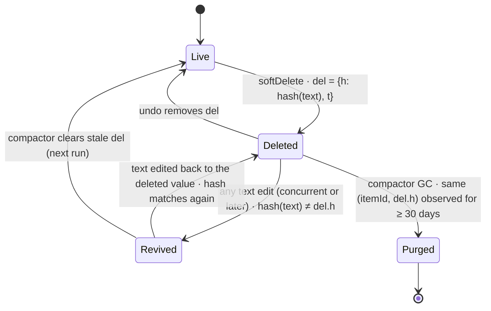
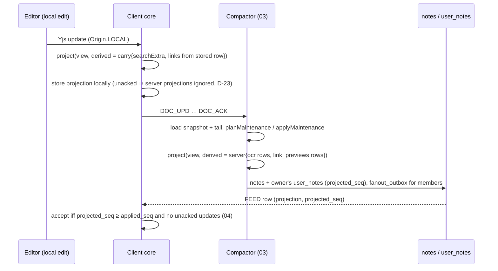

# 01 · Domain model

*Aligned with spine v1.3.*

*Detail document 1 of 16 · elaborates spine v1.3 (2026-10-04; first written against v1.1) · Status: draft for review*

**Revision 2 (spine v1.3).** Applies the v1.2 changes that resolved this document's spine issues (C-01, C-02, C-36 to C-49, C-53) and the editor-cluster changes that touch the domain rules (C-60, C-62, C-63, C-64, C-66, C-70, C-79), plus the v1.3 changes C-205 (reminder settings keys), C-211 (HLCs minted by native code), C-213 (intent IDs), C-219 (`reproject` and the empty refresh append), C-241, C-243, C-245 and C-246. It also adds what the consumer docs assume from this one: `NoteBytes`, `copySeed`, `contentUrls`, `searchFields`, `projectionEquals`, the shared validators and `SETTING_SCHEMAS`, and the ID and HLC helper names 02, 04 and 12 use. Behavior changes cite their C-id inline. §21 lists the disposition of every spine issue this document raised; §22 lists cross-doc issues.

## 1. Purpose and scope

This document specifies the pure, platform-free domain layer shared by every client and the server: the `packages/domain` and `packages/note-model` packages (D-02). An engineer should be able to implement both packages, and their golden and property test suites, from this document alone.

It covers:

- entity and aggregate types, with the shared vs per-user split (spine §4.1, §4.2, INV-8);
- ID formats, minting and validation (`domain/ids`, D-30, X-04);
- the hybrid logical clock (`domain/hlc`, D-16, INV-15);
- ordering keys and `keyBetweenSafe` (`domain/order`, spine §4.6);
- limits (`domain/limits`, P-05, P-12);
- the NoteDoc v1 Yjs layout, its accessors and mutation primitives, the byte-level helpers (`NoteBytes`) and the copy seed, and the ProseMirror schema v1 registry (`note-model`, spine §4.3, D-13, INV-9 inputs);
- render-time normalization, edit-wins delete and soft conversion (spine §4.3 rules 1–8, INV-11, P-19);
- server maintenance planning that the compactor executes, and the projection-refresh comparison behind `reproject` runs (INV-10, D-24, C-219);
- the Projector: title, preview JSON, facets, `search_text`, checklist summary, `doc_schema`, `over_limit`, and the content-URL extraction that link unfurling shares (D-23);
- the reminder model, recurrence evaluator and occurrence keys (`domain/recurrence`, `domain/time`, P-08, P-10, X-03);
- the golden-file and property test plan (X-13).

### Out of scope

| Topic | Owner |
|---|---|
| Wire frames, op catalogue encoding, feed row shapes | `02-sync-protocol.md` |
| Group commit, compactor scheduling, compare-and-append, `reproject` runs, fan-out relay, `compact_due` handling and its reason bits | `03-sync-server.md` (it calls the maintenance planner, `projectionEquals` and the Projector defined here) |
| Local SQLite schema, DocStore residency, projection acceptance rule implementation, LiveQuery, inbox drain | `04-client-core.md` |
| TipTap extensions, EditorSurface, DocPort, ChecklistController and TextBinding APIs, undo model (§4.3 rule 8), INV-9 shape rules (`malformed`), `isMaterializable` and `seedNewDoc` | `05-editor.md` (builds on the primitives and rules here; its code lives in `packages/note-model/src/editing/`) |
| Authorization predicates; the Make a copy algorithm (`copySeed` is normative in 08 §13.2 and implemented here, §9.7) | `08-sharing-and-authz.md` |
| Reminder planner, coverage, ringer election, push payloads, semantics of the `reminders.*` settings keys | `09-reminders-and-push.md` (consumes `recurrence.*`) |
| Attachment bytes, OCR, link unfurling, preview images, the CSAM serving gate | `10-media.md` (consumes `DerivedInputs`, `contentUrls`) |
| FTS table schema, tokenizer, ranking, the search query code in `packages/domain/src/search/` | `11-search.md` (consumes `search_text`, `searchFields` and facets) |
| Full DDL, `shard_map`, SQL helper deployment | `13-data-platform.md` (consumes `ids.*` and the SQL helpers in §5.6) |

## 2. Spine references

| Spine item | Where elaborated |
|---|---|
| §4.1 Entities and aggregates | §4 |
| §4.2 Shared vs per-user matrix (including the `reminders.*` settings, C-205) | §4.2, §4.4, §4.5 |
| §4.3 NoteDoc v1, ProseMirror schema v1, rules 1–8 | §9–§13 (rule 8, undo: §8.3 and 05) |
| §4.4 `note_docs.gc_meta`, `reminders.snooze_of`, `notes.over_limit`, `compact_due` `reproject` | §12.4, §16.1, §8.3, §14.4 |
| §4.5 ID format | §5 |
| §4.6 Ordering and HLC | §6, §7 |
| §5.9 Compaction steps 1–4 (compare-and-append, projection refresh) | §14 |
| §5.10 Doc schema (`meta.lv` raise timing, reserved constructs) | §9.5, §10.2 |
| INV-3 Idempotent, order-safe (equality of replicas, C-245) | §17.4 |
| INV-8 Per-user state never enters a doc | §9.2, §9.5 |
| INV-9 Schema gate (registry and structural check inputs; shapes are 05's) | §10.3 |
| INV-10 Single writer for server-origin doc changes | §14 |
| INV-11 Deterministic render-time normalization | §11 |
| INV-15 HLC hygiene | §6 |
| D-13 Yjs 13.6, one doc per note, fresh clientIDs | §9.1, §5.5 |
| D-16 Per-field HLC LWW | §6.3, §6.4, §4.5 |
| D-23 Projections | §15 |
| D-24 Compactor jobs | §14 |
| D-30 Logical shards in IDs | §5 |
| D-48 Every INV and P item maps to an executable property (C-243) | §17.5 |
| P-04 50-person cap | §8.1 |
| P-05 Labels | §4.2, §8.2 |
| P-06 Per-user pin, archive, color, order | §4.5, §7.4 |
| P-08 Reminder time zone | §16.2 |
| P-09 Reminder settings carriers (`reminders.browserAlerts`, C-205) | §4.4 |
| P-10 Recurrence | §16 |
| P-12 Note limits | §8.1, §8.3, §15.6 |
| P-19 Checklist semantics | §11, §12, §13 |
| P-24 Make a copy (seed) | §9.7 |
| P-30 Takeout import IDs | §5.3 |
| X-03 Time (server-observed maintenance ages; no faked `now()`, C-246) | §6, §12.4, §16, §17.1 |
| X-04 IDs | §5 |
| X-13 Determinism and shared code | §3.2, §17 |
| X-18 i18n (NFC, ICU) | §8.2, §15.2 |
| X-19 Layering | §3.1 |
| X-20 Content-data hygiene | §9.2 |

## 3. Package layout

### 3.1 Modules

Both packages are pure TypeScript. They import nothing from the DOM, React Native or Node built-ins (X-19). Platform services (randomness, hashing, wall clock) are injected through the interfaces in §3.3.

```
packages/domain/src/
  ids.ts            shard-tagged UUIDv7, plain UUIDv7, UUIDv5, derived v7 IDs, import IDs, nanoid items; bindIds
  hlc.ts            HLC encode/decode/tick/merge/clamp/compare, install-nonce node
  order.ts          ordering keys, keyBetweenSafe, comparators, rebalance
  limits.ts         every numeric limit, units, checkers
  entities.ts       entity types and enums
  schemas.ts        zod 4 schemas for every entity and op argument (strict on server, passthrough on client, D-15);
                    SETTING_SCHEMAS and the shared validators (§4.4, §4.6)
  overlay.ts        per-user overlay intents and effective-overlay normalization (P-06)
  labels.ts         label name normalization and validation (P-05)
  text.ts           NFC, truncation, cleanLine, URL detection, textHash
  time.ts           Clock, Temporal wrappers, wall-time <-> instant, presets (X-03)
  recurrence.ts     RRULE subset parse/serialize, evaluator, occurrence keys (P-10)
  search/           OWNED BY 11: query parser and compilers, script tables, folding, highlight, label matching
packages/note-model/src/
  schema-v1.ts      NoteDoc v1 root/key allowlist; ProseMirror schema spec; schema registry
  doc.ts            NoteDoc accessors (read) and primitives (write); transaction origins
  bytes.ts          NoteBytes: byte-level update helpers, EMPTY_UPDATE (§9.6)
  copy.ts           copySeed (08 §13.2 algorithm, §9.7)
  structural.ts     decoded-update and whole-doc structural scanners (INV-9 inputs)
  normalize.ts      render model for lists and text (rules 1, 2, 3, 4, 5, 7)
  conversion.ts     soft conversion, "Convert remaining" (rule 4)
  maintenance.ts    compactor plan + apply (INV-10): GC, stale del, rebalance, conversion cleanup and dedupe, migrations;
                    projectionEquals for reproject runs (§14.4)
  projector.ts      Projector (D-23), contentUrls, searchFields
  editing/          OWNED BY 05: ChecklistController, TextBinding, session undo, materialize (isMaterializable, seedNewDoc)
  golden/           corpus and expected outputs (§17)
```

`note-model` is the **only** package that imports `yjs` (D-13). Every other package touches docs through the accessors in §9.4, through `NoteBytes` (§9.6) or through raw `Uint8Array` updates. The one exception is 05's `@keep/editor/port`, which receives the raw `Y.Doc` from `NoteDocHandle.ydoc` (§9.4) to run its gate and bindings. The `search/` and `editing/` modules live in these packages but are owned by 11 and 05; they obey §3.2 and the layering rule like every other module here.

### 3.2 Determinism rules (X-13)

Every function in these packages that contributes to shared state, rendering or projection obeys:

1. No `Date.now()`, `Math.random()` or `crypto` calls. Time and randomness arrive through `Clock` and `Rng` parameters.
2. No locale-sensitive operations: no `localeCompare`, no `Intl.*` except in `time.ts` through `temporal-polyfill`, and no `toLocaleLowerCase`. String comparison is by UTF-16 code unit (`<`, `>`), which equals byte order for the ASCII keys and IDs we compare.
3. Map and object iteration never decides output order. Outputs are sorted explicitly.
4. JSON output is produced by `canonicalJson()` (keys in the declared order of the TypeScript type, no whitespace, numbers as integers).
5. Unicode handling uses only regex property escapes that are in the golden test matrix for V8, JavaScriptCore and Hermes (§17.3).

### 3.3 Injected platform services

```ts
// packages/domain/src/platform.ts
export interface Rng {
  /** Cryptographically secure random bytes. */
  bytes(n: number): Uint8Array;
}
export interface Hasher {
  /** Synchronous SHA-256 (pure-JS implementation, e.g. @noble/hashes; version pinned in M0). */
  sha256(data: Uint8Array): Uint8Array;
  /** Synchronous SHA-1, used only for UUIDv5 and hiddenLinks keys. */
  sha1(data: Uint8Array): Uint8Array;
}
export interface Clock {
  /** Device wall clock, ms since epoch. May be wrong by any amount. */
  wallMs(): number;
  /**
   * Device wall clock corrected by the last known server offset
   * (WELCOME.serverTime + RTT/2 - local receive time). Equals wallMs() until a WELCOME has been seen.
   * On the server, equals wallMs().
   */
  correctedMs(): number;
}
```

Hashing is synchronous because render-time normalization (§11) and the Projector must run inside a Yjs observer or a React render without awaiting. WebCrypto's `subtle.digest` is asynchronous and is therefore not used here.

### 3.4 Interfaces owned and consumed

**Owned** (this document is the single source; consumers implement against these definitions):

| Interface | Section | Consumers |
|---|---|---|
| `ids.*` (minting, parsing, `validateNoteCreate`, import, label, UUIDv5 and derived IDs, `bindIds`) and the SQL helpers `ops.keep_shard_of`, `ops.keep_is_v7` | §5.2–§5.6 | 03, 04, 07, 08, 12, 13 |
| `hlc.*` (`encode`, `decode`, `compare`, `merge`, `clamp`, `HlcClock`, `nodeFromInstallNonce`), `lwwDecide`, `opStatus`, `feedOverPending` | §6 | 02, 03, 04, 06, 07, 12 |
| `keyBetweenSafe`, `compareKeyed`, `rebalance`, placement rules | §7 | 03, 04, 05, 06, 07 |
| `LIMITS`, `OverLimit`, `growthAllowed`, `undoGrowthAllowed`, label-name functions | §8 | 03, 05, 08, 10 |
| Entity types, settings catalogue and `SETTING_SCHEMAS`, shared validators, overlay intents, `effectiveOverlay` | §4 | 02, 04, 06, 07, 09, 11 |
| NoteDoc v1 layout and allowlists; `NoteDocView`, `NoteDocHandle`, `NoteDocWriter`; `Origin`; `NoteBytes`; `copySeed` | §9 | 04, 05, 08 |
| `PM_SCHEMA_V1`, `REGISTRY_V1`, `scanDoc`, `scanIntegrated`, `gateDecision` | §10 | 04, 05, 16 |
| `normalize` and `NoteRender` | §11 | 04, 05, 06, 07 |
| `textHash`, `GcSeen`, `parseGcSeen` | §12 | 03, 13 |
| `convertToList`, `convertToText`, "Convert remaining" | §13 | 05 |
| `planMaintenance`, `applyMaintenance`, `Migration`, `projectionEquals` | §14 | 03 |
| `project`, `Projection`, `PreviewV1`, `Facet`, `splitSearchText`, `searchFields`, `contentUrls`, `cardProjection` | §15 | 03, 04, 06, 07, 10, 11, 15 |
| `ReminderSpec`, `recurrence.*` (including `next()`), `occKey`, presets | §16 | 09, 04, 07 |

**Consumed** (minimal assumptions):

| Owner | Assumption |
|---|---|
| 02 sync-protocol | `ACK` results carry `ok`/`stale` per op with the stored HLC; `ID_CONFLICT` can carry a `reason`; `INVALID` exists for malformed op arguments. HLC fields are the 21-char strings of §6.1 |
| 03 sync-server | The compactor calls `planMaintenance`/`applyMaintenance` under its advisory lock, appends the returned update through the normal append path **with compare-and-append on the `content_seq` C it read** (C-02), re-plans from a fresh read when the append reports `seq_moved`, persists the plan's `GcSeen` in `note_docs.gc_meta` with the snapshot in one transaction (C-01), and calls `project()` with `DerivedInputs{source: 'server'}`. On a `reproject` run (C-219) it compares with `projectionEquals` and appends `NoteBytes.EMPTY_UPDATE` when §14.4 says so. 03 owns the `compact_due` reason bits; `MaintenancePlan.reasons` mirrors them (§14.1). `note.create` calls `validateNoteCreate`. A server job runs the grid rebalance of §7.3 |
| 04 client-core | Stores the full `searchText` (with U+001E) and `preview` per note, and re-derives with `DerivedInputs{source: 'carry'}`. Accepts a server projection only under D-23's rule (no unacked `local` rows and `projected_seq ≥ proj_seq`, C-53). Implements the INV-9 gate with §10.3 and 05's shape rules. Re-mints on `ID_CONFLICT` (§5.4). Supplies `Clock.correctedMs()` from `WELCOME.serverTime`. Persists `sync_meta.hlc` in each mutation transaction and merges HLCs at the points in §6.3 |
| 05 editor | Builds TipTap extensions from `PM_SCHEMA_V1`; ChecklistController writes only through `NoteDocWriter`; session undo tracks only the session's own origins (categories `Origin.LOCAL` and `Origin.LOCAL_CONVERT`) and follows §4.3 rule 8 (C-62); editors apply `growthAllowed` and `undoGrowthAllowed`; owns the INV-9 shape rules (C-60), `isMaterializable` and `seedNewDoc` |
| 08 sharing-and-authz | Checks `noteLink` targets before rendering a chip; enforces `MEMBERS_MAX`; adds the sharer chip to pending cards; specifies the `copySeed` algorithm (08 §13.2) |
| 09 reminders-and-push | Owns the claim cursor `firedThrough`, the semantics of the `reminders.*` settings keys (including the home zone), and suspension on trash; persists `snooze_of` (C-46) |
| 10 media | Attachment doc entries carry the §9.1 fields; OCR text is available per attachment, and `link_previews` rows (with the unsafe flag and the preview image ID) for `DerivedInputs`; every derived write sets the `reproject` reason (C-219) |
| 11 search | Splits `search_text` with `splitSearchText` or `searchFields`; indexes the viewer's label names separately; maps Types filters to §15.6 facets |
| 12 identity-and-devices | Better Auth's ID generator calls `ids.mintShardTagged` (bound, §5.2) with `pickUserShard`; `install_nonce` is available to derive the HLC node |
| 13 data-platform | DDL has `note_docs.gc_meta jsonb` holding `GcSeen` (C-01), `reminders.snooze_of` (C-46), the CHECK constraints of §5.6, `COLLATE "C"` on every order-key column, and `facets`/`over_limit` as `int4` (C-42) |

## 4. Entities and aggregates

### 4.1 Aggregate map

| Aggregate | Root | Members | Consistency boundary | Home shard |
|---|---|---|---|---|
| Note | `Note` (header in `notes` + lock row in `note_log_state`) | `NoteDoc`, `NoteMember`, `Attachment`, `LinkPreview` | One `note_log_state` lock row (D-18, INV-5) | Owner's |
| UserNote | `UserNote` (projection copy + overlay) | `NoteLabel` rows for that note, `Reminder` for that note | One `user_notes` row; per-user ops read it `FOR SHARE` (§5.3) | Member's |
| Label set | `Label` (per user) | — | Per-user `usn` | User's |
| Reminder | `Reminder` (per user × note) | `ReminderFire`, `ReminderCoverage` | `(user, note)` | User's |
| Account | `Account` | `Device`, `UserSettings`, `Contact`, `Block` | Per-user `usn` | User's |

### 4.2 Core types

```ts
// packages/domain/src/entities.ts
declare const brand: unique symbol;
type Brand<T, B> = T & { readonly [brand]: B };

export type UserId = Brand<string, 'UserId'>;        // shard-tagged UUIDv7, lowercase canonical form
export type NoteId = Brand<string, 'NoteId'>;        // shard-tagged UUIDv7
export type LabelId = Brand<string, 'LabelId'>;      // UUIDv5 or UUIDv7 fallback
export type AttachmentId = Brand<string, 'AttachmentId'>; // plain UUIDv7
export type DeviceId = Brand<string, 'DeviceId'>;    // plain UUIDv7
export type ItemId = Brand<string, 'ItemId'>;        // nanoid(12), doc-local
export type Hlc = Brand<string, 'Hlc'>;              // 21 chars (§6)
export type OrderKey = Brand<string, 'OrderKey'>;    // fractional key (§7)
export type OccKey = Brand<string, 'OccKey'>;        // r:{noteId}:{localWall}[#s{n}] (§16.4)
export type LogicalShard = number;                   // 0..4095

export type NoteKind = 'text' | 'list';
export type NoteClass = 'standard';                  // 'locked' reserved (A-10)
export type Role = 'owner' | 'writer';
export type MemberState = 'active' | 'pending_accept';
export type InviteState = 'accepted' | 'pending';
export type RemovedReason =
  'revoked' | 'left' | 'purged' | 'account_deleted' | 'declined' | 'restore_lost';   // INV-13

export const COLOR_TOKENS = ['default', 'red', 'orange', 'yellow', 'green', 'teal', 'blue',
  'darkblue', 'purple', 'pink', 'brown', 'gray'] as const;                         // 12 (D-07)
export type ColorToken = typeof COLOR_TOKENS[number];

/** Additive enum; asset designs live in ui-tokens. Unknown values render as 'none' (passthrough clients). */
export const BACKGROUND_TOKENS = ['none', 'groceries', 'food', 'music', 'recipes', 'notes',
  'places', 'travel', 'video', 'celebration'] as const;
export type BackgroundToken = typeof BACKGROUND_TOKENS[number];

/** Shared note header (server `notes` + `note_log_state`; client `note` row shared part). */
export interface NoteHeader {
  id: NoteId;
  ownerId: UserId;
  kind: NoteKind;                 // mirrors doc meta.kind at last projection
  class: NoteClass;
  createdAt: number;              // ms UTC; ids.timestampOf(id) or import createdTimestamp
  contentEditedAt: number | null; // server time of last append (P-17)
  trash: TrashRegister;
  contentSeq: number;             // INV-6
  projectedSeq: number;
  docSchema: number;              // derived from content (§15.6), never from meta.lv
  crdtFormat: 1;                  // Yjs 13 update v1 (D-13)
  overLimit: number;              // OverLimit bitmask (§8.3)
  memberEpoch: number;
}

/** HLC register, owner-only writes (§5.3 note.setTrashed, P-03). */
export interface TrashRegister {
  trashed: boolean;
  hlc: Hlc | null;                // null = never trashed
  trashedAt: number | null;       // server clock (X-03)
  purgeAfter: number | null;      // trashedAt + 7 d
  purgedAt: number | null;        // terminal (INV-13)
}

/** Per-user overlay on a UserNote (§4.2 "Per-user" rows). */
export interface NoteOverlay {
  color: ColorToken;
  background: BackgroundToken;
  pinned: boolean;
  archived: boolean;
  sortKey: OrderKey;
}
export type OverlayField = keyof NoteOverlay;
export type FieldHlcs<F extends string> = Partial<Record<F, Hlc>>;

export interface Label {
  id: LabelId;
  userId: UserId;
  name: string;                   // display form, NFC, trimmed (§8.2)
  nameKey: string;                // labelNameKey(name)
  mergedInto: LabelId | null;
  deleted: boolean;
  fieldHlc: FieldHlcs<'name' | 'deleted'>;
}

export interface NoteLabel {
  userId: UserId; noteId: NoteId; labelId: LabelId;
  present: boolean; hlc: Hlc;     // pair LWW
}

export interface UserSetting<K extends SettingKey = SettingKey> {
  key: K; value: SettingValue[K]; hlc: Hlc;
}
```

The reminder types are in §16.1. Attachment doc entries are in §9.1.

### 4.3 Aggregate invariants

These are domain-level checks. Each is enforced at the listed point and is a property in §17.

| ID | Invariant | Enforced by |
|---|---|---|
| DM-1 | `Note.ownerId` and `Note.id` are immutable. `ids.shardOf(note.id) == ids.shardOf(owner.id)`. | `ids.validateNoteCreate` on the server (§5.4); type-level immutability |
| DM-2 | A note's trash register changes only through `note.setTrashed`, `note.deleteForever` and `trash.empty` from the owner. | `authz` (08); op catalogue (02) |
| DM-3 | `purgedAt != null` is terminal: no field of the note, its doc or any member row changes afterwards except deletion. | INV-13 checks (03) |
| DM-4 | Per-user fields (overlay, labels, reminder, settings) never appear in a NoteDoc, and a NoteDoc contains no user ID, email or name. | §9.2 key allowlist and write guard (INV-8, X-20) |
| DM-5 | At most 50 live labels per user; label `nameKey` is unique among live, unmerged labels. | Client label editor; server `LIMIT_LABELS`, unique index, merge (§8.2) |
| DM-6 | At most one reminder per (user, note). | Primary key `(shard_id, user_id, note_id)` |
| DM-7 | `pinned ∧ archived` is never the effective state. | `effectiveOverlay` (§4.5) |
| DM-8 | Checklist depth ≤ 1 in every rendered note. | Render normalization (§11.2) |
| DM-9 | The first visible item is never indented by a local command. | Indent primitive precondition (§9.5) |

### 4.4 Per-user settings catalogue

Settings are HLC-LWW per key (§4.2 last rows). The catalogue is closed; unknown keys are kept and ignored by clients (passthrough) and rejected as `INVALID` by the server.

```ts
export interface SettingValue {
  'list.checkedToBottom': boolean;                  // default true
  'list.newItemPlacement': 'top' | 'bottom';         // default 'bottom'
  'links.richPreviews': boolean;                    // default true
  'reminders.presetTimes': { morning: HHmm; afternoon: HHmm; evening: HHmm }; // 08:00, 13:00, 18:00 (P-10)
  'notifications.hideContent': boolean;             // default false (P-28)
  'reminders.alertAllDevices': boolean;             // default false (P-09)
  'widgets.showContent': boolean;                   // default false (X-20)
  'grid.newNotePlacement': 'top';                   // reserved; only 'top' in v1 (§7.4)
}
export type SettingKey = keyof SettingValue;
export type HHmm = `${number}${number}:${number}${number}`;   // validated by regex ^([01]\d|2[0-3]):[0-5]\d$
```

Per-device UI state (grid/list view, sort mode, checked-section collapsed, widget config, merge-review dismissals) is not a setting and never syncs (§4.2).

### 4.5 Overlay intents and the effective overlay (P-06)

Overlay fields merge independently by field HLC (D-16). Two of them, `pinned` and `archived`, are coupled by P-06: pinning an archived note unarchives it, and archiving clears the pin. Independent per-field LWW could produce `pinned ∧ archived` when two devices act concurrently (SI-14). Two rules prevent that:

1. **Coupled writes.** Every pin, unpin, archive and unarchive intent writes **both** `pinned` and `archived` with the **same** HLC. Whichever intent has the higher HLC then wins both fields.
2. **Effective overlay.** Rows produced by older builds, imports or server repairs may still carry `pinned ∧ archived`. Rendering resolves it deterministically: the field with the higher HLC wins and the other reads `false`. Normalization is render-time only; it is never written back.

```ts
// packages/domain/src/overlay.ts
export type OverlayIntent =
  | { t: 'pin'; on: boolean }
  | { t: 'archive'; on: boolean }
  | { t: 'color'; color: ColorToken }
  | { t: 'background'; background: BackgroundToken }
  | { t: 'move'; sortKey: OrderKey };

export interface OverlayWrite { fields: Partial<NoteOverlay>; hlc: Hlc }

/**
 * Pure: computes the field writes for one intent. `ctx.topKey(section)` returns the key that places a
 * note first in that section (§7.4). The caller ticks the HLC once per intent and passes it in.
 */
export function overlayWrite(
  current: NoteOverlay, intent: OverlayIntent, hlc: Hlc,
  ctx: { topKey(section: 'pinned' | 'others'): OrderKey },
): OverlayWrite {
  switch (intent.t) {
    case 'pin':
      return { hlc, fields: intent.on
        ? { pinned: true, archived: false, sortKey: ctx.topKey('pinned') }
        : { pinned: false, archived: false, sortKey: ctx.topKey('others') } };
    case 'archive':
      return { hlc, fields: intent.on
        ? { archived: true, pinned: false }
        : { archived: false, pinned: false, sortKey: ctx.topKey('others') } };   // §7.4 unarchive → top
    case 'color':      return { hlc, fields: { color: intent.color } };
    case 'background': return { hlc, fields: { background: intent.background } };
    case 'move':       return { hlc, fields: { sortKey: intent.sortKey } };
  }
}

export function effectiveOverlay(o: NoteOverlay, h: FieldHlcs<OverlayField>): NoteOverlay {
  if (!(o.pinned && o.archived)) return o;
  const hp = h.pinned ?? '', ha = h.archived ?? '';
  return hp > ha ? { ...o, archived: false } : { ...o, pinned: false };   // tie impossible: same HLC ⇒ coupled write
}
```

Multi-select bulk actions produce one intent per note, each with its own HLC tick (D-17 collapses field writes per note in the outbox).

Moving to the top of a section on pin and unarchive follows Keep's visible behavior; unarchive-to-top is **UNVERIFIED** and is on the Q-01 checklist. Restoring from Trash writes no overlay field, so the note keeps its key.

## 5. IDs (`domain/ids`)

### 5.1 Layout and extraction

All IDs are RFC 9562 UUIDv7 in **lowercase canonical** string form (36 chars). Shard-tagged IDs (users, notes) put the 12-bit logical shard in `rand_a` (§4.5 of the spine, D-30):

| Bytes | Bits | Field | Extraction |
|---|---|---|---|
| `b[0..5]` | 48 | `unix_ts_ms` | big-endian uint48 |
| `b[6]` high nibble | 4 | version `0111` | `b[6] >> 4 === 7` |
| `b[6]` low nibble + `b[7]` | 12 | logical shard | `((b[6] & 0x0f) << 8) \| b[7]` |
| `b[8]` top 2 bits | 2 | variant `10` | `(b[8] & 0xc0) === 0x80` |
| `b[8]` low 6 bits + `b[9..15]` | 62 | `rand_b` (CSPRNG) | — |

In the string form `tttttttt-tttt-7SSS-Vrrr-rrrrrrrrrrrr`, the shard is exactly the three hex digits at string offsets 15–17, so `shardOf` needs no byte decoding:

```ts
export const UUID_V7_RE = /^[0-9a-f]{8}-[0-9a-f]{4}-7[0-9a-f]{3}-[89ab][0-9a-f]{3}-[0-9a-f]{12}$/;
export function shardOf(id: string): LogicalShard { return parseInt(id.slice(15, 18), 16); }
export function timestampOf(id: string): number {
  return parseInt(id.slice(0, 8) + id.slice(9, 13), 16);   // 48 bits fits a double exactly
}
```

Shard ranges and cells:

```ts
export const SHARD_BITS = 12;
export const RESIDENCY_RANGES = { us: [0, 511], eu: [512, 1023] } as const;   // 1024–4095 reserved
export type Residency = keyof typeof RESIDENCY_RANGES;
export function cellOfShard(s: LogicalShard): 0 | 1 {
  if (s >= 0 && s <= 511) return 0;
  if (s >= 512 && s <= 1023) return 1;
  throw new DomainError('INVALID', 'shard_reserved');
}
export const TS_MIN_MS = Date.UTC(2010, 0, 1);   // 1262304000000; below it a timestamp is a broken clock
export const TS_FUTURE_SLACK_MS = 24 * 3600_000; // note.create bound (spine §5.3)
```

### 5.2 Minting API

```ts
// packages/domain/src/ids.ts  (owned interface → 03, 04, 12, 13)
export interface Ids {
  /** Shard-tagged UUIDv7 for a new user. Server only (Better Auth ID generator, 12). */
  newUserId(shard: LogicalShard, clock: Clock, rng: Rng): UserId;
  /** Weighted random choice among active shards of the residency range (weights = cluster headroom). */
  pickUserShard(candidates: ReadonlyArray<{ shard: LogicalShard; weight: number }>, residency: Residency, rng: Rng): LogicalShard;
  /** Client-minted note ID. Shard = shardOf(ownerId); timestamp = clock.correctedMs(). Offline-safe. */
  newNoteId(ownerId: UserId, clock: Clock, rng: Rng): NoteId;
  /** Deterministic Takeout import ID (§5.3). */
  importNoteId(a: { userId: UserId; createdMs: number | null; takeoutPath: string; generation: number }, h: Hasher): NoteId;
  /** UUIDv5(userId, 'label:' + labelNameKey(name)) (§5.4). */
  labelId(userId: UserId, name: string, h: Hasher): LabelId;
  /** Plain UUIDv7 (random rand_a): attachment, device, upload, batch, ccid, invite. */
  newPlainId(clock: Clock, rng: Rng): string;
  /** nanoid(12) over the URL-safe alphabet A–Z a–z 0–9 _ - (72 bits). */
  newItemId(rng: Rng): ItemId;
  /** Uniform random integer in [1, 2^53 - 1] (§5.5). */
  newYjsClientId(rng: Rng): number;
  parse(id: string): ParsedId | null;                 // null when not canonical lowercase UUIDv7
  shardOf(id: string): LogicalShard;
  timestampOf(id: string): number;
  /** Server-side create validation (§5.4). */
  validateNoteCreate(id: string, actor: { userId: UserId }, serverNowMs: number): IdCheck;
}
export interface ParsedId { tsMs: number; shard: LogicalShard; }
export type IdCheck =
  | { ok: true }
  | { ok: false; code: 'INVALID'; reason: 'format' | 'shard' }
  | { ok: false; code: 'ID_CONFLICT'; reason: 'ts_future' | 'ts_past' };
```

Minting algorithm (all shard-tagged and plain IDs):

```ts
function mintV7(tsMs: number, randA12: number | null, rng: Rng): string {
  const ts = Math.floor(tsMs);
  if (!(ts >= 0 && ts < 2 ** 48)) throw new DomainError('INVALID', 'ts_range');
  const b = rng.bytes(16);                          // fill everything, then overwrite fixed fields
  for (let i = 5, t = ts; i >= 0; i--, t = Math.floor(t / 256)) b[i] = t % 256;
  if (randA12 !== null) { b[6] = 0x70 | (randA12 >> 8); b[7] = randA12 & 0xff; }
  else { b[6] = 0x70 | (b[6] & 0x0f); }             // plain: random rand_a
  b[8] = 0x80 | (b[8] & 0x3f);
  return hexWithDashes(b);                          // lowercase
}
```

- **Clock source.** Note IDs use `clock.correctedMs()`, the device clock corrected by the last WELCOME offset, so a device with a badly wrong clock still mints plausible timestamps once it has connected once. The timestamp becomes `notes.created_at` (spine §4.2) and is display-only; nothing orders by it for correctness.
- **No intra-millisecond monotonicity.** IDs minted in the same millisecond sort randomly. Nothing depends on ID order except deterministic tie-breaks.
- `newPlainId` is used for `ccid` too (D-17); it carries no semantics beyond correlation.

### 5.3 Takeout import IDs (P-30)

```
tsMs    = floor(createdTimestampUsec / 1000), or TS_MIN_MS when absent or outside [TS_MIN_MS, serverNow + 24 h]
shard   = shardOf(userId)
digest  = SHA-256( utf8(userId) ‖ 0x00 ‖ utf8(NFC(takeoutPath)) ‖ (generation > 0 ? 0x00 ‖ utf8(String(generation)) : ε) )
rand_b  = first 62 bits of digest (digest bits 0..61 → UUID bits 66..127)
```

- `takeoutPath` is the entry's path inside the archive, `/`-separated, NFC (for example `Takeout/Keep/Groceries.json`).
- `generation = 0` reproduces the spine's formula exactly, so re-importing the same archive is idempotent (insert-if-absent).
- If the server answers `NOTE_PURGED` because the user previously purged that imported note, the importer retries that one entry with `generation + 1`, up to 3. Without this, a user who deleted an imported note forever could never import it again (Spine issue SI-9).

### 5.4 Validation on create (X-04)

`validateNoteCreate` runs on the owner shard inside the `note.create` transaction, before insert-if-absent (03):

| Check | Failure | Client action |
|---|---|---|
| `UUID_V7_RE` matches | `INVALID{format}` | Dead-letter list (spine §5.3); never produced by a correct client |
| `shardOf(id) == shardOf(actor.userId)` | `INVALID{shard}` | Same |
| `timestampOf(id) ≤ serverNow + 24 h` | `ID_CONFLICT{ts_future}` | Re-mint (below) |
| `timestampOf(id) ≥ TS_MIN_MS` | `ID_CONFLICT{ts_past}` | Re-mint |
| Insert-if-absent; existing row with a different owner | `ID_CONFLICT` (03) | Re-mint |
| ID in the deletion ledger | `NOTE_PURGED` (03) | Purge path (INV-12) |

Timestamp-bound failures use `ID_CONFLICT` so that they reach the client's existing re-mint path instead of stranding the note as "local only" (spine §5.3 leaves the code unspecified; SI-2). **Re-mint** is a local transaction in 04: mint a new `NoteId` with `clock.correctedMs()` and rewrite every local row keyed by the old ID (`note`, `doc`, `doc_update`, `outbox` including `blocked_on`, `note_label`, `reminder`, `attachment_local`, FTS). Yjs update bytes do not contain the doc guid, so doc bytes are reused unchanged. Nothing else was sent under the old ID, because content waits on the create ack (`blocked_on`, D-20).

### 5.5 Yjs clientIDs (D-13)

- Every `Y.Doc` instance gets `doc.clientID = ids.newYjsClientId(rng)` **before** any local write: the client on each load (fresh doc per load, D-11), the server per compactor or import run.
- 53 bits rather than Yjs's default `uint32`: a long-lived note accumulates one clientID per writing session. At 10^4 sessions the birthday probability of a 32-bit collision is about 1%, which across 10^8 notes means real corruption; at 53 bits it is about 5·10⁻⁹ per note.
- lib0's varuint codec supports integers up to 2^53 − 1. Whether every Yjs 13.6 code path does is **UNVERIFIED** and is added to M0 spike 7 (Q-DM-1). Fallback: `uint32` plus the Yjs built-in client-ID collision detection, with a metric.
- clientIDs are never persisted, logged with user context, or reused (spine §4.5).

### 5.6 SQL helpers (→ 13)

```sql
-- Deployed in every shard schema and in directory. IMMUTABLE so they can back CHECK constraints and indexes.
CREATE FUNCTION keep_shard_of(id uuid) RETURNS smallint
  LANGUAGE sql IMMUTABLE STRICT PARALLEL SAFE AS
$$ SELECT (((get_byte(uuid_send(id), 6) & 15) << 8) | get_byte(uuid_send(id), 7))::smallint $$;

CREATE FUNCTION keep_is_v7(id uuid) RETURNS boolean
  LANGUAGE sql IMMUTABLE STRICT PARALLEL SAFE AS
$$ SELECT uuid_extract_version(id) = 7 AND (get_byte(uuid_send(id), 8) & 192) = 128 $$;

-- Constraints 13 adds (shard-tagged columns never default to uuidv7(), X-04):
--   notes:       CHECK (keep_is_v7(id) AND shard_id = keep_shard_of(id) AND shard_id = keep_shard_of(owner_id))
--   users_sync:  CHECK (shard_id = keep_shard_of(user_id))
--   user_notes:  CHECK (shard_id = keep_shard_of(user_id) AND note_shard = keep_shard_of(note_id))
--   note_members:CHECK (user_shard = keep_shard_of(user_id))
-- created_at for client-minted notes: uuid_extract_timestamp(id) (PG 17+ supports v7).
```

A golden test runs the same 1,000 IDs through `shardOf`/`timestampOf` in TypeScript and through `keep_shard_of`/`uuid_extract_timestamp` in Postgres 18 and compares.

## 6. Hybrid logical clock (`domain/hlc`)

### 6.1 Encoding

21 chars, fixed width, lowercase base-36, lexicographically ordered (spine §4.6):

| Offset | Len | Field | Range |
|---|---|---|---|
| 0 | 9 | physical ms, `ms.toString(36).padStart(9,'0')` | 0 … 36⁹−1 (year 5188) |
| 9 | 4 | logical counter, `c.toString(36).padStart(4,'0')` | 0 … 1,679,615 |
| 13 | 8 | node | client: first char `0`–`r`; server: `s` + 7 chars; `t`–`z` reserved |

```ts
export const HLC_RE = /^[0-9a-z]{21}$/;
export const HLC_MAX_C = 36 ** 4 - 1;
export const HLC_CLAMP_AHEAD_MS = 60_000;            // INV-15
export interface HlcParts { ms: number; c: number; node: string }
export function encode(p: HlcParts): Hlc;
export function decode(h: string): HlcParts;          // throws DomainError('INVALID','hlc') on bad input
export function compare(a: Hlc, b: Hlc): -1 | 0 | 1;   // plain string comparison
```

### 6.2 Node IDs

- **Client:** `node = base36(u48(SHA-256("hlc-node:" + install_nonce)) mod (28 · 36⁷)).padStart(8,'0')`. The modulus keeps the first char in `0`–`r`. Because `install_nonce` lives in the local DB and changes on reinstall, restore or a fresh DB, a new install never reuses a node (INV-18, D-42).
- **Server:** `'s' + 7` random base-36 chars, generated at process start. Each `api`, `sync` and `worker` process has its own node.
- Node uniqueness is probabilistic (≈ 2.2·10¹² client values). A collision only matters if two nodes also tick the same `(ms, c)` for the same field, and the outcome is still deterministic.

### 6.3 Operations

```ts
export class HlcClock {
  constructor(private state: HlcParts, private readonly wall: () => number) {}

  /** Local event: every local write (overlay field, label, setting, reminder, trash, conversion `at`). */
  tick(): Hlc {
    const pt = Math.floor(this.wall());
    if (pt > this.state.ms) { this.state = { ...this.state, ms: pt, c: 0 }; }
    else if (this.state.c < HLC_MAX_C) { this.state = { ...this.state, c: this.state.c + 1 }; }
    else { this.state = { ...this.state, ms: this.state.ms + 1, c: 0 }; }   // counter overflow borrows 1 ms
    return encode(this.state);
  }

  /** Receive: never creates an event; the next tick() is strictly greater than everything merged. */
  merge(remote: Hlc): void {
    const r = decode(remote);
    if (r.ms > this.state.ms || (r.ms === this.state.ms && r.c > this.state.c)) {
      this.state = { ...this.state, ms: r.ms, c: r.c };
    }
  }

  snapshot(): HlcParts { return this.state; }
}

/** Server only: INV-15 clamp. Preserves counter and node so clamped values stay distinct per node. */
export function clampIncoming(h: Hlc, serverNowMs: number): { hlc: Hlc; clamped: boolean } {
  const p = decode(h); const limit = serverNowMs + HLC_CLAMP_AHEAD_MS;
  return p.ms <= limit ? { hlc: h, clamped: false } : { hlc: encode({ ...p, ms: limit }), clamped: true };
}
```

**Merge points.** The client merges:

1. `WELCOME.serverHlc` (spine D-16);
2. every `ACK.results[].hlc` (spine D-16);
3. every HLC inside an adopted `stale` row;
4. the maximum HLC of each applied `FEED` page (all `field_hlc` values, `trash_hlc`, `note_labels.hlc`, settings `hlc`).

Points 3 and 4 add to the spine's list: without them a device whose last ACK predates another device's write can lose a later write for no reason (SI-4). They never move the clock beyond `serverNow + 60 s`, because every stored HLC was clamped.

The server keeps one `HlcClock` per process, ticks it for server-originated writes (rebalance, label merge, cascades, `meta.mig` values) and merges each incoming HLC **after** clamping.

### 6.4 LWW decision

```ts
export type LwwOutcome = 'apply' | 'already' | 'stale';
export function lwwDecide<T>(stored: { hlc: Hlc | null; value: T }, incoming: { hlc: Hlc; value: T },
                             eq: (a: T, b: T) => boolean): LwwOutcome {
  if (stored.hlc === null || incoming.hlc > stored.hlc) return 'apply';
  if (incoming.hlc === stored.hlc && eq(stored.value, incoming.value)) return 'already';   // idempotent replay (D-17)
  return 'stale';
}
/** Per op: 'ok' if no field is stale; otherwise 'stale' and the ACK carries the full current row. */
export function opStatus(outcomes: LwwOutcome[]): 'ok' | 'stale' {
  return outcomes.includes('stale') ? 'stale' : 'ok';
}
/** Client feed apply over a pending local edit (D-16 pending_mask). */
export function feedOverPending(localHlc: Hlc, incomingHlc: Hlc): boolean { return incomingHlc >= localHlc; }
```

When the server clamps, the ACK returns the clamped HLC; the client **replaces** its stored `field_hlc` with it, so a later feed comparison is not skewed by the unclamped local value.

### 6.5 Persistence and lifecycle

| Event | Client | Server |
|---|---|---|
| Start | `state = decode(sync_meta.hlc)` with `node` replaced by the current install node; if absent, `{ms: wall, c: 0}` | `{ms: wall, c: 0, node: 's'+random7}` |
| Local write | `tick()`; `sync_meta.hlc` written in the **same** SQLite transaction as the mutation and its outbox row (INV-1) | `tick()` per server-originated write |
| Fresh DB / reinstall / restored backup | New `install_nonce` → new node; state from wall (INV-18) | — |
| Wall clock jumps backwards | `ms` holds; counter advances; borrows 1 ms per 1,679,616 ticks | Same |

Metrics (X-01, no IDs in labels): `hlc_clamped_total{svc}`, `hlc_clamp_ahead_ms` (histogram of `p.ms − serverNow`), `hlc_counter_overflow_total{platform}`.

## 7. Ordering (`domain/order`)

### 7.1 Keys

- Library: `jittered-fractional-indexing` 1.0.1 over `fractional-indexing` 4.0.0 (spine §4.6). Their exact export names are pinned behind our wrapper in M0; nothing outside `domain/order` imports them.
- Digits are base-62 `0-9A-Za-z`. ASCII order equals byte order, so a key compares the same in JS (`<`), Postgres (`COLLATE "C"`) and SQLite (`BINARY`).
- Client-generated keys carry a random jitter suffix, so two devices inserting at the same spot offline almost never produce equal keys.
- Server rebalances and conversion sequences use **unjittered** keys (§7.5, §13.2), so a single writer is deterministic.

```ts
export const ORDER_KEY_MAX_LEN = 1024;           // sanity bound; beyond it a key is treated as invalid
export const GRID_KEY_REBALANCE_LEN = 48;        // spine §4.6
export const ITEM_KEY_REBALANCE_LEN = 64;        // spine §4.6 (items and attachments)
export interface Keyed { key: string; id: string }

/** Raw-string total order: key, then id. Works for invalid keys too, so rendering never depends on validity. */
export function compareKeyed(a: Keyed, b: Keyed): number {
  if (a.key !== b.key) return a.key < b.key ? -1 : 1;
  return a.id < b.id ? -1 : a.id > b.id ? 1 : 0;
}
/** A key is valid if fractional-indexing accepts it and its length is ≤ ORDER_KEY_MAX_LEN. */
export function isValidKey(k: unknown): k is OrderKey;
```

Order keys inside a doc are written by any member, so a buggy or hostile peer can store an invalid key. Invalid keys still **sort** by raw string. They are only **skipped as neighbours** when generating new keys, so generation never throws.

### 7.2 `keyBetweenSafe`

Equal neighbouring keys happen after concurrent offline inserts with identical (unjittered) keys, after conversions on two devices (§13.2), and after imports. `generateKeyBetween(k, k)` throws, and no key fits strictly between two equal keys. The helper therefore places the element just outside the tie group, on whichever side is closer to the requested position (spine §4.6).

```ts
/**
 * Returns a key that places an element at `index` of `sorted` (sorted by compareKeyed, NOT containing the moved
 * element): after sorted[index-1] and before sorted[index]. With ties, the result lands immediately before or
 * after the tie group, displaced by at most ⌈|G|/2⌉ positions. Never throws. Never calls gen(k, k).
 */
export function keyBetweenSafe(sorted: readonly Keyed[], index: number, rng: Rng, jitter = true): OrderKey {
  const n = sorted.length;
  const valid = (i: number) => i >= 0 && i < n && isValidKey(sorted[i].key);
  let lo = Math.min(index, n) - 1, hi = Math.max(index, 0);
  while (lo >= 0 && !valid(lo)) lo--;
  while (hi < n && !valid(hi)) hi++;
  const a = lo >= 0 ? sorted[lo].key : null;
  const b = hi < n ? sorted[hi].key : null;
  if (a === null || b === null || a < b) return gen(a, b, rng, jitter);

  // a === b === k (a > b is impossible: valid keys keep raw order). Find the tie group around the gap.
  const k = a;
  let gs = lo; while (gs - 1 >= 0 && sorted[gs - 1].key === k) gs--;
  let ge = hi; while (ge + 1 < n && sorted[ge + 1].key === k) ge++;
  const before = index - gs, after = ge + 1 - index;
  if (before <= after) {
    let p = gs - 1; while (p >= 0 && !valid(p)) p--;
    return gen(p >= 0 ? sorted[p].key : null, k, rng, jitter);     // strictly below k by maximality
  } else {
    let q = ge + 1; while (q < n && !valid(q)) q++;
    return gen(k, q < n ? sorted[q].key : null, rng, jitter);      // strictly above k by maximality
  }
}
/** gen(a, b): a < b or either null. Wraps the library; if the result exceeds ORDER_KEY_MAX_LEN, falls back to
 *  gen(a, null) when a is not null, else gen(null, b), and increments order_key_overlong_total. */
function gen(a: string | null, b: string | null, rng: Rng, jitter: boolean): OrderKey;

export const keyBefore = (first: Keyed | undefined, rng: Rng) => keyBetweenSafe(first ? [first] : [], 0, rng);
export const keyAfter  = (last: Keyed | undefined, rng: Rng) => keyBetweenSafe(last ? [last] : [], last ? 1 : 0, rng);
```

Properties (fast-check, §17.4): for any array of arbitrary strings (valid, invalid, equal) and any index, the function returns a valid key, never throws, and the result inserted into the array lands at a position within `⌈|G|/2⌉` of `index` (exactly `index` when there is no tie).

### 7.3 Rebalance

```ts
/** Single-writer rebalance: preserves the current compareKeyed order exactly. Unjittered, deterministic. */
export function rebalance(sorted: readonly Keyed[]): Map<string /*id*/, OrderKey>;   // generateNKeysBetween(null, null, n)
```

- **Grid** (per user, spine §4.6). When any of the user's `sort_key` values exceeds 48 chars, a server job takes **all** the user's `user_notes` rows (every state, including archived and trashed), sorts them by `(sort_key, note_id)`, assigns `rebalance()` keys, and writes them in one transaction. The HLC for all rows is one server `tick()` taken **after** `merge()` of every stored `field_hlc.sort_key`, so it beats every stored value. A concurrent client move with a lower HLC loses, which is cosmetic.
- **Items and attachments** (per note, compactor). When any `items[*].order` or `attachments[*].order` exceeds 64 chars, the maintenance plan (§14) rewrites **every** entry's key in that map, ordered by `(order, id)` over all entries (live and soft-deleted). Each sibling group is a subsequence of that global order, so relative order within every parent is preserved.

### 7.4 Grid placement rules (P-06)

One key space per user (`user_notes.sort_key`); Pinned and Others are filters (spine §4.6).

| Action | Key written | Notes |
|---|---|---|
| New note (P-23, on first content) | `keyBetweenSafe(othersSorted, 0)` | Top-left of Others, as in Keep |
| Pin | `keyBetweenSafe(pinnedSorted, 0)` (coupled write, §4.5) | Top of Pinned |
| Unpin | `keyBetweenSafe(othersSorted, 0)` | Top of Others |
| Unarchive | `keyBetweenSafe(othersSorted, 0)` | UNVERIFIED Keep behaviour (Q-01) |
| Archive, color, labels, reminder | none | — |
| Restore from Trash | none | Owner's trash op touches no overlay field |
| Drag / `Shift+J`/`Shift+K` | `keyBetweenSafe(sectionSortedWithoutMoved, targetIndex)` | Only within one section of a view whose order is `sort_key` (Notes, a label view, Archive). Dropping across the Pinned/Others boundary clamps to the section edge; pinning is a separate action |
| Sort by date created / modified (Android, M4) | none | Query-time sort; custom order kept |

`pinnedSorted` and `othersSorted` are the effective-overlay sections (§4.5) of non-trashed, non-archived notes, sorted by `compareKeyed` with `id = note_id`.

### 7.5 Item and attachment placement primitives

All operate on **canonical** sibling order: siblings with the same effective parent (§11.2) sorted by `compareKeyed` with `id = itemId`. Display order (checked-to-bottom) is never used to compute keys, except through the subsequence argument below.

| Primitive | Key |
|---|---|
| New item, placement `top` (inserting user's setting, rule 7) | `keyBetweenSafe(siblings, 0)` |
| New item, placement `bottom` | `keyBetweenSafe(siblings, siblings.length)` |
| Enter in the middle of item X | `keyBetweenSafe(siblings, indexOf(X) + 1)`; same parent as X |
| Indent X under P (P = previous visible top-level item) | `parent = P`, `order = keyBetweenSafe(childrenOf(P), childrenOf(P).length)` |
| Dedent child X of P | `parent = null`, `order = keyBetweenSafe(topLevel, indexOf(P) + 1)` (rule 7) |
| Move X between display neighbours U and V in one section | `keyBetweenSafe(sectionSubsequence, targetIndex)`. A display section is a subsequence of canonical order, so its keys are ascending and the result lands between U and V canonically too |
| New attachment | `keyBetweenSafe(attachmentsSorted, attachmentsSorted.length)` (append) |

## 8. Limits (`domain/limits`)

### 8.1 Constants

All text lengths are in **UTF-16 code units**, the unit of `string.length`, `Y.Text.length` and ProseMirror positions. That makes every check O(1) and identical on every engine. One emoji usually counts 2. The spine says "chars" without a unit (SI-7).

```ts
export const LIMITS = {
  TITLE_MAX: 999,                 // "< 1,000" (P-12)
  BODY_PLAIN_MAX: 19_999,         // body plain projection (§15.4) "< 20,000"
  ITEMS_LIVE_MAX: 999,            // live (visible) items "< 1,000"
  ITEM_TEXT_MAX: 999,
  ATTACHMENTS_MAX: 50,            // "≤ 50"
  DOC_BYTES_MAX: 2 * 1024 * 1024, // encoded full state "≤ 2 MB"
  LABELS_MAX: 50,                 // live, unmerged, per user (P-05)
  LABEL_NAME_MIN: 1, LABEL_NAME_MAX: 50,
  MEMBERS_MAX: 50,                // including owner and pending invites (P-04)
  PROJ_TITLE_MAX: 120,            // D-23
  PREVIEW_JSON_MAX_BYTES: 1_200,  // UTF-8 bytes of canonical JSON (D-23)
  SEARCH_CONTENT_MAX: 32_768,     // §15.5
  SEARCH_EXTRA_MAX: 16_384,       // §15.5
  CARD_TITLE_MAX: 60, CARD_PREVIEW_MAX: 140,   // pending shares (P-15)
  IMAGE_INPUT_MAX_BYTES: 10 * 1024 * 1024, IMAGE_INPUT_MAX_PIXELS: 25_000_000, IMAGE_MASTER_MAX_PX: 3_072, // P-13
  RRULE_SPAN_MAX_DAYS: 1_000, RRULE_COUNT_MAX: 1_000,   // P-10 (§16.3)
  SNOOZE_N_MAX: 999,              // keeps occ ≤ 64 bytes (§16.4)
} as const;
```

| Limit | Enforced where | When exceeded |
|---|---|---|
| Title, body, item text, item count, attachments, doc bytes | Editors and ChecklistController (05) through the growth gate below | Server accepts anyway (INV-4). Projector sets `overLimit` (§15.6). Editors refuse growth and show "This note is over the limit"; "Split note" from M4 (P-12) |
| Labels per user | Client label editor; server `label.upsert` | `LIMIT_LABELS` rejection; client removes the local label and shows a toast |
| Label name length, charset | `labels.validateName` on both sides | `INVALID` |
| Members | `share.invite` (08) | `SHARE_REFUSED` |
| Projection sizes | Projector | Deterministic truncation (§15) |
| Image input | UploadQueue (10) | Refused before upload |
| RRULE | `recurrence.parse` | Clamped at parse (§16.3); malformed → `INVALID` |

### 8.2 Label names (P-05)

```ts
/** Display form: NFC, whitespace runs collapsed to one U+0020, trimmed. */
export function labelDisplayName(raw: string): string {
  return raw.normalize('NFC').replace(/\s+/gu, ' ').trim();
}
/** Identity key: NFC + full-ish case fold (upper then lower handles ß→ss, final sigma), NFC again. */
export function labelNameKey(name: string): string {
  return labelDisplayName(name).toUpperCase().toLowerCase().normalize('NFC');
}
export function validateLabelName(name: string): { ok: true } | { ok: false; code: 'INVALID'; reason: 'empty' | 'too_long' | 'control' } {
  const d = labelDisplayName(name);
  if (d.length < 1) return { ok: false, code: 'INVALID', reason: 'empty' };
  if (d.length > LIMITS.LABEL_NAME_MAX) return { ok: false, code: 'INVALID', reason: 'too_long' };
  if (/[\p{Cc}\p{Cf}]/u.test(d)) return { ok: false, code: 'INVALID', reason: 'control' };
  return { ok: true };
}
```

- `toUpperCase`/`toLowerCase` use Unicode default case mapping in every engine, so they are locale-independent. Engines can embed different Unicode versions; the golden corpus (§17.3) pins a mixed-script list on V8, JavaScriptCore and Hermes. The server's merge pass is the backstop.
- **Label ID:** `UUIDv5(namespace = userId, name = 'label:' + labelNameKey(name))`. If that ID is already held locally by a renamed or deleted label, the client mints a plain UUIDv7 instead (spine §4.5).
- **Rename** keeps the ID. The ID then no longer matches the name, which is fine: IDs are identity, not derived state.
- **Residual duplicates** (same `nameKey`, different IDs; e.g. a renamed label meets a new one): the server merges on `label.upsert`. The **winner is the ID that sorts first by plain string comparison** (spine says "lexicographically older"; SI-5). The loser gets `merged_into = winner` with a server HLC. For each note, the winner's assignment becomes the higher-HLC of the two `note_labels` rows. Clients remap local `note_label` rows when they see `merged_into`.
- **Delete** sets `deleted = true` and cascades `note_labels.present = false` with the delete op's (clamped) HLC, applied only to rows whose HLC is lower (spine §5.3).
- Labels display in ICU collation order by `name` (spine §4.6). Collation is presentation, not identity.

### 8.3 Over-limit flags and the growth gate (P-12, rule 6)

```ts
export const OverLimit = { TITLE: 1, BODY: 2, ITEM_COUNT: 4, ITEM_TEXT: 8, ATTACHMENTS: 16, DOC_BYTES: 32 } as const;

/** Editors call this before applying a local change. Over-limit fields may shrink or keep size, never grow. */
export function growthAllowed(currentLen: number, nextLen: number, max: number): boolean {
  return nextLen <= max || nextLen <= currentLen;
}
```

- Item count: inserting a live item is refused when `liveItems ≥ ITEMS_LIVE_MAX`. Reviving an item by an edit (edit-wins) is a remote effect, not a local insert, and is never blocked.
- Doc bytes: editors use `doc.bytes` (04) of the persisted snapshot plus unsent updates as the estimate; growth is refused above `DOC_BYTES_MAX`.
- Paste truncates to fit and tells the user; it never drops the whole paste (05).

## 9. NoteDoc v1 (`note-model`)

### 9.1 Layout

The spine's §4.3 type is normative. This section fixes the concrete Yjs representation of every value, which the spine leaves implicit.

| Path | Yjs representation | Value domain | Writer |
|---|---|---|---|
| `meta` | root `Y.Map` | keys `lv`, `kind`, `conv`, `mig` only | — |
| `meta.lv` | nested `Y.Map` | key = decimal level (`"1"`, `"2"`…), value `true`; keys only added | Client, gated by `docSchemaWritable` (spine §5.10) |
| `meta.kind` | plain string | `'text' \| 'list'` | Creator; conversion |
| `meta.conv` | nested `Y.Map` | `id` nanoid(8), `from` kind, `at` Hlc, `srcHash` (§12.1) | Conversion; compactor clears it |
| `meta.mig` | nested `Y.Map` | key = migration ID, value = server Hlc | Compactor only |
| `title` | root `Y.Text` | plain, no formatting attributes | Editors |
| `body` | root `Y.XmlFragment` | ProseMirror schema v1 (§10) | Editors; conversion; compactor dedupe/cleanup |
| `items` | root `Y.Map` | key = `ItemId`, value = nested `Y.Map` | ChecklistController; conversion; compactor |
| `items[id].text` | `Y.Text` | plain | TextBinding |
| `items[id].checked` | boolean | | |
| `items[id].parent` | `ItemId \| null` | | |
| `items[id].order` | string | order key (§7) | |
| `items[id].del` | plain object `{h: string, t: number}` set atomically | `h` = `textHash` (§12.1), `t` = client ms (informational, §12.4) | Delete; undo removes the key; compactor clears stale |
| `items[id].src` | string | `'{blockYid}:t2l'` or `'{blockYid}:t2l:{n}'` (§13.2) | Conversion only |
| `attachments` | root `Y.Map` | key = `AttachmentId`, value = nested `Y.Map` of plain values | Editors, UploadQueue |
| `attachments[id].*` | plain values | `kind`, `order`, `mime`, `bytes`, `w?`, `h?`, `durMs?`, `thumbhash?`, `alt?` | |
| `hiddenLinks` | root `Y.Map` | key = `sha1hex(normalizeUrl(url))`, value `true` | Editors (add-wins: a concurrent set survives a delete) |

`blockYid` is the Yjs item ID of a top-level body `Y.XmlElement`, written `${client}:${clock}`. It is the same on every replica.

```ts
// packages/note-model/src/schema-v1.ts
export const ROOT_KEYS = { meta: 'map', title: 'text', body: 'xml', items: 'map', attachments: 'map', hiddenLinks: 'map' } as const;
export const META_KEYS = ['lv', 'kind', 'conv', 'mig'] as const;
export const CONV_KEYS = ['id', 'from', 'at', 'srcHash'] as const;
export const ITEM_KEYS = ['text', 'checked', 'parent', 'order', 'del', 'src'] as const;
export const ATTACHMENT_KEYS = ['kind', 'order', 'mime', 'bytes', 'w', 'h', 'durMs', 'thumbhash', 'alt'] as const;
export const ATTACHMENT_KINDS = ['image', 'drawing', 'audio'] as const;

/** Minimal deterministic URL normalization for hiddenLinks keys and link-preview hashes (no WHATWG URL on Hermes). */
export function normalizeUrl(raw: string): string {
  let u = raw.trim().replace(/#.*$/s, '');
  const m = /^([a-z][a-z0-9+.-]*):\/\/([^/?]*)(.*)$/is.exec(u);
  if (!m) return u;
  let [, scheme, host, rest] = m;
  scheme = scheme.toLowerCase(); host = host.toLowerCase();
  if ((scheme === 'http' && host.endsWith(':80')) || (scheme === 'https' && host.endsWith(':443'))) host = host.replace(/:\d+$/, '');
  if (rest === '/') rest = '';
  return `${scheme}://${host}${rest}`;
}
```

### 9.2 INV-8: what may and may not enter a doc

- **Allowed:** the keys above with the listed value domains. `del.t` is a timestamp. `conv.at` is an HLC whose node is a random install-derived value (§6.2), not a user identifier. `meta.mig` values carry server nodes.
- **Forbidden:** any user ID, email, display name, label, color, pin, archive, sort key, reminder, setting or device ID (INV-8, X-20). Attribution lives in `note_updates.author_id` (spine §4.3).
- **Write side:** every writer goes through the primitives in §9.5, which write only allowlisted keys with type-checked values. `guardedTransact()` wraps `doc.transact`. In test and dev builds it scans the transaction's changed types afterwards and throws on any key outside the allowlist. Production builds count instead (`doc_write_guard_violation_total`). This is the "runtime rejection" of INV-8.
- **Receive side:** INV-4 forbids the server to refuse an authorized update, and a client cannot drop part of a CRDT update without orphaning later structs. Unknown roots and unknown keys arriving from peers are therefore **applied and inert**: accessors, normalization, the Projector and the editors never read them. They are counted (`doc_unknown_key_total{where: root|meta|item|attachment}`) and removed only by a registered migration (§14.3). See SI-1.

### 9.3 Transaction origins

```ts
export const Origin = {
  LOAD: 'load',                 // applying stored bytes when opening a doc
  LOCAL: 'local',               // user edits through editors or ChecklistController (undoable)
  LOCAL_CONVERT: 'local-convert', // soft conversion (undoable as one step)
  REMOTE: 'remote',             // updates from the server or DocPort peer
  SERVER_MAINT: 'server-maint', // compactor plan application (§14)
} as const;
export type OriginT = typeof Origin[keyof typeof Origin];
```

04 tags `doc_update.origin` from these (`local` for LOCAL/LOCAL_CONVERT). 05 configures UndoManager to track LOCAL and LOCAL_CONVERT only.

### 9.4 Read accessors (owned interface → 04, 05)

Accessors coerce malformed peer values instead of throwing, so one bad write cannot make a note unreadable:

| Value | Coercion |
|---|---|
| `meta.kind` not `'text'`/`'list'` | Absent → `'text'`. Present but unknown (a future kind) → `kind()` returns `'text'` and `unknownKind()` is true, which gates editing (§10.4) |
| `meta.lv` key not a positive decimal integer | Ignored |
| `items[id]` not a `Y.Map` | Entry ignored, counted |
| `text` not a `Y.Text` | Treated as `''` and the item is flagged `malformed` (read-only row) |
| `checked` not boolean | `checked === true` |
| `parent` not a string naming an existing entry | `null` |
| `order` not a string | `''` (sorts first; invalid key) |
| `del` not `{h: string, t: number}` | `null` |

```ts
// packages/note-model/src/doc.ts
export interface NoteDocView {
  readonly noteId: NoteId;
  kind(): NoteKind;
  unknownKind(): boolean;
  levels(): ReadonlySet<number>;
  effectiveLevel(): number;                       // max(levels()) or 1 when empty (spine §4.3)
  conversion(): ConvMarker | null;
  migrationsApplied(): ReadonlyMap<string, Hlc>;
  titleText(): string;
  bodyBlocks(): readonly BodyBlock[];             // top-level blocks in document order
  bodyPlain(): string;                            // §15.4
  items(): readonly ItemSnapshot[];               // ALL entries (incl. soft-deleted), unsorted
  attachments(): readonly AttachmentEntry[];      // sorted by compareKeyed(order, id)
  hiddenLinks(): ReadonlySet<string>;
  unknownKeys(): readonly string[];               // diagnostics only
}
export interface NoteDocHandle extends NoteDocView {
  /** Binding targets. Only 05's EditorSurface/TextBinding may hold these. */
  titleY(): Y.Text;
  bodyY(): Y.XmlFragment;
  itemTextY(id: ItemId): Y.Text | null;
  readonly write: NoteDocWriter;                  // §9.5
  encodeState(): Uint8Array;                      // Y.encodeStateAsUpdate
  stateVector(): Uint8Array;
  applyRemote(update: Uint8Array): AppliedReport; // Origin.REMOTE; returns the structural report (§10.3)
  onLocalUpdate(cb: (update: Uint8Array, origin: OriginT) => void): () => void;
  destroy(): void;
}
/** Fresh Y.Doc (gc: true, fresh 53-bit clientID), stored updates applied with Origin.LOAD (D-11, D-13). */
export function openNoteDoc(noteId: NoteId, stored: readonly Uint8Array[], rng: Rng): NoteDocHandle;
/** Read-only view over raw bytes without keeping a doc (Projector on the server, merge review). */
export function viewFromBytes(noteId: NoteId, bytes: Uint8Array): NoteDocView;

export interface ItemSnapshot {
  id: ItemId; text: string; checked: boolean; parent: ItemId | null; order: string;
  del: { h: string; t: number } | null; src: string | null; malformed: boolean;
}
export interface BodyBlock {
  yid: string;                                    // `${client}:${clock}` of the Y.XmlElement
  type: 'paragraph' | 'heading' | 'todoLine' | 'unknown';
  level: 1 | 2 | null;                            // heading only, clamped (§10.4)
  checked: boolean | null;                        // todoLine only
  src: string | null;
  text: string;                                   // inline text; hardBreak → '\n'; noteLink → U+FFFC
  marks: readonly MarkRun[];                      // [start, end) in UTF-16 units of `text`
  links: readonly string[];                       // hrefs of allowed link marks, in order
}
export interface MarkRun { s: number; e: number; m: number /* bitmask B=1 I=2 U=4 S=8 L=16 */ }
export interface AttachmentEntry {
  id: AttachmentId; kind: 'image' | 'drawing' | 'audio'; order: string; mime: string; bytes: number;
  w: number | null; h: number | null; durMs: number | null; thumbhash: string | null; alt: string | null;
}
export interface ConvMarker { id: string; from: NoteKind; at: Hlc; srcHash: string }
```

### 9.5 Write primitives (owned interface → 05; used by conversion and maintenance)

Every primitive runs inside `guardedTransact(origin)`, is atomic, and validates its preconditions. ChecklistController (05) composes them into split, merge, paste and keyboard semantics; it never writes Y types directly.

```ts
export interface NoteDocWriter {
  /** New note on first content (P-23): sets meta.kind. Does not touch meta.lv (effective level 1). */
  initNew(kind: NoteKind): void;
  insertItem(a: { text: string; parent: ItemId | null; order: OrderKey; checked?: boolean; src?: string }, rng: Rng): ItemId;
  /** Rule 2: checking or unchecking a parent applies the same value to its current effective children. */
  setChecked(id: ItemId, checked: boolean): void;
  /** Indent: requires id not first visible, no children, parent live and top-level (rule 1, DM-9). */
  indent(id: ItemId, parent: ItemId, order: OrderKey): void;
  dedent(id: ItemId, order: OrderKey): void;
  setOrder(id: ItemId, order: OrderKey): void;
  /** Rule 3: del = {h: textHash(text), t: clock.wallMs()} on the item and on each current effective child. */
  softDelete(ids: readonly ItemId[], clock: Clock, h: Hasher): void;
  /** Undo of a delete, or "restore" from merge review: removes `del`. Never used to resolve conflicts. */
  undelete(ids: readonly ItemId[]): void;
  addAttachment(e: Omit<AttachmentEntry, 'order'> & { order: OrderKey }): void;
  removeAttachment(id: AttachmentId): void;       // hard map delete; the relational row is cleaned by 10
  setAttachmentOrder(id: AttachmentId, order: OrderKey): void;
  setAttachmentAlt(id: AttachmentId, alt: string | null): void;
  hideLink(url: string, h: Hasher): void;
  unhideLink(url: string, h: Hasher): void;
  /** Adds key String(n) to meta.lv iff 1 < n ≤ flags.docSchemaWritable (spine §5.10). Same tx as the first level-n insert. */
  raiseLevel(n: number, flags: { docSchemaWritable: number }): void;
}
```

Notes:

- **Unchecking** a parent unchecks its current children. The spine states only the checking cascade; the symmetric uncheck is **UNVERIFIED** Keep behaviour and is on the Q-01 list.
- Checking a child never changes its parent. A child unchecked under a checked parent renders in the checked section (rule 2).
- Deleting a parent soft-deletes each current child with its own hash. A child revived by a concurrent edit while its parent stays hidden renders top-level (orphan rule, §11.2).
- Title and item text edits are not primitives: bindings (y-tiptap, TextBinding) edit `Y.Text`/`Y.XmlFragment` directly with Origin.LOCAL.

## 10. ProseMirror schema v1 and the schema registry

### 10.1 Schema spec (shared with 05)

05 builds TipTap extensions from this spec; `note-model` uses the same object for the structural check. Every block accepts `inline*` and every mark (spine §4.3: permissive).

```ts
// packages/note-model/src/schema-v1.ts
export const PM_SCHEMA_V1 = {
  topNode: 'doc',
  nodes: {
    doc:       { content: 'block+' },
    paragraph: { group: 'block', content: 'inline*', attrs: { src: { default: null } } },
    heading:   { group: 'block', content: 'inline*', attrs: { level: { default: 1 }, src: { default: null } } },
    todoLine:  { group: 'block', content: 'inline*', attrs: { checked: { default: false }, src: { default: null } } }, // reserved
    text:      { group: 'inline' },
    hardBreak: { group: 'inline', inline: true, selectable: false },
    noteLink:  { group: 'inline', inline: true, atom: true, attrs: { noteId: { default: null } } },                   // reserved
  },
  marks: {
    bold: {}, italic: {}, underline: {},
    strike: {},                                                                                                       // reserved
    link: { attrs: { href: {} }, inclusive: false },
  },
} as const;
export const LINK_SCHEMES = ['http:', 'https:', 'mailto:'] as const;   // D-50, X-16
```

y-tiptap stores a block as a `Y.XmlElement` whose `nodeName` is the node name and whose attributes are the node attrs; inline text as `Y.XmlText` whose format attributes are mark names (value `true` or the mark's attrs object); `hardBreak` and `noteLink` as `Y.XmlElement`s inside the block. Whether y-tiptap 3.0.9 writes any other attribute or mark key (for example a hashed mark key or `ychange`) is checked in M0 spike 6 (Q-05); any such key is added to the registry before v1 ships.

### 10.2 Registry

```ts
export interface SchemaRegistry {
  maxLevel: number;                                   // the client's docSchemaMax (HELLO, spine §5.3)
  nodes: Readonly<Record<string, number>>;            // nodeName → level it was introduced at
  marks: Readonly<Record<string, number>>;
  attrs: Readonly<Record<string, Readonly<Record<string, number>>>>;   // node or mark → attr → level
  metaKinds: Readonly<Record<string, number>>;        // meta.kind values
}
export const REGISTRY_V1: SchemaRegistry = {
  maxLevel: 1,
  nodes: { paragraph: 1, heading: 1, todoLine: 1, hardBreak: 1, noteLink: 1 },
  marks: { bold: 1, italic: 1, underline: 1, strike: 1, link: 1 },
  attrs: { paragraph: { src: 1 }, heading: { level: 1, src: 1 }, todoLine: { checked: 1, src: 1 },
           noteLink: { noteId: 1 }, link: { href: 1 } },
  metaKinds: { text: 1, list: 1 },
};
```

- Entries are **grow-only**: a release never removes or re-levels an entry.
- Reserved v1 constructs (`todoLine`, `noteLink`, `strike`, `src`) are level 1. Every v1 client can map them, so writing them later needs no level raise.
- A future construct gets level 2+ and ships in the registry one release before its UI. Writers raise `meta.lv` with `raiseLevel()` in the same transaction as the first insert, only when `docSchemaWritable ≥ n` (spine §5.10).
- The server always runs the newest registry (server deploys precede clients). Its Projector reports a name it does not know as level `UNKNOWN_LEVEL = 1000` (§15.6).

### 10.3 Structural scan (INV-9 inputs → 04)

The gate itself lives in 04 (DocStore). This package provides the scanners it calls.

```ts
export interface StructuralReport {
  maxLevel: number;                                   // highest level among constructs seen
  unknown: ReadonlyArray<{ kind: 'node' | 'mark' | 'attr' | 'kind'; name: string }>;
  unknownInert: number;                               // unknown roots/keys (inert, §9.2), not gating
}
/** On load: walks the whole doc. */
export function scanDoc(doc: Y.Doc, reg: SchemaRegistry): StructuralReport;
/**
 * After applyRemote(): inspects exactly the structs the update integrated into the core doc
 * (per client, clocks in [beforeState, afterState)), with their parents resolved. Structs that stay pending
 * are scanned in the transaction that integrates them.
 */
export function scanIntegrated(tr: Y.Transaction, reg: SchemaRegistry): StructuralReport;
export function gateDecision(view: NoteDocView, report: StructuralReport, reg: SchemaRegistry): 'bind' | 'readonly' {
  if (view.effectiveLevel() > reg.maxLevel) return 'readonly';
  if (view.unknownKind()) return 'readonly';
  if (report.unknown.length > 0) return 'readonly';
  return 'bind';
}
```

Rules checked by the scanners, for every integrated `Item` under `body`:

| Content | Check |
|---|---|
| `ContentType(Y.XmlElement)` | `nodeName ∈ reg.nodes` |
| Item with `parentSub` on a `Y.XmlElement` (an attribute) | `parentSub ∈ reg.attrs[nodeName]` |
| `ContentFormat` in a `Y.XmlText` | `key ∈ reg.marks`; if the value is an object, each of its keys ∈ `reg.attrs[key]` |
| `meta.kind` value | `∈ reg.metaKinds` |

Integrating the update into the **core** doc first and scanning what it inserted is equivalent to scanning the decoded update (spine INV-9), and it also resolves attributes set on elements created by earlier updates. The core doc never deletes unknown structure, because only the editor binding does that, and the binding is torn down before it can see the update.

### 10.4 Value-level render sanitization

These are render-time only and never written back (INV-11):

| Value | Rendered as |
|---|---|
| `heading.level` not 1 or 2 | 1 if < 1 or not a number, else 2 |
| `link.href` whose scheme is not in `LINK_SCHEMES` | plain text (mark ignored) |
| `todoLine.checked` not boolean | `false` |
| `noteLink` | a chip only after an ACL check (05, 08); otherwise "Note unavailable" |
| `src` attribute not a string | `null` |

## 11. Render-time normalization (INV-11)

### 11.1 Contract

```ts
// packages/note-model/src/normalize.ts
export interface RenderSettings { checkedToBottom: boolean }        // the viewer's synced setting (§4.4)
export interface RenderRow {
  id: ItemId; text: string; checked: boolean; depth: 0 | 1; effectiveParent: ItemId | null;
  malformed: boolean; canonicalIndex: number;
}
export interface ListRender {
  rows: readonly RenderRow[];          // canonical display order (setting off)
  unchecked: readonly RenderRow[];     // setting on: trees whose top-level item is unchecked, canonical order
  checked: readonly RenderRow[];       // setting on: trees whose top-level item is checked, canonical order
  checkedCount: number;                // rows in `checked` with checked = true ("N checked items")
}
export interface NoteRender {
  kind: NoteKind;
  showBody: boolean;                   // rules 4–5
  showItems: boolean;
  renderBoth: boolean;                 // a non-active structure is visible (rule 5 or a changed conversion source)
  conversionPending: boolean;          // a consistent conv marker whose source is hidden
  bodyBlocks: readonly BodyBlock[];    // all blocks, as the editor shows them
  bodyDuplicateYids: ReadonlySet<string>;   // same-provenance identical copies (collapsed in projections)
  list: ListRender;                    // over visible items only; empty when showItems = false
  canon: ReadonlyMap<ItemId, ItemId>;  // collapsed duplicate → surviving item
}
export function normalize(view: NoteDocView, settings: RenderSettings, h: Hasher): NoteRender;
```

**Determinism statement.** For two replicas holding the same set of updates and the same `RenderSettings`, `normalize` returns deep-equal results. The checked section depends on the **viewer's** setting by design (spine §4.3 rule 2), so INV-11's "identical notes" is read per setting value (SI-11). Nothing is written back.

### 11.2 Pipeline

1. **Visibility.** `visible(i) = !(i.del && textHash(i.text) == i.del.h)` (rule 3, §12). Hashing runs only for items that carry `del`, memoized by text (LRU 2,000).
2. **Provenance collapse** (rule 4). Group visible items with non-null `src` by `(src, text)`. In each group with more than one member, the lowest `ItemId` (string comparison) survives; the others become invisible and `canon[other] = survivor`. Items with the same `src` but different text all stay visible.
3. **Anchor.** `anchor(x) = canon(x.parent)` if that item exists, is visible after step 2, and is not `x`; otherwise `null`. `topLevel(x) ⇔ anchor(x) = null`.
4. **Effective parent** (rule 1):

```ts
function effectiveParent(x: Item): ItemId | null {
  if (topLevel(x)) return null;
  const p = anchor(x)!;
  if (topLevel(p)) return p.id;                          // normal child
  const g = anchor(p);                                   // parent is itself a child → grandparent
  if (g !== null && g.id !== x.id && topLevel(g)) return g.id;
  return null;                                           // chains, cycles → render top-level
}
```

   The result is always `null` or a top-level item, so rendered depth is ≤ 1 (DM-8). Concurrent indents that build chains or cycles render flattened; orphans (parent deleted, hidden or missing) render top-level.

5. **Canonical order** (rule 2). Top-level rows sort by `compareKeyed(order, id)`; each row's children (same `effectiveParent`) follow it, sorted the same way. `canonicalIndex` is the position in this sequence. This order never depends on settings or check state.
6. **Checked section** (rule 2, setting on). A tree goes to `checked` iff its top-level item is checked; the whole tree moves, including unchecked children (which covers "a child added under an already-checked parent stays unchecked and renders in the checked section"). Checked children of an unchecked parent stay in place, struck through. Both sections keep canonical order. Setting off: `rows` is canonical order and checked rows render struck through in place.
7. **Body duplicates.** Top-level blocks with non-null `src` are grouped by `(src, text)`. The survivor is the lowest Yjs ID, compared as `(client, clock)` numerically; the others go into `bodyDuplicateYids`. The TipTap editor still displays them (it renders the fragment as is) until the compactor removes them (§13.5). Projections collapse them (§15). 05 may decorate them as duplicates (SI-15).
8. **Structure visibility** (rules 4–5). `collapsedBlocks` are the blocks surviving step 7. A conv marker is **consistent** iff `conv.from ≠ kind`. With an inconsistent marker (possible when `kind` and `conv` LWW-resolve from different concurrent conversions) the marker is ignored.

```ts
const conv = consistent(view.conversion(), kind) ? view.conversion() : null;
if (kind === 'list') {
  showItems = true;
  const sourceHidden = conv?.from === 'text' && textHash(bodySourceText(collapsedBlocks)) === conv.srcHash;
  showBody = !sourceHidden && bodySourceText(collapsedBlocks).trim() !== '';
} else {
  showBody = true;
  const sourceHidden = conv?.from === 'list' && textHash(itemsSourceText(visibleCanonicalRows)) === conv.srcHash;
  showItems = !sourceHidden && visibleCanonicalRows.length > 0;
}
renderBoth = kind === 'list' ? showBody : showItems;
conversionPending = conv !== null && !renderBoth;
```

### 11.3 Performance

`normalize` is O(n log n) in items. Budgets, gated by Reassure on the lab Android device and Vitest benchmarks on Node: 1,000 items ≤ 8 ms on Hermes, ≤ 2 ms on V8; a 20,000-unit body ≤ 4 ms on Hermes. The checklist editor re-normalizes on each local transaction and coalesces remote ones per animation frame (05).

## 12. Edit-wins delete (rule 3, P-19)

### 12.1 Hash

```ts
/** 96-bit content hash. Raw string, no normalization, so any edit (even a case or NFC change) revives. */
export function textHash(s: string, h: Hasher): string {
  return base64url(h.sha256(utf8Encode(s))).slice(0, 16);
}
```

The same function computes `del.h` and `conv.srcHash`. A collision would hide an edited item; at 96 bits that is negligible.

### 12.2 States



`Revived` renders exactly like `Live`. The `Revived → Deleted` edge is why the compactor clears stale `del` on every run instead of waiting.

### 12.3 Concurrency outcomes

| Device A | Device B (concurrent) | Result on every replica |
|---|---|---|
| Delete item | Edit its text | Visible with B's text (edit wins) |
| Delete item | Toggle `checked`, move, indent | Stays deleted (only a text change revives); B's other change is kept in the doc and shows if the item is later revived |
| Delete item | Delete item | Deleted; `del` resolves by Yjs map LWW, both hashes equal the same text |
| Delete parent (cascades to its current children) | Add a new child under it | New child visible, renders top-level (orphan) |
| Delete parent | Edit one child | That child visible, top-level; the parent and the other children stay deleted |
| Delete item | Undo on A after B edited | `del` removed; visible either way |

### 12.4 Garbage collection and stale `del` (single writer, INV-10)

`del.t` is a client timestamp. A device whose clock is years slow would make every deletion look 30 days old at once, and GC would then hard-delete items whose concurrent offline edits had not arrived, breaking edit-wins. **GC therefore uses server-observed time only** (SI-3):

- The compactor keeps a per-note `GcSeen` record next to the snapshot (`note_docs.gc_seen jsonb`, written in the compaction transaction; 03 and 13).
- `del.t` is informational only. Clients may show "deleted N days ago" with it; nothing else reads it.

```ts
export interface GcSeen {
  v: 1;
  del: Record<string /*ItemId*/, [h: string, firstSeenMs: number]>;    // valid deletes, by hash
  dup: Record<string /*ItemId | blockYid*/, [h: string, firstSeenMs: number]>; // provenance duplicates (§13.5)
  conv: [convId: string, unchangedSinceMs: number | null] | null;     // conversion source cleanup (§13.6)
}
```

On every compactor run, for every item:

| Item state | Action |
|---|---|
| Valid `del`, no `GcSeen.del` entry or different `h` | Record `[del.h, now]` |
| Valid `del`, entry with same `h` and `now − firstSeen ≥ 30 d` | Hard delete: `items.delete(id)`; drop the entry |
| Stale `del` (`hash(text) ≠ del.h`) | Delete the `del` key; drop the entry |
| No `del` | Drop any entry |

Deleting the `del` key deletes the specific Yjs value item the compactor saw. A concurrent re-delete is a new map value and survives, so clearing never undoes a newer delete. A hard delete removes the item's `Y.Map`; an offline edit older than 30 days that arrives afterwards lands in a deleted parent and is not shown. That window is accepted by the spine; the author's device keeps the text as a recovered draft only on purge or revoke (INV-12), and merge review captures long offline sessions (P-18).

## 13. Soft conversion (rule 4, P-19, INV-10)

### 13.1 Source serializations

Both hash inputs are computed on the **collapsed** view (after provenance collapse), so the compactor's dedupe never changes them.

```ts
/** Body as a conversion source: one line per surviving top-level block. */
export function bodySourceText(blocks: readonly BodyBlock[]): string {
  return blocks.map(b => (b.type === 'todoLine' ? (b.checked ? '[x] ' : '[ ] ') : '') + b.text).join('\n');
}
/** Items as a conversion source: visible items in canonical order (setting-independent); check state and depth excluded. */
export function itemsSourceText(rows: readonly RenderRow[]): string {
  return rows.map(r => r.text).join('\n');
}
```

`todoLine` check state is part of the body hash because it carries into items. Item check state and indent are excluded because list→text drops them anyway. Formatting is excluded because conversion drops it by design (P-19).

### 13.2 Text → list

```ts
export type ConversionResult =
  | { ok: true; created: number; convId: string }
  | { ok: false; reason: 'wrong_kind' | 'gated' | 'over_limit' };
export function convertToList(doc: NoteDocHandle, a: { hlc: Hlc; rng: Rng; h: Hasher }): ConversionResult;
export function convertToText(doc: NoteDocHandle, a: { hlc: Hlc; rng: Rng; h: Hasher }): ConversionResult;
export function convertRemaining(doc: NoteDocHandle, a: { hlc: Hlc; rng: Rng; h: Hasher }): ConversionResult;   // M4 (§13.7)
```

One `Origin.LOCAL_CONVERT` transaction (so undo reverts it as one step):

1. **Preconditions.** `kind === 'text'`; the gate is `bind`; the result stays within `ITEMS_LIVE_MAX` (otherwise return `{ok: false, reason: 'over_limit'}` and the editor explains).
2. **Repeat cleanup.** If a consistent `conv.from === 'list'` exists and the items source is still unchanged (`hash == srcHash`), soft-delete every visible item. Soft delete keeps it lossless for an offline peer.
3. **Lines.** For each surviving (collapsed) top-level block in order, skip it if `text.trim() === ''`. Otherwise split on `\n` (from `hardBreak`), then split each segment into chunks of ≤ `ITEM_TEXT_MAX` units at code-point boundaries. Each resulting line becomes an item with:
   - `src = '{yid}:t2l'` for the first line of a block and `'{yid}:t2l:{n}'` for later lines (n ≥ 1; SI-6);
   - `checked = (block.type === 'todoLine' && block.checked)`;
   - `parent = null`.
4. **Keys.** Unjittered `generateNKeysBetween(lastTopLevelKey ?? null, null, count)`, appended after any existing top-level items (render-both case). Two devices converting the same body therefore produce identical keys and identical `src`; ties break by ID, and the duplicates collapse (§11.2 step 2).
5. **Marker.** `meta.kind = 'list'`; `meta.conv = {id: nanoid(8), from: 'text', at: a.hlc, srcHash: textHash(bodySourceText(collapsedBlocks))}`. **The body is not deleted.**

### 13.3 List → text

`convertToText`, one `Origin.LOCAL_CONVERT` transaction:

1. **Preconditions.** `kind === 'list'`; gate `bind`; the resulting body plain length stays ≤ `BODY_PLAIN_MAX`.
2. **Repeat cleanup.** If a consistent `conv.from === 'text'` exists and the body source is unchanged, delete every top-level body block. This is a hard delete; the spine accepts it for unchanged hidden sources, and merge review covers an offline peer's edit into it.
3. **Paragraphs.** For each visible row in **canonical** order (children flattened after their parent), append a `paragraph` at the end of `body` with attr `src = '{itemId}:l2t'` and the row text as an unformatted `Y.XmlText` (`\n` becomes `hardBreak`). Check state is dropped.
4. **Marker.** `meta.kind = 'text'`; `meta.conv = {id, from: 'list', at, srcHash: textHash(itemsSourceText(visibleCanonicalRows))}`. **Items are not deleted.**

### 13.4 Concurrent conversions

| Scenario | Outcome |
|---|---|
| Two devices convert text → list offline | Identical `src`, text and keys per line. Render shows one copy (lowest ID). The compactor soft-deletes the extra copies after 24 h. One `conv` marker survives (LWW); both carry the same `srcHash` |
| Two devices convert list → text offline | Duplicate paragraphs with equal `src` and text. The editor shows both until the compactor deletes the extras (identical and unchanged ≥ 24 h); projections collapse them at once |
| A converts text → list; B edits the body offline | B's edit changes the body hash, so the body renders next to the list (render both). From M4, "Convert remaining" converts only lines without an identical target |
| A converts text → list; B edits one copied line afterwards on the list | Only the target changes; the hidden source is untouched and is cleaned up after 7 days |
| `kind` and `conv` resolve from different concurrent conversions | Inconsistent marker (`conv.from === kind`) is ignored; both structures render if non-empty; nothing is hidden |
| A converts text → list → text offline; B edits the body offline | A's repeat cleanup deletes the unchanged (as A sees it) body; B's insertions land in deleted blocks. This is the residual case the spine assigns to merge review (P-18) |

### 13.5 Duplicate removal (compactor)

| Duplicate kind | Condition | Action |
|---|---|---|
| Item (non-surviving member of a `(src, text)` group) | Recorded in `GcSeen.dup` with `textHash(text)`; unchanged for ≥ 24 h | Soft delete (`del`), so a later edit revives it |
| Body block (in `bodyDuplicateYids`) | Recorded with `textHash(text)`; unchanged for ≥ 24 h; the survivor still exists with identical text | Hard delete of the block |

An entry whose hash changes is re-recorded with a new first-seen time. An entry that is no longer a duplicate is dropped.

### 13.6 Source cleanup (compactor)

With a consistent marker whose source is hidden (hash equal):

- `GcSeen.conv` tracks `[conv.id, unchangedSinceMs]`. Each run sets `unchangedSinceMs = now` when it is null and the hash matches, and resets it to null on a mismatch.
- When `now − unchangedSinceMs ≥ 7 d`, the compactor deletes the source (every body block for `from: 'text'`; every entry of `items` for `from: 'list'`) and deletes the `conv` key, in one server-origin update.
- An inconsistent marker older than 7 days (by first observation) is deleted without touching content.

### 13.7 "Convert remaining" (M4)

Available when `renderBoth` is true:

- **List active, body visible.** For each surviving body block, skip it if an item exists with `src` equal to `'{yid}:t2l'` or starting with `'{yid}:t2l:'` and identical text; otherwise create items as in §13.2. Then delete the body blocks and the `conv` key.
- **Text active, items visible.** For each visible item, skip it if a paragraph exists with `src = '{itemId}:l2t'` and identical text; otherwise append a paragraph as in §13.3. Then soft-delete the items and delete the `conv` key.

## 14. Server maintenance plan (INV-10, D-24)

03's compactor owns scheduling, locking (`pg_try_advisory_xact_lock`), loading, appending and persisting. This package owns **what** a run changes, as two pure functions, so the rules in §12 and §13 have one implementation.

### 14.1 Interface (owned → 03)

```ts
// packages/note-model/src/maintenance.ts
export interface MaintenanceInput {
  doc: NoteDocHandle;                 // loaded by the compactor with a fresh clientID (§5.5)
  gcSeen: GcSeen | null;              // from note_docs.gc_seen
  nowMs: number;                      // server now() (X-03)
  migrations: readonly Migration[];   // registry, in registration order
  h: Hasher;
}
export type MaintenanceAction =
  | { t: 'migrate'; id: string }
  | { t: 'clearStaleDel'; id: ItemId }
  | { t: 'dedupeItem'; id: ItemId }
  | { t: 'dedupeBlock'; yid: string }
  | { t: 'convCleanup'; convId: string; from: NoteKind }
  | { t: 'convClearInconsistent'; convId: string }
  | { t: 'gcItem'; id: ItemId }
  | { t: 'rebalanceItems' }
  | { t: 'rebalanceAttachments' };
export interface MaintenancePlan {
  actions: readonly MaintenanceAction[];   // in the order above
  gcSeen: GcSeen;                          // value to persist in the same transaction as the snapshot
  nextDueAtMs: number | null;              // earliest doc-maintenance time still pending; null = none
  reasons: number;                         // compact_due bits: 4 item GC, 8 conversion cleanup, 16 dedupe, 32 migration
}
export function planMaintenance(i: MaintenanceInput): MaintenancePlan;
/**
 * Applies the plan in ONE Origin.SERVER_MAINT transaction and returns the resulting update
 * (Y.encodeStateAsUpdate(doc, svBefore)), or null when no action changed the doc.
 * 03 appends it through the normal append function (spine §5.8) before writing the snapshot.
 */
export function applyMaintenance(doc: NoteDocHandle, plan: MaintenancePlan, serverHlc: () => Hlc, rng: Rng): Uint8Array | null;
```

03 merges `nextDueAtMs` with its own retention time (oldest retained log row + 7 d) when it re-schedules `compact_due` (spine §5.9).

### 14.2 Action order and rules

| # | Action | Condition | Effect |
|---|---|---|---|
| 1 | `migrate` | Registered migration whose ID is not in `meta.mig` and whose `appliesTo(view)` holds | `apply()` then `meta.mig[id] = serverHlc()` in the same transaction |
| 2 | `clearStaleDel` | Item `del` present and `hash(text) ≠ del.h` | Delete the `del` key (§12.4) |
| 3 | `dedupeItem` | Non-surviving member of a `(src, text)` group, recorded unchanged ≥ 24 h | Soft delete (§13.5) |
| 4 | `dedupeBlock` | Block in `bodyDuplicateYids`, recorded unchanged ≥ 24 h, survivor identical | Hard delete (§13.5) |
| 5 | `convCleanup` | Consistent marker, source hidden, unchanged ≥ 7 d | Delete the source and the `conv` key (§13.6) |
| 6 | `convClearInconsistent` | Inconsistent marker first observed ≥ 7 d ago | Delete the `conv` key only |
| 7 | `gcItem` | Valid `del` with the same `(id, h)` observed ≥ 30 d | `items.delete(id)` (§12.4) |
| 8 | `rebalanceItems` / `rebalanceAttachments` | Any key in the map longer than 64 chars or invalid (`!isValidKey`), after steps 1–7 | Rewrite every key in that map with `rebalance()` (§7.3) |

Properties:

- **Idempotent.** Re-planning on the resulting doc yields no actions except time-based ones not yet due.
- **Deterministic.** The plan depends only on the doc, `gcSeen` and `nowMs`.
- **Content-safe (INV-4).** No action deletes visible user content except dedupe of identical same-provenance copies and cleanup of an unchanged hidden source. Over-limit docs get no action (P-12).
- **Single writer (INV-10).** Called only from the compactor under its per-note advisory lock.

### 14.3 Migrations

```ts
export interface Migration {
  id: string;                               // 'm0001-<slug>', never reused or edited after release
  appliesTo(view: NoteDocView): boolean;    // cheap; must be false once applied
  /** Runs inside the SERVER_MAINT transaction. Must be deterministic given the doc, and must only:
   *  set LWW map keys, delete specific structs, or insert content the compactor alone would ever insert. */
  apply(doc: NoteDocHandle): void;
}
export const MIGRATIONS_V1: readonly Migration[] = [];   // none at launch
```

Clients never run migrations (INV-10). A migration that needs a level-N construct ships only after `docSchemaWritable ≥ N`. Corpus backfill (`kspctl migrate enqueue`) is 03's.

## 15. Projector (D-23)

### 15.1 Interface (owned → 03, 04, 11)

```ts
// packages/note-model/src/projector.ts
export const PROJECTION_VERSION = 1;

export interface ProjectorInput {
  view: NoteDocView;
  docBytes: number;                       // encoded full state: server = snapshot size; client = doc.bytes (04)
  derived: DerivedInputs;
}
/** Server-derived data. The server reads rows; a client re-deriving locally carries the last server values forward. */
export type DerivedInputs =
  | { source: 'server';
      ocr: ReadonlyArray<{ attachmentId: AttachmentId; text: string }>;   // attachments.ocr_text where ready
      links: ReadonlyArray<LinkPreviewRow> }                               // link_previews rows with status ok
  | { source: 'carry';
      searchExtra: string;                                                 // splitSearchText(stored).extra
      links: ReadonlyArray<PLink> };                                       // stored preview.l
export interface LinkPreviewRow { urlHash: string; url: string; title: string | null; site: string | null; imageAtt: AttachmentId | null }

export interface Projection {
  v: 1;
  kind: NoteKind;
  title: string;                          // ≤ 120 units (§15.3)
  preview: PreviewV1;                     // canonical JSON ≤ 1,200 bytes (§15.4)
  searchText: string;                     // content + U+001E + extra (§15.5)
  facets: number;                         // Facet bitmask (§15.6)
  checklist: { total: number; checked: number } | null;
  docSchema: number;                      // §15.6
  overLimit: number;                      // OverLimit bitmask (§8.3)
  attachmentCount: number;
}
export function project(input: ProjectorInput, h: Hasher): Projection;
export function previewJson(p: PreviewV1): string;           // canonical JSON, the stored form
export function splitSearchText(s: string): { content: string; extra: string };
export function cardProjection(p: Projection): PendingCard;  // §15.8
```

Column mapping (13 owns the DDL): `notes.kind/title/preview/search_text/facets/over_limit/doc_schema` and the same fields on `user_notes`. `projected_seq` and `content_edited_at` are supplied by the caller; the Projector knows nothing about seqs or time.

`project()` runs `normalize(view, {checkedToBottom: false})` internally. The projection is shared by all members, so it never depends on a viewer setting; cards apply the viewer's setting when rendering (§15.4).

### 15.2 Text helpers

```ts
/** Cut to ≤ max UTF-16 units at a code point boundary, never splitting a base char from following combining marks,
 *  variation selectors, emoji modifiers or a ZWJ sequence. No ellipsis (UI adds one). */
export function truncateUnits(s: string, max: number): string;
/** NFC, CR/LF/tab runs → ' ' (title) or '\n' (multi-line), other C0/C1 controls removed, U+001E removed, trimmed. */
export function cleanLine(s: string): string;
export const URL_RE = /\b(?:https?:\/\/|www\.)[^\s<>"'()　]+/giu;
```

`truncateUnits` uses `\p{M}` plus explicit ranges (U+FE00–FE0F, U+1F3FB–1F3FF, U+E0100–E01EF, U+200D); it does not depend on `Intl.Segmenter`. Its output is pinned by golden tests on V8, JavaScriptCore and Hermes (§17.3). Unicode property escape support on Hermes is **UNVERIFIED** (Q-DM-2); the fallback is a generated range table.

### 15.3 Title

`title = truncateUnits(cleanLine(view.titleText()), 120)`. An empty title stays empty; cards then show only the body, as Keep does.

### 15.4 Preview JSON v1

```ts
export type PreviewV1 = {
  v: 1;
  k: 't' | 'l';                         // active kind
  b?: PBlock[];                         // body blocks shown (text notes, or render-both body)
  i?: PItem[];                          // items shown (list notes, or render-both items)
  n?: { u: number; c: number };         // visible collapsed items: unchecked count, checked count
  a?: PAtt[];                           // attachments in carousel order
  na?: number;                          // total attachments, present only if > a.length
  l?: PLink[];                          // link previews not in hiddenLinks
  t?: 1;                                // something was omitted or truncated
};
export type PBlock = [type: 'p' | 'h1' | 'h2' | 't0' | 't1', text: string, marks?: Array<[s: number, e: number, m: number]>];
export type PItem  = [text: string, flags: number /* 1 checked, 2 child */, ci: number /* canonicalIndex */];
export type PAtt   = [id: string, kind: 'i' | 'd' | 'a', w: number, h: number, thumbhash: string];
export type PLink  = { h: string; u: string; ti?: string; si?: string; im?: string };
```

Selection at full budget:

| Part | Rule |
|---|---|
| `b` | Surviving (collapsed) blocks in order, skipping empty ones, until 12 blocks or 600 units in total; each block ≤ 300 units. `t0`/`t1` = `todoLine` unchecked/checked. `noteLink` (U+FFFC) is removed. Marks are B/I/U/S bits, clipped to the truncated text |
| `i` | The first 8 unchecked and the first 3 checked visible rows in canonical order, merged by `ci`; each text ≤ 80 units. A card with "move checked to bottom" on shows the unchecked entries then "+ `n.c` checked items"; with it off, the entries by `ci` |
| `a` | First 4 attachments; `thumbhash` as stored (base64), `''` if absent |
| `l` | First 2 non-hidden previews ordered by first appearance of the URL in the content; `u` ≤ 200, `ti` ≤ 80, `si` ≤ 40 units |
| `checklist` (outside preview) | `{total: u + c, checked: c}` when items render; else null |

Fitting into 1,200 bytes (UTF-8 of `previewJson`) applies these steps in order, re-measuring after each, and sets `t: 1` at the first omission:

1. drop all `marks`;
2. block budget 600 → 300 units;
3. items 8 + 3 → 5 + 2;
4. item text 80 → 40 units;
5. links 2 → 1 → 0;
6. attachments 4 → 1;
7. blocks ≤ 3, each ≤ 100 units; items ≤ 3 + 0, each ≤ 30 units;
8. repeatedly halve the longest string field until the JSON fits.

Step 8 always terminates. Each step is deterministic, so every replica produces identical bytes. Metric: `projector_preview_shrink_step` (histogram of the last step used).

### 15.5 `search_text`

```
content = join('\n', [ title,
                       showBody  ? surviving body block texts (noteLink removed)            : —,
                       showItems ? visible collapsed item texts in canonical order          : —,
                       attachment alt texts in carousel order ])
          → cleanLine per line, empty lines dropped, truncateUnits(·, 32,768)
extra   = join('\n', [ OCR texts of attachments present in the doc, in carousel order (server)
                       | carried searchExtra (client),
                       link preview titles and site names not hidden ])
          → truncateUnits(·, 16,384)
searchText = content + '\u001E' + extra          // separator always present
```

- Hidden conversion sources, provenance duplicates and soft-deleted items are excluded: search matches what renders.
- Labels are per user and are never in `search_text` (INV-8); 11 indexes the viewer's label names separately.
- The record separator lets a client that re-derives locally replace only the content part and keep the server's OCR and link text. Without it, every local edit would drop OCR terms from local search until the next server projection (SI-8).
- Pending shares receive no `search_text` (P-15); 03's relay enforces that.

### 15.6 Facets, `docSchema`, `overLimit`

```ts
export const Facet = {
  LIST: 1 << 0, HAS_IMAGE: 1 << 1, HAS_DRAWING: 1 << 2, HAS_AUDIO: 1 << 3,
  HAS_URL: 1 << 4,           // allowed link mark, URL_RE match in content, or a link preview
  HAS_CHECKED: 1 << 5, HAS_UNCHECKED: 1 << 6,
  EMPTY: 1 << 7,             // no title, no rendered content, no attachments
  OVER_LIMIT: 1 << 8,        // overLimit ≠ 0 (rule 6)
  CONVERSION_PENDING: 1 << 9, RENDER_BOTH: 1 << 10,
  HAS_OCR_TEXT: 1 << 11, HAS_LINK_PREVIEW: 1 << 12,
  HAS_TODO_LINE: 1 << 13, HAS_NOTE_LINK: 1 << 14,
  // bits 15–30 reserved, append-only; bit 31 unused (signed int4 column)
} as const;
```

- Facets cover **shared** content only. Keep's "Reminders" type filter is per user and comes from the viewer's local `reminder` table, not from a facet (SI-10). 11 maps Types → `LIST`, `HAS_IMAGE`, `HAS_DRAWING`, `HAS_URL`, `HAS_AUDIO`.
- `docSchema` = the highest registry level among every node, mark and attribute present (`scanDoc`), **derived from content, never from `meta.lv`** (spine §5.9). A name missing from the server's registry scores `UNKNOWN_LEVEL = 1000` and increments `projector_unknown_construct_total`.
- `overLimit` bits: `TITLE` if title length > 999; `BODY` if `bodyPlain` (all blocks, `\n` between blocks and for `hardBreak`, U+FFFC for `noteLink`) > 19,999; `ITEM_COUNT` if visible items before collapse > 999; `ITEM_TEXT` if any visible item > 999; `ATTACHMENTS` if > 50; `DOC_BYTES` if `docBytes` > 2 MiB.

### 15.7 Versioning

- `PROJECTION_VERSION` changes whenever `project()` output changes for some input. The PR updates the golden files and records why.
- The server re-projects lazily on the next compaction, plus a paced backfill (`kspctl reproject`, 03).
- A client with an older Projector keeps its own projections only while it has unacked local edits on a note (D-23 acceptance rule, 04); afterwards the server's projection wins.
- Renderers must accept a `preview.v` they do not know by showing the title and "Open to view".
- Only a change to the stored row shape (not to values) needs a `full` resync epoch (spine §5.11).

### 15.8 Pending-share card (P-15)

```ts
export interface PendingCard { kind: NoteKind; title: string; preview: string; facets: number }
export function cardProjection(p: Projection): PendingCard {
  const { content } = splitSearchText(p.searchText);
  const body = content.split('\n').slice(p.title ? 1 : 0).join(' ');
  return { kind: p.kind,
           title: truncateUnits(p.title, LIMITS.CARD_TITLE_MAX),
           preview: truncateUnits(body, LIMITS.CARD_PREVIEW_MAX),
           facets: p.facets & (Facet.LIST | Facet.HAS_IMAGE) };
}
```

The relay (03) writes only this card plus the sharer chip (08) to a `pending_accept` row.

### 15.9 Performance

At the maximum note size (999-unit title, 19,999-unit body, 999 items, 50 attachments), `project()` stays ≤ 5 ms on V8 and ≤ 20 ms on Hermes (Vitest bench and Reassure). The client calls it on local edits of the open note and on throttled re-derivation (≤ 1 per note per 5 s, ≤ 20 notes/s, D-23).

### 15.10 Projection data flow



## 16. Reminders: model, recurrence and occurrence keys

### 16.1 Model

```ts
// packages/domain/src/recurrence.ts
export type LocalWall = string;   // 'YYYY-MM-DDTHH:mm', exactly 16 chars, no zone, seconds always 0
export const LOCAL_WALL_RE = /^\d{4}-(0[1-9]|1[0-2])-(0[1-9]|[12]\d|3[01])T([01]\d|2[0-3]):[0-5]\d$/;

export interface ReminderSpec {
  noteId: NoteId;
  localStart: LocalWall;            // first occurrence, wall time in the resolved zone
  tzMode: 'home' | 'fixed';         // P-08; default 'home' (Q-15)
  tz: string | null;                // IANA zone; required iff tzMode = 'fixed'
  rrule: string | null;             // canonical subset (§16.3); null = one-off
  doneThrough: OccKey | null;       // every series occurrence with wall ≤ this is done
  snoozeOf: LocalWall | null;       // the series occurrence currently snoozed (SI-12)
  snoozeUntil: number | null;       // ms UTC instant of the snoozed re-fire
  snoozeN: number;                  // snoozes applied to snoozeOf (0 = none), ≤ SNOOZE_N_MAX
  version: number;                  // ++ on every upsert (D-36)
  triggerKind: 'time';              // 'location' reserved (P-11)
}
```

Spine columns map one to one, except `snoozeOf`, which the spine's `reminders` row lacks (SI-12). Without it, the snoozed fire's occurrence key cannot be rebuilt after the next series occurrence passes.

### 16.2 Time and zones (`domain/time`, X-03, P-08)

```ts
export function resolveZone(spec: ReminderSpec, homeTz: string): string {
  return spec.tzMode === 'fixed' ? spec.tz! : homeTz;
}
/** Wall time → instant with Temporal disambiguation 'compatible' (gap → later, overlap → earlier). */
export function wallToInstant(wall: LocalWall, zone: string): number {
  return Temporal.PlainDateTime.from(wall).toZonedDateTime(zone, { disambiguation: 'compatible' }).epochMilliseconds;
}
export function instantToWall(ms: number, zone: string): LocalWall;   // floor to the minute
export function isValidZone(zone: string): boolean;                   // Temporal accepts it and it is not a fixed offset
```

- Everything goes through `temporal-polyfill` (version pinned in M0; Hermes cost is Q-12). No code calls `Date` methods that depend on the device zone.
- Occurrence **identity** is the wall time, so it never depends on the computing device's zone (spine §4.5). The **instant** depends on tzdata. A device with older zone rules can arm a local alarm at a different instant than the server computes. The server's instant is authoritative for pushes, and the shared occurrence key still collapses the duplicate (09).
- `homeTz` comes from the account (`users_sync.home_tz`). 09 owns how it reaches clients and when it changes (P-08's 2-hour rule). Changing it re-resolves future instants of `home`-mode reminders; keys do not change.

### 16.3 RRULE subset (P-10)

Canonical form: `FREQ=<f>[;INTERVAL=<n>][;BYDAY=<d,…>][;BYMONTHDAY=<n>][;BYSETPOS=<n>][;UNTIL=<YYYYMMDD>|;COUNT=<n>]`. Parts appear in that order, and defaults are omitted (`INTERVAL=1`, `WKST=MO`).

| FREQ | Allowed parts | INTERVAL max (span ≤ 1,000 days) | Default when absent |
|---|---|---|---|
| `DAILY` | — | 1,000 | — |
| `WEEKLY` | `BYDAY` = 1–7 distinct weekdays `MO`…`SU`, no ordinals | 142 (994 days) | `BYDAY` = weekday of `localStart` |
| `MONTHLY` | either `BYMONTHDAY` = 1–31, or `BYDAY` = one weekday **with** `BYSETPOS` ∈ {1, 2, 3, 4, −1} | 32 (≤ 977 days) | `BYMONTHDAY` = day of `localStart` |
| `YEARLY` | — (month and day come from `localStart`) | 2 (≤ 731 days) | — |

Parsing rules:

- An `INTERVAL` above the maximum is **clamped** to it (Keep clamps to 1,000 days; P-10). `INTERVAL < 1` is `INVALID`.
- `COUNT` is clamped to 1–1,000. `UNTIL` and `COUNT` together are `INVALID`.
- `UNTIL` is stored as a local date, inclusive, in the resolved zone. The parser also accepts the RFC 5545 forms `YYYYMMDDTHHMMSSZ` and `YYYYMMDDTHHMMSS` (Takeout imports) and converts them to the local date in the zone given at parse time.
- `WKST` other than `MO`, any other part, or a malformed value is `INVALID`.
- **Month-end clamp.** `BYMONTHDAY` 29–31 falls on the month's last day when the month is shorter (P-10). `YEARLY` from 29 February falls on 28 February in non-leap years. The spine states only the monthly clamp; extending it to yearly is SI-13. Each occurrence is computed from `localStart`, not from the previous occurrence, so a clamped month does not drift later months.

```ts
export interface Rrule {
  freq: 'DAILY' | 'WEEKLY' | 'MONTHLY' | 'YEARLY';
  interval: number;
  byDay: readonly Weekday[] | null;          // WEEKLY set, or MONTHLY single weekday
  byMonthDay: number | null;
  bySetPos: 1 | 2 | 3 | 4 | -1 | null;
  until: string | null;                      // 'YYYY-MM-DD'
  count: number | null;
}
export function parseRrule(s: string, ctx: { zone: string; localStart: LocalWall }): Rrule;   // throws DomainError('INVALID','rrule',…)
export function serializeRrule(r: Rrule): string;
```

### 16.4 Occurrence keys (spine §4.5, D-36)

```ts
export function occKey(noteId: NoteId, wall: LocalWall, snoozeN = 0): OccKey {
  return `r:${noteId}:${wall}${snoozeN > 0 ? `#s${snoozeN}` : ''}` as OccKey;
}
export function parseOcc(k: string): { noteId: NoteId; wall: LocalWall; snoozeN: number } | null;
export function compareOcc(a: OccKey, b: OccKey): number;   // by wall, then snoozeN; same note assumed
```

- Length is 55 chars without a snooze suffix and at most 60 with `#s999`, within APNs's 64-byte `apns-collapse-id` limit. That is why `SNOOZE_N_MAX` is 999.
- The key is the OS notification identifier, the APNs collapse ID, the FCM tag, the Web Push tag and the `reminder_fires` primary key (D-36, D-37).

### 16.5 Series generation

The series is `s₀ = localStart`, then the occurrences the rule generates **strictly after** `s₀`, all at `localStart`'s `HH:mm`. `s₀` is always the first occurrence, even when it does not match `BYDAY`, and `COUNT` includes it.

| FREQ | Date of occurrence for period p = 0, I, 2I, … |
|---|---|
| `DAILY` | `startDate + p` days |
| `WEEKLY` | For the ISO week (Monday start) `weekOf(startDate) + p` weeks: each `BYDAY` weekday in Monday→Sunday order |
| `MONTHLY` + `BYMONTHDAY=d` | `(startYearMonth + p months, min(d, daysInMonth))` |
| `MONTHLY` + `BYDAY=w;BYSETPOS=n` | The n-th (or last, for −1) weekday w of `startYearMonth + p months` |
| `YEARLY` | `(startYear + p, startMonth, min(startDay, daysInMonth))` |

Candidates with date ≤ `startDate` are dropped. The series ends at `COUNT` occurrences or after the `UNTIL` date.

**Jump-ahead.** To find the first occurrence after a cursor, the evaluator computes the period index arithmetically from the date difference (`floor(days / I)`, `floor(weeks / I)`, `floor(months / I)`, `floor(years / I)`), steps back one period, then iterates forward. For `COUNT` it computes the series index of that period's first occurrence in closed form per FREQ, accounting for `s₀` and for the candidates dropped in the start period. The iteration budget is 10,000 steps; exceeding it throws `DomainError('RECURRENCE_BUDGET')`, which is a bug and is counted.

### 16.6 Evaluator API (owned → 09)

```ts
export interface Occurrence {
  occ: OccKey;
  wall: LocalWall;
  zone: string;                 // resolved zone used for dueAtMs
  dueAtMs: number;              // wallToInstant(wall, zone), or snoozeUntil for a snoozed fire
  seriesIndex: number;          // 0-based; −1 for a snoozed fire
  snoozeN: number;
}
export interface RecurrenceCtx { homeTz: string }

export const recurrence = {
  /** First SERIES occurrence with wall strictly after `after` (or s₀ when after = null). Null when the series ended. */
  next(spec: ReminderSpec, after: LocalWall | null, ctx: RecurrenceCtx): Occurrence | null,
  /**
   * Pending fires: the snoozed fire (if snoozeUntil is set) plus series occurrences with wall after
   * max(doneThrough.wall, firedThrough), whose dueAtMs is in [fromMs, toMs). Sorted by (dueAtMs, occ). At most `limit`.
   * Used by the device planner (rolling 30-day window, 50 iOS / 200 Android) and by the server claimer.
   */
  upcoming(spec: ReminderSpec, a: { firedThrough: LocalWall | null; fromMs: number; toMs: number; limit: number },
           ctx: RecurrenceCtx): Occurrence[],
  /** Server `next_fire_at`: the earliest dueAtMs among pending fires after firedThrough, or null. */
  nextFireAt(spec: ReminderSpec, firedThrough: LocalWall | null, ctx: RecurrenceCtx): number | null,
  /** Pure state transition for reminder.ack (spine §5.3). */
  applyAck(spec: ReminderSpec, ack: { occ: OccKey; action: 'done' | 'snooze' | 'dismiss'; until?: number }): Partial<ReminderSpec>,
  /** Pure state transition for a schedule edit (localStart, tzMode, tz or rrule changed). */
  applyScheduleEdit(prev: ReminderSpec, next: Pick<ReminderSpec, 'localStart' | 'tzMode' | 'tz' | 'rrule'>): Partial<ReminderSpec>,
  occKey, parseOcc, compareOcc, parseRrule, serializeRrule,
};
```

Transition rules:

| Event | Changes |
|---|---|
| `done` on `r:…:W` or `r:…:W#sN` | `doneThrough = max(doneThrough, occKey(W))`; if `snoozeOf ≤ W`, clear `snoozeOf`, `snoozeUntil`, `snoozeN` |
| `snooze` on `r:…:W[#sN]` until T | `snoozeOf = W`; `snoozeN = (snoozeOf was W ? snoozeN : 0) + 1`, capped at 999; `snoozeUntil = T`. The series continues on schedule (P-10: snooze moves only the current occurrence) |
| `dismiss` | No spec change. 09 records the ack (clears other devices; counts as actioned for the +24 h follow-up) |
| Schedule edit | `doneThrough = null`, snooze fields cleared, `version++`. Callers never arm or claim occurrences due before `now`, so clearing `doneThrough` cannot re-fire past occurrences |
| Trash / restore (P-07) | Not a spec change. 09 suspends and resumes |

`firedThrough` is the claim cursor owned by 09 (the server's last claimed occurrence; the device's last armed one). The evaluator never stores it.

### 16.7 Presets (P-10)

```ts
export type Preset = 'laterToday' | 'tomorrowMorning' | 'tomorrowEvening' | 'nextWeek';
export function presetWall(p: Preset, nowMs: number, zone: string,
  times: SettingValue['reminders.presetTimes']): LocalWall | null;
```

- `laterToday`: the first of `afternoon`, `evening` or `20:00` today whose instant is ≥ now + 60 min; `null` (option hidden) if none.
- `tomorrowMorning` / `tomorrowEvening`: tomorrow at `morning` / `evening`.
- `nextWeek`: the next Monday strictly after today, at `morning`.
- Snooze presets: "1 h" = `nowMs + 3,600,000` as an instant; "Tomorrow morning" = `wallToInstant(presetWall('tomorrowMorning'))`.

The exact Keep preset rules are **UNVERIFIED** (Q-01).

## 17. Testing

### 17.1 Suites

| Suite | Tool | Runs | Gate |
|---|---|---|---|
| Unit tests for every function in §5–§16 | Vitest 5.0.3 | Every PR | Required |
| Property tests (§17.4) | fast-check (pinned in M0) | Every PR at 1k runs; nightly at 100k | Required |
| Golden files (§17.2) on four engines (§17.3) | Vitest + engine runners | Every PR touching `domain` or `note-model` | Required; a diff fails unless the PR bumps the matching version constant |
| ID helpers TS ↔ Postgres 18 | Vitest + docker Postgres | Every PR touching `ids.ts` or the SQL helpers | Required |
| Simulator properties (§17.5) | Deterministic simulator (D-48, 16) | Every sync PR; 10k nightly (100k from M3) | Required |
| Benchmarks (§11.3, §15.9) | Vitest bench; Reassure on the lab Android device | Nightly | Regression > 20% fails |

### 17.2 Golden corpus

```
packages/domain/golden/
  ids.jsonl          {userId, shard, tsMs, id}            → shardOf, timestampOf, keep_shard_of
  hlc.jsonl          {state, wall, op, arg}               → next state, encoded HLC
  order.jsonl        {sorted, index, seed}                → key, landing position
  labels.jsonl       {raw}                                → display, nameKey, labelId
  text.jsonl         {s, max}                             → truncateUnits, cleanLine, textHash
  recurrence.jsonl   {spec, ctx, query}                   → occurrences (§17.6)
packages/note-model/golden/
  corpus/NNNN-slug.updates.bin    length-prefixed Yjs updates, applied in order (written by a recorder harness)
  corpus/NNNN-slug.meta.json      {noteId, docBytes, derived, nowMs, gcSeen}
  expected/NNNN-slug.render.on.json / .render.off.json   normalize() with checkedToBottom on/off
  expected/NNNN-slug.projection.json                      project() including previewJson bytes
  expected/NNNN-slug.maintenance.json                     planMaintenance() and the post-apply projection
  expected/NNNN-slug.structural.json                      scanDoc() against REGISTRY_V1
```

Version constants: `PROJECTION_VERSION`, `NORMALIZE_VERSION`, `MAINTENANCE_VERSION`, `RECURRENCE_VERSION`. Corpus files are append-only; docs recorded by every released build of the editors are added to the corpus so cross-version behaviour stays pinned (X-13).

Minimum corpus at M0 exit:

| Area | Cases |
|---|---|
| Text | empty note; title only; 19,999-unit body; all marks; heading level 3 and `"x"`; `javascript:` link; `todoLine` and `noteLink` (reserved); `hardBreak`; RTL paragraphs; CJK; ZWJ emoji family and combining marks at every truncation boundary |
| List | flat; nested; parent chain A→B→C; cycle A↔B; orphan; checked parent with unchecked child; 999 items; 1,200 items (over limit); 1,500-unit item; malformed values (`checked: "yes"`, `order: 5`, `parent` → missing) |
| Edit-wins | delete vs concurrent edit; revived then edited back to the deleted text; delete parent vs add child; GC at 29 d and 31 d of `GcSeen` age with a slow `del.t` |
| Conversion | t2l; l2t; t2l on two devices; l2t on two devices; t2l + offline body edit; inconsistent `kind`/`conv`; repeat conversion; multi-line block; 2,500-unit block; cleanup at 6 d and 8 d; dedupe at 23 h and 25 h |
| Schema | unknown root key; unknown item key; unknown `meta.kind`; level-2 node with and without `meta.lv` raised; concurrent `meta.lv` raises |
| Projection | 50 attachments; hidden link; carried vs server derived inputs; preview needing each shrink step 1–8 |

### 17.3 Engine matrix

The same golden files run on:

- Node 24 (V8): `domain`, `note-model`, server Projector;
- Chromium and WebKit via Playwright: web worker build;
- Hermes: the `hermes` CLI from the RN version in use, running a bundled test entry (`pnpm golden:hermes`) built with the `react-native` export conditions.

Any mismatch is a release blocker. The likely sources are Unicode tables (case mapping, `\p{M}`), regex support and Temporal tzdata. Recurrence goldens pin the tzdata version per engine; a tzdata mismatch fails only cases marked `tzdata-sensitive` and is reported, not blocking.

### 17.4 Property tests

| ID | Property | Links |
|---|---|---|
| PT-1 | `parse(mint(shard, ts))` returns shard and ts; `shardOf` and `timestampOf` equal Postgres `keep_shard_of` and `uuid_extract_timestamp` | X-04, D-30 |
| PT-2 | For any wall sequence (including backward jumps), successive `tick()` results are strictly increasing; after `merge(r)`, `tick() > r` | INV-15 |
| PT-3 | `clampIncoming` output ≤ now + 60 s, keeps node and counter, and is idempotent | INV-15 |
| PT-4 | Replaying an op gives `already`; any delivery order of a set of field writes ends in the max-HLC value | INV-3, D-17 |
| PT-5 | `keyBetweenSafe` never throws for arbitrary string arrays; lands exactly at `index` without ties and within ⌈\|G\|/2⌉ with ties | spine §4.6 |
| PT-6 | 2–4 docs, random primitive and text-binding ops, random delivery order with duplicates → deep-equal `normalize()` (both settings) and byte-equal `previewJson` and `searchText` | INV-11, INV-3 |
| PT-7 | Any parent graph renders with depth ≤ 1 and every visible item exactly once | DM-8, rule 1 |
| PT-8 | Delete(X) concurrent with any edit changing X's text → X visible after convergence | rule 3, P-19 |
| PT-9 | k devices converting the same note in the same direction → exactly one visible copy of each line, before and after maintenance | INV-10, rule 4 |
| PT-10 | After conversion, concurrent edits, convergence and maintenance, every pre-conversion line is visible in the source or the target, except the documented repeat-conversion case (§13.4 last row) | rule 4, INV-4 |
| PT-11 | `planMaintenance` is deterministic and idempotent; applied actions delete only identical same-provenance copies, unchanged hidden sources, stale `del` keys, and items deleted ≥ 30 d | INV-4, INV-10 |
| PT-12 | A maintenance update merged with concurrent client updates never hides content the client wrote after the snapshot the plan saw | INV-4 |
| PT-13 | Title ≤ 120 units; preview ≤ 1,200 bytes; content ≤ 32,768 and extra ≤ 16,384 units; exactly one U+001E | D-23 |
| PT-14 | No primitive sequence writes a key outside the allowlist; seeded user IDs and emails from the test context never appear in encoded doc bytes | INV-8, X-20 |
| PT-15 | An update containing a construct missing from registry R yields `readonly` for a client with R, whether or not `meta.lv` was raised; concurrent raises never lower the effective level | INV-9 |
| PT-16 | `recurrence.next` is strictly increasing in wall time and non-decreasing in `dueAtMs`; COUNT and UNTIL hold; INTERVAL is clamped to the span limit | P-10 |
| PT-17 | `parseOcc(occKey(…))` round-trips; length ≤ 64 bytes | D-36 |
| PT-18 | Any interleaving of pin/archive intents on two devices converges to an effective overlay that is never pinned and archived | P-06, DM-7 |
| PT-19 | `labelNameKey` is idempotent; `labelId` is deterministic per (user, key) | P-05 |

### 17.5 Simulator properties contributed (→ 16)

PT-6, PT-8, PT-9, PT-11, PT-12, PT-15 and PT-18 are also registered as simulator properties, so they run under drops, reorders, duplicates, crashes, restores and clock skew (D-48). The simulator runs the real compactor plan between client steps.

### 17.6 Concrete vectors (excerpt)

| Function | Input | Expected |
|---|---|---|
| `encode` | ms 1791115200000 (2026-10-04T12:00Z), c 5, node `k3x9a0bq` | `0mutrqtc00005k3x9a0bq` |
| `mintV7` | ts 1791115200000, shard 517 (EU range), `rand_b` fixed | `01a106c9-0600-7205-8xxx-xxxxxxxxxxxx`; `shardOf` = 517 |
| `keyBetweenSafe` | keys `[a0, a1, a1, a1, a2]`, index 2 | key in (`a0`, `a1`), lands at index 1 |
| `keyBetweenSafe` | same, index 3 | key in (`a1`, `a2`), lands at index 4 (after the tie group) |
| `wallToInstant` | `2026-03-08T02:30`, America/New_York (gap) | 2026-03-08T07:30Z (03:30 EDT) |
| `wallToInstant` | `2026-11-01T01:30`, America/New_York (overlap) | 2026-11-01T05:30Z (earlier, EDT) |
| `wallToInstant` | `2026-03-29T01:30`, Europe/London (gap) | 2026-03-29T01:30Z (02:30 BST) |
| `wallToInstant` | `2026-10-04T02:15`, Australia/Lord_Howe (30-min gap) | 2026-10-03T15:45Z |
| `next` × 3 | MONTHLY `BYMONTHDAY=31` from `2026-01-31T09:00` | `2026-02-28T09:00`, `2026-03-31T09:00`, `2026-04-30T09:00` |
| `next` × 3 | YEARLY from `2028-02-29T09:00` | `2029-02-28T09:00`, `2030-02-28T09:00`, `2031-02-28T09:00`; then `2032-02-29T09:00` |
| `next` × 3 | MONTHLY `BYDAY=FR;BYSETPOS=-1` from `2026-10-30T18:00` | `2026-11-27T18:00`, `2026-12-25T18:00`, `2027-01-29T18:00` |
| series | WEEKLY `INTERVAL=2;BYDAY=MO,WE` from Tue `2026-10-06T08:00` | `10-06`, `10-07`, `10-19`, `10-21`, `11-02`… |
| `parseRrule` | `FREQ=DAILY;INTERVAL=5000` | `FREQ=DAILY;INTERVAL=1000` |
| series | DAILY `COUNT=3` from `2026-10-04T07:00` | `10-04`, `10-05`, `10-06`, then null |
| `occKey` | note `01a106c9-0600-7205-8f3a-1c2d3e4f5a6b`, `2026-10-05T09:00`, snooze 1 | `r:01a106c9-0600-7205-8f3a-1c2d3e4f5a6b:2026-10-05T09:00#s1` (59 chars) |

## 18. Failure modes

| Failure | Detection | Impact | Handling and recovery |
|---|---|---|---|
| Device clock far in the future or past | `validateNoteCreate`; `hlc_clamp_ahead_ms` | Note create refused; LWW writes clamped | `ID_CONFLICT{ts_*}` → re-mint with `correctedMs()` (§5.4); HLC clamp at +60 s (INV-15); no data loss |
| Device clock years slow | — | `del.t` and `conv.at` look old | Ignored for GC and cleanup; server-observed `GcSeen` only (§12.4) |
| HLC counter overflow (> 1.68M ticks in 1 ms) | `hlc_counter_overflow_total` | None | Borrow 1 ms (§6.3) |
| Invalid or overlong order keys from a peer | `order_invalid_key_total` | Sorting still deterministic | Skipped as neighbours (§7.2); compactor rebalances the map (§14.2) |
| Tie groups of equal keys | `order_tie_group_total` | Placement off by ≤ ⌈\|G\|/2⌉ | Deterministic; resolved by the next rebalance |
| Unknown node, mark, attribute or kind | `doc_gate_readonly_total{reason}` | Note read-only on that client with "Update to edit" | Gate before the binding (INV-9); app update |
| Unknown root or map key | `doc_unknown_key_total{where}` | None (inert) | Removed only by a registered migration (§9.2) |
| Malformed peer values | `doc_coerced_value_total{field}` | Item shown with coerced values, possibly read-only | Coercion table (§9.4) |
| `textHash` collision | — | An edited item stays hidden | Probability ≈ 2⁻⁹⁶ per pair; accepted |
| Projector throws (bug) on the server | Compactor error; `compaction lag` page (X-11) | Projection stale for that note | Job retried with backoff; snapshot write is in the same transaction, so nothing partial persists; fix and re-run |
| Projector throws on a client | Sentry (content-free) | Card shows previous projection | Keep previous projection; never block editing (INV-1) |
| Client and server Projector disagree (engine Unicode differences) | Golden matrix in CI; divergence of preview bytes in canary | Cosmetic, until the server projection replaces the client's | D-23 acceptance; fix the helper and bump `PROJECTION_VERSION` |
| Preview exceeds 1,200 bytes | `projector_preview_shrink_step` | Less detail on the card | Shrink steps (§15.4) always terminate |
| Yjs rejects 53-bit clientIDs somewhere | M0 spike; corpus test | Doc corruption risk | Fallback to `uint32` (§5.5, Q-DM-1) |
| tzdata differs between device and server | Recurrence goldens marked `tzdata-sensitive`; fire-latency telemetry (09) | A local alarm fires at a different instant than the push | Occurrence key is wall-based, so clears and dedupe still match; the server instant is authoritative |
| Stored zone no longer valid (tzdata alias removed) | `recurrence_zone_fallback_total` | Wrong instant | Canonicalize through Temporal; fixed zone → home zone → `UTC`, in that order |
| Recurrence iteration budget exceeded | `recurrence_eval_error_total{code="budget"}` | Reminder not armed or claimed | Error logged; 09 skips the reminder without crashing the claimer; bug fix |
| Label case-fold differs across engines | Duplicate labels with the same `nameKey` on the server | Two labels with one name | Server merge (§8.2) |
| `GcSeen` lost (restore, manual repair) | — | GC and cleanup timers restart | Safe direction: deletions are delayed, never premature |
| Compactor crashes mid-run | Job retry | None | Plan and update are one transaction; plan is idempotent |
| Repeat conversion deletes a body an offline peer edited | Merge-review capture metric (04) | Peer's insertions not visible | Merge review "Keep my version as a copy" (P-18); spine-accepted residual |

## 19. Observability

All metrics follow X-01: labels carry no user or note IDs, and logs carry IDs but never content.

| Metric | Type | Labels | Emitted by |
|---|---|---|---|
| `hlc_clamped_total`, `hlc_clamp_ahead_ms` | counter, histogram | `svc` | Server |
| `hlc_counter_overflow_total` | counter | `platform` | Client SLI payload, server |
| `id_validation_failure_total` | counter | `reason` (`format`, `shard`, `ts_future`, `ts_past`) | Server |
| `order_invalid_key_total`, `order_tie_group_total`, `order_key_overlong_total` | counter | `where` (`grid`, `items`, `attachments`) | Client, server |
| `doc_unknown_key_total`, `doc_coerced_value_total`, `doc_write_guard_violation_total` | counter | `where` / `field` | Client, server |
| `doc_gate_readonly_total` | counter | `reason` (`level`, `node`, `mark`, `attr`, `kind`) | Client |
| `projector_duration_ms` | histogram | `side` (`client`, `server`) | Both |
| `projector_preview_shrink_step` | histogram | — | Both |
| `projector_unknown_construct_total` | counter | — | Server |
| `maint_actions_total` | counter | `action` | Server |
| `maint_items_gc_total`, `maint_conv_cleanup_total`, `maint_dedupe_total` | counter | — | Server |
| `normalize_duration_ms` | histogram | `platform` | Client (sampled 1%) |
| `recurrence_eval_error_total`, `recurrence_zone_fallback_total` | counter | `code` | Client, server |
| `label_merge_total` | counter | — | Server |

Structured log fields (server, JSON): `note_id`, `shard`, `projection_version`, `facets`, `over_limit`, `preview_bytes`, `shrink_step`, `maint_actions` (counts per action), `gc_seen_entries`, `doc_bytes`, `clamped`, `id_reason`.

## 20. Open questions

| ID | Question | Needed by | Default until answered |
|---|---|---|---|
| Q-01 (spine) | Adds to the hands-on Keep checklist: does unarchive move a note to the top; does unchecking a parent uncheck its children; exact preset rules ("Later today", "Next week"); defaults of "Move checked items to bottom" and "Add new items to bottom" | M2 | Unarchive → top; uncheck cascades; presets per §16.7; checked-to-bottom on; new items at bottom |
| Q-05 (spine) | Does y-tiptap 3.0.9 write any attribute or mark key beyond the schema (hashed mark keys, `ychange`)? | M0 | Registry as in §10.2; any extra key found is added before v1 ships |
| Q-12 (spine) | `temporal-polyfill` size and speed on Hermes, and where it gets tzdata on Hermes (Intl time-zone support) | M0 | Use it; recurrence goldens run on Hermes |
| Q-15 (spine) | Default reminder zone mode | Beta survey | `home` |
| Q-DM-1 | Does every Yjs 13.6 and y-tiptap code path handle clientIDs up to 2^53 − 1 (encode, decode, state vectors, relative positions, UndoManager)? | M0 (spike 7) | 53-bit if the corpus test passes; else `uint32` (§5.5) |
| Q-DM-2 | Hermes support and Unicode version for regex property escapes (`\p{M}`, `\p{Cc}`) and for `toUpperCase`/`toLowerCase` | M0 | Generated range tables if unsupported (§15.2) |
| Q-DM-3 | Cost of synchronous pure-JS SHA-256 on Hermes for `textHash` in render paths | M0 | `@noble/hashes` with memoization; a JSI hasher can be injected through `Hasher` without changing outputs |
| Q-DM-4 | Card density: do 8 + 3 items and 12 blocks / 600 units match Keep's card heights at common widths? | M1 (UX review) | §15.4 values; changing them bumps `PROJECTION_VERSION` |
| Q-DM-5 | Should `search_text` include link-preview URLs and attachment file names? | M4 | Titles and site names only |

## 21. Spine issues

The body follows the spine everywhere. Where a gap or defect forced a choice, the choice is marked with the SI below and the proposal is the change requested to the spine.

| # | Ref | Problem | Proposal | Severity |
|---|---|---|---|---|
| SI-1 | INV-8 (simulator column) | "Runtime rejection of unknown root keys" cannot mean rejecting received updates: INV-4 forbids the server to refuse an authorized update, and a client that drops part of a CRDT update orphans later structs. | Reword to: "write-side rejection in `note-model`; unknown roots and keys received from peers are applied, inert and counted, and removed only by a registered migration." | minor |
| SI-2 | §4.5 (Note), §5.3 `note.create` | The server checks `ts ≤ now + 24 h` but no code is specified. A `rejected` create strands the note as local-only because of a clock error, and there is no lower bound. | Return `ID_CONFLICT{reason: ts_future \| ts_past}` so the client re-mints; add a lower bound (2010-01-01); mint note IDs with the server-offset-corrected clock. | minor |
| SI-3 | §4.3 rules 3–4, §4.4 `note_docs`, §5.9 schedule | Item GC ("valid `del` older than 30 days") and conversion cleanup ("≥ 7 days") are timed from client-supplied `del.t` and `conv.at`. A device with a slow clock makes a delete immediately GC-eligible, so the compactor hard-deletes the item before concurrent offline edits arrive, which breaks edit-wins. "No updates for 30 days" is not observable per item. | The compactor keeps server-observed first-seen times in `note_docs.gc_seen jsonb` (§12.4 `GcSeen`). GC when the same `(itemId, del.h)` has been observed for ≥ 30 days; clean up when the source has been observed unchanged for ≥ 7 days; dedupe after 24 h observed. `del.t` is informational. `compact_due` scheduling uses these times. | major |
| SI-4 | D-16, §4.6 HLC | Clients merge the server HLC only from WELCOME and ACK. A device whose last ACK predates another device's write can then lose a later local write for no reason. | Also merge the HLCs of applied FEED pages and of adopted `stale` rows (bounded by the +60 s clamp). | minor |
| SI-5 | §4.5 (Label) | "The lexicographically older ID wins" is ambiguous when one ID is UUIDv5 and the other UUIDv7. | Winner = the ID that sorts first by plain string comparison. | minor |
| SI-6 | §4.3 rule 4 | `src = '{block}:t2l'` gives every item made from one block the same provenance. Blocks with `hardBreak` lines, or longer than the item limit, yield several items, and two identical lines from one block would wrongly collapse into one. | `'{block}:t2l'` for the first item and `'{block}:t2l:{n}'` for the n-th further item of the same block. | minor |
| SI-7 | P-12, §4.3 | Limits are stated in "chars" without a unit, so clients could disagree on the boundary. | UTF-16 code units everywhere (`string.length`, `Y.Text.length`). | minor |
| SI-8 | D-23 | The Projector output includes server-derived data: OCR text in `search_text` and link-preview data in the preview. A client re-deriving after a local edit cannot compute it, so local search loses OCR terms and cards lose link previews until the next server projection. | `search_text = content + U+001E + extra`; the Projector takes `DerivedInputs` (server rows, or values carried forward from the stored projection). | major |
| SI-9 | §4.5 (Imported note), P-30 | Deterministic import IDs plus the deletion-ledger deny-list mean a user who purged an imported note can never import it again. | On `NOTE_PURGED` the importer retries that entry with a generation suffix in the hash (generation 0 = the current formula). | minor |
| SI-10 | §4.4 `notes.facets`, D-23 | Keep's Types filter includes Reminders, which is per user and cannot be a shared facet. | State that Projector facets cover shared content only; the reminder filter comes from the viewer's reminder rows. | minor |
| SI-11 | INV-11 | "Replicas holding the same set of updates render identical notes" ignores the viewer's "move checked to bottom" setting, which changes the rendering by design. | Append "given the same render settings". | minor |
| SI-12 | §4.4 `reminders`, D-36 | The row has `snooze_until` and `snooze_n` but not which occurrence is snoozed. Once the next series occurrence passes, the snoozed fire's key `r:{note}:{wall}#s{n}` cannot be rebuilt, which breaks cross-device dedupe and clearing. | Add `snooze_of` (local wall time) to `reminders` and to the `reminder.ack` effect. | major |
| SI-13 | P-10 | The month-end clamp is stated for monthly rules only; a yearly rule from 29 February is undefined. | Clamp to 28 February in non-leap years, computed from the start date (no drift). | minor |
| SI-14 | P-06, §4.2 | Pin and archive are coupled ("pinning unarchives", "archiving clears pin"), but independent per-field LWW can converge to pinned and archived together. | Pin, unpin, archive and unarchive write both fields with one HLC; render through `effectiveOverlay` (higher HLC wins) for legacy rows. | minor |
| SI-15 | §4.3 rule 4 | "Render normalization collapses live entries that share a `src`" cannot apply to body blocks inside TipTap, whose binding renders the fragment verbatim. | Say that projections collapse body duplicates at once and the editor shows them until the compactor removes them (≥ 24 h), optionally decorated. | minor |

*End of 01-domain-model.md.*
