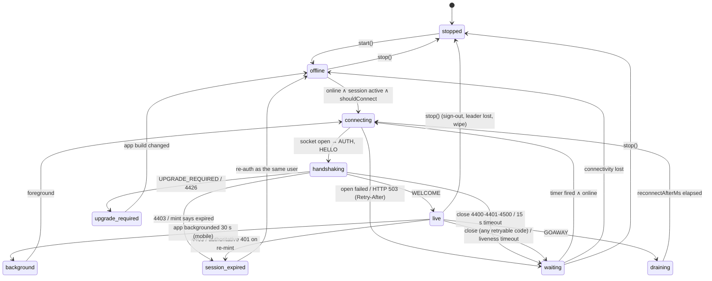

# 02 · Sync protocol: KSP v1

*Aligned with spine v1.3.*

*Detail document 2 of 16 · elaborates spine v1.3 (written against v1.1; v1.2 changes C-06 … C-84 and v1.3 changes C-201 … C-247 applied and cited inline) · 2026-10-04 · Status: draft for review*

## 1. Purpose and scope

This document is the contract of the Keep Sync Protocol, version 1 (KSP v1). It defines every byte that crosses the sync plane, what each message means, the order in which clients and servers may send them, and the client state machine that drives them. The server implementation is in 03 and the client storage in 04; both build against the types defined here.

In scope:

- **Wire format**: primitive encodings, the envelope, frame type codes, per-frame byte layouts, frame-stream framing for HTTP, size limits and compatibility rules (D-15).
- **Frame catalogue** with direction, phase, request/reply correlation and semantics (spine §5.3).
- **Metadata op catalogue**: argument schemas, lanes, authorization, guards, idempotency keys, effects and result rows (D-17).
- **Result, rejection, NACK, HTTP and close codes**, their retry classes, and the **error-code-to-UX mapping** (owned → 06, 07).
- **Feed** (`PULL`/`FEED`) row shapes, field groups and guards, typed tombstones, card-only pending rows and **inline tails** (D-22).
- **Bootstrap** NDJSON line shapes, resume tokens and the hydration pack encoding (D-21, INV-16).
- **Content sync**: `DOC_*` semantics, client seq accounting, push-back, large docs.
- **Anti-entropy** and the daily audit, including the state hash definition.
- The client **SyncEngine** state machine, connection management, send pump and timers.
- **Outbox semantics** as a protocol contract: ordering guarantees, dependencies, reductions, results (D-20).
- **Resync kinds** and **restore reconciliation** from the protocol side (§5.11, INV-14).
- **Backpressure** signals and obligations (§5.12).
- The **client telemetry SLI schema** and the client metric-name registry (owned → 14; names contributed by 04, 05, 06, 07, 09, 10, 12).
- The **native frame-stream contract** for `notif-actions` and the web service worker (C-211), with golden vectors.
- The **simulator property list**: one property per INV and per sync-observable Keep rule (D-48, C-243; consumed by 16, whose traceability matrix maps the rest).

### Out of scope

| Topic | Owner |
|---|---|
| Gateway internals, group-commit SQL, NACK resolution queries, feed/bootstrap SQL, compactor, relay, caches | 03 |
| Local SQLite schema, outbox and doc storage, LiveQuery, DocStore, recovered-draft extraction, merge-review storage, leader election | 04 |
| DocPort (core ↔ editor replica) messages and editor behavior | 05 (jointly with 04) |
| UI components that render the UX mapping | 06, 07 |
| Authorization predicates and fixture matrix; sharing op internals | 08 |
| Reminder semantics behind `reminder.*` and `REMINDER_CLEAR`; settings keys `reminders.*` | 09 |
| Inbox and `BgCredentialV1` formats, native modules (`bg-flush`, `notif-actions`) | 07 (web service-worker records: 06) |
| Media upload and `media.*` oRPC contracts (they are not KSP frames); `MEDIA_UX` | 10 |
| JWT claims, minting, device registration, continuity token, account deletion | 12 |
| DDL, restore runbook, journal format | 13 |
| CloudWatch ingestion of SLIs, the server metric registry, alarms and paging | 14 |
| Simulator harness design, `SP-16-*` properties, the INV/P traceability matrix | 16 (this doc owns the INV and sync-observable P property list) |

## 2. Spine references

Citation convention: bare `§5.x` and `§1.x` references cite the **spine**; references to this document's own §5 subsections say "here". All other bare section numbers (§4, §6–§25) refer to this document. Sibling docs are cited by number (e.g. 03 §6.2).

| Spine item | Elaborated in |
|---|---|
| §5.1 planes and channels (push channel: native-only silent and clear pushes, C-203) | §5, §13.8, §18 |
| §5.2 INV-1 … INV-18 (INV-1 inbox path C-204; INV-3 equality C-245; INV-12 images C-223) | §11, §14, §15, §16; properties in §23.1 |
| §5.3 envelope, frames, op catalogue, rejection codes | §4, §5, §6, §7, §8 |
| §5.4 bootstrap | §10 |
| §5.5 incremental sync, tails, anti-entropy | §9, §11, §12 |
| §5.6 offline outbox | §14 |
| §5.7 partial replication and revocation (protocol side) | §9.4, §11.9 |
| §5.8 ack semantics | §7.4, §11.2 |
| §5.10 schema versioning (wire, outbox payloads) | §4.4, §7.6 |
| §5.11 epochs, resync, restore reconciliation | §15, §16 |
| §5.12 backpressure and budgets (deregistration-driven deploy drain, C-235) | §6.7, §17 |
| D-14 … D-23 | D-14 §5; D-15 §4; D-16 §7.5, §9.3; D-17 §7; D-18 §11.2; D-19 §13.6; D-20 §14; D-21 §10; D-22 §9.5, §11, §12, §13.8; D-23 §9.3 |
| D-38 (native POST frame stream, C-211; `bg-flush` in M1, C-209) | §13.8, §18.3, §23.2 |
| D-41, D-42 (handshake fields, registration and identity reset, C-83, C-84) | §6, §13.5 |
| D-46 (client SLIs) | §19 |
| D-48 (simulator properties, C-243) | §23.1 |
| D-49 (deploy drains, C-235) | §6.7 |
| X-01 (incl. URLs, C-206), X-02, X-03, X-08, X-10, X-11 (C-231, C-232), X-14, X-15 | §19, §21; §7; §4.3; §4.4; §13.8; §19.2, §12.4; §8.3; §13.8 |

## 3. Packages and interfaces

### 3.1 Where the code lives

| Module | Package | Contents |
|---|---|---|
| `codec.ts` | `sync-protocol` | Primitive encoders, envelope, `encodeFrame`/`decodeFrame`, frame streams |
| `frames.ts` | `sync-protocol` | Frame type codes and payload types (§5) |
| `handshake.ts` | `sync-protocol` | `HelloV1`, `WelcomeV1`, `LimitsV1`, caps registry, close codes (§6) |
| `ops.ts` | `sync-protocol` | Op catalogue: zod arg schemas, `OP_V`, lane rules (§7) |
| `rows.ts` | `sync-protocol` | Feed row types and zod schemas, strict and passthrough variants (§9) |
| `codes.ts` | `sync-protocol` | Reject, NACK, HTTP and close codes, retry classes (§8) |
| `ux.ts` | `sync-protocol` | `SYNC_UX` mapping table, data only, no UI (§8.3) |
| `boot.ts`, `docspack.ts` | `sync-protocol` | Bootstrap line types, hydration pack codec (§10) |
| `dochash.ts` | `sync-protocol` | `docHash`, canonical state vector and delete set (§12) |
| `telemetry.ts` | `sync-protocol` | `TelemetryBatchV1` schema, histogram buckets (§19) |
| `engine/*` | `sync-client` | SyncEngine (§13); storage ports are 04's |

`sync-protocol` depends only on `domain` (01), `zod` and `lib0`/`yjs` (for `docHash`). It imports no DOM, React Native or Node built-ins (X-19).

### 3.2 Interfaces owned here

| Interface | Section | Consumers |
|---|---|---|
| Wire primitives, envelope, frame codes and layouts, frame streams | §4, §5 | 03, 04 |
| `HelloV1`, `WelcomeV1`, `LimitsV1`, caps, close codes | §6 | 03, 04, 12 |
| Op catalogue: names, `v`, arg schemas, lanes, guards, result rows | §7 | 03, 04, 08, 09, 12 |
| `RejectCode`, `NackCode`, HTTP sync errors, retry classes | §8.1, §8.2 | 03, 04 |
| Error-code-to-UX mapping `SYNC_UX` | §8.3 | 06, 07 |
| Feed row images (`FeedRow`), field groups and guards, inline tails | §9 | 03, 04, 08, 11 |
| Bootstrap lines, resume token contract, hydration pack | §10 | 03, 04 |
| Seq accounting rules, push-back rule | §11.7, §11.8 | 04 |
| `docHash` | §12 | 03, 04 |
| SyncEngine state machine, `SyncEngine` API | §13 | 04, 06, 07 |
| `/v1/sync/*` request and response contracts | §18 | 03, 04, 12 |
| `TelemetryBatchV1` and SLI definitions | §19 | 04, 14 |
| Simulator property list | §23.1 | 16, 03, 04, 08 |

### 3.3 Interfaces consumed (minimal assumptions)

| Owner | What this doc relies on |
|---|---|
| 01 | `UserId`, `NoteId`, `LabelId`, `DeviceId`, `Hlc`, `OrderKey`, `OccKey`, `ColorToken`, `BackgroundToken`, `RemovedReason`, `NoteKind`, `PreviewV1`, `Projection`, `SettingKey`/`SettingValue`, `ReminderSpec`; `ids.shardOf`, `ids.timestampOf`, `hlc.encode/compare/merge/clamp`; validators for HLC strings, order keys and setting values. |
| 03 | Implements the server side as specified: per-connection serial commit admission; acks before live frames; own rows removed from `DOC_LIVE`; NACK resolution yields only the four NACK codes; tails only when complete and ≤ 4 KiB; the WELCOME resync decision of §6.4; `docHash` on request. |
| 04 | Implements `OutboxPort` (04 §9.6), `DocSyncPort` (04 §11.10), `FeedPort` (04 §10.1), plus `BootstrapPort` and `ResyncPort` as proposed in §13.3; applies feed rows with the guards of §9.3. |
| 08 | Role and argument violations by active members return `INVALID`, never `FORBIDDEN` (08 §4.4); `MemberChip` and `CardProjection` shapes; share op semantics. |
| 09 | Semantics of `reminder.*` ops and `REMINDER_CLEAR` actions. |
| 12 | `AuthPort.jwt()` mints KSP JWTs with `sub` and `did`; `DeviceRegistry` outcomes and continuity token; close reasons for 4401/4403/4409; `rowOmitted` for device-token callers. |
| 13 | `user_notes` columns listed in §9.2 (including `restore_wait_until` and `over_limit`); `shard_epoch_log` with reasons (03 S-11). |

## 4. Wire encoding (D-15)

### 4.1 Primitives

All binary encodings use `lib0` 0.2.x encoding functions (the same family as y-protocols).

| Name | Encoding | Notes |
|---|---|---|
| `u8` | 1 byte | |
| `bool` | `u8`, 0 or 1 | Any other value is `MALFORMED` |
| `varuint` | lib0 `writeVarUint`: little-endian 7-bit groups, high bit = continuation, ≤ 8 bytes | Values ≤ 2^53 − 1. Used for seqs, usns, ms timestamps, counts |
| `bytes` | `varuint` length ‖ raw bytes | lib0 `writeVarUint8Array` |
| `str` | `varuint` byte length ‖ UTF-8 | lib0 `writeVarString`; invalid UTF-8 is `MALFORMED` |
| `uuid` | 16 raw bytes in RFC 9562 network order | Decoded to the lowercase hyphenated form |
| `json` | `str` containing exactly one JSON object | Parsed and zod-validated (§4.3) |
| `list<T>` | `varuint` count ‖ count × T | |
| `opt<T>` | `u8` 0 (absent) or 1 ‖ T | |
| `trace` | 26 bytes: `u8` version (0) ‖ 16-byte trace-id ‖ 8-byte parent-id ‖ `u8` trace-flags | W3C `traceparent` in binary |

Seqs fit comfortably: a restore jumps `content_seq` by 2^32 (§5.11), so 2^21 restores fit below 2^53. Encoders assert `Number.isSafeInteger` on every `varuint`.

### 4.2 Envelope

```
 field     type      notes
 type      u8        frame type code (§5.1 here)
 reqId     varuint   0 = unsolicited. Requests carry a client-chosen id in 1 … 2^31−1; replies echo it
 flags     varuint   bit 0 TRACE: a trace field follows
                     bit 1 MORE: this reply is not the last for its reqId
                     bits 2–6 reserved, sent as 0; bits ≥ 7 ignored by receivers
 trace     trace     present iff flags bit 0
 payload   …         per frame type (§5)
```

- `reqId` is unique among a client's outstanding requests on one connection. It increments per request and wraps at 2^31. Servers never originate requests.
- **Size.** The payload is at most **262,144 bytes** and the envelope at most 64 bytes, so a WebSocket message is ≤ 262,208 bytes (03 sets `maxPayload` to that). A larger frame closes the socket with 4413.
- **Frame streams (HTTP).** A body of type `application/x-ksp-frames` is a concatenation of `varuint length ‖ frame` records. Frame streams have no per-frame size cap; `/v1/sync/push` bodies are capped at 4 MiB in total.

### 4.3 Payload rules

- **Binary layouts are append-only.** A new field is only ever added after the last existing field (or behind a flag bit, §5.3 here). Decoders read the fields they know and **ignore trailing bytes**, so an old decoder reads a new frame.
- **JSON payloads** are UTF-8 objects. Integers only, ≤ 2^53 − 1. Timestamps are integer ms UTC (X-03). IDs are lowercase hyphenated UUID strings. HLCs are the 21-char strings of 01 §6. Byte arrays inside JSON (HTTP bodies only) are base64url without padding.
- **Strict server, passthrough client** (D-15). The server validates with zod `.strict()`: an unknown key in a frame closes the socket with 4400 (`SCHEMA`), and an unknown key in op args is `rejected: INVALID`. Clients validate with `.passthrough()` and ignore what they do not know. Consequently **a client sends a new key, op or frame only when the server lists the matching cap in `WELCOME.caps`** (§6.6).
- **Unknown frame types.** The server closes with 4400 (`UNKNOWN_FRAME`). The client ignores the frame and counts `unknown_frame`.
- **Unknown enum values received by a client** degrade safely: an unknown `RemovedReason` is treated as `revoked`; an unknown resync kind as `full`; an unknown reject code as class `hold` (§8.1); an unknown feed row type is skipped (04 F-09).

### 4.4 Versioning (§5.10, X-08)

| Axis | Carrier | Rule |
|---|---|---|
| Protocol | `HELLO.proto`, `WELCOME.proto` | Client sends its highest version; server answers with the version it will speak or `UPGRADE_REQUIRED`. The server supports every version shipped by a build ≤ 6 months old. Only `1` exists. |
| Features | `HELLO.caps`, `WELCOME.caps` | Tokens in §6.6. A sender uses a feature only if the receiver advertised it. |
| Op payloads | `OpEnvelope.v` | Per-op schema version (§7.6). Server handles every `v` it knows; an unknown `v` or op is `rejected: UNSUPPORTED` (class `hold`, never dead-lettered). |
| Rows | JSON row images | Additive keys only. A shape change (not a value change) requires a `full` epoch (§15). |
| App floor | `WELCOME.minAppVersion` | Below it the server sends `UPGRADE_REQUIRED` and closes 4426. |

### 4.5 Codec API

```ts
// packages/sync-protocol/src/codec.ts
export const PROTO_VERSION = 1 as const;
export const MAX_FRAME_PAYLOAD = 262_144;
export const MAX_ENVELOPE = 64;
export type Receiver = 'client' | 'server';

export interface Trace { traceId: Uint8Array; parentId: Uint8Array; flags: number }   // 16 + 8 bytes
export interface Envelope { reqId: number; more?: boolean; trace?: Trace }

export type ProtocolErrorCode = 'MALFORMED' | 'UNKNOWN_FRAME' | 'TOO_LARGE' | 'BAD_JSON' | 'SCHEMA' | 'WRONG_CHANNEL';
export class ProtocolError extends Error {
  constructor(readonly code: ProtocolErrorCode, readonly detail?: string) { super(code); }
}

export function encodeFrame(f: Frame): Uint8Array;                            // throws TOO_LARGE
export function decodeFrame(b: Uint8Array, rx: Receiver, channel: 'ws' | 'http'): Frame;
export function encodeFrameStream(frames: Iterable<Frame>): Uint8Array;
export function decodeFrameStream(b: Uint8Array, rx: Receiver): Generator<Frame>;
```

`decodeFrame` applies zod validation for JSON payloads (strict for `rx = 'server'`, passthrough for `rx = 'client'`) and returns typed frames. `WRONG_CHANNEL` rejects HTTP-only frames on a socket and vice versa.

## 5. Frame catalogue (spine §5.3)

### 5.1 Type codes

| Code | Frame | Dir | Payload | Phase | Reply |
|---|---|---|---|---|---|
| 0x01 | `AUTH` | C→S | `str jwt` | First frame (≤ 5 s); again in band after `REAUTH` | none (close on failure) |
| 0x02 | `HELLO` | C→S | `json HelloV1` | Once, after `AUTH` | `WELCOME` or `UPGRADE_REQUIRED` |
| 0x03 | `WELCOME` | S→C | `json WelcomeV1` | Reply to `HELLO` | — |
| 0x04 | `UPGRADE_REQUIRED` | S→C | `json {minAppVersion, reason}` | Reply to `HELLO`, then close 4426 | — |
| 0x05 | `REAUTH` | S→C | `json {deadline}` | Ready | client sends `AUTH` |
| 0x06 | `GOAWAY` | S→C | `json {reconnectAfterMs, reason}` | Ready | — |
| 0x07 | `SLOW_DOWN` | S→C | `json {ms}` | Ready | — |
| 0x08 | `RETRY_LATER` | S→C | `json {lane, ms}` | Ready; reqId = the `PUSH` it answers, or 0 | — |
| 0x09 | `RESYNC_REQUIRED` | S→C | `json {epochs, reason, notBefore}` | Ready; reqId = the `PULL` it answers, or 0 | — |
| 0x0A | `FLAGS` | S→C | `json {flags}` | Ready (additive; cap `flags1`) | — |
| 0x10 | `PUSH` | C→S | `json PushV1` | Ready | `ACK` or `RETRY_LATER` |
| 0x11 | `ACK` | S→C | `json AckV1` | Reply | — |
| 0x12 | `PULL` | C→S | `varuint usn` `varuint limit` `varuint shardEpoch` `varuint userEpoch` | Ready | `FEED` or `RESYNC_REQUIRED` |
| 0x13 | `FEED` | S→C | binary, §9.1 | Reply | — |
| 0x14 | `POKE` | S→C | `varuint usn` | Ready | — |
| 0x20 | `DOC_SUB` | C→S | `uuid noteId` `varuint serverSeq` `bytes sv` `u8 f` (bit 0 WANT_HASH) | Ready | `DOC_SYNC` or `REVOKED` |
| 0x21 | `DOC_UNSUB` | C→S | `uuid noteId` | Ready | none |
| 0x22 | `DOC_SYNC` | S→C | `uuid noteId` `varuint seq` `bytes update` `bytes sv` `varuint peers` `u8 f` [`str hash` if f.HASH] [`list<uuid> authors` if f.AUTHORS] | Reply | — |
| 0x23 | `DOC_UPD` | C→S | `uuid noteId` `uuid ccid` `bytes update` | Ready | `DOC_ACK` or `DOC_NACK` |
| 0x24 | `DOC_ACK` | S→C | `uuid noteId` `uuid ccid` `varuint seq` `varuint commitAt` | Reply | — |
| 0x25 | `DOC_NACK` | S→C | `uuid noteId` `uuid ccid` `u8 code` `varuint retryMs` | Reply | — |
| 0x26 | `DOC_LIVE` | S→C | `uuid noteId` `varuint fromSeq` `varuint toSeq` `bytes update` `varuint commitAt` `u8 f` [`list<uuid> authors` if f bit 0] | Subscribed | — |
| 0x27 | `DOC_FETCH` | C→S | `varuint budgetBytes` `list<FetchItem>`; FetchItem = `uuid noteId` `varuint serverSeq` `opt<bytes> sv` `u8 f` (bit 0 WANT_HASH) | Ready | n × `DOC_SYNC`/`REVOKED` with MORE on all but the last |
| 0x28 | `NOTE_TOUCHED` | S→C | `uuid noteId` `varuint seq` | Ready | — |
| 0x29 | `DOC_PEERS` | S→C | `uuid noteId` `varuint peers` | Subscribed (additive; cap `peers1`) | — |
| 0x30 | `REVOKED` | S→C | `uuid noteId` `str reason` | Any; reqId = the `DOC_SUB`/`DOC_FETCH` it answers, or 0 | — |
| 0x31 | `REMINDER_CLEAR` | S→C | `uuid noteId` `str occ` `str action` | Ready | — |
| 0x40 | `AWARE` | C↔S | `uuid noteId` `bytes state` | v1.1 presence; day-1 servers drop it | — |
| 0x50 | `HTTP_HDR` | C→S | `json {userId, deviceId}` | HTTP frame streams only, first frame | — |
| 0x51 | `HTTP_TRAILER` | S→C | `json HttpTrailerV1` | HTTP frame streams only, last frame | — |

0x00 and 0xF0–0xFF are reserved. Codes are never reused.

### 5.2 Payload types

```ts
// packages/sync-protocol/src/frames.ts
export type Bytes = Uint8Array;
export interface Cursor { shardEpoch: number; userEpoch: number; usn: number }
export interface Epochs { shardEpoch: number; userEpoch: number }
export type ResyncKind = 'none' | 'meta' | 'full' | 'restore';
export type NackCode = 'FORBIDDEN' | 'NOTE_PURGED' | 'NOTE_UNKNOWN' | 'RETRY_LATER';   // u8 1..4
export type RevokeReason = RemovedReason | 'forbidden';                               // 01 RemovedReason ∪ generic deny

export interface FetchItem { noteId: NoteId; serverSeq: number; sv?: Bytes; wantHash?: boolean }
export interface TailV1 { noteId: NoteId; fromSeq: number; toSeq: number; update: Bytes }

export const DocSyncFlag = { TOO_LARGE: 1, RAW_TAIL: 2, ABSENT: 4, DEFERRED: 8, HASH: 16, AUTHORS: 32 } as const;

export interface Payloads {
  AUTH: { jwt: string };
  HELLO: HelloV1;
  WELCOME: WelcomeV1;
  UPGRADE_REQUIRED: { minAppVersion: string; reason: 'proto' | 'app_version' };
  REAUTH: { deadline: number };
  GOAWAY: { reconnectAfterMs: number; reason: 'deploy' | 'lifetime' | 'rebalance' | 'shutdown' };
  SLOW_DOWN: { ms: number };
  RETRY_LATER: { lane: number; ms: number };
  RESYNC_REQUIRED: { epochs: Epochs; reason: Exclude<ResyncKind, 'none'>; notBefore: number };
  FLAGS: { flags: Record<string, unknown> };
  PUSH: PushV1;
  ACK: AckV1;
  PULL: { usn: number; limit: number; shardEpoch: number; userEpoch: number };
  FEED: { toUsn: number; hasMore: boolean; rows: FeedRow[]; tails: TailV1[] };
  POKE: { usn: number };
  DOC_SUB: { noteId: NoteId; serverSeq: number; sv: Bytes; wantHash: boolean };
  DOC_UNSUB: { noteId: NoteId };
  DOC_SYNC: { noteId: NoteId; seq: number; update: Bytes; sv: Bytes; peers: number; f: number;
              hash?: string; authors?: UserId[] };
  DOC_UPD: { noteId: NoteId; ccid: string; update: Bytes };
  DOC_ACK: { noteId: NoteId; ccid: string; seq: number; commitAt: number };
  DOC_NACK: { noteId: NoteId; ccid: string; code: NackCode; retryMs: number };
  DOC_LIVE: { noteId: NoteId; fromSeq: number; toSeq: number; update: Bytes; commitAt: number; authors?: UserId[] };
  DOC_FETCH: { budgetBytes: number; items: FetchItem[] };
  NOTE_TOUCHED: { noteId: NoteId; seq: number };
  DOC_PEERS: { noteId: NoteId; peers: number };
  REVOKED: { noteId: NoteId; reason: RevokeReason };
  REMINDER_CLEAR: { noteId: NoteId; occ: OccKey; action: 'done' | 'snooze' | 'dismiss' };
  AWARE: { noteId: NoteId; state: Bytes };
  HTTP_HDR: { userId: UserId; deviceId: DeviceId };
  HTTP_TRAILER: HttpTrailerV1;
}
export type FrameName = keyof Payloads;
export type Frame = { [K in FrameName]: Envelope & { type: K } & Payloads[K] }[FrameName];
```

### 5.3 Layout rules for optional binary fields

Optional fields in `DOC_SYNC` and `DOC_LIVE` are present iff their flag bit is set, in ascending bit order, after all mandatory fields. New mandatory fields are appended after the last optional field of the previous version; decoders that do not know a bit skip nothing (they stop reading and ignore trailing bytes).

### 5.4 `DOC_SYNC` flags

| Bit | Name | Meaning | Client action |
|---|---|---|---|
| 0 | `TOO_LARGE` | The update would exceed 240 KiB; `update` is empty | Do not advance `server_seq`. Hydrate through `POST /v1/sync/docs` with `Priority: interactive`, then re-send `DOC_SUB`/`DOC_FETCH` with the new `sv` (§11.9) |
| 1 | `RAW_TAIL` | `update` is the merged raw log tail `(serverSeq, seq]` rather than a state diff | None special; informative for telemetry |
| 2 | `ABSENT` | The note does not exist on the server (`NOTE_UNKNOWN`: not yet created, or restore window) | Keep the local doc; retry with backoff; do not push back |
| 3 | `DEFERRED` | The fetch byte budget ran out before this item | Re-queue the item; no data |
| 4 | `HASH` | `hash` = server `docHash` at `seq` (§12) | Use in the push-back rule (§11.8) |
| 5 | `AUTHORS` | `authors` = active members who authored rows in the range (v1.1, cap `authors1`) | Merge-review banner text (P-18) |

## 6. Connection lifecycle

### 6.1 Handshake

```mermaid
sequenceDiagram
  autonumber
  participant C as SyncEngine
  participant A as AuthPort (12)
  participant G as Gateway (03)
  C->>A: jwt() (mint if expiresAt − 150 s passed)
  A-->>C: jwt, expiresInMs
  C->>G: WSS sync.<domain>/v1 (no subprotocol, no deflate)
  C->>G: AUTH{jwt}   [≤ 5 s after open]
  C->>G: HELLO{proto, userId, deviceId, installNonce, continuity, caps, cursor, hlc, …}
  alt proto or app too old
    G-->>C: UPGRADE_REQUIRED{minAppVersion} + close 4426
  else userId ≠ sub
    G-->>C: close 4403 ACCOUNT_MISMATCH
  else ok
    G-->>C: WELCOME{serverHlc, serverTime, epochs, resync, notBefore?, flags, limits, caps, registration, continuity}
  end
  Note over C: merge serverHlc (INV-15); store continuity; apply limits
  alt resync = none
    C->>G: PULL{usn: cursor.usn, epochs}  · DOC_SUB for open notes · DOC_FETCH{sv} for dirty notes
  else resync ≠ none
    Note over C: wait until notBefore, then §15 procedure
  end
```

The client sends `AUTH` and `HELLO` back to back without waiting. Timeouts: the server closes 4401 `AUTH_TIMEOUT` without `AUTH` in 5 s and 4400 `HELLO_TIMEOUT` without `HELLO` in 10 s; the client closes 4000 and backs off if `WELCOME` does not arrive within 15 s of `HELLO`.

### 6.2 `HELLO`

```ts
// packages/sync-protocol/src/handshake.ts
export interface HelloV1 {
  proto: 1;
  userId: UserId;            // must equal the JWT sub, else close 4403 (INV-18)
  deviceId: DeviceId;        // must equal the JWT did, else close 4401 DEVICE_MISMATCH (12)
  installNonce: string;      // 32 lowercase hex; server stores sha256 (D-42)
  continuity?: string;       // 12 §9.3; sent when caps includes 'cont1'
  appVersion: string;        // semver of the build
  build: number;             // monotonically increasing build number (X-08)
  platform: 'web' | 'ios' | 'android';
  caps: string[];            // §6.6
  docSchemaMax: number;      // INV-9
  cursor: Cursor | null;     // committed cursor, else the bootstrap's first cursor, else null (§10.3)
  bootstrapping: boolean;    // true while boot_state = 'streaming' (informative; logged)
  hlc: Hlc;                  // current client HLC; merged by the server (INV-15)
  tz: string;                // IANA zone
  foreground: boolean;
}
```

`cursor = null` means a fresh DB: the server registers a new device record (D-42). A DB that has stored the first bootstrap line sends that line's cursor, so an interrupted bootstrap does not re-register the device on every reconnect.

### 6.3 `WELCOME`

```ts
export interface WelcomeV1 {
  proto: 1;
  connId: string;                    // UUIDv7, for support and log correlation
  serverHlc: Hlc;
  serverTime: number;                // ms UTC at send; used for the clock-offset estimate (§19.3)
  epochs: Epochs;                    // home shard epoch + user epoch
  resync: ResyncKind;
  resyncReason?: string;             // e.g. 'tombstone_floor', 'projection_format', 'restore', 'operator'
  notBefore?: number;                // present iff resync ≠ 'none'
  minAppVersion: string;
  flags: Record<string, unknown>;    // incl. docSchemaWritable (spine §5.10), sync.mode (§13.8)
  primaryDeviceId: DeviceId | null;  // D-36
  limits: LimitsV1;
  caps: string[];                    // server caps
  registration: 'existing' | 'new' | 'reregistered' | 'reactivated';   // 12 §9.2
  continuity: string;                // next continuity token (12 §9.3)
}

export interface LimitsV1 {
  maxFrame: number;           // 262144
  maxInflightFrames: number;  // 32   (PUSH + DOC_UPD awaiting ACK/DOC_ACK/DOC_NACK)
  maxInflightBytes: number;   // 1048576
  docFramesPerNote: number;   // 8
  maxPushOps: number;         // 100
  maxFetchItems: number;      // 100
  maxFetchInflight: number;   // 2
  maxSubs: number;            // 16
  feedPageMax: number;        // 500
  socketDocUpdMax: number;    // 245760: larger doc_update rows go to POST /v1/sync/push
  flushSoloMs: number;        // 2000 (D-19)
  flushPeersMs: number;       // 250  (D-19)
}
```

Clients treat `limits` as authoritative and fall back to the defaults above for absent keys.

### 6.4 Resync decision (normative; 03 implements)

The server evaluates, first match wins:

| # | Condition | `resync` |
|---|---|---|
| 1 | `HELLO.cursor` is null | `full` (the client bootstraps, §10) |
| 2 | `shard_epoch_log` for the user's home shard has an entry with reason `restore` and epoch > `cursor.shardEpoch` | `restore` |
| 3 | `cursor.shardEpoch` or `cursor.userEpoch` is below the current value | the strongest reason among the missed bumps (`full` > `meta`) |
| 4 | `cursor.usn < tombstone_floor_usn` | `meta` |
| 5 | `cursor.usn > users_sync.usn` | `restore`, plus alarm `ksp.gw.cursor_ahead` (an un-bumped restore) |
| 6 | otherwise | `none` |

Only a **home-shard** restore triggers a `restore` resync. A restore of another shard reaches members through jumped seqs and relay re-fan-out (§16.4).

### 6.5 Close codes

| Code | Name | Server sends when | Client reaction | Reconnect |
|---|---|---|---|---|
| 1000 | `NORMAL` | — (client-initiated: background, leader lost, stop) | — | per trigger |
| 4000 | `CLIENT_TIMEOUT` | — (client: handshake or liveness timeout, §13.5) | — | backoff |
| 4400 | `MALFORMED` | Decode or schema failure, unknown frame, frame in the wrong phase, `HELLO_TIMEOUT`. Reason `BAD_UPDATE <ccid>` if a `DOC_UPD` payload is not a valid Yjs update | If the reason names a ccid, quarantine that row (§14.7) | backoff, min 5 s |
| 4401 | `AUTH` | Reasons `AUTH_TIMEOUT`, `AUTH_INVALID`, `AUTH_EXPIRED`, `SESSION_REVOKED`, `DEVICE_MISMATCH` (12 §6.4) | Re-mint once; the mint result decides `session_expired` (12 §10.3) | 0–2 s after a successful mint |
| 4403 | `ACCOUNT_MISMATCH` | `HELLO.userId ≠ sub` | `session_expired(account_mismatch)`; send nothing | none |
| 4408 | `SLOW_CONSUMER` | Send buffer > 8 MiB | Reconnect | backoff, min 5 s |
| 4409 | `DEVICE_FORKED` | Continuity or stale-twin check (12 §9.3) | 12's fork reset, then reconnect or `session_expired(device_forked)` | per 12 |
| 4413 | `TOO_LARGE` | Frame above `maxFrame` | Client bug: route the offending item through HTTP; telemetry | backoff |
| 4426 | `UPGRADE_REQUIRED` | After `UPGRADE_REQUIRED` | `upgrade_required` state; local editing continues | none until the app build changes |
| 4500 | `INTERNAL` | Unexpected server exception on the connection | Reconnect | backoff |
| 4503 | `GOING_AWAY` | Drain completed after `GOAWAY`, or shutdown | Reconnect | remaining `reconnectAfterMs`, else 0–5 s |

Before the upgrade, the gateway may answer **HTTP 503 with `Retry-After`** (handshake admission, §5.12); the client waits `Retry-After` plus 0–30% jitter. Note for 03: `ACCOUNT_MISMATCH` is **4403**, not 4409 as 03 §4.2 assumed; 4409 is `DEVICE_FORKED` (12).

### 6.6 Capability tokens

| Token | Sender | Meaning |
|---|---|---|
| `ksp1` | both | KSP v1 baseline (everything in this document not listed below) |
| `cont1` | client | Sends `HELLO.continuity` (12) |
| `tail1` | client | Accepts inline tails in `FEED` |
| `big1` | both | `DOC_SYNC.TOO_LARGE` handling |
| `hash1` | both | `WANT_HASH` / `DOC_SYNC.hash` and `docHash` in `/reconcile` (§12) |
| `commit1` | server | `commitAt` is meaningful (non-zero) on `DOC_ACK`/`DOC_LIVE` |
| `peers1` | client | Accepts `DOC_PEERS` |
| `flags1` | client | Accepts `FLAGS` |
| `authors1` | client | Accepts `authors` on `DOC_SYNC`/`DOC_LIVE` (v1.1) |
| `op:share.remove.target`, `op:note.copy.overlay` | server | Additive op shapes from 08 (§7.3) |
| `push.frames1` | server | `/v1/sync/push` accepts frame streams (§18.3) |

Every v1.0 build sends and accepts all baseline tokens; tokens exist so that later additions can be gated.

### 6.7 Re-authentication and drains

- **REAUTH** (D-41): the server sends `REAUTH{deadline = exp}` at `exp − 120 s`. The client mints and sends `AUTH{jwt}` in band; `sub` and `did` must not change, `sid` may. The client also re-mints proactively at `expiresAt − 150 s` (12 §6.4). Missing the deadline closes 4401 `AUTH_EXPIRED`.
- **GOAWAY** (§5.12): the server stops admitting new `PUSH`/`DOC_UPD` from that connection, finishes in-flight commits and sends their acks. The client enters `draining`: it sends no new `PUSH`/`DOC_UPD`/`DOC_SUB`, keeps processing replies, and at `reconnectAfterMs` closes 1000 and reconnects immediately (the server already jittered the delay). Items still unacked at close are re-sent on the next connection (INV-3).
- **Socket lifetime** is capped at 24 h (D-41) through `GOAWAY{reason: 'lifetime'}`.

## 7. Metadata ops (D-17)

### 7.1 `PUSH` and `ACK`

```ts
// packages/sync-protocol/src/ops.ts
export interface PushV1 { batchId: string; lane: number; ops: OpEnvelope[] }       // 1 ≤ ops ≤ 100, one lane
export interface OpEnvelope { ccid: string; op: OpName; v: number; args: unknown; hlc: Hlc }

export interface AckV1 { batchId: string; usn: number; serverHlc: Hlc; results: OpResultV1[] }
export type OpResultV1 =
  | { ccid: string; status: 'ok'; hlc: Hlc; row?: OpResultRow }
  | { ccid: string; status: 'stale'; hlc: Hlc; row?: OpResultRow; rowOmitted?: true }
  | { ccid: string; status: 'rejected'; code: RejectCode; retryMs?: number; detail?: string };
export type OpResultRow = FeedRow | TrashEmptyRow;
export interface TrashEmptyRow {
  t: 'trashEmpty';
  purged: NoteId[];
  stale: Array<{ id: NoteId; trashed: boolean; trashHlc: Hlc | null; trashedAt: number | null }>;
}
```

**Execution contract** (03 §5.7 implements):

1. A `PUSH` names one lane, the logical shard whose rows authorize the ops (§7.2). At most **one `PUSH` per lane** is in flight per connection.
2. Ops run **in order, each in its own transaction**. A failed op does not abort later ops in the batch.
3. One `ACK` answers the batch, after the last op committed, with one result per op in order. `usn` is the user's usn after the batch; if `usn > cursor.usn` the client pulls.
4. If the lane's shard is fenced or unreachable before any op ran, the server answers `RETRY_LATER{lane, ms}` with the `PUSH`'s reqId and no `ACK`; the whole batch is retried.
5. **No ack means no guarantee** (§5.8): the client re-sends the same ops with the same ccids. Every op is idempotent by construction, so re-execution is harmless (INV-3).
6. `ccid` is for tracing only. The server never deduplicates by it (D-17).

**HLC rules (D-16, INV-15).** Every op carries the HLC of the local transaction that produced it, even when its guard does not use it. The server clamps the physical part to `now + 60 s` (01 `hlc.clamp`), applies guards with the clamped value, merges it into its own clock and returns the **stored** value in `hlc`. The client merges `serverHlc` and every result `hlc` (INV-15) and stores result `hlc` as the field's HLC when its local HLC for that field still equals the op's HLC (04 §9.7).

**Result rows.** `stale` carries the current server row image, in feed shape, so the client applies it through the same handlers and guards as a `FEED` row (§9.3). `ok` may carry a row when the server computed fields the client cannot know (`note.create` re-assert, share ops). For device-token callers on `/v1/sync/push`, `stale` carries `rowOmitted: true` and no row (12 SI-9); the winning write has a higher usn, so the client's next `PULL` delivers it.

### 7.2 Lanes

```ts
export type LaneKind = 'self' | 'note' | 'source';
export function laneOf(op: OpName, args: any, me: { homeShard: number }): number {
  switch (OPS[op].lane) {
    case 'self':   return me.homeShard;                       // per-user ops
    case 'note':   return ids.shardOf(args.id ?? args.noteId); // note-scoped ops: the owner's shard
    case 'source': return ids.shardOf(args.srcId);             // note.copy (08 §13.1)
  }
}
```

### 7.3 Op catalogue

`Auth` is evaluated in the transaction by 08's `authz`. `Guard` is the idempotency key or condition. All ops also accept duplicates (re-sends) with the same outcome.

| Op | v | Lane | Auth (in tx) | Guard / idempotency | Effect on `ok` | `stale` when | Result row |
|---|---|---|---|---|---|---|---|
| `note.create{id, kind, overlay}` | 1 | note | actor; `shardOf(id) = home shard`; `ts(id) ≤ now + 24 h` | Insert-if-absent on `id`; same owner → `ok` (re-assert); foreign owner → `ID_CONFLICT`; ledgered → `NOTE_PURGED` | `notes`, `note_log_state`, owner `note_members`, owner `user_notes` with overlay stamped `hlc`; usn++ | — | `NoteRow` when it already existed |
| `note.setOverlay{id, fields}` | 1 | self | actor's `user_notes` `FOR SHARE`: absent or pending → `NOTE_UNKNOWN`; tombstone → `FORBIDDEN`/`NOTE_PURGED` | per field `hlc > field_hlc[f]` | Applied fields; usn++ | No field applied | `NoteRow` on `stale` |
| `note.setTrashed{id, trashed}` | 1 | note | owner (else `INVALID`) | `hlc > trash_hlc`, not purged | `trash_state`, `trash_hlc`, `trashed_at = now()`, `purge_after = now() + 7 d` (null on restore); journaled; member fan-out | Older HLC | `NoteRow` |
| `note.deleteForever{id, trashHlc}` | 1 | note | owner | **CAS**: `trash_state ∧ trash_hlc = trashHlc`; already purged → `ok` | Purge (journal first) | Mismatch | `NoteRow` |
| `trash.empty{items}` (≤ 500) | 1 | note | owner of each | CAS per item | Purges matching items | — (per-item staleness in the row) | `TrashEmptyRow` |
| `note.leave{id}` | 1 | note | writer (owner → `INVALID`); pending → decline | `hlc > added_hlc` | Membership removed; tombstone `left`; per-user GC; attachment transfer; journaled | Re-added later | `NoteRow` (membership) |
| `note.copy{srcId, newId, overlay}` | 2 | source | active member of source | Insert-if-absent on `newId` (else `ID_CONFLICT`) | New private note: doc copy, attachments into copier scope, copier's labels and color (P-24) | — | `NoteRow` of `newId` |
| `share.invite{noteId, email}` | 1 | note | active member; verified sender; caps (P-04, P-16) | `(note, user)` / `(note, email_hmac)` | Member row (pending if non-contact) or invite slot; journaled | — | `NoteRow` (membership) |
| `share.remove{noteId, userId?, target?}` | 2 | note | active member; target not owner (`INVALID`) | `hlc > target.added_hlc` / `> invited_hlc` | Revocation pipeline (§5.7); journaled | Target re-added later | `NoteRow` (membership) |
| `share.respond{noteId, action}` | 1 | note | recipient (owner → `INVALID`) | state transition on `(note, user)`, `state_hlc` (08 §9.3) | accept / decline / block; journaled | Already removed | `NoteRow` |
| `label.upsert{id, name}` | 1 | self | self | per field HLC; name collision → server merge | Label row; merges re-point `note_labels` | Older HLC | `LabelRow` |
| `label.delete{id}` | 1 | self | self | HLC on `deleted` | `deleted = true`; cascade `note_labels.present = false` | Older HLC | `LabelRow` |
| `noteLabel.set{noteId, labelId, present}` | 1 | self | self; actor's `user_notes` `FOR SHARE` as above | `hlc > pair.hlc` | Pair row | Older HLC | `NoteLabelRow` |
| `reminder.upsert{noteId, fields}` | 1 | self | self; `user_notes` `FOR SHARE` | per field HLC; `version++` on any applied field | Reminder row; `next_fire_at` recomputed (09) | No field applied | `ReminderRow` |
| `reminder.delete{noteId}` | 1 | self | self; `user_notes` `FOR SHARE` | HLC on `deleted` | `deleted = true` | Older HLC | `ReminderRow` |
| `reminder.ack{noteId, occ, action, until?}` | 1 | self | self | `(occ, action)` | `done_through` or snooze; `reminder_fires.acked_at`; `REMINDER_CLEAR` fan-out (09) | — | `ReminderRow` |
| `reminder.coverage{noteId, version, coveredUntil, exact, audible}` | 1 | self | self device | upsert on `(device, note)` | Coverage lease (D-36) | — | none |
| `reminder.fired{noteId, occ, firedAt}` | 1 | self | self device (Android) | `(occ, device)` | Fire receipt (P-09) | — | none |
| `settings.set{key, value}` | 1 | self | self | `hlc > setting.hlc` | Setting row | Older HLC | `SettingRow` |
| `device.update{…}` | 1 | self | self device | upsert | Device row (token never synced) | — | `DeviceRow` |
| `device.signOut{}` | 1 | self | self device | idempotent | Coverage, ringer role, push token cleared; session revoked (12 §9.5) | — | none |

Content is not an op: `DOC_UPD` (§11.2) is authorized as active member and not purged in the append transaction (INV-5).

**Version 2 ops.** `note.copy` v2 adds `overlay`, which is required when `v = 2` (08 SI-10) and `share.remove` v2 adds `target` (08 SI-2). Clients send v2 only when `WELCOME.caps` contains the matching `op:*` token; otherwise v1 (`share.remove{noteId, userId}`; `note.copy{srcId, newId}` with the server defaulting the overlay to the source's color and a top sort key).

### 7.4 Argument schemas

```ts
// packages/sync-protocol/src/ops.ts  (server: .strict(); client: same schemas used for encoding)
import { z } from 'zod';
import { isNoteId, isUserId, isUuid, HLC_RE, isOrderKey, COLOR_TOKENS, BACKGROUND_TOKENS,
         LOCAL_WALL_RE, isOccKey, isIanaZone, SETTING_SCHEMAS } from '@keep/domain';    // 01

const NoteIdZ = z.string().refine(isNoteId);
const UserIdZ = z.string().refine(isUserId);
const LabelIdZ = z.string().refine(isUuid);                  // UUIDv5 or UUIDv7 (01 §5)
const HlcZ = z.string().regex(HLC_RE);
const OrderKeyZ = z.string().max(256).refine(isOrderKey);
const ColorZ = z.enum(COLOR_TOKENS);
const BackgroundZ = z.enum(BACKGROUND_TOKENS);
const MsZ = z.number().int().nonnegative().max(Number.MAX_SAFE_INTEGER);

export const OverlayZ = z.object({
  color: ColorZ, background: BackgroundZ, pinned: z.boolean(), archived: z.boolean(), sortKey: OrderKeyZ,
}).strict();

export const OPS = {
  'note.create':        { v: [1],    lane: 'note',   args: z.object({ id: NoteIdZ, kind: z.enum(['text', 'list']), overlay: OverlayZ }).strict() },
  'note.setOverlay':    { v: [1],    lane: 'self',   args: z.object({ id: NoteIdZ, fields: OverlayZ.partial().refine(o => Object.keys(o).length > 0) }).strict() },
  'note.setTrashed':    { v: [1],    lane: 'note',   args: z.object({ id: NoteIdZ, trashed: z.boolean() }).strict() },
  'note.deleteForever': { v: [1],    lane: 'note',   args: z.object({ id: NoteIdZ, trashHlc: HlcZ }).strict() },
  'trash.empty':        { v: [1],    lane: 'note',   args: z.object({ items: z.array(z.object({ id: NoteIdZ, trashHlc: HlcZ }).strict()).min(1).max(500) }).strict() },
  'note.leave':         { v: [1],    lane: 'note',   args: z.object({ id: NoteIdZ }).strict() },
  'note.copy':          { v: [1, 2], lane: 'source', args: z.object({ srcId: NoteIdZ, newId: NoteIdZ,
                            overlay: z.object({ color: ColorZ, background: BackgroundZ, sortKey: OrderKeyZ }).strict().optional() }).strict() },
  'share.invite':       { v: [1],    lane: 'note',   args: z.object({ noteId: NoteIdZ, email: z.string().min(3).max(320) }).strict() },
  'share.remove':       { v: [1, 2], lane: 'note',   args: z.object({ noteId: NoteIdZ, userId: UserIdZ.optional(),
                            target: z.union([z.object({ userId: UserIdZ }).strict(), z.object({ pendingRef: z.string().min(1).max(64) }).strict()]).optional(),
                          }).strict().refine(a => (a.userId === undefined) !== (a.target === undefined)) },
  'share.respond':      { v: [1],    lane: 'note',   args: z.object({ noteId: NoteIdZ, action: z.enum(['accept', 'decline', 'block']) }).strict() },
  'label.upsert':       { v: [1],    lane: 'self',   args: z.object({ id: LabelIdZ, name: z.string().min(1).max(200) }).strict() },
  'label.delete':       { v: [1],    lane: 'self',   args: z.object({ id: LabelIdZ }).strict() },
  'noteLabel.set':      { v: [1],    lane: 'self',   args: z.object({ noteId: NoteIdZ, labelId: LabelIdZ, present: z.boolean() }).strict() },
  'reminder.upsert':    { v: [1],    lane: 'self',   args: z.object({ noteId: NoteIdZ, fields: z.object({
                            localStart: z.string().regex(LOCAL_WALL_RE), tzMode: z.enum(['home', 'fixed']),
                            tz: z.string().refine(isIanaZone).nullable(), rrule: z.string().max(512).nullable(),
                            triggerKind: z.literal('time') }).strict().partial().refine(o => Object.keys(o).length > 0) }).strict() },
  'reminder.delete':    { v: [1],    lane: 'self',   args: z.object({ noteId: NoteIdZ }).strict() },
  'reminder.ack':       { v: [1],    lane: 'self',   args: z.object({ noteId: NoteIdZ, occ: z.string().refine(isOccKey),
                            action: z.enum(['done', 'snooze', 'dismiss']), until: MsZ.optional() }).strict() },
  'reminder.coverage':  { v: [1],    lane: 'self',   args: z.object({ noteId: NoteIdZ, version: z.number().int().nonnegative(),
                            coveredUntil: MsZ, exact: z.boolean(), audible: z.boolean() }).strict() },
  'reminder.fired':     { v: [1],    lane: 'self',   args: z.object({ noteId: NoteIdZ, occ: z.string().refine(isOccKey), firedAt: MsZ }).strict() },
  'settings.set':       { v: [1],    lane: 'self',   args: z.object({ key: z.string().max(64), value: z.unknown() }).strict()
                            .superRefine((a, ctx) => { const s = SETTING_SCHEMAS[a.key]; if (!s || !s.safeParse(a.value).success) ctx.addIssue({ code: 'custom' }); }) },
  'device.update':      { v: [1],    lane: 'self',   args: z.object({ tz: z.string().refine(isIanaZone), caps: z.array(z.string().max(32)).max(64),
                            docSchemaMax: z.number().int().positive(), notifPermission: z.enum(['granted', 'denied', 'provisional', 'undetermined']),
                            exactAlarm: z.boolean(), pushToken: z.object({ kind: z.enum(['apns', 'fcm', 'webpush']), token: z.string().max(4096),
                              env: z.enum(['prod', 'sandbox']).optional() }).strict().nullable() }).strict().partial() },
  'device.signOut':     { v: [1],    lane: 'self',   args: z.object({}).strict() },
} as const;
export type OpName = keyof typeof OPS;
```

Text fields carry raw user text; the server normalizes and enforces semantic limits (label names 1–50 graphemes after NFC, P-05; email normalization, 12) and answers `INVALID` or `LIMIT_LABELS`.

### 7.5 Overlay and coupled fields

`note.setOverlay` carries **one HLC for all its fields**. A pin, unpin, archive or unarchive intent writes `pinned` and `archived` together with the same HLC (01 §4.5), so whichever intent has the higher HLC wins both fields. The outbox collapses queued overlay ops per field, never across fields (§14.5), so each op keeps a single honest HLC.

### 7.6 Payload versions in the outbox

The outbox stores `{op, v, args}` (04 §7.2). A newer build migrates older `v` before sending. An older build that finds an unknown `v` leaves the row untouched (state 4, "Update required"). The server's `UNSUPPORTED` rejection maps to the same hold (§8.1), so neither side ever dead-letters an op only because of version skew.

## 8. Result and error codes

### 8.1 Reject codes and retry classes

```ts
// packages/sync-protocol/src/codes.ts
export type RejectCode =
  | 'INVALID' | 'ID_CONFLICT' | 'LIMIT_LABELS' | 'SHARE_REFUSED'
  | 'FORBIDDEN' | 'NOTE_PURGED' | 'NOTE_UNKNOWN' | 'RATE_LIMITED' | 'RETRY_LATER' | 'UNSUPPORTED';
export type CodeClass = 'dead_letter' | 'remint' | 'compensate' | 'await_tombstone' | 'retry' | 'hold';
export const CODE_CLASS: Record<RejectCode, CodeClass> = {
  INVALID: 'dead_letter', ID_CONFLICT: 'remint', LIMIT_LABELS: 'compensate', SHARE_REFUSED: 'compensate',
  FORBIDDEN: 'await_tombstone', NOTE_PURGED: 'await_tombstone',
  NOTE_UNKNOWN: 'retry', RATE_LIMITED: 'retry', RETRY_LATER: 'retry', UNSUPPORTED: 'hold',
};
export const NACK_CODE = { FORBIDDEN: 1, NOTE_PURGED: 2, NOTE_UNKNOWN: 3, RETRY_LATER: 4 } as const;
export type ShareRefusedDetail = 'sender_unverified' | 'sender_cap' | 'note_full' | 'sharing_unavailable';   // 08 SI-4; sender- and note-side only
```

| Class | Client action (04 §9.7 implements) | Spine |
|---|---|---|
| `dead_letter` | Row to the visible "Couldn't sync" list with support ID = ccid; never retried automatically; Retry, Export or (with confirmation) Discard | §5.3 "never silently dropped" |
| `remint` | `note.create`/`note.copy`: mint a new ID, rewrite queued rows, resend | spine §4.5 |
| `compensate` | Undo the local optimistic effect and show the UX case | §5.6 |
| `await_tombstone` | Hold the row; wait for the typed feed tombstone, then the INV-12 purge path; after 10 min online without one, `POST /v1/sync/verify` | §5.6, INV-13 |
| `retry` | Full-jitter backoff 1 s → 60 s, or `retryMs` when larger; for `RETRY_LATER` on a whole lane, pause the lane | §5.6 |
| `hold` | Keep the row unchanged; retry after the next `WELCOME` whose caps cover it; after 7 days show `update_required` | X-08 |

`rejected` therefore never means "retry blindly": only the `retry` class is re-sent automatically. A rejected `note.create` that is not `ID_CONFLICT` or `NOTE_PURGED` keeps the note local-only with an error badge and holds its dependents (§14.4).

### 8.2 Other code families

| Family | Values | Where |
|---|---|---|
| `NackCode` (`DOC_NACK`) | `FORBIDDEN`, `NOTE_PURGED`, `NOTE_UNKNOWN`, `RETRY_LATER` | Content only (INV-4: no other refusal exists) |
| Close codes | §6.5 | WebSocket |
| HTTP sync errors | `400 INVALID_REQUEST`, `401 JWT_INVALID` (12), `403 SCOPE_DENIED` (12), `409 ACCOUNT_MISMATCH`, `409 RESYNC` (body `{resync: ResyncKind}`), `413 TOO_LARGE`, `426 UPGRADE_REQUIRED`, `429 RATE_LIMITED` + `Retry-After`, `503 RETRY_LATER` + `Retry-After` | `/v1/sync/*` (§18) |
| Session states (client) | `SESSION_EXPIRED(unauthorized | account_mismatch | device_forked)` | 12 §10.1 |

### 8.3 Error-code-to-UX mapping (owned → 06, 07)

`SYNC_UX` is data in `sync-protocol/src/ux.ts`. 06 and 07 render it; message keys are Lingui IDs (X-18). Retryable conditions (`NOTE_UNKNOWN`, `RATE_LIMITED`, `RETRY_LATER`, 5xx, network loss) have **no direct UI**: they surface only through the unsynced-age chip, so transient failures never alarm the user (X-14).

```ts
export type UxSurface = 'chip' | 'toast' | 'banner' | 'dialog' | 'card_badge' | 'dead_letter' | 'inline' | 'note_readonly';
export interface UxEntry {
  key: string; surface: UxSurface; severity: 'info' | 'warn' | 'error';
  en: string;                      // source string (ICU MessageFormat)
  actions?: Array<'sign_in' | 'update' | 'retry' | 'discard' | 'export' | 'keep' | 'make_copy' | 'review' | 'cancel' | 'sign_out'>;
  live: 'off' | 'polite' | 'assertive';   // ARIA / accessibility announcement (X-17)
}
export const SYNC_UX: Record<UxCase, UxEntry>;
```

| Case | Trigger | Surface | Key | English | Actions |
|---|---|---|---|---|---|
| `saved` | nothing unsynced | chip | `sync.chip.saved` | Saved | — |
| `saving` | unsynced, online, oldest ≤ 60 s | chip | `sync.chip.saving` | Saving… | — |
| `offline` | unsynced, offline | chip | `sync.chip.offline` | Offline · {n, plural, one {# change} other {# changes}} will sync | — |
| `not_synced` | oldest unacked > 60 s while online (§5.6) | chip (warn) | `sync.chip.notSynced` | Changes not yet synced | — |
| `sign_in` | `SESSION_EXPIRED(unauthorized)` | chip | `sync.chip.signIn` | Sign in to sync | sign_in |
| `account_mismatch` | close 4403, HTTP 409 `ACCOUNT_MISMATCH` | dialog | `sync.dlg.accountMismatch` | This device has notes from {email}. Sign in with that account to sync them, or export them first. | sign_in, export, cancel |
| `device_forked` | close 4409 | dialog | `sync.dlg.deviceForked` | Sign in again to keep syncing on this device. | sign_in |
| `update_required` | 4426, `UPGRADE_REQUIRED`, `hold` > 7 d | banner | `sync.banner.update` | Update the app to keep syncing. Your notes stay on this device. | update |
| `paused` | `flags['sync.mode']` ∈ readonly, paused (X-10) | chip | `sync.chip.paused` | Sync paused | — |
| `dead_letter` | `INVALID`, quarantine (§14.7) | dead_letter + chip badge | `sync.dead.item` | This change couldn't be saved to the server. Support ID {id} | retry, export, discard |
| `create_failed` | `note.create` rejected (not remint/purged) | card_badge | `sync.card.notSynced` | Not synced | retry |
| `labels_limit` | `LIMIT_LABELS` | toast | `sync.toast.labelsLimit` | You can have up to 50 labels | — |
| `share_refused` | `SHARE_REFUSED` (no detail) | inline | `sync.share.refused` | Couldn't share with this address | — |
| `share_unverified` | `SHARE_REFUSED{sender_unverified}` | inline | `sync.share.verify` | Verify your email address to share notes | — |
| `share_cap` | `SHARE_REFUSED{sender_cap | note_full}` | inline | `sync.share.cap` | You've reached the sharing limit for now | — |
| `access_lost` | tombstone `revoked`, `REVOKED` while open | toast; open note → note_readonly | `sync.toast.accessLost` | You no longer have access to “{title}” | — |
| `note_deleted` | tombstone `purged` for a note shown or open | toast | `sync.toast.deleted` | “{title}” was deleted | — |
| `owner_deleted` | tombstone `account_deleted` | toast | `sync.toast.ownerDeleted` | “{title}” is no longer available | — |
| `restore_lost` | tombstone `restore_lost` | banner + note_readonly | `sync.banner.restoreLost` | This note couldn't be recovered on the server. Make a copy to keep it. Available until {date}. | make_copy |
| `waiting_owner` | `restoreWaitUntil > now`, or `/verify` → `waiting_owner` | banner | `sync.banner.waitingOwner` | Waiting for the owner's device to reconnect | — |
| `recovered_draft` | `recovered_draft` row created (INV-12) | banner | `sync.banner.recovered` | Recovered: your unsynced text from “{title}” | keep, discard |
| `merge_review` | `merge_review` row (P-18, UI from M3) | banner | `sync.banner.merged` | Merged edits from {who} · Review | review |
| `schema_gate` | INV-9 gate blocked | note_readonly | `sync.note.updateToEdit` | Update the app to edit this note | update |
| `over_limit` | `overLimit ≠ 0` (P-12) | banner | `sync.note.overLimit` | This note is over the limit | — |
| `available_online` | open with no hydrated doc, offline (§5.4 step 5) | note_readonly | `sync.note.availableOnline` | Available when online | — |
| `trash_stale` | `trash.empty` with `stale` items | toast | `sync.toast.trashStale` | {n, plural, one {# note} other {# notes}} changed on another device and stayed in Trash | — |
| `delete_stale` | `note.deleteForever` `stale` | toast | `sync.toast.deleteStale` | This note changed on another device and wasn't deleted | — |
| `copy_failed` | `note.copy` `FORBIDDEN`/`NOTE_PURGED` | toast | `sync.toast.copyFailed` | Couldn't copy: you no longer have access to the original | — |
| `bootstrap` | `SyncStatus.bootstrap` ∈ meta, docs | chip | `sync.chip.bootstrap` | Setting up offline access… {pct}% | — |
| `signout_unsynced` | sign-out with unsynced work (§5.6) | dialog | `sync.dlg.signoutUnsynced` | {n, plural, one {# change hasn't} other {# changes haven't}} synced. Sign out anyway? | export, sign_out, cancel |

`{who}` in `merge_review` is "another device or collaborator" until `authors1` ships (05 Q-E7). Accessibility: chips announce `polite` only on transitions into `offline`, `not_synced` and `sign_in`; banners and dialogs follow platform conventions (X-17).

## 9. Feed (D-22, §5.5)

### 9.1 `PULL` and `FEED`

`PULL{usn, limit, shardEpoch, userEpoch}`: `usn` is the client's cursor, `limit ≤ feedPageMax` (500). The epochs let the server answer `RESYNC_REQUIRED` if they are stale (additive to the spine's `PULL{usn, limit}`).

`FEED` binary payload:

```
 varuint  toUsn
 u8       f              bit 0 HAS_MORE
 varuint  nRows
 nRows ×  str            one JSON FeedRow each
 varuint  nTails
 nTails × (uuid noteId, varuint fromSeq, varuint toSeq, bytes update)
```

Server rules (03 §6.1 implements):

- Rows with `usn > PULL.usn`, ascending by usn, at most `limit`.
- `toUsn` = the last row's usn when `HAS_MORE`, else the user's current usn read in the same snapshot. Every usn ≤ `toUsn` is committed and visible (03 Claim C), so the cursor never skips a row (INV-6).
- `PULL.usn < tombstone_floor_usn` → `RESYNC_REQUIRED{reason: 'meta'}` instead of `FEED`. Stale epochs → `RESYNC_REQUIRED` with the strongest missed reason.

Client rules: apply all rows **and** set `cursor.usn = toUsn` in one SQLite transaction (§5.5); if `HAS_MORE`, `PULL` again immediately. Triggers: `POKE{usn > cursor.usn}`, `ACK.usn > cursor.usn`, every `WELCOME{resync: none}`, the end of a resync, and `HAS_MORE`. At most one `PULL` is in flight.

### 9.2 Row images

```ts
// packages/sync-protocol/src/rows.ts
export type FeedRow =
  | NoteRowV1 | PendingNoteRowV1 | NoteTombstoneV1
  | LabelRowV1 | NoteLabelRowV1 | ReminderRowV1 | ReminderFireRowV1 | SettingRowV1 | DeviceRowV1;

export interface NoteRowV1 {
  t: 'note'; usn: number; id: NoteId; noteShard: number;
  role: 'owner' | 'writer'; ownerId: UserId;
  kind: NoteKind;
  // projection group (D-23)
  title: string; preview: PreviewV1; facets: number; searchText: string;
  docSchema: number; overLimit: number; projectedSeq: number;
  // seq group (inline tails anchor here)
  contentSeq: number; prevContentSeq: number;
  // membership group
  members: MemberChip[]; memberEpoch: number;               // 08 §4.8
  // trash register (shared; owner-writable)
  trashedAt: number | null; trashHlc: Hlc | null;
  // overlay (per user, D-16)
  color: ColorToken; background: BackgroundToken; pinned: boolean; archived: boolean; sortKey: OrderKey;
  fieldHlc: Partial<Record<'color' | 'background' | 'pinned' | 'archived' | 'sortKey', Hlc>>;
  // lifecycle
  createdAt: number; editedAt: number | null; restoreWaitUntil: number | null;
}

export interface PendingNoteRowV1 {                      // P-15 card-only; no seq fields, no searchText, no members
  t: 'note'; usn: number; id: NoteId; noteShard: number; role: 'writer'; pending: true;
  card: CardProjection;                                  // 08 §4.9: kind, title ≤ 60, preview ≤ 140, by{uid,name}, at
  sharedByUnknown: boolean; sortKey: OrderKey; trashedAt: number | null; memberEpoch: number;
}

export interface NoteTombstoneV1 {                       // INV-13: typed, terminal for this membership
  t: 'note'; usn: number; id: NoteId; noteShard: number; deleted: true;
  reason: RemovedReason; removedAt: number; memberEpoch: number;
}

export interface LabelRowV1 { t: 'label'; usn: number; id: LabelId; name: string; mergedInto: LabelId | null;
  deleted: boolean; fieldHlc: Partial<Record<'name' | 'deleted', Hlc>> }
export interface NoteLabelRowV1 { t: 'noteLabel'; usn: number; noteId: NoteId; labelId: LabelId; present: boolean; hlc: Hlc }
export interface ReminderRowV1 { t: 'reminder'; usn: number; noteId: NoteId; deleted: boolean;
  localStart: string | null; tzMode: 'home' | 'fixed' | null; tz: string | null; rrule: string | null;
  snoozeOf: string | null; snoozeUntil: number | null; snoozeN: number; doneThrough: OccKey | null;
  nextFireAt: number | null; triggerKind: 'time'; version: number; fieldHlc: Record<string, Hlc> }
export interface ReminderFireRowV1 { t: 'reminderFire'; usn: number; noteId: NoteId; occ: OccKey; dueAt: number;
  ackedAt: number | null; ackKind: 'done' | 'snooze' | 'dismiss' | null }
export interface SettingRowV1 { t: 'setting'; usn: number; key: string; value: unknown; hlc: Hlc }
export interface DeviceRowV1 { t: 'device'; usn: number; deviceId: DeviceId; platform: 'web' | 'ios' | 'android';
  appVersion: string | null; tz: string | null; notifPermission: string | null; exactAlarm: boolean | null;
  lastSeenAt: number | null; lastForegroundAt: number | null; retiredAt: number | null; revokedAt: number | null }
```

Discrimination of `t: 'note'`: `deleted === true` → tombstone; `pending === true` → card; otherwise full. A full row with `role: 'writer'` for a note the client holds as pending means "accepted".

**Column mapping** (03's serializer uses an explicit allowlist; 08's `redactUserNoteRow` runs first):

| Wire | Source | Wire | Source |
|---|---|---|---|
| `id`, `noteShard`, `role` | `user_notes.note_id`, `note_shard`, `role` | `ownerId` | `ref` of the owner chip in `members_public` |
| `title`, `preview`, `facets`, `searchText` | same-named columns | `docSchema`, `overLimit`, `projectedSeq` | `doc_schema`, `over_limit`, `projected_seq` |
| `contentSeq`, `prevContentSeq` | `content_seq`, `prev_content_seq` | `members`, `memberEpoch` | `members_public`, `member_epoch` |
| `trashedAt`, `trashHlc` | `trashed_at`, `trash_hlc` | overlay, `fieldHlc` | overlay columns, `field_hlc` |
| `createdAt`, `editedAt` | `created_at`, `content_edited_at` | `restoreWaitUntil` | `restore_wait_until` (13) |
| `card` | `preview.card` (08) | `reason`, `removedAt` | `removed_reason`, `removed_at` |

`user_notes.over_limit` is required (13 has it on `notes` only; it must be copied to member rows with the projection).

### 9.3 Field groups and guards (D-16, D-23, D-32)

Every row is first **usn-guarded**: applied only if `incoming.usn > local.usn` (equal is a duplicate). Then each group of a note row applies independently, mirroring the relay's guards, so pages, bootstrap rows, `stale` result rows and repairs commute (INV-3, INV-16):

| Group | Applies when | Notes |
|---|---|---|
| Projection | D-23: accepted only if `projectedSeq ≥` the local projection's seq basis **and** the note has no unacked local updates | `projectedSeq` itself is stored as a max regardless (04 §12) |
| Seq | `contentSeq ≥ local.contentSeq` | Then the client compares `max(contentSeq, projectedSeq)` with `doc.server_seq` to decide fetching (04 §13.2) |
| Membership | `memberEpoch ≥ local.memberEpoch` | |
| Trash | `trashHlc ≥ local.trashHlc` (string compare; null < any) | |
| Overlay | per field `fieldHlc[f] ≥ local.fieldHlc[f]` | **pending_mask rule** (D-16): a remote field is applied over a pending local edit only if its HLC ≥ the local HLC; the pending bit stays until the op's ack |
| Lifecycle | always; `editedAt` takes the max | `restoreWaitUntil` overwrites |

Labels, note labels, reminders and settings use per-field (or per-pair, per-key) HLC with the same pending rule. Reminder fires and devices are server-authoritative (usn guard only).

### 9.4 Typed tombstones (INV-13)

A note tombstone is terminal for this membership instance. The client never purges because a row is absent, except in the `meta` sweep (§15.2). On a tombstone the client runs 04's purge path: INV-12 extraction of this device's own unacked insertions, then deletion of the row, doc, updates, outbox rows for the note, FTS rows, cached blobs not referenced elsewhere and armed notifications. `restore_lost` first keeps the note read-only with "Make a copy" for 30 days. `revoked`, `left` and `declined` end one membership; a later invitation creates a new one (08 SI-13).

### 9.5 Inline tails (D-22)

A tail inlines the content of `(prevContentSeq, contentSeq]` so that one radio wake-up brings the projection and the content together.

**Server conditions** (all must hold; 03 §6.1): the row is accepted and not removed (pending rows never carry tails, P-15); `contentSeq > prevContentSeq`; `prevContentSeq ≥ log_floor_seq`; the tail is complete (`contentSeq − prevContentSeq` rows); the merged tail is ≤ **4 KiB**; the page's tails total ≤ **64 KiB**; the reader is an active member at read time (membership join). The tail is `Y.mergeUpdates(rows)` with `fromSeq = prevContentSeq + 1`, `toSeq = contentSeq`.

**Client rule:** apply the tail in the page's transaction iff the doc is hydrated **and** `doc.server_seq = fromSeq − 1`. Then insert it as a remote row covering `[fromSeq, toSeq]` and advance `server_seq` (§11.7). Otherwise ignore the tail and mark the doc stale; the fetch path catches up. A tail never decodes a doc (D-09).

## 10. Bootstrap and hydration (D-21, INV-16, §5.4)

### 10.1 `GET /v1/sync/bootstrap`

| Item | Value |
|---|---|
| Auth | `Authorization: Bearer <jwt>`, `X-KS-Bound-User: <userId>` (12 §6.5) |
| Headers | `Priority: interactive` (first bootstrap, resync) or `background`; `Accept-Encoding: br` |
| Query | `resume=<token>` (optional, from the last committed `page` line) |
| Response | `200 application/x-ndjson`, one JSON object per line, brotli |
| Errors | `409 RESYNC {resync}` (resume token's epochs no longer current), `429` (one concurrent stream per user, 6 starts per hour) + `Retry-After`, `503` + `Retry-After` |

### 10.2 Lines

```ts
// packages/sync-protocol/src/boot.ts
export type BootSection = 'settings' | 'labels' | 'pinned' | 'active' | 'archived' | 'trash' | 'pending' | 'reminders';
export interface BootCounts { settings: number; labels: number; pinned: number; active: number; archived: number;
  trash: number; pending: number; reminders: number; notes: number; docBytes: number }
export type BootLine =
  | { t: 'hdr'; v: 1; cursor: Cursor; counts: BootCounts; resumed: boolean; serverTime: number }
  | FeedRow                                                     // rows, same shapes and guards as FEED (§9.2)
  | { t: 'page'; section: BootSection; rows: number; resume: string }   // checkpoint after each page
  | { t: 'end'; rows: number }
  | { t: 'err'; code: 'RESYNC' | 'RETRY_LATER' | 'INTERNAL'; resync?: ResyncKind; retryMs?: number };
```

1. **Line 1 is always `hdr`.** `cursor` is read **before** any page (INV-16). A resumed stream repeats the **original** cursor and sets `resumed: true`.
2. **Rows** follow in display priority: `settings` → `labels` → `pinned` → `active` (by `sort_key`) → `archived` → `trash` → `pending` (cards) → `reminders` (`reminder` rows, `reminderFire` rows with `dueAt > now − 48 h`, `device` rows). Each page is a keyset read on `(section, sort_key, note_id)` in its own short statement; no transaction spans pages (03 §6.2).
3. **The `trash` section contains every non-removed row with `trashedAt` set, for owners and collaborators.** Collaborators' trashed rows are hidden by the client (§5.7: "collaborators see it disappear"), but they must be present, otherwise the `meta` sweep would purge notes that still exist (§25 SI-02-2).
4. **`page`** follows each page with an opaque resume token (03 §6.2: HMAC over `{uid, S, epochs, section, sortKey, noteId, iat}`, valid 24 h).
5. **`end`** terminates a complete stream. A stream that ends without `end` is incomplete; the client resumes.
6. **`err`** may appear at any point after `hdr`: `RESYNC` (epochs changed mid-stream; restart per `resync`), `RETRY_LATER` (resume after `retryMs`), `INTERNAL` (resume with backoff).

### 10.3 Client algorithm

```ts
async function runBootstrap(mode: 'fresh' | 'meta' | 'restore') {
  const st = await ports.bootstrap.state();
  const resume = st.boot === 'streaming' ? st.keyset : null;       // continue from the last committed page
  const stream = net.ndjson(`/v1/sync/bootstrap${resume ? `?resume=${resume}` : ''}`, { priority: 'interactive' });
  let batch: BootLine[] = [];
  for await (const line of stream) {
    if (line.t === 'hdr') { await ports.bootstrap.begin(line, mode); continue; }    // stores boot_cursor only if none (first stream)
    if (line.t === 'err') return handleBootErr(line);
    if (line.t === 'end') { await ports.bootstrap.applyLines(batch, mode); return ports.bootstrap.finish(mode); }
    batch.push(line);
    if (line.t === 'page' && countRows(batch) >= 500) { await ports.bootstrap.applyLines(batch, mode); batch = []; }
  }
  throw new BootIncomplete();                                       // resume on next attempt
}
```

- `applyLines` commits ≤ 500 rows per SQLite transaction with FTS in the same transaction, and stores the token of the last `page` line in the batch as `boot_keyset`. The first commit runs at the highest priority so the grid paints (§5.4).
- `finish(mode)`: sets `cursor = boot_cursor` (the **first** stream's S) and, for `meta`/`full`, runs the sweep (§15.2). The engine then `PULL`s from S.
- A crash before any `page` was committed restarts without `resume`; the new `hdr` cursor S′ ≥ S is ignored because `boot_cursor` is already S. Catch-up from S is a superset, so it is still correct.
- The engine may hold a socket during bootstrap (to serve interactive `DOC_SUB` for notes the user opens); it does not `PULL` until `finish`. If the socket's `WELCOME.epochs` differ from `hdr.cursor`'s epochs, the engine reconnects after `finish`.

### 10.4 `POST /v1/sync/docs` (hydration packs)

Request `application/json`: `{ ids: NoteId[] }` (1–200), header `Priority`. At most 2 requests in flight per device.

Response `application/x-ksp-docs`:

```
 u8 version = 1
 repeated record:
   u8 kind            1 = DOC, 2 = ERR, 0 = END
   DOC: uuid noteId, varuint seq, varuint docEpoch, varuint crdtFormat, bytes update   // update = mergeUpdates(snapshot, tail ≤ seq)
   ERR: uuid noteId, u8 code                                                           // NACK codes 1..4
   END: list<uuid> more                                                                // ids not served (size cap)
```

- The server never instantiates docs; each pack is read in one short REPEATABLE READ transaction (§5.4).
- A response stops after the record that crosses **8 MiB**; a single record may exceed that. Unserved ids are listed in `more`.
- `docEpoch` is 0 in v1 (D-13); a non-zero value is logged and the record kept undecoded. `crdtFormat` is 1.
- Client: store `update` as raw bytes with `server_seq = seq` (coverPrefix, §11.7). Never decode during bootstrap (D-09). `ERR` ids stay stale; their tombstones arrive through the feed.

## 11. Content sync

### 11.1 Subscriptions: `DOC_SUB` / `DOC_UNSUB`

- The engine subscribes the **open note(s)** (≤ `maxSubs`, 16) with `DOC_SUB{noteId, serverSeq, sv, wantHash}`; `sv` is the state vector of the full local state (snapshot ∪ all rows).
- The server subscribes **before** reading, then answers `DOC_SYNC{seq, update = diff(serverState, sv), sv = serverSv, peers}`; live frames that race the read are held and released after `DOC_SYNC` (03 §6.3).
- A denied subscription is answered with `REVOKED{noteId, reason}`.
- `DOC_UNSUB` on note close. Subscriptions also end on `REVOKED` and on disconnect.
- Re-subscription every 60 s for the open note is the anti-entropy tick (D-22).

### 11.2 Appends: `DOC_UPD` → `DOC_ACK` / `DOC_NACK` (D-18, INV-2)

- `DOC_UPD{noteId, ccid, update}`; `update` ≤ `socketDocUpdMax` on the socket. Larger rows go through `/v1/sync/push` with the same ccid.
- **Per-connection serial admission:** the server commits one connection's `DOC_UPD`s in arrival order and answers them in that order.
- `DOC_ACK{seq, commitAt}` is sent only after the Aurora commit (INV-2). `seq` is the gap-free seq assigned to this update (INV-6); `commitAt` is the commit time in ms UTC (0 when unknown).
- `DOC_NACK{code, retryMs}`: one of the four `NackCode`s (INV-4). The client handles them by class (§8.1).
- An ack can be lost (crash, socket drop). The client re-sends; the server may store the update twice under two seqs, which is harmless (INV-3).
- A `DOC_UPD` whose `update` is not a decodable Yjs v1 update closes the socket 4400 with reason `BAD_UPDATE <ccid>` (§14.7).

### 11.3 Live updates: `DOC_LIVE`

- `DOC_LIVE{fromSeq, toSeq, update, commitAt}` covers the contiguous seq range `[fromSeq, toSeq]`. The server delivers live frames per subscription in seq order on a best-effort basis (300 ms reorder buffer, 03 §4.6).
- **Own rows are removed:** `update` contains only rows from other connections. The range still covers the connection's own rows, whose `DOC_ACK`s were sent first. If every row was this connection's own, no frame is sent.
- **Gap rule** (§5.5): after covering the range, if `server_seq < fromSeq − 1` the client waits **500 ms** (its own ack may be in flight); if the gap persists it sends `DOC_FETCH{serverSeq, sv}` for that note.
- Live frames may be dropped at any point (INV-7); correctness never depends on them.

### 11.4 `NOTE_TOUCHED` and `DOC_PEERS`

- `NOTE_TOUCHED{noteId, seq}` (≤ 1/s per note, active members only): if `seq > doc.server_seq`, mark the doc stale and schedule a fetch: immediately for the 200 most recently edited notes, otherwise on idle or Wi-Fi (§5.5). The server also sends it instead of `DOC_LIVE` when a merged live update would exceed 240 KiB or the connection was lagging.
- `DOC_PEERS{noteId, peers}` (cap `peers1`) is sent to subscribers when the other-subscriber count crosses 0 ↔ ≥ 1, so the 250 ms cadence starts without waiting for the next 60 s re-subscription (03 S-04). `peers` in `DOC_SYNC` remains authoritative at subscribe time.

### 11.5 Background catch-up: `DOC_FETCH`

`DOC_FETCH{budgetBytes, items[≤ 100]}`, at most `maxFetchInflight` (2) in flight. `budgetBytes` defaults to 2 MiB; the server stops computing when the encoded replies exceed it and answers the remaining items with `DEFERRED`. Per item:

| Server state | Reply |
|---|---|
| Not readable (`FORBIDDEN`, `NOTE_PURGED`) | `REVOKED{reason}` |
| Note absent (`NOTE_UNKNOWN`) | `DOC_SYNC` with `ABSENT`, `seq = 0`, empty update |
| `serverSeq = content_seq` | `DOC_SYNC` with empty update |
| `serverSeq ≥ log_floor_seq` and raw tail complete | `DOC_SYNC` with `RAW_TAIL`, `update = mergeUpdates(tail)` |
| otherwise, `sv` present | `DOC_SYNC` with `update = diffUpdate(state, sv)` |
| otherwise | `DOC_SYNC` with the full state |
| update > 240 KiB | `DOC_SYNC` with `TOO_LARGE` |

Every reply carries `seq = content_seq` and `sv`; all but the last reply set the envelope's `MORE` bit. Clients always include `sv` for hydrated docs (it costs one `encodeStateVectorFromUpdate`); without it a restore-jumped note would need the full state.

### 11.6 `DOC_SYNC` handling

1. `ABSENT`, `DEFERRED`, `TOO_LARGE`: no state change except as in §5.4 here.
2. Merge-review capture check (P-18; 04 §14.3) before applying foreign content.
3. Store `update` as a remote row; `coverPrefix(seq)` (§11.7).
4. Push-back (§11.8).
5. Store `peers` for the cadence (D-19).

### 11.7 Seq accounting (normative)

Per note the client keeps `server_seq` (highest contiguous seq whose content it holds), the covered ranges above it, and `max_seen_seq`. 04 persists them (`doc.server_seq`, `doc_update.seq_from/server_seq`, `doc.max_seen_seq`).

```ts
// packages/sync-client/src/docs/seqs.ts
export interface SeqState { serverSeq: number; ranges: Array<[number, number]>; maxSeen: number }   // ranges sorted, disjoint, all > serverSeq + 1

/** DOC_ACK (one seq), DOC_LIVE [from,to], inline tail [from,to] when contiguous. */
export function cover(s: SeqState, from: number, to: number): SeqState {
  const ranges = mergeInterval(s.ranges, [from, to]);
  let serverSeq = s.serverSeq;
  while (ranges.length && ranges[0][0] <= serverSeq + 1) serverSeq = Math.max(serverSeq, ranges.shift()![1]);
  return { serverSeq, ranges, maxSeen: Math.max(s.maxSeen, to) };
}
/** DOC_SYNC (diff or tail against what the client held at request time) and hydration packs. */
export function coverPrefix(s: SeqState, seq: number): SeqState { return cover({ ...s, serverSeq: Math.max(s.serverSeq, seq) }, 0, 0); }
export const hasGap = (s: SeqState) => s.ranges.length > 0;
```

**Why `coverPrefix` is sound.** A diff against the client's `sv` contains everything the server held at `seq` that the client lacked; the client never deletes content, so after applying it the client holds the whole server state at `seq`. A raw tail `(serverSeq, seq]` applied on top of a contiguous prefix `≤ serverSeq` yields a contiguous prefix `≤ seq`.

**Restore jump.** After a restore the server's seqs jump by 2^32 (INV-6). The next `DOC_LIVE` or `DOC_ACK` lands far above `server_seq + 1`, so the gap rule fetches; the item's `serverSeq < log_floor_seq` forces a state-vector diff, and `coverPrefix` jumps `server_seq`. No client reset is needed (§5.11).

### 11.8 Push-back rule (§5.3 `DOC_SYNC`)

After applying a `DOC_SYNC`, the client pushes what the server lacks:

1. `svTarget = maxSv(DOC_SYNC.sv, svOf(queued unacked rows))`.
2. `structs = Y.diffUpdate(localState, svTarget)`; if it inserts any struct, enqueue it as a **repair** row (`origin = 2`, 04 §11.6).
3. If `DOC_SYNC.hash` is present and `docHash(confirmedState) ≠ hash` (confirmed = snapshot plus acked and remote rows, after step 3 of §11.6), enqueue a delete-set repair `Y.diffUpdate(confirmedState, svOf(confirmedState))`, which carries no structs and the full delete set (§12).

Repair rows are sent like local rows, are idempotent, and never feed INV-12 drafts or the unsynced count shown to the user (04 S-04).

### 11.9 Large docs and revocation

- **Large docs.** `TOO_LARGE` means "use HTTP": the client hydrates through `/v1/sync/docs` (no frame cap), applies with `coverPrefix`, then re-subscribes or re-fetches with the new `sv`, whose diff is now small. Upstream, rows above `socketDocUpdMax` go through `/v1/sync/push` (≤ 4 MiB).
- **`REVOKED{reason}`.** Drop the subscription, make an open session read-only (`access_lost`), stop fetching the note, and wait for the typed feed tombstone (§9.4). `REVOKED` alone never purges data (04 §10.4).

## 12. Anti-entropy, audit and `docHash`

### 12.1 Why a state vector alone is not enough

A Yjs state vector records insertions only. A deletion adds no clock; it travels in the update's **delete set**. Two replicas with equal state vectors can therefore differ: a delete-only edit that the server lost in a restore, or that one replica never received, is invisible to a state-vector comparison. Exchanges are not affected, because every `diffUpdate` carries the full delete set, but **detection** is: a comparison that only hashes state vectors reports "match" and skips the exchange. KSP therefore compares a hash over the state vector **and** the delete set (§25 SI-02-1).

### 12.2 Definition

```ts
// packages/sync-protocol/src/dochash.ts
/** Canonical SV: entries with clock > 0, sorted by client asc: varuint n ‖ (varuint client ‖ varuint clock)*. */
export function canonicalSv(update: Uint8Array): Uint8Array;        // via Y.encodeStateVectorFromUpdate + re-encode
/** Canonical DS: per client asc, ranges sorted and merged (adjacent or overlapping):
 *  varuint nClients ‖ (varuint client ‖ varuint nRanges ‖ (varuint clock ‖ varuint len)*)*. */
export function canonicalDs(update: Uint8Array): Uint8Array;        // via Y.decodeUpdate(update).ds
/** docHash = lowercase hex of the first 16 bytes of SHA-256("kspdh1" ‖ canonicalSv ‖ canonicalDs). */
export function docHash(update: Uint8Array, sha256: (b: Uint8Array) => Uint8Array): string;   // 32 hex chars
```

- Input is any update encoding the full state: a hydration record, `Y.mergeUpdates([snapshot, ...rows])`, or `Y.encodeStateAsUpdate(doc)`. All three must hash equally for equal content; a corpus property pins this (§23.3, M0 spike 7).
- `docHash` replaces the `svHash` of 03 §6.7 and 04 §10.5 (both sides call this one function). The wire field is `h`.
- Cost: `Y.decodeUpdate` materializes structs but no `Y.Doc`. It runs only in `/reconcile`, `WANT_HASH` exchanges and the daily audit, never on the bootstrap or fetch hot paths (D-09, Q-10).

### 12.3 Where anti-entropy runs

| Trigger | Mechanism | Hash? |
|---|---|---|
| Every (re)connect, open notes | `DOC_SUB{sv, wantHash: true}` | yes |
| Every (re)connect, dirty notes (unacked rows) not open | `DOC_FETCH` items with `sv` and `wantHash` (≤ 100 per frame) | yes |
| Every 60 s, open note | `DOC_SUB{sv, wantHash: false}` | no |
| Daily, Wi-Fi, ≤ 1 per 24 h | `/v1/sync/reconcile{mode: 'audit'}` for 20 hydrated notes with no unacked rows and no gap, at `seq = server_seq` | yes |
| `full` resync | `/reconcile{mode: 'full'}` for every hydrated doc | yes |
| `restore` resync | `/reconcile{mode: 'restore'}` for every local doc, then exchanges | yes |

The spine's "`DOC_SUB` for dirty notes" is implemented as `DOC_FETCH{sv}` for notes that are not open, because a fetch performs the same exchange (server state against `sv`, then push-back) without creating a live subscription, and the gateway caps subscriptions at 16 (03 §4.4). See §25 SI-02-5.

### 12.4 `POST /v1/sync/reconcile`

```ts
export interface ReconcileReqV1 { mode: 'audit' | 'full' | 'restore'; items: Array<{ noteId: NoteId; seq?: number; h: string }> }   // ≤ 2,000
export interface ReconcileResV1 { results: Array<{ noteId: NoteId;
  status: 'match' | 'mismatch' | 'behind' | 'forbidden' | 'absent' | 'deferred'; serverSeq?: number; sv?: string /* base64url */ }> }
```

- `restore` and `full`: compare with the server's current state; return **only** non-`match` results (§5.11 step 5).
- `audit`: compare at `seq` (server merges snapshot with rows ≤ `seq`); `behind` if `seq < snapshot_seq`; return every result. A `mismatch` at equal seq increments the divergence SLI (X-11 pages on > 0).
- `deferred`: the server's 2 s CPU budget ran out; the client resubmits those items.
- Client reaction: `mismatch` → schedule a `WANT_HASH` exchange (`DOC_SUB` if open, else `DOC_FETCH{sv}`) and mark the doc stale; `forbidden` → wait for the tombstone; `absent` → `/verify` the note (§16.4).

## 13. Client SyncEngine

### 13.1 Responsibilities

The SyncEngine is the only component that talks KSP. It owns the connection, the handshake, resync orchestration, the send pump, subscriptions, fetch scheduling, timers and the HTTP mirror calls. It owns no data: every read and write goes through 04's ports, and every state change is committed by 04 before the engine reports progress.

It runs in exactly one place per device: the DB Worker of the **leader tab** on web (D-04), the Hermes JS thread on mobile. A follower tab never runs an engine.

### 13.2 Connection state machine



`shouldConnect` = session `active` ∧ (web: this tab is leader) ∧ (mobile: app in foreground) ∧ `flags['sync.mode'] ≠ 'paused'`.

Orthogonal regions inside `live`:

| Region | States | Notes |
|---|---|---|
| Resync | `none` → `pending(kind, notBefore)` → `running(kind, step)` → `none` | §15. Persisted as `resync_pending` in `sync_meta` so a crash resumes it |
| Mode | `normal`, `readonly`, `paused` (from `WELCOME.flags`/`FLAGS`) | `readonly`: no `PUSH`/`DOC_UPD`, pulls continue. `paused`: close 1000 and stay `offline` |
| Bootstrap | `none`, `streaming`, `meta_done`, `complete` | 04 §13.4; the engine drives the HTTP stream and hydration scheduler |

### 13.3 API and dependencies

```ts
// packages/sync-client/src/engine/types.ts
export type EngineState =
  | { s: 'stopped' } | { s: 'offline' } | { s: 'background' }
  | { s: 'waiting'; until: number; attempt: number; cause: string }
  | { s: 'connecting'; attempt: number } | { s: 'handshaking' }
  | { s: 'live'; since: number; resync: ResyncPhase; mode: 'normal' | 'readonly' }
  | { s: 'draining'; until: number }
  | { s: 'session_expired'; reason: 'unauthorized' | 'account_mismatch' | 'device_forked' }
  | { s: 'upgrade_required'; minAppVersion: string };
export type ResyncPhase = { k: 'none' } | { k: 'pending'; kind: ResyncKind; notBefore: number } | { k: 'running'; kind: ResyncKind; step: string };

export interface SyncEngine {
  start(): void;
  stop(reason: 'signout' | 'leader_lost' | 'wipe' | 'shutdown'): Promise<void>;   // closes 1000; outbox untouched
  state(): EngineState;
  subscribe(cb: (s: EngineState) => void): () => void;
  kick(reason: 'local_write' | 'connectivity' | 'foreground' | 'timer'): void;     // re-evaluate the send pump
  flush(reason: 'blur' | 'close' | 'hidden' | 'background' | 'signout', deadlineMs?: number): Promise<{ sent: number; pending: number }>;
  openNote(id: NoteId): void;
  closeNote(id: NoteId): void;
  fetchNow(ids: NoteId[], priority: 'interactive' | 'background'): void;
  background: { pull(deadlineMs: number): Promise<BgResult>; push(deadlineMs: number): Promise<BgResult> };
  verify(id: NoteId): Promise<VerifyStatus>;
  requestResync(kind: 'meta' | 'full', reason: 'integrity' | 'fork_reset' | 'user_reload' | 'reregistered'): void;
}

export interface SyncEngineDeps {
  ports: { outbox: OutboxPort; docs: DocSyncPort; feed: FeedPort; bootstrap: BootstrapPort; resync: ResyncPort };   // 04
  auth: AuthPort;            // 12 §10.6: jwt(), state, onAuthError
  net: Net;                  // 04 §16.1: websocket(), fetch(), ndjson()
  clock: Clock;              // monotonic(), now()
  connectivity: Connectivity; lifecycle: Lifecycle; sli: SliRecorder; config: EngineConfig;
}

/** Proposed to 04 (it owns the storage behind them). */
export interface BootstrapPort {
  state(): Promise<{ boot: 'none' | 'streaming' | 'meta_done' | 'complete'; bootCursor: Cursor | null; keyset: string | null }>;
  begin(hdr: Extract<BootLine, { t: 'hdr' }>, mode: 'fresh' | 'meta' | 'restore'): Promise<void>;
  applyLines(lines: BootLine[], mode: 'fresh' | 'meta' | 'restore'): Promise<void>;
  finish(mode: 'fresh' | 'meta' | 'restore'): Promise<void>;          // sweep for meta/full only; cursor := boot_cursor
}
export interface ResyncPort {
  pending(): Promise<{ kind: ResyncKind; epochs: Epochs; step: string; startedAt: number } | null>;
  setPending(p: { kind: ResyncKind; epochs: Epochs; step: string; startedAt: number } | null): Promise<void>;
  reassertOwnedCreates(): Promise<number>;                            // §16.2 step 2 (floor HLC)
  repushStoredRows(): Promise<number>;                                // §16.2 step 4
  docHashes(after: NoteId | null, limit: number, scope: 'hydrated' | 'all'): Promise<Array<{ noteId: NoteId; seq: number; h: string }>>;
  onReconcile(results: ReconcileResV1['results']): Promise<void>;     // mark stale, queue WANT_HASH exchanges
  commitEpochs(e: Epochs): Promise<void>;                             // last step of every resync
}
```

### 13.4 Connect loop

```ts
async function connectLoop() {
  let attempt = 0;
  for (;;) {
    await until(() => shouldConnect() && connectivity.online());
    set({ s: 'connecting', attempt });
    let jwt: string;
    try { jwt = await deps.auth.jwt(); }                           // 12: may mint; authoritative 401 → session_expired
    catch (e) { if (isAuthFatal(e)) return toSessionExpired(e); await backoff(++attempt); continue; }
    const ws = deps.net.websocket(SYNC_URL);
    const outcome = await runConnection(ws, jwt);                    // handshaking → live → close
    attempt = outcome.liveForMs >= 60_000 ? 0 : attempt + 1;         // reset after a healthy session
    const d = reconnectDelay(outcome.close, attempt);                // §6.5 column "Reconnect"
    if (d === 'never') return;                                       // upgrade_required, session_expired
    set({ s: 'waiting', until: clock.now() + d, attempt, cause: String(outcome.close.code) });
    await sleep(d);
  }
}
const backoffMs = (attempt: number) => Math.random() * Math.min(60_000, 1_000 * 2 ** attempt);   // full jitter
```

### 13.5 Live loop

On `WELCOME`: merge `serverHlc` (INV-15); store `continuity`, `flags` (incl. `docSchemaWritable`) and `limits`; handle `registration` (12 §9.2: `new`/`reregistered` → `device.update` and coverage re-report; `reregistered` with a cursor → `requestResync('meta')`); estimate the clock offset (§19.3). Then:

1. If a `resync_pending` record exists or `WELCOME.resync ≠ 'none'`, schedule §15 after `notBefore` (the stronger kind wins).
2. Otherwise, in order: `PULL` from the cursor; `DOC_SUB` for open notes; `DOC_FETCH{sv, wantHash}` for dirty non-open notes; start the send pump.

**Inbound dispatch:**

| Frame | Action |
|---|---|
| `ACK` | `ports.outbox.applyAck` in one transaction; merge HLCs; `PULL` if `usn > cursor.usn`; kick the pump |
| `RETRY_LATER{lane, ms}` | `ports.outbox.pauseLane(lane, now + ms)`; return the batch to queued |
| `FEED` | `ports.feed.applyPage` (rows + tails + cursor in one tx); `PULL` again if `hasMore` |
| `POKE{usn}` | `PULL` if `usn > cursor.usn` and none in flight |
| `DOC_ACK` / `DOC_NACK` | `ports.docs.applyDocAck/Nack`; record `doc_ack_latency_ms` |
| `DOC_SYNC` | `ports.docs.applyDocSync` (§11.6); handle flags |
| `DOC_LIVE` | `ports.docs.applyDocLive`; if `{gap}`, arm the 500 ms gap timer for the note |
| `NOTE_TOUCHED` | `ports.docs.onNoteTouched` |
| `DOC_PEERS` | Update the note's cadence |
| `REVOKED` | `ports.docs.onRevoked`; drop local subscription state |
| `REMINDER_CLEAR` | Hand to 09's notification module (cancel by `occ`) |
| `RESYNC_REQUIRED` | Persist `resync_pending`; run §15 after `notBefore` |
| `SLOW_DOWN{ms}` | Pause new `PUSH`/`DOC_UPD` for `ms`; raise the doc cadence floor to 1 s for 60 s |
| `REAUTH` | Mint and send `AUTH` before `deadline` |
| `GOAWAY` | Enter `draining` (§6.7) |
| `FLAGS` | Store; switch mode |
| unknown | Ignore; count `unknown_frame` |

**Liveness.** Browsers cannot see WebSocket pings, so the client detects dead sockets itself: if a request (`PUSH`, `DOC_UPD`, `PULL`, `DOC_SUB`, `DOC_FETCH`) has been outstanding for 20 s **and** nothing has been received for 45 s, close 4000 and reconnect. On an OS `online` event or app foreground, a socket idle for more than 60 s sends a `PULL` as a probe.

### 13.6 Send pump

Runs on `kick`, on every ack, and on the cadence timer.

```ts
function pump() {
  if (state.s !== 'live' || state.mode !== 'normal' || slowDownUntil > clock.now()) return;
  // 1. Metadata: round-robin over ready lanes, one PUSH in flight per lane.
  for (const lane of await ports.outbox.readyLanes(clock.now())) {
    if (inflight.pushLanes.has(lane) || !window.hasRoom(1, 16_384)) continue;
    const b = await ports.outbox.takePushBatch(lane, { maxOps: limits.maxPushOps, maxBytes: Math.min(200_000, window.bytesLeft()) });
    if (b) send({ type: 'PUSH', reqId: nextReq(), ...b });
  }
  // 2. Content: only notes whose cadence is due (D-19) or that have a flush request.
  const due = cadence.dueNotes(clock.now());          // 2 s solo, 250 ms with peers, immediate after flush()
  const rows = await ports.docs.takeDocUpdates({ maxFrames: window.framesLeft(), maxBytes: window.bytesLeft(),
    perNote: limits.docFramesPerNote, maxFrameBytes: limits.socketDocUpdMax, notes: due });
  for (const r of rows) r.viaHttp ? httpPushQueue.add(r) : send({ type: 'DOC_UPD', reqId: nextReq(), ...r });
  // 3. Fetches: ≤ maxFetchInflight frames of ≤ maxFetchItems items.
  while (inflight.fetches < limits.maxFetchInflight) {
    const items = await ports.docs.takeFetches(limits.maxFetchItems); if (!items.length) break;
    send({ type: 'DOC_FETCH', reqId: nextReq(), budgetBytes: 2 << 20, items });
  }
}
```

- `window` enforces `maxInflightFrames` and `maxInflightBytes` over `PUSH` + `DOC_UPD` (encoded size); `PULL`, `DOC_SUB` and `DOC_FETCH` do not count.
- Before writing, the engine checks `ws.bufferedAmount`; above 512 KiB it waits for drain (polling 50 ms) so a slow network turns into fewer sends, not memory growth.
- Rows routed `viaHttp` go to `POST /v1/sync/push` (§18.3) with the same ccid.
- The persist cadence (250 ms) is independent of the send cadence (D-19).

### 13.7 Timers

| Timer | Value | Action |
|---|---|---|
| Handshake | 15 s after `HELLO` | close 4000, backoff |
| Doc send cadence | 2 s solo / 250 ms with peers | §13.6 |
| Gap wait | 500 ms | `DOC_FETCH{serverSeq, sv}` |
| Anti-entropy | 60 s per open note | `DOC_SUB{sv}` |
| Proactive re-mint | `expiresAt − 150 s` | `AUTH` in band |
| Verify | 10 min online per held note | `POST /v1/sync/verify` (§16.4) |
| Liveness | 20 s outstanding ∧ 45 s silent | close 4000 |
| Mobile background close | 30 s after background | close 1000 → `background` |
| Daily audit | ≤ 1 per 24 h, Wi-Fi | `/reconcile{audit}` |
| Telemetry | ≤ 1 per 6 h | `/v1/telemetry` (§19) |

### 13.8 Background and HTTP-only operation

- **Mobile background** (D-22, D-38): on `AppState → background` the engine flushes (socket if open, else `/v1/sync/push`) within `bg-flush`'s lease, then closes the socket after 30 s. In `background`, only `background.pull` (silent push, background task) and `background.push` (bg-flush) run.
- **`background.pull`**: one `POST /v1/sync/pull{cursor, docs ≤ 50, budgetBytes: 524288}`; the response frames are applied in one transaction (04 §9.8) within the OS budget.
- **Web** non-leader tabs never sync; leadership handoff stops the old engine (close 1000) and starts the new one (D-04).
- **Server flags** (X-10): `sync.mode = 'readonly'` → engine stays connected but sends no `PUSH`/`DOC_UPD`; `'paused'` → engine disconnects and polls `/v1/config` every 5 min. Local editing and outbox writes are never gated.

## 14. Outbox semantics (D-20, §5.6)

This section is the protocol contract for the outbox; 04 §9 implements its storage and scheduling.

### 14.1 Guarantees the server provides

| # | Guarantee |
|---|---|
| G1 | `DOC_UPD` frames from one connection commit in arrival order (per-connection serial admission, D-18). |
| G2 | Ops in one `PUSH` execute in order, each in its own transaction; one `PUSH` per lane is in flight. |
| G3 | There is **no** ordering between `PUSH` and `DOC_UPD`, between lanes, or between the socket and `/v1/sync/push`. |
| G4 | An ack is sent only after commit (INV-2). Absence of an ack means nothing. |
| G5 | Every op and update is idempotent by construction (D-17), so any re-send, duplicate or reorder converges (INV-3). |

### 14.2 Client obligations

| # | Obligation |
|---|---|
| C1 | Every user action commits locally with its `outbox` or `doc_update` row in one transaction before the UI reports success (INV-1). |
| C2 | Within a lane and note, items are **sent** in enqueue order (`qseq`, 04 §9.1). In-flight items are re-sent first, in original order, with the same ccid. |
| C3 | Where order matters across G3's boundaries, the client **waits for an ack** (`blocked_on`, §14.3). |
| C4 | A row is removed (outbox) or set to acked (`doc_update.state = 2`) only on its ack, on create+purge cancellation, in the INV-13 purge path after INV-12 extraction, or in a user-confirmed wipe. |
| C5 | Windows: ≤ 32 frames and ≤ 1 MiB unacked per connection; ≤ 8 `DOC_UPD` per note; ≤ 100 ops per `PUSH`. |

### 14.3 Dependencies (`blocked_on`)

| Dependent | Waits for | Reason |
|---|---|---|
| Content, media commit and note-scoped ops for note N created on this device | the ack of N's `note.create` (or `note.copy`) | Without it the append would see `NOTE_UNKNOWN` (F8) |
| Content and ops for a re-asserted note N during `restore` | the ack of N's re-assert `note.create` | INV-14 |
| Per-user ops on N (`setOverlay`, `noteLabel.set`, `reminder.*`) | every unacked note-scoped op on N (e.g. `share.respond{accept}`) | Accept-then-set-reminder race (SA-13) |
| `note.leave`, `share.respond{decline, block}` on N | N's unacked content rows (local and repair) | Otherwise the user's last edits become a draft (04 S-08) |
| `note.copy{srcId}` | the source's unacked content rows | The copy must contain what was typed (08 §13.1) |
| Content and per-user ops on the copy `newId` | the `note.copy` ack | 08 §13.2 |

A dependency on an item that dead-letters keeps the dependent queued and visible ("Waiting on a change that couldn't sync"); it is never dropped. Relay lag after an ack is covered by retryable `NOTE_UNKNOWN`.

### 14.4 Create semantics

- A note materializes with its **first content** (P-23): `note.create` is enqueued in the same local transaction as the first `doc_update`. Tapping the FAB and backing out sends nothing.
- `note.create` carries the full overlay with the op HLC. Re-sends are idempotent (insert-if-absent).
- `ID_CONFLICT` → re-mint (04 §9.7). `NOTE_PURGED` → purge path (the ID is ledgered). Any other rejection → local-only with `create_failed`; dependents stay blocked.

### 14.5 Reductions while queued

Reductions touch only unsent rows (state 0). Each must leave the final server state identical to sending every row unreduced (property SP-X-06).

| Reduction | Rule | Why it is safe |
|---|---|---|
| Merge doc updates | Unsent local rows for a note merge up to 64 KiB with `Y.mergeUpdates` | Yjs merge is lossless |
| Collapse field writes | A queued overlay/settings/label/pair/reminder field write is removed when a newer queued write covers the same field | LWW keeps only the highest HLC anyway; never across fields |
| Create + purge | `deleteForever` while `note.create` is unsent cancels both and purges locally without a draft (the user deleted it) | The server never knew the note |
| Invite + remove | Both unsent, same address → both removed | Net effect is nothing |

### 14.6 Results

§8.1 defines the classes. Additional rules:

- `stale` is not an error: adopt `row` through the feed handlers (§9.3), clear the op's pending bits, delete the row. `TrashEmptyRow.stale` items are un-hidden in Trash with `trash_stale`.
- `ok` for `note.create` sets `acked_create = 1` (04), which unblocks dependents.
- `await_tombstone` holds the row until the tombstone's purge path deletes it, or `/verify` repairs membership (then the row returns to queued).

### 14.7 Quarantine of malformed rows

If the socket closes with `4400 BAD_UPDATE <ccid>`, the client moves that `doc_update` row to a quarantine state (the dead-letter list, `dead_letter` UX) with an Export action, and never sends it again automatically. Its content stays in the local doc. This prevents a reconnect loop on a corrupt row while honoring "nothing unacked is discarded without consent" (INV-12).

### 14.8 Sign-out and account switch

Sign-out with unsynced work asks first (`signout_unsynced`). The engine flushes for at most 5 s, sends `device.signOut`, then stops. Offline, 04 keeps a `pending_signout` record outside the wiped DB (§5.6). An `ACCOUNT_MISMATCH` never drains the outbox under another account (INV-18).

## 15. Resync kinds (§5.11)

### 15.1 Triggers and precedence

| Kind | Server trigger | Client trigger |
|---|---|---|
| `meta` | Cursor below `tombstone_floor_usn`; epoch bump with reason `meta` | 12 fork reset; `registration: 'reregistered'` with a cursor; user "Reload" |
| `full` | Fresh device (no cursor); projection-format change (user or shard epoch, reason `full`); operator | Local DB integrity failure (04 §14.6) |
| `restore` | Home-shard restore epoch; cursor ahead of the server | — |

Precedence `restore > full > meta`. A stronger kind arriving while a weaker one runs replaces it at the next step boundary. The pending record `{kind, epochs, step, startedAt}` is persisted before step 1 and cleared by `commitEpochs` at the end; a crash resumes at the recorded step (every step is idempotent). The cursor's epochs change **only** in `commitEpochs`, so an interrupted resync is requested again by the server on the next `HELLO`.

### 15.2 Procedures

The outbox and docs are always kept. Each procedure starts after `notBefore`.

| Step | `meta` | `full` | `restore` |
|---|---|---|---|
| 1 | Flush; keep the outbox | same | same |
| 2 | — | — | Re-assert `note.create` for every owned note with `acked_create` (§16.2) |
| 3 | Clear `resync_mark`; re-stream bootstrap (`mode: 'meta'`) | same | Re-stream bootstrap (`mode: 'restore'`, **no sweep**) |
| 4 | **Sweep** (INV-14 second clause): acked notes absent from the stream → removed (INV-12 drafts); per-user rows absent and not pending → deleted | same | Re-push stored rows with **stored HLCs** (§16.2) |
| 5 | Catch up the feed from the stream's first cursor | same | same |
| 6 | — | `/reconcile{full}` for hydrated docs; mismatches → `WANT_HASH` exchanges | `/reconcile{restore}` for every local doc; mismatches → exchanges with push-back |
| 7 | `commitEpochs` | same | same |

A fresh device (`full` with no cursor and no local rows) runs the bootstrap in `fresh` mode: steps 3 and 5 only, no sweep.

### 15.3 Pacing

`notBefore` comes from the server's resync admission budget (≤ 30% of writer capacity, §5.11) with full jitter. Clients never start a resync before it, and resync work runs at `Priority: background` except the first bootstrap of a new device. `/reconcile` calls are ≤ 2,000 items each, sequential.

## 16. Restore reconciliation (INV-14, §5.11)

### 16.1 Sequence

```mermaid
sequenceDiagram
  autonumber
  participant D as Owner device
  participant M as Member device
  participant G as Gateway / api
  participant R as Restored shard
  Note over R: 13 runbook: new cluster, journal replay, counters +2^32, epochs bumped, members re-fanned out
  D->>G: HELLO{cursor: old epochs}
  G-->>D: WELCOME{resync: restore, notBefore}
  D->>G: PUSH note.create re-asserts (floor HLC)
  G->>R: insert-if-absent; ledgered → NOTE_PURGED; parked ACL entries applied
  G-->>D: ACK ok / NOTE_PURGED (→ purge path)
  D->>G: GET /bootstrap (no sweep) → rows; PULL from S
  D->>G: PUSH setTrashed/setOverlay/labels/reminders/settings with stored HLCs
  D->>G: POST /reconcile{restore, items[{noteId, h}]}
  G-->>D: mismatches
  D->>G: DOC_FETCH/DOC_SUB{sv, wantHash} → DOC_SYNC → DOC_UPD repairs (push-back)
  D->>D: commitEpochs
  R-->>M: member row: content_seq jumped (relay) / restoreWaitUntil if note absent
  M->>G: DOC_FETCH{serverSeq < floor, sv} → DOC_SYNC diff → push-back of M's contributions
```

### 16.2 Owner-side rules

1. **Re-assert with a floor HLC.** The re-assert `note.create` carries `hlc = encode({ms: createdAt, c: 0, node: '00000000'})`, not a fresh tick. On insert, the server stamps the overlay fields and the owner's `added_hlc` with this floor, so every re-pushed field HLC from any of the owner's devices beats it and LWW decides as if the restore had not happened. A fresh HLC would make the re-asserting device's possibly stale overlay beat newer writes from the user's other devices (§25 SI-02-3).
2. **Re-push with stored HLCs.** For each owned note: `note.setTrashed{trashed}` with the stored `trash_hlc` (skipped when it is null). For every note: `note.setOverlay` grouped by identical field HLC (one op per distinct HLC). Every `label.upsert` and `label.delete`, `noteLabel.set`, `reminder.upsert`/`delete`, `settings.set`, each with its stored HLC. The server's guards accept only what is newer than what it holds.
3. A re-applied `note.setTrashed{true}` restarts the 7-day purge window from the server's observation time (P-03); this can only extend retention.
4. `NOTE_PURGED` on a re-assert means the ID is in the deletion ledger; the client runs the purge path with reason `purged` (INV-13).

### 16.3 Seq paths after the jump

No seq state is reset. The jump puts every new seq above anything a client holds and every held seq below `log_floor_seq`, so `DOC_FETCH`, `NOTE_TOUCHED` and inline tails all fall back to state-vector diffs (§11.7). A tail is never inlined across the jump because `prevContentSeq < log_floor_seq`.

### 16.4 Member-side rules and `/v1/sync/verify`

- A member's note whose owner has not yet re-asserted it keeps its row with `restoreWaitUntil` set (13 §9.6). Content and note-scoped ops get retryable `NOTE_UNKNOWN`; the UI shows `waiting_owner`. Members **never** re-create a note they do not own.
- When the owner re-asserts, parked ACL entries produce member rows through the relay, which clear `restoreWaitUntil`; the member's jumped `contentSeq` triggers a fetch and push-back of its own contributions.
- After 30 days without a re-assert, the member gets the typed tombstone `restore_lost` (read-only, "Make a copy", 30 more days before purge).
- `POST /v1/sync/verify` ends any indefinite wait after `FORBIDDEN`/`NOTE_PURGED` (10 min online) or a `/reconcile` `absent`:

```ts
export interface VerifyReqV1 { noteId: NoteId }
export interface VerifyResV1 { status: 'active' | 'revoked' | 'purged' | 'restore_lost' | 'waiting_owner'; usn: number }
```

The server writes the correcting row before answering (03 §6.8). The client then `PULL`s until `cursor.usn ≥ usn`; held rows return to queued on `active`, follow the tombstone otherwise, and stay held with `waiting_owner`. Rate limit: 30 per minute per user.

### 16.5 Journal window

ACL changes in the last ≤ 60 s before a region loss may be lost (the journal trails commits, D-45). The protocol adds nothing here; INV-14's property allows exactly this window.

## 17. Backpressure (§5.12)

| Signal | Origin | Meaning | Client obligation |
|---|---|---|---|
| Delayed acks | Ingress pacing (20 MiB/day CRDT, 2,000 creates/day, 200 ops/min) | Updates are accepted but admitted slowly; never rejected (INV-4) | Respect windows; the pump stalls naturally; nothing dropped |
| TCP backpressure | Gateway paused reading (rate bucket, DB slow) | — | Check `bufferedAmount` (§13.6) |
| `SLOW_DOWN{ms}` | Rate bucket empty; commit p99 > 200 ms | Reduce rate | No new `PUSH`/`DOC_UPD` for `ms`; doc cadence floor 1 s for 60 s |
| `RETRY_LATER{lane, ms}` / `DOC_NACK RETRY_LATER` | Shard fenced, moving or down | That lane only | Pause the lane; other lanes continue |
| Live frames dropped | Send buffer > 1 MiB | Connection lagging | Nothing; the server sends `POKE` and `NOTE_TOUCHED` on recovery (INV-7) |
| Close 4408 | Send buffer > 8 MiB | Client not reading | Reconnect after ≥ 5 s |
| HTTP 503 + `Retry-After` | Handshake admission (> 500/s per task) | — | Wait `Retry-After` + 0–30% |
| HTTP 429 + `Retry-After` | Bootstrap (1 concurrent, 6/h), `/verify`, `/reconcile` | — | Wait; resume |
| `DEFERRED` items | `DOC_FETCH` budget | — | Re-queue |
| `notBefore` | Resync admission | — | Do not start before it |
| `GOAWAY{reconnectAfterMs}` | Deploy, lifetime | — | §6.7 |
| `Priority: background` | Client choice | Lower-weight pool, paused above 70% writer CPU | Use it for all non-interactive hydration and resync |

Server-side multi-frame replies (`DOC_FETCH`) are generated lazily and wait for the send buffer to fall below 1 MiB between frames, so replies alone never trigger 4408.

## 18. HTTP mirror (§5.1)

### 18.1 Endpoints

| Endpoint | Request | Response | Auth |
|---|---|---|---|
| `GET /v1/sync/bootstrap` | query `resume?` | NDJSON (§10.2) | JWT |
| `POST /v1/sync/docs` | JSON `{ids}` | `application/x-ksp-docs` (§10.4) | JWT |
| `POST /v1/sync/pull` | JSON `PullReqV1` | frame stream: `FEED`*, `DOC_SYNC`*, `REVOKED`*, `RESYNC_REQUIRED`?, `HTTP_TRAILER` | JWT |
| `POST /v1/sync/push` | frame stream: `HTTP_HDR`, `PUSH`*, `DOC_UPD`* (≤ 4 MiB) | frame stream: `ACK`*, `RETRY_LATER`*, `DOC_ACK`*, `DOC_NACK`*, `HTTP_TRAILER` | JWT or device token (12) |
| `POST /v1/sync/reconcile` | JSON `ReconcileReqV1` | JSON `ReconcileResV1` | JWT |
| `POST /v1/sync/verify` | JSON `VerifyReqV1` | JSON `VerifyResV1` | JWT |
| `POST /v1/telemetry` | JSON `TelemetryBatchV1` (§19) | 204 | JWT |

Native apps call `api.<domain>`; web calls same-origin `app.<domain>/api` (D-44). Every request carries `X-KS-Bound-User` (12 §6.5). Frame streams use `Content-Type: application/x-ksp-frames` and may be brotli-encoded.

### 18.2 `/v1/sync/pull`

```ts
export interface PullReqV1 {
  cursor: Cursor;
  docs: Array<{ id: NoteId; serverSeq: number; sv?: string /* base64url */ }>;   // ≤ 50
  budgetBytes: number;                                                            // ≤ 524288
}
export interface HttpTrailerV1 { truncated: boolean; serverHlc: Hlc; serverTime: number }
```

Feed pages fill up to half the budget, then docs as `DOC_FETCH` would answer them. Stale epochs produce `RESYNC_REQUIRED` and a trailer only. The client applies everything in one transaction.

### 18.3 `/v1/sync/push`

The body is a frame stream so that Yjs bytes travel raw (a 4 MiB JSON body would be base64-inflated). The first frame is `HTTP_HDR{userId, deviceId}`; `userId ≠ token.sub` → `409 ACCOUNT_MISMATCH` (INV-18). `PUSH` frames follow the socket's rules per lane; `DOC_UPD`s are appended in body order as one serial participation per cluster. Responses mirror the socket frames, matched by `batchId` and `ccid`. Note for 03: this replaces the JSON body sketched in 03 §6.6; fields and semantics are unchanged.

## 19. Telemetry SLI schema (owned → 14; D-46, X-01)

### 19.1 Batch

```ts
// packages/sync-protocol/src/telemetry.ts
export const BUCKETS_MS = [5, 10, 25, 50, 100, 150, 200, 300, 400, 600, 800, 1000, 1500, 2000, 3000,
                           5000, 10000, 30000, 60000, 300000, 900000] as const;   // counts has length 22 (last = +inf)
export interface TelemetryBatchV1 {
  v: 1;
  batchId: string;                       // UUIDv7; ingest is idempotent per batchId
  sentAt: number;
  window: { from: number; to: number };
  dims: {
    platform: 'web' | 'ios' | 'android'; appVersion: string; build: number; osMajor: string;
    noteCountBucket: '<1k' | '1-5k' | '5-20k' | '>20k'; networkKind: 'wifi' | 'cellular' | 'ethernet' | 'unknown';
  };
  hist: Partial<Record<HistName, number[]>>;
  counters: Partial<Record<CounterName, number>>;
  gauges?: Partial<Record<GaugeName, { min: number; max: number; last: number }>>;
}
export type HistName =
  | 'doc_ack_latency_ms' | 'op_ack_latency_ms' | 'convergence_lag_ms' | 'catchup_ms' | 'reconnect_ms' | 'handshake_ms'
  | 'unsynced_age_ms' | 'cold_start_ms' | 'skeleton_query_ms' | 'open_to_editable_ms'
  | 'bootstrap_first_paint_ms' | 'bootstrap_meta_ms' | 'bootstrap_offline_ready_ms' | 'feed_page_apply_ms' | 'hydration_pack_ms';
export type CounterName =
  | 'divergence' | 'audit_samples' | 'recovered_drafts' | 'merge_reviews' | 'merge_review_evicted'
  | 'dead_letters' | 'held_unknown_v' | 'quarantined_updates' | 'feed_halt' | 'unknown_frame'
  | `gate_blocked_${'level' | 'node' | 'mark' | 'attr' | 'key'}`
  | `ws_close_${1000 | 4000 | 4400 | 4401 | 4403 | 4408 | 4409 | 4413 | 4426 | 4500 | 4503 | 1006}`
  | `nack_${'forbidden' | 'purged' | 'unknown' | 'retry_later'}`
  | `reject_${'invalid' | 'id_conflict' | 'limit_labels' | 'share_refused' | 'forbidden' | 'purged' | 'unknown' | 'rate_limited' | 'retry_later' | 'unsupported'}`
  | `resync_${'meta' | 'full' | 'restore'}` | 'gap_fetches' | 'tails_applied' | 'tails_skipped' | 'too_large'
  | 'slow_down' | 'retry_later_lane' | `verify_${'active' | 'revoked' | 'purged' | 'restore_lost' | 'waiting_owner'}`
  | 'reauth' | 'mint_failures' | 'http_push_fallback' | 'db_salvage' | 'client_migration_failed'
  | 'leader_takeover' | 'db_held_elsewhere' | 'doc_update_oversize';
export type GaugeName = 'js_heap_mb' | 'doc_resident_bytes' | 'outbox_depth' | 'unsynced_entities';
```

No field carries a user, note, device or label ID, text, URL or email (X-01). The endpoint knows the caller from the JWT; 14's ingest must not attach that identity to metrics.

### 19.2 SLI definitions

| SLI | Start | Stop | Target (§1.3) |
|---|---|---|---|
| `doc_ack_latency_ms` | `DOC_UPD` written to the socket | matching `DOC_ACK` received | p50 ≤ 150, p99 ≤ 600 |
| `op_ack_latency_ms` | `PUSH` written | `ACK` received (per batch) | same |
| `convergence_lag_ms` | `commitAt` (server clock) | remote content applied locally, converted with the clock offset (§19.3); clamped at ≥ 0; 10% sampled | p50 ≤ 300, p99 ≤ 1,500 |
| `catchup_ms` | `WELCOME{resync: none}` after ≥ 1 s offline | feed `hasMore = false` **and** stale docs among the 500 most recently edited fetched | p50 ≤ 1,000, p99 ≤ 5,000 |
| `reconnect_ms` | socket close (not `stopped`/`background`) | next `WELCOME` | — |
| `unsynced_age_ms` | oldest unacked item | sampled every 60 s while connected and session active | fleet p99 pages (14) |
| `divergence` | — | audit `mismatch` at equal seq | 0 (X-11 pages) |
| `bootstrap_*` | sign-in complete | first grid paint / `meta_done` / fully offline-capable | p75 ≤ 1.5 s first cards; ≤ 15 s offline-ready |

### 19.3 Clock offset

`offset = WELCOME.serverTime − (tHelloSent + tWelcomeRecv) / 2`, using wall-clock samples taken around the handshake and smoothed over the last 5 handshakes (median). `lag = (now() + offset) − commitAt`. A `commitAt` of 0 (server without `commit1`) skips the sample.

### 19.4 Posting

At most once per 6 h, ≤ 64 KiB, on any network after 24 h without a post; batches are validated against the schema before sending. The server parses the envelope strictly, ignores unknown metric names (counting `telemetry_unknown_name`) and answers 204 regardless, so telemetry never retries in a loop.

## 20. Configuration

| Constant | Value | Source (spine unless noted) |
|---|---|---|
| `PROTO_VERSION` | 1 | §5.10 |
| Max frame payload / envelope | 262,144 B / 64 B | §5.3 |
| `/v1/sync/push` body | ≤ 4 MiB | §5.3 |
| `socketDocUpdMax` | 245,760 B | §5.12 |
| In flight | 32 frames, 1 MiB; 8 `DOC_UPD` per note; 1 `PUSH` per lane; 1 `PULL`; 2 `DOC_FETCH` | §5.6 |
| `PUSH` ops / `trash.empty` items | 100 / 500 | §5.3 |
| Feed page | 500 rows | D-22 |
| Inline tail / per page | 4 KiB / 64 KiB | D-22 |
| `DOC_FETCH` items / default budget | 100 / 2 MiB | §5.3 |
| Subscriptions per connection | 16 | 03 |
| Doc send cadence | 2,000 ms solo / 250 ms with peers | D-19 |
| Gap wait | 500 ms | §5.5 |
| Anti-entropy interval | 60 s | D-22 |
| Backoff | full jitter, 1 s → 60 s; reset after 60 s live | §5.6 |
| Handshake timeouts | AUTH 5 s (server), HELLO 10 s (server), WELCOME 15 s (client) | §5.3 |
| Liveness | 20 s outstanding ∧ 45 s silent | this doc |
| Re-mint lead | 150 s before expiry; server `REAUTH` at 120 s | D-41 |
| Verify after await_tombstone | 10 min online | §5.6 |
| Bootstrap transaction | 500 rows | D-21 |
| Hydration pack | 200 ids, 2 in flight, 8 MiB soft response cap | D-21 |
| Background pull | 512 KiB, ≤ 50 docs | D-22 |
| `/reconcile` items | 2,000 | §5.11 |
| Mobile background socket close | 30 s | D-22 |
| `hold` → `update_required` UX | 7 days | this doc |
| Telemetry | ≤ 1 per 6 h, ≤ 64 KiB | this doc |

All client values live in `EngineConfig`; `WELCOME.limits` overrides the frame and window values. Tests and the simulator override timings.

## 21. Observability

**Client.** Sentry breadcrumbs `ksp.state` (state transitions with `s`, `cause`), `ksp.frame` (type and size only), `ksp.close` (code, reason category). No payloads, titles or IDs leave the device (X-01). `connId` from `WELCOME` is attached to Sentry events as a tag so support can find server logs.

**Server** (03 owns emission; names fixed here so dashboards are stable):

| Metric | Labels | Meaning |
|---|---|---|
| `ksp.frames.in`, `ksp.frames.out` | `frame` | Counts by frame type |
| `ksp.frames.bytes` | `frame`, `dir` | Histogram of encoded sizes |
| `ksp.decode_errors` | `code` (`ProtocolErrorCode`) | Each closes 4400 |
| `ksp.close` | `code` | Close codes sent |
| `ksp.ops` | `op`, `status`, `code` | Op results |
| `ksp.nack` | `code` | `DOC_NACK`s |
| `ksp.resync` | `kind`, `reason` | `WELCOME`/`RESYNC_REQUIRED` decisions |
| `ksp.caps` | `cap` | Clients advertising each cap (rollout tracking) |
| `ksp.proto_version` | `proto`, `platform` | Connected protocol versions |

## 22. Failure modes

| # | Failure | Detection | Behavior and recovery | Data at risk |
|---|---|---|---|---|
| F-1 | Socket drops with frames in flight | close / liveness | Reconnect; re-send in-flight items in order with the same ccids | None (INV-3) |
| F-2 | Server commits, ack lost | no ack | Re-send; duplicate update stored under two seqs, merge unaffected | None |
| F-3 | `DOC_LIVE` lost or reordered | gap rule | 500 ms, then `DOC_FETCH` | None (INV-7) |
| F-4 | `POKE` lost | — | Next `ACK.usn`, reconnect or 60 s anti-entropy tick pulls | Latency only |
| F-5 | All pub/sub lost (Valkey down) | — | Gateway pokes locally and polls usns (03 §4.8); clients converge by pull | Latency only |
| F-6 | Feed row fails validation | `FeedHalt` | Cursor held; page retried on next `POKE` or app update | Freshness |
| F-7 | Malformed `DOC_UPD` | close 4400 `BAD_UPDATE` | Row quarantined (§14.7), visible, exportable | None (with consent) |
| F-8 | Oversized frame | 4413 | Route via HTTP; telemetry | None |
| F-9 | Version skew: unknown op or `v` | `UNSUPPORTED` | Hold; retry after next `WELCOME`; `update_required` after 7 d | Delay only |
| F-10 | Unknown frame from a newer server | decoder | Ignored, counted | None |
| F-11 | Bootstrap stream cut | no `end` | Resume from the last committed `page` token; catch-up from the first cursor | None (INV-16) |
| F-12 | Epochs change mid-bootstrap | `err{RESYNC}` / 409 | Restart under the indicated resync | None |
| F-13 | Restore behind clients | `WELCOME{restore}` | §16 | Journal window ≤ 60 s of ACL changes (§1.3) |
| F-14 | Delete-only divergence | `docHash` mismatch | `WANT_HASH` exchange; delete-set repair (§11.8) | None after repair |
| F-15 | `FORBIDDEN` without tombstone | 10-min timer | `/verify` writes the typed row | None |
| F-16 | Owner never re-asserts after restore | `restoreWaitUntil` | `waiting_owner` for 30 days, then `restore_lost` + Make a copy | Shared note survives only as copies (accepted, §1.3) |
| F-17 | Session expires offline for weeks | 401 on mint | `session_expired`; keep everything; "Sign in to sync" | None |
| F-18 | Another account signs in | 4403 / 409 | Outbox held; export offered before wipe | None without consent |
| F-19 | Cloned install | 4409 | 12's fork reset; outbox kept | None |
| F-20 | Reconnect storm after deploy | 503, GOAWAY jitter | Clients honor `Retry-After` and `reconnectAfterMs` | None |
| F-21 | Lane's shard fenced (T-01 move) | `RETRY_LATER{lane}` | Only that lane pauses | Delay ≤ fence time |
| F-22 | Client clock far off | HLC clamp, offset estimate | INV-15; SLIs corrected by offset | None |
| F-23 | Huge doc above 240 KiB diff | `TOO_LARGE` | Hydrate over HTTP, then small diffs | None |
| F-24 | Web leader frozen mid-send | heartbeat (04) | New leader's engine re-sends in-flight rows | None |

## 23. Testing

### 23.1 Simulator property list (D-48; consumed by 16)

Every property runs in the deterministic simulator (in-memory server + N real `sync-client` instances, seeded scheduler) on every sync PR, 10k schedules nightly until M3 and 100k from M3. Fault model **F** for every property unless narrowed: drops, duplicates and reorders of frames; socket closes at random points; client crashes between local commit and send, between send and ack, and between server commit and ack; clock skew ±1 year; Valkey loss; 100% live-frame loss windows; GOAWAY storms. Properties marked **PG** also run as real-Postgres isolation tests (03 §14.1).

**Invariants**

| ID | Property | Schedule / extra faults | Oracle |
|---|---|---|---|
| SP-INV-1 | With the network down forever, every scripted action resolves and is visible locally | network never up | LiveQuery snapshot after each action |
| SP-INV-2 | No acked op or update is missing after recovery; every unacked item is re-sent | server crash before commit and between commit and ack | server log ⊇ acked set; client unacked set re-sent |
| SP-INV-3 | Duplicates, retransmits and cross-lane reorders yield byte-identical server state and projections | F + forced duplicate delivery of every frame | compare against a no-fault run of the same intents |
| SP-INV-4 | The server state vector eventually covers every update from every active member; no server-origin update deletes user content outside GC, dedupe and conversion cleanup | over-limit merges, trashed notes, old-schema senders | sv coverage; diff of server-origin updates |
| SP-INV-5 | After a revocation or purge commits, no update from the revoked user gets a seq (**PG**) | revoke/purge racing appends | seq table authors vs membership history |
| SP-INV-6 | Per note, applied seqs are contiguous within a jump; the feed never skips a committed row; after a restore jump every seq path (`DOC_FETCH`, `NOTE_TOUCHED`, tails) reaches the restored state | restore-behind | `SeqState` = true prefix; cursor monotone |
| SP-INV-7 | With 100% pub/sub loss every replica converges after the next pull or reconnect | live frames always dropped | final states equal |
| SP-INV-8 | No per-user field, user ID, email or name ever appears in a doc | random overlay/label/reminder activity | doc key allowlist scan |
| SP-INV-9 | An old client next to a new-schema peer deletes zero unknown nodes, even if the peer never raised `meta.lv`; concurrent raises never lower the level | mixed `docSchemaMax` | node census before/after |
| SP-INV-10 | No duplicated content after migrations; concurrent identical conversions yield one visible copy of each line; concurrent compactor runs on one note never happen | parallel compactors, conversions | rendered projection; advisory lock log |
| SP-INV-11 | Replicas holding the same updates render identical notes | random update subsets and orders | rendered projection equality |
| SP-INV-12 | For every purge or revoke, the recovered draft contains exactly this device's unacked inserted text, minus its own deletions, and no other member's text | revoke/purge/leave/decline with unacked edits and repair rows | text multiset comparison |
| SP-INV-13 | After a purge, no path re-creates the note, its doc or any member projection; absence alone never purges | late appends, relay replays, imports, re-asserts | server and client tables |
| SP-INV-14 | Restoring a shard behind its clients loses no note still on an owner device, no member contribution still on that member's device, re-grants no journaled removal, resurrects no ledgered note | restore-behind at random points; journal trailing ≤ 60 s | per-note content ⊇ device content |
| SP-INV-15 | A device whose clock is a year fast cannot win writes made > 60 s later | skewed clocks | LWW winners |
| SP-INV-16 | A bootstrap concurrent with pins, archives, moves and deletes, resumed mid-stream, delivers every row's latest state | bootstrap cuts at every page boundary | final local rows = server rows |
| SP-INV-17 | A doc cache with dropped frames never serves a diff missing an update | T-06 cache enabled | diff ⊇ committed rows |
| SP-INV-18 | Cloned, restored and reinstalled installs end as distinct devices; no op lost; no duplicate ringer; no inherited coverage; another account's token never drains this DB's outbox (incl. 12's ID-P1) | DB clone mid-run; reinstall; account switch | device table; outbox drain log |

**Keep rules** (spine §6 and spine §4.3)

| ID | Rule | Property |
|---|---|---|
| SP-K-01 | P-01 | A writer's Delete is a leave: owner and other members keep identical content; the leaver's devices get `left` and lose that note's per-user rows |
| SP-K-02 | P-02 | Owner trash hides the note for every member, appears only in the owner's Trash, and restore brings it back for all |
| SP-K-03a | P-03 | A stale offline Trash never beats a newer Restore (HLC register) |
| SP-K-03b | P-03 | Purge happens 7 days after the **server-observed** trash time, independent of client clocks |
| SP-K-03c | P-03 | Empty Trash and Delete forever purge exactly the versions seen; a note restored or re-trashed elsewhere survives as `stale` |
| SP-K-03d | P-03, INV-4 | Late CRDT updates to a trashed note are accepted and visible after restore |
| SP-K-04 | P-04 | Writers add and remove writers, never the owner; the 51st principal is refused; no op transfers ownership |
| SP-K-05 | P-05 | Same-name labels created offline converge to one label with merged assignments; the 51st label is compensated (`LIMIT_LABELS`); deleting a label removes only assignments |
| SP-K-06a | P-06 | Per-user isolation: no overlay, label, reminder or setting of user A reaches user B's rows or devices |
| SP-K-06b | P-06 | Effective overlay is never pinned ∧ archived under concurrent pin/archive intents |
| SP-K-07 | P-07 | Reminders are per user; trash suspends firing, restore resumes it; leave and purge delete the user's reminder |
| SP-K-09 | P-09 | `reminder.ack` on one device yields `REMINDER_CLEAR` and an acked fire row on all the user's devices; no device re-arms an acked occurrence |
| SP-K-12 | P-12 | Concurrent merges exceeding limits are accepted and flagged; server state contains every update; no server-origin update moves content |
| SP-K-15 | P-15 | A pending recipient's devices never receive `searchText`, seq fields, tails, docs or media URLs; after accept they receive the full row and fetch the doc |
| SP-K-17 | P-17 | Per-user ops never change `editedAt`; content appends do |
| SP-K-18 | P-18 | Merge review is captured exactly when unacked local edits are > 10 min old and foreign content arrives; "Keep my version" reproduces the pre-merge text |
| SP-K-19a | P-19, spine §4.3 r3 | Concurrent delete and edit of an item leave the item visible for everyone |
| SP-K-19b | P-19, spine §4.3 r4 | Concurrent soft conversions yield one visible copy of each line; item dedupe is lossless under a later edit |
| SP-K-19c | P-19, spine §4.3 r1–r2 | Rendered depth ≤ 1; checking a parent checks its children; checking never rewrites `order` |
| SP-K-20 | P-20 | = SP-INV-12 at the UX level: one draft per affected note, Keep or Discard |
| SP-K-23 | P-23 | Opening a new note and leaving it empty produces no `note.create` and no server row |
| SP-K-24 | P-24 | Make a copy produces a private note owned by the copier with the content at copy time, the copier's color and labels, and no collaborators or reminder |
| SP-K-25 | P-25 | Account deletion purges owned notes for every member (typed tombstones), removes memberships elsewhere, and nothing returns after a restore |

**Protocol extras**

| ID | Property |
|---|---|
| SP-X-01 | A delete-only divergence (server lost a deletion) is detected by `docHash` and repaired by the delete-set push-back (§11.8, §12) |
| SP-X-02 | After a restore, per-user LWW outcomes equal the outcomes of the same schedule without the restore (floor-HLC re-assert, §16.2) |
| SP-X-03 | A `meta` sweep never removes a collaborator's copy of a note the owner trashed (§10.2 rule 3) |
| SP-X-04 | The engine never exceeds the windows of §14.2 C5 and never sends content or note-scoped ops before the create ack |
| SP-X-05 | No outbox item is lost under any sequence of close codes, GOAWAYs and resyncs |
| SP-X-06 | Outbox reductions (§14.5) leave the final server state identical to unreduced sending |
| SP-X-07 | `coverPrefix`/`cover` keep `server_seq` equal to the true contiguous prefix under random ack, live, tail, fetch and jump interleavings |
| SP-X-08 | Socket and `/v1/sync/push` delivering the same items concurrently converge to the same state as either alone |

### 23.2 Codec and contract tests

| Test | Kind | Asserts |
|---|---|---|
| T-CODEC-1 | fast-check round trip | `decodeFrame(encodeFrame(f)) ≡ f` for every frame type with random valid payloads |
| T-CODEC-2 | Golden vectors | Byte-exact encodings committed in `sync-protocol/test/golden/*.hex`; any change fails CI |
| T-CODEC-3 | Forward compatibility | A v1 decoder reads frames with random trailing bytes and unknown flag bits ≥ 7 |
| T-CODEC-4 | Fuzz | Random bytes never crash the server decoder; every failure maps to a `ProtocolErrorCode` |
| T-OPS-1 | Schema | Every op in `OPS` has a handler registered by its owner (03, 08, 09, 12); CI fails on a missing one |
| T-ROWS-1 | Serializer | 03's feed serializer emits rows that pass the strict row schema; pending and tombstone rows contain only allowed keys (08 fixtures) |
| T-COMPAT-1 | Matrix | Client builds N−2…N against server N and N+1 run the simulator smoke suite |
| T-ENGINE-1 | Model | Every row of the §13.2 transition table, including each close code, drives the engine to the expected state |
| T-UX-1 | Unit | Every `RejectCode`, `NackCode`, close code and tombstone reason maps to a `SYNC_UX` case or to "no UI" |

Golden vector examples (lib0 varuints):

```
POKE  usn=48213, reqId=0, flags=0:
  14 00 00 d5 f8 02
PULL  reqId=12, usn=48000, limit=500, shardEpoch=3, userEpoch=1:
  12 0c 00 80 f7 02 f4 03 03 01
DOC_ACK reqId=7, noteId=0192a3b4-c5d6-7e5f-8a1b-2c3d4e5f6071, ccid=0192a3b4-c5d7-7000-9abc-def012345678,
        seq=300, commitAt=1759600000123:
  24 07 00 01 92 a3 b4 c5 d6 7e 5f 8a 1b 2c 3d 4e 5f 60 71 01 92 a3 b4 c5 d7 70 00 9a bc de f0 12 34 56 78
  ac 02 fb f8 d4 82 9b 33
```

### 23.3 `docHash` corpus

For a corpus of ≥ 10k recorded and generated docs (text, lists, conversions, GC'd deletions, pending structs): `docHash(mergeUpdates(all)) = docHash(encodeStateAsUpdate(doc))` and equals across V8, JavaScriptCore and Hermes; replicas differing only by one deletion hash differently. Runs in M0 spike 7 and on every Yjs bump.

### 23.4 End-to-end

The M1 exit criteria (1,000 scripted offline/kill/reconnect runs with zero lost edits; 7-day offline with an expired session) exercise this protocol through Playwright `setOffline` and Maestro; 16 owns the matrix.

## 24. Open questions

| ID | Question | Needed by | Default until answered |
|---|---|---|---|
| Q-10 | Hermes cost of `Y.decodeUpdate` for `docHash` on 5k docs during a restore reconcile | M0 spike 7 | Hash in 200-doc slices at idle priority |
| OQ-02-1 | Does `mergeUpdates` produce the same canonical delete set as `encodeStateAsUpdate` in every case (pending structs, GC, nested type deletion)? | M0 spike 7 | If not, hash from an instantiated doc in `/reconcile` and audit only |
| OQ-02-2 | Should `home_tz` and `primaryDeviceId` changes reach devices through a feed row (`t: 'account'`) rather than `WELCOME` only? | M3 (09) | `WELCOME.primaryDeviceId`; 09 may add the row type additively |
| OQ-02-3 | Should `authors` (merge-review attribution) ship in v1.1 with `DOC_LIVE` rows carrying `author_id`? | M3 | Generic banner text |
| OQ-02-4 | Is 2 MiB the right default `DOC_FETCH` budget on cellular? | M1 load test | 2 MiB foreground, 512 KiB when `networkKind = cellular` and backgrounded |
| OQ-02-5 | `Priority` header values `interactive`/`background` reuse the RFC 9218 header name; confirm CloudFront and the ALB forward it unchanged | M0 spike 3 | Fall back to `X-KS-Priority` |

## 25. Spine issues

| ID | Ref | Problem | Proposal | Severity |
|---|---|---|---|---|
| SI-02-1 | §5.5 daily audit, §5.11 `full` step and `restore` step 5, `/reconcile` "state-vector hash" | A Yjs state vector does not change on deletion; deletions travel only in delete sets. A hash of the state vector reports "match" for replicas that differ by a deletion (for example a delete-only edit the server lost in a restore), so the restore reconcile skips the exchange, other members keep seeing text the user deleted, and the divergence SLI under-reports | Hash the canonical state vector **and** delete set (`docHash`, §12); add `WANT_HASH`/`DOC_SYNC.hash` and a delete-set push-back (§11.8). Replace "svHash"/"state-vector hash" in §5.5 and §5.11 with "doc hash (sv + delete set)" | major |
| SI-02-2 | §5.4 step 2 "trashed (owner)", D-21 | If the bootstrap trash section holds only the owner's trashed rows, a collaborator's `meta`/`full` resync sweep treats the note the owner trashed as absent and purges it (INV-14 second clause), turning that collaborator's unacked edits into a recovered draft instead of syncing them; 13's `user_notes_trash` index also has `role = 'owner'` | The trash section carries every non-removed row with `trashed_at` set; clients hide collaborators' trashed notes from Trash (§5.7). Drop `role = 'owner'` from 13's index | major |
| SI-02-3 | §5.11 `restore` steps 2 and 4 | The re-asserted `note.create` stamps the overlay with the op's HLC. If that is a fresh tick, it is newer than every stored HLC the user's other devices re-push in step 4, so the re-asserting device's possibly stale color, pin, archive and order win | Re-assert with a floor HLC derived from `createdAt` (§16.2 rule 1) so step 4's stored HLCs decide | major |
| SI-02-4 | §5.3 ACK statuses, §5.6 results | `rejected` is described as "compensate, never retry blindly", yet `NOTE_UNKNOWN`, `RATE_LIMITED` and `RETRY_LATER` are rejection codes that must be retried | Keep the three statuses and define retry classes per code (§8.1); add `UNSUPPORTED` (class `hold`) so version skew never dead-letters an op | minor |
| SI-02-5 | §5.5 anti-entropy "`DOC_SUB{sv}` on every reconnect for dirty or open notes" | Dirty notes can exceed the gateway's 16-subscription cap after a long offline period, and a subscription for a note that is not open wastes live fan-out | Dirty notes that are not open use `DOC_FETCH{sv, wantHash}`, which performs the same exchange and push-back (§12.3) | minor |
| SI-02-6 | §5.3 malformed frames "close the connection" | A persistently malformed `DOC_UPD` (corrupt local row) is re-sent on every reconnect, so the device loops forever and nothing else syncs | Close 4400 with reason `BAD_UPDATE <ccid>`; the client quarantines that row in the visible dead-letter list with Export (§14.7) | minor |
| SI-02-7 | §5.3 frame table | Additive fields and frames this document adopts are not listed in the spine: `PULL` epochs, `DOC_SYNC` flags (`TOO_LARGE`, `ABSENT`, `DEFERRED`, `HASH`, `RAW_TAIL`), `DOC_FETCH.budgetBytes`, `commitAt` on `DOC_ACK`/`DOC_LIVE` (convergence SLI, 04 S-11), `DOC_PEERS` (03 S-04), `FLAGS`, `HELLO.continuity`/`bootstrapping`, `WELCOME.registration`/`continuity`/`caps`, `rowOmitted` (12 SI-9), op `v` | Record them in §5.3 as v1 additive fields | minor |
| SI-02-8 | §5.3 `ACCOUNT_MISMATCH` "close" | No close code is assigned; 03 assumed 4409 and 12 assumed 4403 | 4403 `ACCOUNT_MISMATCH`, 4409 `DEVICE_FORKED` (§6.5) | minor |
| SI-02-9 | §5.4 steps 1 and 3 | The spine opens the socket twice (register, then `HELLO{cursor: S}`), and a reconnect during an interrupted bootstrap has no cursor, so every reconnect re-registers the device | `HELLO.cursor` = committed cursor, else the first bootstrap line's cursor, else null; one socket may serve the whole bootstrap (§6.2, §10.3) | minor |
