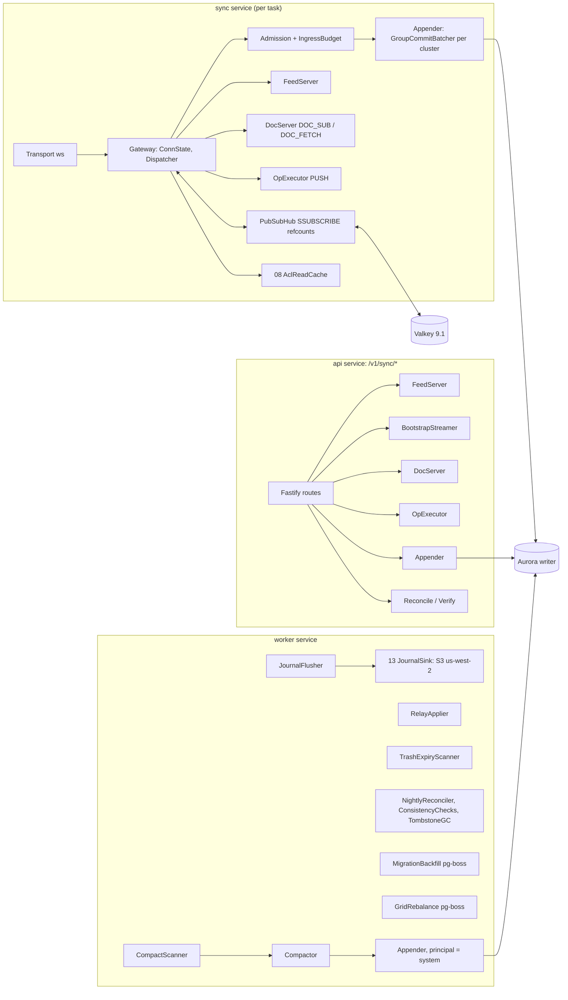
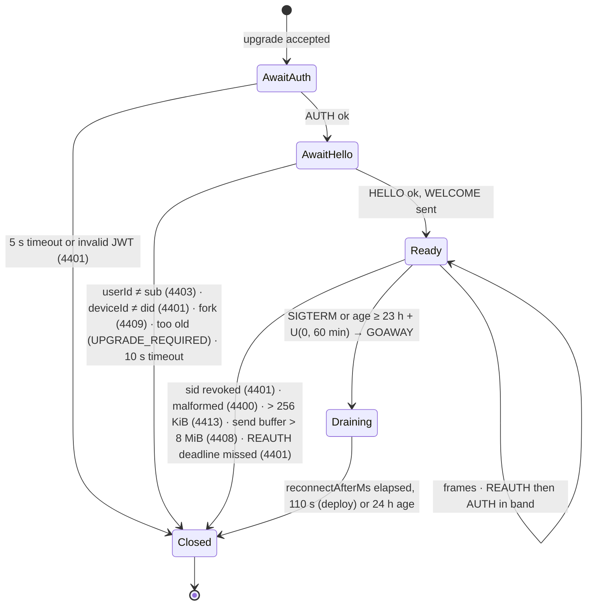
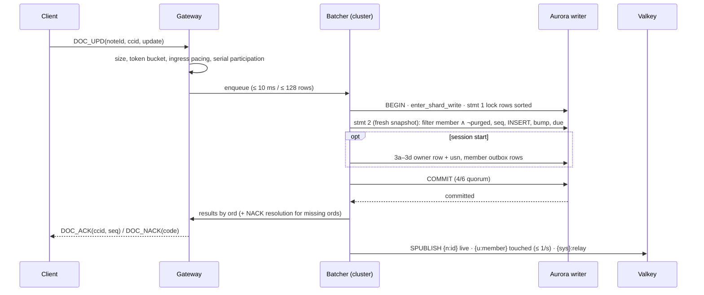
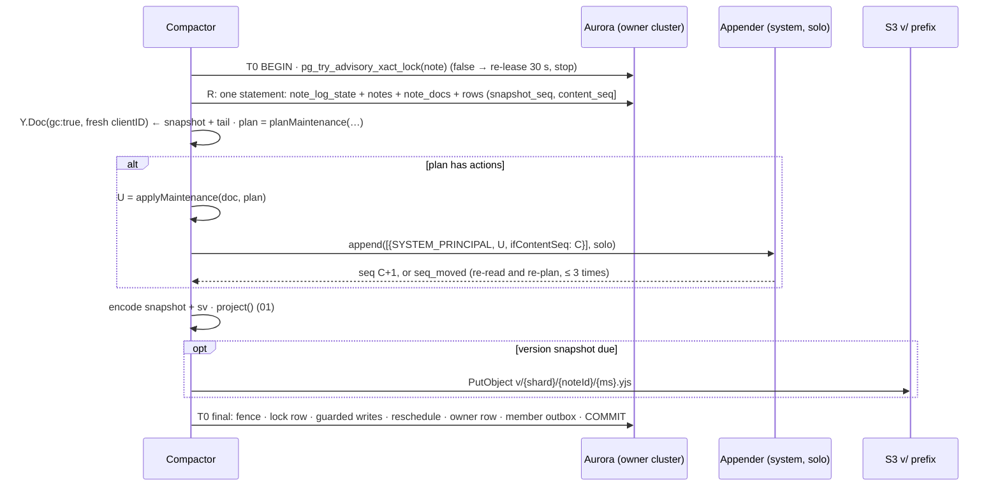
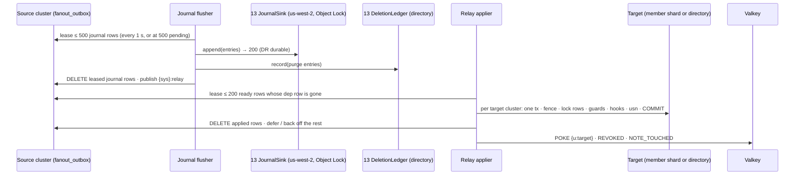

# 03 · Sync Server: Gateway, Group Commit, Feed, Compactor and Fan-out Relay

*Aligned with spine v1.3.*

*Detail document 3 of 16 · elaborates spine v1.3 · 2026-10-04 · Status: draft for review (revision 3: applies spine v1.2 changes C-01 to C-92 and v1.3 changes C-201 to C-247 that touch this subsystem, and the cross-doc requests of 08, 09, 10, 11, 14, 15 and 16). Where behavior changed, the C-id is cited inline.*

## 1. Purpose and scope

This document specifies the server half of KSP v1: everything that runs in the `sync` service, the `/v1/sync/*` routes of the `api` service, and the sync loops of the `worker` service, from a client frame arriving to durable state, live frames and member projections leaving. An engineer should be able to build the subsystem from it without guessing.

In scope:

- **Gateway** (`sync`): the `Transport` interface, handshake and auth wiring, the connection state machine, `HELLO`/`WELCOME` and the resync decision, frame dispatch, per-connection admission, per-user ingress budgets, Valkey subscriptions, live delivery, the read-authorization cache (`ReadAuthzCache`, implementing 08's rules RC-1 to RC-8), deregistration-driven drains (C-235), brownout modes and degraded liveness.
- **Write path**: the global lock order and `withShardWrite`, usn allocation, the `Appender` and group-commit batcher with exact SQL, the correctness argument for INV-5 and INV-6, real-Postgres isolation proofs, NACK reason resolution, metadata-op execution (including native device-token POSTs, C-211), `purgeNote`, the trash-expiry scanner, the grid-key rebalance job and the **Takeout import** job: archive parsing, mapping and append path (P-30, C-239).
- **Read path**: the feed (`PULL`/`FEED`) with card-only pending rows and inline tails; the cursor-first keyset bootstrap stream; `DOC_SUB`/`DOC_FETCH`; `/docs`, `/pull`, `/push`, `/reconcile`, `/verify`.
- **Compaction**: the `compact_due` scheduler, the compactor run, server-origin doc changes (migrations, rebalance, item GC, conversion cleanup, provenance dedupe, and the empty projection-refresh append of `reproject` runs, C-219) through 01's maintenance planner, log retention, version snapshots, migration and re-projection backfills.
- **Fan-out relay**: the `fanout_outbox` payload schema, `OutboxWriter` and `FanoutEmitter` (**owned here**), journal-first ordering, per-field-group guards, the applier registry, the nightly reconciler, consistency checks, the snapshot replay audit and tombstone GC; the `searchDoc` marker path at T-15 (C-225).
- **Caches** (day-1 caches and the T-06 doc cache) and the activation designs for T-04, T-05, T-06, T-07, T-10, T-15 (feed side) and T-17.
- **Testability hooks** the simulator and the test-control plane need: single-step worker entry points and an injected `ServerClock` (16; X-16, C-246).

**Out of scope** (owner in brackets):

- Frame byte layouts, op argument and row-image shapes, close-code values, capability tokens, retry classes, `docHash`, the client SyncEngine [02].
- DDL, indexes, roles and their timeouts, `ShardRouter`, the shard fence function, scanner claim rules R-a/R-b, the deletion ledger, the restore-journal envelope and `JournalSink`, the restore and shard-move runbooks, `restore_parked`, the purge-hook registry, the T-05 partition swap and drop procedure [13].
- `packages/authz` (policies, SQL fragments, `defineNoteCommand`, `runSystemNoteCommand`, `canReadDoc`, read-cache rules RC-1 to RC-8 and their Lua scripts, redaction, chips), sharing ops (`share.*`, `note.leave`, `note.copy`, `invite.*`), `verifyMembership`, the ACL journal body [08].
- Projector, NoteDoc accessors, maintenance planner, migrations registry, `validateNoteCreate`, import and label IDs, HLC and ordering functions [01].
- JWT claims and verification, the sid denylist, `DeviceRegistry`, device tokens, `resolveSyncAuth`, `ACCOUNT_LOCKED`, the account-deletion saga [12].
- Reminder ops, claimer, ledger, coverage, election and `PushSender` [09]. Media upload, attachments (including Takeout attachments through `MediaImporter`), attachment transfer, blob GC and the derived writers that request re-projection [10]. Server search and the T-15 index applier [11]. CDK, `DrainWatcher`, the flag registry, alarm routing, `kspctl` packaging, dashboards [14]. Archive-handling rules, `recordSafetySignal`, account enforcement [15]. The simulator harness, MemStore and the test-control plane contract [16].

## 2. Spine references

| Spine item | Where elaborated here |
|---|---|
| §5.5 incremental sync | §7.1–§7.2 feed and tails, §7.4 `DOC_SUB`/`DOC_FETCH`, §5.7 live delivery |
| §5.6 offline outbox (server side) | §5.6 admission, §6.5 NACK resolution, §7.7 `/push`, §7.9 `/verify` |
| §5.7 partial replication, revocation | §5.8, §6.7, §7.1, §9 |
| §5.8 durability and the write path | §6 |
| §5.9 compaction and snapshots | §8 |
| §5.12 backpressure and budgets | §5.6, §5.9, §7.3, §12 |
| D-18 content durability path | §6.1–§6.6 |
| D-19 flush cadence (server side: `peers`, `DOC_PEERS`) | §5.7 |
| D-22 incremental, live, background (`TOO_LARGE`, `NOTE_TOUCHED`) | §5.7, §7.1, §7.4, §7.6 |
| D-23, D-24 projections, compactor as the only server doc writer, `reproject` runs | §8 |
| D-25 Valkey pub/sub and ephemeral state | §5.6, §5.7, §10 |
| D-27 `ws` behind `Transport` | §5.1, §11.4 |
| D-28 read cache (`ReadAuthzCache`) | §5.8, §10.1 |
| D-32 member fan-out relay | §9 |
| D-33 update-log retention | §8.5, §11.2 |
| D-34 jobs and scanners | §6.8, §6.10, §8.1, §9.4 |
| D-38, D-41 native device-token POSTs (C-211) | §7.7 |
| D-49 deregistration-driven sync drain (C-235) | §5.9 |
| P-30 Takeout import (C-239) | §6.10 |
| INV-2 to INV-7, INV-10, INV-13, INV-14, INV-16, INV-17, INV-18 | Proved or enforced in §6.4, §7, §8, §9, §10; tested in §15 |
| T-04, T-05, T-06, T-07, T-10, T-15 (feed), T-17 | §11 |
| X-01, X-02, X-03, X-05, X-06, X-07, X-10, X-11, X-12, X-16 (test-control plane) | §13, §9, §5.8, §5.9, §12, §15 |

## 3. Interfaces

### 3.1 Owned by this document

| Interface | Section | Consumers |
|---|---|---|
| `FanoutPayload` union and its zod schema; `OutboxWriter`; `FanoutEmitter` (builders `buildJournal`, `buildMemberUpsert`, `buildMemberGroup`, `buildTombstone`, `job`, `emit`); `keep.fanout_member_seq_payload()` body | §9.2, §9.3, §6.3 | 13 (installs the SQL function, restore re-fan-out), 08 (every ACL command), 10 (`uploaderTransfer` writes a `job` row), 11 (`searchDoc` at T-15), 12 (account purge) |
| Relay applier registry and hooks (`registerOutboxApplier`, `RelayHooks`, `FeedRowChange`) and the apply rules | §9.4, §9.5 | 08 (`directoryInvite`, `userEdge`, `SharingApplyHook`), 09 (member removal, trash), 11 (`searchDoc` applier at T-15), 13 (restore waits) |
| `Appender`, `AppendItem`, `AppendResult` | §6.2 | `api` (`/push`), `worker` (compactor, Takeout import), 13 (restore tooling) |
| `withShardWrite` (with a read-only mode), `ShardTx`, `lockNotes`, `lockUsers`, `allocUsn`, `createNoteInTx`, `ServerClock`, the global lock order | §6.1, §6.7 | 08, 09, 10, 12, 13, 16 |
| `purgeNote`, `purgeNoteById`, `registerPurgeTxHook` | §6.8 | 08 (in-tx invite closing), 12 (account saga step 4), 13 (journal replay), 15 (enforcement `removeNote`) |
| `compact_due.reasons` bit assignments, including `REPROJECT` (C-219) | §8.1 | 13 (stores them), 01 (`MaintenancePlan.reasons`), 10 (derived writers set `REPROJECT`) |
| Server-internal pub/sub channels and message encoding | §5.7 | 08 (publishes `{acl:}`), 09 (`reminder_clear`), 12 (`sess:revoked` is 12's), 14 (`{sys}:flags`) |
| `Transport` and `Gateway.drain(reason, closeByMs)` | §5.1, §5.9 | 14 (T-07 deployment; `DrainWatcher` calls the drain, C-235) |
| `ReadAuthzCache` (implements 08's RC-1 to RC-8) | §5.8 | `sync`, `api` (`/docs`, `/reconcile`), 10 (`media.urls`) |
| Server semantics of `/v1/sync/bootstrap`, `/docs`, `/pull`, `/push`, `/reconcile`, `/verify` | §7 | 02 (wire types), 04 |
| Takeout import job, archive reader and mapping (P-30, C-239) | §6.10 | 10 (`MediaImporter.ingest` is called from it), 15 (audits it against §6.8 there) |
| Single-step worker entry points (`compactor.runNote`, `relay.leaseOnce`, `relay.applyRow`, `journalFlusher.flushOnce`, scanners' `scanOnce`, `reconciler.runOnce`) | §6.1, §15.2 | 16 (simulator, test-control plane `runOnce`) |
| Metric names, statement tags (`/* ks:<path> */`), structured log fields | §13 | 13 (trigger queries), 14 (dashboards, alarms), 16 (MemStore repository names) |

### 3.2 Consumed

| Owner | Interface | Minimal assumption this document relies on |
|---|---|---|
| 01 | `validateNoteCreate`, `ids.shardOf`, `ids.timestampOf`, `ids.newYjsClientId`, `ids.importNoteId`, `ids.labelIdFor` (UUIDv5 label IDs) | Pure; run inside the `note.create` transaction or the import job |
| 01 | `HlcClock`, `clampIncoming`, `lwwDecide`, `opStatus` | Server keeps one clock per process; clamp at +60 s (INV-15) |
| 01 | `project(input, h): Projection`, `PROJECTION_VERSION`, `DerivedInputs` | Deterministic; `overLimit` is an `int` bitmask stored as such (C-42); `DerivedInputs{source:'server'}` takes OCR text and link-preview rows; `search_text` = content + U+001E + extra |
| 01 | `planMaintenance`, `applyMaintenance`, `GcSeen`, `Migration`, `MIGRATIONS_V1`, `rebalance()`, settings catalogue | Pure; `applyMaintenance` returns one update or `null`; `plan.reasons` uses the bits of §8.1; `GcSeen` persists in `note_docs.gc_meta` (C-01) |
| 02 | Frame codecs (socket and HTTP frame streams `application/x-ksp-frames`), row images, close codes (02 §6.5, C-23), capability tokens (02 §6.6), retry classes (C-19), `docHash` (02 §12, C-16), binary pack encoding for `/docs`, the resync decision table (02 §6.4) | Envelope `[type][reqId][flags][traceparent?][payload]`; replies echo `reqId`; multi-frame replies set `MORE` on all but the last |
| 08 | `defineNoteCommand` (with `prepare`), `runSystemNoteCommand`, `NoteCmdCtx`, `LockedNoteTx`, `NoteFacts`, `evaluate` | Commands open their transaction through 03's `withShardWrite` (fence first) and take lock 2 through 03's `lockNotes`, always `FOR UPDATE` (08 §4.5 rule 2) |
| 08 | SQL fragments `APPEND_ALLOWED_I`, `NOT_PURGED_N`, `APPEND_DENIAL`, `USER_NOTE_FOR_SHARE` and its `FOR UPDATE` variant (C-14), `READ_FACTS`, `REVALIDATE_BATCH`; `SYSTEM_PRINCIPAL`; `accessDecision`, `perUserDecision`, `canReadDoc` | Embedded verbatim (CI check, 08 §4.11) |
| 08 | Read-cache rules RC-1 to RC-8, Lua scripts `acl_fill` / `acl_invalidate`, `AclMessage`, `publishAclChange` | 03's `ReadAuthzCache` implements them (§5.8) |
| 08 | `redactUserNoteRow`, `PENDING_ROW_FIELDS`, `projectionVariantFor`, `cardFromProjection`, `MemberChip`, `SharerChip`, `CardProjection` (= 01's `PendingCard`, with `facets`) | Called on every `user_notes` row the feed, bootstrap and `/pull` serialize |
| 08 | `verifyMembership(userId, noteId)` | Returns `tombstone{reason}`, `waiting` or `repair{variant, memberEpoch}` |
| 08 | Appliers for `directoryInvite` and `userEdge`; `SharingApplyHook.onNewMembership` (block check) | Idempotent, guarded by `slot_epoch` / edge state |
| 09 | `RelayHooks.onMemberRemoved`, `onTrashChanged`, `wakeForSharedChange`; `ReminderHelloHook.onHello`; `ReminderSettingsHook.onApplied`; `reminder.*` op handlers | Relay hooks run inside the target transaction at lock level 6, never lock `users_sync` themselves and return `FeedRowChange[]` (09's return `[]`) |
| 10 | Purge hooks (`attachments.release`, `link_previews.delete`); `uploaderTransfer(writer, …)` (a journal-gated `job` row, `media.transferUploader`); `MediaProjectionHook.onProjected`; `MediaImporter.ingest`; `requestDerivedRefresh` (sets `REPROJECT`) | Registered in 13's purge registry; the hook runs in the compactor's final transaction under the lock row |
| 11 | `searchDoc` applier (T-15) | Registered at activation; reads current rows (§11.7) |
| 12 | `JwtVerifier`, `KspPrincipal`, `SessionDenylist`, `DeviceRegistry.hello` / `touch`, `HelloResult`, `resolveSyncAuth`, `SyncPrincipal`, `DeviceTokenPrincipal`, `device.*` handlers | Close codes as 02 §6.5 fixes them (C-23): 4401, 4403 `ACCOUNT_MISMATCH`, 4409 `DEVICE_FORKED` |
| 13 | DDL of every `keep.*` and `directory.*` table used here; `keep.note_updates_r` view; roles, their timeouts (13 §1.2) and connection budget | As in 13 §1–§3 |
| 13 | `ShardRouter`, `ops.enter_shard_write(shards)`, SQLSTATE `KS001`, scanner claim rules R-a (owned shards only) and R-b (fence before deleting claimed rows) | Fence before any row lock; `fenced` refuses writes, `moving` does not |
| 13 | `DeletionLedger`, `JournalSink`, `RestoreJournalEntry`, `RestoreParked.applyFor`, `restore_events.window_ends_at`, `restore_waits`, `user_notes.restore_wait_until` | Ledger rows are written by the relay after the journal PUT |
| 13 | Purge-hook registry, `keep.purge_runs`, husk GC, the guarded `log.drop` procedure (T-05) | `note.purgeData` orchestrates the note-scope hooks; 03 schedules `log.drop` |
| 14 | `DrainWatcher.onDrain(cb(reason, closeByMs))`; flag registry (`sync.mode`, `sync.docLive.enabled`, `sync.noteTouched.enabled`, `presence.enabled`); metric registry | Drain starts at deregistration (C-235); flags reach processes through `{sys}:flags` and a 30 s refresh |
| 15 | `recordSafetySignal`, `SafetySignalKind`; archive-handling rules (15 §6.8) | Never throws to the caller; enums and counts only (X-01) |
| 16 | Test-control plane (`TestControlV1.runOnce`, `shiftNote`); MemStore below the `ShardTx` boundary | Calls 03's single-step entry points; never fakes Postgres `now()` (X-03, C-246) |

## 4. Components and process placement



| Module (`apps/server/src/…`) | Runs in | Notes |
|---|---|---|
| `sync/transport/{types,ws}.ts` | sync | `Transport` (§5.1). `uws.ts` at T-07 |
| `sync/gateway/*` | sync | Connection state machine, dispatcher, admission, subscriptions, live delivery |
| `sync/write/{shard-tx,usn,locks}.ts` | all | `withShardWrite`, `lockUsers`, `allocUsn`, lock-order assertions (§6.1) |
| `sync/append/*` | sync, api, worker | `Appender`, `GroupCommitBatcher`, SQL (§6.3). One batcher per physical cluster per process |
| `sync/ops/*` | sync, api | `OpExecutor` and the 03-owned handlers (§6.7). Other documents register handlers |
| `sync/purge/*` | all | `purgeNote`, in-tx purge hooks, `note.purgeData` orchestrator (§6.8) |
| `sync/feed/*`, `sync/bootstrap/*`, `sync/docs/*`, `sync/http/*` | sync, api | Read paths and HTTP routes (§7) |
| `sync/fanout/*` | all | Payload types, zod schema, `OutboxWriter`, `applyMemberPayload`, applier registry (§9) |
| `worker/compactor/*`, `worker/relay/*`, `worker/scanners/*`, `worker/reconcile/*` | worker | §6.8, §8, §9 |
| `sync/pubsub/*`, `sync/cache/*` | all | §5.7, §10 |

**Database access.** Direct connections to the Aurora writer (no proxy), through 13's `ShardRouter.writer(shard)` handles (`pg` pools). Every hot statement starts with a path tag comment so 13's trigger queries can attribute it (§13.3). Pools per process per cluster, inside 13's day-1 budget (13 §1.2: about 130 connections per cluster):

| Pool | Role (13) | sync task | api task | worker task | Use |
|---|---|---|---|---|---|
| `append` | `keep_sync` / `keep_api` / `keep_worker` | 6 | 4 | 2 | Group commits (≤ 4 in flight per batcher) |
| `ops` | same | 4 | 4 | — | `PUSH` ops, `/push`, `/verify` writes |
| `read` | same | 6 | 8 | — | Feed, `DOC_SUB`/`DOC_FETCH`, bootstrap pages, `/docs` packs |
| `work` | `keep_worker` | — | — | 14 | Compactor (8), relay (4), scanners (2) |
| `pgboss` | `keep_worker` | — | — | 8 | pg-boss's own pool |
| `directory` | per service | 2 | 2 | 2 | Shard map refresh, ledger reads, `shard_epoch_log` |

Role timeouts come from 13 (`keep_sync`: `statement_timeout` 2 s, `lock_timeout` 1 s; `keep_api` and `keep_worker`: `lock_timeout` 2 s). Code lowers them per statement with `SET LOCAL` where §12 says so; it never raises them.

## 5. Gateway

### 5.1 Transport interface (D-27)

The gateway never imports `ws`. Swapping to uWebSockets.js at T-07 replaces one file.

```ts
// apps/server/src/sync/transport/types.ts
export interface Transport {
  readonly kind: 'ws' | 'uws';
  start(opts: TransportOptions, onConn: (c: TransportConn, h: HandshakeInfo) => void): Promise<void>;
  stopAccepting(): Promise<void>;      // SIGTERM: refuse upgrades (503), keep existing sockets
  shutdown(): Promise<void>;           // close everything (after the drain)
}
export interface TransportOptions {
  port: number;
  path: '/v1';
  maxInboundFrameBytes: number;        // 256 KiB payload + 64 B envelope slack (spine §5.3)
  handshakesPerSec: number;            // 500 per task (spine §5.12); excess answered 503 + Retry-After before upgrade
}
export interface HandshakeInfo { remoteIp: string; acceptedAt: number }
export type SendClass = 'control' | 'reply' | 'live';   // 'live' may be dropped when the socket lags (§5.9)
export type SendOutcome = 'sent' | 'dropped' | 'closed';
export interface TransportConn {
  readonly id: string;                 // process-unique UUIDv7
  send(frame: Uint8Array, cls: SendClass): SendOutcome;
  bufferedBytes(): number;
  pauseReading(): void;                // TCP backpressure; never drops inbound data
  resumeReading(): void;
  ping(): void;
  close(code: number, reason: string): void;
  onFrame(cb: (data: Uint8Array) => void): void;
  onPong(cb: () => void): void;
  onClose(cb: (code: number) => void): void;
}
```

`ws` implementation: `new WebSocketServer({ noServer: true, maxPayload: 262_208, perMessageDeflate: false, clientTracking: false })` on a bare `http.Server` behind the `sync.<domain>` target group. Deflate is off: Yjs payloads compress poorly and per-socket deflate state costs about 300 KB at 25k sockets per task. `pauseReading` maps to `ws.pause()`/`resume()` (exact `ws` 8.x version pinned in M0, OQ-03-2). An oversized frame makes `ws` close with 1009; the adapter maps it to `TOO_LARGE` (§5.2).

**Handshake admission.** A per-task token bucket (500/s, burst 500) runs in the HTTP `upgrade` handler before any WebSocket work; a refused upgrade gets `503` with `Retry-After: U(1, 10)` seconds (spine §5.12).

**Heartbeat** (D-27). A 5 s sweep pings sockets with no inbound frame for 30 s; a socket that has not answered 30 s after a ping is terminated. Active sockets are never pinged. The ALB idle timeout is 4,000 s (D-43).

### 5.2 Connection state machine



Close codes are owned by 02. This document uses 12's proposed values for auth (4401 with reasons `AUTH_TIMEOUT`, `AUTH_INVALID`, `AUTH_EXPIRED`, `SESSION_REVOKED`, `DEVICE_MISMATCH`; 4403 `ACCOUNT_MISMATCH`; 4409 `DEVICE_FORKED`) and proposes 4400 `MALFORMED`, 4413 `TOO_LARGE`, 4408 `SLOW_CONSUMER`, 4426 `UPGRADE_REQUIRED`; drains end with 1001. Code uses symbolic names only.

Per-connection state lives in memory only:

```ts
interface ConnState {
  id: string; phase: 'await_auth' | 'await_hello' | 'ready' | 'draining';
  principal?: KspPrincipal;                  // 12: userId, homeShard, sessionId, deviceId, expiresAtMs
  proto?: number; caps: Set<string>; openedAt: number;
  // admission (§5.6)
  bucket: TokenBucket;                       // 50 burst, 10/s
  docQueue: DocUpdFrame[];                   // admitted, not yet in a commit, FIFO
  commitInFlight: boolean;                   // at most one group-commit participation
  unacked: { frames: number; bytes: number };
  pushInFlight: Set<number>;                 // lanes with a PUSH being executed
  pullInFlight: boolean;
  fetchInFlight: number;                     // DOC_FETCH, ≤ 2
  // live (§5.7)
  subs: Map<string /*noteId*/, SubState>;
  lagging: boolean;
}
interface SubState {
  noteId: string; noteShard: number;
  sentSeq: bigint | null;                    // null until DOC_SYNC is sent
  buffer: LiveMsg[]; bufferBytes: number; bufferDeadline?: number;
  droppedSince?: bigint;                     // set when live frames were dropped while lagging
  revalidateAt: number;                      // subscribe time + 60 s ± 5 s, then every 60 s
}
```

### 5.3 AUTH and REAUTH (D-41)

- The first frame must be `AUTH{jwt}` within 5 s. The gateway calls 12's `JwtVerifier.verify(jwt)`, which checks signature, claims and the per-sid denylist (local set, then Valkey). Any failure closes 4401 with the mapped reason. The verifier needs no database hit (12 §6.3).
- The connection is indexed by `sid` (`Map<sid, Set<ConnState>>`). 12's `SessionDenylist.onRevoked` callback closes every local socket of that sid with 4401 `SESSION_REVOKED`, except reason `replaced`, which sends `REAUTH{deadline: now + 30 s}`.
- At `principal.expiresAtMs − 120 s` the gateway sends `REAUTH{deadline: expiresAtMs}`. An in-band `AUTH` must carry the same `sub` and `did`; a different `sid` replaces the old one in the index. Without a valid `AUTH` by the deadline the socket closes 4401 `AUTH_EXPIRED`. Timers live in a per-second timing wheel.
- Socket lifetime cap: at age `23 h + U(0, 60 min)` the gateway sends `GOAWAY{reconnectAfterMs: U(0, 30 s)}` and closes at 24 h if the client stays (12 §6.4).

### 5.4 HELLO and WELCOME

`HELLO{proto, userId, deviceId, installNonce, continuity?, appVersion, platform, caps, docSchemaMax, cursor?, hlc, tz, foreground}` is handled in this order:

1. `proto` older than the oldest supported version (builds older than 6 months, spine §5.10), or `appVersion < flags.minAppVersion` → send `UPGRADE_REQUIRED{minAppVersion}` and close `UPGRADE_REQUIRED`.
2. `userId ≠ principal.userId` → close 4403 `ACCOUNT_MISMATCH` (INV-18). `deviceId ≠ principal.deviceId` → close 4401 `DEVICE_MISMATCH`.
3. `DeviceRegistry.registerOnHello(principal, helloIdentity)` (12 §9.2) runs one short transaction on the user's shard. `{ok: false}` → close 4409 `DEVICE_FORKED`. The returned `outcome` and `continuity` go into `WELCOME`.
4. HLC: `clampIncoming(hello.hlc, now)` then `serverClock.merge(...)` (01, INV-15).
5. Read `users_sync(usn, user_epoch, tombstone_floor_usn, primary_device_id)` on the user's shard, and `ShardRouter.info(homeShard)` for the shard epoch.
6. Decide `resync` (first matching row wins):

| Condition | `resync` | Notes |
|---|---|---|
| No cursor (fresh DB) | `full` | The client bootstraps over HTTP (§7.3), then reconnects with `cursor: S` |
| `cursor.shardEpoch < shard.epoch` | strongest reason in `directory.shard_epoch_log` for epochs in `(cursor.shardEpoch, shard.epoch]`: `restore` > `full` (also `operator`) > `meta` | One indexed directory read, only when behind |
| `cursor.userEpoch < users_sync.user_epoch` | `full` | User epochs are bumped only for projection-format changes (spine §5.11) |
| `cursor.usn < tombstone_floor_usn` | `meta` | |
| `cursor.usn > users_sync.usn` | `restore` | The server is behind the client without an epoch bump. Should never happen; emits `keep.gw.cursor_ahead` and alarms |
| otherwise | `none` | |

7. For `resync ≠ none`, assign `notBefore` from the per-cluster resync admission bucket `rsadm:{c:<cluster>}` in Valkey (Lua token bucket). Its rate comes from 13 §9.6: `devicesPerMinute = 0.3 × commitCapacityRowsPerSec × 60 / (1.2 × meanNotesPerUser)`, configured per cluster (§12). `notBefore = now + wait + U(0, wait)`. If Valkey is down, `notBefore = now + U(0, 120 s)`.
8. Subscribe the process to `{u:<userId>}` (refcounted, §5.7), then send `WELCOME{serverHlc, serverTime, epochs, resync, notBefore?, minAppVersion, flags, primaryDeviceId, limits, registration, continuity}`. `limits` carries the client-visible values of §12 (`maxFrame`, `maxInflightFrames`, `maxInflightBytes`, `docFramesPerNote`).
9. If `resync = none` and `users_sync.usn > cursor.usn`, send `POKE{usn}` immediately so the client pulls without waiting for a publish.

`devices.last_seen_at` is written by `DeviceRegistry` (coalesced to once per 5 min, 12 §9.7).

### 5.5 Frame dispatch

Frames are decoded by 02's codecs and validated strictly with zod (D-15). A decode or validation failure closes the socket with 4400 and logs `frame_type` and the zod issue path, never the payload (X-01).

| Frame | Handler | Concurrency per connection |
|---|---|---|
| `PULL{usn, limit}` | `FeedServer.page` (§7.1) | 1 in flight; a second PULL waits |
| `PUSH{batchId, lane, ops}` | `OpExecutor.run` (§6.7) | 1 in flight per lane |
| `DOC_SUB{noteId, sv, serverSeq}` / `DOC_UNSUB` | `DocServer.subscribe` (§7.4) | ≤ 16 subscriptions; a 17th unsubscribes the least recently used |
| `DOC_UPD{noteId, ccid, update}` | Admission, then `Appender` (§5.6, §6) | Serial group-commit participation |
| `DOC_FETCH{items ≤ 100}` | `DocServer.fetch` (§7.4) | 2 in flight |
| `AUTH` (in band) | §5.3 | — |
| `AWARE` | v1.1 presence; ignored on day 1 | — |

`PUSH` and `DOC_UPD` from one connection are independent. The only ordering the server relies on is the client's lanes, per-note FIFO and `blocked_on` (spine §5.6, D-20). The server never reorders frames within a lane.

### 5.6 Per-connection admission and ingress budgets

**Message rate** (spine §5.12). Every inbound frame takes one token from a bucket of 50 burst, refilled at 10/s. With the bucket empty the gateway calls `pauseReading()` until a token is available and sends `SLOW_DOWN{ms}` at most once per 5 s. Frames are never dropped; excess load becomes TCP backpressure (INV-4, X-12).

**In-flight window.** With `unacked.frames ≥ 32` or `unacked.bytes ≥ 1 MiB` (admitted `DOC_UPD` and `PUSH` without a reply), reading pauses until replies free capacity. This enforces the client's window (spine §5.6) on the server.

**Serial commit participation** (D-18, spine §5.8). A connection has at most one group-commit participation in flight. When it is idle, it moves the head of `docQueue` (up to 32 frames and 1 MiB, all for the same physical cluster as the head frame) into its cluster's batcher. Frames for another cluster wait for that commit to finish. Each frame gets its own `DOC_ACK` or `DOC_NACK`, sent in admission order after the commit returns. Per-device commit order is preserved without one transaction per frame.

**Shard availability.** Before queueing, the gateway reads `ShardRouter.info(shardOf(noteId)).state`. Only `fenced` refuses: `DOC_NACK{RETRY_LATER}` immediately, and `RETRY_LATER{lane, ms: 1000–3000}` for a `PUSH` on that lane. `moving` stays writable (13 §5.3). The router cache is advisory; the database fence (§6.1, `KS001`) is what guarantees safety.

**Per-user ingress budgets** (spine §5.12, X-12). Counted across all of a user's sockets and HTTP pushes in Valkey; each process batches its increments every 1 s:

| Budget (free tier) | Valkey key (TTL 48 h) | Pacing when exceeded |
|---|---|---|
| 20 MiB/day of CRDT bytes | `ing:{u:<id>}:<yyyymmdd>` (`INCRBY`) | Admit at 64 KiB/min until 00:00 UTC |
| 2,000 creates/day | `cre:{u:<id>}:<yyyymmdd>` | One `note.create` per 30 s |
| 200 metadata ops/min | `ops:{u:<id>}:<yyyymmddHHMM>` | The PUSH lane at 200/min |

Pacing is one Lua script per user, `pace:{u:<id>}`: `next = max(now, stored) + cost / rate; SET; RETURN next − now`. The gateway holds the frame in `docQueue` (or the PUSH batch) that long before admitting it. The client sees slower acks; nothing is rejected (INV-4). When a user first crosses 50% and 100% of the byte budget in a UTC day, the gateway writes `users_sync.ingress_bytes_day` and `ingress_day` once (13 §3.1), so 15 can audit outliers without a write per append. More than 3× a budget in a day emits `keep.ingress.outlier` and an abuse signal for 15. If Valkey is unavailable, budgets fall back to per-process counters: abuse controls fail open, durability never depends on them.

### 5.7 Pub/sub, subscriptions and live delivery

**PubSubHub.** One Valkey connection per process for `SSUBSCRIBE`, one for `SPUBLISH`. Subscriptions are refcounted per process; a socket never owns a Valkey subscription. Channels (D-25; every name has a hash tag so T-08 cluster mode needs no rename):

| Channel | Published by | Messages |
|---|---|---|
| `{u:<userId>}` | Any writer after a commit that bumped the user's usn; relay; 08 (`REVOKED`); 09 | `poke{usn}`, `touched{noteId, seq}`, `revoked{noteId, reason}`, `reminder_clear{noteId, occ}` |
| `{n:<noteId>}` | Appenders after commit | `live{…}`, `live_ref{…}` |
| `{acl:<noteId>}` | 08's `publishAclChange` | 08's `AclMessage` |
| `sess:revoked` | 12 | 12's revocation message |
| `{sys}:shardmap` | 13 (`kspctl`, shard moves) | `<version>` |
| `{sys}:relay:<cluster>` | Any writer that inserted `fanout_outbox` rows; the journal flusher | empty (wake-up) |

Message encoding (server-internal, owned here): lib0 `[u8 kind][varuint version = 1][fields…]`; byte arrays are length-prefixed; seqs are varuint (below 2^53 even after restore jumps).

```ts
// apps/server/src/sync/pubsub/messages.ts
export type LiveRow = { seq: bigint; originConnId: string | null; author: 'user' | 'system'; upd: Uint8Array };
export type NoteMsg =
  | { t: 'live'; noteId: string; fromSeq: bigint; toSeq: bigint; commitMs: number; rows: LiveRow[] }  // contiguous, seq order
  | { t: 'live_ref'; noteId: string; fromSeq: bigint; toSeq: bigint; commitMs: number };              // rows > 192 KiB
export type UserMsg =
  | { t: 'poke'; usn: bigint }
  | { t: 'touched'; noteId: string; seq: bigint }
  | { t: 'revoked'; noteId: string; reason: RemovedReason }
  | { t: 'reminder_clear'; noteId: string; occ: string };
```

**Publishing after a commit.** The batcher's `onCommitted(notes)` runs after `COMMIT` returns and after the acks are queued on the originating sockets, so an author never sees its own live frame before its ack:

1. Per committed note: `SPUBLISH {n:<noteId>} live{fromSeq, toSeq, commitMs, rows}`; `live_ref` instead if the rows exceed 192 KiB.
2. `NOTE_TOUCHED` (≤ 1/s per note, D-22): `SET nt:{n:<noteId>} <toSeq> NX PX 1000`. On success, publish `touched{noteId, toSeq}` to `{u:<member>}` for every **active** member in the member-list cache (§10.1), the author included (their other devices). On failure, schedule one trailing publish at the key's expiry with the latest seq. Pending members are never touched (P-15).
3. If the commit inserted outbox rows, publish `{sys}:relay:<cluster>`.

**Delivering `live` to a subscription.**

- **Ordering.** The gateway keeps `sentSeq` and a reorder buffer per subscription. A message with `fromSeq = sentSeq + 1` is delivered and drains buffered successors; one with `toSeq ≤ sentSeq` is discarded; one ahead of `sentSeq + 1` is buffered for up to 300 ms (≤ 32 messages or 256 KiB), because two appenders can commit seqs 10 and 11 and publish them in either order. On timeout the buffered messages are delivered anyway and the client's gap rule (spine §5.5 step 4) fetches.
- **Own rows removed.** For a subscriber on connection `c`, the gateway sends `DOC_LIVE{noteId, fromSeq, toSeq, update}` with `update = Y.mergeUpdates(rows where originConnId ≠ c.id)` and the full seq range. If no foreign row remains, it sends nothing (the `DOC_ACK`s already advanced the client). Assumption on 02 and 04: the client treats `[fromSeq, toSeq]` as covered when it applies a `DOC_LIVE`, since its own rows in that range are already in its doc (04 §11.6 does).
- Merges are computed once per (message, origin) per process, not per subscriber.
- `live_ref`, or a merged update above 240 KiB, becomes `NOTE_TOUCHED{noteId, toSeq}` for that connection; the client fetches (§7.4).
- Optional additive `commitMs` on `DOC_LIVE` (04 S-11) is filled from the message when 02 adopts it.

**`peers`** (D-19). A Valkey sorted set `peers:{n:<noteId>}` holds `connId` scored by expiry. `DOC_SUB` adds the connection (score `now + 45 s`), a 20 s sweep refreshes local subscriptions, `DOC_UNSUB` and close remove it. `peers = ZCOUNT(peers:{n:}, now, +inf) − 1` goes into every `DOC_SYNC`; another device of the same user counts as a peer. When the count for a note crosses 0 ↔ 1, the gateway sends the proposed additive `DOC_PEERS{noteId, peers}` to local subscribers whose client advertises cap `peers1` (S-04); otherwise the 60 s anti-entropy `DOC_SUB` refreshes it.

### 5.8 Read authorization and revalidation (D-28, X-05)

`DOC_SUB`, `DOC_FETCH` and `/sync/docs` authorize through 08's `AclReadCache` (node LRU plus Valkey hash `{acl:<noteId>}:m`, epoch-guarded). Writes never consult it (INV-5).

| `ReadDecision` | `DOC_SUB` | `DOC_FETCH` item | `/docs` record |
|---|---|---|---|
| `allow` | Subscribe (§7.4) | Serve | Serve |
| `FORBIDDEN` | `REVOKED{noteId, reason: 'revoked'}` | Same | `{noteId, error: 'FORBIDDEN'}` |
| `NOTE_PURGED` | `REVOKED{noteId, reason: 'purged'}` | Same | `{noteId, error: 'NOTE_PURGED'}` |
| `NOTE_UNKNOWN` | `DOC_NACK{noteId, code: 'NOTE_UNKNOWN'}` with the request's `reqId` and no `ccid` (proposed, S-15) | Same | `{noteId, error: 'NOTE_UNKNOWN'}` |

The gateway wires 08's revalidation table (08 §4.7):

| Trigger | Gateway action |
|---|---|
| `{acl:<noteId>}` message | `onInvalidate(msg)`, then `checkFresh` every local subscriber of the note; a denied one gets `REVOKED` and is dropped |
| `{u:<userId>}` `revoked` | Drop that user's subscriptions to the note on every local connection; forward `REVOKED` |
| `SubState.revalidateAt` reached | Batched `checkMany` per process every second for due subscriptions; drop denied ones |
| Valkey reconnect | `flushLocal()`; `checkFresh` every live subscription, 32 in flight per process, spread over 10 s |

### 5.9 Send buffer, drains and degraded liveness

| Condition | Behavior |
|---|---|
| `bufferedBytes > 1 MiB` | Mark lagging; drop `live` class frames (`DOC_LIVE`, `NOTE_TOUCHED`, `POKE`); record `droppedSince` per subscription |
| Lagging and `bufferedBytes < 256 KiB` | Clear lagging; send `POKE{current usn}`; send `NOTE_TOUCHED{noteId, contentSeq}` for every subscription with dropped frames (INV-7) |
| `bufferedBytes > 8 MiB` (replies included) | Close 4408 |
| SIGTERM | `stopAccepting()` (ALB deregistration delay 120 s); send every socket `GOAWAY{reconnectAfterMs: U(0, 120 s)}`; stop admitting `DOC_UPD`/`PUSH` from a socket once its GOAWAY is sent but finish in-flight commits and send their acks; close each socket when its `reconnectAfterMs` elapses, at most 110 s after SIGTERM |
| Valkey disconnected | Commits continue; live delivery stops. Each process pokes its own sockets after local commits that touch their users, and every 30 s reads `users_sync.usn` for its connected users (batches of 1,000) and sends `POKE` where it advanced. On reconnect: re-subscribe, revalidate (§5.8), and give each subscription a server-side catch-up: the raw tail `(sentSeq, content_seq]` as `DOC_LIVE` frames, or `NOTE_TOUCHED` if `sentSeq < log_floor_seq` |

## 6. Write path

### 6.1 Lock discipline, `withShardWrite` and usn allocation

Every write transaction on a shard follows one global lock order. Code takes locks only through the helpers below, which sort keys in TypeScript (byte order of `shard_id`, then the UUID's 16 bytes, which equals Postgres `uuid` order).

| Level | Lock | Taken by |
|---|---|---|
| 0 | Per-note advisory `pg_try_advisory_xact_lock(hashtextextended(note_id::text, 0))` (one-bigint key space) | Compactor only, at the start of its run transaction (D-24) |
| 1 | **Shard write fence**: `ops.enter_shard_write(shards[])`, a shared advisory lock on `(1263751238, shard)` per shard, ascending, plus the `ops.local_fence` check (13 §5.3; two-int4 key space, so it never collides with level 0) | Every write transaction on a shard |
| 2 | `note_log_state` rows, `FOR UPDATE` (or `FOR SHARE` for 08's share-mode commands), sorted `(shard_id, note_id)` | Group commit; every note-scoped command; every membership change; every purge; the compactor's final write; retention floor raises |
| 3 | `notes` rows | Note-scoped commands, compactor, purge |
| 4 | `note_members`, `note_invite_slots` rows | Membership and invite changes (08) |
| 5 | `compact_due` rows | Group commit (`due` CTE), compactor, purge, backfill, claim scanner |
| 6 | Per-user rows, in table order `user_notes` < `labels` < `note_labels` < `reminders` < `reminder_fires` < `reminder_device_coverage` < `user_settings` < `devices` < `user_contacts` < `user_blocks` < `restore_waits`; sorted keys within a table | Feed writers (ops, relay, group-commit session start, compactor owner row, 09, 12) |
| 7 | `users_sync` rows, sorted `(shard_id, user_id)` | usn allocation, always last |
| — | Inserts into `note_updates`, `fanout_outbox`, `pgboss.job` | No contention |

Rules:

- **R1.** A transaction acquires locks in ascending level order, and in sorted key order within a level.
- **R2.** Every transaction that changes `note_members` or sets `notes.purged_at` holds level 2 `FOR UPDATE` for that note before it does so (INV-5). 13 installs `BEFORE` triggers on both that take the lock row if a caller forgot (13 §3.5); a correct caller already holds it.
- **R3.** Rows at levels 3–5 for a note are written only by transactions that hold its level-2 lock `FOR UPDATE`. Three exceptions: `note.create` inserts rows that did not exist (a concurrent duplicate create waits on the `notes` primary key, then does nothing), and two writers touch only `compact_due` and nothing else: the claim scanner (`SKIP LOCKED`, never waits) and the migration backfill. Every multi-row write to `compact_due` (the group commit's `due` CTE, the backfill) is issued in sorted key order (`INSERT … SELECT … ORDER BY shard_id, note_id`).
- **R4.** A transaction touches one physical cluster. Cross-cluster effects go through `fanout_outbox` (D-32). The relay commits on the target cluster before it deletes the outbox row on the source (§9.4).
- **R5.** usns are allocated last: **lock, decide, allocate, write**. A feed writer first locks the per-user rows it may change (level 6), decides which change, then allocates exactly that many usns from `users_sync` (level 7), then writes them. A transaction allocating for more than one user locks their `users_sync` rows in sorted order first (`lockUsers`). 12's `registerOnHello` (devices row, then `users_sync`) already follows this.
- **R6.** `notes` is never written on the append path (D-18).
- **R7.** The fence is always the first lock (`withShardWrite` takes it before handing over the transaction). A shard move takes the exclusive form (13 §5.4 step 2): it waits for in-flight writers, then blocks new ones, which give up at `lock_timeout` with `55P03` and answer `RETRY_LATER`. After the flip, `ops.local_fence` makes late writers fail with `KS001`. "No acked write after the final catch-up" is therefore a database guarantee, not a gateway race (S-07).

**Deadlock freedom.** Levels 0, 1, 2 and 7 are always acquired in the global order. Levels 3–5 are per-note and guarded by level 2 `FOR UPDATE`: two transactions that both write them for note *n* serialize on *n*'s lock row before reaching them, so their relative order inside 3–5 cannot form a cycle (08's `share.invite` writes `note_members` before `notes`; that is safe for this reason). `FOR SHARE` holders of level 2 (08's `note.copy`, `media.commit`) never write levels 3–5. The two lock-row-free `compact_due` writers take only level-5 locks in sorted order. Level 6 is acquired in the fixed table order and level 7 last. A residual deadlock would be a bug: Postgres detects it within `deadlock_timeout` (1 s), the transaction is retried once, and `keep.pg.deadlocks` opens a ticket.

```ts
// apps/server/src/sync/write/shard-tx.ts
export interface ShardTx {
  readonly clusterId: string;
  readonly shards: readonly number[];          // fenced shards, ascending
  readonly txNowMs: number;                    // now() of this transaction (X-03)
  readonly srcTx: string;                      // UUIDv7, stamped into every outbox row (tracing)
  readonly outbox: OutboxWriter;               // §9.3; flushed before COMMIT
  query<R>(sql: string, params?: unknown[]): Promise<R[]>;
  afterCommit(fn: () => void | Promise<void>): void;   // publishes; best effort
}
export interface ShardWriteOpts {
  role: 'sync' | 'api' | 'worker';
  lockTimeoutMs?: number;                      // may only lower the role default
  statementTimeoutMs?: number;
  tag: 'append' | 'op' | 'relay' | 'compact' | 'scan' | 'purge';
}
/**
 * BEGIN (READ COMMITTED) on the cluster that owns every shard in `shards` (13 ShardRouter; throws
 * ShardFencedError if any is 'fenced' in the router cache), then
 *   SELECT ops.enter_shard_write($1::smallint[]), now()
 * then runs fn, flushes the OutboxWriter, COMMITs, then runs afterCommit hooks.
 * KS001 and 55P03 on the fence surface as ShardFencedError (→ RETRY_LATER). Retries once on 40P01.
 */
export function withShardWrite<T>(shards: readonly number[], opts: ShardWriteOpts,
                                  fn: (tx: ShardTx) => Promise<T>): Promise<T>;

/** Level 7 for several users: SELECT … FROM keep.users_sync WHERE … ORDER BY shard_id, user_id FOR UPDATE. */
export function lockUsers(tx: ShardTx, users: ReadonlyArray<{ shard: number; userId: string }>): Promise<void>;

/**
 * Level 7: UPDATE keep.users_sync SET usn = usn + $n WHERE (shard_id, user_id) = ($s, $u) RETURNING usn.
 * Returns the first of n fresh usns (usn − n + 1). Called after all level-6 locks of the transaction.
 * The caller assigns them to rows in write order; every feed row gets its own usn (13 §3.13).
 * Afterwards the caller registers afterCommit(publish {u:<userId>} poke{lastUsn}).
 */
export function allocUsn(tx: ShardTx, shard: number, userId: string, n: number): Promise<bigint>;
```

A lock-order assertion runs in development and CI: `ShardTx` records the level of every lock helper call and throws if a level decreases.

### 6.2 Appender and the group-commit batcher (D-18)

```ts
// apps/server/src/sync/append/types.ts
export interface AppendItem {
  shardId: number;               // ids.shardOf(noteId) (01)
  noteId: string;
  authorId: string;              // principal.userId; SYSTEM_PRINCIPAL (08) for compactor appends only
  deviceId: string | null;       // principal.deviceId; null only with SYSTEM_PRINCIPAL or for imports
  ccid: string;                  // correlation only (D-17)
  update: Uint8Array;            // raw Yjs update v1, never parsed by Postgres
  originConnId: string | null;   // excluded from its own DOC_LIVE (§5.7)
  ifContentSeq?: bigint;         // compactor only: commit iff the note's content_seq still equals this (§8.2)
}
export type NackCode = 'FORBIDDEN' | 'NOTE_PURGED' | 'NOTE_UNKNOWN' | 'RETRY_LATER';
export type AppendResult =
  | { status: 'ok'; seq: bigint }
  | { status: 'nack'; code: NackCode; retryMs?: number }
  | { status: 'seq_moved' };     // internal: only for items with ifContentSeq
export interface AppendOpts {
  principal: 'client' | 'system';    // 'system' only from worker processes; asserted at construction
  lane: 'interactive' | 'import';    // import = Takeout lane, ≤ 50 notes/s per user (spine §5.12)
  solo?: boolean;                    // commit these items in a batch of their own (required with ifContentSeq)
}
export interface Appender {
  /** Results align with `items`. Resolves only after COMMIT (INV-2) or a definite NACK. Never fakes an ack. */
  append(items: readonly AppendItem[], opts: AppendOpts): Promise<AppendResult[]>;
}
export interface CommittedNote {
  shardId: number; noteId: string; fromSeq: bigint; toSeq: bigint; commitMs: number;
  rows: { seq: bigint; originConnId: string | null; author: 'user' | 'system'; upd: Uint8Array }[];
  sessionStarted: boolean;
}
```

`api` (`/push`, Takeout import) and `worker` (compactor, import jobs) write content **only** through `Appender` (spine §5.8). Nothing else inserts into `note_updates`. Imports and 08's copy seed are authored by the user who owns the target note and pass the ordinary membership filter (08 SI-9).

**Batcher.** One `GroupCommitBatcher` per physical cluster per process (`ShardRouter` resolves the cluster). Items accumulate in a pending list in admission order. A flush starts when the list reaches 128 rows or 4 MiB, or 10 ms after its first item (25 ms while `SLOW_DOWN` is active). Up to 4 commits per batcher run concurrently, each on its own `append` connection; commits that touch the same note serialize on its lock row. Per-connection serial participation (§5.6) means one connection's items are never in two concurrent commits.

**SLOW_DOWN controller.** Every 1 s the batcher computes commit-latency p99 over a 10 s window. Above 200 ms: the window becomes 25 ms, every local socket with queued items gets `SLOW_DOWN{ms: 500}`, and sockets whose queue head targets this cluster stop being read (spine §5.12: "stop reading sockets for that cluster"). It clears when p99 stays below 100 ms for 30 s.

### 6.3 Group-commit SQL

Inputs, built from the flush list in admission order (`ord` = 1…n): parallel arrays `shard[] smallint`, `note[] uuid`, `author[] uuid`, `device[] uuid`, `ccid[] uuid`, `upd[] bytea`, `ifseq[] bigint` (NULL for client items); plus `lockShard[]`, `lockNote[]` (distinct, sorted in TS) and `fenceShards[]` (distinct, ascending).

The transaction runs at READ COMMITTED. With node-postgres (13's `ShardRouter` pools) each statement is one round trip, so a commit costs `BEGIN`, fence, statement 1, statement 2, `COMMIT` (5 round trips, about 1–2 ms in-AZ) plus the Aurora quorum write. A pipelining driver would cut that to 3 (OQ-03-1); the SQL does not change.

```sql
BEGIN ISOLATION LEVEL READ COMMITTED;
SELECT ops.enter_shard_write($1::smallint[]), now();             -- level 1; KS001 if fenced on this cluster

/* ks:append */                                                    -- Statement 1: level 2, sorted
SELECT s.shard_id, s.note_id,
       coalesce(s.last_append_at, '-infinity'::timestamptz) AS last_append_at
FROM keep.note_log_state s
WHERE (s.shard_id, s.note_id) IN (SELECT * FROM unnest($1::smallint[], $2::uuid[]))
ORDER BY s.shard_id, s.note_id
FOR UPDATE OF s;
```

`LockRows` sits above `Sort`, so rows are locked in `ORDER BY` order. A `FOR UPDATE` that waited returns the latest committed version. The rows statement 1 returns are the **locked set** `$ls_shard[]`, `$ls_note[]`. A note absent from it has no lock row yet (not created) or no longer (husk past 90 days) and is excluded from statement 2 even if its row becomes visible meanwhile: a row created between the statements would be visible to statement 2 without being locked by it (S-01a).

```sql
/* ks:append */                                                    -- Statement 2: a NEW statement, so its READ
WITH input AS (                                                    -- COMMITTED snapshot is taken after every lock
  SELECT * FROM unnest($1::smallint[], $2::uuid[], $3::uuid[], $4::uuid[],      -- in the locked set is held
                       $5::uuid[], $6::bytea[], $7::bigint[])
         WITH ORDINALITY AS i(shard_id, note_id, author_id, device_id, ccid, upd, if_seq, ord)
),
live AS (                                                          -- locked AND not purged
  SELECT s.shard_id, s.note_id, s.content_seq AS base, s.snapshot_seq AS snap,
         coalesce(s.last_append_at, '-infinity'::timestamptz) AS last_append_at,
         n.owner_id, n.projected_seq, n.member_epoch
  FROM unnest($8::smallint[], $9::uuid[]) AS k(shard_id, note_id)
  JOIN keep.note_log_state s ON (s.shard_id, s.note_id) = (k.shard_id, k.note_id)
  JOIN keep.notes n          ON (n.shard_id, n.id)      = (k.shard_id, k.note_id)
  WHERE n.purged_at IS NULL                                        -- 08 NOT_PURGED_N
),
allowed AS (                                                       -- ACL filter BEFORE seq assignment ⇒ no gaps
  SELECT i.*, l.base, l.snap, l.last_append_at, l.owner_id, l.projected_seq, l.member_epoch,
         row_number() OVER (PARTITION BY i.shard_id, i.note_id ORDER BY i.ord) AS k
  FROM input i
  JOIN live l ON (l.shard_id, l.note_id) = (i.shard_id, i.note_id)
  WHERE (EXISTS (SELECT 1 FROM keep.note_members m                 -- 08 APPEND_ALLOWED_I, verbatim
                 WHERE m.shard_id = i.shard_id AND m.note_id = i.note_id
                   AND m.user_id = i.author_id AND m.state = 'active')
         OR (i.author_id = '00000000-0000-7000-8000-000000000001'::uuid AND i.device_id IS NULL))
    AND (i.if_seq IS NULL OR i.if_seq = l.base)                    -- compactor compare-and-append (§8.2)
),
ins AS (
  INSERT INTO keep.note_updates (shard_id, note_id, seq, upd, author_id, device_id, ccid, created_at)
  SELECT shard_id, note_id, base + k, upd, author_id, device_id, ccid, statement_timestamp()
  FROM allowed
),
c AS (
  SELECT shard_id, note_id, base, snap, last_append_at, owner_id, projected_seq, member_epoch,
         count(*) AS cnt,
         count(*) FILTER (WHERE author_id <> '00000000-0000-7000-8000-000000000001'::uuid) AS user_rows,
         (array_agg(author_id ORDER BY ord)
            FILTER (WHERE author_id <> '00000000-0000-7000-8000-000000000001'::uuid))[1] AS first_author
  FROM allowed
  GROUP BY shard_id, note_id, base, snap, last_append_at, owner_id, projected_seq, member_epoch
),
bump AS (                                                          -- narrow row, PK only, fillfactor 70 ⇒ HOT
  UPDATE keep.note_log_state s
  SET content_seq        = c.base + c.cnt,
      last_append_at     = CASE WHEN c.user_rows > 0 THEN statement_timestamp() ELSE s.last_append_at END,
      content_edited_at  = CASE WHEN c.user_rows > 0 THEN statement_timestamp() ELSE s.content_edited_at END,  -- P-17
      session_started_at = CASE WHEN c.user_rows > 0
                                 AND c.last_append_at < statement_timestamp() - interval '30 seconds'
                                THEN statement_timestamp() ELSE s.session_started_at END
  FROM c WHERE (s.shard_id, s.note_id) = (c.shard_id, c.note_id)
),
due AS (                                                           -- level 5, sorted (R3)
  INSERT INTO keep.compact_due (shard_id, note_id, due_at, reasons)
  SELECT shard_id, note_id, statement_timestamp() + interval '30 seconds', 1     -- bit COMPACT
  FROM c
  WHERE c.user_rows > 0
    AND (c.base = c.snap                                           -- first append after a compaction
         OR c.last_append_at < statement_timestamp() - interval '30 seconds')    -- or a new session
  ORDER BY shard_id, note_id
  ON CONFLICT (shard_id, note_id) DO UPDATE
    SET due_at  = least(keep.compact_due.due_at, EXCLUDED.due_at),
        reasons = keep.compact_due.reasons | 1
)
SELECT 'r' AS t, a.ord, a.shard_id, a.note_id, a.base + a.k AS seq,
       NULL::boolean AS session_start, NULL::uuid AS owner_id, NULL::bigint AS projected_seq,
       NULL::bigint AS member_epoch, NULL::timestamptz AS at, NULL::uuid AS first_author
FROM allowed a
UNION ALL
SELECT 'n', NULL, c.shard_id, c.note_id, c.base + 1,
       c.user_rows > 0 AND c.last_append_at < statement_timestamp() - interval '30 seconds',
       c.owner_id, c.projected_seq, c.member_epoch, statement_timestamp(), c.first_author
FROM c;
```

Notes on statement 2:

- Results map back by `ord`, not `ccid`, so a retransmitted duplicate `ccid` in one batch is harmless.
- `created_at` and the bumped timestamps come from `statement_timestamp()` of statement 2, which runs after the lock, so `created_at` is monotonic in `seq` per note (13 §3.6).
- System-only notes (`user_rows = 0`, the compactor's maintenance update) bump `content_seq` only: maintenance never moves "Edited" (P-17), never starts a session and never schedules itself.
- A unique violation on `note_updates` means `content_seq` and the log disagree (corruption or a botched restore); §6.6 handles it.
- 08's CI test renders this statement and asserts it contains `APPEND_ALLOWED_I` and `NOT_PURGED_N` verbatim (08 §4.11). The column names in `input` are fixed by that fragment.

If no `'n'` row has `session_start`, the batcher sends `COMMIT`. Otherwise it runs **statement group 3** (about one commit in 50 at the 2 s solo cadence) and then `COMMIT`. For each session-starting note: `cs` = the `'n'` row's `base + 1` (first seq of the session), `prev` = `projected_seq` (the last compacted seq), `edited` = its `at`, `by` = its `first_author`.

```sql
/* ks:append */                                                    -- 3a: owners' projection rows, level 6, sorted
SELECT 1 FROM keep.user_notes
WHERE (shard_id, user_id, note_id) IN (SELECT * FROM unnest($1::smallint[], $2::uuid[], $3::uuid[]))
ORDER BY shard_id, user_id, note_id FOR UPDATE;

/* ks:append */                                                    -- 3b: owners' users_sync rows, level 7, sorted
SELECT 1 FROM keep.users_sync
WHERE (shard_id, user_id) IN (SELECT DISTINCT * FROM unnest($1::smallint[], $2::uuid[]))
ORDER BY shard_id, user_id FOR UPDATE;

/* ks:append */                                                    -- 3c: one fresh usn per owner row (R5)
WITH v AS (
  SELECT * FROM unnest($1::smallint[], $2::uuid[], $3::uuid[], $4::bigint[], $5::bigint[], $6::timestamptz[])
         AS v(shard_id, user_id, note_id, cs, prev, edited)
),
per_user AS (SELECT shard_id, user_id, count(*) AS n FROM v GROUP BY 1, 2),
alloc AS (
  UPDATE keep.users_sync u SET usn = u.usn + p.n
  FROM per_user p WHERE (u.shard_id, u.user_id) = (p.shard_id, p.user_id)
  RETURNING u.shard_id, u.user_id, u.usn AS top, p.n
),
r AS (
  SELECT v.*, a.top - a.n + row_number() OVER (PARTITION BY v.shard_id, v.user_id ORDER BY v.note_id) AS usn
  FROM v JOIN alloc a ON (a.shard_id, a.user_id) = (v.shard_id, v.user_id)
)
UPDATE keep.user_notes un
SET prev_content_seq = r.prev, content_seq = r.cs, content_edited_at = r.edited, usn = r.usn
FROM r
WHERE (un.shard_id, un.user_id, un.note_id) = (r.shard_id, r.user_id, r.note_id)
  AND un.removed_at IS NULL AND coalesce(un.content_seq, -1) < r.cs;              -- seq-group guard
-- A row skipped by the guard leaves its usn unused: a harmless gap (the feed needs order, not contiguity).

/* ks:append */                                                    -- 3d: every other ACTIVE member, via the relay
INSERT INTO keep.fanout_outbox (shard_id, target_shard, kind, guard, payload)
SELECT m.shard_id, m.user_shard, 'member_row', w.cs::text,
       keep.fanout_member_seq_payload(m.note_id, m.shard_id, m.user_id, m.user_shard, w.cs, w.prev,
                                      w.epoch, w.edited_ms, w.first_by, $1::uuid /*srcTx*/, w.edited_ms)
FROM unnest($2::smallint[], $3::uuid[], $4::uuid[], $5::bigint[], $6::bigint[], $7::bigint[], $8::bigint[],
            $9::uuid[])
     AS w(shard_id, note_id, owner_id, cs, prev, epoch, edited_ms, first_by)
JOIN keep.note_members m ON (m.shard_id, m.note_id) = (w.shard_id, w.note_id)
WHERE m.state = 'active' AND m.user_id <> w.owner_id;             -- pending members get no seq fields (P-15)
COMMIT;
```

The owner's row lives on the note's shard (D-30), so it is written in the transaction (D-32). 3a–3d are sent back to back; they take no input from each other. If 3d inserted rows, the batcher publishes `{sys}:relay:<cluster>` after commit.

`keep.fanout_member_seq_payload` is installed by 13 from this definition, so the payload has one source; a golden test asserts that its output parses with the §9.2 zod schema and equals the TypeScript builder's output:

```sql
CREATE OR REPLACE FUNCTION keep.fanout_member_seq_payload(
  p_note uuid, p_note_shard smallint, p_user uuid, p_user_shard smallint,
  p_content_seq bigint, p_prev_seq bigint, p_member_epoch bigint, p_edited_ms bigint,
  p_by uuid, p_src_tx uuid, p_at_ms bigint)
RETURNS jsonb LANGUAGE sql IMMUTABLE PARALLEL SAFE AS $$
  SELECT jsonb_build_object(
    'v', 1, 'kind', 'member_row', 'srcTx', p_src_tx, 'at', p_at_ms,
    'noteId', p_note, 'noteShard', p_note_shard, 'userId', p_user, 'userShard', p_user_shard,
    'cause', 'session_start', 'memberEpochAtEmit', p_member_epoch::text,
    'seq', jsonb_build_object('contentSeq', p_content_seq::text, 'prevContentSeq', p_prev_seq::text,
                              'contentEditedAt', p_edited_ms, 'by', p_by))
$$;
```

`cs` is the session's first seq and `prev` the last compacted seq, so the inline tail `(prev, cs]` is exactly what a device synced at the last compaction lacks (§7.2).



### 6.4 Why the group commit is correct

**Claim A (INV-5).** Let M be a transaction that removes author *a*'s membership of note *n*, or purges *n*, and let G be a group commit carrying an update by *a* to *n*. If M commits before G's statement 2 starts, the update gets no seq. If M commits after, G commits first.

*Argument.* By R2, M holds *n*'s lock row from before its change until its commit. G holds it from statement 1 until its own end.
- If M locked first, G's statement 1 waits. Postgres marks M committed in the proc array before releasing M's locks (`RecordTransactionCommit`, then `ProcArrayEndTransaction`, then lock release), so every snapshot taken after G's wait ends sees M. G's statement 2 starts after that, so `live` drops a purged note and the membership `EXISTS` drops the removed author.
- If G locked first, M cannot change the row until G ends, so M commits after G. G's appends precede the revocation in commit order and were authorized when made.
- A single-statement variant fails the first case: its snapshot is taken before it blocks, and EvalPlanQual re-checks only the locked `note_log_state` row, not `note_members` (spine §5.8, SA-02). Test T-ISO-3 demonstrates the failure as a negative control.
- Notes outside the locked set are excluded from statement 2, so the argument never depends on a row statement 1 did not lock.

**Claim B (INV-6).** Per note, committed seqs are `1…content_seq` without gaps, in commit order, never reused, except for the restore jump.

*Argument.* Statement 2 reads `base = content_seq` under the lock. The last writer of `content_seq` committed before G acquired the lock, so the snapshot sees it. G assigns `base + 1 … base + cnt` only to rows that passed the filter (the window function runs after `WHERE`), and sets `content_seq = base + cnt` in the same statement. If G aborts, neither the rows nor the bump persist. Commit order on *n* equals lock order on *n*, which equals seq order. Only the restore runbook's jump (13 §9.4) breaks contiguity, which INV-6 allows.

**Claim C (usn order).** For each user, if a committed row has usn *u*, every usn below *u* that will ever be committed is already committed. usns are allocated under the `users_sync` row lock held to commit (R5), so allocation order is commit order, and by the proc-array argument above, any snapshot that sees the later commit sees the earlier one. On a replica, WAL replay applies commit records in the same order (T-04). §7.1 relies on this to compute `toUsn`.

**Claim D (scheduling).** Every note with `content_seq > snapshot_seq` has a `compact_due` row, or a compactor run that holds its lease will re-schedule it. The group commit upserts the row under the lock row on the first user append after a compaction (`base = snap`) and on every session start. The compactor deletes the row only in its final transaction, under the same lock row, and only when `content_seq` equals the snapshot it just wrote and no maintenance is pending (§8.2 step 9). Both run under the lock row, so an append cannot slip between the compactor's check and its delete (S-01c).

### 6.5 NACK reason resolution

Items with no `'r'` row are resolved after `COMMIT` (or after an abort of the whole batch) with one read on the same cluster, the batched form of 08's `APPEND_DENIAL`:

```sql
/* ks:append */
SELECT i.ord, n.id IS NOT NULL AS exists, n.purged_at IS NOT NULL AS purged, m.state
FROM unnest($1::smallint[], $2::uuid[], $3::uuid[]) WITH ORDINALITY AS i(shard_id, note_id, author_id, ord)
LEFT JOIN keep.notes n        ON (n.shard_id, n.id) = (i.shard_id, i.note_id)
LEFT JOIN keep.note_members m ON (m.shard_id, m.note_id, m.user_id) = (i.shard_id, i.note_id, i.author_id);
```

For `exists = false` the resolver calls 13's `DeletionLedger.filterLedgered('note', ids)` (directory pool). The code then follows 08's `accessDecision`:

| First matching condition | Code to the client | Client action (spine §5.6) |
|---|---|---|
| Batch aborted by the fence (`KS001`, `55P03` on lock 1), `lock_timeout` on lock 2 after the per-note retry, `statement_timeout`, failover | `RETRY_LATER` (`retryMs` 1,000–3,000 jittered) | Backoff |
| `purged`, or absent and ledgered | `NOTE_PURGED` | Wait for the tombstone, INV-12 |
| Absent, not ledgered | `NOTE_UNKNOWN` | Retry with backoff. Covers "not yet created", a create racing statement 1, and the post-restore window before the owner re-asserts (spine §5.11) |
| Item had `ifContentSeq` and the note is live | `seq_moved` (internal; the compactor re-plans, §8.2) | — |
| `m.state = 'pending_accept'` | `NOTE_UNKNOWN` (08: a pending recipient keeps its card) | Retry; `/verify` after 10 min |
| `m.state IS NULL` | `FORBIDDEN` | Tombstone, INV-12, `/verify` after 10 min |
| `m.state = 'active'` (membership changed between filter and resolution, e.g. re-added) | `NOTE_UNKNOWN` | The retry succeeds |

Resolution reads a later snapshot than the filter, so it can only report a state at least as new. The order of the table makes every race yield either a retryable code or the terminal code that is now true.

### 6.6 Group-commit failure handling

| Failure | Detection | Handling |
|---|---|---|
| Fence refused (`KS001`) or fence wait timed out (`55P03` on statement 0) | SQLSTATE | Whole batch `RETRY_LATER`; refresh the router; the lane pauses client-side |
| `lock_timeout` on statement 1 | `55P03` | Abort; split into one sub-batch per note and retry each once; notes that fail again get `RETRY_LATER`. Metric `keep.sync.lock_timeouts` |
| Deadlock (a bug) | `40P01` | Retry the whole batch once, then split per note; ticket |
| Unique violation on `note_updates` | `23505` | Abort; bisect to isolate the note; quarantine it for 5 min (its items get `RETRY_LATER`); `kspctl` ticket `log_seq_mismatch`; counts toward the ack-failure page (X-11) |
| `statement_timeout` | `57014` | As `lock_timeout` |
| Connection loss or failover mid-commit | Socket error | **Outcome unknown.** Never ack. Send `RETRY_LATER` for every item. The client re-sends; a duplicate Yjs update is idempotent (INV-3). This is the only case in which one update is stored twice under two seqs; the merge is unaffected |
| System item on a purged note | Resolution | The compactor deletes its `compact_due` row and stops |

Acks are sent only after `COMMIT` returns (INV-2) and are never faked (spine §5.8).

### 6.7 Metadata ops: `PUSH` and `/push`

```ts
// apps/server/src/sync/ops/types.ts
export interface OpActor { userId: string; userShard: number; deviceId: string; sid: string }
export interface PerUserCtx {
  actor: OpActor;
  tx: ShardTx;                              // actor's shard, fence held
  hlc: string;                              // op HLC after clampIncoming (INV-15)
  serverHlc(): string;
}
export type OpResult =
  | { status: 'ok'; hlc: string; row?: unknown }
  | { status: 'stale'; hlc: string; row: unknown }
  | { status: 'rejected'; code: RejectCode; detail?: string; retryMs?: number };
export type OpHandler<A> =
  | { kind: 'perUser'; op: string; args: ZodType<A>; run(ctx: PerUserCtx, a: A): Promise<OpResult> }
  | { kind: 'noteCommand'; op: string; args: ZodType<A>; noteIds(a: A): string[];
      spec: NoteCommandSpec<A, unknown> | MultiNoteCommandSpec<A, unknown> }        // 08 §4.5
  | { kind: 'create'; op: 'note.create'; args: ZodType<A>; run(actor: OpActor, a: A, hlc: string): Promise<OpResult> };
export function registerOpHandler<A>(h: OpHandler<A>): void;
```

**Execution.** `PUSH{batchId, lane, ops}`: each op runs in **its own transaction**, in order. Per-user handlers run inside `withShardWrite([actor.userShard])`. Note-scoped handlers run through 08's `runNoteCommand` (or `runMultiNoteCommand` for `trash.empty`), whose transaction is opened by `withShardWrite([shardOf(noteId)])`, so the fence precedes 08's lock-row statement and its fresh-snapshot facts statement. One `ACK{batchId, results, usn}` is sent after the last op; `usn` is the actor's `users_sync.usn` after the batch. `ccid` is logged, never used for dedupe (D-17). A failed op does not abort the rest of the batch. If the lane's shard is `fenced` in the router or the cluster is unreachable, the whole batch answers `RETRY_LATER{lane, ms}` before any op runs. Each op's HLC is clamped and merged into the server clock before use (01 §6.3); the stored, possibly clamped HLC is returned in the result.

| Ops | Kind | Implemented in |
|---|---|---|
| `note.create`, `note.setOverlay`, `label.upsert`, `label.delete`, `noteLabel.set`, `settings.set` | create / perUser | 03 (this section) |
| `note.setTrashed`, `note.deleteForever`, `trash.empty` | noteCommand | 03 specs, executed by 08's `runNoteCommand` |
| `share.invite`, `share.remove`, `share.respond`, `note.leave`, `note.copy` | noteCommand | 08 |
| `reminder.*` | perUser | 09 |
| `device.update`, `device.signOut` | perUser | 12 |

**03-owned handlers.**

| Op | Locks | Core | Result |
|---|---|---|---|
| `note.create{id, kind, overlay}` | Fence on `shardOf(id)`; the lock row does not exist yet | 01's `validateNoteCreate` (`INVALID{shard}`, `ID_CONFLICT{ts_future}`). If `DeletionLedger.isLedgered('note', id)` (read **before** the transaction; the husk covers the window, 13 §8.1) → `NOTE_PURGED`. In the transaction, in this order: `INSERT INTO keep.notes … ON CONFLICT (shard_id, id) DO NOTHING RETURNING owner_id`. No row: read `owner_id, purged_at`; purged → `NOTE_PURGED`; other owner → `ID_CONFLICT`; same owner → `ok` with the current owner row (idempotent re-assert, INV-14). Inserted: `note_log_state` (all seqs 0), then `note_members(owner, active, added_hlc = state_hlc = hlc, added_epoch = 0)` (13's trigger finds the new lock row), then the owner's `user_notes` (overlay fields stamped with the clamped HLC, `content_seq = prev_content_seq = projected_seq = 0`, `created_at` from the ID), then `allocUsn(1)`, then 13's `RestoreParked.applyFor(id, tx)` (a no-op outside a post-restore window) | `ok` |
| `note.setOverlay{id, fields}` | Level 6: the actor's `user_notes` row **`FOR UPDATE`** (S-13), then level 7 | 08's `perUserDecision` on the row (absent or pending → `NOTE_UNKNOWN`; `purged`/`account_deleted` → `NOTE_PURGED`; other tombstone → `FORBIDDEN`). Per field `lwwDecide(stored, incoming)` (01); write applied fields and `field_hlc`; `allocUsn(1)` if anything changed. If an applied `sort_key` is longer than 48 chars, enqueue `grid.rebalance` (§6.9) | `ok` / `stale{row}` |
| `label.upsert{id, name}` | `labels` rows `FOR UPDATE` (the id, and the live holder of `name_norm` if any), then `note_labels` for a merge, then level 7 | Insert or HLC-guarded rename. A new live label beyond 50 → `rejected LIMIT_LABELS`. A different live label already holds `name_norm`: merge (spine §4.5): the lexicographically older ID wins, the loser gets `merged_into` and `deleted`, its `present` `note_labels` rows are re-pointed to the winner (pair HLC = server HLC); one usn per changed row | `ok` / `stale` / `LIMIT_LABELS` |
| `label.delete{id}` | `labels` row, then its `note_labels` rows, then level 7 | HLC-guarded `deleted = true`; cascade `present = false` with the server HLC on every present assignment; one usn per changed row | `ok` / `stale` |
| `noteLabel.set{noteId, labelId, present}` | `user_notes` row `FOR SHARE` (08 `USER_NOTE_FOR_SHARE`), `labels` row, `note_labels` row, level 7 | `perUserDecision`; label deleted → `stale` with the label row; merged → re-point to `merged_into`; pair HLC LWW | `ok` / `stale` |
| `settings.set{key, value}` | `user_settings` row, level 7 | HLC per key; value validated against 01's settings catalogue | `ok` / `stale` |
| `note.setTrashed{id, trashed}` | 08 executor, `lock: 'update'`, `ownerOnly` | Guard `lwwDecide` on `trash_hlc` (purged → `NOTE_PURGED` from `accessDecision`). Apply: `UPDATE keep.notes SET trash_state = $t, trash_hlc = $hlc, trashed_at = CASE WHEN $t THEN now() END, purge_after = CASE WHEN $t THEN now() + interval '7 days' END`; the owner's row through `applyMemberPayload` (trash group, in the transaction, D-32) and 09's `onTrashChanged` for the owner; `outbox.journal({t: 'trash', …})` (13 `TrashBody`, with `trashedAt`, `purgeAfter`); `outbox.memberRow(…, {trash})` for every other member (active and pending; it depends on the journal row automatically, §9.3) | `ok` / `stale{row}` |
| `note.deleteForever{id, trashHlc}` | 08 executor, `lock: 'update'`, `ownerOnly` | Guard: compare-and-set `trash_state AND trash_hlc = args.trashHlc` else `stale{row}`. Apply: `purgeNote(tx, f, 'delete_forever', ctx)`. Already purged → `ok` no-op (08 §4.3) | `ok` / `stale` |
| `trash.empty{items ≤ 500}` | 08 multi-note executor, lock rows sorted | Per item as `deleteForever` with reason `empty_trash`; results folded into one op result `{purged[], stale[{id, row}]}` | `ok` |

### 6.8 `purgeNote` and the trash-expiry scanner

```ts
// apps/server/src/sync/purge/purge-note.ts
export type PurgeReason = 'delete_forever' | 'empty_trash' | 'trash_expired' | 'account_deleted' | 'admin';  // 13 LedgerReason
/** Precondition: inside 08's note command (fence and lock row held, facts read after the lock). */
export function purgeNote(tx: LockedNoteTx, f: NoteFacts, reason: PurgeReason, ctx: CommandCtx,
                          opts?: { replay?: boolean }): Promise<void>;
/** Wrapper for 12's saga (step 4) and 13's journal replay: runs a system note command. Idempotent. */
export function purgeNoteById(noteId: string, reason: PurgeReason, opts?: { replay?: boolean }): Promise<'purged' | 'absent' | 'already'>;
/** In-transaction hooks (08: close live invite slots). Run at step 2, under the lock row. */
export function registerPurgeTxHook(name: string, fn: (tx: LockedNoteTx, f: NoteFacts, ctx: CommandCtx) => Promise<void>): void;
```

Steps, inside one transaction:

1. `UPDATE keep.notes SET purged_at = now(), title = NULL, preview = NULL, search_text = NULL, members_public = NULL, source_url = NULL WHERE … AND purged_at IS NULL` (13's husk CHECK requires every content column cleared). Zero rows → already purged: return.
2. Registered in-transaction hooks (08's `invites.closeOnPurge`: live `note_invite_slots` become `revoked`, with `directoryInvite` outbox rows).
3. `DELETE FROM keep.compact_due WHERE …`.
4. `INSERT INTO keep.purge_runs (…, state) VALUES (…, 'waiting_journal') ON CONFLICT DO NOTHING` (13 §3.13).
5. Outbox, in this order, unless `replay`:
   - `outbox.journal({t: 'purge', noteId, ownerId, reason, trashHlc})` (13 `PurgeBody`);
   - one `outbox.tombstone(m.userShard, {userId, reason: reason === 'account_deleted' ? 'account_deleted' : 'purged', memberEpoch})` per member **including the owner** (S-02: the owner's tombstone is also journal-gated, 13 §8.3 rule 2);
   - `outbox.job('note.purgeData', {noteShard, noteId, reason}, 'purge:' + noteId)`.
   All three depend on the journal row (§9.3). With `replay` (13's journal replay), the journal row is omitted and the others have no dependency, because the entry is already in the journal.
6. After commit: 08's `publishAclChange({n, e, why: 'purge'})`. `REVOKED` frames follow when the relay applies the tombstones.

The deletion-ledger row is written by the journal flusher after the DR append (§9.4), never inside a shard transaction (13 §8.1). Until then, and for 90 days, the husk is the deny-list.

**`note.purgeData`** (pg-boss, `worker`, enqueued only after the journal append because it is a dependent outbox row) runs 13's note-scope purge hooks in phase order (`hooksFor('note')`), recording progress in `keep.purge_runs.hooks_done`; 03 implements `versions.delete` (the `v/{shard}/{noteId}/` prefix in both buckets, X-06) and `valkey.keys`. The husk (`notes`, `note_log_state`, `note_members`) stays for 90 days so late appends and creates resolve to `NOTE_PURGED` (13 §3.2).

**Trash-expiry scanner** (D-34, P-03). A `worker` loop every 30 s:

```sql
/* ks:purge */
SELECT shard_id, id FROM keep.notes
WHERE trash_state AND purged_at IS NULL AND purge_after <= now()
  AND shard_id = ANY($1::smallint[])                              -- router.ownedShards(cluster)
ORDER BY purge_after LIMIT 200;                                   -- partial index notes_purge_due; no lock
```

Each note is then purged by a system note command `trash.expire` (proposed OpName for 08) that re-checks `trash_state AND purge_after <= now()` under the lock row and calls `purgeNote(…, 'trash_expired')`. Two workers picking the same note are harmless: the second finds it purged. Server time drives the purge (P-03, X-03).

### 6.9 Grid-key rebalance job (spine §4.6)

`grid.rebalance{userShard, userId}` (pg-boss, `singletonKey = 'grid:' + userId`), enqueued by `note.setOverlay` when an applied `sort_key` exceeds 48 chars:

1. `withShardWrite([userShard], {role: 'worker'})`; lock the user's non-removed `user_notes` rows `FOR UPDATE` ordered by `note_id` (level 6).
2. Order them by `(sort_key, note_id)` (one key space; pinned is a filter) and assign `rebalance(n)` keys (01 §7.3).
3. HLC: merge the maximum stored `field_hlc->>'sort_key'` into the server clock, then tick once; every rewritten key gets that HLC, so it beats every stored key (all stored HLCs were clamped to ≤ now + 60 s). A concurrent older move loses, which is cosmetic (spine §4.6).
4. `allocUsn(n)`, write keys, `field_hlc` and usns with one `UPDATE … FROM unnest(…)`.

At 5k notes this is one transaction of about 5k row updates; it runs at most once per user per key-length event.

## 7. Read path

All HTTP routes authenticate with 12's `resolveSyncAuth` (JWT, or a device token on `/push` only), which also checks the per-sid denylist and the `x-ks-bound-user` header (`409 ACCOUNT_MISMATCH`, INV-18). Wire shapes are 02's; this section fixes server behavior.

### 7.1 Feed: `PULL` → `FEED` (spine §5.5)

One statement on the user's shard, so every branch and the cursor share a snapshot:

```sql
/* ks:feed */
SELECT cur.usn AS cur_usn, cur.tombstone_floor_usn, f.*
FROM (SELECT usn, tombstone_floor_usn FROM keep.users_sync WHERE shard_id = $1 AND user_id = $2) cur
LEFT JOIN LATERAL (
  SELECT * FROM (
    (SELECT 'note'::text AS t, un.usn, to_jsonb(un) AS r FROM keep.user_notes un
      WHERE un.shard_id = $1 AND un.user_id = $2 AND un.usn > $3 ORDER BY un.usn LIMIT $4)
    UNION ALL
    (SELECT 'label', l.usn, to_jsonb(l) FROM keep.labels l
      WHERE l.shard_id = $1 AND l.user_id = $2 AND l.usn > $3 ORDER BY l.usn LIMIT $4)
    UNION ALL
    (SELECT 'note_label', x.usn, to_jsonb(x) FROM keep.note_labels x
      WHERE x.shard_id = $1 AND x.user_id = $2 AND x.usn > $3 ORDER BY x.usn LIMIT $4)
    UNION ALL
    (SELECT 'reminder', r.usn, to_jsonb(r) FROM keep.reminders r
      WHERE r.shard_id = $1 AND r.user_id = $2 AND r.usn > $3 ORDER BY r.usn LIMIT $4)
    UNION ALL
    (SELECT 'reminder_fire', rf.usn, to_jsonb(rf) FROM keep.reminder_fires rf
      WHERE rf.shard_id = $1 AND rf.user_id = $2 AND rf.usn > $3 ORDER BY rf.usn LIMIT $4)
    UNION ALL
    (SELECT 'setting', s.usn, to_jsonb(s) FROM keep.user_settings s
      WHERE s.shard_id = $1 AND s.user_id = $2 AND s.usn > $3 ORDER BY s.usn LIMIT $4)
    UNION ALL
    (SELECT 'device', d.usn, to_jsonb(d) FROM keep.devices d
      WHERE d.shard_id = $1 AND d.user_id = $2 AND d.usn > $3 ORDER BY d.usn LIMIT $4)
  ) u ORDER BY u.usn LIMIT $4
) f ON true
ORDER BY f.usn;           -- an empty page is one row with f.* NULL that still carries cur_usn
```

Each branch uses its unique `(shard_id, user_id, usn)` index (13). `to_jsonb` is shown for brevity; production code selects explicit column lists, and the serializer then applies an allowlist per type:

| Row type | Serializer |
|---|---|
| `note` | 08's `redactUserNoteRow`: tombstones keep only `TOMBSTONE_ROW_FIELDS`; pending rows keep only `PENDING_ROW_FIELDS` (no `search_text`, no seq fields, no tail), even if a bug wrote more. Accepted rows add `restore_wait_until` (13 §3.7) |
| `device` | Drops `push_token`, `install_nonce_hash`, `prev_install_nonce_hash`, `continuity_hash`, `prev_continuity_hash`, `session_id` (12 §15.2) |
| `reminder_fire` | Acked state only: `noteId, occ, dueAt, ackedAt, ackKind, usn` (assumption on 09) |
| others | Full row image (02) |

Rules:

- `$3 < tombstone_floor_usn` → `RESYNC_REQUIRED{epochs, reason: 'meta', notBefore}` instead of a page.
- `hasMore = (rows = limit)`. `toUsn` = the last row's usn if `hasMore`, else `cur_usn`. By Claim C, every usn ≤ `cur_usn` that will ever commit is committed and visible in this snapshot, so the cursor never skips a row (INV-6).
- After 02 adopts it, the page header carries `serverTime` (04 S-11).

### 7.2 Inline tails and member seq fields (D-22)

For accepted, non-removed `note` rows in a page with `content_seq > prev_content_seq`, the server reads tails with one query per owner cluster:

```sql
/* ks:feed */
SELECT c.note_id, u.seq, u.upd
FROM unnest($1::smallint[], $2::uuid[], $3::bigint[], $4::bigint[], $5::uuid[])
       AS c(shard_id, note_id, prev, cs, user_id)
JOIN keep.note_log_state l ON (l.shard_id, l.note_id) = (c.shard_id, c.note_id)
JOIN keep.notes n          ON (n.shard_id, n.id) = (c.shard_id, c.note_id) AND n.purged_at IS NULL
JOIN keep.note_members m   ON (m.shard_id, m.note_id, m.user_id) = (c.shard_id, c.note_id, c.user_id)
                          AND m.state = 'active'
JOIN keep.note_updates_r u ON (u.shard_id, u.note_id) = (c.shard_id, c.note_id)
                          AND u.seq > c.prev AND u.seq <= c.cs
WHERE c.prev >= l.log_floor_seq
  AND c.cs - c.prev <= 64                                          -- never more than 64 rows per tail
ORDER BY c.note_id, u.seq;
```

A tail is inlined only if it is complete (`count = cs − prev`, contiguous) and `Y.mergeUpdates(rows)` is ≤ 4 KiB. A page inlines at most 64 KiB of tails. The membership join makes the check exact even in the window before a revocation tombstone reaches the member's row (spine §5.7: "Exact").

**When member seq fields change** (spine §5.5):

| Event | `prev_content_seq` | `content_seq` | Guard |
|---|---|---|---|
| Session start (§6.3 group 3) | the note's `projected_seq` | first seq of the session | apply iff new `content_seq` > stored |
| Compaction (§8.4) | the previous `projected_seq` | the new snapshot seq X (≥ every session-start seq) | same guard |
| Membership create or accept (08) | `projected_seq` | `content_seq` at the time of the change | same guard |

Compaction advances `content_seq`, not only `projected_seq`. Otherwise a device that received a session's first update live and then went offline would see `content_seq = doc.server_seq` and never fetch the rest of the session (S-10; 04 independently fetches when `max(content_seq, projected_seq) > server_seq`, 04 S-03).

### 7.3 Bootstrap stream: `GET /v1/sync/bootstrap` (D-21, INV-16)

Served by `api`, HTTP/2 with brotli, `Content-Type: application/x-ndjson`; optional `resume=<token>`.

1. **Admission.** At most 1 concurrent stream per user and 6 starts per hour (`429` + `Retry-After` beyond). `Priority: background` streams use a lower-weight pool that pauses while the writer-CPU gauge (published to Valkey every 10 s by `worker` from CloudWatch) is above 70% (spine §5.12).
2. **Cursor first.** A fresh stream reads, in one statement, `users_sync(usn → S, user_epoch, tombstone_floor_usn)` and the home shard epoch, plus section counts (one aggregate over `user_notes` for progress UI). Line 1: `{t: 'cursor', cursor: {shardEpoch, userEpoch, usn: S}, counts, resume}`.
3. **Pages.** Sections in display priority. Each page is a keyset read of ≤ 500 rows in its own autocommitted statement (no transaction spans pages):

| Section | Predicate (all `user_notes` sections: `shard_id = $1 AND user_id = $2 AND removed_at IS NULL`) | Keyset, index (13) |
|---|---|---|
| `settings` | `user_settings` | `key`, PK |
| `labels` | `labels WHERE NOT deleted AND merged_into IS NULL` | `label_id`, PK |
| `pinned` | `invite_state = 'accepted' AND trashed_at IS NULL AND NOT archived AND pinned` | `(sort_key, note_id)`, `user_notes_grid` |
| `active` | same with `NOT pinned` | `(sort_key, note_id)`, `user_notes_grid` |
| `archived` | `invite_state = 'accepted' AND trashed_at IS NULL AND archived` | `(sort_key, note_id)`, `user_notes_archived` |
| `trash` | `trashed_at IS NOT NULL AND role = 'owner'` | `(sort_key, note_id)`, `user_notes_trash` |
| `trash_hidden` | `trashed_at IS NOT NULL AND role = 'writer' AND invite_state = 'accepted'` (collaborators' rows for an owner-trashed note: hidden in their UI, kept so a restore is instant, spine §5.7) | `note_id`, PK range with filter |
| `pending` | `invite_state = 'pending'`, card-only serializer | `(sort_key, note_id)`, `user_notes_pending` |
| `reminders` | `reminders WHERE NOT deleted`; `reminder_fires` with `due_at > now() − 48 h` (acked state); `devices` (redacted) | PKs |

The `user_notes` sections partition the non-removed rows exactly once. Page query for `active`:

```sql
/* ks:bootstrap */
SELECT /* the client's merged note row columns (02), incl. search_text */ …
FROM keep.user_notes un
WHERE un.shard_id = $1 AND un.user_id = $2 AND un.removed_at IS NULL
  AND un.invite_state = 'accepted' AND un.trashed_at IS NULL AND NOT un.archived AND NOT un.pinned
  AND (un.sort_key, un.note_id) > ($3, $4)                         -- sort_key is COLLATE "C"
ORDER BY un.sort_key, un.note_id
LIMIT 500;
```

4. **Consistency** (INV-16). A row that changes during the stream (moved between sections, re-keyed, removed) has `usn > S` afterwards, so catch-up from S delivers its final state. Duplicates are harmless: the client applies by `(id, usn)`. Every row passes `redactUserNoteRow`.
5. **Backpressure.** Lines are written with `reply.raw.write`; on `false` the streamer awaits `drain` before the next page query, so no statement ever waits on the client.
6. **Resume token.** `base64url(HMAC-SHA256(k_boot, payload) ‖ payload)`, `payload = {uid, S, epochs, section, key, iat}`, valid 24 h. A resumed stream repeats the **original** cursor S on line 1 and continues after `(section, key)`. If the epochs changed since `iat`, the server answers `409 {resync: reason}`.
7. **T-04 hook.** Every page query goes through `readPage(cluster, user, S, sql)`; on day 1 it uses the writer (§11.1).
8. Trailer: `{t: 'end', rows}`.

### 7.4 `DOC_SUB` and `DOC_FETCH`

**`DOC_SUB{noteId, sv, serverSeq}`:**

1. `AclReadCache.check(noteId, userId)`; deny → §5.8 mapping, no subscription.
2. **Subscribe first.** Add the local subscription (`sentSeq = null`) and make sure the process holds `SSUBSCRIBE {n:<noteId>}`. Until `DOC_SYNC` is sent, live messages are held in the subscription buffer regardless of the 300 ms timeout (≤ 256 KiB; overflow discards the buffer and the post-sync gap rule takes over).
3. **Read** in one `REPEATABLE READ, READ ONLY` transaction on the note's cluster:
   ```sql
   /* ks:docread */
   SELECT s.content_seq, s.log_floor_seq, d.snapshot, d.snapshot_seq, d.state_vector
   FROM keep.note_log_state s LEFT JOIN keep.note_docs d USING (shard_id, note_id)
   WHERE (s.shard_id, s.note_id) = ($1, $2);
   /* ks:docread */
   SELECT seq, upd FROM keep.note_updates_r
   WHERE (shard_id, note_id) = ($1, $2) AND seq > $3 /* coalesce(d.snapshot_seq, 0) */ ORDER BY seq;
   ```
4. `state = Y.mergeUpdates([snapshot, ...tail])`, `serverSv = Y.encodeStateVectorFromUpdate(state)`, `diff = Y.diffUpdate(state, clientSv)`. No `Y.Doc` is instantiated.
5. Send `DOC_SYNC{noteId, seq: content_seq, update: diff, sv: serverSv, peers}`; set `sentSeq = content_seq`; release buffered messages (those with `toSeq ≤ sentSeq` are dropped; commits are atomic, so no message straddles `sentSeq`).
6. If `diff` exceeds 240 KiB, send `DOC_SYNC` with `update` omitted and the additive flag `tooLarge: true` (S-03); the client hydrates through `/v1/sync/docs` with `Priority: interactive` (04 §11.4) and then re-subscribes with its new `sv`.

**`DOC_FETCH{items ≤ 100}`:** authorize all items with `checkMany` (denied items get §5.8 replies). Group by cluster; one `REPEATABLE READ, READ ONLY` transaction per cluster reads `note_log_state`, `note_docs` and the needed log rows. Per item:

| Case | `DOC_SYNC.update` |
|---|---|
| `serverSeq = content_seq` | empty |
| `serverSeq ≥ log_floor_seq` and the raw tail `(serverSeq, content_seq]` is complete | `Y.mergeUpdates(tail rows)` |
| otherwise, `sv` given | `Y.diffUpdate(mergeUpdates([snapshot, ...rows > snapshot_seq]), sv)` |
| otherwise | full state (diff against an empty state vector) |

Each reply carries `seq = content_seq`, the server `sv` and `peers = 0`; the client then pushes whatever `sv` lacks (spine §5.3). The 240 KiB `tooLarge` rule applies. The completeness check (`count = content_seq − serverSeq`, contiguous) is defensive: a mismatch logs `keep.docs.tail_incomplete` and falls back to the diff. Raw tails are safe against retention because the floor is raised before rows are deleted (§8.5).

### 7.5 `POST /v1/sync/docs` (hydration)

Request `{ids ≤ 200}`, `Priority` header, at most 2 in flight per user. Ids are authorized with `checkMany`; failures become error records. Allowed ids are grouped by cluster and each group is read in **one short `REPEATABLE READ` transaction per pack** (spine §5.4 step 4), never held across packs:

```sql
/* ks:hydrate */
SELECT k.note_id, s.content_seq, d.snapshot, coalesce(d.snapshot_seq, 0) AS snapshot_seq
FROM unnest($1::smallint[], $2::uuid[]) AS k(shard_id, note_id)
JOIN keep.note_log_state s USING (shard_id, note_id)
LEFT JOIN keep.note_docs d USING (shard_id, note_id);
/* ks:hydrate */
SELECT u.note_id, u.seq, u.upd
FROM keep.note_updates_r u
JOIN unnest($1::smallint[], $2::uuid[], $3::bigint[]) AS k(shard_id, note_id, snap) USING (shard_id, note_id)
WHERE u.seq > k.snap
ORDER BY u.note_id, u.seq;
```

Each record is `[noteId, seq = content_seq, doc_epoch = 0, update = Y.mergeUpdates([snapshot, ...tail])]` in 02's binary pack encoding. A response stops at 8 MiB; remaining ids are listed in `more[]` for the client to request again. Background-priority requests use the throttled pool (§7.3).

### 7.6 `POST /v1/sync/pull` (background, D-22)

Request `{cursor, docs[{id, serverSeq, sv?}], budgetBytes ≤ 524288}`. The server spends at most 10 s of wall time (the OS gives about 25 s):

1. Epoch and floor checks as in §5.4 step 6; on a mismatch, respond `{resync}` only.
2. Feed pages (§7.1, with inline tails) until done or 50% of the budget is used.
3. Docs in request order, computed as `DOC_FETCH` (§7.4), until the budget is used.
4. Response `{feed: {rows, toUsn, hasMore}, docs: [...], truncated}`. The client applies it in one transaction.
5. `DeviceRegistry.touch(userId, deviceId)` (12 §9.7).

### 7.7 `POST /v1/sync/push` (HTTP mirror)

Body ≤ 4 MiB: `{userId, deviceId, batches[{batchId, lane, ops}], docs[{noteId, ccid, update}]}`. `userId ≠ principal.userId` → `409 ACCOUNT_MISMATCH` (INV-18); `deviceId` must equal the principal's. A device-token principal (12 §8) may push queued writes and `device.signOut` only. Ingress budgets apply (§5.6). `docs` go through the `Appender` in request order as one participation per cluster (the serial rule, per request); one update may be up to 4 MiB. `batches` run through the `OpExecutor` exactly as `PUSH`. The response mirrors `ACK`, `DOC_ACK` and `DOC_NACK` results. A device using the socket and `/push` at once may interleave across the two channels; Yjs order-independence and op idempotency make that safe (INV-3).

### 7.8 `POST /v1/sync/reconcile`

Request `{mode: 'restore' | 'audit', items[{noteId, seq?, svHash}] ≤ 2000}`; response `{results[{noteId, status, serverSeq?, sv?}]}`, `status ∈ match | mismatch | behind | forbidden | deferred`.

```ts
// packages/sync-protocol (proposed to 02; 04 already computes a 16-hex-char hash)
// Canonical form: decode the state vector, drop entries with clock 0, sort by clientID ascending,
// re-encode as varuint(n) ‖ (varuint(client) ‖ varuint(clock))*. svHash = hex(sha256(canonical)).slice(0, 16).
export function svHash(sv: Uint8Array): string;
```

Canonicalization matters because `Y.encodeStateVector(doc)` and `Y.encodeStateVectorFromUpdate(bytes)` may list clients in different orders.

- `restore` (spine §5.11 step 5): compare with the server's current state vector: `note_docs.state_vector` when `content_seq = snapshot_seq`, otherwise `encodeStateVectorFromUpdate(mergeUpdates([snapshot, ...tail]))`. Only mismatches are returned, with `serverSeq` and `sv`.
- `audit` (daily sample, spine §5.5): compare at the client's `seq`. `seq < snapshot_seq` → `behind` (that point cannot be rebuilt). `seq = content_seq` → compare current. Otherwise merge the snapshot with rows `≤ seq`. A `mismatch` at equal seq increments `keep.sync.divergence` (X-11 pages on any).
- Authorization: `checkMany`; denied items → `forbidden`.
- Budget: 2 s of CPU per call; unprocessed items return `deferred` (additive status, proposed to 02).

### 7.9 `POST /v1/sync/verify`

Request `{noteId}`; 30 per minute per user. It ends the client's wait after `FORBIDDEN`/`NOTE_PURGED`/persistent `NOTE_UNKNOWN` (spine §5.6).

1. `outcome = verifyMembership(userId, noteId)` (08 §10.8: owner-shard facts read fresh, ledger, post-restore window from 13's `restore_events`/`restore_waits`).
2. Read the caller's `user_notes` row on the caller's shard.
3. If the row disagrees with the outcome, emit the correcting outbox row on the **owner's** shard and apply it immediately with `relay.applyNow(shardId, outboxId)` (the same apply function and guards as the relay, §9.4), so the corrected row is in the feed before the response:

| Outcome | Correction | Response `status` |
|---|---|---|
| `tombstone{purged}` | `tombstone{purged}` (or `account_deleted` if the ledger says so) | `purged` |
| `waiting` | none (13's step 7b has set `restore_wait_until`) | `waiting_owner` |
| `tombstone{restore_lost}` | `tombstone{restore_lost}` | `restore_lost` |
| `tombstone{revoked}` | `tombstone{revoked, repair}` | `revoked` |
| `repair{variant, memberEpoch}` | `member_row{membership (create), projection (variant), seq (accepted only), trash, repair: true}` built from current owner-shard state | `active` / `pending` |

Repair rows compare guards with `≥` instead of `>` (§9.5), so they fix drift at an equal epoch and never regress a newer row.

## 8. Compaction (spine §5.9, D-24, D-33)

### 8.1 `compact_due` scheduler

`compact_due(shard_id, note_id, due_at, reasons, attempts, last_error)` (13 §3.4) is the compactor's only source of work. Reason bits (owned here; 01's `MaintenancePlan.reasons` uses the same values):

| Bit | Value | Name | Set by |
|---|---|---|---|
| 0 | 1 | `COMPACT` | Group commit (§6.3 `due`); 13's restore jump and T-05 drop guard |
| 1 | 2 | `RETENTION` | Compactor reschedule |
| 2 | 4 | `ITEM_GC` | Compactor reschedule (`plan.reasons`) |
| 3 | 8 | `CONV_CLEANUP` | Compactor reschedule (`plan.reasons`) |
| 4 | 16 | `CONV_DEDUPE` | Compactor reschedule (`plan.reasons`) |
| 5 | 32 | `MIGRATION` | Corpus backfill (§8.7) |
| 6 | 64 | `VERSION` | Compactor reschedule (version snapshot due) |
| 15 | 32768 | `QUARANTINE` | Compactor on a failed run |

**Claim** (`worker`; every 1 s while the last claim returned rows, else every 5 s):

```sql
/* ks:compact */
WITH c AS (
  SELECT shard_id, note_id FROM keep.compact_due
  WHERE due_at <= now() AND shard_id = ANY($1::smallint[])        -- router.ownedShards(cluster)
  ORDER BY due_at LIMIT 32
  FOR UPDATE SKIP LOCKED)
UPDATE keep.compact_due d SET due_at = now() + interval '5 minutes'   -- lease; a crashed run is retried
FROM c WHERE (d.shard_id, d.note_id) = (c.shard_id, c.note_id)
RETURNING d.shard_id, d.note_id, d.reasons, d.attempts;
```

Each claimed note goes to a run (8 concurrent runs per worker task, at most 64 MiB of encoded doc bytes in memory per task). Compaction lag is `now − due_at` at claim (X-11 pages at p99 > 15 min).

### 8.2 Compactor run



Steps:

1. **T0.** `BEGIN` on a `work` connection (`keep_worker`); `SELECT pg_try_advisory_xact_lock(hashtextextended($note::text, 0))`. False → another run owns the note: set `due_at = now() + 30 s` in an autocommitted statement on another connection and stop. T0 stays open for the run (a deadline of 20 s, below the role's 30 s idle-in-transaction timeout). Under READ COMMITTED it holds no snapshot between statements and has no xid until its final writes, so it does not hold back vacuum.
2. **Read** in **one** statement, so the counters and the tail share a snapshot: `note_log_state` (C = `content_seq`, `log_floor_seq`, `last_append_at`, `session_started_at`, `content_edited_at`), `notes` (`purged_at`, `projected_seq`, `owner_id`, `member_epoch`, `kind`), `note_docs` (`snapshot`, `snapshot_seq` = s₀, `gc_meta`, `last_version_at`), and rows `seq ∈ (s₀, C]` from `note_updates_r` (total bytes T). A second statement reads `attachments.ocr_text` and `link_previews` for the Projector's `DerivedInputs`.
   - `purged_at` set → delete the `compact_due` row and stop.
   - Completeness: the rows must be contiguous from `s₀ + 1`. If the last row is below C, C must equal `log_floor_seq` (a restore jump, 13 §9.4); otherwise set `QUARANTINE` and stop.
3. **Decide.** `needCompact = C > s₀ AND (now − last_append_at ≥ 30 s OR now − session_started_at ≥ 2 min OR C − s₀ ≥ 50 OR T ≥ 64 KiB)`. Doc maintenance is evaluated by 01's planner in step 5. Version snapshot due: `versionSnapshots` flag on, appends since `last_version_at`, and `now − last_version_at ≥ 1 h`. If nothing is due after step 5, set `due_at` to the earliest of `last_append_at + 30 s`, `session_started_at + 2 min` and the pending maintenance times, and stop.
4. **Load** a `Y.Doc` with `gc: true` and `clientID = ids.newYjsClientId(rng)` (fresh per run, INV-10, D-13): apply the snapshot, then the tail in seq order.
5. **Plan and apply maintenance.** `plan = planMaintenance({doc, gcSeen: note_docs.gc_meta, nowMs: dbNow, migrations: MIGRATIONS_V1, h})` (01 §14). If `plan.actions` is non-empty, `U = applyMaintenance(doc, plan, serverHlc, rng)` (one transaction, origin `SERVER_MAINT`). If `U` is non-null, append it with `Appender.append([{authorId: SYSTEM_PRINCIPAL, deviceId: null, update: U, ifContentSeq: C}], {principal: 'system', solo: true})`:
   - `ok seq` (= C + 1): the doc already contains U; set C := C + 1.
   - `seq_moved` (a client appended after the read): discard the doc and go back to step 2, at most 3 times; then reschedule `due_at = now() + 30 s` and stop. This **compare-and-append** guarantees that a hard delete (GC, block dedupe, source cleanup) is never computed against a doc that misses a concurrent edit (S-14).
   - `NOTE_PURGED`: delete the `compact_due` row and stop. Other NACKs: abort T0, `due_at = now() + 1 min`.
   Let X = C. The doc holds exactly the updates with seq ≤ X.
6. **Encode and project.** `snapshot = Y.encodeStateAsUpdate(doc)`, `sv = Y.encodeStateVector(doc)`, `proj = project({view, docBytes: snapshot.length, derived: {source: 'server', ocr, links}}, h)` (01 §15). `doc_schema` comes from `proj.docSchema` (content-derived, never `meta.lv`).
7. **Version snapshot** if due (§8.6), before the final write.
8. **T0 final**, in lock order: `ops.enter_shard_write([shard])` (level 1); `SELECT content_seq, content_edited_at FROM keep.note_log_state … FOR UPDATE` (level 2; C′ = `content_seq`);
   ```sql
   /* ks:compact */
   UPDATE keep.note_log_state SET snapshot_seq = $X WHERE (shard_id, note_id) = ($1, $2) AND snapshot_seq < $X;
   INSERT INTO keep.note_docs (shard_id, note_id, snapshot, state_vector, snapshot_seq, crdt_format, byte_size,
                               compacted_at, gc_meta, last_version_at)
   VALUES ($1, $2, $snap, $sv, $X, 1, $bytes, now(), $gcSeen, $lastVersionAt)
   ON CONFLICT (shard_id, note_id) DO UPDATE
     SET snapshot = EXCLUDED.snapshot, state_vector = EXCLUDED.state_vector, snapshot_seq = EXCLUDED.snapshot_seq,
         byte_size = EXCLUDED.byte_size, compacted_at = EXCLUDED.compacted_at, gc_meta = EXCLUDED.gc_meta,
         last_version_at = EXCLUDED.last_version_at
     WHERE keep.note_docs.snapshot_seq < EXCLUDED.snapshot_seq;                        -- never blind (spine §5.8)
   UPDATE keep.notes
   SET kind = $kind, title = $title, preview = $preview, search_text = $st, facets = $facets,
       doc_schema = $ds, over_limit = $ol, doc_bytes = $bytes, projected_seq = $X,
       content_edited_at = $cea                                                        -- from note_log_state
   WHERE (shard_id, id) = ($1, $2) AND projected_seq < $X AND purged_at IS NULL;
   ```
   `over_limit` is written as 13's column type requires (`proj.overLimit <> 0` while the column is boolean; the bitmask once 13 adopts 01's `int4` request). If the `notes` update hits zero rows because the note was purged meanwhile, the run stops writing and deletes its `compact_due` row.
9. **Reschedule** (level 5), using the row's current `reasons` (a backfill may have set bits during the run):
   - C′ > X (appends arrived) → `due_at = now() + 30 s`, keep `COMPACT`;
   - otherwise the earliest of: retention (`created_at` of the oldest retained row + 7 d, if that row has `seq ≤ X`), `plan.nextDueAtMs` (item GC, conversion cleanup, dedupe, migrations), version (`last_version_at + 1 h` if edited since);
   - clear the bits handled in this run that have no future time (`MIGRATION` only when the plan reports no pending migration); `DELETE` the row when `reasons = 0`.
   Claim D (§6.4) holds because this runs under the lock row.
10. **Projection fan-out** (§8.4): the owner's `user_notes` through `applyMemberPayload` (level 6) and `allocUsn` (level 7); outbox rows for the other members.
11. `COMMIT`; publish `{sys}:relay:<cluster>`; then run retention (§8.5) in separate transactions if due.

**Failure handling.** A decode or apply exception sets `QUARANTINE`, `due_at = now() + 1 h`, increments `attempts`, stores an error code in `last_error` (X-01), logs `keep.compact.quarantined` with the note ID and failing seq, and opens a `kspctl` ticket. The note is still served from snapshot plus tail; retention stops for it, because rows above `snapshot_seq` are never deleted. A worker crash leaves the 5-minute lease to expire; the advisory lock is released with the session.

### 8.3 Server-origin doc changes (INV-10)

The compactor decides **when**; 01's pure planner decides **what** (01 §14). One run produces at most one server-origin update, appended through the normal path with a fresh clientID.

| 01 action | Condition (01 §14.2) | Spine rule |
|---|---|---|
| `migrate` | Registered migration not in `meta.mig` and `appliesTo` | Spine §5.10, INV-10 |
| `clearStaleDel` | `del` present and `hash(text) ≠ del.h` | Spine §4.3 rule 3 |
| `dedupeItem` | Non-surviving member of a `(src, text)` group, unchanged ≥ 24 h (server-observed) | Spine §4.3 rule 4 (lossless: soft `del`) |
| `dedupeBlock` | Body block duplicate, unchanged ≥ 24 h, survivor identical | Spine §4.3 rule 4 |
| `convCleanup` / `convClearInconsistent` | Hidden source unchanged ≥ 7 d (server-observed) | Spine §4.3 rule 4 |
| `gcItem` | Valid `del`, same `(id, h)` observed ≥ 30 d | Spine §4.3 rule 3 |
| `rebalanceItems` / `rebalanceAttachments` | A key longer than 64 chars or invalid | Spine §4.6 |
| — | Over-limit: never an action; only the `over_limit` facet (P-12) | INV-4 |

Every age is measured from **server-observed** first-seen times in `GcSeen`, stored in `note_docs.gc_meta` (13's column name for 01's `gc_seen`), never from client-stamped `del.t` or `conv.at`, so a skewed client clock cannot make content eligible early (S-05, 01 SI-3). Together with compare-and-append (§8.2 step 5), the only edits a hard delete can lose are ones that arrive after the append from a device offline for longer than the 24 h / 7 d / 30 d windows, which the spine accepts and merge review (P-18) covers.

### 8.4 Projection fan-out

Each compaction emits, per member other than the owner, one `member_row` (§9.2) with:

- `projection`: variant from 08's `projectionVariantFor(member.state)`; `full` = 01's `Projection` plus `contentEditedAt`; `card` = 08's `cardFromProjection(proj, sharer, sharedAt)`, where the sharer is the member's `added_by` with its name from the owner's chips; guard `projectedSeq = X`;
- `seq` (accepted members only): `{contentSeq: X, prevContentSeq: previous notes.projected_seq, contentEditedAt}`;
- `memberEpochAtEmit = notes.member_epoch`.

The owner's row gets the same groups in the transaction through `applyMemberPayload`. Pending members never receive a `seq` group or search text (P-15).

### 8.5 Log retention (D-33)

Day 1 (plain table), after T0 commits, only for rows with `seq ≤ snapshot_seq` and `created_at < now() − 7 d`:

1. `hi` = the highest eligible seq: a primary-key range scan from the note's oldest retained row that stops at the first row younger than 7 days or above `snapshot_seq`. (After a restore jump the floor is above every old row, so the scan starts from the oldest row, not from `log_floor_seq + 1`.)
2. **Raise the floor first**, in its own transaction: fence, lock row `FOR UPDATE`, `UPDATE keep.note_log_state SET log_floor_seq = greatest(log_floor_seq, $hi) WHERE … AND snapshot_seq >= $hi`; commit.
3. **Then delete**, in batches of 5,000, each its own transaction: `DELETE FROM keep.note_updates WHERE (shard_id, note_id) = ($1, $2) AND seq > $lastDeleted AND seq <= $hi`.

Every reader that serves a raw tail reads `log_floor_seq` and the rows in one snapshot (§7.2, §7.4). With the floor raised first, a snapshot sees either the old floor with every row or the new floor; never the old floor with rows missing (S-06). After T-05 the compactor stops per-note deletes and 13's `log.drop` job drops partitions behind its guard (§11.2).

### 8.6 Version snapshots (P-26)

Behind flag `versionSnapshots` (on from M4). In a run where the note has had appends since `last_version_at` and `now − last_version_at ≥ 1 h`, the compactor writes the encoded full state to `v/{shard}/{noteId}/{epochMs}.yjs` in the media bucket (SSE-KMS, `x-amz-checksum-sha256`) before T0 final and records `last_version_at` in T0 final. A failed `PutObject` is logged and skipped; it never fails the run. Retention is a 30-day lifecycle rule on `v/`; a purge deletes the prefix in both buckets (§6.8, X-06). Full states are needed because `gc: true` docs cannot render `Y.Snapshot`s.

### 8.7 Migration corpus backfill

`kspctl migrate enqueue <migrationId>` starts pg-boss job `compact.backfill` (`singletonKey = migrationId + ':' + cluster`), which walks every owned logical shard by keyset over `notes (shard_id, id)`:

```sql
/* ks:compact */
INSERT INTO keep.compact_due (shard_id, note_id, due_at, reasons)
SELECT n.shard_id, n.id, now() + random() * interval '10 minutes', 32          -- MIGRATION
FROM keep.notes n
WHERE n.shard_id = $1 AND n.id > $2 AND n.purged_at IS NULL
ORDER BY n.shard_id, n.id                                                         -- sorted (R3)
LIMIT 5000
ON CONFLICT (shard_id, note_id) DO UPDATE SET reasons = keep.compact_due.reasons | 32
RETURNING note_id;                                                                -- the last id is the next $2
```

Progress is checkpointed in 13's `ops.backfill_progress`. The job re-enqueues itself with the next keyset position, and waits while more than 20,000 `MIGRATION` rows are due on the cluster or the writer-CPU gauge is above 60%, which keeps migration load inside the resync admission budget (30% of writer capacity, spine §5.11). `kspctl migrate status` reports shards done and rows outstanding. A migration is complete when every shard is walked and no row has bit 5.

## 9. Fan-out relay (D-32)

### 9.1 Table

`keep.fanout_outbox` is 13's DDL (13 §3.12): `(shard_id, id)` primary key with per-cluster id bases, `target_shard` (member shard; `-1` = directory; `NULL` for `journal` and `job`), `kind`, `guard`, `dep_id`, `payload jsonb`, `attempts`, `next_attempt_at`, `created_at`, indexes `(next_attempt_at, id)` and `(shard_id, id) WHERE kind = 'journal'`. `dep_id`, `attempts`, `next_attempt_at` and the kinds `job`, `directoryInvite`, `userEdge` extend spine §4.4 (S-08, 08 SI-5).

### 9.2 Payload schema (owned here; consumed by 13, 08 and 12)

Bigints are decimal strings, timestamps integer ms UTC (X-03). The zod schemas in `apps/server/src/sync/fanout/schema.ts` mirror these types; the relay parses strictly and treats a parse failure as a poison row (§9.4).

```ts
// apps/server/src/sync/fanout/schema.ts
import type { MemberChip, CardProjection, RemovedReason, Role } from '@keep/authz';    // 08
import type { RestoreJournalEntry } from '@keep/server-contracts/journal';          // 13
import type { PreviewV1 } from '@keep/note-model';                                  // 01

type Dec = string;   // decimal bigint
type Ms = number;    // integer ms UTC

interface Envelope { v: 1; srcTx: string; at: Ms }           // source transaction id and now()
interface NoteRef { noteId: string; noteShard: number }

export type FanoutPayload =
  | MemberRowPayload | TombstonePayload | JournalPayload | JobPayload | DirectoryInvitePayload | UserEdgePayload;

export type MemberRowCause =
  | 'create' | 'session_start' | 'compaction' | 'membership' | 'accept' | 'trash' | 'chips'
  | 'repair' | 'reconcile' | 'restore_refanout';

export interface MemberRowPayload extends Envelope, NoteRef {
  kind: 'member_row';
  userId: string; userShard: number;
  cause: MemberRowCause;
  memberEpochAtEmit: Dec;              // notes.member_epoch when emitted (deferral rule, §9.5)
  repair?: true;                       // /verify, reconciler: guards compare with ≥
  membership?: MembershipGroup;        // guard: memberEpoch
  projection?: ProjectionGroup;        // guard: projectedSeq; variant must match the row's invite_state
  seq?: SeqGroup;                      // guard: contentSeq; accepted rows only
  trash?: TrashGroup;                  // guard: trashHlc
}

export interface MembershipGroup {
  memberEpoch: Dec;
  create: boolean;                     // may insert or revive the row (08's "newMembership")
  role?: Role;                         // required when create
  inviteState?: 'pending' | 'accepted';// required when create
  sharedBy?: string | null; sharedByUnknown?: boolean; sharedAt?: Ms | null;
  membersPublic?: MemberChip[] | null; // active members only; never for pending (P-15)
  createdAt?: Ms;                      // the note's created_at; required when create
  contactEdge?: string;                // 08 §8.6: upsert user_contacts(userId → contactEdge)
}

export type ProjectionGroup =
  | { variant: 'full'; projectedSeq: Dec; full: FullProjection }
  | { variant: 'card'; projectedSeq: Dec; card: CardProjection };   // 08 §4.9; nothing else reaches a pending row

export interface FullProjection {      // 01 Projection plus server columns
  projectionV: number;                 // 01 PROJECTION_VERSION
  kind: 'text' | 'list'; title: string; preview: PreviewV1; searchText: string;
  facets: number; docSchema: number; overLimit: number; contentEditedAt: Ms | null;
}

export interface SeqGroup {
  contentSeq: Dec; prevContentSeq: Dec; contentEditedAt: Ms | null;
  by?: string;                         // author of the session's first row: suppresses a self wake-up (§9.5)
}
export interface TrashGroup { trashHlc: string; trashedAt: Ms | null }

export interface TombstonePayload extends Envelope, NoteRef {
  kind: 'tombstone';
  userId: string; userShard: number;
  reason: RemovedReason;               // revoked | left | purged | account_deleted | declined | restore_lost
  memberEpoch: Dec;                    // epoch after the removal; guard for non-terminal reasons
  repair?: true;
}

export interface JournalPayload extends Envelope {
  kind: 'journal';
  entry: RestoreJournalEntry;          // 13 envelope; body: 13 (purge, trash, account) or 08 (acl)
}

export interface JobPayload extends Envelope {
  kind: 'job';
  name: string;                        // pg-boss queue, e.g. 'note.purgeData'
  data: Record<string, unknown>;       // IDs and enums only (X-01)
  singletonKey: string;
  startAfterMs?: Ms;
}

export interface DirectoryInvitePayload extends Envelope, NoteRef {   // target_shard = -1; applier owned by 08 (08 §8.3)
  kind: 'directoryInvite';
  id: string;                          // pendingRef = directory.note_invites.id
  state: 'live' | 'revoked' | 'expired' | 'claimed';
  slotEpoch: Dec;                      // guard
  emailHmac?: string; hmacV?: number;  // base64; required for 'live', and for terminal states that may precede the create
  emailEnc?: string;                   // KMS envelope, 'live' only; never journaled
  invitedBy?: string | null; hint?: string; expiresAt?: Ms;
}

export interface UserEdgePayload extends Envelope {                  // applier owned by 08
  kind: 'userEdge';
  userId: string; userShard: number; otherId: string;
  edge: 'contact' | 'block'; op: 'add' | 'remove';
}
```

Refinements enforced by zod: `membership.create` requires `role`, `inviteState` and `createdAt`; `inviteState = 'pending'` forbids `membersPublic`, a `full` projection and a `seq` group in the same payload; `projection.full.searchText` is never present on a `card` variant. The kind `blob_transfer` stays admitted by 13's CHECK but is not emitted in v1: 08 enqueues `media.transferUploader` directly in the removal transaction (08 §10.1).

Column values written with each payload: `target_shard` = `userShard` (`member_row`, `tombstone`, `userEdge`), `-1` (`directoryInvite`), `NULL` (`journal`, `job`); `guard` = `membership.memberEpoch`, else `projection.projectedSeq`, else `seq.contentSeq`, else `trash.trashHlc` (`member_row`), `memberEpoch` (`tombstone`), `entry.jid` (`journal`), `slotEpoch` (`directoryInvite`); `guard` is for observability and the reconciler only.

### 9.3 `OutboxWriter` and emission points

```ts
// apps/server/src/sync/fanout/writer.ts — bound to one ShardTx (08's CommandCtx.outbox is this object)
export interface JournalRef { readonly brand: 'journal' }
export type AclJournalBody = Omit<AclJournalEntry, 'v' | 'at' | 'noteId' | 'noteShard'>;   // 08 §14; the writer fills the rest
export interface OutboxWriter {
  /** Fills the 13 envelope: v, jid (UUIDv7), at = tx now(), shard, srcTx, type, noteId, hlc. */
  journal(body: PurgeBody | TrashBody | AclJournalBody, opts?: { noteId?: string }): JournalRef;
  memberRow(targetShard: number, p: MemberRowInput): void;
  /** Chips-only update for remaining members: a member_row whose membership group has create = false. */
  memberGroup(targetShard: number, p: { userId: string; memberEpoch: bigint; membersPublic: MemberChip[]; noteId?: string }): void;
  tombstone(targetShard: number, p: { userId: string; reason: RemovedReason; memberEpoch: bigint; noteId?: string; repair?: boolean }): void;
  directoryInvite(p: Omit<DirectoryInvitePayload, 'kind' | keyof Envelope | 'noteShard'> & { noteShard?: number }): void;
  userEdge(targetShard: number, p: { userId: string; otherId: string; edge: 'contact' | 'block'; op: 'add' | 'remove' }): void;
  job(name: string, data: Record<string, unknown>, singletonKey: string, opts?: { startAfterMs?: number; noteId?: string }): void;
  /** Override for a single row: depend on this journal row, or on none. */
  withDependency(ref: JournalRef | null): OutboxWriter;
}
export interface MemberRowInput {
  userId: string; noteId?: string; cause: MemberRowCause;
  memberEpoch: bigint;                         // notes.member_epoch after this tx (memberEpochAtEmit; membership.memberEpoch)
  newMembership?: boolean; role?: Role; inviteState?: 'pending' | 'accepted';
  sharedBy?: string | null; sharedByUnknown?: boolean; sharedAt?: number | null;
  membersPublic?: MemberChip[]; contactEdge?: string; createdAt?: number;
  projection?: { variant: 'full'; projectedSeq: bigint; full: FullProjection }
             | { variant: 'card'; projectedSeq: bigint; card: CardProjection };
  seq?: { contentSeq: bigint; prevContentSeq: bigint; contentEditedAt: number | null; by?: string };
  trash?: { trashHlc: string; trashedAt: number | null };
  repair?: boolean;
}
```

- `noteId` defaults to the note of the enclosing `LockedNoteTx` (08); outside a note command it is required.
- The membership group is present when `newMembership`, `inviteState` or `membersPublic` is given (08 §7.3's `memberRow(…)` call maps onto it; 08 must also pass `projectedSeq`, which its sample omits).
- **Journal-first, automatically** (D-32, D-45). A non-journal row gets `dep_id` = the most recent journal row emitted earlier in the same transaction for the same note (or, for rows without a note, the most recent journal row of the transaction). `withDependency` overrides it.
- `withShardWrite` flushes the writer before `COMMIT` with two statements: `INSERT … journal rows … RETURNING id` (in emission order), then one multi-row `INSERT` of the other rows with their `dep_id`s. If any row was written, an after-commit hook publishes `{sys}:relay:<cluster>`.

| Source transaction | Rows (all on the note's shard) | Depends on the journal row |
|---|---|---|
| Group-commit session start (§6.3) | `member_row{seq}` per other active member (SQL function) | — |
| Compaction (§8.4) | `member_row{projection, seq}` per other member | — |
| `note.setTrashed` (§6.7) | `journal{trash}`; `member_row{trash}` per other member | yes |
| Purge (§6.8) | `journal{purge}`; `tombstone{purged \| account_deleted}` per member including the owner; `job{note.purgeData}` | yes |
| `share.invite` to an account (08) | `journal{acl.member_add}`; `member_row{membership(create), projection(card or full), seq?, trash?}`; `memberGroup` per other member | yes |
| `share.invite` to an email, slot changes (08) | `journal{acl.invite_*}`; `directoryInvite`; `memberGroup` per member | yes |
| `share.respond` accept (08) | `journal{acl.member_accept}`; `member_row{membership, projection full, seq, trash}`; `memberGroup` | yes |
| Removal, leave, decline, block (08) | `journal{acl.member_remove}`; `tombstone{revoked \| left \| declined}`; `memberGroup` per remaining member | yes |
| `invite.claim` (08) | `journal{acl.invite_claim}`; `directoryInvite{claimed}`; `member_row`; `userEdge{contact}` | yes |
| `chips.refresh` (08) | `memberGroup` per member (not journaled) | — |
| Restore re-fan-out (13 step 7a) | `member_row{cause: 'restore_refanout'}`, every group | — |
| Reconciler, `/verify` (§9.6, §7.9) | `member_row{repair}` or `tombstone{repair}` | — |

### 9.4 Relay loops

Two loops per source cluster in `worker`, each claiming with **leases** so no transaction is held across a network call. Any number of workers can run them.



**Journal flusher** (13 `JOURNAL_FLUSH`: ≤ 500 entries, ≤ 1 MiB, ≤ 1 s delay):

```sql
/* ks:relay */
UPDATE keep.fanout_outbox o
SET next_attempt_at = now() + interval '30 seconds', attempts = o.attempts + 1
WHERE (o.shard_id, o.id) IN (
  SELECT shard_id, id FROM keep.fanout_outbox
  WHERE kind = 'journal' AND shard_id = ANY($1::smallint[]) AND next_attempt_at <= now()
  ORDER BY shard_id, id LIMIT 500
  FOR UPDATE SKIP LOCKED)
RETURNING o.shard_id, o.id, o.attempts, o.payload;
```

Then `JournalSink.append(entries in (shard_id, id) order)`. On success: `DeletionLedger.record(…)` for every `purge` entry (13 §8.3 rule 1), then `DELETE … WHERE (shard_id, id, attempts) IN (leased)` (the `attempts` value fences a worker whose lease expired), then publish `{sys}:relay:<cluster>` so dependents are picked up at once. On `JournalUnavailable`: `next_attempt_at = now() + min(2^attempts s, 5 min)`; dependents stay blocked. Journal age above 5 min pages (X-11).

**Relay applier**:

```sql
/* ks:relay */
UPDATE keep.fanout_outbox o
SET next_attempt_at = now() + interval '30 seconds', attempts = o.attempts + 1
WHERE (o.shard_id, o.id) IN (
  SELECT x.shard_id, x.id FROM keep.fanout_outbox x
  WHERE x.kind <> 'journal' AND x.shard_id = ANY($1::smallint[]) AND x.next_attempt_at <= now()
    AND (x.dep_id IS NULL OR NOT EXISTS (
          SELECT 1 FROM keep.fanout_outbox j WHERE j.shard_id = x.shard_id AND j.id = x.dep_id))
  ORDER BY x.next_attempt_at, x.id LIMIT 200
  FOR UPDATE SKIP LOCKED)
RETURNING o.shard_id, o.id, o.attempts, o.kind, o.target_shard, o.payload, o.created_at;
```

Processing a leased batch:

1. Parse every payload strictly. A parse failure is a poison row: never deleted, retried every 5 min, `keep.relay.poison` plus a `kspctl` ticket.
2. Group by applier and target: `member_row` and `tombstone` by the target shard's cluster (`ShardRouter.writer(target_shard)`); `userEdge` likewise (08's applier); `directoryInvite` to the directory (08's applier, 08 §8.3); `job` to the **source** cluster's pg-boss (`send` with `singletonKey`, in the delete transaction of step 4).
3. For each target cluster, one transaction through `withShardWrite(targetShards, {role: 'worker', tag: 'relay'})` that applies the rows in `id` order with the rules of §9.5. A fenced or failing target defers only its own rows.
4. On the source cluster, one transaction: `DELETE` the applied rows (matching `attempts`); for deferred rows `next_attempt_at = now() + 2 s, attempts = attempts − 1` (deferral is not a failure); for failed rows `next_attempt_at = now() + min(2^attempts s, 5 min)`.
5. After commit: `POKE{usn}` to each target user whose usn moved; `REVOKED{noteId, reason}` for each applied tombstone; `NOTE_TOUCHED{noteId, seq}` for applied `seq` groups (≤ 1/s per note and user).

Delivery is at least once: a crash between the target commit and the source delete re-applies the row, which the guards turn into a no-op that consumes no usn (X-02). Rows are applied in `id` order within a batch; across batches and workers order is not guaranteed, and the guards make that safe. The applier loops immediately while leases return rows; otherwise it waits 250 ms or for `{sys}:relay:<cluster>`. SLO: p99 lag ≤ 10 s; page above 5 min (D-32, X-11).

`relay.applyNow(shardId, id)` (used by `/verify`) leases that one row with `… WHERE (shard_id, id) = ($1, $2) AND next_attempt_at <= now()` and runs steps 2–5 for it.

```ts
// apps/server/src/sync/fanout/appliers.ts
export interface ApplyCtx { tx: ShardTx; serverHlc(): string; hooks: RelayHooks }
export type ApplyOutcome = 'applied' | 'noop' | 'deferred' | 'obsolete';
export interface OutboxApplier<P extends FanoutPayload> {
  kind: P['kind'];
  target: 'shard' | 'directory';
  apply(rows: ReadonlyArray<{ id: bigint; payload: P }>, ctx: ApplyCtx | DirectoryApplyCtx): Promise<ApplyOutcome[]>;
}
export function registerOutboxApplier<P extends FanoutPayload>(a: OutboxApplier<P>): void;

/** Hooks run inside the target transaction, at lock level 6. They return rows that need a usn; they never lock users_sync. */
export interface RelayHooks {
  /** 08 §7.4: block re-check and contact edge for membership.create payloads. */
  beforeNewMembership(tx: ShardTx, p: MemberRowPayload): Promise<'proceed' | 'declined'>;
  /** 09: delete the member's reminder and cancel unsent reminder_fires for the note. */
  onMemberRemoved(tx: ShardTx, userId: string, noteId: string, reason: RemovedReason): Promise<FeedRowChange[]>;
  /** 09: suspend or resume the member's reminder (P-07). */
  onTrashChanged(tx: ShardTx, userId: string, noteId: string, trashed: boolean): Promise<FeedRowChange[]>;
  /** 09: a silent push (≤ 1 per 15 min per device, others' changes only; D-22). After commit. */
  wakeForSharedChange(userId: string, noteId: string): void;
}
```

### 9.5 Apply rules (target shard)

Transaction on the target cluster, following R5: fence on the target shards; lock the `user_notes` rows of every `(user, note)` in the batch `FOR UPDATE` (sorted); then the `note_labels` and `reminders` rows that tombstones will touch; decide in TypeScript; run the hooks; allocate usns per user (`lockUsers` then `allocUsn`); write with batched `UPDATE … FROM unnest(…)`; commit. The same function, `applyMemberPayload(tx, payloads)`, writes the owner's own row inside source transactions (compaction, trash, 08's commands), so there is one implementation of the rules.

Groups inside one `member_row` apply in this order: membership, projection, seq, trash. Variant checks use the `invite_state` after the membership group.

| Stored row | Payload | Rule |
|---|---|---|
| Tombstone `purged` or `account_deleted` | anything | Skip (terminal for the note, INV-13) |
| Absent | `member_row` with `membership.create` | 08's `beforeNewMembership`; `declined` → write a `declined` tombstone at `memberEpoch` (08 enqueues `member.autoDecline`). Otherwise insert with every group present |
| Absent | `member_row` without `create` | **Defer** (2 s steps) until 10 min after `created_at`; then read the source `note_members` row: not a member → `obsolete` (delete the outbox row); still a member → keep deferring and emit `keep.relay.orphan` (the reconciler repairs) |
| Absent | `tombstone` | Insert a tombstone row so the devices learn of it |
| Tombstone with another reason, `member_epoch = E` | `member_row` with `create` and `memberEpoch > E` (`≥` with `repair`) | Revive: clear `removed_at`/`removed_reason`, reset projection and seq columns to NULL, then apply the groups. Terminal only per membership instance (08 SI-13) |
| Tombstone with another reason | any other `member_row` | Skip |
| Live, `member_epoch = E` | `membership` | Apply iff `memberEpoch > E` (`≥` with `repair`). Set `member_epoch`; absent fields are unchanged. `pending → accepted` keeps the overlay and leaves projection columns for the projection group; `accepted → pending` nulls `search_text`, `content_seq`, `prev_content_seq`, `projected_seq` first (13's CHECK) |
| Live, `member_epoch = E` | Any payload whose `memberEpochAtEmit > E` and that has no applicable `membership` group | **Defer**: it was computed under a membership change not yet applied here |
| Live | `projection.full` | Apply iff the row is `accepted` and `projectedSeq > coalesce(projected_seq, −1)`: `kind, title, preview, search_text, facets, doc_schema, content_edited_at, projected_seq` |
| Live | `projection.card` | Apply iff the row is `pending` and `projectedSeq > coalesce((preview->>'ps')::bigint, −1)`: `kind, title, preview = {card, ps}` (13's CHECK forbids `projected_seq` on pending rows, so the card's guard lives in `preview.ps`) |
| Live | `projection` of the other variant | Drop if `memberEpochAtEmit ≤ E` (the newer membership carried its own projection); else defer |
| Live | `seq` | Apply iff `accepted` and `contentSeq > coalesce(content_seq, −1)`: `content_seq, prev_content_seq, content_edited_at` |
| Live | `trash` | Apply iff `trashHlc > coalesce(trash_hlc, '')` (bytewise): `trash_hlc, trashed_at`; then 09's `onTrashChanged` |
| Live | `tombstone` `purged` / `account_deleted` | Apply |
| Live, `member_epoch = E` | `tombstone`, another reason | Apply iff `memberEpoch > E` (`≥` with `repair`) |

Every applied change gets its own usn. A guard that rejects consumes no usn.

**Tombstone apply** (the order D-32 fixes): (1) `user_notes`: `removed_at = now()`, `removed_reason`, `member_epoch`, and `title`, `preview`, `search_text`, `members_public`, `content_seq`, `prev_content_seq`, `projected_seq` set to NULL (13's tombstone CHECK); (2) `note_labels` of that user and note: `present = false`, `hlc = serverHlc`; (3) 09's `onMemberRemoved` (reminder deleted, unsent fires cancelled); (4) `restore_waits` row deleted. Per-user ops on that note hold the `user_notes` row (`FOR UPDATE` or `FOR SHARE`), so they serialize with step 1 (§6.7).

**Restore waits.** Applying any `member_row` to a row with `restore_wait_until` set clears it and deletes the matching `keep.restore_waits` row (13 §9.6).

**Wake-ups.** After a `seq` group with `cause = 'session_start'` is applied for a user other than `seq.by`, and none of the user's devices has been seen in the last 2 min (`devices.last_seen_at`), the applier calls 09's `wakeForSharedChange(userId, noteId)` after commit (D-22).

### 9.6 Nightly reconciler, consistency checks and tombstone GC

A pg-boss cron job per cluster at 03:00 UTC, paced to 500 notes/s and suspended while the writer-CPU gauge is above 60%:

1. **Reconciler** (D-32). For each owned shard, walk shared notes (`notes_shared` index) by keyset, 1,000 per page: read `note_members` (state, role), `notes` (`member_epoch`, `projected_seq`, `trash_hlc`, `purged_at`). Batch-read the matching `user_notes` rows per target cluster (`user_notes_by_note`). Compare membership (`invite_state`, `role`, `member_epoch`, tombstone), trash (`trash_hlc`) and `projected_seq`. Each drift emits a `member_row{cause: 'reconcile', repair}` with current values, or a `tombstone{repair}`, and counts `keep.reconcile.drift{kind}`; any drift opens a `kspctl` ticket because it means a relay bug.
2. **Consistency checks** (spine §5.9): notes with `content_seq > 0` and no `note_docs` older than 1 h; `note_docs` without `notes`; `compact_due` rows overdue by more than 1 h; a sample of `note_updates` rows with `seq ≤ snapshot_seq` older than 8 days (retention not keeping up). Each finding raises an alert and a `kspctl` auto-repair ticket.
3. **Tombstone GC** (spine §5.5: 90 days). Per owned user shard, in batches of 1,000 users: delete `user_notes` tombstones with `removed_at < now() − 90 d` (index `user_notes_tombstones`), together with that user's `note_labels` rows with `present = false` for the same notes; then raise `users_sync.tombstone_floor_usn` to the highest deleted usn (`greatest(…)`). One transaction per user, R5 order. A cursor below the floor gets `resync = meta` (§5.4). Label and setting tombstones are rare and are not collected in v1.

## 10. Caches

### 10.1 Day-1 caches

None of these is a source of truth, and each can be dropped without data loss (X-07). Writes never consult a cache (INV-5).

| Cache | Location | Key → value | TTL / invalidation | Used for |
|---|---|---|---|---|
| ACL read cache | 08's `AclReadCache` (node LRU + Valkey) | `(noteId, userId)` → decision | 08 §4.7 | `DOC_SUB`, `DOC_FETCH`, `/docs`, `/reconcile` |
| Member list | Node LRU, 20k notes | `noteId` → `{memberEpoch, activeUserIds[]}` | 60 s; `{acl:}` | `NOTE_TOUCHED` targets (a hint only) |
| Shard map | 13's `ShardRouter` | `shard` → `{cluster, state, epoch, restoreFloor}` | `{sys}:shardmap` + 30 s refresh | Routing, `RETRY_LATER` |
| Flags | Process | `directory.flags` | 30 s (D-47) | `WELCOME`, brownout |
| JWKS, sid denylist | 12 | — | 12 §6.3, §7 | Auth |

### 10.2 T-06 gateway doc-state cache (INV-17)

Built and tested from day 1 behind flag `gwDocCache` (off); activated at T-06.

```ts
interface DocCacheEntry {
  noteId: string; shardEpoch: bigint;
  seq: bigint;                    // the state includes exactly the rows ≤ seq
  state: Uint8Array;              // Y.mergeUpdates([snapshot, ...tail ≤ seq])
  sv: Uint8Array;
  bytes: number; lastUsed: number;
}
```

- Keyed by `(noteId, seq)`; LRU by bytes, 256 MiB per sync task; entries ≤ 2 MiB.
- **Extended only by contiguous frames**: a `live` message with `fromSeq = seq + 1` merges **all** its rows (the origin's included) and sets `seq = toSeq`. Any other `fromSeq`, and any `live_ref`, evicts the entry.
- **Validated on use**: read `note_log_state.content_seq, log_floor_seq` (one PK lookup). `content_seq = seq` → serve. `seq ≥ log_floor_seq` and `content_seq > seq` → read the tail `(seq, content_seq]`, check completeness, extend, serve. Otherwise evict and read from the database.
- A shard epoch change flushes every entry of that shard; a purge or `REVOKED` evicts the note.
- Simulator property (§15.2): with dropped and reordered pub/sub frames, no diff served from the cache ever misses an update.

## 11. Scale triggers

Trigger metrics come from 13's `capacity.sample` queries (13 §11.2) and this document's EMF metrics (§13).

### 11.1 T-04: bootstrap and hydration from the reader

- **Metric:** 13's `bootstrap_cpu_share` (statements tagged `ks:bootstrap` and `ks:hydrate`) > 20% at peak.
- **Activation:** flag `readerBootstrap`. `readPage` becomes:
  ```ts
  async function readPage(c: ClusterHandle, user: { shard: number; id: string }, S: bigint, q: Query) {
    const deadline = Date.now() + 2000;
    while (c.reader && Date.now() < deadline) {
      const [r] = await c.reader.query(
        `/* ks:bootstrap */ SELECT usn FROM keep.users_sync WHERE shard_id = $1 AND user_id = $2`, [user.shard, user.id]);
      if (r && BigInt(r.usn) >= S) return c.reader.query(q.text, q.values);   // fence: replica has replayed S
      await sleep(100);
    }
    return c.writer.query(q.text, q.values);                                 // fall back to the writer
  }
  ```
  The fence is sound: WAL replay is commit-ordered, and Claim C makes `users_sync.usn ≥ S` imply every row with usn ≤ S is present. `/docs` packs may also read the reader: a pack is internally consistent (one snapshot), the record carries the reader's `content_seq`, and any newer seq reaches the client through the feed and a later fetch. `DOC_SUB`, `DOC_FETCH`, the feed and every write stay on the writer. Reader reads are zone-affine (D-43).
- **Rollback:** flag off.

### 11.2 T-05: daily partitions for `note_updates`

- **Metric:** 13's `append_rows_per_s` > 1,000 (15-minute peak average) or `log_dead_ratio` > 20% for more than 1 h.
- **Activation** (13 §4 owns the swap and the `log.drop` job): readers already use `keep.note_updates_r`, so the swap needs no code change. 03 sets flag `logPartitioned`, which stops per-note deletes in §8.5; the floor-first rule moves into 13's guarded drop (13 §4.3 step 2), whose batches take the fence and the lock rows in sorted order like every other writer.
- **Rollback:** none needed for 03 (13's runbook).

### 11.3 T-06: gateway doc cache

- **Metric:** 13's `docread_io_share` (`ks:docread`) > 30% of read I/O.
- **Activation:** flag `gwDocCache` (§10.2). **Rollback:** flag off.

### 11.4 T-07: uWebSockets.js, EC2 c8g, NLB

- **Metric:** `keep.gw.sockets` needing > 20k per task; or > 50k peak concurrent sockets; or ALB LCU cost for `sync` > $300/month.
- **Activation:** `transport/uws.ts` implements `Transport` with uWebSockets.js 20.71 (vendored tarball, SHA-256 pinned). `bufferedBytes` maps to `getBufferedAmount()`, sends are corked per tick, and `pauseReading` uses uWS backpressure (`maxBackpressure` 1 MiB) plus the gateway's own queue. Deploy as an ECS EC2 c8g capacity provider behind an NLB (TLS on the NLB with ACM); move `sync.<domain>` DNS weighted 10% → 50% → 100% over a week after a soak test at 2× peak. Nothing in the gateway or the protocol changes.
- **Rollback:** DNS back to the ALB.

### 11.5 T-10: Valkey Streams hot log (constraint, not yet a design)

- **Metric:** Aurora > 50% of the bill **and** > 8k append rows/s per cluster after adaptive flush.
- **Constraint this document imposes:** INV-5 and INV-6 must survive. The ACL filter and seq assignment stay in Postgres under the lock row (statements 1 and 2 without the `INSERT INTO note_updates`); only the update bytes move to a replicated stream keyed `{s:<shard>}` with entries `(noteId, seq, batchId)`. An ack then means "seq committed in Postgres and bytes acknowledged by `WAIT 1` on the stream". The order of the stream write relative to the commit, and how a drainer treats an entry whose Postgres transaction aborted, are the subject of the written RPO review the spine requires (INV-2 changes). Checking the ACL only when draining the stream is ruled out, because it would ack updates from a revoked writer (S-09).
- **Interface already in place:** `Appender` (§6.2).

### 11.6 T-17: append writer per cluster or note-affine routing

- **Metric:** `keep.sync.group_commit_rows` mean < 10 while `keep.sync.commits` > 2,000/s per writer.
- **Activation:** a `RemoteAppender` implementing `Appender` forwards items over an internal HTTP/2 stream to one append-writer task per cluster (a new `appender` entrypoint of the same image), which runs the same batcher, so batches grow to the cluster's full arrival rate. Per-connection serial participation stays in the gateway. Note-affine routing (forwarding `DOC_UPD` to the task that owns `hash(noteId)`) is the alternative; the ALB cannot route by note, so it would live inside the gateway tier. `RemoteAppender` is simpler and is the default.
- **Rollback:** flag `remoteAppender` off.

## 12. Configuration

| Key | Value | Source |
|---|---|---|
| `gc.windowMs` / `gc.windowSlowMs` | 10 / 25 | D-18 |
| `gc.maxRows` / `gc.maxBytes` | 128 / 4 MiB | D-18 |
| `gc.maxInflightPerCluster` | 4 per process | §6.2 |
| `gc.slowDownP99Ms` / clear | 200 / < 100 for 30 s | spine §5.8 |
| Role timeouts | `keep_sync` 2 s statement / 1 s lock; `keep_api`, `keep_worker` 2 s lock | 13 §1.2, X-09 |
| `conn.authTimeoutMs` / `helloTimeoutMs` | 5,000 / 10,000 | spine §5.3 |
| `conn.bucket` | 50 burst, 10/s | spine §5.12 |
| `conn.maxFrame` | 256 KiB | spine §5.3 |
| `conn.maxInflight` | 32 frames / 1 MiB | spine §5.6 |
| `conn.maxSubs` | 16 | §5.5 |
| `conn.sendBuffer` drop / resume / close | 1 MiB / 256 KiB / 8 MiB | spine §5.12, §5.9 here |
| `conn.pingIdleMs` / pong timeout | 30,000 / 30,000 | D-27 |
| `conn.lifetime` | GOAWAY at 23 h + U(0, 60 min), close at 24 h | D-41, 12 |
| `conn.reauthLeadMs` | 120,000 | D-41 |
| `handshake.perTaskPerSec` | 500 | spine §5.12 |
| `drain.reconnectMaxMs` / close by | 120,000 / 110 s | spine §5.12, D-43 |
| `live.reorderMs` / max messages / max bytes | 300 / 32 / 256 KiB | §5.7 |
| `live.maxPubsubBytes` / `live.maxFrameUpdate` | 192 KiB / 240 KiB | §5.7 |
| `touched.minIntervalMs` | 1,000 per note | D-22 |
| `peers.ttlMs` / refresh | 45,000 / 20,000 | §5.7 |
| `feed.pageLimit` / tail max / tails per page / tail rows | 500 / 4 KiB / 64 KiB / 64 | D-22 |
| `boot.pageRows` / concurrent / starts per hour | 500 / 1 / 6 | D-21 |
| `boot.resumeTtl` | 24 h | §7.3 |
| `docs.maxIds` / max response / in flight | 200 / 8 MiB / 2 | D-21 |
| `pull.maxBudget` / server wall time | 512 KiB / 10 s | D-22 |
| `push.maxBody` | 4 MiB | spine §5.3 |
| `reconcile.maxItems` / CPU budget | 2,000 / 2 s | spine §5.11 |
| `verify.perMin` | 30 per user | §7.9 |
| `ingress.crdtBytesDay` / creates / opsPerMin / paced rate | 20 MiB / 2,000 / 200 / 64 KiB/min | spine §5.12 |
| `resync.devicesPerMinute` | per cluster, from 13 §9.6 (≈ 1,800 at Y1) | spine §5.11 |
| `compact.claimBatch` / concurrency / lease / run deadline | 32 / 8 per task / 5 min / 20 s | §8.1 |
| `compact.idle` / continuous / rows / tailBytes | 30 s / 2 min / 50 / 64 KiB | spine §5.9 |
| `compact.seqMovedRetries` | 3 | §8.2 |
| `compact.retention` / delete batch | 7 d / 5,000 | D-33 |
| `compact.version` | 1 h, flag `versionSnapshots` (M4) | P-26 |
| `relay.applyBatch` / journal batch / idle wait | 200 / 500 or 1 s / 250 ms | D-32, 13 §8.3 |
| `relay.lease` / backoff max / poison | 30 s / 5 min / 20 failed attempts | §9.4 |
| `relay.deferMax` | 10 min | §9.5 |
| `backfill.batch` / max due / CPU gate | 5,000 / 20,000 / 60% | spine §5.9 |
| `grid.rebalanceKeyLen` / `items.rebalanceKeyLen` | 48 / 64 | spine §4.6 |
| `tombstone.retention` | 90 d | spine §5.5 |

## 13. Observability

### 13.1 Metrics

EMF metrics in namespace `Keep/Sync`, 1-minute resolution, percentiles from histograms. Labels never contain user or note IDs (X-01); allowed labels: `service`, `cluster`, `frame`, `code`, `kind`, `reason`, `result`, `priority`, `action`.

| Metric | Type | Meaning / alarm |
|---|---|---|
| `keep.sync.ack_ms` | histogram | Frame received → `DOC_ACK`/`ACK` sent. SLO p50 ≤ 150, p99 ≤ 600 (spine §1.3) |
| `keep.sync.ack_fail_ratio` | gauge | (server-caused `RETRY_LATER` + unknown outcomes) / admitted. **Page** > 0.5% for 5 min |
| `keep.sync.group_commit_ms` | histogram | `BEGIN` → `COMMIT`. **Page** p99 > 1 s for 10 min; 13's T-01/T-17 input |
| `keep.sync.group_commit_rows`, `keep.sync.commits` | histogram, counter | T-17 inputs |
| `keep.sync.lock_wait_ms` | histogram | Statement 1 duration |
| `keep.sync.nack{code}` | counter | NACKs by resolved code |
| `keep.sync.session_starts` | counter | Statement group 3 rate |
| `keep.sync.lock_timeouts`, `keep.pg.deadlocks` | counter | Any deadlock is a bug ticket |
| `keep.sync.divergence` | counter | `/reconcile` audit mismatches at equal seq. **Page** > 0 |
| `keep.gw.sockets`, `keep.gw.handshakes{result}` | gauge, counter | T-07 input |
| `keep.gw.resync{kind}` | counter | `WELCOME.resync` decisions |
| `keep.gw.slow_down`, `keep.gw.read_paused_ms` | counter, histogram | Backpressure |
| `keep.gw.live_dropped`, `keep.gw.reorder_timeouts` | counter | INV-7 health |
| `keep.gw.cursor_ahead` | counter | Alarm on any |
| `keep.ingress.paced{budget}`, `keep.ingress.outlier` | counter | Abuse signal to 15 |
| `keep.feed.page_ms`, `keep.feed.tails{result}` | histogram, counter | `result ∈ inlined, too_big, incomplete, below_floor` |
| `keep.boot.duration_ms`, `keep.boot.rows`, `keep.boot.resumes` | | |
| `keep.docs.pack_ms`, `keep.docs.bytes`, `keep.docs.too_large`, `keep.docs.tail_incomplete` | | |
| `keep.relay.lag_s` | gauge | now − oldest ready `created_at`. SLO p99 ≤ 10 s; **page** > 5 min (also 13's `outbox_age_s`) |
| `keep.journal.age_s` | gauge | **Page** > 5 min or a failure streak > 5 min (13's `journal_age_s`) |
| `keep.relay.applied{kind, result}` | counter | `result ∈ applied, noop, deferred, obsolete` |
| `keep.relay.poison`, `keep.relay.orphan` | counter | Ticket |
| `keep.compact.lag_s` | histogram | **Page** p99 > 15 min (13's `compact_overdue`) |
| `keep.compact.run_ms`, `keep.compact.doc_bytes`, `keep.compact.actions{action}`, `keep.compact.seq_moved` | | |
| `keep.compact.quarantined` | counter | Ticket |
| `keep.retention.rows_deleted` | counter | |
| `keep.reconcile.drift{kind}` | counter | Ticket |

### 13.2 Logs and traces

Structured JSON log fields (IDs are allowed in logs; content never is): `ts, level, svc, task, conn_id, user_id, device_id, sid_hash, note_id, shard, cluster, frame, batch_id, ccid, seq_from, seq_to, code, ms, rows, bytes, outbox_id, kind, attempts, trace_id`. Payloads, titles and emails are never logged; zod errors log the issue path only; Postgres never logs bind parameters (13 §1.4). The envelope's `traceparent` (D-15) becomes the OTel context of the spans `ksp.append`, `ksp.op`, `ksp.relay.apply`, `ksp.compact.run`.

### 13.3 Statement tags

Every hot statement starts with a path tag so 13's `pg_stat_statements` queries can attribute load: `/* ks:append */` (group commit, NACK resolution), `/* ks:feed */` (feed and tails), `/* ks:bootstrap */`, `/* ks:hydrate */` (`/docs`), `/* ks:docread */` (`DOC_SUB`, `DOC_FETCH`, `/reconcile`), `/* ks:compact */`, `/* ks:relay */`, `/* ks:purge */`, `/* ks:op */`.

## 14. Failure modes

| # | Failure | Effect | Detection | Recovery |
|---|---|---|---|---|
| F-1 | Aurora writer failover (≈ 30 s) | In-flight commits have unknown outcome; new commits fail | Connection errors, `ack_fail_ratio` | `RETRY_LATER` for all; clients re-send (idempotent); pools reconnect through the cluster endpoint. Page (X-11) |
| F-2 | Commit succeeded, ack lost (crash or socket drop) | The client re-sends; the update is stored twice under two seqs | — | Harmless (INV-3); compaction merges |
| F-3 | Hot-note lock contention | Commit latency rises for that note only | `lock_wait_ms` | Bounded by the 250 ms cadence; per-note serialization is inherent |
| F-4 | `lock_timeout` from a stuck holder | Batch split; affected notes `RETRY_LATER` | `lock_timeouts` | Per-note isolation (§6.6); `kspctl` shows lock holders |
| F-5 | `note_updates` primary-key violation | Note quarantined 5 min | Error log, ticket, page | `kspctl` compares `content_seq` with `max(seq)`; repair sets `content_seq = max(seq)` under the lock row |
| F-6 | Valkey down | No live frames, no cross-process POKE, budgets per process | Client errors | Degraded mode (§5.9); clients converge through pulls and anti-entropy (INV-7). Data unaffected |
| F-7 | Pub/sub message lost or reordered | Gap at a subscriber | Reorder timeout; client gap rule | Client `DOC_FETCH` (INV-7) |
| F-8 | Relay stalled (bug, poison row) | Members see stale projections; tombstones and shares late | `relay.lag_s`, `poison` | Page at 5 min; poison rows kept and ticketed; `kspctl relay inspect`; `/verify` ends client waits |
| F-9 | DR journal bucket unreachable | Journaled fan-out, purges' tombstones and data deletion wait | `journal.age_s` | Page at 5 min. Writes still commit; revocations and purges are already effective on the owner shard (INV-5, `purged_at`); nothing is applied out of order |
| F-10 | Compactor crash mid-run | Lease expires in 5 min; advisory lock released with the session | `compact.lag_s` | Re-run is idempotent: guarded `note_docs`/`notes` writes; a maintenance update appended twice is a no-op merge |
| F-11 | Compactor decode failure | Note not compacted; retention halted for it | `quarantined` | Ticket; the note is still served from snapshot plus tail |
| F-12 | Compaction falls behind | Tails grow; `DOC_FETCH` and `/docs` slower; retention overage | `compact.lag_s`, nightly overdue check | Page at p99 > 15 min; scale workers |
| F-13 | Retention bug deletes rows above the floor | Raw tails incomplete | `tail_incomplete` | Readers fall back to state-vector diffs; snapshots unaffected because deletion is bounded by `snapshot_seq` |
| F-14 | Reconnect storm after a deploy or outage | Handshake surge, catch-up load | `handshakes` | 500/s per task with jittered 503; GOAWAY spread over 0–120 s; `notBefore` pacing |
| F-15 | Slow client | Live frames dropped for that socket | `live_dropped` | POKE and NOTE_TOUCHED catch-up; close at 8 MiB |
| F-16 | Hostile client floods frames or bytes | Its own socket slows | Bucket, budgets | TCP backpressure; outlier signal; never affects others |
| F-17 | Revocation while the member is subscribed | Subscription briefly live | `{acl:}` invalidation, 60 s revalidation | `REVOKED` within one pub/sub hop, ≤ 60 s worst case; writes exact (INV-5) |
| F-18 | Shard fence during a T-01 move | Writers to that shard wait ≤ 1–2 s, then `RETRY_LATER` | `lock_timeouts{cluster}` | Lane paused client-side; resumes after the flip; `KS001` on the old cluster afterwards |
| F-19 | Restore behind (epoch bump) | Clients resync `restore` | `cursor_ahead` if the bump was forgotten | 13 runbook; §5.4 decision; the counter jump keeps seq paths sound |
| F-20 | Clock skew on a task | HLC and wall time disagree | NTP alarms | All retention, purge and "Edited" times come from Postgres `now()` (X-03) |
| F-21 | Compactor starves on a busy note (`seq_moved` 3×) | Maintenance delayed; compaction itself proceeds without maintenance | `compact.seq_moved` | Rescheduled in 30 s; maintenance runs once the note is quiet |

## 15. Testing

### 15.1 Real-Postgres isolation tests (D-28, D-48, M0 spike 4)

Harness: Vitest with two to four dedicated connections to a disposable Postgres 18 container in CI, and weekly to staging Aurora 18.6 (OQ-03-5). Each test drives statements step by step on named sessions; `waitBlocked(session)` polls `pg_stat_activity` for `wait_event_type = 'Lock'` on that backend's PID, so interleavings are exact rather than timing-based. The group commit under test is the production module with an injectable `pauseAfter('stmt1' | 'stmt2')` hook; 08's commands run through the production `runNoteCommand`.

```ts
test('T-ISO-1 revoke commits while the group commit waits on the lock row', async () => {
  const { a, r } = await sessions('a', 'r');
  await seedNote(N, { owner: O, writers: [W] });
  await r.begin(); await r.enterShardWrite(shardOf(N)); await r.lockNote(N);   // revoker holds level 2
  const gc = groupCommit(a, [item(N, W, upd1)]);                              // statement 1 blocks
  await waitBlocked(a);
  await r.deleteMember(N, W); await r.bumpMemberEpoch(N); await r.commit();
  expect(await gc).toEqual([{ status: 'nack', code: 'FORBIDDEN' }]);
  expect(await maxSeq(N)).toBe(0n);
});
```

| ID | Interleaving | Expected | Property |
|---|---|---|---|
| T-ISO-1 | Revoker holds the lock row → GC statement 1 blocks → revoke commits → GC proceeds | No seq for W; `FORBIDDEN` | INV-5 |
| T-ISO-2 | GC paused after statement 1 → revoker blocks → GC commits → revoke proceeds | W's row has seq 1; a later GC for W gets `FORBIDDEN` | INV-5 (linearizable order) |
| T-ISO-3 | T-ISO-1 schedule against the single-statement CTE (negative control) | The test **detects** a seq for W, proving the suite catches SA-02 | Test validity |
| T-ISO-4 | Purger holds the lock row → GC blocks → purge commits | No seq; `NOTE_PURGED` | INV-5, INV-13 |
| T-ISO-5 | GC paused after statement 1 → purge blocks → GC commits → purge commits | Row committed before the purge; `note.purgeData` later deletes it; the next append gets `NOTE_PURGED` | INV-13 |
| T-ISO-6 | Revoke that forgets the explicit lock (13's trigger only) under T-ISO-1's schedule | Same as T-ISO-1 | R2 safety net |
| T-ISO-7 | Note created between GC statements 1 and 2 | `NOTE_UNKNOWN`; no unlocked row written | Locked-set rule |
| T-ISO-8 | Randomized, 10k rounds: GCs with overlapping note sets in opposite orders, membership changes, compactor finals, relay applies, per-user ops, backfill upserts | Zero deadlocks (`pg_stat_database.deadlocks` delta 0), zero seq gaps, zero usn duplicates | Lock order, INV-6 |
| T-ISO-9 | Compactor final vs GC on the same note, both orders | A `compact_due` row exists whenever `content_seq > snapshot_seq` | Claim D |
| T-ISO-10 | Backfill sets `MIGRATION` during a compactor run | The bit survives the reschedule | §8.2 step 9 |
| T-ISO-11 | Retention floor raise and delete vs a concurrent `DOC_FETCH` reader | The reader never returns an incomplete raw tail | §8.5 |
| T-ISO-12 | Relay tombstone apply vs `reminder.upsert` and `noteLabel.set` on the same `(user, note)`, both orders | Final state: rows deleted with usns, or the op gets `FORBIDDEN` | D-32 ordering |
| T-ISO-13 | Exclusive shard fence vs an in-flight GC (with 13's T13-05) | The fence waits for the GC commit; later GCs time out → `RETRY_LATER`; no commit after the fence is granted; `KS001` after the flip | R7, T-01 |
| T-ISO-14 | Concurrent feed writers for one user and a PULL reader polling | The reader never observes usn k+1 without k | Claim C, INV-6 |
| T-ISO-15 | Two `note.setOverlay` on the same row concurrently; negative control with `FOR SHARE` | `FOR UPDATE`: no deadlock. `FOR SHARE` control: deadlock detected | S-13 |
| T-ISO-16 | Compactor conditional append vs a client append that edits an item due for GC | `seq_moved`; the re-plan sees the edit and does not delete the item | S-14, spine §4.3 rule 3 |
| T-ISO-17 | Two journal flushers and an applier on the same rows with an expired lease | Each journal entry appended at least once; no dependent applied before its journal row is deleted; no row deleted by a stale lease | D-32, D-45 |

**Load proof (M0 exit):** 1M appends from 64 concurrent writers over 5k notes, with 1% random revocations and purges: zero gaps (`max(seq) = count(*)` per note, every seq present), zero deadlocks, no row whose author was not an active member at the row's commit (checked against an audit log of membership commits), and a `note_log_state` HOT ratio ≥ 0.95 (13 §3.3).

### 15.2 Simulator properties (D-48) touched by this subsystem

The simulator's in-memory server implements the same `Appender`, `OpExecutor`, apply rules and compactor control flow behind a `Tx` abstraction (lock and snapshot races are covered by §15.1). 02 owns the property list; these are the server-side ones:

| Property | Covers |
|---|---|
| Acks only after commit; a crash between commit and ack loses nothing | INV-2 |
| Duplicated and reordered `DOC_UPD`/`PUSH` give byte-identical state | INV-3 |
| No authorized update is refused; the server state vector covers every active member's updates | INV-4 |
| Outbox rows applied in random order and duplicated converge to the source state; no usn is consumed by a rejected guard | D-32 guards, X-02 |
| Pending rows never receive `search_text`, seq fields, tails or docs, under any reordering of accept, revoke and re-invite | P-15 |
| 100% pub/sub loss: convergence after the next pull or reconnect | INV-7 |
| A bootstrap concurrent with pin, archive, move and removal, with a resume, delivers the latest state | INV-16 |
| Compactor runs concurrent with appends lose no update; concurrent runs on a note are impossible | INV-10 |
| Concurrent identical conversions end with one visible copy; item dedupe is lossless under a later edit | Spine §4.3 rule 4 |
| Item GC never removes an item edited after the delete, including with skewed client clocks and an edit racing the plan | Spine §4.3 rule 3, S-05, S-14 |
| The doc cache with dropped frames never serves a gapped diff | INV-17 |
| Restore-behind: every seq-based path reaches the restored state | INV-6, INV-14 |
| A purge's tombstones and data deletion never precede its journal append | D-45, X-06, S-02 |

### 15.3 Authz fixture matrix (D-28, consumed from 08)

Every enforcement point here runs 08's fixtures (owner, writer, pending-accept, removed writer, stranger, trashed, purged, deleted account, departed uploader) through 08's `EnforcementAdapter`: `DOC_UPD` (group commit), each 03-owned op, the PULL serializer, every bootstrap section, inline tails, `DOC_SUB`, `DOC_FETCH`, `/docs`, `/pull`, `/push`, `/reconcile`, `/verify`.

### 15.4 Other suites

- Golden tests: `keep.fanout_member_seq_payload` output equals the TypeScript builder and parses with the zod schema; the apply-rule table (§9.5) as a table-driven test, one case per row; NACK resolution table (§6.5).
- Compactor corpus: for every doc in the cross-version corpus, a second run produces no update (maintenance idempotent) and the projection matches 01's golden output.
- Gateway: frame fuzzing (fast-check) for decode and 4400 handling; backpressure tests that assert no inbound frame is ever dropped; the resync decision table.
- Load test at 2× expected launch peak (M2 exit) on staging: 25k sockets per task, 3k appends/s, 10% shared notes at the 250 ms cadence.
- Chaos in staging: Valkey failover, Aurora failover, the DR journal endpoint blackholed, worker kills during compaction and relay.

## 16. Open questions

| ID | Question | Needed by | Default until answered |
|---|---|---|---|
| Q-10 | (spine) Hermes cost of merging inline tails and `/docs` records on low-end Android | M1 | Tails ≤ 4 KiB; raw bytes stored |
| OQ-03-1 | Does 13's node-postgres pool give an acceptable group-commit latency at 5 round trips, or should the append pool use a pipelining driver? | M0 spike 4 | node-postgres; measure p99 at 2× peak |
| OQ-03-2 | The exact `ws` 8.x version that exposes `pause()`/`resume()` (fallback: pause the underlying socket) | M0 | Pin the version that has it |
| OQ-03-3 | 02's adoption of `svHash` canonicalization, `DOC_SYNC.tooLarge`, `DOC_PEERS`, read-denial `DOC_NACK`, `deferred` reconcile status, own-rows-removed `DOC_LIVE`, optional `commitMs`/`serverTime` | Before M1 | As specified here |
| OQ-03-4 | Cross-region `PutObject` p99 with Object Lock from us-east-1 to us-west-2 against the 60 s journal budget | M2 | One object per flush (≤ 1 s, ≤ 500 entries) |
| OQ-03-5 | Does Aurora preserve the "visible before lock release" order Claim A relies on? (Postgres engine code; verified weekly by T-ISO-1 on Aurora) | M0 | Assume identical |
| OQ-03-6 | `resync.devicesPerMinute` sizing from the M2 load test | M2 | 13's formula (≈ 1,800/min per cluster at Y1) |
| OQ-03-7 | `note_docs` column name for 01's `GcSeen` (`gc_seen` in 01, `gc_meta` in 13) and `notes.over_limit` type (`int4` bitmask in 01, boolean in 13) | M1 | 13's DDL (`gc_meta`, boolean); 03 adapts on adoption |
| OQ-03-8 | 04 S-06: should `DOC_LIVE`/`DOC_SYNC` carry author chips for the merge-review banner? The server has `note_updates.author_id` per row | M3 | Not sent; banner says "another device or collaborator" |

## 17. Spine issues

The body follows the spine. These are defects or gaps found while detailing it, with proposed spine edits.

| ID | Ref | Problem | Proposal | Severity |
|---|---|---|---|---|
| S-01 | §5.8 SQL sketch | (a) Statement 2 is fed the input note set, not the set statement 1 actually locked, so a note whose lock row appears between the statements is processed unlocked. (b) Results come from `ins RETURNING ccid`, which cannot map duplicate ccids. (c) `compact_due` is upserted only when `base = snap`, so a compactor that commits a snapshot below `content_seq` and deletes the row would leave the note unscheduled | (a) Feed statement 1's returned locked set into statement 2 (§6.3). (b) Return `ord`. (c) Also upsert on session start, and have the compactor reschedule under the lock row (§8.2 step 9, Claim D) | major |
| S-02 | D-32 vs D-45, X-06 | D-32 writes the owner's own row in the source transaction, but a purge tombstone on that row would precede the cross-region journal append; a region loss in that window resurrects a note its owner deleted (INV-13, erasure) | For purges, the owner's tombstone is also a journal-gated relay row; other owner-row writes stay in the transaction (adopted by 13 §8.3 rule 2) | major |
| S-03 | §5.3 frame cap vs P-12 doc size | The maximum frame is 256 KB, but `DOC_SYNC` (a `DOC_SUB` diff, a `DOC_FETCH` full state) can legitimately exceed it for docs up to 2 MB and beyond | Additive `DOC_SYNC.tooLarge`: the server omits `update` and the client hydrates through `/v1/sync/docs`; large live payloads become `NOTE_TOUCHED` (also 04 S-07) | major |
| S-04 | D-19, §5.3 `DOC_SYNC.peers` | `peers` is reported only in `DOC_SYNC`, so a solo editor learns that a collaborator opened the note only at its next 60 s anti-entropy `DOC_SUB`, missing the p50 ≤ 300 ms visibility target for up to 60 s | Additive S→C `DOC_PEERS{noteId, peers}` sent when the count crosses 0 ↔ 1 (§5.7) | minor |
| S-05 | §4.3 rules 3 and 4, §5.9 | Item GC and conversion cleanup ages are measured from client-stamped `del.t` and `conv.at`; a slow or hostile clock makes items eligible for hard deletion at once | Server-observed first-seen times in `note_docs.gc_meta` (01 `GcSeen`, 01 SI-3, 13) | major |
| S-06 | §5.9 log retention | "Delete … and raise `log_floor_seq`" does not fix the order; deleting first lets a reader see the old floor with rows missing and serve an incomplete raw tail | Raise and commit the floor first, then delete (§8.5); same for T-05 drops (13 §4.3) | minor |
| S-07 | T-01, §5.12 | "Fence the shard; gateways answer `RETRY_LATER`" is a gateway-level fence: a group commit admitted just before it can commit on the source after the final catch-up and be lost at the flip, an acked-write loss | Database-enforced fence: every shard write takes `ops.enter_shard_write` (shared advisory lock + `local_fence`) first; the move takes the exclusive lock before the final catch-up (§6.1 R7, 13 §5.3–§5.4) | major |
| S-08 | §4.4 `fanout_outbox` | Journal-first ordering needs a dependency link, retries need backoff state, and directory and edge targets need kinds; the listed columns have none of these | `dep_id`, `attempts`, `next_attempt_at`, kinds `job`, `directoryInvite`, `userEdge`, `target_shard = −1` (13 §3.12, 08 SI-5) | minor |
| S-09 | T-10 | Moving the hot log to Valkey Streams breaks INV-5 if the ACL check moves to the drain; the trigger text does not say the filter and seq assignment must stay in Postgres | Add to T-10: the ACL filter and seq assignment stay under the Postgres lock row; only bytes move (§11.5) | minor |
| S-10 | §5.5 "When members' feed rows change" | Compaction sets only the projection and `projected_seq`; a member device that received a session's first update live and then went offline sees `content_seq = doc.server_seq` and never fetches the rest | Compaction also advances `content_seq` (to X) and `prev_content_seq` (to the previous `projected_seq`) on member rows (§7.2); 04 S-03 adds a client-side `max(content_seq, projected_seq)` check | major |
| S-11 | §5.11 epochs, §4.4 `shard_map` | `shard_map` stores one epoch without a reason, but `WELCOME` must choose between `restore`, `full` and `meta` for a client that missed several bumps | `directory.shard_epoch_log` (13 §2.3); `WELCOME` takes the strongest reason since the client's epoch (§5.4) | minor |
| S-12 | INV-5, §5.8 | Compactor appends have no member author, so the in-transaction filter as written drops them | `SYSTEM_PRINCIPAL` with `device_id IS NULL`, admitted by 08's `APPEND_ALLOWED_I`, still subject to `purged_at IS NULL` (08 SI-9) | minor |
| S-13 | §5.3 "Per-user ops … authorize against the actor's `user_notes` row read `FOR SHARE`" | `note.setOverlay` writes that same row. Two concurrent overlay ops on one row both take `FOR SHARE` and then both need to upgrade to an exclusive lock: a guaranteed deadlock (Postgres aborts one; it is retried, but under contention it repeats) | Ops that write the `user_notes` row (`setOverlay`) lock it `FOR UPDATE`; ops that write other rows (`noteLabel.set`, `reminder.*`) keep `FOR SHARE`. Both conflict with the relay's `FOR UPDATE`, so D-32's serialization is unchanged (§6.7, T-ISO-15) | minor |
| S-14 | D-24, §4.3 rule 3, §5.9 step 2 | The compactor computes hard deletes (GC, block dedupe, source cleanup) from the doc it read; an edit appended between that read and the maintenance append is invisible to the plan, so it can land in a deleted item and vanish, even though the item was no longer "unchanged" | Compare-and-append: the maintenance update commits only if `content_seq` still equals the value the plan was computed from; otherwise re-read and re-plan (§8.2 step 5, T-ISO-16) | minor |
| S-15 | §5.3 frames | `DOC_SUB` and `DOC_FETCH` have no typed negative reply for `NOTE_UNKNOWN` (note not created yet, membership still propagating, post-restore wait); `REVOKED` would make the client expect a tombstone that never comes | Reuse `DOC_NACK{noteId, code}` without `ccid`, correlated by `reqId`, for read denials that are not terminal (§5.8) | minor |
