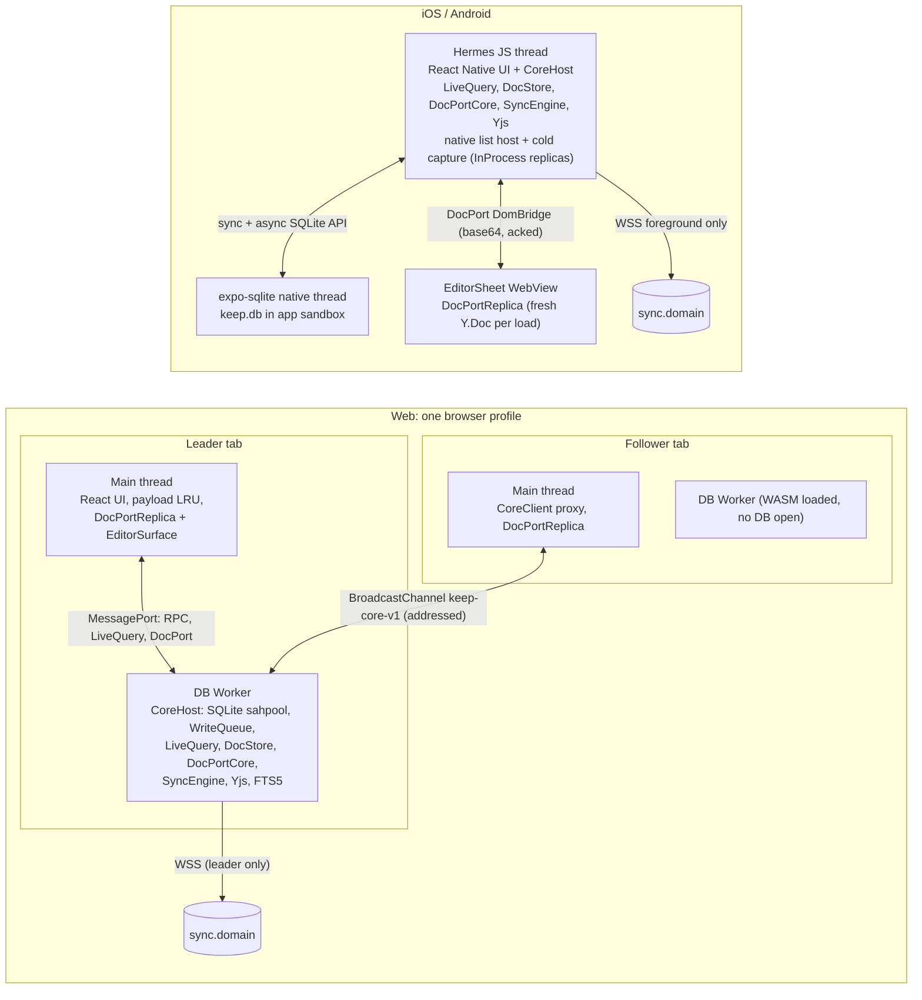
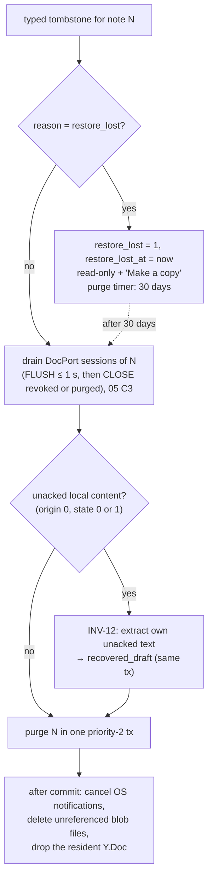
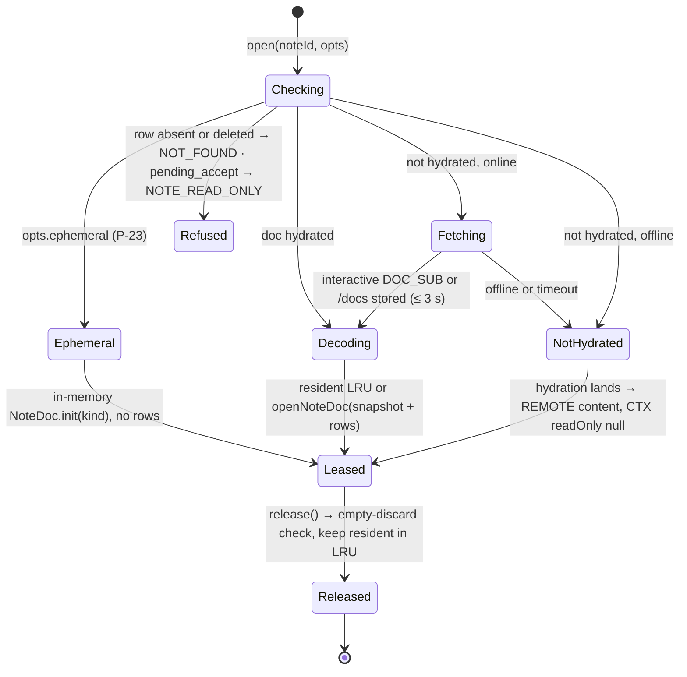
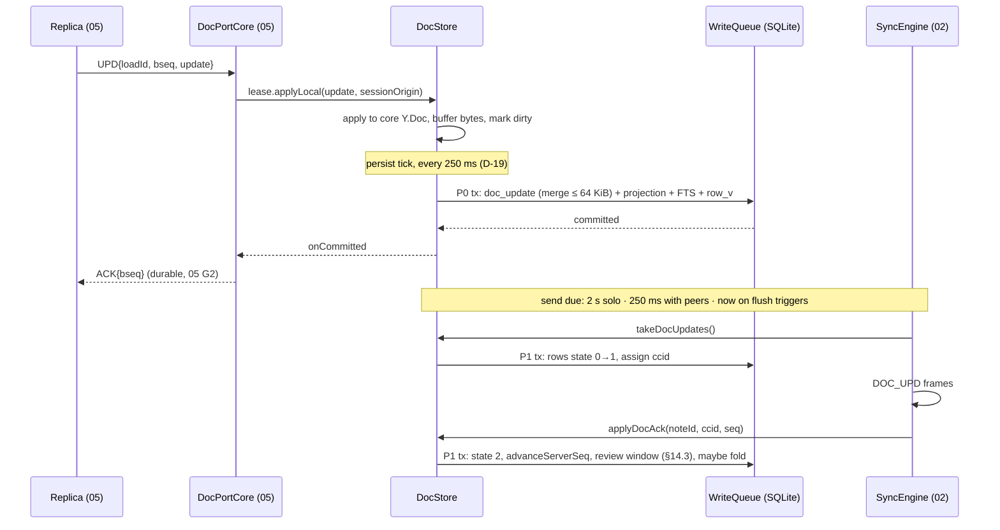
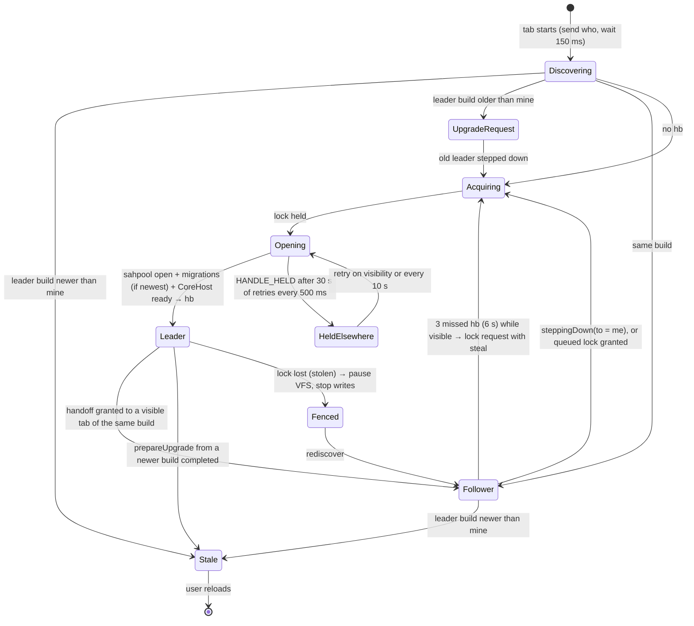

# 04 · Client core: `sync-client` and `storage`

*Aligned with spine v1.3.*

*Detail design · elaborates spine v1.3 (2026-10-04; first written against v1.1, reconciled with the v1.2 changes C-06 to C-91 and the v1.3 changes C-201 to C-247) · Status: draft for review · Owner area: Core, client*

## 1. Purpose and scope

This document specifies the shared TypeScript client core. The same code runs in the web DB Worker and on the Hermes JS thread. It covers how the core stores data, how every user action becomes one local transaction, how note documents are held, merged and handed to editors, how the UI observes data, how web tabs elect a single writer, and which platform services the apps inject. An engineer should be able to build `packages/storage` and the storage-facing half of `packages/sync-client` from it, and to implement the editor-facing `CoreDocAccess` contract that 05 defines.

It covers:

- the `sync-client` component architecture, threading model and write-path discipline;
- the `SqlDriver` contract and its implementations;
- the complete local SQLite schema and the two-number migration rules;
- **LiveQuery** and the **CoreApi** facade, which this document owns (consumers: 06, 07);
- **DocStore**: residency, raw-byte storage, seq accounting, lazy merge, local compaction, the `CoreDocAccess` implementation and where the INV-9 gate runs;
- projection-source rules (D-23);
- the outbox as storage: enqueue, preconditions, reductions, lanes and result handling by retry class (D-20, spine §5.6);
- feed application and the client side of resync (spine §5.5, spine §5.11);
- the bootstrap client and the hydration scheduler (D-21, spine §5.4);
- the idempotent intent ingest that drains durable inbox entries into SQLite, INV-1's second sanctioned path (C-204, C-213);
- recovered drafts (with uncommitted images, C-223), merge-review capture, local copies and DB salvage (INV-12, P-18, P-20);
- web leader election, build versioning and the web DocPort transports (D-04, X-08);
- the storage side of binding, sign-out, account switch and identity reset (D-41, D-42, INV-18);
- the platform-service interfaces (Net, Clock, Crypto, Notifications, FileStore, Background, plus Lifecycle, SecureStore, SharedContainer and the web tab bus);
- client SLIs.

### Out of scope

| Topic | Owner |
|---|---|
| KSP byte layouts, frame and op schemas, capability tokens, close codes, the SyncEngine connection state machine, retry classes, `docHash`, the push-back rule, the telemetry wire schema | 02. This document defines only the storage ports the SyncEngine drives (§9.6, §10.1, §10.6, §11.11, §13.6) |
| Gateway, group commit, feed and bootstrap serving, compactor (including `reproject` runs), relay | 03 |
| Projector and `DerivedInputs`, NoteDoc accessors and writer, schema registry and structural scanners, normalization, HLC, ordering, overlay intents, ID minting | 01 |
| DocPort frames and session protocol, `DocPortCore`/`DocPortReplica`, `gateLoad`/`GateTracker`, the INV-9 shape rules, `EditorContext`, the WebView bridge, ChecklistController, undo | 05. DocPort *messages* are joint: 04 implements `CoreDocAccess` (§11.4) and the web transports (§11.9) |
| `auth-client` (`AuthPort`, `AuthController`, `CredentialStore`), JWTs, sign-in, the sign-out and account-switch UI decisions, `identityActionForWelcome`, the `PendingSignOut` record format, device registration | 12. This document supplies the storage operations those flows call (§4.4) |
| `authz` predicates, member chips, `pendingRef`, sharing and Make-a-copy server semantics | 08 |
| Grid rendering, PWA service worker and its inbox records, the main-thread platform bridge, first-paint snapshot storage | 06 |
| FlashList grid, EditorSheet host, native modules, widget snapshot, `widget-pending.json` and inbox file formats, intent appliers, mobile platform-service implementations | 07 |
| `ReminderPlanner`, `RemindersApi` types and reminder semantics | 09 |
| `UploadQueue`, `MediaApi`, media semantics, `media.*` contracts, the staging-key upload flow | 10 |
| Search DDL block, `SearchIndex`, `SearchApi`, tokenizer maintenance, query parsing and ranking | 11 |
| SLI dashboards, alerts, paging | 14 |
| Simulator harness, fault injection and the traceability matrix | 16 |

## 2. Spine references

**Reference convention.** `spine §x.y` is a section of the spine; a bare `§x.y` is a section of this document; `NN §x.y` is a section of sibling detail doc NN (for example `05 §6.9`). IDs such as D-xx, INV-xx, P-xx and X-xx are spine items.

| ID | How this document implements it |
|---|---|
| spine §4.4 (client) | Full DDL in §7 (the spine's table list matches it since C-52; C-213 and C-223 add the `intent` and recovered-image rules). Columns beyond the spine's summary are marked **(+)** |
| spine §5.3 | Retry classes (C-19), additive frame fields (C-22) and close codes (C-23) as they reach storage: §9.7, §10.1, §11.11 |
| spine §5.4 | Bootstrap client §13.1 (one socket, C-24), opening before hydration §11.4, resumability §13.5 |
| spine §5.5 | FeedApplier §10, remote doc paths §11.6 (`TOO_LARGE`, `ABSENT`, `DOC_PEERS`, C-06, C-07, C-15), anti-entropy and audit with `docHash` §11.12 (C-16, C-20) |
| spine §5.6 | Outbox storage, preconditions (C-55), reductions, results by retry class (C-19), flush points (C-56, C-209), sync chip §9 |
| spine §5.11 (client side) | Resync procedures §10.5 (floor-HLC re-assert, C-18), merge-review capture §14.3 (C-58) |
| D-04 | Web DB Worker topology §3.2, leader election with steal, fencing and the held-elsewhere state §15 (C-54), first-page snapshot §5.7 |
| D-06 | expo-sqlite driver, synchronous skeleton query, backup and device-transfer exclusion §6.3, §3.6 |
| D-09 | LiveQuery, skeleton plus payload LRU, gesture pause, Y.Doc residency (the open note's replica counts, C-61) §5, §11.3 |
| D-12 | Every editor binds a fresh replica over DocPort; tab and in-process transports §3.2, §11.9 (C-61, C-69) |
| D-13 | `crdt_format`, fresh clientID per Y.Doc instance §11.1 |
| D-16, INV-15 | Field HLCs, `pending_mask`, HLC merge points (C-38), clamp replacement §3.5, §10.2 |
| D-19 | 250 ms local persist tick, 2 s or 250 ms send cadence, `DOC_PEERS` §11.5 (C-07) |
| D-20 | Two durable stores, `qseq`, lanes, `blocked_on`, reductions §9 |
| D-21 | Cursor-first bootstrap client, raw-byte hydration, lazy thresholds §13 |
| D-22 | POKE/PULL, DOC_SUB/DOC_LIVE, NOTE_TOUCHED, inline tails, `DOC_FETCH` anti-entropy for dirty notes, background pull (native only, C-203) §10, §11.6, §11.12, §9.8 |
| D-23 | Projection-source rules §12 (C-42, C-53; `reproject` appends, C-219) |
| D-35 | FTS hooks and the sliced label refresh §3.4, §4.3 (C-227); trigram scripts per 11 (C-228) |
| D-38 | `bg-flush` from M1 (C-209), shared-container formats (C-212), inbox drain (C-204, C-213), widget patches (C-210), Android fire receipts (C-217) §9.8, §13.3, §16 |
| D-41, D-42 | Account binding, install nonce, registration outcomes, identity reset keeping cursor epochs (C-83), continuity token and fork reset (C-84), wipe and salvage on the storage side §4.4, §14.6 |
| D-46 | Client SLIs §17 (convergence lag from `commitAt`, C-22) |
| INV-1 | Commit-before-resolve CoreApi and the WriteQueue §3.4, §4.1; the ephemeral-note exception (C-59) §4.3; the inbox path (C-204) §4.5 |
| INV-2, INV-3 | Ack-only deletion; re-send in original order with the same ccid §9; equality by `docHash`, projections and canonical rows (C-245) §20 |
| INV-4 | `BAD_UPDATE` quarantine (C-21) §9.7 |
| INV-7 | Gap detection and catch-up §11.6 |
| INV-9 | Gate placement: core doc first, gate (including the shape check, C-60), then forward §11.8 |
| INV-12 | DocPort drain, then own-unacked extraction excluding `repair` and `copy_seed` rows (C-51), with uncommitted images (C-223) §10.4, §14.1 |
| INV-13 | Typed-tombstone purge path; membership instances (C-81) §10.4 |
| INV-14 | Restore re-assert with the floor HLC (C-18), no-sweep restore, meta sweep §10.5 |
| INV-16 | First-stream cursor, usn-guarded upserts §13.1 |
| INV-18 | DB bound to one `user_id`, DB-resident install nonce, continuity token, identity reset §4.4, §7.3, §14.6 |
| X-01 | Content-free SLIs and logs; URLs recorded without query or fragment (C-206) §17 |
| X-08 | Two-number DB versioning with a native destructive ceiling §8; web build rule §15.5 (C-57); shared-container format versions §16.7 (C-212) |
| X-11 | Client-measured SLOs are evaluated daily and open tickets (C-231) §17 |
| X-14 | Sync chip, queued states, no network in mutations §4.1, §9.9 |
| X-15 | Battery and data-saver rules in the hydration scheduler, signals from `bg-flush` §13.3 |
| X-19 | Layering and injected platform services §3.1, §16 |
| P-03, P-06, P-12, P-15, P-16, P-18, P-20, P-22, P-23, P-24 | Trash CAS, coupled pin/archive, over-limit flag, card-only pending rows, silent invite refusals (C-74), merge review, recovered drafts, full web hydration, materialize on first content (C-59), Make a copy (C-78) |
| §1.3, D-48 | Performance gates on the named device classes (C-244); M1 exit loss bound (C-242) §3.6, §20 |
| T-14 | `SqlDriver` swap to op-sqlite §6.3 |
| Q-05, Q-10 | Gate placement and Hermes merge cost (§21) |

## 3. Architecture

### 3.1 Packages and layering

```
packages/storage/                    DOM-, RN- and Node-free (X-19)
  src/driver.ts                      SqlDriver, SqlTx, SqlError (§6)
  src/migrate.ts                     two-number migration runner (§8)
  migrations/NNNN_name.sql           plain numbered SQL shared by every driver (D-31)
  drivers/expo.ts                    "react-native" condition: expo-sqlite 57
  drivers/wasm.ts                    "browser" condition, worker only: @sqlite.org/sqlite-wasm 3.53.4, opfs-sahpool
  drivers/node.ts                    simulator and tests: node:sqlite (Node ≥ 24)
  conformance/                       driver conformance suite (§6.5)

packages/sync-client/                DOM-, RN- and Node-free (X-19)
  src/core.ts                        createCore() → CoreHost
  src/api/                           CoreApi (§4); CoreClient proxy for web (§15.6)
  src/write/                         WriteQueue, Tx, repositories, change capture (§3.4)
  src/clock/                         HLC host, corrected clock (§3.5)
  src/live/                          LiveQuery engine, GridSource (§5)
  src/docs/                          DocStore, CoreDocAccess implementation, persist tick, seq accounting, fold (§11)
  src/docport/                       DocPortCore hosting and web transports (§11.9); protocol = @keep/editor/port (05)
  src/outbox/                        enqueue, reductions, preconditions, lane scheduler, OutboxPort (§9)
  src/feed/                          FeedApplier, tombstones and purge path, resync (§10)
  src/hydrate/                       BootstrapClient, BootstrapPort, HydrationScheduler (§13)
  src/intents/                       IntentsApi.ingest and the intent table (§4.5); appliers come from modules
  src/recovery/                      drafts, merge review, local copies, unsynced collection, salvage (§14)
  src/session/                       SessionStore: bind, wipe, export, sign-out sequence, identity reset (§4.4)
  src/engine/                        SyncEngine (state machine specified by 02), wired to the ports
  src/tabs/                          leader-election state machine (pure; browser adapter injected) (§15)
  src/platform.ts                    platform-service interfaces (§16)
  src/sli.ts                         client SLIs (§17)
  react/                             useLiveQuery (React as a peer dependency; no DOM or RN import)
```

**Dependency rules** (dependency-cruiser, X-19):

- `sync-client` may import `domain`, `note-model`, `sync-protocol`, `storage`, `@keep/authz` (only `predicates`, `chips`, `redact` types and `limits`, per 08 §4.11), `@keep/editor/port` (05: pure TS that imports only `yjs`, `lib0`, `zod` and `note-model`), `@keep/auth-client` (12: `AuthPort`, `identityActionForWelcome`, the `PendingSignOut` type; pure TS), `@keep/api-contract` (pure TS and zod: the oRPC contracts the core calls, e.g. 11's `searchContract` and 10's `media.*`) and `@keep/mobile-formats` (07: shared-container types only). It never imports `@keep/editor/dom` or `@keep/editor/native`.
- Nothing in `storage` or `sync-client` imports `react-dom`, `react-native`, `expo-*`, Node built-ins or DOM globals. Web Locks, BroadcastChannel, OPFS, `navigator.*` and Expo modules are reached only through the §16 interfaces, implemented in `apps/web/src/platform/*` and `apps/mobile/src/platform/*`.
- All Y access goes through `note-model` (D-13). DocStore opens docs with 01's `openNoteDoc()` and uses the byte-level helpers that `note-model` exposes as `NoteBytes` (`mergeUpdates`, `diffUpdate`, `encodeStateVectorFromUpdate`, `decodeStructs`, delete-set helpers; assumption on 01, OQ-04-10). The raw `Y.Doc` is handed only to 05's `DocPortCore` through `CoreDocLease.doc`.
- Modules under `src/api/` and `src/write/` cannot import `Net` (INV-1).
- Every timer goes through `PlatformClock` (§16.2); a lint rule bans global `setTimeout`, `setInterval` and `Date.now()` in `sync-client` and `storage`, so the simulator controls all time (D-48).

### 3.2 Runtime topology



- **Web.** Every tab spawns its DB Worker at startup so WASM is warm for a fast takeover, but only the leader's worker opens the database and constructs a `CoreHost` (D-04). The leader tab's main thread and every follower tab use a `CoreClient` that implements `CoreApi` over RPC (§15.6). The core Y.Doc of an open note lives in the leader's worker; each editor has a replica on its tab's main thread (05 §3). The service worker cannot open the database: it commits notification actions and share-target captures to its own durable inbox (06 §7.6), which the leader drains through `intents.ingest` (§4.5, C-204). Window-only platform calls from the worker go through the leader tab's main thread (06 §4.4, §16).
- **Mobile.** One `CoreHost` on the Hermes JS thread. SQLite runs on expo-sqlite's native thread; the JS thread prepares parameters and handles results. Text notes edit in the WebView replica; list notes, cold capture and short native edits (removing an image in the viewer) edit through in-process replicas on Hermes (05 §3). No editor writes the core doc directly: every editor binds a fresh replica, and each editing session has one UndoManager on its replica (D-12, C-61). iOS extensions and native notification-action handlers cannot open the database either; they write inbox entries in the shared container (07 §8.3), drained through `intents.ingest` (C-204). Android widgets and share targets run in process and call `CoreApi` directly.
- **Simulator and tests.** `CoreHost` runs in Node with `drivers/node.ts` (synchronous `node:sqlite` `DatabaseSync`), fake `PlatformClock` and `Rng`, an in-memory `Net` wired to the simulator server, and optionally 05's replica-in-the-loop mode (D-48). The registry and `docSchemaMax` are injectable through `createCore({build})` and timings through `CoreConfig` (§16).

### 3.3 Components

| Component | Responsibility | Owner of the spec | Section |
|---|---|---|---|
| `WriteQueue` | The only path to a write transaction: priorities, change capture, HLC and `qseq` allocation, after-commit hooks | 04 | §3.4 |
| `LiveQueryEngine`, `GridSource` | Query registry, invalidation, coalesced re-runs, diffs; grid skeleton and payload LRU | 04 | §5 |
| `DocStore` | `doc` and `doc_update` rows, residency, seq accounting, persist tick, fold, `CoreDocAccess` | 04 | §11 |
| `DocPortCore` | Editor sessions, acked batches, gate, forwarding | 05 (hosted by 04) | §11.9 |
| `ProjectionService` | Local re-derivation and the D-23 acceptance rule | 04 (Projector: 01) | §12 |
| `Outbox` | Enqueue with reductions, preconditions, lane scheduler, result application | 04 | §9 |
| `FeedApplier` | Feed pages, overlay HLC merge, tombstones, inline tails, resync | 04 | §10 |
| `BootstrapClient`, `HydrationScheduler` | Cursor-first metadata stream, doc packs and fetches | 04 | §13 |
| `Recovery` | Drafts, merge review, local copies, unsynced collection, salvage | 04 | §14 |
| `IntentIngest` | One `intent` row per intent ID; dispatch to the module applier for the kind; idempotent replay | 04 (appliers: 07, 06, 09) | §4.5 |
| `SessionStore` | Storage side of bind, account switch, export, sign-out and identity reset | 04 (flows: 12) | §4.4 |
| `TabCoordinator` (web) | Leader election, heartbeats, handoff, fencing | 04 | §15 |
| `SyncEngine` | Socket and HTTP protocol state machine; drives the outbox, docs, feed, bootstrap and resync ports | 02 | — |
| `auth-client` | Credentials, auth state, JWTs; exposes `AuthPort` | 12 | §16.9 |
| `UploadQueue` | Media uploads; a `CoreModule` | 10 | — |
| `ReminderPlanner` | Arming, coverage; a `CoreModule` | 09 | — |
| `SearchIndex` | `note_search` and FTS maintenance inside core transactions; a `CoreModule` | 11 | — |
| `WidgetSnapshotModule`, `IntentApplier` | Widget snapshot (M4), per-kind intent appliers; `CoreModule`s | 07 | — |

### 3.4 Write-path discipline

Every local write goes through one `WriteQueue` per database. This enforces INV-1 mechanically: a CoreApi mutation resolves only after its transaction has committed, and that transaction contains both the visible change and its `outbox` or `doc_update` row.

```ts
export type Priority = 0 | 1 | 2 | 3 | 4;
// 0 user mutation, editor persist, materialization · 1 acks · 2 feed and remote doc apply (pausable)
// 3 bootstrap pages, hydration packs, re-derivation · 4 maintenance (fold, GC, payload migration, integrity)

export interface Tx extends SqlTx {
  readonly now: number;                         // PlatformClock.now() at tx start; every timestamp in the tx uses it
  hlc(): Hlc;                                   // HlcClock.tick() (01 §6.3); state persisted in this tx
  qseq(): number;                               // next local enqueue sequence, shared by outbox and doc_update
  touch(table: Table, ids: readonly string[] | 'all', columns: readonly string[],
        rowV?: ReadonlyMap<string, number>): void;
  afterCommit(fn: () => void | Promise<void>): void;   // OS calls, in-memory doc updates, events; never DB writes
}

export interface WriteQueue {
  run<T>(p: Priority, label: string, fn: (tx: Tx) => Promise<T>): Promise<T>;
  pauseSyncApply(reason: 'gesture' | 'handoff'): () => void;   // returns resume(); affects priorities 2–4
}

export interface CoreModule {                   // extension seam for 09, 10, 11 and app adapters (06, 07)
  readonly name: string;
  init?(ctx: CoreContext): Promise<void>;
  /** After the note's projection group is written, in the same transaction (rule S or L, accept, bootstrap row).
   *  The argument is a hint: server rows produce no Projection object, so 11 re-reads the row. */
  onProjection?(tx: Tx, noteId: NoteId, p: Projection | PendingCard | null): Promise<void>;   // 11: FTS row
  /** Batch form, called once per bootstrap batch and feed page instead of per-row onProjection (11 CD-04-7). */
  onProjections?(tx: Tx, noteIds: readonly NoteId[]): Promise<void>;
  onLabelsChanged?(tx: Tx, noteIds: readonly NoteId[]): Promise<void>;           // note_label.present changed (local or feed)
  /** label.name, deleted or merged_into changed (local or feed). Above 2,000 affected notes the module records a
   *  durable maint_job in this transaction and refreshes in priority-4 slices of 500 rows (D-35, C-227). */
  onLabelRowsChanged?(tx: Tx, labelIds: readonly LabelId[]): Promise<void>;
  /** draftId is set when the purge created a recovered draft (§10.4): 10 moves uncommitted images to it (C-223). */
  onPurgeNote?(tx: Tx, noteId: NoteId, reason: RemovedReason | 'discarded', p: { draftId: string | null }): Promise<void>;
  onCommitted?(t: TouchedSet): void;                                                          // 09 re-plan, 07 widgets
  /** Runs before the database is closed and destroyed (sign-out, switch, account deleted). */
  onWipe?(): Promise<void>;
  /** Per-kind intent appliers (§4.5); a kind may be claimed by one module only. */
  readonly intents?: Readonly<Record<IntentKind, IntentApplier>>;
}

export interface CoreContext {                  // handed to CoreModule.init
  readonly api: CoreApi;
  readonly writeQueue: WriteQueue;
  read<T>(fn: (db: SqlExecutor) => Promise<T>): Promise<T>;       // read-only; never inside a write transaction
  readonly docs: {
    /** 10's attach path: one priority-0 transaction that applies `write` to the core doc through 01's writer
     *  (origin LOCAL), appends the update as an origin-local doc_update, runs `extra`, and materializes an
     *  ephemeral note in the same transaction (INV-1, P-23). Replicas get the update through DocPortCore, after
     *  the gate, as a remote update (05 G4), so it is not in the editor's undo history. */
    applyLocalWith<T>(noteId: NoteId, write: (w: NoteDocWriter) => void, extra: (tx: Tx) => Promise<T>): Promise<T>;
    /** Read-only, residency-neutral rendering of a list note's rows (07's widget snapshot). Runs at priority 4 on
     *  a temporary handle when the doc is not resident; null when the doc is not hydrated. */
    renderList(noteId: NoteId, o: { maxRows: number }): Promise<{
      rows: readonly { id: ItemId; text: string; checked: boolean; child: boolean }[];
      gate: 'ok' | 'blocked'; more: { unchecked: number; checked: number } } | null>;
  };
  readonly events: CoreEvents;                  // 'bootstrap.metaDone', 'note.discarded', 'copy.imagesMissing', …
  readonly platform: PlatformServices;
  readonly config: CoreConfig;
}
```

Rules:

1. **One transaction at a time.** The `WriteQueue` owns the driver's transaction slot. The next job is the highest-priority waiting job, FIFO within a priority. There is no preemption. Priority-0 jobs target ≤ 16 ms of JS time; priority 2–3 jobs are sized by rows (one feed page, one 500-row bootstrap batch, one hydration pack).
2. **Reads never see a partial transaction.** The driver serializes every statement on its single connection behind a mutex held for the whole transaction (§6.2), so a LiveQuery re-run issued during a transaction runs after the commit.
3. **Change capture is explicit.** Repository functions (`notesRepo.setOverlay`, `docRepo.insertUpdate`, …) call `tx.touch(table, ids, columns)` with exactly the columns they write. There are no SQLite triggers for change capture, which keeps all drivers identical and makes invalidation testable (T-LQ-1).
4. **HLC and `qseq` persistence.** `tx.hlc()` and `tx.qseq()` advance in-memory counters. The `WriteQueue` writes `sync_meta.hlc` (01 §6.5) and `sync_meta.qseq` as the last statements of the transaction, so a crash can never reissue an HLC or a `qseq`.
5. **After commit**, synchronously and in this order, before the next job starts: in-memory doc updates registered with `afterCommit` (§11.6), LiveQuery invalidation with the touched set, `CoreModule.onCommitted`, the remaining `afterCommit` callbacks, and a SyncEngine wake-up for touched lanes.
6. **No network in mutations.** CoreApi methods never await a socket or HTTP call (INV-1). A lint rule bans `Net` imports from `src/api/` and `src/write/`.
7. **Failure.** A thrown error rolls the transaction back and rejects the caller with `CoreError`. `SqlError FULL` maps to `STORAGE_FULL`; `CORRUPT` or `NOTADB` starts salvage (§14.7), with one exception: `CORRUPT` with extended code 267 (`SQLITE_CORRUPT_VTAB`) is a damaged FTS index, never a damaged database. Raised inside a `SearchIndex` savepoint, it is handled by 11's breaker (the savepoint rolls back, the index is disabled in the same transaction and rebuilt later, 11 §5.6), so a corrupt index never fails a user edit; anywhere else it is logged and handed to 11's breaker as a priority-4 job. It never starts salvage.
8. **Sliced maintenance.** Priority-4 work that must survive a crash (payload migrations, the label FTS refresh of C-227, the one-time trigram scan) is recorded as a `maint_job` row in the transaction that creates the need, and runs in slices (≤ 500 rows or ≤ 8 ms of JS per transaction), each slice advancing the row's cursor in its own transaction.

### 3.5 Clocks and HLC

- **HLC.** The core holds one `HlcClock` from 01 §6.3. At start it is loaded from `sync_meta.hlc` with the node replaced by `hlc.nodeFromInstallNonce(install_nonce)` (01 §6.2); if absent it starts at `{ms: wallMs, c: 0}`. The node is also stored as `sync_meta.hlc_node` and copied into the native-readable and service-worker records (07 `BgCredentialV1`, 06 `SwHintV1`), so `notif-actions` POSTs and service-worker acks stamp their ops `{ms: now, counter: 0, node: hlc_node}` (C-211). Those ops are keyed by occurrence, so such an HLC never decides a write.
- **Ticks.** One tick per local write that carries an HLC: overlay fields (a coupled pin or archive intent is one tick for all its fields, 01 §4.5, C-48), labels, note-label pairs, settings, reminder fields, trash and conversion markers.
- **Merge points** (INV-15, D-16, C-38): `WELCOME.serverHlc`; `ACK.serverHlc` and every `ACK.results[].hlc`; every HLC inside an adopted `stale` row; and the maximum HLC of each applied `FEED` page and bootstrap batch (all `field_hlc` values, `trash_hlc`, `note_label.hlc`, settings `hlc`). All were clamped on write, so merging never moves the clock past server `now + 60 s`. Merges change only memory; the next ticking transaction persists the state. Losing a merge on a crash is harmless because the next WELCOME merges again.
- **Clamp replacement.** When an `ACK ok` returns an HLC different from the op's, the client **replaces** the stored field HLC for every field whose local HLC still equals the op's HLC (01 §6.4), so a later feed comparison is not skewed by the unclamped value.
- **Corrected wall clock** (01 §3.3 `Clock.correctedMs`). On WELCOME, `offsetMs = serverTime + rtt/2 − recvWall`, where `rtt` is measured on `PlatformClock.monotonic()` from sending HELLO to receiving WELCOME. The offset is kept in memory and in `sync_meta.clock_offset`. `correctedMs()` is used for minting note IDs and for re-mint (X-04, C-37). HLC ticks use the raw wall clock; the server clamp handles skew.
- **Ages and timers** (unacked age, gap timers, backoff, merge-review windows) use `PlatformClock.monotonic()` plus a stored wall anchor, so a wall-clock jump can neither fire nor suppress them.

### 3.6 Startup

**Mobile cold start.** Budget for p50 ≤ 0.8 s at 5k notes, measured on the **mid-range Android lab device** (spine §1.3, the M1 exit; C-244). The low-end Android lab device runs the regression gates and the fling and memory floors (§20). JS bundle evaluation and the first frame are 07's budget.

| Step | API | Budget p50 |
|---|---|---|
| 1. Open `keep.db`, PRAGMAs, read `schema_version` and `min_compatible_version` | `openDatabaseSync` + sync API | ≤ 15 ms |
| 2. Run pending **additive** DDL (only after an app update; data backfills are deferred to priority 4); destructive steps only up to the binary's ceiling (§8.2) | sync API | ≤ 30 ms when present |
| 3. Skeleton query for the default view | `getAllSync` (D-06) | ≤ 50 ms (T-14 trigger) |
| 4. Payloads for the first 50 cards | `getAllSync` | ≤ 20 ms |
| 5. First frame (07) | — | — |
| 6. After the first frame: LiveQuery engine attach, `DocPortCore`, `auth-client`, SyncEngine start, hydration resume, `ReminderPlanner`, `UploadQueue`, inbox drain (§4.5) | async API | off the critical path |

When `Lifecycle.launchContext().kind === 'capture_intent'`, step 3 is deferred and the cold-capture session opens first: native inputs bind to an in-process DocPort session on the ephemeral note, so every keystroke reaches the core doc and SQLite within one persist tick once it materializes (05 §7.5, D-11, C-69). The skeleton loads after the capture view is focused.

**Web warm start.** The main thread paints from the first-page snapshot (§5.7, stored by 06) while the DB Worker loads WASM, discovers or becomes leader (§15), opens the sahpool database, migrates if it is the newest build, and registers the default grid query. When the first real skeleton arrives, the grid swaps from the snapshot; cards whose `row_v` is unchanged keep their layout. The core's share of the **first live grid** target (navigation start to the first LiveQuery skeleton rendered, p50 ≤ 600 ms, p90 ≤ 1.2 s, C-207; 06 owns the full web budget table) is leader discovery, open, skeleton query and the first 100 payloads: ≤ 300 ms p50 plus one frame (06 §4.3). Discovery skips the 150 ms heartbeat wait when no leader exists (§15.3).

## 4. CoreApi facade (owned; consumed by 06, 07)

### 4.1 Conventions

- **Commit before resolve (INV-1).** Every mutation returns a `Promise` that resolves after the local transaction commits and rejects with `CoreError` otherwise. "Success" in the UI means this promise resolved. Nothing resolves on network events.
- **Batches.** Multi-select operations take arrays and run in one transaction. They enqueue one op per note, each with its own HLC tick (01 §4.5); §9.4 reductions may collapse them.
- **Same API everywhere.** On mobile `CoreApi` is the `CoreHost` object. On web, `CoreClient` implements the same interface over RPC (§15.6), and LiveQuery snapshots are pushed, never polled.
- **IDs** are branded strings from 01 (`NoteId`, `LabelId`, `UserId`, `AttachmentId`). The core mints IDs through `domain/ids`; the UI never does (X-04).
- **Permissions.** The core checks 08's `can.*` predicates on the local row before writing and throws `NOT_PERMITTED` when they fail. The UI uses the same predicates to hide actions (08 §4.10).

```ts
export type CoreErrorCode =
  | 'READ_ONLY_DB'        // min_compatible_version > build (X-08): "Update required"
  | 'DB_UNAVAILABLE'      // web: no reachable leader, or the database is held by a frozen tab (§15.3)
  | 'NOT_BOUND'           // no account bound to the DB (12: NO_ACCOUNT)
  | 'NOTE_READ_ONLY'      // see ReadOnlyReason
  | 'NOT_FOUND'
  | 'NOT_PERMITTED'       // an 08 can.* predicate is false (e.g. trash by a writer)
  | 'LIMIT'               // local cap: labels 50 (P-05), collaborators 50 (P-04), trash.empty chunking is internal
  | 'INVALID_ARG'
  | 'STORAGE_FULL'        // SQLITE_FULL or quota
  | 'INTERNAL';
export class CoreError extends Error {
  constructor(readonly code: CoreErrorCode, readonly detail?: string) { super(code); }   // detail: enum-like, never content
}

export type ReadOnlyReason =
  | 'trashed'             // P-03
  | 'schema'              // INV-9 gate
  | 'restore_lost'        // INV-13, read-only with "Make a copy"
  | 'pending_accept'      // card only (P-15)
  | 'not_hydrated'        // offline, doc not yet fetched (spine §5.4 step 5)
  | 'removing'            // leave / delete forever / decline sent, awaiting confirmation
  | 'db_update_required' | 'db_unavailable';
```

### 4.2 Interface

```ts
export interface CoreApi {
  readonly notes: NotesApi;
  readonly trash: TrashApi;
  readonly labels: LabelsApi;
  readonly reminders: RemindersApi;     // semantics: 09
  readonly settings: SettingsApi;
  readonly sharing: SharingApi;         // semantics: 08
  readonly grid: GridApi;               // §5.4
  readonly queries: Queries;            // §5.3
  readonly editor: EditorHostApi;       // 05's DocPortCore host surface (§11.9)
  readonly sync: SyncApi;
  readonly drafts: DraftsApi;           // INV-12, P-20
  readonly mergeReview: MergeReviewApi; // P-18
  readonly media: MediaApi;             // facade over 10's UploadQueue
  readonly search: SearchApi;           // facade over 11's SearchIndex
  readonly intents: IntentsApi;         // 07's inbox and widget intents
  readonly ui: UiApi;
  readonly diagnostics: DiagnosticsApi;
}

export interface NotesApi {
  /** ID for a new ephemeral editor session (P-23). Minted with 01 Clock.correctedMs() on the home shard. Writes nothing. */
  newNoteId(): NoteId;
  setColor(ids: readonly NoteId[], color: ColorToken): Promise<void>;
  setBackground(ids: readonly NoteId[], bg: BackgroundToken): Promise<void>;
  /** 01 overlayWrite 'pin': pinned, archived and sort_key written with one HLC (P-06, 01 §4.5). */
  setPinned(ids: readonly NoteId[], on: boolean): Promise<void>;
  /** 01 overlayWrite 'archive'. */
  setArchived(ids: readonly NoteId[], on: boolean): Promise<void>;
  /** Grid move between the *displayed* neighbours (spine §4.6); writes only the moved note. */
  move(id: NoteId, between: { before: NoteId | null; after: NoteId | null }): Promise<void>;
  /** Groups a selection by 08's can.deleteAction: owner → trash, writer → leave, pending → decline. */
  planDelete(ids: readonly NoteId[]): Promise<{ trash: NoteId[]; leave: NoteId[]; decline: NoteId[] }>;
  trash(ids: readonly NoteId[]): Promise<void>;          // owner only (P-02)
  leave(ids: readonly NoteId[]): Promise<void>;          // writer only (P-01); the UI confirms first
  /** Make a copy (P-24): server note.copy, or a local copy when the source is restore_lost (08 §13.3). */
  copy(id: NoteId): Promise<NoteId>;
  retryCreate(id: NoteId): Promise<void>;                // note with create_error
}
export interface TrashApi {
  restore(ids: readonly NoteId[]): Promise<void>;
  deleteForever(ids: readonly NoteId[]): Promise<void>;  // CAS on the trash_hlc currently shown (P-03)
  empty(): Promise<{ requested: number }>;               // CAS per item; ≤ 500 items per op
}
export interface LabelsApi {
  create(name: string): Promise<LabelId>;                // UUIDv5 id (01 §5); cap 50 → LIMIT
  rename(id: LabelId, name: string): Promise<void>;
  delete(id: LabelId): Promise<void>;
  setOnNotes(noteIds: readonly NoteId[], labelId: LabelId, present: boolean): Promise<void>;
}
export interface RemindersApi {
  set(noteId: NoteId, input: ReminderInput): Promise<void>;
  clear(noteId: NoteId): Promise<void>;
  ack(noteId: NoteId, occ: string, action: 'done' | 'snooze' | 'dismiss', until?: string): Promise<void>;
}
export interface SettingsApi { set<K extends SettingKey>(key: K, value: SettingValue<K>): Promise<void>; }  // keys: 01 §4.4
export interface SharingApi {                            // queued like any op (X-14)
  invite(noteId: NoteId, email: string): Promise<void>;
  remove(noteId: NoteId, target: { userId: UserId } | { pendingRef: string }): Promise<void>;
  respond(noteId: NoteId, action: 'accept' | 'decline' | 'block'): Promise<void>;
}
/** 05's DocPortCore host API (open, close, flush, drain, sessionsFor, onIntent), unchanged on mobile and
 *  proxied over RPC on web. 04 adds connect(), which returns the replica-side transport for this host. */
export interface EditorHostApi extends DocPortCoreHostApi {
  connect(kind: 'tab' | 'inprocess'): DocPortTransport;  // the WebView DomBridge transport is 05/07's
}
export interface SyncApi {
  status(): LiveQuery<SyncStatus>;
  deadLetters(): LiveQuery<readonly DeadLetterView[]>;
  retryDeadLetter(ccid: string): Promise<void>;
  discardDeadLetter(ccid: string, opts: { confirmed: true }): Promise<void>;
  flushNow(reason: 'blur' | 'close' | 'visibility' | 'background' | 'manual'): Promise<void>;
  reload(): Promise<void>;                               // flush, then resync = meta
}
export interface SyncStatus {
  chip: 'saved' | 'saving' | 'offline' | 'not_synced' | 'sign_in' | 'update_required' | 'paused' | 'db_unavailable'
      | 'repairing';                                       // DB salvage in progress (§14.7)
  online: boolean;
  connected: boolean;
  unsyncedChanges: number;                               // distinct entities with unacked user work (§9.9)
  oldestUnackedAt: number | null;                        // wall ms, for display only
  deadLetters: number;
  bootstrap: { phase: 'none' | 'meta' | 'docs' | 'done'; docsRemaining: number };
}
export interface DraftsApi {
  list(): LiveQuery<readonly RecoveredDraftView[]>;
  keep(id: string): Promise<NoteId>;                     // new private note from the draft
  discard(id: string): Promise<void>;
}
export interface MergeReviewApi {
  list(): LiveQuery<readonly MergeReviewView[]>;
  diff(id: string): Promise<{ before: string; after: string }>;    // text projections (P-18)
  keepCopy(id: string): Promise<NoteId>;                 // "Keep my version as a copy" (§14.4)
  dismiss(id: string): Promise<void>;                    // per device
}
export interface MediaApi {                              // owned by 10; listed for completeness
  attachImage(noteId: NoteId, file: LocalFileRef): Promise<AttachmentId>;
  removeAttachment(noteId: NoteId, id: AttachmentId): Promise<void>;
}
export interface SearchApi { query(q: string, scope: SearchScope): LiveQuery<readonly SearchHit[]>; }  // 11
export interface IntentsApi { ingest(intent: IntentV1): Promise<'applied' | 'duplicate' | 'note_gone'>; }   // 07 format
export interface UiApi {
  gesture(active: boolean): void;                        // §5.5
  setEditorEnv(env: EditorContext['env']): void;         // §11.10; host-supplied locale, theme, insets
  get(key: string): Promise<string | null>;              // per-device ui_state
  set(key: string, value: string): Promise<void>;
}
export interface DiagnosticsApi {
  mark(m: 'first_cards' | 'grid_interactive' | 'editor_ready'): void;   // SLI marks (§17)
  sliSnapshot(): Promise<ClientSliSnapshot>;
}
```

`DocPortCoreHostApi`, `DocPortTransport`, `EditorContext` and `CloseReason` are 05's types. `ReminderInput` is 09's, `IntentV1` is 07's, `SearchScope` and `SearchHit` are 11's, `LocalFileRef` is 10's.

### 4.3 Mutation to local effect to op

Lane = target logical shard (spine §5.6). **U** = the user's home shard (`sync_meta.home_shard`). **N** = the note's shard, `shardOf(noteId)` from 01 (the owner's shard). Preconditions are defined in §9.3.

| CoreApi call | Local transaction | Outbox op (spine §5.3) | Lane | Precondition |
|---|---|---|---|---|
| `notes.setColor` / `setBackground` | overlay column, `field_hlc[f] = h`, pending bit, `row_v++` | `note.setOverlay{id, fields}` | U | `op:` (unacked note-scoped op on the note, including its create, copy or accept) |
| `notes.setPinned(on)` | 01 `overlayWrite({t:'pin'})`: `pinned`, `archived`, `sort_key` (top of the target section) with one HLC; recompute `eff_*` | `note.setOverlay{pinned, archived, sort_key}` | U | `op:` |
| `notes.setArchived(on)` | 01 `overlayWrite({t:'archive'})`: `archived`, `pinned` (+ `sort_key` to the top when unarchiving) | `note.setOverlay{…}` | U | `op:` |
| `notes.move` | `sort_key = keyBetweenSafe(displayed neighbours)` (01 §7.2) | `note.setOverlay{sort_key}` | U | `op:` |
| `notes.trash` (owner) | `trashed_at = tx.now` (display only), `trash_hlc = h`, bit 5, `row_v++` | `note.setTrashed{id, trashed: true}` | N | `create:` |
| `trash.restore` | `trashed_at = NULL`, `trash_hlc = h`, bit 5 | `note.setTrashed{id, trashed: false}` | N | `create:` |
| `trash.deleteForever` | `deleted = 1` (hidden until the tombstone) | `note.deleteForever{id, trashHlc: shown}` | N | `create:`; if `note.create` is still unsent, cancel instead (§9.4 rule 3) |
| `trash.empty` | `deleted = 1` for each owned trashed note shown | `trash.empty{items[{id, trashHlc}]}`, ≤ 500 per op | U | — (unsent creates are cancelled per item) |
| `notes.leave` (writer) | `deleted = 1` | `note.leave{id}` | N | `content:` (08 §10.3) |
| `notes.copy` (source on the server) | new `note` row from the source's local projection, overlay `{sortKey: top of Others, color, background}` and the copier's labels; `acked_create = 0`; no `doc` row | `note.copy{srcId, newId, overlay}` | N of the source | `content:` on the source (08 §13.1) |
| `notes.copy` (source `restore_lost`) | local copy (§14.4) | `note.create` + one `doc_update` | U | content `create:` |
| `labels.create` / `rename` | `label` row (id = UUIDv5 of the name, 01) | `label.upsert{id, name}` | U | — |
| `labels.delete` | `label.deleted = 1`; `note_label.present = 0` for its pairs; `row_v++` on those notes; FTS labels | `label.delete{id}` | U | — |
| `labels.setOnNotes` | `note_label` pairs with `hlc = h`; `row_v++`; FTS labels | `noteLabel.set{noteId, labelId, present}` per pair | U | `op:` |
| `reminders.*` | `reminder` row (09 derives `next_fire_at`) | `reminder.upsert` / `.delete` / `.ack` | U | `op:` |
| `settings.set` | `settings` row | `settings.set{key, value}` | U | — |
| `sharing.invite` | optimistic chip appended to `members_json` (`kind: 'pending'`, local flag); `invite_address` row keyed by the op's ccid | `share.invite{noteId, email}` | N | `create:` |
| `sharing.remove` | chip marked removing | `share.remove{noteId, target}` | N | `create:` |
| `sharing.respond('accept')` | `pending_accept = 0`, bit 6, `doc_stale = 1`, `row_v++`: the card moves into the grid at once (08 §9.3) and opens read-only until the doc arrives | `share.respond{noteId, action: 'accept'}` | N | — |
| `sharing.respond('decline' \| 'block')` | `deleted = 1` | `share.respond{…}` | N | `content:` |
| Editor content | `doc_update` (state 0), projection, FTS, `row_v`; on first content of an ephemeral note, the materialization transaction (§11.4) | `DOC_UPD` from `doc_update` | N | `create:` |
| `drafts.keep` | new note from the draft blocks | `note.create` + `doc_update` | U | content `create:` |
| `mergeReview.keepCopy` | new note from the pre-merge state (§14.4) | `note.create` + `doc_update` | U | content `create:` |
| `intents.ingest` | per intent kind, plus an `intent` row for idempotency | per kind | per kind | per kind |

`note.create{id, kind, overlay}` carries the creating device's overlay (color, background, pinned, archived, sort key; argument schema owned by 02), so no `setOverlay` follows a create.

Overlay, label and reminder calls on a note that is still **ephemeral** (an open editor session with no content yet, P-23) do not touch SQLite: they update the lease's held state (§11.4), which the materialization transaction writes together with `note.create`, its label pairs and reminder (each behind `op:`). If the note is discarded empty, the held state is dropped with it (§22 S-13).

### 4.4 Storage port for 12 (`LocalAccountStore`, owned)

12's `SessionManager` owns the session state machine, the sign-out flow and the account-switch flow (12 §9.6, §10). It reaches the database only through this port, which `CoreHost` exposes as `host.account`.

```ts
export interface AccountBinding {
  userId: UserId; homeShard: number; residency: 'us' | 'eu'; boundEmailDisplay: string;
}
export interface LocalAccountStore {
  /** null when no DB exists or it is unbound. Reads sync_meta only; never decodes docs. */
  binding(): Promise<AccountBinding | null>;
  /** Opens or creates the DB and binds it in one transaction: the binding keys, a fresh install_nonce,
   *  hlc state with the derived node, empty cursor. Throws ALREADY_BOUND if bound to another user. */
  bind(b: AccountBinding): Promise<void>;
  /** 12 §10.6 shape. Counts only user-authored work: repair rows are excluded (§11.12). */
  unsyncedSummary(): Promise<UnsyncedSummary>;
  /** Everything 12's local export ZIP needs (12 §10.4); built from local state, no server call. */
  collectUnsynced(): Promise<UnsyncedCollection>;
  /** Stops the engine and DocPortCore (drain ≤ 1 s), runs CoreModule.onWipe (09 cancels notifications,
   *  10 deletes blob files, 06 clears the first-page snapshot), closes and destroys the DB. */
  wipe(reason: 'sign_out' | 'account_switch' | 'account_deleted'): Promise<void>;
  /** 12-owned keys of §7.3 only; one transaction per call. */
  getMeta(k: AccountMetaKey): Promise<string | null>;
  setMeta(entries: Partial<Record<AccountMetaKey, string | null>>): Promise<void>;
  /** 12 §9.1 rule 1: a new install_nonce (and HLC node) whenever the cursor is absent, and on fork reset.
   *  Clears cursor, boot_* keys and continuity. Keeps notes, docs and outbox. */
  resetInstallIdentity(reason: 'fresh_db' | 'fork_reset' | 'bootstrap_restart'): Promise<void>;
}
export type AccountMetaKey =
  | 'user_id' | 'home_shard' | 'residency' | 'bound_email_display' | 'device_id' | 'continuity'
  | 'session_state' | 'expired_reason' | 'expired_since' | 'delete_after' | 'resync_pending'
  | 'session_expired_notice_episode';

export interface UnsyncedCollection {
  boundUserId: UserId;
  at: number;
  notes: {
    noteId: NoteId; kind: NoteKind; title: string;
    text: string;                         // plain text of the current local state (01 Projector content)
    labels: string[]; color: ColorToken; pinned: boolean; archived: boolean; trashed: boolean;
    createdAt: number; editedAt: number | null; unsyncedSince: number; shared: boolean;
  }[];
  drafts: { id: string; sourceTitle: string; content: DraftContentV1 }[];
  media: { attachmentId: AttachmentId; noteId: NoteId; mime: string; localPath: string }[];   // 10's pending uploads
  metadata: { kind: 'overlay' | 'label' | 'reminder' | 'settings' | 'trash' | 'share'; noteId?: NoteId;
              change: string }[];          // e.g. { kind: 'overlay', change: 'color=yellow' }; formatted by 12/15
}
```

The core enforces the binding (INV-18) independently of 12: every HELLO and `/v1/sync/push` carries `sync_meta.user_id`; the SyncEngine refuses to start when `AuthPort.state()` is `ACTIVE` for a different user than the bound one and reports the condition to `AuthPort.reportFailure` instead of sending anything.

## 5. LiveQuery (owned; consumed by 06, 07)

LiveQuery is our own small reactive layer (D-09). The same engine runs in the web DB Worker and on Hermes. UI code never writes SQL: it consumes named query factories (`Queries`, `GridApi`), so the local schema can change without touching 06 or 07.

### 5.1 Handle

```ts
export type LiveResult<T> =
  | { readonly status: 'loading'; readonly data: T | undefined }
  | { readonly status: 'ready'; readonly data: T; readonly version: number }
  | { readonly status: 'error'; readonly data: T | undefined; readonly error: CoreError };

export interface LiveQuery<T> {
  /** Same object until the result changes; safe for useSyncExternalStore. Never throws. */
  getSnapshot(): LiveResult<T>;
  subscribe(listener: () => void): () => void;
  /** Releases the registration once the last subscriber and the handle are gone. */
  dispose(): void;
}

// packages/sync-client/react
export function useLiveQuery<T>(q: LiveQuery<T>): LiveResult<T> {
  return useSyncExternalStore(q.subscribe, q.getSnapshot, q.getSnapshot);
}
```

Handles are cached by query key, so two components asking for `queries.note(id)` share one registration. A handle with no subscriber for 30 s is disposed.

### 5.2 Engine

Each registered query declares what it reads:

```ts
interface QuerySpec<Row, T> {
  key: string;                                  // includes parameters
  run(db: SqlExecutor): Promise<Row[]>;         // one or more SELECTs; never writes
  deps: readonly { table: Table; columns: readonly string[] | '*' }[];
  byIds?: () => ReadonlySet<string>;            // present ⇒ row-level invalidation (the query reads only these ids)
  rowKey: (r: Row) => string;
  rowVersion?: (r: Row) => number;              // row_v where the table has it
  materialize(rows: Row[], prev: T | undefined): T;   // must return prev (same identity) when nothing changed
  patch?(prev: T, t: TouchedSet): T | 'rerun';        // optional in-place patch (grid skeleton, §5.4)
}
```

**Invalidation.** After each commit the engine receives the transaction's `TouchedSet` (`table → {ids | 'all', columns, rowV?}`). For every registered query:

```
affected(q) = ∃ dep ∈ q.deps, ∃ touch ∈ T[dep.table]:
                 (dep.columns = '*' or touch.columns ∩ dep.columns ≠ ∅)
             and (q.byIds absent or touch.ids = 'all' or touch.ids ∩ q.byIds() ≠ ∅)
```

Affected queries try `patch` first; `'rerun'` or no `patch` schedules a re-run. Re-runs coalesce: at most one pending and one in-flight run per query, and an invalidation during a run marks it dirty so it runs once more afterwards. Results are delivered at most once per 16 ms per query (on web, per animation frame on the receiving side).

**Diffing.** `materialize` compares new rows with the previous result by `(rowKey, rowVersion)` and returns the previous object when equal, so React re-renders nothing. Arrays are rebuilt only when membership, order or a version changed; unchanged row objects are reused.

**`row_v` rule.** Any write that changes something a card renders bumps `note.row_v` in the same statement: the note's own projection, overlay, trash, membership and lifecycle columns, and writes to other tables that a card shows — `note_label` (chips), `label.name` (bumps every note carrying the label), `reminder` (chip), `attachment_local.state`, a pending `merge_review` (badge) and the note's sync state (first unacked row inserted, last one acked). Repository functions own this rule; T-LQ-2 checks it.

### 5.3 Named queries

```ts
export interface Queries {
  note(id: NoteId): LiveQuery<NoteDetail | null>;
  labels(): LiveQuery<readonly LabelView[]>;              // ICU-collated by name (spine §4.6)
  settings(): LiveQuery<SettingsView>;
  reminders(): LiveQuery<readonly ReminderView[]>;        // 09
  pendingShares(): LiveQuery<readonly CardPayload[]>;     // card-only rows (P-15)
  devices(): LiveQuery<readonly DeviceView[]>;
  syncStatus(): LiveQuery<SyncStatus>;
}

export interface CardPayload {
  id: NoteId; rowV: number; kind: NoteKind; role: 'owner' | 'writer';
  title: string; preview: PreviewV1;                       // 01 §15.4; card-only variant while pending
  color: ColorToken; background: BackgroundToken;
  pinned: boolean; archived: boolean;                      // effective values (01 effectiveOverlay)
  labels: readonly { id: LabelId; name: string }[];
  reminder: ReminderChip | null;                           // 09
  members: readonly MemberChip[];                          // 08 §4.8, from members_json
  attachments: readonly AttachmentThumb[];                 // ≤ 4 thumbs: preview + attachment_local (10)
  facets: number; overLimit: number;                       // 01 Facet and OverLimit bitmasks
  pendingAccept: boolean; sharer: SharerChip | null;
  restoreLost: boolean; waitingOwner: boolean; createError: string | null;
  editedAt: number | null;                                 // coalesce(local_edit_at, edited_at)
  createdAt: number; trashedAt: number | null;
  sync: 'synced' | 'pending' | 'error';
  badges: { review: boolean; draft: boolean };             // pending merge review (P-18); recovered draft from it
}
export interface NoteDetail extends CardPayload {
  readOnly: ReadOnlyReason | null;                          // first match of the §11.4 open checks
  hydrated: boolean;
  can: { editContent: boolean; trash: boolean; deleteAction: 'trash' | 'leave' | 'decline' | null;
         openShareDialog: boolean; copy: boolean; respond: boolean };   // 08 can.* on the local row
  inviteAddresses: Readonly<Record<string, string>>;      // pendingRef → address the user typed (08 §7.5)
}
```

### 5.4 Grid: skeleton plus payload LRU

```ts
export type GridFilter =
  | { view: 'notes' } | { view: 'reminders' } | { view: 'archive' } | { view: 'trash' }
  | { view: 'label'; labelId: LabelId } | { view: 'pending' }
  | { view: 'filter'; types?: readonly number[]; colors?: readonly ColorToken[];
      labels?: readonly LabelId[]; people?: readonly string[] };      // M4 filters
export type GridSort = 'custom' | 'created' | 'edited';

export interface GridApi { open(filter: GridFilter, sort?: GridSort): GridSource; }

export interface GridSkeleton {
  readonly ids: readonly NoteId[];          // display order
  readonly versions: readonly number[];     // row_v, parallel to ids
  readonly pinnedCount: number;             // 'notes' and 'label' views: ids[0..pinnedCount) are the Pinned section
}

export interface GridSource {
  readonly skeleton: LiveQuery<GridSkeleton>;
  card(id: NoteId): CardPayload | undefined;                     // synchronous, from the payload LRU
  subscribeCards(listener: (ids: readonly NoteId[]) => void): () => void;
  setViewport(first: number, last: number): void;               // indexes into skeleton.ids
  dispose(): void;
}
```

**Skeleton queries** read order and membership only, from the partial grid index on the effective overlay columns:

```sql
-- view 'notes', sort 'custom'
SELECT id, row_v, eff_pinned AS pinned FROM note
WHERE deleted = 0 AND trashed_at IS NULL AND eff_archived = 0 AND pending_accept = 0
ORDER BY eff_pinned DESC, sort_key, id;
-- view 'archive'
SELECT id, row_v, 0 AS pinned FROM note
WHERE deleted = 0 AND trashed_at IS NULL AND eff_archived = 1 AND pending_accept = 0
ORDER BY sort_key, id;
-- view 'trash': owner only; collaborators never see the owner's trash (spine §5.7)
SELECT id, row_v, 0 AS pinned FROM note
WHERE deleted = 0 AND trashed_at IS NOT NULL AND role = 'owner'
ORDER BY trashed_at DESC, id;
-- view 'label'
SELECT n.id, n.row_v, n.eff_pinned AS pinned FROM note n JOIN note_label l ON l.note_id = n.id
WHERE l.label_id = ? AND l.present = 1 AND n.deleted = 0 AND n.trashed_at IS NULL AND n.pending_accept = 0
ORDER BY n.eff_pinned DESC, n.sort_key, n.id;
-- view 'reminders': notes with a live reminder, soonest first
SELECT n.id, n.row_v, 0 AS pinned FROM note n JOIN reminder r ON r.note_id = n.id AND r.deleted = 0
WHERE n.deleted = 0 AND n.trashed_at IS NULL AND n.pending_accept = 0
ORDER BY (r.next_fire_at IS NULL), r.next_fire_at, n.id;
-- view 'pending'
SELECT id, row_v, 0 AS pinned FROM note WHERE deleted = 0 AND pending_accept = 1 ORDER BY created_at DESC, id;
-- sort 'created' / 'edited' replace the ORDER BY with created_at DESC, id /
-- coalesce(local_edit_at, edited_at, created_at) DESC, id (index note_edited)
```

Skeleton `deps`: `note(deleted, trashed_at, eff_archived, eff_pinned, sort_key, pending_accept, role, created_at, edited_at, local_edit_at, row_v)`, plus `note_label(present)` for label views, `reminder(deleted, next_fire_at)` for the reminders view and the filtered columns for M4 filters.

**Patch path.** Most writes while editing touch only payload columns (`title`, `preview`, `search_text`, `local_edit_at`, `row_v`). The skeleton's `patch` handles a touch whose columns are a subset of `{row_v} ∪ payload columns` by writing the new `row_v` (from the touch's `rowV` map) into `versions` at the id's index, without re-running SQL. Any order or membership column forces a re-run. For sort `'edited'`, `local_edit_at` is an order column. This keeps typing in an open note from re-running a 5k-row query four times a second.

**Payload LRU.** Per `GridSource`, capacity **600** cards (D-09). `setViewport(first, last)` defines the window `[first − 100, last + 100]`; missing payloads in the window are fetched in batches of ≤ 100 ids:

```sql
SELECT n.*,
       EXISTS (SELECT 1 FROM doc_update u WHERE u.note_id = n.id AND u.state < 2 AND u.origin = 0)
    OR EXISTS (SELECT 1 FROM outbox o WHERE o.note_id = n.id AND o.state IN (0,1,5)) AS unsynced,
       EXISTS (SELECT 1 FROM outbox o WHERE o.note_id = n.id AND o.state IN (3,4)) AS sync_error,
       EXISTS (SELECT 1 FROM merge_review m WHERE m.note_id = n.id AND m.state = 'pending') AS review
FROM note n WHERE n.id IN (/* ≤ 100 */);
SELECT l.note_id, lb.id, lb.name FROM note_label l JOIN label lb ON lb.id = l.label_id
WHERE l.present = 1 AND lb.deleted = 0 AND lb.merged_into IS NULL AND l.note_id IN (/* same */);
SELECT * FROM reminder WHERE deleted = 0 AND note_id IN (/* same */);
```

Eviction removes the entries farthest from the window centre. A payload is valid for its `row_v` only; a skeleton version change for an id in the LRU triggers a refetch of that id, batched per frame. `card(id)` returns the last payload while a refetch is pending, so a card never blanks.

On web the payload LRU lives on the main thread, where rendering happens; misses become one batched RPC per frame to the worker. On mobile it lives on the JS thread next to the engine.

### 5.5 Gesture pause

06 and 07 call `ui.gesture(true)` when a scroll fling or drag starts and `ui.gesture(false)` when it settles (D-09).

- While active, the `WriteQueue` starts no new priority 2–4 jobs: feed pages, `DOC_SYNC`/`DOC_LIVE`/`DOC_FETCH` results, hydration packs, re-derivation and maintenance. Frames received meanwhile are buffered in memory in arrival order. A job already running completes. Acks (priority 1) and user mutations (priority 0) continue.
- LiveQuery re-runs caused by priority 0 and 1 commits run immediately (for example archiving the dragged card).
- Projection re-derivation for viewport cards never runs during a gesture (D-23).
- On `gesture(false)` the queue resumes within **100 ms** (D-09); buffered frames apply in order, one page per transaction.
- **Safety valve:** if a gesture lasts more than **10 s** or buffered frames exceed **2 MiB**, apply resumes in slices of one page per 100 ms even during the gesture.

### 5.6 Web transport for LiveQuery

Worker → main-thread messages over the leader tab's `MessagePort`, or over the addressed BroadcastChannel for followers (§15.6):

```ts
type LqMsg =
  | { t: 'lq.sub'; qid: number; spec: NamedQueryRef }                         // main → worker
  | { t: 'lq.unsub'; qid: number }
  | { t: 'lq.res'; qid: number; version: number; result: LiveResult<unknown> } // full result
  | { t: 'lq.skel'; qid: number; version: number; ids: string[]; versions: Int32Array; pinnedCount: number }
  | { t: 'lq.skelPatch'; qid: number; base: number; version: number; set: [index: number, rowV: number][] }
  | { t: 'lq.cardsReq'; reqId: number; qid: number; ids: string[] }          // main → worker
  | { t: 'lq.cards'; reqId: number; cards: CardPayload[] };
```

`versions` travels as a transferable `Int32Array` on the MessagePort. `row_v` fits in 31 bits: the repository wraps at 2^31 − 1 to 1, and a wrap forces a full skeleton re-send. A `lq.skelPatch` whose `base` does not match the receiver's version is dropped and the receiver asks for a full result. `lq.skelPatch` carries at most 256 entries; more become a full `lq.skel`.

### 5.7 First-page snapshot (producer side of D-04)

The core produces, and 06 stores and reads synchronously at boot:

```ts
export interface FirstPageSnapshotV1 {
  v: 1;
  userHash: string;          // hex(sha256(userId))[0..16]; 06 shows it only for the current session's user
  build: number;             // web BUILD_NUMBER that wrote it
  at: number;
  view: 'notes';
  skeleton: { ids: string[]; versions: number[]; pinnedCount: number };   // first 50 ids
  cards: CardPayload[];      // the same ≤ 50 cards
}
```

A web `CoreModule` emits it through `onCommitted`, debounced to **2 s**, and immediately on `pagehide` or `visibilitychange → hidden`. `onWipe` deletes it (sign-out, account switch).

### 5.8 Budgets

| Measure | 5k notes | 50k notes | Gate |
|---|---|---|---|
| Skeleton query, cold (mid-range Android, expo-sqlite sync API) | p50 ≤ 50 ms | p50 ≤ 400 ms | T-14 trigger at 5k |
| Skeleton patch (`row_v` only) | ≤ 1 ms | ≤ 2 ms | Reassure |
| Payload batch of 100 | ≤ 15 ms | ≤ 15 ms | Reassure |
| Invalidation → snapshot delivered (local action) | ≤ 1 frame + query time | same | Flashlight |
| Skeleton memory | ≈ 0.6 MB | ≈ 6 MB | heap sample |

## 6. SqlDriver contract (owned, `packages/storage`)

### 6.1 Interface

```ts
export type SqlValue = null | number | string | Uint8Array;
export type Row = Record<string, SqlValue>;

export interface RunResult { readonly changes: number; readonly lastInsertRowId: number; }

export interface SqlExecutor {
  run(sql: string, params?: readonly SqlValue[]): Promise<RunResult>;
  all<R extends Row = Row>(sql: string, params?: readonly SqlValue[]): Promise<R[]>;
  get<R extends Row = Row>(sql: string, params?: readonly SqlValue[]): Promise<R | undefined>;
  /** Several statements, no parameters. Migrations only. */
  exec(sql: string): Promise<void>;
}

export interface SqlTx extends SqlExecutor {
  /** Nested unit of work as a SAVEPOINT; on throw rolls back only itself and rethrows. */
  savepoint<T>(fn: (tx: SqlTx) => Promise<T>): Promise<T>;
}

export interface SyncSqlExecutor {               // present iff info.syncApi (expo-sqlite, node, op-sqlite)
  runSync(sql: string, params?: readonly SqlValue[]): RunResult;
  allSync<R extends Row = Row>(sql: string, params?: readonly SqlValue[]): R[];
  getSync<R extends Row = Row>(sql: string, params?: readonly SqlValue[]): R | undefined;
  execSync(sql: string): void;
}

export interface DriverInfo {
  readonly kind: 'expo-sqlite' | 'sqlite-wasm-sahpool' | 'op-sqlite' | 'node-sqlite';
  readonly sqliteVersion: string;
  readonly syncApi: boolean;
  readonly fts5: boolean;
  readonly journal: 'wal' | 'truncate' | 'memory';
}

export interface SqlDriver extends SqlExecutor {
  readonly info: DriverInfo;
  tx<T>(fn: (tx: SqlTx) => Promise<T>, opts?: { mode?: 'immediate' | 'deferred' }): Promise<T>;
  readonly sync?: SyncSqlExecutor;
  /** Web handoff (§15): release OPFS access handles without losing the pool; resume reacquires them. */
  pause?(): Promise<void>;
  resume?(): Promise<void>;
  close(): Promise<void>;
}

export interface SqlDriverFactory {
  open(opts: { name: string; create: boolean }): Promise<SqlDriver>;
  destroy(name: string): Promise<void>;        // deletes the DB file, -wal and -shm, or the sahpool slots
  exists(name: string): Promise<boolean>;
}

export type SqlErrorCode =
  | 'BUSY' | 'LOCKED' | 'CORRUPT' | 'NOTADB' | 'FULL' | 'IOERR' | 'READONLY'
  | 'CONSTRAINT' | 'INTERRUPT' | 'MISUSE' | 'HANDLE_HELD' | 'OTHER';
export class SqlError extends Error {
  constructor(readonly code: SqlErrorCode, readonly extended: number | null, readonly sqlHead: string) {
    super(code);   // sqlHead = first 60 chars of the SQL text; parameters are never logged (X-01)
  }
}
```

### 6.2 Semantics every driver must meet

1. **Single connection, serialized.** Each `SqlDriver` owns exactly one connection. All calls, sync or async, go through one FIFO mutex. `tx()` holds it from `BEGIN` to `COMMIT` or `ROLLBACK`; statements issued outside the callback meanwhile wait. Calling `tx()` inside a `tx()` callback throws `MISUSE` (use `savepoint`). A sync call while an async transaction holds the mutex throws `MISUSE`; the core uses sync calls only at cold start, before any async work.
2. **Transactions.** `mode: 'immediate'` (default) issues `BEGIN IMMEDIATE`. If the callback throws or its promise rejects, the driver rolls back and rethrows. A committed transaction is durable to the §6.3 `synchronous` level before `tx()` resolves.
3. **Types.** Parameters are `null`, `number` (finite; integers must be safe integers), `string` or `Uint8Array`. `undefined` is rejected. INTEGER columns come back as `number`; a value outside ±(2^53 − 1) throws `MISUSE` (every counter, including seqs after a 2^32 restore jump, stays far below this). BLOBs come back as a `Uint8Array` the caller owns (copied out of WASM memory on web).
4. **Placeholders** are positional `?` only.
5. **Errors** map SQLite primary result codes to `SqlErrorCode`. `HANDLE_HELD` is the web-specific failure to acquire OPFS sync access handles (§15.3).
6. **No implicit retries.** `BUSY` cannot occur with one connection. A second connection to the file is forbidden; Android widgets run in process and go through the core (07).

### 6.3 Implementations

| Driver | Open | PRAGMAs at open | Notes |
|---|---|---|---|
| `expo-sqlite@57.0.3` (iOS, Android) | `openDatabaseSync('keep.db', {}, FileStore.dir('db'))` | `journal_mode=WAL`, `synchronous=FULL`, `foreign_keys=OFF`, `temp_store=MEMORY`, `cache_size=-8000`, `wal_autocheckpoint=1000` | Sync API used at cold start only (D-06). The file lives in the app sandbox, excluded from backups and device transfer (iOS `isExcludedFromBackup` on the directory; Android `dataExtractionRules` with cloud-backup and device-transfer excludes, 07), data protection `CompleteUntilFirstUserAuthentication` (07). FTS5 is on by default. |
| `@sqlite.org/sqlite-wasm@3.53.4` (web, DB Worker only) | `installOpfsSAHPoolVfs({ name: 'keep-sahpool', directory: '.keep', initialCapacity: 8 })`, then `new PoolUtil.OpfsSAHPoolDb('/keep.sqlite3')` | `journal_mode=TRUNCATE` (no WAL on sahpool), `synchronous=FULL`, `foreign_keys=OFF`, `temp_store=MEMORY`, `cache_size=-16000` | `pause()`/`resume()` map to the pool utility's `pauseVfs()`/`unpauseVfs()` (**UNVERIFIED**, M0 spike 3, OQ-04-1). The OO1 API is synchronous inside the worker, but the driver exposes only the async interface so code paths match mobile. |
| `node:sqlite` (Node ≥ 24; simulator, unit tests) | `new DatabaseSync(path or ':memory:')` | as expo-sqlite | Exposes `sync`. The simulator runs the real core against real SQL. |
| `@op-engineering/op-sqlite@18.2.5` (**T-14**) | per its docs | as expo-sqlite | Drop-in behind `SqlDriverFactory`; same file format, so the swap migrates in place. |

`synchronous=FULL` in WAL mode costs one fsync per commit. With the 250 ms persist tick that is at most about 4 fsyncs per second while typing. We accept it so that "committed" in INV-1 means "survives power loss" (OQ-04-5 measures the battery cost).

### 6.4 Lint rules for SQL in the core

- No `INSERT OR REPLACE` and no `REPLACE INTO`: they would erase columns a newer build added additively (§8). Upserts use `INSERT … ON CONFLICT(pk) DO UPDATE SET <explicit columns>`.
- Every `INSERT` names its columns.
- No `SELECT *` in repository code except payload queries whose consumers ignore unknown keys.
- Every statement on `note`, `doc` or `doc_update` that changes rendered columns goes through a repository function that bumps `row_v` (§5.2).

### 6.5 Conformance suite

One suite in `packages/storage/conformance` runs against node (Vitest), sqlite-wasm in Chromium, Firefox and WebKit (Playwright) and expo-sqlite (on-device Jest in a dev client on EAS Workflows). It covers type round-trips including zero-length BLOBs and 2^53 − 1; rollback on throw; savepoint isolation; serialization of concurrent async calls; `MISUSE` on nested `tx`; FTS5 with `unicode61 remove_diacritics 2` and `prefix='2 3'`; error mapping for `CONSTRAINT` and `FULL` (via `max_page_count`); a 1 MiB BLOB insert and read; and on web a `pause`/`resume` round-trip.

## 7. Local schema

### 7.1 Principles

- Identical on web and native, in `packages/storage/migrations` (spine §4.4).
- **STRICT** tables. Booleans are `INTEGER` 0/1. Times are integer milliseconds UTC (X-03). HLCs are the 21-char strings of 01 §6.1. Yjs bytes are `BLOB` with `crdt_format = 1` (Yjs 13 update v1).
- Each database is bound to one `user_id` (INV-18), recorded in `sync_meta`.
- Per-user mirrors carry `usn` (the last applied feed usn for the row) and `resync_mark` (§10.5).
- No foreign keys: deletion order is explicit in the purge path (§10.4), and bootstrap inserts in any order.
- Columns added beyond the spine's §4.4 summary are marked **(+)** and listed in §22 S-01.

### 7.2 DDL: `0001_init.sql`

```sql
-- kind: additive (initial) · min_compatible: 1

CREATE TABLE sync_meta (                   -- key/value, so any build can read the keys it knows
  k TEXT PRIMARY KEY,
  v TEXT NOT NULL
) STRICT, WITHOUT ROWID;

CREATE TABLE note (
  id                TEXT    PRIMARY KEY,             -- shard-tagged UUIDv7 (01 §5)
  owner_id          TEXT    NOT NULL,
  note_shard        INTEGER NOT NULL,                -- (+) shardOf(id); lane for note-scoped ops and content
  role              TEXT    NOT NULL CHECK (role IN ('owner','writer')),
  kind              TEXT    NOT NULL CHECK (kind IN ('text','list')),
  -- projection group (D-23, §12)
  title             TEXT    NOT NULL DEFAULT '',
  preview           TEXT    NOT NULL DEFAULT '{}',   -- canonical PreviewV1 JSON (01 §15.4); PendingCard JSON while pending
  facets            INTEGER NOT NULL DEFAULT 0,
  search_text       TEXT    NOT NULL DEFAULT '',     -- content + U+001E + extra (01 §15.5); '' while pending (P-15)
  doc_schema        INTEGER NOT NULL DEFAULT 1,
  over_limit        INTEGER NOT NULL DEFAULT 0,      -- OverLimit bitmask (01 §8.3)
  projected_seq     INTEGER NOT NULL DEFAULT 0,      -- highest server projection seq seen
  proj_src          INTEGER NOT NULL DEFAULT 0 CHECK (proj_src IN (0,1)),   -- (+) 0 server, 1 local
  proj_seq          INTEGER NOT NULL DEFAULT 0,      -- (+) seq basis of the projection now stored
  -- seq group
  content_seq       INTEGER NOT NULL DEFAULT 0,
  prev_content_seq  INTEGER NOT NULL DEFAULT 0,      -- (+)
  doc_stale         INTEGER NOT NULL DEFAULT 0,      -- (+) local doc known to be behind (§13.2)
  -- membership group
  members_json      TEXT    NOT NULL DEFAULT '[]',   -- MemberChip[] (08 §4.8)
  member_epoch      INTEGER NOT NULL DEFAULT 0,
  -- times
  created_at        INTEGER NOT NULL,
  edited_at         INTEGER,                         -- server content_edited_at only (P-17)
  local_edit_at     INTEGER,                         -- (+) display value while a local projection is shown
  -- trash register (shared, owner-writable)
  trashed_at        INTEGER,                         -- server time; local display value until the ack
  trash_hlc         TEXT,
  -- overlay (per user, field HLC LWW, D-16)
  color             TEXT    NOT NULL DEFAULT 'default',
  background        TEXT    NOT NULL DEFAULT 'none',
  pinned            INTEGER NOT NULL DEFAULT 0,      -- raw LWW value
  archived          INTEGER NOT NULL DEFAULT 0,      -- raw LWW value
  sort_key          TEXT    NOT NULL,                -- BINARY collation (spine §4.6)
  field_hlc         TEXT    NOT NULL DEFAULT '{}',   -- {"color":h,"background":h,"pinned":h,"archived":h,"sort_key":h}
  eff_pinned        INTEGER NOT NULL DEFAULT 0,      -- (+) 01 effectiveOverlay, recomputed on every overlay write
  eff_archived      INTEGER NOT NULL DEFAULT 0,      -- (+)
  pending_mask      INTEGER NOT NULL DEFAULT 0,
      -- bit0 color · 1 background · 2 pinned · 3 archived · 4 sort_key · 5 trash · 6 accept (+)
  -- lifecycle
  pending_accept    INTEGER NOT NULL DEFAULT 0,
  shared_by_unknown INTEGER NOT NULL DEFAULT 0,
  sharer_json       TEXT,                            -- (+) card-only sharer chip
  acked_create      INTEGER NOT NULL DEFAULT 0,      -- 1 once the server is known to hold the note
  create_error      TEXT,                            -- (+) rejected note.create code; local-only badge
  restore_lost      INTEGER NOT NULL DEFAULT 0,
  restore_lost_at   INTEGER,                         -- (+) purge 30 days later (INV-13)
  waiting_owner_since INTEGER,                       -- (+) "Waiting for the owner's device" (spine §5.11 step 7)
  deleted           INTEGER NOT NULL DEFAULT 0,      -- hidden pending server confirmation (leave, delete forever, decline)
  usn               INTEGER NOT NULL DEFAULT 0,
  resync_mark       INTEGER NOT NULL DEFAULT 0,      -- (+)
  row_v             INTEGER NOT NULL DEFAULT 1
) STRICT;
CREATE INDEX note_grid   ON note (eff_archived, eff_pinned DESC, sort_key, id) WHERE deleted = 0 AND trashed_at IS NULL;
CREATE INDEX note_trash  ON note (trashed_at DESC, id) WHERE deleted = 0 AND trashed_at IS NOT NULL AND role = 'owner';
CREATE INDEX note_stale  ON note (eff_pinned DESC, edited_at DESC) WHERE doc_stale = 1 AND deleted = 0 AND pending_accept = 0;
CREATE INDEX note_edited ON note (coalesce(local_edit_at, edited_at, created_at) DESC, id) WHERE deleted = 0;
CREATE INDEX note_owned  ON note (owner_id) WHERE acked_create = 1 AND deleted = 0;

CREATE TABLE doc (
  note_id       TEXT    PRIMARY KEY,
  snapshot      BLOB,                     -- server-confirmed state only (DS-1); NULL until hydrated or first fold
  sv            BLOB,                     -- state vector of snapshot ∪ all rows; NULL while sv_stale
  sv_stale      INTEGER NOT NULL DEFAULT 1,   -- (+)
  acked_sv      BLOB,                     -- state vector of server-confirmed state; NULL when stale
  server_seq    INTEGER NOT NULL DEFAULT 0,   -- highest contiguous applied server seq (DS-2)
  max_seen_seq  INTEGER NOT NULL DEFAULT 0,   -- (+) highest server seq present in local state
  doc_epoch     INTEGER NOT NULL DEFAULT 0,   -- (+) reserved (D-13)
  crdt_format   INTEGER NOT NULL DEFAULT 1,   -- (+)
  schema_v      INTEGER NOT NULL DEFAULT 1,   -- effective meta.lv level at the last gate run
  gate          TEXT    NOT NULL DEFAULT 'unknown' CHECK (gate IN ('unknown','ok','blocked')),   -- (+) INV-9
  gate_reason   TEXT,                     -- (+) 05 GateReason when blocked
  hydrated      INTEGER NOT NULL DEFAULT 0,
  bytes         INTEGER NOT NULL DEFAULT 0,   -- snapshot + rows
  review_from   INTEGER,                  -- (+) merge-review window start (§14.3)
  review_until  INTEGER,                  -- (+) merge-review window end
  opened_at     INTEGER
) STRICT;

CREATE TABLE doc_update (
  id              INTEGER PRIMARY KEY,      -- local insertion order
  note_id         TEXT    NOT NULL,
  data            BLOB    NOT NULL,         -- Yjs update v1
  origin          INTEGER NOT NULL CHECK (origin IN (0,1,2)),
      -- 0 local (01 Origin.LOCAL / LOCAL_CONVERT) · 1 remote · 2 repair (+, §11.12)
  state           INTEGER NOT NULL CHECK (state IN (0,1,2)),   -- 0 unsent · 1 in flight (ccid fixed) · 2 acked or remote
  hold            TEXT,                     -- (+) 'awaiting_tombstone' after FORBIDDEN / NOTE_PURGED
  ccid            TEXT,
  server_seq      INTEGER,                  -- local: ack seq; remote: last seq covered
  seq_from        INTEGER,                  -- (+) remote: first seq covered (1 for a diff covering everything ≤ server_seq)
  lane            INTEGER NOT NULL,         -- (+) note shard
  qseq            INTEGER NOT NULL,         -- (+) enqueue order shared with outbox (§9.1)
  bytes           INTEGER NOT NULL,
  attempts        INTEGER NOT NULL DEFAULT 0,       -- (+)
  next_attempt_at INTEGER NOT NULL DEFAULT 0,       -- (+)
  created_at      INTEGER NOT NULL
) STRICT;
CREATE INDEX doc_update_note    ON doc_update (note_id, id);
CREATE INDEX doc_update_pending ON doc_update (lane, qseq) WHERE state < 2;

CREATE TABLE outbox (
  id              INTEGER PRIMARY KEY,
  lane            INTEGER NOT NULL,
  op              TEXT    NOT NULL,         -- catalogue name (spine §5.3)
  entity_id       TEXT    NOT NULL,         -- note id, label id, settings key, device id, …
  note_id         TEXT,                     -- (+) note the op concerns: preconditions, purge, chip state
  payload         TEXT    NOT NULL,         -- JSON args (02 schema version v)
  v               INTEGER NOT NULL,
  ccid            TEXT    NOT NULL UNIQUE,
  hlc             TEXT,
  blocked_on      TEXT,                     -- precondition key (§9.3) or NULL
  state           INTEGER NOT NULL DEFAULT 0 CHECK (state IN (0,1,3,4,5)),
      -- (+) 0 queued · 1 in flight · 3 dead letter (INVALID) · 4 held: unknown v · 5 awaiting tombstone
  batch_id        TEXT,                     -- (+)
  attempts        INTEGER NOT NULL DEFAULT 0,
  next_attempt_at INTEGER NOT NULL DEFAULT 0,
  last_code       TEXT,                     -- (+)
  qseq            INTEGER NOT NULL,         -- (+)
  created_at      INTEGER NOT NULL          -- (+)
) STRICT;
CREATE INDEX outbox_lane ON outbox (lane, qseq) WHERE state IN (0,1);
CREATE INDEX outbox_note ON outbox (note_id, qseq) WHERE note_id IS NOT NULL;

CREATE TABLE label (
  id TEXT PRIMARY KEY, name TEXT NOT NULL, name_norm TEXT NOT NULL, merged_into TEXT,
  deleted INTEGER NOT NULL DEFAULT 0, field_hlc TEXT NOT NULL DEFAULT '{}',
  pending_mask INTEGER NOT NULL DEFAULT 0,   -- bit0 name · bit1 deleted
  usn INTEGER NOT NULL DEFAULT 0, resync_mark INTEGER NOT NULL DEFAULT 0, row_v INTEGER NOT NULL DEFAULT 1
) STRICT;
CREATE INDEX label_name ON label (name_norm) WHERE deleted = 0 AND merged_into IS NULL;

CREATE TABLE note_label (
  note_id TEXT NOT NULL, label_id TEXT NOT NULL, present INTEGER NOT NULL, hlc TEXT NOT NULL,
  pending INTEGER NOT NULL DEFAULT 0, usn INTEGER NOT NULL DEFAULT 0, resync_mark INTEGER NOT NULL DEFAULT 0,
  PRIMARY KEY (note_id, label_id)
) STRICT, WITHOUT ROWID;
CREATE INDEX note_label_by_label ON note_label (label_id, note_id) WHERE present = 1;

CREATE TABLE reminder (                    -- semantics owned by 09; one per (user, note)
  note_id TEXT PRIMARY KEY, local_start TEXT, tz_mode TEXT CHECK (tz_mode IN ('home','fixed')), tz TEXT,
  rrule TEXT, snooze_until TEXT, snooze_n INTEGER NOT NULL DEFAULT 0, snooze_of TEXT, done_through TEXT,
  next_fire_at INTEGER, trigger_kind TEXT NOT NULL DEFAULT 'time', version INTEGER NOT NULL DEFAULT 0,
  field_hlc TEXT NOT NULL DEFAULT '{}', pending_mask INTEGER NOT NULL DEFAULT 0,
  deleted INTEGER NOT NULL DEFAULT 0, usn INTEGER NOT NULL DEFAULT 0, resync_mark INTEGER NOT NULL DEFAULT 0
) STRICT;
CREATE INDEX reminder_next ON reminder (next_fire_at) WHERE deleted = 0 AND next_fire_at IS NOT NULL;

CREATE TABLE reminder_fire (               -- (+) acked state of reminder_fires (spine §5.7)
  note_id TEXT NOT NULL, occ TEXT NOT NULL, due_at INTEGER NOT NULL, acked_at INTEGER, ack_kind TEXT,
  usn INTEGER NOT NULL, PRIMARY KEY (note_id, occ)
) STRICT, WITHOUT ROWID;

CREATE TABLE reminder_schedule (           -- OS notifications currently armed (09)
  occ TEXT PRIMARY KEY, note_id TEXT NOT NULL, os_id TEXT NOT NULL, fire_at INTEGER NOT NULL,
  audible INTEGER NOT NULL, version INTEGER NOT NULL
) STRICT;
CREATE INDEX reminder_schedule_note ON reminder_schedule (note_id);

CREATE TABLE settings (
  key TEXT PRIMARY KEY, value TEXT NOT NULL, hlc TEXT NOT NULL, pending INTEGER NOT NULL DEFAULT 0,
  usn INTEGER NOT NULL DEFAULT 0, resync_mark INTEGER NOT NULL DEFAULT 0
) STRICT, WITHOUT ROWID;

CREATE TABLE device (                      -- (+) the user's devices, without tokens (spine §5.7)
  device_id TEXT PRIMARY KEY, platform TEXT NOT NULL, app_version TEXT, tz TEXT,
  notif_permission TEXT, exact_alarm INTEGER, last_seen_at INTEGER, last_foreground_at INTEGER,
  retired_at INTEGER, revoked_at INTEGER, usn INTEGER NOT NULL DEFAULT 0
) STRICT, WITHOUT ROWID;

CREATE TABLE invite_address (              -- (+) never synced: pendingRef → address the user typed (08 §7.5)
  ccid TEXT PRIMARY KEY, note_id TEXT NOT NULL, pending_ref TEXT UNIQUE, address TEXT NOT NULL,
  created_at INTEGER NOT NULL
) STRICT;
CREATE INDEX invite_address_note ON invite_address (note_id);

-- Search (column set and maintenance owned by 11; written only through CoreModule hooks inside core transactions)
CREATE TABLE note_search (
  sid INTEGER PRIMARY KEY, note_id TEXT NOT NULL UNIQUE,
  title TEXT NOT NULL DEFAULT '', body TEXT NOT NULL DEFAULT '', labels TEXT NOT NULL DEFAULT '',
  extra TEXT NOT NULL DEFAULT ''          -- OCR and other server-derived text (splitSearchText(...).extra, 01)
) STRICT;
CREATE VIRTUAL TABLE note_fts USING fts5(
  title, body, labels, extra,
  content = 'note_search', content_rowid = 'sid',
  tokenize = "unicode61 remove_diacritics 2", prefix = '2 3'
);
-- note_fts_tri (trigram) is created lazily by 11 when CJK or Thai text is first indexed (D-35).

CREATE TABLE attachment_local (            -- semantics owned by 10; 10 may add columns additively
  att_id TEXT PRIMARY KEY, note_id TEXT NOT NULL, kind TEXT NOT NULL,
  state TEXT NOT NULL CHECK (state IN ('queued','uploading','committing','committed','ready','rejected','remote')),
  sha256 TEXT, mime TEXT, bytes INTEGER, w INTEGER, h INTEGER, local_path TEXT, renditions TEXT,
  attempts INTEGER NOT NULL DEFAULT 0, next_attempt_at INTEGER NOT NULL DEFAULT 0, updated_at INTEGER NOT NULL
) STRICT;
CREATE INDEX attachment_local_note ON attachment_local (note_id);

CREATE TABLE blob_cache (                  -- LRU byte cache: 500 MB mobile, 200 MB web (spine §4.4)
  att_id TEXT NOT NULL, rendition TEXT NOT NULL, path TEXT NOT NULL, bytes INTEGER NOT NULL,
  last_used_at INTEGER NOT NULL, pinned INTEGER NOT NULL DEFAULT 0, PRIMARY KEY (att_id, rendition)
) STRICT, WITHOUT ROWID;
CREATE INDEX blob_cache_lru ON blob_cache (last_used_at) WHERE pinned = 0;

CREATE TABLE recovered_draft (             -- INV-12; a row exists only while Keep or Discard is pending
  id TEXT PRIMARY KEY, source_note_id TEXT NOT NULL, source_title TEXT NOT NULL,
  reason TEXT NOT NULL CHECK (reason IN ('revoked','left','purged','account_deleted','declined',
                                         'restore_lost','forbidden','salvage')),
  content TEXT NOT NULL,                   -- DraftContentV1 JSON (§14.1)
  raw BLOB,                                -- only when text extraction failed: merged unacked bytes
  created_at INTEGER NOT NULL
) STRICT;

CREATE TABLE merge_review (                -- P-18 capture (M2); UI in M3
  id TEXT PRIMARY KEY, note_id TEXT NOT NULL, captured_at INTEGER NOT NULL, local_since INTEGER NOT NULL,
  pre_state BLOB NOT NULL, pre_text TEXT, bytes INTEGER NOT NULL,
  state TEXT NOT NULL CHECK (state IN ('pending','dismissed','copied')),
  copy_note_id TEXT, expires_at INTEGER NOT NULL
) STRICT;
CREATE UNIQUE INDEX merge_review_pending ON merge_review (note_id) WHERE state = 'pending';
CREATE INDEX merge_review_expiry ON merge_review (expires_at);

CREATE TABLE intent (                      -- iOS inbox and Android in-process intents (07 format)
  id TEXT PRIMARY KEY, source TEXT NOT NULL, kind TEXT NOT NULL, payload TEXT NOT NULL,
  received_at INTEGER NOT NULL, applied_at INTEGER, result TEXT
) STRICT;

CREATE TABLE ui_state (                    -- per device, never synced (spine §4.2)
  k TEXT PRIMARY KEY, v TEXT NOT NULL, updated_at INTEGER NOT NULL
) STRICT, WITHOUT ROWID;

INSERT INTO sync_meta (k, v) VALUES ('schema_version', '1'), ('min_compatible_version', '1'), ('qseq', '0');
```

### 7.3 `sync_meta` keys

| Key | Value | Semantics owner | Written by |
|---|---|---|---|
| `user_id`, `home_shard`, `residency`, `bound_email_display` | bound account (INV-18) | 12 §15.3 | `LocalAccountStore.bind` |
| `install_nonce` | 32 hex chars, CSPRNG | 12 §9.1 (D-42) | `bind`, `resetInstallIdentity` |
| `device_id` | **web only**; native keeps it in SecureStore | 12 | first launch |
| `continuity` | opaque token from WELCOME | 12 §9.2 | WELCOME |
| `session_state`, `expired_reason`, `expired_since`, `delete_after` | session state (D-41) | 12 §10.1 | SessionManager |
| `resync_pending` | `'meta'` or absent | 12 | fork reset; consumed by §10.5 |
| `session_expired_notice_episode` | integer | 12 §10.5 | background notice |
| `hlc` | HLC state | 01 §6.5 | every ticking transaction |
| `clock_offset` | ms, server minus device | 04 §3.5 | WELCOME |
| `qseq` | last enqueue sequence | 04 §9.1 | every enqueue transaction |
| `cursor` | `{"shardEpoch":n,"userEpoch":n,"usn":n}` | 04 | feed apply, in the page's transaction |
| `boot_cursor` | first stream's cursor S (INV-16) | 04 §13.1 | bootstrap line 1 |
| `boot_state` | `none` \| `streaming` \| `meta_done` \| `complete` | 04 | bootstrap |
| `boot_resume` | opaque resume token of the last committed batch | 04 | bootstrap |
| `hydrate_mode` | `full` \| `lazy` | 04 §13.3 | scheduler |
| `schema_version`, `min_compatible_version` | §8 | 04 | migrations |
| `build_doc_schema_max` | `docSchemaMax` of the build that last opened the DB | 04 §11.8 | startup |
| `flags`, `limits` | last `WELCOME.flags` (incl. `docSchemaWritable`) and `WELCOME.limits` JSON | 04 | WELCOME |
| `last_resync` | `{"kind":…,"at":ms}` | 04 §10.5 | resync |
| `integrity_checked_at`, `audit_at`, `telemetry_posted_at` | maintenance timestamps | 04 | §8.4, §11.12, §17 |

## 8. Migrations and versioning

### 8.1 Two-number rule (spine §5.10, X-08)

Each migration file is `NNNN_name.sql` with a header:

```sql
-- kind: additive | destructive
-- min_compatible: N        (destructive only: the lowest schema level that can still use the DB afterwards)
```

- **Additive**: new tables, new nullable or defaulted columns, new indexes, new FTS tables. Raises only `schema_version`. Older builds keep reading **and writing**: they never mention the new columns, and §6.4 forbids statements that would wipe them. Additive migrations may ship over EAS Update.
- **Destructive**: drops, renames, type changes, or semantic changes of existing columns. Raises `min_compatible_version`. Needs a store build and a `WELCOME.minAppVersion` bump. CI rejects an EAS Update bundle containing a destructive migration that the store build for that runtime fingerprint does not already contain (07 and 14 own the pipeline check).
- A build at schema level `B` opens the DB **read-write** iff `min_compatible_version ≤ B`, and **read-only** ("Update required", `READ_ONLY_DB`) otherwise. A newer DB that is still compatible opens read-write and ignores what the build does not know.
- **Data backfills** for additive columns run as idempotent priority-4 jobs keyed by migration number, never inside the DDL transaction.

### 8.2 Runner

```ts
async function openAndMigrate(db: SqlDriver, buildSchema: number, all: Migration[], canMigrate: boolean): Promise<OpenMode> {
  const has = await db.get(`SELECT 1 AS x FROM sqlite_master WHERE type='table' AND name='sync_meta'`);
  const cur  = has ? Number((await db.get<{ v: string }>(`SELECT v FROM sync_meta WHERE k='schema_version'`))!.v) : 0;
  const minc = has ? Number((await db.get<{ v: string }>(`SELECT v FROM sync_meta WHERE k='min_compatible_version'`))!.v) : 0;
  if (minc > buildSchema) return 'read_only_update_required';
  const pending = all.filter(m => m.n > cur && m.n <= buildSchema).sort((a, b) => a.n - b.n);
  if (pending.length && !canMigrate) return 'needs_newest_leader';     // web: not the newest build (§15.5)
  for (const m of pending) {
    await db.tx(async tx => {
      await tx.exec(m.sql);
      await tx.run(`UPDATE sync_meta SET v=? WHERE k='schema_version'`, [String(m.n)]);
      if (m.kind === 'destructive')
        await tx.run(`UPDATE sync_meta SET v=? WHERE k='min_compatible_version'`, [String(m.minCompatible)]);
    });
  }
  return 'read_write';
}
```

- Each migration runs in its own transaction. A failure rolls back that migration only; the app opens in the mode the last successful step allows (read-write if still compatible), logs `client_migration_failed{n}` and retries on the next launch. After **3** consecutive failures of the same migration the core runs DB salvage (§14.7).
- On web only the leader runs migrations, and only when no tab with a newer build exists (§15.5).
- Mobile runs additive DDL synchronously at cold start (§3.6), because the queries that follow depend on it.

### 8.3 Release checks

- **Rollback test** (D-49): install build N, OTA to N+1 with an additive migration, roll the OTA back to N, then verify read-write mode and a full sync round trip.
- **Older-reads-newer test**: open a DB at `schema_version = B+1` (additive) with build B and run the full core suite.
- **Fresh-vs-migrated equivalence**: `0001..N` applied in sequence yields the same normalized `sqlite_master` as a fresh install of N.

### 8.4 Integrity

- `PRAGMA quick_check(1)` runs at most once per 7 days, in idle time and on a charger where known (`integrity_checked_at`).
- Any `CORRUPT` or `NOTADB` error from any statement, or a failed `quick_check`, triggers DB salvage (§14.7), which is the client-initiated `full` resync of spine §5.11.

## 9. Outbox and send scheduling (D-20, spine §5.6)

This section owns the persistence and scheduling of pending work. Frame formats, op argument schemas and the connection state machine that drives these ports are 02's.

### 9.1 Two stores, one order

- Metadata ops go to `outbox`; content goes to `doc_update` (origin 0). Both are written in the same transaction as the visible change (INV-1).
- Both tables carry **`qseq`**, one local counter allocated by `tx.qseq()`. The spine's "FIFO within a lane per note" is defined over `qseq` across both tables. FIFO is a **send** order. `PUSH` and `DOC_UPD` take independent server paths (03 §4.4), so wherever commit order matters the op waits for an ack through a precondition (§9.3).
- A row is deleted (`outbox`) or set to `state = 2` (`doc_update`) **only** on an ack (INV-2), on create-then-purge cancellation (§9.4), in the INV-13 purge path after INV-12 extraction, or in a user-confirmed wipe.

### 9.2 Enqueue

```ts
async function enqueueOp(tx: Tx, op: OpName, args: OpArgs, meta: { lane: number; noteId?: NoteId; hlc?: Hlc }) {
  const reduced = await reduce(tx, op, args, meta);            // §9.4; may rewrite or cancel queued rows
  if (reduced === 'absorbed') return;
  await tx.run(
    `INSERT INTO outbox (lane, op, entity_id, note_id, payload, v, ccid, hlc, blocked_on, state, qseq, created_at)
     VALUES (?,?,?,?,?,?,?,?,?,0,?,?)`,
    [meta.lane, op, entityOf(op, args), meta.noteId ?? null, JSON.stringify(args), OP_V[op],
     ids.uuidv7(), meta.hlc ?? null, await preconditionFor(tx, op, meta), tx.qseq(), tx.now]);
  tx.touch('outbox', [meta.noteId ?? entityOf(op, args)], ['state']);
  if (meta.noteId) await notesRepo.bumpRowV(tx, meta.noteId);   // card sync badge (§5.2)
}
```

`ccid` is a fresh UUIDv7 per row, used for correlation only (D-17). Re-sends reuse it.

### 9.3 Preconditions (`blocked_on`)

`blocked_on` stores a precondition key that the scheduler re-evaluates. It is never "cleared", so a crash cannot leave a stale pointer.

| Key | Set on | Satisfied when |
|---|---|---|
| `create:<noteId>` | Content rows, media uploads (10's UploadQueue evaluates the same key) and note-scoped ops for a note whose `acked_create = 0` at enqueue time (D-20) | No `outbox` row with `op IN ('note.create','note.copy')`, `entity_id = noteId` and `state IN (0,1)` exists, **and** (`note.acked_create = 1` or the note row is gone). The first clause also covers a restore re-assert (§10.5) |
| `op:<ccid>` | Per-user ops on a note (`note.setOverlay`, `noteLabel.set`, `reminder.*`) when an unacked note-scoped op exists on that note: create, copy, accept, setTrashed (spine §5.6: "accept, then set a reminder") | No `outbox` row with that ccid in state 0, 1 or 5 |
| `content:<noteId>@<qseq>` | `note.leave`, `share.respond{decline \| block}` (08 §10.3), and `note.copy` on its **source** note (08 §13.1) | No `doc_update` row for the note with `origin IN (0,2)`, `state < 2`, `qseq < @qseq` and `hold IS NULL` |

`doc_update` rows have no `blocked_on` column; their precondition is evaluated as `create:<noteId>` for every row (trivially true for notes with `acked_create = 1`).

A row whose blocker went to the dead-letter list can never be satisfied. It shows in the dead-letter view as "Waiting on a change that couldn't sync", which offers Retry or Discard of the blocker. Discarding a dead `note.create` discards every row that depends on it, after confirmation, and keeps the note's text as a recovered draft (INV-12).

### 9.4 Reductions while queued

Reductions touch only rows in `state = 0`. In-flight rows are immutable because a re-send must reuse the same ccid and bytes.

1. **Merge unsent doc updates** (D-20). When persisting a local update for note N: if the newest `state = 0`, `origin = 0` row for N has `bytes + new ≤ 64 KiB` and no `outbox` row for N has a higher `qseq`, replace its `data` with `mergeUpdates([row.data, new])` and keep its `qseq`. Otherwise insert a new row.
2. **Collapse field writes**, per field and never across fields, so each op keeps one honest HLC:
   - `note.setOverlay`: a new op covering field f removes f from older queued `setOverlay` ops on the same note; an op left with no fields is deleted. A coupled pin or archive write (01 §4.5) covers `pinned`, `archived` and possibly `sort_key`, and removes those fields from older ops.
   - `settings.set` (same key), `noteLabel.set` (same pair), `label.upsert` (same id), `reminder.upsert` (same note, per field): the older queued op, or its overlapping fields, is deleted.
   - `note.setTrashed` on the same note: the older queued op is deleted.
3. **Create then purge cancels both** (D-20). When `note.deleteForever`, a `trash.empty` item, or an empty-note discard (05 §10) targets a note whose `note.create` is still `state = 0`, one transaction deletes every `outbox` and `doc_update` row for the note and purges it locally with reason `discarded`, **without** a recovered draft (the user deleted it). If the create is in flight or acked, the ops are sent normally; an empty-note discard then enqueues `note.setTrashed{trashed: true}` with HLC h followed by `note.deleteForever{trashHlc: h}` (05 §10).
4. **Invite then remove** of the same address while both are unsent: both ops and the `invite_address` row are deleted.

### 9.5 Lane scheduler

- `lane` = target logical shard: the home shard for per-user ops, the note's shard for note-scoped ops and content (spine §5.6). `note.copy` uses the source note's shard (08 §13.1).
- `RETRY_LATER{lane, ms}` pauses only that lane (`pausedUntil[lane]`, in memory); other lanes continue.
- **Sendable** = `state IN (0,1)`, `next_attempt_at ≤ now`, precondition satisfied, lane not paused, `hold IS NULL`, and `AuthPort.state().kind === 'ACTIVE'` for the bound user.
- **Order**: in-flight rows first (re-sent after a reconnect in original `qseq` order, INV-3), then `qseq` ascending within the lane, interleaving `outbox` and `doc_update` by `qseq`.
- **Limits per connection** (spine §5.6, overridden by `WELCOME.limits` from 03 §4.3): ≤ 32 unacked frames and ≤ 1 MiB unacked bytes in total; ≤ 8 unacked `DOC_UPD` per note; `PUSH` ≤ 100 ops per frame, one lane per frame.
- **Size routing**: a `doc_update` row above **240 KiB** is never sent as a socket frame (256 KiB cap, spine §5.12). It goes through `POST /v1/sync/push` (≤ 4 MiB) with the same ccid. A row above 4 MiB (possible only for a repair diff of an over-limit doc) is split per Yjs client in one priority-4 transaction that replaces the unsent row: piece *c* = `diffUpdate(row, svOf(row) with every client except c)`, i.e. client *c*'s structs plus the delete set, which is idempotent when repeated. A piece still above 4 MiB is held with telemetry `doc_update_oversize`; editors bound one client's contribution far below that (P-12).
- **Backoff** (spine §5.6): `RATE_LIMITED`, `RETRY_LATER`, 5xx and `NOTE_UNKNOWN` set `next_attempt_at = now + random(0, min(60 s, 1 s × 2^attempts))` (full jitter), or the server's `ms` when larger.

### 9.6 Storage ports driven by the SyncEngine (owned here; 02 drives them)

```ts
export interface OutboxPort {
  readyLanes(now: number): Promise<readonly number[]>;
  /** Marks the returned ops state = 1 with batchId in one tx; in-flight ops come first. */
  takePushBatch(lane: number, limits: { maxOps: number; maxBytes: number }): Promise<PushBatchOut | null>;
  applyAck(ack: AckIn): Promise<{ wakeLanes: number[] }>;       // §9.7, one priority-1 tx
  pauseLane(lane: number, untilMs: number): void;
  /** bg-flush, oversize rows and HTTP-only contexts: builds 03 §6.6's body within budgetBytes. */
  takeHttpPush(budgetBytes: number): Promise<HttpPushOut | null>;
  applyHttpPushResult(r: HttpPushResultIn): Promise<void>;       // mirrors ACK, DOC_ACK, DOC_NACK
  onVerifyResult(noteId: NoteId, status: 'purged' | 'revoked' | 'restore_lost' | 'waiting_owner' | 'active'): Promise<void>;
  /** Notes whose FORBIDDEN/NOTE_PURGED wait passed 10 min online (§9.7). */
  dueVerifications(now: number): Promise<readonly NoteId[]>;
}
export interface PushBatchOut { batchId: string; lane: number; ops: { ccid: string; op: string; args: unknown; hlc: string | null }[] }
export interface AckIn {
  batchId: string; usn: number;
  results: { ccid: string; status: 'ok' | 'stale' | 'rejected'; code?: string; row?: unknown; hlc?: string }[];
}
export interface HttpPushOut {
  body: { userId: UserId; deviceId: string;
          batches: { batchId: string; lane: number; ops: PushBatchOut['ops'] }[];
          docs: { noteId: NoteId; ccid: string; update: Uint8Array }[] };   // ≤ 4 MiB (03 §6.6)
}
```

The content half of the port is in §11.11, the feed half in §10.1.

### 9.7 Results

Each `ACK` is applied in one priority-1 transaction. HLCs in the ACK are merged first (§3.5).

| Result | Client action |
|---|---|
| `ok` | Delete the row. For field-bearing ops (overlay, label, note-label, reminder, settings, trash): for each field of the op whose local HLC equals the op's HLC, store the returned (possibly clamped) HLC and clear its pending bit; a field with a newer local HLC keeps its bit. `note.create` / `note.copy`: `acked_create = 1`. `share.invite` with `row = {noteId, memberEpoch, membersPublic, pendingRef}` (08 §7.3): apply the membership group if `memberEpoch ≥ local` and fill `invite_address.pending_ref`. `share.respond{accept}`: clear bit 6. |
| `stale` | Adopt `row` field by field where `row.hlc[f] ≥ local.hlc[f]`, merge its HLCs, clear bits as for `ok`, delete the row. Stale `note.deleteForever` or `trash.empty` items: un-hide (`deleted = 0`) and adopt `trash_hlc` and `trashed_at` (P-03); the note stays in Trash or reappears restored. |
| `rejected` + `INVALID` | `state = 3` (dead letter) with `last_code`; visible "Couldn't sync" list with support ID = ccid (spine §5.3). Clear the pending bits it held so the feed can correct the fields. |
| `rejected` + `ID_CONFLICT` (`note.create`, `note.copy`) | **Re-mint** in one transaction (01 §5.4): mint a new ID with 01's `Clock.correctedMs()`, rewrite every local row keyed by the old ID (`note`, `doc`, `doc_update`, `outbox` payloads and `blocked_on`, `note_label`, `reminder`, `attachment_local`, `invite_address`, FTS), and re-queue the create with a new ccid. Yjs bytes carry no doc guid, so they are reused unchanged. |
| `rejected` + `NOTE_PURGED` on `note.create` (restore re-assert) | Purge path (§10.4) with reason `purged`. |
| `rejected` + other code on `note.create` | `create_error = code`; the note stays local-only with an error badge; dependants stay blocked; `notes.retryCreate` re-queues it. |
| `rejected` + `FORBIDDEN` / `NOTE_PURGED` on `note.copy` | Delete the local copy (note row, labels; no doc exists yet) and toast "Couldn't copy: you no longer have access to the original" (08 §13.2). |
| `rejected` + `LIMIT_LABELS` | Remove the local label and its assignments (they never synced); toast. |
| `rejected` + `SHARE_REFUSED` | Remove the optimistic chip and its `invite_address` row; generic "Couldn't share with this address" (P-16). |
| `RATE_LIMITED`, `RETRY_LATER`, 5xx, `NOTE_UNKNOWN` | Back to `state = 0` with backoff (§9.5). |
| `FORBIDDEN`, `NOTE_PURGED` (other ops) | `state = 5` (awaiting tombstone). After 10 minutes online without a typed tombstone, the SyncEngine calls `POST /v1/sync/verify{noteId}` once (spine §5.6) and hands the status to `onVerifyResult`. |
| `ACCOUNT_MISMATCH`, authoritative 401 | Report to `AuthPort.reportFailure` (12 §10.3); the engine stops; nothing is deleted. |

`onVerifyResult` (03 §6.8): `purged`, `revoked` and `restore_lost` mean the server has written the correcting row, so the engine pulls the feed and the tombstone runs the purge path. `waiting_owner` sets `note.waiting_owner_since` (shown as "Waiting for the owner's device to reconnect") and re-verifies every 6 h for 30 days. `active` means the membership was repaired: state-5 rows and held `doc_update` rows for the note return to `state = 0` and are re-sent.

**Payload versions.** A row written by a newer build with an unknown `v` is set to `state = 4` and shown as "Update required" in the dead-letter view. Newer builds migrate older `v` in place inside a priority-4 transaction before sending.

### 9.8 Flush points and background

- **Local persist**: editor batches are persisted on the 250 ms tick (§11.5) and at once on `flushNow(reason)` or a DocPort `final` batch.
- **Flush triggers** (D-19, spine §5.6): blur, note close, `visibilitychange → hidden`, `pagehide`, RN `AppState → background`. On these the core persists pending batches, then sends every sendable doc row regardless of cadence.
- **Mobile background** (D-38): on `AppState → background` the host sends `FLUSH` to its replicas (05 §6.5), then the core calls `Background.beginFlush('background')`, drains over the socket if it is open or through `POST /v1/sync/push` otherwise, and ends the lease when nothing is sendable or the deadline passes. The socket closes 30 s after backgrounding (D-22).
- **Background pull** (D-22): a silent push or an `expo-background-task` run calls `host.background.runPull(deadline)`: one `POST /v1/sync/pull{cursor, docs, budgetBytes: 524288}` where `docs` lists up to 50 stale notes (`doc_stale = 1`, most recently edited first) with `{id, serverSeq, sv}`. The response `{feed, docs, truncated}` or `{resync}` (03 §6.5) is applied in one priority-2 transaction. If `AuthPort` reports `SESSION_EXPIRED` and unsynced work exists, 12's handler posts its one notice per episode instead (12 §10.5).
- **Web `beforeunload`** (D-04): 06 warns only when `oldestUnackedAt < now − 2 s` or the client is offline with unsynced changes. The main thread reads a mirrored `SyncStatus` synchronously (§15.6).

### 9.9 Sync chip (X-14)

`SyncStatus.chip` is derived on every relevant commit, connectivity change and `AuthPort` state change:

| Condition (first match) | `chip` | Copy (06/07) |
|---|---|---|
| `min_compatible_version > build` | `update_required` | "Update required" |
| DB salvage running (§14.7) | `repairing` | "Repairing data on this device…" |
| web: no leader reachable, or the database is held (§15.3) | `db_unavailable` | "Keep is open in another tab that isn't responding" |
| `AuthPort` state `SESSION_EXPIRED` | `sign_in` | "Sign in to sync" |
| server flag sync pause or read-only (X-10) | `paused` | "Sync paused" |
| unsynced > 0 and offline | `offline` | "Offline · N changes will sync" |
| unsynced > 0, online, oldest unacked older than 60 s | `not_synced` | "Changes not yet synced" |
| unsynced > 0 | `saving` | "Saving…" |
| otherwise | `saved` | "Saved" |

`unsyncedChanges` = the number of distinct entities over `outbox` (`state IN (0,1,5)`) ∪ `doc_update` (`origin = 0`, `state < 2`). Repair rows and dead letters are not counted; dead letters are reported separately. The oldest-unacked age uses `PlatformClock.monotonic()` (§3.5).

## 10. Feed application and resync (spine §5.5, spine §5.11)

### 10.1 Page transaction and the feed port

`FEED{rows, toUsn, hasMore}` (row shapes owned by 02; card-only rows per 08 §4.9) is applied in **one priority-2 transaction together with the new cursor** (spine §5.5):

```ts
async function applyFeedPage(tx: Tx, page: FeedPage) {
  let maxHlc: Hlc | null = null;
  for (const row of page.rows) {
    const handler = FEED_HANDLERS[row.t];
    if (!handler) { log.info('feed_unknown_type', { t: row.t }); continue; }   // additive types from newer servers
    const parsed = handler.schema.safeParse(row);                             // zod passthrough (D-15)
    if (!parsed.success) throw new FeedHalt(row.t);                           // §19 F-08: hold cursor, report, retry later
    maxHlc = maxOf(maxHlc, await handler.apply(tx, parsed.data));             // handlers return the max HLC they saw
  }
  await tx.run(`UPDATE sync_meta SET v=? WHERE k='cursor'`, [JSON.stringify({ ...cursor, usn: page.toUsn })]);
  if (maxHlc) tx.afterCommit(() => hlcClock.merge(maxHlc));                    // 01 §6.3 merge point 4
}
```

```ts
export interface FeedPort {
  /** HELLO fields from local state (spine §5.3, 12 §9.2); cursor null ⇒ fresh DB ⇒ new device (D-42). */
  helloIdentity(): Promise<{
    userId: UserId; deviceId: string; installNonce: string; continuity: string | null;
    appVersion: string; platform: 'web' | 'ios' | 'android'; caps: readonly string[]; docSchemaMax: number;
    hlc: string; tz: string; foreground: boolean;
    cursor: { shardEpoch: number; userEpoch: number; usn: number } | null;
  }>;
  /** Merges serverHlc, stores clock offset, flags, limits and continuity; schedules the resync of §10.5. */
  onWelcome(w: { serverHlc: string; serverTime: number; rttMs: number;
                 resync: 'none' | 'meta' | 'full' | 'restore'; notBefore?: number;
                 flags: Record<string, unknown>; limits: Record<string, number>;
                 continuity?: string; primaryDeviceId: string | null }): Promise<void>;
  cursor(): Promise<{ shardEpoch: number; userEpoch: number; usn: number } | null>;
  applyPage(page: FeedPage): Promise<void>;     // throws FeedHalt (§19 F-08)
  onResyncRequired(r: { epochs: unknown; reason: 'meta' | 'full' | 'restore'; notBefore?: number }): Promise<void>;
}
```

Every handler is **usn-guarded**: a row is applied only if `incoming.usn > local.usn` (equal is a duplicate). This also makes bootstrap rows and catch-up rows commute (INV-16, §13.1).

### 10.2 Field groups on a `note` row

A note feed row is applied group by group, each with its own guard, mirroring the relay guards of D-32:

| Group | Columns | Apply when |
|---|---|---|
| Projection | `kind, title, preview, facets, search_text, doc_schema, over_limit, projected_seq, edited_at` | D-23 rule S (§12). `projected_seq` itself always takes the max; `edited_at` takes the max |
| Seq | `content_seq, prev_content_seq` | `incoming.content_seq ≥ local.content_seq`; then recompute `doc_stale` (§13.2) and handle an inline tail (§11.6) |
| Membership | `role, members_json, member_epoch` | `incoming.member_epoch ≥ local.member_epoch`. Local optimistic chips (§4.3) are kept until their op is acked or rejected |
| Trash | `trashed_at, trash_hlc` | `incoming.trash_hlc ≥ local.trash_hlc` (string compare; NULL sorts first). Bit 5 clears only on our op's ack |
| Overlay | `color, background, pinned, archived, sort_key` | Per field, `feedOverPending(local.field_hlc[f], incoming.field_hlc[f])` from 01 §6.4 (incoming ≥ local). A pending bit does not block a newer remote write; it stays set until our op's ack. Then recompute `eff_pinned`, `eff_archived` with 01's `effectiveOverlay` |
| Lifecycle | `pending_accept, shared_by_unknown, sharer_json, created_at` | Always, except that `pending_accept = 1` is ignored while bit 6 (our unacked accept) is set. An incoming `pending_accept = 0` clears bit 6 |

Any applied change bumps `row_v` and touches the written columns. When `pending_accept` goes from 1 to 0, the SearchIndex hook inserts the FTS row once a full projection is present, and `doc_stale` is recomputed so the doc hydrates. While a row is pending, `search_text` and seq fields are ignored even if present (P-15, defense in depth with 03 §6.1).

Labels, `note_label`, reminders and settings use the same per-field HLC rule with their own `pending` or `pending_mask`. `reminder_fire` and `device` rows are server-authoritative (usn guard only).

### 10.3 Feed triggers

- `POKE{usn}` with `usn > cursor.usn` → `PULL{usn: cursor.usn, limit: 500}` until `hasMore = false` (D-22).
- On reconnect after `WELCOME{resync: 'none'}` the SyncEngine pulls from the cursor.
- `RESYNC_REQUIRED` (cursor below the tombstone floor) → §10.5.
- During a gesture, pages are buffered (§5.5).

### 10.4 Typed tombstones and the purge path (INV-13)

A note row with `deleted: true, reason` ∈ {`revoked`, `left`, `purged`, `account_deleted`, `declined`, `restore_lost`} is terminal. Absence of a row never purges, except in the `meta` resync sweep (§10.5).



**Drain first.** Typing still inside a replica is not yet in `doc_update`. Before extraction the core calls `docPortCore.drain(N)` (05 §6.9 C3): `FLUSH` to every session of the note, wait at most 1 s, apply and persist what arrives (a forced priority-0 persist), then `CLOSE{reason}`. The purge job for N is enqueued only after the drain completes; other jobs continue meanwhile, and further remote content for N that arrives during the drain is applied normally (it cannot be in the draft, which holds only this device's text).

**Purge transaction** (priority 2), in this order:

1. If any `doc_update` row with `origin = 0, state < 2` exists: build the draft (§14.1) and insert `recovered_draft`.
2. `DELETE FROM doc_update WHERE note_id = N`; `DELETE FROM doc WHERE note_id = N`.
3. `DELETE FROM outbox WHERE note_id = N`: every op for the note, including dead letters and per-user ops, which can never succeed.
4. `DELETE FROM note_label WHERE note_id = N`; `DELETE FROM reminder WHERE note_id = N`; `DELETE FROM reminder_fire WHERE note_id = N`; collect and delete `reminder_schedule` rows (OS IDs are cancelled after commit); `DELETE FROM invite_address WHERE note_id = N`.
5. `DELETE FROM merge_review WHERE note_id = N` (pre-merge states contain the note's shared content).
6. `CoreModule.onPurgeNote` hooks: 11 deletes the FTS row; 10 cancels queued uploads and marks `blob_cache` rows not referenced by another note for deletion; 07 refreshes widget data.
7. Unapplied `intent` rows targeting N get `result = 'note_gone'`; `ui_state` keys ending in `:<N>` are deleted.
8. `DELETE FROM note WHERE id = N`.

The draft is not deleted by the purge; it belongs to the user until Keep or Discard.

**`REVOKED{noteId, reason}`** (socket) drops the subscription and drains the note's editor sessions with `CLOSE{revoked}` (05 §11: "You no longer have access to this note"); the typed text is now in `doc_update`. Data is purged only when the typed tombstone arrives. If none arrives within 10 minutes online, the verify path of §9.7 runs.

**Owner trash of an open note** (seen by the owner on another device, or by a collaborator as `trashed_at` on their row) is not a purge: DocStore pushes `CTX{readOnly: 'trashed'}` to open sessions (05 C4), and local edits already made are kept and synced (INV-4). A collaborator's grid hides the card; the doc stays local, so a restore is instant (spine §5.7).

### 10.5 Resync procedures (client side of spine §5.11)

`WELCOME.resync`, `RESYNC_REQUIRED{reason}` or `sync_meta.resync_pending` (12) selects one of these. The outbox and docs are always kept. Each starts after the server's `notBefore`. `sync.status().bootstrap.phase` reports `meta` while it runs.

**`meta`** (cursor below `tombstone_floor_usn`, fork reset, or `sync.reload()`):

1. Flush; keep the outbox.
2. `UPDATE <t> SET resync_mark = 0` for `note`, `label`, `note_label`, `reminder`, `settings` in one priority-3 transaction.
3. Re-stream the bootstrap (§13.1). Every applied or confirmed row sets `resync_mark = 1` (the usn guard is bypassed for the mark only).
4. Catch up the feed from the new stream's first cursor.
5. **Sweep** (INV-14, second clause): notes with `resync_mark = 0`, (`usn > 0` or `acked_create = 1`) and no queued `note.create` or `note.copy` are treated as removed and go through the purge path with reason `revoked`, so INV-12 applies. Per-user rows with `resync_mark = 0` and no pending bit are deleted. Locally created notes not yet acked are kept.
6. Delete `resync_pending`; `last_resync = {kind: 'meta', at}`.

**`full`**: `meta`, then `POST /v1/sync/reconcile{mode: 'restore', items: [{noteId, svHash}]}` in calls of ≤ 2,000 (03 §6.7), where `svHash` is 02's canonical hash of the **full local** state vector (§11.2). Each `mismatch` result carries the server's `sv`; the client pushes the §11.6 step-3 diff (server-confirmed local state against `serverSv`) as a repair row when it is non-empty (§11.12) and sets `doc_stale = 1` so the hydration path fetches what it lacks. `deferred` items are retried in the next call.

**`restore`** (INV-14):

1. Flush; keep the outbox.
2. For every note with `owner_id = me`, `acked_create = 1` and `deleted = 0` (`note_owned` index), enqueue a re-assert `note.create{id, kind, overlay}` at the current `qseq`. Its presence blocks the note's content and note-scoped ops through `create:` (§9.3). A `NOTE_PURGED` answer runs the purge path with reason `purged`.
3. Re-stream metadata **without** the sweep: absence is not deletion after a restore.
4. Re-push with the **stored** HLCs, not new ticks: for each owned note `note.setTrashed` with its `trash_hlc`; for every note `note.setOverlay` grouped by identical field HLC (one op per distinct HLC); every `label.upsert`, present `noteLabel.set`, `reminder.upsert` and `settings.set`. Server LWW decides.
5. `/reconcile` (mode `restore`) for every local doc, then the mismatch handling of `full`.
6. `last_resync = {kind: 'restore', at}`. For 30 days, a note whose ops keep getting `NOTE_UNKNOWN` for more than 5 minutes is verified (§9.7), which can set "Waiting for the owner's device to reconnect" (spine §5.11 step 7).

Seq state is not reset: the server's 2^32 counter jump puts every held `server_seq` below `log_floor_seq`, so seq-based fetches fall back to state-vector diffs (INV-6).

## 11. DocStore

### 11.1 Storage model and invariants

The local state of note N is `doc.snapshot` ∪ every `doc_update` row for N. Yjs merge is commutative and idempotent, so the union is well defined regardless of row order.

| ID | Invariant |
|---|---|
| DS-1 | `doc.snapshot` contains only **server-confirmed** content: hydration packs, remote rows and acked local rows, folded. Unacked content lives only in rows. |
| DS-2 | `server_seq = s` ⇒ the local state contains every server update with seq ≤ s (within the current seq epoch). `max_seen_seq` ≥ every server seq present locally. |
| DS-3 | Rows with `origin ∈ {0, 2}` and `state < 2` are never folded, never merged into other rows (except §9.4 rule 1 among `state = 0, origin = 0` rows) and never deleted, except per §9.1. |
| DS-4 | A `Y.Doc` exists only for leased notes and the residency LRU. Every instance has `gc: true` and a fresh random clientID that is never persisted (D-13). Bootstrap, hydration, fetch and background paths never decode docs (D-09). |
| DS-5 | A replica receives bytes only through 05's `DocPortCore`, after the core doc has applied them and the gate has passed (INV-9). |

**Seq accounting.**

```ts
// called in the same transaction as any row insert or ack for the note
async function advanceServerSeq(tx: Tx, noteId: NoteId) {
  const d = await docRepo.get(tx, noteId);
  let s = d.server_seq;
  const ranges = await tx.all<{ f: number; t: number }>(
    `SELECT coalesce(seq_from, server_seq) AS f, server_seq AS t FROM doc_update
     WHERE note_id = ? AND server_seq IS NOT NULL AND server_seq > ? AND state = 2 ORDER BY f`, [noteId, s]);
  for (const r of ranges) { if (r.f <= s + 1) s = Math.max(s, r.t); else break; }
  const maxSeen = Math.max(d.max_seen_seq, s, ...ranges.map(r => r.t));
  await tx.run(`UPDATE doc SET server_seq = ?, max_seen_seq = ? WHERE note_id = ?`, [s, maxSeen, noteId]);
}
```

| Source | Row written | Seq effect |
|---|---|---|
| Own `DOC_ACK{ccid, seq}` | row → `state = 2`, `server_seq = seq_from = seq` | advance |
| `DOC_LIVE{fromSeq, toSeq, update}` | origin 1, `seq_from = fromSeq`, `server_seq = toSeq` | advance; a gap if `fromSeq > server_seq + 1` (§11.6) |
| `DOC_SYNC{seq, update, sv}` (reply to `DOC_SUB` or `DOC_FETCH`) | origin 1, `seq_from = 1`, `server_seq = seq` | the reply, merged with the local state it was computed against, covers every seq ≤ `seq` (raw tail, diff or full state; 03 §6.3) |
| Inline tail `(prev, content_seq]` | origin 1, `seq_from = prev + 1`, `server_seq = content_seq` | applied only if `server_seq = prev` |
| Hydration record `[noteId, seq, doc_epoch, update]` | snapshot (no prior state) or origin-1 row with `seq_from = 1` | `server_seq = max(server_seq, seq)` |

### 11.2 State vectors and hashes

- `sv` (full local state) and `acked_sv` (server-confirmed state) are caches. Any row insert sets `sv_stale = 1` and nulls `acked_sv` instead of decoding.
- For resident docs, `sv = encodeStateVector(doc)` is computed in memory and written in the persist transaction.
- For non-resident docs, `sv` is recomputed lazily when needed (`DOC_SUB`, `DOC_FETCH`, `/reconcile`) with `encodeStateVectorFromUpdate(mergeUpdates([snapshot, ...rows]))` in a priority-3 job; `acked_sv` likewise from the snapshot and `state = 2` rows only.
- `svHash(sv)` is 02's canonical hash (03 §6.7 proposes: decode, sort entries by clientID, re-encode, `hex(sha256(bytes)).slice(0, 32)`). The core never hashes raw `encodeStateVector` output, whose entry order is not canonical.

### 11.3 Residency

- Leased notes plus an LRU of **8** recently opened notes hold a `Y.Doc` (D-09). The LRU is also capped at an estimated **32 MiB** decoded (estimate = 6 × encoded bytes). Exceeding either cap evicts the least recently used doc, never a leased one.
- Eviction persists pending batches, then calls `destroy()` on the handle.
- `Lifecycle.onMemoryWarning` empties the LRU; leased docs stay.
- Everything else stays as raw bytes in SQLite.

### 11.4 `CoreDocAccess` implementation (05 §6.9)

DocStore implements 05's `CoreDocAccess`; `DocPortCore` consumes it. One lease exists per editor session.



**`open(noteId, opts)`:**

1. **Ephemeral** (`opts.ephemeral = {kind}`, P-23): `openNoteDoc(noteId, [], rng)` then 01's `NoteDocWriter` init for `kind` (05 §10). No SQLite rows, no outbox entries. The lease is `ephemeral = true`. Overlay choices made before the first content (for example a color picked on an empty new note) are held on the lease in memory and written by the materialization transaction; they are dropped with the note if it never materializes.
2. Otherwise read the `note` row. Absent or `deleted = 1` → `NOT_FOUND`. `pending_accept = 1` → `NOTE_READ_ONLY('pending_accept')`: pending shares are cards only and never reach an editor (P-15).
3. **Hydrated** (`doc.hydrated = 1`): take the handle from the residency LRU, or `openNoteDoc(noteId, [snapshot, ...rows in id order], rng)` with origin `LOAD`.
4. **Not hydrated, online**: send an interactive `DOC_SUB{noteId, sv: empty, serverSeq: 0}` (expected 100–300 ms, spine §5.4 step 5). A `DOC_SYNC{tooLarge: true}` reply (03 §6.3) switches to `POST /v1/sync/docs {ids: [noteId]}` with `Priority: interactive`. Wait at most **3 s**, then continue as step 5.
5. **Not hydrated, offline or timed out**: the lease carries an empty doc and `context().readOnly = 'notHydrated'` ("Available when online"). The note is never editable on an empty doc (spine §5.4). When hydration lands, DocStore applies the content to the lease's doc with origin `REMOTE` (so the gate checks it like any remote update) and pushes `onContext({readOnly: null})`. While `notHydrated`, `applyLocal` ignores input and counts `docstore_write_on_unhydrated_total` (a read-only binding produces no user edits; OQ-04-9).
6. `context().readOnly` is `'trashed'` when `trashed_at` is set (P-03) and `'restoreLost'` when `restore_lost = 1`.
7. Set `doc.opened_at`, pin the doc in residency, emit `docs.leased(noteId)` so the SyncEngine sends `DOC_SUB{sv, serverSeq}` when connected and starts the 60 s anti-entropy timer (D-22).
8. 05's `DocPortCore` runs `gateLoad` on the lease's doc (§11.8).

**Lease methods:**

| Method | Implementation |
|---|---|
| `doc` | The handle's `Y.Doc` (01 handle exposes it to `@keep/editor/port` only; assumption on 01) |
| `docSchemaMax` | The build's registry maximum (01 `REGISTRY_V1`) |
| `applyLocal(update, origin)` | `Y.applyUpdate(doc, update, origin)` inside try/catch: a throw leaves the core doc unchanged and reports `applyFailed` (05 C1). Records `origin` as this lease's session origin. Appends `update` to the note's persist buffer and marks the note dirty. If the lease is ephemeral and 01's `isMaterializable(view)` is now true, runs the materialization transaction immediately (below) |
| `commitNow()` | Runs the persist tick for this note at once (priority 0); resolves after the commit |
| `onCommitted(cb)` | Fires after each persist commit that contained every `applyLocal` made before it; DocPortCore sends `ACK` from here (05 G2) |
| `onRemote(cb)` | Fires for every core-doc update whose transaction origin is neither `LOAD` nor this lease's session origin (05 G4); includes other sessions' updates and sync updates |
| `localOriginOf(txn)` | The session origin if `txn.origin` belongs to a live lease, else null |
| `context()`, `onContext(cb)` | §11.10 |
| `readOnlyProjection()` | `{title: note.title, text: projectionText(note.search_text, note.title), kind: note.kind}`, where `projectionText` takes 01's `splitSearchText(...).content` and drops the title line |
| `release()` | Decrements the lease count. On the last release: run the empty-discard check, persist pending batches, keep the doc in the residency LRU |

**Materialization** (one priority-0 transaction, 05 §10): insert the `note` row (`owner_id` = bound user, `role = 'owner'`, `kind = view.kind()`, `created_at = ids.timestampOf(noteId)`, overlay defaults or the lease's held overlay, `sort_key` = 01's top-of-Others placement, every field HLC = one tick `h`), the `doc` row (`hydrated = 1`), one `doc_update` with `encodeStateAsUpdate(doc)` (state 0, origin 0), the outbox op `note.create{id, kind, overlay}` with HLC `h`, the local projection (§12 rule L) and the FTS row. The persist buffer is cleared because the full state supersedes it. The lease becomes non-ephemeral.

**Empty discard** on the last `release()` (05 §10):

| Situation | Action |
|---|---|
| Ephemeral, never materialized | Drop the in-memory doc. No rows existed. |
| Materialized by this lease, now `!isMaterializable`, owned, no other members, `note.create` still `state = 0` | §9.4 rule 3: cancel everything locally (reason `discarded`). Event `note.discarded` (host toasts "Empty note discarded"). |
| Materialized by this lease, now empty, `note.create` in flight or acked | One transaction: enqueue `note.setTrashed{trashed: true}` with HLC `h`, then `note.deleteForever{trashHlc: h}` (lane N, FIFO, both behind `create:`); remove the note locally at once (`note`, `doc`, unsent `doc_update` rows, FTS, labels, reminder) without a draft. In-flight rows and the three outbox ops stay until acked; this is not the §10.4 purge path, which would delete them. |
| Pre-existing note emptied, or shared before emptying | Kept (05 S-8). |

### 11.5 Local edit path



**Persist tick** (every 250 ms while any note is dirty; immediately on `commitNow`, `final` batches and flush triggers):

```ts
async function persistTick(notes: NoteId[]) {
  for (const n of notes) await writeQueue.run(0, 'persist', async tx => {
    const bytes = NoteBytes.mergeUpdates(buffer.take(n));
    await docRepo.appendLocal(tx, n, bytes);                 // §9.4 rule 1 merge or new row; lane, qseq, bytes
    const d = resident.get(n)!;
    await docRepo.setSv(tx, n, d.stateVector());             // resident: exact sv, sv_stale = 0
    if (projector.due(n)) await projection.deriveLocal(tx, n, d);   // §12 rule L; sets local_edit_at = tx.now
    await notesRepo.bumpRowV(tx, n);
    tx.afterCommit(() => leases.committed(n));               // → DocPortCore ACKs
  });
}
```

- The Projector runs on every tick for the open note unless its last run took more than 8 ms (large notes on Hermes; 01 §15.9 allows ≤ 20 ms). It then runs at most once per second. The `doc_update` write never waits for it.
- If a persist transaction fails (`STORAGE_FULL`), the bytes go back to the buffer, no `ACK` is sent and the replica keeps its batches (05 G2). The chip shows the storage error. Nothing is reported as durable.
- **Send cadence** (D-19) is computed by `DocSyncPort.nextSendAt()` (§11.11): for each note with unsent rows, the oldest unsent row's `created_at` + 2 s when solo, + 250 ms when the note's last `DOC_SYNC` reported `peers > 0`, or now after a flush trigger.

### 11.6 Remote paths

All remote content is applied in priority-2 transactions and stored as `doc_update(origin = 1, state = 2)` rows. For a resident doc, the transaction registers an `afterCommit` that applies the same bytes to the core doc with origin `REMOTE` (01 `applyRemote`). The after-commit hook runs before the next job (§3.4 rule 5), so the core doc is never behind a committed row when the next persist tick computes `sv`, and 05's gate sees the update before any replica does (INV-9).

Before inserting any remote content row for N, the transaction runs the merge-review check (§14.3).

**`DOC_SYNC{noteId, seq, update?, sv, peers, tooLarge?}`** (reply to `DOC_SUB` or `DOC_FETCH`):

1. `tooLarge`: no row; mark the note for interactive or background `/v1/sync/docs` hydration (§13.4) and re-subscribe after it lands.
2. Insert the row (`seq_from = 1`, `server_seq = seq`); `advanceServerSeq`; `hydrated = 1`; clear `doc_stale` when `server_seq ≥ max(content_seq, projected_seq)`.
3. **Push back** what the server lacks (spine §5.3): `diff = diffUpdate(mergeUpdates([snapshot, ...state-2 rows]), sv)`, computed on bytes without decoding. Unacked local rows are excluded because they are sent on their own; the diff therefore contains only content this device holds as server-confirmed that the server no longer has (for example after a restore). If non-empty, insert it as a **repair** row (`origin = 2`, `state = 0`). Repair rows are sent like local rows and never feed INV-12 extraction, merge-review age or the unsynced count (§22 S-04).
4. Store `peers` for the send cadence (D-19). A `DOC_SYNC` whose update adds nothing foreign clears the merge-review window (§14.3).

**`DOC_LIVE{noteId, fromSeq, toSeq, update}`**: insert the row, `advanceServerSeq`, apply to the resident doc after commit. If `fromSeq ≠ server_seq + 1` afterwards, start a 500 ms gap timer (our own ack may be in flight, spine §5.5). If the gap persists when it fires, queue `DOC_FETCH{noteId, serverSeq, sv}`. Out-of-order updates are already applied, because Yjs holds missing dependencies as pending structs; the gap only affects seq accounting, never content (INV-7).

**`NOTE_TOUCHED{noteId, seq}`**: if `seq > doc.server_seq`, set `doc_stale = 1` and queue a fetch: immediately when the note is among the 200 most recently edited, otherwise on idle or Wi-Fi (spine §5.5). If the card is in a viewport, schedule re-derivation after the fetch (§12).

**Inline tail** on a feed row: if `doc.hydrated = 1` and `doc.server_seq = prev_content_seq`, insert the tail as a row inside the feed page's transaction (`seq_from = prev + 1`, `server_seq = content_seq`); otherwise mark the note stale. Pending rows never carry tails (P-15).

**Fetch and hydration results** for non-resident notes are stored as rows or snapshots and **not decoded** (lazy merge, spine §5.5). They fold later (§11.7).

### 11.7 Lazy merge and local compaction

Foldable rows for note N: `state = 2` rows (acked origin 0 or 2, or origin 1) with `server_seq ≤ doc.server_seq`.

- **Trigger** (spine §5.9, client side): ≥ **50** foldable rows or ≥ **64 KiB** of foldable bytes, on the last lease release, or in idle maintenance (priority 4).
- **Byte fold** (no decode): `snapshot = mergeUpdates([snapshot, ...foldable])`, delete the folded rows, recompute `bytes`, null `acked_sv`.
- **GC fold** (decode): when the doc is resident and N has **no** unacked rows and no rows above `server_seq`: `snapshot = encodeStateAsUpdate(doc)`, delete all rows. This drops deleted-content payloads that byte folds keep. It runs on the last release and when `snapshot` exceeds twice the last GC'd size.
- Rows above `server_seq` (behind a gap) are kept until the gap closes. Unacked rows are never folded (DS-3).
- Work per idle slice is bounded: ≤ 20 notes and ≤ 8 ms of JS on Hermes (to be confirmed by M0 spike 7, Q-10).

### 11.8 Schema gate placement (INV-9)

| Concern | Owner | What 04 guarantees |
|---|---|---|
| Rules: registry, levels, node, mark and attribute names | 01 (`REGISTRY_V1`, `scanDoc`, `scanIntegrated`, `gateDecision`) | — |
| Shape rules (`malformed`), `gateLoad`, `GateTracker`, forwarding decision, read-only UX | 05 §6.6, §11 | — |
| Ordering: core doc first, then gate, then forward | 04 | Every remote or other-session update is applied to the core doc (origin `REMOTE` or the other session's origin) **before** `onRemote` fires, in the same JS task, so 05's tracker sees exactly what the core integrated. No path hands bytes to a replica except `DocPortCore` |
| No unmapped writes | 04 | The core itself writes doc structure only through `NoteDoc.init` and 01's writer for local copies (§14.4); all other core paths move bytes (folds, repair rows, copies of pre-merge states) |
| Persisted gate state | 04 | `doc.gate`, `doc.gate_reason` and `doc.schema_v` record the last outcome, from `lease.reportGate(info)` when 05 calls it (additive, assumption on 05) or from DocStore's own `gateLoad` call at open. `queries.note()` reports `readOnly: 'schema'` from it, so the grid can badge the card |
| Build upgrades | 04 | At startup, if the build's `docSchemaMax` exceeds `sync_meta.build_doc_schema_max`, set every `gate = 'blocked'` row to `'unknown'` so the next open re-evaluates (05: a gate is never lifted within a session) |
| Writable level | 04 | `docSchemaWritable` from `WELCOME.flags` flows into `EditorContext.flags.docSchemaWritable` (spine §5.10) |

Non-resident docs have no binding and need no gate until they are opened; `gateLoad` then scans the whole doc.

### 11.9 DocPort hosting and web transports (joint with 05)

- `createCore` constructs 05's `DocPortCore` with DocStore as its `CoreDocAccess` and exposes its host API as `core.editor` (§4.2). There is exactly one `DocPortCore` per `CoreHost`.
- **Mobile.** `DocPortCore` runs on Hermes. The InProcess transport (05) serves the native list host and cold capture; `core.editor.connect('inprocess')` returns its replica side. The WebView's DomBridge transport is built by 05 and 07; the core does not touch the bridge.
- **Web.** `DocPortCore` runs in the leader's worker. 04 implements two transports to 05's transport contract (reliable, ordered while connected, explicit close):

| Transport | Used by | Carriage | Close signal |
|---|---|---|---|
| `PortTransport` | the leader tab's main thread | its worker `MessagePort`; `Uint8Array` fields transferred | worker shutdown (handoff, fence) |
| `RelayTransport` | each follower tab | `{t: 'docport', to, from, epoch, f}` messages on the addressed BroadcastChannel (§15.2); frames above 256 KiB are fragmented and reassembled by the transport | leader `steppingDown`, three missed heartbeats, an epoch change, or the follower's `bye` |

- **Endpoint liveness.** Followers post `alive{tabId}` every 5 s and `bye` on `pagehide`. The leader closes a follower's endpoint after 15 s of silence; 05's session then goes `Detached` and is released after 60 s without `ATTACH` (05 §6.4).
- **Handoff.** When leadership moves (§15.4), every replica's transport closes. Replicas keep editing with unacked batches (05 §6.8). When the new leader's first heartbeat arrives, `CoreClient` reopens the transport and the replica sends `ATTACH{prevLoadId, noteId, sv, unacked}`. The new `DocPortCore` leases the note from its DocStore, applies the unacked batches, gates and answers `ATTACHED{missing}`.
- **Build skew.** A replica whose tab build differs from the leader's never attaches; its tab is Stale (§15.5).

### 11.10 `EditorContext` assembly

`lease.context()` returns 05's `EditorContext`. DocStore builds it from local state and keeps a LiveQuery per lease over its inputs; each change produces one `onContext(patch)`.

| Field | Source |
|---|---|
| `noteId`, `role` | `note` row |
| `kind` | the doc's `meta.kind` (01 `view.kind()`), which is what the editor renders |
| `readOnly` | `'trashed'` (`trashed_at` set), `'restoreLost'` (`restore_lost = 1`), `'notHydrated'` (§11.4 step 5), else null |
| `overLimit` | local Projector `overLimit` bitmask (01 §8.3), split into the six booleans; pushed on every change (05 C5) |
| `settings` | `settings` rows `move_checked_to_bottom`, `new_item_placement`, `link_previews` (01 §4.4 catalogue) |
| `ui.checkedCollapsed` | `ui_state` key `checked_collapsed:<noteId>` (per device, spine §4.2) |
| `flags` | `sync_meta.flags`: `hashtags`, `strike`, `todoLine`, `noteLinks`, `convertRemaining`, `splitNote`, `mergeReviewUi`, `docSchemaWritable` |
| `labels` | `note_label ⋈ label` for the note; `all` only when the hashtags flag is on |
| `reminder` | 09's chip formatter over the `reminder` row (a `CoreModule` query) |
| `members` | `members_json` chips (08 §4.8) → `{initials, name, avatarDataUri?}`; pending chips use the masked hint |
| `editedAt` | `note.edited_at` (server time, P-17) |
| `attachments` | doc attachment entries joined with `attachment_local` and `blob_cache`; `src` from 10's source resolver (cached rendition as a data URI, or a signed URL from `media.urls`) |
| `linkCards` | preview `l` entries (01 PLink) when the viewer's link-preview setting is on and the URL hash is not in the doc's `hiddenLinks` |
| `noteLinks` | resolved on request: a local, non-deleted, accepted note → `{title}`, otherwise null (08 checks the server side) |
| `mergeReview` | the pending `merge_review` row for the note → `{id, fromLabel: null}` (§22 S-06) |
| `env` | the host's `ui.setEditorEnv(env)` (locale, direction, theme, font scale, reduce motion, insets) |

### 11.11 Content ports driven by the SyncEngine (owned here)

```ts
export interface DocSyncPort {
  /** Earliest time any note has a doc row due to send (D-19 cadence); null when nothing is pending. */
  nextSendAt(now: number): number | null;
  /** Assigns ccids (state 0→1) in one tx and returns frames in qseq order within the limits. */
  takeDocUpdates(limits: { maxFrames: number; maxBytes: number; perNote: number; maxFrameBytes: number }): Promise<DocUpdOut[]>;
  applyDocAck(noteId: NoteId, ccid: string, seq: number): Promise<void>;
  applyDocNack(noteId: NoteId, ccid: string, code: 'FORBIDDEN' | 'NOTE_PURGED' | 'NOTE_UNKNOWN' | 'RETRY_LATER', ms?: number): Promise<void>;
  applyDocSync(m: { noteId: NoteId; seq: number; update?: Uint8Array; sv: Uint8Array; peers: number; tooLarge?: boolean }): Promise<void>;
  applyDocLive(m: { noteId: NoteId; fromSeq: number; toSeq: number; update: Uint8Array }): Promise<{ gap: boolean }>;
  onNoteTouched(noteId: NoteId, seq: number): Promise<void>;
  onRevoked(noteId: NoteId, reason: string): Promise<void>;   // §10.4
  /** DOC_SUB set for a (re)connect: leased notes plus notes with unacked rows (D-22). */
  subscriptions(): Promise<{ noteId: NoteId; sv: Uint8Array; serverSeq: number }[]>;
  /** DOC_FETCH items (≤ 100) by priority; computes a missing sv lazily. */
  takeFetches(max: number): Promise<{ noteId: NoteId; serverSeq: number; sv?: Uint8Array }[]>;
}
export interface DocUpdOut { noteId: NoteId; ccid: string; update: Uint8Array; viaHttp: boolean }
```

`DOC_NACK` handling mirrors §9.7: `NOTE_UNKNOWN` and `RETRY_LATER` return the row to `state = 0` with backoff (same ccid; the row bytes are immutable); `FORBIDDEN` and `NOTE_PURGED` set `hold = 'awaiting_tombstone'` and start the 10-minute verify timer.

### 11.12 Anti-entropy and audit

- On every (re)connect: `DOC_SUB{sv, serverSeq}` for every leased note and every note with unacked rows; every 60 s for leased notes (D-22).
- **Repair rows** (origin 2) carry content the server lacks after a `DOC_SYNC` or `/reconcile` comparison. They are sent like local rows but excluded from recovered drafts, merge-review age and the unsynced count shown to the user.
- **Daily audit** (spine §5.5): on Wi-Fi, at most once per 24 h, sample 20 hydrated notes with no unacked rows and `server_seq = max_seen_seq`, so the local state equals the server state at `server_seq`. Send `POST /v1/sync/reconcile{mode: 'audit', items: [{noteId, seq: server_seq, svHash(sv)}]}` (03 §6.7). `mismatch` triggers a `DOC_FETCH` with `sv` and increments the divergence SLI (§17); `behind` and `deferred` are skipped until the next audit.

## 12. Projection-source rules (D-23)

A card shows one projection at a time: the server's (feed or bootstrap, computed by the compactor) or a local one (the same 01 Projector run on the local doc). These rules ensure a card never regresses and never flickers.

**Definitions.**

- `proj_seq` = the seq basis of the projection currently stored. For a server projection it is `projected_seq`. For a local derivation it is `doc.max_seen_seq` at derivation time: the highest server seq included in the local state, so remote rows held above a gap count too (§22 S-02).
- `hasUnackedLocal(N)` = a `doc_update` row with `origin = 0` and `state < 2` exists for N. Repair rows do not count.

**Rule S (accept a server projection)** for note N:

```ts
function acceptServerProjection(local: NoteRow, incoming: { projected_seq: number }, unackedLocal: boolean): boolean {
  if (local.pending_accept) return true;              // card-only rows have no doc
  if (unackedLocal) return false;                     // our edits are not in the server's projection yet
  return incoming.projected_seq >= local.proj_seq;    // never older than what is shown
}
```

On accept: write the projection group, `proj_src = 0`, `proj_seq = projected_seq`, `local_edit_at = NULL` (the server's `edited_at` now covers our edits), call `onProjection`, bump `row_v`. On reject: only `projected_seq` (the max) is stored, for the next rule-S check and for `doc_stale`.

**Rule L (local re-derivation)** runs 01's `project({view, docBytes: doc.bytes, derived: {source: 'carry', searchExtra: splitSearchText(note.search_text).extra, links: preview.l}})`, writes the projection group with `proj_src = 1` and `proj_seq = max_seen_seq`, and calls `onProjection`. Carrying `searchExtra` and `links` forward keeps OCR terms searchable and link cards visible until the next server projection (01 SI-8).

| Trigger | Limit |
|---|---|
| Persist tick of a local edit to a leased note (§11.5) | every tick, or ≤ 1/s for slow notes |
| A fetch result, inline tail or `DOC_LIVE` for a note whose card is in a viewport | ≤ 1 per note per 5 s, ≤ 20 notes/s globally, never during a gesture |
| Lease open (after the load) | once |
| `meta`/`full` resync completion, for notes with unacked rows | once per note |

Re-deriving a non-resident note opens a temporary handle from `snapshot` + rows on a priority-3 slice and destroys it immediately. Notes outside any viewport are never re-derived locally; their cards update when the server projection arrives (at compaction, about 30 s after the last edit).

**Properties (T-PR-1):** a card's `proj_seq` never decreases; while unacked local rows exist the card shows a local projection; once every row is acked and a server projection with `projected_seq ≥ proj_seq` arrives, the card shows the server's.

## 13. Bootstrap and hydration (D-21, spine §5.4)

### 13.1 Metadata stream client

1. **Precondition.** 12's `SessionManager` has bound the DB (`LocalAccountStore.bind`, fresh `install_nonce`). The SyncEngine sends `HELLO` without a cursor, which registers a new device (D-42), and receives `WELCOME{resync: 'full'}` (03 §4.3). Bootstrap starts.
2. `GET /v1/sync/bootstrap` (HTTP/2, brotli, `Priority: interactive`, `resume=<token>` when resuming) streams NDJSON (line shapes owned by 02). The client reads `NetResponse.body()` as a stream.
3. **Line 1** `{cursor: {shardEpoch, userEpoch, usn: S}, counts, resume}`. In its own transaction: if `boot_state = 'none'`, write `boot_cursor = S`, `boot_state = 'streaming'`, `boot_resume = resume`. On a resumed stream line 1 repeats the original S (03 §6.2 step 6); a different S means the server restarted the cut, and the client keeps the stored `boot_cursor` (catch-up from the earlier S is a superset). `counts` (rows per section, doc bytes) size the progress UI and the hydration mode.
4. **Rows** arrive in display priority (settings → labels → pinned → active → archived → trash → pending cards → reminders, fires and devices). The client buffers up to **500** rows, then commits one transaction (priority 0 for the first, so the grid paints; priority 3 afterwards) that upserts with the usn guard, fills FTS through `onProjection`, sets `doc_stale` (§13.2), recomputes `eff_*`, and stores the most recent resume checkpoint received at or before the batch's last row in `boot_resume` (assumption on 02: the stream emits a `{resume}` checkpoint line after each server page). The max HLC of the batch is merged (§3.5). **The grid paints after the first commit.**
5. **End of stream**: `boot_state = 'meta_done'` and `cursor = boot_cursor`, the **first** stream's S (INV-16). The SyncEngine reconnects with `HELLO{cursor: S}` and pulls the feed from S.
6. **Resume** after a crash or network loss: re-request with `resume = boot_resume`. A `409 {resync}` (epochs changed, 03 §6.2) restarts the stream without a token; rows already stored stay and are de-duplicated by the usn guard. Without a usable token the client also restarts the stream, keeping `boot_cursor`. If the restart happens before line 1 was ever stored, 12's rule applies: `LocalAccountStore.resetInstallIdentity('bootstrap_restart')` mints a new nonce.
7. Any row a page missed (moved or deleted during the stream) has `usn > S` and arrives through catch-up; rows seen twice are de-duplicated by the usn guard.

The note-line upsert (the line has the shape of the merged client row, spine §5.4):

```sql
INSERT INTO note (id, owner_id, note_shard, role, kind, title, preview, facets, search_text, doc_schema,
                  over_limit, projected_seq, proj_src, proj_seq, content_seq, prev_content_seq, doc_stale,
                  members_json, member_epoch, created_at, edited_at, trashed_at, trash_hlc, color, background,
                  pinned, archived, sort_key, field_hlc, eff_pinned, eff_archived, pending_accept,
                  shared_by_unknown, sharer_json, acked_create, usn, resync_mark)
VALUES (?,?,?,?,?,?,?,?,?,?,?,?,0,?,?,?,?,?,?,?,?,?,?,?,?,?,?,?,?,?,?,?,?,?,1,?,1)
ON CONFLICT (id) DO UPDATE SET resync_mark = 1
WHERE excluded.usn <= note.usn;            -- duplicate or older: mark only
-- A newer row goes through the field-group merge of §10.2 in code (a second statement), never a blind overwrite.
```

### 13.2 What needs a doc: `doc_stale`

One flag drives both bulk hydration and incremental fetching:

```
doc_stale(N) = pending_accept = 0 AND deleted = 0
           AND max(content_seq, projected_seq) > coalesce(doc.server_seq, 0)
```

It is recomputed whenever the feed or bootstrap writes `content_seq` or `projected_seq`, and after every remote doc apply. Comparing `projected_seq` as well as `content_seq` matters: per the spine, `content_seq` reaches members' rows only at the start of an edit session, so a device that fetched at the session start would otherwise not learn about the rest of the session (§22 S-03; 03 §6.1 also advances `content_seq` at compaction, and the client rule is correct either way).

### 13.3 Hydration scheduler

```ts
class HydrationScheduler {
  async loop() {
    for (;;) {
      await this.until(() => this.runnable());          // pause conditions below
      const stale = await countStale(this.mode);
      if (stale === 0) { await this.event('stale'); continue; }
      if (stale > BULK_THRESHOLD || this.bootstrapping) {   // 200, or during bootstrap
        await this.packs(2);                            // ≤ 2 requests in flight, ≤ 200 ids each: POST /v1/sync/docs
      } else if (this.socketOpen()) {
        await this.fetches(100);                        // DOC_FETCH over the socket
      } else {
        await this.backgroundPull();                    // POST /v1/sync/pull with a docs list (§9.8)
      }
    }
  }
}
```

**Priority** (D-21: open or visible → pinned → recently edited → the rest):

```sql
SELECT id FROM note
WHERE doc_stale = 1 AND deleted = 0 AND pending_accept = 0
  AND (? = 'full' OR eff_pinned = 1 OR id IN (SELECT id FROM note WHERE deleted = 0
                                              ORDER BY coalesce(local_edit_at, edited_at, created_at) DESC LIMIT 2000))
ORDER BY (id IN (/* viewport ∪ leased ids */)) DESC, eff_pinned DESC, coalesce(edited_at, created_at) DESC
LIMIT 200;
```

A request containing a viewport or leased id is sent with `Priority: interactive`; others with `Priority: background` (spine §5.12).

**Mode.** `hydrate_mode = 'full'` on every platform by default (D-21, P-22). It becomes `'lazy'` when `counts` reports more than **20,000** notes or `FileStore.storage().freeBytes < 200 MB`. Lazy mode hydrates pinned notes, the 2,000 most recently edited and anything opened; other notes open online through the interactive path and offline read-only from the projection. The mode is re-evaluated daily and after storage is freed.

**Pause conditions** (X-15): gesture active (§5.5); `Background.power().lowPower` or `Connectivity.dataSaver` (interactive work for a leased note still runs); offline; `STORAGE_FULL` in the last hour; web follower or handoff in progress; `RETRY_LATER` or 429 from the docs endpoint (honour `Retry-After`).

**Background continuation** (spine §5.4 step 7): when the app backgrounds with stale docs left, call `Background.scheduleProcessing({ requiresNetwork: true, requiresCharging: remainingBytes > 5 MB })`; the task runs the loop until its deadline. `remainingBytes = counts.docBytes × stale / total`, or 1.6 KB per stale note when unknown.

### 13.4 Applying a docs response

`POST /v1/sync/docs {ids ≤ 200}` returns records `[noteId, seq, doc_epoch, update]`, typed error records `{noteId, error: 'FORBIDDEN' | 'NOTE_PURGED' | 'NOTE_UNKNOWN'}` and `more[]` when the 8 MiB response cap was reached (03 §6.4). One priority-3 transaction per response, never decoded (DS-4):

- No `doc` row, or `hydrated = 0` with no rows: insert `doc(snapshot = update, server_seq = seq, max_seen_seq = seq, doc_epoch, hydrated = 1, sv_stale = 1)`.
- Otherwise: insert an origin-1 row with `seq_from = 1`, `server_seq = seq`, then `advanceServerSeq`.
- `doc_epoch ≠ 0`: not expected in v1 (D-13); keep the bytes, log `doc_epoch_mismatch`, do not decode.
- Recompute `doc_stale`. Error records leave the note stale: `FORBIDDEN` and `NOTE_PURGED` wait for the feed tombstone (and the verify path after 10 minutes); `NOTE_UNKNOWN` (for example an accept still propagating) is retried with backoff.
- `more[]` ids are requested next, ahead of new work.
- A leased note in `notHydrated` state gets the content applied to its lease after commit (§11.4 step 5).

### 13.5 Resumability

Everything the scheduler needs is in the DB (`doc_stale`, `doc.hydrated`, `boot_state`, `boot_resume`, `boot_cursor`), so a killed app resumes exactly where it stopped; no separate queue is persisted. `SyncStatus.bootstrap` reports `meta` until `boot_state = 'meta_done'`, then `docs` while any stale note remains in the current mode, then `done` ("fully offline-capable", spine §1.3).

After metadata is done the core emits `bootstrap.metaDone` to modules: 09 arms the reminder window and reports coverage; 10 prefetches the first 200 thumbnails (spine §5.4 step 6).

## 14. Recovered drafts, merge review, local copies and salvage

### 14.1 Extracting own unacked text (INV-12, P-20)

Input: note N's `snapshot` and all its `doc_update` rows, read inside the purge transaction **after** the DocPort drain (§10.4). Output: `DraftContentV1`.

```ts
export interface DraftContentV1 {
  v: 1;
  kind: 'text' | 'list';
  blocks: { role: 'title' | 'paragraph' | 'item'; text: string; checked?: boolean }[];
}

function extractOwnUnacked(snapshot: Uint8Array | null, rows: DocUpdateRow[]): DraftContentV1 | null {
  const unacked = rows.filter(r => r.origin === 0 && r.state < 2);      // this device's edits; repair and remote excluded
  if (unacked.length === 0) return null;
  // 1. Content comes only from this device's unacked rows: the decoded ContentString payloads (INV-12).
  const runs = unacked.flatMap(r => NoteBytes.decodeStructs(r.data).items).filter(i => i.content.kind === 'string');
  const created = unacked.flatMap(r => NoteBytes.decodeStructs(r.data).items).filter(i => i.content.kind === 'type');
  // 2. Characters this device deleted itself, from local rows still unfolded (acked or not).
  const ownDeleted = DeleteSet.union(rows.filter(r => r.origin === 0).map(r => NoteBytes.decodeStructs(r.data).ds));
  // 3. Positions only: a gc:false, read-only index over everything held (snapshot + all rows).
  const pos = NoteBytes.positionIndex([snapshot, ...rows.map(r => r.data)]);
  // 4. Group by text container (title, a body block, an item's text — including containers this device created).
  const groups = groupBy(runs, run => pos.containerOf(run.parent) ?? containerAmong(created, run.parent) ?? 'unresolved');
  const blocks: DraftContentV1['blocks'] = [];
  for (const g of orderContainers(groups, pos)) {    // title; body blocks in doc order; items in display order (01 rules 1–2)
    const text = g.runs
      .sort(byDocPosition(pos))                       // fallback: origin chain, then (client, clock)
      .map(r => keepChars(r, ownDeleted))             // drop UTF-16 units this device deleted itself
      .join('');
    if (text.trim()) blocks.push({ role: g.role, text, checked: g.checked ?? undefined });
  }
  return blocks.length ? { v: 1, kind: blocks.every(b => b.role !== 'paragraph') ? 'list' : 'text', blocks } : null;
}
```

- Text this device inserted and **another** member later deleted is included: it was the user's and is otherwise lost. Text the user deleted themselves is excluded when the deleting row is still unfolded; if it was already folded, the text is included (the bias is to keep text, never to lose it).
- Others' content is never copied: only runs whose IDs come from this device's unacked rows are emitted (§22 S-04).
- Runs whose container cannot be resolved (their parent is in pending structs) are appended as paragraphs in `(client, clock)` order.
- If decoding throws, the draft stores `raw = mergeUpdates(unacked)` with `content = {v: 1, kind: 'text', blocks: []}` and shows "Couldn't recover text automatically" with Export. Nothing is dropped silently.
- `NoteBytes.decodeStructs` and `NoteBytes.positionIndex` are byte-level helpers assumed from 01 (§21 OQ-04-10).

**Where it runs**: inside the purge transaction (§10.4), in DB salvage (§14.7), and when a dead `note.create` is discarded (§9.3). Drafts show as "Recovered: your unsynced text from '‹title›'" with **Keep** (creates a new private note: a list note when every block is an item, else a text note; title = the recovered title block or the source title) or **Discard**. Both delete the draft row.

### 14.2 Draft and review storage limits

| Store | Limit | On overflow |
|---|---|---|
| `recovered_draft` | none (user content) | — |
| `merge_review` | 30-day expiry (spine §5.11); total `bytes` ≤ 50 MiB; at most one `pending` row per note | Expired rows are deleted daily. Above the cap, delete the oldest `dismissed` or `copied` rows, then the oldest `pending`, with telemetry `merge_review_evicted` |

### 14.3 Merge-review capture (P-18; capture from M2, UI from M3)

The spine captures a review when the device holds unacked local edits older than 10 minutes and foreign updates arrive. On reconnect, the device's own `DOC_ACK`s can arrive before the foreign content, which would make the edits "acked" at the moment of the merge and skip the capture. The client therefore also keeps a short **review window** (§22 S-12):

- On `DOC_ACK` of a local row whose age at ack time exceeds 10 minutes: `doc.review_from = min(review_from, row.created_at)`, `doc.review_until = now + 30 min`.
- The window is cleared when a review is captured, when a `DOC_SYNC` shows nothing foreign, or when `review_until` passes.

Before inserting any remote content row R for note N (`DOC_SYNC`, `DOC_LIVE`, fetch result, inline tail), in the same transaction:

```ts
const longOffline =
  (await tx.get(`SELECT 1 FROM doc_update WHERE note_id=? AND origin=0 AND state<2 AND created_at < ?`, [N, tx.now - 600_000]))
  || (doc.review_from != null && tx.now <= doc.review_until!);
if (longOffline && !(await tx.get(`SELECT 1 FROM merge_review WHERE note_id=? AND state='pending'`, [N]))) {
  const local = NoteBytes.mergeUpdates([doc.snapshot, ...allRows(N)]);          // full pre-merge state incl. own unacked
  const foreign = NoteBytes.hasStructs(NoteBytes.diffUpdate(R, svOfLocal(N)))   // inserts we don't have
               || !NoteBytes.deleteSetSubset(NoteBytes.deleteSetOf(R), NoteBytes.deleteSetOf(local));   // deletes we don't have
  if (foreign) {
    await tx.run(`INSERT INTO merge_review (id, note_id, captured_at, local_since, pre_state, pre_text, bytes, state, expires_at)
                  VALUES (?,?,?,?,?,NULL,?,'pending',?)`,
                 [ids.uuidv7(), N, tx.now, oldestLocalSince(N), local, local.byteLength, tx.now + 30 * 86_400_000]);
    await docRepo.clearReviewWindow(tx, N);
    tx.afterCommit(() => recovery.fillPreText(N));   // priority 3: viewFromBytes + Projector content (01)
  } else if (R.kind === 'DOC_SYNC') {
    await docRepo.clearReviewWindow(tx, N);
  }
}
```

- The **oldest** pre-merge state is kept: a later merge does not replace a pending review.
- `pre_text` is the Projector's plain-text content of `pre_state`, filled on a priority-3 slice (it decodes once).
- The banner reads "Merged edits from another device or collaborator · Review" until the protocol carries attribution (§22 S-06; 05 Q-E7).
- **Keep my version as a copy** = `mergeReview.keepCopy(id)`: a local copy (§14.4) whose source bytes are `pre_state`; the review becomes `copied`. **Dismiss** sets `dismissed` (per device). Reviews are purged with their note (§10.4).

### 14.4 Local copies

One function builds a new private note from bytes held on this device. It serves the `restore_lost` "Make a copy" (08 §13.3), `mergeReview.keepCopy` and `drafts.keep`.

```ts
async function localCopy(src: { noteId: NoteId | null; bytes: Uint8Array | DraftContentV1; kind: NoteKind }): Promise<NoteId> {
  const newId = ids.newNoteId(domainClock.correctedMs(), homeShard);
  const h = openNoteDoc(newId, src.bytes instanceof Uint8Array ? [src.bytes] : [], rng);   // fresh clientID (D-13)
  if (!(src.bytes instanceof Uint8Array)) h.write.initFromDraft(src.bytes);                // 01 writer (assumption)
  let missing = 0;
  h.write.transact(Origin.LOCAL, () => {                       // 08 §13.1 step 3 transform
    for (const a of h.attachments()) {
      const cached = blobCache.hasMaster(a.id);
      if (cached) h.write.rekeyAttachment(a.id, uuidv5(newId, a.id));   // clone entry under the new key, delete the old
      else { h.write.removeAttachment(a.id); missing++; }
    }
  });
  await writeQueue.run(0, 'localCopy', async tx => {
    await notesRepo.insertOwned(tx, newId, { kind: h.kind(), overlay: overlayFrom(src.noteId), sortKey: topOfOthers() });
    await docRepo.insertHydrated(tx, newId, h.encodeState());     // one doc_update, origin 0, state 0
    await enqueueOp(tx, 'note.create', { id: newId, kind: h.kind(), overlay: … }, { lane: homeShard, noteId: newId, hlc: tx.hlc() });
    await labelsRepo.copyAssignments(tx, src.noteId, newId);     // copier's labels (P-24), each noteLabel.set blocked on create
    await media.requeueFromCache(tx, newId, rekeyedIds);          // 10: re-upload cached bytes under the copier's scope
    await projection.deriveLocal(tx, newId, h);
  });
  h.destroy();
  if (missing) events.emit('copy.imagesMissing', { count: missing });   // "N images couldn't be copied"
  return newId;
}
```

The copy keeps struct IDs from the source, which is safe because Yjs clientIDs are scoped per doc (spine §5.11). The server sees an ordinary create plus content from the note's owner. `NoteDocWriter.rekeyAttachment`, `removeAttachment` and `initFromDraft` are assumed from 01 (OQ-04-10). The server-side Make a copy for live sources is `note.copy` (§4.3, 08 §13.1), not this function.

### 14.5 Unsynced collection (for 12's export)

`LocalAccountStore.collectUnsynced()` gathers, in one read transaction:

- **Notes** with unsynced work: the union of note IDs over `outbox` (`state IN (0,1,3,4,5)`), `doc_update` (`origin = 0`, `state < 2`) and `note` rows with `acked_create = 0`. For each, `text` is the Projector content of the current local state (decoded once with 01's `viewFromBytes`), plus title, kind, label names, overlay, trash state, times and `unsyncedSince` (the oldest unacked row).
- **Drafts**: every `recovered_draft` row.
- **Media**: `attachment_local` rows in `queued`, `uploading` or `committing` with a `local_path` (10).
- **Metadata**: one entry per queued op that is not content, as an enum-like `change` string (`color=yellow`, `label.create`, `reminder.set`, `trash`, `share.invite`).

12 renders the ZIP (12 §10.4) using 15's P-29 serializer. The collection contains only what the user can already read on this device.

### 14.6 Binding, wipe and device identity (storage side of D-41, D-42, INV-18)

12 owns the flows; the core guarantees these storage behaviours:

- **Binding.** `bind()` writes the binding keys, a fresh `install_nonce` (32 hex, CSPRNG) and the HLC state in one transaction, before any note can be created. A DB bound to another user is never rebound: 12 must `wipe('account_switch')` first, after its export offer (INV-12).
- **Install identity.** `install_nonce` exists only in the DB, which is excluded from backups and deleted on uninstall, so a restored or reinstalled app presents a new nonce (D-42). `resetInstallIdentity` mints a new nonce, derives a new HLC node, and clears `cursor`, `boot_*` and `continuity` while keeping notes, docs and the outbox. `device_id` lives in `SecureStore` on native and in `sync_meta` on web (12 §9.1).
- **Account guard.** HELLO and `/v1/sync/push` always carry `sync_meta.user_id`. The SyncEngine refuses to start unless `AuthPort.state()` is `ACTIVE` with the same `userId` (INV-18).
- **Wipe** (`LocalAccountStore.wipe`): stop the SyncEngine and the hydration scheduler; drain DocPort sessions (≤ 1 s) and close them with `signOut`; run `CoreModule.onWipe` (09 cancels armed notifications, 10 deletes blob files, 06 deletes the first-page snapshot, 07 clears widget and App Group data); close the driver; `SqlDriverFactory.destroy('keep')`; delete `FileStore.dir('salvage')`. `pending_signout` is 12's record outside the DB.

### 14.7 DB salvage (client-initiated `full`, spine §5.11)

Triggered by `CORRUPT` or `NOTADB`, a failed `quick_check`, or the same migration failing 3 times.

1. Set `SyncStatus.chip = 'repairing'` and stop the SyncEngine. While steps 1–4 run, mutations reject with `DB_UNAVAILABLE` and editor batches stay unacked in their replicas (INV-1). From step 5 the fresh DB accepts writes like any device during bootstrap.
2. Best effort, row by row with per-row try/catch, read: `outbox` (states 0, 1, 3, 4, 5), `doc_update` with `origin ∈ {0, 2}` and `state < 2`, `note` rows with `acked_create = 0`, `recovered_draft`, pending `merge_review`, `invite_address`, `ui_state`, and the 12-owned binding keys.
3. Write them to `FileStore.dir('salvage')/salvage-<ts>.json` (atomic write).
4. Destroy the DB and create a fresh one bound to the same `user_id`. The new `install_nonce` makes the server register a new device, which is correct for a lost DB (D-42).
5. Bootstrap from scratch.
6. Re-import: re-create unacked local notes and their `note.create`; re-insert unacked content as origin-0 `state = 0` rows; re-enqueue ops (safe, because every op is idempotent by construction, D-17); restore drafts, reviews and invite addresses. Unacked content for a note the fresh bootstrap does not contain becomes a recovered draft with reason `salvage`.
7. Delete the salvage file once every re-imported item is acked or has become a draft. Telemetry: `db_salvage{trigger, rows_recovered, rows_lost}`.

## 15. Web leader election and versioning (D-04, X-08)

### 15.1 Roles

- **Leader**: the one tab whose DB Worker holds the Web Lock `keep-db-leader`, has the sahpool VFS open, runs `CoreHost` and holds the only WebSocket (spine §5.1).
- **Follower**: any other tab of the same origin and build. Its main thread uses `CoreClient` over the BroadcastChannel `keep-core-v1`; its worker has WASM loaded but no DB open.
- **Stale**: a tab whose build differs from the leader's. It shows "Reload to update" and never sends RPCs (X-08).

The pure state machine lives in `sync-client/src/tabs`; the browser adapter (Web Locks, BroadcastChannel, `visibilitychange`, `pagehide`) is injected as `TabBus` and `LockManagerLike` (§16.8).

### 15.2 Messages

```ts
type TabMsg =
  | { t: 'hb'; leader: string; epoch: number; build: number; schema: number; at: number }      // every 2 s
  | { t: 'who'; from: string; build: number }                    // a new tab asks; the leader answers with hb at once
  | { t: 'alive'; from: string } | { t: 'bye'; from: string }   // follower liveness for DocPort endpoints (§11.9)
  | { t: 'handoffReq'; from: string; reason: 'visible' | 'upgrade'; build: number }
  | { t: 'prepareUpgrade'; epoch: number; minBuild: number; deadline: number }
  | { t: 'steppingDown'; epoch: number; to: string | null; reason: 'visible' | 'upgrade' | 'fenced' | 'closing' }
  | { t: 'rpc'; to: string; from: string; epoch: number; id: number; method: string; args: unknown[] }
  | { t: 'res'; to: string; id: number; ok: true; value: unknown }
  | { t: 'res'; to: string; id: number; ok: false; error: CoreErrorCode }
  | ({ to: string; from: string } & LqMsg)                       // §5.6
  | { t: 'docport'; to: string; from: string; epoch: number; f: unknown; frag?: { id: number; i: number; n: number } }
  | { t: 'status'; s: SyncStatus };                              // pushed to every tab (§9.8 beforeunload)
```

`epoch` is the leader's term: a new leader takes `max(seen epochs) + 1`. Every `rpc` carries the epoch the follower believes in; a leader rejects any other epoch with `DB_UNAVAILABLE`, and the follower re-discovers.

### 15.3 States and takeover



- **Normal failover.** Every non-leader tab keeps one queued `navigator.locks.request('keep-db-leader')`. When the leader tab closes or crashes, the browser releases the lock and grants the next queued request (FIFO); that tab opens the DB.
- **Hung leader.** A visible follower that misses **3 heartbeats (6 s)** requests the lock with `{steal: true}`. The old holder's lock is released and its request promise rejects; if it ever runs again it enters **Fenced**: it stops accepting RPCs and writes, calls `driver.pause()` and re-discovers.
- **Handles still held.** OPFS sync access handles are exclusive. If the old leader is frozen rather than dead, `open` fails with `HANDLE_HELD`. The new leader retries every 500 ms for 30 s, then enters **HeldElsewhere**: `SyncStatus.chip = 'db_unavailable'` ("Keep is open in another tab that isn't responding"). In this state mutations reject with `DB_UNAVAILABLE`, and editor batches stay in the replicas, unacknowledged and not reported as saved (INV-1). Nothing is lost while the tab stays open (§22 S-05).
- **Split brain** is impossible for writes: only the holder of the OPFS handles can write, and epoch fencing rejects RPCs aimed at a stale leader.

### 15.4 Visibility handoff

Hidden tabs are throttled, so leadership follows the visible tab (D-04), debounced to avoid churn:

1. A follower that has been visible for ≥ **500 ms**, while the leader has been hidden for ≥ **1 s**, sends `handoffReq{reason: 'visible'}`.
2. The leader stops starting transactions, finishes the current one, persists editor batches (`commitNow` for every dirty note, so pending DocPort `ACK`s go out), sends the socket frames it can, closes the socket, calls `driver.pause()` (releasing OPFS handles), broadcasts `steppingDown{to: requester}` and releases the lock.
3. Locks are granted FIFO, so the lock may reach a tab other than the requester first. A tab granted the lock within 2 s of `steppingDown{to: X}` with X ≠ itself releases it immediately and re-queues; the lock walks the queue to X. X calls `resume()` or opens the DB, starts `CoreHost`, reconnects the socket with its cursor (`resync = none`) and broadcasts `hb`. Followers re-send `lq.sub` for their live queries, and replicas re-attach (05 §6.8, §11.9).

Target: ≤ 500 ms p50 from `handoffReq` to the first `hb` (M0 spike 3).

### 15.5 Build versioning (X-08)

- `BUILD_NUMBER` is a monotonically increasing integer baked into every web build. Equal numbers are compatible; anything else is not.
- **Newer tab, older leader.** The newer tab sends `handoffReq{reason: 'upgrade', build}`. The old leader broadcasts `prepareUpgrade{minBuild, deadline: now + 3 s}`; old-build followers flush their replicas through it and make editors read-only. The leader persists, steps down and releases the lock; every old-build tab becomes **Stale** ("Reload to update", 06's PWA prompt). The newer tab becomes leader and is the only one that runs migrations. If an old-build replica still holds unacked batches at the deadline (the leader hung), the old tab writes them to an OPFS file `salvage-replica-<loadId>.bin` through the async OPFS API, and the new leader imports such files at start as origin-0 unsent rows.
- **Older tab, newer leader.** The older tab sees `hb.build > mine` and becomes Stale at once.
- **Web rollbacks** must ship as a new, higher `BUILD_NUMBER` (a roll-forward of the old code). Otherwise an open newer tab and a reloaded older tab would bounce between "Reload to update" states (§22 S-10).

### 15.6 RPC transport

- Leader tab main thread ↔ its worker: one `MessagePort`; `Uint8Array` payloads are transferred.
- Follower ↔ leader worker: the BroadcastChannel with `to`/`from` addressing (structured clone; every tab receives every message and drops those not addressed to it). Requests time out after 10 s with `DB_UNAVAILABLE`, which triggers re-discovery.
- `CoreClient` implements `CoreApi`: mutations are `rpc` calls that resolve after the leader's commit, so INV-1 holds across tabs. `LiveQuery` handles are local objects fed by `lq.*` pushes. `core.editor` proxies 05's host API by RPC, and `connect('tab')` returns the `PortTransport` or `RelayTransport` of §11.9.
- `SyncStatus` is pushed to every tab (`status` message), so `beforeunload` can read it synchronously.

## 16. Platform-service interfaces (owned; implemented by 06 and 07)

The core receives every platform capability through these interfaces (X-19). Implementations live in `apps/web/src/platform/*` and `apps/mobile/src/platform/*`; the simulator supplies deterministic fakes. Every method must be safe to call from the thread the core runs on (web DB Worker; Hermes JS thread). No method retries internally: retry policy lives in the core and in 02.

```ts
export type Unsubscribe = () => void;

export interface PlatformServices {
  readonly net: Net;
  readonly clock: PlatformClock;
  readonly crypto: Crypto;
  readonly notifications: Notifications;
  readonly files: FileStore;
  readonly background: Background;
  readonly lifecycle: Lifecycle;
  readonly secure: SecureStore;
  readonly sql: SqlDriverFactory;                              // §6
  readonly log: Logger;
  readonly shared?: SharedContainer;                           // iOS App Group / Android app files; absent on web
  readonly tabs?: { bus: TabBus; locks: LockManagerLike };     // web only (§15)
}

export function createCore(opts: {
  platform: PlatformServices;
  modules: readonly CoreModule[];                              // 09, 10, 11 and app adapters
  build: { appVersion: string; buildNumber: number; schemaLevel: number; docSchemaMax: number;
           platform: 'web' | 'ios' | 'android' };
  config?: Partial<CoreConfig>;                                // §18; tests override timings
}): Promise<CoreHost>;

export interface CoreHost extends CoreApi {
  readonly auth: AuthPort;                                     // 12's SessionManager, constructed inside the core
  readonly account: LocalAccountStore;                         // §4.4
  readonly ports: { outbox: OutboxPort; docs: DocSyncPort; feed: FeedPort };   // driven by 02's SyncEngine
  readonly background: {
    runPull(deadlineMono: number): Promise<void>;              // silent push, background task (§9.8)
    runFlush(deadlineMono: number): Promise<void>;             // bg-flush (D-38)
    runHydration(deadlineMono: number): Promise<void>;         // BGProcessingTask / WorkManager (§13.3)
  };
  shutdown(reason: 'handoff' | 'wipe' | 'fenced'): Promise<void>;
}
```

### 16.1 Net

```ts
export interface Net {
  fetch(req: NetRequest): Promise<NetResponse>;
  socket(url: string): NetSocket;
  connectivity(): Connectivity;
  onConnectivity(cb: (c: Connectivity) => void): Unsubscribe;
}
export interface NetRequest {
  url: string;                                   // web: same-origin '/api/...' (D-44); native: https://api.<domain>/...
  method: 'GET' | 'POST';
  headers?: Record<string, string>;              // auth headers are added by the caller from AuthPort (12)
  body?: Uint8Array | string;
  timeoutMs?: number;                            // default 30 000
  signal?: { readonly aborted: boolean; onabort: (() => void) | null };
  priority?: 'interactive' | 'background';      // sets the `Priority` header (spine §5.12) and platform QoS
}
export interface NetResponse {
  readonly status: number;
  readonly headers: Readonly<Record<string, string>>;   // lower-cased names
  body(): AsyncIterable<Uint8Array>;             // streaming (NDJSON bootstrap); RN uses expo/fetch streaming
  bytes(): Promise<Uint8Array>;
  json<T>(): Promise<T>;
}
export interface NetSocket {
  readonly state: 'connecting' | 'open' | 'closing' | 'closed';
  readonly bufferedAmount: number;
  send(frame: Uint8Array): void;                 // binary frames only (D-15)
  close(code: number, reason: string): void;
  onOpen(cb: () => void): void;
  onMessage(cb: (frame: Uint8Array) => void): void;
  onClose(cb: (e: { code: number; reason: string }) => void): void;
}
export interface Connectivity {
  online: boolean;                               // a hint only; never a reason to skip a send attempt
  kind: 'wifi' | 'cellular' | 'ethernet' | 'other' | 'none' | 'unknown';
  metered: boolean;
  dataSaver: boolean;                            // Android Data Saver, iOS Low Data Mode, web Save-Data
}
```

Web sends cookies automatically (`credentials: 'same-origin'`, D-44). A `401` without the authoritative `X-KS-Auth: 1` header is a network error (12 §10.3); `Net` only reports it.

### 16.2 Clock

```ts
export interface PlatformClock {
  now(): number;                                 // wall clock, epoch ms; may jump
  monotonic(): number;                           // ms, never decreases; timers, ages, SLIs
  timeZone(): string;                            // IANA, e.g. 'Europe/London'
  onTimeChange(cb: (e: { kind: 'zone' | 'wall_jump' }) => void): Unsubscribe;
  setTimeout(fn: () => void, ms: number): TimerHandle;
  clearTimeout(h: TimerHandle): void;
  idle(fn: (d: { timeRemaining(): number }) => void, opts?: { timeoutMs?: number }): TimerHandle;
}
```

The core derives 01's `Clock` (01 §3.3) from it: `wallMs = now`, `correctedMs = now + clock_offset` (§3.5). Persisted timestamps use `now()`; ages use `monotonic()`.

### 16.3 Crypto

```ts
export interface Crypto extends Rng {            // Rng.bytes(n): CSPRNG, synchronous (01 §3.3)
  sha256(data: Uint8Array): Promise<Uint8Array>; // SubtleCrypto / expo-crypto; large inputs (10's media hashing)
  /** WebCrypto-compatible object for lib0 under the "react-native" condition; undefined where global crypto exists. */
  readonly webcrypto?: unknown;
}
```

Synchronous hashing (UUIDv5, `textHash`, `svHash`, HLC node) uses 01's pure-JS `Hasher`, not a platform service.

### 16.4 Notifications (semantics owned by 09)

```ts
export interface Notifications {
  permission(): Promise<'granted' | 'denied' | 'undetermined' | 'provisional'>;
  requestPermission(): Promise<'granted' | 'denied' | 'provisional'>;
  exactAlarms(): Promise<{ supported: boolean; granted: boolean }>;   // Android `exact-alarm` module (D-38)
  openExactAlarmSettings(): Promise<void>;
  capacity(): number;                            // 50 iOS, 200 Android, 0 web (D-36)
  schedule(n: LocalNotificationSpec): Promise<string>;   // returns the OS id; the core passes occ as the id
  cancel(ids: readonly string[]): Promise<void>;
  cancelAll(): Promise<void>;
  scheduled(): Promise<readonly { id: string; fireAt: number }[]>;
  present(n: { id: string; title: string; body?: string; channel: 'reminders' | 'reminders_passive' | 'system';
               data: Record<string, string> }): Promise<void>;
  onResponse(cb: (r: NotificationResponse) => void): Unsubscribe;
  drainNativeResponses(): Promise<readonly NotificationResponse[]>;   // actions taken while JS was dead (`notif-actions`)
  pushToken(): Promise<{ kind: 'apns' | 'fcm' | 'webpush'; token: string } | null>;   // native tokens only (D-37)
  onPushToken(cb: (t: { kind: 'apns' | 'fcm' | 'webpush'; token: string }) => void): Unsubscribe;
}
export interface LocalNotificationSpec {
  id: string; fireAt: number; exact: boolean;
  channel: 'reminders' | 'reminders_passive';
  title: string; body?: string;                  // P-28: generic text when content is hidden
  repeat?: { kind: 'calendar'; rrule: string; tz: string };   // native repeating triggers (D-36)
  data: { noteId: string; occ: string };         // IDs only (X-20)
  actions: readonly ('done' | 'snooze')[];
}
export interface NotificationResponse {
  id: string; action: 'open' | 'done' | 'snooze' | 'dismiss'; data: Record<string, string>; at: number;
}
```

### 16.5 FileStore

```ts
export interface FileStore {
  dir(kind: 'db' | 'blobs' | 'exports' | 'salvage' | 'tmp'): string;
  read(path: string): Promise<Uint8Array>;
  write(path: string, data: Uint8Array): Promise<void>;   // atomic: temp file + rename
  delete(path: string): Promise<void>;
  deleteDir(path: string): Promise<void>;
  exists(path: string): Promise<boolean>;
  size(path: string): Promise<number | null>;
  list(dir: string): Promise<readonly string[]>;
  storage(): Promise<{ freeBytes: number | null; quotaBytes: number | null; usageBytes: number | null; persisted: boolean | null }>;
  requestPersistence(): Promise<boolean>;        // web: navigator.storage.persist() after sign-in (D-04); native: true
  excludeFromBackup(path: string): Promise<void>; // iOS isExcludedFromBackup on 'db' and 'blobs'; no-op elsewhere
}
```

Web implements `FileStore` on the async OPFS API in a directory separate from the sahpool directory; native on `expo-file-system` in the app sandbox.

### 16.6 Background

```ts
export interface Background {
  beginFlush(reason: 'background' | 'pagehide' | 'signout'): Promise<FlushLease>;   // `bg-flush` (D-38); web: no-op lease
  scheduleRefresh(): Promise<void>;              // expo-background-task, best effort (re-plan, pull)
  scheduleProcessing(c: { requiresNetwork: boolean; requiresCharging: boolean }): Promise<void>;   // BGProcessingTask / WorkManager
  cancelProcessing(): Promise<void>;
  onTask(handler: (t: { kind: 'refresh' | 'processing' | 'silent_push'; deadlineMono: number }) => Promise<void>): void;
  power(): { lowPower: boolean; charging: boolean | null };
  onPower(cb: (p: { lowPower: boolean; charging: boolean | null }) => void): Unsubscribe;
}
export interface FlushLease { readonly deadlineMono: number; end(): void; }
```

### 16.7 Lifecycle, SecureStore, SharedContainer, Logger

```ts
export interface Lifecycle {
  readonly platform: 'web' | 'ios' | 'android';
  processStartedAt(): number;                    // epoch ms, native-measured where possible (cold-start SLI)
  appState(): 'foreground' | 'background' | 'hidden';
  onAppState(cb: (s: 'foreground' | 'background' | 'hidden') => void): Unsubscribe;
  onPageHide(cb: () => void): Unsubscribe;       // web pagehide / freeze; native: background
  onMemoryWarning(cb: () => void): Unsubscribe;
  launchContext(): { kind: 'normal' | 'capture_intent' | 'notification' | 'widget' | 'background' };
}
/** iOS Keychain (kSecAttrAccessibleAfterFirstUnlockThisDeviceOnly); Android Keystore-wrapped file in noBackupFilesDir;
 *  web: localStorage, used only for 12's pending sign-out record. Key names are registered by 12 and 07. */
export interface SecureStore {
  get(key: string): Promise<string | null>;
  set(key: string, value: string): Promise<void>;
  delete(key: string): Promise<void>;
}
/** iOS App Group container through the `app-group` module (D-38); Android: in-app files (widgets run in process). */
export interface SharedContainer {
  writeFile(name: 'reminder-titles.json' | 'widget-snapshot.json', data: Uint8Array): Promise<void>;   // atomic rename; formats: 07, 09
  listInbox(): Promise<readonly string[]>;       // one file per intent (07 format)
  readInbox(name: string): Promise<Uint8Array>;
  removeInbox(name: string): Promise<void>;
  reloadWidgets(): Promise<void>;                // WidgetCenter / AppWidgetManager
}
export interface Logger {                        // structured and content-free (X-01): Sentry breadcrumbs and errors
  debug(event: string, fields?: LogFields): void;
  info(event: string, fields?: LogFields): void;
  warn(event: string, fields?: LogFields): void;
  error(event: string, err: unknown, fields?: LogFields): void;
}
export type LogFields = Readonly<Record<string, string | number | boolean | null>>;   // enums, counts, timings only
```

### 16.8 Web tab bus and locks

```ts
export interface TabBus {
  readonly tabId: string;                        // random per tab load
  post(m: TabMsg): void;                         // BroadcastChannel 'keep-core-v1'
  onMessage(cb: (m: TabMsg) => void): Unsubscribe;
  visible(): boolean;
  onVisibility(cb: (v: boolean) => void): Unsubscribe;
}
export interface LockManagerLike {               // navigator.locks
  request(name: string, opts: { steal?: boolean; ifAvailable?: boolean },
          held: (lost: Promise<void>) => Promise<void>): Promise<'granted' | 'unavailable'>;
}
```

### 16.9 `AuthPort` (consumed from 12)

The exact type is 12 §10.6. The core relies on: `state()` and `subscribe()` (the SyncEngine runs only in `ACTIVE` for the bound user; the chip shows `sign_in` in `SESSION_EXPIRED`); `getJwt({context, minValidityMs})` for socket `AUTH` and `REAUTH`; `getDeviceToken()` for native background contexts; and `reportFailure()` for every auth-looking failure, after which the core does nothing else about it. The core never stores tokens.

## 17. Client SLIs and observability (D-46, X-01)

SLIs are measured in `sli.ts`, aggregated locally and posted content-free to `/v1/telemetry` (wire schema owned by 02; dashboards and alerts by 14). Dimensions are limited to `platform`, `app_version`, `note_count_bucket` (`<1k`, `1–5k`, `5–20k`, `>20k`) and `network_kind`. **No user, note or device IDs appear as labels or fields**, and no text, titles or URLs appear anywhere (X-01).

| SLI / metric | Definition | Sampling | Target / use |
|---|---|---|---|
| `unsynced_age_ms` | `monotonic() − oldest unacked` over `outbox` (states 0, 1, 5) and `doc_update` (origin 0, state < 2), only while `ACTIVE` and connected | every 60 s; p50, p99 and max per day | 14 alerts on fleet p99 > 5 min |
| `doc_ack_latency_ms` | `DOC_UPD` sent → `DOC_ACK` | every ack | spine §1.3: p50 ≤ 150 ms, p99 ≤ 600 ms |
| `op_ack_latency_ms` | `PUSH` sent → `ACK` | every ack | same |
| `convergence_lag_ms` | server commit → local apply of remote content. Needs a server timestamp (§22 S-11); until then `POKE`/`NOTE_TOUCHED` receipt → applied | 10% of remote applies | spine §1.3: p50 ≤ 300 ms |
| `catchup_ms` | reconnect → feed `hasMore = false` and stale docs among the 500 most recent fetched | per reconnect | spine §1.3: p50 ≤ 1 s, p99 ≤ 5 s |
| `divergence_count` | daily audit mismatches (§11.12) | daily | X-11 pages if fleet > 0 |
| `cold_start_ms` | mobile: `processStartedAt()` → `mark('first_cards')`; web: navigation start → first cards from the snapshot, and → first live skeleton | per launch | spine §1.3 |
| `skeleton_query_ms` | cold skeleton query duration | per launch | T-14 trigger |
| `open_to_lease_ms` | `CoreDocAccess.open` → lease resolved (core part of tap-to-editable; 05 measures the rest) | per open | spine §1.3 |
| `bootstrap_ms` | first paint, metadata done, fully offline-capable | per bootstrap | spine §1.3 new device |
| `hydration_bytes`, `hydration_mode` | pack bytes; `full` or `lazy` | per bootstrap | capacity |
| `persist_tick_ms`, `projector_ms` | persist transaction time; local Projector time | sampled 1% | §11.5 throttle |
| `recovered_drafts`, `merge_reviews`, `merge_review_evicted` | created | counter | R-01 |
| `dead_letters`, `held_unknown_v` | created | counter | client bugs |
| `gate_blocked` | by kind (`level`, `node`, `mark`, `attr`, `malformed`) | counter | R-03 |
| `db_salvage`, `client_migration_failed` | by trigger | counter | R-04 |
| `leader_takeover`, `leader_handoff_ms`, `db_held_elsewhere` | web | counter / histogram | R-04 |
| `doc_resident_bytes`, `js_heap_mb` | resident estimate; heap sample | every 5 min in the foreground | spine §1.3 memory |
| `feed_halt` | known-type row failed validation | counter | client/server skew |
| `docstore_write_on_unhydrated_total` | replica input on a `notHydrated` lease | counter | OQ-04-9 |

Posting: batched, at most once per 6 h, ≤ 64 KiB, and on any network after 24 h without a post. Payloads are validated against 02's schema before sending. Errors go to Sentry with `beforeSend` scrubbing; breadcrumbs carry only event names and enums.

**Structured log events** (Logger, X-01): `feed_unknown_type{t}`, `feed_halt{t}`, `doc_epoch_mismatch`, `doc_update_oversize{bytes_bucket}`, `client_migration_failed{n}`, `web_db_evicted`, `leader_fenced{reason}`, `docport_transport_closed{kind, reason}`, `verify_result{status}`, `resync{kind, reason}`, `copy_images_missing{count}`.

## 18. Configuration constants

| Constant | Value | Source |
|---|---|---|
| Persist tick | 250 ms | D-19 |
| Send cadence | 2 s solo, 250 ms with `peers > 0`; immediate on flush triggers | D-19 |
| Unsent merge cap | 64 KiB per row | D-20 |
| `PUSH` ops per frame | ≤ 100 | spine §5.3 |
| In flight per connection | 32 frames, 1 MiB; 8 `DOC_UPD` per note (overridden by `WELCOME.limits`) | spine §5.6 |
| Socket frame cap / HTTP routing | 256 KiB; rows > 240 KiB go to `/sync/push` (≤ 4 MiB); larger rows split per client | spine §5.3, spine §5.12 |
| Backoff | full jitter, 1 s → 60 s, or the server's `ms` | spine §5.6 |
| Verify after `FORBIDDEN`/`NOTE_PURGED` | 10 min online; `waiting_owner` re-verify every 6 h for ≤ 30 days | spine §5.6, this doc |
| Gap wait before `DOC_FETCH` | 500 ms | spine §5.5 |
| Anti-entropy for leased notes | 60 s | D-22 |
| Feed page | 500 rows | D-22 |
| Bootstrap batch | 500 rows | D-21 |
| Hydration request | ≤ 200 ids, 2 in flight; follow `more[]` | D-21, 03 §6.4 |
| Bulk threshold (packs vs `DOC_FETCH`) | > 200 stale docs | this doc |
| `DOC_FETCH` batch | ≤ 100 | spine §5.3 |
| Immediate fetch set | 200 most recently edited | spine §5.5 |
| Lazy hydration | > 20,000 notes or < 200 MB free; hydrate pinned + 2,000 most recent + opened | D-21; set here |
| Background hydration on charger | > 5 MB remaining | spine §5.4 |
| Interactive open of an unhydrated note | wait ≤ 3 s, then read-only `notHydrated` | spine §5.4; this doc |
| Resident docs | leased + LRU 8, ≤ 32 MiB estimated decoded | D-09; byte cap here |
| Local fold | ≥ 50 rows or ≥ 64 KiB foldable; last release; idle | spine §5.9 |
| Projector throttle | every persist tick; ≤ 1/s when the last run took > 8 ms | this doc |
| Payload LRU | 600 cards; prefetch ±100 around the viewport; batches of 100 | D-09 |
| Gesture resume | ≤ 100 ms; safety valve 10 s or 2 MiB buffered | D-09 |
| Re-derivation | ≤ 1 per note per 5 s; ≤ 20 notes/s; never during gestures | D-23 |
| DocPort drain before purge | `FLUSH`, ≤ 1 s, then `CLOSE` | 05 C3 |
| Web heartbeat | 2 s; takeover after 3 missed (6 s) | D-04 |
| Follower liveness | `alive` every 5 s; endpoint closed after 15 s; 05 releases a Detached session after 60 s | this doc, 05 §6.4 |
| Handoff debounce | leader hidden ≥ 1 s, requester visible ≥ 500 ms | this doc |
| Handle retry | every 500 ms for 30 s, then every 10 s | this doc |
| Upgrade flush deadline | 3 s | this doc |
| RPC timeout (web) | 10 s | this doc |
| `beforeunload` warning | unacked older than 2 s, or offline with unsynced changes | D-04 |
| "Changes not yet synced" | oldest unacked > 60 s while online | spine §5.6 |
| Merge review | unacked > 10 min, or acked after > 10 min within a 30-min window; TTL 30 days; cap 50 MiB | spine §5.11; window and cap here |
| `restore_lost` read-only window | 30 days | INV-13 |
| Blob cache | 500 MB mobile, 200 MB web | spine §4.4 |
| First-page snapshot | 50 cards, debounce 2 s | D-04 |
| Mobile socket close after background | 30 s | D-22 |
| Background pull budget | 512 KiB, ≤ 50 docs | D-22 |
| Daily audit | 20 notes, Wi-Fi, ≤ 1 per 24 h | spine §5.5 |
| Reconcile call | ≤ 2,000 notes | spine §5.11 |
| Empty-trash chunk | ≤ 500 items per op | spine §5.3 |
| Labels per user | 50 | P-05 |
| Integrity check | ≤ 1 per 7 days | this doc |
| Telemetry post | ≤ 1 per 6 h, ≤ 64 KiB | this doc |

All values live in `CoreConfig` with these defaults; tests and the simulator override timings. Server-delivered `WELCOME.limits` override the frame and in-flight limits when present.

## 19. Failure modes

| # | Failure | Detection | Behaviour and recovery | Data at risk |
|---|---|---|---|---|
| F-01 | Process killed mid-transaction | SQLite rollback on the next open | Transactions are atomic; outbox and docs stay consistent | Replica batches not yet `ACK`ed (≤ the replica window + 250 ms, §22 S-09) |
| F-02 | Killed after the local commit, before sending | Rows with `state = 0` at start | Sent on the next connect | None |
| F-03 | Killed after sending, before the ack | Rows with `state = 1` | Re-sent in original order with the same ccid (INV-3) | None |
| F-04 | WebView editor process killed | 05 heartbeat | Core keeps the doc; 07 remounts; fresh `LOAD` from the core | The replica's unacked batch (05 G6) |
| F-05 | Server crash between commit and ack | No ack; reconnect | Re-send; Yjs and ops are idempotent; a duplicate gets `DOC_ACK` | None |
| F-06 | `DOC_LIVE` lost or reordered | `fromSeq ≠ server_seq + 1` | 500 ms wait, then `DOC_FETCH` (INV-7) | None |
| F-07 | `POKE` lost | none needed | The next reconnect pulls from the cursor; 60 s anti-entropy for leased notes | Latency only |
| F-08 | Feed row of a known type fails validation | `FeedHalt` | Cursor not advanced; feed apply paused; `feed_halt` to Sentry; retried on the next POKE and after an app update | Freshness, not data |
| F-09 | Unknown feed row type | handler missing | Skipped (additive protocol) | None |
| F-10 | `SQLITE_FULL` or quota exceeded | `STORAGE_FULL` | Pause hydration and prefetch; evict the blob cache; chip shows the error; mutations reject; replica batches stay unacked | New edits until space is freed |
| F-11 | DB corrupt | `CORRUPT`/`NOTADB`, `quick_check` | Salvage (§14.7) | Rows unreadable before salvage |
| F-12 | Migration throws | exception in the runner | Roll back that migration; open in the allowed mode; retry next launch; salvage after 3 failures | None |
| F-13 | DB written by an incompatible newer build (OTA rollback past a destructive step) | `min_compatible_version > build` | Read-only, "Update required"; nothing written | None |
| F-14 | Safari or OPFS eviction of the web DB | `sync_meta` missing while 12 reports a session | Re-bootstrap; telemetry `web_db_evicted`; a notice explains that offline data was cleared | Unsynced web changes (mitigated by `persist()` and the install prompt) |
| F-15 | Web leader hung (frozen tab) | 3 missed heartbeats | Steal the lock; fence the old leader; open the DB or enter HeldElsewhere (§15.3) | Edits stay in replicas, unacknowledged |
| F-16 | Two tabs on different builds | `hb.build` mismatch | Upgrade handoff or Stale (§15.5); replica salvage file at the deadline | None |
| F-17 | Web rollback to a lower build number | Stale ↔ newer loop | Prevented by policy: rollbacks ship as higher build numbers | — |
| F-18 | Clock far ahead or behind | server clamp; `monotonic()` for ages | HLC merges (INV-15); clamp replacement; corrected clock for ID minting | None |
| F-19 | Remote update with an unknown schema | 05 gate | Read-only "Update to edit"; the core doc keeps the content (INV-9); `doc.gate = 'blocked'` | None |
| F-20 | Revocation with unacked edits | typed tombstone | Drain, recovered draft, purge (INV-12) | None (draft) |
| F-21 | `FORBIDDEN` without a tombstone | 10-minute online timer | `/v1/sync/verify`; the corrected row arrives through the feed | None |
| F-22 | `note.create` rejected | `rejected` result | Local-only badge and `retryCreate`; `ID_CONFLICT` re-mints | None |
| F-23 | Op rejected `INVALID` | `rejected` | Dead-letter list with a support ID; the user may retry or discard | The op's effect, with consent |
| F-24 | Session expired or account mismatch | 12 authoritative errors | `SESSION_EXPIRED`: keep everything, keep editing, "Sign in to sync" | None |
| F-25 | Another account signs in with unsynced work | 12 switch flow | Export offered, then wipe on confirmation (INV-12, INV-18) | Only with explicit consent |
| F-26 | Hydration request fails | HTTP error | No transaction starts; ids stay stale; backoff | None |
| F-27 | Oversize `doc_update` (> 4 MiB) | size check | Split per client; a piece still > 4 MiB is held with telemetry | Sync of that note delayed |
| F-28 | Draft extraction throws | exception | The draft stores the raw unacked bytes and offers Export | None |
| F-29 | Merge-review storage over the cap | size check | Evict dismissed or copied rows, then the oldest pending, with telemetry | Review copies only (content is merged in the note) |
| F-30 | A gesture lasts very long | timer or buffer size | Safety valve applies buffered frames in slices | None |
| F-31 | Memory warning | `onMemoryWarning` | Empty the residency LRU and the payload LRU (except the viewport) | None |
| F-32 | DocPort drain times out before a purge | 1 s timer | Extraction proceeds with what was persisted; `CLOSE` is still sent | The replica's unflushed batch (05 G6) |
| F-33 | Follower tab disappears without `bye` | 15 s without `alive` | Endpoint closed; 05 releases the Detached session after 60 s | Only batches the closed tab never delivered (bounded by `beforeunload`) |
| F-34 | `note.copy` rejected (`FORBIDDEN`, `NOTE_PURGED`) | `rejected` | Local copy deleted; toast (08 §13.2) | None (nothing was typed into the copy: it was read-only until its doc arrived) |
| F-35 | Verify answers `waiting_owner` | verify result | Rows held; banner; re-verify every 6 h for 30 days; `restore_lost` then follows | None |
| F-36 | Gate stays `blocked` after an app update that supports the schema | startup check | `gate` reset to `unknown`; re-evaluated on the next open | None |
| F-37 | Bootstrap resume answered `409` | HTTP 409 | Restart the stream without a token; stored rows kept; catch-up from the first cursor | None |
| F-38 | Persist transaction fails while typing | `STORAGE_FULL` or I/O error | Bytes return to the buffer; no `ACK`; retried on the next tick; chip shows the error | Typing since the last successful tick, until space is freed |

## 20. Testing

Every invariant this document implements has an executable property in the deterministic simulator (D-48; 16 owns the harness), which runs the real `sync-client` on `drivers/node.ts`, plus targeted suites.

| Test | Kind | Asserts | Links |
|---|---|---|---|
| T-INV1 | Simulator, network down forever | Every scripted CoreApi mutation resolves and is visible through LiveQuery; no mutation awaits `Net` | INV-1 |
| T-INV1-lint | dependency-cruiser | `src/api` and `src/write` cannot import `Net`; view code cannot import `Net` | INV-1, X-19 |
| T-OB-1 | Simulator: crashes between commit and send and between send and ack; duplicate and reordered acks | No op lost; final state byte-identical; ccids reused on re-send | INV-2, INV-3 |
| T-OB-2 | fast-check property | Reductions preserve the final server state compared with sending every op unreduced | D-20 |
| T-OB-3 | Simulator | Content never sent before its `note.create` ack; a per-user op after accept waits; leave, decline and copy wait for the note's unacked content | D-20, §9.3 |
| T-OB-4 | Unit | Every result code maps to its §9.7 action; dead letters are visible; verify statuses map per §9.7 | spine §5.6 |
| T-OV-1 | Property | Coupled pin/archive writes never converge to pinned ∧ archived in `eff_*`; legacy rows resolve per `effectiveOverlay`; grid skeleton uses effective values | P-06, 01 §4.5 |
| T-FD-1 | Property | Feed pages applied with any duplication converge; usn guard; the cursor advances only with its page | spine §5.5, INV-3 |
| T-FD-2 | Simulator | Pending-mask rule: no flicker; a newer remote write wins over an older pending local one; HLC merge points applied | D-16, INV-15 |
| T-PR-1 | Property | `proj_seq` never decreases; a local projection is shown while unacked rows exist; the server's after ack plus compaction; OCR terms survive local re-derivation | D-23 |
| T-DS-1 | Property | Seq accounting: under random ack, live, fetch and tail interleavings, `server_seq` is the true contiguous prefix | DS-2, INV-6 |
| T-DS-2 | Property | Folding never removes unacked rows; local state before and after a fold is equal | DS-1, DS-3 |
| T-DS-3 | Hermes benchmark | Bootstrap, hydration and fetch paths never construct a `Y.Doc` (instrumented constructor) | D-09, DS-4 |
| T-DP-1 | `CoreDocLease` conformance (05's suite) | `ACK` only after commit; no echo; `onRemote` fires after the core doc applied the update; C1–C5 | 05 G2, G4, INV-9 |
| T-DP-2 | Unit + Playwright + Maestro | Ephemeral open writes nothing; first content materializes in one transaction; every empty-discard path of §11.4 | P-23 |
| T-INV9 | Corpus + simulator | A replica never receives bytes except through `DocPortCore`; remote updates reach the core first; gated docs stay read-only; zero deletions of unknown content | INV-9, Q-05 |
| T-INV12 | Simulator: revoke, purge, leave, decline with random unacked edits, own deletes, others' deletes, repair rows, and typing still in a replica | The draft contains exactly this device's unacked inserted text minus its own unfolded deletions, including text in the replica at the time of revocation; no other member's text | INV-12, P-20, 05 C3 |
| T-INV13 | Simulator | After a tombstone no table holds the note except `recovered_draft`; absence alone never purges | INV-13 |
| T-INV14 | Simulator: restore-behind | Owned notes re-asserted; stored HLCs re-pushed; `restore` never sweeps; `meta` sweeps absent acked notes | INV-14 |
| T-INV16 | Simulator: bootstrap concurrent with pins, archives and moves, resumed mid-stream and after a 409 | Every row's latest state is present; catch-up starts from the first cursor | INV-16 |
| T-INV18 | Simulator: cloned DB, reinstall, other account | A new device is registered; no outbox is drained under another account | INV-18 |
| T-MR-1 | Simulator | A review is captured exactly when unacked > 10 min and foreign content arrives; the copy reproduces the pre-merge text | P-18 |
| T-MR-2 | Simulator | Long-offline edits whose acks arrive before the foreign content on reconnect still produce a review; an online solo session never does | P-18, §22 S-12 |
| T-COPY-1 | Unit + simulator | Local copies re-key attachments to `uuidv5(newId, id)`, drop uncached ones with a count, and converge on the server as an ordinary create | P-24, 08 §13.3 |
| T-HY-1 | Simulator | Hydration resumes after a kill; `tooLarge` and `more[]` paths complete; error records leave notes stale until the tombstone | D-21 |
| T-LQ-1 | Property | After random write sequences every live query's snapshot equals a fresh query | §5.2 |
| T-LQ-2 | Property | Every write that changes a rendered column bumps `row_v` | §5.2 |
| T-LQ-3 | Unit | Snapshot identity is stable when nothing changed | §5.1 |
| T-MG-1 | Release | OTA rollback; older-reads-newer; fresh-vs-migrated equivalence | X-08, §8.3 |
| T-SQL-1 | Conformance | §6.5 suite on node, Chromium, Firefox, WebKit, iOS and Android | §6 |
| T-WEB-1 | Playwright multi-context | Kill the leader tab; freeze it (CDP `Page.setWebLifecycleState frozen`); visibility handoff; upgrade handoff while typing in a follower; replica `ATTACH` keeps the undo stack; an old-build tab sees a newer leader | D-04, X-08, R-04 |
| T-WEB-2 | Playwright | `beforeunload` warns only when unacked > 2 s or offline | D-04 |
| T-PERF-1 | Flashlight and Reassure on seeded 5k and 50k DBs, low-end Android | Cold start, skeleton query, payload fill during a fling ≥ 58 fps, heap | spine §1.3, D-09, T-14 |
| T-SAL-1 | Fault injection | A corrupted DB file is salvaged and unacked work re-imported | §14.7 |
| T-OFF-7d | E2E (M1 exit) | Seven days offline with an expired session on every platform: edits kept and synced after sign-in | X-14, D-41 |

## 21. Open questions

| ID | Question | Needed by | Default until answered |
|---|---|---|---|
| Q-10 | Hermes cost of `mergeUpdates`, `diffUpdate`, `encodeStateVectorFromUpdate` and decode for hydration, folds, merge-review checks and re-derivation | M0 spike 7 | Raw bytes everywhere; ≤ 20 notes per idle fold slice |
| Q-05 | y-tiptap 3.0.9 behaviour on unknown structures; whether 05's tracker plus the core-first ordering suffices | M0 spike 6 | Assume deletion; gate at load and on every remote update |
| OQ-04-1 | sqlite-wasm 3.53 sahpool `pauseVfs`/`unpauseVfs`: availability and behaviour when a frozen tab holds handles, on Safari 26 | M0 spike 3 | Close and reopen the VFS on handoff; HeldElsewhere state |
| OQ-04-2 | One gate implementation: 01 says the gate lives in DocStore using 01's scanners; 05 owns `gateLoad`/`GateTracker` in `DocPortCore`. Proposed split: 01 owns name and level rules, 05 builds `gateLoad`/`GateTracker` on them and adds shape rules, and `CoreDocLease` gains an optional `reportGate(info)` so DocStore persists the outcome | M0 | 05's functions decide forwarding; DocStore also runs `gateLoad` at open to persist `doc.gate` |
| OQ-04-3 | Bootstrap resume checkpoints: does the stream emit a `{resume}` line after each page (02/03)? | M1 | Assumed; without it a resume restarts the stream and keeps the first cursor |
| OQ-04-4 | Server commit timestamp for `convergence_lag` (02) | M2 | Hint-based proxy |
| OQ-04-5 | Battery cost of `synchronous=FULL` with WAL on low-end Android | M1 performance gate | FULL; fall back to NORMAL only with a measured cost and a written durability note |
| OQ-04-6 | expo-sqlite: safety of mixing the sync API at cold start with later async calls on one connection | M0 | Sync calls only before the first async call; the driver mutex enforces it |
| OQ-04-7 | Lazy-mode set size (2,000 most recent) and the 20k threshold on low-storage devices | Beta data | As in §13.3 |
| OQ-04-8 | Does the `ACK` for `trash.empty` return per-item `stale` results (02)? | M1 | Assume `row.stale[] = {id, trashHlc, trashedAt}` |
| OQ-04-9 | Does a read-only TipTap or checklist binding ever write to its replica doc (for example an initial paragraph on an empty fragment)? (05) | M0 spike 6 | DocStore ignores input on `notHydrated` leases and counts it |
| OQ-04-10 | 01 helpers this document assumes: `NoteBytes` (`mergeUpdates`, `diffUpdate`, `encodeStateVectorFromUpdate`, `decodeStructs`, `deleteSetOf`, `deleteSetSubset`, `hasStructs`, `positionIndex`), `NoteDocHandle.ydoc` for 05's port, and writer primitives `rekeyAttachment`, `removeAttachment`, `initFromDraft` | M0 | Implemented in `note-model` by the 04 owner if 01 does not list them |
| OQ-04-11 | BroadcastChannel relay cost with many follower tabs (every message is cloned into every tab) | M1 | Accept; fragments ≤ 256 KiB; revisit with a SharedWorker relay where available if p95 tab count > 4 |

## 22. Spine issues

The body follows the spine. These items record gaps or defects found while detailing it, with proposed spine edits.

| ID | Ref | Problem | Proposal | Severity |
|---|---|---|---|---|
| S-01 | spine §4.4 client table list; P-06 | The list omits mirrors the device receives per spine §5.7 (`device` rows without tokens, the acked state of `reminder_fires`) and columns the outbox semantics need: a dead-letter and hold state on `outbox`, an enqueue order shared by `outbox` and `doc_update` for per-note FIFO, `seq_from` for seq accounting, a `repair` origin. The grid index on raw `pinned`/`archived` cannot honour P-06's coupled semantics for legacy rows. | Add `device`, `reminder_fire` and `invite_address`; note that `outbox` has `state` and `qseq`, `doc_update` has `seq_from`, `qseq` and origin `local/remote/repair`, and the grid index uses derived effective pin and archive columns (01 `effectiveOverlay`). Full DDL lives in 04 §7. | minor |
| S-02 | D-23 | "Accepted only if `projected_seq ≥ local applied_seq`" leaves `applied_seq` undefined. If it means the contiguous `server_seq`, a server projection older than remote content held above a gap can overwrite a newer local projection. | Define the basis as `proj_seq`, the highest server seq included in the projection shown (for local derivations, `max_seen_seq`). | minor |
| S-03 | spine §5.5 "feed rows whose `content_seq > doc.server_seq` queue a background `DOC_FETCH`" | Members' `content_seq` is set only at session start; compaction sets only `projected_seq`. A device that fetched at session start never learns about the rest of the session until the note is opened, so its doc is older than its card and offline editing starts from a stale base. | Fetch when `max(content_seq, projected_seq) > doc.server_seq` (04 §13.2); 03 §6.1 independently advances `content_seq` at compaction. Both should be written into spine §5.5. | major |
| S-04 | INV-12 | Read literally, extraction takes the payloads of every `doc_update` row with `state < 2`. Anti-entropy push-backs ("push whatever the server lacks") can contain other members' content, which INV-12 says must never be copied, and the literal rule also resurrects text the user deleted. | Extraction = text inserted by this device's unacked **local-edit** rows, minus this device's own deletions; push-backs are stored as a distinct `repair` origin and excluded; order by document position within each container, falling back to (client, clock). Also add 05 S-4's drain step. | minor |
| S-05 | D-04 "Followers take over after 3 missed 2 s heartbeats. sahpool handles are released and reacquired on handoff" | Release happens only in a cooperative handoff. A hung or frozen leader keeps exclusive OPFS sync access handles, so a follower cannot open the DB after the heartbeat timeout. The spine does not say what the UI does then, and INV-1 forbids reporting success without a commit. | Specify Web Locks `steal` plus epoch fencing, retried handle acquisition, and a "database held by another tab" state in which mutations fail visibly and editor edits stay in replicas, unacknowledged; verify in M0 spike 3 (04 §15.3). | major |
| S-06 | P-18, spine §5.11 "Merged edits from ‹person/device›" | Docs carry no attribution (X-20) and `DOC_SYNC`, `DOC_LIVE` and `DOC_FETCH` carry no author, so the client cannot name the person or device. | Either add optional `authors` (member-chip refs derived from `note_updates.author_id`/`device_id` for the merged seq range) to `DOC_SYNC` and `DOC_LIVE` (additive, 02/03), or change the banner to "Merged edits from another device or collaborator". | minor |
| S-07 | spine §5.3 frames, spine §5.4 step 5 | An interactive `DOC_SUB` for an unhydrated note returns the whole doc in one `DOC_SYNC`, and docs may reach 2 MB (more when over limit), above the 256 KB frame cap. Upstream has the `/sync/push` fallback; downstream has none. | Adopt 03's `DOC_SYNC{tooLarge}` (03 §6.3): the client hydrates through `POST /v1/sync/docs` with `Priority: interactive`, then re-subscribes. | minor |
| S-08 | spine §5.6 `blocked_on` | `note.leave`, `share.respond{decline \| block}` and `note.copy` can commit before this device's unacked content for the same note, because they travel on different server paths. The user's last edits then become a recovered draft, are lost on decline, or are missing from the copy. | Add a third precondition: these ops wait until the note's unacked content rows are acked or resolved (04 §9.3; 08 §10.3, §13.1 agree). | minor |
| S-09 | spine §5.6 "the worst case on a hard crash is about 250 ms of keystrokes held only in the editor replica" | The bound ignores the replica-to-core DocPort batch window before the 250 ms persist tick. | Restate as ≤ the 250 ms persist tick plus the DocPort window (05: 50 ms web, 100 ms WebView), about 350 ms. | minor |
| S-10 | X-08, D-49 web releases | "A newer build never runs against an older leader" combined with a conventional rollback to a lower build number makes an open newer tab and a reloaded older tab bounce between "Reload to update" states. | Add to D-49: web rollbacks ship as a new, higher `BUILD_NUMBER` (a roll-forward of the old code). | minor |
| S-11 | D-46 client SLI "convergence lag" | No frame carries the server's commit time, so the client cannot measure commit-to-apply lag. | Add optional `ts` (server commit ms) to `DOC_LIVE`, `DOC_ACK` and the `FEED` page header (additive, 02), or measure convergence only server-side with canaries. | minor |
| S-12 | spine §5.11 merge review "unacked local edits older than 10 min and foreign updates arrive" | On reconnect the device's own acks can land before the foreign content, so the long-offline edits are already acked when the merge happens and no review is captured. | Define the trigger as "local edits that stayed unacked for more than 10 min, until the first state exchange after their ack (≤ 30 min)". 04 §14.3 implements it with `doc.review_from/until`. | minor |
| S-13 | INV-1, P-23 | INV-1 says every user action commits to SQLite, while P-23 writes nothing until the first content. Overlay choices made on an empty new note (color, pin) are therefore uncommitted by design. | Add to P-23: actions on an unmaterialized note are held with the in-memory draft, committed in the materialization transaction, and dropped by the empty discard. | minor |
