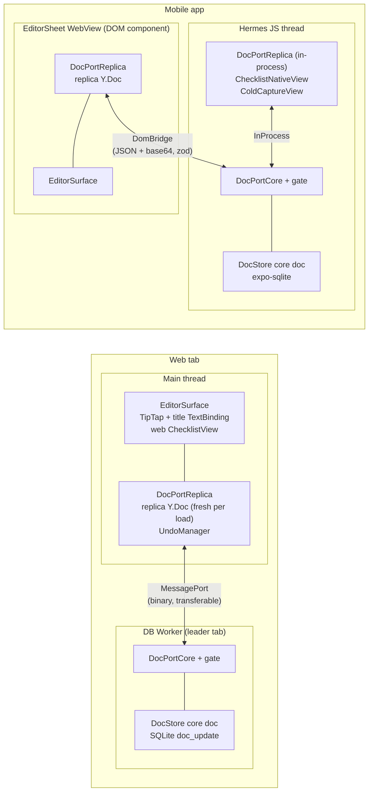
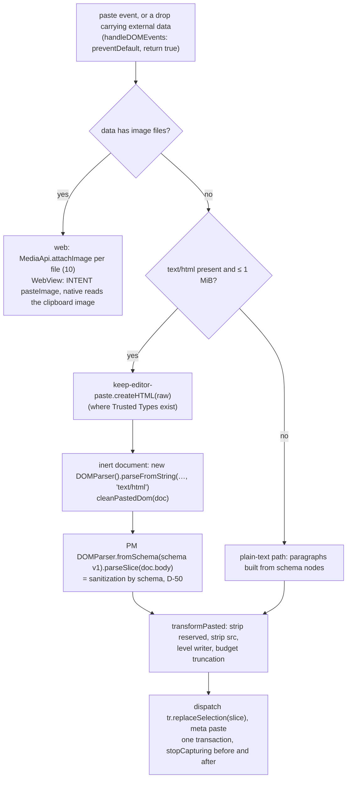
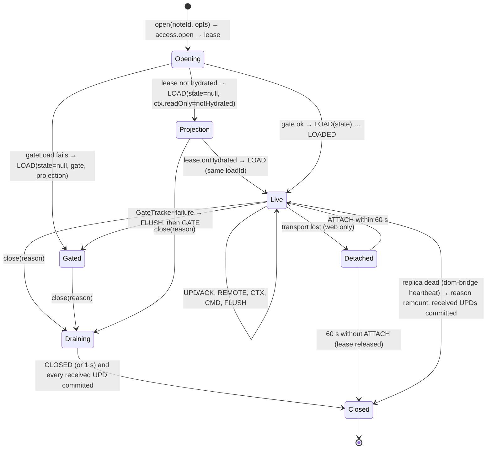
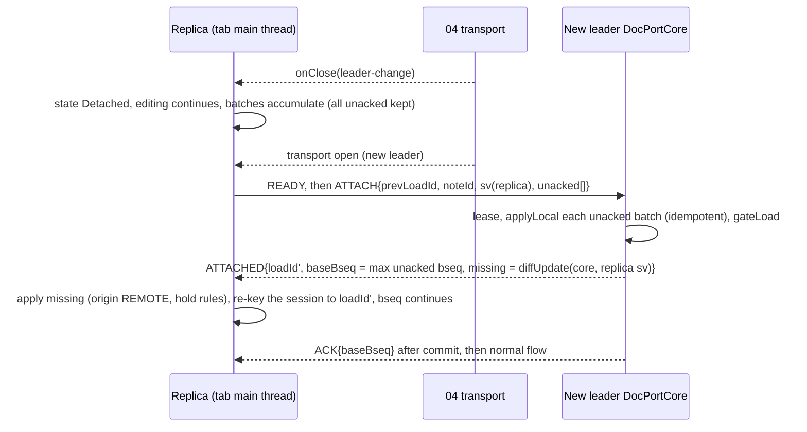
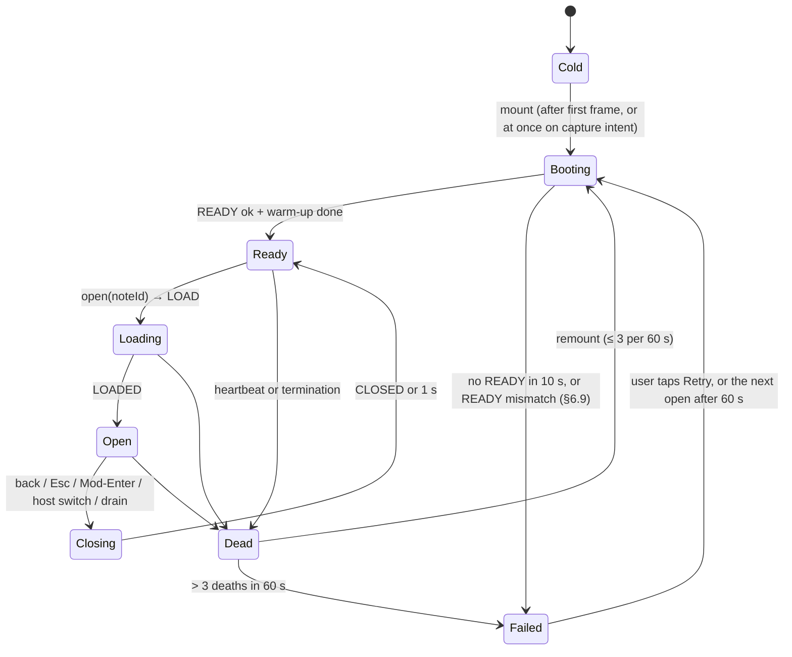
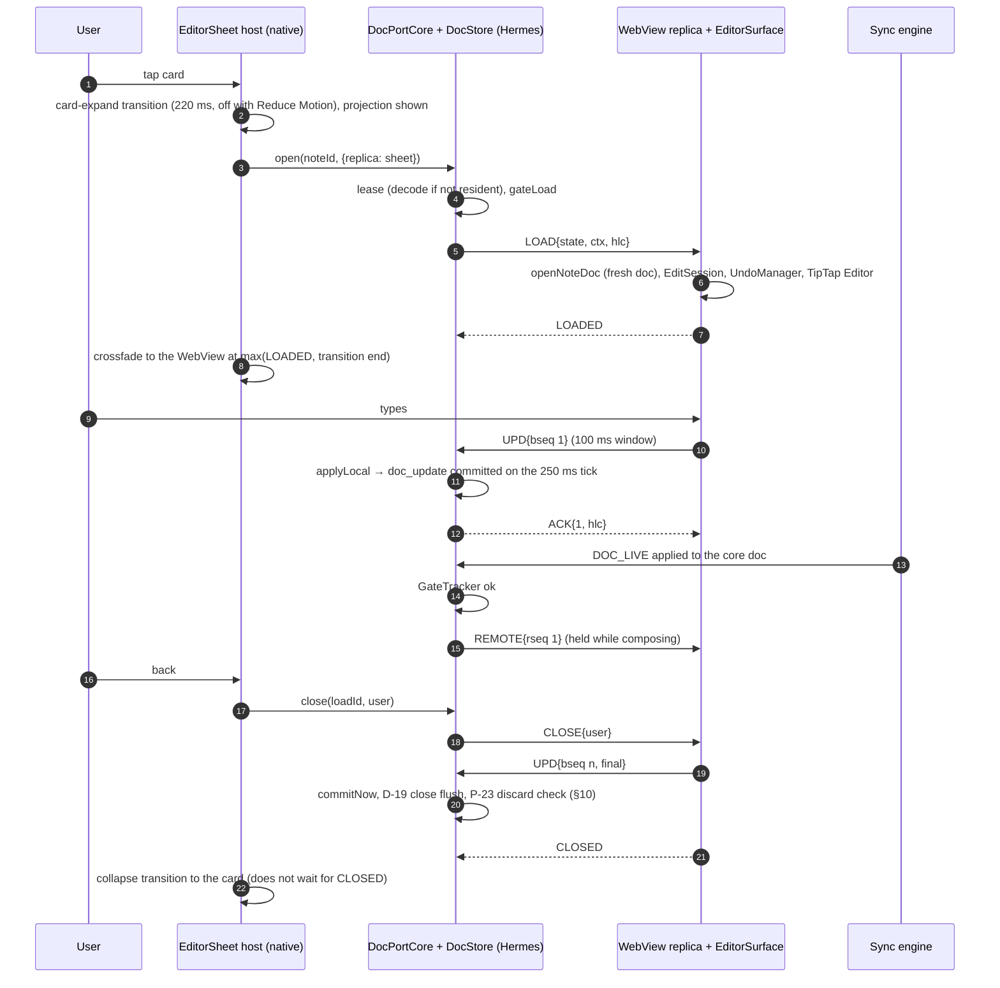
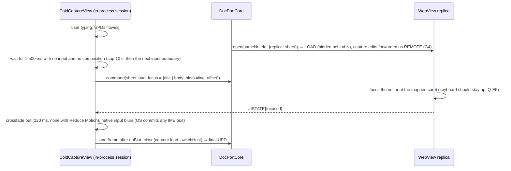

# 05 · Editor: TipTap schema, DocPort, EditorSheet and checklists

*Aligned with spine v1.3.*

*Detail design · elaborates spine v1.3 (first written against v1.1; the v1.2 changes C-40, C-41, C-49, C-51, C-54, C-56, C-58 to C-71 and the v1.3 changes C-201, C-204, C-206 to C-209, C-213, C-223, C-231, C-232, C-241 to C-245 that touch the editor are applied and cited inline) · 2026-10-04 · Status: draft for review*

## 0. Purpose and scope

This document specifies how notes are edited on every platform. It covers:

- the TipTap realization of 01's ProseMirror schema v1 and its extensions: hashtag labels, keymap, link sanitizing, paste;
- **EditorSurface**, the React DOM component that edits notes on web and inside the mobile WebView;
- the **DocPort** protocol between the client core and every editor replica: acked batches, heartbeat, a fresh doc per load, chunked loads, web reattach, and where the INV-9 gate sits;
- the mobile **EditorSheet** host, its WebView bundle contract, and cold capture (an in-process DocPort session on the new note, not a buffer; C-69);
- the headless **ChecklistController** and **TextBinding** (IME handling, `Y.RelativePosition` caret mapping) and the native list host;
- the undo model, schema-gate and read-only UX, P-23 materialization and empty discard, soft conversion and "Convert remaining" UX, merge-review and over-limit UX, and editor accessibility;
- the test harness exports (`@keep/editor/testing`) that 16's simulator runs replicas with (§16.1).

Every length in this document is in **UTF-16 code units** (`string.length`, `Y.Text.length`, ProseMirror positions), as the spine states for every limit (P-12, C-41). "Characters" in UI copy and budgets means these units.

An engineer should be able to build `packages/editor`, the `editing/` module of `packages/note-model`, and the editor half of `DocPortCore` from this document. Section numbers and type names are stable: 04 hosts `DocPortCore` and implements `CoreDocAccess` (§6.9) against them, 06 builds against §5 and §6, 07 builds against §7.7–§7.8, and 16 builds against §16.1.

### Out of scope

| Topic | Owner |
|---|---|
| NoteDoc v1 layout, `PM_SCHEMA_V1`, `REGISTRY_V1`, structural scanners, render normalization, edit-wins delete, conversion algorithms, placement primitives, limits, Projector | `01-domain-model.md`. This document realizes the schema in TipTap and composes 01's primitives into editing commands. |
| DocStore residency, local SQLite schema, persist tick, outbox, projection re-derivation, the `CoreDocAccess` implementation, web leader election and the web DocPort transports | `04-client-core.md` |
| KSP frames (`DOC_LIVE`, `DOC_SYNC`), telemetry SLI schema | `02-sync-protocol.md` |
| Note dialog, grid, global shortcuts, CSP and Trusted Types headers, PWA update prompt | `06-web-app.md` |
| Expo app structure, root layout, EditorSheet mounting, native chrome visuals, image viewer, capture intents, widgets, native modules | `07-mobile-app.md` (consumes §7.7 and §7.8) |
| Media upload, signed URLs, renditions, the editor source resolver, image placeholder copy (`MEDIA_UX`), link-preview unfurl, OCR, the image safety-scan serving gate (C-241) | `10-media.md` |
| Native validation of WebView intents (loadId and ID scoping, rate limits, native confirmation of destructive actions) | `15-security-privacy-compliance.md` §6.6 sets the rules; 07 (and 06 on web) implements them; §7.7 restates the contract |
| Compactor dedupe, conversion cleanup, item GC | `03-sync-server.md` (rules in 01 §12–§14) |
| `authz` predicates (note-link visibility) | `08-sharing-and-authz.md` |
| Presence and live cursors (v1.1), "Find in note", version-history UI, drawings, audio | Later design docs |

---

## 1. Spine references

| ID | What this document does with it |
|---|---|
| **D-10** | TipTap 3.31.4 + `@tiptap/extension-collaboration` + `@tiptap/y-tiptap` 3.0.9 bound to `body` (`Y.XmlFragment`); no StarterKit, so no history plugin; schema v1 with reserved constructs created only behind flags, paste included (C-66); the gate runs before the binding (§4, §6.6) |
| **D-11** | Root-owned, pre-warmed EditorSheet; one WebView document per text note (title, body, carousel, link cards, chips, footer) that also renders both parts of a mixed note (C-68); a fresh Y.Doc per load; DocPort base64 acked batches; 5 s heartbeat; card-expand transition; cold capture through an in-process DocPort session, with no buffer outside the core (C-69); native image viewer; react-native-keyboard-controller (§6, §7) |
| **D-12** | ChecklistController and TextBinding shared by web, WebView and RN; IME hold with the `ime-state` module and a typing-window fallback (C-71); `Y.RelativePosition`; one active `TextInput`; up to 1,000 items; mixed list notes render the body read-only with "Edit as text" (C-68); every editor binds a fresh replica over DocPort with one UndoManager per editing session over `title`, `items`, `attachments`, `hiddenLinks`, plus `body` when shown and `meta` for conversions (C-61) (§3, §8, §9) |
| **D-50** | Link marks http/https/mailto; schema-sanitized paste; Trusted Types where the engine supports them, with the sink lint rules and the sanitizer as the baseline everywhere (C-208); WebView images only from the CDN or data URIs of visible images (C-67); the image serving gate renders "Checking image…" and "Image removed" (C-241) (§4.4, §4.5, §5.4, §7.7) |
| **INV-9** | Gate on effective level, names and (c) shape, checked on the structs an update integrated into the core doc plus a full scan on load, in the core, before any update reaches a replica; teardown and read-only UX; reason `malformed` for shape-only failures (C-60); the UndoManager never deletes a `meta.lv` key (§6.6, §9.1, §11) |
| **INV-11** | Every command targets the render-normalized model and writes only the fields it changes; normalization is never written back (§8.2) |
| **INV-12** | The core drains open editor sessions (FLUSH ≤ 1 s, then CLOSE) before purge extraction and before sign-out or account-switch counts (C-51); replica batches are always `local` rows; uncommitted images travel with the draft (C-223, 10) (§6.9 C3, §11) |
| **P-18** | Merge-review banner (generic until `authors1`, C-22) and review dialog (§12.5) |
| **P-19** | Depth ≤ 1, first-item rule, cascade check, edit-wins delete, soft conversion, plain-text items (§8, §12) |
| **P-23** | Ephemeral new notes, per-user choices held until materialization on first content, discard only of notes materialized in the session (C-59) (§10) |
| **P-31** | `#hashtag` labels: picking removes the typed `#query` and applies the label in one undoable step (C-65) (§4.6) |
| **§4.3 rules 7 and 8** | Enter inserts directly below the current item, as its first child when it has live children (C-63) (§8.3); undo never removes another client's content or a `meta.lv` key, and follows the growth rule on over-limit notes (C-62) (§9) |
| **X-17** | Editor accessibility on web, in the WebView and on native; the editor's own single-character row keys follow the per-device switch (C-201) (§8.3, §13) |
| Also used | INV-1 (including the inbox path, C-204), INV-4, INV-8, INV-10, D-04 (C-54), D-09, D-13, D-19, D-23, D-38 (`bg-flush` in M1, C-209), P-03, P-05, P-12 (C-41), P-17, X-01 (C-206), X-08, X-11 (C-231, C-232), X-14, X-16, X-18, X-19, §1.3 (web tap-to-editable, C-207; device classes, C-244), §4.3 rules 1–6, §5.6 (crash window, C-56; M1 exit, C-242), §5.10 (C-70), §5.11 (C-58), D-48 (C-243), Q-01, Q-05, Q-10 |

---

## 2. Interfaces at a glance

| Interface | Direction | Section | Code location |
|---|---|---|---|
| **DocPort protocol**: frames, codecs, session state machines, acks, heartbeat, chunking, ATTACH | **Owned** ↔ 04 | §6 | `packages/editor/src/port/*`, exported as `@keep/editor/port` (pure TS) |
| `DocPortCoreHostApi`, `DocPortTransport`, `OpenOptions`, `CloseReason`, `SessionEvent` | **Owned** → 04 hosts and proxies; 06, 07 call | §6.2, §6.9 | `@keep/editor/port` |
| `CoreDocAccess` / `CoreDocLease` | **Owned** → 04 implements | §6.9 | `@keep/editor/port` |
| `gateLoad`, `GateTracker`, shape scan, `GateInfo` (built on 01's scanners) | **Owned** → runs inside DocPortCore | §6.6 | `@keep/editor/port/gate` |
| `EditorContext`, `EditorCommand`, `EditorIntent`, `EditorUiState`, `FocusTarget`, `ReadOnlyProjection`, `AttachmentView`, `AttachmentSrc`, `EditorMemberChip` + `toEditorChip` | **Owned** → 04 fills `EditorContext`; 06, 07 consume | §6.3 | `@keep/editor/port` |
| `DocPortReplica`, `ReplicaEnv`, `ImeStateHelper`, `createReplica` | **Owned** → 06, 07, 16 | §7.8 | `@keep/editor/port` |
| `createTabReplica` (web tab replica factory) | **Owned** → 06 | §5.2 | `@keep/editor/dom` |
| `isMaterializable`, `seedNewDoc` | **Owned** → 04 (P-23) | §10 | `packages/note-model/src/editing/materialize.ts` |
| **ChecklistController** API, `ChecklistViewModel`, `EditSession`, session origins, `createSessionUndo`, `TextBinding`, `TextFieldAdapter`, `CaptureBinding`, `writeCapture`, `parsePastedLines` | **Owned**; rules from 01 | §7.5, §8, §9 | `packages/note-model/src/editing/*` |
| `EditorSurface`, `EditorController` | **Owned** → 06, 07 | §5 | `@keep/editor/dom` |
| **Editor bundle contract** (DOM component entry, WebView settings, CSP, intent validation, budgets) | **Owned** → 07 | §7.7 | `apps/mobile/src/editor/EditorSheet.dom.tsx` + `@keep/editor/dom` |
| Native components: `ChecklistNativeView`, `ActiveFieldHost`, `ColdCaptureView` | **Owned** → 07 mounts | §7.8, §8.6 | `@keep/editor/native` (RN only, TipTap-free) |
| Test harness: `createHeadlessReplicaHost`, `createFaultyTransportPair` | **Owned** → 16 | §16.1 | `@keep/editor/testing` (test builds only) |

**Consumed** (minimal assumptions):

| From | What | Assumption |
|---|---|---|
| 01 | `PM_SCHEMA_V1`, `REGISTRY_V1`, `LINK_SCHEMES`, `SchemaRegistry`, `scanDoc`, `scanIntegrated`, `gateDecision`, `StructuralReport` | As in 01 §10. `scanIntegrated(tr, reg)` inspects exactly the structs a transaction integrated |
| 01 | `openNoteDoc`, `NoteDocHandle`, `NoteDocView`, `NoteDocWriter`, `Origin`, `ItemSnapshot`, `BodyBlock` | As in 01 §9. Writer primitives run inside `doc.transact`, so an enclosing `doc.transact(fn, origin)` supplies the transaction origin (Yjs nested-transaction semantics) |
| 01 | `normalize`, `NoteRender`, `ListRender`, `RenderRow`, `textHash`, `keyBetweenSafe`, `compareKeyed`, `LIMITS`, `OverLimit`, `growthAllowed`, `truncateUnits`, `cleanLine`, `convertToList`, `convertToText`, `convertRemaining`, `labelDisplayName`, `labelNameKey`, `validateLabelName`, `normalizeUrl`, `Rng`, `Hasher`, `Clock` | As in 01 §3.3, §7, §8, §11–§13 |
| 04 | `CoreApi` (`notes.newNoteId`, `labels`, `trash`, `mergeReview`, `drafts`, `media`, `ui`), `EditorHostApi.connect(kind)`, HLC ticking, persist tick | Implements §6.9 obligations C1–C8. `connect` yields the replica end **and** its `ReplicaId` (`{end, replica}`, the shape 06's cross-doc issue 1 asks 04 for), because `OpenOptions.replica` needs it |
| 02 | Client telemetry schema | Accepts the metric names and enum labels in §14 |
| 06 | Note dialog, Trusted Types policy name `keep-editor-paste` in the CSP, global-shortcut suppression on `[data-keep-editor]`, the per-device single-key switch passed as `env.singleKeyShortcuts` (C-201), `setHostStatus('dbUnavailable')` in the HeldElsewhere state (C-54), `beforeunload` from `oldestUnackedAt()`, PWA update prompt | — |
| 07 | EditorSheet mount at the root, DomBridge native end (which owns the heartbeat, §6.7), native chrome, keyboard provider, image viewer, store or OTA update action, the `ime-state` module (D-38, C-71), intent validation per 15 §6.6, `setMedia` for visible images (§5.4) | §7.7, §7.8 |
| 08 | Note-link visibility rule; `MemberChip` (08 §4.8) | A linked note is shown only if it is in the local DB with an active membership. Editor chips are derived from 08's chips by `toEditorChip` (§6.3) |
| 10 | `media.urls` (signed URLs), `MediaApi.attachImage`, `MediaSourceResolver.editorSource`, `MEDIA_UX` keys, link-preview rows | `AttachmentView` and `LinkCard` are filled by 04 from 10's data; data URIs reach the WebView only through `setMedia` (§5.4) |
| 15 | WebView intent rules (15 §6.6) | §7.7 |

**Package rules** (X-19, enforced by dependency-cruiser and a bundle check):

- `@keep/editor/port` imports only `yjs`, `lib0`, `zod`, `@keep/domain` and `@keep/note-model`. `sync-client` may import it (04 §3.1).
- `@keep/editor/dom` holds TipTap, ProseMirror, `EditorSurface` and the web `ChecklistView`. Only `apps/web` and files named `*.dom.tsx` in `apps/mobile` import it. A CI step greps the Hermes bundle map for `@tiptap/`, `prosemirror-` and `y-tiptap`; any hit fails the build.
- `@keep/editor/native` holds RN components. It must not import `@keep/editor/dom`.
- `@keep/editor/testing` (§16.1) may be imported only by `*.test.ts`, `packages/sim` and E2E harnesses; a dependency-cruiser rule forbids it in app code.
- `note-model/src/editing` imports no DOM, RN or TipTap; it receives platform behaviour through adapters (§8.5).

### 2.1 Constants

| Constant | Value | Section |
|---|---|---|
| Length unit | UTF-16 code units for every limit, offset and budget (P-12, C-41) | §0 |
| Replica → core batch window | web 50 ms, WebView 100 ms, in-process next microtask | §6.5 |
| Hard-crash loss bound | batch window + 250 ms persist tick, ≈ 350 ms of typing (spine §5.6, C-56) | §6.1 G6 |
| Batch flush size / max unacked batches per load | 32 KiB / 8 | §6.5 |
| DomBridge frame cap / LOAD chunk | 256 KiB JSON / 192 KiB of base64 per part | §6.2 |
| REMOTE coalescing | 16 ms or 64 KiB | §6.6 |
| Heartbeat | PING every 5 s; PONG deadline 5 s, then one 2 s retry | §6.7 |
| FLUSH timeout | 1 s DomBridge, 200 ms otherwise | §6.5 |
| Drain timeout (INV-12) | 1 s | §6.9 |
| Web reattach window | 60 s | §6.8 |
| WebView boot timeout / remount cap | 10 s / 3 per 60 s | §7.2 |
| IME hold cap; RN typing window | 30 s; 400 ms (continuous cap 3 s) | §8.5 |
| Undo capture timeout / stack cap | 500 ms / 200 items | §9 |
| Conversion snackbar | 10 s, only while the conversion is the top undo item | §12.1 |
| Cold-capture handover quiet period | 500 ms (cap 10 s) | §7.5 |
| HTML paste cap | 1 MiB of `text/html`; above that the plain-text path runs | §4.5 |
| `keep-editor-paste` registry | ≤ 4 pending strings, delete-on-use | §4.5 |
| `HREF_MAX` | 2,048 units | §4.4 |
| Hashtag suggestions / query length | ≤ 6 / ≤ 50 units (P-05) | §4.6 |
| WebView image data URIs | ≤ 1,024 px rendition (C-67); only for visible images; ≤ 512 KiB of base64, ≤ 2 in flight, ≤ 8 live per load (07 §6.10 bounds) | §5.4 |
| `mediaVisible` | debounced 100 ms; ≤ 50 IDs per intent | §5.4 |
| Collaborator-edit announcement | ≤ 1 per 10 s per note | §13 |

---

## 3. Component map and runtime placement

Every editing session, on every platform, binds a **fresh replica `Y.Doc`** that talks to the **core doc** (owned by DocStore, 04) over DocPort. Only the transport differs. The core is the source of truth (D-11): it applies replica batches, persists them, applies remote sync updates, runs the INV-9 gate and forwards what passes. No editor writes the core doc directly.



| Host | Note kinds | Replica lives in | Transport | Batch window |
|---|---|---|---|---|
| Web note dialog | text, list, mixed | Tab main thread | `MessagePort` to the leader's worker; follower tabs relay over BroadcastChannel (04 §11.9) | 50 ms |
| EditorSheet (iOS, Android) | text; text with visible items (§12.3) | WebView | DomBridge | 100 ms |
| Native list host (iOS, Android) | list, including list with a visible body (read-only body, §12.3) | Hermes | InProcess | next microtask |
| Cold capture (iOS, Android) | new text note while the sheet is not ready | Hermes | InProcess | next microtask |
| Native image viewer (delete, alt text) with **no** editor open on the note | any | Hermes | InProcess, short-lived | next microtask |

A viewer opened from an open editor (`INTENT{openImage}`) does not open a session of its own: its Delete and alt-text edits go to the open load as `CMD{removeImage}` / `CMD{setAlt}`, so they are edits of that session and undoable there (§7.6, C-61).

**Why a replica even on Hermes,** where the core doc is in the same thread: every host then gets the same gate path (INV-9), the same remote **hold** for IME composition (§8.5, D-12 "holds remote updates during IME composition", which is impossible on a binding to the core doc itself), and the same fresh-doc rule (G1). A list doc of 1,000 items encodes and applies into a new Y.Doc in about 10–20 ms on Hermes (verified in M0 spike 7, Q-10), inside the 150 ms tap-to-editable budget. Memory cost is one extra decoded doc for the open note (≤ 2 MB encoded); D-09 counts the open note's replica as resident. D-12 and the spine's §5.1 DocPort row now state this, including the in-process transport (C-61).

---

## 4. TipTap schema v1 and extensions

### 4.1 Registry conformance

01 owns the schema spec (`PM_SCHEMA_V1`) and the registry (`REGISTRY_V1`, 01 §10.1–§10.2). This section realizes them in TipTap. v1 content:

| Kind | Name | Attrs | Level | Created by v1 UI |
|---|---|---|---|---|
| block | `paragraph` | `src` | 1 | yes |
| block | `heading` | `level` (1 or 2), `src` | 1 | yes |
| block | `todoLine` | `checked`, `src` | 1 | **no** (reserved; flag `editor.todoLine`) |
| inline | `text` | — | — | yes |
| inline | `hardBreak` | — | 1 | yes |
| inline atom | `noteLink` | `noteId` | 1 | **no** (reserved; flag `editor.noteLinks`) |
| mark | `bold`, `italic`, `underline` | — | 1 | yes |
| mark | `link` | `href` | 1 | yes |
| mark | `strike` | — | 1 | **no** (reserved; flag `editor.strike`) |

Reserved constructs are level 1, so every v1 client can map them and writing them later needs no `meta.lv` raise. Their **creation** is gated by UI flags, including through paste; they always **render** (spine §4.3 reserved-constructs note and §5.10, C-66; this document owns the paste mapping in §4.5).

**Conformance test (CI, required).** Build the editor with the production extension list, read `editor.schema`, and assert:
- node names = `{doc, text} ∪ keys(REGISTRY_V1.nodes)`, mark names = `keys(REGISTRY_V1.marks)`;
- for every node and mark, its attribute keys = `keys(REGISTRY_V1.attrs[name] ?? {})`;
- `registryHash(REGISTRY_V1)` (SHA-256 of the canonical JSON, computed at build time in `@keep/editor/port`) equals the hash compiled into the DOM bundle.

No extra node may exist (a stray `blockquote`, say). The gate (§6.6) would otherwise pass content the binding then mangles, and TipTap's default `link` attributes (`target`, `rel`, `class`) would be written into Yjs, where every other client's gate would read them as unknown attributes.

### 4.2 Extension list and configuration

StarterKit is **not** used. Each extension is imported individually at `@tiptap/*@3.31.4`.

| Extension | Source | Configuration |
|---|---|---|
| `KeepDocument` | `@tiptap/extension-document` | `content: 'block+'` |
| `Paragraph` | `@tiptap/extension-paragraph` | `HTMLAttributes: { dir: 'auto' }` (rendered constant, not a node attr; X-18) |
| `Heading` | `@tiptap/extension-heading` | `levels: [1, 2]`, `HTMLAttributes: { dir: 'auto' }`. A peer's out-of-range `level` renders per 01 §10.4 (H1 if < 1 or not a number, else H2); the stored attr is untouched (INV-11) |
| `TodoLine` | custom node | Block, `content: 'inline*'`, attr `checked` (default `false`). Renders `<div data-type="todo-line" dir="auto"><input type="checkbox" disabled aria-hidden="true"><p>…</p></div>` until `editor.todoLine` is on. No commands, input rules or keymap while the flag is off |
| `Text`, `HardBreak` | `@tiptap/extension-text`, `-hard-break` | HardBreak keymap reduced to `Shift-Enter` (§4.7) |
| `NoteLink` | custom inline atom | attr `noteId`. Renders a chip from `ctx.noteLinks[noteId]` (title only when the core's local check passes, 08); otherwise the neutral text "Note unavailable" (01 §10.4). Not insertable while `editor.noteLinks` is off |
| `Bold`, `Italic`, `Underline` | `@tiptap/extension-*` | Default parse rules. Bold ignores Google Docs' `<b style="font-weight:normal">` wrapper |
| `SafeLink` | `@tiptap/extension-link`, extended | `addAttributes()` returns **only** `href` (default `null`, `parseHTML: el => sanitizeHref(el.getAttribute('href'))`). `inclusive: false` (01). `openOnClick: false`, `autolink: true`, `linkOnPaste: true`, `defaultProtocol: 'https'`, `protocols: []`, `isAllowedUri: u => sanitizeHref(u) !== null`, `shouldAutoLink: u => sanitizeHref(u) !== null`. `renderHTML` re-sanitizes (§4.4) |
| `Strike` | `@tiptap/extension-strike` | Commands and keymap removed unless `editor.strike` is on; the mark always renders |
| `BlockSrc` | `addGlobalAttributes` on `paragraph`, `heading`, `todoLine` | `src: { default: null, keepOnSplit: false, rendered: false, parseHTML: () => null }`. Never rendered to the DOM and never parsed from HTML, so copy and paste can't forge provenance. A split gives the new half no provenance |
| `Collaboration` | `@tiptap/extension-collaboration` | `fragment: session.edit.handle.bodyY()`, `yUndoOptions: { undoManager: session.edit.undo }` (one UndoManager per load, §9; Q-E3) |
| `Placeholder` | `@tiptap/extension-placeholder` | "Note" in an empty body (i18n `editor.body.placeholder`) |
| `KeepKeymap` | custom | §4.7 |
| `PastePipeline` | custom plugin | Handles `paste` and external `drop` in `editorProps.handleDOMEvents`, so ProseMirror's own clipboard HTML parsing never runs (§4.5) |
| `LimitGuard` | custom plugin | §4.8 |
| `ProvenanceMarks` | custom plugin | Decorates same-provenance duplicate blocks (§12.2) |
| `CompositionTracker` | custom plugin | Reports `view.composing` transitions to the replica's `HoldRegistry` (§8.5) |
| `ReadOnlyGuard` | custom | `editable: () => session.ctx.readOnly === null` |
| `HashtagSuggestion` | `@tiptap/suggestion@3.31.4` | M4, flag `editor.hashtags` (§4.6) |

**Editor options:** `enableInputRules: false` (Keep has no Markdown shortcuts; TipTap's `# ` heading rule would also break hashtags); `enablePasteRules: [SafeLink]`; `injectCSS: false` (styles ship in the bundle CSS, CSP-safe); `editorProps.attributes`: `role="textbox"`, `aria-multiline="true"`, `aria-label` from i18n, `dir="auto"`, `spellcheck="true"`, `autocapitalize="sentences"`, `data-keep-editor=""`.

**Per-load lifecycle:** the TipTap `Editor` is created per load and destroyed on close (G1). At WebView boot, one throwaway editor is created and destroyed on a sample doc to warm JIT paths (§7.2).

### 4.3 Level writer (schema ahead of UI, §5.10)

Any command or paste that inserts a construct whose registry level `N > 1` must:

1. be enabled only when `ctx.flags.docSchemaWritable >= N`;
2. add key `String(N)` to `meta.lv` through 01's `NoteDocWriter.raiseLevel(N, flags)` **in the same Yjs transaction** as the insertion.

Implementation: `doc.transact(() => { handle.write.raiseLevel(N, flags); editor.commands.x(...) }, ySyncPluginKey)`. y-tiptap's PM → Y write joins the outer transaction, because nested `transact` calls join the open one. M0 spike 6 (Q-E3) verifies that y-tiptap 3.0.9 writes synchronously inside `dispatch`. If it does not, the raise happens in the transaction **immediately before** the insertion, which spine §5.10 allows: raising first only makes old clients gate earlier, never later (C-70). The UndoManager never removes the key (§9.1, §4.3 rule 8).

In v1 every registry entry is level 1, so the level writer has no callers. It ships with tests so that the first level-2 construct cannot forget the raise.

### 4.4 Link sanitizing (D-50, X-16)

One function decides what an `href` may be. It runs at parse, at autolink, at render and at click.

```ts
// @keep/editor/dom/link/sanitize.ts
const ALLOWED = new Set<string>(LINK_SCHEMES);        // 01: 'http:', 'https:', 'mailto:'
const TAB_NL = /[\t\n\r]/g;                           // WHATWG URL parsing strips these anywhere
const EDGE_C0_SPACE = /^[\u0000- ]+|[\u0000- ]+$/g;
export const HREF_MAX = 2048;

export function sanitizeHref(raw: unknown): string | null {
  if (typeof raw !== 'string') return null;
  const s = raw.replace(TAB_NL, '').replace(EDGE_C0_SPACE, '');
  if (s.length === 0 || s.length > HREF_MAX) return null;
  let candidate = s;
  if (!/^[a-z][a-z0-9+.-]*:/i.test(s)) {                           // no scheme
    if (s.startsWith('//') || s.startsWith('\\')) return null;     // protocol-relative
    if (/^[^\s@/:]+@[^\s@/:]+\.[^\s@/:]{2,}$/.test(s)) candidate = 'mailto:' + s;
    else if (/^[^\s/:@]+\.[^\s/:@]{2,}(?::\d{1,5})?(?:[/?#].*)?$/.test(s)) candidate = 'https://' + s;
    else return null;
  }
  let u: URL;
  try { u = new URL(candidate); } catch { return null; }
  if (!ALLOWED.has(u.protocol)) return null;
  if (u.protocol !== 'mailto:') {
    if (!u.hostname) return null;
    if (u.username || u.password) return null;                     // https://bank.com@evil.example
  }
  return u.href;
}
```

| Point | Rule |
|---|---|
| Parse (HTML paste, `parseHTML`) | A rejected `href` returns `false` from `getAttrs`: the mark is dropped, the text stays |
| Autolink and link-on-paste | Only text that `sanitizeHref` accepts becomes a link |
| Render (`renderHTML`) | Peers can write any `href` into Yjs, and marks created by y-tiptap bypass `parseHTML`. `SafeLink.renderHTML` re-runs `sanitizeHref`: a valid value renders `<a href=… rel="noopener noreferrer nofollow ugc" target="_blank">`; an invalid one renders `<span class="link-invalid">` with no `href` (01 §10.4). The stored attr is **not** modified (INV-11) |
| Click | `openOnClick: false`. A click places the caret and opens the link popover, which shows the URL with the hostname in punycode (`u.hostname`) and offers **Open**, **Edit** and **Remove link**. `Mod`+click opens directly. Opening re-runs `sanitizeHref`. Web: `window.open(href, '_blank', 'noopener,noreferrer')`. WebView: `INTENT{openUrl}`; native re-validates with `isAllowedScheme` (the same stripping plus a scheme regex, because RN's `URL` is incomplete) before `Linking.openURL` |
| Metrics | `editor_href_rejected_total{where: parse\|render\|click, class: scheme\|creds\|length\|syntax}` |

The WebView never navigates (§7.7), so a bad `href` that slipped through would still be inert.

### 4.5 Paste pipeline



**Interception.** `PastePipeline` handles `paste`, and `drop` events whose `dataTransfer` comes from outside the editor, in `editorProps.handleDOMEvents`: it calls `preventDefault()` and returns `true`, so ProseMirror's own clipboard path (`parseFromClipboard`/`readHTML`) never runs. That path assigns `innerHTML` on a detached element and, where Trusted Types exist, wraps the string with its own identity policy or the `default` policy (prosemirror-view behaviour, pinned in M0 spike 6 by T-02, Q-E3). The pipeline needs neither and never patches ProseMirror. A drag that starts inside the editor (`view.dragging`) moves a ProseMirror slice, parses no HTML, and is left to ProseMirror. If ProseMirror's path ever ran anyway (a missed event type), the CSP lists no policy it could create, so `createPolicy` throws and the paste fails closed: nothing is inserted, `editor_paste_failed_total{cause: 'tt'}` is counted, and nothing executes.

**`cleanPastedDom(doc)`** works on the inert document that `DOMParser` returns: such a document has no browsing context, so it runs no script and loads no resource. It never touches the live DOM.
- Removes `script`, `style`, `meta`, `link`, `iframe`, `object`, `embed`, `svg`, `math`, `template`, `form` and comments.
- `<li>` in a `<ul>` becomes `<p>• text</p>`; in an `<ol>`, `<p>N. text</p>` numbered from `start`. Nested lists flatten with a two-space prefix per level.
- Checkbox list items (`<li>` containing `input[type=checkbox]`) become `todoLine` when `editor.todoLine` is on, otherwise `<p>☐ text</p>` or `<p>☑ text</p>`.
- `<h1>`/`<h2>` are kept. `<h3>`–`<h6>`, `<blockquote>` and `<pre>` become paragraphs (`<pre>` keeps its line breaks as `hardBreak`).
- `` is dropped. The client never fetches remote images from pasted HTML (privacy).
- `<s>`, `<del>` and `<strike>` are unwrapped unless `editor.strike` is on.

**Trusted Types** (D-50, X-16, C-208). `DOMParser.parseFromString` is a Trusted Types sink, and it is the editor's only HTML sink. `@keep/editor/dom/paste` (the one module 06's lint rules exempt) creates the policy `keep-editor-paste` once at module load; no `default` policy exists. Its `createHTML(s)` accepts only a string that the pipeline registered in the same task, in a bounded `Set<string>` (≤ 4 entries; each entry is deleted when used, so a string cannot be replayed) and throws otherwise (strings cannot be `WeakSet` members). Trusted Types are enforced only where the engine supports them: Chromium-based browsers and the Android System WebView enforce them; engines without `window.trustedTypes` (unverified Firefox and Safari releases, and WKWebView until Q-15.9 says otherwise) pass the raw string to the same inert parse. On every engine the baseline is the same: interception, `cleanPastedDom`, the schema parse and 06's sink lint rules (C-208). 06 lists `keep-editor-paste` in the CSP `trusted-types` directive; the WebView CSP lists it too (§7.7).

**Copy and cut** keep ProseMirror's default serializer: it builds DOM nodes and reads `innerHTML` for the clipboard, which is not a sink.

**Plain-text path** (body): CRLF and CR become LF; each line becomes a `paragraph` node built with the schema (no HTML); URL runs pass through autolink and `sanitizeHref`.

**`transformPasted(slice)`:**
1. Strip reserved constructs whose flag is off (C-66): `strike` marks are removed; `todoLine` becomes `paragraph` (checked state dropped); `noteLink` becomes the plain text "Note unavailable" (no linked title is copied into the target note's content).
2. Set `src = null` on every pasted block. Provenance is never pasted.
3. Run the level writer (§4.3) for any construct with level > 1.
4. **Budget.** `remaining = LIMITS.BODY_PLAIN_MAX − bodyPlainLen(doc) + plainLen(selection being replaced)`, measured as 01 defines `bodyPlain` (blocks joined by `\n`, `hardBreak` = 1, `noteLink` = 1). If the slice's plain length exceeds `remaining`, cut it with 01's `truncateUnits` at the budget, send `INTENT{limitHit: 'body'}` and toast "Pasted text was shortened to fit the note". If the body is already flagged `OverLimit.BODY`, a paste that grows it is refused with "This note is over the limit" (§4.3 rule 6). 01 §8.3: paste truncates, it never drops the whole paste.

Paste into the **title** goes through TextBinding: 01's `cleanLine` turns line breaks into spaces, and the result is truncated to `LIMITS.TITLE_MAX`. Paste into a **checklist item** goes to `ChecklistController.paste` (§8.4).

### 4.6 Hashtag labels (P-31, M4, flag `editor.hashtags`)

Labels are personal (P-05) and the body is shared, so a hashtag is a **trigger**, not a node: no schema change and no gate impact. Spine P-31 (C-65) fixes the behaviour; Keep parity is UNVERIFIED under Q-01.

| Aspect | Rule |
|---|---|
| Trigger | `#` at the start of a text block or after whitespace, outside a `link` mark. The query is a run of letters, digits, `_` and `-` (`[\p{L}\p{N}_-]*`) of at most 50 UTF-16 units, P-05's label-name measure (C-41). It ends at whitespace, punctuation, Escape, the 50-unit cap, or the caret leaving the range. Body (TipTap Suggestion) and checklist items (`ChecklistController.hashtag`, §8.1). Never in the title |
| Options | The user's labels from `ctx.labels.all`, matched on 01's `labelNameKey`: prefix matches first, then substring, at most 6. Then "Create label '‹query›'" when there is no exact match, `validateLabelName(query)` passes and the user has fewer than `LIMITS.LABELS_MAX` labels |
| Pick | One replica transaction with origin `ORIGIN.hashtag` and `step: true` **deletes the `#query` text**; the same undo step records `{labelId \| createName, applied: true}` in its stack-item meta. Then `INTENT{applyLabel: labelId}` or `INTENT{createLabel: name}`. The host calls `labels.create(name)` (UUIDv5 ID, 01 §5) when needed, then `labels.setOnNotes([noteId], id, true)`. Removing the trigger text keeps the user's label taxonomy out of shared content (P-31) |
| Escape, or typing on | The `#text` stays as ordinary text; no label is applied |
| Cap reached | No "Create" option; a hint reads "You have 50 labels" |
| Undo and redo | The pick is **one undoable step** (P-31): `Mod-z` restores the `#query` text and, on `'stack-item-popped'` for that step, sends `INTENT{removeLabel: labelId}` for this note; redo deletes the text again and sends `INTENT{applyLabel}`. A label the pick created stays in the user's label list (only its assignment is undone). This is the one per-user effect tied to the editor's history (§9.2); other per-user metadata uses snackbars |
| Ephemeral note (P-23) | Typing `#query` already materialized the note (§10). The label op waits behind `note.create` (`blocked_on`, §5.6) |

### 4.7 Keymap

**Body (TipTap).** `Mod` is ⌘ on Apple platforms and Ctrl elsewhere.

| Keys | Action | Basis |
|---|---|---|
| `Mod-b` / `Mod-i` / `Mod-u` | Bold / italic / underline | Keep formatting options [P] |
| `Mod-Alt-1` / `Mod-Alt-2` / `Mod-Alt-0` | Heading 1 / Heading 2 / Normal text | TipTap defaults, levels limited |
| `Mod-\` | Remove formatting: unset all marks, set the block to paragraph | Keep "Remove formatting" [P] |
| `Mod-k` | Insert or edit link (popover with a URL field validated by `sanitizeHref`) | Ours |
| `Mod-z` / `Mod-Shift-z` / `Mod-y` | Undo / redo / redo | §9 |
| `Shift-Enter` | Hard break | TipTap |
| `Mod-Enter`, `Escape` | Finish editing (`INTENT{close}`) | Keep [P]; overrides HardBreak's `Mod-Enter` |
| `Mod-Shift-8` | Show or hide checkboxes (§12.1) | Keep [P] |
| `Shift-Tab` with the caret at body start | Focus the title | Keep a11y page [P] |
| `ArrowUp` on the first line | Focus the title (caret at end) | Ours |
| `Mod-Shift-s` / `Mod-Shift-x` | Strike | Only when `editor.strike` is on |
| `Tab` | Not captured: moves focus (WCAG 2.1.2, no keyboard trap) | a11y |

**Title** (TextBinding over `<textarea rows="1">` on web and in the WebView; the `ActiveFieldHost` in the native list host):

| Keys | Action |
|---|---|
| `Enter` | Text note: focus the body start. List note: focus the first unchecked item, or the "Add item" row. Never inserts a newline |
| `ArrowDown` at the end | Same as `Enter` |
| `Mod-Enter`, `Escape`, `Mod-Shift-8`, `Mod-z`, `Mod-Shift-z` | As for the body |

**Checklist rows:** §8.3. **Suppression:** global grid shortcuts (`j`, `k`, `e`, `#`, `f`, `c`, `l`, `/`, `x`) are suppressed while focus is in any editor field (Keep [P]); 06 checks `event.target.closest('[data-keep-editor]')`. 06 also owns the per-device switch that turns single-character shortcuts off (X-17, WCAG 2.1.4, C-201). Every editor key above carries a modifier or acts on text input, so the switch does not touch it; the editor's only single-character shortcuts are the focused-row keys of §8.3, which follow the same switch through `env.singleKeyShortcuts`.

### 4.8 Guards

| Guard | Rule | Exemptions |
|---|---|---|
| `LimitGuard` (`filterTransaction`) | Rejects a local transaction when `!growthAllowed(cur, next, LIMITS.BODY_PLAIN_MAX)`, or when it grows the body at all while `ctx.overLimit & OverLimit.BODY` (§4.3 rule 6). Shrinking and size-keeping edits always pass. A rejection sends `INTENT{limitHit: 'body'}`, throttled to one per 3 s | Every transaction that carries `ySyncPluginKey` meta with `isChangeOrigin` (remote renders and undo renders). Rejecting one would desynchronize PM from Y. Undo growth is checked before the undo runs (§9.4) |
| `ReadOnlyGuard` | `editable: false` while `ctx.readOnly` is set | — |
| `CompositionTracker` | Reports composing start and end to `HoldRegistry` | — |

`cur` is the cached body plain length in plugin state, updated from each transaction's steps (`ReplaceStep` slice length minus the replaced range's length, in 01's units). A full recount runs every 200 transactions; a mismatch corrects the cache and counts `editor_limit_recount_drift_total`.

### 4.9 Seeding a new text note

`seedNewDoc` (§10) gives a new text note a body of one empty `paragraph`, written with the non-tracked origin `ORIGIN.seed` before any replica binds. y-tiptap renders an empty fragment as one empty paragraph and may write that paragraph back to Yjs on the first transaction of **every** replica (Q-E8). Seeding makes the Yjs structure equal the rendered PM document, so binding writes nothing and two devices never each add a blank first line. The seed is not content: `isMaterializable` stays false (§10).

---

## 5. EditorSurface

### 5.1 Layout

One React DOM component edits a note on web and inside the WebView. Its single scroll container (D-11) holds, top to bottom:

| Region | Text note | List note (web only) | Source |
|---|---|---|---|
| Banners: gate, read-only reason, over-limit, merge review, render-both | ✓ | ✓ | `ctx`, session state |
| Image carousel | ✓ | ✓ | `ctx.attachments` in doc `attachments` order |
| Title | TextBinding `<textarea>` | same | doc `title` |
| Body | TipTap | rendered when visible (§12.3) | doc `body` |
| Items | web `ChecklistView` when visible (§12.3) | web `ChecklistView` | doc `items` |
| Link cards (M4) | ✓ | ✓ | `ctx.linkCards` minus doc `hiddenLinks` |
| Chips: labels, reminder, collaborators | ✓ | ✓ | `ctx` |
| "Edited" footer | ✓ | ✓ | `ctx.editedAt`, local edit time |
| Toolbar | `chrome: 'inline'` (web) | inline | — |

On mobile the WebView renders `chrome: 'external'`: the top app bar (back, pin, reminder, archive) and the bottom toolbar (add, color, format, undo, redo, more) are native and sticky above the keyboard (§7.4). They send `CMD` frames and receive `UISTATE` frames.

**"Edited" footer (P-17):** shows `max(ctx.editedAt, lastLocalEditAt)`, where `lastLocalEditAt` is the client time of this session's last local edit that is still unacked, so it reads "Edited just now" while the user types. Stored and synced values are always server time.

### 5.2 Props and controller

```ts
// @keep/editor/dom
export interface EditorSurfaceProps {
  session: ReplicaSession;                     // from DocPortReplica (§6.4)
  host: 'web' | 'webview';
  chrome: 'inline' | 'external';
  onIntent: (intent: EditorIntent) => void;    // web: 06's adapter to CoreApi; webview: INTENT frame
  controllerRef?: React.Ref<EditorController>;
}
export interface EditorController {
  exec(cmd: EditorCommand): boolean;           // false = disabled in the current state
  getUiState(): EditorUiState;
  onUiState(cb: (s: EditorUiState) => void): () => void;   // throttled to 50 ms
  focus(target: FocusTarget): void;
  flush(): Promise<void>;                      // resolves when every local update so far is acked (durable, G2)
}
export interface ReplicaSession {
  readonly loadId: LoadId;
  readonly noteId: NoteId;
  readonly state: 'loading' | 'live' | 'gated' | 'detached' | 'closing' | 'closed';
  readonly edit: EditSession | null;           // §9; null while gated or not hydrated
  readonly ctx: EditorContext;
  readonly gate: GateInfo | null;
  readonly projection: ReadOnlyProjection | null;
  readonly hold: HoldRegistry;                 // §8.5
  latestHlc(): Hlc;                            // from LOAD and ACK (§6.3)
  subscribe(cb: (e: 'state' | 'ctx' | 'doc') => void): () => void;
  intent(i: EditorIntent): void;
}
```

`EditorCommand`, `EditorIntent`, `EditorUiState`, `FocusTarget` and `EditorContext` are DocPort payload types (§6.3). The surface uses the same types in process on web.

### 5.3 States

| `session.state` | Rendering | Editable |
|---|---|---|
| `loading` | Projection skeleton (title and preview from the card) | no |
| `live` | Full surface | yes, unless `ctx.readOnly` |
| `gated` | Read-only projection view (§11) | no |
| `detached` (web, transport lost) | Full surface plus a "Reconnecting…" status; editing continues locally | yes |
| `closing`, `closed` | Last frame, then nothing | no |

### 5.4 Images and link cards in the surface

- The carousel is ordered by doc `attachments[id].order` (`compareKeyed(order, id)`). Image sources come from `ctx.attachments[i].src`: `{kind: 'cdn', url, expiresAt}` (a signed URL from `media.urls`, 10) or `{kind: 'data', uri}` (≤ 256 px rendition or thumbhash for offline or pending uploads). This follows D-50 (CDN or data URIs only); spine issue S-10 covers full-size offline images.
- Before an image loads, a thumbhash placeholder with the exact `w`×`h` aspect is shown, so layout does not shift (CLS).
- An `` error, or `expiresAt` within 60 s, sends `INTENT{refreshMedia}`.
- Tap: web opens its lightbox (06); the WebView sends `INTENT{openImage}` and native shows its viewer (D-11).
- "Remove image" is a replica edit through `handle.write.removeAttachment(id)` with origin `ORIGIN.attach` (undo-tracked). Upload cancellation and refcounts are server-derived (10).
- "Remove preview" on a link card calls `handle.write.hideLink(url, h)` (add-wins `hiddenLinks`, key `sha1hex(normalizeUrl(url))`, 01 §9.1), origin `ORIGIN.attach`.
- `ctx.settings.richPreviews = false` hides link cards entirely; `hiddenLinks` is untouched.

---

## 6. DocPort protocol

### 6.1 Roles and guarantees

- **`DocPortCore`** (one per core: the web leader's DB Worker, or the mobile Hermes runtime) holds one **session** per open editor load. Each session holds a `CoreDocLease` (§6.9) on the core doc.
- **`DocPortReplica`** (one per transport: a web tab, the WebView, each in-process native host) holds at most one live session, plus sessions that are still closing.

| # | Guarantee |
|---|---|
| G1 | **Fresh doc per load.** Every `LOAD` creates a new replica `Y.Doc` through 01's `openNoteDoc` (`gc: true`, fresh random clientID). A replica never reuses a doc or a clientID across loads (D-13). This is a correctness rule, not hygiene: if a WebView died holding unacked structs `C:k..k+n` and a reused doc continued as clientID `C` from a state below `k+n`, it would mint struct IDs that collide with the lost ones and corrupt every replica that later receives both. |
| G2 | **Acked means durable.** `ACK{bseq}` is cumulative and is sent only after the local SQLite transaction containing every update of batches ≤ `bseq` has committed (`doc_update` rows, D-20). One exception: while a session's note is still ephemeral and the batch did not materialize it (P-23, §10), the ack follows the in-memory apply, because there is nothing to persist. The replica keeps every unacked batch and resends it after any reconnect; Yjs updates are idempotent (INV-3 locally). |
| G3 | **Gate before binding.** No remote update reaches a replica until the core has applied it to the core doc and the INV-9 gate has passed (§6.6). |
| G4 | **No echo, full fan-out.** The core never forwards a session's own updates back to it. Updates from other sessions of the same note (another tab, the native image viewer) and from sync are forwarded through the gate. |
| G5 | **Stale loads are inert.** Every session frame carries `loadId`. A replica drops frames for a load it is not running. The core routes a late `UPD` to the note of *its* `loadId`, even after a newer `LOAD` or a close (§6.5), so typing from a closing note never lands in the next note and is never dropped. |
| G6 | **Bounded loss.** A killed replica process loses only updates the core has not received: the current batch window plus at most the frame in transit. A killed app loses at most what is not yet committed (≤ 250 ms persist tick plus the batch window; spine §5.6). |
| G7 | **Ordered and explicit.** Every transport delivers frames reliably and in order while connected. Disconnection is explicit (transport `onClose`, heartbeat death, leader change), and the replica resends unacked batches on the next connection (§6.8). |

### 6.2 Transports and encoding

| Transport | Byte fields | Validation | Frame size | Notes |
|---|---|---|---|---|
| `message-port` (web) | `Uint8Array`, transferred | zod in dev and test builds (same origin, same build) | Unlimited | Follower tabs: 04 relays the same frames over BroadcastChannel (04 §11.9) |
| `dom-bridge` (mobile WebView) | base64 strings (`lib0/buffer` `toBase64`/`fromBase64`) inside JSON | **zod on both sides, always** (X-16, D-50) | 256 KiB JSON per wire message; larger frames are chunked | Native → DOM through the DOM component's imperative handle; DOM → native through an async native-action prop (§7.7) |
| `in-process` (mobile native hosts) | `Uint8Array` by reference | Types only | Unlimited | Delivery deferred to a microtask so ordering matches the other transports |

```ts
// @keep/editor/port/transport.ts
export type ReplicaId = string;                              // assigned by DocPortCore.attach()
export type TransportCloseReason = 'peer-gone' | 'leader-change' | 'remount' | 'shutdown' | 'protocol-error';
export interface DocPortTransport<Out, In> {
  readonly kind: 'message-port' | 'dom-bridge' | 'in-process';
  send(frame: Out): void;                                    // never throws; a send after close is dropped and counted
  onFrame(cb: (frame: In) => void): () => void;
  onClose(cb: (reason: TransportCloseReason) => void): () => void;
  close(): void;
}
export type CoreEnd = DocPortTransport<CoreFrame, ReplicaFrame>;
export type ReplicaEnd = DocPortTransport<ReplicaFrame, CoreFrame>;
```

**DomBridge wire format.** Each wire message is the JSON string of `{ v: 1, n, f }`: `n` is a per-direction sequence number starting at 1, and `f` is a frame with every `Bytes` field base64-encoded. If the JSON exceeds 256 KiB, the sender splits the JSON string into pieces of ≤ 192 KiB and sends `{ v: 1, n, part: { id, i, cnt }, s }` messages with consecutive `n`; the receiver concatenates the pieces of one `id` in order, then parses and validates the whole frame. A gap or repeat in `n`, or an interleaved `part.id`, closes the transport with `protocol-error`, which the host treats as a dead replica (§7.3). Base64 rather than a binary channel is fixed by D-11; it costs ~33% on bytes that are small in steady state (typing batches are a few hundred bytes).

### 6.3 Frame catalogue

```ts
// @keep/editor/port/frames.ts
export const DOCPORT_PROTOCOL = 1 as const;
export type LoadId = number;          // uint32, monotonic per DocPortCore lifetime, never reused within it
export type BSeq = number;            // replica batch sequence, starts at 1 per replica session, +1 per UPD; continues across ATTACH
export type RSeq = number;            // core→replica REMOTE sequence per load, starts at 1
export type Bytes = Uint8Array;       // base64 string on dom-bridge

/* ---------- core → replica ---------- */
export type CoreFrame =
  | { t: 'LOAD'; loadId: LoadId; noteId: NoteId; kind: NoteKind; mode: 'edit' | 'readonly';
      state: Bytes | null;            // encodeState() of the core doc; null when gated or not hydrated
      projection?: ReadOnlyProjection;// present iff state === null
      gate?: GateInfo;                // present iff gated at load
      ctx: EditorContext;
      focus?: FocusTarget;
      ephemeral: boolean;             // P-23: not materialized yet
      hlc: Hlc;                       // a freshly ticked core HLC (D-16); replicas stamp conv.at with the latest one
      convert?: { to: NoteKind } }    // run soft conversion as this session's first undoable step (§12.1)
  | { t: 'REMOTE'; loadId: LoadId; rseq: RSeq; update: Bytes }      // gated, merged (≤ 64 KiB typical)
  | { t: 'ACK'; loadId: LoadId; bseq: BSeq; hlc: Hlc }              // cumulative and durable (G2)
  | { t: 'CTX'; loadId: LoadId; patch: Partial<EditorContext> }
  | { t: 'GATE'; loadId: LoadId; gate: GateInfo; projection: ReadOnlyProjection }
  | { t: 'CMD'; loadId: LoadId; cmd: EditorCommand }                // from native chrome (mobile)
  | { t: 'FLUSH'; loadId: LoadId; reqId: number }
  | { t: 'CLOSE'; loadId: LoadId; reason: CloseReason }
  | { t: 'ATTACHED'; loadId: LoadId; prevLoadId: LoadId; baseBseq: BSeq; missing: Bytes }   // web reattach (§6.8)
  | { t: 'SYNC'; loadId: LoadId; update: Bytes }                    // answer to SYNC_REQ
  | { t: 'PING'; n: number };

/* ---------- replica → core ---------- */
export type ReplicaFrame =
  | { t: 'READY'; protocol: 1; bundleVersion: string; registryHash: string; docSchemaMax: number;
      caps: readonly ('text' | 'list' | 'mixed' | 'capture')[] }
  | { t: 'LOADED'; loadId: LoadId; ms: number }                     // first paint done; ms since LOAD received
  | { t: 'UPD'; loadId: LoadId; bseq: BSeq; update: Bytes; final?: true }
  | { t: 'FLUSHED'; loadId: LoadId; reqId: number; lastBseq: BSeq }
  | { t: 'CLOSED'; loadId: LoadId; lastBseq: BSeq }
  | { t: 'UISTATE'; loadId: LoadId; s: EditorUiState }
  | { t: 'INTENT'; loadId: LoadId; i: EditorIntent }
  | { t: 'ATTACH'; prevLoadId: LoadId; noteId: NoteId; sv: Bytes; unacked: readonly { bseq: BSeq; update: Bytes }[] }
  | { t: 'SYNC_REQ'; loadId: LoadId; sv: Bytes }
  | { t: 'PONG'; n: number; busyMs: number }
  | { t: 'ERROR'; loadId?: LoadId; code: ReplicaErrorCode; detail?: string };   // detail: enum-like, never content

export type CloseReason = 'user' | 'switchHost' | 'revoked' | 'purged' | 'trashedByOwner' | 'signOut' | 'replaced' | 'remount';
export type ReplicaErrorCode = 'badFrame' | 'applyFailed' | 'registryMismatch' | 'bindFailed' | 'unknownLoad' | 'internal';

export interface GateInfo { reason: GateReason; level?: number; kind?: 'node' | 'mark' | 'attr' | 'kind' | 'shape'; nameHash?: string }
export type GateReason = 'level' | 'unknownNode' | 'unknownMark' | 'unknownAttr' | 'unknownKind' | 'malformed' | 'registryMismatch';

export interface ReadOnlyProjection {          // from the local projection (note row), never from a binding
  title: string;
  text: string;                                // splitSearchText(search_text).content (01 §15.5): full plain text, '\n'-separated
  kind: NoteKind;
}

export interface EditorContext {
  noteId: NoteId; role: 'owner' | 'writer'; kind: NoteKind;
  readOnly: EditorReadOnly | null;             // non-schema read-only states (§11); the schema gate travels in LOAD/GATE
  overLimit: number;                           // 01 OverLimit bitmask from the local projection
  settings: { checkedToBottom: boolean; newItemPlacement: 'top' | 'bottom'; richPreviews: boolean };  // 01 §4.4 keys
  ui: { checkedCollapsed: boolean };           // per-device ui_state
  flags: EditorFlags;
  labels: { onNote: readonly LabelChip[]; all: readonly LabelChip[] | null };   // `all` only when flags.hashtags
  reminder: { text: string; state: 'upcoming' | 'overdue' | 'done' } | null;
  members: readonly MemberChip[];              // display chips (members_json); never emails or user IDs
  color: ColorToken; background: BackgroundToken;
  editedAt: number | null;                     // server content_edited_at, ms UTC (P-17)
  attachments: readonly AttachmentView[];
  linkCards: readonly LinkCard[];
  noteLinks: Readonly<Record<NoteId, { title: string } | null>>;   // null = not visible to this user (08)
  mergeReview: { id: string; fromLabel: string | null } | null;
  shared: boolean;                             // any other member; drives copy ("collaborator" vs "another device")
  env: EditorEnv;                              // host-supplied (CoreApi.ui.setEditorEnv, 04)
}
export type EditorReadOnly = 'trashed' | 'trashedByOwner' | 'restoreLost' | 'notHydrated' | 'dbUpdateRequired' | 'dbUnavailable';
export interface EditorFlags {
  hashtags: boolean; strike: boolean; todoLine: boolean; noteLinks: boolean;
  convertRemaining: boolean; splitNote: boolean; mergeReviewUi: boolean;
  docSchemaWritable: number;                   // WELCOME.flags (spine §5.10)
}
export interface EditorEnv {
  platform: 'web' | 'ios' | 'android'; locale: string; dir: 'ltr' | 'rtl'; theme: 'light' | 'dark';
  fontScale: number; reduceMotion: boolean; insets: { top: number; bottom: number; keyboard: number };
}
export interface LabelChip { id: LabelId; name: string }
export interface MemberChip { initials: string; name: string; avatar?: string /* data URI ≤ 8 KiB */; pending: boolean }
export interface AttachmentView {
  id: AttachmentId; status: 'pending' | 'ready' | 'rejected';
  src: { kind: 'cdn'; url: string; expiresAt: number } | { kind: 'data'; uri: string } | null;
}
export interface LinkCard { url: string; title: string | null; site: string | null; image: string | null }

export type FocusTarget =
  | { kind: 'title'; at?: 'start' | 'end' }
  | { kind: 'body'; at?: 'start' | 'end' | { block: number; offset: number } | { rel: Bytes } }   // rel = encoded Y.RelativePosition
  | { kind: 'item'; id: ItemId; sel?: { anchor: number; head: number } }
  | { kind: 'rel'; field: FieldKey; rel: Bytes }   // restore a remembered caret in a title or item field (remount, §7.3)
  | { kind: 'addItem' };

export type EditorCommand =
  | { c: 'undo' } | { c: 'redo' }
  | { c: 'toggleMark'; mark: 'bold' | 'italic' | 'underline' | 'strike' }
  | { c: 'setBlock'; block: 'paragraph' | 'h1' | 'h2' }
  | { c: 'clearFormatting' }
  | { c: 'setLink'; href: string | null }
  | { c: 'focus'; target: FocusTarget } | { c: 'blur' }
  | { c: 'toggleCheckboxes' }
  | { c: 'convertRemaining' }
  | { c: 'checklist'; op: 'uncheckAll' | 'deleteChecked' | 'addItem' }
  | { c: 'removeImage'; id: AttachmentId } | { c: 'hideLink'; url: string }
  | { c: 'setInsets'; top: number; bottom: number; keyboard: number }
  | { c: 'commitComposition' };                // blur and refocus to end IME before a host switch

export type EditorIntent =
  | { i: 'close'; via: 'escape' | 'modEnter' }
  | { i: 'openUrl'; href: string }
  | { i: 'openImage'; attachmentId: AttachmentId }
  | { i: 'refreshMedia'; attachmentId: AttachmentId }
  | { i: 'pasteImage' }
  | { i: 'applyLabel'; labelId: LabelId } | { i: 'createLabel'; name: string } | { i: 'removeLabel'; labelId: LabelId }
  | { i: 'openReminder' } | { i: 'openCollaborators' }
  | { i: 'openNote'; noteId: NoteId } | { i: 'resolveNoteLinks'; noteIds: readonly NoteId[] }
  | { i: 'limitHit'; field: 'title' | 'body' | 'items' | 'itemText' }
  | { i: 'converted'; to: NoteKind }           // host shows the Undo snackbar (§12.1)
  | { i: 'switchHost'; to: 'nativeList' | 'sheet'; convert?: { to: NoteKind } }
  | { i: 'setCheckedCollapsed'; collapsed: boolean }
  | { i: 'openMergeReview'; id: string }
  | { i: 'action'; a: 'restore' | 'deleteForever' | 'makeCopy' | 'updateApp' | 'retryEditor' | 'splitNote' }
  | { i: 'announce'; key: A11yKey; args?: Readonly<Record<string, string | number>>; politeness: 'polite' | 'assertive' };

export interface EditorUiState {
  canUndo: boolean; canRedo: boolean;
  marks: { bold: boolean; italic: boolean; underline: boolean; strike: boolean; link: boolean };
  block: 'paragraph' | 'h1' | 'h2' | 'todoLine' | null;
  focused: 'title' | 'body' | 'item' | 'addItem' | null; selectionEmpty: boolean; composing: boolean;
  contentEmpty: boolean;                       // !isMaterializable(view) (§10)
  selRel: { field: FieldKey; rel: Bytes } | null;   // caret for remounts; sent at most once per second while focused
  conversionUndoable: boolean;                 // the top undo item is a conversion (§12.1)
}
```

`NoteId`, `ItemId`, `LabelId`, `AttachmentId`, `NoteKind`, `Hlc` are 01's types; `ColorToken` and `BackgroundToken` are `ui-tokens` names; `FieldKey` is `'title' | \`item:${ItemId}\``; `A11yKey` is an i18n key from §13.

### 6.4 Session lifecycle



A `LOAD` that repeats the current `loadId` is legal only from `Projection` (the doc arrived while the note was open offline, spine §5.4 step 5); the replica replaces its read-only view with a live session. Every other `LOAD` starts a new load.

**Replica, per `LOAD`:**
1. If another session is live, run its close path first (flush, destroy). Frames are processed in order, so a `LOAD` that follows a `CLOSE` always sees the old session closed.
2. If `state === null`, render the read-only view (§11) from `projection` and stop.
3. `handle = openNoteDoc(noteId, [state], rng)` (01): a fresh `Y.Doc`, `gc: true`, fresh clientID, applied with `Origin.LOAD` (G1).
4. Create the `EditSession` (§9.1): session origins, `undo = createSessionUndo(...)`, `HoldRegistry`.
5. If `convert` is present, run the conversion as the first tracked step (§12.1).
6. Bind the title TextBinding, then TipTap (text or mixed) and/or the `ChecklistController` (list or mixed), per §12.3.
7. Apply `focus`. A `{rel}` focus is decoded with `Y.createAbsolutePositionFromRelativePosition` (fields) or y-tiptap's `relativePositionToAbsolutePosition` (body). Relative positions refer to struct IDs, not doc instances, so they survive the fresh doc (G1).
8. Send `LOADED{ms}` and start emitting `UISTATE`.

**Core, `open(noteId, opts)`:**
1. `lease = await access.open(noteId, { ephemeral, interactive })` (04). A non-resident doc is decoded into the core (D-09).
2. Mint `loadId`; create the core session origin `{ o: 'replica', loadId }`, which 04 tags as a local origin.
3. Not hydrated → `LOAD{state: null, mode: 'readonly', projection: lease.readOnlyProjection(), ctx}` with `ctx.readOnly = 'notHydrated'`; subscribe `lease.onHydrated`.
4. `g = gateLoad(lease, h)` (§6.6). Gated → `LOAD{state: null, mode: 'readonly', gate, projection}`; emit `editor_gate_total{reason, at: 'load'}`.
5. Otherwise `LOAD{state: lease.handle.encodeState(), mode: ctx.readOnly ? 'readonly' : 'edit', hlc: lease.hlc(), ephemeral: lease.ephemeral, ...}`; start the `GateTracker`; subscribe `lease.onRemote` and `lease.onContext`.

### 6.5 Acked batches

**Replica:**

```ts
// DocPortReplica, per live session
const WINDOW_MS = { 'message-port': 50, 'dom-bridge': 100, 'in-process': 0 } as const;
const MAX_INFLIGHT = 8, BATCH_BYTES = 32 * 1024;

doc.on('update', (u, origin) => {                       // the replica doc
  if (origin === Origin.LOAD || origin === Origin.REMOTE) return;     // only local edits go up
  pending.push(u); pendingBytes += u.byteLength;
  if (pendingBytes >= BATCH_BYTES) flush(); else schedule(WINDOW_MS[transport.kind]);
});

function flush(final = false) {
  if (pending.length === 0) {
    if (final) send({ t: 'UPD', loadId, bseq: nextBseq++, update: EMPTY_UPDATE, final });
    return;
  }
  if (inflight.size >= MAX_INFLIGHT && !final) { schedule(WINDOW_MS[transport.kind]); return; }  // keep merging; never block typing
  const update = pending.length === 1 ? pending[0] : NoteBytes.mergeUpdates(pending);
  pending = []; pendingBytes = 0;
  const bseq = nextBseq++;
  inflight.set(bseq, update);
  send({ t: 'UPD', loadId, bseq, update, ...(final ? { final: true } : {}) });
}
onAck({ bseq, hlc }) { for (const k of inflight.keys()) if (k <= bseq) inflight.delete(k); latestHlc = hlc;
                       if (pending.length) flush(); }
```

`EMPTY_UPDATE` is the 2-byte empty Yjs update. Immediate flushes (D-19, spine §5.6): field blur, `CLOSE`, `FLUSH`, web `visibilitychange: hidden` and `pagehide`, and the host's app-background signal; the mobile host sends `FLUSH` on `AppState → background` before `bg-flush` (D-38).

**Core:**

```ts
onUPD({ loadId, bseq, update, final }) {
  const s = sessions.get(loadId) ?? recentlyClosed.get(loadId);   // recentlyClosed: 60 s, see below
  if (!s) { count('docport_late_batch_dropped_total'); return send({ t: 'CLOSE', loadId, reason: 'replaced' }); }
  if (s.applied.has(bseq)) return s.reackWhenCommitted(bseq);     // duplicate (resend after reconnect)
  const ticket = s.lease.applyLocal(update, s.origin);             // apply to the core doc + mark dirty (C1, C6)
  s.applied.add(bseq); s.tickets.push({ bseq, ticket });
  const f = s.tracker.failureFor(s.origin);                        // the replica wrote unmappable structure
  if (f) gateSession(s, f, { cause: 'local' });
  if (final || s.lease.ephemeral) void s.lease.commitNow();        // ephemeral: nothing to persist unless it materialized
}
lease.onCommitted((upTo) => {                                      // after each persist tx covering tickets ≤ upTo
  for (const s of sessionsOf(lease)) {
    const acked = maxContiguousBseq(s.tickets, upTo);
    if (acked > s.lastAcked) { s.lastAcked = acked; send({ t: 'ACK', loadId: s.loadId, bseq: acked, hlc: lease.hlc() }); }
  }
});
```

- **Ack latency.** DocStore commits doc updates every 250 ms (D-19), so ack latency is about 150 ms at p50 and ≤ 400 ms at p99. `FLUSH` and `final` force an immediate commit.
- **Ephemeral notes** (P-23): an update that leaves the note ephemeral is acked after `applyLocal` (G2 exception). The update that materializes it is acked after the materialization transaction commits.
- **Late batches.** A closed session's `(loadId → noteId)` stays in `recentlyClosed` for 60 s. A late `UPD` for it is applied through a fresh lease on that note and committed, so typing from a closing note is never lost (G5). Counted as `docport_late_batch_total`.
- **FLUSH round trip.** The core sends `FLUSH{reqId}`; the replica flushes and answers `FLUSHED{reqId, lastBseq}`; the core resolves `flush()` once `lastAcked ≥ lastBseq`. Timeout: 1 s on `dom-bridge`, 200 ms otherwise. On timeout the caller proceeds; loss is bounded by G6.
- **Close.** `CLOSE{reason}` → the replica runs `flush(final = true)`, destroys its bindings, UndoManager and doc, and answers `CLOSED{lastBseq}`. The core commits, releases the lease (P-23 discard check, §10) and resolves `close()`. If `CLOSED` does not arrive within 1 s the session moves to `recentlyClosed` and the lease is released.

### 6.6 Remote forwarding and the INV-9 gate

The core applies sync updates (`DOC_LIVE`, `DOC_SYNC`, fetches, inline tails) and other sessions' batches to the **core doc first** (INV-9). That doc is not a binding: Yjs keeps unknown structure intact. The gate then decides what reaches each replica.

**Full check at load (`gateLoad`),** built on 01's scanners:

```ts
// @keep/editor/port/gate.ts
export type GateResult = { ok: true } | { ok: false; info: GateInfo };
export function gateLoad(lease: CoreDocLease, h: Hasher): GateResult {
  const reg = lease.registry;                                      // 01 REGISTRY_V1 for this build
  const report = scanDoc(lease.doc, reg);                          // 01 §10.3: node, mark, attr names, meta.kind
  if (gateDecision(lease.handle, report, reg) === 'readonly') return { ok: false, info: infoOf(lease.handle, report, reg, h) };
  const bad = shapeScanDoc(lease.handle);                          // shape rules below (05)
  return bad ? { ok: false, info: { reason: 'malformed', kind: 'shape' } } : { ok: true };
}
function infoOf(v: NoteDocView, r: StructuralReport, reg: SchemaRegistry, h: Hasher): GateInfo {
  if (v.effectiveLevel() > reg.maxLevel) return { reason: 'level', level: v.effectiveLevel() };
  if (v.unknownKind()) return { reason: 'unknownKind', kind: 'kind' };
  const u = r.unknown[0];
  const reason = u.kind === 'node' ? 'unknownNode' : u.kind === 'mark' ? 'unknownMark' : u.kind === 'attr' ? 'unknownAttr' : 'unknownKind';
  return { reason, kind: u.kind, nameHash: textHash(u.name, h).slice(0, 12) };   // never the name itself (X-01)
}
```

**Shape rules** (05; spine issue S-2). Names alone are not enough: a buggy or hostile peer can write known names in shapes y-tiptap cannot map, and the binding then deletes or rewrites content around them on the next local edit.

| Location | Allowed | Otherwise |
|---|---|---|
| Direct children of `body` | `Y.XmlElement` whose `nodeName` is a block (`paragraph`, `heading`, `todoLine`) | `malformed` |
| Children of a block | `Y.XmlText`, or a `Y.XmlElement` whose `nodeName` is an inline (`hardBreak`, `noteLink`) | `malformed` |
| Children of an inline atom | none | `malformed` |
| `Y.XmlText` content | strings and format attributes only (no `ContentEmbed`, no `ContentType`) | `malformed` |
| `title`, `items[id].text` | `Y.Text` with strings only: no format attributes, embeds or nested types (01 §9.1: plain) | `malformed` |

`shapeScanDoc` walks the doc; `shapeScanIntegrated(tr)` checks only the structs a transaction integrated, resolving their parents in the core doc. Both are pure functions in `@keep/editor/port/gate`, covered by the corpus test T-01.

**Per-transaction check (`GateTracker`).** Yjs emits `afterTransaction` before `update` for the same transaction, so the tracker records a verdict that the forwarding listener then reads:

```ts
export class GateTracker {
  private failedTx = new WeakMap<Y.Transaction, GateInfo>();
  private failedByOrigin = new Map<unknown, GateInfo>();
  constructor(private lease: CoreDocLease, private h: Hasher) {
    lease.doc.on('afterTransaction', (tr: Y.Transaction) => {
      if (tr.origin === Origin.LOAD) return;
      const reg = lease.registry, v = lease.handle;
      let f: GateInfo | null = null;
      if (v.effectiveLevel() > reg.maxLevel) f = { reason: 'level', level: v.effectiveLevel() };
      else if (v.unknownKind()) f = { reason: 'unknownKind', kind: 'kind' };
      else {
        const r = scanIntegrated(tr, reg);                         // 01: exactly the structs tr integrated
        if (r.unknown.length) f = infoOf(v, r, reg, this.h);
        else if (shapeScanIntegrated(tr)) f = { reason: 'malformed', kind: 'shape' };
      }
      if (f) { this.failedTx.set(tr, f); this.failedByOrigin.set(tr.origin, f); }
    });
  }
  failure(tr: Y.Transaction): GateInfo | null { return this.failedTx.get(tr) ?? null; }
  failureFor(origin: unknown): GateInfo | null { return this.failedByOrigin.get(origin) ?? null; }
}
```

A raised `meta.lv` is caught by the level test whichever update raised it. The structural test catches a newer peer that never raised `meta.lv` (spine §5.10: the check does not trust it).

**Forwarding:**

```ts
s.lease.onRemote(s.origin, (update, origin, tr) => {   // every core-doc update whose origin is not this session's
  const f = s.tracker.failure(tr);
  if (f) return gateSession(s, f, { cause: 'remote' });          // NOT forwarded
  s.outq.push(update); s.outBytes += update.byteLength;
  if (!s.outTimer) s.outTimer = setTimeout(() => {
    const merged = s.outq.length === 1 ? s.outq[0] : NoteBytes.mergeUpdates(s.outq);
    s.outq = []; s.outBytes = 0; s.outTimer = null;
    send({ t: 'REMOTE', loadId: s.loadId, rseq: ++s.rseq, update: merged });
  }, s.outBytes >= 64 * 1024 ? 0 : 16);
});
```

**`gateSession(s, info)`:** send `FLUSH` and wait for `FLUSHED` (≤ 1 s), so local edits made before the replica could see the unknown structure reach the core. They are valid edits to known structure, and the CRDT merges them by ID. Then send `GATE{gate, projection}`. The replica commits any composition, then destroys TipTap, the `ChecklistController`, the UndoManager and its doc, and renders the read-only view (§11). The session stays `Gated` until closed. A gate is never lifted within a session; the next `LOAD` after an app update re-evaluates it. Emit `editor_gate_total{reason, at: 'update', cause}`; a `cause: 'local'` failure also sends a Sentry event, because a correct editor never produces it.

**Replica-side hold.** The replica queues `REMOTE` frames while `HoldRegistry.held()` is true (§8.5: IME composition, the RN typing window, a checklist drag) and applies them in `rseq` order with `handle.applyRemote` (origin `Origin.REMOTE`) when the hold releases. More than 64 queued frames are merged in place. `rseq` must be contiguous; on a gap (possible only after a relay fault on web) the replica sends `SYNC_REQ{sv}` and the core answers `SYNC{NoteBytes.diffUpdate(core state, sv)}`, which passed the gate as part of the core doc. The replica also sends `SYNC_REQ` after any hold longer than 30 s, as cheap anti-entropy.

### 6.7 Heartbeat (dom-bridge only)

| Parameter | Value |
|---|---|
| Interval | `PING` every 5 s while the EditorSheet is mounted and the app is in the foreground, including while no note is open (so a dead pre-warmed WebView is remounted before the next tap) |
| Deadline | Any replica frame within 5 s counts as alive. On a miss, send a second `PING` with a 2 s deadline; a second miss declares the replica **dead**. Worst-case detection ≈ 12 s |
| Fast path | If `@expo/dom-webview` exposes `onContentProcessDidTerminate` (iOS) or `onRenderProcessGone` (Android), death is declared at once (Q-E1) |
| Background | Pings pause on `AppState → background`. On foreground the host sends a `PING` with a 2 s deadline before any `LOAD`, because iOS may have jettisoned the WebContent process |
| `busyMs` | The replica reports the longest event-loop stall since its last `PONG`, from a 100 ms `setInterval` drift probe |
| Bad frames | 3 frames failing zod within 10 s also declare the replica dead |

`message-port` and `in-process` do not heartbeat: in-process shares fate with the core, and tab loss is signalled by 04's leader election (§6.8).

### 6.8 Web reattach after leader handoff

On web the replica lives on the tab's main thread, so it survives a change of DB Worker. That happens when the leader tab closes or hangs and this tab, or another one, takes over (D-04, 04 §15).



- Reattach keeps the editor, the undo stack and the selection, because the doc is continuous and its clientID does not change. This is not a load, so G1 does not apply.
- If `gateLoad` fails on the new leader, the core applies the unacked batches and answers `GATE` instead of `ATTACHED`.
- A new leader on a different app build is refused by 04's versioned leader (X-08). The tab shows "Reload to update" and keeps its unacked batches in memory; `beforeunload` warns while any batch is unacked (D-04), and 04 salvages them on the upgrade path (04 §15.5).
- Detached for more than 60 s: the core side has already released the lease; `ATTACH` still works, because it carries everything the core needs.

### 6.9 Core obligations (`CoreDocAccess`, implemented by 04) and the host API

```ts
// @keep/editor/port/core.ts — DocStore (04) implements; DocPortCore consumes
export interface CoreDocAccess {
  open(noteId: NoteId, opts?: { ephemeral?: { kind: NoteKind }; interactive?: boolean }): Promise<CoreDocLease>;
}
export interface CoreDocLease {
  readonly noteId: NoteId;
  readonly doc: Y.Doc;                          // the core doc; resident while leased (counts as "open" for D-09)
  readonly handle: NoteDocHandle;               // 01 handle over `doc`
  readonly registry: SchemaRegistry;            // this build's registry (01 REGISTRY_V1)
  readonly hydrated: boolean;
  readonly ephemeral: boolean;                  // true until materialized (P-23, §10)
  context(): EditorContext;
  onContext(cb: (patch: Partial<EditorContext>) => void): () => void;
  /** Apply a replica batch with the session origin; marks dirty; materializes on first content (C6). Returns a ticket. */
  applyLocal(update: Uint8Array, origin: object): number;
  commitNow(): Promise<void>;                   // force the D-19 persist tick
  /** After each local SQLite commit, with the highest ticket it covers. */
  onCommitted(cb: (upTo: number) => void): () => void;
  /** Every core-doc update whose origin is not `excludeOrigin`, with its transaction (for the GateTracker verdict). */
  onRemote(excludeOrigin: object, cb: (u: Uint8Array, origin: unknown, tr: Y.Transaction) => void): () => void;
  onHydrated(cb: () => void): () => void;
  onMaterialized(cb: () => void): () => void;
  hlc(): Hlc;                                   // ticks the core HLC (D-16) and returns it
  hadRemote(): boolean;                         // any non-local update applied since materialization (§10 discard guard)
  readOnlyProjection(): ReadOnlyProjection;
  release(opts: { discardIfEmpty: boolean }): Promise<'kept' | 'discarded'>;
}
```

| # | Obligation on 04 |
|---|---|
| C1 | `applyLocal` never throws for a well-formed Yjs update. If decoding throws, the core doc is unchanged, DocPortCore reports `applyFailed`, and the replica is reloaded (§7.3) or, on web, re-`LOAD`ed. |
| C2 | Projection re-derivation for the open note (D-23) is driven by `applyLocal`, throttled by 04. The editor never computes projections. |
| C3 | **INV-12 drain.** Before the purge path extracts unacked insertions for a note (revoke, purge, `restore_lost` expiry), and before sign-out or an account switch exports unsynced content, 04 calls `drain(noteId \| 'all', reason)`. It sends `FLUSH` to every session concerned, waits ≤ 1 s, then `CLOSE{reason}`, so typing still inside a replica is included (spine issue S-4). |
| C4 | Trash and restore of an open note (owner, other device) arrive as `CTX{readOnly}` patches, not closes (P-03). For a non-owner, the owner's trash arrives as `readOnly: 'trashedByOwner'` and the host closes the editor. |
| C5 | `ctx.overLimit` comes from the local projection (`Projection.overLimit`, 01 §15.6) and is pushed by `CTX` on change, so editors stop growth promptly (§4.3 rule 6). |
| C6 | An ephemeral lease is seeded with `seedNewDoc` (§10) and materializes in one transaction the first time `isMaterializable(handle, h)` becomes true after an `applyLocal` (§10). A second `open` of a note whose ephemeral doc is still in memory (cold-capture handover, §7.5) returns a lease on the same doc. |
| C7 | `hlc()` ticks the client HLC (D-16); `LOAD.hlc` and every `ACK.hlc` carry it. |
| C8 | When a leased, non-hydrated note's doc arrives, `onHydrated` fires; DocPortCore re-sends `LOAD` with the same `loadId`. |

**Host API** (04's `EditorHostApi` extends it, adds `connect()`, and proxies it over RPC on web):

```ts
export interface DocPortCoreHostApi {
  /** Registers a core-side transport end. 04 registers tab and in-process ends; 07 registers the DomBridge end. */
  attach(end: CoreEnd): ReplicaId;
  open(noteId: NoteId, opts: OpenOptions): Promise<LoadId>;
  close(loadId: LoadId, reason: CloseReason): Promise<void>;        // resolves after CLOSED (or 1 s) and commit
  flush(target?: { noteId?: NoteId; loadId?: LoadId }): Promise<void>;
  drain(noteId: NoteId | 'all', reason: CloseReason): Promise<void>;  // C3
  command(loadId: LoadId, cmd: EditorCommand): void;               // → CMD
  sessionsFor(noteId: NoteId): readonly SessionInfo[];
  onIntent(cb: (loadId: LoadId, i: EditorIntent) => void): () => void;
  onUiState(cb: (loadId: LoadId, s: EditorUiState) => void): () => void;
  onSession(cb: (e: SessionEvent) => void): () => void;
}
export interface OpenOptions {
  replica: ReplicaId;
  ephemeral?: { kind: NoteKind };              // noteId minted by CoreApi.notes.newNoteId() (04)
  focus?: FocusTarget;
  convert?: { to: NoteKind };                  // §12.1 host switch
  interactive?: boolean;                       // DOC_SUB priority when not hydrated (spine §5.4 step 5)
}
export interface SessionInfo { loadId: LoadId; replica: ReplicaId; state: 'opening' | 'live' | 'gated' | 'projection' | 'detached' | 'draining' }
export interface SessionEvent {
  loadId: LoadId; noteId: NoteId;
  ev: 'loaded' | 'gated' | 'readonly' | 'materialized' | 'detached' | 'dead' | 'closed';
  reason?: CloseReason | GateReason; at: number;
}
```

`READY` is validated before any `LOAD` is sent to a replica: `protocol === DOCPORT_PROTOCOL`, `registryHash === registryHash(REGISTRY_V1)`, `docSchemaMax === REGISTRY_V1.maxLevel`. A mismatch is a build bug (the DOM and Hermes bundles ship together, §7.7): the replica is marked `Failed`, and its notes open read-only with `gate.reason = 'registryMismatch'`.

### 6.10 Validation limits and error handling

zod schemas mirror every type (`CoreFrameSchema`, `ReplicaFrameSchema`) with these bounds: strings ≤ 4 KiB except base64 fields; one frame's decoded `Bytes` ≤ 4 MiB (a 2 MB doc plus margin, P-12); arrays ≤ 1,000 entries; `ctx.labels.all` ≤ 50; `attachments` ≤ 50; `members` ≤ 50; `noteLinks` ≤ 200 keys; `href` and `url` ≤ 2,048; numbers finite; unknown keys rejected (strict) on the DOM side and stripped on the core side.

| Condition | Action |
|---|---|
| Frame fails validation | Drop; `docport_bad_frame_total{dir, transport}`; on `dom-bridge`, 3 in 10 s → replica dead (§7.3) |
| `UPD` for an unknown `loadId` (not live, not recently closed) | Drop; `CLOSE{replaced}` to the replica; Sentry (bug-class) |
| `applyLocal` throws | `ERROR{applyFailed}` path: core state unchanged, replica reloaded, Sentry |
| Replica `ERROR{bindFailed}` (TipTap could not bind a gated-OK doc) | Close the session, open read-only with `gate.reason = 'malformed'`, Sentry |
| Transport `protocol-error` | Same as replica death |

---

## 7. Mobile EditorSheet host and cold capture

### 7.1 Host model (D-11)

- **One `EditorSheet`,** owned by the root layout (07), hosts the Expo DOM component `EditorSheetDom` (§7.7). It mounts after the grid's first frame, or immediately when the app is launched by a capture intent, and lives for the app's lifetime. It is never unmounted on navigation.
- **Text notes** open in the sheet: one WebView document, one scroll container, one UndoManager per load.
- **List notes** open in the native list host (`ChecklistNativeView`, §8.6) inside the same sheet container and never touch the WebView, so the list target (tap to editable p50 ≤ 150 ms, spine §1.3) holds. Mixed notes follow §12.3.
- The native chrome (top bar, bottom toolbar, format row) belongs to the sheet container and is shared by both hosts, so a host switch (§12.1) is visually stable.

### 7.2 State machine



**Boot and warm-up** (inside the WebView, before `READY`):
1. Load the bundle, apply CSS and the bundled fonts, register the i18n catalog for `boot.locale`.
2. Create a throwaway `Editor` on a ~2 KB sample doc containing every v1 construct; dispatch 20 characters, toggle a mark, destroy it. This warms the JIT for the first real load.
3. Create and destroy a `ChecklistView` with 20 items (used by mixed notes).
4. Send `READY{protocol, bundleVersion, registryHash, docSchemaMax, caps: ['text', 'mixed']}` (§6.9 checks it).

**Failed state:** existing text notes open read-only from the projection with "Editor couldn't start · Retry" (`INTENT{action: 'retryEditor'}`). New text notes use the cold-capture view as a degraded plain-text editor (§7.5), so capture never fails. Sentry event `editor.sheet_failed{cause}`.

### 7.3 Remount after a dead WebView

1. The core closes the WebView's sessions with reason `remount`; every batch it received commits on the next tick.
2. Over the WebView area, show the card projection (title and preview) with a small "Reloading editor…" status. The native chrome stays.
3. Remount the DOM component with a new React `key`, which creates a new WebView process.
4. On `READY`, `open` the same note with the caret from the last `UISTATE.selRel`: `{kind: 'body', at: {rel}}` for the body, `{kind: 'rel', field, rel}` for the title or an item, so the caret survives.
5. Count `editor_webview_remount_total{reason: heartbeat|terminated|badFrames|protocol}`. More than 3 deaths in 60 s → `Failed`.

### 7.4 Open, edit and close flow



**Tap-to-editable budget, text note, warm WebView** (target p50 ≤ 250 ms on a mid-range Android, spine §1.3):

| Step | Budget (p50) |
|---|---|
| Core: lease (usually resident from the LRU; otherwise decode a ≤ 50 KB doc) | ≤ 20 ms |
| `gateLoad` over a ≤ 5k-char body | ≤ 3 ms |
| `encodeState`, base64, zod, bridge post | ≤ 15 ms |
| Replica: decode, `openNoteDoc`, apply | ≤ 10 ms |
| TipTap `Editor` create plus the initial y-sync render | ≤ 50 ms |
| First paint plus focus and caret | ≤ 30 ms |
| **Total** | **≈ 130 ms**, overlapping the 220 ms transition |

**Native chrome ↔ surface.** Toolbar buttons send `CMD`. Their enabled and pressed states come from throttled `UISTATE` (undo, redo, B/I/U, block type). The format row (B, I, U, H1, H2, Normal, Remove formatting) is a second native toolbar row that toggles above the keyboard. The "more" menu holds Delete, Make a copy, Send, Labels, Show/Hide checkboxes and Collaborators.

**Keyboard and insets.** react-native-keyboard-controller reports the keyboard height and the toolbar frame. The host sends `CMD{setInsets}` on every change. The surface sets `padding-block-end: keyboard + toolbar` and, after any selection or inset change, runs `ensureCaretVisible()` (`view.coordsAtPos(head)` or the textarea caret rectangle, then `scrollBy` so the caret sits ≥ 24 px above the inset). WebView resizing by the OS (`adjustResize`, WKWebView content insets) is disabled (§7.7) so behaviour is identical on both platforms.

**Focus on open.**

| Case | Input focus | Accessibility focus |
|---|---|---|
| New text note (FAB, `c`) | Body start, keyboard up | Body |
| New list note (long-press FAB, `l`) | "Add item" row, keyboard up | "Add item" row |
| Existing note, mobile | None (keyboard stays down; tap to edit), as in Keep | Title, or the body if the title is empty (host calls `AccessibilityInfo.setAccessibilityFocus` on the WebView, X-17) |
| Existing note, web | End of the body (UNVERIFIED Keep parity, Q-01) | Same element |

On iOS, programmatic focus that raises the keyboard requires `keyboardDisplayRequiresUserAction = false` (§7.7, Q-E1).

**Background.** On `AppState → background` the host calls `flush()` for every live session before `bg-flush` (D-38). The sheet stays mounted.

### 7.5 Cold-capture buffer

**When it is used.** The host is asked to open a **new text note** (FAB, widget "New note", app shortcut, notification action, share target with text) while the sheet is not `Ready` (`Cold`, `Booting`, `Dead` or `Failed`). Lists don't need it, because they are native. Image capture opens after the picker returns, by which time the sheet is warm.

**What it is.** `ColdCaptureView` (`@keep/editor/native`, §7.8) shows two native `TextInput`s, title and body (multiline), styled with the same tokens, font metrics and padding as the surface so the handover does not shift text. It mounts in the sheet's first frame, focused with the keyboard up. It binds to an **in-process DocPort session on an ephemeral note** (`open(newId, {replica: inprocess, ephemeral: {kind: 'text'}})`), so every keystroke follows the normal path: replica doc → `UPD` → core → `doc_update`. The note materializes on first content (P-23, §10). INV-1 holds: the captured text is in SQLite within one D-19 tick, and an app kill during capture loses at most G6's window (spine issue S-12).

- **Title** binds through `TextBinding` (§8.5) to `title`.
- **Body** binds through `CaptureBinding`, which maps a plain multi-line string onto `body` as one `paragraph` per line, producing exactly the structure y-tiptap produces (T-23):

```ts
// packages/note-model/src/editing/capture-binding.ts — only for an ephemeral note created by cold capture
// Precondition (checked before every write): body = [paragraph*], no attributes, each with ≤ 1 unformatted XmlText,
// and every string struct in the body was inserted by this replica's clientID (typed in this capture session).
onInput(e):
  if (e.composing) { hold.set('capture', 'composition'); return }
  hold.clear('capture', 'composition')
  if (e.value === shadow) return
  const d = diffAtCaret(shadow, e.value, e.sel.head)                 // §8.5
  session.transact(ORIGIN.capture, () => {
    if (!shadow.slice(d.pos, d.pos + d.delLen).includes('\n') && !d.ins.includes('\n')) {
      const [i, off] = lineOf(shadow, d.pos)                          // intra-line edit
      const t = textOfParagraph(i)                                    // creates the XmlText for an empty paragraph
      if (d.delLen) t.delete(off, d.delLen)
      if (d.ins) t.insert(off, d.ins)
    } else {                                                          // line structure changed
      const [i0] = lineOf(shadow, d.pos), [i1] = lineOf(shadow, d.pos + d.delLen)
      const k = i1 - i0 + 1 + count(d.ins, '\n') - count(shadow.slice(d.pos, d.pos + d.delLen), '\n')
      replaceParagraphs(i0, i1, e.value.split('\n').slice(i0, i0 + k))   // delete paragraphs i0..i1, insert k new ones
    }
  })
  shadow = e.value
```

Replacing whole paragraphs is safe because the precondition guarantees that every character in the body was typed in this capture session: the note was created on this device moments ago and is not shared. If another of the user's own devices edits the note within seconds of its first sync, the precondition fails before any replace; the binding then stops writing the body, shows "Continue in the full editor", and hands over at once (F14).

**Handover to the WebView** (when the sheet reaches `Ready`):



- **Fallback** when `UISTATE.focused` does not arrive within 500 ms (programmatic focus refused): blur the native input first (committing IME text), close the capture session, then focus the WebView again. If that also fails, leave the sheet visible without focus; the user's first tap raises the keyboard. Q-E5 measures keyboard continuity per platform.
- **Degraded mode:** if the sheet never becomes `Ready` (`Failed`), the cold-capture view remains the editor for that note: title plus plain body, no formatting, banner "Formatting unavailable · Retry". It is a degraded editor, never data loss.

### 7.6 Images, links and other native integrations

| Interaction | Behaviour |
|---|---|
| Tap image | `INTENT{openImage}` → native viewer (D-11): zoom, share, alt text, "Grab image text" (M4), delete. Delete and alt-text edits run in a short in-process DocPort session on the same note (`removeAttachment`, `setAttachmentAlt`); the core forwards them to the WebView replica like any other session's update (G4), so they appear in the open editor at once |
| Paste image | `INTENT{pasteImage}` → native reads the clipboard image (`expo-clipboard`) → `MediaApi.attachImage` (10) |
| Link open | `INTENT{openUrl}` → `isAllowedScheme` → system browser |
| Label, reminder, collaborator chips | `INTENT{openReminder \| openCollaborators \| removeLabel}` → native sheets or CoreApi |
| Hardware keyboard (iPad, Chromebook, Android desktop) | The body keymap of §4.7 works inside the WebView; `Esc` and `Mod-Enter` produce `INTENT{close}` |
| Dictation | Native dictation types into the focused contenteditable or input like any IME and follows the composition rules (§8.5) |

### 7.7 Editor bundle contract (→ 07)

| Item | Contract |
|---|---|
| Entry | `apps/mobile/src/editor/EditorSheet.dom.tsx` with the `'use dom'` directive. It renders `EditorSurface` from `@keep/editor/dom` with `host='webview'`, `chrome='external'`, wired to a `DocPortReplica` on the DomBridge transport |
| Props (native → DOM) | `boot: { protocol: 1; platform: 'ios' \| 'android'; locale; dir; theme; fontScale; reduceMotion; flags: EditorFlags; mediaOrigin: string }` (serializable) and `onWire: (json: string) => Promise<void>` (DOM → native, an async native action). `boot` changes only on remount |
| Imperative handle (native → DOM) | `useDOMImperativeHandle` exposes `deliver(json: string): void`; each call carries one wire message (§6.2) and calls are processed in order. If the Expo DOM API differs in SDK 57/58, the fallback is `@expo/dom-webview` `injectJavaScript` of `window.__keepDeliver(json)` (Q-E1) |
| Wire validation | zod on both sides (§6.10). The DOM side ignores any message that is not a DocPort wire message |
| WebView settings (`dom` prop passthrough) | Navigation denied: `onShouldStartLoadWithRequest` allows only the bundle origin. `setSupportMultipleWindows: false`, `javaScriptCanOpenWindowsAutomatically: false`, no file access beyond the bundle, `allowsLinkPreview: false`. iOS: `keyboardDisplayRequiresUserAction: false`, `hideKeyboardAccessoryView: true`, `contentInsetAdjustmentBehavior: 'never'`, `automaticallyAdjustContentInsets: false`, `bounces: false`. Android: `textZoom: 100` (font scale comes through `boot.fontScale`), `overScrollMode: 'never'`, `setBuiltInZoomControls: false`. `webviewDebuggingEnabled` only in dev builds. 07 verifies each prop is honoured by `@expo/dom-webview` (Q-E1) |
| CSP (meta tag in the DOM document) | `default-src 'none'; script-src 'self'; style-src 'self'; img-src https://media.<domain> data:; font-src 'self'; connect-src 'none'; frame-src 'none'; form-action 'none'; base-uri 'none'`. Android WebView (Chromium) also gets `require-trusted-types-for 'script'; trusted-types keep-editor-paste` |
| No network | The replica fetches nothing except `` from `boot.mediaOrigin`. Fonts, i18n catalogs and icons are bundled |
| Size budget | DOM bundle ≤ 400 KB gzip JS + 40 KB CSS; CI fails above. Estimate: React DOM 45 KB, PM + TipTap 130 KB, Yjs + y-tiptap 45 KB, zod 15 KB, note-model editing ≤ 40 KB, our UI ≤ 80 KB |
| Startup budget | Mount → `READY` p50 ≤ 600 ms, p90 ≤ 1.2 s on the lab mid-range Android, including warm-up (M0 spike 1) |
| Runtime budgets | `LOAD` → `LOADED` p50 ≤ 60 ms for ≤ 5k chars, p95 ≤ 250 ms at 20k chars; keystroke-to-paint p95 ≤ 16 ms at 20k chars; WebView process ≤ 80 MB with a 20k-char note |
| Errors | The DOM side does not ship the Sentry SDK. It sends `ERROR` frames with enum codes; native forwards them to Sentry with `bundleVersion` |
| Versioning | The DOM bundle ships in the same EAS Update as the Hermes bundle, so `READY.registryHash` always matches in a correct build (§6.9). `DOCPORT_PROTOCOL` bumps only for incompatible frame changes, never inside one runtime version |
| Lifecycle obligations on 07 | Mount once in the root layout; never unmount on navigation; register the DomBridge core end with `attach()`; pause and resume heartbeats on `AppState`; `flush()` before `bg-flush`; route intents; provide the native chrome, image viewer, capture entry points, and the store or OTA update action for "Update to edit" |
| Test hooks (test builds only) | `window.__keepEditorTest`: `docJSON()`, `uiState()`, `composition(start\|update\|end, text)`, `dropNextWire(n)`, `stall(ms)`; 07 adds `crashRenderer()` in iOS debug builds |

### 7.8 Native component contract (→ 07)

```ts
// @keep/editor/native (react-native export condition; no TipTap)
export interface NativeReplicaEnv { rng: Rng; hasher: Hasher; clock: Clock; ime?: ImeStateHelper }
export interface ImeStateHelper { isComposing(): boolean }        // optional native helper (Q-E2, spine issue S-14)

/** Wraps an in-process ReplicaEnd (CoreApi.editor.connect('inprocess'), 04) and sends READY. */
export function createInProcessReplica(end: ReplicaEnd, env: NativeReplicaEnv, caps: readonly ('list' | 'capture')[]): DocPortReplica;
export interface DocPortReplica {
  readonly session: ReplicaSession | null;
  onSession(cb: (s: ReplicaSession | null) => void): () => void;
  destroy(): void;
}
export interface NativeEditorController {
  exec(cmd: EditorCommand): boolean;
  getUiState(): EditorUiState;
  onUiState(cb: (s: EditorUiState) => void): () => void;
  focus(t: FocusTarget): void;
  flush(): Promise<void>;
}
/** The native list host: banners, carousel, title, rows, add-item row, checked header, read-only body (mixed),
 *  link cards, chips and footer as typed rows of ONE FlashList (one scroll container). */
export function ChecklistNativeView(p: {
  replica: DocPortReplica; onIntent: (i: EditorIntent) => void;
  controllerRef?: React.Ref<NativeEditorController>;
}): React.JSX.Element;
export function ColdCaptureView(p: {
  replica: DocPortReplica; onIntent: (i: EditorIntent) => void;
  /** Called once input has been quiet for 500 ms; returns the caret mapped to a FocusTarget (§7.5). */
  onQuiet: (caret: () => FocusTarget) => void;
  controllerRef?: React.Ref<NativeEditorController>;
}): React.JSX.Element;
```

07 opens sessions with `core.editor.open(noteId, {replica, ...})` and routes `onIntent` the same way for the WebView and the native hosts.

---

## 8. Checklist editing

### 8.1 ChecklistController API

01 defines the rules (spine §4.3 rules 1–7: normalization, edit-wins delete, ordering, conversion) and the write primitives (`NoteDocWriter`, 01 §9.5) and placement keys (01 §7.5). The controller composes them into editing commands on the session's replica doc. It is headless, imports no DOM, RN or TipTap, and is used by the web `ChecklistView`, the WebView (mixed notes) and the RN native list host.

```ts
// packages/note-model/src/editing/checklist.ts
export interface TextSel { anchor: number; head: number }       // UTF-16 offsets within one item (01 §8.1 units)

export interface ChecklistRow {
  id: ItemId;
  depth: 0 | 1;                       // RenderRow.depth (01 §11)
  parentId: ItemId | null;            // RenderRow.effectiveParent
  checked: boolean;
  section: 'unchecked' | 'checked';   // 'checked' only when settings.checkedToBottom
  hasChildren: boolean;               // live effective children
  isFirstInSection: boolean;
  malformed: boolean;                 // 01 §9.4: text not a Y.Text → read-only row
  textLength: number;
  posInSet: number; setSize: number;  // a11y, within the section
}
export interface ChecklistViewModel {
  rows: readonly ChecklistRow[];      // display order; rows of a collapsed checked section omitted
  checkedCount: number;               // ListRender.checkedCount ("N checked items")
  checkedCollapsed: boolean;
  liveCount: number;                  // visible items before provenance collapse (01 §15.6 ITEM_COUNT basis)
  overLimit: { items: boolean; itemText: boolean };
  version: number;                    // bumps on every model change (memo key for hosts)
}
export interface ChecklistDeps {
  session: EditSession;               // §9.1: handle, undo, origins, hold, rng, hasher, clock
  settings(): { checkedToBottom: boolean; newItemPlacement: 'top' | 'bottom' };   // viewer's settings (01 §4.4)
  checkedCollapsed(): boolean;        // per-device ui_state
  overLimit(): number;                // 01 OverLimit bitmask (ctx)
  readOnly(): boolean;
  onLimit(field: 'items' | 'itemText'): void;
  announce(key: A11yKey, args?: Readonly<Record<string, string | number>>): void;   // polite (§13)
  onHashtagPick?(pick: { labelId: LabelId } | { createName: string }): void;      // M4
}
export type FocusAfter = { id: ItemId; sel: TextSel } | { kind: 'title' } | { kind: 'addItem' };
export type CmdResult =
  | { ok: true; focus?: FocusAfter }
  | { ok: false; reason: 'readOnly' | 'limit' | 'overLimit' | 'firstItem' | 'hasChildren' | 'notChild'
                       | 'noTarget' | 'section' | 'malformed' };
export interface DropTarget { section: 'unchecked' | 'checked'; index: number; depth: 0 | 1 }  // index in the section with the moved subtree removed

export interface ChecklistController {
  readonly model: ChecklistViewModel;
  subscribe(fn: (m: ChecklistViewModel) => void): () => void;

  readonly focused: { id: ItemId; sel: TextSel } | { kind: 'title' } | { kind: 'addItem' } | null;
  setFocus(f: FocusAfter | null): void;
  bindActiveField(adapter: TextFieldAdapter): TextBinding;        // one active field per host (§8.6)
  textOf(id: ItemId): string;                                     // for Text rows

  // Each command = one transaction with origin ORIGIN.checklist = one undo step (stopCapturing before and after)
  enter(id: ItemId, sel: TextSel): CmdResult;
  backspaceAtStart(id: ItemId): CmdResult;
  deleteAtEnd(id: ItemId): CmdResult;
  toggleChecked(id: ItemId): CmdResult;
  indent(id: ItemId): CmdResult;
  dedent(id: ItemId): CmdResult;
  canIndent(id: ItemId): boolean;
  canDedent(id: ItemId): boolean;
  moveBy(id: ItemId, dir: -1 | 1): CmdResult;                     // keyboard / a11y alternative to drag
  moveTo(id: ItemId, target: DropTarget): CmdResult;              // drag drop
  remove(id: ItemId): CmdResult;
  addItemInput(text: string): CmdResult;                          // first input into the virtual "Add item" row
  paste(id: ItemId, sel: TextSel, text: string): CmdResult;
  uncheckAll(): CmdResult;
  deleteChecked(): CmdResult;
  freeze(on: boolean): void;                                      // drag: hold remote re-render and model updates

  readonly hashtag: { id: ItemId; from: number; to: number; query: string } | null;   // M4
  applyHashtag(pick: { labelId: LabelId } | { createName: string }): CmdResult;

  destroy(): void;
}
export function createChecklistController(deps: ChecklistDeps): ChecklistController;
```

**Model.** `normalize(handle, {checkedToBottom}, h).list` (01 §11) gives canonical rows and the checked split; the controller adds the per-device collapse, section metadata and a11y positions. Items collapsed as provenance duplicates (01 `canon`) are not rows; a command aimed at one is redirected to its survivor. The model is recomputed synchronously after each local transaction and coalesced to one recompute per animation frame for remote ones (01 §11.3: ≤ 8 ms for 1,000 items on Hermes). While `freeze(true)` is in effect (drag), recomputes are deferred and remote frames are held (§8.5).

### 8.2 Write discipline (INV-11, P-19)

- **Targets come from the rendered model; writes change only the fields the command means.** An orphan item that renders top-level because its `parent` points at a deleted item is never "fixed" by writing `parent = null`; only an explicit user dedent or move writes `parent`. A new item's `parent` is the *effective* parent of the row it was created from.
- **Every write goes through `NoteDocWriter`** (01 §9.5) or, for item text, through TextBinding on `handle.itemTextY(id)`. The controller never touches other keys.
- **Each command declares its write set** (table below). A dev-build assertion checks every transaction's changed keys against it; T-03 runs the same check as a property.
- **Order keys** come from 01's `keyBetweenSafe` over canonical sibling order (01 §7.5); display order is used only through the subsequence argument there. The controller never rebalances (INV-10).
- **Deletes** are edit-wins soft deletes through `softDelete` (01: `del = {h: textHash(text), t}`, cascading to effective children). The controller never hard-deletes items, never clears another device's `del`, and removes `del` only through undo (rule 3).
- **Limits.** A new item is refused when `liveCount ≥ LIMITS.ITEMS_LIVE_MAX` or `OverLimit.ITEM_COUNT` is set (01 §8.3). Item text is capped by TextBinding at `LIMITS.ITEM_TEXT_MAX`. An edit-wins revival is a remote effect and is never blocked.

### 8.3 Command semantics

"Previous" and "next" mean display order within the section of the rendered model. `X` is the target row and `T` its text. Every write runs in one transaction with origin `ORIGIN.checklist`.

| Command | Preconditions | Writes | Write set | Focus after |
|---|---|---|---|---|
| `enter(X, sel)` | not read-only, `X` not malformed. A range selection is deleted first (same transaction). Let `c = sel.head` | **`T = ''` and `X.depth = 1`:** as `dedent(X)`. **Otherwise** (needs `liveCount < 999` and no `ITEM_COUNT` flag): `insertItem({text: T[c..], parent: X.parentId, order: keyBetweenSafe(siblings(X), indexOf(X) + 1), checked: false})` (01 §7.5, rule 7), then delete `T[c..]` from `X.text` | new item; `X.text` | new item at 0 |
| `enter` in the checked section | as above | The new item is unchecked. Under a checked parent it renders in the checked section (rule 2); a new top-level item renders in the unchecked section at its canonical place, and focus follows it (scrolled into view) | as above | new item |
| `backspaceAtStart(X)` | caret collapsed at 0 | **`X.depth = 1`:** as `dedent(X)`. **Previous row `P` in the section exists:** if `growthAllowed(len(P), len(P) + len(T), 999)` fails, only move focus to `P`'s end and call `onLimit`. Otherwise append `T` to `P.text`; move `X`'s live children under `G = P.depth ? P.parentId : P.id` with `indent(child, G, keyAfter(lastChild(G)))` in canonical order; then `softDelete([X])` (childless now, so only `X`). **`X` is first in its section:** if `T = ''` and other rows exist, `softDelete([X])`; otherwise no-op | `P.text`; children `parent`, `order`; `X.del` | `P` at its old length |
| `deleteAtEnd(X)` | caret collapsed at `len(T)` | Symmetric: merge the next row `N` into `X`; `N`'s children move under `G = X.depth ? X.parentId : X.id` | `X.text`; children; `N.del` | `X` at its old length |
| `toggleChecked(X)` | — | `setChecked(X, !checked)`; for a top-level `X` 01 applies the same value to its effective children (cascade, P-19; uncheck cascade is Q-01). **Never writes `order`** (rule 2) | `checked` of `X` and children | unchanged; if `X` was being edited and changes section, focus stays on it (scrolled into view). Announces "Checked" / "Unchecked" |
| `indent(X)` | `canIndent`: `X.depth = 0`, not first in its section, no live children, not malformed | `P` = nearest preceding top-level row in the section; `indent(X, P, keyBetweenSafe(children(P), len))` (01 §7.5) | `X.parent`, `X.order` | `X`, same selection |
| `dedent(X)` | `canDedent`: `X.depth = 1` | `P` = effective parent; `dedent(X, keyBetweenSafe(topLevel, indexOf(P) + 1))` (rule 7). `X` renders after `P`'s remaining children | `X.parent`, `X.order` | `X` |
| `moveBy(X, ±1)` | — | Top-level: move past the previous or next top-level **subtree** in the section, writing only `X.order` (`keyBetweenSafe` over the section's top-level subsequence). Child: move among its siblings; never crosses the parent | `X.order` | `X`; announces "Moved to position i of n" |
| `moveTo(X, target)` | `target.section` = `X`'s section (else `section`) | Depth 0: `X.order` between the drop neighbours (and `dedent` if `X` was a child). Depth 1: anchor `A` = nearest top-level row above the drop index; refused to depth 0 if `X` has children or no `A`; `indent(X, A, key)` or `setOrder` if already `A`'s child | `X.parent`, `X.order` | `X` |
| `remove(X)` | — | `softDelete([X])` (cascades to live children, each with its own hash) | `del` of `X` and children | previous row end, else next row start, else "Add item" |
| `addItemInput(text)` | `liveCount < 999` | The "Add item" row is virtual: focusing it writes nothing. The first input creates `insertItem({text, parent: null, order: placement})` with placement `keyBetweenSafe(topLevel, 0)` (top) or `keyBetweenSafe(topLevel, len)` (bottom) per the **inserting** user's `newItemPlacement` (rule 7); the active field is rebound to the new item | new item | new item, caret after the text |
| `paste(X, sel, text)` | — | §8.4 | §8.4 | end of the last pasted text |
| `uncheckAll()` | — | `setChecked(id, false)` on every visible checked item | `checked` | unchanged |
| `deleteChecked()` | — | `softDelete` of every row in the checked section (setting on), or of every visible checked item and the children of checked top-level items (setting off) | `del` | first unchecked row, else "Add item" |
| `applyHashtag(pick)` | `hashtag` set | delete the `#query` range from `X.text` (origin `ORIGIN.hashtag`), then `onHashtagPick(pick)` | `X.text` | `X` at `from` |

**Row keymap (web and WebView).** Rows render as `[checkbox][textarea][⋮ menu]`.

| Keys (in the textarea) | Action |
|---|---|
| `Enter`, `Shift-Enter` | `enter` (items are single paragraphs of plain text, P-19) |
| `Backspace` at offset 0 / `Delete` at the end | `backspaceAtStart` / `deleteAtEnd` |
| `Mod-]` / `Mod-[` | `indent` / `dedent` (Keep [P]) |
| `Alt-Shift-ArrowUp` / `Alt-Shift-ArrowDown` | `moveBy(−1)` / `moveBy(+1)` (ours; non-drag alternative, X-17) |
| `ArrowUp` on the first visual line / `ArrowDown` on the last | Focus the previous or next row, keeping the caret's x-position (`caretPositionFromPoint` on web) |
| `Mod-Shift-8` | Hide checkboxes (§12.1) |
| `Mod-Enter`, `Escape` | close |
| `Shift-Tab` from the first row's checkbox | title |

| Keys (row focused outside its text, e.g. on the checkbox) | Action |
|---|---|
| `Space` | toggle |
| `n` / `p` | next / previous row (Keep [P]) |
| `Shift-n` / `Shift-p` | `moveBy(+1)` / `moveBy(−1)` (Keep [P]) |
| `Enter` | edit the row text |

### 8.4 Paste into items

```ts
// packages/note-model/src/editing/paste-lines.ts
export interface PastedLine { text: string; indent: 0 | 1; checked: boolean }
const MARKER = /^(\s*)(?:[-*+•◦▪‣]\s+|\d{1,3}[.)]\s+)?(?:\[( |x|X)\]\s*|([☐☑✓✔✅])\s*)?(.*)$/u;

export function parsePastedLines(raw: string): PastedLine[] {
  return raw.replace(/\r\n?/g, '\n').split('\n')
    .map((line) => {
      const m = MARKER.exec(line)!;
      const lead = m[1].replace(/\t/g, '  ').length;
      const checked = m[2] === 'x' || m[2] === 'X' || (m[3] !== undefined && m[3] !== '☐');
      return { text: m[4].trimEnd(), indent: (lead >= 2 ? 1 : 0) as 0 | 1, checked };
    })
    .filter((l) => l.text.trim().length > 0);                       // empty lines create no items
}
```

Insertion into `X` at `sel`, in one transaction (origin `ORIGIN.checklist`, one undo step):
1. Replace the selection with line 0's text. A single-line paste stops here; an inline `[x]` marker in it does **not** change `X.checked`.
2. The tail `T[sel.head..]` is cut from `X` and appended to the last pasted item, as in a split.
3. Lines 1..n become new items after `X`, keys from successive `keyBetweenSafe` calls between `X` and its next sibling. A top-level line starts a new top-level item. An indented line becomes a child of the nearest preceding top-level item among the new items, or of `X` when `X` is top-level; otherwise it is top-level (depth ≤ 1). Checked state is carried over.
4. **Limits:** each line is cut to `LIMITS.ITEM_TEXT_MAX` with 01's `truncateUnits`; lines beyond the item cap are dropped. If anything was cut, one toast reads "‹k› lines didn't fit in this list" and `onLimit` fires (01 §8.3: truncate, never drop the whole paste).

Pasting several lines into the "Add item" row works like pasting into a new empty item. A paste into the **title** follows TextBinding rules (line breaks become spaces).

### 8.5 TextBinding: input ↔ `Y.Text` with IME and RelativePosition

TextBinding binds one plain-text input (RN `TextInput`, web `<textarea>`/`<input>`) to one `Y.Text` on the session's **replica** doc: the title or an item's `text` (D-12). Because the replica holds `REMOTE` frames during composition (§6.6), the bound `Y.Text` does not change from remote input while the user composes, so TextBinding can diff against its shadow with no operational transform.

```ts
// packages/note-model/src/editing/text-binding.ts
export type FieldKey = 'title' | `item:${ItemId}`;
export interface TextFieldAdapter {
  readonly platform: 'web' | 'rn';
  setValue(value: string, sel: TextSel): void;      // controlled render (RN: value + selection props; web: el.value + setSelectionRange)
  setSelection(sel: TextSel): void;
  onInput(cb: (e: { value: string; sel: TextSel; composing: boolean }) => void): () => void;
  onSelection(cb: (sel: TextSel) => void): () => void;
  onComposition(cb: (composing: boolean) => void): () => void;  // web: compositionstart/end; rn: ImeStateHelper, else never
  isComposing(): boolean;
  focus(sel?: TextSel): void; blur(): void;
}
export interface TextBindingOptions {
  ytext: Y.Text;                           // handle.titleY() or handle.itemTextY(id)
  session: EditSession; origin: SessionOrigin;     // ORIGIN.title | ORIGIN.checklist
  field: FieldKey;
  maxLength: number;                       // LIMITS.TITLE_MAX | LIMITS.ITEM_TEXT_MAX
  overLimitBit: number; overLimit(): number;       // OverLimit.TITLE | OverLimit.ITEM_TEXT
  newline: 'space' | 'split';              // title: line breaks → ' ' (01 cleanLine); item: onNewline
  onNewline(sel: TextSel, text: string): void;     // controller split or paste
  onLimit(kind: 'truncated' | 'refused'): void;
}
export interface TextBinding {
  readonly field: FieldKey;
  selectionRel(): { anchor: Y.RelativePosition; head: Y.RelativePosition } | null;
  setSelection(sel: TextSel | 'start' | 'end'): void;
  sync(): void;                            // process a pending native value now (before any command)
  destroy(): void;
}
export function bindText(adapter: TextFieldAdapter, o: TextBindingOptions): TextBinding;
```

**Local input path:**

```ts
onInput(e):
  lastInputAt = clock.wallMs()
  if (e.composing) { hold.set(field, 'composition'); return }          // apply the net result at composition end
  hold.clear(field, 'composition')
  if (e.value === shadow) { rememberSel(e.sel); return }
  // RN race (below): diff against the value the native text was actually typed on. editSize(d) = d.delLen + d.ins.length
  const pr = pendingRender && now - pendingRender.at < 1000 ? pendingRender : null
  const raced = pr !== null && editSize(diffAtCaret(pr.prev, e.value, e.sel.head)) < editSize(diffAtCaret(shadow, e.value, e.sel.head))
  let d = diffAtCaret(raced ? pr.prev : shadow, e.value, e.sel.head)  // {pos, delLen, ins}
  if (raced) { d = mapThroughDelta(d, pr.delta); count('editor_textbinding_reconcile_total') }
  pendingRender = null
  if (newline === 'split' && d.ins.includes('\n')) return onNewline(e.sel, d.ins)
  if (newline === 'space') d.ins = d.ins.replace(/\r\n?|\n/g, ' ')
  d = enforceLimits(d)                    // growthAllowed(len, len − delLen + |ins|, maxLength); flagged field: no growth
  inLocal = true
  session.transact(origin, () => { if (d.delLen) ytext.delete(d.pos, d.delLen); if (d.ins) ytext.insert(d.pos, d.ins) })
  inLocal = false
  shadow = ytext.toString()
  if (shadow !== e.value) adapter.setValue(shadow, caretAfter(d))       // limit- or newline-adjusted, or raced
  rememberSel(adapter selection)
```

**`diffAtCaret(a, b, caret)`** finds the common suffix first, bounded so that it never extends left of `caret` in `b`, then the common prefix within what remains. That places a repeated-letter insert ("aa" → "aaa" with the caret at 2) at the caret. Both boundaries move outward so they never split a UTF-16 surrogate pair:

```ts
export function diffAtCaret(a: string, b: string, caret: number): { pos: number; delLen: number; ins: string } {
  let s = 0; const sMax = Math.min(a.length, Math.max(0, b.length - caret));
  while (s < sMax && a.charCodeAt(a.length - 1 - s) === b.charCodeAt(b.length - 1 - s)) s++;
  let p = 0; const pMax = Math.min(a.length - s, b.length - s);
  while (p < pMax && a.charCodeAt(p) === b.charCodeAt(p)) p++;
  if (p > 0 && isHighSurrogate(a.charCodeAt(p - 1))) p--;
  if (s > 0 && isLowSurrogate(a.charCodeAt(a.length - s))) s--;
  return { pos: p, delLen: a.length - s - p, ins: b.slice(p, b.length - s) };
}
```

Splitting inside a multi-code-point grapheme is allowed in the CRDT, because the result is still valid UTF-16.

**Composition end (web):** on `compositionend`, the next microtask diffs the current value against `shadow`. Browsers differ on whether a final `input` event follows; the diff is idempotent, so running both paths is safe. Android Chrome with Gboard composes almost every word, so local text reaches Yjs at word boundaries, which fits the D-19 cadence.

**Remote and undo render path:**

```ts
ytext.observe((ev, tr) => {
  if (inLocal) return;                                    // this binding's own keystroke, already shown
  const sel = absoluteSel(selRel) ?? endSel(ytext);       // mapped through the change by RelativePosition
  const prev = shadow; shadow = ytext.toString();
  if (adapter.platform === 'rn') pendingRender = { prev, delta: ev.delta, at: clock.wallMs() };
  adapter.setValue(shadow, snapToGrapheme(sel, shadow));
});
```

The guard is the binding's own `inLocal` flag rather than the origin, so a controller write to the same field (a merge, a paste, an undo) re-renders it.

**Selection memory.** On every local selection change, store `selRel` with `Y.createRelativePositionFromTypeIndex(ytext, index, assoc)`: `assoc = −1` for a collapsed caret; for a range, `assoc = 0` at the start and `−1` at the end. A remote insert at the caret then appears after the caret, and a range does not grow at its edges. Rendering uses `Y.createAbsolutePositionFromRelativePosition`; a `null` result (the type was deleted) puts the caret at the end. `snapToGrapheme` moves a position inside a grapheme cluster to the cluster's end with `Intl.Segmenter` where present (Hermes availability is Q-E4), otherwise it only avoids a split surrogate pair.

**Undo selection.** On `'stack-item-added'` for transactions this binding made, store `stackItem.meta.set('sel', { field, rel: encodeRel(selBefore) })`. On `'stack-item-popped'`, the host focuses that field (the controller retargets the active row) and restores the selection (§9.2).

**RN in-flight race.** RN delivers native input to JS asynchronously, and Fabric's controlled `TextInput` drops a JS value update whose event count is older than the native one. A remote render can therefore be dropped while a keystroke is in flight; the next `onInput` then carries a value based on the **previous** shadow. TextBinding keeps `pendingRender = {prev, delta}` for 1 s after each remote render. If the incoming value is a smaller edit of `prev` than of the current shadow, the diff is computed against `prev` and its positions are mapped through `delta` (start with `assoc = +1`, end with `assoc = −1`, so remote text inside or at the edges of a local deletion survives). The result is applied and re-rendered. The remote change is in `Y.Text` regardless, so nothing is lost; at worst one keystroke lands one position off. Fabric's exact semantics are verified in M0 spike 1.

**Hold predicate (replica-wide `HoldRegistry`).** `REMOTE` application is held while any condition holds:

| Condition | Platforms | Cap |
|---|---|---|
| Any bound field (title, active item, ProseMirror `view.composing`, capture body) is composing | all | 30 s, then apply (accepting one IME reset) and count `editor_ime_hold_forced_total` |
| The RN active field had an input event within the **typing window**: 400 ms when an `ImeStateHelper` is present or on iOS; **1,500 ms on Android without the helper**, because Gboard keeps the current word composing across pauses and a programmatic `setText` breaks it | rn | 3 s of continuous typing, then apply right after the next `onInput` has been processed |
| A checklist drag is in progress (`freeze(true)`) | all | until drop or cancel |

Holds delay only the **rendering** of remote changes in this replica; local edits are never delayed, and other replicas and the core are unaffected. Only the active field is affected in practice: inactive RN rows are `Text`.

**RN composition signal.** RN exposes no composition events. `RnTextFieldAdapter.isComposing()` returns the optional `ImeStateHelper` value (iOS `markedTextRange != nil` on the first responder; Android composing span of the focused `EditText`) when 07 provides it (Q-E2, spine issue S-14); otherwise `false`, and the typing window above carries the IME matrix.

### 8.6 Hosts

**RN native list host** (`ChecklistNativeView`, §7.8):

- **One scroll container.** A FlashList (D-08, non-masonry) with typed rows: `banner`, `carousel`, `title`, `item`, `addItem`, `checkedHeader`, `body` (read-only, mixed notes, §12.3), `linkCards`, `chips`, `footer`. `getItemType` = row type plus depth. Rows are memoized by `(id, model.version of the row)`.
- **One active field, retargeted.** A single persistent `TextInput` (the `ActiveFieldHost`) sits in an overlay layer, positioned over the focused row (an item or the title) by Reanimated from the row's measured layout and the scroll offset. The row underneath renders an invisible `Text` with the same metrics and value, so its height follows the text. Moving focus with `Enter`, `Backspace` or a tap **retargets** the same `TextInput`: `binding.destroy()`, a new binding on the new `Y.Text`, `setValue(text, sel)`. The keyboard never closes between rows, and focus survives FlashList recycling even when the focused row leaves the render window (D-12). Typing in an off-screen active row scrolls it back into view above the keyboard. Up to 1,000 items.
- **Tap to caret.** A tap on a `Text` row activates it with the caret estimated from `onTextLayout` lines: the line under the tap's y, then `x / lineWidth × lineLength`, snapped to a grapheme. RN offers no character hit testing; the user can refine with a second tap (UX check in M0).
- **`TextInput` props:** `multiline` (wrapping), `submitBehavior="submit"` (Enter fires `onSubmitEditing` → `enter()` without blurring or inserting a newline), `onKeyPress` `Backspace` at selection `{0, 0}` → `backspaceAtStart()`, `autoCorrect`, `autoCapitalize="sentences"`, `textAlignVertical="top"`, `scrollEnabled={false}`, no `maxLength` (TextBinding enforces limits, so composition isn't cut).
- **Drag** (long-press on the handle, D-08-style Reanimated overlay): `freeze(true)` holds remote rendering; on drop, `moveTo`. A horizontal offset ≥ 32 dp to the right requests depth 1, ≤ −32 dp depth 0.
- **Swipe** right or left ≥ 48 dp on a row (Keep mobile) → `indent` / `dedent`; vertical movement cancels it.
- **Accessibility actions** are listed in §13.
- **Read-only** (gated, trashed): rows render as `Text` with disabled checkboxes; no active field.

**Web `ChecklistView`** (`@keep/editor/dom/checklist`): one `<textarea>` per row, auto-sized (`field-sizing: content` where supported, else `scrollHeight`), bound by its own TextBinding on focus and unbound on blur; unfocused rows show their value from the model. Above 200 rows the list virtualizes with `@tanstack/react-virtual` and keeps the focused row mounted (`rangeExtractor` always includes it). Drag uses `@dnd-kit/react` with the same `moveTo` targets.

**Checkbox semantics:** web uses a real `<input type="checkbox">` named by the item text (`aria-labelledby`); RN uses `accessibilityRole="checkbox"` with `accessibilityState={{checked}}`. Targets ≥ 44×44 pt (iOS), 48×48 dp (Android), ≥ 24×24 CSS px (web, WCAG 2.5.8).

---

## 9. Undo model

### 9.1 One UndoManager per editing session

Each DocPort load creates exactly one `Y.UndoManager` on its replica doc and destroys it at close. That gives one undo history per note per editing session, as in Keep's editor (D-11, D-12). History does not survive close, remount or a host switch. Remote edits are never in it.

```ts
// packages/note-model/src/editing/session.ts
export interface SessionOrigin { readonly o: string; readonly cat: OriginT }     // cat: 01 Origin.LOCAL | LOCAL_CONVERT
export const ORIGIN = {
  title:            { o: 'title',            cat: Origin.LOCAL },
  checklist:        { o: 'checklist',        cat: Origin.LOCAL },
  attach:           { o: 'attach',           cat: Origin.LOCAL },
  hashtag:          { o: 'hashtag',          cat: Origin.LOCAL },
  capture:          { o: 'capture',          cat: Origin.LOCAL },          // cold capture: not tracked
  convert:          { o: 'convert',          cat: Origin.LOCAL_CONVERT },  // soft conversion: tracked, one step
  convertRemaining: { o: 'convertRemaining', cat: Origin.LOCAL_CONVERT },
  seed:             { o: 'seed',             cat: Origin.LOCAL },          // seedNewDoc on the core's ephemeral doc: not tracked
} as const;

export interface EditSession {
  readonly handle: NoteDocHandle;
  readonly undo: Y.UndoManager;
  readonly hold: HoldRegistry;
  readonly rng: Rng; readonly hasher: Hasher; readonly clock: Clock;
  hlc(): Hlc;                                   // latest core HLC from LOAD/ACK (§6.3)
  flags(): EditorFlags;
  /** doc.transact(fn, origin); with step = true, undo.stopCapturing() before and after (one undo step). */
  transact<T>(origin: SessionOrigin, fn: () => T, opts?: { step?: boolean }): T;
  sizes(): FieldSizes;                          // §9.4, O(1) from caches
}
export interface HoldRegistry {
  set(key: string, cause: 'composition' | 'typing' | 'drag'): void;
  clear(key: string, cause: 'composition' | 'typing' | 'drag'): void;
  held(): boolean;
  onRelease(cb: () => void): () => void;
}
export interface FieldSizes { title: number; body: number; items: number }

export function createSessionUndo(handle: NoteDocHandle, extraTracked: readonly unknown[]): Y.UndoManager {
  const doc = handle.titleY().doc!;
  const me = doc.clientID;                      // fresh per load (G1), so "inserted by me" = "inserted in this session"
  return new Y.UndoManager(
    [doc.getMap('meta'), doc.getText('title'), doc.getXmlFragment('body'),
     doc.getMap('items'), doc.getMap('attachments'), doc.getMap('hiddenLinks')],
    {
      trackedOrigins: new Set<unknown>([ORIGIN.title, ORIGIN.checklist, ORIGIN.attach, ORIGIN.hashtag,
                                        ORIGIN.convert, ORIGIN.convertRemaining, ...extraTracked]),
      captureTimeout: 500,
      deleteFilter: (item) => !protectedFromUndo(item, me),
      // ignoreRemoteMapChanges stays false: undo never overwrites a newer remote map value (a collaborator's check)
    });
}
/** Undo deletes what this session inserted, except (a) meta.lv and its keys and (b) containers holding other clients' content. */
function protectedFromUndo(item: Y.Item, me: number): boolean {
  const parent = item.parent as Y.AbstractType<unknown>;
  const meta = parent.doc!.getMap('meta');
  if (parent === meta && item.parentSub === 'lv') return true;                       // the lv set itself
  if (parent._item !== null && parent._item.parent === meta && parent._item.parentSub === 'lv') return true;  // any lv key (INV-9)
  if (item.content instanceof Y.ContentType) return containsForeign(item.content.type, me);
  return false;
}
function containsForeign(t: Y.AbstractType<unknown>, me: number): boolean {
  for (let i = t._start; i !== null; i = i.right) {                                   // list children (XmlFragment, XmlText, Y.Text)
    if (!i.deleted && (i.id.client !== me || (i.content instanceof Y.ContentType && containsForeign(i.content.type, me)))) return true;
  }
  for (const i of t._map.values()) {                                                   // map entries (item maps, XML attributes)
    if (!i.deleted && (i.id.client !== me || (i.content instanceof Y.ContentType && containsForeign(i.content.type, me)))) return true;
  }
  return false;
}
```

The text-note surface passes `ySyncPluginKey` in `extraTracked` (TipTap's PM → Y writes) and gives TipTap the same instance through `Collaboration.configure({ yUndoOptions: { undoManager } })`, so `Mod-z` in the body, the title and the items acts on one stack (Q-E3). Stack cap: 200 entries (`undoStack.shift()` on `'stack-item-added'` beyond 200).

| Host | Scope (all six roots; what is reachable) | Tracked origins |
|---|---|---|
| Text note (web, EditorSheet) | `title`, `body`, `items` (mixed), `attachments`, `hiddenLinks`, `meta` (conversion) | `ySyncPluginKey`, `title`, `checklist`, `attach`, `hashtag`, `convert`, `convertRemaining` |
| List note (native list host, web) | `title`, `items`, `attachments`, `hiddenLinks`, `meta`; `body` on web when mixed | same set; `ySyncPluginKey` only on web |
| Cold capture | none in practice: `capture` is not tracked | — |

`items`, `attachments` and `hiddenLinks` widen D-12's "title + items" so that removing an image or a link preview can be undone; spine issue S-3 records this.

### 9.2 Semantics

- **Only this session's own changes are undone.** Remote edits (origin `Origin.REMOTE`) are never tracked; collaborators' text stays put.
- **No collateral loss.** Plain Yjs undo of an insertion deletes the inserted container, which would take any text a collaborator typed into it (a new item, a new paragraph) with it. `protectedFromUndo` keeps such containers: their own inserted content is still removed, the container and the collaborator's text stay. y-prosemirror protects all non-empty paragraphs for the same reason; this rule is narrower and covers items too (spine issue S-15).
- **`meta.lv` is never shrunk.** An undo of a transaction that raised the level would otherwise delete the key and break INV-9's grow-only set.
- **Capture boundaries:** `stopCapturing()` on focus moving between fields or rows; on `enter`, `toggleChecked`, `indent`, `dedent`, `move*`, `remove`, `paste`, `uncheckAll`, `deleteChecked` (one step each); every format command; hashtag pick; link set or remove; image removal; conversion; and after 500 ms without input (`captureTimeout`).
- **Edit-wins delete:** undoing `remove` removes the `del` key the session wrote, which restores the item (rule 3). Cascade check is one transaction, so one step.
- **Selection** is restored by y-tiptap for the body and by TextBinding for fields (§8.5); the host first focuses the field recorded in the stack item.
- **Per-user metadata** (labels, color, pin, archive, reminder) is outside the doc and outside this history. Snackbars handle those (06, 07).

### 9.3 Conversion and undo

Soft conversion (01 §13.2–§13.3) runs in one transaction with origin `ORIGIN.convert` and `step: true`, so it is exactly one undo step, as 01 specifies. Undoing it restores `meta.kind` and removes `meta.conv` and the created items or paragraphs, except containers a collaborator has already edited (§9.2), which then render as the inactive structure (render-both, rule 5). Nothing is lost.

A conversion changes the mobile host (text ↔ list, §12.1). So that its undo exists where the user is, the conversion runs **in the destination host's fresh session as its first step** (`LOAD.convert`), never in the source session that is about to close. "Convert remaining" (M4) is also one tracked step (`ORIGIN.convertRemaining`).

### 9.4 Undo and limits

Undo and redo restore earlier content and can grow a field. Rule: an undo or redo is allowed when, afterwards, every field is at or below `max(limit, its size when the session started)`, or not larger than now. The check runs **before** the undo, so no extra CRDT operations are produced:

```ts
undo.on('stack-item-added',   ({ stackItem }) => { stackItem.meta.set('sz0', prevSizes); stackItem.meta.set('sz1', session.sizes()); });
undo.on('stack-item-updated', ({ stackItem }) => { stackItem.meta.set('sz1', session.sizes()); });
const start = session.sizes();                                        // at LOAD, after any LOAD.convert step
// Registered after createSessionUndo, so the UndoManager's own afterTransaction handler (which emits
// 'stack-item-added') runs first and still sees the sizes from before this transaction.
doc.on('afterTransaction', () => { prevSizes = session.sizes(); });   // O(1): title length, LimitGuard body cache, controller liveCount

function allowed(kind: 'undo' | 'redo'): boolean {
  const item = (kind === 'undo' ? undo.undoStack : undo.redoStack).at(-1); if (!item) return false;
  const s0 = item.meta.get('sz0'), s1 = item.meta.get('sz1'), cur = session.sizes();
  // Every stack item records the transaction that created it (an edit for undo items, an undo for redo items);
  // popping it reverses that transaction, so the predicted change is −(s1 − s0) in both cases.
  return (['title', 'body', 'items'] as const).every((f) => {
    const pred = cur[f] - (s1[f] - s0[f]);
    return pred <= cur[f] || pred <= Math.max(LIMIT[f], start[f]);   // LIMIT = TITLE_MAX, BODY_PLAIN_MAX, ITEMS_LIVE_MAX
  });
}
```

A refused undo keeps the stack unchanged, toasts "Can't undo: this note is over the limit" and counts `editor_limit_refused_total{cause: 'undo'}`. The prediction uses only the session's own size delta; concurrent remote changes can make the real result differ slightly, and the server accepts it either way (INV-4). `LimitGuard` exempts undo renders (§4.8), so this check is the only one that applies to them (spine issue S-16).

---

## 10. New notes, materialization and empty discard (P-23)

**Ephemeral session.** The FAB, a capture intent, or `c`/`l` on web mints an ID with `CoreApi.notes.newNoteId()` (04; owner's shard, `domain/ids`) and calls `open(newId, {replica, ephemeral: {kind}})`. DocStore creates an in-memory doc, seeds it with `seedNewDoc`, and writes **no SQLite rows and no outbox entries**. Tapping the FAB and backing out creates nothing.

```ts
// packages/note-model/src/editing/materialize.ts — owned here, called by 04
/** P-23 "first content": anything a user would call content. Structure alone (an empty paragraph or item) is not. */
export function isMaterializable(v: NoteDocView, h: Hasher): boolean {
  if (v.titleText().trim() !== '') return true;
  if (v.bodyPlain().trim() !== '') return true;                       // a noteLink (U+FFFC) counts
  if (v.items().some((i) => i.text.trim() !== '' && !(i.del !== null && textHash(i.text, h) === i.del.h))) return true;
  return v.attachments().length > 0;
}
/** Seeds a brand-new ephemeral doc before any replica binds (§4.9). Not content; not undo-tracked. */
export function seedNewDoc(handle: NoteDocHandle, kind: NoteKind): void {
  handle.titleY().doc!.transact(() => {
    handle.write.initNew(kind);                                       // 01: meta.kind only; never meta.lv
    if (kind === 'text') handle.bodyY().insert(0, [new Y.XmlElement('paragraph')]);
  }, ORIGIN.seed);
}
```

**Materialization** (04, obligation C6). After each `applyLocal`, the first time `isMaterializable` is true, one local transaction (INV-1) writes the `note` row (overlay defaults, `sort_key = keyBetweenSafe(othersSorted, 0)`, 01 §7.4), the outbox `note.create{id, kind, overlay}`, the `doc` row and a `doc_update` with the full state so far. From then on the session is ordinary. The update that materializes is acked after that commit (G2).

**Per-user choices on an ephemeral note.** Color, pin, archive, labels and a reminder chosen before any content are held by DocPortCore in the session (`draftPerUser`) and applied after `lease.onMaterialized`: overlay fields ride in `note.create{overlay}`, labels and the reminder become ops that wait behind the create (`blocked_on`, spine §5.6). If the note is discarded they are dropped with it. "Collaborator" is disabled until the note has content ("Add some content first"), because sharing needs a server-side note.

**Empty discard on close** (`lease.release({discardIfEmpty: true})`, after the final flush, when the session's note was ephemeral at open; with several sessions on one note, only the last close decides):

| Situation | Action |
|---|---|
| Ephemeral, never materialized | Drop the in-memory doc and `draftPerUser`. No toast |
| Materialized in this session, now `!isMaterializable`, owned, no other members, `!lease.hadRemote()`, `note.create` still unsent | Cancel both locally (D-20 reduction: a create followed by a purge). Toast "Empty note discarded" |
| As above, `note.create` already sent | Enqueue `note.setTrashed{trashed: true}` with HLC `h`, then `note.deleteForever{trashHlc: h}` (same lane, FIFO per note; compare-and-set on the `trash_hlc` this device just wrote, P-03). Hide the row at once. Toast "Empty note discarded" |
| A pre-existing note the user emptied | **Kept** (spine issue S-8) |
| Remote content applied since materialization, or shared in the meantime | **Kept** |

`editor_empty_discard_total{path: ephemeral|unsent|purge}` counts each path.

---

## 11. Schema gate and read-only states

**Gate UX (INV-9).** When `LOAD` or `GATE` carries a `GateInfo`, the surface (or the native list host) renders the **read-only projection view**. No binding exists; no client writes into a doc it cannot fully map.

| `gate.reason` | Banner (`role="status"`) | Action |
|---|---|---|
| `level`, `unknownNode`, `unknownMark`, `unknownAttr`, `unknownKind` | "This note was edited with a newer version of Keep. Update to edit it." | **Update**: web triggers the PWA update prompt (06, X-08). Mobile applies a downloaded EAS Update if one exists (the registry ships in JS, so an OTA can lift the gate), else opens the store page (07) |
| `malformed` | "This note has content this device can't edit." | None. Sentry event with the reason only |
| `registryMismatch` | "The editor couldn't start. Restart the app." | Retry |

- **Content:** `projection.title` and `projection.text` (the full plain text the local Projector indexed for search; INV-9 "from its projection"), one paragraph per line, plus the image carousel and chips. No formatting and no checkboxes.
- **Still available:** copy text; labels, color, pin, archive and reminder (per-user, outside the doc); share; Make a copy (P-24, a server-side copy).
- The gate is never bypassed by a user action. A gate raised mid-session (`GATE`) first flushes the replica (§6.6), commits any IME composition, preserves the scroll position, and announces "This note is now read-only" politely.

**Other read-only states** keep the doc bound with `editable: false`. These docs are fully mapped, so the binding is safe; remote updates keep flowing through the gate.

| `ctx.readOnly` | Banner | Actions |
|---|---|---|
| `trashed` (owner) | "Notes in Trash can't be edited" (P-03) | Restore, Delete forever (`INTENT{action}`) |
| `trashedByOwner` (collaborator) | Toast "The owner deleted this note"; the host closes the editor (spine §5.7: collaborators see it disappear) | — |
| `restoreLost` | "This note's owner hasn't reconnected. You can keep a copy." (INV-13, INV-14) | Make a copy |
| `notHydrated` (offline, doc not fetched; spine §5.4 step 5) | "Available when online" | None; the view switches to a live session when the doc lands (C8) |
| `dbUpdateRequired` | "Update required" (X-08) | Update |
| `dbUnavailable` (web) | "Keep is open in another tab that isn't responding" | None; batches already typed stay in the replica, unacked and not shown as saved (INV-1) |

An owner's Trash done on another device while the note is open arrives as `CTX{readOnly: 'trashed'}`. Pending local edits are kept and still synced (INV-4 accepts them); the surface flips to read-only without closing.

**Revoke or purge while open.** The INV-12 drain (C3) sends `FLUSH` then `CLOSE{revoked | purged}`. The host closes the note and toasts "You no longer have access to this note". The recovered draft appears in the grid (04 `drafts`, 06, 07).

---

## 12. Conversion, render-both, Convert remaining, merge review and over-limit

### 12.1 Show and hide checkboxes (soft conversion, P-19, rule 4)

| Step | Behaviour |
|---|---|
| Trigger | Menu "Show checkboxes" / "Hide checkboxes", `Mod-Shift-8`, or `CMD{toggleCheckboxes}` |
| Preconditions | Not read-only. 01's `ConversionResult` failures map to toasts: `over_limit` → "Too many lines to make a list" or "Too much text for a note"; `gated` cannot occur (no binding); `wrong_kind` is a no-op |
| Composition | `commitComposition` first (blur and refocus), so no IME text is lost |
| Web | In the current session: `session.transact(ORIGIN.convert, () => convertToList(handle, {hlc: session.hlc(), rng, h}), {step: true})` (or `convertToText`). The same surface re-renders the other structure; no reload. Focus: text → list goes to the item whose `src` starts with the caret block's `'{yid}:t2l'`; list → text goes to the paragraph whose `src` is `'{focusedItemId}:l2t'` |
| Mobile text → list | The WebView flushes and sends `INTENT{switchHost: 'nativeList', convert: {to: 'list'}}`. The host closes the sheet session (`switchHost`) and opens the note in the native list host with `convert: {to: 'list'}`; that in-process session runs `convertToList` as its **first tracked step** (§9.3) and focuses the item from the caret's block |
| Mobile list → text | The reverse, opening the EditorSheet with `convert: {to: 'text'}`; the WebView runs `convertToText` right after `openNoteDoc`, before the first paint. If the sheet is not `Ready`, the projection shows with a spinner for up to 1 s and the switch proceeds when it is (cold capture is not used for existing notes) |
| Announcement | "Checkboxes shown" / "Checkboxes hidden" (Keep a11y page [P]) |
| Undo | On `INTENT{converted}` the host shows "Converted to list · Undo" (10 s). The button is enabled only while `UISTATE.conversionUndoable` (the conversion is the top undo item); typing after converting dismisses the snackbar, and `Mod-z` still works. Undo follows §9.3. If it flips a mobile note's kind back, the host switches back in a fresh session (no redo) |
| Repeat conversions | 01 deletes a previous hidden source only if it is unchanged (01 §13.2 step 2, §13.3 step 2) |

### 12.2 Provenance duplicates (rule 4)

- **Body blocks.** Concurrent list → text conversions create paragraphs that share `src`. 01's `normalize` lists the non-surviving copies in `bodyDuplicateYids` (01 §11.2 step 7); projections collapse them at once. TipTap renders the fragment verbatim, so the copies stay visible in the editor until the compactor removes them (identical and unchanged ≥ 24 h, 01 §13.5). The `ProvenanceMarks` plugin decorates them, never hides or writes them (INV-10, INV-11): node decoration `class="kp-dup"` (a left rule plus a "Duplicate" label, not colour alone) and `aria-description="Duplicate line from a conversion on another device. It will be removed automatically."`. Block identity comes from y-tiptap's binding mapping (Y type → PM node; Q-E3).
- **Items.** Duplicates collapse in the model (01 `canon`); commands on a collapsed copy go to its survivor. Editing the survivor changes its text, so the identical copy becomes visible again until the compactor soft-deletes it (F17, spine issue S-6).

### 12.3 Render-both (rule 5) and host selection

01's `NoteRender` gives `kind`, `showBody`, `showItems` and `renderBoth` (01 §11.2 step 8).

| Note | Web | Mobile |
|---|---|---|
| Text, items visible | Surface renders the body, then the items (`ChecklistView`) | EditorSheet renders both (`ChecklistView` inside the WebView) |
| List, body visible | Surface renders the items, then the body (TipTap) | Native list host renders the body as **read-only native rows** (01 `BodyBlock` text with `MarkRun` styles), with **Edit as text** (`INTENT{switchHost: 'sheet'}` without conversion; the sheet renders both) and **Convert remaining** (M4) |
| Pure | One structure | Text → EditorSheet; list → native list host |

Banner on mixed notes (`role="status"`): "Some text was added on another device" or "Some list items were added on another device" when a conversion source changed, and "This list also has text" / "This note also has list items" for rule 5 without a conversion. From M4 (flag `editor.convertRemaining`) the banner carries **Convert remaining**, which runs 01's `convertRemaining` as one tracked step (`ORIGIN.convertRemaining`) in the host's session. It needs only `note-model`, so the native list host can convert body blocks to items without TipTap. Before M4 the banner has no action. Content is never hidden (rule 5).

### 12.4 Over-limit (P-12, rule 6)

When `ctx.overLimit ≠ 0`, a banner reads "This note is over the limit". Editors refuse growth of the flagged field: `LimitGuard` (body), TextBinding (title, item text), `ChecklistController` (item count), paste (§4.5, §8.4), undo (§9.4). Shrinking and size-keeping edits always work. From M4 (flag `editor.splitNote`) the banner carries **Split note** (`INTENT{action: 'splitNote'}`): a new note receives the tail (items beyond the 999th in canonical order, or body blocks past the 19,999-unit boundary at a block edge) and the source loses it, items by edit-wins `del` as the spine specifies. Moving body blocks so that concurrent edits survive is open (Q-E6).

### 12.5 Merge review (P-18; capture M2, UI M3)

04 captures the pre-merge state into `merge_review` from M2. From M3 (flag `editor.mergeReviewUi`), when the open note has an undismissed review, `ctx.mergeReview` is set and the surface shows "Merged edits from ‹fromLabel ?? (ctx.shared ? 'collaborators' : 'another device')› · Review" (`role="status"`; attribution is Q-E7).

- **Review** (`INTENT{openMergeReview}`) opens a dialog (`role="dialog"`, focus trapped, Escape closes) with a line diff of `mergeReview.diff(id)` (04: before and after text projections), computed with a Myers line diff. Insertions and deletions are marked with "+"/"−" glyphs and visually hidden "Added"/"Removed" text, not colour alone.
- **Keep my version as a copy** → `mergeReview.keepCopy(id)` (04): a new note whose initial update is the stored pre-merge state (spine §5.11); toast with **Open**.
- **Dismiss** → `mergeReview.dismiss(id)`, per device.

---

## 13. Editor accessibility (X-17, WCAG 2.2 AA)

| Area | Web and WebView | Native list host and chrome |
|---|---|---|
| Roles and names | Title `textarea` `aria-label="Title"`. Body `role="textbox" aria-multiline="true" aria-label="Note"`. Checklist `role="list"`; each row a `listitem` with a real checkbox (named by the item text), a textarea (`aria-label="List item"`, `aria-describedby` "Indented" at depth 1) and a menu button. Checked section: a button with `aria-expanded`, "‹n› checked items". Toolbar `role="toolbar"` with roving tabindex and `aria-pressed` on toggles. Virtualized rows carry `aria-setsize`/`aria-posinset` | Checkbox `accessibilityRole="checkbox"` with `accessibilityState.checked`; row `Text` with `accessibilityHint="Double-tap to edit"`; toolbar buttons labelled, toggles with `accessibilityState.selected` |
| Non-drag alternatives (2.5.7) | Row menu: Move up, Move down, Indent, Outdent, Delete. Shortcuts `Alt-Shift-↑/↓`, `Mod-]`/`Mod-[`, `Shift-n`/`Shift-p` | `accessibilityActions`: `moveUp`, `moveDown`, `indent`, `outdent`, `delete`, `toggle` → controller commands |
| Focus | §7.4 table. `Shift-Tab` from the body start goes to the title. Close: 06 returns focus to the originating card. No keyboard traps; `Tab` is never captured | The host hands accessibility focus into the WebView on open (`AccessibilityInfo.setAccessibilityFocus`); closing restores focus to the card (07) |
| Announcements (polite live region; native `AccessibilityInfo.announceForAccessibility` via `INTENT{announce}`) | "Checkboxes shown" / "Checkboxes hidden"; "Checked" / "Unchecked"; "Moved to position i of n"; "Character limit reached"; "This note is over the limit"; "This note is now read-only". **Collaborator edits:** "Edited by a collaborator" (or "Updated from another device" when not shared), content never read, at most once per 10 s per note, suppressed within 2 s of the user's own keystroke | Same strings, spoken directly by the list host |
| Text scaling | `env.fontScale` scales the root `font-size` up to 200%; layout uses `rem` and logical properties (X-18) | System `fontScale` up to 200%; rows reflow and the active-field overlay re-measures |
| Motion | `prefers-reduced-motion` and `env.reduceMotion` disable editor animations | Card-expand and cold-capture crossfade become instant |
| Bidi and i18n | `dir="auto"` per paragraph, heading and item (rendered, not stored). Caret movement is native; programmatic caret placement is grapheme-snapped (§8.5) | `TextInput` natural alignment; `I18nManager` for chrome |
| Targets and contrast | Checkboxes and row buttons ≥ 24×24 CSS px; focus rings ≥ 3:1; text on the 12 note colours ≥ 4.5:1 (tokens, D-07); duplicate decorations and diff marks never rely on colour alone | ≥ 44×44 pt (iOS), 48×48 dp (Android) |
| Status | The sync chip is 06/07's. Gate, read-only, over-limit, render-both and merge-review banners are `role="status"` | Accessibility live regions |
| CI | Axe on every surface state in Playwright (text, list, mixed, gated, read-only, over-limit, link popover, hashtag popup, merge-review dialog) | Maestro accessibility assertions; manual VoiceOver and TalkBack scripts per release |

---

## 14. Observability

Metrics and events go through 02's client telemetry schema (content-free, X-01). Labels are enums only: never note IDs, user IDs, text, URLs or label names. No editor metric pages out of hours (X-11); regressions are caught by the performance gates (§16) and the weekly dashboard review.

| Metric / event | Type | Labels | Use |
|---|---|---|---|
| `editor_open_ms` | histogram | `host: web\|sheet\|native_list\|cold`, `kind`, `warm` | Tap-to-editable targets (spine §1.3) |
| `editor_ready_ms` | histogram | `platform` | WebView boot budget (§7.7) |
| `editor_keystroke_paint_ms` | histogram (1% sampled) | `host` | Typing latency at large notes |
| `docport_ack_ms` | histogram | `transport` | Batch to durable |
| `docport_unacked_bytes_max` | gauge (per session, sampled) | `transport` | G6 loss window |
| `docport_bad_frame_total` | counter | `dir`, `transport` | Bridge integrity |
| `docport_late_batch_total`, `docport_late_batch_dropped_total` | counter | `transport` | G5 |
| `editor_webview_remount_total` | counter | `reason: heartbeat\|terminated\|badFrames\|protocol` | WebView health |
| `editor_heartbeat_busy_ms` | histogram | `platform` | Long tasks in the WebView |
| `editor_gate_total` | counter | `reason`, `at: load\|update`, `cause: remote\|local` | INV-9 hits (R-03); `nameHash` only in a separate 1%-sampled event |
| `editor_ime_hold_ms` | histogram | `platform`, `cause: composition\|typing\|drag` | Hold cost |
| `editor_ime_hold_forced_total` | counter | `platform` | 30 s cap hits |
| `editor_textbinding_reconcile_total` | counter | `platform` | RN race rule (§8.5) |
| `editor_limit_refused_total` | counter | `field`, `cause: cap\|overLimit\|undo\|paste` | P-12 |
| `editor_paste_truncated_total` | counter | `target: body\|items\|title` | — |
| `editor_href_rejected_total` | counter | `where`, `class` | Link safety |
| `editor_cold_capture_total`, `editor_cold_handover_ms` | counter, histogram | `platform`, `outcome: handedOver\|fallback\|degraded` | D-11 capture |
| `editor_empty_discard_total` | counter | `path: ephemeral\|unsent\|purge` | P-23 |
| `editor_conversion_total` | counter | `to`, `host`, `undone` | P-19 |
| `editor_undo_protected_total` | counter | `container: block\|item` | §9.2 collaborator protection |
| `editor_limit_recount_drift_total` | counter | — | LimitGuard cache bug detector |
| `checklist_cmd_ms` | histogram | `cmd`, `platform` | p95 ≤ 16 ms per command at 1,000 items |

**Logs and breadcrumbs** (Sentry, D-46): frame type, `loadId` (a local integer), byte sizes, session state transitions and gate reasons. `beforeSend` drops any frame payload; the WebView never sends content in `ERROR.detail`.

---

## 15. Failure modes

| # | Failure | Detection | Effect on the user | Recovery | Data at risk |
|---|---|---|---|---|---|
| F1 | WebView renderer killed (OOM, OS jettison) | Termination callback, or 2 missed `PONG`s (≤ 12 s) | "Reloading editor…" over the projection | Remount; `LOAD` with the caret from `selRel` (§7.3) | Current batch window plus the frame in transit (≤ ~100 ms of typing) |
| F2 | Repeated deaths (> 3 in 60 s) | Counter | Read-only projection, "Editor stopped responding · Retry" | Manual retry; new notes use cold capture | None beyond F1 |
| F3 | DOM bundle fails to boot (corrupt OTA, JS error) | No `READY` in 10 s | As F2; new text notes open in cold capture (degraded plain editor) | Retry; EAS Update rollback (D-49) | None |
| F4 | `READY` mismatch (protocol or registry hash) | §6.9 check | `Failed`; notes read-only (`registryMismatch`) | Fix the build | None (never binds) |
| F5 | Remote update with unknown structure or a raised level | `GateTracker`, `gateLoad` | Read-only "Update to edit" | App update (an OTA can lift it) | None: no binding, no deletes (INV-9) |
| F6 | Known names in an invalid shape (buggy or hostile peer) | Shape scan | Read-only "can't edit on this device" | Server-side repair via `kspctl` (03) | None locally |
| F7 | A replica writes unmappable structure (bug, compromised WebView) | `GateTracker.failureFor(origin)` | Read-only; Sentry | Fix the bug | None: the structure is inert in the core doc |
| F8 | Web leader handoff mid-typing | Transport `onClose` | "Reconnecting…"; editing continues | `ATTACH` (§6.8) | None (unacked batches kept) |
| F9 | New leader on a different build | X-08 versioned leader | "Reload to update" | Reload; 04 salvage | Batches unacked at reload beyond the `beforeunload` guard (rare) |
| F10 | Frame fails validation | zod | Frame dropped; 3 in 10 s → remount | Remount | Batch in flight |
| F11 | `applyLocal` throws for a replica batch | C1 | Replica reloaded | Sentry; core doc unchanged | That batch (bug-class) |
| F12 | IME composition never reports an end | 30 s hold cap | Remote edits appear late; the IME may reset once | Forced apply | None |
| F13 | RN keystroke races a remote render | Reconcile rule (§8.5) | Rarely, a caret jump | Re-render from Yjs | None |
| F14 | Another own device edits a just-captured note before handover | CaptureBinding precondition | "Continue in the full editor"; immediate handover | — | None (the precondition stops writes before any replace) |
| F15 | Keyboard lost during the cold-capture handover | `editor_cold_handover_ms` outliers, QA | One extra tap | — (Q-E5) | None (text already in the core) |
| F16 | Revoke or purge while open | Feed tombstone → C3 drain | Note closes; recovered draft offered | INV-12 | None (drained) |
| F17 | A collapsed duplicate item reappears after the survivor is edited | — | A duplicate line is visible until the compactor's next qualifying run | Compactor soft delete (01 §13.5) | None (lossless) |
| F18 | Over-limit merge while editing | `CTX{overLimit}` | Banner; growth refused | Delete text; Split note (M4) | None |
| F19 | Paste exceeds the budget | Budget check | Toast; truncated | — | The cut part stays on the clipboard |
| F20 | Hostile `href` from a peer | Render-time sanitize | Renders as plain text | — | None |
| F21 | Undo would delete a container a collaborator typed into | `deleteFilter` | The container stays with the collaborator's text | — | None |
| F22 | Signed image URL expired while open | `` error or `expiresAt` | Placeholder flash | `INTENT{refreshMedia}` | None |
| F23 | App killed with edits not yet committed | — | — | Core persistence covers the rest (spine §5.6) | ≤ 250 ms persist tick plus the batch window |
| F24 | Remote reorder during a checklist drag | `freeze(true)` | Rows don't jump under the finger | Drop computes keys against the live canonical order of the displayed neighbours | None |
| F25 | Mobile list → text conversion while the sheet is `Failed` | Sheet state | Toast "Can't convert right now · Retry" | Retry after the sheet recovers | None (nothing written) |
| F26 | Every editing load adds a clientID to the doc's state vector | — | ≈ 10 bytes per editing load | Accepted under D-13 | None |

---

## 16. Testing

| ID | Test | Kind | Proves |
|---|---|---|---|
| T-01 | **Gate corpus.** Every unknown node, mark, attribute, `meta.kind` and level-raise case, with and without `meta.lv`, plus every shape violation, delivered as `LOAD` and as `REMOTE`, and as a local batch. Assert no replica binds, and the core doc's count of foreign structs never drops after the session (spy: zero `Item.delete` on them). Includes concurrent level raises (grow-only union) | Vitest + y-tiptap in jsdom; simulator scenario (16) | INV-9, R-03, Q-05, S-2 |
| T-02 | **y-tiptap behaviour pins** (M0 spike 6): unknown node, mark, attribute, missing required attr, invalid nesting, empty-fragment bind (Q-E8). Golden results, so an upgrade with new behaviour fails CI | Vitest | Q-05, D-10 |
| T-03 | **Render determinism and write discipline.** fast-check generates command sequences on N replicas with random sync interleavings. Converged replicas give identical `normalize` output per setting; each transaction's changed keys ⊆ the command's write set | fast-check | INV-11, P-19 |
| T-04 | **DocPort durability.** Kill the replica at random frame boundaries on all three transports; duplicate and reorder `UPD`s; deliver late batches after close. Core state ⊇ acked batches; loss ≤ unreceived batches; convergence after `ATTACH` or remount | Vitest, fault-injecting fake transport | G1–G7, INV-1 |
| T-05 | **TextBinding fuzz.** Random local inputs (composition sessions, multi-code-point emoji, RTL), remote edits, undo and redo, on web and RN adapters with async event delivery and dropped renders. Final `Y.Text` equals the reference CRDT result; **no character the user did not delete disappears** (remote text survives every race); caret in bounds and grapheme-snapped | fast-check | D-12, X-18 |
| T-06 | **Fresh doc per load.** Open A, kill the replica before its ack, reopen A, keep typing: no duplicate struct IDs (encode round-trip, store consistency), one clientID per load | Vitest | G1, D-13 |
| T-07 | **Stale load routing.** Type in A and open B within 10 ms: A's last batch lands in A only | Vitest | G5 |
| T-08 | **Paste matrix.** Golden HTML from Google Docs, Word, Pages, Notion, GitHub, Gmail and Keep web, plus plain text, against expected PM JSON; reserved constructs stripped per flag; `src` never pasted; truncation at the 19,999 boundary; item paste with markers and indentation | Vitest | D-50, P-12 |
| T-09 | **Link safety corpus.** `javascript:` variants (case, tabs and newlines, entities, `java\0script:`), `data:`, `vbscript:`, protocol-relative, credentials, 2,049 chars, IDN homographs (popover shows punycode). No `href` rendered; clicks don't open | Vitest + Playwright | D-50, X-16 |
| T-10 | **Conversion.** Text → list → undo restores formatting byte for byte. Concurrent conversions on two replicas → one visible copy per line in items, decorated duplicates in the body. Render-both appears when a peer edits the hidden source. Mobile host switch runs the conversion in the destination session and its snackbar undo works. Undo after a collaborator edited a created item keeps that item | Vitest + simulator + Maestro | P-19, INV-10, rules 4–5 |
| T-11 | **Materialization and empty discard.** FAB + back → no rows, no outbox. A structure-only update (the empty paragraph) does not materialize. Type then delete all → discarded on both the unsent and the sent path. An emptied pre-existing note is kept. Per-user choices made before content are applied after materialization and dropped on discard | Vitest (core + replica) + Playwright + Maestro | P-23 |
| T-12 | **Undo.** One stack across title, body, items and attachments; remote edits never undone; per-field selection restored; collaborator-touched containers kept (§9.2); `meta.lv` keys never removed; predictive limit refusal produces no CRDT ops; 200-entry cap | Vitest | §9, INV-9, S-15, S-16 |
| T-13 | **Web E2E.** Typing, formatting, links, multi-tab co-editing of one note, leader handoff while typing (Playwright closes the leader tab), IME through CDP `Input.imeSetComposition` with concurrent remote edits, the gate banner on a seeded future-schema doc | Playwright 1.63 | §6.8, INV-9 |
| T-14 | **Mobile E2E.** Open latency; cold capture via deep link with typing at T+100 ms (every character present after handover); WebView kill (Android: kill the renderer process; iOS: debug `crashRenderer`) with recovery ≤ 12 s; 1,000-item list editing, retargeting and drag; host switch on conversion | Maestro 2.11 on EAS | D-11, D-12 |
| T-15 | **IME matrix** (M0 spike 1, then each release): Gboard, Samsung Keyboard, SwiftKey; iOS Japanese Kana and Romaji, Chinese Pinyin and Zhuyin, Korean; dictation on both; emoji with skin tones and ZWJ; 20k-char notes. Title, body (WebView) and native items, each with a concurrent remote editor, with and without the `ImeStateHelper` | Manual plus scripted where possible | D-12, R-02, Q-E2 |
| T-16 | **Performance gates.** Tap-to-editable (text, warm, ≤ 250 ms p50; list ≤ 150 ms p50); keystroke-to-paint p95 ≤ 16 ms at 20k chars; `checklist_cmd_ms` p95 ≤ 16 ms and `normalize` ≤ 8 ms at 1,000 items on Hermes; 58 fps fling on a 1,000-item list; bundle sizes and WebView boot (§7.7) | Flashlight, Reassure, Playwright traces | spine §1.3, §7.7 |
| T-17 | **Accessibility.** Axe on every surface state; keyboard-only scripts (open, edit, check, indent, move, convert, close); VoiceOver and TalkBack scripts; announcement throttling | Playwright + manual | X-17 |
| T-18 | **Registry conformance and layering.** TipTap schema = `REGISTRY_V1`; no StarterKit; the Hermes bundle map has no `@tiptap/`, `prosemirror-` or `y-tiptap` entries; dependency-cruiser rules | CI | X-19, §4.1 |
| T-19 | **Hashtags.** Trigger rules, Unicode queries, the cap, idempotent creation (the same name twice offline gives one UUIDv5 label), undoable trigger-text removal | Vitest | §4.6 |
| T-20 | **INV-12 drain.** Revoke while the replica holds unflushed typing; the recovered draft contains that typing | Vitest (core + replica) | INV-12, S-4 |
| T-21 | **DomBridge wire.** 2 MB `LOAD` chunked and reassembled; `n` gaps and interleaved parts → `protocol-error`; zod rejection; base64 round trip | Vitest | §6.2, §6.10 |
| T-22 | **CaptureBinding equivalence.** A body written by `CaptureBinding` binds in TipTap with zero Yjs writes; a subsequent TipTap edit makes no structural rewrite; a foreign string struct stops further writes | Vitest + y-tiptap | §7.5, F14 |
| T-23 | **Checklist rule goldens.** First item and items with children can't indent; cascade check and uncheck; dedent placement (rule 7); Enter, Backspace and Delete matrix including the checked section and merges with children; `addItem` placement per setting | Vitest | P-19, rules 1–3, 7 |
| T-24 | **Mid-session gate.** A remote unknown node during typing and during IME composition: the replica is flushed first, composition committed, no local edit lost, binding torn down | Vitest + Playwright | INV-9 |

For 16-verification: the simulator gains a **replica-in-the-loop** mode in which each simulated client runs `DocPortCore` with one or more `DocPortReplica`s over a fault-injecting transport, so INV-9, INV-11, G1–G7 and the §9.2 undo property ("undo never removes another client's content") run as simulator properties alongside the network faults.

---

## 17. Open questions

| ID | Question | Needed by | Default until answered |
|---|---|---|---|
| **Q-05** (spine) | y-tiptap 3.0.9 behaviour on unknown and invalid structures | M0 spike 6 | Assume it deletes them; gate before the binding (§6.6); T-02 pins the results |
| **Q-01** (spine) | Keep parity: hashtag text kept or removed; uncheck-parent cascade; Enter and Backspace on parents and empty items; input focus when opening an existing note on web; empty discard of emptied existing notes | M2 | §4.6, §7.4, §8.3 and §10 as written |
| **Q-10** (spine) | Hermes cost of `encodeState`/apply for in-process `LOAD`s of large docs, and of the base64 bridge | M0 spike 7 | Budgets in §3 and §7.4 |
| Q-E1 | `@expo/dom-webview` / Expo DOM on SDK 57 and 58: `useDOMImperativeHandle` for streaming frames and its ordering; passthrough of `onShouldStartLoadWithRequest`, `keyboardDisplayRequiresUserAction`, `hideKeyboardAccessoryView`, `textZoom`; renderer-termination callbacks | M0 spike 1 | Heartbeat-only death detection; `injectJavaScript` fallback for delivery |
| Q-E2 | Can RN `TextInput` report IME composition (iOS marked text, Android composing span)? If not, build the `ImeStateHelper` Expo module (spine issue S-14) | M0 spike 1 | Typing window 400 ms (iOS) / 1,500 ms (Android) without the helper |
| Q-E3 | y-tiptap 3.0.9: an external `undoManager` through `yUndoOptions` with a six-root scope and correct selection restore; synchronous PM → Y writes inside an outer `transact` (level writer); access to the binding's Y → PM mapping for duplicate decorations | M0 spike 6 | Raise `meta.lv` in the preceding transaction (S-13); decorations fall back to matching `src` + text in PM order |
| Q-E4 | `Intl.Segmenter` on Hermes V1 | M0 | Surrogate-pair-safe snapping only on RN; 01's `truncateUnits` for cuts |
| Q-E5 | Keyboard continuity when focus moves native `TextInput` → WebView (cold capture) and WebView → native (host switch) | M0 spike 1 | Accept one keyboard flicker; measure |
| Q-E6 | Split note for body blocks: how to move blocks so that concurrent edits survive (the spine defines only items) | M4 | Items path only, plus a text path at block boundaries with a confirmation that mentions collaborators |
| Q-E7 | Attribution for "Merged edits from ‹person/device›": `DOC_LIVE` carries no author. Add a per-batch author hint in 02, or keep generic text? | M3 | Generic text (§12.5) |
| Q-E8 | Does y-tiptap write an empty paragraph to Yjs when binding an empty fragment (existing notes with an empty body, e.g. after list → text on another device)? | M0 spike 6 | New notes are seeded (§4.9); for existing empty bodies a duplicate blank first line is accepted as cosmetic |
| Q-E9 | Fabric controlled `TextInput`: exact stale-update semantics, and reliability of `onKeyPress` Backspace at offset 0 on Samsung Keyboard and SwiftKey | M0 spike 1 | §8.5 race rule; a 1-character empty sentinel is the fallback for Backspace detection if `onKeyPress` proves unreliable |

---

## 18. Spine issues

| # | Ref | Problem | Proposal | Severity |
|---|---|---|---|---|
| S-1 | INV-9 (b) "checked from the decoded update" | Attribute structs in an update reference their parent by ID, so raw update bytes alone cannot tell an element attribute from a map key without resolving parents in the core doc. | Reword to "checked from the structs the update integrates into the core doc (resolved against it), plus a full scan on load". §6.6 and 01 §10.3 implement this. | minor |
| S-2 | INV-9 | The structural check covers names only. A buggy or hostile peer can write **known names in invalid shapes** (text directly under the fragment, a block inside a block, children inside an atom, embeds in text, formats in `title`), which y-prosemirror then deletes or rewrites on the next local edit. | Add a shape check with gate reason `malformed` (read-only, no update CTA) to INV-9 and to its simulator property. §6.6 implements it. | major |
| S-3 | D-12 "list notes use one core UndoManager over title + items"; §5.1 DocPort "worker ↔ main thread; Hermes ↔ WebView" | (a) On web the list editor runs on the main thread while the core doc lives in the worker, so the UndoManager cannot be on the core doc. (b) Native lists need a replica too: holding remote updates during IME composition (D-12) is impossible on a binding to the core doc, and the gate and fresh-doc rules should be uniform. (c) Removing an image or a link preview should be undoable. | Reword D-12: "every editor binds a fresh replica doc over DocPort (in-process on native); one UndoManager per editing session on that replica, over title + items (+ body when mixed, attachments, hiddenLinks, meta for conversion)". Add the in-process transport to §5.1. | minor |
| S-4 | INV-12, §5.6 | The purge path extracts unacked insertions from `doc_update` rows with `state < 2`, but typing still inside an open editor replica is not in those rows. A revoke while typing would discard it without consent. | Add to INV-12: "before extraction (and before sign-out or account-switch export) the core drains open DocPort sessions for the note: FLUSH, ≤ 1 s, then close". §6.9 C3 implements it. | major |
| S-5 | §4.3 rule 7 | "Enter mid-list inserts between the current item and the next sibling" places the new item after the current item's children when it has any, away from the caret. 01 §7.5 and this document follow the rule as written. | After Keep verification (Q-01), consider "immediately below the current item in display order: as its first child when it has live children, else as the next sibling". | minor |
| S-6 | §4.3 rule 4, §5.9 | Editing the visible survivor of a same-provenance item group makes the identical hidden copy visible again until the compactor's dedupe, which 01 §13.5 schedules after 24 h unchanged. The item soft delete is lossless (edit-wins), so the wait buys nothing for items. | State that duplicate **items** get their edit-wins `del` at the compactor's next run (no 24 h wait), keeping the 24 h wait for body blocks, which are hard-deleted. | minor |
| S-7 | M4 "`#hashtag` labels", P-05 | The spine does not say what happens to the typed `#name` in a shared note. Leaving it leaks a user's personal label names into shared content. | Add a P-item: picking a suggestion applies the label and removes the trigger text; Escape keeps the text. Verify against Keep under Q-01. | minor |
| S-8 | P-23 | (a) "Empty notes are discarded on close" does not say whether a pre-existing note that the user empties is purged. (b) Discarding a note whose `note.create` was already sent needs a trash-then-delete-forever pair. (c) Per-user choices made on a note with no content yet have nowhere to live. | Limit discard to notes materialized in the current editing session, never shared and with no remote content; specify `setTrashed` + `deleteForever{trashHlc}` when the create was already sent; hold per-user choices in memory until materialization (§10). | minor |
| S-9 | §4.3 schema table, §5.10 | `todoLine`, `noteLink` and `strike` are reserved at level 1, but nothing says that paste must not create them before their UI ships; HTML paste would create `strike` marks the user has no controls for. | State that reserved constructs are created only behind their UI flag, including through paste, and render meanwhile. §4.5 implements it. | minor |
| S-10 | D-50 vs D-39 | The editor WebView may load images only from the CDN or data URIs, while clients cache renditions on disk by attachment ID. Offline, the WebView can show only small data-URI renditions; full-size data URIs are too large for the bridge. | Allow a narrowly scoped local source for the editor WebView (read-only access to the `blob_cache` directory, or a native-served custom scheme limited to cached renditions); keep the CSP otherwise. | minor |
| S-11 | D-11, D-12, §4.3 rule 5 | The spine does not say which mobile host renders a **mixed** note; "list notes are fully native" conflicts with editing a rich body. | Specify: the native list host shows a visible body read-only with "Edit as text" (opens the EditorSheet, which renders both) and "Convert remaining" (M4). §12.3 implements it. | minor |
| S-12 | D-11 | "A native input buffers keystrokes" can be read as a buffer outside the core, which would violate INV-1 until handover. | Specify that the cold-capture input writes through an in-process DocPort session into the core doc (materializing on first content), so captured text is durable within one D-19 tick. §7.5 implements it. | minor |
| S-13 | §5.10 "adds key N … in the same transaction that first inserts a level-N node" | With y-tiptap the PM → Y write happens in the binding's own transaction; joining it from outside depends on synchronous dispatch (Q-E3). | Allow "in the same transaction, or in the transaction immediately before it". Raising first is the safe direction: old clients gate earlier, never later. | minor |
| S-14 | D-12 "holds remote updates during IME composition", D-38 module list, R-02 | RN `TextInput` exposes no composition state, and D-38 lists no module that could provide it. On Android, Gboard keeps the current word composing across pauses, so a programmatic text update can break IME input; without a signal the editor can only guess with a typing window. | Add a small `ime-state` Expo module to D-38 (iOS `markedTextRange` on the first responder, Android composing span of the focused `EditText`), built in M0 spike 1, with the typing-window heuristic (§8.5) as fallback. | major |
| S-15 | D-10, D-12, §4.3 | Plain Yjs undo of an insertion deletes the inserted container (a new item, a new paragraph) together with anything a collaborator typed into it, so one user's undo silently erases another user's text. The spine says only that undo uses Yjs UndoManager. | Add a rule and a simulator property: "undo never removes content authored by another client; a container that holds such content is kept". §9.1 implements it with `deleteFilter`. | major |
| S-16 | P-12, §4.3 rule 6 | "Editors refuse insertions that would grow the over-limit field" does not say whether undo and redo, which restore earlier content, count as insertions. | Allow undo and redo when every field ends at or below `max(limit, its size at session start)` or does not grow; check before running so no extra CRDT ops are produced. §9.4 implements it. | minor |

*End of 05-editor.md.*
