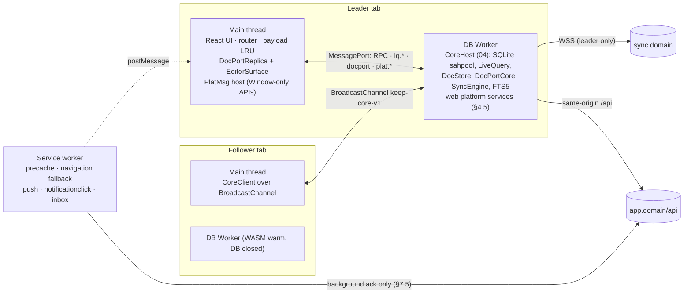
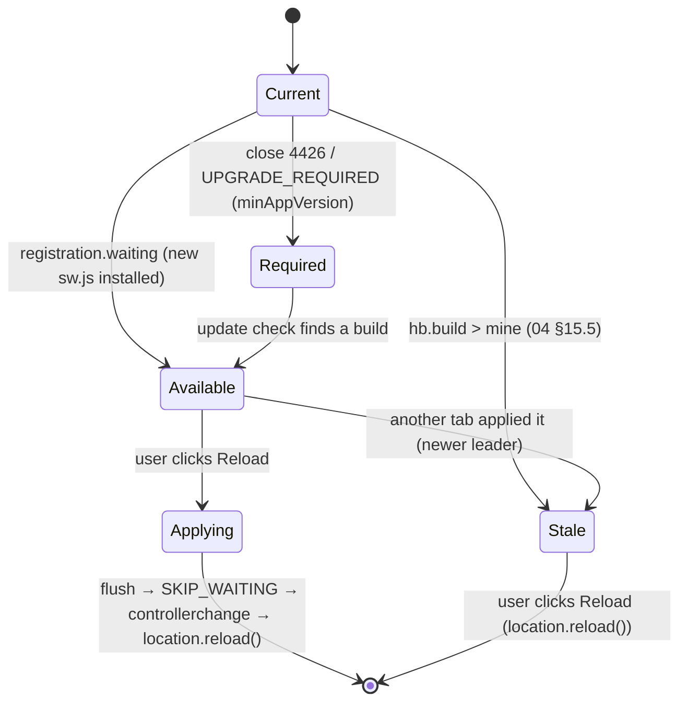
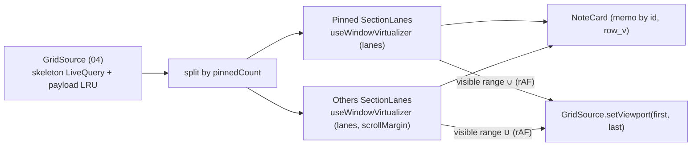
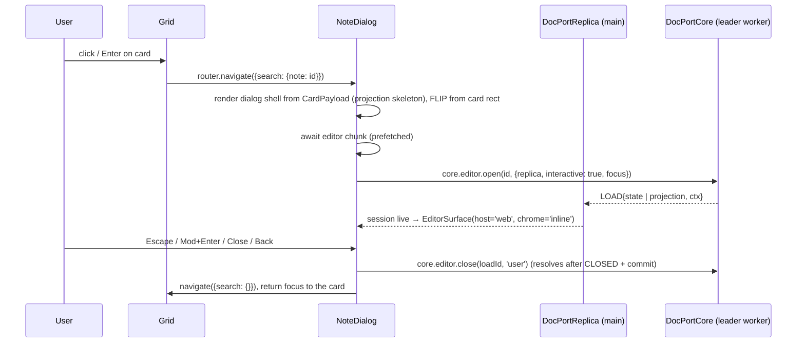

# 06 · Web app: Vite SPA, PWA, masonry grid and web platform

*Detail design · elaborates spine v1.2 (2026-10-04) · Status: draft for review · Owner area: Web*

## 1. Purpose and scope

This document specifies the web client: a Vite single-page app that installs as a PWA, runs the shared core in a DB Worker (D-04), and renders Keep's grid, dialogs and settings in the browser. An engineer should be able to build `apps/web` from it, including the service worker, the web implementations of 04's platform services, the hosting headers and the CI performance gates.

It covers:

- the route tree, URL privacy rules and code splitting (D-03);
- the boot sequence and the **first-paint cache** that paints cards before the DB Worker is ready (D-04);
- the **PWA service worker**: precache, prompt-mode updates, push and notification handlers, the service-worker inbox, hosting headers and asset retention (D-03, D-49, X-08, P-22);
- the **masonry grid**: lane geometry, height estimation and measurement, virtualization, scroll anchoring, drag and drop, keyboard roving focus (D-08, D-09, X-17);
- the **shortcut map**, multi-select and bulk actions;
- the note dialog, the "Take a note…" composer and the pickers that host 05's `EditorSurface`;
- rendering of 02's sync and error UX, tab and database states, `beforeunload`;
- settings pages;
- **CSP and Trusted Types**, response headers and client hardening (X-16, D-50);
- **i18n and RTL** (X-18);
- the **web performance budgets**, which this document owns, and their gates.

### Out of scope

| Topic | Owner |
|---|---|
| `CoreApi`, `CoreClient`, `LiveQuery`, `GridSource`, leader election, tab RPC, DocPort transports, `FirstPageSnapshotV1` shape and producer rules, platform-service interfaces | 04. This document **implements** the web side of 04 §16 and the storage of 04 §5.7 |
| `EditorSurface`, DocPort, TipTap schema and extensions, paste pipeline, editor keymap, undo, editor a11y | 05 |
| Sync frames, `SYNC_UX` table, retry classes, telemetry wire schema | 02 |
| Projector, `PreviewV1`, limits, overlay intents, settings catalogue | 01 |
| `can.*` predicates, member chips, share-dialog privacy rules, `sharing.*` contracts | 08 |
| Sign-in ceremonies, `AuthController`, cookies, JWT minting, account deletion and export flows | 12 |
| Reminder semantics, Web Push payload schema and targeting | 09 |
| Uploads, media URLs and source resolution, web image preprocessing, link unfurl | 10 |
| Search query parsing, ranking and `SearchApi` types | 11 |
| CloudFront distribution and CDK, CI pipeline wiring, dashboards and alerts | 14 |
| Threat model and compliance | 15 |
| Simulator and E2E harness | 16 |

## 2. Spine references

**Reference convention.** `spine §x.y` is a spine section; a bare `§x.y` is a section of this document; `NN §x.y` is a section of sibling doc NN. IDs (D-, INV-, P-, X-, T-, Q-, C-) are spine items.

| ID | How this document implements it |
|---|---|
| **D-03** | Vite 8.3.2 SPA, TanStack Router 1.170, vite-plugin-pwa 2.0.0 in **prompt** mode with an `injectManifest` service worker, static hosting on S3 + CloudFront at `app.<domain>` (§5, §7) |
| **D-07** | Tailwind v4 `@theme` generated from `packages/ui-tokens`; 12 note colors and backgrounds as light/dark tokens; per-device theme (§13, §16) |
| **D-08** | `@tanstack/react-virtual` 3.14 `lanes` + `measureElement`, `@dnd-kit/react` 0.5.0; cards memoized by `(id, row_v)`; drop index computed in data order (§8) |
| **X-16** | CSP with Trusted Types, response headers, link and image rules, dependency hygiene (§14) |
| **X-17** | Roving focus across lanes, `aria-setsize`/`aria-posinset`, non-drag alternatives, status announcements, contrast, font scale, reduced motion, Axe in CI (§8.9, §8.10, §16) |
| **X-18** | Lingui 5, `dir="auto"`, logical properties, NFC input, ICU collation; English at M2, six more locales at M4; pseudo-locale and `ar` harness from day 1 (§15) |
| **P-22** | Fully offline web by default with full hydration (04); install prompt after the third session (§7.8) |
| Also used | D-04 and C-54 (leader, takeover, held-elsewhere state), D-09 (gesture pause, payload LRU), D-19 (flush points), D-23 (projection on open note), D-44 (same-origin `/api`), D-46 (Sentry, client SLIs), D-47 (flags), D-49 and C-57 (`BUILD_NUMBER`, roll-forward rollbacks), D-50 (link and editor content rules), INV-1, INV-9, INV-12, INV-18, X-01, X-08, X-10, X-14, P-01 to P-06 (C-48), P-09, P-15, P-16 (C-74), P-21, P-23 (C-59), P-24 (C-78), P-25 (C-86), P-31 (C-65), C-17, C-19, C-22, C-23, C-41, C-44, C-73, C-82 |

## 3. Interfaces

### 3.1 Owned here

| Interface | Consumers | Section |
|---|---|---|
| Route tree, search-param and fragment schemas, URL privacy rule | 09 (notification deep links), 12 (sign-in return paths), 08 (invite landing path) | §5 |
| `BootRecordV1`, `LayoutCacheV1` (first-paint cache records) | — (web only) | §6 |
| `PlatMsg` main-thread bridge protocol | 04 (web platform services call through it) | §4.4 |
| Web implementations of 04 §16 (`Net`, `PlatformClock`, `Crypto`, `Notifications`, `FileStore`, `Background`, `Lifecycle`, `SecureStore`, `TabBus`, `LockManagerLike`, `Logger`) | 04 | §4.5 |
| `firstPageModule` (`CoreModule` that produces 04's `FirstPageSnapshotV1`) | 04 | §6.2 |
| Service worker: event handlers, `SwHintV1`, `SwInboxEntryV1`, `SwToPageMsg`, `PageToSwMsg` | 09 (push payload handling), 12 (background JWT mint) | §7 |
| Hosting contract: response headers, CSP, Trusted Types policies, cache headers, deploy order, asset retention | 14 (deploys it), 15 (reviews it), 05 (TT policy name) | §7.3, §14 |
| Grid geometry, `estimateCardHeight`, drop and roving algorithms | 07 (parity reference for Q-11) | §8 |
| Shortcut map and dispatcher rules | 05 (suppression contract), 16 (E2E) | §9 |
| **Web performance budgets** and their gates | 14 (dashboards), 16 (gates) | §17 |

### 3.2 Consumed

| From | What (exact names) | Section there |
|---|---|---|
| 04 | `CoreApi`, `CoreClient`, `CoreError`/`CoreErrorCode`, `ReadOnlyReason`, `useLiveQuery`, `LiveQuery<T>`, `LiveResult<T>`, `GridApi.open(filter, sort)`, `GridSource`, `GridSkeleton`, `GridFilter`, `GridSort`, `CardPayload`, `NoteDetail`, `SyncStatus`, `UiApi.gesture/setEditorEnv/get/set`, `DiagnosticsApi.mark`, `EditorHostApi.connect('tab')`, `FirstPageSnapshotV1`, `CoreModule`, `PlatformServices`, `TabMsg` | 04 §4, §5, §15, §16 |
| 05 | `EditorSurface`, `EditorSurfaceProps`, `EditorController`, `ReplicaSession`, `DocPortReplica`, `DocPortCoreHostApi.open/close/flush`, `OpenOptions`, `EditorIntent`, `EditorCommand`, `EditorEnv`, `sanitizeHref`, TT policy `keep-editor-paste`, the `[data-keep-editor]` marker | 05 §4.4, §4.5, §5, §6.3, §6.9 |
| 02 | `SYNC_UX`, `UxCase`, `UxEntry`, `UxSurface`; close codes 4400–4503; `TelemetryBatchV1` | 02 §6.5, §8.3, §19 |
| 01 | `COLOR_TOKENS`, `BACKGROUND_TOKENS`, `PreviewV1` (`PBlock`, `PItem`, `PAtt`, `PLink`), `Facet`, `OverLimit`, `LIMITS`, `validateLabelName`, `labelDisplayName`, `SettingValue` keys | 01 §4.2, §4.4, §8, §15 |
| 08 | `can.*`, `relFromLocal`, `MemberChip`, `SharerChip`, `sharingContract.suggest`, `invites.peek`, `invites.claim` | 08 §4.8, §4.10, §8.5, §9.5 |
| 12 | `AuthController`, `AuthState`, `SignInMethod`, `StepUpPurpose`, `AuthErrorCode`, cookie `__Host-ks.sid`, header `X-KS-Client: web/<version>`, `POST /api/auth/ks/token` with `X-KS-Context: background` | 12 §3.3, §5.2, §8.3, §10.6, §14 |
| 09 | Web Push payload schema, clear semantics, the browser-alert opt-in (P-09) | 09 (sibling; assumptions in §7.5) |
| 10 | Thumbnail and image source resolution, `media.urls`, upload origin, `MediaApi.attachImage` | 10 (sibling; assumptions in §8.6) |
| 11 | `SearchApi.query(q, scope)`, `SearchScope`, `SearchHit` | 11 (sibling) |

## 4. Application architecture

### 4.1 Package layout

```
apps/web/
  index.html                       no inline script or style (CSP, §14)
  vite.config.ts                   Vite 8.3.2, @vitejs/plugin-react, @lingui/vite-plugin, vite-plugin-pwa 2.0.0
  src/
    boot/boot.ts                   first module: boot record, theme, snapshot, worker spawn (§4.3, §6)
    boot/tt.ts                     Trusted Types policies (§14.2)
    main.tsx                       React root, router, providers
    routes/                        TanStack Router tree (§5)
    shell/                         AppShell, TopBar, NavDrawer, SyncChip, Toasts, Banners, LiveRegions
    grid/                          GridPage, SectionLanes, NoteCard, geometry.ts, estimate.ts, roving.ts, dnd.ts
    select/                        selection store, SelectionBar, bulk.ts
    note/                          NoteDialog, Composer, Lightbox, ColorPalette, LabelPicker, ReminderPicker, ShareDialog
    search/                        SearchPage
    settings/                      Settings, Labels, Account, Sync & storage, Shortcuts pages
    public/                        SignIn, AccountDelete, InviteLanding (no DB worker)
    i18n/                          Lingui loader, locale negotiation, RTL helpers (§15)
    platform/                      web implementations of 04 §16 (§4.5) and the main-side PlatMsg host
    worker/db.worker.ts            DB Worker entry: createCore(...) with web platform + firstPageModule
    worker/firstPage.ts            firstPageModule (§6.2)
    sw/sw.ts                       service worker (§7.5), built by injectManifest
    perf/                          web-vitals hooks, long-task observer, telemetry adapter (§17.3)
  public/                          manifest icons, robots.txt, .well-known/* (12, 07)
```

Layering (dependency-cruiser, X-19): `src/grid`, `src/note`, `src/select` and `src/shell` import `@keep/sync-client` only through `CoreClient` and `react/useLiveQuery`; they never import `storage`, `sync-protocol` codecs or `Net`. `src/sw` may import `@keep/sync-protocol` codecs (frame encoder for one `PUSH`) and `zod`, nothing from React. `@keep/editor/dom` is imported only by `src/note` and is in its own lazy chunk.

### 4.2 Threads and processes



- The **main thread** never runs SQL, Yjs merges of other notes or the sync engine (D-04). It holds the React tree, the payload LRU (04 §5.4), the open note's replica (05) and the `PlatMsg` host.
- The **DB Worker** of every tab is spawned at boot; only the leader's worker opens the database (04 §15).
- The **service worker** is never on the data path: it serves precached assets, shows and handles notifications, and records notification actions taken while no tab is open (§7.5).

### 4.3 Boot sequence

```mermaid
sequenceDiagram
  participant SW as Service worker
  participant M as Main thread
  participant W as DB Worker
  participant L as Leader worker (maybe W)
  SW-->>M: index.html + entry chunk from precache
  M->>M: boot.ts: read ks.boot.v1 → set data-theme, lang, dir (no flash)
  M->>W: new Worker(trustedURL) (TT policy keep-script-url)
  M->>M: read ks.fp.v1 + ks.fp.layout.v1 → SnapshotGridSource
  M->>M: React render AppShell + grid from snapshot (LCP; mark first_cards)
  W->>W: instantiateStreaming(sqlite3.wasm) · leader discovery (04 §15.3)
  W-->>M: plat.ready{role}
  M->>L: lq.sub skeleton(notes) via CoreClient
  L-->>M: lq.skel + lq.cards (first viewport)
  M->>M: swap SnapshotGridSource → live GridSource (keyed DOM kept)
  M->>M: mark grid_interactive; idle: prefetch editor chunk, check SW update
```

| Step (warm start, SW active, 5k notes) | Budget p50 | Owner |
|---|---|---|
| Navigation → entry chunk executed | ≤ 120 ms | 06 |
| Boot record + snapshot parse | ≤ 5 ms | 06 |
| First render from snapshot (LCP candidate) | ≤ 60 ms | 06 |
| Worker spawn → WASM ready | ≤ 150 ms (parallel) | 06 / 04 |
| Leader discovery, open sahpool, migrations (none), skeleton query | ≤ 300 ms | 04 |
| Skeleton + first 100 payloads to main | ≤ 1 frame + 15 ms | 04 / 06 |
| **Total to live grid** | **≤ 600 ms** (§17) | 06 |

On public routes (§5.3) the boot never spawns the DB Worker, so a signed-out visitor to `/account/delete` or `/i` loads no WASM.

### 4.4 Main-thread platform bridge (`PlatMsg`, owned)

Several web APIs that 04's platform services need are `[Exposed=Window]` only: `StorageManager.persist()`, `Notification.requestPermission()`, `ServiceWorkerRegistration.showNotification()` and `.pushManager` reached from the page, `document.visibilityState`, `matchMedia`. The worker reaches them through the **leader tab's main thread** over the same `MessagePort` that carries 04's RPC, in a separate `plat.*` namespace. Followers never host platform calls: only the leader's worker runs `CoreHost`.

```ts
// apps/web/src/platform/bridge.ts — owned by 06
export type PlatReq =
  | { t: 'plat.persist'; id: number }                                      // navigator.storage.persist()
  | { t: 'plat.notif.permission'; id: number }
  | { t: 'plat.notif.show'; id: number; n: { tag: string; title: string; body?: string;
        data: Record<string, string>; actions: readonly ('done' | 'snooze')[]; silentIfFocused: boolean } }
  | { t: 'plat.notif.close'; id: number; tags: readonly string[] }
  | { t: 'plat.push.subscription'; id: number; vapidKey: string | null }  // null = read only, never subscribe
  | { t: 'plat.snapshot'; snap: FirstPageSnapshotV1 }                      // 04 §5.7 producer → 06 storage (§6.2)
  | { t: 'plat.boot'; userHash: string | null };                           // bind (hash) or wipe (null) (§6.1)
export type PlatRes =
  | { t: 'plat.res'; id: number; ok: true; value: unknown }
  | { t: 'plat.res'; id: number; ok: false; error: 'UNAVAILABLE' | 'DENIED' | 'TIMEOUT' };
export type PlatEvt =                                                      // main → worker, unsolicited
  | { t: 'plat.visibility'; visible: boolean; at: number }
  | { t: 'plat.pagehide' } | { t: 'plat.freeze' } | { t: 'plat.resume' }
  | { t: 'plat.notif.response'; r: NotificationResponse }                  // 04 §16.4 shape
  | { t: 'plat.push.token'; token: string | null }                         // PushSubscription JSON
  | { t: 'plat.env'; env: EditorEnv };                                     // forwarded to ui.setEditorEnv
```

Rules: every request times out after 5 s with `TIMEOUT`; the main side validates every `plat.*` message with zod in dev and test builds; requests never carry note content except `plat.notif.show.title` (permitted by X-20 for Web Push, hidden when P-28 is on) and `plat.snapshot`.

### 4.5 Web implementations of 04's platform services

| 04 §16 member | Web implementation (runs in the DB Worker unless noted) |
|---|---|
| `Net.fetch` | `fetch` with `credentials: 'same-origin'`; URLs under `/api/` (D-44); `Priority` header from `priority`; streaming via `Response.body` |
| `Net.socket` | `new WebSocket('wss://sync.<domain>/v1')`, `binaryType = 'arraybuffer'` |
| `Net.connectivity` | `navigator.onLine` plus `online`/`offline` on the worker scope; `navigator.connection.type`, `saveData` where present, else `kind: 'unknown'`, `metered: false` |
| `PlatformClock` | `now = Date.now()`; `monotonic = performance.now()`; `timeZone` from `Intl.DateTimeFormat().resolvedOptions()`; `onTimeChange` polls every 60 s for a zone change and flags a wall jump when `Δnow − Δmonotonic` exceeds 2 s; `idle` uses `scheduler.postTask(fn, {priority: 'background'})` where available, else `setTimeout(fn, 50)` with a 15 ms `timeRemaining` |
| `Crypto` | `crypto.getRandomValues`; `crypto.subtle.digest('SHA-256')`; `webcrypto` undefined |
| `Notifications` | `capacity() = 0` and `schedule()` rejects `UNSUPPORTED` (the web arms nothing, D-36); `permission` cached from `plat.notif.permission`; `requestPermission` is never called by the core (it needs a user gesture; the settings UI calls it, §13.2); `present` → `plat.notif.show` (the main side shows an in-app toast when a tab is visible, else `registration.showNotification`, P-09); `cancel` → `plat.notif.close`; `pushToken` → `plat.push.subscription`; `onResponse` ← `plat.notif.response` plus the SW inbox drain (§7.6); `exactAlarms` → `{supported: false, granted: false}` |
| `FileStore` | Async OPFS API in directory `ks-files/` (separate from the sahpool directory `ks-sahpool/`); atomic `write` = sync access handle on `name.tmp-<rand>`, `flush`, `close`, then `move(name)` (OQ-06-3); `storage()` from `navigator.storage.estimate()` and `persisted()`; `requestPersistence` → `plat.persist`; `excludeFromBackup` no-op |
| `Background` | `beginFlush` returns a lease whose deadline is now: a closing page cannot be kept alive, so pagehide sends only frames already queued (data is committed locally, INV-1); `scheduleRefresh`, `scheduleProcessing`, `cancelProcessing` no-op; `power()` `{lowPower: false, charging: null}` |
| `Lifecycle` | `platform 'web'`; `appState` from `plat.visibility`; `onPageHide` from `plat.pagehide` and `plat.freeze`; `onMemoryWarning` never fires; `launchContext()` from the boot URL: `?from=push` → `notification`, `?new=` → `capture_intent`, else `normal` |
| `SecureStore` | `localStorage` key prefix `ks.sec.`, used only for 12's pending sign-out record (04 §16.7) |
| `TabBus`, `LockManagerLike` | `BroadcastChannel('keep-core-v1')` and `navigator.locks` in the worker; `visible()` from the last `plat.visibility` |
| `Logger` | Sentry breadcrumbs and events through the scrubbing rules of §14.4; structured fields only (X-01) |

### 4.6 UI state

Server-derived data reaches React only through `useLiveQuery` and `GridSource` (04 §5). UI-only state lives in three small stores built on `useSyncExternalStore` (no state library):

| Store | Contents | Persistence |
|---|---|---|
| `uiStore` | drawer open, view mode (grid or list), dialog stack, toasts, focused card `{section, id}`, scroll offsets per view | view mode and drawer in `ui_state` via `core.ui.set` and mirrored in `ks.boot.v1`; the rest in memory |
| `selectionStore` | `Set<NoteId>`, anchor id, view key | memory; cleared on view change |
| `dragStore` | active drag `{id, section, fromIndex, previewIndex}` | memory |

## 5. Routes

### 5.1 Route table

| Path | Component | Chunk | Auth | Grid filter (04 §5.4) |
|---|---|---|---|---|
| `/` | `GridPage` | entry | bound DB | `{view: 'notes'}` |
| `/reminders` | `GridPage` | entry | bound DB | `{view: 'reminders'}` |
| `/archive` | `GridPage` | entry | bound DB | `{view: 'archive'}` |
| `/trash` | `GridPage` (owned notes only, C-17) | entry | bound DB | `{view: 'trash'}` |
| `/label/$labelId` | `GridPage` | entry | bound DB | `{view: 'label', labelId}` |
| `/pending` | `PendingInbox` ("Shared with you · pending", P-15) | entry | bound DB | `{view: 'pending'}` |
| `/search` | `SearchPage` (query in the fragment, §5.2) | `search` | bound DB | 11's `SearchApi` |
| `/settings`, `/settings/labels`, `/settings/account`, `/settings/sync`, `/settings/shortcuts` | Settings pages (§13) | `settings` | bound DB | — |
| `/signin` | `SignIn` (12's `AuthController`) | `auth` | public | — |
| `/account/delete` | `AccountDelete` (12, P-25 web deletion URL) | `auth` | public; works signed out | — |
| `/i` | `InviteLanding` (08 §8.5; token in the fragment) | `auth` | public | — |
| `/note/$noteId` | redirect to `/?note=$noteId` | entry | bound DB | — |
| `*` | redirect to `/` | entry | — | — |

The note dialog is not a route of its own: any grid route accepts `?note=<noteId>` and renders the dialog over the grid, so Back closes the dialog and keeps the grid's scroll position.

```ts
// apps/web/src/routes/tree.ts
const NoteSearch = z.object({
  note: zNoteId.optional(),                        // open note dialog
  new: z.enum(['text', 'list']).optional(),        // manifest shortcut, `c`/`l` deep link (P-23)
  from: z.enum(['push', 'pwa', 'share']).optional(),
}).catch({});                                       // invalid params are dropped, never thrown

const root = createRootRouteWithContext<{ core: CoreClient | null; auth: AuthController }>()({ component: Root });
const app = createRoute({ getParentRoute: () => root, id: 'app', beforeLoad: requireBoundDb, component: AppShell });
const notes = createRoute({ getParentRoute: () => app, path: '/', validateSearch: NoteSearch,
  component: () => <GridPage filter={{ view: 'notes' }} /> });
// … reminders, archive, trash, label/$labelId, pending, search, settings/* as in the table
const pub = createRoute({ getParentRoute: () => root, id: 'public', component: PublicShell });  // no DB worker
export const routeTree = root.addChildren([app.addChildren([notes /* … */]), pub.addChildren([/* signin, account/delete, i */])]);
export const router = createRouter({ routeTree, defaultPreload: 'intent', scrollRestoration: false });
```

### 5.2 URL privacy rule

URLs reach CloudFront access logs on reload, browser history, extensions and Sentry breadcrumbs. Therefore:

| Value | Where it travels | Why |
|---|---|---|
| Note ID, label ID | Path or query | IDs only (X-01 allows IDs in logs) |
| Search query | Fragment `#q=<encoded>` | User text never reaches the server or logs; read on load, written with `history.replaceState` |
| Invite token | Fragment `#ki1.…` (08 §8.5), removed with `history.replaceState` right after it is read, kept in `sessionStorage` key `ks.invite.pending` for ≤ 30 min across an OAuth redirect | Single-use secret |
| Share-target text (M4) | POST body handled by the service worker (§7.5) | User text |
| Sign-in return path | `sessionStorage` key `ks.auth.return`, never a query parameter | Avoids open-redirect parameters |

Sentry receives URLs with query and fragment removed (§14.4). Spine issue S-06-6 proposes adding this rule to X-01.

### 5.3 Guards by auth state

`requireBoundDb` reads 12's `AuthController.state()` and 04's binding:

| `AuthState.kind` (12 §10.6) | App routes | Public routes |
|---|---|---|
| `signed_out` | redirect to `/signin` (return path stored) | render |
| `signing_in` | splash | render |
| `active` | render | `/signin` → redirect to `/`; `/i` and `/account/delete` render |
| `expired` | **render**, chip "Sign in to sync" (X-14, D-41); never redirect | render |
| `reauthenticating` | render | render |
| `switch_pending` | render behind 12's account-switch dialog (export first, INV-12) | render |
| `signing_out`, `wiping` | splash "Signing out…" | render |

A signed-in user whose account is pending deletion sees, at sign-in, "This account is scheduled for deletion on ‹date›" with **Cancel deletion**; signing in alone never cancels (P-25, C-86; 12 owns the flow, 06 renders it).

### 5.4 Code splitting and prefetch

| Chunk | Contents | Loaded |
|---|---|---|
| `entry` | React, router, shell, grid, card renderer, snapshot reader, `CoreClient`, Lingui runtime, en catalog | precached; first |
| `db.worker` | `sync-client`, `storage`, `note-model`, `sync-protocol`, Yjs, sqlite-wasm JS | precached; at boot |
| `sqlite3.wasm` | SQLite WASM | precached; at boot |
| `editor` | `@keep/editor/dom` (TipTap, y-tiptap, ProseMirror), `DocPortReplica`, Yjs (main copy) | precached; prefetched on first idle after `grid_interactive`; awaited on first note open |
| `search`, `settings`, `auth` | route components | precached; on navigation or `intent` preload |
| `locale-<xx>` | compiled Lingui catalog per locale | en precached; others runtime-cached (§7.2) |

A failed dynamic import (`vite:preloadError`, typically an old tab after a deploy) shows "Reload to update" instead of an error page (§7.4).

## 6. First-paint cache (D-04)

### 6.1 Records

All three records live in `localStorage`, the only storage the main thread can read synchronously at boot. They are caches: losing them costs only first-paint speed.

```ts
// apps/web/src/boot/records.ts — owned by 06
/** ks.boot.v1: written on bind, on every per-device preference change, deleted on wipe. ≤ 1 KiB. */
export interface BootRecordV1 {
  v: 1;
  userHash: string | null;                 // 04's hex(sha256(userId))[0..16] of the bound user; null = unbound
  theme: 'system' | 'light' | 'dark';
  locale: string;                          // BCP 47 actually used (§15.2)
  dir: 'ltr' | 'rtl';
  gridMode: 'grid' | 'list';
  shortcuts: boolean;                      // single-character shortcuts enabled (§9.2)
}
/** ks.fp.v1: 04's FirstPageSnapshotV1, stored as produced (04 §5.7). ≤ 256 KiB. */
/** ks.fp.layout.v1: measured card heights for the snapshot's cards, so first paint has the last layout. ≤ 8 KiB. */
export interface LayoutCacheV1 {
  v: 1;
  containerWidth: number; lanes: number; cardWidth: number; fontScale: number;
  h: Record<string /* NoteId */, [rowV: number, heightPx: number]>;   // ≤ 50 entries, snapshot ids only
}
```

### 6.2 Write path

1. `firstPageModule` (a web `CoreModule` in the leader's worker) builds `FirstPageSnapshotV1` from `grid.open({view: 'notes'})`: the first 50 skeleton ids, their versions, `pinnedCount` clipped to 50, and their `CardPayload`s. It runs on `onCommitted` debounced to 2 s (04 §5.7) and posts `plat.snapshot` to the leader tab's main thread.
2. The main thread keeps the latest snapshot in memory and writes `ks.fp.v1` in an idle callback (≤ 1 s later). It always writes synchronously on `pagehide` and on `visibilitychange → hidden`, because a dedicated worker cannot finish work during `pagehide` (cross-doc issue 8).
3. The grid writes `ks.fp.layout.v1` from its measured heights at the same moments, for ids in the snapshot only.
4. A write that throws (quota, private mode) deletes `ks.fp.v1` and counts `snapshot{result: 'write_failed'}`.
5. `onWipe` (sign-out, account switch, account deleted; 04 §4.4) posts `plat.boot{userHash: null}`; the main thread deletes all three keys before the wipe resolves.

### 6.3 Read path and swap to live

```ts
// apps/web/src/boot/boot.ts (runs before React; no network, no worker)
const boot = readJson<BootRecordV1>('ks.boot.v1');
applyThemeAndLocale(boot);                                   // data-theme, color-scheme, lang, dir: no flash
const snap = readJson<FirstPageSnapshotV1>('ks.fp.v1');
const usable = boot?.userHash != null && snap?.v === 1 && snap.userHash === boot.userHash
            && snap.view === 'notes' && isPublicRoute(location.pathname) === false;
export const initialGrid: GridSourceLike | null = usable ? new SnapshotGridSource(snap!, readLayout()) : null;
```

- `SnapshotGridSource` implements the read side of 04's `GridSource` (`skeleton`, `card(id)`, `subscribeCards`, no-op `setViewport`) over the snapshot. A `snap.build` different from this build is still used: renderers tolerate unknown `preview.v` by showing the title and "Open to view" (01 §15.7).
- When the live `GridSource` delivers its first skeleton, the grid swaps sources in one render. Keys are note IDs, so React keeps DOM nodes; measured heights carry over by `(id, row_v)`. A card renders `live.card(id)` and falls back to the snapshot payload while `snapshotRowV === skeletonVersion` and the live payload is still loading, so a card never blanks (04 §5.4).
- Actions taken on snapshot cards before the core is ready (pin, open) await `CoreClient` readiness and show a pending state; they report success only after the commit (INV-1). After 10 s they fail with `DB_UNAVAILABLE` (04 §15.6).

### 6.4 Privacy

The snapshot holds titles and previews of up to 50 notes outside the database. It is shown only when `userHash` matches the bound user, deleted on every wipe, never contains pending-share cards (they are not in the Notes view) and never leaves the device. It is in the same trust boundary as the OPFS database (same origin, same eviction).

## 7. PWA and service worker (D-03, X-08, P-22)

### 7.1 Build configuration

```ts
// apps/web/vite.config.ts (excerpt)
export default defineConfig({
  define: { __BUILD_NUMBER__: JSON.stringify(Number(process.env.BUILD_NUMBER)) },   // CI-assigned, monotonic (C-57)
  build: { target: 'es2023', sourcemap: 'hidden', assetsDir: 'assets', modulePreload: { polyfill: false } },
  worker: { format: 'es' },
  plugins: [
    react({ babel: { plugins: ['@lingui/babel-plugin-lingui-macro'] } }),
    lingui(),
    VitePWA({
      strategies: 'injectManifest', srcDir: 'src/sw', filename: 'sw.ts',
      registerType: 'prompt', injectRegister: false,          // own registration (§7.4): no inline script, TT-safe
      manifest: false,                                        // static public/manifest.webmanifest (§7.7)
      injectManifest: {
        globPatterns: ['index.html', 'assets/*.{js,css,wasm,woff2}', 'icons/*.png'],
        globIgnores: ['assets/locale-!(en)*.js', 'assets/font-!(latin)*.woff2'],
        maximumFileSizeToCacheInBytes: 2 * 1024 * 1024,       // sqlite3.wasm fits
      },
    }),
  ],
});
```

`BUILD_NUMBER` is assigned by CI from a monotonic counter; a rollback ships the old code under a new, higher number (D-49, C-57). It is also the `HELLO.build` value; `HELLO.appVersion` is the web semver from `apps/web/package.json`.

### 7.2 Precache and runtime rules

| Request | Handling in the SW |
|---|---|
| Navigation (any path except `/api/*`, `/.well-known/*`) | `NavigationRoute` → precached `index.html` (offline-first SPA, P-22) |
| Precached assets (entry, worker, wasm, editor, route chunks, en catalog, latin fonts, icons) | `precacheAndRoute`, cache-first; `cleanupOutdatedCaches()` on activate |
| `assets/locale-*.js`, `assets/font-*.woff2` not precached | Runtime `CacheFirst`, cache `ks-runtime-v1`, ≤ 30 entries, 90 days |
| `/api/*`, `wss://sync.*`, `media.<domain>`, S3 upload origin | **Not intercepted** (no `respondWith`). The SW never caches API, sync or media responses; media bytes are cached by 10 in OPFS (spine §4.4 `blob_cache`) |
| Anything else | Not intercepted |

Precache budget: ≤ 3.5 MB raw (§17.2).

### 7.3 Hosting, headers and deploy order

| Object | `Cache-Control` | Notes |
|---|---|---|
| `/index.html` (and every SPA path via the CloudFront default behavior) | `no-cache` | ETag revalidation |
| `/sw.js` | `no-cache, max-age=0` | Browsers byte-compare it on every update check |
| `/assets/*` (content-hashed) | `public, max-age=31536000, immutable` | **Retained ≥ 90 days and across the last 10 builds after being superseded**, so old tabs and SW-controlled older pages can still load lazy chunks (spine issue S-06-2) |
| `/manifest.webmanifest`, `/icons/*` | `public, max-age=3600` | |
| `/.well-known/*` | `public, max-age=3600` | `apple-app-site-association`, `assetlinks.json` (12, 07) |
| `*.wasm` | as `/assets/*` | `Content-Type: application/wasm` (required by `instantiateStreaming`) |

Every response from the `app.` static behaviors carries the §14.1 header set through one CloudFront response-headers policy; `/api/*` responses carry the API's own headers (12 §3.3).

**Deploy order** (14 implements): (1) upload new `/assets/*`; (2) upload `index.html`; (3) upload `sw.js`; (4) invalidate `/index.html`, `/sw.js`, `/manifest.webmanifest`. A client therefore never fetches an `index.html` or `sw.js` that references an asset not yet uploaded.

### 7.4 Update lifecycle (prompt mode, X-08)

Two independent signals lead to the same "Reload to update" prompt:

1. **A waiting service worker**: a newer build was downloaded.
2. **A newer leader** (04 §15.5): another tab already runs a newer build, so this tab is **Stale**.



| State | UI | Behavior |
|---|---|---|
| `Available` | Snackbar (no timeout) "A new version is available · Reload" | Editing continues. Reload: `core.sync.flushNow('manual')`, `EditorController.flush()` (≤ 1 s), post `{t: 'SKIP_WAITING'}` to the waiting SW, reload on `controllerchange` |
| `Stale` | Blocking banner "Keep was updated in another tab · Reload to update"; every mutation control disabled; the open editor is read-only (04 §15.5 `prepareUpgrade`) | No RPCs are sent (X-08). Unacked replica batches were flushed through the old leader or salvaged (04 §15.5); `beforeunload` warns while any remain (§12.3) |
| `Required` | Banner "Update to keep syncing. Your notes stay on this device." (02 `update_required`) | Local editing continues (INV-1); triggers an immediate update check |

- **Update checks**: `registration.update()` 30 s after `grid_interactive`, every 60 min while visible, on `visibilitychange → visible` after ≥ 10 min hidden, and on entering `Required`.
- **Never auto-reload.** A tab reloads only on a click, so no typing is cut off.
- **Other tabs** after one tab applies the update: they become Stale through the leader protocol (the reloaded tab becomes leader on a higher build) and show the banner. A Stale tab that is still controlled by the new SW can fetch its own old lazy chunks from the CDN (asset retention, §7.3).
- **Rollback** is a roll-forward under a higher `BUILD_NUMBER` (C-57), so the states above never loop.

Registration is our own module (`src/boot/sw-client.ts`, about 80 lines), not `workbox-window`: it passes a TT-approved URL (§14.2) to `navigator.serviceWorker.register(url, {scope: '/', type: 'module'})`, listens for `updatefound`, `statechange` and `controllerchange`, and exposes `swState` to the shell.

### 7.5 Service-worker event handlers

```ts
// apps/web/src/sw/sw.ts (sketch)
precacheAndRoute(self.__WB_MANIFEST);
cleanupOutdatedCaches();
registerRoute(new NavigationRoute(createHandlerBoundToURL('/index.html'),
  { denylist: [/^\/api\//, /^\/\.well-known\//] }));

self.addEventListener('message', (e) => {                       // PageToSwMsg, zod-validated, same origin only
  const m = PageToSwMsg.safeParse(e.data); if (!m.success) return;
  if (m.data.t === 'SKIP_WAITING') void self.skipWaiting();
});

self.addEventListener('push', (e) => e.waitUntil(onPush(e.data)));
async function onPush(data: PushMessageData | null) {
  const p = WebPushPayload.safeParse(data?.json());            // schema owned by 09
  if (!p.success) return showGeneric();                         // never fail silently under userVisibleOnly
  if (p.data.kind === 'reminder') {
    const focused = (await self.clients.matchAll({ type: 'window' })).some((c) => c.focused);
    if (focused) return postToClients({ t: 'reminder.inapp', occ: p.data.occ, noteId: p.data.noteId });  // P-09 toast
    return self.registration.showNotification(p.data.title ?? t('reminder.generic'), {   // P-28: title absent ⇒ generic
      tag: p.data.occ, data: { noteId: p.data.noteId, occ: p.data.occ }, renotify: false,
      actions: [{ action: 'done', title: t('reminder.done') }, { action: 'snooze', title: t('reminder.snooze') }],
    });
  }
  if (p.data.kind === 'reminder_clear') {
    for (const n of await self.registration.getNotifications({ tag: p.data.occ })) n.close();
  }
}

self.addEventListener('notificationclick', (e) => e.waitUntil(onClick(e.notification, e.action)));
async function onClick(n: Notification, action: string) {
  n.close();
  const { noteId, occ } = n.data as { noteId: string; occ: string };
  const clients = await self.clients.matchAll({ type: 'window', includeUncontrolled: true });
  if (action === 'done' || action === 'snooze') {
    const entry: SwInboxEntryV1 = { v: 1, id: crypto.randomUUID(), kind: 'reminder.ack', noteId, occ,
      action, at: Date.now() };
    await inboxPut(entry);                                      // durable first (spine issue S-06-4)
    if (clients.length > 0) return postToClients({ t: 'inbox.drain' });   // a tab's core applies it (INV-1)
    return backgroundAck(entry);                                 // best effort; the inbox is the record
  }
  const url = `/?note=${encodeURIComponent(noteId)}&from=push`;
  const c = clients[0];
  if (c) { await c.focus(); return c.postMessage({ t: 'navigate', url }); }
  await self.clients.openWindow(url);
}
```

- **Background ack** (no tab open): read `SwHintV1` from IndexedDB `ks-auth-hint`; `POST /api/auth/ks/token` with `X-KS-Context: background` and `X-KS-Device: hint.deviceId` (12 §8.3); build one `HTTP_HDR` + `PUSH{lane: home shard, ops: [reminder.ack{noteId, occ, action}]}` frame stream with the `sync-protocol` encoder and `POST /api/v1/sync/push`. On a 2xx with an `ok` or `stale` result the entry is marked `sent`; it is still drained by the next leader, which is harmless because `reminder.ack` is idempotent by `(occ, action)` (spine §5.3). Any auth failure leaves the entry for the next leader and posts nothing (X-14).
- **`pushsubscriptionchange`**: resubscribe with the stored VAPID key, store the new subscription JSON in `ks-auth-hint.pendingPushToken`; the next leader sends `device.update{pushToken}` and clears it.
- **Share target (M4, flag `web.shareTarget`)**: `POST /share-target` (manifest `share_target`, multipart) is answered by the SW: text, URL and up to 10 images go into the inbox as one `share` entry, then a `303` to `/?new=text&from=share`; the leader drains it into a new note through `core.intents.ingest` with 07's `IntentV1` shape. Shared text therefore never reaches CloudFront (§5.2).
- **Web Push constraints**: browsers require every push to show a notification (`userVisibleOnly`). Silent sync pushes (D-22) are therefore never sent to browsers, and a `reminder_clear` that finds no notification may make the browser show its own generic notice (spine issue S-06-3; 09 decides targeting).

### 7.6 Service-worker records (owned)

```ts
// apps/web/src/sw/records.ts — IndexedDB database 'ks-sw', version 1
/** Store 'auth-hint', key 'current'. Non-secret. Written by the leader on bind and on every WELCOME;
 *  deleted on wipe. Extends 12 §8.3's {deviceId, boundUserId} (cross-doc issue 13). */
export interface SwHintV1 {
  v: 1; deviceId: string; boundUserId: string; homeShard: number;
  hlcNode: string;                 // the core's HLC node (01 §6.2), so SW ops carry a valid HLC
  build: number;                   // BUILD_NUMBER of the leader that wrote it
  vapidKey: string | null;
  pendingPushToken?: string;       // from pushsubscriptionchange, consumed by the leader
}
/** Store 'inbox', keyPath 'id'. Drained by the leader on start, on 'inbox.drain', and every 60 s while leader. */
export type SwInboxEntryV1 =
  | { v: 1; id: string; kind: 'reminder.ack'; noteId: string; occ: string; action: 'done' | 'snooze';
      at: number; sent?: true }
  | { v: 1; id: string; kind: 'share'; title?: string; text?: string; url?: string;
      files: { name: string; type: string; blobKey: string }[]; at: number };
export type SwToPageMsg =
  | { t: 'navigate'; url: string } | { t: 'inbox.drain' }
  | { t: 'reminder.inapp'; noteId: string; occ: string };
export type PageToSwMsg = { t: 'SKIP_WAITING' } | { t: 'hint.updated' };
```

Drain rule: the leader applies each entry through `CoreApi` (`reminders.ack(noteId, occ, action)` with the default snooze duration of 09; `intents.ingest` for `share`) and deletes the entry only after that call resolves (committed, INV-1). Entries older than 7 days are dropped with a count.

### 7.7 Web app manifest

```json
{
  "id": "/", "name": "<AppName>", "short_name": "<AppName>",
  "start_url": "/?from=pwa", "scope": "/", "display": "standalone",
  "background_color": "#ffffff", "theme_color": "#ffffff",
  "icons": [{ "src": "/icons/192.png", "sizes": "192x192", "type": "image/png", "purpose": "any maskable" },
            { "src": "/icons/512.png", "sizes": "512x512", "type": "image/png", "purpose": "any maskable" }],
  "shortcuts": [{ "name": "New note", "url": "/?new=text&from=pwa" }, { "name": "New list", "url": "/?new=list&from=pwa" }],
  "launch_handler": { "client_mode": "focus-existing" }
}
```

Product name and icons are brand assets from `ui-tokens`; they never use another company's marks. `share_target` is added in M4 behind `web.shareTarget`. Dark `theme_color` is set at runtime through `<meta name="theme-color" media="(prefers-color-scheme: dark)">`.

### 7.8 Install prompt and storage persistence (P-22, D-04, R-04)

- **Session count**: a "session" is a calendar day with ≥ 30 s of foreground time while signed in; stored in `ui_state` key `web.sessions` as the last 5 dates.
- **Prompt**: from the **third** session (P-22). Chromium: stash `beforeinstallprompt` and show a snackbar "Install <AppName> for faster, offline access · Install / Not now". Safari (macOS "Add to Dock", iOS "Add to Home Screen"): an instructions sheet, because installation is what makes WebKit keep storage and enables Web Push. Firefox: no prompt. "Not now" snoozes 30 days; at most 3 prompts per device.
- **Persistence**: `requestPersistence()` after sign-in (D-04) and again on `appinstalled`. If `persisted()` is still false after 7 days and the app is not installed, a dismissible banner explains that the browser may clear offline notes and offers installation.
- **Eviction detected** (04 F-14: bound session but no `sync_meta`): a notice "This browser cleared your offline notes. They're being downloaded again." while re-bootstrap runs.

## 8. Grid (D-08, D-09)

### 8.1 Data flow



- `GridPage` opens `core.grid.open(filter, 'custom')` once per route and disposes it on leave. Views ordered by `sort_key` (Notes, label, Archive) show Pinned and Others sections when `pinnedCount > 0`; other views have one section.
- The two sections are two window virtualizers. Others uses `scrollMargin` = its container's document offset, updated by a `ResizeObserver` on the Pinned section.
- `setViewport(first, last)` receives the union of both sections' rendered ranges as indexes into `skeleton.ids`, at most once per animation frame. 04 uses it for the payload LRU window and the hydration priority (04 §13.3).
- Cards subscribe to their payload through `subscribeCards` with a per-id selector, so a payload arrival re-renders one card.

### 8.2 Lane geometry

```ts
// apps/web/src/grid/geometry.ts
export const CARD_W = 240, GAP = 16, GAP_NARROW = 8, MAX_LANES = 8, NARROW = 600, LIST_MAX_W = 600, PAD = 16;
export interface Geometry { lanes: number; cardW: number; gap: number; offsetInline: number }
export function geometry(containerW: number, mode: 'grid' | 'list'): Geometry {
  const avail = Math.max(0, containerW - 2 * PAD);
  if (mode === 'list' || avail < 2 * 140 + GAP_NARROW) {                 // reflow at 320 CSS px (WCAG 1.4.10)
    const cardW = Math.min(LIST_MAX_W, avail);
    return { lanes: 1, cardW, gap: GAP, offsetInline: PAD + (avail - cardW) / 2 };
  }
  if (avail < NARROW) {                                                   // phones: two fluid lanes
    const cardW = (avail - GAP_NARROW) / 2;
    return { lanes: 2, cardW, gap: GAP_NARROW, offsetInline: PAD };
  }
  const lanes = Math.min(MAX_LANES, Math.floor((avail + GAP) / (CARD_W + GAP)));
  const gridW = lanes * CARD_W + (lanes - 1) * GAP;
  return { lanes, cardW: CARD_W, gap: GAP, offsetInline: PAD + (avail - gridW) / 2 };   // centered, as Keep
}
export const laneInlineStart = (g: Geometry, lane: number) => g.offsetInline + lane * (g.cardW + g.gap);
```

Cards are positioned with `inset-inline-start: laneInlineStart(...)` and `transform: translateY(start)`. Using the logical inset puts lane 0 at the inline start, so RTL mirrors the grid with no extra code (§15.3). Lane assignment is TanStack's shortest-lane placement in data order, which matches FlashList's default arrangement on RN (D-08, Q-11).

### 8.3 Height estimation and measurement

Estimates matter for scroll-bar stability, `aria-setsize` correctness and CLS. Each card's height is taken, in order, from: (1) the in-memory measurement for `(id, row_v, cardW, fontScale)`; (2) an older measurement for the same id and width (re-measured on mount); (3) `ks.fp.layout.v1`; (4) `estimateCardHeight`.

```ts
// apps/web/src/grid/estimate.ts — deterministic, ≤ 20 µs per card
export interface EstimateEnv { cardW: number; fontScale: number }           // fontScale = root font px / 16 (X-17)
const PADDING = 16, TOOLBAR = 34, LINE = 20, TITLE_LINE = 22, ITEM = 24, LINK = 64, CHIP_ROW = 30, MAX_TITLE_LINES = 4;
const units = (s: string) => { let u = 0; for (const ch of s) u += /[ᄀ-ᅟ⺀-꓏가-힣豈-﫿＀-｠]/u.test(ch) ? 1.9 : 1; return u; };
const lines = (s: string, px: number, w: number) =>
  s.split('\n').reduce((n, l) => n + Math.max(1, Math.ceil(units(l) * px * 0.52 / w)), 0);

export function estimateCardHeight(c: CardPayload, e: EstimateEnv): number {
  const w = e.cardW - 2 * PADDING, f = e.fontScale;
  let h = PADDING + TOOLBAR;                                               // toolbar space reserved: hover causes no shift
  const a = c.preview.a ?? [];
  if (a.length) h += mosaicHeight(a, e.cardW);                             // §8.6 rows [1], [2], [1,2], [2,2]
  if (c.title) h += Math.min(MAX_TITLE_LINES, lines(c.title, 16 * f, w)) * TITLE_LINE * f + 8;
  for (const [type, text] of c.preview.b ?? []) h += lines(text, (type === 'h1' ? 20 : type === 'h2' ? 17 : 14) * f, w) * LINE * f * (type === 'h1' ? 1.3 : 1);
  for (const [text] of c.preview.i ?? []) h += Math.max(ITEM * f, lines(text, 14 * f, w - 28) * LINE * f);
  if (c.preview.n?.c) h += ITEM * f;                                       // "+ N checked items"
  h += (c.preview.l?.length ?? 0) * LINK;
  const chips = c.labels.length + (c.reminder ? 1 : 0) + (c.members.length > 1 ? 1 : 0);
  if (chips) h += Math.ceil(chips / Math.max(1, Math.floor(w / 96))) * CHIP_ROW * f;
  if (c.pendingAccept) h += 40;                                            // Accept / Decline row
  return Math.round(Math.min(h, 1200 * f));
}
```

- **Measurement**: `measureElement` with `data-index`; a `ResizeObserver` re-measures on content change. Heights are cached in an LRU of 20,000 entries.
- **Width or font-scale change** (resize, zoom, Dynamic Type equivalent): geometry recomputes, cached heights for the old width are used as estimates, and visible cards are re-measured in one frame.
- **Images** have exact height before load: `PAtt` carries `w` and `h`, and the thumbhash placeholder fills the box (05 §5.4 rule), so image loads cause no shift.

### 8.4 Virtualizer configuration

```ts
const v = useWindowVirtualizer({
  count: ids.length,
  getItemKey: (i) => ids[i],
  estimateSize: (i) => heightOf(ids[i]),
  lanes: geo.lanes, gap: geo.gap,
  overscan: 12,
  scrollMargin,
  measureElement: (el) => el.getBoundingClientRect().height,
  rangeExtractor: (r) => withPinned(defaultRangeExtractor(r), [focusedIndex, dragSourceIndex]),  // keep focus and drag source mounted
});
v.shouldAdjustScrollPositionOnItemSizeChange = () => false;    // per-lane deltas would shift other lanes; §8.5 anchors instead
```

Cards use CSS `contain: layout paint style`. The grid container sets `overflow-anchor: none`, so browser scroll anchoring cannot fight §8.5.

### 8.5 Scroll anchoring and live updates

Remote changes (feed pages, projections, another tab's edits) can resize or reorder cards above the viewport. Before any layout change is committed, in a layout effect:

1. Pick the **anchor**: the focused card if it is in the viewport, else the first card whose top is at or below the viewport top.
2. Record its document top.
3. Apply the new skeleton or measurements.
4. If the anchor still exists, `window.scrollBy(0, newTop − oldTop)` when the difference is ≥ 1 px, before paint.

Remote changes never animate (research: do not animate on every remote change). The user's own actions on a card (archive, trash, pin, move) animate that card only: a 150 ms fade or a 200 ms position transition, disabled under reduced motion. While a drag or a scroll gesture is active, skeleton deliveries are buffered on the main thread and applied on gesture end (§8.7).

### 8.6 Card

| Part | Source | Rule |
|---|---|---|
| Background | `color`, `background` tokens (D-07) | Token classes `bg-note-<color>`; default color has a border. In forced-colors mode the system colors apply and the color name stays available in the palette |
| Images | `attachments` (≤ 4 thumbs) | Mosaic rows: 1 → full width at its aspect, clamped to [0.3, 1.5] × width; 2 → one justified row; 3 → 1 + 2; 4 → 2 + 2. `` with `loading="lazy"` outside the first viewport and `fetchpriority="high"` for the first card's image. Sources come from 10's resolver (§3.2): an OPFS `blob:` URL when cached, else a signed CDN URL; a thumbhash placeholder until loaded |
| Title | `title` | `role="heading" aria-level="3"`, `dir="auto"`, clamped to 4 lines |
| Body preview | `preview.b` | One `<p dir="auto">` per `PBlock`; marks B/I/U/S as `<strong>`/`<em>`/`<u>`/`<s>`; no links are rendered from preview text |
| Items | `preview.i`, `preview.n` | Static checkbox glyphs (`aria-hidden`) plus text with `aria-label` "Checked"/"Unchecked" prefix; "+ N checked items" per the viewer's `list.checkedToBottom` (01 §15.4). Card checkboxes are display-only in v1 (Q-01) |
| Link previews | `preview.l` | Card with title and site; the image is an attachment ID resolved like images (no third-party hotlinking). Opening re-runs `sanitizeHref` (05 §4.4) and uses `window.open(href, '_blank', 'noopener,noreferrer')` |
| Chips | `labels`, `reminder`, `members` | Label chips (`dir="auto"`), reminder chip (09's formatter), collaborator avatars (08 `MemberChip`, pending ones show the masked hint) |
| Badges | `createError`, `badges.review`, `badges.draft`, `restoreLost`, `waitingOwner`, `overLimit` | `card_badge` surface from 02 §8.3: "Not synced · Retry" (`notes.retryCreate`), "Merged" (opens review), "Make a copy", "Waiting for owner", "Over the limit" |
| Pending card (P-15) | `pendingAccept`, `sharer` | "Shared by ‹name› (‹hint›)", title and preview as **plain text with no link detection** (08 §4.9); actions Accept, Decline, Block, Report (`sharing.respond`, 08's `sharing.report`) |
| Hover/focus toolbar | — | Pin (top inline-end), select check (top inline-start), and a bottom row: Remind me, Collaborator, Background options, Add image, Archive, More. Present in the DOM for keyboard use; visible on hover, focus-within or selection mode. The reserved toolbar space avoids hover layout shift |
| More menu | 08 `can.*` on the local row | Delete (per `can.deleteAction`: Trash, Remove from my notes, Decline), Add label, Make a copy (`can.copy`), Show/Hide checkboxes, **Move up**, **Move down** (X-17 non-drag alternative), Version history (M4) |

`NoteCard` is `memo`ized with an equality on `(id, rowV, selected, focused, selectionMode, geometry key)` (D-08). Cards in Trash show Restore and Delete forever; cards in Archive show Unarchive.

"Show/Hide checkboxes" from the card menu opens the note dialog with `OpenOptions.convert = {to}` (05 §6.9), so the conversion runs as the session's first undoable step.

### 8.7 Gesture pause (D-09)

| Gesture | Start | End | Effect |
|---|---|---|---|
| Drag | dnd-kit drag start | drop or cancel | `core.ui.gesture(true/false)`; skeleton deliveries buffered on main; reflow throttled (§8.8) |
| Scroll | first `scroll` event after ≥ 150 ms idle | `scrollend`, or 150 ms without `scroll` where `scrollend` is unsupported (OQ-06-2) | `core.ui.gesture(true/false)`; skeleton deliveries that reorder or resize buffered; payload arrivals still render |

04's safety valve (10 s or 2 MiB, 04 §5.5) bounds a pathological gesture; on the main thread a buffered skeleton older than 2 s is applied anyway with §8.5 anchoring.

### 8.8 Drag and drop

`@dnd-kit/react` 0.5.0 supplies the pointer sensor, drag overlay, auto-scroll and drag lifecycle; the **drop index is computed from our own lane geometry**, which covers unmounted cards too. dnd-kit's sortable index bookkeeping is not used.

| Setting | Value |
|---|---|
| Activation | Mouse: 6 px distance. Touch: 250 ms press with 5 px tolerance |
| Keyboard sensor | Off (keyboard moves use `Shift+J/K` and Move up/down, X-17) |
| Feedback | `DragOverlay` clone in a portal following the pointer; the source slot shows a placeholder of the card's height |
| Auto-scroll | Within 64 px of the viewport edge, up to 1,200 px/s |
| Allowed views | Those ordered by `sort_key`: Notes, label, Archive. Not Trash, Reminders, Pending, Search, or any `created`/`edited` sort |
| Section rule | A note moves only within its section; a drop past the section edge clamps to that edge (01 §7.4). Pinning is a separate action |

```ts
// apps/web/src/grid/dnd.ts — pointer → candidate index in DATA order
export function candidateIndex(section: SectionModel, px: number, py: number): number {
  const lane = section.laneAt(px);                                  // from geometry; clamped to [0, lanes − 1]
  const inLane = section.itemsInLane(lane);                         // from virtualizer.measurementsCache, all items
  for (const it of inLane) {
    if (py < it.start + it.size / 2) return it.index;              // insert before this item
  }
  const last = inLane[inLane.length - 1];
  return last ? last.index + 1 : section.count;                    // after the last item of that lane
}
```

- The preview order (ids with the dragged id moved to the candidate) re-runs lane placement at most every **100 ms**, and only when the pointer has moved ≥ 24 px since the last change (hysteresis), so the layout cannot oscillate under a still pointer.
- **Drop**: `core.notes.move(id, {before: previewIds[k − 1] ?? null, after: previewIds[k + 1] ?? null})`, where `k` is the dragged id's index in the preview order of its section. Only the moved note is written (spine §4.6). The UI shows the new position immediately from the preview order and keeps it until the skeleton reflects the commit.
- **Cancel**: Escape, or the dragged note leaving the skeleton (for example the owner trashed it elsewhere), with a toast in the second case.
- **Announcement**: "Moved to position ‹i› of ‹n› in ‹section›" (polite).

### 8.9 Keyboard roving focus

One card per view is in the tab order (`tabIndex = 0`); all others have `tabIndex = -1`. Toolbar buttons inside the active card are tabbable; inside other cards they are not. Focus moves are DOM focus moves, so the focused card is always mounted (`rangeExtractor`, §8.4).

| Key | Move |
|---|---|
| `ArrowDown` / `ArrowUp` | Next / previous card **in the same lane** (by `start`); from the last card of Pinned, the nearest-lane first card of Others |
| `ArrowRight` / `ArrowLeft` | The card in the visually adjacent lane whose vertical center is nearest to the current card's center; in RTL the visual direction is kept (ArrowRight moves right, toward a lower lane index) |
| `Home` / `End` | First / last card of the view |
| `PageDown` / `PageUp` | The card in the same lane nearest to one viewport height below / above |
| `j` / `k` | Next / previous card in **display (data) order**, across sections (Keep [P]) |

```ts
// apps/web/src/grid/roving.ts
export function nextInDirection(m: LayoutModel, from: number, dir: 'up' | 'down' | 'left' | 'right', rtl: boolean): number | null {
  const cur = m.item(from);
  if (dir === 'up' || dir === 'down') {
    const lane = m.itemsInLane(cur.lane);
    const i = lane.findIndex((x) => x.index === from) + (dir === 'down' ? 1 : -1);
    return lane[i]?.index ?? m.crossSection(from, dir);
  }
  const step = (dir === 'right') !== rtl ? 1 : -1;                  // visual direction
  const lane = cur.lane + step;
  if (lane < 0 || lane >= m.lanes) return null;
  const center = cur.start + cur.size / 2;
  return minBy(m.itemsInLane(lane), (x) => Math.abs(x.start + x.size / 2 - center))?.index ?? null;
}
```

When the target is unmounted: `virtualizer.scrollToIndex(i, {align: 'auto'})`, then focus it within 3 animation frames. Focused cards scroll into view honoring `scroll-padding-top` (top bar height) and `scroll-padding-bottom` (toast area), so focus is never obscured (WCAG 2.4.11).

### 8.10 Grid semantics (X-17)

| Element | Semantics |
|---|---|
| Section | `<section aria-labelledby>` with a visible heading "Pinned" / "Others" (only when Pinned is non-empty) |
| Lanes container | `role="list"` with `aria-label` of the view ("Notes", "Archive", label name) |
| Card wrapper | `role="listitem"`, `aria-setsize` = section count, `aria-posinset` = data index + 1 (correct for unmounted cards because they come from the skeleton) |
| Card | `<article tabIndex aria-labelledby="t-<id>" aria-describedby="d-<id>">`; the description lists color name, pinned, reminder, label names, shared, and sync badge text |
| Selection | A real checkbox "Select note" in the card toolbar (`aria-checked`); a polite announcement "‹n› selected" on change |
| Empty state | `role="status"` text: "Notes you add appear here", "Your archived notes appear here", "No notes in Trash" plus "Notes in Trash are deleted after 7 days" (P-03) |

### 8.11 Views

| View | Specifics |
|---|---|
| Notes | Composer above the grid (§11.2); recovered-draft banners above Pinned (02 `recovered_draft`) |
| Reminders | One section ordered by next fire time (04 query); drag off |
| Label | Pinned and Others; drag on; header has Rename and Delete (`labels.rename`, `labels.delete`, confirmation) |
| Archive | One section by `sort_key`; drag on; card action Unarchive |
| Trash | Owned notes only (C-17); header "Empty Trash" (`trash.empty()`, confirmation "All notes in Trash will be permanently deleted"; `stale` items toast 02 `trash_stale`); drag off |
| Pending | Cards only (P-15); accept moves the card into Notes at once (04 §4.3) |
| Search | Query from the fragment; debounced 80 ms; results through `core.search.query(q, scope)` (11) rendered as a one-section grid; archived results carry an "Archived" chip; Trash results only inside Trash (P-21); filter chips (Types, Labels, Colors, People) from M4 |
| List mode (`Mod+G`) | One lane, ≤ 600 px, same components |

## 9. Shortcut map (owned)

### 9.1 Map

`Mod` is ⌘ on Apple platforms and Ctrl elsewhere. Grid shortcuts work only when focus is outside editable fields (Keep [P], 05 §4.7 suppression). "M1" marks the core set shipped with the alpha; the rest ship by M4 ("full keyboard shortcuts").

| Keys | Scope | Action | Basis | Ship |
|---|---|---|---|---|
| `j` / `k` | grid | Next / previous note | Keep [P] | M1 |
| `Shift+J` / `Shift+K` | grid | Move focused note to next / previous position in its section (`notes.move`) | Keep [P]; X-17 non-drag alternative | M1 |
| Arrows, `Home`, `End`, `PageUp`, `PageDown` | grid | Spatial roving (§8.9) | X-17 | M1 |
| `Enter` | grid | Open focused note | Keep [P] | M1 |
| `x`, `Space` | grid | Select / deselect focused note | Keep [P] (`x`); ours (`Space`) | M1 |
| `Mod+A` | grid | Select all notes in the view | Keep [P] | M1 |
| `Escape` | grid, search, drawer | Clear selection; close search; close drawer | ours | M1 |
| `e` | grid | Archive / unarchive focused or selected | Keep [P] | M1 |
| `#` | grid | Delete focused or selected per `can.deleteAction` (Trash; Leave and Decline confirm first, P-01) | Keep [P] | M1 |
| `f` | grid | Pin / unpin focused or selected | Keep [P] | M1 |
| `c` | global (outside fields) | New note in the composer | Keep [P] | M1 |
| `l` | global (outside fields) | New list in the composer | Keep [P] | M1 |
| `/` | global (outside fields) | Focus search | Keep [P] | M1 |
| `Mod+G` | global (outside fields) | Toggle grid / list view | Keep [P] | M1 |
| `?`, `Mod+/` | global (outside fields) | Keyboard shortcuts dialog | Keep [P] | M1 |
| `Mod+Z` | grid, while an Undo snackbar is visible | Run that snackbar's Undo | ours | M4 |
| `@` | global (outside fields) | Send feedback | Keep [P] | M4 |
| `ArrowDown` | search field | Focus the first result | ours | M1 |
| Editor keys (`Mod+B/I/U`, `Mod+K`, `Mod+Shift+8`, `Mod+]`/`Mod+[`, `Shift+N/P`, `Escape`/`Mod+Enter` close, `Shift+Tab` to title) | note dialog, composer | Owned by 05 §4.7 and §13 | 05 | M1 |

### 9.2 Dispatcher

```ts
// apps/web/src/shell/shortcuts.ts — one keydown listener on document
export function onKeyDown(e: KeyboardEvent) {
  if (e.defaultPrevented || e.isComposing || e.keyCode === 229) return;          // IME composition never triggers
  const t = e.target as HTMLElement;
  if (t.closest('input, textarea, select, [contenteditable=""], [contenteditable="true"], [data-keep-editor]')) return;
  if (dialogs.topModal() && !dialogs.topModal()!.allowsGlobalShortcuts) return;   // modals own their keys
  const key = normalizedKey(e);                                                 // below
  const single = !e.ctrlKey && !e.metaKey && !e.altKey && key.length === 1;
  if (single && !bootRecord.shortcuts) return;                                   // WCAG 2.1.4 off switch
  const binding = SHORTCUTS.find((s) => s.matches(key, e, scope()));
  if (!binding || (e.repeat && !binding.repeatable)) return;
  e.preventDefault();
  binding.run();
}
/** e.key for layout-aware symbols ('#', '?', '/', '@'); e.code (KeyJ) when e.key is not ASCII,
 *  so letter shortcuts work on Cyrillic, Greek, Arabic and Hebrew layouts. */
function normalizedKey(e: KeyboardEvent): string {
  if (/^[\x20-\x7e]$/.test(e.key)) return e.key;
  const m = /^Key([A-Z])$/.exec(e.code); return m ? (e.shiftKey ? m[1] : m[1].toLowerCase()) : e.key;
}
```

- **Off switch**: Settings → "Keyboard shortcuts" (per device, `ui_state` and `ks.boot.v1`) disables every single-character shortcut; modifier shortcuts stay (WCAG 2.1.4; spine issue S-06-1).
- `Mod+A` and `Mod+G` override the browser only when focus is outside fields.
- Repeatable: navigation keys (`j`, `k`, arrows, `Shift+J/K`); everything else ignores auto-repeat.

### 9.3 Help dialog

`?` or `Mod+/` opens a `role="dialog"` listing every row of §9.1 and 05's editor map, grouped as Navigation, Application, Actions and Editor, with platform-correct modifier glyphs. It notes whether single-character shortcuts are on and links to the setting.

## 10. Multi-select and bulk actions

### 10.1 Model

- Selection is a `Set<NoteId>` per view, plus an anchor for `Shift`+click range selection over the skeleton's data order. It is cleared on view change and pruned when ids leave the skeleton.
- **Entering selection mode**: the card's select check, `x`, `Space`, `Mod+A`, or `Shift`+click. In selection mode a click on a card toggles it instead of opening it.
- `Mod+A` selects all ids of the view's skeleton, mounted or not.
- The top bar is replaced by the **selection bar**: "‹n› selected", the actions below, and Close (Escape).

### 10.2 Actions

| Action | Enabled when | Call | Undo snackbar |
|---|---|---|---|
| Pin / Unpin | Views with sections; label "Unpin" when every selected id is in the Pinned section (`index < pinnedCount`) | `notes.setPinned(ids, on)` (coupled write, P-06, C-48) | "Pinned"/"Unpinned" · Undo |
| Remind me | n = 1 | Reminder picker (09) | — |
| Background options | always (per-user, `can.perUserOps`) | `notes.setColor(ids, color)` / `setBackground` | — |
| Archive / Unarchive | always (Unarchive in Archive) | `notes.setArchived(ids, on)` | "‹n› notes archived" · Undo |
| Delete | always | `notes.planDelete(ids)` → one confirmation (08 §4.10 text) → `notes.trash(trash)`, `notes.leave(leave)`, `sharing.respond(id, 'decline')` per pending id | Trash part only: "‹n› notes moved to Trash" · Undo (`trash.restore`); Leave and Decline are confirmed and not undoable |
| Add label | always | Label picker with tri-state checkboxes; `labels.setOnNotes(ids, labelId, present)` | — |
| Make a copy | n = 1 and `can.copy` | `notes.copy(id)` | — |
| Restore / Delete forever | Trash view | `trash.restore(ids)` / `trash.deleteForever(ids)` (confirmation; CAS on the shown `trash_hlc`, P-03) | Restore only |

Tri-state label checkboxes and the Delete plan need facts about ids that may be outside the payload LRU; 06 asks 04 for a selection summary query (cross-doc issue 4) and, until it exists, reads `queries.note(id)` for selections of ≤ 200 and disables tri-state above that.

### 10.3 Chunking, progress and undo

- Bulk calls are issued in **chunks of 500 ids**; each chunk is one CoreApi call (one transaction, 04 §4.1). Above 500, the selection bar shows "Archiving ‹done›/‹n›…" and the snackbar appears after the last chunk resolves. A chunk that rejects stops the run and shows the `CoreError` toast; earlier chunks stay applied and the Undo covers them.
- Undo issues the inverse intent with new HLCs (archive → unarchive, trash → restore, pin → previous pin state per id). Snackbars last 10 s, pause while hovered or focused, and expose the action as a button (WCAG 2.2.1).

## 11. Note dialog, composer and editor hosting

### 11.1 Opening a note



- One replica per tab: at startup the shell calls `core.editor.connect('tab')` and creates the tab's `DocPortReplica` on it (cross-doc issues 1 and 2 cover the missing `ReplicaId` and web replica factory). A tab has at most one live session (05 §6.1), so opening a card first closes the composer's session, and vice versa.
- The dialog is `role="dialog" aria-modal="true"` labelled by the title field, traps focus, closes on Escape (05's `close` intent) and returns focus to the originating card. The card-expand animation is a 200 ms FLIP from the card rect; reduced motion makes it instant (X-17).
- **Budget**: the dialog shell paints in the input's frame (INP); the editor becomes editable p50 ≤ 150 ms for a hydrated note (§17). An unhydrated note offline shows "Available when online" (05 `notHydrated`).
- `EditorIntent`s from the surface are routed to 06's handlers: `close`, `openUrl` (re-sanitized, new tab), `openImage` (lightbox, §11.4), `refreshMedia` (10), `pasteImage` (file path via 10), `applyLabel`/`createLabel`/`removeLabel` (`labels.*`), `openReminder`, `openCollaborators`, `openNote`, `limitHit` (toast), `converted` (snackbar "Converted to list · Undo" while `UISTATE.conversionUndoable`), `openMergeReview`, `action` (`restore`, `deleteForever`, `makeCopy`, `updateApp` → §7.4, `splitNote` M4), `announce` (live region). `switchHost` never occurs on web.
- `core.ui.setEditorEnv(env)` sends `{platform: 'web', locale, dir, theme, fontScale, reduceMotion, insets: {top: 0, bottom: 0, keyboard: visualViewportInset}}` on start and on every change.

### 11.2 Composer ("Take a note…", P-23)

- A collapsed bar above the grid; click, `c` (text) or `l` (list) expands it in place. `?new=text|list` (manifest shortcut) opens it at boot.
- Expanding mints `core.notes.newNoteId()` and opens an **ephemeral** session: `core.editor.open(id, {replica, ephemeral: {kind}, focus})`. Nothing is written until first content (P-23, C-59).
- Color, pin, archive, labels and reminder chosen before content are held in the session and committed at materialization (05 §10). "Collaborator" stays disabled until there is content ("Add some content first").
- Closing (Close button, click outside, Escape, `Mod+Enter`): `core.editor.close(loadId, 'user')`. An empty note is discarded per 05 §10; the "Empty note discarded" toast comes from 04's `note.discarded` event. A materialized note appears at the top of Others (01 §7.4).

### 11.3 Dialog actions

| Control | Call |
|---|---|
| Pin | `notes.setPinned([id], on)` |
| Remind me | Reminder picker → `reminders.set(id, ReminderInput)` / `clear` (09 types) |
| Collaborator | Share dialog (§11.5) |
| Background options | `notes.setColor` / `setBackground`; 12 color buttons with names (`aria-label`, `aria-pressed`) |
| Add image | File input `accept="image/*"` → `media.attachImage(id, file)` (10); drag-and-drop of files onto the dialog does the same |
| Archive | `notes.setArchived([id], on)`; dialog closes; snackbar with Undo |
| More → Delete | per `can.deleteAction` (owner: `notes.trash`; writer: confirm "Remove from your notes? Others keep it." then `notes.leave`, P-01) |
| More → Add label | Label picker → `labels.setOnNotes` |
| More → Make a copy | `notes.copy(id)`; toast with Open |
| More → Show/Hide checkboxes | `EditorController.exec({c: 'toggleCheckboxes'})` |
| Undo / Redo | `EditorController.exec({c: 'undo' \| 'redo'})` |
| Close | §11.1 |

Per-user actions are allowed for writers too (`can.perUserOps`); Trash and Delete forever only for owners (P-02).

### 11.4 Lightbox

`EditorIntent.openImage` opens a full-viewport `role="dialog"` that shows the 1,024 px rendition (10), with previous/next by carousel order (arrow keys), Escape to close and **Remove image**, which sends `EditorCommand {c: 'removeImage', id}` to the open session so the removal is undoable (C-61). Zoom uses the browser's pinch and `+`/`-` buttons; no download in v1.

### 11.5 Share dialog (P-16, C-74)

| Element | Rule |
|---|---|
| Opening | `can.openShareDialog`; disabled on an unmaterialized note |
| Chips | `NoteDetail.members` (08 `MemberChip`): owner first, then writers, then pending entries. A pending chip shows the full address only from `NoteDetail.inviteAddresses[pendingRef]` (this device sent it); otherwise the masked `hint` |
| Input | Email field with suggestions from `sharing.suggest{q}` (online only, own contacts with full addresses, C-82); offline shows "Suggestions are available when online", and invites still queue (X-14) |
| Add | `sharing.invite(noteId, email)`; an optimistic "Invited" chip appears at once (04 §4.3) |
| Refusals | **Recipient-side refusals are silent**: the op returns `ok` and the chip reads "Invited" like any pending invite (silent slot, P-16). `SHARE_REFUSED` appears only with a sender- or note-side `detail`, shown inline: `sender_unverified` "Verify your email address to share notes"; `sender_restricted` "Sharing is limited on your account"; `sender_cap` "You've reached today's sharing limit. Try again tomorrow."; `note_full` "This note has the maximum number of people"; `unavailable` "Sharing isn't available right now". There is no generic "Couldn't share with this address" (cross-doc issue 11) |
| Disabled states | `!can.invite(...)`: member count at 50 (P-04) or unverified sender email |
| Remove | `can.removeChip` → `sharing.remove(noteId, {userId})` or `{pendingRef}` (C-73) |
| Owner chip during deletion grace | "Pending deletion" marker from `pendingDeletion` |

No path shows "user not found" or reveals whether an address has an account (08 §11).

### 11.6 Pickers

| Picker | Behavior |
|---|---|
| Labels | Search field over `queries.labels()` (ICU-collated); "Create ‘‹name›’" when `validateLabelName` passes and fewer than 50 labels exist (P-05); create → `labels.create(name)` then apply. `LIMIT` → toast "You can have up to 50 labels" |
| Reminder | Presets "Later today", "Tomorrow", "Next week" at the user's preset times (`reminders.presetTimes`, P-10); "Pick date & time" with repeat options and the zone mode (home or fixed, P-08); 09 owns `ReminderInput` and validation |
| Color | 12 `COLOR_TOKENS` + backgrounds when their UI flag is on; each swatch names its color for assistive tech and in forced-colors mode |

## 12. Sync, error and status UX

### 12.1 Surfaces for 02's `SYNC_UX`

06 renders every `UxCase` of 02 §8.3 through one component per `UxSurface`; message keys are Lingui IDs.

| `UxSurface` | Web component | Placement and a11y |
|---|---|---|
| `chip` | `SyncChip` in the top bar | `role="status"`; announces politely only on transitions into `offline`, `not_synced`, `sign_in` (02 §8.3); click opens the Sync panel |
| `toast` | Snackbar | Bottom inline-start; ≥ 6 s, 10 s with an action; pauses on hover or focus; never covers the focused element (scroll padding) |
| `banner` | Banner stack above the grid or inside the dialog (05 owns in-note banners) | `role="status"` |
| `dialog` | Modal (`account_mismatch`, `device_forked`, `signout_unsynced`) | `role="alertdialog"` with focus on the safe action |
| `card_badge` | Card badge (§8.6) | Part of the card description |
| `dead_letter` | "Couldn't sync" list in the Sync panel and Settings → Sync & storage | Each row: operation name, note title from the local row, support ID (ccid), Retry (`sync.retryDeadLetter`), Export, Discard (confirmed, `sync.discardDeadLetter`) |
| `inline` | Field-level message (share dialog) | `aria-describedby` on the field |
| `note_readonly` | 05's read-only states inside the dialog | 05 §11 |

`CoreError` rejections from mutations map to toasts: `DB_UNAVAILABLE` "Keep is open in another tab that isn't responding"; `READ_ONLY_DB` "Update required"; `LIMIT` per `detail`; `STORAGE_FULL` banner "Your browser's storage is full" with a link to Settings → Sync & storage; `NOT_PERMITTED` and `INVALID_ARG` are bugs (the UI hides such actions via `can.*`) and go to Sentry with a generic toast.

### 12.2 Tab and database states

| State (04 §15) | Chip | UI |
|---|---|---|
| Discovering, Acquiring, Opening | — | Snapshot grid; actions await readiness (§6.3) |
| Leader, Follower | per `SyncStatus` | Normal |
| HeldElsewhere (C-54) | `db_unavailable` | Banner "Keep is open in another tab that isn't responding"; mutations fail visibly; the open editor shows `dbUnavailable` and its typing stays in the replica, unacked (INV-1); retried on visibility and every 10 s |
| Fenced | — | Transient: re-discovery |
| Stale | — | Blocking "Reload to update" banner (§7.4) |
| `UPGRADE_REQUIRED` (4426) | `update_required` | Banner (§7.4) |

Tab role and staleness are not part of `SyncStatus`; 06 needs them from `CoreClient` (cross-doc issue 3).

### 12.3 `beforeunload` and `pagehide`

```ts
window.addEventListener('beforeunload', (e) => {
  const s = mirroredSyncStatus();                                   // pushed to every tab (04 §15.6)
  const replicaAtRisk = replica.oldestUnackedBatchAgeMs() >= 500;   // not yet committed by the core (05 G6)
  const spineRule = (s.oldestUnackedAt !== null && Date.now() - s.oldestUnackedAt > 2_000)
                 || (!s.online && s.unsyncedChanges > 0);          // D-04
  const staleWithWork = swState === 'Stale' && replica.hasUnacked();       // §7.4: salvage pending
  if (replicaAtRisk || spineRule || staleWithWork) { e.preventDefault(); e.returnValue = ''; }
});
document.addEventListener('visibilitychange', () => { if (document.hidden) void flushAll('visibility'); });
window.addEventListener('pagehide', () => { writeSnapshotSync(); void flushAll('visibility'); });
```

`flushAll` calls `EditorController.flush()` and `core.sync.flushNow(...)` (D-19 flush points). The 500 ms replica threshold sits above the normal batch-plus-persist window (50 ms + 250 ms tick, C-56), so ordinary closes during typing do not prompt, while a detached or held-elsewhere replica does.

## 13. Settings

### 13.1 Synced per-user settings (`core.settings.set`, 01 §4.4)

| Label | Key | Default |
|---|---|---|
| Add new items to the bottom | `list.newItemPlacement` (`'bottom'` / `'top'`) | bottom |
| Move checked items to bottom | `list.checkedToBottom` | on |
| Display rich link previews | `links.richPreviews` | on |
| Reminder defaults: Morning, Afternoon, Evening | `reminders.presetTimes` | 08:00, 13:00, 18:00 |
| Hide note content in notifications | `notifications.hideContent` (P-28) | off |
| Alert on all devices | `reminders.alertAllDevices` (P-09) | off |
| Enable sharing (incoming) | `directory.user.sharing_enabled`, online only, through 12's account API (cross-doc issue 14) | on |

### 13.2 Per-device preferences (`ui_state`, never synced, spine §4.2)

| Label | `ui_state` key | Mirrored in `ks.boot.v1` |
|---|---|---|
| Theme: System, Light, Dark | `web.theme` | yes |
| Grid or list view | `web.gridMode` | yes |
| Keyboard shortcuts (single-key) on/off | `web.shortcuts` | yes |
| Language (override; default follows the browser) | `web.locale` | yes (`locale`, `dir`) |
| Also notify in this browser (P-09) | owned by 09; the toggle requests `Notification` permission from the click and subscribes push through `plat.push.subscription` | no |

### 13.3 Other pages

| Page | Contents | Owner of the flow |
|---|---|---|
| Labels | Create, rename, delete; count "‹n› of 50" | 06 over `labels.*` |
| Account | Name and avatar, email, sign-in methods and passkeys, sessions and devices (`queries.devices()`), Sign out, Sign out everywhere, Export, Delete account | 12 (`AuthController`, `/api/rpc/account.*`, step-up per `StepUpPurpose`) |
| Sync & storage | Sync chip details, unsynced count, dead letters, recovered drafts, bootstrap progress, storage used and quota (`FileStore.storage()`), persistence state, "Reload data from server" (`sync.reload()`), support ID | 06 |
| Shortcuts | §9.3 content and the on/off switch | 06 |

Sign-out asks "‹n› changes haven't synced. Sign out anyway?" with Export when unsynced work exists (02 `signout_unsynced`); 12's `AuthController.signOut` drains open editor sessions first (INV-12, C-51).

## 14. Security: CSP, Trusted Types and headers (X-16, D-50)

### 14.1 Response headers on `app.<domain>`

```
Content-Security-Policy:
  default-src 'none';
  script-src 'self' 'wasm-unsafe-eval';
  worker-src 'self';
  style-src 'self';
  style-src-attr 'unsafe-inline';
  img-src 'self' blob: data: https://media.<domain>;
  media-src 'self' blob: https://media.<domain>;
  font-src 'self';
  connect-src 'self' wss://sync.<domain> https://media.<domain> https://<upload-origin>;
  manifest-src 'self';
  frame-src 'none'; frame-ancestors 'none'; object-src 'none';
  base-uri 'none'; form-action 'self';
  require-trusted-types-for 'script';
  trusted-types keep-script-url keep-editor-paste;
  upgrade-insecure-requests;
  report-to csp
Reporting-Endpoints: csp="https://app.<domain>/api/csp-report"
Strict-Transport-Security: max-age=63072000; includeSubDomains; preload
X-Content-Type-Options: nosniff
Referrer-Policy: no-referrer
Permissions-Policy: camera=(), microphone=(), geolocation=(), payment=(), usb=(), serial=(), hid=(), browsing-topics=()
Cross-Origin-Opener-Policy: same-origin
Cross-Origin-Resource-Policy: same-origin
X-Frame-Options: DENY
```

| Directive | Reason |
|---|---|
| `'wasm-unsafe-eval'` | sqlite-wasm needs `WebAssembly.instantiateStreaming`; it does not allow JS `eval` |
| `style-src-attr 'unsafe-inline'` | Virtualized positioning, dnd-kit transforms and ProseMirror set `style` attributes; style attributes cannot execute script, and HTML injection sinks are closed by Trusted Types. `<style>` elements stay blocked |
| `img-src data:` | Thumbhash placeholders and 05's `{kind: 'data'}` sources |
| `connect-src` | Same-origin `/api` (D-44), the sync socket (never through CloudFront, D-44), media (10), the presigned upload origin (10). Sentry uses a same-origin tunnel `/api/sentry` (14), so no third-party origin appears |
| No COEP | The app is not cross-origin isolated (D-04: `opfs-sahpool` needs no `SharedArrayBuffer`). COOP `same-origin` is safe because sign-in uses full-page redirects, never popups (12) |
| `Referrer-Policy: no-referrer` | Covers the invite landing page (08 §8.5) and every outbound link; CSRF checks use `Origin`, not `Referer` (12 §3.3) |

Workers and the service worker receive the same header set (CloudFront policy on all static responses), so Trusted Types also applies inside the DB Worker. Development builds use a relaxed policy for HMR; **every E2E and performance run uses the production build with the production headers**, served by a local static server that applies the same policy.

### 14.2 Trusted Types policies

No `default` policy exists.

```ts
// apps/web/src/boot/tt.ts — created before any worker or SW URL is used
const SCRIPT_URLS = new Set<string>(__TT_SCRIPT_URLS__);   // build-time: worker chunk URLs + '/sw.js' from the Vite manifest
export const scriptUrlPolicy = trustedTypes?.createPolicy('keep-script-url', {
  createScriptURL: (u: string) => {
    const url = new URL(u, location.origin);
    if (url.origin === location.origin && SCRIPT_URLS.has(url.pathname)) return url.href;
    throw new TypeError('blocked script URL');
  },
});
// Used for: new Worker(scriptUrlPolicy.createScriptURL(dbWorkerUrl), { type: 'module' })
//           navigator.serviceWorker.register(scriptUrlPolicy.createScriptURL('/sw.js'), …)
```

`keep-editor-paste` is created by 05 (05 §4.5). Its registry of approved strings must be a bounded `Set<string>` with delete-on-use, not a `WeakSet` (strings cannot be WeakSet members), and M0 must confirm that ProseMirror's paste parsing goes through that policy rather than an internal `innerHTML` assignment (cross-doc issue 12). Browsers without Trusted Types ignore the directives; the lint rules below remain the baseline everywhere (spine issue S-06-8).

### 14.3 Build and lint guards

| Guard | Mechanism |
|---|---|
| No HTML sinks | ESLint bans `dangerouslySetInnerHTML`, `innerHTML`, `outerHTML`, `insertAdjacentHTML`, `document.write`, `eval`, `new Function`, string `setTimeout`/`setInterval`, `javascript:` URLs; exemptions only in `@keep/editor/dom/paste` (05) |
| No inline script or style in `index.html` | Build check fails on any inline `<script>` or `<style>` |
| No third-party runtime origins | Build check: the bundle contains no absolute URL outside the CSP allowlist |
| CSP report-only canary | Staging serves `Content-Security-Policy-Report-Only` with the next policy a release ahead of production |
| Dependency hygiene | Pinned versions, Renovate, `pnpm audit` gate (X-16) |
| Bundle content | size-limit gates (§17.2); `@tiptap/`, `prosemirror-`, `y-tiptap` only in the `editor` chunk |

### 14.4 Other client hardening

| Area | Rule |
|---|---|
| Links | Every link from note content or a preview is re-checked with 05's `sanitizeHref` at click and opened with `noopener,noreferrer` in a new tab; pending cards render no links (08 §4.9) |
| Images | Only `blob:`, `data:` or `media.<domain>` sources; images are re-encoded server-side (D-40, X-16); `referrerpolicy="no-referrer"` |
| `postMessage` | SW ↔ page and worker ↔ page messages are zod-validated; page listeners accept SW messages only from `navigator.serviceWorker` |
| Clipboard | Copy note text with `navigator.clipboard.writeText` (plain text only) |
| Sentry (D-46, X-01) | `@sentry/browser` 11.4.0 through the `/api/sentry` tunnel. `sendDefaultPii: false`; **Session Replay is never enabled**; `beforeBreadcrumb` drops `ui.click` and `ui.input` messages (they can contain card text), drops `console` breadcrumbs except the structured Logger's, and strips query and fragment from navigation and fetch URLs; `beforeSend` applies the same URL stripping and the attribute allowlist |
| CSP reports | The `/api/csp-report` endpoint (14) keeps only directive, document path template and counts; `blocked-uri` is reduced to its origin; no `script-sample` is requested |

## 15. i18n and RTL (X-18)

### 15.1 Lingui

- Lingui 5 (`@lingui/core`, `@lingui/react`, macro through `@lingui/babel-plugin-lingui-macro`, `@lingui/vite-plugin`); exact versions pinned in M0 (OQ-06-7).
- Catalogs live in `packages/i18n/locales/<locale>/messages.po`, shared with mobile. Message IDs are explicit keys (`sync.chip.saved`, 02's `SYNC_UX` keys), ICU MessageFormat for plurals and selects; no string concatenation (lint).
- The web build compiles each catalog to `assets/locale-<locale>-<hash>.js`. The active locale is loaded **before** the first render; `en` is in the entry chunk's precache, others are runtime-cached (§7.2). If the chosen catalog is not cached and the network is unavailable, the app renders in English and retries on the next start.
- Interpolated user content is wrapped in `<bdi>` (`Recovered: your unsynced text from “<bdi>{title}</bdi>”`), so a right-to-left title does not reorder the sentence.

### 15.2 Locale negotiation

```ts
export const SUPPORTED = ['en', 'es', 'pt-BR', 'fr', 'de', 'ja', 'ar'] as const;   // en only until M4 (flag web.locales)
export function negotiate(prefs: readonly string[], override?: string): string {
  for (const want of override ? [override, ...prefs] : prefs) {
    const exact = SUPPORTED.find((s) => s.toLowerCase() === want.toLowerCase()); if (exact) return exact;
    const base = SUPPORTED.find((s) => s.split('-')[0] === want.split('-')[0].toLowerCase()); if (base) return base;
  }
  return 'en';
}
```

`dir` is `rtl` for `ar` (and pseudo-locale `ar-XB`), `ltr` otherwise; `<html lang dir>` is set by `boot.ts` from `ks.boot.v1` before React renders, then confirmed after negotiation.

### 15.3 RTL and bidi rules

| Rule | Mechanism |
|---|---|
| Layout mirrors | CSS logical properties only: Tailwind v4 logical utilities (`ms-`, `me-`, `ps-`, `pe-`, `start-`, `end-`, `text-start`, `rounded-s-`); a lint rule bans physical `ml-`/`mr-`/`pl-`/`pr-`/`left-`/`right-`/`text-left`/`text-right` classes and `stylelint-use-logical` covers CSS |
| Grid | Lanes positioned with `inset-inline-start` (§8.2); roving keys keep visual direction (§8.9) |
| Icons | Only directional icons mirror (back, forward, indent, outdent, undo/redo arrows) via `.icon-dir { transform: scaleX(-1) }` under `[dir=rtl]` |
| Mixed text | `dir="auto"` on card titles, preview blocks, items, label chips, the search field and every user-text input; editor content per 05 §4.2 |
| Toast and drawer placement | Inline-start and inline-end, so they mirror |

### 15.4 Formatting

All formatting uses `Intl` with the active locale: `DateTimeFormat` (reminder chips, "Edited" footer, with the reminder's zone from 09), `RelativeTimeFormat` ("Edited 5 minutes ago"), `NumberFormat`, `ListFormat`, `PluralRules` via ICU, and `Collator(locale, {sensitivity: 'base', numeric: true})` for label lists. Week start for date pickers comes from `Intl.Locale.prototype.getWeekInfo` where available, else a small table (OQ-06-8). Search input and label names are NFC-normalized before use (01, 11).

### 15.5 CI harness (day 1)

- Pseudo-locales `en-XA` (accented, +35% length, bracketed) and `ar-XB` (RTL, mirrored) are generated by Lingui's pseudolocalization.
- Playwright runs the smoke suite in `en`, `en-XA` and `ar-XB`: no clipped or overlapping text in the shell, cards, dialog, selection bar and settings; screenshots in `ar-XB` are mirrored; arrow-key roving follows visual direction; Axe passes in all three.
- Lingui extraction runs in CI and fails on messages without IDs or on unused keys.

## 16. Accessibility summary (X-17, WCAG 2.2 AA)

| Requirement | Web implementation |
|---|---|
| Keyboard operation of the grid | Roving focus across lanes, `j`/`k`, Enter, selection keys (§8.9, §9) |
| `aria-setsize`/`aria-posinset` on virtualized cards | §8.10 |
| Non-drag alternatives (2.5.7) | `Shift+J/K`, card menu Move up / Move down; checklist alternatives in 05 |
| Character key shortcuts (2.1.4) | Off switch (§9.2) |
| Focus not obscured (2.4.11) | `scroll-padding` for the sticky top bar and the snackbar area; snackbars never take focus |
| Target size (2.5.8) | ≥ 24×24 CSS px; ≥ 44 px under `(pointer: coarse)` |
| Contrast | 12 note colors ≥ 4.5:1 for text in light and dark (tokens test in CI, D-07); focus rings ≥ 3:1; forced-colors mode supported |
| Text scale and reflow | rem-based type; `fontScale` from the root font size feeds `estimateCardHeight` up to 200%; one lane at 320 CSS px (1.4.10) |
| Reduced motion | `prefers-reduced-motion` disables card-expand, card transitions and drag animations |
| Status | Sync chip `role="status"`; banners `role="status"`; polite live region for selection, moves, collaborator edits (05's `announce` intents, throttled per 05) |
| Landmarks and skip link | `header`, `nav`, `main`; "Skip to notes" link first in tab order |
| Dialogs | `aria-modal`, focus trap, Escape, focus return to the invoking card |
| Accessible authentication (3.3.8) | Passkeys and OTP with paste allowed; no puzzles (12) |
| CI | Axe on every route and dialog state, in `en` and `ar-XB`; keyboard-only Playwright scripts; manual screen-reader pass (NVDA + Firefox, VoiceOver + Safari) each release |

## 17. Web performance budgets (owned)

### 17.1 Field budgets (RUM, real users)

| Metric | Definition | Target | Source |
|---|---|---|---|
| LCP, warm | Returning visit with an active SW | p75 ≤ 1.0 s | spine §1.3 |
| LCP, cold | First visit or no SW | p75 ≤ 2.5 s | 06 |
| INP | All interactions | p75 ≤ 200 ms (internal goal 150 ms) | spine §1.3 |
| CLS | Session window | p75 ≤ 0.1 (internal goal 0.05) | spine §1.3 |
| First live skeleton | Navigation start → first live `lq.skel` rendered | p50 ≤ 600 ms, p90 ≤ 1.2 s | 06 |
| Tap to editable | Card activation → `EditorSurface` editable, hydrated note, editor chunk warm | p50 ≤ 150 ms, p95 ≤ 400 ms | 06 (05 measures its part) |
| New device | Sign-in → first cards; → fully offline-capable (5k notes, 10 Mbps) | p75 ≤ 1.5 s; ≤ 15 s | spine §1.3 |
| Local search | Keystroke → results rendered (5k notes) | p95 ≤ 50 ms query + ≤ 16 ms render | spine §1.3 |
| Memory | Main thread + DB Worker JS heap, 5k notes, one 20k-char note open | ≤ 300 MB total; main ≤ 150 MB, worker ≤ 150 MB | spine §1.3 |

### 17.2 Lab budgets and CI gates

Profile: Playwright Chromium on the CI runner, production build and headers, 4× CPU throttling, seeded DBs of 5k and 50k notes (D-48); cold runs add "Fast 4G" network.

| Gate | Budget | Tool |
|---|---|---|
| Entry chunk (JS, brotli) | ≤ 190 KB | size-limit |
| Entry CSS (brotli) | ≤ 25 KB | size-limit |
| DB Worker JS (brotli) | ≤ 170 KB | size-limit |
| `sqlite3.wasm` (brotli) | tracked, alert at + 10% | size-limit |
| `editor` chunk (brotli) | ≤ 170 KB | size-limit |
| `sw.js` (brotli) | ≤ 30 KB | size-limit |
| Precache total (raw) | ≤ 3.5 MB | build check |
| Lab LCP warm / cold | ≤ 800 ms / ≤ 2.2 s | Lighthouse CI |
| Total Blocking Time (cold load) | ≤ 200 ms | Lighthouse CI |
| Long tasks > 50 ms on main | 0 during: 3 s fling at 5k and 50k, typing 200 chars, dialog open after first paint, applying a 500-row feed burst | Playwright + CDP trace |
| Scroll smoothness | frame time p95 ≤ 17 ms, ≤ 5% dropped frames, 3 s fling, 5k notes | CDP trace |
| Lane layout recompute after a skeleton change | ≤ 4 ms at 5k, ≤ 12 ms at 50k | benchmark |
| Card mount | p95 ≤ 1.5 ms | React profiler in CI |
| Drag pointer-move handler | ≤ 4 ms; reflow ≤ 1 per 100 ms | benchmark |
| Payload fill (100 cards: RPC → render) | ≤ 1 frame after arrival | trace |
| Keystroke to paint at 20k chars | p95 ≤ 16 ms | 05 T-16 (listed here for completeness) |
| CLS during boot and snapshot → live swap | ≤ 0.02 | Playwright layout-shift observer |

A gate failure blocks the merge; a field metric breaching its target for 7 days opens a performance ticket (14's weekly review, no paging, X-11).

### 17.3 Measurement

- `web-vitals` (version pinned in M0) reports LCP, INP and CLS with attribution reduced to element **type** (never text or selectors with content).
- 06 marks `first_cards` (snapshot or live paint), `grid_interactive` (live skeleton plus a usable core) and `editor_ready` through `DiagnosticsApi.mark` (04 §17).
- A `PerformanceObserver` for `longtask` and `long-animation-frame` counts long frames.
- Values go into 02's `TelemetryBatchV1` (content-free). 02's schema lacks web metrics; 06 needs the names in §18 added (cross-doc issue 9).

## 18. Observability

Metrics (proposed additions to 02 §19; X-01: no IDs, text or URLs):

| Name | Kind | Meaning |
|---|---|---|
| `web_lcp_ms`, `web_inp_ms`, `web_live_skeleton_ms` | hist | §17.1 |
| `web_cls_milli` | hist | CLS × 1000 |
| `web_long_frames` | counter | long animation frames > 50 ms |
| `web_snapshot_{hit,miss,stale,corrupt,write_failed}` | counter | first-paint cache outcomes |
| `web_sw_update_{available,applied,stale_tab,required}` | counter | §7.4 |
| `web_preload_error` | counter | failed lazy chunk loads |
| `web_csp_violation_{script,style,img,connect,trusted_types,other}` | counter | from `securitypolicyviolation` (directive only) |
| `web_storage_persisted_{yes,no}`, `web_install_prompt_{shown,accepted,dismissed}` | counter | §7.8 |
| `web_sw_inbox_{applied,expired,bg_sent,bg_failed}` | counter | §7.6 |
| `web_drag_{dropped,cancelled}` | counter | §8.8 |

Structured Logger events: `boot{phase, ms}`, `tab_state{state}`, `sw_state{state}`, `snapshot{result}`, `preload_error{chunk_kind}`, `drag{outcome}`, `bridge_timeout{t}`.

## 19. Configuration constants

| Constant | Value | Section |
|---|---|---|
| Card width, gap, narrow gap, max lanes | 240 px, 16 px, 8 px, 8 | §8.2 |
| Narrow breakpoint, list max width, single-lane threshold | 600 px, 600 px, 2 × 140 + 8 px | §8.2 |
| Virtualizer overscan | 12 items | §8.4 |
| Height cache | 20,000 entries | §8.3 |
| Viewport report | ≤ 1 per animation frame | §8.1 |
| Scroll-gesture idle | 150 ms | §8.7 |
| Buffered skeleton max age during a gesture | 2 s | §8.7 |
| Drag activation | 6 px mouse; 250 ms + 5 px touch | §8.8 |
| Drag reflow throttle, hysteresis | 100 ms, 24 px | §8.8 |
| Auto-scroll edge, max speed | 64 px, 1,200 px/s | §8.8 |
| Focus-after-scroll wait | 3 frames | §8.9 |
| Bulk chunk | 500 ids | §10.3 |
| Snackbar duration | 6 s; 10 s with an action | §12.1 |
| Search debounce | 80 ms | §8.11 |
| `beforeunload` replica threshold | 500 ms | §12.3 |
| Snapshot idle write | ≤ 1 s after delivery; sync on `pagehide` | §6.2 |
| Snapshot and layout caps | 256 KiB, 50 entries | §6.1 |
| SW update checks | +30 s after interactive, every 60 min visible, on visible after ≥ 10 min hidden | §7.4 |
| SW inbox drain | on start, on message, every 60 s; drop after 7 days | §7.6 |
| Invite token holding | `sessionStorage`, ≤ 30 min | §5.2 |
| Install prompt | 3rd session; snooze 30 days; ≤ 3 prompts | §7.8 |
| Persistence banner | not persisted after 7 days and not installed | §7.8 |
| Bridge request timeout | 5 s | §4.4 |
| Hashed asset retention | ≥ 90 days and last 10 builds | §7.3 |

## 20. Failure modes

| # | Failure | Detection | Behavior and recovery | Data at risk |
|---|---|---|---|---|
| W-01 | Snapshot missing, corrupt or for another user | parse or `userHash` check | Paint the shell with skeleton placeholders; live grid follows; `web_snapshot_*` | None |
| W-02 | DB Worker fails to start (WASM compile, OPFS unavailable) | worker `error`, no `plat.ready` in 10 s | Banner "Offline storage isn't available in this browser"; mutations reject; Sentry | None committed; new edits impossible until fixed |
| W-03 | Another tab froze holding OPFS handles | 04 HeldElsewhere | §12.2 state; editor read-only; replica keeps typing unacked; `beforeunload` warns | Replica batches only if the tab is closed against the warning |
| W-04 | New build deployed while tabs are open | waiting SW or `hb.build` | Prompt or Stale banner (§7.4) | None |
| W-05 | Lazy chunk 404 after a deploy | `vite:preloadError` | "Reload to update"; assets retained 90 days makes this rare | None |
| W-06 | Web rollback | — | Shipped as a higher `BUILD_NUMBER` (C-57) | None |
| W-07 | SW install fails (quota, network) | `install` rejection | App keeps running on the network; retried on next update check; offline start unavailable until installed | None |
| W-08 | Browser evicts OPFS (Safari, storage pressure) | 04 F-14 | Notice; re-bootstrap; persistence banner and install prompt reduce recurrence | Unsynced web edits made before eviction (R-04) |
| W-09 | `localStorage` quota exceeded | write throws | Drop the snapshot; first paint degrades | None |
| W-10 | Push received with an invalid payload | zod | Generic notification (required by `userVisibleOnly`); Sentry count | None |
| W-11 | Notification action with no tab, offline | POST fails | Entry stays in the SW inbox; drained by the next leader | None (inbox) |
| W-12 | Background ack fails auth | 401/403 | Entry kept; no notice from the SW (X-14) | None |
| W-13 | Masonry estimate far off | measurement deltas | §8.5 anchoring keeps visible cards still; layout cache improves the next boot | None |
| W-14 | Drop target ambiguous under fast motion | hysteresis | Last stable candidate wins | None |
| W-15 | Dragged note removed remotely | skeleton change | Drag cancelled; toast | None |
| W-16 | Bulk operation chunk fails | `CoreError` | Stop; toast; earlier chunks stay applied and undoable | None |
| W-17 | `DB_UNAVAILABLE` on a follower RPC | 10 s timeout | Re-discovery (04); toast on the failed action | That action, visibly not saved |
| W-18 | CSP or TT violation in production | `securitypolicyviolation`, reports | Feature degrades (blocked); counter and Sentry; fix forward | None |
| W-19 | Locale catalog unavailable offline | dynamic import error | Render in English; retry next start | None |
| W-20 | `sessionStorage` lost during OAuth (private mode) | missing `ks.invite.pending` | Landing asks to reopen the invite link | None |
| W-21 | Clock skew on the device | WELCOME offset (04) | Display times use local clock; relative "Edited" uses server times (P-17) | None |
| W-22 | `scrollend` unsupported | feature test | 150 ms idle fallback | None |
| W-23 | Editor chunk fails to load | import error | Dialog shows read-only projection with "Couldn't load the editor · Retry" | None |
| W-24 | Page closed during typing | `beforeunload` | Warning when replica or sync thresholds are exceeded (§12.3) | ≤ batch window + persist tick if the user ignores it (C-56) |

## 21. Testing

| ID | Test | Kind | Proves |
|---|---|---|---|
| T-W01 | Offline boot: install, go offline, reload, create/edit/archive/search; every action committed and visible | Playwright `setOffline` | P-22, INV-1, X-14 |
| T-W02 | Snapshot first paint: LCP from snapshot, swap to live without card remounts (DOM node identity) and CLS ≤ 0.02 | Playwright + layout-shift observer | D-04, §17 |
| T-W03 | Snapshot privacy: sign out → keys gone; another account's hash → snapshot ignored | Playwright | INV-18, §6.4 |
| T-W04 | SW update: new build waiting → prompt; Reload flushes, applies, reloads; second tab becomes Stale; no auto-reload while typing | Playwright two contexts | X-08, D-03 |
| T-W05 | Rollback as roll-forward: builds N, N+1, then N+2 (old code): no Stale loop | Playwright | C-57 |
| T-W06 | Lazy chunk after deploy: old tab loads a lazy route after assets for N+1 deploy; works (retention) and, with assets deleted, shows "Reload to update" | Playwright | §7.3 |
| T-W07 | Frozen leader (CDP `Page.setWebLifecycleState frozen`): HeldElsewhere banner, mutations rejected visibly, editor read-only, `beforeunload` warns | Playwright | C-54, INV-1 |
| T-W08 | Grid at 5k and 50k: fling fps, long tasks, layout recompute, memory | Playwright + CDP | D-08, D-09, §17.2 |
| T-W09 | Geometry and estimates: golden lane counts and offsets for widths 300–2,560 px; estimate error p90 < 25% on the seeded corpus | Vitest | §8.2, §8.3 |
| T-W10 | Anchoring: remote resize and reorder above the viewport leave the anchor card's screen position within 1 px | Playwright | §8.5 |
| T-W11 | Drag: drop index property (data order, section clamp, only the moved note written); hysteresis prevents oscillation; Escape cancels | fast-check + Playwright | D-08, spine §4.6 |
| T-W12 | Keyboard: roving in all directions, LTR and RTL; `j`/`k`; `Shift+J/K` equals the drag result; focus never on an unmounted card; Tab sequence | Playwright | X-17 |
| T-W13 | Shortcut suppression: no grid shortcut fires in inputs, `[data-keep-editor]`, during IME composition, or when disabled; non-Latin layouts map by `code` | Playwright + unit | 05 §4.7, WCAG 2.1.4 |
| T-W14 | Multi-select: `Mod+A` on 5k, archive in chunks, undo restores; mixed delete uses one confirmation and per-note actions | Playwright | P-01, P-02, 08 §4.10 |
| T-W15 | Pin/archive coupling from the grid and dialog never shows a note both pinned and archived (two tabs racing) | Playwright + simulator hook | P-06, C-48 |
| T-W16 | Composer: open and back out writes nothing; first character materializes; empty discard; overlay chosen before content persists after materialization | Playwright | P-23, C-59 |
| T-W17 | Share dialog: recipient-side refusal shows "Invited"; sender-side details render their copy; no "not found" text anywhere | Playwright with a seeded server | P-16, C-74 |
| T-W18 | Pending cards render plain text without links; Accept moves the card to Notes | Playwright | P-15 |
| T-W19 | CSP and TT: production headers, full E2E suite with zero violations; injected `innerHTML` and string Worker URL throw | Playwright | X-16 |
| T-W20 | Sentry scrubbing: breadcrumbs and events contain no card text, search query or URL query/fragment | unit + E2E capture | X-01 |
| T-W21 | Notifications: push with tab focused → in-app toast; no tab → notification; Done with no tab → inbox + background POST; next start drains idempotently | Playwright (CDP push) | P-09, §7.5 |
| T-W22 | i18n harness: `en-XA` and `ar-XB` smoke, mirrored screenshots, `<bdi>` isolation, Axe | Playwright | X-18 |
| T-W23 | Accessibility: Axe on every route and dialog state; keyboard-only scripts; `aria-setsize`/`posinset` correct while scrolling | Playwright + Axe | X-17 |
| T-W24 | `beforeunload`: warns only per §12.3 conditions | Playwright | D-04 |
| T-W25 | Revocation while the dialog is open: dialog closes, toast, recovered draft banner contains the typing | Playwright two users | INV-12, C-51 |
| T-W26 | URL privacy: search query never appears in requests to CloudFront or in history entries' query strings | Playwright request log | §5.2 |
| T-W27 | Performance gates of §17.2 | CI | §17 |

## 22. Open questions

| ID | Question | Needed by | Default until answered |
|---|---|---|---|
| Q-01 (spine) | Keep parity for the web grid: checking list items directly on cards; unarchive-to-top; `Mod+Z` for grid actions; focus target when opening an existing note | M2 | Card checkboxes display-only; unarchive to top (01 §7.4); `Mod+Z` only with a visible Undo snackbar; focus per 05 |
| Q-11 (spine) | Masonry placement parity between FlashList and TanStack `lanes` | M0 spike 2 | Shortest-lane in data order on both |
| Q-17 (spine) | Safari cookie cap on the same-origin `/api` route, including rotation responses | M0 spike 3 | Same-origin route (12) |
| OQ-06-1 | TanStack Virtual 3.14 `lanes`: stability of lane assignment when earlier items are re-measured, and the semantics of `laneAssignmentMode` | M0 spike 2 | Accurate estimates plus the layout cache; §8.5 anchoring |
| OQ-06-2 | `scrollend` support in the two latest Safari versions | M1 | 150 ms idle fallback |
| OQ-06-3 | OPFS `FileSystemHandle.move()` availability in Safari for atomic `FileStore.write` | M0 spike 3 | Generation-suffixed files plus a pointer record |
| OQ-06-4 | `@dnd-kit/react` 0.5.0 API stability with a virtualized source (overlay, auto-scroll, sensor constraints) | M0 spike 2 | Own pointer handling with dnd-kit only for overlay and auto-scroll |
| OQ-06-5 | Does the sqlite-wasm Emscripten glue call `eval`/`new Function` at runtime under CSP without `'unsafe-eval'`? | M0 | Report-only run; patch the build if it does |
| OQ-06-6 | Browser behavior for a push that closes a notification without showing one (`reminder_clear`) in Chrome, Firefox and Safari | M3 (with 09) | Clears are sent only to browsers that were targets of that occurrence |
| OQ-06-7 | Lingui 5 and `web-vitals` exact versions with Vite 8 (Rolldown/Oxc) and the Babel macro path | M0 | Babel macro through `@vitejs/plugin-react` |
| OQ-06-8 | `Intl.Locale.getWeekInfo` support in Firefox | M4 | CLDR-derived table |
| OQ-06-9 | Trusted Types enforcement in the two latest Firefox and Safari versions | M1 | Policies created when available; lint rules everywhere |

## 23. Spine issues

The body follows the spine. These items record gaps found while detailing it.

| ID | Ref | Problem | Proposal | Severity |
|---|---|---|---|---|
| S-06-1 | X-17, P-22 | Keep's single-character shortcuts (`j`, `k`, `c`, `e`, `#`, `f`, `x`, `/`) are active whenever focus is outside a field. WCAG 2.1.4 (Level A) requires such shortcuts to be turn-off-able, remappable or focus-scoped; X-17 promises WCAG 2.2 AA but does not mention it. | Add to X-17: "single-character keyboard shortcuts can be turned off per device". §9.2 implements it. | minor |
| S-06-2 | D-49, X-08 | Web releases specify immutable hashed assets and prompt updates, but not how long superseded assets stay on the CDN. Stale tabs (X-08) and pages controlled by a newer service worker still load lazy chunks of their own build; deleting them breaks those tabs. | Add to D-49: hashed web assets are retained ≥ 90 days and across the last 10 builds; deploy order assets → `index.html` → `sw.js`. §7.3 implements it. | minor |
| S-06-3 | D-22, D-37, P-09 | Browsers require every Web Push to show a notification (`userVisibleOnly`). D-22's silent pushes "per device" cannot apply to browsers, and a P-09 clear sent to a browser that shows nothing may make the browser show its own generic notice. | State in D-22 that silent pushes are mobile only; state in P-09 that browser clears close a shown notification and are sent only to browsers that were push targets for that occurrence (09 to confirm). | minor |
| S-06-4 | INV-1, D-38 | INV-1 names one exception (unmaterialized notes), yet D-38's notification actions and iOS extension intents are written to an inbox, not SQLite, and the web service worker cannot reach the OPFS database at all (no dedicated worker, no sync access handles). Read literally, INV-1 forbids these paths. | Add to INV-1: "actions taken in an OS context that cannot open the database (killed-app notification actions, iOS extensions, the web service worker) are recorded durably in an inbox and applied by the core on its next start; such ops are idempotent". §7.6 implements the web inbox. | minor |
| S-06-5 | P-09, §5.3 `device.update` | "Also notify in this browser" is a per-browser opt-in, but `device.update{tz, caps, docSchemaMax, notifPermission, exactAlarm, pushToken?}` has no field for it and `devices` has no column, so the server cannot honor it. | Add a boolean (e.g. `alertHere`) to `device.update` and `devices`; 09 owns semantics. | minor |
| S-06-6 | X-01 | X-01 covers logs and telemetry but not URLs. Client routes that carry a search query, a share target's text or an invite token put user text or secrets into CloudFront access logs (on reload), browser history and error-tracker breadcrumbs. | Add to X-01: "client URLs never carry user-entered text or secrets in the path or query; such values travel in the fragment, history state or request bodies". §5.2 implements it. | minor |
| S-06-7 | §1.3 | Web targets cover warm-start LCP, INP and CLS only; there is no web cold-start target and no web "tap to editable" target (the mobile one assumes a warm WebView). | Reference 06 §17.1 from §1.3: cold LCP p75 ≤ 2.5 s, first live skeleton p50 ≤ 600 ms, tap to editable p50 ≤ 150 ms. | minor |
| S-06-8 | X-16, A-06 | X-16 requires CSP with Trusted Types, but enforcement support in the latest two Firefox and Safari versions is UNVERIFIED; where unsupported the directive is ignored. | Reword X-16: Trusted Types are enforced where the browser supports them; the sink lint rules and the sanitizer are the baseline everywhere. | minor |

## 24. Cross-doc issues

| # | Doc | Problem | Proposal |
|---|---|---|---|
| 1 | 04 §4.2 | `EditorHostApi.connect(kind)` returns only a `DocPortTransport`, but 05's `open(noteId, {replica})` needs the `ReplicaId` from `DocPortCore.attach()`. | `connect('tab' \| 'inprocess'): { end: ReplicaEnd; replica: ReplicaId }`. |
| 2 | 05 §2, §7.8 | 05 defines `createInProcessReplica` for native but no factory for a web tab's replica, which 06 must construct on the main thread. | Add `createTabReplica(end: ReplicaEnd, env: { rng; hasher; clock }): DocPortReplica` to `@keep/editor/dom` (or `port`). |
| 3 | 04 §4.2, §15 | The UI needs the tab role and staleness (Discovering, Leader, Follower, HeldElsewhere, Fenced, Stale, leader build), but `CoreApi` exposes only `SyncStatus`, which cannot represent Stale (a stale tab sends no RPCs). | Add `CoreClient.tab(): LiveQuery<{ role: 'discovering' \| 'leader' \| 'follower' \| 'held_elsewhere' \| 'fenced' \| 'stale'; leaderBuild: number \| null }>` (web only). |
| 4 | 04 §5.3 | Bulk actions over a `Mod+A` selection of thousands of ids need role counts, pinned/archived states and label tri-states, which `GridSource.card` (LRU only) and per-id `queries.note` cannot supply efficiently. | Add `queries.selectionSummary(ids): Promise<{ owner: number; writer: number; pending: number; pinned: number; archived: number; labels: Record<LabelId, number> }>`. |
| 5 | 04 §4.2 | `notes.move(id, between: {before, after})` does not define whether `before` is the preceding or following neighbor. | Define `before` = the note displayed immediately before the drop slot and `after` = the one immediately after, both within the moved note's section, `null` at the section edges (§8.8 uses this). |
| 6 | 04 §5.4 | `GridFilter.filter.types: number[]` (facet bits) cannot express Keep's "Reminders" type, which comes from the viewer's reminder rows, not a facet (C-44). | Add `hasReminder?: boolean` to the `filter` variant; keep `types` for shared-content facets. |
| 7 | 04 §15.3 | Every tab waits 150 ms for a `hb` reply before acquiring the lock, which puts 150 ms on the critical path to the live grid when no other tab exists. | Call `navigator.locks.query()` first and skip the wait when `keep-db-leader` is neither held nor pending. |
| 8 | 04 §5.7 | The snapshot is to be emitted "immediately on `pagehide`" by a worker `CoreModule`, but a dedicated worker cannot complete work during `pagehide` and cannot write `localStorage`. | The module posts each debounced snapshot to the main thread, which writes it in idle time and synchronously on `pagehide` (§6.2). |
| 9 | 02 §19 | The telemetry schema has no web metrics (LCP, INP, CLS, long frames, SW update states, snapshot outcomes, CSP violation counts). The ingest ignores unknown names, so 06's §17 budgets cannot be measured in the field. | Add the §18 names to `HistName` and `CounterName`. |
| 10 | 04 §16 | Several web platform methods (`requestPersistence`, notification permission and display, push subscription, visibility) rely on Window-only APIs, but the core calls them from the DB Worker. | Note in 04 §16 that on web these resolve through the leader tab's main thread (06 §4.4 `PlatMsg`), may take up to 5 s, and may reject `UNAVAILABLE`. |
| 11 | 02 §8.1, §8.3; 04 §9.7; 08 §7.2, §11.1, §11.2 | Spine v1.2 P-16 (C-74): recipient-side refusals are silent slots (`ok`, "Invited" chip) and `SHARE_REFUSED` always carries a `detail` ∈ {`sender_unverified`, `sender_restricted`, `sender_cap`, `note_full`, `unavailable`}. 02's `ShareRefusedDetail` lacks `sender_restricted` and names `sharing_unavailable`; 02 and 04 still map a detail-less `SHARE_REFUSED` to "Couldn't share with this address"; 08's dialog table shows that line for recipient-side refusals. | Align all three with C-74: drop the generic row, add `sender_restricted`, rename to `unavailable`; recipient-side rows in 08 §11.1 show the "Invited" chip. |
| 12 | 05 §4.5 | (a) The `keep-editor-paste` policy's registry of produced strings is described as WeakSet-backed; strings cannot be WeakSet members. (b) ProseMirror's paste path may assign `innerHTML` internally (outside `clipboardParser`), which Trusted Types would block with no `default` policy. | (a) Use a bounded `Set<string>` with delete-on-use. (b) Verify in M0 spike 6; if PM assigns internally, patch PM to accept `TrustedHTML` from the policy rather than adding a `default` policy. |
| 13 | 12 §8.3, §10.6 | (a) The service-worker hint `{deviceId, boundUserId}` lacks the HLC node, home shard and VAPID key the SW needs to send `reminder.ack` and resubscribe push. (b) `AuthFailure.wsClose` lists "4401 \| 4409 \| 4410" as authoritative; after C-23 they are 4401, 4403 and 4409. | (a) Reference 06's `SwHintV1` (§7.6). (b) Update the comment and logic to 4401, 4403, 4409. |
| 14 | 08 §5.2, 12 §14.1, 01 §4.4 | "Enable sharing" has two carriers: 08 says `directory.user.sharing_enabled` changed through 12's `account.update{sharingEnabled}`, which 12 §14.1 does not list; 12 says it is 08's `user_settings` key `sharing.acceptIncoming`, which 01's closed settings catalogue does not contain (the server would answer `INVALID`). | Follow the spine (`directory.user.sharing_enabled`): add `account.update{sharingEnabled}` (or `account.sharing.set`) to 12 §14.1 and remove the `sharing.acceptIncoming` reference. |
| 15 | 05 §6.3 vs 08 §4.8 | `EditorContext.members` uses a `MemberChip {initials, name, avatar?, pending}` that differs from 08's `MemberChip {ref, kind, role, name?, avatar?, hint, at, pendingDeletion?}`, so web chips in the grid and the dialog come from two shapes. | 05 reuses 08's `MemberChip` (or names its view type `EditorMemberChip` and derives it from 08's). |
| 16 | 05 §5.4 | `AttachmentView.src` offers `{kind: 'data', uri}` (≤ 256 px) for offline or pending images. On web the cached bytes are already in OPFS, and base64 data URIs cost memory and main-thread time. | Add `{kind: 'blob', url}` for web (object URLs from 10's OPFS cache; CSP `img-src blob:` allows it). |

*End of 06-web-app.md.*
