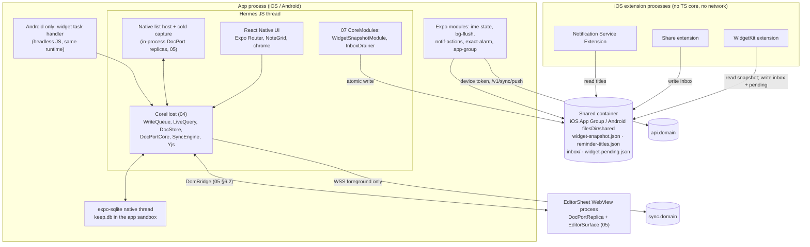

# 07 · Mobile app: Expo, grid, EditorSheet, native modules and OS surfaces

*Detail design · elaborates spine v1.2 (2026-10-04) · Status: draft for review · Owner area: Mobile*

## 1. Purpose and scope

This document specifies the iOS and Android apps in `apps/mobile`. They run the shared TypeScript core (04) on the Hermes JS thread and add everything that is specific to a phone or tablet. An engineer should be able to build the app shell, the grid, the EditorSheet host, the five Expo native modules, the iOS extensions, the Android widgets and the release pipeline from it.

It covers:

- the Expo app structure, Expo Router routes, root layout, startup sequence and deep links (D-05);
- the mobile implementations of 04's platform services (04 §16) and 12's `CredentialStore` (12 §10.6);
- the FlashList masonry grid, card rendering, multi-select and the long-press drag overlay (D-08, D-09);
- the EditorSheet host: mounting, the DomBridge native end, host selection, transitions, native chrome, keyboard, cold capture and the native image viewer (D-11, D-12; consumes 05 §7.7–§7.8);
- the native modules `ime-state`, `bg-flush`, `notif-actions`, `exact-alarm` and `app-group` (D-38);
- the **shared-file formats this document owns**: the widget snapshot, the intent inbox, the reminder-titles file and the widget-pending file (consumers 04, 09);
- iOS widgets, the share extension and the notification service extension through `expo-apple-targets`; Android widgets through `react-native-android-widget` and the Android share target;
- device-identity storage, backup and device-transfer exclusion (D-06, D-42, INV-18);
- background execution and battery rules (X-15);
- EAS build profiles, update channels, the fingerprint runtime policy and the mobile release process (D-49).

### Out of scope

| Topic | Owner |
|---|---|
| Core storage, LiveQuery, CoreApi, DocStore, outbox, feed, hydration, platform-service *interfaces* | 04 |
| DocPort protocol and wire format, `EditorSurface`, `ChecklistNativeView`, `ColdCaptureView`, TextBinding, undo, gate | 05 |
| KSP frames, op catalogue, `SYNC_UX` copy and severity | 02 |
| Sessions, JWTs, device tokens, device registration, `AuthPort`, `AuthController`, sign-in ceremonies | 12 (07 supplies native glue and `CredentialStore`) |
| Reminder semantics, planner, coverage, ringer election, push payloads, which notes the titles file lists | 09 |
| Upload queue, renditions, signed URLs, image processing pipeline | 10 |
| Search queries and ranking | 11 |
| Sharing semantics, member chips, pending-card rules | 08 |
| CI infrastructure, EAS account, store accounts, dashboards | 14 |
| Threat model, privacy labels, Data safety text | 15 |
| Simulator harness and the E2E matrix as a whole | 16 |
| Web app | 06 |

## 2. Spine references

Convention: `spine §x.y` is a spine section; `NN §x.y` is a section of detail doc NN; a bare `§x.y` is this document.

| ID | How this document implements it | Section |
|---|---|---|
| D-05 | Expo SDK 57 → 58, Expo Router 57, dev clients, EAS Build/Submit/Update with `runtimeVersion.policy = fingerprint` | §4, §14 |
| D-06 | `keep.db` in the app sandbox, excluded from OS backups and device transfer; protection class CompleteUntilFirstUserAuthentication; same for token files | §11 |
| D-07 | Unistyles theme from `ui-tokens`; Reanimated, Gesture Handler, haptics at SDK-pinned versions | §4.2, §5 |
| D-08 | FlashList 2.3.3 `masonry`, default `optimizeItemArrangement`, long-press RNGH/Reanimated drag overlay, drop index in data order, throttled reflow, cards memoized by `(id, row_v)` | §5 |
| D-09 | `GridSource` skeleton plus payload LRU; `ui.gesture()` around flings and drags | §5.2 |
| D-11 | Root-owned pre-warmed EditorSheet, card-expand transition, DomBridge, heartbeat and remount, cold capture through an in-process DocPort session, native image viewer, keyboard-controller | §6 |
| D-12 | Native list host mounting, mixed notes (C-68), `ime-state` for TextBinding (C-71) | §6.4, §7.2 |
| D-19, spine §5.6 | Flush on `AppState → background`; crash-loss bound ≈ 350 ms (C-56) | §12.2 |
| D-22, X-15 | Foreground-only socket closed 30 s after background; silent push and `expo-background-task` pull; no polling | §12 |
| D-36, D-37 | Native side of reminders: channels, categories, exact alarms, force-stop detection, NSE titles file (semantics in 09) | §7.4, §7.5, §8.5, §9.5, §13 |
| D-38 | The five native modules, extension data paths, `expo-apple-targets`, in-process Android widgets | §7–§10 |
| D-40 | On-device HEIC → JPEG ≤ 3,072 px in the share extension; picker glue for 10's pipeline | §6.9, §9.4 |
| D-41, C-85, C-90, C-91 | Credential storage, push-only device token for native code, foreground-only rotation, fresh-install hygiene ordering | §11.4, §11.5 |
| D-42, INV-18, C-83, C-84 | `device_id` storage, fork and stale-twin resets with a new `device_id`, backup and transfer exclusion | §11 |
| D-49, X-08 | Build profiles, channels, fingerprint, OTA limits, store rollouts, rollback test, format-version clamp | §14 |
| D-50, C-67 | WebView image sources: CDN or data URIs of cached ≤ 1,024 px renditions, lazily and bounded | §6.10 |
| INV-1 | Every UI mutation goes through CoreApi; extensions commit to the inbox (see spine issue S-07-1) | §5, §8.3 |
| INV-12 | Editor drain before purge, sign-out and account switch; inbox drained before unsynced counts | §6.3, §8.3 |
| P-06, C-48 | Pin and archive from the grid and the editor chrome use 04's coupled overlay writes | §5.6 |
| P-09, P-28, X-20 | Passive channel, notification content setting, widget content setting | §8.2, §8.5, §13 |
| P-23, C-59 | FAB and capture entry points open ephemeral notes; back-out creates nothing | §6.8 |
| C-19, C-22, C-23 | `hold` → "Update required", `UPGRADE_REQUIRED` and 4426, close codes 4403 and 4409 | §6.11, §14.6 |
| C-52 | `intent` and `device` client tables used by the inbox drainer and settings | §8.3 |
| X-01 | Content-free logs and metrics from app and extensions | §16 |
| X-14 | Sync chip always visible; "Available when online" treatment | §4.6 |
| X-17, X-18 | Grid and chrome accessibility, Dynamic Type to 200 %, RTL | §15 |
| X-19 | No TipTap or ProseMirror in the Hermes bundle (≤ 2.5 MB HBC), checked in CI | §14.3 |
| Q-01, Q-03, Q-04, Q-10, Q-11, Q-13, Q-16, Q-19 | Mobile parts of the open questions | §20 |

## 3. Architecture overview

### 3.1 Repository layout

```
apps/mobile/
  app.config.ts                 dynamic config per APP_VARIANT (§14.1)
  eas.json                      build, submit and update profiles (§14.2)
  src/app/                      Expo Router root (router plugin option root: "./src/app")
  src/core/                     getCore() singleton, CoreModules owned by 07 (widget snapshot, inbox drainer)
  src/platform/                 PlatformServices implementations (§4.7), CredentialStore (§11.5)
  src/grid/                     NoteGrid, Card, DragController, SelectionBar
  src/sheet/                    EditorSheetHost, DomBridgeEnd, chrome, transitions, image viewer
  src/editor/EditorSheet.dom.tsx   the 'use dom' entry (content owned by 05 §7.7)
  src/intents/                  inbox drainer, IntentApplier, Android share intake
  src/widgets-android/          widget task handler and widget JSX (react-native-android-widget)
  src/deeplinks.ts              parseDeepLink (§4.4)
  modules/ime-state  modules/bg-flush  modules/notif-actions  modules/exact-alarm  modules/app-group
  targets/widgets  targets/share  targets/nse            expo-apple-targets (iOS only)
  plugins/                      config plugins: backup rules, App Group, shortcuts, BG task ids, privacy manifest
packages/mobile-formats/        TS types + zod schemas + JSON fixtures for §8 (Swift and Kotlin mirrors test against the fixtures)
```

`packages/mobile-formats` imports only `zod` and `@keep/domain` types. The Swift readers in `targets/*` and `modules/app-group/ios`, and the Kotlin reader in `modules/app-group/android`, are hand-written mirrors validated against the same fixture files (§19.3).

### 3.2 Runtime topology



| Execution context | Runs the TS core? | Opens `keep.db`? | Network | Credential |
|---|---|---|---|---|
| App foreground (Hermes) | Yes | Yes | WSS + HTTPS | JWT minted from the session (12 §8.3) |
| App background JS (bg-flush lease, background task, silent push, Android headless widget/flush task) | Yes, the same `CoreHost` singleton | Yes, same connection | HTTPS only | JWT (background mint, no rotation) or device token on `/push` |
| `notif-actions` native handler while JS is not running | No | No | `POST /v1/sync/push` only, best effort | Device token copy (§7.3) |
| iOS widget, share and NSE extensions | No | No | None (D-38) | None |
| EditorSheet WebView | No (replica only) | No | `` from the media origin only (05 §7.7) | None |

### 3.3 Interfaces at a glance

**Owned here:**

| Interface | Section | Consumers |
|---|---|---|
| `WidgetSnapshotV1`, `WidgetPendingV1` | §8.2 | 04 (producer runs as a 07 `CoreModule`), 09 (none), iOS/Android widget code |
| `IntentV1`, `IntentResultV1`, inbox directory protocol | §8.3 | 04 (`IntentsApi.ingest`), 09 (`reminder.action`) |
| `ReminderTitlesV1` | §8.5 | 09 (entry selection), iOS NSE |
| Shared-container layout, atomic write and reader rules, format-version clamp | §8.1, §8.6 | 04 `SharedContainer` |
| `DeepLink`, `parseDeepLink`, URL scheme | §4.4 | 09 (notification open), 08 (invite links), widgets |
| Native module JS APIs (`ImeState`, `BgFlush`, `NotifActions`, `ExactAlarm`, `AppGroup`) | §7 | 04 platform adapters, 05 (`ImeStateHelper`), 09 (through 04's `Notifications`) |
| `BgCredentialV1` (native-readable background credential copy) | §7.3 | 12 (lifecycle), native code |
| Mobile `PlatformServices` implementations and `CredentialStore` | §4.7, §11.5 | 04, 12 |
| `SheetController` (app-internal) | §6.1 | grid, deep links, FAB, widgets |
| EAS profiles, channels, fingerprint and OTA rules | §14 | 14 |

**Consumed:**

| From | What | Section used |
|---|---|---|
| 04 | `createCore`, `CoreHost`, `CoreApi` (`grid`, `notes`, `trash`, `editor`, `sync`, `intents`, `ui`, `diagnostics`), `PlatformServices` interfaces, `CoreModule`, `LocalAccountStore` | 04 §3.4, §4, §5.4, §16 |
| 05 | `EditorSheet.dom.tsx` bundle contract, DomBridge wire format, `DocPortCoreHostApi`, `CoreEnd`, `ChecklistNativeView`, `ColdCaptureView`, `createInProcessReplica`, `ImeStateHelper`, `EditorCommand`, `EditorIntent`, `EditorUiState`, host state machine | 05 §6, §7, §8.6 |
| 12 | `AuthPort`, `AuthController`, `CredentialStore`, `PendingSignOut`, Keychain item names, device-token headers | 12 §5.3, §8, §9.6, §10 |
| 02 | `SYNC_UX`, close codes, `/v1/sync/push` frame-stream body, `PushV1` | 02 §4, §5, §7.1, §8.3, §18.3 |
| 01 | `PreviewV1`, `ColorToken`, `BackgroundToken`, settings catalogue (`widgets.showContent`, `notifications.hideContent`, `list.checkedToBottom`), `effectiveOverlay`, `occKey` rules | 01 §4.4, §4.5, §15.4, §16.4 |
| 08 | `MemberChip`, `can.*` predicates, pending-card rendering rule | 08 §4.8, §4.10 |

## 4. App structure and Expo Router

### 4.1 Route tree

```
src/app/
  _layout.tsx                      root layout (§4.2)
  +native-intent.tsx               redirectSystemPath: maps widget, shortcut, share and notification URLs (§4.4)
  (auth)/_layout.tsx               Stack; shown when AuthState is signed_out or signing_in
  (auth)/sign-in.tsx               passkey, Apple, Google, email OTP (12 §4.3; native glue here)
  (auth)/otp.tsx
  (app)/_layout.tsx                custom drawer + Stack; shown for active, expired, signing_out, wiping
  (app)/index.tsx                  Notes grid (view 'notes')
  (app)/reminders.tsx              view 'reminders'
  (app)/label/[labelId].tsx        view 'label'
  (app)/archive.tsx                view 'archive'
  (app)/trash.tsx                  view 'trash' (owner's trashed notes only)
  (app)/pending.tsx                "Shared with you · pending" cards (P-15)
  (app)/search.tsx                 search and M4 filters (11)
  (app)/note/[id].tsx              transparent driver route for the EditorSheet (§6.1)
  (app)/new.tsx                    ?kind=text|list|image|camera → ephemeral note (P-23)
  (app)/share.tsx                  Android share-target capture sheet (§10.4)
  (app)/image/[noteId]/[attId].tsx native image viewer, fullScreenModal (§6.9)
  (app)/collaborators/[id].tsx     share dialog sheet (08)
  (app)/reminder/[id].tsx          reminder picker sheet (09)
  (app)/labels/[id].tsx            label picker sheet
  (app)/pending/[id].tsx           pending card dialog: Accept, Decline, Block (08)
  (app)/merge-review/[id].tsx      M3 review dialog (05 §12.5)
  (app)/widget-config/[wid].tsx    Android widget note picker (§10.2)
  (app)/settings/index.tsx  settings/labels.tsx  settings/widgets.tsx  settings/notifications.tsx
  (app)/settings/account.tsx  settings/devices.tsx  settings/delete-account.tsx  settings/export.tsx
  (app)/settings/sync-issues.tsx   dead letters (04 SyncApi), quarantined inbox entries, recovered drafts
  invite/[token].tsx               universal-link landing for invites (08)
```

- **Guards.** `Stack.Protected` in the root layout selects `(auth)` when `AuthController.state().kind` is `signed_out` or `signing_in`, and `(app)` otherwise. `expired` stays in `(app)`: local editing continues and the chip reads "Sign in to sync" (X-14, D-41). `switch_pending` renders 12's switch dialog as a modal over `(app)`.
- **Drawer.** A custom drawer (RNGH edge pan + Reanimated) wraps the `(app)` Stack: Notes, Reminders, the label list, Edit labels, Archive, Trash, Settings. It needs no navigation-library drawer, so the router upgrade path stays SDK-pinned.
- **Single scene.** `UIApplicationSupportsMultipleScenes = false`; scene lifecycle is enabled (`ios.enableSceneSupport`, SDK 57.0.23+, mandatory in SDK 58). One `CoreHost` per process (04).

### 4.2 Root layout

```tsx
// src/app/_layout.tsx
export default function RootLayout() {
  return (
    <CoreGate>                     {/* awaits getCore('ui') behind the splash (§4.3) */}
      <GestureHandlerRootView style={{ flex: 1 }}>
        <KeyboardProvider>         {/* react-native-keyboard-controller */}
          <ThemeRoot>              {/* Unistyles theme: system scheme + note tokens (D-07) */}
            <I18nRoot>             {/* Lingui 5, locale from expo-localization (X-18) */}
              <AuthStack />        {/* Stack.Protected (auth) / (app) */}
              <EditorSheetHost />  {/* root-owned, never unmounted (§6) */}
              <SyncSurfaces />     {/* SYNC_UX banners, dialogs, snackbars (02 §8.3) */}
            </I18nRoot>
          </ThemeRoot>
        </KeyboardProvider>
      </GestureHandlerRootView>
    </CoreGate>
  );
}
```

`getCore(mode)` returns one `CoreHost` per JS runtime, whatever started the runtime (UI launch, background task, Android widget task). The SyncEngine opens its socket only while `Lifecycle.appState() === 'foreground'` (D-22).

```ts
// src/core/getCore.ts
let host: Promise<CoreHost> | null = null;
export function getCore(mode: 'ui' | 'background' | 'widget'): Promise<CoreHost> {
  launchHint.noteFirstCaller(mode);          // feeds Lifecycle.launchContext() (§4.5); no other effect
  return (host ??= createCore({
    platform: mobilePlatform(),              // §4.7
    modules: [searchModule, reminderModule, uploadModule, widgetSnapshotModule, inboxModule, androidWidgetModule],
    build: { appVersion: nativeInfo.appVersion, buildNumber: nativeInfo.buildNumber,
             schemaLevel: SCHEMA_LEVEL, docSchemaMax: REGISTRY_V1.maxLevel, platform: Platform.OS as 'ios' | 'android' },
  }));
}
```

### 4.3 Startup sequence

Budget: spine §1.3, cold start to first cards p50 ≤ 0.8 s and p90 ≤ 1.5 s on the lab mid-range Android at 5k notes; iPhone p50 ≤ 0.6 s.

| Phase | Work | Budget p50 (Android lab) |
|---|---|---|
| 1 | Process start, RN host init, Hermes V1 bytecode load; splash shown (`expo-splash-screen.preventAutoHideAsync`) | 250 ms |
| 2 | Evaluate the entry bundle with `inlineRequires`; the root layout imports no editor, grid-drag or settings code eagerly | 120 ms |
| 3 | §11.3 launch identity checks (sync calls only) | 5 ms |
| 4 | `getCore('ui')`: 04 §3.6 steps 1–4 (open, additive DDL, skeleton, 50 payloads) | 115 ms |
| 5 | Render the drawer shell and `NoteGrid` with ≤ 12 visible cards; theme from the cached setting; fonts embedded at build time (expo-font config plugin, no runtime load) | 120 ms |
| 6 | FlashList `onLoad` → `diagnostics.mark('first_cards')` → hide splash | 20 ms |
| **Total** | | **≈ 630 ms** |
| 7 | After the first frame (04 §3.6 step 6): SyncEngine start, hydration resume, inbox drain (§8.3), `EditorSheetHost` mount (§6.2) | off the critical path |

- The splash is hidden at `first_cards` or after **1.5 s**, whichever comes first, so a slow migration shows placeholder cards instead of a frozen splash.
- When `Lifecycle.launchContext().kind === 'capture_intent'`, the sheet mounts at once and the cold-capture view is focused in the first frame; the skeleton loads after (04 §3.6, 05 §7.5).
- `processStartedAt()` comes from `AppGroup.nativeInfo().processStartMs` (iOS `sysctl` `kinfo_proc.p_starttime`; Android `Process.getStartUptimeMillis()` converted to wall time) for the `cold_start_ms` SLI (04 §17).

### 4.4 Deep links

Scheme `keep://` per variant (`keep-staging://`, `keep-dev://`), plus universal links and Android App Links on `https://app.<domain>`, so one URL works on web and mobile. `assetlinks.json` and `apple-app-site-association` are hosted by 14.

```ts
// src/deeplinks.ts (owned by 07; consumers: 09 notification open URLs, widgets, shortcuts, 08 invite links)
export type LinkSource = 'widget' | 'notification' | 'shortcut' | 'share' | 'external' | 'app';
export type DeepLink =
  | { t: 'note'; id: NoteId; occ?: OccKey; from: LinkSource }
  | { t: 'new'; kind: 'text' | 'list' | 'image' | 'camera'; from: LinkSource }
  | { t: 'settings'; section?: 'widgets' | 'notifications' | 'account' | 'sync-issues' }
  | { t: 'invite'; token: string }
  | { t: 'home' };

/** Pure. Validates IDs with domain/ids (shard-tagged UUIDv7) and occ keys with 01's isOccKey. Unknown → home. */
export function parseDeepLink(url: string): DeepLink;
```

| URL | Result |
|---|---|
| `keep://note/{noteId}?from=widget` · `https://app.<domain>/note/{noteId}` | Open the note (§6) |
| `keep://note/{noteId}?occ={occ}&from=notification` | Open the note; 09 handles `occ` |
| `keep://new?kind=text\|list\|image\|camera&from=widget\|shortcut` | Ephemeral new note (P-23); `capture_intent` launch context |
| `keep://settings/widgets` | Widget-content setting (§8.2) |
| `https://app.<domain>/invite/{token}` | 08's claim flow |

Rules: links never carry note text, titles, emails or search queries (privacy); a link to a note that is absent locally opens the grid with "This note isn't available on this device"; `+native-intent.tsx` calls `parseDeepLink` before routing, so malformed input never reaches a screen. Static app shortcuts (iOS `UIApplicationShortcutItems`, Android `shortcuts.xml`, written by a config plugin) are "New note", "New list" and "New photo" with the `keep://new` URLs; `expo-quick-actions` (version **UNVERIFIED**, Q-07-1) forwards the iOS shortcut callback as a URL.

### 4.5 Launch context

`Lifecycle.launchContext()` (04 §16.7) is computed once at start:

| Kind | Detected from |
|---|---|
| `capture_intent` | Initial URL is `keep://new…` (widget button, app shortcut) or Android `ACTION_SEND` |
| `notification` | `expo-notifications` last notification response present at launch |
| `widget` | Initial URL `keep://note/…?from=widget` |
| `background` | Process started without UI: background task, silent push, Android headless task (`getCore('background' \| 'widget')` before any UI mount) |
| `normal` | Otherwise |

### 4.6 Sync surfaces

07 renders 02's `SYNC_UX` table (02 §8.3) with these mobile surfaces:

| `UxSurface` | Mobile rendering |
|---|---|
| `chip` | Icon in the search bar, always visible; text label for every state except `saved`. Android `accessibilityLiveRegion="polite"`; iOS `announceForAccessibility` on transitions into `offline`, `not_synced`, `sign_in` (02 §8.3) |
| `toast` | Snackbar above the FAB, 4 s, one at a time |
| `banner` | Top of the grid, or inside the editor via 05's banners |
| `dialog` | RN modal; focus trapped |
| `card_badge` | Card corner badge (04 `CardPayload.sync`, `createError`) |
| `dead_letter` | Settings › Sync issues, with a badge on the drawer item |
| `note_readonly` | Editor read-only state (05 §11) |
| `inline` | Share dialog field message (08) |

### 4.7 Platform services on mobile

`mobilePlatform()` implements 04's `PlatformServices` (04 §16):

| Service | Implementation | Notes |
|---|---|---|
| `net.fetch` | `expo/fetch` (streaming bodies for the NDJSON bootstrap) | Base `https://api.<domain>` per variant; `priority` sets the `Priority` header and `URLSessionTask.priority` / OkHttp tag |
| `net.socket` | RN `WebSocket`, `binaryType = 'arraybuffer'` | Opened by the SyncEngine in the foreground only |
| `net.connectivity` | `@react-native-community/netinfo` (SDK-pinned) plus `BgFlush.dataSaver()` | `dataSaver`: iOS `NWPath.isConstrained`, Android `getRestrictBackgroundStatus() == ENABLED` |
| `clock` | `Date.now()`, `performance.now()`, `Intl` time zone; `onTimeChange` checked on every foreground and every 60 s in the foreground | Android also listens for `TIMEZONE_CHANGED` through `exact-alarm` |
| `crypto` | `expo-crypto` (`getRandomValues`, `digest`); `webcrypto` shim for lib0 | |
| `notifications` | `expo-notifications@57.0.21` plus `exact-alarm` and `notif-actions` (§13) | Semantics owned by 09 |
| `files` | `expo-file-system` (`File`/`Directory`; SDK 58 `File.write` is async) plus `AppGroup.excludeFromBackup` / `setProtection` | Directory map in §11.1 |
| `background` | `bg-flush` (flush lease, processing tasks, power), `expo-background-task@57.0.21` (refresh), `expo-notifications` background notification task (silent push) | §12 |
| `lifecycle` | `AppState`, `expo-linking`, `AppState` `memoryWarning`, §4.5 | |
| `secure` | `expo-secure-store` with `keychainAccessible: AFTER_FIRST_UNLOCK_THIS_DEVICE_ONLY` | Android ciphertext lives in SharedPreferences that §11.2 excludes from backup and transfer |
| `shared` | `app-group` module (§7.6) | iOS App Group container; Android `filesDir/shared` |
| `sql` | 04's `drivers/expo.ts`, directory `files.dir('db')` | |
| `log` | Sentry React Native breadcrumbs with `beforeSend` scrubbing (X-01) | |
| 12's `CredentialStore` | §11.5 | |

## 5. Grid: FlashList masonry and drag overlay (D-08, D-09)

### 5.1 Components

```
NoteGrid (screen) ── GridSource (04 grid.open(filter, sort)) ── skeleton LiveQuery
 ├─ FlashList (masonry, numColumns = cols(width))
 │    data: GridRow[] (headers + ids)   keyExtractor: row.key   getItemType: row.type
 │    renderItem → <CardCell id> → useCard(id) → <Card payload> (React.memo by id,rowV,cols,selected)
 ├─ DragController (RNGH LongPress + Pan, Reanimated shared values, overlay layer)
 ├─ SelectionBar (contextual top bar)
 └─ Fab (tap: text note; long-press: List, Image)
```

```ts
type GridRow =
  | { type: 'header'; key: 'h:pinned' | 'h:others' }
  | { type: 'text' | 'list' | 'image'; key: NoteId };          // from CardPayload kind and attachments
```

- `data` is rebuilt only when the skeleton's `version` changes. In the `notes` and `label` views it is `[h:pinned, ids[0..pinnedCount), h:others, ids[pinnedCount..)]`; headers are omitted for empty sections and for views without a Pinned section (04 §5.4).
- Header rows span every column through `overrideItemLayout` (`layout.span = numColumns`).
- `getItemType` returns `header`, `image` (first preview attachment present), `list` or `text`, so FlashList recycles within similar shapes.
- **No height estimates.** FlashList v2 measures real heights. Cells whose payload is not yet in the LRU render a shell of `estimateCardHeight(kindHint, fontScale)`; the first 50 payloads are loaded before the first frame (04 §3.6), so shells are rare.

### 5.2 Data binding

```ts
function useCard(src: GridSource, id: NoteId): CardPayload | undefined {
  return useSyncExternalStore(
    (cb) => src.subscribeCards((ids) => { if (ids.includes(id)) cb(); }),
    () => src.card(id));
}
```

| Event | Call |
|---|---|
| Visible range changes (`onViewableItemsChanged`, throttled to 100 ms) | `src.setViewport(first, last)` in skeleton indexes (headers excluded) |
| `onScrollBeginDrag` | `core.ui.gesture(true)` |
| `onMomentumScrollEnd`, or `onScrollEndDrag` with zero velocity | `core.ui.gesture(false)` (04 resumes within 100 ms) |
| Drag start / end (§5.4) | `gesture(true)` / `gesture(false)` |
| Screen blur | `src.setViewport(-1, -1)`; `src.dispose()` on unmount |

Columns:

```ts
export function cols(widthDp: number, fontScale: number, layout: 'grid' | 'list'): number {
  if (layout === 'list') return 1;
  const pad = widthDp >= 600 ? 16 : 8, gutter = 8, minCard = 164 * Math.min(fontScale, 1.5);
  return Math.max(fontScale >= 2 && widthDp < 400 ? 1 : 2, Math.min(6, Math.floor((widthDp - 2 * pad + gutter) / (minCard + gutter))));
}
```

`layout` (grid or list) and the sort mode are per-device `ui_state` keys `grid.layout` and `grid.sort` (spine §4.2). Sort modes Custom, Date created and Date modified ship on Android in M4 (spine §8); they map to 04's `GridSort` and keep the custom order.

`optimizeItemArrangement` stays at FlashList's default (`true`, shortest-column placement matching web lanes, D-08). Q-11's M0 parity test renders the same 200 notes with fixed heights in FlashList and in 06's TanStack lanes and compares column assignment.

### 5.3 Card

| Part | Source (`CardPayload`, 04 §5.3) | Rendering |
|---|---|---|
| Container | `color`, `background` | Unistyles note token (light and dark); background artwork from `ui-tokens`; 1 dp outline on `default` |
| Images | `attachments` (≤ 4) | `expo-image` with `placeholder={{ thumbhash }}`, `cacheKey = attId + ':256'`, source from 10's resolver (local cache file or signed URL); never keyed by URL (D-39) |
| Title | `title` | Bold; `dir` auto; no line cap (the Projector bounds it, 01 §15.3) |
| Body | `preview.b` | Blocks with B/I/U/S marks; `t0`/`t1` with static checkbox glyphs |
| Items | `preview.i`, `preview.n` | Static checkbox glyphs; "+ N checked items" per 01 §15.4 |
| Link cards | `preview.l` | Only when the viewer's link-preview setting is on |
| Chips | `labels` (2 + "+n"), `reminder`, `members` (≤ 3 avatars) | Member chips show initials or avatar, never emails (08) |
| Badges | `sync`, `createError`, `restoreLost`, `waitingOwner`, `badges.review`, `badges.draft` | Icons with accessibility text |
| Pending card (P-15) | `pendingAccept`, `sharer` | Plain text only: no link detection, no images (08 §4.9) |

The card is `React.memo` with equality on `(id, rowV, cols, selected, dragging)`. Accessibility: `accessibilityRole="button"`, label "{title or first line}. {Pinned}. {Reminder text}. {Shared with n people}." (X-17), and `accessibilityActions` per §15.

### 5.4 Drag overlay

Drag is enabled only in the `notes`, `label` and `archive` views with sort `custom`, outside selection of more than one note. Keep has no reorder mode, so the drag starts in place (D-08).

```
onLongPress(id)                       // RNGH LongPress 350 ms, ≤ 8 dp movement
  haptics.impactLight(); select(id)   // long-press also selects (§5.5)
  if (!dragAllowed()) return
  rect = measureInWindow(cell(id)); overlay.show(<Card payload>, rect, scale 1.03, elevation 8)
  cell(id).opacity = 0; core.ui.gesture(true)
  base = skeleton.ids; section = sectionOf(id); preview = base; layouts = snapshotLayouts()

onPan(x, y)                           // simultaneous with LongPress
  if (!dragging && dist > 8 dp) { dragging = true; clearSelectionExcept(id) }
  overlay.translate(x, y); autoScroll(y)          // 64 dp edge zones, ≤ 1,200 dp/s, ramped by depth
  every 150 ms (throttled reflow):
    t = hitTest(x, y, layouts, section)            // index in display order within the section
    if (t !== indexOf(preview, id)) {
      preview = moveWithin(preview, id, t)         // data order; columns follow from FlashList placement
      setData(rows(preview)); layouts = snapshotLayouts() after layout commit
    }

onEnd()
  final = preview
  if (sameOrder(final, base)) return animateBack()
  i = final.indexOf(id)
  before = i > sectionStart ? final[i - 1] : null;  after = i < sectionEnd ? final[i + 1] : null
  await core.notes.move(id, { before, after })      // writes only the moved note (spine §4.6, 04 §4.3)
  overlay.animateTo(measureInWindow(cell(id)), 180 ms); cell(id).opacity = 1; core.ui.gesture(false)
```

- **Hit test.** The candidate is the card whose last measured rectangle contains the pointer: before it if the pointer is in its upper half, after it otherwise. Over an empty column bottom, the candidate is after the lowest card of that column. The candidate is clamped to the dragged note's section: dragging never pins or unpins (Keep behaviour **UNVERIFIED**, Q-01).
- **Rebase.** If a skeleton update arrives mid-drag (priority-0/1 commits still deliver, 04 §5.5), `preview` is recomputed as `moveWithin(newSkeleton.ids, id, current target)`. If the dragged note leaves the skeleton, the drag cancels.
- **Reflow animation.** Cells whose rectangle changed and that are in the viewport animate with a 120 ms `LinearTransition`; off with Reduce Motion.
- **Non-drag alternative** (X-17): card `accessibilityActions` `moveUp`/`moveDown` and the selection-bar menu items "Move up" and "Move down" call `notes.move` with the displayed neighbours.

### 5.5 Selection and bulk actions

- Long-press selects (and may start a drag); while any note is selected, a tap toggles selection. Back or ✕ clears it. A selected note that leaves the skeleton is dropped from the selection.
- The contextual bar offers Pin/Unpin (unpin when all are pinned), Reminder, Color, Archive/Unarchive, Labels and a menu with Delete, Make a copy (single note), Send (single note) and Move up/down (single note, custom sort).
- Each action is one CoreApi call over the selection, one local transaction (04 §4.1). Pin and archive use 04's coupled `setPinned`/`setArchived` (P-06, C-48).
- **Delete** runs `notes.planDelete(ids)` and then `trash` for owned notes, `leave` for shared notes after the P-01 dialog "Remove from your notes? Others keep it.", and `respond('decline')` for pending cards.
- Archive and trash show a snackbar with Undo (Keep behaviour **UNVERIFIED**); Undo issues the inverse op with a fresh HLC.
- **Send** builds plain text from the local projection (title plus `splitSearchText(search_text).content`, 01 §15.5) and opens the OS share sheet with the first cached image; offline it works the same.

### 5.6 Budgets

| Measure | Target | Gate |
|---|---|---|
| Fling at 5k and 50k notes (lab low-end Android) | ≥ 58 fps, blank area ≤ 2 % of fling frames | Flashlight, M0 spike 2 and every release |
| Card render | ≤ 4 ms per card (text), ≤ 6 ms (list, image) | Reassure |
| Drag reflow | ≤ 16 ms JS per reflow at 5k | Flashlight |
| Skeleton patch while typing in an open note | no grid re-render (04 §5.4 patch path) | Reassure |
| RN heap with the grid at 5k, no note open | ≤ 120 MB (spine §1.3) | heap sample |

## 6. EditorSheet integration (D-11, D-12)

### 6.1 Host and controller

`EditorSheetHost` is mounted once by the root layout as an absolute-fill overlay above the navigation stack. It contains, bottom to top: the WebView layer (`EditorSheetDom`, 05 §7.7), the native list host (`ChecklistNativeView`), the cold-capture view (`ColdCaptureView`), the transition layer and the native chrome.

```ts
// src/sheet/SheetController.ts (app-internal)
export type OpenSource = 'grid' | 'search' | 'deeplink' | 'widget' | 'notification' | 'noteLink';
export interface SheetController {
  openNote(id: NoteId, o: { source: OpenSource; fromRect?: Rect; focus?: FocusTarget }): Promise<void>;
  newNote(kind: 'text' | 'list', o: { source: OpenSource; image?: LocalFileRef }): Promise<NoteId>;
  close(reason: 'user' | 'route' | 'drain'): Promise<void>;
  readonly state: { get(): SheetState; subscribe(cb: () => void): () => void };
}
export type SheetState =
  | { s: 'cold' | 'booting' | 'ready' | 'dead' | 'failed' }                  // 05 §7.2 host states, no note open
  | { s: 'open'; noteId: NoteId; host: 'webview' | 'nativeList' | 'coldCapture' | 'projection'; loadId: LoadId };
```

The route `(app)/note/[id]` is a transparent driver: mounting it calls `openNote(id, {source})`, unmounting calls `close('route')`. Opening from the grid pushes the route with `animation: 'none'`; the sheet animates itself (§6.5). The route gives deep links, Android back and iOS navigation one path. Opening a note link from inside the editor uses `router.replace`.

### 6.2 Mount and pre-warm

| Trigger | Action |
|---|---|
| `first_cards` mark, then `InteractionManager.runAfterInteractions` | Mount `EditorSheetDom` → state `booting` (05 §7.2) |
| `capture_intent` launch | Mount immediately, before the grid |
| `READY` validated (05 §6.9) | `ready`; record `editor_sheet_boot_ms` |
| No `READY` in 10 s, or mismatch | `failed` (05 §7.2) |
| Heartbeat miss, termination callback, 3 bad frames in 10 s, DomBridge protocol error | `dead` → remount with a new React `key`, ≤ 3 per 60 s, then `failed` |

**Hidden placement.** While no text note is open, the WebView stays mounted at full sheet size, translated below the screen, with `pointerEvents="none"`, `importantForAccessibility="no-hide-descendants"` and `accessibilityElementsHidden`. M0 spike 1 verifies that an off-screen WebView is not throttled; if it is, the fallback is an on-screen 1 × 1 dp view at opacity 0.01 that resizes on open (Q-07-3).

**Memory.** On `memoryWarning` the host keeps the WebView (a remount costs more than it frees); 04 empties its LRUs and the grid calls `Image.clearMemoryCache()`.

### 6.3 DomBridge native end

07 builds the native end of 05's DomBridge transport; 05 owns the wire format (05 §6.2) and frame schemas (05 §6.10).

```ts
// src/sheet/DomBridgeEnd.ts
export class DomBridgeEnd implements CoreEnd {
  readonly kind = 'dom-bridge' as const;
  constructor(private deps: {
    deliver(json: string): void;                       // EditorSheetDom imperative handle (05 §7.7)
    clock: PlatformClock; log: Logger;
    onDead(reason: 'heartbeat' | 'terminated' | 'badFrames' | 'protocol'): void;
  }) {}
  send(frame: CoreFrame): void;                        // base64 Bytes, per-direction n, chunk JSON > 256 KiB into ≤ 192 KiB parts
  receive(json: string): void;                         // wired to the onWire action: reassemble, check n, zod-validate, dispatch
  onFrame(cb: (f: ReplicaFrame) => void): () => void;
  onClose(cb: (r: TransportCloseReason) => void): () => void;
  close(): void;
  setForeground(fg: boolean): void;                    // pauses or resumes the heartbeat
}
```

- **Registration.** On every mount the host creates a new `DomBridgeEnd` and calls `core.editor.attach(end)` to obtain the `ReplicaId` used in `OpenOptions.replica` (05 §6.9).
- **Heartbeat.** The end sends `PING{n}` every 5 s while the sheet is mounted and the app is in the foreground, and consumes `PONG` itself (05 §6.7). A miss sends a second `PING` with a 2 s deadline; a second miss calls `onDead('heartbeat')`. On foreground the end sends a `PING` with a 2 s deadline before the host allows any `LOAD`. `busyMs > 1,000` is counted as `editor_webview_stall`.
- **Termination.** If `@expo/dom-webview` exposes `onContentProcessDidTerminate` (iOS) or `onRenderProcessGone` (Android), the end declares death immediately (Q-E1).
- **Validation.** Every inbound wire message is validated with 05's `ReplicaFrameSchema`. Three failures within 10 s → `onDead('badFrames')`. A gap or repeat in `n`, or interleaved part IDs → `onDead('protocol')`.

### 6.4 Host selection

```
hostFor(detail: NoteDetail, sheet: SheetState):
  detail.pendingAccept            → no editor: route to (app)/pending/[id]
  detail.kind === 'list'          → 'nativeList'    (a visible body renders as read-only rows with
                                                      "Edit as text" and, from M4, "Convert remaining"; C-68, 05 §12.3)
  sheet ∈ {ready, open}           → 'webview'       (text; text with visible items renders both, 05 §12.3)
  new note                        → 'coldCapture'   (sheet not ready; C-69, 05 §7.5)
  existing note, sheet booting    → 'projection'    (read-only projection, spinner; switches to 'webview' at READY)
  existing note, sheet failed     → 'projection' with "Editor couldn't start · Retry"
```

`EditorIntent{switchHost}` closes the session with `CloseReason 'switchHost'` and reopens in the other host with the intent's `convert` option (05 §12.1). `kind` is the doc's `meta.kind` as carried in `NoteDetail` (04 §11.10).

### 6.5 Open and close

```mermaid
sequenceDiagram
  autonumber
  participant G as NoteGrid
  participant H as EditorSheetHost
  participant C as CoreHost (04) + DocPortCore (05)
  participant W as WebView replica
  G->>H: openNote(id, {fromRect})
  H->>H: transition layer: Card(payload) at fromRect → full sheet, 220 ms (none with Reduce Motion)
  H->>C: editor.open(id, {replica: sheet, interactive: true})
  C->>W: LOAD{state, ctx, hlc}
  W-->>C: LOADED
  H->>H: crossfade 120 ms to the WebView at max(LOADED, transition end)
  Note over H: LOADED later than 600 ms: the expanded card shows the full projection meanwhile
  G->>H: back (route unmount, Android back, Esc on hardware keyboard)
  H->>C: close(loadId, 'user')
  H->>H: collapse to the card's current rect (fade if off-screen); does not wait for CLOSED
  C->>C: final batch committed, P-23 discard check (05 §10)
```

The host calls `AccessibilityInfo.setAccessibilityFocus` on the WebView after `LOADED` and returns focus to the originating card after close (X-17). Tablets and windows ≥ 840 dp wide show the sheet as a centred dialog, width `min(720, 0.9 × width)`.

### 6.6 Native chrome

| Area | Controls | Wiring |
|---|---|---|
| Top bar | Back, Pin, Reminder, Archive | Per-user state through CoreApi (`notes.setPinned`, `setArchived`, reminder sheet). On an ephemeral note, 04 holds them on the lease (04 §4.3, C-59) |
| Bottom bar | Add (Take photo, Add image, Show checkboxes), Palette (color, background), Format `Aa` (text notes), Undo, Redo, More | Editor commands via `core.editor.command(loadId, cmd)` (WebView) or `NativeEditorController.exec(cmd)` (native hosts); enabled and pressed states from `onUiState` |
| Format row | B, I, U, H1, H2, Normal, Remove formatting | Second row above the keyboard (05 §7.4) |
| More menu | Delete, Make a copy, Send, Collaborator, Labels, Show/Hide checkboxes | Collaborator is disabled with "Add some content first" while the note is ephemeral (05 §10) |

`EditorIntent`s from either host are routed in one place: `openImage` → image viewer route, `openUrl` → `isAllowedScheme` then the system browser, `pasteImage` → `expo-clipboard` image → `media.attachImage`, `openReminder`/`openCollaborators`/labels → their sheets, `announce` → `AccessibilityInfo.announceForAccessibility`, `action: updateApp` → §14.6, `action: makeCopy` → `notes.copy`, `refreshMedia` → §6.10.

### 6.7 Keyboard

`KeyboardProvider` wraps the app. The sheet uses `useKeyboardHandler` to send `CMD{setInsets}` with the keyboard height and toolbar frame on every change (05 §7.4); the bottom chrome sits in a `KeyboardStickyView`. Hardware back closes the format row first, then the sheet. On iOS the WebView props of 05 §7.7 (`keyboardDisplayRequiresUserAction: false`, `hideKeyboardAccessoryView: true`) are verified in M0 spike 1.

### 6.8 New notes and cold capture

| Entry point | Action |
|---|---|
| FAB tap | `newNote('text')` |
| FAB long-press | Menu: List → `newNote('list')`; Image → picker, then `newNote('text', {image})` |
| Widget or shortcut `keep://new?kind=…` | Same, with `source` widget or shortcut |

`newNote` mints the ID with `core.notes.newNoteId()` and opens with `ephemeral: {kind}` (P-23). Nothing is written until the first content (05 §10). Text notes open in the WebView when the sheet is `ready`; otherwise in `ColdCaptureView` bound to an in-process DocPort session (C-69), which hands over to the WebView when it becomes ready (05 §7.5). Lists always open natively. An image entry passes the picked file to `media.attachImage(newId, file)`, which materializes the note (an attachment is content, P-23).

### 6.9 Image viewer and capture

- **Picker.** `expo-image-picker` (camera or library). 10 runs D-40's on-device pipeline and creates the 1,024 px display copy at attach time (C-67).
- **Viewer.** `(app)/image/[noteId]/[attId]` shows the largest cached rendition with pinch zoom, then the full master from 10's signed URL when online. Actions: Share, Alt text, Delete, and "Grab image text" (M4, `expo-text-extractor`). Delete and alt text run in a short in-process DocPort session on the note (`createInProcessReplica`, 05 §7.6), so the open editor sees them as another session's update and they are undoable there (C-61).

### 6.10 Images in the WebView (D-50, C-67)

The WebView loads images only from the media origin or data URIs. For an attachment that 10's resolver cannot serve from the CDN (offline, or a pending upload), 07's `DataUriSource` produces a data URI:

```ts
// src/sheet/DataUriSource.ts (used by 10's source resolver on mobile)
export interface DataUriSource {
  /** Largest cached rendition ≤ 1,024 px (or the pending upload's display copy) as a data URI. */
  get(att: AttachmentId): Promise<{ uri: string; bytes: number } | null>;
}
```

- **Lazily.** A data URI is produced only after the editor reports the image near the viewport (`EditorIntent{refreshMedia}` on first visibility; see the cross-doc issue for a dedicated intent).
- **Bounded.** At most 2 conversions in flight; each data URI ≤ 512 KiB of base64, otherwise the 256 px rendition is used; at most 8 data URIs live per load (older ones revert to `src: null` placeholders with the thumbhash).
- **Transport.** URIs reach the replica as `CTX{attachments}` patches (05 §6.3), which DomBridge chunks above 256 KiB.

### 6.11 Read-only, update and failure states

| State | Mobile behaviour |
|---|---|
| Gate `level` or `unknown*` (INV-9) | 05's read-only view with "Update to edit"; `action: updateApp` first checks EAS Update (`checkForUpdateAsync`, download, apply on next cold start or immediately if no session holds unacked batches), else opens the store page (§14.6) |
| Gate `malformed` | Read-only, no update prompt (05 §11) |
| `READ_ONLY_DB` (04) | Banner "Update required"; mutations disabled |
| `hold` older than 7 days (C-19) | `update_required` banner (02 §8.3) |
| Sheet `failed` | Existing text notes read-only from the projection; new text notes in the degraded cold-capture editor (05 §7.5) |

## 7. Native modules (D-38)

### 7.1 Conventions

- Local Expo modules under `apps/mobile/modules/<name>` with `expo-module.config.json`, Swift (iOS) and Kotlin (Android), written with the Expo Modules API. Synchronous functions are used only for reads of state cached on the native side; everything that touches the UI thread or I/O is async.
- Each module has a config plugin when it needs manifest, Info.plist or entitlement changes. Every module and plugin is part of the fingerprint (§14.3).
- JS wrappers in `src/platform/*` adapt them to 04's interfaces; nothing else imports a module directly.
- Byte arrays cross the bridge as `Uint8Array`.
- Native tests: XCTest and JUnit/Robolectric per module, run in CI on every change under `modules/`.

| Module | Ships | Used by |
|---|---|---|
| `ime-state` | M0 spike 1, product in M1 with native lists | 05 TextBinding via `ImeStateHelper` |
| `app-group` | M1: file protection and native info; M3: reminder-titles writer; M4: snapshot, inbox, widget reload (D-38 stage) | 04 `FileStore`, `SharedContainer`, `Lifecycle` |
| `bg-flush` | M3 (D-38 stage; see spine issue S-07-2) | 04 `Background` |
| `notif-actions` | M3 | 09 via inbox intents |
| `exact-alarm` | M3 | 04 `Notifications.exactAlarms`, 09 |

### 7.2 `ime-state`

```ts
// modules/ime-state/index.ts
export interface ImeState {
  /** Sync read of a native-cached flag: is the focused native text input composing? */
  isComposing(): boolean;
  addListener(event: 'change', cb: (e: { composing: boolean }) => void): { remove(): void };
  available(): boolean;                                  // false if the platform hook failed to install
}
```

- **iOS.** On `UITextField.textDidChangeNotification`, `UITextView.textDidChangeNotification`, `textDidBeginEditing` and `textDidEndEditing` (all main thread) the module reads the first responder's `markedTextRange != nil` and stores it in an atomic. The first responder is found by `UIApplication.shared.sendAction(#selector(captureFirstResponder), to: nil, from: nil, for: nil)`. Marked text changes always post a text-change notification, so the flag stays current without polling.
- **Android.** A `ViewTreeObserver.OnGlobalFocusChangeListener` on the current activity tracks the focused `EditText` and attaches a `TextWatcher`; `afterTextChanged` (main thread) stores `BaseInputConnection.getComposingSpanStart(editable) >= 0`. Focus loss clears it.
- **JS.** 07 passes `{ isComposing: () => ImeState.isComposing() }` as `NativeReplicaEnv.ime` (05 §7.8). When `available()` is false, 05's typing-window heuristic applies (400 ms iOS, 1,500 ms Android). Telemetry `ime_helper_available{platform}`.

### 7.3 `notif-actions`

Handles Done, Snooze and Dismiss on reminder notifications natively, so they work while JS is not running, and Open as a deep link (D-38). It never opens `keep.db`.

```ts
// modules/notif-actions/index.ts
export interface NotifActions {
  /** Native-readable copy of the background credential. 07's CredentialStore adapter keeps it in step with
   *  12's 'device_token' slot; null clears it (sign-out, wipe, fresh-install hygiene). */
  setBackgroundCredential(c: BgCredentialV1 | null): Promise<void>;
  configure(o: { snoozeMs: number; categories: { reminder: { done: string; snooze: string } } }): Promise<void>;
  /** Fired when a native handler wrote an inbox intent while JS is alive. */
  addListener(event: 'intent', cb: (e: { name: string }) => void): { remove(): void };
  /** Notifications armed natively (snoozes taken while JS was dead) that the planner has not adopted yet. */
  nativeArmed(): Promise<readonly { occ: string; noteId: string; fireAt: number }[]>;
  adoptNativeArmed(occs: readonly string[]): Promise<void>;
}
export interface BgCredentialV1 {
  v: 1;
  userId: string; deviceId: string; homeShard: number; userHash: string;
  deviceToken: string;              // 12 §8.1 'kdt1_…'
  hlcNode: string;                  // 8 chars, sync_meta HLC node (01 §6.2)
  apiBase: string;                  // https://api.<domain> for this variant
  opV: { 'reminder.ack': number };  // op payload version the native encoder sends (02 §7.6)
}
```

Storage of `BgCredentialV1`: iOS Keychain item `ks.bgcred.v1` (service `ks`, `kSecAttrAccessibleAfterFirstUnlockThisDeviceOnly`, app-private access group); Android AES-GCM ciphertext in `noBackupFilesDir/cred/bgcred.v1` under Keystore key `ks_bgcred_v1`. It is a copy of 12's device token plus non-secret context, written so native code never parses `expo-secure-store`'s private format.

**Native action handling** (both platforms; semantics of each action are 09's):

```mermaid
sequenceDiagram
  participant U as User
  participant N as notif-actions (native)
  participant G as Shared container inbox
  participant S as api.domain /v1/sync/push
  participant J as JS core (later)
  U->>N: Done / Snooze / Dismiss on a reminder notification
  N->>N: remove the notification; cancel any OS notification with id = occ
  opt Snooze
    N->>N: arm one local notification at until = now + snoozeMs, id = snoozed occ key (§7.3.1)
  end
  N->>G: atomic write inbox/<ts>-<id>.json {kind: reminder.action}
  N->>S: best effort: HTTP_HDR + PUSH{reminder.ack} with the device token (10 s timeout)
  N-->>U: completion handler / receiver finished
  J->>G: drain (next launch or foreground)
  J->>J: intents.ingest → reminders.ack (09), planner adopts natively armed snoozes
```

#### 7.3.1 Rules

- **Durability first.** The inbox write is the commit point; the POST is an optimization. Ops are idempotent by `(occ, action)` (spine §5.3), so the JS core sending the same ack later is harmless.
- **Snooze key.** The snoozed occurrence key is `occ` with its `#s{n}` suffix replaced by `#s{n+1}` (or `#s1` appended), the 01 §16.4 rule. `until = now + snoozeMs`, where `snoozeMs` is configured by 09 at startup (default 1 h, P-10). The natively armed notification reuses the original title and body. iOS arms it with `UNTimeIntervalNotificationTrigger`; Android with `AlarmManager.setExactAndAllowWhileIdle` when exact alarms are granted, else `setAndAllowWhileIdle`, posting through the module's receiver on channel `reminders`. Each natively armed snooze is listed in `nativeArmed()` until 09 adopts it.
- **POST body.** A KSP frame stream (02 §4.2, §18.3), built by a ~60-line native encoder:

```
body      = rec(HTTP_HDR) ‖ rec(PUSH)                       rec(f) = varuint(len f) ‖ f
HTTP_HDR  = u8 0x50 ‖ varuint 0 ‖ varuint 0 ‖ str(json {"userId","deviceId"})
PUSH      = u8 0x10 ‖ varuint 1 ‖ varuint 0 ‖ str(json PushV1)
PushV1    = {"batchId": uuidv7, "lane": homeShard,
             "ops": [{"ccid": uuidv7, "op": "reminder.ack", "v": opV, "args": {"noteId","occ","action","until"?},
                      "hlc": base36(nowMs).padStart(9,'0') + "0000" + hlcNode}]}
str(s)    = varuint(utf8 length) ‖ utf8 bytes;  varuint = lib0 LEB128, unsigned
headers   = Content-Type: application/x-ksp-frames · Authorization: KS-Device <token>
            X-KS-Bound-User: userId · X-KS-Device: deviceId
```

  The HLC uses counter 0 and the device's node; `reminder.ack` has no HLC guard, so the value never decides a write (spine issue S-07-4). Only the HTTP status is read: 2xx or an authoritative 401/403 ends the attempt; anything else is dropped. Golden-byte tests compare the encoder with 02's `encodeFrameStream` (§19.3).
- **iOS.** Categories `reminder` (actions `done`, `snooze`; `.customDismissAction` so dismissal is delivered) are registered at launch. The app is launched in the background to handle non-foreground actions; the module handles the response as an extra `UNUserNotificationCenterDelegate` behind expo-notifications' delegate fan-out (mechanism **UNVERIFIED**, Q-07-2) and calls the completion handler within 25 s.
- **Android.** Action and delete `PendingIntent`s target the module's manifest `BroadcastReceiver`. The receiver uses `goAsync()` for the inbox write (≤ 2 s) and enqueues a `WorkManager` job (network constraint) for the POST, so a slow network never holds the receiver. How the receiver's intents are attached to notifications scheduled by expo-notifications is decided in M3 (Q-07-2).
- **Open.** Opens `keep://note/{noteId}?occ={occ}&from=notification` (foreground action); no inbox entry.
- **No credential** (signed out, or before the first device-token mint): inbox write only.

### 7.4 `exact-alarm` (Android; iOS stub)

```ts
// modules/exact-alarm/index.ts
export interface ExactAlarm {
  state(): { supported: boolean; granted: boolean; sdk: number };   // iOS: { supported: false, granted: true }
  openSettings(): Promise<void>;          // ACTION_REQUEST_SCHEDULE_EXACT_ALARM with package: URI
  addListener(event: 'change', cb: (s: { granted: boolean }) => void): { remove(): void };
  /** D-36 missed-while-stopped detection, evaluated once per process at launch. */
  alarmIntegrity(): Promise<{ wiped: boolean; reason: 'force_stop' | 'sentinel_missing' | null; lastExit: string | null }>;
  armSentinel(): Promise<void>;           // inexact alarm at now + 365 d, PendingIntent request code 0x6b65, FLAG_IMMUTABLE
}
```

- `state()` reads `AlarmManager.canScheduleExactAlarms()` (API 31+; `granted: true` below 31). The `change` event comes from a runtime receiver for `ACTION_SCHEDULE_EXACT_ALARM_PERMISSION_STATE_CHANGED`, and the state is re-read on every foreground.
- `alarmIntegrity()`: `wiped` is true when `ActivityManager.getHistoricalProcessExitReasons` reports a user stop for the last exit (`REASON_USER_STOPPED`, API level **UNVERIFIED**, Q-19), or when `PendingIntent.getBroadcast(…, FLAG_NO_CREATE)` no longer finds the sentinel. 09 then re-arms and lists missed occurrences (D-36).
- Manifest receivers for `BOOT_COMPLETED`, `MY_PACKAGE_REPLACED` and `TIMEZONE_CHANGED` enqueue a `WorkManager` job that starts the JS runtime headlessly and calls `Background.onTask({kind: 'refresh'})`, so 09 re-plans after reboots, updates and zone changes.
- Permissions: `SCHEDULE_EXACT_ALARM` only; `USE_EXACT_ALARM` is not declared (Q-03); `RECEIVE_BOOT_COMPLETED`; `POST_NOTIFICATIONS`.

### 7.5 `bg-flush`

Keeps the process and the JS runtime alive while the core drains the outbox after backgrounding (D-38), schedules the hydration processing task (spine §5.4 step 7) and reports power and data-saver state (X-15).

```ts
// modules/bg-flush/index.ts
export interface BgFlush {
  begin(reason: 'background' | 'pagehide' | 'signout'): Promise<{ token: string; deadlineMono: number }>;
  end(token: string): void;
  scheduleProcessing(c: { requiresNetwork: boolean; requiresCharging: boolean }): Promise<void>;
  cancelProcessing(): Promise<void>;
  addListener(event: 'task', cb: (t: { kind: 'processing' | 'flush'; id: string; deadlineMono: number }) => void): { remove(): void };
  taskDone(id: string, ok: boolean): void;
  power(): { lowPower: boolean; charging: boolean | null };   // sync, cached from OS notifications
  dataSaver(): boolean;                                       // sync, cached
}
```

| | iOS | Android |
|---|---|---|
| `begin` | `UIApplication.beginBackgroundTask(withName:"keep.flush")`; `deadlineMono = now + min(backgroundTimeRemaining − 2 s, 25 s)`; the expiration handler ends it | Enqueue an expedited `OneTimeWorkRequest` (`OutOfQuotaPolicy.RUN_AS_NON_EXPEDITED_WORK_REQUEST`). The worker waits on a latch released by `end` or after 25 s. Below API 31, `getForegroundInfo()` shows a silent low-importance "Syncing notes" notification (`FOREGROUND_SERVICE_DATA_SYNC` declared) |
| Process killed before `end` | Nothing to do: data is in SQLite (INV-1) | WorkManager re-runs the worker; with no live React context it starts a `HeadlessJsTaskService` task `KeepBackground`, which boots `getCore('background')` and calls `host.background.runFlush(deadline)` (event kind `flush`) |
| `scheduleProcessing` | `BGProcessingTaskRequest` id `<bundleId>.hydrate`, `requiresNetworkConnectivity`, `requiresExternalPower` | `OneTimeWorkRequest` with `NetworkType.CONNECTED`, `setRequiresCharging` |
| Task delivery | `BGTaskScheduler` launch handler queues the task until JS registers its listener; the expiration handler sets the deadline to now | Worker → `task` event, or headless task when no React context exists |
| `power()` | `ProcessInfo.isLowPowerModeEnabled` (+ `NSProcessInfoPowerStateDidChange`), `UIDevice.batteryState` | `PowerManager.isPowerSaveMode`, `BatteryManager.isCharging` |
| `dataSaver()` | `NWPathMonitor` `path.isConstrained` | `ConnectivityManager.getRestrictBackgroundStatus() == RESTRICT_BACKGROUND_STATUS_ENABLED` |

Info.plist `BGTaskSchedulerPermittedIdentifiers` lists `<bundleId>.hydrate` and the identifier `expo-background-task` registers; `UIBackgroundModes` = `fetch`, `processing`, `remote-notification`.

### 7.6 `app-group`

```ts
// modules/app-group/index.ts
export type SharedFileName = 'widget-snapshot.json' | 'reminder-titles.json';
export type WidgetKind = 'QuickCapture' | 'Note' | 'Pinned' | 'NoteCollection';
export interface AppGroup {
  // M1
  excludeFromBackup(path: string): void;              // iOS URLResourceValues.isExcludedFromBackup; Android no-op
  isExcludedFromBackup(path: string): boolean;
  setProtection(path: string, cls: 'completeUntilFirstUserAuthentication'): void;   // iOS; Android no-op
  nativeInfo(): NativeInfo;                            // sync constant
  // M3
  containerPath(): string;                             // iOS <group container>/keep, Android filesDir/shared
  writeFile(name: SharedFileName, data: Uint8Array): Promise<void>;   // §8.1 atomic procedure
  deleteAll(): Promise<void>;                          // onWipe, fresh-install hygiene
  // M4
  listInbox(): Promise<string[]>;
  readInbox(name: string): Promise<Uint8Array>;
  removeInbox(name: string): Promise<void>;            // also removes inbox/blobs/<id>/
  quarantineInbox(name: string, reason: 'invalid' | 'unknown_version' | 'wrong_account'): Promise<void>;
  reloadWidgets(kinds?: readonly WidgetKind[]): Promise<void>;          // WidgetCenter / AppWidgetManager
  configuredNotes(): Promise<readonly string[]>;       // iOS: WidgetCenter.getCurrentConfigurations (iOS 17+); Android: []
  readWidgetPending(): Promise<Uint8Array | null>;     // iOS only (§8.4)
  addListener(event: 'inboxChanged', cb: () => void): { remove(): void };  // iOS Darwin notification "<groupId>.inbox"
  consumeAndroidShare(): Promise<AndroidShareV1 | null>;                     // §10.4
}
export interface NativeInfo {
  appVersion: string; buildNumber: number; bundleId: string; appGroupId: string | null;
  processStartMs: number;
  formats: { widgetSnapshot: number; inbox: number; reminderTitles: number; widgetPending: number };  // reader versions in this binary
  dbDestructiveMax: number;           // highest destructive client DB migration embedded in this binary (§14.3)
}
```

04's `SharedContainer` (04 §16.7) is implemented by a thin adapter over this module.

## 8. Shared-container file formats (owned → 04, 09)

### 8.1 Location and write rules

| Platform | Root | Backup | Protection |
|---|---|---|---|
| iOS | `FileManager.containerURL(forSecurityApplicationGroupIdentifier: "group.<bundleId>")/keep/` | `isExcludedFromBackup` set on `keep/` and verified at launch (§11.3) | `completeUntilFirstUserAuthentication`, so the NSE and widgets can read after the first unlock |
| Android | `filesDir/shared/` (widgets and share targets run in process, D-38) | Excluded by the all-domain rules (§11.2) | App-private storage |

```
keep/
  widget-snapshot.json        writer: app (WidgetSnapshotModule)            readers: iOS widgets, Android widgets
  reminder-titles.json        writer: app (09's selection, 07's writer)     reader: iOS NSE
  widget-pending.json         writer: iOS widget extension only             readers: iOS widgets, app drainer
  inbox/<ts13>-<uuid>.json    writers: share extension, widget extension, notif-actions   reader: app drainer
  inbox/blobs/<uuid>/<n>.jpg  writer: share extension                       reader: app drainer
  inbox/.tmp/                 staging for atomic renames
  inbox/quarantine/           entries the drainer could not apply (§8.3)
  diag/<target>.json          content-free counters per extension (§16)
```

**Atomic write procedure** (every writer, Swift, Kotlin and the module):
1. Write the bytes to `.tmp/<name>.<random>`, then `fsync` the file.
2. `rename` it over the destination (same volume: atomic). For an inbox entry with images, the blob directory is renamed into `inbox/blobs/<uuid>` first and the JSON is renamed last; **the JSON rename is the commit point**.
3. iOS writers in the app wrap steps 1–2 in `beginBackgroundTask`, finish in under 100 ms, never hold a file lock or a SQLite database in the shared container, and never keep a file open across suspension (0xdead10cc avoidance, D-38).

**Reader rules:** a missing file means "no data"; a file that fails to parse, or carries a `v` above the reader's version, renders the fallback state; files in `.tmp/` are ignored and deleted after 24 h; a blob directory without its JSON is deleted after 24 h; readers never write a file they do not own.

### 8.2 `WidgetSnapshotV1`

```ts
// packages/mobile-formats/src/widget-snapshot.ts  (owner: 07)
export type UserHash = string;   // hex(sha256(utf8(userId))).slice(0, 16): the same derivation as 04 FirstPageSnapshotV1.userHash

export interface WidgetSnapshotV1 {
  v: 1;
  writtenAt: number;                       // ms UTC (writer wall clock)
  writerBuild: number;                     // NativeInfo.buildNumber of the writing binary
  userHash: UserHash;
  state: 'ready' | 'sign_in' | 'update_required';   // sign_in: SESSION_EXPIRED (still renders cached content)
  showContent: boolean;                    // 01 setting 'widgets.showContent' (X-20)
  dir: 'ltr' | 'rtl';
  catalog: WidgetCatalogEntryV1[];         // ≤ 60: pinned first, then most recently edited; [] when !showContent
  notes: Record<string, WidgetNoteV1>;     // ≤ 24: configured notes ∪ pinnedOrder; {} when !showContent
  pinnedOrder: string[];                   // ≤ 8 ids for the Pinned widget; [] when !showContent
  consumedIntents: string[];               // ≤ 64 inbox intent ids applied in the last 24 h (§8.4)
  unsynced: number;                        // count for a sync dot; never content
}
export interface WidgetCatalogEntryV1 {
  id: string; kind: 'text' | 'list'; title: string;   // ≤ 60 UTF-16 units; '' → widget shows the first line
  firstLine: string;                                  // ≤ 60 units
  color: ColorToken; pinned: boolean;
}
export interface WidgetNoteV1 {
  id: string; kind: 'text' | 'list'; rowV: number;
  color: ColorToken; background: BackgroundToken; pinned: boolean;
  title: string;                           // ≤ 120 units (projection title, 01 §15.3)
  lines: [style: 'p' | 'h1' | 'h2' | 'todo0' | 'todo1', text: string][];   // text notes: ≤ 12, ≤ 300 units each
  items: WidgetItemV1[] | null;            // list notes: display order per the viewer's checked-to-bottom setting, ≤ 20
  more: { unchecked: number; checked: number } | null;
  toggle: 'ok' | 'readonly';               // readonly: gated, trashed, restore_lost, not hydrated (no item IDs)
  reminder: { text: string; overdue: boolean } | null;   // formatted in the app's locale
  shared: boolean;                         // icon only, never names
  labels: string[];                        // ≤ 3 of the viewer's own label names
}
export interface WidgetItemV1 { id: string /* ItemId */; text: string /* ≤ 120 units */; checked: boolean; child: boolean }
```

**Producer** (`WidgetSnapshotModule`, a 07 `CoreModule`, M4):
- `onCommitted(touched)` schedules a rebuild (debounce 2 s, trailing) when the touched set intersects the `note` columns `title`, `preview`, `color`, `background`, `eff_pinned`, `eff_archived`, `trashed_at`, `deleted`, `pending_accept`, `row_v` for an id in the catalog or `notes`, the settings `widgets.showContent` or `list.checkedToBottom`, or `intent` rows. `onPurgeNote` rebuilds at once. `AppState → background` flushes a pending rebuild. Rebuilds never run during a gesture; they read at priority 4.
- Configured notes: iOS from `AppGroup.configuredNotes()`; Android from `ui_state` keys `widget:<appWidgetId>`.
- List items need item IDs, which the preview lacks, so for configured list notes the builder reads rendered rows from the doc (assumption on 04, cross-doc issue). `toggle = 'readonly'` when the doc is not hydrated or the gate is blocked.
- **Size cap 256 KiB.** If exceeded: catalog to 30, then `lines` to 6 and `items` to 10, then drop non-configured notes.
- Written only when the SHA-256 of the bytes changed; then `reloadWidgets()` at most once per 30 s (trailing).
- `onWipe`: `AppGroup.deleteAll()` and a reload, so widgets show the signed-out state.

### 8.3 Intent inbox: `IntentV1`

```ts
// packages/mobile-formats/src/intent.ts  (owner: 07; consumer: 04 IntentsApi.ingest, 09 reminder.action)
export type IntentSource = 'ios_share' | 'ios_widget' | 'notif_action' | 'android_widget' | 'android_share';
interface IntentBase {
  v: 1;
  id: string;                    // UUIDv7 minted by the writer (plain, not shard-tagged)
  createdAt: number;             // ms UTC, writer wall clock (display only)
  source: IntentSource;
  userHash: UserHash;            // copied from the snapshot (extensions) or BgCredentialV1 (notif-actions)
  writerBuild: number;
}
export type IntentV1 =
  | IntentBase & { kind: 'share.capture'; payload: ShareCaptureV1 }
  | IntentBase & { kind: 'checklist.set'; payload: { noteId: string; itemId: string; checked: boolean } }
  | IntentBase & { kind: 'reminder.action';
                   payload: { noteId: string; occ: string; action: 'done' | 'snooze' | 'dismiss';
                              until?: number;            // snooze: absolute ms UTC computed by the writer
                              nativeArmedOcc?: string } };   // snooze armed natively (§7.3.1)
export interface ShareCaptureV1 {
  title?: string;                // ≤ 999 UTF-16 units (P-12)
  text?: string;                 // ≤ 19,999 units after appending URLs
  urls?: string[];               // ≤ 10; http and https only; appended to text as their own lines
  images?: { file: string;       // 'blobs/<id>/<n>.jpg', relative to inbox/
             mime: 'image/jpeg'; w: number; h: number; bytes: number }[];   // ≤ 10, each ≤ 10 MB, total ≤ 25 MB
}
export type IntentResultV1 =
  | { r: 'applied'; noteId?: string }
  | { r: 'duplicate' }
  | { r: 'note_gone' }
  | { r: 'skipped'; reason: 'gated' | 'item_gone' | 'read_only' | 'limit' }
  | { r: 'quarantined'; reason: 'invalid' | 'unknown_version' | 'wrong_account' };
```

- **File name** `inbox/<createdAt as 13 digits>-<id>.json`, so a lexical sort is time order. JSON ≤ 64 KiB. The inbox holds at most 500 entries and 100 MB; above that the share extension refuses with "Open Keep to finish saving earlier items".
- **No IDs are minted outside the app** except the intent's own plain UUIDv7. Note IDs are shard-tagged and minted only by `domain/ids` in the app, with the WELCOME-corrected clock (X-04).

**Drainer** (`InboxDrainer`, a 07 component):

```ts
async function drain(core: CoreHost, shared: AppGroupAdapter, me: { userHash: UserHash } | null): Promise<void> {
  if (!me) return;                                         // unbound DB: entries wait (extensions refuse to write then)
  for (const name of (await shared.listInbox()).filter(isEntryName).sort().slice(0, 200)) {
    let it: IntentV1;
    try { it = IntentV1Schema.parse(JSON.parse(utf8(await shared.readInbox(name)))); }
    catch { await shared.quarantineInbox(name, versionAbove(name) ? 'unknown_version' : 'invalid'); continue; }
    if (it.userHash !== me.userHash) { await shared.quarantineInbox(name, 'wrong_account'); continue; }
    const res = await core.intents.ingest(it);             // 04: one intent row per id → idempotent
    log.info('inbox_applied', { kind: it.kind, r: res.r });
    await shared.removeInbox(name);
  }
}
```

Triggers: after the first frame; every `AppState → active`; the `inboxChanged` and `NotifActions.intent` events; the start of every background task; and **before** 12's sign-out, account-switch and export dialogs read `unsyncedSummary()`, so shared captures count as unsynced work (INV-12). Quarantined entries appear in Settings › Sync issues with Export (as text) and Delete; they are never deleted silently.

**Applying each kind** (`IntentApplier`, which 04's `ingest` dispatches to through a 07 `CoreModule`; idempotency through 04's `intent` table):

| Kind | Effect | Idempotency and failure |
|---|---|---|
| `share.capture` | (1) Insert the `intent` row with `result = {stage: 'minted', noteId}` (new ID from `notes.newNoteId()`). (2) Open an in-process DocPort session on that ephemeral note (05 §7.5 path), write the title and one paragraph per line in one replica transaction, close: the note materializes (P-23, INV-1). (3) `media.attachImage(noteId, file, {attachmentId: uuidv5(intentId, n)})` per image. (4) `result = applied` | A replay with `stage: minted` checks whether the note row exists: if so it skips step 2. Deterministic attachment IDs make step 3 idempotent (assumption on 10). Writers already cap title and text at the P-12 limits; the applier re-checks with 01's `truncateUnits`, so a capture never creates an over-limit note |
| `checklist.set` | Short in-process session on the note; if the item exists and is live, `ChecklistController` sets `checked` (cascade to children per P-19); close | Gate blocked → `skipped{gated}`; item deleted or gone → `skipped{item_gone}`; note purged or absent → `note_gone`; trashed or `restore_lost` → `skipped{read_only}`. Setting (not toggling) makes replays harmless |
| `reminder.action` | `core.reminders.ack(noteId, occ, action, until)` (09 semantics); `nativeArmedOcc` is passed to 09's planner through `NotifActions.adoptNativeArmed` | `(occ, action)` keys the op (spine §5.3); local replay is a no-op |

### 8.4 `WidgetPendingV1` (iOS widget extension only)

An interactive checkbox in an iOS widget (iOS 17 App Intent) runs in the widget extension, which cannot update the snapshot (only the app writes it). The extension therefore records an optimistic patch:

```ts
// packages/mobile-formats/src/widget-pending.ts  (owner: 07)
export interface WidgetPendingV1 {
  v: 1; userHash: UserHash;
  patches: { intentId: string; noteId: string; itemId: string; checked: boolean; at: number }[];   // ≤ 64
}
```

`SetItemCheckedIntent.perform()`: write the `checklist.set` inbox entry (commit point), then rewrite `widget-pending.json` with the new patch, then `WidgetCenter.reloadTimelines(ofKind: "Note")`. The widget renders `snapshot ⊕ patches`, dropping patches whose `intentId` is in `snapshot.consumedIntents` or that are older than 24 h. The app never writes this file; the extension prunes it on each write (spine issue S-07-3).

### 8.5 `ReminderTitlesV1` (M3, iOS NSE)

```ts
// packages/mobile-formats/src/reminder-titles.ts  (owner: 07 format; 09 selects the entries)
export interface ReminderTitlesV1 {
  v: 1; writtenAt: number; userHash: UserHash;
  hideContent: boolean;                    // 01 'notifications.hideContent' (P-28); when true, titles is {}
  titles: Record<string /* noteId */, string /* ≤ 120 UTF-16 units */>;   // ≤ 512 entries, ≤ 64 KiB
}
```

- Written by the app through `SharedContainer.writeFile('reminder-titles.json')` whenever 09's planner changes the armed window or a listed title changes (debounce 2 s). It is gated by P-28 only, never by the widget setting (D-37, X-20).
- The NSE (§9.5) reads it for a remote push `{noteId, occ}`; a missing entry, a `userHash` mismatch, or `hideContent` yields the generic text "Reminder" (Q-13).

### 8.6 Format versions and OTA

The Swift and Kotlin readers are compiled into the binary, while the JS writers can change through EAS Update (D-49). Therefore:

- `NativeInfo.formats` reports the highest version of each file the binary's readers understand.
- The JS writer emits `min(JS_MAX[file], nativeInfo.formats[file])`. A JS bundle that only knows a higher version and finds a lower native version keeps writing the lower one; a writer that cannot produce the lower version stops writing and logs `shared_format_clamped`.
- Raising a format version is therefore a store-build change, which also changes the fingerprint (§14.3).
- Inbox entries are written by native code and read by JS; the JS reader accepts every version ≤ its own and quarantines higher ones as `unknown_version` (kept for a later update).

## 9. iOS extensions (`expo-apple-targets`)

### 9.1 Targets

| Target dir | `expo-apple-targets` type | Bundle ID | Min iOS | Entitlements | Ships |
|---|---|---|---|---|---|
| `targets/widgets` | `widget` (WidgetKit + AppIntents, SwiftUI) | `<bundleId>.widgets` | 16.4 (interactive and configurable kinds 17.0) | App Group | M4 |
| `targets/share` | `share` | `<bundleId>.share` | 16.4 | App Group | M4 |
| `targets/nse` | `notification-service` | `<bundleId>.nse` | 16.4 | App Group | M3 |

Each target has `expo-target.config.js` (entitlements `com.apple.security.application-groups: ["group.<bundleId>"]`, deployment target, frameworks). CNG regenerates the Xcode project from these files; the `expo-apple-targets` version is pinned exactly (**UNVERIFIED**, Q-07-1). Extensions link no React Native, no Sentry SDK and no networking code; they share one Swift package `KeepShared` (format structs with `Codable`, atomic writer, `userHash`) compiled into each target and tested against the §19.3 fixtures.

### 9.2 Widgets

| Kind | Families | Content | Interaction |
|---|---|---|---|
| `QuickCapture` | `systemSmall`, `systemMedium`, `accessoryCircular`, `accessoryRectangular` (lock screen) | Buttons: New note, New list, Photo, Image | `Link` to `keep://new?kind=…&from=widget` |
| `Note` (iOS 17+) | `systemSmall`, `systemMedium`, `systemLarge` | Title, lines or ≤ 12 checklist rows, color, reminder chip, shared icon | Tap opens `keep://note/{id}?from=widget`; checkbox `Button(intent: SetItemCheckedIntent)` when `toggle == 'ok'` |
| `Pinned` | `systemMedium`, `systemLarge` | First 4–6 notes of `pinnedOrder`: title and first line | Tap opens the note |

- **Configuration** of `Note` uses `AppIntentConfiguration` with a `NoteEntity` whose query lists `snapshot.catalog`. With `showContent = false` the catalog is empty and the picker shows "Turn on 'Show note content in widgets' in Keep" (a tap opens `keep://settings/widgets`).
- **Timeline** policy `.never`: one entry per reload. The app reloads after snapshot writes (≤ 1 per 30 s). Reloads issued while the app is in the foreground are expected not to count against the daily budget (**UNVERIFIED**, Q-07-5).
- **States.** No snapshot, or `userHash` absent: "Open Keep to sign in". `state == 'update_required'` or a `v` above the reader: "Open Keep to update". `state == 'sign_in'`: cached content with a "Sign in to sync" footer.

### 9.3 Interactive toggle flow

```mermaid
sequenceDiagram
  participant W as Note widget (extension)
  participant G as App Group
  participant A as App (JS core)
  W->>G: inbox/<ts>-<id>.json {checklist.set}   (commit point)
  W->>G: widget-pending.json += patch
  W->>W: reload timeline → renders snapshot ⊕ patch
  Note over A: later: launch, foreground or background refresh
  A->>G: drain → intents.ingest → in-process session sets checked (cascade) → doc_update
  A->>G: widget-snapshot.json with consumedIntents ∋ id
  W->>W: next render drops the patch; the snapshot shows the synced truth
```

### 9.4 Share extension

- **Activation types:** text, URLs and images (`NSExtensionActivationSupportsText`, `…WebURLWithMaxCount: 1`, `…ImageWithMaxCount: 10`).
- **UI:** a compact SwiftUI sheet with Title, Text (pre-filled with the shared text and URL), image thumbnails, Cancel and Save. No label picker or color in v1.
- **Preconditions:** a readable snapshot with a `userHash`; otherwise the sheet shows "Open Keep and sign in first" and Save is disabled. `state == 'update_required'` shows "Open Keep to update".
- **Images:** processed sequentially inside `autoreleasepool` with ImageIO: orientation applied, downscaled to ≤ 3,072 px with `CGImageSourceCreateThumbnailAtIndex`, JPEG quality 0.85, all metadata (EXIF, GPS) stripped (D-40). The extension's memory limit (about 120 MB) bounds this; on a memory warning it stops and saves what it has, with a note "N images weren't added".
- **Commit:** blobs, then the JSON (§8.1); then a Darwin notification `<groupId>.inbox`; then the sheet closes. If the app is running, it drains at once; otherwise at its next launch or background refresh.
- **INV-1:** Save reports success only after the JSON rename (spine issue S-07-1).

### 9.5 Notification Service Extension (M3)

- Handles remote pushes with `mutable-content: 1` from 09's `PushSender` (payload IDs only, X-20).
- Reads `reminder-titles.json` (≤ 64 KiB) and sets `content.title` to the note title, or "Reminder" when absent or hidden (§8.5). It never makes network calls and finishes in under 100 ms; on `serviceExtensionTimeWillExpire` it delivers the generic text.
- Collapse behaviour between local and remote notifications with the same identifier is Q-13 (09).

### 9.6 Rules that avoid 0xdead10cc

- `keep.db` never lives in the App Group (D-06); extensions never open SQLite.
- No file in the shared container is locked or held open across suspension; every write is temp-plus-rename and finishes inside a background-task assertion (§8.1).
- The app writes shared files only from JS-triggered native calls that complete before returning.

## 10. Android widgets and share target

### 10.1 Process model

Widgets and share targets run in the app process (D-38). `react-native-android-widget` (version **UNVERIFIED**, Q-07-1) renders widget JSX to `RemoteViews` from a headless JS task handler. The handler runs in the app's JS runtime when one exists; otherwise Android starts the process and the library starts a headless task. Either way the handler uses the same `getCore('widget')` singleton, so there is still exactly one connection to `keep.db` (04 §6.2 rule 6). The SyncEngine does not start from a widget event (the socket is foreground-only, D-22).

### 10.2 Widgets

| Widget | Sizes | Renders from | Clicks |
|---|---|---|---|
| `QuickCapture` | 3×1 to 5×1, resizable horizontally | static | `OPEN_URI` `keep://new?kind=text\|list\|image\|camera&from=widget` |
| `Note` | 2×2 to 4×4 | `WidgetNoteV1` from the snapshot | Row tap → open note; checkbox → `WIDGET_CLICK` `toggle` with `{noteId, itemId, checked}` |
| `NoteCollection` | 3×2 to 5×5, scrollable `ListWidget` | `pinnedOrder` then catalog | Tap → open note |

- **Rendering source.** Android widgets read the same `widget-snapshot.json` (in `filesDir/shared`) that iOS uses, so both platforms render the same data and a widget can draw before the core has booted.
- **Toggle.** The handler immediately re-renders with the optimistic value, then calls `core.intents.ingest({kind: 'checklist.set', source: 'android_widget', …})` with a fresh intent ID, which is applied as in §8.3. The snapshot module's rebuild then requests the real update (`requestWidgetUpdate`).
- **Configuration.** Adding a `Note` widget opens the app route `(app)/widget-config/[wid]` (a note picker over the catalog), which stores `ui_state['widget:<wid>'] = noteId` and requests an update. The library's configuration-screen support is verified in M4; the route is the fallback either way.
- **Updates.** `updatePeriodMillis = 0`. Updates come only from snapshot writes (≤ 1 per 30 s) and from `WIDGET_ADDED`/`WIDGET_RESIZED` events. `WIDGET_DELETED` removes the `ui_state` key.
- **Content gating.** `showContent = false` renders "Turn on note content in Keep settings" for `Note` and `NoteCollection`; `QuickCapture` is unaffected.

### 10.3 Share target

`AndroidManifest` intent filters on the main activity (`singleTask`): `ACTION_SEND` with `text/plain` and `image/*`, and `ACTION_SEND_MULTIPLE` with `image/*`.

```ts
export interface AndroidShareV1 {
  text?: string; subject?: string;
  images: { path: string; mime: string; bytes: number }[];   // copied from content:// URIs to cacheDir/share/<uuid>/, ≤ 10, ≤ 10 MB each
}
```

`AppGroup.consumeAndroidShare()` copies the streams (rejecting oversize ones with a count) and returns the share once. The app routes to `(app)/share`, a compact RN capture sheet (title, text, thumbnails, Save). Save calls `core.intents.ingest({kind: 'share.capture', source: 'android_share', …})`, so both platforms create shared notes through the same applier (§8.3). While signed out, the share route shows the sign-in screen first and keeps the copied files for 1 h.

## 11. Device identity storage and backup exclusion (D-06, D-42, INV-18)

### 11.1 What is stored where

| Item | iOS | Android | OS backup | Device transfer | Survives uninstall |
|---|---|---|---|---|---|
| `keep.db` (+ `-wal`, `-shm`): incl. `install_nonce`, continuity token, cursor | `Library/Application Support/keep/db/` | `noBackupFilesDir/db/` | No | No | No |
| Blob cache and pending uploads (`files.dir('blobs')`) | `Application Support/keep/blobs/` | `noBackupFilesDir/blobs/` | No | No | No |
| Salvage files (`files.dir('salvage')`) | `Application Support/keep/salvage/` | `noBackupFilesDir/salvage/` | No | No | No |
| Exports (`files.dir('exports')`), temp (`files.dir('tmp')`) | `Library/Caches/keep/…`, `tmp/` | `cacheDir/…` | No | No | No |
| Shared container (§8.1) | App Group `keep/` | `filesDir/shared/` | No (flag set) | No | No |
| `device_id` | Keychain `ks.deviceid.v1` | `expo-secure-store` key `ks.deviceid.v1` | No (`ThisDeviceOnly`) | No | iOS yes, by design (D-42); Android no |
| Session token, pending session, device token | Keychain `ks.session.v1`, `ks.session.pending.v1`, `ks.devtoken.v1` (12 §10.6) | `expo-secure-store` | No | No | iOS yes → fresh-install hygiene (12 §5.3); Android no |
| `BgCredentialV1` | Keychain `ks.bgcred.v1` | `noBackupFilesDir/cred/bgcred.v1` (Keystore AES-GCM) | No | No | iOS yes → cleared by hygiene; Android no |
| `pending_signout` (12 §9.6) | Keychain via `SecureStore` | `expo-secure-store` | No | No | iOS yes (by design: still delivered after reinstall) |

All Keychain items use `kSecAttrAccessibleAfterFirstUnlockThisDeviceOnly`, which keeps them out of backups and device migration and readable by background launches after the first unlock.

### 11.2 Android manifest rules

A config plugin (`plugins/withBackupRules`) sets:

```xml
<application android:allowBackup="false" android:fullBackupContent="false"
             android:dataExtractionRules="@xml/keep_data_extraction_rules" …>
```

```xml
<!-- res/xml/keep_data_extraction_rules.xml: nothing on this device is restored or transferred.
     The server holds the user's data; restoring keep.db would clone sync identity (INV-18). -->
<data-extraction-rules>
  <cloud-backup>
    <exclude domain="root" path="." />  <exclude domain="file" path="." />
    <exclude domain="database" path="." />  <exclude domain="sharedpref" path="." />
    <exclude domain="external" path="." />
    <exclude domain="device_root" path="." />  <exclude domain="device_file" path="." />
    <exclude domain="device_database" path="." />  <exclude domain="device_sharedpref" path="." />
  </cloud-backup>
  <device-transfer>
    <!-- same nine excludes: Android 12+ performs device transfer even when allowBackup is false -->
  </device-transfer>
</data-extraction-rules>
```

CI asserts that the merged release manifest contains both attributes and that the rules file excludes all nine domains in both sections (§19.2).

### 11.3 Launch identity procedure

Runs synchronously before `getCore('ui')` resolves (phase 3 of §4.3), and at the start of every background context:

1. Ensure the directories of §11.1 exist.
2. iOS: for `db/`, `blobs/`, `salvage/` and the App Group `keep/`, if `!isExcludedFromBackup` then set it and count `backup_exclusion_repaired{dir}` (the flag can be lost when a directory is replaced). Set protection `completeUntilFirstUserAuthentication` on `db/` (new files inherit it) and declare the same default in the `com.apple.developer.default-data-protection` entitlement.
3. Read `device_id`; if absent, mint a plain UUIDv7 and store it (D-42, 12 §9.1).
4. 04 opens the DB and reports the binding. If unbound: run 12's fresh-install hygiene (12 §5.3), then `NotifActions.setBackgroundCredential(null)` and `AppGroup.deleteAll()`. A reinstall therefore always starts signed out with an empty shared container.
5. A `CredentialUnavailable` error (Keychain before the first unlock, possible in a background launch) ends the background context successfully without changing any state (12 §10.6).

### 11.4 Fork, stale twin and identity resets (C-83, C-84)

| Event (from 12) | 07 action |
|---|---|
| Close 4409 reason `FORKED` | `rotateDeviceId()`: mint a new UUIDv7 and overwrite `ks.deviceid.v1`; clear `BgCredentialV1`; then 12 and 04 run the identity reset and the `expired(device_forked)` sign-in flow |
| Close 4409 reason `STALE_TWIN` | `rotateDeviceId()`, then reconnect at once (12 §9.3) |
| `WELCOME.registration` new or reregistered for an accepted nonce | Nothing device-side beyond 04's `resetInstallIdentity` (the `device_id` is kept); `BgCredentialV1.hlcNode` is rewritten with the new node |
| Device-token mint or rotation (12 §8.2) | `setBackgroundCredential(…)` with the new token in the same step that writes the `device_token` slot |
| Sign-out, account switch, wipe (`onWipe`) | `setBackgroundCredential(null)`, `AppGroup.deleteAll()`, cancel natively armed notifications |

### 11.5 `CredentialStore` (12 §10.6)

```ts
// src/platform/credentials.ts (implements 12's CredentialStore on native)
const KEY: Record<CredentialSlot, string> = {
  session: 'ks.session.v1', session_pending: 'ks.session.pending.v1', device_token: 'ks.devtoken.v1' };
export const credentialStore: CredentialStore = {
  async get(slot) {
    try { return await SecureStore.getItemAsync(KEY[slot], OPTS); }
    catch (e) { if (isInteractionNotAllowed(e)) throw new CredentialUnavailable(); throw e; }
  },
  async set(slot, v) {
    await SecureStore.setItemAsync(KEY[slot], v, OPTS);
    if (slot === 'device_token') await NotifActions.setBackgroundCredential(await bgCredential(v));
  },
  async delete(slot) {
    await SecureStore.deleteItemAsync(KEY[slot], OPTS);
    if (slot === 'device_token') await NotifActions.setBackgroundCredential(null);
  },
};
const OPTS = { keychainService: 'ks', keychainAccessible: SecureStore.AFTER_FIRST_UNLOCK_THIS_DEVICE_ONLY };
```

Native Swift and Kotlin code never reads these slots (12 §5.3); it reads only `BgCredentialV1`.

## 12. Background execution and battery (X-15, D-22, D-38)

### 12.1 Rules

| Rule | Value |
|---|---|
| Socket | Foreground only; closed 30 s after `AppState → background`; reopened on foreground (D-22) |
| Polling | None. No JS timers run in the background except inside a granted task deadline |
| Background pull | `expo-background-task` minimum interval 15 min (Android WorkManager floor; iOS system-decided) and silent pushes (≤ 1 per 15 min per device, server-side) → `host.background.runPull(deadline)` |
| Hydration | Only in `BgFlush` processing tasks with a network constraint, plus charging when > 5 MB remain (spine §5.4 step 7) |
| Low Power Mode, Data Saver | Hydration and thumbnail prefetch pause (04 §13.3); interactive work for an open note continues |
| Widget reloads | ≤ 1 per 30 s |
| DomBridge heartbeat | Paused in the background (05 §6.7) |

### 12.2 Going to the background

```mermaid
sequenceDiagram
  participant OS
  participant H as EditorSheetHost / native hosts
  participant C as CoreHost
  participant B as bg-flush
  OS->>H: AppState → background
  H->>C: editor.flush() for every live session (FLUSH, ≤ 1 s WebView, 200 ms in-process)
  C->>C: persist pending batches (priority 0)
  C->>B: background.beginFlush('background') → lease (≤ 25 s)
  C->>C: SyncEngine sends every sendable row: socket if open, else /v1/sync/push (device token, 12 §8.3)
  C->>C: write the widget snapshot if one is pending
  C->>B: lease.end() when nothing is sendable or at the deadline
  Note over C: socket closes 30 s after background; processing task scheduled if docs remain stale
```

Before `bg-flush` ships (M3), the same sequence runs without the lease, inside whatever time the OS grants after backgrounding; local durability is unaffected (INV-1) and only the send may wait for the next foreground (spine issue S-07-2). The crash-loss bound is the DocPort window plus the 250 ms persist tick, about 350 ms (C-56).

### 12.3 Background task entry points

| Trigger | Handler | Steps |
|---|---|---|
| `expo-background-task` `keep.refresh` | `Background.onTask({kind: 'refresh'})` | drain inbox → `runFlush` → `runPull` → 09 re-plan and coverage |
| Silent push (`content-available` on iOS, FCM data on Android) | expo-notifications background notification task | `runPull` within 25 s |
| `BgFlush` `processing` | `runHydration(deadline)` | 04 hydration loop until the deadline |
| `BgFlush` `flush` (Android restart after process death) | `runFlush(deadline)` | drain outbox |
| `exact-alarm` boot, package-replaced, time-zone receivers | `refresh` | 09 re-plan |

If `AuthPort` reports `SESSION_EXPIRED`, background contexts post 12's single "Sign in to sync" notice (12 §10.5) on channel `system` and end successfully.

## 13. Notification plumbing (semantics owned by 09)

| Item | iOS | Android |
|---|---|---|
| Audible primary | Category `reminder`, interruption level `timeSensitive` only if the user grants it, else `active` | Channel `reminders` (high importance, sound) |
| Passive (non-primary devices, P-09) | Interruption level `passive` | Channel `reminders_passive` "Reminders on other devices" (low importance) |
| System notices | Default | Channel `system` ("Sign in to sync", "Missed while the app was stopped") |
| Actions | Done, Snooze (+ custom dismiss) via `notif-actions` (§7.3) | Same, receiver in `notif-actions` |
| Content | Title from the local DB at schedule time, or generic when P-28 hides it; remote pushes through the NSE (§9.5) | Data messages rendered by 09's handler from SQLite (D-37) |
| Permission | Requested in context (first reminder), never at launch | `POST_NOTIFICATIONS` (Android 13+) in context; exact-alarm settings link from 09's UX |
| Push token | `getDevicePushTokenAsync` (APNs) → `device.update{pushToken}` | FCM token (`google-services.json` per variant) → same |
| Capacity | `Notifications.capacity()` = 50 | 200 (D-36) |

`Notifications.drainNativeResponses()` (04 §16.4) returns only the cold-launch `open` response (from `getLastNotificationResponseAsync`). Done, Snooze and Dismiss taken while JS was not running reach the core as `reminder.action` inbox intents (§8.3), never through this method, so each action has one path (cross-doc issue for 04 and 09).

## 14. EAS build profiles, channels and fingerprint (D-05, D-49)

### 14.1 `app.config.ts`

| Field | development | staging | production |
|---|---|---|---|
| `APP_VARIANT` | `development` | `staging` | `production` |
| iOS bundle ID / Android package | `<base>.dev` | `<base>.staging` | `<base>` |
| App Group | `group.<base>.dev` | `group.<base>.staging` | `group.<base>` |
| Scheme | `keep-dev` | `keep-staging` | `keep` |
| API / sync hosts | local or dev stack | `api.staging.<domain>`, `sync.staging.<domain>` | `api.<domain>`, `sync.<domain>` |
| Associated domains | — | `applinks:`/`webcredentials:` staging app host | production app host |
| Sentry DSN, environment | dev | staging | production |

Shared settings: `runtimeVersion: { policy: 'fingerprint' }`; `updates.checkAutomatically: 'ON_LOAD'`, `fallbackToCacheTimeout: 0` (an update never blocks launch); `ios.enableSceneSupport: true`; `android.allowBackup: false`; `newArchEnabled` is implicit (SDK 55+); plugins: `expo-router` (root `./src/app`), `expo-sqlite`, `expo-secure-store`, `expo-notifications`, `expo-background-task`, `expo-apple-targets`, `react-native-android-widget`, `expo-font` (embedded fonts), `@sentry/react-native`, the five local modules and the `plugins/` set (backup rules, App Group, shortcuts, BG task identifiers, privacy manifest).

The iOS privacy manifest (`PrivacyInfo.xcprivacy`) declares the required-reason APIs the app uses: `UserDefaults`, file timestamps, system boot time (monotonic clock) and disk space (`FileStore.storage()`); 15 owns the reason codes.

### 14.2 `eas.json`

```json
{
  "cli": { "version": ">= 24.10.0", "appVersionSource": "remote" },
  "build": {
    "base": { "node": "24.x", "pnpm": "12.9.1", "env": { "EXPO_NO_TELEMETRY": "1" } },
    "development": { "extends": "base", "developmentClient": true, "distribution": "internal",
                     "channel": "development", "env": { "APP_VARIANT": "development" } },
    "development-sim": { "extends": "development", "ios": { "simulator": true } },
    "e2e": { "extends": "base", "distribution": "internal", "channel": "e2e",
             "env": { "APP_VARIANT": "staging", "KEEP_TEST_HOOKS": "1" },
             "ios": { "simulator": true }, "android": { "buildType": "apk" } },
    "staging": { "extends": "base", "distribution": "internal", "channel": "staging",
                 "autoIncrement": true, "env": { "APP_VARIANT": "staging" } },
    "production": { "extends": "base", "channel": "production", "autoIncrement": true,
                    "env": { "APP_VARIANT": "production" } }
  },
  "submit": {
    "production": { "ios": { "ascAppId": "<id>" }, "android": { "track": "internal", "releaseStatus": "draft" } }
  }
}
```

| Channel | Branch | Who receives it |
|---|---|---|
| `development` | `development` | Dev clients |
| `e2e` | per-PR branches | Maestro runs in EAS Workflows |
| `staging` | `staging` | Internal testers (TestFlight internal, Play internal track) |
| `production` | `production` | Store users |

### 14.3 Fingerprint and pipeline checks

- The runtime version is the `@expo/fingerprint` hash of native inputs: `ios/` and `android/` as generated by CNG, config plugins, native dependency versions, `modules/*` native code and `targets/*`. An EAS Update reaches only binaries with the same fingerprint.
- **PR check.** CI computes the fingerprint and compares it with the latest production build's. A change labels the PR "native change: store build required"; the release job then refuses to publish an OTA for that commit to `production`.
- **Destructive client migrations** (04 §8.1, X-08). CI reads `packages/storage/migrations/manifest.json` and fails an OTA publish when the bundle contains a destructive migration that the store build for the target fingerprint (found with `eas build:list --runtime-version`) does not contain. As defence in depth, a config plugin embeds `dbDestructiveMax` in the binary (`NativeInfo`), and 04's runner is configured to refuse a destructive migration above it (it then stays on the previous schema in read-write mode) and logs `client_migration_refused`.
- **Shared formats** follow §8.6.
- **Bundle checks.** The Hermes bundle map contains no `@tiptap/`, `prosemirror-` or `y-tiptap` (05 §2); HBC ≤ 2.5 MB (X-19); the DOM bundle ≤ 400 KB gzip JS + 40 KB CSS (05 §7.7).

### 14.4 OTA policy

- OTA carries JS only (including the DOM editor bundle, which ships with the Hermes bundle in one update, 05 §7.7) and only additive client DB migrations (spine §5.10).
- Rollout: publish to `production` at 10 %, then 50 %, then 100 % after 24 h each with crash-free sessions ≥ 99.5 % and no new Sentry issue above 0.1 % of sessions. The exact EAS rollout command set is pinned in the runbook (**UNVERIFIED** syntax).
- Rollback: republish the previous update to the branch. The two-number DB rule means a rolled-back bundle opens a migrated DB read-write (04 §8). The release checklist runs the OTA rollback test (04 §8.3, D-49).
- Downloaded updates apply at the next cold start. An "Update to edit" request (§6.11) may apply immediately with `reloadAsync` only when no editor session holds unacked batches.

### 14.5 Store releases

- Version: marketing `version` (semver) in `app.config.ts`; build numbers auto-incremented remotely. `HELLO.appVersion` is the marketing version and `HELLO.build` the build number; `WELCOME.minAppVersion` compares the marketing version.
- iOS phased release over 7 days; Play staged rollout 1 % → 10 % → 50 % → 100 % gated on crash-free sessions ≥ 99.5 % (M2 exit) and ANR rate.
- Submission through EAS Submit; App Store and Play checklists (SIWA with revocation, in-app deletion and the web deletion URL in Data safety, exact-alarm declaration, background modes, privacy manifest) are owned by 15 and run each release from M2.
- SDK upgrades: SDK 58 within 4 weeks of GA (Q-16): scene lifecycle already enabled, R8 on by default (release builds tested on staging first), `File.write` async (04's FileStore adapter awaits it).

### 14.6 Version floor

`UPGRADE_REQUIRED` and close 4426 (C-22, C-23) show the `update_required` banner with a store button (`itms-apps://apps.apple.com/app/id<ascAppId>`, `market://details?id=<package>`). Local editing continues and the outbox holds (X-08). No reconnect is attempted until the build number changes.

## 15. Accessibility and i18n (X-17, X-18)

| Area | Mobile implementation |
|---|---|
| Grid cards | Button role, descriptive label (§5.3), `accessibilityActions`: `activate`, `select`, `pin`/`unpin`, `archive`, `moveUp`/`moveDown` (custom order only) |
| Drag | Never the only path: Move up/down actions and menu items (§5.4) |
| Dynamic Type | `allowFontScaling` everywhere with `maxFontSizeMultiplier = 2`; `cols()` reduces columns as the scale grows (§5.2); WebView receives `fontScale` through `boot` (05 §7.7) |
| Reduce Motion | `AccessibilityInfo.isReduceMotionEnabled` disables the card-expand, reflow and cold-capture crossfade animations |
| Focus | Into the WebView on open, back to the card on close (§6.5) |
| Sync state | Chip announces transitions (§4.6) |
| Targets | ≥ 44 × 44 pt (iOS), 48 × 48 dp (Android) for FAB, chrome, checkboxes and card actions |
| Contrast | Note color tokens meet 4.5:1 in light and dark (D-07) |
| RTL | `I18nManager.allowRTL(true)`; the layout direction follows the app locale; a locale change that flips direction applies after `Updates.reloadAsync` at the next safe point |
| Locales | Lingui 5 catalogs; English at M2, es, pt-BR, fr, de, ja and ar at M4; Android 13+ per-app language (`localeConfig`), iOS per-app language settings |
| Extensions | Swift `Localizable.strings` per target, generated from the same Lingui source IDs at build time |

## 16. Observability (D-46, X-01)

- Sentry React Native 8.29.0 with `beforeSend` scrubbing and an attribute allowlist; source maps uploaded for every EAS Update; EAS Observe for real-world startup and frame metrics.
- Client SLIs are 04's (04 §17). 07 adds these content-free metrics (labels limited to `platform`, `app_version` and enums):

| Metric | Meaning |
|---|---|
| `cold_start_phase_ms{phase}` | §4.3 phases 1–6 |
| `editor_sheet_boot_ms`, `editor_open_ms` | mount → `READY`; tap → `LOADED` (spine §1.3: ≤ 250 ms p50 warm) |
| `editor_webview_remount_total{reason}`, `editor_webview_stall_total` | §6.2, §6.3 |
| `cold_capture_used_total`, `cold_capture_handover_ms` | §6.8 |
| `bg_flush{outcome, rows_bucket}`, `bg_task{kind, outcome}` | §12 |
| `inbox_applied{kind, r}`, `inbox_quarantined{reason}` | §8.3 |
| `widget_snapshot_bytes`, `widget_reload_total`, `shared_format_clamped` | §8.2, §8.6 |
| `notif_action_native{action, posted}` | §7.3 |
| `exact_alarm_state{granted}`, `alarms_wiped{reason}` | §7.4 |
| `backup_exclusion_repaired{dir}` | §11.3 |
| `ime_helper_available{platform}` | §7.2 |
| `grid_drag_total{outcome}` | §5.4 |

- Extensions cannot use Sentry. Each writes `diag/<target>.json` (`{v: 1, counters: {name: n}}`, names from a fixed enum, e.g. `share_saved`, `share_refused_signed_out`, `share_image_dropped`, `widget_toggle`, `nse_title_hit`, `nse_title_miss`), which the app reads, adds to telemetry and resets after posting.

## 17. Configuration constants

| Constant | Value | Source |
|---|---|---|
| Cold start to first cards | p50 ≤ 0.8 s Android lab, ≤ 0.6 s iPhone; splash timeout 1.5 s | spine §1.3; §4.3 |
| Long-press to lift | 350 ms, ≤ 8 dp movement | §5.4 |
| Drag start threshold | 8 dp | §5.4 |
| Drag reflow throttle | 150 ms; cell transition 120 ms | §5.4 |
| Auto-scroll | 64 dp edge zone, ≤ 1,200 dp/s | §5.4 |
| Viewport report throttle | 100 ms | §5.2 |
| Grid columns | `cols()`; min card 164 dp × min(fontScale, 1.5); 2–6 columns | §5.2 |
| Card-expand / crossfade / collapse | 220 ms / 120 ms / 180 ms | §6.5 |
| Sheet as dialog | window ≥ 840 dp; width min(720, 0.9 w) | §6.5 |
| WebView boot timeout, remount cap | 10 s; 3 per 60 s | 05 §7.2 |
| Heartbeat | 5 s; 2 s retry | 05 §6.7 |
| Data URIs in the WebView | ≤ 2 in flight, ≤ 512 KiB each, ≤ 8 live per load | §6.10 |
| `bg-flush` lease | ≤ 25 s (iOS: remaining time − 2 s) | §7.5 |
| `notif-actions` POST timeout | 10 s; iOS completion ≤ 25 s | §7.3 |
| Snooze from a notification | 1 h default (09 configures) | P-10 |
| Widget snapshot | debounce 2 s; ≤ 256 KiB; catalog ≤ 60; notes ≤ 24 | §8.2 |
| Widget reloads | ≤ 1 per 30 s | §8.2 |
| Inbox | entry JSON ≤ 64 KiB; ≤ 10 images, ≤ 10 MB each, ≤ 25 MB per entry; ≤ 500 entries or 100 MB; drain ≤ 200 per pass | §8.3 |
| Widget pending patches | ≤ 64; 24 h | §8.4 |
| Reminder titles | ≤ 512 entries, ≤ 64 KiB, debounce 2 s | §8.5 |
| Shared temp and orphan cleanup | 24 h | §8.1 |
| Android share copies | ≤ 10 images, ≤ 10 MB each; kept 1 h while signed out | §10.3 |
| OTA rollout | 10 % → 50 % → 100 %, 24 h steps | §14.4 |

## 18. Failure modes

| # | Failure | Detection | Behaviour and recovery | Data at risk |
|---|---|---|---|---|
| M-01 | WebView renderer killed (iOS jetsam, Android OOM) | Termination callback or heartbeat | Remount ≤ 3 per 60 s; projection shown meanwhile; caret restored from `selRel` (05 §7.3) | The replica's current batch window |
| M-02 | WebView never becomes ready | 10 s boot timeout, READY mismatch | `failed`: text notes read-only with Retry; new text notes in the degraded cold-capture editor | None |
| M-03 | App killed while typing | — | Relaunch shows everything persisted | ≤ ≈ 350 ms of keystrokes (C-56) |
| M-04 | `bg-flush` deadline ends before the outbox drains | Lease expiry | Rows stay queued; sent at the next foreground or background task (INV-2) | None (latency only) |
| M-05 | Android process killed during a flush | WorkManager reruns the worker | Headless `KeepBackground` task boots the core and drains | None |
| M-06 | Notification action while killed and offline | POST fails | Inbox entry stays; JS ingests later; other devices fail open per 09 | None |
| M-07 | Extension killed mid-write | Temp file without rename | Ignored; cleaned after 24 h; the user saw no "Saved" | The unsaved share only |
| M-08 | Corrupt or newer-version inbox entry | Parse or version check | Quarantine; Settings › Sync issues with Export and Delete | None (kept) |
| M-09 | Snapshot unreadable or newer than the widget reader | Parse or `v` check | Widget fallback "Open Keep to update"; JS writer clamps versions (§8.6) | None |
| M-10 | Widget toggle on a gated, purged or deleted item | `ingest` result | `skipped` or `note_gone`; pending patch dropped via `consumedIntents`; the next snapshot shows the truth | None |
| M-11 | Backup exclusion flag lost | Launch check | Re-applied; `backup_exclusion_repaired` | None |
| M-12 | Restored or cloned app data despite exclusion (MDM, rooted device, debuggable build) | Server: nonce mismatch, continuity fork | Re-registration or 4409; `rotateDeviceId()`; INV-18 holds | None |
| M-13 | Keychain locked in a background launch | `CredentialUnavailable` | Context ends successfully; retried later | None |
| M-14 | Exact alarms revoked | `change` event or foreground re-read | 09 re-plans; device reports `exact = false` (push-primary, D-36) | None |
| M-15 | Force-stop or reboot wiped alarms | `alarmIntegrity()` at launch, boot receiver | 09 re-arms and lists missed occurrences | Alerts during the stop (fail-open covers other devices) |
| M-16 | Bad OTA bundle | Crash-free drop, Sentry | Republish the previous update; DB stays read-write (two-number rule) | None |
| M-17 | OTA bundle with a destructive migration for an old binary | CI check; runtime `dbDestructiveMax` | Publish blocked; runtime refuses the migration | None |
| M-18 | Memory warning with grid and WebView | `memoryWarning` | 04 empties LRUs; image memory cache cleared; WebView kept | None |
| M-19 | Remote delete of a note being dragged | Skeleton rebase | Drag cancelled, overlay animates away | None |
| M-20 | Share extension memory pressure | Memory warning | Saves the images processed so far and reports the rest | Unprocessed images (user told) |
| M-21 | Share or widget use while signed out | No snapshot `userHash` | Extension refuses to save; nothing is written | None |
| M-22 | Account switch with undrained inbox entries | Drain before 12's dialogs | Entries become notes of the bound account and count as unsynced; `wrong_account` entries quarantined | None |
| M-23 | Silent pushes throttled by the OS | — | Next background task or foreground catch-up (INV-7) | Latency only |
| M-24 | 4409 `FORKED` | Close code | New `device_id`, identity reset, sign-in (C-84) | None |
| M-25 | DomBridge sequence gap | `n` check | Treated as a dead replica; remount | Batch window |
| M-26 | Keyboard drops on cold-capture handover | `UISTATE.focused` missing in 500 ms | 05 §7.5 fallback | None |
| M-27 | `READ_ONLY_DB` after a failed upgrade path | 04 open mode | Banner; mutations disabled; store link | None |
| M-28 | Storage full | `STORAGE_FULL` | Chip error; image capture refused with a message; hydration paused (04 F-10) | New edits until space is freed |
| M-29 | `react-native-android-widget` or `expo-apple-targets` incompatible with a new SDK | SDK upgrade CI | Widgets ship behind a flag; the fallback is hand-written native widget code reading the same formats | None |
| M-30 | Natively armed snooze never adopted (JS not run for days) | `nativeArmed()` on launch | It fires on time anyway; 09 adopts or cancels it on the next run | None |

## 19. Testing

### 19.1 Suites

| Test | Kind | Asserts | Links |
|---|---|---|---|
| T-M-01 | Maestro (iOS, Android), EAS Workflows | Kill during typing in the WebView, in a native list and in cold capture (`am force-stop`, `simctl terminate`); relaunch shows the text | INV-1, C-56 |
| T-M-02 | Maestro | FAB then back creates nothing; a widget "New note" with no typing creates nothing; first character materializes | P-23 |
| T-M-03 | Maestro + network shaping | 1,000 scripted offline/kill/reconnect runs: zero lost edits (M1 exit) | INV-1, INV-2 |
| T-M-04 | Maestro | Revoke a shared note while the collaborator types in the WebView; the recovered draft holds the typed text | INV-12, 05 C3 |
| T-M-05 | Maestro two-device | Pin on A, archive on B concurrently: never pinned and archived in either grid | P-06, C-48 |
| T-M-06 | Maestro | Drag reorder in Notes, label and archive views; Move up/down actions; drag clamped to its section | D-08, X-17 |
| T-M-07 | Flashlight, lab low-end Android | Cold start, fling ≥ 58 fps at 5k and 50k, drag reflow | spine §1.3, D-08, T-14 |
| T-M-08 | Parity harness | FlashList masonry and TanStack lanes assign the same columns for 200 fixed-height cards | Q-11 |
| T-M-09 | Device matrix (M0 spike 1) | IME matrix (Gboard, Samsung, SwiftKey, iOS Japanese and Chinese, dictation) with and without `ime-state`; no composition broken by remote updates | D-12, R-02 |
| T-M-10 | Fault injection (test builds) | `crashRenderer()`, `dropNextWire`, `stall` → remount, caret restored, no lost acked batch | D-11, 05 §7.3 |
| T-M-11 | Clone test | Copy app data of a debuggable build to a second emulator; one copy gets 4409 within two connects and ends with a new `device_id` | INV-18, C-84 |
| T-M-12 | Reinstall test (iOS) | Reinstall with Keychain items present: app starts signed out, pending sign-out delivered, `BgCredentialV1` and App Group cleared, same `device_id` | C-91, D-42 |
| T-M-13 | Backup test (Android) | `bmgr backupnow` with the local transport contains no app files; manual device transfer between two devices per release (M2 checklist) | D-06 |
| T-M-14 | Backup test (iOS) | Resource values of `db/`, `blobs/`, `salvage/`, App Group `keep/` report excluded on every launch | D-06 |
| T-M-15 | Notification actions | Done and Snooze with the app killed (iOS, Android), online and offline: inbox entry, server ack when online, snoozed fire at `until`, one ack after JS drains | D-38, P-09 |
| T-M-16 | Exact alarms | Revoke and grant the permission; force-stop; reboot: `alarmIntegrity`, re-plan, push-primary | D-36, Q-19 |
| T-M-17 | Widgets (M4) | Snapshot rebuild after edits, reload throttle, content gating, iOS toggle with pending patch reconciled by `consumedIntents`, Android toggle through ingest | §8, X-20 |
| T-M-18 | Share (M4) | iOS extension and Android target create one note per share, also when the drain is interrupted and replayed | §8.3 |
| T-M-19 | OTA rollback | Build N, OTA N+1 with an additive migration, roll back: read-write and a sync round trip | D-49, X-08 |
| T-M-20 | Pipeline | Fingerprint change blocks production OTA; a destructive migration in an OTA fails CI; bundle greps and size limits | §14.3 |
| T-M-21 | Accessibility | Maestro assertions on labels and actions; manual VoiceOver and TalkBack scripts per release; fontScale 200 % layouts | X-17 |
| T-M-22 | Background | Background with unsynced rows: rows acked within the lease (M3+); Android process kill during the lease drains via the headless task | D-38, X-15 |

### 19.2 Static checks

- Merged release manifest: `allowBackup="false"`, `dataExtractionRules` excluding all nine domains in both sections; `SCHEDULE_EXACT_ALARM` present, `USE_EXACT_ALARM` absent.
- Info.plist: background modes, `BGTaskSchedulerPermittedIdentifiers`, App Group and default data-protection entitlements on the app and every target.
- dependency-cruiser: only `src/platform/*` imports the local modules; screens never import `Net` (INV-1, X-19).

### 19.3 Format contract tests

`packages/mobile-formats/fixtures/` holds valid and invalid JSON for every §8 format and versions `v: 1` and a synthetic `v: 2`. The zod schemas (TS), the `KeepShared` Swift package (XCTest) and the Kotlin readers (JUnit) all run against them. The native KSP encoder in `notif-actions` (§7.3) has golden-byte tests against `encodeFrameStream` output generated by 02's codec in CI.

## 20. Open questions

| ID | Question | Needed by | Default until answered |
|---|---|---|---|
| Q-11 | FlashList masonry placement parity with TanStack lanes | M0 spike 2 | Default `optimizeItemArrangement` (T-M-08) |
| Q-10 | Hermes cost of decoding and merging on bootstrap packs, and of in-process `LOAD`s for widget toggles | M0 spike 7 | Raw bytes; toggles decode one note |
| Q-13 | NSE reading the titles file within budget; collapse of local and remote notifications with one identifier | M3 | Generic "Reminder" fallback |
| Q-16 | Expo SDK 58 GA and impact | M0 | SDK 57, upgrade within 4 weeks of GA |
| Q-19 | Force-stop detection (`ApplicationExitInfo` reason and API level) and sentinel reliability across OEM skins | M3 | Sentinel plus exit reason, fail-open |
| Q-03 | `USE_EXACT_ALARM` eligibility | M3 | Not declared |
| Q-04 | `canScheduleExactAlarms()` in expo-notifications | M3 | `exact-alarm` module regardless |
| Q-01 | Keep parity: drag across Pinned and Others; long-press select-and-drag; archive and trash snackbars with Undo | M2 | As in §5.4, §5.5 |
| Q-07-1 | Versions and SDK 57/58 compatibility of `expo-apple-targets`, `react-native-android-widget` and `expo-quick-actions` (none verified by the research briefs) | M0 (targets), M4 (widgets) | Pin exact versions after an M0 smoke build; fallback is hand-written native targets reading the same formats |
| Q-07-2 | How `notif-actions` intercepts actions on notifications scheduled by expo-notifications (iOS delegate fan-out; Android action `PendingIntent`s) | M3 (first week) | Spike; fallback: 07 builds Android reminder notifications in the module and iOS registers its own delegate that forwards to expo-notifications |
| Q-07-3 | Is an off-screen, pre-warmed DOM-component WebView throttled on iOS or Android? | M0 spike 1 | Off-screen translate; fallback 1 × 1 dp at opacity 0.01 |
| Q-07-4 | Does iOS device-to-device migration (Quick Start) honour `isExcludedFromBackup`, and do Samsung Smart Switch and other OEM transfer tools honour `dataExtractionRules`? | M2 | Assume not guaranteed; the continuity check (C-84) is the backstop |
| Q-07-5 | WidgetKit reload budget when reloads are requested while the app is in the foreground | M4 | Throttle to ≤ 1 per 30 s regardless |
| Q-07-6 | `expo-updates` error recovery: does a crash on first launch of a new update fall back to the previous one automatically? | M2 | Rely on rollout gates and manual republish |

## 21. Spine issues

The body follows the spine. These items record defects or gaps found while detailing it.

| ID | Ref | Problem | Proposal | Severity |
|---|---|---|---|---|
| S-07-1 | INV-1, D-38 | INV-1 requires every user action to commit to local SQLite before success is reported, with P-23 as the only exception. iOS extensions (share, widget toggles) and native notification actions cannot open the DB by design (D-38), so their durable local commit is the inbox file. | Add to INV-1: "OS extension surfaces and native notification handlers that cannot open the DB (D-38) commit to an atomic inbox file before reporting success; the app moves each entry into SQLite at its next drain, idempotently by intent ID." | minor |
| S-07-2 | §5.6 flush points, D-38 stage | §5.6 (a day-1 rule) flushes on `AppState → background` "through `bg-flush`", but D-38 ships `bg-flush` in M3. Before M3, a backgrounded iOS app gets only a few seconds, so edits sync late, and an Android process killed in the background has no path to restart the drain. D-38 also lists no home for the BGProcessingTask/WorkManager hydration continuation of §5.4 step 7, the power and Data Saver signals of X-15, or the iOS backup-exclusion calls D-06 needs from day 1. | Move `bg-flush` to M1 (about 150 lines per platform) and state that it also schedules processing tasks and reports power and Data Saver state; state that `app-group` ships in M1 with its file-protection helpers (backup exclusion, protection class), adding the titles writer in M3 and snapshot, inbox and widget reload in M4. | minor |
| S-07-3 | D-38 "iOS widgets … read the snapshot and append one atomic-rename file per intent to the inbox" | Interactive iOS widgets (App Intents, iOS 17) need to show a toggled checkbox before the app runs. With the snapshot written only by the app, the widget would revert the tap until the next app launch. | Allow one widget-extension-private file (`widget-pending.json`, single writer) of optimistic patches, reconciled by a `consumedIntents` list in the app-written snapshot (§8.4). | minor |
| S-07-4 | D-38 `notif-actions` "best-effort POST", D-16, INV-15 | Native code must build a KSP frame stream (`/v1/sync/push` takes `application/x-ksp-frames`) and an op HLC without access to the HLC state in SQLite. The spine does not say what HLC a native op carries. | State in D-38: the native POST sends `HTTP_HDR` plus one `PUSH` with `reminder.ack` only; its HLC is `{ms: now, counter: 0, node: the device's node}` from a native-readable credential record; `reminder.ack` is keyed by `(occ, action)`, so the HLC never decides a write, and the server's clamp still applies. | minor |
| S-07-5 | X-08, D-49 | Native readers of the shared-container formats are compiled into the binary, while the JS writers change through OTA. A JS-only update could write a widget snapshot or titles file that the installed widget or NSE cannot read. | Add to X-08: shared-container formats are versioned; the binary reports the reader versions it contains, and JS writers never emit a version above them; raising a format version requires a store build (§8.6). | minor |
| S-07-6 | §4.4 client `intent` table, X-04 | Extensions cannot mint shard-tagged note IDs (X-04: only `domain/ids`), and notes created from shared content must not be duplicated when a drain is interrupted. The spine does not say who mints or how replay stays idempotent. | Note in §4.4: inbox intents carry a plain UUIDv7 minted by the writer; the app mints the note ID at ingest and records it in the `intent` row before creating the note, so a replay reuses it. | minor |

## 22. Cross-doc issues

| Doc | Problem | Proposal |
|---|---|---|
| 04 | `IntentsApi.ingest` returns `'applied' \| 'duplicate' \| 'note_gone'`, which cannot express gated, deleted-item, read-only, wrong-account or unknown-version outcomes. | Adopt `IntentResultV1` (§8.3); store it as JSON in `intent.result`; let a 07 `CoreModule` provide the per-kind applier. |
| 04 | The widget snapshot needs checklist rows **with item IDs** for configured list notes; `CardPayload.preview` has no item IDs, and no CoreApi reads a doc view outside an editor session. | Add `CoreContext.docs.renderList(noteId, {maxRows}) → {rows: {id, text, checked, child}[], gate}` (read-only, residency-neutral, priority 4). |
| 04 | §16.4 `Notifications` has no exact-alarm change event or alarm-integrity check, which 09 needs and 07's `exact-alarm` provides. | Add `onExactAlarmsChanged(cb)` and `alarmIntegrity()` to `Notifications`. |
| 04, 09 | §16.4 `drainNativeResponses()` suggests that Done/Snooze taken while JS was dead return there; in 07 they arrive as `reminder.action` inbox intents, so returning them too would double the path. | Document that on mobile `drainNativeResponses()` returns only the cold-launch `open` response; actions come through `intents.ingest`. |
| 04 | §16.6 `Background.onTask` kinds lack `flush` (Android restart of a killed flush lease). | Add `'flush'`, routed to `host.background.runFlush`. |
| 04 | §16.7 `SharedContainer` lacks `quarantineInbox`, `deleteAll`, `configuredNotes`, the reader-version query and the `inboxChanged` event that §7.6 needs. | Extend `SharedContainer` with these members (signatures in §7.6). |
| 04 | §16.7 describes Android `SecureStore` as a "Keystore-wrapped file in noBackupFilesDir"; 07 uses `expo-secure-store` (Keystore-wrapped SharedPreferences) excluded from backup and transfer by the all-domain rules (§11.2), and a module-owned file only for `BgCredentialV1`. | Reword the comment to the guarantee (Keystore-protected, excluded from backup and device transfer) rather than the location. |
| 04 | Search results need the grid's card rendering, but `GridApi.open` accepts only filters. | Add `grid.fromIds(ids: LiveQuery<readonly NoteId[]>): GridSource` so 07 and 06 render 11's hits with the same cards. |
| 04 | §8.1 says "07 and 14 own the pipeline check" for destructive migrations; the runtime guard needs the runner to accept a ceiling. | Let `openAndMigrate` take `destructiveMax` (from `NativeInfo.dbDestructiveMax`) and refuse destructive steps above it. |
| 05 | §7.5 is titled "Cold-capture buffer", which C-69 says it is not. | Rename to "Cold capture" (05's own S-12 agrees). |
| 05 | C-67 requires data URIs only for **visible** carousel images, but `EditorIntent` has no visibility signal; 07 must overload `refreshMedia`. | Add `EditorIntent {i: 'mediaVisible'; ids: AttachmentId[]}`, sent when images enter the viewport. |
| 05 | `ImeStateHelper` has only `isComposing()`; holds then release only on the next input event. | Add optional `onChange?(cb: (composing: boolean) => void)`; 07's module provides it (§7.2). |
| 05 | §6.7 does not say which side sends `PING` frames on the DomBridge. | State that the DomBridge core end (07) sends `PING` and consumes `PONG` itself, without involving `DocPortCore`. |
| 12 | §9.2 `HelloResult.close: 4410` and §10.3 (4409 as `ACCOUNT_MISMATCH`, 4410 as `DEVICE_FORKED`) predate C-23. | Use 4403 `ACCOUNT_MISMATCH` and 4409 `DEVICE_FORKED` (C-23, C-84). |
| 12 | §8.3 says `notif-actions` reads the device token "from Keychain or Keystore by native code", but the Android slot is `expo-secure-store`'s private format; 07 keeps a native-readable copy (`BgCredentialV1`). | List `ks.bgcred.v1` / `noBackupFilesDir/cred/bgcred.v1` as a credential location; include it in fresh-install hygiene (§5.3) and in sign-out cleanup. |
| 12 | §9.1 places the Android `device_id` in a `noBackupFilesDir` file; 07 uses `expo-secure-store` key `ks.deviceid.v1`, excluded by the all-domain rules. | Accept either; state the guarantee (not backed up, not transferred, deleted on uninstall). |
| 02 | Native `notif-actions` must encode `HTTP_HDR` and `PUSH` frames without the TS codec. | Publish frame-stream golden vectors for `HTTP_HDR` + `PUSH` in 02 §23.2 so the Swift and Kotlin encoders are contract-tested. |

*End of 07-mobile-app.md.*
