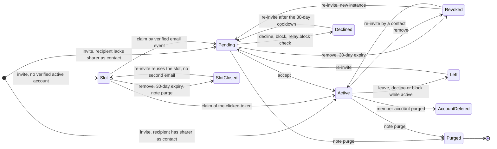
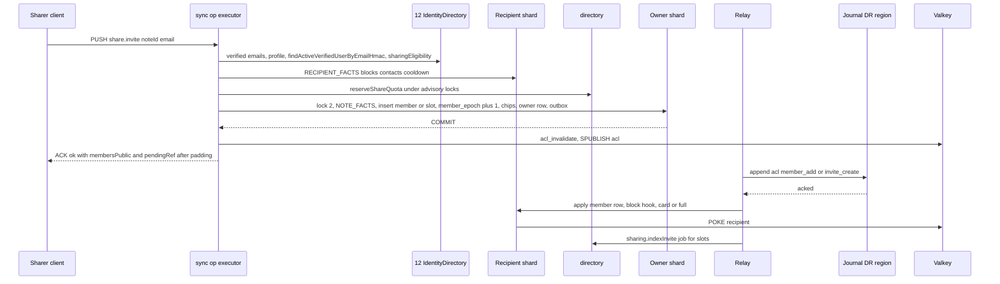
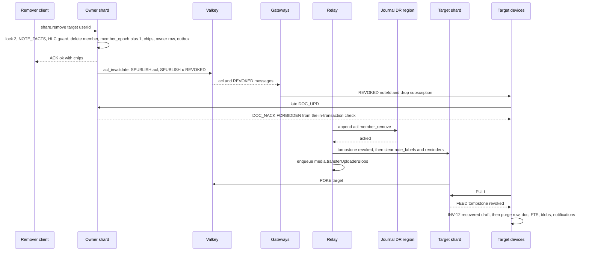

# 08 · Sharing and Authorization

*Detail doc 08 · elaborates spine v1.1 · 2026-10-04 · Status: draft for review (revision 2: aligned with 01, 03, 04, 12 and 13 as written)*

## 1. Purpose and scope

This document specifies `packages/authz`, the one authorization module that `api`, `sync` and `worker` use (D-28, X-05). It also specifies the sharing subsystem built on it. An engineer should be able to build all of the following from this document:

- the policy table, decision procedure, deny-code mapping and SQL fragments for every enforcement point;
- `defineNoteCommand`, the adapter that makes every note-scoped command run "lock, then check in a fresh statement" (INV-5) on top of 03's op executor;
- the read-authorization contract that 03's cache implements, including invalidation and revalidation rules;
- roles, the membership lifecycle and typed tombstones (P-04, INV-13);
- `share.invite`, email invites (HMAC, KMS, tokens, claim), contacts, blocks and the card-only pending inbox (P-15);
- the revocation and leave pipeline (P-01, P-02, spine §5.7);
- share-dialog privacy and sender and recipient caps (P-16);
- Make a copy (P-24);
- the ACL entries in the restore journal and their replay (D-45, INV-14), the abuse signals handed to 15, and the authorization fixture matrix (D-28, D-48).

**Out of scope** (owner in parentheses):

- Group-commit SQL and its isolation proofs, the op executor, the read cache implementation, the relay, `/sync/verify`, `/sync/reconcile` and the `fanout_outbox` payload schema (03). This document supplies the predicates and SQL they embed, the payloads its sharing ops emit, and one relay hook.
- Physical DDL, the restore-journal envelope and the restore runbook (13). §5 states the shapes 08 requires; 13 has adopted them.
- Sessions, JWTs, email normalization and HMAC, email verification, profiles, the account-deletion saga and SIWA (12). This document consumes 12's identity queries and `EmailVerifiedEvent`, and implements the saga steps 12 assigns to 08.
- Upload, renditions, ownership transfer, cross-scope copy and quota mechanics (10). This document triggers them.
- CSAM and Web Risk scanning, abuse operations, reputation policy and evidence storage (15). This document emits signals and enforces the restrictions 15 sets.
- The client purge path, recovered drafts, `blocked_on` scheduling and the local schema (04). Dialog visuals and copy decks (06, 07).
- Trash-register semantics and the purge transaction (03). Only the authorization of trash ops and their effect on members are covered here.
- Groups, families, link sharing, a viewer role and ownership transfer. P-04 excludes them.

## 2. Spine references

**Elaborated here:** D-28, INV-5, INV-13, P-01, P-02, P-04, P-15, P-16, P-24, X-05.

**Relied on:** INV-1, INV-3, INV-4, INV-6, INV-8, INV-12, INV-14, INV-15, INV-18; D-16, D-17, D-25, D-32, D-34, D-39, D-41, D-45, D-47, D-48, D-50; P-03, P-14, P-25, P-29; X-01, X-02, X-03, X-06, X-10, X-11, X-12, X-13, X-14, X-16, X-19, X-20; spine §4.2, §4.4, §5.3, §5.6, §5.7, §5.11; Q-01, Q-02, Q-09.

**Numbering.** Bare section numbers (§1–§22) are this document's. Spine sections are written "spine §x.y". Sibling sections are written "03 §x.y". Section numbers §4.6, §5.1–§5.4, §8.3 and §14, and the SI-n identifiers, are cited by 03, 12 and 13 and are kept stable from the first draft.

## 3. Vocabulary

| Term | Meaning |
|---|---|
| **Owner** | The note's creator. Fixed for life, with no transfer (P-04). Always an `active` member with role `owner` until purge. |
| **Writer** | Any other member. Can edit content, invite, and remove writers and pending entries, but never the owner (P-04). |
| **Active member** | `note_members.state = 'active'`. The only state that authorizes content, docs and media (INV-5). |
| **Pending member** | `note_members.state = 'pending_accept'`: an existing account that received a share from someone who is not in its contacts. Card only (P-15). |
| **Invite slot** | A share to an email address that has no verified, active account. The authoritative row is in `note_invite_slots` on the owner's shard; a global index row is in `directory.note_invites` (SI-1). |
| **pendingRef** | An opaque UUIDv7 that names a pending member or an invite slot. Chips show it instead of a user ID, so a chip never reveals whether an account exists (P-16). |
| **Sharer** | The member who issued an invite (`added_by` / `invited_by`). Not necessarily the owner. |
| **Contact** | A directed edge `user_contacts(user, other)`: `user` trusts `other`. Created only when a share is accepted (§9.1). It decides whether an incoming share is pending or active. |
| **Block** | A directed edge `user_blocks(user, other)`: `other` can no longer share with `user`. |
| **Card** | The only data a pending member's row holds: 01's `PendingCard` (kind, title ≤ 60, preview ≤ 140, facets) plus the sharer chip (D-32, P-15). |
| **Chip** | One `MemberChip` in `members_public` (§4.8): a name and avatar only for active members, and a masked email hint for everyone. |
| **`member_epoch`** | A per-note counter, incremented by exactly 1 on every membership or chip change (13 §8.2). It guards relay applies (D-32) and the read cache. A restore jumps it by 2^32 (spine §5.11). |
| **Typed tombstone** | `user_notes.removed_reason` ∈ `revoked`, `left`, `purged`, `account_deleted`, `declined`, `restore_lost` (INV-13). |
| **Rel** | The actor's relation to a note, as seen on the owner's shard: `owner`, `writer`, `pending` or `none`. |
| **Membership instance** | One lifetime of a `note_members` row, from insert to delete. A re-invite after removal creates a new instance with a higher `member_epoch`. |

## 4. `packages/authz`

### 4.1 Layout and layering

`packages/authz` is pure TypeScript. It imports nothing from Node, the DOM or React Native (X-19), so the same predicates run on clients and on the server (X-13). Code that touches Postgres, Valkey or KMS lives in `apps/server`.

```
packages/authz/
  src/types.ts         Rel, NoteFacts, Decision, DenyCode, OpName, PointId
  src/limits.ts        re-exports 01's LIMITS.MEMBERS_MAX, CARD_TITLE_MAX, CARD_PREVIEW_MAX; caps and TTLs (§16)
  src/policy.ts        POLICIES, accessDecision, evaluate, perUserDecision, canReadDoc   ← single source of truth
  src/predicates.ts    can.* for UI gating, client and server
  src/chips.ts         MemberChip, SharerChip, applyChipChange, buildMembersPublic, maskEmail
  src/redact.ts        PENDING_ROW_FIELDS, TOMBSTONE_ROW_FIELDS, redactUserNoteRow, projectionVariantFor
  src/sql/*.ts         SQL text only (no driver): facts, fragments, recipient facts
  fixtures/matrix.ts   fixture IDs, enforcement-point IDs, expected outcomes (§19.1)
apps/server/src/authz/
  note-command.ts      defineNoteCommand, runSystemNoteCommand (on 03's OpExecutor and withShardWrite)
  read.ts              readFacts, revalidateBatch (called by 03's ReadAuthzCache)
  publish.ts           publishAclChange
apps/server/src/sharing/
  invite.ts claim.ts respond.ts remove.ts leave.ts copy.ts caps.ts contacts.ts blocks.ts
  emails.ts            invite and share-notification emails, unsubscribe
  identity-events.ts   EmailVerifiedEvent handler; SharingAccountHooks for 12's saga
  apply-hook.ts        SharingApplyHook for 03's relay
  journal.ts           AclJournalEntry, acl.replay, acl.recount
  abuse.ts             signals, reports, restrictions
```

### 4.2 Core types

```ts
// packages/authz/src/types.ts
import type { UserId, NoteId, Hlc } from '@keep/domain';

export type Role = 'owner' | 'writer';
export type MemberState = 'active' | 'pending_accept';
export type InviteState = 'pending' | 'accepted';                       // user_notes.invite_state
export type RemovedReason =
  | 'revoked' | 'left' | 'purged' | 'account_deleted' | 'declined' | 'restore_lost';

/** The actor's relation as seen on the owner's shard. A removed member has no row there, so it is 'none'. */
export type Rel = { k: 'owner' } | { k: 'writer' } | { k: 'pending' } | { k: 'none' };

/** Read by NOTE_FACTS (§4.6) inside the command transaction, in a statement started after the lock (§4.5). */
export interface NoteFacts {
  exists: boolean;               // notes row present (a purged husk counts as present)
  ledgered: boolean;             // probed only when !exists: id in directory.deletion_ledger
  purged: boolean;               // notes.purged_at IS NOT NULL
  trashed: boolean;
  trashHlc: Hlc | null;
  ownerId: UserId | null;
  memberEpoch: bigint;
  memberCount: number;           // owner + active + pending + live slots (13 §3.2; ≤ 50)
  chips: MemberChip[];           // notes.members_public
  actor: Rel;
  actorAddedHlc: Hlc | null;
  actorStateHlc: Hlc | null;
  actorAddedBy: UserId | null;
  target?: TargetFacts;          // ops that name another principal
}

export interface TargetFacts {
  member?: { userId: UserId; userShard: number; role: Role; state: MemberState; addedHlc: Hlc;
             stateHlc: Hlc; addedBy: UserId | null; addedEpoch: bigint; shareRef: string | null };
  slot?:   { ref: string; emailHmac: Uint8Array; state: 'live' | 'revoked' | 'expired' | 'claimed';
             invitedHlc: Hlc; invitedBy: UserId | null; expiresAt: number };
}

export type DenyCode =
  | 'FORBIDDEN'       // not an active member (spine §5.3). Client: wait for the typed tombstone, then INV-12
  | 'NOTE_PURGED'     // terminal (INV-13)
  | 'NOTE_UNKNOWN'    // note not created yet, or per-user row not propagated yet. Retryable
  | 'INVALID'         // an active member asked for something its role forbids, or bad args: a client bug (SI-4)
  | 'SHARE_REFUSED'   // share.invite only (P-16)
  | 'RATE_LIMITED'    // budget exceeded (X-12). Retryable
  | 'RETRY_LATER';    // dependency unavailable: shard fenced, directory or KMS down. Retryable

/** Sent to the sharer only for facts about the sharer or the note, never about the recipient (P-16, SI-4). */
export type ShareRefusedDetail =
  | 'note_full' | 'sender_unverified' | 'sender_cap' | 'sender_restricted' | 'unavailable';

/** Internal reason. Logs and metric labels only (X-01), never on the wire. */
export type DenyWhy =
  | 'not_member' | 'pending' | 'note_absent' | 'ledgered' | 'purged' | 'tombstoned'
  | 'role' | 'target_owner' | 'bad_args'
  | 'recipient_sharing_off' | 'recipient_blocked' | 'recipient_cap' | 'recipient_cooldown'
  | 'sender_unverified' | 'sender_cap' | 'sender_restricted' | 'note_full' | 'flag_off' | 'dependency';

export type Decision =
  | { ok: true }
  | { ok: false; code: DenyCode; detail?: ShareRefusedDetail; why: DenyWhy };

export type GuardOutcome = 'apply' | 'stale' | 'noop';

export type OpName =
  | 'doc.append' | 'note.create' | 'note.setTrashed' | 'note.deleteForever' | 'trash.empty'
  | 'note.leave' | 'note.copy' | 'share.invite' | 'share.remove' | 'share.respond'
  | 'peruser.note'                                           // setOverlay, noteLabel.set, reminder.*
  | 'media.commit' | 'read.doc' | 'read.media'
  | 'sys.invite.claim' | 'sys.invite.expire' | 'sys.member.expirePending' | 'sys.member.autoDecline'
  | 'sys.member.removeForAccount' | 'sys.chips.refresh' | 'sys.acl.replay' | 'sys.acl.recount'
  | 'sys.invites.close';

export type Actor =
  | { kind: 'user'; userId: UserId; userShard: number; deviceId: string; sid: string }
  | { kind: 'system'; job: SystemJob }
  | { kind: 'admin'; operator: string; breakGlassTicket: string };   // read-only and audited (X-16)

export type SystemJob =
  | 'claim' | 'expiry' | 'auto_decline' | 'account_deletion' | 'chips_refresh' | 'restore_replay' | 'purge';
```

`user_id` always comes from the verified token or the system context, never from a payload (spine §5.7). An account that is not `active` never reaches authz: 12 refuses token minting for `pending_deletion` and later states, and the per-sid denylist cuts existing sessions (12 §12.1; fixture F12).

### 4.3 Policy table

This table is the normative policy. `src/policy.ts` encodes it as data, §4.4 evaluates it, and §19.1 tests every row at every enforcement point. "Lock 2" is the note's `note_log_state` row `FOR UPDATE`, taken through 03's `lockNotes` (03 §5.1).

| Op | Runs on (lane) | Lock | Actor must be | Note must be | Guard / idempotency | Implemented in | Spine |
|---|---|---|---|---|---|---|---|
| `doc.append` (`DOC_UPD`, `/sync/push` content, import, compactor) | Owner shard, group commit | Lock 2, batched, sorted | Active owner or writer; or the server principal (`author_id IS NULL`, `worker` only) | Exists, not purged. Trashed and over-limit are accepted | Yjs idempotence | 03 §5.3, fragment §4.6 | INV-4, INV-5 |
| `note.create` | Actor's home shard | Fence only | Any user; `shardOf(id) = home shard` | Not ledgered | Insert-if-absent, owner check | 03 | spine §5.3, X-04 |
| `peruser.note` (`setOverlay`, `noteLabel.set`, `reminder.*`) | Actor's shard | `user_notes` row `FOR SHARE` | Row present, `invite_state = 'accepted'`, not tombstoned | — | HLC per field (D-16) | 03, 09, decision `perUserDecision` | spine §5.3, D-28 |
| `note.setTrashed` | Owner shard | Lock 2 | Owner | Not purged | `hlc > trash_hlc` | 03, decision `evaluate` | P-02, P-03 |
| `note.deleteForever`, `trash.empty` | Owner shard | Lock 2, sorted | Owner | Trashed; already purged → `ok` no-op | CAS on `trash_hlc` | 03, decision `evaluate` | P-03, D-17 |
| `note.leave` | Owner shard | Lock 2 | Writer. Pending → treated as decline. No row → `noop` | Exists | `hlc > added_hlc` | 08 §10.3 | P-01 |
| `share.invite` | Owner shard, plus `prepare` (§7.2) | Lock 2 | Active owner or writer, verified email, not suspended | Exists, not purged (trashed allowed) | Unique `(note, user)` / `(note, email_hmac)` | 08 §7 | P-04, P-15, P-16 |
| `share.remove` | Owner shard | Lock 2 | Active owner or writer; target is not the owner | Not purged | `hlc > target.added_hlc` or `> slot.invited_hlc` | 08 §10.2 | P-04, spine §5.7 |
| `share.respond` | Owner shard | Lock 2 | The recipient: pending (accept, decline, block) or active (decline or block = leave). No row → `stale` / `noop` | Not purged | State transition; `hlc > state_hlc` for active | 08 §9.3 | P-15 |
| `note.copy` | Copier's home shard; source check in its own transaction on the source owner's shard (SI-10) | Source lock 2 in the check transaction | Active owner or writer of the source | Source exists, not purged; `newId` not ledgered | Insert-if-absent on `newId` | 08 §13 | P-24 |
| `media.commit` | Note's shard | Lock 2 | Active owner or writer | Not purged | 10 | 10, via `defineNoteCommand` | INV-13, D-39 |
| `sys.*` (claim, expiry, auto-decline, account removal, chip refresh, journal replay, invite close) | Owner shard | Lock 2 | `system` | Per command (§8–§10, §14) | `member_epoch`, `added_epoch`, slot state, HLC | 08 | spine §5.7, §5.11 |
| `read.doc` (`DOC_SUB`, `DOC_FETCH`, `/sync/docs`, `/sync/reconcile`) | Gateway, api | Read cache (§4.7) | Active owner or writer | Exists, not purged | — | 03 §4.7, decision `canReadDoc` | D-28 |
| `read.media` (`media.urls`) | api | Read cache | Active owner or writer | Not purged | Signed URL TTL 15 min | 10, decision `canReadDoc` | D-39 |
| Feed, bootstrap, inline tails, server search, export | Actor's shard | None: rows keyed by user | The row's own user | — | Redaction (§4.9) | 03, 11, 12 | spine §5.5, P-15 |
| `sharing.*` oRPC (suggest, contacts, blocks, report, invites) | Actor's shard or directory | None | Self | — | §9.5 | 08 | P-15, P-16 |

Writers cannot trash, restore, delete forever or empty trash (P-02). No op changes a role: there are only two roles and the owner is fixed (P-04).

### 4.4 Decision procedure and deny mapping

`FORBIDDEN` and `NOTE_PURGED` send a client into its purge-wait path (spine §5.6). They must therefore mean "this actor really has no access". A role violation by an active member is a client bug. It returns `INVALID`, which goes to the visible dead-letter list and never purges a note the user still has (SI-4).

```ts
// packages/authz/src/policy.ts
export interface Policy {
  allowPending?: boolean;    // share.respond, note.leave
  allowNone?: boolean;       // share.respond, note.leave: no member row → guard answers noop/stale
  ownerOnly?: boolean;       // setTrashed, deleteForever, trash.empty
  writerOnly?: boolean;      // note.leave
  recipientOnly?: boolean;   // share.respond: the owner has nothing to respond to
  targetNotOwner?: boolean;  // share.remove
}

export function accessDecision(f: NoteFacts, p: Policy = {}): Decision {
  if (!f.exists) return f.ledgered ? deny('NOTE_PURGED', 'ledgered') : deny('NOTE_UNKNOWN', 'note_absent');
  if (f.purged) return deny('NOTE_PURGED', 'purged');
  switch (f.actor.k) {
    case 'owner': case 'writer': return ALLOW;
    case 'pending': return p.allowPending ? ALLOW : deny('FORBIDDEN', 'pending');
    case 'none':    return p.allowNone ? ALLOW : deny('FORBIDDEN', 'not_member');
  }
}

export function evaluate(op: OpName, f: NoteFacts): Decision {
  const p = POLICIES[op];
  const access = accessDecision(f, p);
  if (!access.ok) return access;
  if (p.ownerOnly && f.actor.k !== 'owner') return deny('INVALID', 'role');
  if (p.writerOnly && f.actor.k === 'owner') return deny('INVALID', 'role');   // the owner cannot leave
  if (p.recipientOnly && f.actor.k === 'owner') return deny('INVALID', 'role');
  if (p.targetNotOwner && f.target?.member?.role === 'owner') return deny('INVALID', 'target_owner');
  return ALLOW;
}

/** Per-user ops (spine §5.3): decided from the actor's own user_notes row, read FOR SHARE. */
export function perUserDecision(
  row: { invite_state: InviteState; removed_reason: RemovedReason | null } | null,
): Decision {
  if (!row) return deny('NOTE_UNKNOWN', 'note_absent');                 // not propagated yet
  if (row.removed_reason) return deny('FORBIDDEN', 'tombstoned');      // "a typed tombstone means FORBIDDEN"
  if (row.invite_state === 'pending') return deny('NOTE_UNKNOWN', 'pending');
  return ALLOW;
}
```

| Facts on the owner shard | Content append, reads, note-scoped ops | `share.respond`, `note.leave` | Per-user ops (actor's row) |
|---|---|---|---|
| Lock row absent, ledgered; or note purged | `NOTE_PURGED` | `NOTE_PURGED` | Tombstone → `FORBIDDEN` |
| Lock row absent, not ledgered | `NOTE_UNKNOWN` | `NOTE_UNKNOWN` | Row absent → `NOTE_UNKNOWN` |
| Actor pending | `FORBIDDEN` (matches 03 §5.5) | Allowed | `NOTE_UNKNOWN` |
| Actor has no row (stranger or removed) | `FORBIDDEN` | Guard: `noop` / `stale` | Tombstone → `FORBIDDEN`; absent → `NOTE_UNKNOWN` |
| Active, wrong role or bad target | `INVALID` | `INVALID` | — |
| Active, right role | Guard: `apply` / `stale` / `noop` | Guard | HLC per field |

A pending client holds no doc, so it never has content to send. UI gating (`can.*`, §4.10) and 04's `blocked_on` keep it from sending any other op. If one is sent anyway, `FORBIDDEN` is harmless: the client waits for a tombstone that never comes, and after 10 minutes `/sync/verify` returns the pending card (assumption on 03, §20). Shard fences and dependency failures map to `RETRY_LATER` (03 §5.5).

### 4.5 Note-command executor

Every note-scoped command declared in 08 or 10 is built with `defineNoteCommand`. It produces 03's `OpHandler` (03 §5.7.1). 03's executor opens the transaction, takes the shard fence (lock 1) and the note's lock row (lock 2), then calls `run`. `run` reads the facts with `NOTE_FACTS` as its **first statement**. That statement starts after lock 2 is held, so a revocation or purge that committed earlier is always visible, and none can commit until this transaction ends (INV-5, 03 §5.4 Claim A). A handler has no other way to read membership: the facts object is its only input.

```ts
// apps/server/src/authz/note-command.ts
export interface NoteCommandSpec<A, P, R> {
  op: OpName;
  argsSchema: ZodType<A>;                                   // shapes owned by 02
  noteId(args: A): NoteId;                                  // the note whose lock row is taken (lane = its shard)
  /** Runs BEFORE the transaction: cross-cluster reads, directory transactions, KMS. Never holds lock 2. */
  prepare?(args: A, actor: Actor & { kind: 'user' }): Promise<Prepared<P>>;
  target?(args: A, prep: P): { userId?: UserId; pendingRef?: string; emailHmac?: Uint8Array };
  guard?(f: NoteFacts, args: A, prep: P, hlc: Hlc | null): GuardOutcome;
  apply(tx: LockedNoteTx, f: NoteFacts, args: A, prep: P, ctx: NoteCmdCtx): Promise<OpResultOk<R>>;
}

export type Prepared<P> =
  | { ok: true; prep: P }
  | { ok: false; result: OpResult };                        // early refusal or idempotent no-op

export interface NoteCmdCtx {
  actor: Actor;
  hlc: Hlc | null;                       // the op's clamped HLC (INV-15); null for system commands
  serverHlc(): Hlc;
  emit: FanoutEmitter;                   // 03 §8.2 builders bound to this transaction
  applyOwnerRow(groups: MemberGroups): Promise<void>;   // 03's applyMemberPayload for the owner's row, in-tx (D-32)
  afterCommit(fn: () => Promise<void>): void;            // awaited by 03 before the ACK is sent
  refuse(detail: ShareRefusedDetail, why: DenyWhy): never;
}

/** Produces 03's OpHandler. 03 calls prepare() before BEGIN (assumption on 03, §20). */
export function defineNoteCommand<A, P, R>(spec: NoteCommandSpec<A, P, R>): OpHandler<A>;

/** Same body for worker-side commands: 03's withShardWrite + lockNotes, then NOTE_FACTS, then apply. */
export function runSystemNoteCommand<A, P, R>(
  spec: NoteCommandSpec<A, P, R>, noteId: NoteId, args: A, prep: P, job: SystemJob,
): Promise<OpResult>;
```

The `run` body that `defineNoteCommand` generates:

```ts
async run(ctx03: OpContext, args: A, hlc: Hlc, prep: P): Promise<OpResult> {
  const shard = shardOf(spec.noteId(args));
  const t = spec.target?.(args, prep) ?? {};
  // First statement after 03's lockNotes: a fresh READ COMMITTED snapshot (INV-5).
  const row = await ctx03.tx.maybeOne(SQL.NOTE_FACTS,
      [shard, spec.noteId(args), actorUserId(ctx03), t.userId ?? null, t.pendingRef ?? null, t.emailHmac ?? null]);
  const f = row ? toFacts(row) : await absentFacts(ctx03.tx, spec.noteId(args));   // ledger probe
  const d = isSystem(ctx03) ? systemPrecheck(spec.op, f) : evaluate(spec.op, f);
  if (!d.ok) return rejected(d);
  const g = spec.guard?.(f, args, prep, hlc) ?? 'apply';
  if (g === 'stale') return { status: 'stale', hlc, row: await currentRowImage(ctx03.tx, f, ctx03) };
  if (g === 'noop')  return { status: 'ok', hlc, row: membershipImage(f) };
  return spec.apply(asLocked(ctx03.tx, shard, spec.noteId(args)), f, args, prep, wrap(ctx03, hlc));
}
```

Rules:

1. **One note per command.** `trash.empty` is 03's and locks up to 500 rows in sorted order. No 08 command locks more than one note.
2. **Lock mode is always `FOR UPDATE`** (03's `lockNotes`). Commands that only read the ACL, such as the copy source check and `media.commit`, use it too. They hold the lock for a few milliseconds, and one mode keeps 03's lock order (03 §5.1 R1) simple.
3. **No cross-cluster work while lock 2 is held.** Directory transactions, recipient-shard reads, KMS and profile lookups run in `prepare`. Their results are advisory, except the cap reservation (§12) and anything rechecked under the lock.
4. **The purged husk keeps its `note_log_state` row** for 90 days (13 §3.2), so a purged note still locks and answers `NOTE_PURGED`. After husk GC, the ledger probe answers.
5. **System commands skip `evaluate` but not the lock or the facts.** `systemPrecheck` refuses a purged or absent note for every `sys.*` command except `sys.acl.replay` (which parks, §14) and `sys.invites.close` (which runs on purged notes by design).
6. **After-commit hooks** run after `COMMIT` returns and before the ACK. They are best-effort. Losing one costs at most the read-cache TTL (§4.7), never write correctness.
7. **Admin actors** may run only read commands. Each use writes an audit record with the ticket ID (X-16, consumed by 15).

### 4.6 SQL fragments (exported text)

`packages/authz/src/sql/` exports SQL as plain strings with fixed positional parameters and fixed aliases. 03, 10, 11 and 12 use these strings and do not re-type the logic. §4.11 checks this in CI.

```sql
-- NOTE_FACTS · owner shard · first statement after lock 2
-- $1 shard, $2 note, $3 actor user (NULL for system), $4 target user, $5 target pendingRef, $6 target email_hmac
SELECT n.owner_id, n.purged_at IS NOT NULL AS purged, n.trash_state AS trashed, n.trash_hlc,
       n.member_epoch, n.member_count, coalesce(n.members_public, '[]'::jsonb) AS chips,
       a.role AS a_role, a.state AS a_state, a.added_hlc AS a_added_hlc, a.state_hlc AS a_state_hlc,
       a.added_by AS a_added_by,
       t.user_id AS t_user, t.user_shard AS t_shard, t.role AS t_role, t.state AS t_state,
       t.added_hlc AS t_added_hlc, t.state_hlc AS t_state_hlc, t.added_by AS t_added_by,
       t.added_epoch AS t_added_epoch, t.share_ref AS t_ref,
       s.ref AS s_ref, s.email_hmac AS s_hmac, s.state AS s_state, s.invited_hlc AS s_hlc,
       s.invited_by AS s_by, s.expires_at AS s_expires
FROM notes n
LEFT JOIN note_members a ON (a.shard_id, a.note_id, a.user_id) = (n.shard_id, n.id, $3)
LEFT JOIN LATERAL (
  SELECT * FROM note_members t
  WHERE (t.shard_id, t.note_id) = (n.shard_id, n.id)
    AND (t.user_id = $4 OR ($5::uuid IS NOT NULL AND t.share_ref = $5))
  ORDER BY (t.user_id = $4) DESC NULLS LAST LIMIT 1) t ON true
LEFT JOIN LATERAL (
  SELECT * FROM note_invite_slots s
  WHERE (s.shard_id, s.note_id) = (n.shard_id, n.id)
    AND (($5::uuid IS NOT NULL AND s.ref = $5) OR ($6::bytea IS NOT NULL AND s.email_hmac = $6))
  LIMIT 1) s ON true
WHERE (n.shard_id, n.id) = ($1, $2);

-- NOTE_LEDGERED · $1 note
SELECT 1 FROM directory.deletion_ledger WHERE kind = 'note' AND id = $1;
```

A removed actor has no member row on the owner's shard. It reads as `none` and maps to `FORBIDDEN`, the same code a typed tombstone gets.

**Append filter** embedded by 03's group commit (statement 2, CTE `allowed`). The input alias is `i`. `NOT_PURGED_N` is used in the `live` CTE with alias `n`:

```ts
// packages/authz/src/sql/fragments.ts
export function appendAllowedSql(serverPrincipalParam: string): string {
  return `(
    (i.author_id IS NULL AND ${serverPrincipalParam}::boolean)
    OR EXISTS (SELECT 1 FROM note_members m
               WHERE (m.shard_id, m.note_id, m.user_id) = (i.shard_id, i.note_id, i.author_id)
                 AND m.state = 'active' AND m.role IN ('owner', 'writer'))
  )`;
}
export const NOT_PURGED_N = `n.purged_at IS NULL`;
```

The first disjunct admits server-principal appends (the compactor and import; 03 S-12). 03's `Appender` asserts that `principal: 'server'` exists only in `worker` processes, so no client frame can reach it. The copy seed of Make a copy is not a server append: it is the copier's own `DOC_UPD` to a note the copier owns (§13).

**Denial resolution** for items missing from the group-commit result is 03 §5.5. Its decision table is the `accessDecision` mapping above, and §4.11 checks that they agree.

**Per-user ops** (actor's shard; 03 §5.7.3, 09):

```sql
-- USER_NOTE_FOR_SHARE · $1 actor shard, $2 actor, $3 note
SELECT invite_state, removed_reason FROM user_notes
WHERE shard_id = $1 AND user_id = $2 AND note_id = $3
FOR SHARE;
```

**Read path** (cache fill, revalidation; called by 03's `ReadAuthzCache`):

```sql
-- READ_FACTS · owner's cluster · $1 shard, $2 note, $3 user
SELECT n.member_epoch, n.purged_at IS NOT NULL AS purged, m.state, m.role
FROM notes n
LEFT JOIN note_members m ON (m.shard_id, m.note_id, m.user_id) = (n.shard_id, n.id, $3)
WHERE (n.shard_id, n.id) = ($1, $2);
-- no row → probe NOTE_LEDGERED → NOTE_PURGED or NOTE_UNKNOWN

-- REVALIDATE_BATCH · one cluster · ≤ 1,000 tuples · returns the ordinals to DROP
SELECT k.ord
FROM unnest($1::smallint[], $2::uuid[], $3::uuid[]) WITH ORDINALITY AS k(shard_id, note_id, user_id, ord)
WHERE NOT EXISTS (
  SELECT 1 FROM notes n
  JOIN note_members m ON (m.shard_id, m.note_id) = (n.shard_id, n.id)
  WHERE (n.shard_id, n.id) = (k.shard_id, k.note_id) AND n.purged_at IS NULL
    AND m.user_id = k.user_id AND m.state = 'active');
```

**Visibility predicate** for server search (11) and export (12, P-29), alias `u` on `user_notes`:

```ts
export const USER_NOTE_VISIBLE_U = `(u.removed_at IS NULL AND u.invite_state = 'accepted')`;
```

**Recipient facts** for `share.invite` (§7.2), on the recipient's shard. **Sender knows recipient**, on the sender's shard:

```sql
-- RECIPIENT_FACTS · $1 recipient shard, $2 recipient, $3 sender, $4 note
SELECT
  EXISTS (SELECT 1 FROM user_blocks   WHERE shard_id = $1 AND user_id = $2 AND other_id = $3) AS blocked,
  EXISTS (SELECT 1 FROM user_contacts WHERE shard_id = $1 AND user_id = $2 AND other_id = $3) AS knows_sender,
  EXISTS (SELECT 1 FROM user_notes
          WHERE shard_id = $1 AND user_id = $2 AND note_id = $4
            AND removed_reason = 'declined' AND removed_at > now() - interval '30 days') AS declined_recently;

-- SENDER_KNOWS · $1 sender shard, $2 sender, $3 recipient
SELECT EXISTS (SELECT 1 FROM user_contacts WHERE shard_id = $1 AND user_id = $2 AND other_id = $3);
```

### 4.7 Read authorization contract

Reads (`DOC_SUB`, `DOC_FETCH`, `/sync/docs`, `/sync/reconcile`, `media.urls`) use a cache (D-28). Writes never do (INV-5, X-05). 03 implements the cache (`ReadAuthzCache`, 03 §4.7: node LRU of 100k entries plus the Valkey hash `acl:{n:<noteId>}`). 08 owns the decision and the rules the cache must satisfy.

```ts
// packages/authz/src/policy.ts
export interface ReadFacts { exists: boolean; ledgered: boolean; purged: boolean;
                             memberEpoch: bigint | null; state: MemberState | null; role: Role | null }
export type ReadDecision =
  | { allow: true; role: Role; memberEpoch: bigint }
  | { allow: false; code: 'FORBIDDEN' | 'NOTE_PURGED' | 'NOTE_UNKNOWN'; memberEpoch: bigint | null };

export function canReadDoc(r: ReadFacts): ReadDecision {
  if (!r.exists) return { allow: false, code: r.ledgered ? 'NOTE_PURGED' : 'NOTE_UNKNOWN', memberEpoch: null };
  if (r.purged) return { allow: false, code: 'NOTE_PURGED', memberEpoch: r.memberEpoch };
  if (r.state === 'active' && r.role) return { allow: true, role: r.role, memberEpoch: r.memberEpoch! };
  return { allow: false, code: 'FORBIDDEN', memberEpoch: r.memberEpoch };   // none or pending (P-15)
}
```

| Rule | Requirement on the cache | Why |
|---|---|---|
| RC-1 | An `allow` entry lives at most 60 s at every level | Bounds read access after a revocation whose invalidation was lost (D-28) |
| RC-2 | A `FORBIDDEN` or `NOTE_UNKNOWN` entry lives at most 10 s (03's degraded TTL already is) | A new member (accept, contact share, claim) is never locked out for long if an invalidation is lost |
| RC-3 | `NOTE_PURGED` may be cached for 1 h | Terminal (INV-13) |
| RC-4 | **Epoch-guarded fill.** A fill computed from `READ_FACTS` carries the `member_epoch` it read. It must not overwrite an entry or a tombstone marker with a higher epoch. The Valkey hash keeps field `_e` (the highest epoch seen), and fills and invalidations use the scripts below | Without it, a fill that read before a revocation and wrote after its invalidation re-inserts a stale `allow` for up to 60 s |
| RC-5 | The membership writer invalidates after commit: run `acl_invalidate` with the new epoch, then `SPUBLISH {acl:<noteId>}` (`publishAclChange`, §10.1). The relay repeats both when it applies (03 §8.3 step 6). Both are idempotent | Spine §5.7 step 2 |
| RC-6 | On `{acl:<noteId>}`, every gateway process drops its LRU entries for the note and re-checks each local subscription with `READ_FACTS`; failures get `REVOKED{noteId, reason}` | Spine §5.7 step 3 |
| RC-7 | Every live subscription is revalidated every 60 s, and immediately after a Valkey reconnect, with `REVALIDATE_BATCH` | D-28, F14 of the spine |
| RC-8 | If the database is unreachable on a miss, the answer is `RETRY_LATER`. The cache never fails open | X-05 |

```lua
-- acl_fill · KEYS[1] = acl:{n:<noteId>} · ARGV = userId, value, epoch, ttlSeconds
local e = tonumber(redis.call('HGET', KEYS[1], '_e') or '-1')
local mine = tonumber(ARGV[3])
if mine < e then return 0 end
if mine > e then redis.call('DEL', KEYS[1]); redis.call('HSET', KEYS[1], '_e', ARGV[3]) end
redis.call('HSET', KEYS[1], ARGV[1], ARGV[2] .. ':' .. ARGV[3])
redis.call('EXPIRE', KEYS[1], 60, 'NX')
return 1

-- acl_invalidate · KEYS[1] · ARGV[1] = new epoch
local e = tonumber(redis.call('HGET', KEYS[1], '_e') or '-1')
if tonumber(ARGV[1]) <= e then return 0 end
redis.call('DEL', KEYS[1]); redis.call('HSET', KEYS[1], '_e', ARGV[1]); redis.call('EXPIRE', KEYS[1], 60)
return 1
```

Valkey applies a single TTL per key, so per-field deny lifetimes (RC-2) are enforced by storing `expiresAtMs` in the value and treating an expired field as a miss. Epochs fit Lua doubles exactly (< 2^53 even after several 2^32 restore jumps). The node LRU follows the same rule: it remembers the highest epoch it has seen per note for 60 s and drops older fills.

**`REVOKED.reason`** is taken from the fresh facts: `purged` if the note is purged, otherwise `revoked`. The precise reason arrives with the typed feed tombstone (INV-13).

### 4.8 Member chips (`members_public`)

Chips are relational ACL state, never doc state (INV-8, X-20). Every membership-changing transaction updates them incrementally, stores them in `notes.members_public` and the owner's `user_notes` row, and fans them out to active members in the membership group, guarded by `member_epoch` (D-32). A pending member's row holds exactly one chip: the sharer's (§4.9).

```ts
// packages/authz/src/chips.ts
export interface MemberChip {
  ref: string;               // userId for kind 'user'; pendingRef for kind 'pending'
  kind: 'user' | 'pending';
  role: Role;                // 'owner' only on the owner's chip; pending entries are 'writer'
  name?: string;             // kind 'user' only; ≤ 64 graphemes, plain text, from 12's profile
  avatar?: string;           // kind 'user' only; 12's opaque avatar reference
  hint: string;              // masked email, e.g. "j•••@acme.com" (never the raw address, spine §5.7)
  at: number;                // ms UTC: joined (user) or invited (pending)
  pendingDeletion?: true;    // owner chip only, during the P-25 grace period (12 §12.2)
}
/** The sharer shown on a pending card (P-15). 03's MembershipGroup.sharedBy carries it. */
export interface SharerChip { userId: UserId; name: string; hint: string }

export type ChipChange =
  | { add: MemberChip }
  | { remove: string /* ref */ }
  | { replace: { ref: string; with: MemberChip } }    // e.g. a pending chip (ref = share_ref) becomes a user chip on accept
  | { ownerPendingDeletion: boolean };
/** Pure: owner first, then active writers by `at`, then pending entries by `at`; ≤ 50 chips. */
export function applyChipChange(prev: readonly MemberChip[], c: ChipChange): MemberChip[];
/** Full rebuild from rows plus profiles, used only by sys.chips.refresh and sys.acl.recount. */
export function buildMembersPublic(rows: MemberRows, profiles: ProfileMap): MemberChip[];

export function maskEmail(norm: EmailNorm): string {
  const at = norm.lastIndexOf('@');
  const first = [...new Intl.Segmenter().segment(norm.slice(0, at))][0]?.segment ?? '';
  return `${first}•••@${norm.slice(at + 1)}`;
}
```

A pending member (existing account) and an email invite produce identical chips: the same `kind`, an opaque `ref`, and a hint built from the address the sharer typed. No member, the sharer included, can tell from a chip whether the address has an account (P-16). After acceptance the chip becomes `kind: 'user'` with a name and avatar, so the account is revealed only after its holder consented.

Incremental changes need only the profile of the principal being added. `prepare` fetches it (§7.2), so no command reads the directory while holding lock 2. Names and avatars of existing chips change only through `sys.chips.refresh` (§10.7).

### 4.9 Redaction: card-only rows

The relay writes only the card for pending rows (D-32), and every read path re-checks `invite_state` (spine §5.5, §5.7). 13's `user_notes` CHECK constraints enforce the same thing in the database (13 §3.7). The allowlists live here, so 03's feed serializer, bootstrap and tail inliner, and 11's search share one definition.

```ts
// packages/authz/src/redact.ts
export const PENDING_ROW_FIELDS = [
  'note_id', 'note_shard', 'role', 'invite_state', 'shared_by_unknown', 'shared_by', 'shared_at',
  'kind', 'title', 'preview', 'facets', 'members_public', 'created_at', 'trashed_at',
  'member_epoch', 'usn',
] as const;
// title, preview, facets hold 01's PendingCard values; members_public holds exactly [sharerChip as MemberChip].

export const TOMBSTONE_ROW_FIELDS =
  ['note_id', 'note_shard', 'usn', 'removed_reason', 'removed_at', 'member_epoch'] as const;

export function projectionVariantFor(s: MemberState): 'card' | 'full' {
  return s === 'active' ? 'full' : 'card';
}

/** Feed, bootstrap and /sync/pull serializers call this on every user_notes row before encoding. */
export function redactUserNoteRow(row: UserNoteRow): WireUserNoteRow {
  if (row.removed_reason) return pick(row, TOMBSTONE_ROW_FIELDS);
  if (row.invite_state === 'pending') return pick(row, PENDING_ROW_FIELDS);   // no seq fields → no tails
  return row;
}
```

| Path | Rule |
|---|---|
| Relay apply (03 §8.4) | A `projection.card` group applies only to a row whose stored `invite_state` is `pending`, and `projection.full` and `seq` groups only to `accepted`. Under any reordering, no content field reaches a pending row (SP-02). The membership group of an accept carries `inviteState: 'accepted'` and is applied before the projection group of the same payload |
| Fan-out at compaction and session start (03) | Variant per member from `projectionVariantFor(note_members.state)`. Pending members get 01's `cardProjection(projection)`. Session-start `seq` rows go only to active members (03 §5.3 statement 3) |
| Feed `PULL`, bootstrap, `/sync/pull` (03) | `redactUserNoteRow` on every row |
| Inline tails (03) | Never for pending or tombstoned rows. They have no seq fields to anchor a tail |
| Server search (11), export (12) | `USER_NOTE_VISIBLE_U`. Pending rows also have no `search_text` (13 CHECK) |
| Client FTS (04) | Never indexes a pending row (P-15) |
| Pending card rendering (06, 07) | Title and preview as plain text, with no link detection (anti-phishing, R-09) |

### 4.10 Client predicates

Clients gate UI with the same functions the server uses (X-13), derived from the local `note` row (04: `role`, `pending_accept`, `trashed_at`, `deleted`, `restore_lost`).

```ts
// packages/authz/src/predicates.ts
export function relFromLocal(n: { role: Role; pending_accept: boolean; deleted: boolean }): Rel;

export const can = {
  editContent:  (r: Rel, n: { trashed: boolean }) => (r.k === 'owner' || r.k === 'writer') && !n.trashed, // P-03
  trash:        (r: Rel) => r.k === 'owner',                                                           // P-02
  deleteAction: (r: Rel): 'trash' | 'leave' | 'decline' | null =>                                       // P-01, P-02
                  r.k === 'owner' ? 'trash' : r.k === 'writer' ? 'leave' : r.k === 'pending' ? 'decline' : null,
  openShareDialog: (r: Rel) => r.k === 'owner' || r.k === 'writer',
  invite:       (r: Rel, memberCount: number, senderVerified: boolean) =>
                  (r.k === 'owner' || r.k === 'writer') && memberCount < LIMITS.MEMBERS_MAX && senderVerified,
  removeChip:   (r: Rel, chip: MemberChip, selfId: UserId) =>
                  (r.k === 'owner' || r.k === 'writer') && chip.role !== 'owner' && chip.ref !== selfId,
  copy:         (r: Rel, n: { hydrated: boolean; online: boolean }) =>
                  (r.k === 'owner' || r.k === 'writer') && (n.hydrated || n.online),                    // P-24, §13
  copyFromLocal:(n: { restoreLost: boolean }) => n.restoreLost,                                          // INV-13
  respond:      (r: Rel) => r.k === 'pending',
  perUserOps:   (r: Rel) => r.k === 'owner' || r.k === 'writer',
} as const;
```

**Bulk delete** of a mixed selection applies `deleteAction` per note behind one confirmation: "N notes will move to Trash. M shared notes will be removed from your notes; others keep them."

### 4.11 Conformance guards

| Guard | Mechanism |
|---|---|
| Every 08 and 10 note-scoped handler goes through `defineNoteCommand` | The op registry's type accepts only handlers built by it. A dependency-cruiser rule forbids importing the DB driver in `apps/server/src/sharing/**` except through `authz/note-command.ts` and `prepare` helpers |
| 03's handlers for trash ops call `evaluate` | A unit test runs 03's handlers against fixtures F02 and F09 and expects `INVALID` |
| 03's group commit embeds `appendAllowedSql` and `NOT_PURGED_N` | A unit test renders 03's statement-2 SQL and asserts that it contains both strings verbatim |
| 03's NACK resolution table equals `accessDecision` | A table-driven test feeds every fact combination to both and compares the codes |
| Feed, bootstrap and tail serializers call `redactUserNoteRow` | Fixture cells E15–E17 fail if a pending row exposes any field outside `PENDING_ROW_FIELDS` |
| No authz decision in view code | Lint: `evaluate` and `sql/*` are banned outside `apps/server`. Clients may import only `predicates`, `chips`, `redact` types and `limits` |
| Golden outputs | `evaluate`, `accessDecision`, `perUserDecision`, `canReadDoc`, `can.*`, `applyChipChange` and `maskEmail` are golden-tested on the web, Hermes and Node builds (X-13) |

## 5. Data model for sharing

13 owns the DDL and has adopted these shapes (13 §2.2, §3.5, §3.7, §3.10). This section states what 08 requires. Columns added to the spine's list are marked **+** (SI-8). HLCs are 21-character strings compared bytewise (13's `keep.hlc`).

### 5.1 Owner shard

`note_members` (13 §3.5): `shard_id`, `note_id`, `user_id`, `user_shard`, `role` (`owner` / `writer`), `state` (`active` / `pending_accept`), `added_by`, `added_hlc`, **+** `state_hlc` (HLC of the last state transition; guards `share.respond`), `added_at`, **+** `added_epoch` (`member_epoch` at insert; identifies the membership instance), **+** `share_ref` (pendingRef; unique per note when set), **+** `hint` (masked address the sharer typed). Indexes: `note_members_ref`, `note_members_pending_age (added_at) WHERE state = 'pending_accept'`, `note_members_by_user (user_id)`.

`note_invite_slots` (**+**, 13 §3.5, SI-1): primary key `(shard_id, note_id, email_hmac)`; `hmac_v`, `ref` (stable across re-invites; equals `directory.note_invites.id`), `state` (`live` / `revoked` / `expired` / `claimed`), `invited_by`, `invited_hlc`, `hint`, `created_at`, `expires_at` (+30 days from creation or reactivation), `slot_epoch` (`member_epoch` at the last transition), `claimed_by`. Partial index on `expires_at WHERE state = 'live'`.

`notes` columns used: `owner_id`, `purged_at`, `trash_state`, `trash_hlc`, `member_epoch`, `member_count`, `members_public jsonb`.

**`member_count`** = 1 (the owner) + active writers + pending members + live slots. It is never above `LIMITS.MEMBERS_MAX` = 50 (01; 13's default of 1 counts the owner; SI-11). Every transaction that changes it holds lock 2.

The lock-row triggers in 13 §3.5 also cover `note_members`, so a membership change that forgot `lockNotes` still serializes with the group commit.

### 5.2 Every user's shard

`user_notes` (13 §3.7) sharing columns: `role`, `invite_state` (`accepted` / `pending`), `shared_by_unknown` (the sharer was not a contact when the share arrived), **+** `shared_by` (sharer user ID: card, block-all, People filter), **+** `shared_at`, `members_public` (all chips when accepted; exactly `[sharer chip]` when pending), `member_epoch`, `removed_reason`, `removed_at`. Index `user_notes_pending_by (shard_id, user_id, shared_by) WHERE invite_state = 'pending' AND removed_at IS NULL`.

`user_contacts` (13 §3.10): `(shard_id, user_id, other_id)`, `since`, **+** `last_shared_at`. Indexes `user_contacts_recent`, `user_contacts_other (other_id)`.

`user_blocks` (13 §3.10): `(shard_id, user_id, other_id)`, `since`. Index `user_blocks_other (other_id)`.

Contacts and blocks never sync to devices (spine §5.7 lists what devices receive). Clients read them through `sharing.*` (§9.5).

**"Enable sharing"** is `directory.user.sharing_enabled` (spine §4.4, 12 §11.2), changed online through 12's `account.update{sharingEnabled}`. It is authoritative. As in Keep, it affects **incoming** shares only: "If you turn sharing off, future notes can't be shared with you. You can still share notes with others" (features research, help 6358550 [P]). 13's comment calling the column a mirror should be corrected (§20).

### 5.3 Directory

`directory.note_invites` and `directory.email_suppression` are in 13 §2.2 as adopted: `email_hmac bytea` plus `hmac_v`, `email_enc` (AWS Encryption SDK message, KMS), `token_hash`, `token_used_at`, `email_state`, `slot_epoch`, `claimed_by`, `accepted_at`, `revoked_at`, `expires_at`. 08 adds one index request: `note_invites_invited_by (invited_by) WHERE invited_by IS NOT NULL`, for account-deletion cleanup (§10.6). Suppression reasons are `never_email`, `deleted_account`, `hard_bounce` and `complaint` (SI-12).

**Withdrawn from the first draft:** `directory.verified_email_index`. 12's `directory.user.email_hmac`, with its index and `IdentityDirectory.findActiveVerifiedUserByEmailHmac`, replaces it (§5.4). 13 should drop the table.

The remaining sharing directory tables are owned here; 13 adopted them verbatim:

```sql
CREATE TABLE directory.share_ledger (           -- caps (§12); rows deleted after 30 days
  day              date        NOT NULL,        -- UTC day of the attempt (X-03)
  sender_id        uuid        NOT NULL,
  recipient_hmac   bytea       NOT NULL,        -- 32 raw bytes of 12's emailHmac (hmac_v 1)
  counts_sender    boolean     NOT NULL,        -- recipient not in the sender's contacts
  counts_recipient boolean     NOT NULL,        -- sender not in the recipient's contacts
  outcome          text        NOT NULL CHECK (outcome IN
                   ('reserved','refused_sender_cap','refused_recipient_cap','refused_recipient')),
  first_at         timestamptz NOT NULL DEFAULT now(),
  PRIMARY KEY (day, sender_id, recipient_hmac)
);
CREATE INDEX share_ledger_recipient ON directory.share_ledger (day, recipient_hmac)
  WHERE counts_recipient AND outcome = 'reserved';

CREATE TABLE directory.share_restrictions (     -- written by 15; read by share.invite (30 s cache)
  user_id    uuid PRIMARY KEY,
  level      text NOT NULL CHECK (level IN ('limited','suspended')),
  sender_cap int,                               -- override when 'limited'
  until      timestamptz,
  reason     text NOT NULL,                     -- an enum code, never free text (X-01)
  set_by     text NOT NULL,
  set_at     timestamptz NOT NULL DEFAULT now()
);

CREATE TABLE directory.abuse_reports (          -- §9.6; retention set by 15
  id          uuid PRIMARY KEY,
  reporter_id uuid NOT NULL,
  note_id     uuid NOT NULL,
  note_shard  smallint NOT NULL,
  owner_id    uuid NOT NULL,
  sharer_id   uuid,
  category    text NOT NULL CHECK (category IN ('spam','phishing','harassment','csam','other')),
  comment_enc bytea,                            -- optional reporter comment ≤ 500 chars, KMS-encrypted
  content_seq bigint NOT NULL,                  -- evidence pointer (§9.6)
  state       text NOT NULL DEFAULT 'open' CHECK (state IN ('open','preserved','closed')),
  created_at  timestamptz NOT NULL DEFAULT now()
);

CREATE TABLE directory.abuse_signals (          -- §15; retention 180 days (15)
  id                bigserial PRIMARY KEY,
  at                timestamptz NOT NULL DEFAULT now(),
  kind              text NOT NULL,
  sender_id         uuid,
  recipient_user_id uuid,
  recipient_hmac    bytea,
  note_id           uuid,
  detail            jsonb                       -- enums and counts only (X-01)
);
CREATE INDEX abuse_signals_sender ON directory.abuse_signals (sender_id, at);
```

### 5.4 Email HMAC representation and purge hooks

**One function.** Every email HMAC in 08's tables is 12's `emailHmac(normalizeEmail(raw))` (12 §11.1), keyed by the identity pepper. 08 has no pepper of its own. 12's string form is `'v1:' + 64 hex chars`. 08 stores it as `hmac_v smallint` plus the 32 raw bytes, through one codec:

```ts
// apps/server/src/sharing/hmac-codec.ts
export function hmacToDb(h: EmailHmac): { v: number; bytes: Uint8Array };   // 'v1:ab…' → { v: 1, bytes }
export function hmacFromDb(v: number, bytes: Uint8Array): EmailHmac;
```

Comparisons with `directory.user.email_hmac` (text) always go through 12's functions, never through ad hoc SQL. Pepper rotation is 12's procedure: invites are re-hashed from `email_enc`, and `hmac_v` lets both versions coexist during the backfill.

**Purge hooks** registered by 08 (X-06, 13 §8.5):

| Hook | Scope / phase | Clears |
|---|---|---|
| `invites.close` | note, phase 10 (run by 03's `note.purgeData`) | `sys.invites.close`: live `note_invite_slots` → `revoked`; a `sharing.indexInvite` job per slot turns the directory row `revoked` and nulls `email_enc`. No journal entry: the purge itself is journaled |
| `share_ledger.delete` | account, 12 saga step 8 | `share_ledger` rows with `sender_id` = the user |
| (directory sweep) | daily | `directory.note_invites` rows terminal for 90 days, in batches of 5k; `share_ledger` older than 30 days |
| (saga steps 2 and 7) | account | §10.6: memberships, `added_by` and `invited_by` references, contacts and blocks naming the user, suppression insert |
| ACL cache keys | note | `acl_invalidate` with the purge epoch; keys expire within 60 s regardless |

## 6. Membership lifecycle



| State | Owner shard | Member's `user_notes` | Member's devices hold |
|---|---|---|---|
| Slot (email invite) | `note_invite_slots.state = 'live'`; counts toward 50 | — (no account) | — |
| Pending | `note_members.state = 'pending_accept'` | `invite_state = 'pending'`, card fields and sharer chip only | Card |
| Active | `note_members.state = 'active'` | `invite_state = 'accepted'`, full projection | Card, doc, media |
| Revoked / Left / Declined | Row deleted | Typed tombstone, projection cleared | Nothing (only an INV-12 draft of own text) |
| Account deleted | Row deleted | Tombstone `account_deleted` (12 saga step 2) | — (the account's devices are signed out) |
| Purged | Note husk; member rows deleted with the husk after 90 days | Tombstone `purged` (or `account_deleted` when the owner's account was purged) | Nothing |
| Restore-lost | Note absent after a restore | Tombstone `restore_lost` after 30 days (spine §5.11) | Read-only copy for 30 days; "Make a copy" (§13.3) |

**Typed tombstones (INV-13).**

| Reason | Written by | Terminal for | Client action (04) |
|---|---|---|---|
| `revoked` | `share.remove`, pending expiry, `/verify` correction, restore replay | The membership instance | INV-12 draft of own unacked text, then purge |
| `left` | `note.leave`, decline or block while active | The instance | Same |
| `declined` | `share.respond{decline|block}` on pending, relay block check, block-all | The instance | Purge the card |
| `account_deleted` | Owner's account purge (03 `purgeNote`); the member's own account purge (12 step 2) | Owner case: the note. Member case: the instance | Same as `purged` / `revoked` |
| `purged` | Note purge (03 `purgeNote`, journal-gated, including the owner's own row) | The note | INV-12, then purge |
| `restore_lost` | Restore expiry (13 §9.6 step 7d), `/verify` | The note, for this member | Read-only 30 days, then purge |

A tombstone is terminal for its **membership instance**. A later re-invite creates a new instance with a higher `member_epoch`, and the relay revives the row (03 §8.4: a membership group with a higher epoch revives a non-terminal tombstone); the client treats it as a new note and hydrates from scratch. `purged`, and `account_deleted` for an owner's purge, are terminal for the **note**: the relay never overwrites them (03 §8.4), and every writer checks `purged_at` (§4.3). The client purges only on a typed tombstone, never on absence (INV-13, INV-14; SI-13).

**No resurrection paths in 08 (INV-13):** `share.invite` and every `sys.*` command read `purged` under the lock; `sys.acl.replay` checks the ledger first (§14); `note.copy` checks the source's `purged_at` and the ledger for `newId` (§13); `sys.invites.close` runs only after the purge's journal append (13 §8.5).

## 7. `share.invite`

Args (02 owns the wire type): `{noteId, email}`, one address per op; the dialog sends one op per address. Lane: the note owner's shard (spine §5.6). Idempotency: `(note, user)` for accounts and `(note, email_hmac)` for slots (spine §5.3, D-17). Volume is low: share-related writes are under 50/s at Y1 and under 500/s at Y3 (capacity model, A-03).

### 7.1 Steps

| # | Step | Where | Authoritative? |
|---|---|---|---|
| 0 | Flags; validate; `normalizeEmail`; `emailHmac` | `prepare` | — |
| 1 | Sender facts: verified email, account state, restriction | 12's `IdentityDirectory`, `share_restrictions` (30 s caches) | Yes for sender-side refusals |
| 2 | Recipient resolution and recipient facts | 12's `findActiveVerifiedUserByEmailHmac` and `sharingEligibility`; recipient's shard | Advisory; blocks are rechecked by the relay hook (§7.4) |
| 3 | Cap reservation | Directory transaction | Yes for caps (§12) |
| 4 | Recipient-side refusal, if any → `SHARE_REFUSED` with no detail | `prepare` | — |
| 5 | Owner-shard command: membership or slot, idempotency, the 50 cap, chips, outbox | `apply` under lock 2 | Yes |
| 6 | After commit: `publishAclChange`; result padding; `ACK` | `afterCommit` | — |
| 7 | Relay: journal (DR ack) → recipient row (card or full, with the block check) → chips to members → jobs | `worker` | Yes for the block check |

### 7.2 `prepare`

```ts
// apps/server/src/sharing/invite.ts
async function prepareInvite(a: InviteArgs, actor: UserActor): Promise<Prepared<InvitePrep>> {
  const t0 = performance.now();
  try {
    if (!flags.on('ff.sharing')) return refuse('unavailable', 'flag_off');
    const norm = identity.normalizeEmail(a.email);                               // 12 §11.1
    if (!norm) return reject('INVALID', 'bad_args');
    const h = identity.emailHmac(norm);

    // 1. Sender. Keep's "Enable sharing" never blocks the sender (§5.2), so 'sharing_disabled' is ignored.
    const mine = await identity.getVerifiedEmails(actor.userId);
    if (mine.length === 0) return refuse('sender_unverified', 'sender_unverified');
    if (mine.some((e) => e.emailHmac === h)) return okNoop();                   // self-invite
    const restr = await restrictions.get(actor.userId);                         // 15 writes; 30 s cache
    if (restr?.level === 'suspended' && (!restr.until || restr.until > now())) return refuse('sender_restricted', 'sender_restricted');
    const senderProfile = await identity.getProfiles([actor.userId]);           // name and hint for the card (§20)

    // 2. Recipient. Null for: no account, unverified, pending_deletion or later (12 §11.2). Treated as an email slot.
    const acct = await identity.findActiveVerifiedUserByEmailHmac(h);
    let refusal: DenyWhy | null = null, knowsSender = false, senderKnows = false, profile = null;
    if (acct) {
      const [r, elig, sk, p] = await Promise.all([
        onShard(acct.homeShard, SQL.RECIPIENT_FACTS, [acct.homeShard, acct.userId, actor.userId, a.noteId]),
        identity.sharingEligibility(acct.userId),
        onShard(actor.userShard, SQL.SENDER_KNOWS, [actor.userShard, actor.userId, acct.userId]),
        identity.getProfiles([acct.userId]),
      ]);
      knowsSender = r.knows_sender; senderKnows = sk; profile = p[0];
      refusal = r.blocked ? 'recipient_blocked'
              : (!elig.eligible && elig.reason === 'sharing_disabled') ? 'recipient_sharing_off'
              : r.declined_recently ? 'recipient_cooldown'
              : null;
    }
    if (!flags.on('ff.sharing.nonContact') && !knowsSender) return refuse('unavailable', 'flag_off');

    // 3. Caps (§12). Refused recipient attempts still count toward the sender cap (anti-probing).
    const cap = await reserveShareQuota({
      senderId: actor.userId, senderCreatedAt: actor.createdAt, senderCapOverride: restr?.senderCap ?? null,
      recipientHmac: hmacToDb(h).bytes, countsSender: !senderKnows, countsRecipient: !knowsSender,
      recipientRefused: refusal !== null,
    });
    if (cap === 'sender_cap') return refuse('sender_cap', 'sender_cap');
    // 4. Recipient-side refusals: no detail (P-16).
    if (refusal) return refuse(undefined, refusal);
    if (cap === 'recipient_cap') return refuse(undefined, 'recipient_cap');

    const recipient: InviteRecipient = acct
      ? { kind: 'account', userId: acct.userId, userShard: acct.homeShard, knowsSender, profile }
      : { kind: 'email', emailHmac: h, hmacBytes: hmacToDb(h).bytes,
          emailEnc: await inviteCrypto.encrypt(norm) };                         // §8.1; KMS GenerateDataKey only
    return { ok: true, prep: { recipient, hint: maskEmail(norm), sharer: toSharerChip(senderProfile[0]), t0 } };
  } catch (e) {
    if (isDependencyError(e)) return reject('RETRY_LATER', 'dependency');      // directory, KMS, fenced shard
    throw e;
  }
}
```

**Recipient-side checks.**

| Check | Source | On hit |
|---|---|---|
| Recipient blocked the sharer | `user_blocks` on the recipient's shard | `SHARE_REFUSED`; also enforced by the relay hook (§7.4) |
| Recipient turned sharing off | `directory.user.sharing_enabled` through `sharingEligibility` | `SHARE_REFUSED` |
| Recipient declined **this** note in the last 30 days | Recipient's `declined` tombstone | `SHARE_REFUSED` |
| Recipient over the recipient cap | §12 | `SHARE_REFUSED` |
| Address in `email_suppression`, no account | — | **Not refused.** The slot is created and no email is sent (§8.3), so suppression is not an oracle |
| Account pending deletion | 12 returns null | Treated as no account: a slot is created. Claimable by the token if the user cancels deletion |

### 7.3 Owner-shard command

```ts
export const shareInvite = defineNoteCommand<InviteArgs, InvitePrep, InviteAck>({
  op: 'share.invite',
  argsSchema: zShareInvite,
  noteId: (a) => a.noteId,
  prepare: prepareInvite,
  target: (_a, p) => p.recipient.kind === 'account'
    ? { userId: p.recipient.userId } : { emailHmac: p.recipient.hmacBytes },
  guard: (f, _a, p) =>
      p.recipient.kind === 'account' && f.target?.member ? 'noop'             // already pending or active
    : p.recipient.kind === 'email' && f.target?.slot?.state === 'live' ? 'noop'
    : 'apply',
  async apply(tx, f, a, p, ctx) {
    if (f.memberCount >= LIMITS.MEMBERS_MAX) ctx.refuse('note_full', 'note_full');      // P-04, under lock
    const epoch = f.memberEpoch + 1n;
    const hlc = ctx.hlc!;
    const sharer = (ctx.actor as UserActor).userId;
    const rows: FanoutRow[] = [];
    let ref: string, chips: MemberChip[], entry: AclJournalEntry;

    if (p.recipient.kind === 'account') {
      const r = p.recipient;
      const state: MemberState = r.knowsSender ? 'active' : 'pending_accept';
      ref = uuidv7();
      await tx.query(SQL.INSERT_MEMBER, [tx.shard, tx.noteId, r.userId, r.userShard, 'writer', state,
                                         sharer, hlc, hlc, epoch, ref, p.hint]);
      chips = applyChipChange(f.chips, { add: state === 'active'
        ? userChip(r.profile, 'writer', Date.now()) : pendingChip(ref, p.hint, Date.now()) });
      entry = aclEntry({ op: 'member_add', userId: r.userId, userShard: r.userShard, state, ref, by: sharer, hlc, epoch });
      const note = await tx.one(SQL.NOTE_PROJECTION_COLUMNS, [tx.shard, tx.noteId]);     // notes + note_log_state
      rows.push(ctx.emit.buildMemberUpsert(note, { userId: r.userId, userShard: r.userShard }, {
        cause: 'membership',
        membership: { memberEpoch: epoch, role: 'writer', inviteState: state === 'active' ? 'accepted' : 'pending',
                      sharedByUnknown: state !== 'active', sharedBy: p.sharer,
                      membersPublic: state === 'active' ? chips : [sharerAsChip(p.sharer)] },
        projection: state === 'active' ? fullFrom(note) : { card: cardProjection(projectionFrom(note)) },
        seq: state === 'active' ? { contentSeq: note.content_seq, prevContentSeq: note.content_seq } : undefined,
        trash: { trashHlc: note.trash_hlc, trashedAt: note.trashed_at },
      }));
      rows.push(ctx.emit.job('sharing.notifyShareEmail',
        { noteId: tx.noteId, noteShard: tx.shard, userId: r.userId, sharerId: sharer, memberEpoch: String(epoch) },
        `share-email:${tx.noteId}:${r.userId}:${epoch}`));
      if (state === 'active') rows.push(ctx.emit.job('sharing.applyEdges',
        { edges: [{ op: 'touch', user: r.userId, other: sharer }, { op: 'touch', user: sharer, other: r.userId }] },
        `edges:${tx.noteId}:${r.userId}:${epoch}`));
    } else {
      const s = f.target?.slot;                    // closed slot → reactivate with the same ref (one email per invite)
      ref = s?.ref ?? uuidv7();
      await tx.query(SQL.UPSERT_SLOT_LIVE, [tx.shard, tx.noteId, p.recipient.hmacBytes, 1, ref, sharer, hlc, p.hint, epoch]);
      chips = applyChipChange(f.chips, { add: pendingChip(ref, p.hint, Date.now()) });
      entry = aclEntry({ op: 'invite_create', ref, emailHmac: p.recipient.emailHmac, by: sharer, hlc, epoch });
      rows.push(ctx.emit.job('sharing.indexInvite', {
        id: ref, noteId: tx.noteId, noteShard: tx.shard, emailHmac: p.recipient.emailHmac,
        emailEnc: b64(p.recipient.emailEnc), invitedBy: sharer, hint: p.hint, state: 'live',
        slotEpoch: String(epoch), expiresAt: Date.now() + INVITE_TTL_MS }, `invite-index:${ref}:${epoch}`));
    }

    await tx.query(SQL.BUMP_MEMBERSHIP, [tx.shard, tx.noteId, epoch, +1, JSON.stringify(chips)]);
    await ctx.applyOwnerRow({ membership: { memberEpoch: epoch, membersPublic: chips } });   // D-32, in-tx
    for (const m of await tx.many(SQL.ACTIVE_NON_OWNER_MEMBERS_EXCEPT, [tx.shard, tx.noteId, recipientUserId(p)]))
      rows.push(ctx.emit.buildMemberUpsert(noteKey(tx), m, { cause: 'membership',
        membership: { memberEpoch: epoch, membersPublic: chips } }));
    ctx.emit.emit([ctx.emit.buildJournal(entry), ...rows], { dependsOnJournal: true });     // journal first (D-32, D-45)
    ctx.afterCommit(async () => {
      await publishAclChange({ noteId: tx.noteId, memberEpoch: epoch, why: 'add' });
      await padTo(p.t0, SHARE_PAD_FLOOR_MS + randomInt(0, SHARE_PAD_JITTER_MS));          // §11.3
    });
    return { status: 'ok', hlc, row: { noteId: tx.noteId, memberEpoch: String(epoch), membersPublic: chips, pendingRef: ref } };
  },
});
```

```sql
-- INSERT_MEMBER · $1 shard,$2 note,$3 user,$4 user_shard,$5 role,$6 state,$7 added_by,$8 added_hlc,$9 state_hlc,$10 epoch,$11 ref,$12 hint
INSERT INTO note_members (shard_id, note_id, user_id, user_shard, role, state, added_by, added_hlc, state_hlc,
                          added_at, added_epoch, share_ref, hint)
VALUES ($1,$2,$3,$4,$5,$6,$7,$8,$9, now(), $10, $11, $12);

-- UPSERT_SLOT_LIVE · reactivation keeps ref and created_at; expires_at restarts at 30 days
INSERT INTO note_invite_slots AS s (shard_id, note_id, email_hmac, hmac_v, ref, state, invited_by, invited_hlc,
                                    hint, created_at, expires_at, slot_epoch)
VALUES ($1,$2,$3,$4,$5,'live',$6,$7,$8, now(), now() + interval '30 days', $9)
ON CONFLICT (shard_id, note_id, email_hmac) DO UPDATE
  SET state = 'live', invited_by = EXCLUDED.invited_by, invited_hlc = EXCLUDED.invited_hlc,
      hint = EXCLUDED.hint, expires_at = EXCLUDED.expires_at, slot_epoch = EXCLUDED.slot_epoch, claimed_by = NULL
  WHERE s.state <> 'live';

-- BUMP_MEMBERSHIP · $1 shard,$2 note,$3 new epoch,$4 count delta,$5 chips
UPDATE notes SET member_epoch = $3, member_count = member_count + $4, members_public = $5::jsonb
WHERE (shard_id, id) = ($1, $2) AND member_epoch = $3 - 1;        -- exactly +1 per change (13 §8.2); 0 rows = bug → abort
```

**ACK.** `ok` carries `row = {noteId, memberEpoch, membersPublic, pendingRef}` (additive on 02), so the dialog updates without waiting for the relay. The sharer's client keeps a local, never-synced map `pendingRef → typed address`, so its own dialog shows the full address on its chips (04).

**Sharing a trashed note** is accepted. The new member's row carries `trashed_at` and stays hidden until the owner restores it. The UI does not offer sharing from Trash; this case arises only from queued offline ops.

### 7.4 Relay apply hook: exact blocks

03 owns the relay. 08 requires one hook in 03's `applyMemberPayload` on the target shard (assumption on 03, §20):

```ts
// apps/server/src/sharing/apply-hook.ts — implemented by 08, called by 03.
export interface SharingApplyHook {
  /**
   * Called inside the target-shard transaction, after user_notes is locked FOR UPDATE, for a member_row whose
   * membership group would INSERT a row or REVIVE a non-terminal tombstone (a new membership instance).
   * Not called for transitions of an existing live row (accept, chips).
   */
  onNewMembership(tx: Tx, p: { userId: UserId; userShard: number; noteId: NoteId; noteShard: number;
                               memberEpoch: bigint; sharedBy: UserId | null }): Promise<'apply' | 'blocked'>;
}

export const sharingApplyHook: SharingApplyHook = {
  async onNewMembership(tx, p) {
    if (!p.sharedBy) return 'apply';
    const blocked = await tx.exists(
      `SELECT 1 FROM user_blocks WHERE shard_id = $1 AND user_id = $2 AND other_id = $3`,
      [p.userShard, p.userId, p.sharedBy]);
    return blocked ? 'blocked' : 'apply';
  },
};
```

On `blocked`, 03 writes nothing to `user_notes` for that payload, treats the outbox row as processed, and enqueues `sharing.autoDecline{noteShard, noteId, userId, memberEpoch}` (singleton per instance) in the claim transaction on the source cluster, which is the owner's cluster. `sys.member.autoDecline` (owner shard, lock 2) removes the membership iff `note_members.added_epoch = memberEpoch`, the same instance, with reason `declined` (§10.1). The nightly reconciler cannot resurrect the share: its repair row passes through the same hook.

Together, the pre-check (§7.2), this hook and block-all (§9.4) make blocks exact: once `user_blocks(blocker, blocked)` commits, no share from the blocked user ever becomes a visible row for the blocker (SP-08, IT-08).

### 7.5 Sequence



Journal-first ordering (D-32, D-45) means the recipient sees the share only after the DR append. With 13's flush interval of ≤ 1 s, the target is: an online recipient sees the share p50 ≤ 2 s and p99 ≤ 10 s after the ACK (13 §8.3).

### 7.6 Notification email to account holders

`sharing.notifyShareEmail` (pg-boss, `worker`) runs at most once per `(note, recipient, member_epoch)`. It sends nothing if, at run time, the membership instance is gone, the note is trashed or purged, the recipient's address (from 12's `getVerifiedEmails`) is in `email_suppression`, or `ff.sharing.inviteEmail` is off.

The email carries the sharer's display name (plain text, ≤ 40 characters) and verified address, and a link to the pending inbox, or to the note for an active share. It carries **no note content**: no title and no preview, because those are phishing vectors (R-09). It has the never-email link and the List-Unsubscribe headers of §8.7. Whether account holders get these by default is 08-Q3.

## 8. Email invites

An email invite is a share to an address that has no verified, active account. It can be claimed **only** by an account whose verified email matches. The token only pre-fills the address and marks which invite was clicked; it never grants access by itself (P-15, F12).

### 8.1 KMS-encrypted copy

The address is needed once, to send the email. It is stored only as `directory.note_invites.email_enc`:

- **AWS Encryption SDK** with a KMS keyring on the per-environment key `alias/keep-<env>-invite-email`, encryption context `{purpose: 'note-invite-email', v: '1'}`, and a caching CMM (maximum age 5 min, maximum 1,000 messages) to bound KMS calls.
- **IAM.** The `api` and `sync` roles hold only `kms:GenerateDataKey` on that key. Only the `worker` role holds `kms:Decrypt`, and only with that encryption context.
- The ciphertext travels from `prepare` to the directory in the `sharing.indexInvite` job payload. pg-boss keeps completed jobs of that queue for at most 1 day (`deleteAfterSeconds = 86400`; 14 configures it).
- `email_enc` is set to NULL as soon as the slot reaches any terminal state (§8.2). It never enters the restore journal (§14) or logs (X-01).

### 8.2 Directory index job (`sharing.indexInvite`)

The slot on the owner's shard is authoritative. The directory row is its global index, found by `email_hmac` (claims) and `token_hash` (landing). The job is emitted by every slot transition with `dep_id` on the journal row. It runs one directory transaction:

```sql
BEGIN;
-- Serializes with the EmailVerifiedEvent handler on the same address (race closure, FM-11).
SELECT pg_advisory_xact_lock(1397248581 /* 'SHRE' */, hashtext($email_hmac_text));
INSERT INTO directory.note_invites AS i
  (id, note_id, note_shard, email_hmac, hmac_v, email_enc, invited_by, hint, state, slot_epoch, expires_at)
VALUES ($id, $note, $shard, $hmac_bytes, $v, $enc, $by, $hint, $state, $epoch, $expires)
ON CONFLICT (id) DO UPDATE
   SET state = EXCLUDED.state, slot_epoch = EXCLUDED.slot_epoch, expires_at = EXCLUDED.expires_at,
       invited_by = EXCLUDED.invited_by, hint = EXCLUDED.hint,
       email_enc = CASE WHEN EXCLUDED.state = 'live' THEN coalesce(i.email_enc, EXCLUDED.email_enc) ELSE NULL END,
       revoked_at = CASE WHEN EXCLUDED.state IN ('revoked','expired') THEN now() ELSE NULL END,
       accepted_at = CASE WHEN EXCLUDED.state = 'claimed' THEN coalesce(i.accepted_at, now()) ELSE i.accepted_at END,
       claimed_by = CASE WHEN EXCLUDED.state = 'claimed' THEN EXCLUDED.claimed_by ELSE i.claimed_by END
 WHERE i.slot_epoch < EXCLUDED.slot_epoch;                   -- out-of-order applies are dropped (D-32)
-- Race closure, in this transaction, after the lock: 12's uncached, transaction-bound lookup (§20).
--   identity.findActiveVerifiedUserByEmailHmac(h, { tx })
--   found and state = 'live'            → enqueue 'sharing.claim' {inviteId, noteShard, noteId, userId, autoAccept: false}
--   not found, state = 'live', email_state = 'pending', email_sent_at IS NULL → enqueue 'sharing.inviteEmail' {inviteId}
COMMIT;
```

A payload for a revoke or an expiry can be processed before the create, because pg-boss does not order jobs. It inserts a terminal row with no `email_enc`, and the later create, with a lower `slot_epoch`, is dropped. pg-boss must be reachable in directory transactions: same cluster until T-02, then a pg-boss schema on the directory cluster (13, 14).

### 8.3 Invite email and token (`sharing.inviteEmail`)

pg-boss in `worker`; retried with exponential backoff for 24 h, then `email_state = 'failed'`.

```
1. Load the row. Skip unless state = 'live' AND email_sent_at IS NULL.
2. email_suppression has email_hmac                → email_state = 'suppressed'; stop. (Never refused at invite time, §7.2.)
3. Owner shard: note trashed or purged             → email_state = 'skipped'; stop.
4. ff.sharing.inviteEmail off                       → retry in 1 h (brownout, §16).
5. token = 'ki1.' + base64url(32 CSPRNG bytes)
   UPDATE note_invites SET token_hash = sha256(token), email_state = 'sending'
    WHERE id = $id AND email_sent_at IS NULL;      -- a retry overwrites the hash, so only the last token works
6. Decrypt email_enc (KMS); send through SES (configuration set `invites`, from invites@mail.<domain>).
7. UPDATE note_invites SET email_state = 'sent', email_sent_at = now() WHERE id = $id.
```

**At most one email per invite** (spine §5.3) holds, except after a crash between SES accepting the message and step 7. That produces at most one extra email, whose token supersedes the first. This is acceptable because a token cannot grant access on its own. A re-invite of a closed slot reuses the row and keeps `email_sent_at`, so it sends nothing.

**Content.** Subject "‹Sharer name› shared a note with you". The body has the sharer's display name and verified address, the masked recipient hint, one button to `https://app.<domain>/i#<token>`, the never-email link (§8.7), and a fixed line saying that the note opens after signing in with this address. **No note title or content.**

### 8.4 `EmailVerifiedEvent` handler (consumed from 12)

12 enqueues `EmailVerifiedEvent` on the pg-boss queue `identity.email_verified`, in the transaction that verified the email. Delivery is at least once (12 §11.3). 08's handler is idempotent:

```ts
// apps/server/src/sharing/identity-events.ts
identity.onEmailVerified(async (e: EmailVerifiedEvent) => {
  const { v, bytes } = hmacToDb(e.emailHmac);
  await directoryTx(async (tx) => {
    await tx.query(`SELECT pg_advisory_xact_lock(1397248581, hashtext($1))`, [e.emailHmac]);
    await tx.query(`DELETE FROM directory.email_suppression WHERE email_hmac = $1 AND reason = 'deleted_account'`, [bytes]);
    const live = await tx.many(
      `SELECT id, note_id, note_shard FROM directory.note_invites
        WHERE email_hmac = $1 AND hmac_v = $2 AND state = 'live'`, [bytes, v]);
    for (const i of live)
      await boss.sendInTx(tx, 'sharing.claim',
        { inviteId: i.id, noteId: i.note_id, noteShard: i.note_shard, userId: e.userId, autoAccept: false },
        { singletonKey: `claim:${i.id}:${e.userId}` });
  });
});
```

**Why the lock closes the race.** Suppose the verification transaction commits after `sharing.indexInvite` read "no verified account" but before the index insert commits. Then the handler runs after the verification commit and waits on the same advisory lock until the insert commits, so it sees the new row. If instead the handler takes the lock first, the verification has already committed, so the index job's lookup, which runs after the lock, finds the account. Either way exactly one path enqueues the claim, and the claim is idempotent if both do (IT-07).

`previousEmailHmac` (an email change) needs no action: memberships already claimed stay. Private-relay accounts cannot claim invites sent to their real address until they verify it through 12's email-change flow (12 §11.4; 08-Q1).

### 8.5 Landing, token and claim

| Endpoint (oRPC `sharing` router) | Auth | Rate limit | Behavior |
|---|---|---|---|
| `invites.peek{token}` | None | 20/min and 200/day per IP | Returns `{state: 'live' \| 'used' \| 'gone', inviterName, hint}`. Never the note title. Unknown token → `gone` |
| `invites.claim{token}` | User session | 10/min per user | §8.5.1 |
| `email.unsubscribe{sig}` | None | 60/min per IP | Inserts `email_suppression(reason = 'never_email')`; idempotent |

- The token travels in the **URL fragment** (`/i#ki1.…`), so it never reaches CloudFront or ALB access logs. The landing page sends `Referrer-Policy: no-referrer`. On mobile, universal links and App Links for `/i` open the app, which runs the same flow.
- Signed out: the page offers sign-in or sign-up with the hint's address pre-filled for email OTP (12). After verification it calls `invites.claim{token}`.
- Signed in as a different account: "This invite was sent to j•••@acme.com. Sign in with that address to open it." Nothing is claimed.

#### 8.5.1 `invites.claim{token}`

```
1. row  = note_invites WHERE token_hash = sha256(token)                → none: INVITE_GONE
2. mine = identity.getVerifiedEmails(actor)  (synchronous, 12 §11.3)   → no entry with emailHmac = row's: INVITE_EMAIL_MISMATCH{hint}
3. row.state ∈ (revoked, expired)                                       → INVITE_GONE
   row.token_used_at IS NOT NULL AND row.claimed_by ≠ actor             → INVITE_GONE
4. runSystemNoteCommand(inviteClaim, row.note_id, {inviteId: row.id, userId: actor, autoAccept: true})
   → refused (purged, blocked, account not active) → INVITE_GONE
5. UPDATE note_invites SET token_used_at = coalesce(token_used_at, now()) WHERE id = row.id
6. return {noteId}. The client shows "Opening shared note…" until the relay delivers the row.
```

#### 8.5.2 `sys.invite.claim` (owner-shard system command)

`invites.claim` runs it with `autoAccept: true`; the `sharing.claim` job (from §8.2 or §8.4) runs it with `autoAccept: false`. Both orders converge: the clicked invite ends `active`, and every other invite to that address ends `pending`.

```ts
export const inviteClaim = defineNoteCommand<ClaimArgs, ClaimPrep, void>({
  op: 'sys.invite.claim',
  noteId: (a) => a.noteId,
  // prepare (worker): accountState, sharingEligibility, profile, and user_blocks(user, invited_by) on the user's shard
  target: (a) => ({ userId: a.userId, pendingRef: a.inviteId }),
  async apply(tx, f, a, p, ctx) {
    const slot = f.target?.slot, member = f.target?.member;
    if (member?.userId === a.userId) {                                    // claimed earlier, or invited directly
      if (member.state === 'pending_accept' && a.autoAccept) await acceptInTx(tx, f, member, ctx);   // §9.3
      if (slot?.state === 'live') await closeSlotInTx(tx, f, slot, 'claimed', ctx, a.userId);
      return ok();
    }
    if (!slot || slot.state !== 'live') return ok();                      // revoked or expired meanwhile
    if (p.accountState !== 'active' || p.blockedInviter) {
      await closeSlotInTx(tx, f, slot, 'revoked', ctx); return ok();
    }
    if (!a.autoAccept && p.sharingDisabled) { await closeSlotInTx(tx, f, slot, 'revoked', ctx); return ok(); }
    const state: MemberState = a.autoAccept ? 'active' : 'pending_accept';
    const epoch = f.memberEpoch + 1n;
    await tx.query(SQL.INSERT_MEMBER, [tx.shard, tx.noteId, a.userId, shardOf(a.userId), 'writer', state,
      slot.invitedBy, slot.invitedHlc, ctx.serverHlc(), epoch, slot.ref, slot.hint]);
    // SLOT_CLAIMED: state = 'claimed', claimed_by, slot_epoch = epoch. member_count unchanged (slot → member).
    await tx.query(SQL.SLOT_CLAIMED, [tx.shard, tx.noteId, slot.emailHmac, a.userId, epoch]);
    const chips = state === 'active'
      ? applyChipChange(f.chips, { replace: { ref: slot.ref, with: userChip(p.profile, 'writer', Date.now()) } })
      : f.chips;                                                          // pending chip keeps ref = slot.ref = share_ref
    // emits: journal invite_claim → member_row (card or full, sharedBy = invited_by) → membership rows to others →
    //        job sharing.indexInvite {state: 'claimed', claimedBy} → job sharing.applyEdges (both directions) if autoAccept
    await finishMembershipChange(tx, f, epoch, chips, ctx, { journal: aclEntry({ op: 'invite_claim', ref: slot.ref,
      userId: a.userId, userShard: shardOf(a.userId), state, by: slot.invitedBy, hlc: ctx.serverHlc(), epoch }) });
    return ok();
  },
});
```

`member.added_hlc` keeps the slot's `invited_hlc`, so a removal the sharer issued after the invite (with a higher HLC) still applies to the claimed membership (SP-05).

### 8.6 Expiry and cleanup

A scanner per cluster in `worker`, every 5 minutes:

- **Slot expiry.** `SELECT shard_id, note_id, email_hmac FROM note_invite_slots WHERE state = 'live' AND expires_at < now() LIMIT 100` (partial index, no row locks). Each slot is closed in its own `sys.invite.expire` command: lock 2, re-check under the lock, `state = 'expired'`, `member_count − 1`, chips, journal `invite_expire`, directory row `expired` (which nulls `email_enc`).
- **Pending-member expiry** (08-Q2). `note_members WHERE state = 'pending_accept' AND added_at < now() − 30 days`, through `sys.member.expirePending`: removal with tombstone `revoked`, journaled, freeing a slot under the cap. The pending card shows "Expires in N days" from `shared_at`.
- **Terminal directory rows** are deleted 90 days after they become terminal (§5.4).

### 8.7 "Never email me" (P-16, D-50)

Every share and invite email carries:
- a footer link `https://app.<domain>/e/unsub#<sig>`;
- RFC 8058 headers: `List-Unsubscribe: <https://api.<domain>/v1/email/unsubscribe?s=<sig>>` and `List-Unsubscribe-Post: List-Unsubscribe=One-Click`.

`sig = base64url(hmac_v ‖ email_hmac bytes ‖ HMAC-SHA256(K_unsub, hmac_v ‖ email_hmac bytes)[0:16])`. `K_unsub` is a separate secret (`keep/<env>/unsub-key`). The signature contains only an HMAC, never the address. `email.unsubscribe` verifies it and inserts `never_email`. A recipient who later signs up can turn share emails back on in settings ("Email me when someone shares a note"), which deletes the `never_email` row for their verified address.

SES bounce and complaint notifications (SNS → `worker`) insert `hard_bounce` and `complaint` suppressions and emit abuse signals (§15).

## 9. Contacts, the pending inbox, responses and blocks

### 9.1 Contact edges

| Event | Edges (written by the `sharing.applyEdges` job on each user's shard) |
|---|---|
| A pending share is accepted (`share.respond{accept}`) | recipient → sharer and sharer → recipient, upserted |
| A clicked invite is auto-accepted | recipient → sharer and sharer → recipient |
| A share between existing contacts (active at once) | `last_shared_at` refreshed both ways |
| `share.respond{block}` or `blocks.add` | blocker → blocked removed (written synchronously, §9.4) |
| `contacts.remove{userId}` | actor → user removed; the other direction is untouched |
| Account purge | All edges to and from the account removed (§10.6) |

Edges are created only on acceptance. Typing an address in the share dialog never adds anyone, and a stranger cannot learn a name by sharing (P-16). A user holds at most 5,000 contacts; above that, the edges least recently shared are dropped. Edge jobs are idempotent upserts and deletes keyed by `(user, other)`. Their lag only affects whether the next share is pending or active, and the suggestion list.

### 9.2 Pending inbox (P-15)

A pending row holds only the card and the sharer chip (§4.9). The section "Shared with you · pending" lists pending rows by `shared_at`, newest first. Each card shows the sharer's name and masked address, the kind icon, the title (≤ 60), the 140-unit preview as plain text, "Expires in N days", and four actions: **Accept**, **Decline**, **Block** and **Block and report**. There is no doc, no media, no labels, no reminder and no search indexing until the share is accepted. The server enforces all of this (§4.9), and clients also gate it (`can.respond`, `can.perUserOps`).

Pending cards follow trash: if the owner trashes the note, `trashed_at` reaches the pending row and the card hides.

### 9.3 `share.respond{noteId, action}`

Lane: the note owner's shard. Lock 2. `allowPending` and `allowNone` (§4.4).

| Current state of the actor | `accept` | `decline` | `block` |
|---|---|---|---|
| `pending_accept` | → `active`; `state_hlc = hlc`; full projection plus seq fields to the recipient; contact edges both ways; the chip becomes a name chip | Row deleted; tombstone `declined`; `member_count − 1` | As decline, plus the block (`prepare`, §9.4) |
| `active` | `ok` no-op | Applies iff `hlc > state_hlc`: removal with tombstone `left` (the user's latest intent wins, D-16) | As decline on active, plus the block |
| No member row (already removed) | `stale` with the current tombstone image | `ok` no-op | `ok`; the block is still written |
| Owner | `INVALID` | `INVALID` | `INVALID` |

Every transition takes lock 2, increments `member_epoch`, updates chips, fans out to active members and appends a journal entry (`member_accept`, or `member_remove` with the reason). A removal of an active member also emits the attachment transfer (§10.1, D-39). The sharer used for blocks and contact edges is the member row's `added_by`.

**Accept and the doc.** The relay writes the full projection with seq fields (`prevContentSeq = contentSeq`, so no tail is inlined). The client sees `content_seq > doc.server_seq` and queues `DOC_FETCH`, or opens the note with an interactive `DOC_SUB` (spine §5.4, §5.5). Offline, the card moves into the grid at once (INV-1) and opens read-only with "Available when online". Per-user ops on that note stay `blocked_on` the accept until it is acked (04 `op:` precondition).

**Ordering with unsynced content** (04 S-08). `share.respond{decline|block}` and `note.leave` wait for the note's unacked content rows (04's `content:` precondition), so text the user already typed into an active note reaches it before they leave.

### 9.4 Blocks

- A block is directed and per account: `user_blocks(blocker, blocked)` on the blocker's shard.
- **Writing it.** `blocks.add{userId}` (oRPC) and `share.respond{block}` both write the edge **synchronously on the blocker's own shard**: `blocks.add` in its handler, and `share.respond` in `prepare`, before the owner-shard transaction, using `user_notes.shared_by` from the actor's row. One transaction upserts `user_blocks`, deletes the blocker → blocked contact edge and enqueues `sharing.declinePendingFrom{blocker, blocked}`.
- **Effects.** `share.invite` from the blocked user to the blocker returns `SHARE_REFUSED` (§7.2), and a share already in flight is stopped by the relay hook (§7.4). The blocked user disappears from the blocker's suggestions.
- **Block-all.** `sharing.declinePendingFrom` reads the blocker's pending rows with `shared_by = blocked` (index `user_notes_pending_by`) and enqueues `sharing.autoDecline` for each, with that row's `member_epoch`.
- **Active shared notes** between the two are not changed. "Block" on an active note's sharer chip offers "Leave and block".
- **Unblock** with `blocks.remove`, which is online only (X-14).
- The 30-day re-invite cooldown after a decline (§7.2) applies per note, whether or not a block exists.

### 9.5 `sharing.*` oRPC contracts

These calls are online only (X-14), authenticated unless stated, and defined in `api-contract` under the `sharing` router. 08 owns them.

```ts
export const sharingContract = {
  suggest: oc.input(z.object({ q: z.string().min(1).max(100) }))
             .output(z.object({ items: z.array(ContactView).max(8) })),              // own contacts only; 60/min/user
  contacts: {
    list:   oc.input(z.object({ cursor: z.string().optional() }))
              .output(z.object({ items: z.array(ContactView), next: z.string().optional() })),
    remove: oc.input(z.object({ userId: zUserId })).output(z.object({})),
  },
  blocks: {
    list:   oc.input(z.object({ cursor: z.string().optional() }))
              .output(z.object({ items: z.array(BlockView), next: z.string().optional() })),
    add:    oc.input(z.object({ userId: zUserId })).output(z.object({})),
    remove: oc.input(z.object({ userId: zUserId })).output(z.object({})),
  },
  report: oc.input(z.object({ noteId: zNoteId,
                              category: z.enum(['spam', 'phishing', 'harassment', 'csam', 'other']),
                              comment: z.string().max(500).optional() }))
            .output(z.object({ reportId: z.string().uuid() })),
  invites: {
    peek:  oc.input(z.object({ token: zInviteToken }))                                  // unauthenticated
             .output(z.object({ state: z.enum(['live', 'used', 'gone']),
                                inviterName: z.string().optional(), hint: z.string().optional() })),
    claim: oc.input(z.object({ token: zInviteToken })).output(z.object({ noteId: zNoteId })),
  },
  emailUnsubscribe: oc.input(z.object({ sig: z.string().max(200) })).output(z.object({})),  // unauthenticated
};
export const ContactView = z.object({ userId: zUserId, name: z.string(), email: z.string(), avatar: z.string().optional() });
export const BlockView   = z.object({ userId: zUserId, name: z.string(), hint: z.string(), since: z.number() });
// Typed errors: INVITE_GONE, INVITE_EMAIL_MISMATCH{hint}, RATE_LIMITED{retryAfterMs}, FORBIDDEN, NOTE_UNKNOWN, RETRY_LATER
```

`suggest` returns full addresses, because both sides consented when the share was accepted, and the address is what the dialog submits. It is an online read of the caller's own contacts, not synced state (SI-16). It reads the caller's 2,000 most recent contacts, joins profiles through 12 (5-minute cache), and filters by a case-folded prefix of the name or address in application code. It never searches the global user table.

### 9.6 Report

`sharing.report` is allowed if the caller holds a pending or active membership for the note, or a tombstone younger than 30 days. It:
1. writes `directory.abuse_reports` with `{owner_id, sharer_id, content_seq}` read from the owner's shard: an evidence pointer that needs no content copy;
2. emits a `report` abuse signal (§15);
3. enqueues 15's `abuse.preserve{reportId}`, which copies the encoded doc state at `content_seq` and the attachment masters to 15's restricted evidence store before the owner can purge them.

"Block and report" sends `share.respond{block}` through the sync outbox and `sharing.report` through the online queue (X-14). Reviewers reach content only through audited break-glass reads (`Actor.kind = 'admin'`, X-16).

## 10. Revocation, leave and removal

### 10.1 One removal procedure

`share.remove`, `note.leave`, decline and block, `sys.member.expirePending`, `sys.member.autoDecline` and `sys.member.removeForAccount` all run the same procedure inside their command (spine §5.7 step 1):

```ts
async function removeMemberInTx(tx: LockedNoteTx, f: NoteFacts, m: MemberFacts,
                                reason: 'revoked' | 'left' | 'declined' | 'account_deleted', ctx: NoteCmdCtx) {
  const epoch = f.memberEpoch + 1n;
  await tx.query(`DELETE FROM note_members WHERE shard_id = $1 AND note_id = $2 AND user_id = $3`,
                 [tx.shard, tx.noteId, m.userId]);
  const chips = applyChipChange(f.chips, { remove: m.state === 'active' ? m.userId : m.shareRef! });
  await tx.query(SQL.BUMP_MEMBERSHIP, [tx.shard, tx.noteId, epoch, -1, JSON.stringify(chips)]);
  await ctx.applyOwnerRow({ membership: { memberEpoch: epoch, membersPublic: chips } });
  const rows = [ctx.emit.buildTombstone(noteKey(tx), m, reason, epoch)];
  if (m.state === 'active')                                                          // D-39; 10 runs the job
    rows.push(ctx.emit.blobTransfer({ uploaderId: m.userId, uploaderShard: m.userShard,
      toOwnerId: f.ownerId!, toOwnerShard: tx.shard,
      reason: reason === 'account_deleted' ? 'account_purged' : reason === 'revoked' ? 'revoked' : 'left' }));
  for (const o of await tx.many(SQL.ACTIVE_NON_OWNER_MEMBERS, [tx.shard, tx.noteId]))
    rows.push(ctx.emit.buildMemberUpsert(noteKey(tx), o, { cause: 'membership',
      membership: { memberEpoch: epoch, membersPublic: chips } }));
  const entry = aclEntry({ op: 'member_remove', userId: m.userId, userShard: m.userShard, reason,
                           hlc: ctx.hlc ?? ctx.serverHlc(), epoch });
  ctx.emit.emit([ctx.emit.buildJournal(entry), ...rows], { dependsOnJournal: true });
  ctx.afterCommit(() => publishAclChange({ noteId: tx.noteId, memberEpoch: epoch, why: 'remove',
                                           removed: [{ userId: m.userId, reason }] }));
}

export async function publishAclChange(c: { noteId: NoteId; memberEpoch: bigint; why: string;
                                            removed?: { userId: UserId; reason: RemovedReason }[] }) {
  await valkey.evalsha(ACL_INVALIDATE, [`acl:{n:${c.noteId}}`], [String(c.memberEpoch)]);
  await valkey.spublish(`{acl:${c.noteId}}`, encodeAcl(c));
  for (const r of c.removed ?? [])
    await valkey.spublish(`{u:${r.userId}}`, encodeRevoked({ noteId: c.noteId, reason: r.reason }));
}
```

The relay applies the tombstone as spine §5.7 and D-32 require (03 §8.4): the journal entry first (DR ack), then the target's `user_notes` row becomes the typed tombstone with its projection cleared, then that user's `note_labels` and `reminders` for the note are cleared, in that order, so per-user ops that read the row `FOR SHARE` serialize with it (SP-11, IT-11). The relay increments the target's usn.

### 10.2 `share.remove{noteId, target}`

`target` is `{userId}` for an active member, or `{pendingRef}` for a pending member or an invite slot. A pendingRef is needed because chips never expose a pending recipient's user ID (SI-2).

| Facts | Result |
|---|---|
| Actor not an active member | `FORBIDDEN` / `NOTE_UNKNOWN` / `NOTE_PURGED` (§4.4) |
| Target is the owner | `INVALID` |
| Target is the actor | Same as `note.leave` (reason `left`) |
| Target member with `hlc ≤ added_hlc` (re-added after this removal was issued) | `stale` with the current chips |
| Target member with `hlc > added_hlc` | `removeMemberInTx(…, 'revoked')` |
| Target slot live and `hlc > invited_hlc` | `closeSlotInTx(…, 'revoked')`: `member_count − 1`, chips, journal `invite_revoke`, directory row `revoked` (nulls `email_enc`) |
| Target slot already closed, or no such ref | `ok` no-op |

A writer can remove any writer and any pending entry, including the person who invited them (P-04).

### 10.3 `note.leave{id}` (P-01)

- The client maps a non-owner "Delete" to leave (`can.deleteAction`) behind the confirmation "Remove from your notes? Others keep it."
- **Locally**, the note disappears at once (INV-1): 04 sets `deleted = 1` and the grid excludes it.
- **Ordering:** `note.leave` waits for the note's unacked content (§9.3).
- **Server:** writers only (the owner gets `INVALID`); applies iff `hlc > added_hlc`. A pending actor's leave is a decline. If the leave arrives after the user was re-added by a causally later invite, it returns `stale` and the note reappears with the new membership (D-16). A duplicate leave with no member row returns `noop`.
- The leaver's own labels, reminder and overlay for the note are cleared by the relay after the tombstone (P-01, P-07).

### 10.4 Revocation pipeline and timing



| Surface | Access ends | Mechanism |
|---|---|---|
| Content appends on any path | At the revoking commit, exactly | INV-5 two-statement check (§4.5, §4.6; 03 §5.4) |
| Note-scoped ops (`share.*`, the copy source check, `media.commit`) | At commit, exactly | Lock, then facts (§4.5) |
| Live `DOC_SUB` | p99 ≤ 1 s; worst case 60 s | `{u}` and `{acl}` messages; 60 s revalidation (RC-6, RC-7) |
| `DOC_FETCH`, `/sync/docs`, `/sync/reconcile`, `media.urls` | Typically < 1 s; worst case 60 s | Invalidation; allow TTL 60 s (RC-1) |
| Signed media URLs already issued | ≤ 15 min | URL TTL (D-39) |
| Typed tombstone on online devices | Journal append (p50 ≤ 2 s) plus relay (SLO p99 ≤ 10 s) | D-32, D-45 |
| Offline devices | On reconnect | Inherent to local-first (spine §5.7 step 5); late writes get `FORBIDDEN` |
| A departed uploader's attachments | Transfer job p99 ≤ 10 min | D-39 (10) |

Client handling (04): on `REVOKED`, drop the subscription and stop sending content for the note; on the typed tombstone, run INV-12 (only this device's own unacked insertions become a recovered draft) and purge. If no tombstone arrives within 10 minutes while online, call `/sync/verify` (03 §6.8).

### 10.5 Owner trash and purge, as members see them (P-02, P-03)

| Event | Owner | Writers | Pending members | Slots |
|---|---|---|---|---|
| `note.setTrashed{true}` (owner only) | In Trash, read-only UI | `trashed_at` through the relay (guard `trash_hlc`): the note disappears, and it is not in their Trash; their reminders are suspended (P-07) | Card hides | Unchanged; invite emails are skipped while trashed (§8.3) |
| Restore | Back in the grid | Reappears | Card reappears | Unchanged |
| Purge (`deleteForever`, `trash.empty`, 7-day expiry) | Gone | Tombstone `purged` | Tombstone `purged` | `invites.close` hook: all live slots `revoked` |
| Owner's account purged (P-25) | — | Tombstone `account_deleted` | Tombstone `account_deleted` | Revoked by `invites.close` |

Writers' late content edits to a trashed note are still accepted (INV-4); only the UI is read-only. Writers who try to trash or restore get `INVALID`.

### 10.6 Account deletion (P-25; the saga is 12's)

08 implements these hooks, which 12's jobs and saga call (12 §12.2–§12.4):

```ts
// apps/server/src/sharing/identity-events.ts — implemented by 08, called by 12.
export interface SharingAccountHooks {
  /** 12 'account.deletion.requested' step 3 (true) and 'account.deletion.cancelled' (false). Idempotent. */
  setOwnerLeaving(userId: UserId, leaving: boolean): Promise<void>;
  /** 12 saga step 2. Resolves when every non-owner membership of the user is removed on its owner's shard. */
  leaveAllForAccount(userId: UserId): Promise<{ removed: number }>;
  /** 12 saga step 7. Called before step 9 makes the user a husk. */
  purgeAccountReferences(userId: UserId, emailHmac: EmailHmac | null): Promise<void>;
}
```

| Hook | Procedure |
|---|---|
| `setOwnerLeaving` | For each owned note with other members (`notes WHERE shard_id = home AND owner_id = u AND member_count > 1 AND purged_at IS NULL`, index `notes_owner`), paced at 50 notes/s: `sys.chips.refresh` with `ownerPendingDeletion`. Members see "‹owner› is deleting their account · Make a copy" (P-24, P-25). Shares **to** this user are already treated as "no account" by 12's lookup |
| `leaveAllForAccount` | Enumerate the user's memberships from `user_notes WHERE role = 'writer' AND removed_at IS NULL` on the user's shard. Then, to cover relay lag, sweep `note_members WHERE user_id = u AND role = 'writer'` on every cluster (index `note_members_by_user`). For each note, `sys.member.removeForAccount`: `removeMemberInTx(…, 'account_deleted')`, which emits the D-39 transfer (`account_purged`); in the same transaction, `added_by = NULL` and `note_invite_slots.invited_by = NULL` where they equal the user. Idempotent: an absent membership counts as done |
| `purgeAccountReferences` | Per cluster, in batches of 5k: delete `user_contacts` and `user_blocks` rows with `other_id = u` (indexes `*_other`). Directory: `UPDATE note_invites SET invited_by = NULL WHERE invited_by = u` (index requested in §5.3); insert `email_suppression(emailHmac, 'deleted_account')` if `emailHmac` is not null |

12 orders step 2 before step 3 (await transfers) and step 6 (prefix purge), so media in surviving notes moves to their owners before the uploader's prefix is erased (X-06, D-39). Pending invites the user sent on others' notes stay valid as "Invited by a former collaborator".

### 10.7 Chip refresh

`sys.chips.refresh{noteId, ownerPendingDeletion?}` (system, lock 2) rebuilds `members_public` from rows and current profiles with `buildMembersPublic`, increments `member_epoch` and fans out the membership group. Triggers:

- `identity.profile_changed{userId}` (name or avatar change; assumption on 12, §20): the user's memberships, enumerated from their `user_notes`, paced at 50 notes/s per user.
- `setOwnerLeaving` (§10.6).
- `sys.acl.recount` after a restore (§14).

## 11. Share-dialog privacy (P-16)

### 11.1 What each party sees

| Recipient situation | While typing | Sharer after submit | Other members | Recipient |
|---|---|---|---|---|
| A contact of the sharer, who also has the sharer as a contact | Name, avatar, address suggestion | Name chip (active) | Name chip | Note in the grid |
| An account without the sharer as a contact | Typed address only | "Invited" chip (full address, from the local map) | "Invited" chip with hint | Pending card (and an email unless off or suppressed) |
| No verified, active account (including pending deletion) | Typed address only | "Invited" chip | "Invited" chip with hint | Invite email |
| No account, address suppressed | Typed address only | "Invited" chip | "Invited" chip | Nothing (claimable after sign-up) |
| Account with sharing off, has blocked the sharer, over the recipient cap, or declined this note < 30 days ago | Typed address only | "Couldn't share with this address" | Nothing | Nothing |
| Sharer over the daily cap | — | "You've reached today's sharing limit. Try again tomorrow." | — | — |
| Sharer's email not verified | Add field disabled: "Verify your email to share" | — | — | — |
| Note at 50 people | Add field disabled | "This note has the maximum number of collaborators" | — | — |

Error copy is keyed only by `SHARE_REFUSED.detail`; no detail means the generic line. No path ever says "user not found" or "no account".

### 11.2 Rules

1. Suggestions come only from `sharing.suggest`, which reads the sharer's own contacts (§9.5). There is no global user search, and no name or avatar for any address that is not a contact.
2. Chips for pending members and invite slots have the same shape (§4.8). The sharer's client shows the full address for its own invites from a local map; every other member sees only the hint.
3. Recipient-side refusals return `SHARE_REFUSED` with no `detail` (§7.2). Sender-side and note-side refusals carry a `detail`, which reveals nothing about the recipient.
4. Invite and share emails carry no note content (§7.6, §8.3).
5. A pending card shows the sharer's name and masked address, but not the other collaborators, until acceptance.

### 11.3 Side channels

- **Timing.** Every successful `share.invite` result is padded to 120–180 ms after `prepare` starts, in an after-commit hook (§7.3), so the account path (recipient-shard reads) and the slot path (KMS) are indistinguishable by latency. The metric `share.prepare_ms` p99 must stay below the 120 ms floor; an alarm fires otherwise (§17). Padding delays the later ops of the same `PUSH` batch by under 200 ms, which is acceptable because shares are rare.
- **Residual oracle (SI-3).** Following P-16, refusals for sharing-off, blocked, recipient-cap and cooldown happen only for existing accounts. A sharer who is under their cap and gets "Couldn't share" for a fresh address can infer that an account exists. The generic wording, the sender caps (which bound probing to 20 or 200 addresses per day, refused attempts included, §12) and an abuse signal on repeated refusals (§15) limit this.

## 12. Sender and recipient caps (P-16, X-12)

| Cap | Limit | Counted per | Counts when |
|---|---|---|---|
| Sender, account younger than 7 days | 20 distinct new recipients per UTC day | Sender | The recipient is not in the sender's contacts. The same address on the same day counts once. Refused attempts count too (anti-probing) |
| Sender, older account | 200 distinct new recipients per UTC day; 15 may lower it through `share_restrictions.sender_cap` | Sender | Same |
| Recipient | 10 distinct non-contact senders per UTC day | `email_hmac` (accounts and non-accounts alike) | The sender is not in the recipient's contacts and the attempt passed every other check |
| Per note | 50 people including the owner (active, pending, live slots) | Note | Checked under lock 2 (§7.3) |

UTC day buckets keep the arithmetic simple and auditable (X-03). A burst across midnight can reach twice the daily cap, which is acceptable.

**Reservation** (one directory transaction in `prepare`, before the owner-shard command):

```sql
BEGIN;
SELECT pg_advisory_xact_lock(1397248595 /* 'SHRS' */, hashtext($sender::text));   -- sender class first,
SELECT pg_advisory_xact_lock(1397248594 /* 'SHRR' */, hashtext($rh_hex));         -- then recipient class: no cycles
SELECT outcome FROM directory.share_ledger WHERE day = $d AND sender_id = $sender AND recipient_hmac = $rh;
-- found → return the stored outcome (idempotent: a retried op never consumes more quota)
SELECT count(*) FROM directory.share_ledger
 WHERE day = $d AND sender_id = $sender AND counts_sender AND outcome <> 'refused_sender_cap';     -- n
SELECT count(*) FROM directory.share_ledger
 WHERE day = $d AND recipient_hmac = $rh AND counts_recipient AND outcome = 'reserved';           -- m
-- outcome := counts_sender AND n >= senderCap         → 'refused_sender_cap'
--          | recipientRefused                         → 'refused_recipient'
--          | counts_recipient AND m >= 10             → 'refused_recipient_cap'
--          | otherwise                                → 'reserved'
INSERT INTO directory.share_ledger (day, sender_id, recipient_hmac, counts_sender, counts_recipient, outcome)
VALUES ($d, $sender, $rh, $cs, $cr, $outcome);
COMMIT;
```

`senderCap = restriction.sender_cap ?? (now() − created_at < 7 days ? 20 : 200)`. The advisory locks make both counts exact under concurrency (IT-05, IT-06). The two lock classes differ from 03's fence class (`'KSPF'`) and from the invite race lock (`'SHRE'`, §8.2). A reservation whose owner-shard command later fails (crash, `note_full`) keeps its ledger row; the retry finds it and consumes nothing more.

## 13. Make a copy (P-24)

### 13.1 Design

"Make a copy" creates a private note owned by the copier, with the content and attachments, the copier's color and labels, and no collaborators or reminder (P-24). The work is split so that the step that needs the source's authorization runs in a transaction on the source owner's shard, and everything else is an ordinary write by the new note's owner:

| Part | Who | How |
|---|---|---|
| Doc content | Client (04) | Built locally from the source doc the device already holds, then sent as the new note's first `DOC_UPD` by its owner. No server-side doc read |
| New note row, owner rows, overlay, attachment rows | Server, `note.copy` on the copier's home shard | `note.create` semantics plus attachment rows |
| Source authorization and attachment list | Server, inside `note.copy`'s `prepare`, in a transaction on the source owner's shard | Lock 2 on the source, then `NOTE_FACTS` |
| Attachment bytes | 10's `media.copyForNote` job | `CopyObject` into the copier's scope, or a refcount increment within the same uploader scope (P-14) |
| Labels | Client | The copier's labels for the source, sent as `noteLabel.set` ops on the new note |

This matches 04's `notes.copy` (a client-built doc, and an op on the copier's lane) and keeps the spine's "role check in the transaction on the owner's shard" (spine §5.7). SI-10 records the lane choice.

### 13.2 Client steps (04)

1. **Preconditions.** `can.copy`: the actor is an active member of the source, and the source doc is hydrated, or the device is online and fetches it first (`/sync/docs`, interactive priority). Offline and unhydrated: "Available when online" (X-14). A source created on this device and not yet acked makes the copy `blocked_on` `create:<srcId>`.
2. **Seed.** Mint `newId` on the copier's home shard. Build the seed with `note-model`:
   ```ts
   // packages/note-model — 01 owns the accessors; this algorithm is normative (08).
   export function copySeed(src: Uint8Array /* encodeStateAsUpdate of the local source doc */, newId: NoteId):
       { update: Uint8Array; attMap: Array<[srcAttId: string, newAttId: string]> } {
     const d = new Y.Doc({ guid: newId, gc: true });          // fresh random clientID (D-13)
     Y.applyUpdate(d, src);
     const map: Array<[string, string]> = [];
     d.transact(() => {
       const atts = d.getMap('attachments');
       for (const k of [...atts.keys()]) {
         const nk = ids.uuidv5(newId, 'att:' + k);             // deterministic, so retries converge
         atts.set(nk, cloneYMap(atts.get(k)));
         atts.delete(k);
         map.push([k, nk]);
       }
     });
     return { update: Y.encodeStateAsUpdate(d), attMap: map };
   }
   ```
   Struct IDs from the source are kept. This is safe because Yjs clientIDs are scoped per doc (spine §5.11 relies on the same property).
3. **One local transaction (INV-1):** the `note` row (projection from the seed through the Projector; the copier's color and background from the source overlay; `pinned = 0`, `archived = 0`; `sort_key = keyBefore(min)`); the `doc` row with the seed; one `doc_update` row with **origin `copy_seed`**, state 0; `note_label` rows for the copier's present labels on the source; blob-cache aliases from each `srcAttId` to `newAttId`, so images show at once; the outbox op `note.copy{srcId, newId, kind, overlay, atts: srcAttId[]}`; and `noteLabel.set` ops. Content and label ops are `blocked_on` `create:<newId>`, which 04 satisfies when `note.copy` is acked.
4. **INV-12 exclusion.** A `copy_seed` row contains other people's content. It is never extracted into a recovered draft. Only rows with origin `local` (the user's own typing in the copy) are (SI-14; the same rule as 04 S-04's `repair` origin).

### 13.3 Server `note.copy{srcId, newId, kind, overlay, atts}`

```ts
export const noteCopy = defineNoteCommand<CopyArgs, CopyPrep, void>({
  op: 'note.copy',
  argsSchema: zNoteCopy,                      // atts: ≤ 50 distinct UUIDs
  noteId: (a) => a.newId,                     // lane = copier's home shard; no lock row exists yet (03's create path)
  async prepare(a, actor) {
    if (shardOf(a.newId) !== actor.userShard || ids.timestamp(a.newId) > Date.now() + 24 * 3600_000)
      return reject('INVALID', 'bad_args');
    // Source check: its own transaction on the SOURCE owner's cluster; lock 2, then facts (exact, spine §5.7).
    return withShardWrite(shardOf(a.srcId), { readOnly: true }, async (tx) => {
      await lockNotes(tx, [a.srcId]);
      const f = await factsAfterLock(tx, a.srcId, actor.userId);
      const d = evaluate('note.copy', f);
      if (!d.ok) return { ok: false, result: rejected(d) };          // FORBIDDEN | NOTE_PURGED | NOTE_UNKNOWN
      const srcAtts = await tx.many(`
        SELECT att_id, uploader_id, uploader_shard, kind, sha256, mime, bytes, w, h, duration_ms, status
        FROM attachments WHERE (shard_id, note_id) = ($1, $2) AND att_id = ANY($3) AND status <> 'rejected'`,
        [shardOf(a.srcId), a.srcId, a.atts]);
      return { ok: true, prep: { srcAtts } };
    });
  },
  async apply(tx, _f, a, p, ctx) {
    // note.create semantics (03's createNoteInTx): ledgered → NOTE_PURGED; foreign owner → ID_CONFLICT;
    // same owner → ok (idempotent retry); insert notes, note_log_state, owner note_members, owner user_notes.
    await createNoteInTx(ctx, { id: a.newId, kind: a.kind, overlay: a.overlay });
    for (const s of p.srcAtts)
      await tx.query(`
        INSERT INTO attachments (shard_id, att_id, note_id, uploader_id, uploader_shard, kind, sha256, mime, bytes,
                                 w, h, duration_ms, status, created_at)
        VALUES ($1, $2, $3, $4, $5, $6, $7, $8, $9, $10, $11, $12, 'pending', now())
        ON CONFLICT (shard_id, att_id) DO NOTHING`,
        [tx.shard, ids.uuidv5(a.newId, 'att:' + s.att_id), a.newId, actorId(ctx), tx.shard, s.kind, s.sha256,
         s.mime, s.bytes, s.w, s.h, s.duration_ms]);
    if (p.srcAtts.length)
      ctx.emit.emit([ctx.emit.job('media.copyForNote', {
        newShard: tx.shard, newId: a.newId, copierId: actorId(ctx), srcShard: shardOf(a.srcId), srcId: a.srcId,
        items: p.srcAtts.map((s) => ({ newAttId: ids.uuidv5(a.newId, 'att:' + s.att_id), srcAttId: s.att_id,
                                       srcUploaderId: s.uploader_id, srcUploaderShard: s.uploader_shard, sha256: hex(s.sha256) })),
      }, `copy:${a.newId}`)], { dependsOnJournal: false });
    return { status: 'ok', hlc: ctx.hlc! };
  },
});
```

- **Lane and ordering.** The op runs on the copier's home shard, which is the only shard it writes. The source check runs first, in a short transaction that holds the source's lock 2 for a few milliseconds and writes nothing.
- **Revocation race.** If the check passes at t1 and a revocation commits at t2 before the copy commits, the copy proceeds. The copier held the content locally at t1 anyway (spine §5.7 step 5), and the attachment bytes are ones they were entitled to at t1, the same as a signed URL minted at t1. If the revocation commits first, the check sees it and the copy gets `FORBIDDEN` (IT-09). A device that was revoked while offline cannot launder content through a copy: its `note.copy` reaches the server after the revocation and is refused, and the copy's content never leaves the device, because it is `blocked_on` the copy's ack.
- **Media (10).** `media.copyForNote` waits up to 24 h for a source attachment that is still `pending`, then copies. If the copier already holds `(copier, sha256)`, the refcount goes up and no bytes are charged (P-14). Otherwise `CopyObject` copies the master into `b/{copierShard}/{copierId}/{sha256}` and charges the copier. If that would exceed the copier's quota, the row becomes `rejected` with reason `quota`, and the card shows "Image not copied: storage full". Attachments rejected by scanning are never copied (D-50).
- **What is copied.** Title, body, items (with their `del` and provenance markers), attachment entries with new IDs, hidden links, kind and conversion state; the copier's color, background and labels. **Not copied:** collaborators, the reminder (P-24), pinned and archived state, version history and `source_url`.

**Client handling of results (04).** `ok`: `acked_create = 1`; the seed and the label ops flow. `FORBIDDEN` or `NOTE_PURGED`: delete the local copy (row, doc, seed, labels, cache aliases); text the user typed into the copy since (origin `local`) becomes a recovered draft (INV-12); toast "Couldn't copy: you no longer have access to the original". `NOTE_UNKNOWN`: retry with backoff; after 10 minutes, `/sync/verify` on the source. `ID_CONFLICT`: re-mint `newId` and rebuild the seed.

### 13.4 Copy of a `restore_lost` note (INV-13, spine §5.11)

When the source no longer exists on the server, `note.copy` returns `NOTE_UNKNOWN` and cannot be used. The client uses 04's `notes.copyFromLocal`: `note.create{newId}` plus one `DOC_UPD` carrying `copySeed(localState, newId)` with origin `copy_seed`. Attachments whose bytes are in `blob_cache` are re-uploaded through the UploadQueue into the copier's scope (10). Entries for uncached attachments are removed from the seed before encoding, and the user sees "N images couldn't be copied". The server sees an ordinary create plus content from the note's owner, so no extra authorization is needed. This is the only path that copies content without a source check, and it applies only to notes the server no longer has.

## 14. Restore journal entries and replay (D-45, INV-14)

Every ACL transition appends one journal entry through the outbox. The relay appends it to the DR journal before applying any member fan-out of the same transaction (D-32, 13 §8.3). 13 owns the envelope (`RestoreJournalEntry`, `type: 'acl'`, `noteId`, `hlc` = the op HLC); 08 owns the body:

```ts
// apps/server/src/sharing/journal.ts
export interface AclJournalEntry {
  t: 'acl'; v: 1;
  noteId: NoteId; noteShard: number;
  memberEpoch: string;              // decimal bigint after this transition (exactly +1, 13 §8.2)
  op: 'member_add' | 'member_accept' | 'member_remove'
    | 'invite_create' | 'invite_revoke' | 'invite_expire' | 'invite_claim';
  userId?: UserId; userShard?: number;
  state?: MemberState;              // member_add, invite_claim
  reason?: 'revoked' | 'left' | 'declined' | 'account_deleted';   // member_remove
  ref?: string;                     // pendingRef
  emailHmac?: EmailHmac;            // invite_* only; 12's string form. Never the address, the hint or email_enc
  by?: UserId | null;               // sharer
  hlc: Hlc;                         // op HLC; replay restores it as added_hlc / invited_hlc / state_hlc
}
```

Chip refreshes and `invites.close` on purged notes are not journaled: chips are rebuilt by `sys.acl.recount`, and the purge is journaled by 03. Blocks and contacts are not journaled in v1 (SI-6).

**Replay.** 13's runbook step 2 (13 §9.3) groups ACL entries by note, sorts them by `memberEpoch`, skips entries at or below the restored epoch, and calls `acl.replay(body)` for the rest. Each call is `sys.acl.replay` (lock 2):

| Entry | Applied when | Effect |
|---|---|---|
| `member_remove`, `invite_revoke`, `invite_expire` | Always | Delete the member whose `added_hlc ≤ entry.hlc`, or close the slot whose `invited_hlc ≤ entry.hlc`. A later instance survives. Emit the typed tombstone (`revoked` if the reason was lost) |
| `member_add`, `member_accept`, `invite_create`, `invite_claim` | The note exists and is not purged, and both accounts are `active` (12's `accountState`) | Insert or upgrade with `added_hlc = entry.hlc`. Hints are rebuilt from profiles for accounts and set to "Invited" for slots. Slots are re-created without `email_enc`: no email is re-sent, and the invite stays claimable by verified email |
| Any entry, note absent | — | Parked by 13 in `directory.restore_parked` for 30 days and replayed when the owner re-asserts the note (spine §5.11) |
| Any entry, account deleted | — | Dropped |

After replay, `acl.recount(noteId)` (`sys.acl.recount`, lock 2) recomputes `member_count` and `members_public` from rows with `buildMembersPublic`. Runbook step 3 then jumps `member_epoch` by 2^32, so the relay's guards on unrestored member shards accept the post-restore rows (spine §5.11). Directory index rows for replayed slots are rewritten by `sharing.indexInvite` after opening, guarded by `slot_epoch` (13 §9.3).

## 15. Abuse signals (→ 15)

08 emits signals and enforces restrictions; 15 decides policy (reputation, review, suspension). Signals are inserted into `directory.abuse_signals` by the code that produced them, and counted as EMF metrics with enum labels only (X-01).

```ts
export type AbuseSignalKind =
  | 'share_invite'          // detail: { outcome: 'active' | 'pending' | 'invite' | 'invite_silent' }
  | 'share_refused'         // detail: { why: DenyWhy }  recipient-side or sender-side
  | 'cap_sender' | 'cap_recipient'
  | 'decline' | 'block' | 'report'                      // report: detail { reportId, category }
  | 'pending_expired'       // an ignored share
  | 'invite_claimed'
  | 'email_bounce' | 'email_complaint' | 'never_email';

export interface AbuseSignal {
  v: 1; at: number; kind: AbuseSignalKind;
  senderId?: UserId; recipientUserId?: UserId; recipientHmac?: Uint8Array; noteId?: NoteId;
  detail?: Record<string, string | number>;             // enums and counts only
}
```

| 15 consumes | 15 writes back | 08 enforces |
|---|---|---|
| `abuse_signals`, `abuse_reports`, SES feedback | `share_restrictions(level = 'limited', sender_cap)` | A lower sender cap (§12) |
| | `share_restrictions(level = 'suspended', until)` | `SHARE_REFUSED{sender_restricted}` for every invite; existing shares untouched |
| | Report outcome "remove" | 15 runs the owner-side purge or account action through 12 and 13; 08 sees ordinary tombstones |
| `abuse.preserve{reportId}` job | Evidence store | — |

Example derived signals for 15's rules: decline, block and report rates per sender over their last 100 invites; `share_refused{recipient_blocked}` per sender per day; invites to addresses still unclaimed after 7 days per sender. Q-02 (the CSAM vendor) blocks sharing GA in M3: `ff.sharing` stays off in production until it is resolved.

## 16. Configuration and flags

| Key | Value | Notes |
|---|---|---|
| `LIMITS.MEMBERS_MAX` | 50 including the owner | 01; P-04; SI-11 |
| `SENDER_CAP_NEW` / `SENDER_CAP` | 20 / 200 per UTC day | Account-age threshold 7 days (P-16) |
| `RECIPIENT_CAP` | 10 distinct non-contact senders per UTC day | P-16 |
| `INVITE_TTL`, `PENDING_TTL`, `DECLINE_COOLDOWN` | 30 days each | P-15, 08-Q2 |
| `CARD_TITLE_MAX`, `CARD_PREVIEW_MAX` | 60, 140 (01's units) | D-32 |
| Read-cache TTLs | allow ≤ 60 s, deny ≤ 10 s, purged 1 h | §4.7 |
| Revalidation | every 60 s; immediately after a Valkey reconnect | D-28 |
| Profile, sender-facts and restriction caches | 5 min, 30 s, 30 s | §4.8, §7.2 |
| `share.invite` result padding | floor 120 ms + up to 60 ms jitter | §11.3 |
| Contacts per user | 5,000 | §9.1 |
| Directory invite row retention after terminal | 90 days | §5.4 |
| `share_ledger` / `abuse_signals` retention | 30 / 180 days | §5.3 |
| `sharing.indexInvite` completed-job retention | 1 day | §8.1 |
| Expiry scanner | every 5 min, 100 rows per batch | §8.6 |
| Account-hook pacing | 50 notes/s per user | §10.6, §10.7 |
| Rate limits | `suggest` 60/min/user; `peek` 20/min and 200/day per IP; `claim` 10/min/user; unsubscribe 60/min per IP | X-12 |
| Invite token | `ki1.` + 32 random bytes, base64url | §8.3 |
| Advisory lock classes | `'SHRE'` 1397248581, `'SHRR'` 1397248594, `'SHRS'` 1397248595 | §8.2, §12 |

Flags (`directory.flags`, delivered in `WELCOME.flags`, D-47); all ship dark (X-10):

| Flag | Off means |
|---|---|
| `ff.sharing` | `share.invite` → `SHARE_REFUSED{unavailable}`; the share UI is hidden. Existing shares keep working |
| `ff.sharing.inviteEmail` | Email jobs wait and retry hourly. **Turns itself off** if the SES complaint rate exceeds 0.3% over 24 h or the bounce rate exceeds 4% |
| `ff.sharing.nonContact` | Non-contact shares and email invites → `SHARE_REFUSED{unavailable}`; contact shares still work (abuse brownout) |
| `ff.sharing.copy` | "Make a copy" is hidden in the UI. The server still accepts `note.copy`, so queued ops complete (INV-3) |

## 17. Observability

**Metrics** (EMF; labels are enums only, never user or note IDs, X-01):

| Metric | Labels | Use |
|---|---|---|
| `authz.decision` | `point` (E01–E23), `result` (allow or a deny code) | Deny spikes per enforcement point |
| `authz.lock_wait_ms` | `op` | Lock-2 contention from note commands |
| `authz.read_cache` | `level` (lru, valkey, db), `result` (hit, miss, stale_fill_dropped) | Hit ratio; database fallback load; RC-4 working |
| `acl.invalidate` | `result` (published, failed) | Lost invalidations |
| `acl.revalidate.dropped` | `trigger` (acl, u, periodic, reconnect) | Revocation effectiveness. Periodic drops > 0 mean a pub/sub loss was covered |
| `share.invite` | `outcome` (active, pending, invite, invite_silent, noop, refused, rejected), `why` | Funnel and abuse |
| `share.prepare_ms` | `path` (account, email) | Must stay under the padding floor (§11.3) |
| `share.cap_hit` | `side` (sender, recipient) | Abuse |
| `share.respond` | `action` | Accept, decline and block rates |
| `revocation.e2e_ms` | — | Owner commit → tombstone applied (relay timestamps) |
| `invite.email` | `state` (sent, suppressed, skipped, failed, bounce, complaint) | SES health |
| `invite.claim` | `auto` (true, false), `result` | Invite conversion |
| `relay.block_hook` | `result` (apply, blocked) | `blocked` should be near 0; a rise means the pre-check is racing |
| `copy.result` | `result` (ok, forbidden, purged, unknown, id_conflict) | Make a copy health |
| `chips.refresh` | `trigger` | Fan-out volume from renames |

**Logs** (structured JSON): `op`, `ccid`, `note_id`, `note_shard`, `actor_id`, `target_kind` (member or slot), `outcome`, `code`, `why`, `member_epoch`, `lock_wait_ms`. IDs are allowed in logs (X-01). Email addresses, names, titles, tokens and `email_enc` never appear. Email HMACs appear only truncated to 12 hex characters, as 12 does.

**Alarms** (business hours unless noted, X-11):
- `acl.invalidate{failed}` > 1% for 15 min;
- `revocation.e2e_ms` p99 > 60 s for 15 min (the X-11 relay-lag page already covers > 5 min out of hours);
- SES complaint rate > 0.1% over 24 h (the flag turns itself off at 0.3%);
- `authz.decision{point=E01,result=FORBIDDEN}` above 10× its 7-day baseline;
- `relay.block_hook{blocked}` > 10/h;
- `share.prepare_ms` p99 > 110 ms for 1 h;
- the nightly reconciler finding `member_count` or chip drift (03 §8.5).

## 18. Failure modes

| # | Failure | Effect | Detection | Recovery / mitigation |
|---|---|---|---|---|
| FM-1 | Valkey down or failing over | Read-cache misses go to the database; invalidations and `REVOKED` are lost | `authz.read_cache{level=db}`, Valkey alarms | Node LRU with short deny TTL; revalidation from SQL every 60 s and on reconnect (RC-6, RC-7). Writes are unaffected (INV-5). Reads are stale for at most 60 s |
| FM-2 | An after-commit publish is lost (process crash) | A revoked user keeps reading through the cache and a live subscription | `acl.revalidate.dropped{periodic}` | Allow TTL 60 s and 60 s revalidation bound it (D-28). Writes were cut at commit. The relay repeats the publish (RC-5) |
| FM-3 | A stale fill races an invalidation | A revoked user's `allow` re-enters the cache | `authz.read_cache{stale_fill_dropped}` | Epoch-guarded fills (RC-4) |
| FM-4 | Relay lag or DR journal lag | Shares, tombstones and chips arrive late; the revoked user's devices purge late | X-11 relay-lag and journal pages | Writes are exact regardless. `/sync/verify` after 10 min. The nightly reconciler repairs drift (D-32) |
| FM-5 | Relay applies out of order | — | — | `member_epoch` guards; variant matching (§4.9); terminal tombstones are never overwritten (INV-13) |
| FM-6 | KMS unavailable | Email invites cannot be created or sent | `share.invite{why=dependency}`, job retries | `share.invite` → `RETRY_LATER` (the client backs off); the data-key cache absorbs short blips; email jobs retry for 24 h |
| FM-7 | SES down, throttled or reputation-suspended | Invite and share emails are delayed or lost | `invite.email{failed}`, SES alarms | Retries for 24 h, then `failed`. Invites stay claimable by verified email. `ff.sharing.inviteEmail` turns itself off on complaint and bounce thresholds |
| FM-8 | Directory unavailable | `share.invite`, claims and `suggest` fail | Errors | `RETRY_LATER`; queued ops retry; hook jobs retry (pg-boss). Existing shares, content and reads are unaffected |
| FM-9 | Recipient or sender shard fenced (T-01 move) | Pre-checks fail | `why=dependency` | `RETRY_LATER`; succeeds after the fence (2–5 s) |
| FM-10 | Crash between the owner-shard commit and the `ACK` | The client resends | — | Idempotent: the guard answers `noop` with the current row (§7.3) |
| FM-11 | Invite created while the address is being verified | The invite could be missed | IT-07 | The shared `'SHRE'` advisory lock in the index job and the event handler (§8.2, §8.4) |
| FM-12 | A block races a share | A share from the blocked user could appear | `relay.block_hook` | Relay hook plus `sys.member.autoDecline` (§7.4) |
| FM-13 | Crash between SES accepting and marking the invite sent | A second email with a new token | — | Accepted: tokens cannot grant access; the first link reads "used or replaced", and sign-in still works (§8.3) |
| FM-14 | Token leaked or forwarded | The holder learns the sharer's name and the masked address | — | Claim needs the matching verified email (P-15); `peek` shows no content; the token sits in the fragment, out of logs |
| FM-15 | `member_count` or chip drift (bug) | Wrong cap; wrong chips | Nightly reconciler; `BUMP_MEMBERSHIP` affecting 0 rows aborts | `sys.acl.recount` under lock 2 |
| FM-16 | Identity pepper leaked | HMACs become dictionary-attackable for guessed addresses | Security incident | 12 rotates the pepper; invites are re-hashed from `email_enc`, which is under KMS, not the pepper |
| FM-17 | Attachment transfer job fails after a removal | The departed uploader's blobs stay in their scope; media still works for members | pg-boss dead letter | Retries; 12's saga step 3 waits for transfers before the prefix purge (D-39) |
| FM-18 | Copy media job partly fails | Some attachments of the copy stay `pending` or become `rejected` | 10's metrics | Idempotent per `newAttId`; the client shows per-image state |
| FM-19 | A spammer creates many accounts | Per-account caps multiply | 15's signals | Verified email before sharing; disposable-domain blocklist and attestation (D-50, 12); the recipient cap is per address; restrictions (§15); the `ff.sharing.nonContact` brownout |
| FM-20 | Restore behind its clients | Lost memberships, invites, contacts and blocks | Restore drill | Journal replay (§14) and member re-fan-out (spine §5.11). Blocks and contacts made after the restore point are lost (SI-6) |
| FM-21 | A copy seed larger than the 4 MB `/sync/push` limit (an over-limit source) | The copy's content cannot be sent in one request | 04's dead-letter list | 04 splits the seed with `Y.diffUpdate` against partial state vectors; otherwise "Couldn't copy: note too large" (08-Q7) |

## 19. Testing

### 19.1 Authorization fixture matrix (D-28, X-05)

`packages/authz/fixtures/matrix.ts` is the single source of expected outcomes. A CI job runs it against real Postgres 18 and Valkey 9 (docker-compose) at every enforcement point, including those 03, 10, 11 and 12 implement. Each fixture is built **only through the real command handlers** (create, invite, accept, remove, trash, purge, delete account, restore tooling), so every fixture is a reachable state. The job fails if a point has no adapter or a cell has no expectation.

```ts
export type FixtureId = `F${number}`;
export type PointId = `E${number}`;
export type Expected =
  | 'ok' | 'noop' | 'stale' | 'FORBIDDEN' | 'NOTE_PURGED' | 'NOTE_UNKNOWN' | 'INVALID' | 'SHARE_REFUSED'
  | 'AUTH_401'                                  // refused by transport auth (12), before authz
  | 'full' | 'card' | `tombstone:${RemovedReason}` | 'absent' | 'visible' | 'excluded' | 'none'
  | 'dropped' | 'kept' | 'waiting_owner' | 'refused';
export interface EnforcementAdapter {
  id: PointId;
  owner: '03' | '08' | '10' | '11' | '12';
  attempt(fx: BuiltFixture, as: 'subject' | 'owner' | 'writer'): Promise<Expected>;
}
export const EXPECT: Record<FixtureId, Partial<Record<PointId, Expected>>>;
```

**Enforcement points:** E01 `DOC_UPD` · E02 `/sync/push` content · E03 owner-only ops (`setTrashed`, `deleteForever`, `trash.empty`) · E04 `note.leave` · E05 `share.invite` (subject as sharer) · E06 `share.remove` (subject removes another writer) · E07 `share.respond{accept}` · E08 `note.copy` (N as the source) · E09 per-user ops · E10 `DOC_SUB` · E11 `DOC_FETCH` · E12 `/sync/docs` · E13 `media.urls` · E14 `media.commit` · E15 feed row · E16 bootstrap row · E17 inline tail · E18 server search · E19 `/sync/verify` · E20 export · E21 `/sync/reconcile` · E22 system writers (compactor, relay, import, media commit job) on N · E23 live subscription after the change (dropped or kept).

**Fixtures** (the subject's relation to note N):

| ID | Fixture | E01–02 | E03 | E04 | E05 | E06 | E07 | E08 | E09 | E10–13, E21 | E14 | E15–16 | E17 | E18, E20 | E19 | E22 | E23 |
|---|---|---|---|---|---|---|---|---|---|---|---|---|---|---|---|---|---|
| F01 | Owner, live | ok | ok | INVALID | ok | ok | INVALID | ok | ok | ok | ok | full | ok | visible | full | ok | kept |
| F02 | Writer (accepted) | ok | INVALID | ok | ok | ok | noop | ok | ok | ok | ok | full | ok | visible | full | ok | kept |
| F03 | Pending (non-contact share) | FORBIDDEN | FORBIDDEN | ok (decline) | FORBIDDEN | FORBIDDEN | ok | FORBIDDEN | NOTE_UNKNOWN | FORBIDDEN | FORBIDDEN | card | none | excluded | card | ok | dropped |
| F04 | Removed writer | FORBIDDEN | FORBIDDEN | noop | FORBIDDEN | FORBIDDEN | stale | FORBIDDEN | FORBIDDEN | FORBIDDEN | FORBIDDEN | tombstone:revoked | none | excluded | tombstone:revoked | ok | dropped |
| F05 | Left writer | FORBIDDEN | FORBIDDEN | noop | FORBIDDEN | FORBIDDEN | stale | FORBIDDEN | FORBIDDEN | FORBIDDEN | FORBIDDEN | tombstone:left | none | excluded | tombstone:left | ok | dropped |
| F06 | Declined | FORBIDDEN | FORBIDDEN | noop | FORBIDDEN | FORBIDDEN | stale | FORBIDDEN | FORBIDDEN | FORBIDDEN | FORBIDDEN | tombstone:declined | none | excluded | tombstone:declined | ok | — |
| F07 | Stranger | FORBIDDEN | FORBIDDEN | noop | FORBIDDEN | FORBIDDEN | stale | FORBIDDEN | NOTE_UNKNOWN | FORBIDDEN | FORBIDDEN | absent | none | excluded | tombstone:revoked | ok | — |
| F08 | Owner, note trashed | ok (INV-4) | ok | INVALID | ok | ok | INVALID | ok | ok | ok | ok | full (trashed_at) | ok | Trash view only | full | ok | kept |
| F09 | Writer, note trashed | ok (INV-4) | INVALID | ok | ok | ok | noop | ok | ok | ok | ok | full (trashed_at) | ok | excluded | full | ok | kept |
| F10 | Owner, note purged (husk) | NOTE_PURGED | ok no-op (deleteForever) / NOTE_PURGED | NOTE_PURGED | NOTE_PURGED | NOTE_PURGED | NOTE_PURGED | NOTE_PURGED | FORBIDDEN | NOTE_PURGED | NOTE_PURGED | tombstone:purged | none | excluded | tombstone:purged | refused | dropped |
| F11 | Writer, note purged | NOTE_PURGED | NOTE_PURGED | NOTE_PURGED | NOTE_PURGED | NOTE_PURGED | NOTE_PURGED | NOTE_PURGED | FORBIDDEN | NOTE_PURGED | NOTE_PURGED | tombstone:purged | none | excluded | tombstone:purged | refused | dropped |
| F12 | Subject's account deleted | AUTH_401 everywhere. After 12's saga, no chip names the subject, `note_members` has no row for them, and their uploads belong to the owners | | | | | | | | | | | | | | | |
| F13 | Writer; owner in deletion grace | ok | INVALID | ok | ok | ok | noop | ok | ok | ok | ok | full (owner chip `pendingDeletion`) | ok | visible | full | ok | kept |
| F14 | Departed uploader (removed writer who uploaded A) | as F04 | | | | | | | | FORBIDDEN (A too) | | tombstone:revoked | | | | | |
| F15 | Note not yet created or not yet propagated | NOTE_UNKNOWN | NOTE_UNKNOWN | NOTE_UNKNOWN | NOTE_UNKNOWN | NOTE_UNKNOWN | NOTE_UNKNOWN | NOTE_UNKNOWN | NOTE_UNKNOWN | NOTE_UNKNOWN | NOTE_UNKNOWN | absent | none | excluded | — | — | — |
| F16 | Member, note lost in a restore (< 30 days) | NOTE_UNKNOWN | NOTE_UNKNOWN | NOTE_UNKNOWN | NOTE_UNKNOWN | NOTE_UNKNOWN | NOTE_UNKNOWN | NOTE_UNKNOWN (client uses copyFromLocal) | ok (row active) | NOTE_UNKNOWN | NOTE_UNKNOWN | full; tombstone:restore_lost at 30 days | none | visible | waiting_owner | — | dropped |
| F17 | Sharer blocked by the recipient | — | — | — | SHARE_REFUSED | — | — | — | — | — | — | recipient: absent | — | — | — | — | — |
| F18 | Email invitee signs up (matching or other email; clicked or not) | — | — | — | — | — | — | — | — | — | — | clicked: full; not clicked: card; other email: absent | — | — | — | — | — |
| F19 | Writer removed, then re-invited and accepted | ok | INVALID | ok | ok | stale for the old-HLC removal | noop | ok | ok | ok | ok | full (higher epoch) | ok | visible | full | ok | kept |
| F20 | Member of a note purged > 90 days ago (husk gone, ledger only) | NOTE_PURGED | NOTE_PURGED | NOTE_PURGED | NOTE_PURGED | NOTE_PURGED | NOTE_PURGED | NOTE_PURGED | FORBIDDEN | NOTE_PURGED | NOTE_PURGED | tombstone:purged (or GC'd) | none | excluded | tombstone:purged | refused | — |

Additional assertions per fixture:
- **F03:** a row serialized at E15–E16 has no key outside `PENDING_ROW_FIELDS`, and `members_public` holds exactly the sharer chip; no `doc` or `doc_update` exists on the device; no FTS row; E19 writes no tombstone.
- **F14:** the owner and remaining writers get `ok` from `media.urls` for A before and after the transfer job; afterwards `attachments.uploader_id = owner` and the quota has moved (D-39, P-14).
- **F10, F11, F20, E22:** the compactor, relay, import and media commit refuse the note, and no path re-creates the note, its doc or a member row (INV-13).
- **F07, E21:** `/sync/reconcile` returns no state vector or mismatch information for N.

### 19.2 Real-Postgres isolation tests

These run in CI with Postgres 18 and controlled interleavings (two or three sessions with named pause points, as in `isolationtester`). IT-01 and IT-02 belong to 03 and are listed because they prove INV-5.

| ID | Interleaving | Must hold |
|---|---|---|
| IT-01 | Group commit blocked on lock 2 while `share.remove` commits (03 T-ISO) | The removed author's update gets no seq (INV-5) |
| IT-02 | Group commit blocked while a purge commits (03) | No seq after the purge (INV-5, INV-13) |
| IT-03 | `share.remove` and `share.respond{accept}` for the same member | Serialized; the final state matches commit order; exactly one journal entry each |
| IT-04 | 5 concurrent `share.invite` at `member_count = 49` | Exactly one `ok`; four `SHARE_REFUSED{note_full}`; `member_count = 50` |
| IT-05 | 25 concurrent invites to distinct new addresses from a 1-day-old account | Exactly 20 reserved |
| IT-06 | 12 distinct non-contact senders invite one address concurrently | Exactly 10 reach the owner's shard |
| IT-07 | The `EmailVerifiedEvent` handler concurrent with `sharing.indexInvite` for that address, in all four commit orders | Exactly one membership is created |
| IT-08 | Block (`blocks.add`) concurrent with the relay applying a new share from the blocked user | The share never becomes a visible row; `sys.member.autoDecline` removes the membership |
| IT-09 | The `note.copy` source check holding lock 2 while `share.remove` of the copier waits; and the reverse order | Removal first → `FORBIDDEN` and no note created; check first → copy created |
| IT-10 | `note.leave` and `share.remove` of the same member | Exactly one removal and one tombstone; the other is `noop` |
| IT-11 | `setOverlay` (`user_notes FOR SHARE`) concurrent with the relay's tombstone | No overlay, label or reminder survives for the note after the tombstone (D-32 ordering) |
| IT-12 | `media.commit` by a writer concurrent with that writer's removal | Commit after removal → `FORBIDDEN`; commit before → the row exists and the transfer job moves it |
| IT-13 | `acl_fill` with epoch E racing `acl_invalidate` with E + 1 (Valkey) | No entry with epoch E remains after the invalidation |
| IT-14 | `BUMP_MEMBERSHIP` from two commands on one note when one forgot `lockNotes` (13's trigger) | Serialized by the trigger's lock; epochs strictly +1; no lost chip change |

### 19.3 Simulator properties (D-48; consumed by 02 and 16)

Each property runs in the deterministic simulator with drops, reorders, duplicates, crashes between commit and ack, relay reordering and Valkey loss.

| ID | Property | Links |
|---|---|---|
| SP-01 | After a removal commits, no update authored by the removed user gets a seq | INV-5 |
| SP-02 | No pending row, on the server or any device, ever holds a field outside the card allowlist, under any relay reordering | P-15, D-32 |
| SP-03 | After quiescence, no device of a non-active member holds doc bytes, media or FTS rows for the note | spine §5.7, INV-13 |
| SP-04 | After relay quiescence, every `user_notes` row agrees with `note_members` and the slots (state, `member_epoch`, chips), without the reconciler | D-32 |
| SP-05 | A removal or leave whose HLC is lower than the membership's `added_hlc` never removes it | D-17, P-01 |
| SP-06 | `member_count` = 1 + active and pending non-owner members + live slots, and ≤ 50, at every commit | P-04 |
| SP-07 | After a purge, every member's final row is `purged` or `account_deleted`; no path re-creates a member row | INV-13 |
| SP-08 | After a block commits, no share from the blocked user becomes visible to the blocker | P-15 |
| SP-09 | An invite is claimed only by an account whose verified email HMAC matches; each slot yields at most one membership; the clicked slot ends active | P-15 |
| SP-10 | A `note.copy` committed after the copier's removal committed never exists; a copy's content is never sent before the copy is acked | P-24 |
| SP-11 | Per-user rows for a note never outlive the member's tombstone | D-32, P-01 |
| SP-12 | Every client action (invite, remove, leave, respond, copy) commits locally and is visible offline; the outbox never drops it | INV-1, X-14 |
| SP-13 | A recovered draft never contains text that came from a `copy_seed` row or from another member | INV-12, P-24 |

### 19.4 Unit and golden tests

- `evaluate`, `accessDecision`, `perUserDecision` and `canReadDoc` over every combination of op, relation and note state (generated with fast-check), compared against a golden table, and against 03's NACK resolution table.
- `can.*`, `maskEmail` (emoji, CJK, RTL and punycode addresses), `applyChipChange` ordering and idempotence, `redactUserNoteRow`, and `copySeed` (deterministic attachment IDs, two runs converge): golden files on the web, Hermes and Node builds (X-13).
- Token, unsubscribe signature and HMAC codec test vectors.
- Cap arithmetic at UTC day boundaries and at the account-age threshold.

### 19.5 End-to-end (Playwright multi-context with Mailpit; Maestro on two devices)

1. A contact share appears in the recipient's grid within 10 s, and both can edit it live.
2. A non-contact share shows a pending card with a title of at most 60 units, no images and no search hit. Accept loads the doc; Decline removes the card; Block and report removes it and blocks re-shares.
3. Email invite: the Mailpit link opens sign-up with the address pre-filled; after OTP the note opens, auto-accepted. A second invite to the same address lands pending. A different account sees the mismatch screen.
4. The share dialog shows no name for a non-contact, and a refusal reads exactly "Couldn't share with this address".
5. Owner Delete removes the note from every member at once, and only the owner sees it in Trash; Restore brings it back for everyone (P-02).
6. A writer's Delete becomes Leave with the confirmation text; the others keep the note (P-01).
7. Revocation with unsynced edits offline: the removed device reconnects, gets `FORBIDDEN`, shows a recovered draft with only its own text, and purges the note (INV-12).
8. Make a copy: a private note with the content, images, the copier's color and labels, no collaborators and no reminder (P-24). A copy made offline from a hydrated note opens and edits at once, and syncs after reconnecting. A copy attempted by a device revoked while offline is refused and removed. A copy of a `restore_lost` note works offline from cache.
9. Caps: a 1-day-old account succeeds with 20 new recipients and gets the limit message on the 21st.
10. Account deletion: collaborators see the owner's "Make a copy" banner during the grace period; after the purge, notes the user joined keep their images, now charged to their owners.

## 20. Interfaces

**Owned by 08:**

| Interface | Section | Consumers |
|---|---|---|
| `@keep/authz` types, `POLICIES`, `evaluate`, `accessDecision`, `perUserDecision`, `canReadDoc` | §4.2–§4.4, §4.7 | 03, 09, 10, 11, 12; 04 (types) |
| `defineNoteCommand`, `runSystemNoteCommand`, `NoteCmdCtx` | §4.5 | 10 (`media.commit`), 08's own handlers |
| SQL fragments: `NOTE_FACTS`, `NOTE_LEDGERED`, `appendAllowedSql`, `NOT_PURGED_N`, `USER_NOTE_FOR_SHARE`, `READ_FACTS`, `REVALIDATE_BATCH`, `USER_NOTE_VISIBLE_U`, `RECIPIENT_FACTS`, `SENDER_KNOWS` | §4.6 | 03, 10, 11, 12 |
| Read-cache rules RC-1 to RC-8 and the Valkey scripts | §4.7 | 03 (gateway, api), 10 |
| `MemberChip`, `SharerChip`, `applyChipChange`, `buildMembersPublic`, `maskEmail` | §4.8 | 01, 02 (feed row), 03 (payload), 04, 06, 07, 11 (People filter), 12 |
| `PENDING_ROW_FIELDS`, `TOMBSTONE_ROW_FIELDS`, `redactUserNoteRow`, `projectionVariantFor` | §4.9 | 03, 04, 11 |
| `can.*` client predicates | §4.10 | 04, 06, 07 |
| Sharing table shapes and purge hooks | §5 | 13 |
| Server semantics of `share.invite`, `share.remove{target}`, `share.respond`, `note.leave`, `note.copy` | §7, §9.3, §10, §13 | 02 (op catalogue), 03, 04 |
| `SharingApplyHook` | §7.4 | 03 (relay) |
| `SharingAccountHooks` | §10.6 | 12 |
| `sharing.*` oRPC contract | §9.5 | 06, 07 |
| `copySeed` algorithm and the `copy_seed` origin rule | §13.2 | 01 (implements in note-model), 04 |
| `AclJournalEntry`, `acl.replay`, `acl.recount` | §14 | 13 |
| `AbuseSignal`, `abuse_reports`, `share_restrictions` | §15, §5.3 | 15 |
| Fixture matrix (`FixtureId`, `PointId`, `EXPECT`, `EnforcementAdapter`), the IT and SP lists | §19 | 16, 03, 10, 11, 12 |

**Consumed** (owner: the minimal assumption 08 relies on):

- **12:** `normalizeEmail` and `emailHmac` are deterministic and are the only HMAC 08 uses. `IdentityDirectory` provides `getVerifiedEmails`, `sharingEligibility`, `accountState` and `findActiveVerifiedUserByEmailHmac`. 08 needs two additions: (a) a `{ tx }` variant of `findActiveVerifiedUserByEmailHmac` that runs uncached inside a directory transaction (§8.2); (b) `getProfiles(userIds) → {userId, name, image, emailNorm}` and an `identity.profile_changed{userId}` pg-boss event on name or avatar change (§10.7). `sharing_disabled` from `sharingEligibility` must not block a sender (Keep semantics, §5.2); 08 ignores it for the sender. `EmailVerifiedEvent` is delivered at least once on `identity.email_verified`. Tokens are not minted for accounts that are not `active`. The saga calls `leaveAllForAccount` (step 2) and `purgeAccountReferences` (step 7) in that order, and the requested and cancelled jobs call `setOwnerLeaving`.
- **03:** (a) `OpHandler` gains an optional `prepare` that runs before `BEGIN`, with its result passed to `run`, and after-commit hooks are awaited before the ACK (§4.5, §11.3). (b) `ReadAuthzCache` follows RC-1 to RC-8, in particular a deny TTL of at most 10 s and epoch-guarded fills. (c) `applyMemberPayload` calls `SharingApplyHook.onNewMembership` and handles `blocked` (§7.4). (d) The trash-op handlers call `evaluate` and return `INVALID` for writers. (e) `/sync/verify` adds a row for a pending caller: repair with the card variant, status `pending`, no tombstone. (f) The payload's `CardProjection` is 01's `PendingCard` (adds `facets`), and `sharedBy` carries `hint`. (g) `createNoteInTx`, `lockNotes`, `withShardWrite` (with a read-only mode), `emit` and the builders are exported to 08. 08 uses 03's `job` outbox kind (03 S-08) for `sharing.indexInvite`, `sharing.applyEdges`, `sharing.notifyShareEmail` and `media.copyForNote`.
- **13:** the §5 shapes as adopted, with these corrections: drop `directory.verified_email_index`; `directory.user.sharing_enabled` is authoritative (not a mirror); add `note_invites_invited_by`; the `fanout_outbox` kinds `directoryInvite` and `userEdge` are not needed (SI-5 withdrawn). The journal envelope accepts `AclJournalEntry`. The runbook calls `acl.replay` and `acl.recount`. The purged husk keeps its `note_log_state` row for 90 days. pg-boss is reachable in directory transactions. The `invites.close` and `share_ledger.delete` hooks are registered.
- **02:** additive wire changes: `share.remove{noteId, target: {userId} | {pendingRef}}` (SI-2); `note.copy{srcId, newId, kind, overlay, atts}` (SI-10); `SHARE_REFUSED` results may carry `detail`, and role violations return `INVALID` (SI-4); `ok` results of share ops may carry `row`.
- **01:** the `Projector` output and `cardProjection`; `LIMITS.MEMBERS_MAX`, `CARD_TITLE_MAX` and `CARD_PREVIEW_MAX`; a general `ids.uuidv5(namespace, name)`; and `copySeed` implemented in `note-model` per §13.2.
- **04:** never indexes pending rows in FTS; keeps the local `pendingRef → address` map; maps a pending row's single `members_public` chip to `sharer_json`; uses the `content:` precondition for leave, decline and block; implements the copy flow of §13.2, including the `copy_seed` origin and its exclusion from INV-12 extraction; runs the purge path only on typed tombstones.
- **10:** `media.transferUploaderBlobs` (from 03's `blob_transfer` rows), `media.copyForNote`, and `media.urls` through the read cache; `media.commit` declared with `defineNoteCommand`.
- **11:** server search filters with `USER_NOTE_VISIBLE_U`; the People filter reads chip refs.
- **15:** consumes `abuse_signals` and `abuse_reports`; writes `share_restrictions`; implements `abuse.preserve`; owns CSAM gating (Q-02).
- **14:** flags, SES configuration sets with SNS feedback, pg-boss retention settings and the alarms in §17.

## 21. Open questions

| ID | Question | Needed by | Default until answered |
|---|---|---|---|
| Q-01 | (spine) Keep's real behavior for non-owner delete and Make a copy (labels, collaborators, reminder) | M2 | P-01 and P-24 as specified here |
| Q-02 | (spine) CSAM vendor and the NCMEC process | M3 | `ff.sharing` stays off in production |
| Q-09 | (spine) Cross-cell shares and copies after T-16: disclosure when cards or copies cross regions | T-16 | Single region; no disclosure needed yet |
| 08-Q1 | SIWA private-relay users cannot claim invites sent to their real address until they verify it. Should 12's email-change flow ship before sharing GA? | M3 | Yes if 12 can (12 lists it for M4); otherwise the landing page says "Sign in with the address this invite was sent to" |
| 08-Q2 | Should ignored pending shares expire after 30 days? Keep has no pending inbox to compare with | M3 beta | Yes (§8.6), shown on the card |
| 08-Q3 | Should account holders get share-notification emails by default? | M3 beta | Yes, with the setting and "never email me" |
| 08-Q4 | Should blocks and contacts be included in the self-serve export (P-29)? | M3 | Yes, both, as names and masked addresses |
| 08-Q5 | Display names are attacker-controlled text in emails and cards. Are a 40-character cap, plain text and the masked or verified address enough, or is a name-reputation filter needed? | M3 | Cap, plain text and the address |
| 08-Q6 | Chips expose collaborators' user IDs, which are UUIDv7 and so embed the signup time. Should chips use a per-note opaque ref for active members too? | M3 (15 review) | Accept: the People filter (11) and 04 key on user IDs |
| 08-Q7 | Copy seeds above 4 MB (over-limit sources): split across several pushes, or refuse? | M3 | 04 splits with `Y.diffUpdate`; refuse if a single struct exceeds the limit |

## 22. Spine issues

| ID | Ref | Problem | Proposal | Severity |
|---|---|---|---|---|
| SI-1 | §4.1 (NoteInvite home), §4.4 `note_invites` | Invites live only in `directory.note_invites`, but the 50-person cap, `(note, email_hmac)` idempotency and journal-first ordering must be decided under the owner shard's lock. Writing the directory in the same transaction depends on co-location and breaks at T-02: the "dead code for the cross-cluster path" D-32 rejects | Add owner-shard `note_invite_slots` as the authoritative invite record; keep `directory.note_invites` as the global index (by `email_hmac` and `token_hash`), written through an outbox job with a `slot_epoch` guard (§5.1, §8.2). 13 has adopted this | major |
| SI-2 | §5.3 `share.remove{noteId, userId}` | Cannot name an email invite, which has no user, and naming a pending member by user ID would expose account existence through chips (P-16) | `share.remove{noteId, target: {userId} \| {pendingRef}}`; chips carry an opaque `pendingRef` for every pending entry (§4.8, §10.2) | major |
| SI-3 | P-16 | Generic refusals for sharing-off, blocked, recipient-cap and cooldown happen only for existing accounts, so "Couldn't share" for a fresh address is an account-existence oracle, and for a known contact it reveals a block | Answer recipient-side refusals with a silent "Invited" chip that never resolves and expires after 30 days; keep `SHARE_REFUSED` for sender-side and note-side reasons only. This doc follows P-16 as written and limits probing with caps (§11.3) | minor |
| SI-4 | §5.3 rejection codes | `FORBIDDEN` sends the client into its purge-wait path, but the spine does not say which code an active member gets for a role violation; a writer's queued `setTrashed` answered with `FORBIDDEN` would wait for a tombstone that never comes. `SHARE_REFUSED` cannot tell the sharer about their own cap or verification | Role or argument violations by active members return `INVALID`. Add an optional `detail` to `SHARE_REFUSED`, set only for sender-side and note-side facts (§4.4) | minor |
| SI-6 | D-45 journal contents | Blocks and contacts are not journaled, so a restore behind the blocker's shard silently undoes blocks made after the restore point, re-opening a harassment channel; lost contacts turn later shares into pending ones | Journal `block_add` and `block_remove` with the ACL entries and replay them in the runbook; contacts may stay unjournaled (they only change pending vs active) | minor |
| SI-8 | §4.4 `note_members`, `user_notes` | Columns needed for exact semantics are missing: `state_hlc` (accept and decline ordering), `share_ref` and `hint` (pending chips), `added_epoch` (identifies the membership instance for auto-decline); `user_notes.shared_by` and `shared_at` (card, block-all) | Add them (§5). 13 has adopted them | minor |
| SI-10 | §5.3 `note.copy{srcId, newId}`, §5.6 lanes, INV-13 | The op has no overlay, kind or attachment list. Its lane is "the note owner's shard", but the op writes only the copier's shard. A server-side doc copy needs a cross-shard write in one op. "Make a copy" for `restore_lost` cannot use it because the source no longer exists | `note.copy{srcId, newId, kind, overlay, atts}` on the copier's home shard; the source role check runs in its own transaction on the source owner's shard (still in a transaction there, as spine §5.7 requires); the content is the client's seed, sent as the new owner's first `DOC_UPD` after the ack. A `restore_lost` copy is a client-sourced `note.create` plus content (§13) | minor |
| SI-11 | P-04, §4.2 | "At most 50 per note, including pending invites" does not say whether the owner counts | 50 people including the owner (active, pending, live slots), as 01 (`MEMBERS_MAX`) and 13 (`member_count` default 1) implement | minor |
| SI-12 | §4.4 `email_suppression.reason` | Only `never_email` and `deleted_account`. SES hard bounces and complaints must also suppress, or SES reputation suffers (R-09) | Add `hard_bounce` and `complaint`. 13 has adopted them | minor |
| SI-13 | INV-13 wording | "Tombstones are typed and terminal" can be read as forbidding re-invitation after `revoked`, `left` or `declined` | Terminal per membership instance; only `purged` (and `account_deleted` for an owner's purge) are terminal for the note (§6) | minor |
| SI-14 | INV-12 | INV-12 extracts the payloads of every unacked `doc_update`. A Make a copy seed is an unacked local row holding other members' content, so a refused copy would turn their text into the user's recovered draft, against "others' content is never copied" | Exclude rows with origin `copy_seed` (as 04 S-04 excludes `repair`); only `local` edit rows are extracted (§13.2) | minor |
| SI-16 | §5.7 "Never: … raw member emails (only chips)" | Read broadly, this forbids `sharing.suggest` returning the addresses of the caller's own contacts, which the share dialog needs | Clarify that the rule covers synced state; online suggestions may return full addresses of mutual contacts only (§9.5) | minor |

**Withdrawn from the first draft** (kept so sibling citations resolve): **SI-5**, new `fanout_outbox` kinds `directoryInvite` and `userEdge`, is replaced by 03's `job` kind (03 S-08). **SI-7**, which made `user_settings` authoritative for "Enable sharing", is withdrawn: the spine's `directory.user.sharing_enabled` is authoritative, as 12 implements, and it affects incoming shares only. **SI-9**, the server principal in the append filter, is covered by 03 S-12.

*End of 08-sharing-and-authz.*
