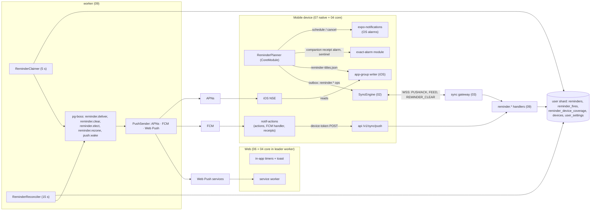
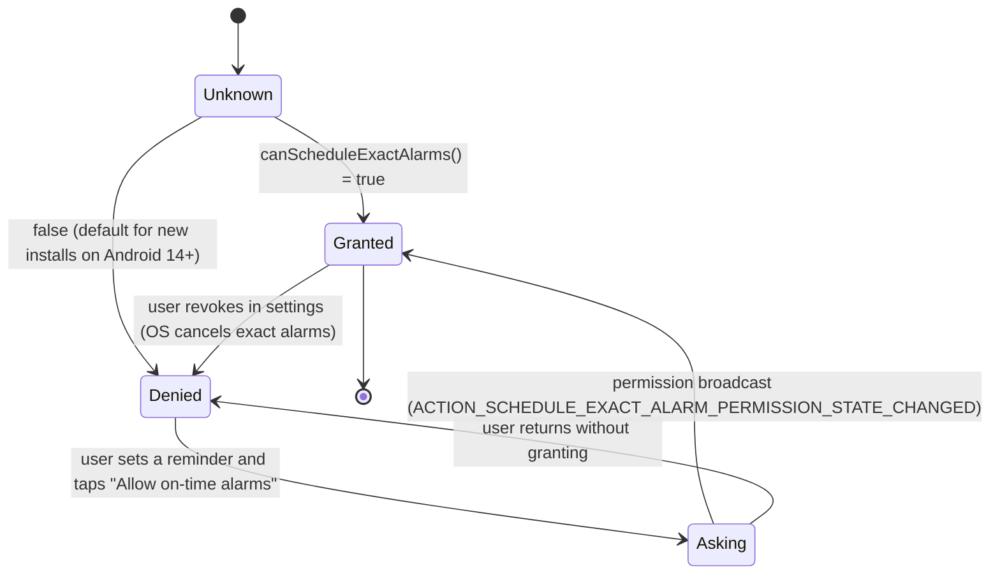
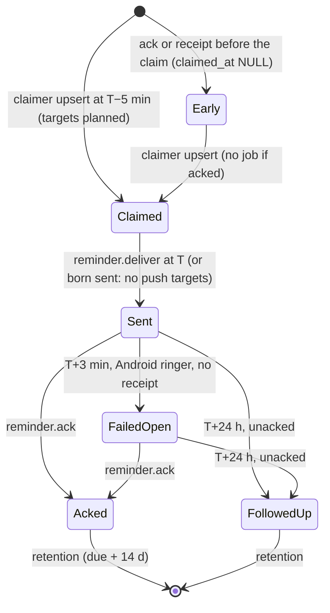

# 09 · Reminders and push

*Detail design · elaborates spine v1.2 (2026-10-04) · ships in M3 (D-36, D-37, the M3 part of D-38). Where another detail doc written against v1.1 disagrees with spine v1.2, the spine wins and §18 records the fix.*

## 1. Purpose and scope

This document specifies how time reminders are stored, armed on devices, delivered by the server, deduplicated across a user's devices and cleared after an action, and how the server sends every push message. It covers:

- the reminder model in each layer, the two zone modes and the home zone (P-07, P-08, P-10, P-11);
- the client `ReminderPlanner`: the rolling window, native repeating triggers, audibility, coverage reports, notification content and actions, alarm-wipe detection and the missed list (D-36);
- the primary-ringer election and fail-open (P-09);
- the server side: the `reminder.*` op handlers, the claimer, the `reminder_fires` ledger, the delivery job, the reconciler, the +24 h follow-up and clear-on-action (D-36);
- `PushSender` for APNs, FCM and Web Push, the push payload schema, payload policy and the iOS Notification Service Extension (NSE) (D-37, X-20, P-28);
- the 08:00 wave: the 5-minute pre-claim, jittered clears and no usn bump when the server advances an occurrence (D-36, A-03);
- the Android exact-alarm flows (D-36, D-38, Q-03, Q-04).

### Out of scope

| Topic | Owner |
|---|---|
| `ReminderSpec`, RRULE subset, `recurrence.*`, occurrence keys, presets, `resolveZone`, `wallToInstant` | `01-domain-model.md` §16 (consumed here) |
| Op argument schemas, frame layouts (`REMINDER_CLEAR`), feed row shapes, retry classes, the telemetry schema | `02-sync-protocol.md` |
| `OpExecutor`, `withShardWrite`, `allocUsn`, the lock-level order, the relay and its hook seam | `03-sync-server.md` |
| Local DDL, `WriteQueue`, `CoreModule`, the `Notifications`, `Background` and `SharedContainer` service interfaces | `04-client-core.md` |
| Native module code (`notif-actions`, `exact-alarm`, `app-group`, NSE target), the inbox envelope, Expo config, entitlements | `07-mobile-app.md` |
| Service worker code, settings screens, toasts | `06-web-app.md` |
| Device registration, retirement, device tokens, `device.update` | `12-identity-and-devices.md` |
| Server DDL, `ShardRouter`, the shard write fence, scanner claim rules R-a/R-b | `13-data-platform.md` |
| Location reminders | Excluded (P-11); `trigger_kind = 'location'` stays reserved |

## 2. Spine references

| Spine item | How this document uses it |
|---|---|
| **D-36** | Everything in §5–§8 and §10: rolling window (30 days, 50 iOS / 200 Android), native repeating triggers, coverage leases, claimer and ledger, reconciler, Android fire receipts, missed list, push-primary for denied exact alarms, no usn bump on server advance |
| **D-37** | §9: direct APNs, FCM HTTP v1, Web Push behind `PushSender`; ID-only payloads; NSE reads the App Group reminder-titles file; `occ` as collapse ID and tag |
| **D-38** | `notif-actions`, `exact-alarm`, `app-group` (reminder-titles writer) behavior contracts (§5.8, §5.10, §5.12); network from native code only through `notif-actions` and `bg-flush` with the device token |
| P-07, P-08, P-09, P-10, P-11, P-28 | §4, §5, §7, §8; P-23 (choices on an unmaterialized note), P-24 (copy carries no reminder), P-25 (account deletion) where they touch reminders |
| X-01, X-02, X-03, X-13, X-14, X-15, X-20 | Telemetry content, idempotency, server time, shared pure code, offline UX, battery, payload hygiene |
| INV-1, INV-3, INV-7, INV-13, INV-14, INV-15, INV-18 | Local-first arming, idempotent ops, live frames are hints, typed tombstones cancel notifications, restore re-push, HLC merges, no inherited coverage |
| D-16, D-17, D-20, D-22, D-25, D-34, D-41, D-42, D-45, D-46 | HLC LWW fields, idempotency keys, outbox lanes and `blocked_on`, silent pushes, Valkey (hints and limits only), pg-boss plus SKIP LOCKED scanners, device tokens, registration, restore journal, telemetry |
| §1.3 | "99.9% alert within 60 s of the due time" |
| §4.4, §4.5 | `reminders`, `reminder_fires`, `reminder_device_coverage`, `users_sync.{home_tz, primary_device_id, alert_all_devices}`, `devices`; occurrence key `r:{noteId}:{localWallISO}[#s{n}]` |
| §5.3, §5.7 | `reminder.upsert/delete/ack/coverage/fired`, `device.update`, `REMINDER_CLEAR`; per-user ops lock the actor's `user_notes` row `FOR SHARE` (C-14); devices receive only the acked state of `reminder_fires` |
| T-09 | BullMQ for the delivery queue above 200 pushes/s sustained |
| A-03, R-05, R-10 | Worst reminder minute 12.5k fires (Y1) and 125k (Y3); reminder failure risks; no dependency on `USE_EXACT_ALARM` |
| Q-03, Q-04, Q-12, Q-13, Q-15, Q-19 | §16 |
| v1.2 changes used | C-14, C-19, C-22 (`REMINDER_CLEAR.action`), C-29 (one usn per row), C-41 (UTF-16 units), C-46 (`snooze_of`), C-47 (clamps), C-52 (client `reminder_fire`, `device`), C-59 (reminder held in memory before materialization), C-83/C-84 (registration reset clears coverage and ringer role), C-85 (push-only device token), C-91 (fresh-install hygiene) |

Research basis: iOS keeps only the soonest 64 pending local notifications, a repeating request counts once; Android 14+ does not pre-grant `SCHEDULE_EXACT_ALARM`; inexact alarms on Android 12+ fire within about an hour; FCM's default quota is 600k messages/min; APNs allows about 1,000 concurrent streams per HTTP/2 connection (`research/stack.md` §8, `research/priorart.md` §2.7). Keep re-notifies 24 hours after the due time, reminders are per user on shared notes, and preset times default to 08:00, 13:00 and 18:00 (`research/features.md` §5).

## 3. Overview

### 3.1 The design in one paragraph

Every mobile device arms local notifications for the next 30 days of its own reminders, capped at 50 (iOS) or 200 (Android), and tells the server what it armed through **coverage** reports. Coverage counts only while the device's **lease** holds (seen within 24 h on Android, 7 days on iOS). Exactly one mobile device, the **primary**, arms its notifications audibly; the others arm them passively. Five minutes before every due time, a server **claimer** writes the occurrence into the `reminder_fires` **ledger** (primary key = occurrence) and decides which devices need a push: devices without live coverage, Android devices without exact alarms, and web browsers when no phone covers the occurrence. A **reconciler** re-sends lost deliveries, fails open to every other device when an Android primary posts no **fire receipt** within 3 minutes or when the primary has not been seen for 12 hours, and sends one follow-up after 24 hours. Done, Snooze or Dismiss on any device writes `reminder.ack`; the server records it in the ledger and clears the other devices over the socket (`REMINDER_CLEAR`) and by push. The server never bumps a user's usn when it claims, sends or advances an occurrence, so the 08:00 wave causes no feed traffic.

### 3.2 Components



### 3.3 Who alerts, by case

| Situation for occurrence *o* | Primary device | Other mobile devices | Web browsers | Server pushes |
|---|---|---|---|---|
| Normal: primary fresh, covers *o* with exact alarms | Rings from its local alarm; Android posts a receipt | Passive local notification | In-app toast if a tab is focused | None |
| Primary covers *o* but is Android with exact alarms denied | Rings from the push at T; inexact fallback at T + 10 min | Passive (local, or passive push if uncovered or inexact) | Toast if focused | Audible data push to the primary |
| Primary has no live coverage for *o* | Rings from an audible push | As above | Web Push (passive) | Audible push to primary; passive pushes to uncovered devices; Web Push |
| No mobile device covers *o* and no primary (web-only user) | — | — | Web Push, audible | Web Push to every browser |
| Primary not seen for > 12 h, or "Alert on all devices" | Rings if alive | Every device alerts audibly | Web Push, audible | Audible pushes to every device not ringing locally |
| Android primary posts no receipt by T + 3 min | (silent: wiped or killed) | Fail-open: audible push | Fail-open: audible Web Push | Fail-open pushes |
| T + 24 h, nothing actioned | One follow-up (audible push) | — | — (unless web was the ringer) | One follow-up push |
| Done, Snooze or Dismiss anywhere | Cleared | Cleared | Cleared on open tabs; on click otherwise | `REMINDER_CLEAR` on sockets; background clear pushes |

### 3.4 Interfaces

**Owned here** (complete definitions in the sections cited):

| Interface | Section | Consumers |
|---|---|---|
| Push payload schema `PushDataV1` (APNs `ks` dictionary, FCM data map, Web Push JSON), headers and TTLs | §9.3 | 07 (NSE, `notif-actions`), 06 (service worker) |
| `PushSender`, `PushMessage`, `PushOutcome` | §9.1 | worker only; T-09 swap point |
| `ReminderTitlesV1` App Group file (iOS) and the Android read-only SQLite query contract | §5.12 | 07 (NSE, `notif-actions`), 04 (`SharedContainer`) |
| Reminder settings keys and their semantics (`reminders.homeTz`, `reminders.ringDevice`, `reminders.primaryDevice`, `reminders.browserAlerts`) | §4.3 | 01 (catalogue), 03, 04, 06, 07 |
| `ReminderInput`, `RemindersApi` semantics, `ReminderView`, `ReminderChip`, `MissedReminderView` | §5.13 | 04 (facade), 05, 06, 07 |
| `ReminderIntentV1` (inbox payload for native and service-worker reminder actions) | §5.8 | 07 (inbox envelope), 06 |
| Native module behavior contracts for reminders (`exact-alarm`, `notif-actions`) | §5.8, §5.9, §5.10 | 07 |
| Pure policy functions `armingRole`, `planWindow`, `repeatComponents`, `electPrimary`, `planTargets`, `failOpenSends`, `followupTargets` | §5, §7, §8 | client, server, simulator (16) |
| `FireTargetsV1` (`reminder_fires.push_targets` jsonb) | §8.3 | 13 (stores), 14 (dashboards) |
| `reminder.*` op handlers; `RelayHooks` implementation; `DeviceRetirementListener` implementation; `ReminderHelloHook`, `ReminderDeviceHook`, `ReminderSettingsHook` | §6 | 03, 12 |
| pg-boss jobs `reminder.deliver`, `reminder.clear`, `reminder.elect`, `reminder.rezone`, `push.wake` | §8, §9 | worker |
| Metrics `keep.rem.*`, `keep.push.*` | §12 | 14 |

**Consumed** (exact names from the owning docs): 01 §16 `ReminderSpec`, `recurrence.{upcoming, nextFireAt, applyAck, applyScheduleEdit, occKey, parseOcc, compareOcc, parseRrule}`, `resolveZone`, `wallToInstant`, `instantToWall`, `presetWall`, `LIMITS.SNOOZE_N_MAX`; 02 §7.4 `OPS['reminder.*']`, `ReminderRowV1`, `ReminderFireRowV1`, `SettingRowV1`, `DeviceRowV1`, `REMINDER_CLEAR`, `WelcomeV1.primaryDeviceId`, `CODE_CLASS`; 03 §6.1 `withShardWrite`, `allocUsn`, `ShardTx`; 03 §6.7 `registerOpHandler`, `PerUserCtx`, `OpResult`; 03 §9.4 `RelayHooks`; 04 §3.4 `CoreModule`, `Tx`; 04 §16.4 `Notifications`; 04 §16.7 `SharedContainer`; 08 §4.6 `USER_NOTE_FOR_SHARE`; 12 §8.1 `DeviceTokenPrincipal`; 12 §9.2 `DeviceRetirementListener`, `RegistrationOutcome`, `DeviceRegistry.touch`; 13 §5.2 `ShardRouter`; 13 §8.5 `registerPurgeHook`.

## 4. Reminder model and time zones

### 4.1 The reminder in each layer

One reminder per `(user, note)` (P-07, DM-6). It has no ID of its own (spine §4.5).

| Field | Server `keep.reminders` | Wire `ReminderRowV1` | Client `reminder` | Written by |
|---|---|---|---|---|
| Start, wall time in the resolved zone | `local_start` | `localStart` | `local_start` | `reminder.upsert` (HLC) |
| Zone mode, fixed zone | `tz_mode`, `tz` | `tzMode`, `tz` | same | `reminder.upsert` (HLC) |
| Rule | `rrule` (01's canonical subset) | `rrule` | `rrule` | `reminder.upsert` (HLC) |
| Done cursor | `done_through` (occ key) | `doneThrough` | `done_through` | `reminder.ack{done}` |
| Snooze | `snooze_of`, `snooze_until`, `snooze_n` | `snoozeOf`, `snoozeUntil`, `snoozeN` | same | `reminder.ack{snooze}` (HLC) |
| Version | `version` (++ on every applied upsert field and every schedule-changing ack) | `version` | `version` (server value; 0 while unacked) | server |
| Deleted | `deleted` | `deleted` | `deleted` | `reminder.delete` (HLC) |
| Next due instant | `next_fire_at`, maintained by the server **without a usn bump** | `nextFireAt` (informational) | `next_fire_at`, **always derived locally** by the planner; the feed value is ignored | server; client planner |
| Claim cursor | `claimed_through` (wall time of the last claimed series occurrence; server-only, never serialized; **new column**, §18) | — | — | claimer |
| Field HLCs | `field_hlc` | `fieldHlc` | `field_hlc`, `pending_mask` | handlers (D-16) |

Field groups for LWW (one HLC per group, so concurrent writers never mix halves of a schedule):

| Group | Fields | Written by |
|---|---|---|
| `sched` | `local_start`, `tz_mode`, `tz`, `rrule`, `trigger_kind` | `reminder.upsert` |
| `snooze` | `snooze_of`, `snooze_until`, `snooze_n` | `reminder.ack{snooze}`; cleared by `done` and schedule edits |
| `deleted` | `deleted` | `reminder.delete`; `reminder.upsert` writes `deleted = false` under its HLC |
| `done` | `done_through` | `reminder.ack{done}` (max, not LWW) |

`field_hlc` keys are the group names. 02's `reminder.upsert.fields` allows a partial update; the client always sends the whole `sched` group (§5.13), so a partial update never mixes groups.

### 4.2 Zones (P-08)

- **Resolved zone** = `tz` when `tz_mode = 'fixed'`, else the account's home zone (01 `resolveZone`). Occurrence identity is the wall time in that zone, so it never depends on the computing device (spine §4.5, X-03).
- **Instants** come from `wallToInstant(wall, zone)` with Temporal `disambiguation: 'compatible'`: a wall time in a spring-forward gap moves forward, one in a fall-back overlap takes the earlier instant (P-08, 01 §16.2).
- **Home zone source.** The authoritative value is the setting `reminders.homeTz` (§4.3), an HLC-LWW per-user setting delivered by the feed like any other. The server mirrors its `zone` into `users_sync.home_tz` in the same transaction (§6.6) and recomputes `next_fire_at` for `home`-mode reminders in a `reminder.rezone` job (§8.6). 12 creates the row at signup from `users_sync.home_tz` (§18).
- **Follow the primary (client-driven).** Only the device that believes it is the primary (`reminders.primaryDevice` = self) runs this rule, so it works offline:
  1. On `PlatformClock.onTimeChange{kind: 'zone'}` and at every plan run, if `deviceZone ≠ homeTz.zone` and `deviceZone ≠ homeTz.declined`, record `rem_zone_seen = {zone, since}` in `sync_meta` (`since` = first observation; a wall anchor plus `monotonic()`, 04 §3.5).
  2. When the same zone has been observed for **≥ 2 h** (checked at plan runs, foreground and background tasks) and `homeTz.follow` is true, write `settings.set('reminders.homeTz', {zone: deviceZone, follow: true, declined: null})` and show the undo toast "Reminders now follow ‹City› time" (on the next foreground if the switch happened in the background).
  3. **Undo** writes `{zone: previous, follow: true, declined: deviceZone}`, so the rule does not switch again while the device stays in that zone. Moving to a third zone clears `declined` the next time a switch happens.
  4. The settings screen offers "Reminder time zone: Follow my phone | Always use ‹zone›" (`follow: false` pins the zone).
- **Clock skew.** Local alarms fire by the device clock. The planner arms at `dueAt − clockOffset` (04 §3.5 `clock_offset`, server minus device), so a device whose clock runs fast still rings at server time; an offset above 5 min also raises `keep.rem.clock_skew` telemetry.
- **tzdata differences.** Device and server can disagree on an instant after a zone-rule change. The server's instant is authoritative for pushes; the shared `occ` key makes the duplicate collapse or dedupe (§9.4).

### 4.3 Settings keys (semantics owned here; catalogue entries owned by 01)

```ts
// Additions to 01 §4.4 SettingValue (§18). HLC-LWW per key like every setting (D-16).
export interface ReminderSettingValues {
  /** Home zone for 'home'-mode reminders (P-08). Mirrored to users_sync.home_tz by the server. */
  'reminders.homeTz': { zone: string /* IANA, not a fixed offset */; follow: boolean; declined: string | null };
  /** "Ring on this device" pin (P-09). null = no pin. */
  'reminders.ringDevice': DeviceId | null;
  /** SERVER-WRITTEN ONLY: the effective primary ringer, mirror of users_sync.primary_device_id.
   *  A client settings.set on this key is rejected INVALID (class dead_letter). */
  'reminders.primaryDevice': DeviceId | null;
  /** Browsers with "Also notify in this browser" on (P-09). ≤ 20 entries; unknown IDs are ignored. */
  'reminders.browserAlerts': readonly DeviceId[];
}
// Existing 01 keys used here: 'reminders.alertAllDevices' (mirrored to users_sync.alert_all_devices),
// 'notifications.hideContent' (P-28), 'reminders.presetTimes' (P-10).
```

Using settings rows as the carrier gives every device the current ringer, pin and home zone through the ordinary feed, with no new row type (02 OQ-02-2 is answered this way).

### 4.4 State transitions

| Event | Spec change (01 §16.6) | Ledger | Feed (usn) | Devices |
|---|---|---|---|---|
| `reminder.upsert` (new or edited schedule) | `applyScheduleEdit`: `done_through = null`, snooze cleared, `version++`; `deleted = false` | Unsent fires with `due_at > now` deleted; `claimed_through = instantToWall(now, zone)` | Reminder row | Re-plan; coverage with the new version |
| `reminder.delete` | `deleted = true` | Unsent fires with `due_at > now` deleted | Reminder row | Cancel notifications; no coverage report |
| `reminder.ack{done}` on `r:N:W[#sK]` | `done_through = max(…, occKey(W))`; snooze cleared if `snooze_of ≤ W` | `acked_at`, `ack_kind = done`; receipt and follow-up timers cleared | Fire row; reminder row if the spec changed | `REMINDER_CLEAR`; clear pushes |
| `reminder.ack{snooze, until}` | `snooze_of = W`, `snooze_n = K + 1` (from the acked key, §6.3), `snooze_until = until` | `acked_at`, `ack_kind = snooze` | Fire row; reminder row | Clear old; arm `r:N:W#s{K+1}` |
| `reminder.ack{dismiss}` | None | `acked_at`, `ack_kind = dismiss` | Fire row | Clear |
| Claim / send / fail-open / follow-up | None (`next_fire_at`, `claimed_through` advance) | Row created and updated | **None** (D-36) | Pushes only |
| Owner trashes the note (every member's row gets `trashed_at`) | None | Unsent future fires deleted; `next_fire_at = NULL` (suspended) | None | Planner stops arming (P-07) |
| Trash restored | None | `claimed_through = instantToWall(now, zone)`; `next_fire_at` recomputed; no retroactive fires | None | Re-plan |
| Leave, revoke, decline, purge, `restore_lost`, account deletion | Reminder **hard-deleted** | Fires and coverage rows for the note deleted | None (the note tombstone carries it) | Purge path cancels notifications (04 §10.4) |
| Home zone changed | None | `reminder.rezone` recomputes `home`-mode reminders | Setting row | Re-plan (instants move; keys do not) |
| Archive | None (P-07) | None | None | None |
| Make a copy | None: the copy has no reminder (P-24) | — | — | — |
| Reminder chosen on an unmaterialized note | Held in memory; written as `reminder.upsert` behind `note.create` at materialization (P-23, C-59) | — | — | Armed after materialization |

## 5. Client: the `ReminderPlanner`

`ReminderPlanner` is a `CoreModule` (04 §3.3) in `packages/sync-client/src/reminders/`. Its pure parts live in `packages/domain/src/reminders/policy.ts` (owned here) so the server and the simulator run the same code (X-13).

### 5.1 Triggers

A plan run is cheap and idempotent. Triggers are debounced 2 s (title changes 5 s) and never run during a gesture (04 §5.5):

| Trigger | Source |
|---|---|
| App start (after the first frame), `WELCOME`, bootstrap `metaDone` | 04 §3.6, §13 |
| `onCommitted` touching `reminder`, `reminder_fire`, `device`, `settings` keys `reminders.*` / `notifications.hideContent`, or `note` columns `trashed_at`, `deleted`, `pending_accept`, `title` for notes that have a reminder | 04 §3.4 rule 5 |
| Zone change or wall-clock jump | `PlatformClock.onTimeChange` |
| Notification permission or exact-alarm permission change | `Notifications`, `exact-alarm` broadcast |
| Background refresh (`expo-background-task`), silent push, `bg-flush` completion | 04 §16.6 (best effort) |
| Native intents drained (action taken while the app was dead) | §5.8 |
| Once a day while the app runs (the window rolls) | timer |

### 5.2 Audibility

```ts
// packages/domain/src/reminders/policy.ts  (owned by 09)
export type Platform = 'ios' | 'android' | 'web';
export type Role = 'audible' | 'passive';

/** Role this device arms with. Fails safe: when the ringer is unknown, ring. */
export function armingRole(a: {
  self: DeviceId; primary: DeviceId | null; alertAll: boolean;
  devices: ReadonlyArray<{ deviceId: DeviceId; platform: Platform; retiredAt: number | null }>;  // local `device` mirror
}): Role {
  if (a.alertAll) return 'audible';
  if (a.primary === null || a.primary === a.self) return 'audible';
  const p = a.devices.find(d => d.deviceId === a.primary);
  if (!p || p.retiredAt !== null || p.platform === 'web') return 'audible';
  return 'passive';
}
```

**Local-origin rule.** A reminder whose `sched` or `snooze` group is still pending on this device (unacked local write) is armed **audibly** on this device whatever its role. No other device can know about it yet, so without this rule a reminder set or snoozed offline on a tablet would only show passively. When the write is acked the next plan run applies the normal role.

### 5.3 Window planning

```ts
export const REM = {
  WINDOW_MS: 30 * 86_400_000,              // D-36
  CAP: { ios: 50, android: 200, web: 0 },  // D-36; iOS hard limit is 64
  FALLBACK_DELAY_MS: 10 * 60_000,          // inexact fallback for denied exact alarms (D-36)
  COVERED_FOREVER: 253_402_300_799_999,    // 9999-12-31T23:59:59.999Z
  COVERAGE_SLACK_MS: 24 * 3_600_000,       // §5.6
} as const;

export interface PlanReminder {
  spec: ReminderSpec;                      // 01
  version: number;                         // server version; 0 while the sched group is pending
  pendingLocal: boolean;                   // sched or snooze group unacked on this device
  visible: boolean;                        // accepted, not trashed, not removed, not deleted
  title: string;                           // note.title (projection)
}
export interface ArmEntry {
  osId: string;                            // occ, or `r:{noteId}:rep{i}` for a repeating trigger
  noteId: NoteId;
  occ: OccKey | null;                      // null for repeating entries
  kind: 'occ' | 'repeat' | 'fallback';
  fireAt: number;                          // device-clock instant (dueAt − clockOffset)
  dueAt: number;                           // server-clock instant
  exact: boolean;
  audible: boolean;
  repeat?: CalendarRepeat;
}
export interface NoteCoverage { version: number; coveredUntil: number; exact: boolean; audible: boolean }

export function planWindow(i: {
  now: number; clockOffsetMs: number; platform: Platform; deviceZone: string; homeTz: string;
  capacity: number; exact: boolean; role: Role;
  reminders: readonly PlanReminder[]; acked: ReadonlySet<OccKey>;
}): { entries: ArmEntry[]; coverage: Map<NoteId, NoteCoverage> };
```

Algorithm:

1. **Filter.** Keep reminders with `visible` and `!spec.deleted` and `triggerKind = 'time'`. A permission state of `denied` (or `undetermined` before the first prompt) yields an empty plan.
2. **Repeating triggers (iOS only).** For each reminder with `repeatComponents(spec, zone, deviceZone, now) ≠ null` (§5.4), emit one `repeat` entry per component set. These are taken first; they cost one slot each and cover the series indefinitely.
3. **One-shots.** For every other reminder: `recurrence.upcoming(spec, {firedThrough: null, fromMs: now, toMs: now + WINDOW_MS, limit: capacity + 1}, {homeTz})`, minus keys in `acked`. Each occurrence becomes an `occ` entry with `exact = (platform === 'ios') || exact`. When `exact` is false (Android without the grant), the entry becomes a `fallback` armed at `dueAt + FALLBACK_DELAY_MS` (D-36).
4. **Select.** Sort one-shots by `(dueAt, occ)` and keep the first `capacity − repeatSlots`. Snoozed fires (`#s` keys) are ordinary occurrences and sort by their instant.
5. **Audibility.** `audible = role === 'audible' || reminder.pendingLocal`.
6. **Device clock.** `fireAt = dueAt − clockOffsetMs` (fallbacks add the delay first).
7. **Coverage** per note (only for reminders with `version > 0`, i.e. acked):
   - a note with a `repeat` entry: `coveredUntil = COVERED_FOREVER`;
   - otherwise, let *u* be the earliest pending occurrence of the note that is **not** armed (inside the window, or the first one after it from `upcoming(…, fromMs: now + WINDOW_MS, limit: 1)`): `coveredUntil = u.dueAt − 1`, or `COVERED_FOREVER` if the series has no such occurrence;
   - a note with no armed occurrence and earlier coverage reports `coveredUntil = 0` (withdrawn);
   - `exact` as in step 3; `audible` as in step 5.

The plan is a pure function. Budget: ≤ 50 ms for 500 reminders on the lab Android device (temporal-polyfill cost is Q-12); the run yields to the JS thread between reminders.

### 5.4 Native repeating triggers (iOS)

D-36 uses native repeating calendar triggers when the device zone equals the reminder's resolved zone. On iOS a `UNCalendarNotificationTrigger(repeats: true)` fires exactly at a wall time in the device's zone. Android repeating triggers in expo-notifications are not exact (UNVERIFIED, OQ-09-1), so Android always uses one-shots; its 200-slot cap rarely binds.

```ts
export interface CalendarRepeat {           // iOS DateComponents; weekday 1 = Sunday … 7 = Saturday
  hour: number; minute: number; weekday?: number; day?: number; month?: number;
}
/** Returns the component sets that reproduce the series exactly, or null if not eligible. */
export function repeatComponents(spec: ReminderSpec, zone: string, deviceZone: string, now: number): CalendarRepeat[] | null;
```

Eligible only if **all** hold:

| Condition | Why |
|---|---|
| `deviceZone === zone` | D-36; the trigger fires in the device's zone |
| Rule has `INTERVAL = 1`, no `UNTIL`, no `COUNT` | A trigger cannot stop or skip periods; a device that is not re-planned before `UNTIL` would ring after the end |
| `DAILY` → `{hour, minute}`; `WEEKLY` → one set per `BYDAY` weekday (≤ 7 slots); `MONTHLY` with `BYMONTHDAY ≤ 28` → `{day, hour, minute}`; `YEARLY` not from 29 February → `{month, day, hour, minute}` | Month-end and leap-day clamps (P-10, C-47) and `BYSETPOS` have no calendar-trigger equivalent |
| The next 10 instants of `recurrence.upcoming` equal the next 10 matches of the components | Catches `s₀` that does not match `BYDAY`, a start in the future, and an active early `done` |
| The wall time is unambiguous on every DST transition of the zone in the next 400 days (`getTimeZoneTransition`) | iOS behavior in gaps and overlaps is UNVERIFIED (OQ-09-3) |
| No acked occurrence after now (`done_through` in the future) | A trigger cannot skip one occurrence |

**Mapping deliveries to occurrences.** A repeating request has one identifier (`r:{noteId}:rep{i}`) for every delivery, so the response handler derives the occurrence: `occ = occKey(noteId, instantToWall(delivery.date + clockOffset, zone))`, accepted if `upcoming` confirms a series occurrence within ±2 minutes; otherwise the response is logged and treated as Open only. Clearing an occurrence removes every delivered notification of that request (older unactioned deliveries of the same series are stale anyway; the follow-up and the missed list cover them).

### 5.5 Applying the plan

1. Read inputs in one read (reminders, `note` visibility and titles, `reminder_fire` acked keys, `device` mirror, settings, `sync_meta.clock_offset`).
2. `desired = planWindow(…)`.
3. `current` = `Notifications.scheduled()` joined with `reminder_schedule` by `os_id`. On iOS the OS list is the truth; on Android `reminder_schedule` is, because expo's own registry survives a force-stop that cancelled the alarms (§5.9).
4. Cancel entries in `current` but not in `desired`, and entries whose `fireAt`, `audible`, `exact` or rendered title changed; then schedule the new ones (`Notifications.schedule`, id = `osId`). OS calls never run inside a transaction (04 §3.4).
5. One priority-4 transaction: replace `reminder_schedule` rows; update `reminder_cov` (§5.6) and enqueue `reminder.coverage` ops for changed notes; write `rem_last_plan_at`.
6. iOS: rewrite `reminder-titles.json` if its content changed (§5.12). Android: arm a **companion receipt alarm** (`exact-alarm.armCompanion(occ, fireAt + 5 s)`) for every audible `occ` entry and refresh the **sentinel** alarm (§5.9).
7. iOS: after scheduling, compare the OS pending count with `entries.length`; if the OS dropped entries (another component exceeded the 64 limit), recompute coverage from the OS list and report it.

### 5.6 Coverage reports

`reminder.coverage{noteId, version, coveredUntil, exact, audible}` (02 §7.4) is queued like any per-user op (lane = home shard, `blocked_on` behind unacked note-scoped ops on the note, D-20). D-36's "re-report on every launch, background run and re-arm" is implemented as a **reconciliation** on every plan run: the device compares the plan's coverage with the last acked report (`reminder_cov`, §5.14) and sends an op when any of these holds:

| Change | Send? |
|---|---|
| `version`, `exact` or `audible` differs | Yes |
| `coveredUntil` decreased | Yes, at once (less coverage must reach the server before the server relies on it) |
| `coveredUntil` increased by ≥ 24 h (`COVERAGE_SLACK_MS`) | Yes |
| Smaller increase | No: a stale-low horizon only causes an extra push, which the Android handler and the iOS NSE make harmless (§9.4) |
| `WELCOME.registration ≠ 'existing'`, a `restore` resync, or a wipe detected | Clear `reminder_cov` and re-report every note (the server ignores coverage from earlier registrations, §6.4) |

The lease itself is renewed by check-ins (`devices.last_seen_at`, 12 §9.7), not by coverage reports.

### 5.7 Notification content

| Element | Value |
|---|---|
| OS identifier, Android tag, web tag | `occ` (spine §4.5); `r:{noteId}:rep{i}` for iOS repeating requests |
| Title | P-28 hide on: localized "Reminder". Otherwise the note's live title (P-07), truncated to 60 UTF-16 units (C-41); empty title: "Untitled note" |
| Body | The occurrence's time in the device locale (`8:00 AM`), plus the zone name when the resolved zone differs from the device zone ("9:00 AM New York time"); `↻` prefix for repeating reminders. Never note content |
| Channel (Android) | `reminders` (importance high, category `reminder`) when audible; `reminders_passive` ("Reminders on other devices", importance low) when passive (P-09) |
| Interruption level (iOS) | `timeSensitive` with sound when audible; `passive`, no sound, when passive (P-09). Requires the Time Sensitive entitlement (07) |
| Thread / group | `noteId` |
| Actions | `done` ("Done"), `snooze_1h` ("Snooze 1 hour"), `snooze_tomorrow` ("Tomorrow morning"); tap = Open; swipe = Dismiss (iOS category option `customDismissAction`; Android delete intent) |
| Data | `{v: '1', noteId, occ}`; repeating requests add `rep: '1'`, `zone` |

Titles change with the note: a projection change on a note with armed entries triggers a re-plan (title debounce 5 s), which re-schedules the affected entries.

### 5.8 Acting on a notification

Every path produces the same local effect and the same op: `reminder.ack{noteId, occ, action, until?}` with `until` (ms UTC) for snoozes. "Snooze 1 hour" = `now + 3,600,000`; "Tomorrow morning" = `wallToInstant(presetWall('tomorrowMorning', now, homeZone, presetTimes))` (01 §16.7).

**Local effect** (one priority-0 transaction): `recurrence.applyAck` on the local spec (with the snooze rule of §6.3), a `reminder_fire` row `{ackedAt: now, ackKind}`, delete the `reminder_schedule` entry for `occ` and, for a snooze, schedule the snoozed fire `r:N:W#s{K+1}`; enqueue the op. After commit: cancel and dismiss `occ` in the OS (`Notifications.cancel`, dismiss presented), cancel its companion alarm.

| Context | Who handles | Network |
|---|---|---|
| App in foreground (any platform) | `Notifications.onResponse` → `RemindersApi.ack` | Outbox (socket) |
| App alive in background | Same, inside the OS's background allowance | Outbox via `bg-flush` |
| **App killed, iOS** | `notif-actions` native delegate (the app is launched in the background for the action). It reads `reminder-titles.json` for the zone, presets, user, home shard and HLC node; cancels and removes the notification; for a snooze schedules the snoozed local notification natively (same content rules); writes a `ReminderIntentV1` to the inbox; best-effort `POST /v1/sync/push` with the device token | Device token, `sync.push` scope (C-85) |
| **App killed, Android** | `notif-actions` broadcast receiver (action buttons and the delete intent). Same steps, reading SQLite read-only (§5.12) | Same |
| Web, tab open | Leader core via `RemindersApi.ack` | Socket |
| Web, no tab | Service worker: `notificationclick` with an action → `POST /v1/sync/push` with a JWT minted from the cookie (`X-KS-Context: background`, 12 §8.3) and an IndexedDB `ks-sw-intents` record; plain click opens `/note/{id}` | Cookie JWT |

```ts
// Payload of an inbox record (envelope owned by 07) and of a service-worker IndexedDB intent. Owned here.
export interface ReminderIntentV1 {
  v: 1;
  kind: 'reminder.ack' | 'reminder.fired';
  noteId: NoteId; occ: OccKey;
  action?: 'done' | 'snooze' | 'dismiss';   // ack only
  until?: number;                           // snooze only, ms UTC
  at: number;                               // device wall ms when the user acted or the alarm fired
  hlc: Hlc;                                 // natively minted (below)
  ccid: string;                             // UUIDv7; the same ccid is used for the native POST and the outbox op
  posted: boolean;                          // the native POST got an ACK ok/stale
  armed?: { osId: string; fireAt: number }; // snoozed fire scheduled natively
}
```

**Native HLC.** Native code mints `{ms: max(wall, floorMs), counter: (ms === floorMs ? floorCounter + 1 : 0), node}` from `hlcNode` and the floor stored in the titles file (iOS) or `sync_meta.hlc` (Android), and keeps its own last value in no-backup storage. The core merges every drained intent's HLC (INV-15). The ack's guard is `(occ, action)`; the HLC only orders the snooze group, so a rare tie is harmless.

**Draining.** On start and on every foreground, the core drains reminder intents in one transaction: it applies the local effect idempotently and enqueues the op with the intent's `ccid` and `hlc` unless `posted` is true (re-sending would be harmless anyway, INV-3). `reminder.fired` intents become `reminder.fired` ops (§5.9).

### 5.9 Receipts, alarm wipes and the missed list (Android)

expo-notifications offers no native hook when a scheduled notification is shown while JS is dead. The planner therefore pairs each **audible** one-shot with a **companion alarm** in the `exact-alarm` module, armed 5 s after it with the same exactness. The companion's receiver posts the receipt through `notif-actions`: `POST /v1/sync/push` with `reminder.fired{noteId, occ, firedAt}` (device token) plus a `ReminderIntentV1{kind: 'reminder.fired'}` for the core. Both alarms share fate under force-stop and OEM battery managers, which is what the receipt detects (P-09). Passive arms post no receipt: the server waits only for the ringer's (§8.3). With 200 notifications and up to 200 companions an app stays under Android's 500-alarm limit.

**Wipe detection** at every launch and plan run:

| Signal | Source |
|---|---|
| Sentinel alarm missing (`exact-alarm.sentinelAlive()`: the far-future sentinel `PendingIntent` no longer exists, `FLAG_NO_CREATE`) | Force-stop, OEM killer, package update edge cases |
| `ApplicationExitInfo` reason `REASON_USER_STOPPED` since the last run (`exact-alarm.lastExitReason()`) | Force-stop (telemetry only; Q-19) |
| Exact permission revoked (`canScheduleExactAlarms()` false while `devices.exact_alarm` was true) | Android cancels the app's exact alarms on revocation |

On a wipe: re-arm everything (cancel all, then apply the plan), report coverage in full, and compute **missed occurrences**: every occurrence with `dueAt ∈ (rem_alive_at, now]` and no acked `reminder_fire` row, where `rem_alive_at` is the last time the sentinel was seen alive (stored at every plan run). They go into `reminder_missed` and show as "Missed while the app was stopped" in the Reminders view, plus one passive summary notification "N reminders were missed while Keep was stopped". The user can mark each one Done (an ordinary `reminder.ack`) or dismiss the list. The other devices were alerted by fail-open in the meantime (§8.5).

iOS keeps scheduled notifications across force-quit (D-36); its wipe check is the OS pending list (§5.5 step 7) and does not build a missed list.

### 5.10 Android exact alarms



| State | Device behavior | Server behavior |
|---|---|---|
| `Granted` | Exact one-shots + companions; coverage `exact = true`; `device.update{exactAlarm: true}` | Covered device: no push at T; receipt expected if it rings |
| `Denied` | **Push-primary** (D-36): each occurrence is armed only as an inexact fallback at T + 10 min (cancelled when the push or any ack arrives); coverage `exact = false`; `device.update{exactAlarm: false}`; a one-time explainer card "Reminders arrive by notification from our servers; allow alarms for on-time reminders without a connection" | Data push at T (audible if it is the ringer, passive otherwise); the push handler posts a receipt |
| Revoked while running | Broadcast → re-plan as `Denied` | As above after the update |
| Revoked while killed | Detected at next launch (§5.9) | Fail-open already covered the gap |

The prompt is shown on the first reminder set on Android 12+, never at launch. `USE_EXACT_ALARM` is not requested (Q-03, R-10). The `exact-alarm` module is built regardless of what expo-notifications exposes (Q-04).

The push handler (`notif-actions`, native `FirebaseMessagingService`) for `alert` messages: drops the message if `uh` does not match the bound user; posts the notification with tag `occ` unless a notification with that tag is already active or an exact local entry for `occ` is armed for a time ≤ now + 2 min (dedupe, §9.4); cancels the fallback alarm for `occ`; for an audible push, records and posts a receipt.

### 5.11 Web

- **No OS arming** (`capacity() = 0`) and no coverage reports: browsers rely on Web Push (D-36).
- **In-app toast.** The leader worker keeps timers for occurrences due in the next 24 h. At a due time, if any tab is visible it sends that tab a toast message over the tab bus (04 §16.8) with Done and Snooze. Toasts are passive and keyed by `occ`.
- **Web Push subscription.** After notification permission is granted (asked when the user first sets a reminder on web), `PushManager.subscribe({userVisibleOnly: true, applicationServerKey: VAPID})`; the subscription JSON goes out in `device.update{pushToken: {kind: 'webpush', token}}`. On `pushsubscriptionchange` the service worker re-subscribes and queues the update. On iOS and iPadOS, Web Push works only for Home Screen web apps (`research/stack.md` §8).
- **Service worker on `push` (06 implements; semantics here).** Parse `PushDataV1`; drop on `uh` mismatch with the IndexedDB hint (12 §8.3 `ks-auth-hint`, which gains `uh`, `homeShard` and `hlcNode`, §18). For `alert`: `showNotification(title ?? "Reminder", {tag: occ, body: time formatted from t, silent: a === 0, requireInteraction: a === 1, renotify: r !== 'due', data: {n, o}, actions: [done, snooze_1h]})`; if a focused window client exists, also post the toast to it. Every push shows a notification (`userVisibleOnly`); the server therefore never sends `clear` or `wake` pushes to browsers (§9.6).
- **"Also notify in this browser"** toggles this device's ID in `reminders.browserAlerts`.

### 5.12 The reminder-titles file and the Android read contract

The iOS NSE and the iOS `notif-actions` delegate cannot run the TypeScript core and must not open the SQLite DB from an extension (F17). The planner writes this file through `SharedContainer.writeFile('reminder-titles.json', …)` (atomic rename, 04 §16.7) on every plan run that changes it. It ships in M3 and is gated by P-28 only, never by the widget setting (D-37, X-20).

```ts
// App Group container, file 'reminder-titles.json' (iOS only). Owned by 09; read by 07's NSE and notif-actions.
export interface ReminderTitlesV1 {
  v: 1;
  uh: string;                        // first 8 hex chars of SHA-256(bound userId); pushes for another account are generic
  userId: UserId; homeShard: number; deviceId: DeviceId;   // for the native device-token POST
  writtenAt: number;
  hide: boolean;                     // P-28 'notifications.hideContent'
  zone: string;                      // home zone (for "Tomorrow morning")
  presets: { morning: string; afternoon: string; evening: string };   // 'HH:mm' (P-10)
  hlc: { node: string; floorMs: number; floorCounter: number };
  /** Notes with a live reminder whose next occurrence is within 30 days. Empty when hide = true. ≤ 2,000 entries. */
  titles: Record<NoteId, string>;    // ≤ 60 UTF-16 units each
  /** This device's armed horizon per note: [coveredUntil ms, audible 0|1]. */
  cover: Record<NoteId, [number, 0 | 1]>;
}
```

The file is bounded to 256 KiB; above that the oldest-due titles are dropped (the NSE then shows the generic text). It is deleted on wipe (`onWipe`) and rewritten after sign-in.

**Android read contract.** D-37 has the Android data-message handler render titles from SQLite. `notif-actions` opens a **read-only** connection (WAL readers never block the core's writer) and runs only these statements; 04 keeps these columns stable or bumps the module (§18):

```sql
SELECT title, deleted, trashed_at, pending_accept FROM note WHERE id = ?1;
SELECT key, value FROM settings WHERE key IN ('notifications.hideContent','reminders.presetTimes','reminders.homeTz');
SELECT k, v FROM sync_meta WHERE k IN ('user_id','home_shard','hlc');
SELECT os_id, fire_at, audible, kind FROM reminder_schedule WHERE occ = ?1;
```

### 5.13 CoreApi surface

04 §4.2 exposes `RemindersApi`; the semantics and these types are owned here.

```ts
// packages/sync-client/src/reminders/api.ts
export interface ReminderInput {
  localStart: LocalWall;               // 01 §16.1, in the resolved zone
  tzMode: 'home' | 'fixed';            // default 'home' (P-08, Q-15)
  tz: string | null;                   // required iff 'fixed'
  rrule: string | null;                // 01's canonical subset; null = one-off
}
export type SnoozeChoice = { preset: '1h' | 'tomorrowMorning' } | { until: number };

export interface RemindersApi {
  /** Writes the whole sched group with one HLC (reminder.upsert). Validates with 01 parseRrule → CoreError INVALID. */
  set(noteId: NoteId, input: ReminderInput): Promise<void>;
  clear(noteId: NoteId): Promise<void>;                                  // reminder.delete
  ack(noteId: NoteId, occ: OccKey, action: 'done' | 'dismiss'): Promise<void>;
  snooze(noteId: NoteId, occ: OccKey, choice: SnoozeChoice): Promise<void>;
  missed(): LiveQuery<readonly MissedReminderView[]>;
  dismissMissed(occs?: readonly OccKey[]): Promise<void>;
  alarmStatus(): LiveQuery<AlarmStatus>;                                 // settings banner, explainer card
  requestExactAlarms(): Promise<void>;                                   // opens the system screen (Android)
  /** P-09 "Ring on this device": settings.set('reminders.ringDevice', self | null). */
  ringHere(on: boolean): Promise<void>;
  /** P-09 "Also notify in this browser" (web): edits 'reminders.browserAlerts'. */
  notifyThisBrowser(on: boolean): Promise<void>;
}
export interface ReminderView {                // 04 §5.3 queries.reminders()
  noteId: NoteId; title: string; next: { occ: OccKey; dueAt: number } | null;
  zone: string; zoneLabel: string | null;      // label only when ≠ device zone
  repeats: boolean; rruleText: string | null;  // localized summary ("Every weekday")
  snoozedUntil: number | null; overdue: OccKey | null; chip: ReminderChip;
}
export interface ReminderChip {                // card and editor chip (04 §5.3, 05 §5.4)
  text: string;                                // "Tomorrow, 8:00 AM", "Mon 9:00 AM ↻"
  state: 'upcoming' | 'overdue' | 'done';      // overdue: latest due occurrence fired ≤ 24 h ago, unacked; done: one-off acked
  repeats: boolean;
}
export interface MissedReminderView { noteId: NoteId; occ: OccKey; dueAt: number; title: string }
export interface AlarmStatus {
  permission: 'granted' | 'denied' | 'undetermined' | 'provisional';
  exact: boolean | null;                       // Android only
  role: Role; primaryDeviceId: DeviceId | null; armed: number; capacity: number;
  windowEndsAt: number | null;                 // earliest coveredUntil < FOREVER (capacity squeeze indicator)
}
```

`ack` is allowed on any series occurrence up to the next one (an early Done on an upcoming one-off cancels it everywhere). `ack(…, 'snooze')` is not offered; `snooze` computes `until` and calls the same op.

### 5.14 Local storage needs (DDL owned by 04)

| Table or key | Columns or value | Purpose |
|---|---|---|
| `reminder` (exists) | `snooze_until` as **INTEGER** ms (04 has TEXT, §18) | Matches the wire |
| `reminder_schedule` (exists) | Add `kind` (`occ`, `repeat`, `fallback`), `exact`, `due_at`, `title_hash` | Diffing (§5.5) |
| `reminder_cov` (new) | `note_id` PK, `version`, `covered_until`, `exact`, `audible`, `state` (`queued`, `acked`), `reported_at` | Last coverage report (§5.6) |
| `reminder_missed` (new) | `occ` PK, `note_id`, `due_at`, `found_at` | Missed list (§5.9) |
| `sync_meta` | `rem_zone_seen`, `rem_alive_at`, `rem_last_plan_at`, `rem_exact_explained` | §4.2, §5.9 |

`CoreModule.onPurgeNote` deletes `reminder_cov` and `reminder_missed` rows for the note; `onWipe` cancels every OS notification and companion alarm and deletes `reminder-titles.json`.

## 6. Server: the `reminder.*` ops and hooks

All handlers are `perUser` (03 §6.7) and run in `withShardWrite([actor.userShard])`. Locks follow 03's order at level 6 (`user_notes` < `reminders` < `reminder_fires` < `reminder_device_coverage` < `user_settings` < `devices`) and level 7 last.

### 6.1 Common prologue

```ts
// apps/server/src/reminders/ops.ts
async function authorizeNote(ctx: PerUserCtx, noteId: string): Promise<OpResult | null> {
  // 08 USER_NOTE_FOR_SHARE (FOR SHARE: reminder.* writes other rows, C-14)
  const [row] = await ctx.tx.query(USER_NOTE_FOR_SHARE, [ctx.actor.userShard, ctx.actor.userId, noteId]);
  if (!row || row.invite_state === 'pending') return rejected('NOTE_UNKNOWN');                 // class retry
  if (row.removed_reason === 'purged' || row.removed_reason === 'account_deleted') return rejected('NOTE_PURGED');
  if (row.removed_reason) return rejected('FORBIDDEN');                                         // class await_tombstone
  return null;
}
```

The spine's mapping (C-14) applies: `purged` and `account_deleted` give `NOTE_PURGED`, other tombstones `FORBIDDEN`. Then `SELECT … FROM keep.reminders WHERE (shard_id, user_id, note_id) = (…) FOR UPDATE` (absent rows are inserted later in the same transaction).

### 6.2 `reminder.upsert{noteId, fields}` and `reminder.delete{noteId}`

1. Prologue. Validate the merged `sched` group: `localStart` matches `LOCAL_WALL_RE`; `tzMode = 'fixed'` needs `tz` with `isValidZone`; `parseRrule(rrule, {zone, localStart})` (01) succeeds; `triggerKind = 'time'`. Failure → `INVALID` (dead letter: a client bug, C-19).
2. `lwwDecide(field_hlc.sched, op.hlc)` (01 §6.4). Not newer → `stale` with the current `ReminderRowV1`.
3. Apply `sched`, `deleted = false` (under the same HLC if newer than `field_hlc.deleted`), then `applyScheduleEdit` (`done_through = null`, snooze cleared, `version++`).
4. Ledger: `DELETE FROM keep.reminder_fires WHERE (shard_id, user_id, note_id) = (…) AND sent_at IS NULL AND acked_at IS NULL AND due_at > now()`.
5. `claimed_through = instantToWall(now, zone)`; `next_fire_at` = §8.2 `nextUnclaimed`, or NULL if the user's row has `trashed_at` set (suspended).
6. If `next_fire_at ≤ now() + 5 min`, run the claim for this reminder inline (§8.2), so an edit at 07:58 for 08:00 never waits for the scanner.
7. `allocUsn(1)`, write the row with its usn. Result `ok` with the row.

`reminder.delete`: prologue; LWW on `deleted`; `deleted = true`, `next_fire_at = NULL`; step 4; usn; `ok` or `stale`. A delete on an absent row inserts a tombstone row so a later, older upsert loses.

### 6.3 `reminder.ack{noteId, occ, action, until?}`

1. Prologue (a `FORBIDDEN` ack is held until the tombstone arrives and then dropped with the note, 02 §8.1). `parseOcc(occ).noteId ≠ noteId` → `INVALID`. `action = 'snooze'` requires `until > now − 60 s`, else `INVALID`.
2. **Spec transition, idempotent by `(occ, action)`** (D-17). With `{W, K} = parseOcc(occ)`:

| Action | Rule | Applies when |
|---|---|---|
| `done` | `done_through = max(done_through, occKey(W))`; clear the snooze group if `snooze_of ≤ W` | `done_through < occKey(W)` |
| `snooze` | `snooze_of = W`, `snooze_n = min(K + 1, SNOOZE_N_MAX)`, `snooze_until = until`, group HLC = op HLC | `occKey(W) > done_through` and (`snooze_of` is null or `W > snooze_of`, or `W = snooze_of` and `snooze_n < K + 1`, or `W = snooze_of`, `snooze_n = K + 1` and `op.hlc > field_hlc.snooze`). A late snooze of an older occurrence never replaces a newer snooze |
| `dismiss` | None | — |

`snooze_n` derives from the acked key, not from the stored counter, so a re-sent snooze is a no-op and two devices snoozing the same fire produce the same next key (`#s{K+1}`), with LWW on `until` (this refines 01 §16.6, §18). A `done` or `snooze` that changes the spec does `version++`: the old coverage no longer matches, so the server pushes the snoozed fire until devices re-plan.
3. **Ledger upsert** (`occ` primary key):

```sql
INSERT INTO keep.reminder_fires AS f (shard_id, user_id, note_id, occ, due_at, claimed_at, acked_at, ack_kind, usn)
VALUES ($s, $u, $n, $occ, $due, NULL, now(), $action, NULL)              -- $due: §8.2 dueOf(occ); claimed_at NULL = not yet claimed
ON CONFLICT (shard_id, user_id, note_id, occ) DO UPDATE
  SET acked_at = coalesce(f.acked_at, now()),
      ack_kind = CASE WHEN f.ack_kind IS NULL
                        OR (CASE EXCLUDED.ack_kind WHEN 'done' THEN 3 WHEN 'snooze' THEN 2 ELSE 1 END)
                         > (CASE f.ack_kind        WHEN 'done' THEN 3 WHEN 'snooze' THEN 2 ELSE 1 END)
                      THEN EXCLUDED.ack_kind ELSE f.ack_kind END,       -- done > snooze > dismiss
      receipt_due_at = NULL, followup_due_at = NULL
RETURNING (xmax = 0) AS inserted, acked_at, ack_kind;
```

4. Recompute `next_fire_at`; inline claim if within 5 min (a 2-minute snooze).
5. `allocUsn` for each row that changed (fire row; reminder row if the spec changed), C-29.
6. After commit: publish `{u:<userId>} reminder_clear{noteId, occ, action}` (03 §5.7, every connected device gets `REMINDER_CLEAR`); enqueue `reminder.clear` (§9.6) unless nothing was ever sent or armed elsewhere. Result `ok` with the `ReminderRowV1`.

### 6.4 `reminder.coverage{noteId, version, coveredUntil, exact, audible}`

1. Prologue.
2. Read the principal's device row without a lock: `retired_at`, `registration_id`. A retired device → `ok` no-op. The registration ID comes from the connection's `HELLO` (03's `OpActor` carries it, §18) or, on `/v1/sync/push`, from the row.
3. Upsert, no usn (coverage is not synced):

```sql
INSERT INTO keep.reminder_device_coverage
  (shard_id, user_id, device_id, note_id, version, covered_until, exact, audible, registration_id, reported_at)
VALUES ($s, $u, $d, $n, $v, to_timestamp($until / 1000.0), $exact, $audible, $reg, now())
ON CONFLICT (shard_id, user_id, device_id, note_id) DO UPDATE
  SET version = EXCLUDED.version, covered_until = EXCLUDED.covered_until, exact = EXCLUDED.exact,
      audible = EXCLUDED.audible, registration_id = EXCLUDED.registration_id, reported_at = now();
```

Coverage counts for targeting only when `registration_id` equals the device row's current one (INV-18: a reinstall or clone never inherits coverage, C-83), the device is not retired, its lease holds, and `version` equals the reminder's. Stale rows are harmless and deleted by the reconciler's GC (§8.5). This avoids deleting coverage inside 12's retirement transaction, whose lock order (devices first) would invert the table order.

### 6.5 `reminder.fired{noteId, occ, firedAt}`

Prologue; then upsert the fire row with `fired_receipts = coalesce(fired_receipts, '{}') || jsonb_build_object($device, $firedAt)`, and `receipt_due_at = NULL` when the device is the plan's `receiptFrom`. If the row did not exist yet (claimer behind), insert it with `claimed_at = NULL`; the claimer keeps the receipt (§8.2). No usn. Accepted only from Android devices (others: `ok` no-op).

### 6.6 Hooks into 03 and 12

```ts
// apps/server/src/reminders/hooks.ts  (owned by 09)

/** 03 RelayHooks (03 §9.4), at lock level 6 in the target transaction. Both return [] (no feed rows). */
export const reminderRelayHooks: Pick<RelayHooks, 'onMemberRemoved' | 'onTrashChanged' | 'wakeForSharedChange'> = {
  async onMemberRemoved(tx, userId, noteId, _reason) {
    // reminders, then reminder_fires, then coverage (table order); hard delete: the note tombstone carries the signal
    await tx.query(`DELETE FROM keep.reminders WHERE shard_id = $1 AND user_id = $2 AND note_id = $3`, …);
    await tx.query(`DELETE FROM keep.reminder_fires WHERE shard_id = $1 AND user_id = $2 AND note_id = $3`, …);
    await tx.query(`DELETE FROM keep.reminder_device_coverage WHERE shard_id = $1 AND user_id = $2 AND note_id = $3`, …);
    return [];
  },
  async onTrashChanged(tx, userId, noteId, trashed) {
    // trashed: next_fire_at = NULL, delete unsent future fires. restored: claimed_through = wall(now), recompute.
    return [];
  },
  wakeForSharedChange(userId, noteId) { enqueueWake(userId); },   // §9.7, after commit
};

/** 12 DeviceRetirementListener (12 §9.2), in 12's transaction after the devices row is locked. */
export const reminderRetirement: DeviceRetirementListener = {
  async onRetired(tx, userId, deviceId, _reason) {
    // Level 7 only (users_sync is already the next lock in 12's order): drop the role at once, so claims
    // fail open until the election job runs. Coverage is invalidated by retired_at / registration_id (§6.4).
    await tx.query(`UPDATE keep.users_sync SET primary_device_id = NULL
                    WHERE shard_id = $1 AND user_id = $2 AND primary_device_id = $3`, …);
    tx.afterCommit(() => enqueueElect(userId, { dropPinOf: deviceId }));   // §7.2
  },
};

/** Called by 03's gateway after 12's registration commit and before WELCOME. Returns WELCOME.primaryDeviceId. */
export interface ReminderHelloHook {
  onHello(h: { userId: UserId; homeShard: number; deviceId: DeviceId; platform: Platform;
               foreground: boolean; outcome: RegistrationOutcome }): Promise<DeviceId | null>;
}
/** Called by 12's device.update handler after commit when notifPermission, pushToken or exactAlarm changed. */
export interface ReminderDeviceHook { onDeviceUpdated(userId: UserId, deviceId: DeviceId, changed: readonly string[]): void }
/** Called by 03's settings.set handler inside its transaction after a reminder key was applied (level 7 writes only). */
export interface ReminderSettingsHook {
  onApplied(tx: ShardTx, userId: UserId, key: SettingKey, value: unknown): Promise<void>;
}
```

`ReminderSettingsHook.onApplied`:

| Key | In the transaction | After commit |
|---|---|---|
| `reminders.homeTz` | `users_sync.home_tz = value.zone` | `reminder.rezone{userId}` (§8.6) |
| `reminders.alertAllDevices` | `users_sync.alert_all_devices = value` | — |
| `reminders.ringDevice` | — | `reminder.elect{userId}` |
| `reminders.primaryDevice` | (never reached: 03 rejects client writes with `INVALID`) | — |
| `notifications.hideContent`, `reminders.browserAlerts` | — (read at claim and send time) | — |

## 7. Primary-ringer election (P-09)

### 7.1 Rule

```ts
// packages/domain/src/reminders/policy.ts
export interface DeviceFacts {
  deviceId: DeviceId; platform: Platform; retired: boolean;
  notifPermission: 'granted' | 'provisional' | 'denied' | 'undetermined' | null;
  exactAlarm: boolean | null; hasPushToken: boolean; registrationId: string;
  lastSeenAt: number; lastForegroundAt: number | null;
}
export const ELECT_DEBOUNCE_MS = 2 * 60_000;

export const eligibleRinger = (d: DeviceFacts) =>
  !d.retired && (d.platform === 'ios' || d.platform === 'android') && d.notifPermission === 'granted';

/** Pure. `trigger` is the device whose foreground HELLO caused the run, if any. */
export function electPrimary(a: { devices: readonly DeviceFacts[]; current: DeviceId | null; pin: DeviceId | null;
                                  trigger: DeviceId | null; now: number }): DeviceId | null {
  const by = new Map(a.devices.map(d => [d.deviceId, d]));
  const pin = a.pin ? by.get(a.pin) : undefined;
  if (pin && eligibleRinger(pin)) return pin.deviceId;                          // "Ring on this device"
  const cur = a.current ? by.get(a.current) : undefined;
  const trig = a.trigger ? by.get(a.trigger) : undefined;
  if (trig && eligibleRinger(trig) && trig.deviceId !== cur?.deviceId) {
    // Debounce: keep a current primary that was foregrounded in the last 2 min.
    if (cur && eligibleRinger(cur) && (cur.lastForegroundAt ?? 0) > a.now - ELECT_DEBOUNCE_MS) return cur.deviceId;
    return trig.deviceId;
  }
  if (cur && eligibleRinger(cur)) return cur.deviceId;
  const best = a.devices.filter(eligibleRinger).sort((x, y) => (y.lastForegroundAt ?? 0) - (x.lastForegroundAt ?? 0))[0];
  return best?.deviceId ?? null;
}
```

The primary is the most recently foregrounded eligible mobile device, debounced 2 minutes, unless a pin applies (P-09). `provisional` permission delivers quietly and cannot ring, so it is not eligible.

### 7.2 When it runs

| Trigger | Where | Transaction |
|---|---|---|
| Foreground `HELLO` from a mobile device | `ReminderHelloHook.onHello` | A read of `users_sync.primary_device_id` and the device rows (no locks). Only if `electPrimary` returns a different device: one transaction that locks `user_settings('reminders.primaryDevice')` `FOR UPDATE` (insert if absent), writes `users_sync.primary_device_id`, the setting row with the server HLC, and `allocUsn(1)`. Then `WELCOME.primaryDeviceId` carries the result. Every other `HELLO` (background, web) only reads the current value for `WELCOME` |
| Pin set or cleared; device update changing eligibility; retirement or re-registration | pg-boss `reminder.elect{userId, dropPinOf?}`, `singletonKey = 'elect:' + userId` | Lock `user_settings` rows `reminders.primaryDevice` and `reminders.ringDevice` (sorted by key) `FOR UPDATE`; if `dropPinOf` equals the pin, write `ringDevice = null` (server HLC); elect with `trigger = null`; write both copies; `allocUsn` per changed row |

Open mobile sockets refresh `devices.last_foreground_at` at most every 10 minutes through 12's `touch(…, {foreground: true})`, so a device in use keeps a recent value (§18). Between a retirement and the election job, `primary_device_id` is NULL and claims fail open (§8.3), which is the safe direction.

### 7.3 How devices learn the role

`WELCOME.primaryDeviceId` at connect, and the feed row `setting{key: 'reminders.primaryDevice'}` whenever it changes. A role change triggers a plan run on every device that receives it. A device that was primary and is offline when the role moves keeps ringing until it reconnects (§17 SI-09-1).

## 8. Server: claimer, ledger and reconciler

### 8.1 Ledger row lifecycle



| Column (13 §3.9 + changes in §18) | Set by | Meaning |
|---|---|---|
| `due_at` | claimer, or the early ack/receipt | Server instant of the occurrence |
| `claimed_at` (**nullable**) | claimer | NULL until claimed; the claim is the upsert that sets it |
| `push_targets` | claimer, then delivery and reconciler append results | `FireTargetsV1` (§8.3) |
| `sent_at` | delivery job; claimer when there is nothing to send | Delivery finished or not needed |
| `receipt_due_at` (**new**) | claimer: `due + 3 min` when `receiptFrom` is set | Cleared by the receipt, an ack or the fail-open |
| `fired_receipts` | `reminder.fired` | `{deviceId: firedAt}` |
| `failopen_at` | delivery job or reconciler | Fail-open sent |
| `acked_at`, `ack_kind` | `reminder.ack` | First ack time; strongest kind |
| `followup_due_at` | claimer: `due + 24 h` unless folded (§8.5) | Cleared by an ack or after the follow-up |
| `usn` (**nullable**) | `reminder.ack` only | NULL until acked: unacked fires are never in the feed (spine §5.7) |

### 8.2 Claimer

`ReminderClaimer` runs in `worker` every 5 s and loops at once while batches are full. It follows 13's R-a/R-b: owned shards only, and `ops.enter_shard_write` through `withShardWrite` before any write.

```sql
/* ks:rem.claim — 1. candidates (autocommit, no locks; index reminders_due) */
SELECT shard_id, user_id, note_id FROM keep.reminders
WHERE shard_id = ANY($owned::smallint[]) AND NOT deleted
  AND next_fire_at <= now() + interval '5 minutes'
ORDER BY next_fire_at LIMIT 500;

/* 2. per shard: withShardWrite([shard], {role:'worker', tag:'scan'}); never waits on a lock */
SELECT r.*, un.invite_state, un.removed_at, un.trashed_at, un.title,
       us.home_tz, us.primary_device_id, us.alert_all_devices
FROM keep.reminders r
JOIN keep.user_notes un ON (un.shard_id, un.user_id, un.note_id) = (r.shard_id, r.user_id, r.note_id)
JOIN keep.users_sync us ON (us.shard_id, us.user_id) = (r.shard_id, r.user_id)
WHERE (r.shard_id, r.user_id, r.note_id) IN (SELECT * FROM unnest($s::smallint[], $u::uuid[], $n::uuid[]))
  AND NOT r.deleted AND r.next_fire_at <= now() + interval '5 minutes'
ORDER BY r.shard_id, r.user_id, r.note_id
FOR UPDATE OF r SKIP LOCKED;
-- then, for the batch's users and notes (plain reads): devices, reminder_device_coverage,
-- user_settings WHERE key IN ('reminders.browserAlerts')
```

Per reminder (TypeScript, pure parts in `policy.ts`):

```ts
const CLAIM = { HORIZON_MS: 5 * 60_000, GRACE_MS: 60 * 60_000 } as const;

function claimOne(r: ReminderRowDb, ctx: ClaimCtx): ClaimWrites {
  if (r.removed_at || r.invite_state !== 'accepted') return { nextFireAt: null };       // relay will delete it
  if (r.trashed_at) return { nextFireAt: null };                                         // suspended (P-07)
  const spec = toSpec(r), zone = resolveZone(spec, r.home_tz);
  const from = Math.max(ctx.now - CLAIM.GRACE_MS, ctx.claimFloorMs);                     // §8.7 restore floor
  const fires = recurrence.upcoming(spec, { firedThrough: r.claimed_through, fromMs: from,
                                            toMs: ctx.now + CLAIM.HORIZON_MS, limit: 10 }, { homeTz: r.home_tz });
  const rows = fires.map(f => ({ occ: f.occ, dueAt: f.dueAtMs,
                                 targets: planTargets({ fire: f, version: r.version, ...ctx.userFacts(r) }) }));
  const claimedThrough = maxWall(r.claimed_through, fires.filter(f => f.seriesIndex >= 0));      // series fires only
  return { rows, claimedThrough, nextFireAt: nextUnclaimed(spec, claimedThrough, ctx) };
}
/** Earliest pending fire after claimedThrough with dueAt ≥ from that is not already in the ledger
 *  (the snoozed fire is the only one that can be; checked by a primary-key probe). */
function nextUnclaimed(spec, claimedThrough, ctx): number | null;
```

Writes, one statement each for the batch:

```sql
INSERT INTO keep.reminder_fires AS f
  (shard_id, user_id, note_id, occ, due_at, claimed_at, push_targets, sent_at, receipt_due_at, followup_due_at)
SELECT x.s, x.u, x.n, x.occ, x.due, now(), x.targets, x.sent, x.receipt_due, x.followup
FROM unnest($s::smallint[], $u::uuid[], $n::uuid[], $occ::text[], $due::timestamptz[], $targets::jsonb[],
            $sent::timestamptz[], $receipt_due::timestamptz[], $followup::timestamptz[])
       AS x(s, u, n, occ, due, targets, sent, receipt_due, followup)
ORDER BY x.s, x.u, x.n, x.occ                                  -- sorted keys (03 R1)
ON CONFLICT (shard_id, user_id, note_id, occ) DO UPDATE
  SET claimed_at = EXCLUDED.claimed_at, push_targets = EXCLUDED.push_targets,
      sent_at = CASE WHEN f.acked_at IS NOT NULL THEN coalesce(f.sent_at, now()) ELSE EXCLUDED.sent_at END,
      receipt_due_at  = CASE WHEN f.acked_at IS NULL AND NOT (f.fired_receipts ? EXCLUDED.push_targets->>'receiptFrom')
                             THEN EXCLUDED.receipt_due_at END,
      followup_due_at = CASE WHEN f.acked_at IS NULL THEN EXCLUDED.followup_due_at END
  WHERE f.claimed_at IS NULL                                   -- exactly one claim per occurrence
RETURNING f.occ, f.acked_at IS NULL AND f.sent_at IS NULL AS needs_delivery;

UPDATE keep.reminders r SET claimed_through = x.ct, next_fire_at = x.nf
FROM unnest($s, $u, $n, $ct, $nf) AS x(shard_id, user_id, note_id, ct, nf)
WHERE (r.shard_id, r.user_id, r.note_id) = (x.shard_id, x.user_id, x.note_id);   -- usn untouched (D-36)
```

For every returned row with `needs_delivery`, the same transaction inserts the pg-boss job `reminder.deliver{shard, userId, noteId, occ}` with `startAfter = due_at`, `singletonKey = occ` (D-36). A fire with no push target is born with `sent_at = now()` and gets no job, because there is nothing to deliver; its receipt, follow-up and fail-open still run from the indexes. The claim transaction allocates no usn and publishes nothing.

### 8.3 Target planning

```ts
// packages/domain/src/reminders/policy.ts
export const LEASE_MS = { android: 24 * 3_600_000, ios: 7 * 86_400_000 } as const;   // D-36
export const PRIMARY_STALE_MS = 12 * 3_600_000;                                         // P-09

export interface CoverageFacts { deviceId: DeviceId; version: number; coveredUntil: number;
                                 exact: boolean; audible: boolean; registrationId: string }
export type RingDecision =
  | { mode: 'single'; d: DeviceId; via: 'local' | 'push' }
  | { mode: 'all'; why: 'alert_all' | 'primary_stale' | 'primary_unreachable' | 'no_primary' };
export interface SendSpec { d: DeviceId; p: Platform; audible: boolean; reason: 'due' | 'failopen' | 'followup' }
export interface SendResult { d: DeviceId; at: number; status: 'ok' | 'invalid_token' | 'failed' | 'skipped'; code?: string }

/** Stored in reminder_fires.push_targets. Bounded: ≤ 100 devices per user (12 §9.4). */
export interface FireTargetsV1 {
  v: 1;
  ver: number;                               // reminders.version at claim
  ring: RingDecision;
  local: Array<{ d: DeviceId; audible: boolean }>;   // devices expected to alert from their own alarms
  sends: SendSpec[];                         // pushes at the due time
  receiptFrom: DeviceId | null;              // Android ringer whose receipt is awaited (P-09)
  results?: SendResult[];
  failopen?: { why: 'no_receipt' | 'ringer_push_failed'; sends: SendSpec[]; results?: SendResult[] };
  followup?: { sends: SendSpec[]; results?: SendResult[]; skipped?: 'folded' | 'no_target' | 'stale' };
}

export function planTargets(i: {
  now: number; dueAt: number; version: number;
  devices: readonly DeviceFacts[]; coverage: readonly CoverageFacts[];
  primary: DeviceId | null; alertAll: boolean; browserAlerts: readonly DeviceId[];
}): FireTargetsV1;
```

Definitions: `lease(d)` = `now − d.lastSeenAt ≤ LEASE_MS[d.platform]`. `covered(d)` = `lease(d)` ∧ a coverage row with `registrationId = d.registrationId`, `version = i.version`, `coveredUntil ≥ dueAt`. `localOK(d)` = `covered(d)` ∧ (`d.platform = 'ios'` ∨ `coverage.exact`). `reachable(d)` = `!d.retired ∧ d.hasPushToken ∧ d.notifPermission ∈ {granted, provisional}`.

**Ring decision:** `alertAll` → `all/alert_all`; else if `primary` is eligible and `now − primary.lastSeenAt ≤ PRIMARY_STALE_MS` → `single(primary, via = localOK(primary) ∧ coverage.audible ? 'local' : 'push')`, except that a primary that is neither `localOK` nor `reachable` gives `all/primary_unreachable`; else if `primary` exists → `all/primary_stale`; else → `all/no_primary`. An occurrence is therefore never planned without at least one audible device the server can account for.

**Per mobile device** `d` (not retired, permission not `denied`):

| Case | Local | Push at T | Receipt |
|---|---|---|---|
| `d` is the single ringer, `localOK` and armed audible | audible | — | Android: yes |
| `d` is the single ringer, `localOK` but armed passive (role lag) | passive | audible | Android: yes |
| `d` is the single ringer, covered but Android `exact = false` (push-primary) | fallback | audible | yes |
| `d` is the single ringer, not covered | — | audible (if `reachable`) | Android: yes |
| Not the ringer, `localOK` | passive (audible if it still arms audibly) | — | — |
| Not the ringer, covered, Android `exact = false` | fallback | passive | — |
| Not the ringer, not covered | — | passive (if `reachable`) | — |
| `ring.mode = 'all'`, `localOK` and armed audible | audible | — | — |
| `ring.mode = 'all'`, otherwise | as covered | audible (if `reachable`) | — |

**Per web device:** a Web Push is sent iff `reachable` and (no mobile device is `localOK` for this fire, or `d ∈ browserAlerts`, or `ring.mode = 'all'`). It is audible iff `ring.mode = 'all'` or no mobile device alerts audibly in the plan (web-only users, unreachable phones).

`receiptFrom` is the single ringer when it is Android and rings locally or by push; it is null in `all` mode.

### 8.4 Delivery job `reminder.deliver`

pg-boss queue options: `retryLimit 3`, `retryDelay 5`, `expireInSeconds 60`, worker `batchSize 50`, polling every 0.5 s.

1. Read the fire row and the user's `user_notes.title` and settings (`notifications.hideContent`) on the user's shard (plain read). Gone, acked or `sent_at` set → done.
2. Read current push fields of the target devices (`push_kind`, `push_token`, `push_env`, `retired_at`); skip retired or tokenless ones (`skipped`).
3. Build `PushMessage`s (§9.1); web messages carry the title unless P-28 hides it (X-20). Send through `PushSender` with a 10 s deadline.
4. One transaction: `UPDATE reminder_fires SET sent_at = now(), push_targets = push_targets || {results} WHERE … AND sent_at IS NULL`; for `invalid_token` results, `UPDATE devices SET push_token = NULL, push_kind = NULL, push_env = NULL WHERE … AND push_token = $sentToken` (no usn: tokens are not synced).
5. If the single ringer's push ended `invalid_token` or `failed` after retries: **fail open now** (`failopen.why = 'ringer_push_failed'`, §8.5 rule), without waiting for the receipt timer.
6. Metrics: `keep.rem.send_delay_ms = sendTime − due_at` per provider.

A job that throws is retried by pg-boss; a job that disappears is re-enqueued by the reconciler.

### 8.5 Reconciler

`ReminderReconciler` runs every 15 s per owned shard; each step claims rows with `FOR UPDATE SKIP LOCKED`, `LIMIT 500`.

| Step | Selection (index) | Action |
|---|---|---|
| a. Lost delivery | `sent_at IS NULL AND due_at < now() − 30 s` (`reminder_fires_unsent`) | Re-enqueue `reminder.deliver` (singleton key dedupes). Rows with `due_at < now() − 60 min` get `sent_at = now()`, results `expired`, metric `keep.rem.expired` (APNs and FCM TTLs are 1 h anyway) |
| b. Missing receipt | `receipt_due_at <= now()` (new partial index) | If unacked and `receiptFrom ∉ fired_receipts` and `due_at > now() − 15 min`: `failopen = {why: 'no_receipt', sends: failOpenSends(plan, devices)}`, enqueue a delivery for those sends, `failopen_at = now()`. Always `receipt_due_at = NULL` |
| c. Follow-up | `followup_due_at <= now() AND acked_at IS NULL` (`reminder_fires_followup`) | `followupTargets(…)`; skip if the reminder was deleted, its `version` moved (`stale`), or the note is trashed or removed; else enqueue the follow-up sends (audible, `reason: 'followup'`). `followup_due_at = NULL` |
| d. Retention | `due_at < now() − 14 d` (`reminder_fires_age`), batches of 5,000 | Delete. The ledger's exactly-once role ends long before (claims never reach back more than 60 min) |
| e. Coverage GC | `covered_until < now() − 1 d` or `reported_at < now() − 30 d`, or the device is retired or re-registered | Delete |

```ts
/** Fail-open (P-09): every other mobile device that could alert and every browser, audibly. */
export function failOpenSends(t: FireTargetsV1, devices: readonly DeviceFacts[]): SendSpec[];
/** Follow-up (P-09): the current primary if eligible, fresh and reachable; else the original audible sends. */
export function followupTargets(t: FireTargetsV1, primary: DeviceFacts | null, now: number): SendSpec[];
```

**Follow-up fold.** At claim, `followup_due_at = due + 24 h` unless the same reminder has another occurrence with `dueAt ∈ [due + 23 h, due + 25 h]` (a daily reminder): that occurrence's alert serves as the re-notification, so the user never gets two alerts at once (§17 SI-09-4). The follow-up push uses `occ` as its collapse ID and tag, so it replaces the original notification where the platform allows.

### 8.6 Edits, trash, rezone

| Event | Ledger and cursor effect |
|---|---|
| Schedule edit, delete, trash (`onTrashChanged(true)`) | Delete fires with `sent_at IS NULL AND acked_at IS NULL AND due_at > now()`. A delivery job that already read its row may still send (race of milliseconds; the occurrence was legitimately due when claimed) |
| Restore from trash | `claimed_through = instantToWall(now, zone)`; recompute `next_fire_at`: occurrences that fell inside the trash period never fire (P-07) |
| `reminder.rezone{userId}` (home zone changed), `singletonKey = 'rezone:' + userId` | `withShardWrite`; lock the user's `home`-mode reminders `FOR UPDATE` ordered by `note_id`; `claimed_through = instantToWall(now, newZone)` (a wall cursor is meaningless across zones); recompute `next_fire_at`; delete unsent unacked future fires whose instant changed. No usn. Runs within seconds; a fire claimed in between at the old instant is deleted here |

### 8.7 Restore interplay (INV-14, D-45)

Reminders are per-user rows and are not journaled. After a home-shard restore:

- clients re-push `reminder.upsert` with stored HLCs (02 §16.2) and, from this module, re-send `reminder.ack` for every locally acked fire with `due_at > now − 48 h` and for an active snooze, so acked state and snoozes after R come back (idempotent by `(occ, action)`);
- every device re-reports coverage in full (§5.6);
- the runbook (13 step 6) sets the flag `reminders.claimFloorMs` to the flip time for the restored shards, so the claimer never claims occurrences that were already due before traffic reopened. Restored `last_seen_at` values are old, so the first claims target more devices than needed; the Android handler and the NSE make those pushes harmless (§9.4).

## 9. Push delivery

### 9.1 `PushSender`

```ts
// apps/server/src/push/types.ts  (owned by 09; worker only)
export interface PushTarget {
  userId: UserId; deviceId: DeviceId;
  kind: 'apns' | 'fcm' | 'webpush'; token: string; env?: 'prod' | 'sandbox';   // env: APNs only
}
export type PushMessage =
  | { k: 'alert'; to: PushTarget; noteId: NoteId; occ: OccKey; dueAt: number; audible: boolean;
      reason: 'due' | 'failopen' | 'followup'; title?: string /* webpush only, omitted under P-28 */ }
  | { k: 'clear'; to: PushTarget; noteId: NoteId; occ: OccKey; action: 'done' | 'snooze' | 'dismiss' }
  | { k: 'wake'; to: PushTarget };
export type PushOutcome =
  | { status: 'ok' }
  | { status: 'invalid_token'; code: string }                 // clear the token
  | { status: 'retry'; code: string; retryAfterMs?: number }  // transient; caller retries within the deadline
  | { status: 'rejected'; code: string };                     // payload or config error; never retried
export interface PushSender {
  /** Results in input order. Never throws for per-message failures. */
  send(msgs: readonly PushMessage[], opts: { deadlineMs: number }): Promise<PushOutcome[]>;
  close(): Promise<void>;
}
export function createPushSender(cfg: PushConfig): PushSender;   // routes by to.kind to the three providers
```

### 9.2 Providers

| Provider | Library (D-37) | Connection and concurrency per worker task | Auth |
|---|---|---|---|
| APNs | `@parse/node-apn` 8.1.0, HTTP/2 | 2 production connections + 1 sandbox; ≤ 500 concurrent streams each (APNs allows about 1,000) | `.p8` token key (key ID, team ID) from Secrets Manager; the library refreshes the provider JWT |
| FCM HTTP v1 | `firebase-admin` 14.5.0, `messaging().sendEach()` | Chunks of 500 messages, 4 chunks in flight | Service account JSON from Secrets Manager |
| Web Push | `web-push` 3.6.7 | 100 concurrent requests, keep-alive agent, 10 s timeout | VAPID key pair from Secrets Manager; `subject = mailto:push@<domain>` |

**Error mapping** (`code` is logged; no payload or token is ever logged, X-01):

| Provider response | Outcome |
|---|---|
| APNs 200 · FCM success · Web Push 201 | `ok` |
| APNs 410 `Unregistered`, 400 `BadDeviceToken`, `DeviceTokenNotForTopic` · FCM `UNREGISTERED`, `INVALID_ARGUMENT` on the token · Web Push 404, 410 | `invalid_token` |
| APNs 400 `BadDeviceToken` on a row whose `push_env` is NULL (rows written before the column existed): retry once on the other environment before declaring the token invalid | — |
| APNs 429, 500, 503 · FCM `UNAVAILABLE`, `INTERNAL`, `QUOTA_EXCEEDED` · Web Push 429, 5xx · timeouts | `retry` (exponential 1 s, 2 s, 4 s within the deadline; `Retry-After` honored) |
| APNs 403 `InvalidProviderToken`, `ExpiredProviderToken` · FCM `SENDER_ID_MISMATCH`, auth errors · Web Push 401, 403 (VAPID) | `rejected` + `keep.push.config_error` alarm |
| Payload too large (cannot happen: §9.3 sizes) | `rejected` |

### 9.3 Payload schema (owned → 07, 06)

APNs and FCM payloads carry only IDs (X-20). The user is identified by an 8-hex-character hash so a handler can drop pushes meant for another account on a reused token.

```ts
// packages/api-contract/src/push/payload.ts  (owned by 09)
export interface PushDataV1 {
  v: 1;
  k: 'alert' | 'clear' | 'wake';
  uh: string;                                // first 8 hex chars of SHA-256(lowercase userId)
  n?: NoteId;                                // alert, clear
  o?: OccKey;                                // alert, clear (≤ 60 chars, 01 §16.4)
  t?: number;                                // alert: due instant, ms UTC
  a?: 0 | 1;                                 // alert: audible
  r?: 'due' | 'failopen' | 'followup';       // alert
  x?: 'done' | 'snooze' | 'dismiss';         // clear
}
export interface WebPushDataV1 extends PushDataV1 { ti?: string }   // title; omitted when P-28 hides content
```

**APNs** (`ks` key; FCM-style string encoding is not needed):

```json
{
  "aps": {
    "alert": { "title-loc-key": "KS_REM_TITLE", "loc-key": "KS_REM_BODY" },
    "sound": "default",
    "interruption-level": "time-sensitive",
    "mutable-content": 1,
    "category": "KS_REMINDER",
    "thread-id": "01a106c9-0600-7205-8f3a-1c2d3e4f5a6b"
  },
  "ks": { "v": 1, "k": "alert", "uh": "3f2a91c0", "n": "01a106c9-0600-7205-8f3a-1c2d3e4f5a6b",
          "o": "r:01a106c9-0600-7205-8f3a-1c2d3e4f5a6b:2026-10-05T08:00", "t": 1791187200000, "a": 1, "r": "due" }
}
```

| Kind | `apns-push-type` | `apns-priority` | `apns-collapse-id` | `apns-expiration` | `aps` |
|---|---|---|---|---|---|
| `alert` audible | `alert` | 10 | `occ` | due + 3,600 s | as above |
| `alert` passive | `alert` | 10 | `occ` | due + 3,600 s | no `sound`; `interruption-level: passive` |
| `clear` | `background` | 5 | — | now + 3,600 s | `{"content-available": 1}` only |
| `wake` | `background` | 5 | `ks-wake` | now + 900 s | `{"content-available": 1}` only |

The generic `loc-key` strings render on device in the device language if the NSE fails or runs out of time.

**FCM** (data-only messages, so the native handler renders and dedupes; every value is a string):

```ts
{ token, data: { v: '1', k: 'alert', uh, n, o, t: '1791187200000', a: '1', r: 'due' },
  android: { priority: 'high', ttl: '3600s' } }        // alert
{ token, data: { v: '1', k: 'clear', uh, n, o, x: 'done' }, android: { priority: 'normal', ttl: '3600s' } }
{ token, data: { v: '1', k: 'wake', uh }, android: { priority: 'normal', ttl: '900s', collapseKey: 'ks-wake' } }
```

Alerts get no collapse key: FCM keeps at most four collapse keys per device, so per-occurrence keys would collapse unrelated reminders. The Android notification **tag** is `occ` (D-37). Only alerts use high priority; FCM deprioritizes high-priority messages that show nothing.

**Web Push** (RFC 8291 encrypted body = `WebPushDataV1` JSON; title allowed unless P-28, X-20): headers `TTL: 3600`, `Urgency: high`, `Topic: base64url(SHA-256(occ))[0..32)` (the Topic header allows at most 32 URL-safe characters, so `occ` itself cannot be used; the notification `tag` is `occ`). Browsers get only `alert` messages.

All payloads are under 1 KiB (APNs and FCM allow 4 KiB).

### 9.4 Payload policy, the NSE and duplicate suppression

| Rule | Where |
|---|---|
| APNs and FCM payloads carry IDs, the user hash, the due instant and flags; never titles or text (X-20) | §9.3; a CI test decodes every encoder's output against an allowlist |
| Titles are rendered on device: iOS by the NSE from `reminder-titles.json`, Android by `notif-actions` from SQLite (D-37) | §5.12 |
| Web Push may carry the title (`ti`), truncated to 60 UTF-16 units, unless `notifications.hideContent` | §8.4 |
| P-28 on: every surface shows the generic "Reminder" | planner, NSE, handler, delivery |

**NSE algorithm** (07 implements in Swift; contract here):

1. Parse `ks`. If `k ≠ 'alert'`, deliver unchanged.
2. Read the App Group file (≤ 256 KiB). Missing or unreadable, or `uh` mismatch → keep the generic content.
3. Title: `hide ? "Reminder" : titles[n] ?? "Reminder"`. Body: the time of `o`'s wall part, formatted in the device locale.
4. **Double-ring guard:** if `cover[n]` exists with `coveredUntil ≥ t` and audible = 1, this device rings locally for the same occurrence, so set `interruptionLevel = .passive` and `sound = nil`. If `a = 0`, also passive.
5. `threadIdentifier = n`, `categoryIdentifier = "KS_REMINDER"`, `userInfo` keeps `ks`. The NSE never suppresses a notification (that needs the filtering entitlement).

Whether a remote notification with `apns-collapse-id = occ` replaces a delivered local one with identifier `occ` is Q-13. Until M3 verifies it, step 4 keeps a second entry silent.

**Android handler dedupe:** drop if `uh` mismatches; skip posting if a notification with tag `occ` is active, or an exact local entry for `occ` is armed for a time ≤ now + 2 min (`reminder_schedule`); an audible push over an active passive notification re-posts it on the `reminders` channel, which alerts. These rules make the extra pushes caused by stale-low coverage horizons, expired leases (`SESSION_EXPIRED` devices) and restores harmless.

### 9.5 Token lifecycle

| Event | Effect |
|---|---|
| Native token issued or rotated (`Notifications.onPushToken`), web subscription created or changed | `device.update{pushToken}` (12 §9.8 validates and dedupes the token across rows). APNs `env` comes from the build (`aps-environment`); stored in `devices.push_env` (§18) |
| Provider answers `invalid_token` | Token cleared on that row (§8.4). The next launch re-registers through `device.update` |
| Device retired, signed out, re-registered | 12 clears the token (12 §9.2, §9.4); 12 §9.4 requires targeting to skip `retired_at IS NOT NULL` and `push_token IS NULL` rows, which `reachable` does |
| Notification permission revoked | `device.update{notifPermission: 'denied'}`; the device is no longer eligible or reachable; election re-runs |

### 9.6 Clear-on-action (P-09)

After a `reminder.ack` commits:

1. **Socket:** `REMINDER_CLEAR{noteId, occ, action}` to every connected device of the user (03 publishes `reminder_clear` on `{u:<userId>}`). Clients cancel the scheduled entry and dismiss the presented notification for `occ` (repeating requests: §5.4). It is a hint (INV-7); the feed's acked `reminderFire` row and reminder row are the truth, and applying them does the same.
2. **Push:** pg-boss `reminder.clear{shard, userId, noteId, occ, action, actor}`, `singletonKey = 'clear:' + occ`, `startAfter = now + jitter`. Targets: mobile devices in the plan's `sends`, `failopen.sends` or `local`, plus devices with coverage for the note, minus the acting device, minus browsers, minus retired or tokenless devices. Kind `clear`: an APNs background push or an FCM normal-priority data message. The handler cancels and dismisses `occ`, cancels its fallback and companion alarms and, if the app can run, does a background pull.
3. **Jitter:** uniform 0–20 s normally; 0–120 s while the worker's clear rate exceeds 200 per 10 s (the 08:00 wave, §10).

Limits, recorded in §17 SI-09-2: iOS does not deliver background pushes to a force-quit app and throttles them; such a device clears when the app next runs or the user taps the notification (the app then sees the acked row and just opens the note). Browsers get no clear push, because every Web Push must show a notification; a browser clears on an open tab's `REMINDER_CLEAR`, or when the user clicks (the service worker checks the IndexedDB intent store and the core's state and closes it).

### 9.7 Wake pushes (D-22)

`wakeForSharedChange(userId, noteId)` (03 §9.5) enqueues `push.wake{userId}`, `singletonKey = 'wake:' + userId`, `startAfter = now + 5 s`. The job sends `wake` to each non-retired mobile device with a token whose Valkey key `SET wake:{d:<deviceId>} 1 NX EX 900` succeeds (≤ 1 per 15 min per device, X-15). If Valkey is unavailable, an in-process LRU per worker applies the same limit. iOS runs a background pull; Android's handler starts the background pull task (04 `Background.onTask{kind: 'silent_push'}`).

## 10. The 08:00 wave

Keep's presets put many reminders at the same local minute (`research/priorart.md` §2.7; A-03).

| Quantity | Y1 | Y3 |
|---|---|---|
| Fires in the worst minute (A-03) | 12.5k | 125k |
| Claim rate, spread over the 5-minute pre-claim | ≈ 42/s → 1 batch of 500 every 12 s | ≈ 420/s → about 1 batch per second |
| Fires needing a push (assumption: 50%, pending M3 telemetry) | ≈ 6k jobs at 08:00:00 | ≈ 63k |
| Push sends in the first minute (research's 2.2 per fire as an upper bound) | ≤ 27.5k (≈ 460/s) | ≤ 275k (≈ 4.6k/s) |
| Feed rows written by claims, sends, fail-opens, follow-ups | **0** | **0** |
| Clear pushes after user actions | Jittered over 0–120 s | Same |

Mechanisms:

1. **Pre-claim 5 minutes ahead.** Ledger inserts, target planning and job creation happen between 07:55 and 08:00, so 08:00 itself is only provider calls. The claimer's work is batched per shard (500 rows per transaction).
2. **No usn bump on server advance** (D-36). Claim, send, fail-open, follow-up, rezone and trash suspension never touch `usn`, so there is no 08:00 POKE storm. Feed traffic comes only from user actions (acks), which spread over minutes.
3. **Delivery at T.** pg-boss workers poll every 0.5 s; providers are called with HTTP/2 multiplexing. Budget: p99 send delay ≤ 10 s at Y1 peak (§1.3 allows 60 s). At Y3 sustained push rate passes T-09's 200/s for 5 minutes at peak only if many fires need pushes; T-09 moves the delivery queue to BullMQ while the ledger and reconciler stay in Postgres (spine §3.1).
4. **Jittered clears** (§9.6) keep clear pushes from echoing the wave.
5. **Coverage keeps pushes rare.** A phone that covers its reminders causes no push at all, which is why the plan's push count stays well under the research's per-fire estimate.
6. **Load test** in M3 staging: a synthetic 2× Y1 wave (25k fires in one minute across 50k simulated devices with the providers mocked): claim lag p99 < 60 s before due, send delay p99 < 10 s, writer CPU < 60%.

## 11. Configuration

| Name | Default | Notes |
|---|---|---|
| `REM.WINDOW_MS`, `REM.CAP` | 30 d; 50 iOS, 200 Android | D-36 |
| `LEASE_MS` | 24 h Android, 7 d iOS | D-36 |
| `PRIMARY_STALE_MS` | 12 h | P-09 |
| `ELECT_DEBOUNCE_MS` | 2 min | P-09 |
| Home-zone follow delay | 2 h | P-08 |
| `CLAIM.HORIZON_MS`, `CLAIM.GRACE_MS` | 5 min, 60 min | D-36 |
| Claimer, reconciler intervals | 5 s, 15 s | — |
| Re-enqueue after | due + 30 s | D-36 |
| Receipt timeout | due + 3 min; no fail-open after due + 15 min | P-09 |
| Follow-up | due + 24 h; fold window ± 60 min | P-09 |
| Inexact fallback | due + 10 min | D-36 |
| Companion alarm offset | + 5 s | §5.9 |
| Alert TTL, clear TTL, wake TTL | 3,600 s, 3,600 s, 900 s | §9.3 |
| Clear jitter | 0–20 s; 0–120 s above 200 clears / 10 s | §9.6 |
| Wake limit | 1 per 15 min per device | D-22, X-15 |
| Fire retention | 14 d after due | §8.5 |
| Coverage report slack | 24 h | §5.6 |
| Titles file bounds | 2,000 entries, 256 KiB | §5.12 |
| Flags | `reminders.enabled` (dark until M3), `reminders.serverPush`, `reminders.failOpen`, `reminders.followUp`, `reminders.claimFloorMs`, `push.providers.{apns,fcm,webpush}` | D-47; brownout: `reminders.followUp` off before `reminders.serverPush` |

## 12. Observability

Metric labels never carry user, note or device IDs (X-01).

| Metric | Type | Labels | Alert |
|---|---|---|---|
| `keep.rem.claim_lag_ms` (claim time − (due − 5 min)) | histogram | shard bucket | p99 > 60 s for 10 min: page (a missed claim means a missed push) |
| `keep.rem.send_delay_ms` (send − due) | histogram | provider, reason | p99 > 30 s for 15 min |
| `keep.rem.claims`, `keep.rem.fires_with_push` | counter | — | — |
| `keep.rem.reenqueued`, `keep.rem.expired` | counter | — | expired > 0.1% of fires per hour |
| `keep.rem.failopen` | counter | why (`no_receipt`, `primary_stale`, `ringer_push_failed`) | ratio to Android-ringer fires > 5% for a day (OEM killers, Doze; Q-19) |
| `keep.rem.receipt_latency_ms` | histogram | — | — |
| `keep.rem.followups`, `keep.rem.followups_skipped` | counter | skipped reason | — |
| `keep.rem.dup_audible_risk` (fires where a non-ringer still arms audibly) | counter | — | trend |
| `keep.push.sent` | counter | provider, kind, outcome | `rejected` > 0: alarm (config error) |
| `keep.push.invalid_tokens` | counter | provider | spike alarm |
| `keep.push.provider_latency_ms` | histogram | provider | — |
| `keep.rem.elections`, `keep.rem.home_tz_follow` | counter | trigger | — |

**Client telemetry** (additions to 02 §19, §18): histogram `reminder_alert_delay_ms` (OS delivery time − due, measured from the notification's delivery date on the device, sampled), counters `reminder_wipes`, `reminder_missed`, `reminder_plan_dropped_by_os`, `reminder_receipts_posted`, `reminder_push_deduped`, `reminder_clock_skew`, gauge `reminder_armed`.

**SLI.** "99.9% alert within 60 s of the due time" (§1.3) is measured two ways: server sends for pushed fires (`send_delay_ms` plus provider latency), and devices' `reminder_alert_delay_ms` for local and pushed alerts. The canary bots (D-46) set a reminder one minute ahead every 10 minutes on a phone simulator and a browser and alarm on any delivery later than 60 s.

**Logs:** one structured line per claim batch, delivery job and reconciler step with counts, timings, provider codes and IDs only.

## 13. Failure modes

| # | Failure | Detection | Effect | Recovery |
|---|---|---|---|---|
| 1 | Claimer down or slow | `claim_lag_ms` | Pushes late or missing; local alarms unaffected | Restart; claims reach back 60 min (`GRACE_MS`); page |
| 2 | Delivery job lost | Reconciler step a | Push 30 s late | Re-enqueue; singleton key prevents doubles |
| 3 | Two claimers on one occurrence | — | — | Upsert `WHERE claimed_at IS NULL`: exactly one claim; `SKIP LOCKED` on reminders |
| 4 | Provider outage (APNs or FCM) | `push.sent{outcome=retry}` | Pushes delayed; a ringer's failed push fails open to devices on other providers | Retries within deadline; fail-open; business-hours alert (X-11 reserves pages for durability) |
| 5 | Invalid or rotated token | Provider response | One missed push to that device | Token cleared; re-registered on next launch |
| 6 | Android force-stop or OEM killer | No receipt | Primary silent | Fail-open at T + 3 min; missed list at next launch (§5.9) |
| 7 | Doze delays the companion receipt or blocks its POST | Late receipt | Duplicate audible alert on another device | Accepted; `failopen{no_receipt}` ratio watched (OQ-09-2) |
| 8 | Exact alarms denied or revoked | `device.update`, broadcast, wipe check | Local alerts late | Push-primary plus fallback (§5.10) |
| 9 | iOS pending limit exceeded by another component | Post-arm count check | Some occurrences unarmed | Coverage recomputed from the OS list; server pushes those |
| 10 | Former primary offline at a role change | `dup_audible_risk` | Two devices ring | Accepted residual until it reconnects (§17 SI-09-1) |
| 11 | Primary dead (no check-in for 12 h) | Ring decision | — | `all/primary_stale`: every device rings |
| 12 | Reinstall or clone | Registration outcome (12) | — | Coverage from the old registration ignored (registration ID check); ringer re-elected (INV-18) |
| 13 | Device clock wrong | Clock offset | Local alarm early or late | Armed at `dueAt − clockOffset`; skew telemetry |
| 14 | tzdata mismatch device vs server | Rare | Local and pushed alerts at different instants | Same `occ`; Android dedupe; NSE passive guard |
| 15 | Valkey unavailable | Connection errors | No `REMINDER_CLEAR` over sockets; wake limit per process | Clear pushes and the feed still clear (INV-7) |
| 16 | Shard fenced during a move (T-01) | `KS001` | Claims for that shard pause 2–5 s | Pre-claim absorbs it; R-a/R-b keep scanners on the owning cluster |
| 17 | Restore behind | Runbook | Lost acks and snoozes after R | Client re-push (§8.7); claim floor prevents re-sending old occurrences |
| 18 | NSE fails or times out | — | Generic "Reminder" text | Built-in loc-key fallback |
| 19 | Recurrence budget error (01) | `recurrence_eval_error_total` | That reminder not armed or claimed | Skipped without crashing the batch; bug fix |
| 20 | Wave above provider or queue capacity | `send_delay_ms` | Late alerts | Scale worker tasks; T-09 |
| 21 | Ack lost while offline | Unacked outbox | Other devices keep showing it; follow-up may fire | Ack syncs later; follow-up skipped if acked by then |
| 22 | Settings row `reminders.homeTz` missing | Client check | — | Client plans with the device zone and does not follow; backfill migration (§18) |
| 23 | `SESSION_EXPIRED` device | 12 | Coverage reports queue; lease may lapse | Local alarms keep firing (12 §10.5); server pushes are deduped on device |
| 24 | Web Push subscription expired | 404/410 | Browser misses pushes | Token cleared; `pushsubscriptionchange` re-subscribes |

## 14. Testing

### 14.1 Simulator properties (D-48; consumed by 16)

The simulator gets a reminder model: virtual OS schedulers per device (iOS 64 cap, Android exact/inexact with a configurable firing delay, force-stop that wipes alarms, Doze delays), a virtual push fabric (drops, delays, throttling, background-push loss on force-quit) and the real claimer, reconciler and handlers against the in-memory server.

| ID | Property | Spine |
|---|---|---|
| SP-REM-01 | Every occurrence of every live reminder gets at most one ledger claim | D-36 |
| SP-REM-02 | No device arms or posts an occurrence that is acked in its local state | P-09 |
| SP-REM-03 | Among devices that have applied the current `reminders.primaryDevice` row, at most one rings for an occurrence, unless alert-all or fail-open applies | P-09 |
| SP-REM-04 | With the primary silenced (force-stop) every other reachable device alerts audibly by T + 3 min + delivery time; with the primary unseen for 12 h, at T | P-09 |
| SP-REM-05 | Coverage reported under a previous registration never suppresses a push (reinstall, clone mid-run) | INV-18, D-42 |
| SP-REM-06 | Done, Snooze or Dismiss on any device removes the notification on every device that runs again or is connected (INV-7: with 100% pub/sub loss, through the feed) | P-09 |
| SP-REM-07 | Snooze acks re-sent, duplicated and reordered converge to the same `snooze_of`, `snooze_n`, `snooze_until` | INV-3, D-17 |
| SP-REM-08 | Trash suspends: no alert for occurrences due while trashed; restore resumes future ones only | P-07 |
| SP-REM-09 | Leave, revoke, purge: the reminder and every armed notification of that user for the note are gone after the tombstone | P-07, INV-13 |
| SP-REM-10 | A home-zone change moves instants but never changes occurrence keys; no occurrence alerts twice across the change | P-08 |
| SP-REM-11 | Exactly one follow-up per unacked fire, none when folded into the next occurrence | P-09 |
| SP-REM-12 | A device that sets or snoozes a reminder offline rings for it even when it is not the primary | §5.2 |
| SP-REM-13 | After a restore-behind with clients re-pushing, no occurrence due before the claim floor is pushed | INV-14 |
| SP-REM-14 | No reminder op, claim or delivery ever writes per-user reminder state of user A to user B's rows or devices | SP-K-06a |

02's SP-K-07 and SP-K-09 remain; SP-REM-* refine them.

### 14.2 Real-Postgres tests

| ID | Scenario | Expected |
|---|---|---|
| IT-REM-1 | 4 claimers over one shard with 10k reminders due in the same minute | Every occurrence claimed once; no deadlock; one job per fire needing push |
| IT-REM-2 | Ack before claim, receipt before claim, then claim | Claim keeps acked state, schedules no job; receipt kept |
| IT-REM-3 | Relay tombstone apply concurrent with claim and with `reminder.upsert` (both orders) | No fire, reminder or coverage row survives; the op gets `FORBIDDEN` or applies before the tombstone |
| IT-REM-4 | Schedule edit during the delivery job | Unsent future fires deleted; at most the in-flight send happens |
| IT-REM-5 | HELLO election racing a `reminder.elect` job and a pin change | One final primary; settings mirror and `users_sync` agree; lock-order assertion passes |
| IT-REM-6 | Rezone job concurrent with the claimer | No fire left at an old instant after the job commits |
| IT-REM-7 | Retirement of the primary inside 12's transaction | `primary_device_id` NULL in the same transaction; next claim fails open; election job restores a primary |

### 14.3 Unit and golden tests

- `planTargets`: a table-driven suite over every row of §8.3 (platforms × coverage states × lease × ring modes × browser opts), golden-file outputs on Node and Hermes (X-13).
- `electPrimary`: pin, debounce, ineligible primary, provisional permission, all retired.
- `planWindow`: iOS cap with repeating triggers; Android inexact fallbacks; coverage horizons at the cap boundary; acked exclusion; local-origin audibility; clock offset.
- `repeatComponents`: every row of the §5.4 table, including `s₀` outside `BYDAY`, 31st of month, 29 February, DST zones (America/New_York 02:30, Europe/London 01:30, Australia/Lord_Howe half-hour shift), and the 10-instant agreement check.
- Payload encoders: each kind on each provider decodes to `PushDataV1`; `occ` ≤ 64 bytes; total ≤ 1 KiB; X-20 allowlist (no title outside Web Push).
- NSE rendering (Swift unit tests, 07): generic fallback, `uh` mismatch, hide, double-ring guard.
- Android handler dedupe (Robolectric, 07).

### 14.4 Device matrix and end-to-end (M3 exit)

Run on an iPhone, an Android phone (Pixel), an Android phone with an aggressive OEM skin, an iPad and a Chrome browser, with Maestro and Playwright:

1. Normal: one ringer, others passive, web toast; Done on the iPad clears all.
2. Android primary force-stopped: others ring by T + 3 min; missed list on the phone's next launch.
3. Reinstall of the primary: no duplicate ringer, no inherited coverage.
4. Exact alarms denied: alert at T by push; offline: fallback at T + 10 min; Done cancels the fallback.
5. Primary in airplane mode for 13 h: fail-open at T.
6. iOS with 70 reminders due in the next 30 days: window capped, server pushes the rest, NSE guard prevents a double ring.
7. Travel: zone change on the primary, follow after 2 h, undo toast, instants move on every device.
8. Snooze from a killed app on each platform; follow-up at +24 h; daily reminder fold.
9. Web-only account: Web Push audible; "Also notify in this browser".
10. Notification permission denied on the primary: role moves.

Exit criterion (spine M3): 99.9% of reminders alert within 60 s across the matrix, with no duplicate audible alerts in cases 1–4 and 6.

### 14.5 Load

The §10 wave test in staging, plus a provider soak with APNs sandbox, FCM `validate_only` and a local Web Push service.

## 15. Rollout

| Milestone | What ships |
|---|---|
| M0–M2 | `reminders` rows, `reminder.upsert/delete` and the planner's one-shot arming behind `reminders.enabled = false` (dogfood only); `settings` keys added to the catalogue |
| M3 | Everything in this document: coverage, election, claimer, ledger, reconciler, receipts, push providers, NSE and titles file, clear-on-action, follow-up, exact-alarm flows, web push; `bg-flush`, `notif-actions`, `exact-alarm` and the `app-group` titles writer (D-38) |
| M4 | Widgets read reminder chips from the snapshot (07); OCR, filters ("Reminders" type from the viewer's rows, C-44) |

## 16. Open questions

| ID | Question | Needed by | Default until answered |
|---|---|---|---|
| Q-03 (spine) | Is `USE_EXACT_ALARM` eligible for a notes app? | M3 | Not used; `SCHEDULE_EXACT_ALARM` plus push-primary |
| Q-04 (spine) | Does expo-notifications 57/58 expose `canScheduleExactAlarms()`? | M3 | The `exact-alarm` module provides it |
| Q-12 (spine) | temporal-polyfill cost on Hermes | M0 | Planner budget 50 ms for 500 reminders; reduce the window to 14 days if exceeded |
| Q-13 (spine) | Can the NSE read the App Group file within budget; do local and remote notifications with the same identifier collapse? | M3 | Generic text fallback; NSE passive guard against double rings |
| Q-15 (spine) | Default zone mode `home` or floating | Beta survey | `home` |
| Q-19 (spine) | Android force-stop detection and FCM delivery to OEM-killed apps | M3 | Receipts plus fail-open; missed list |
| OQ-09-1 | Are expo-notifications' Android daily, weekly and yearly triggers exact under Doze, and which AlarmManager call do date triggers use (`setExactAndAllowWhileIdle` is rate-limited in Doze; `setAlarmClock` is not)? | M3 | One-shots only on Android; if date triggers are rate-limited, the `exact-alarm` module schedules them with `setAlarmClock` for the audible device |
| OQ-09-2 | Does a companion alarm fired in Doze get network access for the receipt POST? | M3 | Post when possible, else on the next maintenance window; watch the fail-open ratio |
| OQ-09-3 | iOS calendar-trigger behavior at DST gaps and overlaps | M3 | Ineligible for repeating triggers (§5.4) |
| OQ-09-4 | Chrome and Firefox behavior when a push handler shows nothing while a tab is focused | M3 | Always show a notification (silent when a tab is focused) |
| OQ-09-5 | Keep's real follow-up behavior for daily reminders and for snoozed fires (Q-01) | M2 | Fold rule (§8.5); follow-up applies to snoozed fires |

## 17. Spine issues

The body follows the spine; these items propose wording changes.

| ID | Spine ref | Problem | Proposal | Severity |
|---|---|---|---|---|
| SI-09-1 | P-09 "Exactly one audible device"; M3 exit "no duplicate audible alerts" | A device that was primary and is offline when the role moves keeps its audible local alarms, because nothing can reach it; the new primary rings too. Making former primaries passive after a timeout would instead silence a lone device that is offline for days. The local-origin rule (§5.2) adds a second deliberate case | Reword: "Exactly one audible device among devices that have received the current ringer role. A device offline since the role moved, or one holding a reminder edit or snooze it has not yet synced, can also ring until it reconnects." Keep the M3 exit criterion for the listed cases | minor |
| SI-09-2 | P-09 "Done, Snooze or Dismiss on any device clears all the others"; D-37 "Cross-device clear needs APNs background pushes" | iOS does not deliver background pushes to force-quit apps and throttles them; browsers cannot receive a push without showing a notification (Safari revokes subscriptions that do), so a browser with no open tab cannot be cleared remotely | Reword: "… clears all the others that are connected or can run in the background; a force-quit iOS app or a closed browser clears when it next runs or when the user taps the notification" | minor |
| SI-09-3 | D-36 "Pushes go only to devices without a live coverage lease for the occurrence" | D-36 itself pushes to covered Android devices without exact alarms (push-primary), P-09 fail-open and the follow-up push to covered devices, and a covered primary that armed passively (role lag) needs an audible push | Reword: "Due-time pushes go to devices without live exact coverage for the occurrence and to push-primary devices; fail-open and follow-up pushes may target covered devices" | minor |
| SI-09-4 | P-09 "One follow-up at +24 h" | For a daily reminder the follow-up lands on the next occurrence, so the user gets two alerts at once | Add: "The follow-up is skipped when the same reminder's next occurrence is due within ±1 h of it; that alert serves as the re-notification" (verified against Keep under Q-01) | minor |
| SI-09-5 | D-36 "expo-notifications arms a rolling window … an armed Android device posts `reminder.fired{occ}` when its alarm fires"; D-38 module list | expo-notifications exposes no native hook when a scheduled notification is shown while JS is dead, and D-38 gives no module the receipt duty, so the receipt cannot be sent at fire time | Add to D-38: "`exact-alarm` arms a companion receipt alarm with each audible one-shot and a sentinel alarm for wipe detection; `notif-actions` posts the receipt with the device token". Clarify that only the audible device's receipt is used | minor |
| SI-09-6 | D-36 "A pg-boss delivery job is enqueued in the same transaction" | Most fires need no push (the covering phone rings locally). A job per fire would double pg-boss volume at the 08:00 wave for nothing and distort T-09's push-rate measurement | Reword: "… for each claimed occurrence that has push targets; the others are recorded as sent at claim" | minor |

## 18. Cross-doc issues

| Doc | Problem | Fix |
|---|---|---|
| 01-domain-model | §4.4's closed settings catalogue lacks the reminder keys this design needs | Add `reminders.homeTz` `{zone, follow, declined}`, `reminders.ringDevice` `DeviceId \| null`, `reminders.primaryDevice` `DeviceId \| null` (server-written), `reminders.browserAlerts` `DeviceId[]` (≤ 20), with the schemas of §4.3 |
| 01-domain-model | §16.6 snooze rule `snoozeN = (snoozeOf was W ? snoozeN : 0) + 1` increments again on a re-sent ack, so it is not idempotent (D-17, INV-3) | Derive from the acked key: `snoozeN = parseOcc(occ).snoozeN + 1`, applied only when it raises the stored counter for `W` (§6.3) |
| 01-domain-model | §16.6 `nextFireAt(spec, firedThrough)` has no lower bound, so after an edit or restore it can return a past instant | Server uses `upcoming` with `fromMs = max(now − 60 min, claimFloor)` (§8.2); add an optional `fromMs` to `nextFireAt` or document that callers floor it |
| 02-sync-protocol | §7.3 lists `reminder.ack` with lock "self" only | Spine §5.3 (C-14): every `reminder.*` op locks the actor's `user_notes` row `FOR SHARE` (§6.1) |
| 02-sync-protocol | §7.4 `device.update.notifPermission` enum uses `undetermined`; 12 §9.8 uses `default` | Use 02's `undetermined` everywhere (04 §16.4 already does) |
| 02-sync-protocol | OQ-02-2 (how `home_tz` and `primaryDeviceId` reach devices) | Resolved without a new row type: settings rows `reminders.homeTz` and `reminders.primaryDevice` (§4.3); `WELCOME.primaryDeviceId` stays |
| 02-sync-protocol | §10.2 bootstrap `reminders` section sends `reminderFire` rows by `dueAt > now − 48 h` | Add `ackedAt != null`: unacked fires are never synced (spine §5.7; their `usn` is NULL) |
| 02-sync-protocol | §19 telemetry has no reminder SLI | Add histogram `reminder_alert_delay_ms`, counters `reminder_wipes`, `reminder_missed`, `reminder_plan_dropped_by_os`, `reminder_receipts_posted`, `reminder_push_deduped`, `reminder_clock_skew`, gauge `reminder_armed` (§12) |
| 03-sync-server | §5.7 `UserMsg` `reminder_clear{noteId, occ}` lacks `action` (C-22, 02 `REMINDER_CLEAR.action`) | Add `action: 'done' \| 'snooze' \| 'dismiss'` |
| 03-sync-server | §9.4 `RelayHooks` return `FeedRowChange[]`, a type 03 never defines | Define it; 09's hooks return `[]` (§6.6) |
| 03-sync-server | §6.7 `settings.set` handler | Reject client writes to `reminders.primaryDevice` (`INVALID`); call `ReminderSettingsHook.onApplied` in the transaction for `reminders.*` and `notifications.hideContent` (§6.6) |
| 03-sync-server | HELLO flow (§5.4) | Call `ReminderHelloHook.onHello` after 12's registration commit and before `WELCOME`, and fill `WELCOME.primaryDeviceId` from it; refresh `last_foreground_at` for open mobile sockets through 12's `touch(…, {foreground: true})` every 5 min |
| 03-sync-server | §6.7 `OpActor` lacks the connection's registration ID | Add `registrationId` (from 12's `HelloResult`) so coverage reports are stamped with the registration that sent them (§6.4) |
| 03-sync-server | §7.1 feed serializer for `reminder_fire` | Keep "acked state only"; NULL-usn rows are excluded by the `usn > $3` predicate. Do not serialize `reminders.claimed_through` |
| 04-client-core | §4.2 `RemindersApi.ack(…, until?: string)` | Replace with §5.13 (`ack` for done and dismiss; `snooze` with `SnoozeChoice`; `until` in ms) and add `missed`, `dismissMissed`, `alarmStatus`, `requestExactAlarms`, `ringHere`, `notifyThisBrowser` |
| 04-client-core | §7.2 `reminder.snooze_until TEXT` | `INTEGER` (ms UTC), like the wire |
| 04-client-core | §7.2 `reminder_schedule` lacks `kind`, `exact`, `due_at`, `title_hash`; no tables for coverage reports or missed occurrences | Add the columns and the `reminder_cov` and `reminder_missed` tables and `sync_meta` keys of §5.14 |
| 04-client-core | §16.4 `Notifications` lacks presented-notification dismissal, interruption level and sound, snooze actions, and Android alarm integrity | Add `presented(): Promise<{id, data}[]>`, `dismiss(ids)`; `LocalNotificationSpec.interruption: 'timeSensitive' \| 'passive'`, `actions: ('done' \| 'snooze_1h' \| 'snooze_tomorrow')[]`; `repeat: CalendarRepeat` (§5.4) instead of `{rrule, tz}`; `NotificationResponse.action` adds `snooze_1h`, `snooze_tomorrow`; an Android-only `alarms: {armCompanion, cancelCompanion, sentinelAlive, refreshSentinel, lastExitReason}` (the `exact-alarm` module) |
| 04-client-core | §16.4 `LocalNotificationSpec.data` | Add `v`, and `rep`, `zone` for repeating requests (§5.7) |
| 04-client-core | §5.12 Android read contract | Keep `note.title`, `note.deleted`, `note.trashed_at`, `note.pending_accept`, `settings(key, value)`, `sync_meta(k, v)` and `reminder_schedule(occ, os_id, fire_at, audible, kind)` stable, or bump the `notif-actions` module in the same release |
| 12-identity-and-devices | §9.2 describes `DeviceRetirementListener` as deleting coverage rows and dropping the pin inside the retirement transaction; that transaction locks `devices` first, so writing `reminder_device_coverage` or `user_settings` would invert 03's table order | 09's listener only clears `users_sync.primary_device_id` in the transaction and enqueues `reminder.elect` (which drops the pin); coverage is invalidated by `retired_at` and `registration_id` (§6.4, §6.6) |
| 12-identity-and-devices | §9.2 and §9.4 assign usns with absolute `SET usn = $U + 1` | Use 03's `allocUsn` (relative) so listener and hook writes compose (C-29) |
| 12-identity-and-devices | §9.8 `device.update` | Call `ReminderDeviceHook.onDeviceUpdated` after commit when `notifPermission`, `pushToken` or `exactAlarm` changed; store APNs `env` in `devices.push_env`; use `undetermined`, not `default` |
| 12-identity-and-devices | §9.7 `touch` refreshes only `last_seen_at` | With `{foreground: true}` also refresh `last_foreground_at` (≥ 10 min coalescing) |
| 12-identity-and-devices | §4.2 `ensureUserShardRow` | Also insert the setting `reminders.homeTz = {zone: home_tz, follow: true, declined: null}` with the server HLC and a usn; a backfill migration covers existing accounts |
| 12-identity-and-devices | §8.3 IndexedDB `ks-auth-hint` | Add `uh`, `homeShard` and `hlcNode` for the service worker's reminder actions (§5.11) |
| 13-data-platform | §3.9 `reminder_fires.usn NOT NULL` and `claimed_at NOT NULL DEFAULT now()` | `usn` nullable (set only on ack, D-36 "no usn bump"); `claimed_at` nullable without default (acks and receipts can precede the claim, §8.2) |
| 13-data-platform | §3.9 `reminder_fires` lacks the receipt timer | Add `receipt_due_at timestamptz` and `CREATE INDEX reminder_fires_receipt ON keep.reminder_fires (receipt_due_at) WHERE receipt_due_at IS NOT NULL`; `reminder_fires_open` can be dropped |
| 13-data-platform | §3.9 `reminders` lacks the claim cursor; `reminder_device_coverage` lacks the registration | Add `reminders.claimed_through timestamp` (server-only) and `reminder_device_coverage.registration_id uuid NOT NULL` |
| 13-data-platform | §3.10 `devices` has no APNs environment | Add `push_env text CHECK (push_env IN ('prod','sandbox'))` |
| 13-data-platform | §3.9 retention "09 sets the window" | 14 days after `due_at` (§8.5) |
| 13-data-platform | §9.6 restore runbook step 6 | Set flag `reminders.claimFloorMs` to the flip time for restored shards (§8.7) |
| 08-sharing-and-authz | §4.4 `perUserDecision` returns `FORBIDDEN` for every tombstone | Spine C-14: `purged` and `account_deleted` → `NOTE_PURGED`, other tombstones → `FORBIDDEN` (03 §6.7 already does) |
