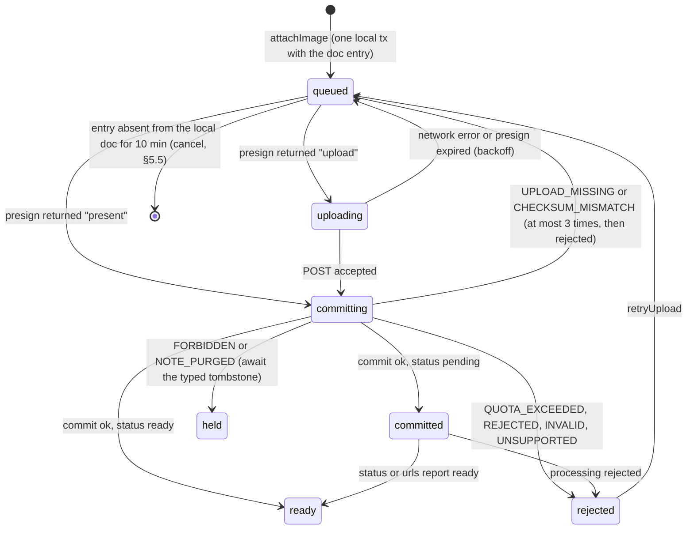
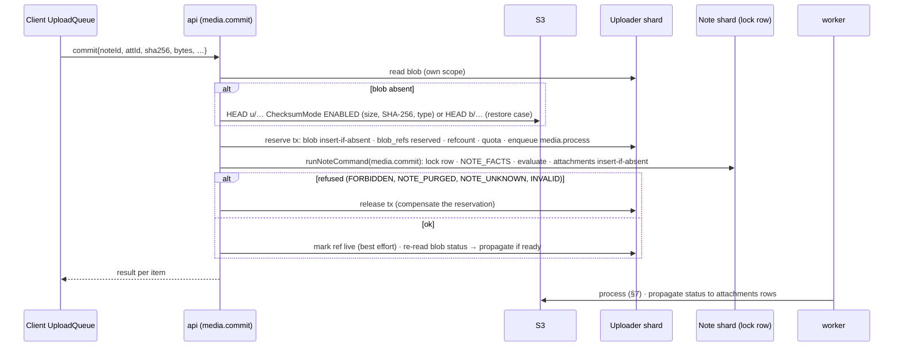
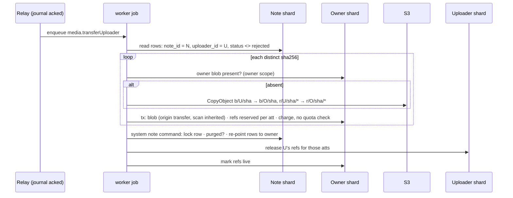

# 10 · Media: uploads, storage, delivery, derived data and content safety

*Detail design · elaborates spine v1.2 · 2026-10-04 · Status: draft for review*

## 1. Purpose and scope

This document owns attachment bytes and the server-derived data that comes from them or from URLs in notes:

- the client **UploadQueue**, image preparation on device, the local blob cache and media source resolution;
- the `media.*` oRPC contracts (presign, commit, urls, session cookies, status, quota, OCR, missing-rendition reports);
- the S3 key layout, bucket configuration, CRR and the replica purge;
- per-uploader blob scope, reference counting, quota and garbage collection;
- cross-scope copies (Make a copy) and ownership transfer when an uploader departs;
- the sharp pipeline and renditions;
- CloudFront signed URLs and signed cookies;
- OCR (device and server), the link-preview unfurl service and its SSRF controls;
- the CSAM hook and the quarantine path;
- the media parts of note purge, account erasure, restore and region loss.

Shipping: uploads, renditions, delivery, quota, GC, CRR and the replica purge in **M2**; ownership transfer and the CSAM gate with sharing in **M3**; OCR, link previews and "Grab image text" in **M4** (spine §8, D-40, D-50).

### Out of scope

| Topic | Owner |
|---|---|
| Attachment doc entry layout, `NoteDocWriter.addAttachment/removeAttachment`, Projector, `DerivedInputs`, `PLink`, `PAtt` | `01-domain-model.md` §9, §15 |
| Authorization predicates, `defineNoteCommand`, `runNoteCommand`, `runSystemNoteCommand`, `canReadDoc`, removal procedure, `note.copy` op | `08-sharing-and-authz.md` §4, §10, §13 |
| Physical DDL, purge-hook registry, deletion ledger, restore runbook, replica role and journal | `13-data-platform.md` §3.11, §7, §8, §9 |
| `withShardWrite`, lock order, outbox writer and relay, compactor, `compact_due` bits | `03-sync-server.md` §6, §8, §9 |
| `attachment_local`, `blob_cache` DDL, `CoreModule`, `WriteQueue`, `FileStore`, purge path, `localCopy` | `04-client-core.md` §3, §7, §10.4, §14.4, §16 |
| Carousel UI, image paste routing, editor `AttachmentView` | `05-editor.md` §5.4, §7.6 |
| Grid rendering, lightbox, web CSP (06); native viewer, picker, share targets, `MediaPlatform` implementation (07) | `06-web-app.md`, `07-mobile-app.md` |
| CSAM vendor, NCMEC reporting, evidence store, Web Risk vendor, abuse policy, residual-risk register | `15-security-privacy-compliance.md` |
| CDK, networking, alarm routing, cost dashboards | `14-infra-and-operations.md` |
| Drawings, audio and transcription (later; `kind` values exist, commit refuses them in v1) | Future design docs |
| Export ZIP content and its `x/` objects (this doc only owns the prefix row in §4.1) | 12 §13, 15 |

## 2. Spine references

| ID | What this document does with it |
|---|---|
| D-39 | Per-uploader keys, presigned POST with checksum, commit = HEAD + checksum, own-scope `present`, ownership transfer as an X-06 hook, signed URLs (15 min) and own-prefix cookies (1 h), CRR with delete-marker replication, replica purge through the narrow role (§4, §6, §8–§10) |
| D-40 | Device HEIC → JPEG ≤ 3,072 px q85, EXIF stripped, thumbhash, SHA-256; sharp magic-byte and 25 MP checks, re-encode, WebP 256 and 1,024 px; device OCR plus `tesseract.js` for web uploads (§5.2, §7, §11.2) |
| D-50 | Editor WebView images from the CDN or data URIs only (C-67); CSAM hash matching in shared notes; unfurl controls (§5.7, §11.3, §12) |
| P-13 | Input ≤ 10 MB and ≤ 25 MP; masters ≤ 3,072 px JPEG q85; no originals on the free tier (§5.2, §7) |
| P-14 | 5 GB per account charged to the uploader; same-scope copies cost no bytes; transfer to the owner on departure; over quota blocks only new uploads (§8.2, §9) |
| X-16 | Every uploaded or fetched image is re-encoded; SSRF-safe unfurl egress (§7, §11.3) |
| X-06 | Purge hooks `attachments.release`, `link_previews.delete`, account prefix purge, both buckets (§9.4, §8.4) |
| X-01, X-20 | No URLs, file names or text in logs, labels or job payloads; no user IDs in the doc entry (§4.3, §15) |
| X-10, X-12, X-14, X-15 | Brownout rungs "link unfurl" and "server OCR"; upload rate limits; offline UX; prefetch respects Data Saver and Low Power (§5.6, §14) |
| D-20 | Media uses its own queue so bytes never block text; media commit is `blocked_on` `create:` (§5.3) |
| D-23, C-42 | OCR text and link previews reach projections through `DerivedInputs` (§11.1) |
| D-24, INV-10 | The compactor stays the only server doc writer; derived refresh uses its normal append path (§11.1) |
| D-28, §5.7 | `media.urls` authorizes through the read cache (≤ 60 s); issued URLs live ≤ 15 min (§6.5) |
| D-32, C-10 | Transfer jobs are journal-gated outbox `job` rows (§9.2) |
| D-34 | pg-boss queues for processing, scans, OCR, unfurl, copies and transfers (§3.1) |
| D-45, C-35 | CRR of masters from M2; replica bucket in the backup account; replica purge role (§4.2, §8.4, §13) |
| C-67 | ≤ 1,024 px data URIs for visible carousel images when offline or before upload (§5.7) |
| C-78 | `note.copy` attachment rows and the `media.copyForNote` job (§9.1) |
| INV-1, INV-3, INV-4, INV-5, INV-8, INV-12, INV-13 | Local-first attach, idempotent commits, docs never edited by media, in-transaction ACL on commit, no identifiers in docs, unsynced images kept with drafts, purged notes refuse media (§5, §6.4, §9, Testing) |
| §5.4 step 6 | Thumbnail prefetch for the first 200 cards; masters on open or with "Download images for offline" (§5.6) |
| T-16 | Every key carries a logical shard, so an EU cell copies prefixes by shard (§4.1) |

## 3. Interfaces

### 3.1 Owned here

| Interface | Section | Consumers |
|---|---|---|
| `media.*` oRPC contract (`packages/api-contract/src/media.ts`) | §6.2 | 04, 06, 07 |
| `MediaApi` (the `CoreApi.media` facade), `LocalFileRef`, `MediaRef`, `MediaSource`, `AttachmentThumb`, `AttachmentStatusView` | §5.1, §5.7 | 04, 06, 07 |
| `MediaPlatform` (image preparation, upload, download, device OCR) | §5.2 | implemented by 06, 07 |
| `MediaSourceResolver` (grid, viewer and editor sources) | §5.7 | 04 (`EditorContext.attachments`), 06, 07 |
| `MEDIA_UX` (media error-to-UX table, same `UxEntry` shape as 02's `SYNC_UX`) | §5.8 | 06, 07 |
| S3 key layout, bucket policy, lifecycle and CRR rules | §4.1, §4.2 | 13, 14, 15, 12 (`x/`) |
| Semantics of `attachments`, `blobs`, `blob_refs`, `link_previews` (DDL adopted by 13) | §4.3 | 13, 03, 08, 11 |
| Job queues and payloads: `media.process`, `media.scan`, `media.ocr`, `media.transferUploader`, `media.copyForNote` (payload adopted from 08 §13.3), `media.unfurl`, `media.regenRenditions`; crons `media.blobGc`, `media.attGc`, `media.previewGc`, `media.refAudit` | §7–§12 | 03 (outbox `job` kind), 08, 13 |
| `uploaderTransfer(writer, args)` emitter helper | §9.2 | 08 (removal procedure) |
| `MediaProjectionHook.onProjected` | §8.3, §11 | 03 (compactor) |
| `requestDerivedRefresh(tx, note)` | §11.1 | internal; 03 implements the reason bit |
| `media.pendingTransfers(userId)`, `media.purgeUploaderPrefix(userId)` | §9.3 | 12 (saga steps 3 and 6) |
| Purge hooks `attachments.release`, `link_previews.delete` | §9.4 | 13 registry, 03 `note.purgeData` |
| `MediaImporter.ingest` (Takeout import, P-30) | §6.7 | importer (03) |
| Unfurl service HTTP contract and `UnfurlPolicy` | §11.3 | 14 (deployment) |
| `MediaSafety` hook interface (CSAM scan, incident, URL reputation) | §12 | implemented by 15 |
| CloudFront media distribution behaviors, signing keys, CORS and response headers | §10 | 14 |

### 3.2 Consumed

| Owner | What this document relies on |
|---|---|
| 01 | `AttachmentEntry` fields `kind, order, mime, bytes, w, h, durMs, thumbhash, alt` (§9.1, §9.4); `NoteDocWriter.addAttachment`, `removeAttachment`, `setAttachmentOrder`; `keyBetweenSafe` append placement (§7.5); `LIMITS.IMAGE_INPUT_MAX_BYTES = 10 MiB`, `IMAGE_INPUT_MAX_PIXELS = 25,000,000`, `IMAGE_MASTER_MAX_PX = 3,072`, `ATTACHMENTS_MAX = 50`, `SEARCH_EXTRA_MAX`; `DerivedInputs{source:'server', ocr[], links[]}` and `LinkPreviewRow` (§15.1); `PLink {h, u, ti?, si?, im?}`; `normalizeUrl`, `URL_RE`; `Facet.HAS_IMAGE`, `HAS_OCR_TEXT`, `HAS_LINK_PREVIEW`; plain UUIDv7 attachment IDs (§5.2) |
| 08 | `canReadDoc(ReadFacts)` and the read-cache rules RC-1 to RC-8 (§4.7); `defineNoteCommand`, `runNoteCommand`, `runSystemNoteCommand`, `NOTE_FACTS`, `evaluate('media.commit', f)` (§4.4, §4.5); policy rows `media.commit` and `read.media` (§4.3); the removal procedure emits the transfer for an **active** departing member (§10.1); `note.copy` inserts `pending` attachment rows with `uploader_id = copier` and emits `media.copyForNote` (§13.3); fixture matrix points E13 (`media.urls`), E14 (`media.commit`) and fixture F14 (departed uploader) (§19.1) |
| 03 | `withShardWrite`, `ShardTx`, the global lock order (§6.1); `OutboxWriter.job(name, data, singletonKey, opts)` with automatic journal dependency (§9.3); `Appender.append` with `SYSTEM_PRINCIPAL` and `ifContentSeq` (§8.2); `ReadAuthzCache`; the compactor reads `attachments.ocr_text` and `link_previews` for `DerivedInputs` (§8.2 step 2); `note.purgeData` runs `hooksFor('note')` (§6.8) |
| 13 | `ShardRouter` (§5.2), `ops.enter_shard_write` (§5.3), `registerPurgeHook` (§8.5), `DeletionLedger.isLedgered` (§8.1), `keep.purge_runs`, the replica bucket and the cross-account delete role (§7.3), the restore runbook step 7e (§9.6) |
| 04 | `CoreModule` (`init`, `onPurgeNote`, `onWipe`), `WriteQueue.run`, `Tx`, `FileStore.dir('blobs')`, `Crypto.sha256`, `Net.fetch`, `Connectivity`, `Background.power()`, `blocked_on` key `create:<noteId>` (§9.3), `attachment_local` and `blob_cache` tables (§7.2), `localCopy` calling `media.requeueFromCache` (§14.4) |
| 05 | `AttachmentView {id, status, src}`, `INTENT{refreshMedia}`, `INTENT{openImage}`, `INTENT{pasteImage}`; removing an image is a replica edit with origin `attach` (§5.4) |
| 12 | Credentials: foreground media calls use the KSP JWT or the session (`jwt-or-session`, 12 §3.2, §8.3); `IdentityRequestContext` (§4.6); saga steps 3 and 6 call §9.3 |
| 15 | Implements `MediaSafety` (§12); owns the evidence store and NCMEC reporting (Q-02) |

## 4. Storage model

### 4.1 Key layout

One media bucket per environment, `keep-media-<env>` in us-east-1. `{s}` is a decimal logical shard, `{sha}` 64 lower-case hex characters of the SHA-256 of the **uploaded** bytes (the blob identity, never the master's hash), `{uid}` the scope owner's user ID.

| Prefix | Key | Content | Written by | CRR | Lifecycle | Served |
|---|---|---|---|---|---|---|
| `u/` | `u/{s}/{uid}/{sha}` | Raw client upload (staging) | Client, by presigned POST | No | Current 2 d; non-current 1 d | Never |
| `b/` | `b/{s}/{uid}/{sha}` | Master: re-encoded JPEG ≤ 3,072 px | `worker` (pipeline, copy, transfer) | **Yes** | Intelligent-Tiering at day 0; non-current 30 d | `/b/*`: own-prefix cookie or signed URL |
| `r/` | `r/{s}/{uid}/{sha}/{w256\|w1024}.webp` | Renditions | `worker` | No | Non-current 1 d | `/r/*`: cookie or signed URL |
| `p/` | `p/{noteShard}/{noteId}/{imageId}.webp` | Link-preview images | `worker` (bytes from the unfurl service) | No | Non-current 1 d | `/p/*`: signed URL |
| `v/` | `v/{noteShard}/{noteId}/{ms}.yjs` | Version snapshots (03 §8.6) | Compactor | **Yes** | Current 30 d; non-current 30 d | Never (P-26 text download goes through `api`) |
| `x/` | `x/{s}/{uid}/{exportId}.zip` | Exports (12 §13) | `worker` | No | Current 7 d; non-current 1 d | `/x/*`: signed URL (12) |

- Raw client bytes never sit at a served or replicated key: clients can write only `u/`, and only the pipeline writes `b/`, `r/` and `p/` (bucket policy, §4.2). This is how the spine's "commit = HEAD plus a checksum check" (D-39) and "every uploaded image is re-encoded" (X-16) compose (Spine issue SI-10-4).
- Every key leads with a logical shard, so T-16 moves EU data by copying `b/{s}/…`, `r/{s}/…`, `v/{s}/…` and `p/{s}/…` for the EU-range shards.
- 512+ shard prefixes spread S3 request load; no hash salting is needed.

### 4.2 Bucket configuration

| Setting | Value |
|---|---|
| Versioning | On. Bucket-wide rule: non-current versions expire after 30 days; expired delete markers removed (D-39). Prefix rules above add shorter expiries where listed |
| Encryption | SSE-KMS with S3 Bucket Keys, prod CMK; the CMK policy grants `kms:Decrypt` to the CloudFront service principal with `aws:SourceArn` = the media distribution (OAC) |
| Access | Block Public Access on; Object Ownership `BucketOwnerEnforced`; TLS-only (`aws:SecureTransport`) |
| Bucket policy | `s3:PutObject` on `b/*`, `r/*`, `p/*`, `v/*`, `x/*` allowed **only** to the `worker` role. The `api` role may `PutObject` only on `u/*` (it signs presigned POSTs, so a POST can never target any other prefix) and `GetObject`/`HeadObject` on `u/*` and `b/*`. `cloudfront.amazonaws.com` may `GetObject` on `b/*`, `r/*`, `p/*`, `x/*` with `aws:SourceArn` = the distribution. Explicit deny of `s3:PutBucketVersioning`, `s3:PutLifecycleConfiguration`, `s3:PutReplicationConfiguration` to every service role |
| CRR | Two rules, filters `Prefix: b/` and `Prefix: v/`, **DeleteMarkerReplication Enabled**, `SourceSelectionCriteria.SseKmsEncryptedObjects` Enabled, destination `keep-media-replica` in the us-west-2 backup account with `ReplicaKmsKeyID` = the backup-account CMK, owner override to the destination account, storage class `STANDARD_IA` (pricing UNVERIFIED, Q-06 review). On from M2 (D-39, D-45). Prefix filters, not tag filters, because delete-marker replication is unavailable for tag-filtered rules |
| Replica bucket | Owned by 13 §7.3: same 30-day non-current expiry and expired-delete-marker cleanup; prod can only `s3:DeleteObjectVersion` on `b/*` and `v/*` through the cross-account role (C-35). S3 replication preserves version IDs, so the purge deletes replica versions by the source's version IDs without listing the replica |
| CORS | Not configured on S3 (CloudFront answers CORS, §10). Presigned POST from browsers targets the regional S3 endpoint, which needs a CORS rule: `AllowedOrigins: https://app.<domain>`, `AllowedMethods: POST`, `AllowedHeaders: *`, `MaxAgeSeconds: 600` |
| Inventory | Daily S3 Inventory of both buckets (key, version, size, replication status) to `keep-inventory-<env>`, used by the ref audit and restore reconciliation (§8.5, §13) |

### 4.3 Relational model

13 owns the DDL (13 §3.11). These are the semantics and the additive columns this design needs (Cross-doc issue CD-1).

**`attachments`** (the note's shard; one row per attachment entry that was committed):

| Column | Semantics |
|---|---|
| `shard_id`, `att_id`, `note_id` | The note's shard; `att_id` is the doc entry's key (01 §9.1) |
| `uploader_id`, `uploader_shard` | The scope that holds the bytes (`b/{uploader_shard}/{uploader_id}/{sha256}`). The committing member at first; re-pointed to the owner on transfer (§9.2) |
| `kind` | `image` in v1; `drawing` and `audio` are refused at commit with `UNSUPPORTED` |
| `sha256` | Blob identity (§4.1) |
| `mime`, `bytes`, `w`, `h` | Declared at commit; overwritten with the master's values when processing finishes |
| `status` | `pending` (committed, not processed), `ready` (renditions exist), `rejected` (see `reject_reason`), `lost` (bytes gone after a restore, 13 §9.6) |
| `renditions` | `{"w256":{"w":…,"h":…,"bytes":…},"w1024":{…},"master":{…}}` |
| **+** `reject_reason` | `undecodable`, `unsupported`, `too_many_pixels`, `too_large`, `checksum`, `policy`, `quota`, `source_gone` |
| **+** `scan` | `none` (only the uploader has read it), `required` (a cross-user read is pending a scan), `clear`, `match` (§12) |
| `ocr_text`, `ocr_status` | OCR text (≤ 4,096 UTF-16 units) and `none`, `pending`, `done`, `failed`, `skipped` |
| **+** `ocr_engine`, `ocr_lang` | `vision`, `mlkit`, `tesseract`; BCP 47 hint |
| `unreferenced_at` | Set while the note's doc has no entry for `att_id` (§8.3) |
| **+** `updated_at` | Last write (audit) |

**`blobs`** (the scope owner's shard; one row per `(uploader, sha256)`):

| Column | Semantics |
|---|---|
| `bytes` | Charged bytes: the declared upload size while `staged`, the master's size once `ready`, 0 once `rejected` (rejected bytes are never charged) |
| `refcount`, `zero_since` | `refcount` = number of `blob_refs` rows; `zero_since` set while it is 0 (13's CHECK) |
| **+** `status` | `staged` (staging object verified, not processed), `ready`, `rejected`, `deleting` (GC in progress) |
| **+** `origin` | `upload`, `copy`, `transfer`, `import`, `restore` |
| **+** `mime_in`, `w`, `h`, `renditions`, `processed_at` | Pipeline results |
| **+** `scan`, `scanned_at` | `none`, `pending`, `clear`, `match`, `error` |
| **+** `ocr_text`, `ocr_status`, `ocr_engine`, `ocr_lang` | Per-content OCR, copied into `attachments` rows |
| **+** `reject_reason`, `created_at`, `deleting_since` | — |

**`blob_refs`** (new, the scope owner's shard; Spine issue SI-10-3): one row per attachment that points at a blob, so reference counting is idempotent per attachment across clusters and auditable.

```sql
CREATE TABLE keep.blob_refs (
  shard_id     smallint    NOT NULL CHECK (shard_id BETWEEN 0 AND 4095),   -- = blobs.shard_id (scope owner's shard)
  uploader_id  uuid        NOT NULL,
  sha256       bytea       NOT NULL,
  att_id       uuid        NOT NULL,
  note_shard   smallint    NOT NULL,
  note_id      uuid        NOT NULL,
  state        text        NOT NULL CHECK (state IN ('reserved','live')),
  created_at   timestamptz NOT NULL DEFAULT now(),
  PRIMARY KEY (shard_id, uploader_id, sha256, att_id)
);
CREATE UNIQUE INDEX blob_refs_att      ON keep.blob_refs (shard_id, att_id);
CREATE INDEX        blob_refs_reserved ON keep.blob_refs (created_at) WHERE state = 'reserved';
CREATE INDEX        blobs_deleting     ON keep.blobs (deleting_since) WHERE status = 'deleting';
CREATE INDEX        blobs_staged       ON keep.blobs (created_at) WHERE status = 'staged';
```

**`link_previews`** (the note's shard): `url_hash` = SHA-1 of 01's `normalizeUrl(url)` (the same key as `hiddenLinks`, so `PLink.h` is its hex); `url` is the text as it appears in the note; `title` ≤ 200 and `site` ≤ 100 UTF-16 units; `image_att` is the **preview image ID** (a plain UUIDv7, object `p/{shard}/{noteId}/{image_att}.webp`, never an `attachments` row); `status` ∈ `pending`, `ok`, `none` (not HTML or no metadata), `blocked` (policy), `error` (retryable), `failed` (terminal); additions **+** `reason`, `fail_count`, `next_fetch_at`, `image_w`, `image_h`, `image_bytes`, `image_scan`, `created_at`, `unreferenced_at`.

**Lock levels** (03 §6.1, Cross-doc issue CD-6): `attachments` and `link_previews` are level 3 and are written only by transactions that hold the note's lock row (level 2) `FOR UPDATE`; `blobs` then `blob_refs` are level 6, after `restore_waits`; the quota counter `users_sync.storage_bytes` is level 7. Multi-row writes sort by key.

The doc entry carries no uploader, hash or URL of a stored object (INV-8, X-20). The relational rows are deletable and are covered by purge hooks.

### 4.4 Media invariants

| ID | Invariant | Mechanism | Test |
|---|---|---|---|
| M-1 | **Reference before pointer, unpoint before release.** No `attachments` row points at a blob key unless a `blob_refs` row for that attachment exists in that scope, except a `pending` copy row whose target blob does not exist yet | Commit reserves before inserting the row (§6.4); transfer reserves the owner's ref before re-pointing and releases the uploader's ref after (§9.2); GC deletes only at `refcount = 0` (§8.4) | T10-05 property, T10-06 |
| M-2 | **No cross-user oracle.** Nothing a user can call reveals whether a blob exists in another user's scope | `present` is answered from the caller's own scope only; URLs are minted only for `attachments` rows of notes the caller can read | T10-09 |
| M-3 | **Only pipeline output is served or replicated** | Bucket policy (§4.2); POST policy pins `u/` keys | T10-10 |
| M-4 | **Quota equals the sum of charged bytes of the user's blobs with `refcount > 0`** | Charged and credited in the same transaction as each 0 ↔ 1 transition (§8.2) | T10-05, nightly audit |
| M-5 | **Purge reaches every copy.** After a note purge plus GC grace, or after account saga step 6, no version of the affected objects remains in either bucket, except evidence preserved by 15 | §8.4, §9.3, §9.4 | T10-14 |
| M-6 | **Derived freshness.** An OCR or link-preview write reaches the note's projection within one compaction cycle | §11.1 | T10-17 |

## 5. Client: attach, upload, cache and display

### 5.1 `MediaApi` and the attach transaction

`UploadQueue` is a `CoreModule` (04 §3.3). It runs in the web leader's DB worker and on the Hermes JS thread.

```ts
// packages/sync-client/src/media/api.ts — owned by 10; exposed as CoreApi.media (04 §4.2)
export type Rendition = 'w256' | 'w1024' | 'master';

export type LocalFileRef =
  | { platform: 'native'; uri: string; mime?: string; width?: number; height?: number; bytes?: number;
      source: 'picker' | 'camera' | 'clipboard' | 'share' | 'intent' }
  | { platform: 'web'; blob: Blob; name?: string; source: 'picker' | 'drop' | 'paste' };

export interface MediaApi {
  /** Prepares the image (§5.2), then ONE local transaction: doc entry + attachment_local + pinned cache rows (INV-1).
   *  Materializes an ephemeral note (P-23: an attachment is first content). Throws CoreError with detail
   *  'too_large' | 'too_many_pixels' | 'unsupported' | 'undecodable' (INVALID_ARG) or STORAGE_FULL. */
  attachImage(noteId: NoteId, file: LocalFileRef): Promise<AttachmentId>;
  attachImages(noteId: NoteId, files: readonly LocalFileRef[]): Promise<AttachmentId[]>;   // picker multi-select, in order
  /** Short in-process DocPort session: removeAttachment (C-61). Upload cancellation follows §5.5. */
  removeAttachment(noteId: NoteId, id: AttachmentId): Promise<void>;
  /** After QUOTA_EXCEEDED or a transient failure shown to the user. */
  retryUpload(id: AttachmentId): Promise<void>;
  resolve(ref: MediaRef, opts?: ResolveOpts): Promise<MediaSource>;           // §5.7
  peek(ref: MediaRef): MediaSource | null;                                    // synchronous cache lookup for first paint
  status(noteId: NoteId): LiveQuery<readonly AttachmentStatusView[]>;
  quota(): Promise<QuotaView | { unavailable: 'offline' }>;                 // online only (X-14)
  /** M4 "Grab image text": device OCR on the cached master (native) or the server's OCR text (web). */
  grabText(noteId: NoteId, id: AttachmentId): Promise<{ text: string } | { unavailable: 'offline' | 'not_ready' | 'none' }>;
  /** Per-device setting "Download images for offline" (ui_state 'media.offline'). */
  setOfflineImages(mode: 'off' | 'wifi' | 'any'): Promise<void>;
}

export interface AttachmentStatusView {
  id: AttachmentId;
  phase: 'local' | 'uploading' | 'processing' | 'ready' | 'rejected' | 'missing' | 'lost';
  reason?: RejectReason;                         // §6.2
  progress?: number;                             // 0..1 while uploading, when the platform reports it
}
export interface AttachmentThumb {               // CardPayload.attachments (04 §5.3), ≤ 4 per card
  id: AttachmentId; kind: 'image' | 'drawing' | 'audio'; w: number; h: number; thumbhash: string;
  phase: AttachmentStatusView['phase'];
}
```

**`attachImage` algorithm:**

1. Local checks: 08's `can.editContent` on the local row (else `NOT_PERMITTED`); a trashed note is read-only (`NOTE_READ_ONLY('trashed')`, P-03).
2. `MediaPlatform.prepareImage(file)` (§5.2), outside any transaction. It writes the master and two display copies under `FileStore.dir('blobs')/pending/`.
3. Mint `attId` (01 plain UUIDv7). `order = keyBetweenSafe(attachmentsSorted, attachmentsSorted.length)` (01 §7.5, append).
4. One priority-0 transaction through `DocStore.applyLocalWith` (Cross-doc issue CD-4):
   - doc write `addAttachment({id, kind: 'image', mime: 'image/jpeg', bytes, w, h, thumbhash, alt: null, order})` (01 §9.5);
   - `attachment_local` row `state = 'queued'` with `sha256`, `mime`, `bytes`, `w`, `h`, `local_path`, `created_at`;
   - `blob_cache` rows `(attId, 'w256')`, `(attId, 'w1024')`, `(attId, 'master')`, all `pinned = 1`;
   - if the note is ephemeral, the materialization rows (04 §11.4).
5. After commit: wake the queue. Open editor replicas receive the entry as a remote update (05 G4), so adding an image is not in the editor's undo history; removing one is (05 §5.4).

### 5.2 `MediaPlatform` and image preparation

```ts
// packages/sync-client/src/media/platform.ts — owned by 10; implemented by 06 (web) and 07 (native)
export interface MediaPlatform {
  prepareImage(src: LocalFileRef, limits: PrepareLimits): Promise<PreparedImage>;   // throws PrepareError
  upload(req: UploadRequest, signal: AbortSignalLike): Promise<UploadResult>;
  download(req: { url: string; headers?: Record<string, string>; toPath: string; maxBytes: number },
           signal: AbortSignalLike): Promise<{ status: number; bytes: number; contentType: string | null }>;
  readDataUri(path: string, mime: 'image/jpeg' | 'image/webp', maxBytes: number): Promise<string | null>;
  recognizeText?(path: string, hint: { lang?: string }): Promise<{ text: string; engine: 'vision' | 'mlkit' }>;   // native, M4
}
export interface PrepareLimits { inputMaxBytes: number; inputMaxPixels: number; masterMaxPx: number; jpegQuality: number }
export interface PreparedImage {
  masterPath: string; mime: 'image/jpeg'; bytes: number; w: number; h: number;
  sha256: string;                 // hex, of the master file bytes (the bytes that will be uploaded)
  thumbhash: string;              // base64
  display: { w256: string; w1024: string };   // local JPEG q80 display copies (C-67)
}
export class PrepareError extends Error {
  constructor(readonly code: 'too_large' | 'too_many_pixels' | 'unsupported' | 'undecodable' | 'storage_full') { super(code); }
}
export interface UploadRequest {
  url: string; fields: Record<string, string>; filePath: string; mime: string; bytes: number;
  background: boolean;            // native: continue in an OS background session when supported
}
export type UploadResult = { ok: true; status: 204 | 201 | 200 } | { ok: false; status: number | null; retryable: boolean };
```

| Step | Native (07) | Web (06, in the DB worker) |
|---|---|---|
| Size check | `bytes ≤ 10 MiB` from the picker asset or file stat, else `too_large` (P-13) | `blob.size` |
| Pixel check before decode | Picker `width × height ≤ 25,000,000`, else `too_many_pixels` | Parse JPEG SOF / PNG IHDR / GIF / WebP headers in JS (no decode) |
| Decode, orient | `expo-image-manipulator@57.0.20` (bakes EXIF orientation, converts HEIC) | `createImageBitmap(blob, {imageOrientation: 'from-image'})`; a browser that cannot decode (HEIC on Chrome or Firefox) → `unsupported` |
| Downscale | Long edge ≤ 3,072 px, never upscale | `OffscreenCanvas` |
| Encode master | JPEG q0.85, metadata dropped (D-40) | `convertToBlob({type: 'image/jpeg', quality: 0.85})` (canvas output carries no EXIF) |
| Display copies | Long edge 256 and 1,024, JPEG q0.80 | Same |
| Thumbhash | `expo-image@57.0.5` `Image.generateThumbhashAsync` (**UNVERIFIED** on SDK 57; fallback: JS `thumbhash` on a ≤ 100 px RGBA copy) | `thumbhash` (JS) on a ≤ 100 px `getImageData` |
| SHA-256 | `Crypto.sha256` (04 §16.3) over the master file | `crypto.subtle.digest` |
| Write | `FileStore.write` (atomic) | OPFS through `FileStore` |

Animated GIF and WebP become their first frame. Transparency is flattened onto white (masters are JPEG, P-13). Accepted inputs: JPEG, PNG, GIF, WebP and HEIC/HEIF (native; web only where the browser decodes it).

### 5.3 Upload state machine



`attachment_local.state` values are 04's (`queued`, `uploading`, `committing`, `committed`, `ready`, `rejected`, `remote`); `held` is `committing` with `last_code` set to the await-tombstone code, so 04's CHECK needs no change. Additive columns requested from 04 (CD-4): `reject_reason`, `last_code`, `server_status`, `checked_at`, `url_path`, `ocr_state`, `lang`, `created_at`.

**Rules:**

| Rule | Value |
|---|---|
| Preconditions | Presign and upload start at once (bytes are in the uploader's scope, not the note's). **Commit** waits for `create:<noteId>` (04 §9.3, D-20) |
| Batching | Presign and commit carry ≤ 20 items per call; items of different notes may share a call |
| Concurrency | Uploads in flight: 2 on Wi-Fi or Ethernet, 1 on cellular (native); 3 (web) |
| Backoff | Network errors, 5xx, `RETRY_LATER`, `NOTE_UNKNOWN`: full jitter 1 s → 5 min, honoring `retryMs` and `Retry-After` |
| Presign expiry | 15 min; an expired grant is re-requested, never reused |
| `UPLOAD_MISSING`, `CHECKSUM_MISMATCH` | Re-upload at most 3 times, then `rejected` with reason `checksum`; telemetry |
| `QUOTA_EXCEEDED` | `rejected(quota)`; the image shows "Storage full" with Manage storage and Remove; `retryUpload` re-queues (P-14) |
| `FORBIDDEN`, `NOTE_PURGED` | Held; the typed tombstone runs the purge path (§5.5); never retried blindly (spine §5.3 class `await_tombstone`) |
| Restart | On core start: `uploading` → `queued`; `committing` → commit re-sent (idempotent on `attId`, §6.4) |
| Web leadership handoff | In-flight POSTs abort with the old worker; the new leader restarts them (a repeated POST to the same `u/` key is harmless) |
| Native background | `upload({background: true})`: iOS background URL session through `expo-file-system` (`uploadAsync` with a background session, **UNVERIFIED** in SDK 57/58, OQ-10-3). The commit runs at the next JS run: foreground, a `bg-flush` window or a background task |
| Server status polling | For `committed` items and `remote` items with `server_status = 'pending'` while visible: 3 s, 10 s, 30 s, 2 min, then every 10 min while the note is open |

### 5.4 Server-derived state on the client

`attachment_local` rows with `state = 'remote'` cache what this device learned about attachments it did not upload: `server_status` (`pending`, `ready`, `rejected`, `lost`, `missing`), `checked_at` and, for own-scope blobs uploaded from another of the user's devices, `url_path`. They are created lazily on first resolution and deleted with the note. A `missing` answer from `media.urls` (no server row) on a device that holds the bytes (`sha256` known and a cached master or pending file) re-queues a commit: this is how attachments re-appear after a restore (13 §9.6 step 7e) or after an attachment row was garbage-collected while an offline peer still referenced it (§8.3).

### 5.5 Removal, cancellation, purge and recovered drafts

- **Removal is a doc edit** (05 §5.4, C-61) and can be undone in the editing session. The queue therefore never cancels on the edit itself. A periodic check (every 60 s, and on note close) cancels an upload whose entry has been absent from the local doc for ≥ 10 min and that is not yet `committing`: it deletes the `attachment_local` row, the pending files and the pinned cache rows. Committed attachments are cleaned up by the server (§8.3).
- **`onPurgeNote(tx, noteId, reason)`** (04 §10.4 step 6): delete `attachment_local` rows of the note; delete `blob_cache` rows of its attachments and preview images, and delete each file only when no other `blob_cache` row references the same path (copies alias paths, 08 §13.2).
- **Unsynced images and INV-12.** Before deleting, for every row still in `queued`, `uploading` or `committing` (never committed, so never acknowledged), move the master and display files to `FileStore.dir('blobs')/drafts/{draftId}/` and record them with the note's recovered draft (`recovered_draft_media`, CD-4). "Keep" builds the new private note with 04's `localCopy` and re-uploads the images through `requeueFromCache` into the user's own scope; "Discard" deletes the files. Committed images are not kept: their server copy belonged to the note (Spine issue SI-10-5).
- **`onWipe()`**: delete `FileStore.dir('blobs')` entirely (sign-out, account switch).
- **`requeueFromCache(tx, newNoteId, attMap)`** (04 §14.4): for each `[srcAttId, newAttId]` whose cached master (else `w1024`) exists, insert `attachment_local(newAttId, state 'queued', local_path = a copy of the cached file)` with the `sha256` of that file; the new note's doc entry already exists in the seed. WebP inputs are allowed for this path (§6.2).

### 5.6 Blob cache and prefetch

`blob_cache` (04 §7.2) holds every byte this device shows. Paths: `FileStore.dir('blobs')/{id[0..1]}/{id}.{rendition}`; preview images use the preview image ID with rendition `p`. `FileStore.excludeFromBackup` covers the directory (04 §16.5).

| Rule | Value |
|---|---|
| Budget | 500 MB mobile, 200 MB web (spine §4.4). After an insert above budget, evict unpinned rows by `last_used_at` to 90%, skipping attachments of open notes |
| Pinned | Pending-upload files until `ready`; then the display copies are unpinned and stay as the `w256`/`w1024` entries, and the master stays as `master`. Server renditions are never re-downloaded over equivalent local copies |
| Touch | `last_used_at` updates are batched (one priority-4 transaction per 5 s) |
| First 200 cards | After the bootstrap metadata stream, prefetch `w256` for the first 200 cards with images, in display order (spine §5.4 step 6) |
| Visible cards | Resolve with priority `visible`. Rendition choice: `w256` when the card needs ≤ 320 device pixels on the long edge, else `w1024` (progressive: show a cached `w256` while `w1024` loads) |
| Note open | `w1024` for the carousel; `master` when the viewer or lightbox opens |
| "Download images for offline" | Mobile, per device: `off` (default), `wifi` or `any`. When on: `w1024` and `master` for every hydrated note, idle only, 2 at a time, stopping at 90% of budget with "Not enough space for offline images" |
| Web | `w256` for every note in the background after hydration (idle); `w1024` on open (P-22) |
| Data Saver, Low Power (X-15) | No prefetch; visible and opened items only |
| Download concurrency | 3 native, 4 web; full-jitter retry 1 s → 2 min; `403` on a signed URL refreshes it once |

### 5.7 Source resolution

```ts
// packages/sync-client/src/media/resolver.ts — owned by 10
export type MediaRef =
  | { noteId: NoteId; attId: AttachmentId; rendition: Rendition }
  | { noteId: NoteId; previewImageId: string };
export type MediaSource =
  | { kind: 'file'; uri: string }                                     // native: file:// in FileStore
  | { kind: 'blob'; blob: Blob }                                      // web: OPFS bytes; the main thread makes the object URL
  | { kind: 'url'; url: string; expiresAt: number; headers?: Record<string, string> }
  | { kind: 'placeholder'; thumbhash: string | null;
      reason: 'loading' | 'offline' | 'pending' | 'rejected' | 'missing' | 'lost' };
export interface ResolveOpts { priority?: 'visible' | 'prefetch' | 'viewer'; signal?: AbortSignalLike }

export interface MediaSourceResolver {
  resolve(ref: MediaRef, opts?: ResolveOpts): Promise<MediaSource>;
  peek(ref: MediaRef): MediaSource | null;
  /** EditorContext.attachments[i].src (04 §11.10, 05 §5.4). */
  editorSource(noteId: NoteId, attId: AttachmentId, host: 'web' | 'webview'): Promise<AttachmentView['src']>;
}
```

**`resolve` algorithm:**

1. Cache hit for `(id, rendition)` → `file` or `blob`. A larger cached rendition also satisfies a smaller request.
2. Own scope: the device knows the path when `attachment_local.sha256` exists for an upload of this user, or `url_path` was learned (`b/{homeShard}/{userId}/{sha}`, `r/…/{sha}/{rendition}.webp`). Download with the own-prefix cookie (§6.5), refreshing it when it is within 5 min of expiry.
3. Otherwise `media.urls` (requests coalesced for 50 ms, ≤ 200 items per call). `ok` → download into the cache → `file`/`blob`. `pending` → placeholder plus the polling schedule of §5.3. `rejected`, `lost`, `missing`, `denied` → placeholder with that reason (no retry for `rejected`, `lost`, `denied`; `missing` follows §5.4).
4. Offline and uncached → `placeholder(thumbhash, 'offline')`.

Signed URLs are cached in memory only, keyed by `(id, rendition)` and dropped 60 s before `expiresAt`. Nothing is keyed by URL (D-39).

**Editor sources (C-67, D-50).** The EditorSheet WebView may load images only from `https://media.<domain>` or `data:` URIs.

| Situation | `webview` host | `web` host |
|---|---|---|
| Cached `w1024` (or `w256`) | `{kind: 'data'}` from `readDataUri`, ≤ 400 KB encoded | `{kind: 'blob'}` object URL (CD-5; until 05 adds the kind, `data`) |
| Pending upload | Its local 1,024 px display copy as `data` | Object URL of the display copy |
| Not cached, online | `{kind: 'cdn', url, expiresAt}` for `w1024` from `media.urls`; the core downloads the same rendition into the cache in parallel | Same |
| Not cached, offline | `null` (thumbhash placeholder) | Same |

Data URIs are produced lazily for the visible slide and its neighbours only, at most 4 in flight, and an LRU of 16 encoded strings is kept. `INTENT{refreshMedia}` (05) re-runs `editorSource` for that attachment. Full-size images open in the native viewer from the cached master (D-11).

### 5.8 Media UX table

`MEDIA_UX` uses 02's `UxEntry` shape (02 §8.3) and lives in `sync-client/src/media/ux.ts`. Retryable conditions have no direct UI beyond the unsynced chip (X-14).

| Case | Trigger | Surface | Key | English | Actions |
|---|---|---|---|---|---|
| `image_waiting` | `queued`/`uploading` and offline, or older than 60 s online | inline badge | `media.img.waiting` | Waiting to upload | — |
| `image_storage_full` | `rejected(quota)` | inline + toast | `media.img.storageFull` | Storage full. This image wasn't uploaded. | manage_storage, remove, retry |
| `image_too_large` | `PrepareError too_large / too_many_pixels` | toast | `media.toast.tooLarge` | Images must be under 10 MB and 25 megapixels | — |
| `image_unsupported` | `PrepareError unsupported` or `UNSUPPORTED` | toast | `media.toast.unsupported` | This image format isn't supported here | — |
| `image_failed` | `rejected(undecodable \| checksum)` | inline | `media.img.failed` | This image couldn't be processed | remove |
| `image_removed` | `rejected(policy)` | inline | `media.img.removed` | This image was removed | remove |
| `image_unavailable` | `missing`, `lost`, `rejected(source_gone)` | inline | `media.img.unavailable` | Image unavailable | remove |
| `image_offline` | placeholder `offline` | inline | `media.img.offline` | Available when online | — |
| `copy_quota` | copy row `rejected(quota)` (08 §13.3) | inline | `media.img.copyQuota` | Image not copied: storage full | remove |
| `copy_missing` | `localCopy` dropped uncached images | toast | `media.toast.copyMissing` | {n, plural, one {# image} other {# images}} couldn't be copied | — |
| `former_collaborators` | Settings, `transferredBytes > 0` | inline (settings) | `media.settings.transferred` | Images from former collaborators use {mb} MB | — |
| `offline_space` | prefetch stopped at 90% | inline (settings) | `media.settings.noSpace` | Not enough space for offline images | — |

## 6. Server: `media.*` contracts

### 6.1 Conventions

- Procedures live under `/api/rpc/media.*` (12 §3.3): same-origin `app.<domain>/api` on web, `api.<domain>` on native. Credential: `jwt-or-session` (12 §3.2); device tokens are refused. The principal's `userId`, `userShard` and `deviceId` come from the credential, never from the payload (spine §5.7). A request whose `X-KS-Bound-User` differs from the principal returns HTTP 409 `ACCOUNT_MISMATCH` (INV-18).
- Per-item results inside a `200`; whole-call failures use HTTP 400 (schema), 401 (auth), 409 (`ACCOUNT_MISMATCH`), 429 (`RATE_LIMITED`, `Retry-After`), 503 (`RETRY_LATER`, `Retry-After`).
- Every procedure is idempotent (X-02): presign by `(user, sha256)`, commit by `attId`, the rest are reads or keyed by IDs.
- Rate limits (Valkey token buckets, X-12; on Valkey loss a per-process limiter at 1/4 of the rate): uploads (presign items) 200/h per user; upload bytes 50 MB/day for accounts younger than 7 days (account age from 12's `IdentityDirectory.accountState`, cached 10 min); commits 400/h; `urls` 3,000 items/min; `session` 30/h; `reportMissing` 60 items/h.
- Logs carry IDs, enums, counts and timings only (X-01).

### 6.2 Contract

```ts
// packages/api-contract/src/media.ts — owned by 10; consumed by 04, 06, 07. zod 4, strict on the server.
import { z } from 'zod';
import { oc } from '@orpc/contract';

const Uuid = z.string().uuid();
const Sha256Hex = z.string().regex(/^[0-9a-f]{64}$/);
const UploadMime = z.enum(['image/jpeg', 'image/webp']);          // device-prepared JPEG; WebP only from requeueFromCache
export const Rendition = z.enum(['w256', 'w1024', 'master']);
export const RejectReason = z.enum(['undecodable', 'unsupported', 'too_many_pixels', 'too_large', 'checksum',
                                    'policy', 'quota', 'source_gone']);
export const MediaErrorCode = z.enum(['INVALID', 'UNSUPPORTED', 'TOO_LARGE', 'QUOTA_EXCEEDED', 'RATE_LIMITED',
  'UPLOAD_MISSING', 'CHECKSUM_MISMATCH', 'REJECTED', 'FORBIDDEN', 'NOTE_PURGED', 'NOTE_UNKNOWN', 'RETRY_LATER']);
const ItemError = z.object({ status: z.literal('error'), code: MediaErrorCode,
  reason: RejectReason.optional(), retryMs: z.number().int().optional() });

export const QuotaView = z.object({
  usedBytes: z.number().int(), quotaBytes: z.number().int(),
  transferredBytes: z.number().int(),                               // "Images from former collaborators use N MB" (P-14)
  uploadsLeftThisHour: z.number().int(), newAccountBytesLeftToday: z.number().int().nullable(),
});

// presign
export const PresignItem = z.object({ attId: Uuid, sha256: Sha256Hex,
  bytes: z.number().int().min(1).max(10 * 1024 * 1024), mime: UploadMime });
export const PresignOutputItem = z.discriminatedUnion('status', [
  z.object({ status: z.literal('upload'), url: z.string().url(), fields: z.record(z.string(), z.string()),
             expiresAt: z.number().int() }),
  z.object({ status: z.literal('present') }),
  ItemError,
]);

// commit
export const OcrSubmission = z.object({ text: z.string().max(16_384), engine: z.enum(['vision', 'mlkit']),
  lang: z.string().max(35).optional() });
export const CommitItem = z.object({
  noteId: Uuid, attId: Uuid, kind: z.enum(['image', 'drawing', 'audio']),
  sha256: Sha256Hex, bytes: z.number().int().min(1).max(10 * 1024 * 1024), mime: UploadMime,
  w: z.number().int().min(1).max(25_000), h: z.number().int().min(1).max(25_000),
  lang: z.string().max(35).optional(),                              // OCR language hint (BCP 47)
  ocr: OcrSubmission.optional(),                                    // M4 device OCR
});
export const AttachmentState = z.object({
  status: z.enum(['pending', 'ready', 'rejected', 'lost']), reason: RejectReason.optional(),
  renditions: z.array(Rendition), w: z.number().int(), h: z.number().int(),
  ocr: z.enum(['none', 'pending', 'done', 'failed', 'skipped']),
});
export const CommitOutputItem = z.discriminatedUnion('status', [
  z.object({ status: z.literal('ok'), attachment: AttachmentState }), ItemError ]);

// urls
export const UrlItem = z.union([
  z.object({ noteId: Uuid, attId: Uuid, rendition: Rendition }),
  z.object({ noteId: Uuid, previewImageId: Uuid }),
]);
export const UrlOutputItem = z.discriminatedUnion('status', [
  z.object({ status: z.literal('ok'), url: z.string().url(), auth: z.enum(['signed', 'cookie']),
             expiresAt: z.number().int(), w: z.number().int(), h: z.number().int(), bytes: z.number().int().optional() }),
  z.object({ status: z.literal('pending'), retryMs: z.number().int() }),
  z.object({ status: z.literal('rejected'), reason: RejectReason }),
  z.object({ status: z.literal('lost') }),
  z.object({ status: z.literal('missing') }),
  z.object({ status: z.literal('denied'), code: z.enum(['FORBIDDEN', 'NOTE_PURGED', 'NOTE_UNKNOWN']) }),
]);

// session (own-prefix cookies)
export const CookieSet = z.object({ path: z.string(),
  'CloudFront-Policy': z.string(), 'CloudFront-Signature': z.string(), 'CloudFront-Key-Pair-Id': z.string() });
export const SessionOutput = z.object({ expiresAt: z.number().int(), prefixes: z.array(z.string()),
  cookies: z.array(CookieSet).optional() });                      // native only; web gets Set-Cookie headers

export const NoteAtt = z.object({ noteId: Uuid, attId: Uuid });

export const mediaContract = {
  presign: oc.route({ method: 'POST', path: '/media/presign' })
    .input(z.object({ items: z.array(PresignItem).min(1).max(20) }))
    .output(z.object({ results: z.array(PresignOutputItem), quota: QuotaView })),
  commit: oc.route({ method: 'POST', path: '/media/commit' })
    .input(z.object({ items: z.array(CommitItem).min(1).max(20) }))
    .output(z.object({ results: z.array(CommitOutputItem) })),
  status: oc.route({ method: 'POST', path: '/media/status' })
    .input(z.object({ items: z.array(NoteAtt).min(1).max(200) }))
    .output(z.object({ results: z.array(z.discriminatedUnion('status', [
      z.object({ status: z.literal('ok'), attachment: AttachmentState }),
      z.object({ status: z.literal('missing') }),
      z.object({ status: z.literal('denied'), code: z.enum(['FORBIDDEN', 'NOTE_PURGED', 'NOTE_UNKNOWN']) }) ])) })),
  urls: oc.route({ method: 'POST', path: '/media/urls' })
    .input(z.object({ items: z.array(UrlItem).min(1).max(200) }))
    .output(z.object({ results: z.array(UrlOutputItem) })),       // same order as items
  session: oc.route({ method: 'POST', path: '/media/session' }).input(z.object({})).output(SessionOutput),
  quota: oc.route({ method: 'GET', path: '/media/quota' }).input(z.object({})).output(QuotaView),
  setOcr: oc.route({ method: 'POST', path: '/media/ocr/set' })                       // M4
    .input(NoteAtt.extend({ ocr: OcrSubmission }))
    .output(z.object({ status: z.enum(['ok', 'ignored']) })),
  ocrText: oc.route({ method: 'POST', path: '/media/ocr/text' })                      // M4
    .input(NoteAtt)
    .output(z.discriminatedUnion('status', [
      z.object({ status: z.literal('ok'), text: z.string() }),
      z.object({ status: z.enum(['pending', 'none']) }),
      z.object({ status: z.literal('denied'), code: z.enum(['FORBIDDEN', 'NOTE_PURGED', 'NOTE_UNKNOWN']) }) ])),
  reportMissing: oc.route({ method: 'POST', path: '/media/report-missing' })
    .input(z.object({ items: z.array(z.object({ noteId: Uuid, attId: Uuid, rendition: Rendition })).min(1).max(50) }))
    .output(z.object({ accepted: z.number().int() })),
};
```

### 6.3 `media.presign`

Runs on the caller's home shard cluster; no note is involved, because staging is per uploader and commit authorizes.

```ts
async function presign(p: Principal, items: PresignItem[]): Promise<PresignOutput> {
  await limits.take(p, 'uploads', items.length, sum(items.map(i => i.bytes)));       // RATE_LIMITED
  const quota = await quotaView(p);                                                   // users_sync + blobs (§8.2)
  const rows = await blobs.getMany(p.userShard, p.userId, items.map(i => i.sha256));  // own scope only (M-2)
  return { quota, results: await Promise.all(items.map(async it => {
    const b = rows.get(it.sha256);
    if (b?.status === 'ready' || b?.status === 'staged') return { status: 'present' };
    if (b?.status === 'rejected') return err('REJECTED', b.reject_reason);
    if (b?.status === 'deleting') return err('RETRY_LATER', undefined, 10_000);
    if (!b && await s3.exists(masterKey(p, it.sha256))) return { status: 'present' };  // master survived a restore (§13)
    if (quota.usedBytes + it.bytes > quota.quotaBytes) return err('QUOTA_EXCEEDED');   // advisory; commit decides
    return createPost(p, it);
  })) };
}
```

**POST policy** (`@aws-sdk/s3-presigned-post`, version pinned in M2):

| Field / condition | Value |
|---|---|
| `key` | `["eq", "$key", "u/{s}/{uid}/{sha}"]` |
| `Content-Type` | `["eq", "$Content-Type", mime]` |
| `content-length-range` | `[bytes, bytes]` (exact) |
| `x-amz-checksum-algorithm`, `x-amz-checksum-sha256` | `SHA256`, base64 of the declared hash; S3 rejects a body whose hash differs (support in POST policies **UNVERIFIED**, OQ-10-1; fallback: presigned PUT with a signed `x-amz-checksum-sha256` header and `Content-Length`) |
| `success_action_status` | `204` |
| Expiry | 15 min |

### 6.4 `media.commit`

Commit binds an uploaded blob to a note. It touches the uploader's shard (`blobs`, `blob_refs`, quota) and the note's shard (`attachments`), which may be different clusters (03 R4: one cluster per transaction).



**Validation** (before any transaction): `kind` other than `image` → `UNSUPPORTED`; `w × h > 25,000,000` → `INVALID`; `bytes > 10 MiB` → `TOO_LARGE`.

**Staging verification.** If the caller has no blob row for `sha256`: `HeadObject(u/{s}/{uid}/{sha}, ChecksumMode: ENABLED)` must return `ContentLength = bytes`, `ChecksumSHA256 = base64(sha256)` and `ContentType = mime`; absent → `UPLOAD_MISSING`; mismatch → `CHECKSUM_MISMATCH`. If the staging object is absent but `b/{s}/{uid}/{sha}` exists (only the pipeline writes it, so it proves earlier possession), the blob is re-created with `origin = 'restore'` and `media.regenRenditions` is enqueued.

**Reserve** (uploader's shard, `withShardWrite([uShard], {role: 'api', tag: 'op'})`):

```sql
-- level 6: the blob row
INSERT INTO keep.blobs (shard_id, uploader_id, sha256, bytes, refcount, zero_since, status, origin, mime_in, created_at)
VALUES ($s, $u, $h, $bytes, 0, now(), 'staged', $origin, $mime, now())
ON CONFLICT (shard_id, uploader_id, sha256) DO NOTHING;
SELECT status, bytes, refcount FROM keep.blobs WHERE (shard_id, uploader_id, sha256) = ($s, $u, $h) FOR UPDATE;
-- status 'rejected' → REJECTED; 'deleting' → RETRY_LATER (GC finishes in seconds)
-- level 6: the reference, idempotent per attachment
INSERT INTO keep.blob_refs (shard_id, uploader_id, sha256, att_id, note_shard, note_id, state)
VALUES ($s, $u, $h, $att, $ns, $n, 'reserved')
ON CONFLICT (shard_id, att_id) DO NOTHING RETURNING 1;
-- only if a row was inserted:
UPDATE keep.blobs SET refcount = refcount + 1, zero_since = NULL WHERE (shard_id, uploader_id, sha256) = ($s, $u, $h);
-- only on a 0 → 1 transition, level 7, last (§8.2):
UPDATE keep.users_sync SET storage_bytes = storage_bytes + $chargedBytes WHERE (shard_id, user_id) = ($s, $u)
RETURNING storage_bytes;     -- commit path only: > quota → raise QUOTA_EXCEEDED (rollback); transfers never check
```

A new blob in `staged` also enqueues `media.process` in this transaction (pg-boss `send` on the transaction's client, singleton `proc:{uid}:{sha}`). If `blob_refs_att` already holds `att_id` for a different `(uploader, sha256)` → `INVALID`.

**Note command** (08's `defineNoteCommand`, op `media.commit`, lock row `FOR UPDATE`):

```ts
export const mediaCommit = defineNoteCommand<CommitArgs, CommitPrep, AttachmentState>({
  op: 'media.commit',
  argsSchema: zCommitArgs,
  noteId: (a) => a.noteId,
  // Before the transaction: an existing row for attId with another note or hash → {ok: false, INVALID} (attachment
  // rows never change note_id or sha256, so an unlocked read is enough); then the reserve tx above, unless same cluster.
  prepare: (a, actor) => checkAttIdThenReserve(a, actor),
  async apply(tx, f, a, p, ctx) {                             // evaluate('media.commit', f) already passed:
                                                              // active owner or writer, note exists, not purged (08 §4.3)
    const row = await tx.maybeOne(SQL.ATT_INSERT_IF_ABSENT, [/* shard, att, note, uploader, uShard, kind, sha, mime,
                                                              bytes, w, h, status = p.blobReady ? 'ready' : 'pending',
                                                              renditions = p.renditions, scan = p.scan */]);
    const cur = row ?? await tx.one(SQL.ATT_GET, [tx.shard, a.attId]);
    if (cur.note_id !== a.noteId || !eqBytes(cur.sha256, a.sha256))
      throw new InvalidArgs('att_conflict');                  // lost an insert race; the executor maps it to INVALID
    if (a.ocr && cur.ocr_status !== 'done') await applyDeviceOcr(tx, cur, a.ocr);                      // §11.2
    if (f.memberCount > 1 && cur.scan === 'none' && flags.csam) await enqueueScan(tx, cur, 'shared_commit');   // §12
    return { status: 'ok', hlc: null, value: toState(cur) };
  },
});
```

- **Same-shard fast path.** When the uploader's home shard is the note's shard (every commit to the user's own notes), the fence `runNoteCommand` takes already covers both, so `prepare` only checks the `attId` and `apply` runs the reserve statements in the same transaction, after the `attachments` insert (lock order: level 2, 3, 6, 7). No compensation is needed. Collaborators' commits always take the two-transaction path, even while every shard lives on one cluster.
- **Cross-cluster path.** The reservation commits first (M-1). If the note command refuses, a release transaction undoes it (§8.1). A crash between the two leaves a `reserved` ref that the ref audit resolves within 1 h (§8.5).
- **Idempotency.** A retried commit finds the ref (no second increment) and the row (same note and hash → `ok` with the current state). A row re-pointed by a transfer still matches (§9.2): same note and hash.
- **Trashed or over-limit notes** are accepted, like content (INV-4); the UI is read-only.
- **After commit**: mark the ref `live`, then re-read the blob; if it is `ready` and the row is `pending`, propagate (§7 step 9). This closes the race where processing finished between the reservation and the row insert.

### 6.5 `media.urls` and `media.session`

**`media.urls`** (`api`):

1. Group items by note (≤ 50 notes per call, else `INVALID`).
2. Per note, 03's `ReadAuthzCache` with 08's `canReadDoc` (RC-1 to RC-8): allow (active owner or writer, not purged), else `denied{FORBIDDEN | NOTE_PURGED | NOTE_UNKNOWN}`. Pending members never get URLs (P-15).
3. Per note cluster, one read: `SELECT … FROM keep.attachments WHERE (shard_id, att_id) IN (…)` (and `link_previews` for preview items), checking `note_id`.
4. Per item: no row → `missing`; `rejected` → `rejected{reason}`; `lost` → `lost`; `pending` → `pending{retryMs: 5000}`; `scan = 'match'` → `rejected{policy}`; CSAM gate (§12): if the gate is on and (`requester ≠ uploader_id` or `scan = 'required'`) and `scan ≠ 'clear'` → enqueue `media.scan` and answer `pending{retryMs: 3000}`.
5. Build the key from the row (`b/{uploader_shard}/{uploader_id}/{sha}` or `r/…/{rendition}.webp`, `p/{shard}/{noteId}/{image_att}.webp`). Own scope (`uploader_id = requester`) → `auth: 'cookie'` with the unsigned URL and `expiresAt` = now + 24 h (the path is stable; the cookie authorizes). Otherwise a **canned-policy signed URL** with `expiresAt = floor(now / 60 s) · 60 s + 15 min`; minute rounding makes repeated mints identical and lets `api` memoize signatures in a 50k-entry LRU.

**`media.session`** issues two CloudFront signed-cookie sets with custom policies, one for `https://media.<domain>/b/{s}/{uid}/*` and one for `…/r/{s}/{uid}/*`, each `DateLessThan = now + 1 h` (D-39). Web: `Set-Cookie: CloudFront-Policy=…; CloudFront-Signature=…; CloudFront-Key-Pair-Id=…; Domain=<domain>; Path=/b/{s}/{uid}/; Max-Age=3600; Secure; HttpOnly; SameSite=Lax` (and the same with `Path=/r/{s}/{uid}/`); the paths keep the cookies off every other host path, including `x/` exports. Native: the values are returned in the body and sent as a `Cookie` header on downloads (**UNVERIFIED** that RN networking passes a manual `Cookie` header unchanged on iOS, OQ-10-2; fallback: `media.urls` answers `signed` for own items on native).

The departed uploader keeps cookie access to blobs in their own scope until those blobs are released and collected (§8.4). That is their own uploaded content, not the note's: other members' content is only ever reachable through signed URLs, which expire ≤ 15 min after a revocation (spine §5.7).

### 6.6 Other procedures

| Procedure | Behavior |
|---|---|
| `media.status` | Same authorization as `urls`; returns `AttachmentState` per row, `missing` when absent. Used to poll the caller's own `committed` uploads |
| `media.quota` | `QuotaView` from the caller's shard: `usedBytes = users_sync.storage_bytes`; `transferredBytes = SUM(bytes) WHERE origin = 'transfer' AND refcount > 0`; limits from the token buckets |
| `media.setOcr` (M4) | Accepted only when the caller is the row's `uploader_id` and `ocr_status ≠ 'done'`; otherwise `ignored`. Writes blob and attachment rows and requests a derived refresh (§11.1, §11.2) |
| `media.ocrText` (M4) | `urls` authorization; returns `attachments.ocr_text` for "Grab image text" on web |
| `media.reportMissing` | Clients report a `404`/`403` on a fresh rendition URL. The server HEADs the key (rate limited); a missing rendition enqueues `media.regenRenditions` (singleton per blob); a missing master marks nothing and raises `media.master_missing` (ticket), since only the ref audit and restore reconciliation decide `lost` |

### 6.7 `MediaImporter.ingest` (Takeout, P-30)

```ts
// apps/server/src/media/importer.ts — owned by 10; called by the import job (worker)
export interface MediaImporter {
  /** Bytes already on the server. Idempotent per attId. Runs §7 inline (sharp), then the same reserve and
   *  attachment rows as commit, with origin 'import', as the importing owner (spine §5.8: imports are authored
   *  by the importing owner). Over quota → 'quota' and the importer reports the entry as skipped. */
  ingest(a: { userId: string; userShard: number; noteId: string; attId: string; bytes: Uint8Array; mimeHint?: string }):
    Promise<'ok' | 'quota' | 'rejected' | 'note_purged'>;
}
```

## 7. Processing pipeline (`media.process`)

Queue `media.process`, payload `{uShard, uploaderId, sha256}` (IDs only, X-01), singleton `proc:{uploaderId}:{sha}`, retry 5 with backoff 10 s → 10 min, expire 5 min, concurrency 2 per `worker` task.

1. Load the blob. `ready` → go to step 9 (propagation only). `deleting` or absent → done.
2. `GetObject(u/…, ChecksumMode: ENABLED)` streamed with a 10 MiB cap; checksum or size mismatch → reject `checksum`. For `origin = 'restore'`, the input is the existing master.
3. **Sniff** the first 16 bytes in TypeScript: JPEG `FF D8 FF`, PNG `89 50 4E 47 0D 0A 1A 0A`, GIF `47 49 46 38`, WebP `RIFF????WEBP`. Anything else → reject `unsupported`, before libvips sees it.
4. **Decode and re-encode** with sharp 0.35.5 (process-wide: `sharp.concurrency(1)`, `sharp.cache(false)`, and `sharp.block({operation: ['VipsForeignLoadSvg', 'VipsForeignLoadHeif', 'VipsForeignLoadTiff', 'VipsForeignLoadPdf', 'VipsForeignLoadMagick', 'VipsForeignLoadJxl', 'VipsForeignLoadFits', 'VipsForeignLoadVips']})`, **UNVERIFIED** operation names in 0.35.5):

   ```ts
   const base = sharp(input, { limitInputPixels: 25_000_000, failOn: 'error', sequentialRead: true, animated: false })
     .timeout({ seconds: 20 })
     .rotate()                                                   // EXIF orientation, if any
     .resize({ width: 3072, height: 3072, fit: 'inside', withoutEnlargement: true })
     .flatten({ background: '#ffffff' })
     .toColorspace('srgb');                                      // no withMetadata(): EXIF, XMP, IPTC, ICC stripped
   const master = await base.clone().jpeg({ quality: 85, mozjpeg: true, chromaSubsampling: '4:2:0', progressive: true })
     .toBuffer({ resolveWithObject: true });
   const r1024 = await sharp(master.data).resize({ width: 1024, height: 1024, fit: 'inside', withoutEnlargement: true })
     .webp({ quality: 80, effort: 4 }).toBuffer({ resolveWithObject: true });
   const r256 = await sharp(master.data).resize({ width: 256, height: 256, fit: 'inside', withoutEnlargement: true })
     .webp({ quality: 80, effort: 4 }).toBuffer({ resolveWithObject: true });
   ```

   `limitInputPixels` → reject `too_many_pixels`; a decode error or timeout → reject `undecodable`.
5. `PutObject` the master to `b/…` and the renditions to `r/…` with `ChecksumAlgorithm: 'SHA256'`, `Content-Type` (`image/jpeg`, `image/webp`), `Cache-Control: public, max-age=31536000, immutable`, `Content-Disposition: inline`.
6. **Blob transaction** (uploader's shard): `status = 'ready'`, `bytes = master size`, `w`, `h`, `renditions`, `processed_at`; quota adjusted by `master − declared` when `refcount > 0` (§8.2).
7. Delete the staging object by version (`DeleteObject` with the version from step 2).
8. Enqueue follow-ups: `media.scan` if any referencing note has more than one member (§12); `media.ocr` when server OCR applies (§11.2).
9. **Propagate** to every `attachments` row of the blob: read `blob_refs` for the blob, group by note cluster, then per cluster one transaction that takes the notes' lock rows `FOR UPDATE` in sorted order and runs `UPDATE keep.attachments SET status = 'ready', renditions = $r, w = $w, h = $h, bytes = $b, updated_at = now() WHERE (shard_id, att_id) IN (…) AND uploader_id = $u AND sha256 = $h AND status = 'pending'`.

**Rejection** (any step): blob `status = 'rejected'` with `reject_reason` and `bytes = 0`, so the charge is refunded in the same transaction (§8.2); rows propagate to `rejected`; the staging object is deleted. A rejected blob row stays until GC so a repeat presign answers `REJECTED` at once.

**Budgets.** About 200 ms CPU per image (A-03 planning: about 10 images/s at the Y1 peak, so 2 vCPU). A master is ≤ 3 MB and a decode ≤ 75 MB of native memory at 25 MP. SLO: commit-to-ready p50 ≤ 3 s, p99 ≤ 30 s.

`media.regenRenditions` runs steps 4–6 from the master only (no staging object), for missing renditions after a region failover or a report (§6.6).

## 8. References, quota and garbage collection

### 8.1 Reference protocol

| Event | Scope owner's shard (`blobs`, `blob_refs`, quota) | Note's shard (`attachments`, under lock row) | Order |
|---|---|---|---|
| Commit | Insert ref (`reserved`), `refcount++` on insert | Insert row | Ref first (M-1) |
| Commit refused | Delete ref, `refcount--` on delete | — | After the refusal |
| Copy (§9.1) | Copier's blob and ref | Row (inserted earlier by 08, `pending`) → `ready` | Same cluster: one transaction |
| Transfer (§9.2) | Owner's ref inserted; later the uploader's ref deleted | Row re-pointed in between | Owner ref → re-point → release |
| Unreferenced 30 d (§8.3) | Delete ref | Delete row | Row first |
| Note purge (§9.4) | Delete refs | Delete rows | Rows first |
| Account purge (§9.3) | Delete every row of the scope | — | After transfers drained |

Release, for one attachment: `DELETE FROM keep.blob_refs WHERE (shard_id, att_id) = ($s, $att) RETURNING sha256` → if a row was deleted, `UPDATE keep.blobs SET refcount = refcount − 1, zero_since = CASE WHEN refcount = 1 THEN now() END …` → on a 1 → 0 transition, credit quota (level 7).

### 8.2 Quota (P-14)

- `users_sync.storage_bytes` = Σ `blobs.bytes` over the user's blobs with `refcount > 0` (M-4). It changes only on 0 ↔ 1 refcount transitions and on the processing adjustment, in the same transaction.
- Limit: `MEDIA_CONFIG.quotaBytes` = 5 GiB on the free tier (displayed "5 GB"); the paid tier is Q-08.
- **Enforced** on commit of a new blob with `origin = 'upload'` (`QUOTA_EXCEEDED`, the transaction rolls back), on `media.copyForNote` (row `rejected(quota)`, 08 §13.3) and on import. Presign checks it in advance only.
- **Never enforced** on transfers (D-39: going over quota only blocks new uploads) or on refcount increases of an existing blob (same-scope copies cost no bytes, P-14).
- Account age and daily byte limits are rate limits (§6.1), not quota.

### 8.3 Unreferenced attachments (`MediaProjectionHook`)

03's compactor calls this hook in its final transaction, under the note's lock row, after writing the projection (Cross-doc issue CD-2):

```ts
// apps/server/src/media/projection-hook.ts — owned by 10; called by 03 §8.2 step 8
export interface MediaProjectionHook {
  onProjected(tx: ShardTx, a: {
    shard: number; noteId: string; ownerId: string; memberCount: number;
    attachmentIds: readonly string[];                         // view.attachments() ids (01 §9.4)
    previewUrls: readonly { urlHash: string; url: string }[]; // 01 contentUrls(view) minus hiddenLinks, first 5 (§11.3)
  }): Promise<void>;
}
```

```sql
-- mark and clear (index attachments_note)
UPDATE keep.attachments
SET unreferenced_at = CASE WHEN att_id = ANY($ids) THEN NULL ELSE now() END, updated_at = now()
WHERE (shard_id, note_id) = ($s, $n) AND (unreferenced_at IS NULL) <> (att_id = ANY($ids));
```

`media.attGc` (daily per cluster, owned shards only, 13 R-a/R-b) deletes rows with `unreferenced_at < now() − 30 d` (lock row, re-check, delete), then releases their refs (§8.1). Thirty days cover undo, merge review and long-offline peers. An entry that re-appears later finds no row: `media.urls` answers `missing`, and the uploader's device re-commits if it still has the bytes (§5.4); other members see "Image unavailable".

### 8.4 Blob GC and the replica purge

`media.blobGc` runs every 10 min per cluster over `blobs_zero` (owned shards only):

1. **Claim**: `UPDATE keep.blobs SET status = 'deleting', deleting_since = now() WHERE (…) IN (SELECT … FROM keep.blobs WHERE refcount = 0 AND zero_since < now() − interval '7 days' AND status <> 'deleting' AND shard_id = ANY($owned) LIMIT 100 FOR UPDATE SKIP LOCKED) RETURNING …`. Rows stuck in `deleting` for more than 10 min are re-claimed.
2. **List** all versions of `b/{key}` and the two rendition keys in the source bucket (`ListObjectVersions` with the exact prefix, including delete markers).
3. For each `b/` version, `HeadObject(VersionId)`: if `x-amz-replication-status = PENDING`, defer the blob by 1 h (a replica created after the purge would otherwise survive it). `COMPLETED`, `FAILED` or absent proceed.
4. Delete each `b/` version **in the replica** through the cross-account role (`DeleteObjectVersion`, same version IDs, C-35), then in the source; delete `r/` versions in the source only.
5. **Finish**: `DELETE FROM keep.blobs WHERE … AND status = 'deleting' AND refcount = 0`.

A commit or copy that meets a `deleting` blob gets `RETRY_LATER` (§6.4); it succeeds after step 5 with a new upload. Purge latency: a released blob is gone within 7 days plus one GC cycle; account prefixes are purged immediately at saga step 6 (§9.3). Both are inside the 30-day erasure window (§1.3, C-87).

### 8.5 Reference audit (`media.refAudit`)

| Pass | Schedule | Check | Repair |
|---|---|---|---|
| Reserved refs | Every 15 min, refs `reserved` > 1 h | Does the `attachments` row exist with this `(uploader, sha256)`? | Yes → `live`; no → release |
| Live refs | Nightly, 1/7 of refs per night by hash bucket | Row exists and points here | Missing → release |
| Rows | Nightly sample (1%) plus all rows `pending` > 10 min | A ref exists in the pointed scope; blob status | Missing ref → insert ref and count (M-1 repair; page if not a known race); `ready` blob with `pending` row → propagate |
| Quota | Nightly per user with refs touched in 24 h | `storage_bytes` = Σ | Correct, metric `media.audit.quota_drift` |
| Orphan objects | Weekly from S3 Inventory | `b/` objects with no `blobs` row older than 30 d | Delete (both buckets, same rules as §8.4) |

Cross-cluster reads go through `ShardRouter`, batched 1,000 keys per statement, paced at 200 statements/s per cluster.

## 9. Copies, transfers and purges

### 9.1 `media.copyForNote` (Make a copy, C-78)

08 inserts `attachments` rows for the new note with `uploader_id = copier`, `status = 'pending'` and emits the job (08 §13.3). Payload (adopted from 08): `{newShard, newId, copierId, srcShard, srcId, items[{newAttId, srcAttId, srcUploaderId, srcUploaderShard, sha256}]}`; singleton `copy:{newId}`; retry 50, backoff 30 s → 6 h.

Per item, in order:

1. Read the source row (source note's shard). Missing, purged husk or `rejected` → the new row becomes `rejected(source_gone)` or keeps the source's rejection; never copy a scan match (D-50). Source `pending` → reschedule the job (+5 min), up to 24 h after the copy, then `rejected(source_gone)`.
2. If the CSAM gate is on and the copier is not the source uploader, the source `scan` must be `clear`; otherwise enqueue `media.scan` and reschedule.
3. **Copier already holds `(copier, sha256)`** → no bytes: reference only.
4. Otherwise check the copier's quota (advisory; over → row `rejected(quota)` without copying), then `CopyObject` the master and both renditions from the source scope to `b/{copierShard}/{copierId}/{sha}` and `r/…` (server-side copy, no download).
5. **One transaction** on the copier's shard, which is also the new note's shard (a copy is owned by the copier): lock row of `newId`, then the blob (`origin = 'copy'`, scan and OCR inherited), the ref, the quota charge on a 0 → 1 transition (over quota → row `rejected(quota)`, no ref, and the objects copied in step 4 are deleted after commit), and the row → `ready` with renditions and OCR text; then request a derived refresh if OCR text came along (§11.1).

The local copy of a `restore_lost` note re-uploads cached bytes through `requeueFromCache` (§5.5, 08 §13.4).

### 9.2 Uploader departure (`media.transferUploader`)

08's removal procedure emits the transfer for an active departing member (`revoked`, `left`, `account_deleted`) in the removal transaction (08 §10.1). It uses this helper, which writes 03's outbox `job` kind; 03's writer gives it `dep_id` = the removal's journal row (03 §9.3), so the transfer starts only after the DR-region append (D-32, D-45):

```ts
// apps/server/src/media/outbox.ts — owned by 10; called by 08's removeMemberInTx
export function uploaderTransfer(w: OutboxWriter, a: {
  noteShard: number; noteId: string; uploaderId: string; uploaderShard: number;
  toOwnerId: string; toOwnerShard: number; reason: 'revoked' | 'left' | 'account_purged';
}): void {
  w.job('media.transferUploader', a, `xfer:${a.noteId}:${a.uploaderId}`);
}
```

Queue `media.transferUploader`, retry 50 with backoff 30 s → 6 h, SLO p99 ≤ 10 min (08 §10.4):



- Rows are transferred whether or not the doc still references them (an unreferenced row can come back by undo within 30 days).
- A source blob that is still `staged` (not processed) makes the job reschedule itself (+2 min); a `rejected` source row is left as it is and needs no bytes.
- **Purged meanwhile**: the re-point step sees the husk (`NOTE_FACTS.purged`), releases the owner refs it just created and stops; `attachments.release` handles U's refs.
- Scan state is inherited; a source with `scan ≠ 'clear'` becomes `required` on the owner's rows, so the owner's own reads also wait for a scan (§12).
- **Idempotent** end to end: owner refs are keyed by attachment, re-pointing is a guarded update (`WHERE uploader_id = U`), releases delete by attachment.
- The system command uses 08's `runSystemNoteCommand` with a new op `sys.media.repoint` and system job `media` (Cross-doc issue CD-3).

### 9.3 Account deletion (12 §12.4)

**`media.pendingTransfers(userId): Promise<number>`** (saga step 3) counts, on every cluster, `attachments` rows with `uploader_id = userId AND status <> 'rejected'` (index `attachments_uploader`) whose note is not purged and **not owned by the user**. These are exactly the rows that would break if step 6 ran. When the count is non-zero it also re-emits a transfer job for each such note (singleton keys deduplicate), so the step converges even if an earlier job was lost. Step 3 re-enters until the count is 0. The user's own notes are purged in step 4.

**`media.purgeUploaderPrefix(userId): Promise<void>`** (saga step 6):

1. For each of `b/{s}/{uid}/`, `r/{s}/{uid}/`, `u/{s}/{uid}/`, `x/{s}/{uid}/`: list every version and delete marker; apply §8.4 steps 3–4 to `b/` (replica first, deferring versions whose replication is `PENDING`); delete the rest in the source only.
2. Delete the user's `blob_refs` and `blobs` rows (13 §8.5 step 5 does not list them; Cross-doc issue CD-1).
3. Done when the source listing of all four prefixes is empty and no deferred `b/` version remains. Idempotent: an empty listing is done.

`x/` is included because 12 lists it; it holds the user's export ZIPs (12 §13).

### 9.4 Note purge hooks (X-06)

Registered in 13's registry (13 §8.5), run by 03's `note.purgeData`, which exists only after the purge's journal append:

```ts
registerPurgeHook({
  name: 'attachments.release', scope: 'note', phase: 10, owner: '10',
  tables: ['keep.attachments', 'keep.blob_refs', 'keep.blobs', 's3:b/', 's3:r/'],
  async run(ctx) {
    // Lock the husk's lock row, delete rows in batches of 500, then release each row's ref in its scope (§8.1).
    // Blob bytes go when GC reaches refcount 0 + 7 d (§8.4), in both buckets. Idempotent: no rows = done.
  },
});
registerPurgeHook({
  name: 'link_previews.delete', scope: 'note', phase: 10, owner: '10',
  tables: ['keep.link_previews', 's3:p/'],
  async run(ctx) { /* delete every version under p/{shard}/{noteId}/ (source only, not replicated), then the rows */ },
});
```

### 9.5 Pending invites and pending members

A pending member has no media rights: `media.urls` and `media.commit` answer `FORBIDDEN` or `NOTE_UNKNOWN` (08 §4.4), card facets show only `HAS_IMAGE` (01 §15.8), and the removal of a pending member emits no transfer.

## 10. Delivery: CloudFront

| Item | Configuration |
|---|---|
| Distribution | `media.<domain>`, pay-as-you-go (D-44), HTTP/2 and HTTP/3, security policy TLSv1.2_2021 (TLS 1.3 negotiated, X-16), WAF not attached (signed requests only) |
| Origin | The media bucket through Origin Access Control (SigV4) |
| Behaviors | `/b/*`, `/r/*`, `/p/*`: trusted key group `keep-media`, cache policy `keep-media-immutable`; `/x/*`: trusted key group, `CachingDisabled` (exports, 12); default `*`: a CloudFront Function returning 404 |
| Cache policy `keep-media-immutable` | TTL min 1 d, default and max 365 d; cache key without query strings, headers or cookies (CloudFront validates signatures and cookies, then serves by path; keys are content-addressed, so a path never changes content) |
| Response headers policy | CORS: `Access-Control-Allow-Origin: https://app.<domain>`, `Allow-Credentials: true`, methods `GET, HEAD`, max-age 600 (the web DB worker fetches into OPFS with credentials); `X-Content-Type-Options: nosniff`; `Content-Security-Policy: default-src 'none'; img-src 'self'; style-src 'unsafe-inline'; sandbox`; `Cross-Origin-Resource-Policy: cross-origin` (the editor WebView document is cross-site); `Referrer-Policy: no-referrer` |
| Signing keys | Key group `keep-media` with two public keys; the private key (RSA-2048; ECDSA if CloudFront supports it for this use, **UNVERIFIED**) in Secrets Manager `keep/<env>/media-signing`, read by `api` at start and every 10 min. Rotation every 90 days: add the new public key, deploy, switch the signing key ID, remove the old key after 24 h (longer than any URL or cookie) |
| Logging | Standard logs to `keep-logs-<env>`, 30-day retention; signatures in query strings expire in ≤ 15 min |
| Invalidation | Used only for quarantine (§12): `/b/{s}/{uid}/{sha}` and `/r/{s}/{uid}/{sha}/*` |

Signed URLs use canned policies (smaller URLs). At the Y1 peak of about 500 image downloads/s across all clients (A-03 planning), RSA-2048 signing costs about 0.5 vCPU in `api` before memoization (§6.5).

## 11. Derived data: OCR and link previews

### 11.1 Derived refresh protocol

OCR text and link previews are relational, server-written and shared (spine §4.2). The Projector reads them through `DerivedInputs{source: 'server'}` when the compactor projects a note (C-42; 03 §8.2 step 2). A projection is accepted downstream only with a higher `projected_seq`, and `projected_seq` is the `content_seq` of the snapshot (C-25). A derived write to a note that is fully compacted would therefore never reach the note's projection: no new seq would come (Spine issue SI-10-1).

The protocol (requirements on 03, Cross-doc issue CD-2):

1. Every derived write (OCR text, a link-preview row, a preview image) runs as a system note command under the note's lock row (`runSystemNoteCommand`, op `sys.media.derived`) and, in the same transaction, calls:

   ```ts
   export async function requestDerivedRefresh(tx: LockedNoteTx): Promise<void> {
     await tx.query(`INSERT INTO keep.compact_due (shard_id, note_id, due_at, reasons)
                     VALUES ($1, $2, now() + interval '2 seconds', 128)                -- DERIVED (bit 7, 03 assigns)
                     ON CONFLICT (shard_id, note_id) DO UPDATE
                       SET reasons = keep.compact_due.reasons | 128,
                           due_at  = least(keep.compact_due.due_at, now() + interval '2 seconds')`,
                    [tx.shard, tx.noteId]);
   }
   ```

2. When a claimed run has `DERIVED` and the note has appends since the snapshot, the normal compaction already includes the new derived data.
3. When the note is fully compacted (`C = snapshot_seq`), the compactor projects with the current derived inputs; if the result differs from the stored projection (`preview`, `search_text`, `facets`), it appends the **empty update** (`Uint8Array [0, 0]`) as `SYSTEM_PRINCIPAL` with `ifContentSeq = C` (compare-and-append, C-02), so X = C + 1 and the projection carries a new `projected_seq`. System-only appends never move "Edited" (P-17) or start a session (C-03). If nothing differs, it clears the bit without appending.
4. Lost-update guard: the claim sets `due_at` to a lease value L (03 §8.1). In step 9, if `compact_due.due_at ≠ L`, a writer rescheduled the row during the run; the compactor keeps **every** bit and keeps the current `due_at`, because the run may have read derived inputs before that write.

Member devices see `max(content_seq, projected_seq) > doc.server_seq` and fetch the 2-byte update in the background (C-12), which keeps seq accounting simple. One extra log row per derived change: one per OCR'd image and one per fetched URL.

### 11.2 OCR

| Source | When | Engine | Stored |
|---|---|---|---|
| Device (M4) | After `prepareImage`, on the master, off the JS thread; sent with the commit or later with `media.setOcr` | Apple Vision (`RecognizeTextRequest`) or ML Kit v2 through `expo-text-extractor@2.0.0` | `blobs.ocr_*`, copied to each `attachments` row |
| Server (M4) | Uploads without device OCR (web; native builds without OCR), and a paced backfill of older images | `tesseract.js@7.0.0` in a `worker_threads` pool, language data bundled in the image (`tessdata_fast`: `eng`, plus `jpn` or `ara` from the `lang` hint) | Same |

**Server job** `media.ocr{uShard, uploaderId, sha256, lang}`: master downscaled to a 2,048 px long edge, greyscale; recognize; keep words with confidence ≥ 60; text normalization: NFC, controls removed, whitespace collapsed, lines with fewer than 2 letters or digits dropped, truncated to 4,096 UTF-16 units per attachment (01's `SEARCH_EXTRA_MAX` of 16,384 bounds the note). Then propagate `ocr_text` and `ocr_status = 'done'` to every row of the blob, each with `requestDerivedRefresh`. Concurrency 1 per `worker` task; a 30 s timeout → `failed`; backfill ≤ 2 vCPU of continuous use, newest blobs first.

**Device OCR text** is treated as untrusted input: the same normalization and cap, accepted only from the row's uploader. A writer can already put arbitrary text in the note, so OCR text adds no new injection capability.

OCR text reaches search through `search_text` *extra* (01 §15.5; 11 indexes it), and the facet `HAS_OCR_TEXT` (01 §15.6). "Grab image text" (M4) inserts text into the note as an ordinary local edit: native runs device OCR on the cached master; web reads `media.ocrText`.

Brownout: `media.ocr.server` off (X-10 rung "server OCR") stops server jobs; device OCR continues.

### 11.3 Link-preview unfurl

#### Selection

The compactor hook (§8.3) receives `previewUrls`: 01's ordered, normalized, de-duplicated URLs from content (title, body link marks and `URL_RE` matches, items), minus `hiddenLinks`, the first 5 (the card shows 2; the rest are fallbacks). `contentUrls(view)` is requested from 01 so the Projector and media agree (Cross-doc issue CD-7). In the same transaction the hook:

```sql
INSERT INTO keep.link_previews (shard_id, note_id, url_hash, url, status, created_at, next_fetch_at)
SELECT $s, $n, h, u, 'pending', now(), now() FROM unnest($hashes::bytea[], $urls::text[]) AS t(h, u)
ON CONFLICT (shard_id, note_id, url_hash) DO UPDATE SET unreferenced_at = NULL
  WHERE keep.link_previews.unreferenced_at IS NOT NULL;
UPDATE keep.link_previews SET unreferenced_at = now()
WHERE (shard_id, note_id) = ($s, $n) AND url_hash <> ALL($hashes) AND unreferenced_at IS NULL;
```

and enqueues `media.unfurl{noteShard, noteId, urlHash}` (singleton `unfurl:{noteId}:{urlHashHex}`) for each inserted `pending` row. The URL stays in the database; job payloads, logs and metrics never carry it (X-01). `media.previewGc` deletes rows (and `p/` objects) unreferenced for 30 days.

#### Topology: the `unfurl` service

D-50 requires an **egress-only subnet**. `worker` cannot live in one, because it needs Aurora, Valkey and S3. Fetching therefore runs in a fourth, tiny ECS service, `unfurl`, from the same image (entrypoint `unfurl`), from M4 (Spine issue SI-10-2).

| Control | Setting |
|---|---|
| Subnets | Dedicated private "egress" subnets in 2 AZs; route `0.0.0.0/0` → NAT; no S3 gateway endpoint association |
| Network ACL | Deny all traffic to and from the VPC CIDR, except inbound TCP 8080 from the `worker` subnets and outbound TCP 1024–65535 back to them; then allow outbound TCP 80/443 to `0.0.0.0/0` and `::/0` and inbound ephemeral ports from anywhere |
| Security groups | `sg-unfurl`: ingress 8080 from `sg-worker` only; egress 80/443 only. Aurora, Valkey and interface-endpoint security groups do not admit `sg-unfurl` |
| IAM | **No task role.** The execution role pulls the image, writes logs and injects the shared request secret (`X-KS-Unfurl-Key`) |
| Size | 2 tasks × 0.25 vCPU, 0.5 GB; 16 concurrent fetches per task; sharp concurrency 1 |
| Contract | `POST /v1/unfurl {url, deadlineMs}` → `UnfurlResult` (below); `GET /healthz` |

```ts
// apps/server/src/media/unfurl/contract.ts — owned by 10
export type UnfurlResult =
  | { status: 'ok'; title: string | null; site: string | null;
      image: { mime: 'image/webp'; w: number; h: number; dataB64: string } | null }   // ≤ 64 KiB, already re-encoded
  | { status: 'none'; reason: 'not_html' | 'no_metadata' | 'http_status' }
  | { status: 'blocked'; reason: UnfurlBlockReason }
  | { status: 'error'; reason: 'timeout' | 'dns' | 'connect' | 'tls' | 'too_large' | 'parse' };
export type UnfurlBlockReason =
  | 'scheme' | 'port' | 'userinfo' | 'ip_literal' | 'private_address' | 'token_like' | 'side_effect_path'
  | 'reputation' | 'redirect_limit' | 'host_syntax';
```

#### `UnfurlPolicy` (SSRF rules)

Applied by `worker` before calling the service and again inside the service for every hop (defense in depth):

| Rule | Check |
|---|---|
| Scheme, port | `http` or `https`; port absent, 80 or 443 |
| Host | A DNS name: no IP literals (v4, v6, decimal or hex forms), no userinfo, no single-label hosts, no `localhost`, `*.local`, `*.internal`, `*.localhost`; IDN converted to punycode; total URL ≤ 2,048 characters |
| Token-like | No fetch if any query parameter name matches `/(^|_)(token|key|secret|sig|signature|auth|session|password|pwd|code|access|jwt|otp)(_|$)/i`; or any path segment or parameter value is ≥ 24 characters of base64url or ≥ 32 hex characters; or the path matches `/(unsubscribe|logout|signout|confirm|verify|activate|reset|magic|login|invite|join)/i` (capability and side-effect links) |
| Reputation | `MediaSafety.urlReputation(url)` (15, Web Risk, D-50): `unsafe` → `blocked`; `unknown` (vendor down) → proceed |
| DNS | Resolve A and AAAA (1 s timeout) through a `lookup` hook passed to the socket connect, so **the address validated is the address connected** (no second resolution). If any answer is non-global, refuse the hop |
| Denied ranges | IPv4: 0.0.0.0/8, 10/8, 100.64/10, 127/8, 169.254/16, 172.16/12, 192.0.0/24, 192.0.2/24, 192.88.99/24, 192.168/16, 198.18/15, 198.51.100/24, 203.0.113/24, 224/4, 240/4. IPv6: ::/128, ::1, ::ffff:0:0/96 and 64:ff9b::/96 (checked as embedded IPv4), 100::/64, 2001::/32, 2001:db8::/32, 2002::/16 (embedded IPv4 checked), fc00::/7, fe80::/10, ff00::/8. Range checks use `ipaddr.js` (version pinned in M4) |
| Redirects | Manual, ≤ 3, each hop fully re-validated |
| Time and size | One 3 s deadline for the whole chain (DNS, connect, TLS, headers, body); body ≤ 1 MiB after decompression (gzip and br accepted; the decoder stops at the cap) |
| Response | `200`; `Content-Type` `text/html` or `application/xhtml+xml`, else `none` |
| Request | `GET`, `User-Agent: KeepPreview/1.0 (+https://<domain>/bot)`, `Accept: text/html,application/xhtml+xml`, `Accept-Language: en`; no cookies, no auth, no referrer; TLS verified with SNI = host |
| Limits | Per note owner 60 fetches/h; per registrable domain (eTLD+1 via `tldts`, version pinned in M4) 30/min and 2 concurrent across the fleet; global 20/s. Valkey token buckets keyed by `sha1(domain)`. A limited job is retried later, not failed |

**Parsing.** Streaming `htmlparser2` (version pinned in M4) over `<head>` only, stopping at `</head>`, `<body>` or the size cap. Charset from the header or the first `<meta charset>` (Node `TextDecoder`). Title: `og:title`, then `twitter:title`, then `<title>`. Site: `og:site_name`, else the registrable domain of the final URL. Image: `og:image` or `twitter:image`, resolved against the final URL. Text: entities decoded, NFC, controls removed, whitespace collapsed, title ≤ 200 and site ≤ 100 UTF-16 units.

**Preview image.** Fetched under the same policy (`Accept: image/*`, 1 MiB, the remaining deadline), sniffed (JPEG, PNG, GIF, WebP), decoded by sharp with `limitInputPixels: 25,000,000`, resized to fit 400 × 400, WebP q75; above 64 KiB, q60; still above → no image. This re-encode runs **inside** the `unfurl` sandbox (X-16).

**Worker side** (`media.unfurl`): read the row (skip unless `pending` or `error` due); apply the policy; call the service (5 s client timeout); if `ok` with an image, `PutObject p/{s}/{noteId}/{imageId}.webp` and, when the CSAM gate is on, scan it (§12); then one system note command that writes the row (`status`, `title`, `site`, `image_att`, `image_*`, `fetched_at`, `reason`) and calls `requestDerivedRefresh`. `error` retries at +1 h, +6 h and +24 h, then `failed`. `none`, `blocked` and `failed` are terminal for that URL in that note.

Brownout: `media.unfurl` off (X-10 rung "link unfurl") stops new fetches; stored previews keep rendering. The viewer's setting "Display rich link previews" only hides cards (spine §4.2); the server fetches regardless of it.

## 12. Content safety: the CSAM hook

D-50 requires CSAM hash matching on images in shared notes before sharing GA (vendor per Q-02). Sharing GA is blocked until Q-02 is resolved (08 §15).

```ts
// apps/server/src/media/safety.ts — interface owned by 10; implemented by 15
export interface MediaSafety {
  csamScan(input: { bytes: Uint8Array; mime: 'image/jpeg' | 'image/webp' }):
    Promise<{ verdict: 'clear' | 'match' | 'error'; vendorRef?: string }>;
  /** Preserve evidence (15's Object-Lock store), report (NCMEC runbook), decide account action.
   *  Resolves only after the evidence copy is durable; media deletes nothing before that. */
  onCsamMatch(i: CsamIncident): Promise<void>;
  urlReputation(url: string): Promise<'safe' | 'unsafe' | 'unknown'>;           // Web Risk, used by §11.3
}
export interface CsamIncident {
  kind: 'attachment' | 'preview';
  uploaderId: string | null; uploaderShard: number | null;     // null for preview images
  sha256: string; objectKey: string;
  notes: Array<{ noteShard: number; noteId: string; attId?: string }>;
  vendorRef?: string; detectedAt: number;
}
```

**Gate** (flag `media.csam`, on before sharing GA): a cross-user read needs `scan = 'clear'`. Concretely, `media.urls` serves an attachment to a requester other than its `uploader_id`, or any row with `scan = 'required'` (transfers, §9.2), only after a clear scan; until then it answers `pending` and enqueues `media.scan` (§6.5). The uploader always sees their own upload. Copies from another user's blob wait for a clear scan (§9.1).

**Triggers:** a commit to a note with more than one member (§6.4); processing of a blob referenced by such a note (§7 step 8); the first cross-user `media.urls`; copy and transfer; preview images at unfurl. 08 may additionally call `media.onMembershipActivated(noteShard, noteId)` after an accept or claim to scan proactively; correctness does not depend on it.

**`media.scan`** (per blob, singleton `scan:{uploaderId}:{sha}`, concurrency 4 per task, retry 8): read the master; `csamScan`; write `blobs.scan`; propagate `scan` to every row of the blob (lock rows, sorted).

**On `match`** (order matters):

1. Blob `status = 'rejected'` (`policy`), `scan = 'match'`; rows `rejected(policy)`, `scan = 'match'` → `media.urls` stops at once; copies are never made.
2. `onCsamMatch` (15): evidence preserved, report filed, account action decided. Media waits for it to resolve.
3. Delete every version of `b/…/{sha}` (replica first) and `r/…/{sha}/*`; CloudFront invalidation of both paths, so the uploader's own cookie no longer serves cached copies.
4. `bytes = 0` refunds the charge in step 1's transaction; refs stay until the doc entries are removed (the rows render "This image was removed").

**On `error`** (vendor down): `scan = 'error'`, retried with backoff; cross-user reads stay `pending` (fail closed). A backlog older than 1 h alarms (business hours). An operator flag `media.csam.failOpen` (audited, 15 decides) can serve unscanned images during a long vendor outage.

The doc entries are never edited by media (INV-4); the rejected state is relational.

## 13. Restore and region loss

| Event | Media behavior |
|---|---|
| PITR or shard restore (13 §9.6 step 7e) | `kspctl restore media-reconcile`: (1) restored `blobs` whose master is missing → copy back the newest non-current version under 30 days if neither the uploader nor any referencing note is ledgered, else rows `lost`; (2) `b/` objects without a row (processed after R) are re-adopted when a device re-commits (§6.4 "master survived"), and deleted by the orphan pass after 30 days; (3) the ref audit runs at once over restored shards; (4) quota is recomputed for affected users |
| Region loss before T-11 (13 §7.4) | The DR stack gets a **new** media bucket for writes (`u/`, `b/`, `r/`, `p/`); CloudFront uses an origin group with the new bucket as primary and the replica bucket as the failover origin for `/b/*` (masters only). Renditions are not replicated: `media.reportMissing` and a paced `kspctl media regen-renditions` rebuild them from masters. Purges and GC then delete in the new bucket and the replica bucket; when us-east-1 returns, its bucket is treated as a third copy and purged by the same lists (13 and 14 own the runbook) |
| Journal replay | Media writes no journal entries; it relies on journaled removals and purges replaying transfers and purge hooks through the normal paths |

## 14. Configuration and flags

```ts
// apps/server/src/media/config.ts and packages/sync-client/src/media/config.ts
export const MEDIA_CONFIG = {
  quotaBytes: 5 * 1024 ** 3,                      // P-14 free tier
  inputMaxBytes: 10 * 1024 * 1024, inputMaxPixels: 25_000_000, masterMaxPx: 3_072,   // P-13 (01 LIMITS)
  masterJpegQuality: 85, renditions: { w256: 256, w1024: 1024 }, renditionWebpQuality: 80,
  presignTtlS: 900, signedUrlTtlS: 900, cookieTtlS: 3_600,                             // D-39
  stagingExpiryDays: 2, blobGcGraceDays: 7, unreferencedGraceDays: 30, previewUnrefGraceDays: 30,
  commitBatchMax: 20, urlsBatchMax: 200, urlsNotesMax: 50,
  rate: { uploadsPerHour: 200, newAccountBytesPerDay: 50 * 1024 * 1024, commitsPerHour: 400,
          urlItemsPerMin: 3_000, sessionPerHour: 30 },                                  // X-12
  ocr: { perAttachmentMaxUnits: 4_096, minConfidence: 60, timeoutS: 30, longEdgePx: 2_048 },
  unfurl: { maxUrlsPerNote: 5, deadlineMs: 3_000, maxBodyBytes: 1024 * 1024, maxRedirects: 3,
            perOwnerPerHour: 60, perDomainPerMin: 30, perDomainConcurrent: 2, globalPerSec: 20,
            imageMaxBytes: 64 * 1024, imageBox: 400 },
  client: { blobCacheBytes: { mobile: 500e6, web: 200e6 }, prefetchFirstCards: 200,
            uploadsInFlight: { wifi: 2, cellular: 1, web: 3 }, downloadsInFlight: { native: 3, web: 4 },
            cancelAbsentAfterMs: 600_000, dataUrisInFlight: 4, dataUriMaxBytes: 400 * 1024 },
} as const;
```

| Flag (`directory.flags`, D-47) | Default | Effect |
|---|---|---|
| `media.uploads` | on from M2 | Off: presign answers `RETRY_LATER`; attaching still works locally (queued) |
| `media.csam` | off until Q-02; on before sharing GA | Cross-user scan gate (§12) |
| `media.csam.failOpen` | off | Operator-only, audited |
| `media.ocr.device`, `media.ocr.server` | off until M4 | OCR sources; `server` is a brownout rung (X-10) |
| `media.unfurl` | off until M4 | Link previews; a brownout rung (X-10) |
| `media.cookies` | on | Off: `urls` answers `signed` for own items too |

## 15. Observability

Metrics are CloudWatch EMF; labels are enums only, never user, note or attachment IDs (X-01).

| Metric | Type | Labels | Alarm |
|---|---|---|---|
| `media.presign.items` | counter | `result` | — |
| `media.commit.items` | counter | `result` | `INVALID` or `CHECKSUM_MISMATCH` > 1% for 1 h → ticket |
| `media.process.ms`, `media.process.result` | histogram, counter | `result`, `reason` | p99 commit-to-ready > 60 s for 30 min → ticket |
| `media.queue.lag_s` | gauge | `queue` | `media.process` > 10 min, `media.transferUploader` > 1 h → ticket |
| `media.urls.items`, `media.urls.ms` | counter, histogram | `result`, `auth` | p99 > 300 ms → ticket |
| `media.quota.exceeded` | counter | `where` | — |
| `media.gc.blobs_deleted`, `media.gc.deferred_replication` | counter | — | Oldest `zero_since` beyond 14 d → ticket (erasure window) |
| `media.replica.delete_failures` | counter | — | Any for 24 h → ticket |
| `media.audit.drift` | counter | `kind` (`reserved_released`, `missing_ref`, `quota`, `orphan`) | `missing_ref` > 0 → ticket (M-1 breach) |
| `media.transfer.pending` | gauge | — | — |
| `media.scan.result`, `media.scan.backlog_s` | counter, gauge | `verdict` | `match` → 15's paging policy; backlog > 1 h → business-hours alarm |
| `media.ocr.result` | counter | `engine`, `result` | — |
| `media.unfurl.result`, `media.unfurl.ms` | counter, histogram | `status`, `reason` | `private_address` blocks > 10× baseline → ticket (probing) |
| `media.derived.refresh` | counter | `outcome` (`appended`, `noop`, `piggyback`) | — |
| Client SLIs (`/v1/telemetry`, 02's schema): `media.upload.oldest_age_s`, `media.cache.bytes`, `media.cache.hit_ratio`, `media.resolve.ms` | — | `platform` | Oldest upload p99 > 1 h → ticket |

Logs: structured JSON with `attId`, `noteId`, `uploaderId` as IDs, never URLs, file names, OCR text or titles. Trace spans: `media.presign`, `media.commit.reserve`, `media.commit.note`, `media.process`, `media.unfurl.fetch`.

## Failure modes

| # | Failure | Detection | Effect | Recovery |
|---|---|---|---|---|
| FM-1 | Client killed between prepare and the attach transaction | Orphan files under `blobs/pending/` | Nothing visible (no doc entry) | Startup sweep deletes pending files without an `attachment_local` row after 1 h |
| FM-2 | Upload interrupted | POST error | Item back to `queued` | Backoff, re-presign; the same `u/` key is overwritten harmlessly |
| FM-3 | Commit reserve committed, note command never ran (api crash) | `blob_refs` `reserved` > 1 h | Quota over-counted by one blob until repaired | Ref audit releases (§8.5); the client's retry re-reserves idempotently |
| FM-4 | Commit refused after reservation | Normal path | — | Release transaction (§6.4) |
| FM-5 | `media.process` fails repeatedly (bad libvips build, S3 errors) | Queue lag, `media.process.result{error}` | Images stay `pending`; uploader sees local copies; others see placeholders | pg-boss retry; fix and replay dead jobs with `kspctl media reprocess` |
| FM-6 | Malicious image exploits libvips | Crash or anomaly in `worker` | Possible `worker` compromise | Format sniff, `sharp.block`, pixel limit, timeout, pinned versions with Renovate; residual risk recorded by 15 |
| FM-7 | Processing finished before the attachment row existed | Row `pending` with a `ready` blob | Image stuck pending | Post-commit re-read (§6.4) and the audit propagate |
| FM-8 | Transfer job fails | `media.transferUploader` lag | Images keep working from the departed uploader's scope (refs held) | Retries; 12 step 3 re-emits and waits before the prefix purge |
| FM-9 | Note purged while a transfer runs | Re-point step sees the husk | — | Owner refs released; `attachments.release` handles the rest |
| FM-10 | Blob GC races a new commit | Commit sees `deleting` | `RETRY_LATER` for ≤ one GC cycle | Client retries; new upload after the delete |
| FM-11 | Replica delete fails (role, network) | `media.replica.delete_failures` | Blob row stays `deleting`; erasure delayed | Retries each cycle; ticket after 24 h |
| FM-12 | Version still replicating at purge | `x-amz-replication-status = PENDING` | Purge deferred 1 h | Automatic; prevents a late replica outliving the purge |
| FM-13 | Signing key leaked or rotated badly | 403 spike on media | Images fail to load | Rotate (§10); old key removed only after 24 h |
| FM-14 | Valkey down | Rate-limit and ACL-cache misses | Limits fall back per process; reads hit the DB | D-25: liveness only |
| FM-15 | CSAM vendor down | `media.scan.backlog_s` | Shared images from others stay `pending` | Retries; alarm at 1 h; audited fail-open flag |
| FM-16 | CSAM match | `media.scan.result{match}` | Image removed for everyone | §12 steps 1–4; 15 handles reporting and appeal |
| FM-17 | Unfurl service down or slow | `media.unfurl.result{error}` | No new previews | Retries at +1, +6, +24 h; brownout flag |
| FM-18 | SSRF attempt (rebinding, redirect to metadata, private IPv6) | `media.unfurl.result{blocked}` | Fetch refused | Policy at both layers plus NACL and no task role |
| FM-19 | Derived write lands during a compaction run | `due_at` ≠ lease | — | Bits kept and run again (§11.1 step 4) |
| FM-20 | `media.urls` called by a removed member within the cache TTL | — | A URL valid ≤ 15 min may be minted up to 60 s after revocation | Bounded by D-28 and D-39 (spine §5.7) |
| FM-21 | Region loss | DR declared | Renditions missing; masters served from the replica | §13; regeneration |
| FM-22 | Device lost before commit | Doc entry with no server row | Others see "Image unavailable" | User removes the entry; nothing leaks |
| FM-23 | Quota counter drift | Nightly audit | Wrong "storage full" decisions | Audit corrects; `media.audit.drift{quota}` |
| FM-24 | Account prefix purge interrupted | Saga step 6 not done | Erasure delayed | Saga retries; empty listing is the completion test |
| FM-25 | Web leader frozen while holding uploads | D-04 takeover | Uploads pause | New leader restarts `uploading` items |

## Testing

| Test | Kind | Covers | Pass condition |
|---|---|---|---|
| T10-01 Attach offline | Simulator property + Playwright `setOffline` + Maestro | INV-1, D-20 | With the network down, attach succeeds, the image renders from the local copy, the doc entry and `attachment_local` commit in one transaction, and text sync is never blocked by queued bytes |
| T10-02 Prepare limits | Unit per platform + golden images | P-13 | 10 MiB + 1 byte and 25,000,001 px inputs are refused before decode; HEIC, PNG with alpha, animated GIF, EXIF-rotated JPEG produce a correctly oriented ≤ 3,072 px JPEG without EXIF/GPS (exiftool check) |
| T10-03 Commit idempotency | Integration (real Postgres, MinIO or S3 staging) | INV-3, X-02 | Duplicated, reordered and concurrent commits of one `attId` yield one row, one ref and one charge; a different `noteId` for the same `attId` → `INVALID` |
| T10-04 Commit authorization | 08 fixture matrix E14 | INV-5, INV-13 | Every fixture's expected outcome; commit after a committed revocation → `FORBIDDEN`; after purge → `NOTE_PURGED`; IT-12 (08): commit concurrent with removal |
| T10-05 Refcount model | fast-check model of commit, refuse, copy, transfer, unreference, purge, GC and crashes at every step | M-1, M-4, P-14 | refcount = number of refs; quota = Σ; no object is deleted while a row points at it; after the audit, no leaked ref |
| T10-06 Cross-cluster commit | CI ephemeral second cluster (13 T13-18 topology) | 03 R4, M-1 | Uploader and note on different clusters: crash injection between reserve and note command converges after the audit |
| T10-07 Processing | Unit + fuzz (corrupt, truncated, polyglot, SVG renamed .jpg, 50k × 50k PNG header) | X-16, D-40 | Disallowed formats rejected before libvips; outputs decode; masters never exceed 3,072 px |
| T10-08 Delivery | Integration against a staging distribution | D-39 | Signed URL works for 15 min and fails after; own-prefix cookie reads `b/` and `r/` of its own scope only and never `x/` or another scope |
| T10-09 No oracle | Integration | M-2, D-39 | User B presigning a hash user A holds gets `upload`; `media.urls` for an attachment of a note B cannot read → `denied` |
| T10-10 Raw bytes never served | Policy test with IAM simulator | M-3 | The `api` role cannot write `b/`, `r/`, `p/`; a forged POST policy for `b/` fails |
| T10-11 Revocation window | 08 fixture F14 + timing test | spine §5.7, D-28 | Removed writer: `media.urls` denied within 60 s; issued URLs fail ≤ 15 min |
| T10-12 Transfer | Integration + fixture F14 | D-39, P-14 | After a writer leaves, owner and remaining writers keep `ok` URLs; rows point at the owner; quota moved; `transferredBytes` reported; a concurrent purge leaves no leaked ref |
| T10-13 Copy | Integration | C-78, P-24, P-14 | Same-scope copy charges nothing; cross-scope copy charges the copier; over quota → `rejected(quota)`; a pending source waits; a scan match is never copied |
| T10-14 Purge completeness | Integration with versioned MinIO + replica bucket, CRR simulated | X-06, M-5, C-35 | After note purge + grace + GC and after account step 6: no version or delete marker remains under the keys in either bucket; versions with `PENDING` replication are deferred, not skipped |
| T10-15 Account saga hooks | Integration with 12's saga | P-25 | Step 3 waits until no surviving foreign note references the user's scope; step 6 empties `b/`, `r/`, `u/`, `x/` and deletes `blobs`/`blob_refs` rows; both idempotent |
| T10-16 Unreferenced GC | Integration | §8.3 | An entry removed and undone within 30 days keeps its row; after 30 days the row and ref go; a re-appearing entry gets `missing` and is re-committed from cache |
| T10-17 Derived refresh | Integration with 03's compactor | M-6, C-42, P-17 | OCR on a fully compacted note → one empty system update, `projected_seq` + 1, member rows receive the new `search_text`; "Edited" unchanged; a write during a run is not lost |
| T10-18 SSRF matrix | Integration against a hostile test server and a test DNS server | X-16, D-50 | Blocks: 127.0.0.1, `0x7f000001`, `[::ffff:127.0.0.1]`, 169.254.169.254 and 169.254.170.2, DNS answers mixing public and private addresses, rebinding between resolution and connect, redirects to private addresses or a 4th hop, `ftp:`, port 22, userinfo, token-like and side-effect URLs, 1 MiB+1 body, gzip bomb, slowloris beyond 3 s, non-HTML |
| T10-19 Unfurl isolation | Staging network test | D-50 | From an `unfurl` task: Aurora, Valkey, `worker` ports and AWS APIs are unreachable; the internet on 80/443 is reachable |
| T10-20 CSAM gate | Integration with a fake `MediaSafety` | D-50, §12 | With the flag on, cross-user reads wait for `clear`; a `match` removes all versions in both buckets after `onCsamMatch` resolves, and URLs stop |
| T10-21 Unsynced images on revoke | Simulator + E2E | INV-12 | A revoked note with an uncommitted image yields a recovered draft carrying that image; Keep re-uploads it into the user's scope; committed images are not kept |
| T10-22 Editor sources | Maestro + WebView inspection | C-67, D-50 | Offline: visible carousel images use data URIs ≤ 400 KB; the WebView never requests a non-CDN URL or file URL |
| T10-23 Cache budget | Unit + device test | §5.6 | Eviction holds the budget, never evicts pinned files or the open note's images |
| T10-24 Load | M2 load test at 2× peak | A-03 | 20 commits/s and 1,000 URL items/s sustained; processing p99 ≤ 30 s |

## Open questions

| ID | Question | Needed by | Default until answered |
|---|---|---|---|
| Q-02 | CSAM vendor (PhotoDNA vs Thorn Safer) and the NCMEC process | M3 (before sharing GA) | Gate built; flag off; sharing GA blocked |
| Q-08 | Paid tier: originals, larger quota | M4 | Free tier per P-13, P-14 |
| Q-01 | Maximum images per note in Keep | M2 | `ATTACHMENTS_MAX = 50` (01) |
| Q-06 | Storage class for the replica bucket, CloudFront vs S3 costs at Y1 | M2 | `STANDARD_IA` replica; pay-as-you-go CloudFront |
| OQ-10-1 | Does an S3 presigned **POST** policy enforce `x-amz-checksum-sha256`? | M2 spike | Fallback: presigned PUT with a signed checksum header and exact `Content-Length` |
| OQ-10-2 | Does RN networking (iOS, Android) send a manual `Cookie` header unchanged for CloudFront signed cookies? | M2 | Fallback: signed URLs for own items on native (`media.cookies` per platform) |
| OQ-10-3 | Background upload API in `expo-file-system` on SDK 57/58 (legacy `uploadAsync` vs the new `File` API) | M2 | Foreground uploads; resume at next launch |
| OQ-10-4 | `expo-image` `generateThumbhashAsync` availability on SDK 57 | M1 | JS `thumbhash` on a 100 px copy |
| OQ-10-5 | `sharp.block` operation names in 0.35.5; CloudFront ECDSA key support for signed URLs | M2 | Format sniff only; RSA-2048 |
| OQ-10-6 | Server OCR backfill: process all pre-M4 images or only recently opened ones? | M4 | Newest first within a 2 vCPU budget |
| OQ-10-7 | Should preview images be cached across notes by URL to cut fetches? | After M4 data | Per-note fetch with a 6 h Valkey metadata cache |

## Spine issues

| Ref | Problem | Proposal | Severity |
|---|---|---|---|
| SI-10-1 · D-23, D-24, §5.9, C-25 | Derived inputs (OCR text, link previews) change after the content does. A projection is accepted only with a higher `projected_seq`, which equals the snapshot's `content_seq`, so a derived write to a fully compacted note never reaches `notes`, member rows or clients until someone edits the note again. The spine never says how derived changes refresh projections | Add to D-24's job list: **derived refresh**. A derived writer sets `compact_due` bit `DERIVED`; when the note is fully compacted and the projection would change, the compactor appends an empty system-principal update (compare-and-append) so X = C + 1. System-only appends already never move "Edited" (C-03). (§11.1) | major |
| SI-10-2 · D-26, §2.1 point 6, D-50 | D-50 requires link unfurl in an egress-only subnet, but D-26 and §2.1 allow exactly three services, and `worker` must reach Aurora, Valkey and S3, so it cannot run in such a subnet | Allow a fourth service from M4: `unfurl`, same image, egress-only subnets, no task role, reached only from `worker` (§11.3). Cost ≈ $20/month | minor |
| SI-10-3 · §4.4 `blobs`, D-39 | "Refcounted per (uploader, sha256)" with a bare counter is not idempotent when the counter (uploader's shard) and the attachment row (note's shard) live on different clusters (03 R4): a retried commit or transfer double-counts, and drift cannot be audited | Add `blob_refs` (one row per attachment per scope) to §4.4; `refcount` stays as a maintained counter for GC (§4.3, §8.1) | minor |
| SI-10-4 · D-39, X-16 | D-39 implies the presigned POST writes the `b/` key itself. Then raw client bytes sit at the served and replicated master key until re-encoded, and survive as a non-current version for 30 days in both buckets, against X-16's intent | State that uploads go to a per-uploader staging key `u/{shard}/{uploader}/{sha256}` (not replicated, 2-day expiry), that commit HEADs that key, and that only the pipeline writes `b/` (§4.1, §4.2) | minor |
| SI-10-5 · INV-12 | INV-12 defines the recovered draft as text only. An image this device attached but never committed is user-authored and unacked, and the purge path would discard it without consent | Extend INV-12: uncommitted images attached on this device go with the recovered draft and are re-uploaded into the user's scope on Keep (§5.5) | minor |
| SI-10-6 · D-39 CRR, C-35 | D-39 says "CRR for masters", but the replica purge role covers `b/*` **and** `v/*`, which only makes sense if version snapshots are replicated too | State that CRR covers `b/` and `v/` (both have purge paths in both buckets); renditions, staging, preview images and exports are not replicated | minor |

## Cross-doc issues

| ID | Doc | Problem | Fix |
|---|---|---|---|
| CD-1 | 13 §3.11, §8.5 | DDL lacks the columns and table this design needs; `link_previews.status` has no CHECK; account step 5 does not delete `blobs`; the coverage test needs `blob_refs` | Adopt §4.3: the `attachments`, `blobs` and `link_previews` additions, `keep.blob_refs` and its indexes, `blobs_deleting`, `blobs_staged`, `link_previews_unref`; map `blobs` and `blob_refs` to 10's `media.purgeUploaderPrefix` (step 6) in the coverage test; §9.6 step 7e follows §13 (staging-aware re-adoption) |
| CD-2 | 03 §8.1, §8.2 | No way for derived data to refresh a fully compacted note's projection (SI-10-1); no hook for attachment and preview bookkeeping | Add bit `DERIVED = 128`; in step 3 treat `DERIVED` as due; in step 5 append the empty update when C = s₀ and the projection changed; in step 9 keep every bit when `due_at` differs from the claim lease; call `MediaProjectionHook.onProjected` in T0 final under the lock row (§8.3, §11.1) |
| CD-3 | 03 §9.2, 08 §10.1, §10.4, §4.2 | 03 says `blob_transfer` is unused because 08 enqueues `media.transferUploader` directly; 08 calls `ctx.emit.blobTransfer(…)` and its diagram names `media.transferUploaderBlobs`; 08's `OpName` and `SystemJob` unions have no media system ops | 08 calls `uploaderTransfer(writer, …)` (§9.2), which writes 03's `job` kind journal-gated by the removal's journal row; job name `media.transferUploader` everywhere; add `OpName` values `sys.media.repoint`, `sys.media.derived`, `sys.media.release` and `SystemJob` `media` |
| CD-4 | 04 §4.2, §7.2, §11.4, §14 | `MediaApi` lists only two methods; `CoreDocAccess` has no way to write a doc entry and another table in one transaction (INV-1 for attach); `attachment_local` lacks status columns; recovered drafts cannot carry images | Adopt §5.1's `MediaApi`; add `DocStore.applyLocalWith(noteId, write, extra)` (one priority-0 transaction, materializes ephemeral notes); add the `attachment_local` columns of §5.3; add `recovered_draft_media(draft_id, att_id, path, mime, w, h, thumbhash)`; `blob_cache` file deletion by path reference count |
| CD-5 | 05 §5.4 | `{kind: 'data'}` is described as "≤ 256 px rendition or thumbhash", superseded by C-67's ≤ 1,024 px; web needs object URLs; `status` lacks `missing` and `lost` | Data URIs up to the 1,024 px rendition; add `{kind: 'blob', url}` for the web host; map `missing`/`lost` to `rejected` plus a `reason` field |
| CD-6 | 03 §6.1 | The lock table has no level for `attachments`, `link_previews`, `blobs`, `blob_refs`; it lists `media.commit` as a `FOR SHARE` holder while 08 §4.5 rule 2 takes every command `FOR UPDATE` | Level 3: `attachments`, `link_previews` (written only under lock 2 `FOR UPDATE`); level 6: `blobs` < `blob_refs` after `restore_waits`; `media.commit` uses `FOR UPDATE` (08's rule) |
| CD-7 | 01 §15 | The Projector's URL extraction for `preview.l` is internal; the unfurl selection must agree with it | Export `contentUrls(view): string[]` (normalized, de-duplicated, document order); define `PLink.im` as the preview image ID and `LinkPreviewRow.imageAtt` as that ID, not an attachment |
| CD-8 | 12 §12.4 step 6 | Step 6 lists `b/` and `x/` only; renditions and staging objects and the `blobs`/`blob_refs` rows also belong to the user | `media.purgeUploaderPrefix` covers `b/`, `r/`, `u/`, `x/` and the rows (§9.3); replica deletes apply to `b/` only, since `x/` is not replicated |
| CD-9 | 15 | Residual risks and interfaces need an owner | 15 implements `MediaSafety` (§12), records the residual risks of libvips decoding in `worker` (FM-6) and of the replica purge role (C-35), and owns `media.csam.failOpen` |
| CD-10 | 14 | Deployment items | CloudFront media distribution (§10), the `unfurl` service, egress subnets, NACLs and security groups (§11.3), S3 CORS for POST, inventory bucket, signing-key rotation |
| CD-11 | 08 §4.3, §19.1 | The policy row for `media.commit` says "Lock 2" without the cross-cluster reserve; the fixture matrix needs the `pending`-scan and `missing` outcomes for E13 | Note that `media.commit` reserves in `prepare` (§6.4) and that the executor maps an `InvalidArgs` thrown by `apply` (a lost `attId` insert race) to `INVALID`; E13 expectations include `pending` for unscanned cross-user reads when the CSAM flag is on |
