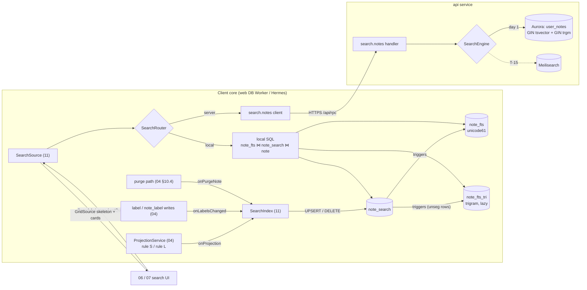
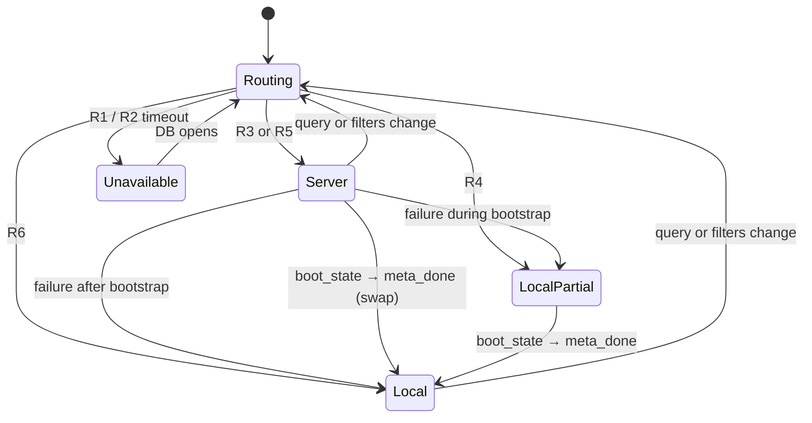

# 11 · Search

*Detail document 11 of 16 · elaborates spine v1.2 · 2026-10-04 · Status: draft for review*

## 1. Purpose and scope

This document specifies search end to end:

- the **client index**: the `note_search` content table, the external-content FTS5 table `note_fts`, the lazily built trigram table `note_fts_tri`, the SQL triggers that keep them in step, the `SearchIndex` core module that writes `note_search` inside core transactions, and index maintenance (builds, rebuilds, merges, integrity checks);
- the **query language** shared by client and server: parsing, normalization, script classification, and compilation to FTS5 `MATCH`, Postgres `tsquery` and substring predicates;
- **ranking** (P-21: bm25 with title ×3, ties by most recently edited) and **filters** (Keep's Types, Labels, Colors and People);
- the **client query path**: local SQL, the `SearchApi` / `SearchSource` facade, live refresh, and the **router** that chooses local or server search (web cold start, accounts above 50k notes, offline);
- **server search**: the `search.notes` oRPC contract, the handler, the Postgres `tsvector` / `pg_trgm` / `btree_gin` queries over `user_notes`, budgets and failure handling;
- **T-15**: the Meilisearch activation plan behind the same contract.

### Out of scope

| Topic | Owner |
|---|---|
| Producing `search_text`, `facets`, `title` (the Projector, `splitSearchText`, `Facet`) | 01 §15 |
| `user_notes` / `notes` DDL, extensions, `keep.f_unaccent`, the GIN indexes themselves | 13 §1.3, §3.7 |
| Writing `user_notes.search_text` at compaction and through the relay | 03 §8.2, §8.4 |
| Local schema outside the search tables, `LiveQuery`, `GridSource`, `CoreModule`, `WriteQueue` | 04 |
| ACL predicates and redaction allowlists (`USER_NOTE_VISIBLE_U`, `redactUserNoteRow`) | 08 §4.6, §4.9 |
| OCR extraction, link-preview unfurling (the `extra` inputs) | 10 |
| Search UI: search bar, `/` shortcut, filter tiles, result grid, banners, highlighting display | 06, 07 |
| `#hashtag` label suggestions in the editor (P-31) | 05 §4.6 |
| "Find in note" (in-note search) | 05 / 06 / 07, later |
| Keep's "Things" categories (ML classification), semantic or AI search | Later; not designed here |
| Search over version history or pending-share card text | Never in v1 (P-26, P-15) |

## 2. Spine references

| Spine item | How this document elaborates it |
|---|---|
| **D-35** (client FTS5 `unicode61 remove_diacritics 2`, `prefix='2 3'`, external content, same-transaction maintenance, lazy trigram, bm25 title ×3; server `tsvector` `simple` + `unaccent` with title weight A, `pg_trgm`, `btree_gin` on `user_notes`; web cold start and > 50k notes) | §5, §6, §7, §9, §10 |
| **P-21** (archived notes searchable with an "Archived" chip; trashed notes only inside Trash; bm25, title ×3, ties by most recently edited) | §4.2, §7, §9.1 |
| **T-15** (Meilisearch with tenant tokens behind `search.notes`, fed from the fan-out outbox) | §11, Spine issue SI-11-2 |
| P-15, C-34, C-77 (card-only pending rows, no `search_text`, `shared_by` for the People filter) | §4.2, §8 |
| §5.7 and C-17 (collaborators' trashed rows hidden; not in their Trash) | §4.2, §9.1 |
| P-05 (personal labels), INV-8 (labels never in the doc or `search_text`) | §5.2, §10.4 |
| P-06, C-48 (`effectiveOverlay`, Archived chip on effective value) | §8, §10.3 |
| D-23, C-42, C-44, C-53 (Projector `search_text` = content + U+001E + extra; carried OCR; facets are shared content only; projection acceptance) | §5.2, §8.1, §10.6 |
| D-09 (LiveQuery, skeleton plus payload LRU), D-04 (DB worker, "held by another tab") | §9 |
| D-21, INV-16 (bootstrap fills FTS in the same 500-row transactions; first cursor) | §5.3, §9.3 |
| D-28, X-05 (rows keyed by user; read ACL by construction) | §10.3 |
| INV-1, §1.3 ("local create/edit/search/delete 100% available"; local search p95 ≤ 50 ms over 5k notes), A-04 (degrade to 50k) | §5.7, §9.3, §15 |
| INV-11, C-45 (projections never depend on viewer settings) | §4.2 |
| INV-13, X-06 (purge removes every derived copy) | §5.3, §5.6, §11.4 |
| X-01 (no note text or query text in telemetry), X-10 (brownout rung "server search"), X-13 (shared deterministic code), X-14 (online-only treatment), X-18 (NFC, i18n), X-19 (layering) | §6, §12, §13 |
| D-46, D-48 (client SLIs, simulator, perf gates) | §13, §15 |
| Q-01 (Keep behavior verification) | §16 |

## 3. Interfaces

### 3.1 Owned here

| Interface | Section | Consumers |
|---|---|---|
| Client search DDL: `note_search`, `note_fts`, `search_index_state`, the three `note_fts` triggers, lazy `note_fts_tri` and its three triggers | §5.1, §5.4 | 04 (replaces 04 §7.2's search block) |
| `SearchIndex` `CoreModule` (hooks, `rekey`, builders, housekeeping); `indexFieldsFor`, `foldForIndex`, `hasSubstrScript`, `SUBSTR_SCRIPT_RANGES` | §5.2–§5.6 | 04 |
| Query language: `parseQuery`, `ParsedQuery`, `QueryTerm`, `compileFts5`, `compileServerTerms`, `labelMatchesTerm` | §6 | 04 (core), server (`api`) |
| Search model types: `SearchArea`, `TypeFilter`, `TYPE_FACETS`, `SearchFilters`, `SearchQuery`, `SearchScope` | §8.1 | 04, 06, 07, server |
| `SearchApi`, `SearchSource`, `SearchHit`, `SearchMeta`, `SearchRoute`, `SearchReason`, `FacetSummary`, `PersonFilterChip` | §9.2 | 04 (facade), 06, 07 |
| `HighlightSpec`, `highlightRanges` | §9.5 | 06, 07 |
| oRPC `searchContract` (`search.notes`), `ServerSearchHit`, typed errors | §10.1 | 04 (core client), 06 (cold start), 14 |
| Server search SQL (statement tag `/* ks:search */`) and the `SearchEngine` interface | §10.3, §10.2 | 13 (plan-regression list), 14 |
| T-15 Meilisearch index settings, document shape, tenant-token rules, feed and purge hooks | §11 | 13, 14, 15 |
| Fixture-matrix adapter for enforcement point **E18 server search** | §15 | 08 §19.1 |

### 3.2 Consumed

| Owner | What | Exact names |
|---|---|---|
| 01 §15 | Projector output and helpers | `Projection.searchText`, `Projection.title`, `Projection.facets`, `splitSearchText(s): {content, extra}`, `Facet`, `PendingCard`, `PreviewV1`, `truncateUnits`, `LIMITS.SEARCH_CONTENT_MAX` (32,768), `LIMITS.SEARCH_EXTRA_MAX` (16,384), `LIMITS.PROJ_TITLE_MAX` (120) |
| 01 §4.5, §8.2 | Overlay and labels | `effectiveOverlay`, `labelDisplayName`, `labelNameKey`, `ColorToken`, `BackgroundToken`, `NoteId`, `LabelId`, `UserId` |
| 04 §3.4, §5, §6 | Core seams | `CoreModule.onProjection`, `onLabelsChanged`, `onPurgeNote`, `onWipe`; `Tx.touch`, `Tx.afterCommit`, `SqlTx.savepoint`, `SqlError{code, extended}`, `DriverInfo.sqliteVersion`; `WriteQueue` priorities; `LiveQuery`, `GridSource`, `CardPayload`; `sync_meta.boot_state`; `SyncStatus`; `Net` |
| 08 §4.6, §4.8, §4.9 | ACL and redaction | `USER_NOTE_VISIBLE_U` (alias `u`), `PENDING_ROW_FIELDS`, `redactUserNoteRow`, `MemberChip`, `SharerChip`, fixture matrix point E18 |
| 13 §1.3, §3.7, §3.8, §3.9, §5.2, §8.5 | Server schema | `keep.user_notes` (`search_text`, `search_tsv`, `title`, `facets`, overlay, `members_public`, `shared_by`, `shared_at`, `trashed_at`, `role`, `invite_state`, `removed_at`); indexes `user_notes_fts`, `user_notes_trgm`, `user_notes_pending_by`; `keep.labels`, `keep.note_labels` + `note_labels_label`; `keep.reminders`; `keep.f_unaccent`; role `keep_api`; `ShardRouter`; `registerPurgeHook`; capacity metric `search_bytes_share` |
| 12 §6.1 | Auth | `KspPrincipal`, `JwtVerifier` |
| 03 §8.2, §8.4, §10 | Freshness of `user_notes.search_text`; statement-tag convention `/* ks:<path> */` | — |
| 02 §9.2 | Feed rows carry `searchText` for accepted rows only | `NoteRowV1.searchText` |

## 4. Architecture

### 4.1 Components and data flow



### 4.2 Search semantics

| Aspect | Rule | Source |
|---|---|---|
| **Notes area** (default) | Every live accepted membership that is not trashed: owned and shared, active **and archived** (archived hits carry the "Archived" chip from the effective `archived` value). Excludes pending cards, rows hidden while the server confirms a leave, decline or delete forever (`deleted = 1`), and owner-trashed shared notes on collaborators' devices | P-21, P-06, §5.7, C-17, P-15 |
| **Trash area** | Only **owned** trashed notes; used only from the Trash view | P-21, P-02 |
| Fields matched | Title; surviving body blocks; visible items (checked included); attachment alt text; OCR text; link-preview titles and site names; the viewer's own label names | 01 §15.5, D-23, D-35 |
| Never matched | Hidden conversion sources, provenance duplicates and soft-deleted items (the Projector excludes them, so search matches what renders); other members' labels; overlay values as text; member names or emails | 01 §15.5, INV-8, P-05 |
| Pending shares | Never matched by text. Listed only by a People filter with no text, as cards | P-15, C-77 |
| `restore_lost` and "waiting for owner" notes | Matched (they render in the grid) | INV-13, INV-14 |
| Word matching | Case- and diacritic-insensitive. Each bare word matches words **starting with** it; a quoted phrase matches that exact word sequence. All terms must match (AND) | D-35 |
| Substring scripts | Terms in CJK, Hangul, Thai and the other scripts of §6.2 match as **substrings** | D-35 (lazy trigram) |
| Ranking | Relevance (bm25, title ×3); equal relevance after quantization (§7.1) breaks by most recently edited, then ID | P-21 |
| Filter-only search (no text) | Grid order: effective pinned first, archived last, then `sort_key` | §7.3 |
| Determinism | Results depend only on the viewer's rows and the shared projection, never on viewer render settings | INV-11, C-45 |

### 4.3 Packages and modules

| Path | Contents | Layer rule (X-19) |
|---|---|---|
| `packages/domain/src/search/` | `types.ts`, `query.ts` (parser, compilers), `scripts.ts` (generated range tables), `fold.ts`, `highlight.ts`, `labels.ts` | Pure TS; no DOM, RN or Node imports. Module owned by 11 inside 01's package |
| `packages/sync-client/src/search/` | `index.ts` (SearchIndex `CoreModule`), `builder.ts`, `local-sql.ts`, `router.ts`, `source.ts`, `server-client.ts`, `summary.ts` | Not under `src/api/` or `src/write/`, so it may use `Net` (04 §3.4 rule 6) |
| `packages/storage/migrations/0001_init.sql` | §5.1 DDL (search block) | Shared by every driver |
| `packages/api-contract/src/search.ts` | `searchContract`, zod schemas | Shared by `api`, core, 06 |
| `apps/server/src/search/` | `handler.ts`, `engine-pg.ts`, `sql.ts`, `labels.ts`; `engine-meili.ts`, `feed.ts` at T-15 | `api` service only |

## 5. Client index

### 5.1 DDL (owned; replaces the search block of 04 §7.2)

```sql
-- packages/storage/migrations/0001_init.sql — search block (kind: additive · min_compatible: 1)

-- Content table. The FTS tables index it; it stores search-normalized text (§5.2), never shown to users.
CREATE TABLE note_search (
  sid     INTEGER PRIMARY KEY,                  -- FTS rowid; fixed for the row's life
  note_id TEXT    NOT NULL UNIQUE,              -- rewritten in place on re-mint (§5.3); no reindex
  title   TEXT    NOT NULL DEFAULT '',          -- full cleaned title line (≤ 999 units)
  body    TEXT    NOT NULL DEFAULT '',          -- rest of splitSearchText(search_text).content
  labels  TEXT    NOT NULL DEFAULT '',          -- viewer's live label names, '\n'-joined, ordered by name_norm, id
  extra   TEXT    NOT NULL DEFAULT '',          -- splitSearchText(search_text).extra: OCR + link-preview text
  unseg   INTEGER NOT NULL DEFAULT 0 CHECK (unseg IN (0,1))   -- 1 iff any field holds a §6.2 substring-script char
) STRICT;

CREATE VIRTUAL TABLE note_fts USING fts5(
  title, body, labels, extra,
  content = 'note_search', content_rowid = 'sid',
  tokenize = "unicode61 remove_diacritics 2", prefix = '2 3'
);

-- Build state per FTS table. built_through = highest sid the index covers while state = 'building';
-- 9007199254740991 (2^53 − 1, the largest value 04's drivers return as a number) when 'ready'.
CREATE TABLE search_index_state (
  name          TEXT    PRIMARY KEY CHECK (name IN ('fts','tri')),
  version       INTEGER NOT NULL,
  state         TEXT    NOT NULL CHECK (state IN ('ready','building','unsupported')),
  built_through INTEGER NOT NULL,
  updated_at    INTEGER NOT NULL
) STRICT, WITHOUT ROWID;
INSERT INTO search_index_state VALUES ('fts', 1, 'ready', 9007199254740991, 0);

-- Index maintenance triggers. They are index plumbing, not change capture (04 §3.4 rule 3 is unaffected:
-- SearchIndex still calls tx.touch('note_search', …) itself). Rows above built_through are left to the builder.
CREATE TRIGGER note_search_fts_ai AFTER INSERT ON note_search
WHEN new.sid <= (SELECT built_through FROM search_index_state WHERE name = 'fts')
BEGIN
  INSERT INTO note_fts(rowid, title, body, labels, extra)
  VALUES (new.sid, new.title, new.body, new.labels, new.extra);
END;

CREATE TRIGGER note_search_fts_ad AFTER DELETE ON note_search
WHEN old.sid <= (SELECT built_through FROM search_index_state WHERE name = 'fts')
BEGIN
  INSERT INTO note_fts(note_fts, rowid, title, body, labels, extra)
  VALUES ('delete', old.sid, old.title, old.body, old.labels, old.extra);
END;

CREATE TRIGGER note_search_fts_au AFTER UPDATE OF title, body, labels, extra ON note_search
WHEN (old.title IS NOT new.title OR old.body IS NOT new.body
      OR old.labels IS NOT new.labels OR old.extra IS NOT new.extra)
 AND old.sid <= (SELECT built_through FROM search_index_state WHERE name = 'fts')
BEGIN
  INSERT INTO note_fts(note_fts, rowid, title, body, labels, extra)
  VALUES ('delete', old.sid, old.title, old.body, old.labels, old.extra);
  INSERT INTO note_fts(rowid, title, body, labels, extra)
  VALUES (new.sid, new.title, new.body, new.labels, new.extra);
END;
```

**Lazy trigram table** (created by `SearchIndex`, never by the migration runner; §5.4):

```sql
-- version 1. Falls back to tokenize = "trigram" when SQLite < 3.45.0 (no remove_diacritics option).
CREATE VIRTUAL TABLE note_fts_tri USING fts5(
  title, body, labels, extra,
  content = 'note_search', content_rowid = 'sid',
  tokenize = "trigram remove_diacritics 1"
);
INSERT INTO search_index_state VALUES ('tri', 1, 'building', 0, :now);

-- Only rows with unseg = 1 are indexed: a substring-script term can only match a row that holds such a char.
CREATE TRIGGER note_search_tri_ai AFTER INSERT ON note_search
WHEN new.unseg = 1 AND new.sid <= (SELECT built_through FROM search_index_state WHERE name = 'tri')
BEGIN
  INSERT INTO note_fts_tri(rowid, title, body, labels, extra)
  VALUES (new.sid, new.title, new.body, new.labels, new.extra);
END;

CREATE TRIGGER note_search_tri_ad AFTER DELETE ON note_search
WHEN old.unseg = 1 AND old.sid <= (SELECT built_through FROM search_index_state WHERE name = 'tri')
BEGIN
  INSERT INTO note_fts_tri(note_fts_tri, rowid, title, body, labels, extra)
  VALUES ('delete', old.sid, old.title, old.body, old.labels, old.extra);
END;

CREATE TRIGGER note_search_tri_au AFTER UPDATE OF title, body, labels, extra, unseg ON note_search
WHEN (old.title IS NOT new.title OR old.body IS NOT new.body OR old.labels IS NOT new.labels
      OR old.extra IS NOT new.extra OR old.unseg IS NOT new.unseg)
 AND old.sid <= (SELECT built_through FROM search_index_state WHERE name = 'tri')
BEGIN
  INSERT INTO note_fts_tri(note_fts_tri, rowid, title, body, labels, extra)
    SELECT 'delete', old.sid, old.title, old.body, old.labels, old.extra WHERE old.unseg = 1;
  INSERT INTO note_fts_tri(rowid, title, body, labels, extra)
    SELECT new.sid, new.title, new.body, new.labels, new.extra WHERE new.unseg = 1;
END;
```

Design notes:

- **External content** (D-35) keeps one copy of the text. `note_search` holds search-normalized text (§5.2), so it is separate from `note.search_text`, which is the wire value 04 also uses for read-only projection views.
- **`sid` indirection**: a re-mint (04 §9.7) rewrites `note_search.note_id` without touching the index.
- **Triggers** make index consistency independent of app code and of build version: an older build that has never heard of `note_fts_tri` still maintains it, because the triggers live in the database (X-08).
- **Detail level** is the FTS5 default (`full`); phrase queries and trigram substrings need positions.
- 04's fresh-vs-migrated equivalence test (04 §8.3) must ignore `note_fts_tri*` objects and the `tri` state row (Cross-doc issue CD-04-4).

### 5.2 Field derivation

```ts
// packages/domain/src/search/fold.ts
/** Index and query normalization beyond what the tokenizers do. Input is NFC (01 cleanLine). Removes optional
 *  vocalization marks of abjads, which unicode61 would treat as separators inside a word:
 *  Arabic U+0610–U+061A, U+064B–U+065F, U+0670, U+06D6–U+06ED, tatweel U+0640; Hebrew U+0591–U+05C7 except
 *  U+05BE (maqaf) and U+05C0, U+05C3, U+05C6 (punctuation). Everything else is unchanged. */
export function foldForIndex(s: string): string;

// packages/sync-client/src/search/index.ts
export interface IndexFields { title: string; body: string; labels: string; extra: string; unseg: 0 | 1 }

/** Pure. `row` is the stored note row; `labelNames` the viewer's live label display names on the note. */
export function indexFieldsFor(row: { title: string; search_text: string }, labelNames: readonly string[]): IndexFields {
  const { content, extra } = splitSearchText(row.search_text);                 // 01 §15.5
  let title = '', body = content;
  if (row.title !== '') {
    const nl = content.indexOf('\n');
    const first = nl < 0 ? content : content.slice(0, nl);
    if (first.startsWith(row.title)) { title = first; body = nl < 0 ? '' : content.slice(nl + 1); }
    else { title = row.title; }        // defensive: never observed; the title words then also sit in body
  }
  const f = {
    title: foldForIndex(title), body: foldForIndex(body), extra: foldForIndex(extra),
    labels: [...labelNames].sort(byLabelKey).join('\n'),     // as stored (P-05 display names); byLabelKey: labelNameKey, then id
  };
  return { ...f, unseg: hasSubstrScript(f.title + f.body + f.labels + f.extra) ? 1 : 0 };
}
```

- The title rule relies on 01 §15.5: the first line of `content` is the cleaned title whenever the projection title is non-empty, and the projection title is a ≤ 120-unit prefix of it (01 §15.3). The `title` column therefore holds the **full** title, so a long title's tail still gets title weight. 01 should pin this as a golden property (Cross-doc issue CD-01-1).
- Pending rows (`pending_accept = 1`) have no `note_search` row (P-15).
- `note.search_text` of a row that has only a card (optimistic accept before the full projection arrives) is `''`; the row is indexed with the card title only, then updated when the full projection lands (04 §10.2).

### 5.3 `SearchIndex` core module (owned)

`SearchIndex` implements 04's `CoreModule`. Every write it makes runs inside a **savepoint guard** (§5.6) and calls `tx.touch('note_search', ids, columns)` so LiveQuery invalidates (04 §3.4 rule 3).

```ts
// packages/sync-client/src/search/index.ts
export function createSearchIndex(cfg: SearchConfig): CoreModule & SearchIndexOps;

export interface SearchIndexOps {
  /** Re-mint (04 §9.7): one statement, no reindex. */
  rekey(tx: Tx, oldId: NoteId, newId: NoteId): Promise<void>;
  /** Label rows renamed, deleted or merged (04 calls this; proposed hook, CD-04-3). Set-based, one statement. */
  onLabelRowsChanged(tx: Tx, labelIds: readonly LabelId[]): Promise<void>;
  /** Batch form of onProjection for bootstrap pages and feed pages (proposed hook, CD-04-7). */
  onProjections(tx: Tx, noteIds: readonly NoteId[]): Promise<void>;
  state(): Promise<{ fts: IndexState; tri: IndexState | 'absent' }>;
}
export type IndexState = { state: 'ready' | 'building' | 'unsupported'; version: number; builtThrough: number };
```

| Hook | Trigger (04) | Action |
|---|---|---|
| `onProjection(tx, id, p)` | After the projection group of `note` is written (rule S or L), on accept, on bootstrap rows | `p === null` or `PendingCard`, or the row is pending or missing → `DELETE FROM note_search WHERE note_id = ?`. Otherwise re-read `note.title, note.search_text` **in the same transaction** (the argument is a hint; server rows do not produce a `Projection` object), compute `indexFieldsFor`; insert (with labels from `note_label`) or update `title, body, extra, unseg` only if any value differs; create `note_fts_tri` if `unseg = 1` and it is absent (§5.4) |
| `onProjections(tx, ids)` | Bootstrap and feed pages (≤ 500 rows) | Same as above, set-based: one `SELECT` of the rows, fields computed in JS, multi-row `INSERT … ON CONFLICT(note_id) DO UPDATE … WHERE` in chunks of 100 |
| `onLabelsChanged(tx, noteIds)` | `note_label.present` changed (local op or feed) | Statement **L1** below for those notes |
| `onLabelRowsChanged(tx, labelIds)` | `label.name`, `label.deleted` or `label.merged_into` changed (local op or feed) | Statement **L2** below |
| `onPurgeNote(tx, id, reason)` | Purge path step 6 (04 §10.4), discard of an empty note | `DELETE FROM note_search WHERE note_id = ?`; mark `optimize_due` (§5.6) |
| `onWipe()` | Sign-out, account switch | Nothing: the database is destroyed (04 §4.4) |
| `init(ctx)` | Core start | Resume any `building` index (§5.5); schedule the one-time substring-script scan if `tri` is absent and `sync_meta.search_tri_scan_v` < the build's scan version (§5.4) |

```sql
-- L1 · labels column for given notes
-- ?1 = JSON array of note ids; ?2 = JSON array of the user's live label ids whose names contain a §6.2
-- substring-script char (computed in JS from the ≤ 50 labels)
UPDATE note_search SET
  labels = coalesce((
    SELECT group_concat(name, char(10)) FROM (
      SELECT lb.name FROM note_label nl JOIN label lb ON lb.id = nl.label_id
      WHERE nl.note_id = note_search.note_id AND nl.present = 1 AND lb.deleted = 0 AND lb.merged_into IS NULL
      ORDER BY lb.name_norm, lb.id)), ''),
  unseg = CASE WHEN unseg = 1 OR EXISTS (
            SELECT 1 FROM note_label nl
            WHERE nl.note_id = note_search.note_id AND nl.present = 1
              AND nl.label_id IN (SELECT value FROM json_each(?2))) THEN 1 ELSE 0 END
WHERE note_id IN (SELECT value FROM json_each(?1));

-- L2 · every note that carries (or carried) one of the labels · ?1 = JSON array of label ids; ?2 as in L1.
-- Matches pairs regardless of `present`, because a label delete clears `present` in the same transaction.
UPDATE note_search SET labels = coalesce((/* same subquery as L1 */), ''), unseg = /* same CASE as L1 */
WHERE note_id IN (SELECT note_id FROM note_label WHERE label_id IN (SELECT value FROM json_each(?1)));
```

Label names are indexed as stored (P-05 display names, already NFC), so inserts, L1 and L2 write identical values. L1 and L2 can only **raise** `unseg` (a removed substring-script label leaves it at 1 until the next projection write recomputes it exactly); over-inclusion only adds a row to the trigram index, while under-inclusion would hide a hit. If `?2` is non-empty and `note_fts_tri` is absent, the same transaction creates it (§5.4).

**Same-transaction rule (D-35).** Projection writes, label writes and purges update `note_search`, and through the triggers the FTS index, in the transaction that makes the visible change. A label rename touching N notes rewrites N rows in one set-based native statement (L2): about 0.1 ms per row on the lab Android device, so 0.5 s at 5k notes and about 5 s at 50k (Spine issue SI-11-4).

### 5.4 Trigram table: detection, creation, build

**Substring scripts.** `hasSubstrScript(s)` is true iff `s` contains a code point in `SUBSTR_SCRIPT_RANGES` (§6.2). The check is a binary search over a generated range table, so it does not depend on Unicode property escapes in Hermes (01 Q-DM-2).

**Creation.** In the transaction that first writes a row with `unseg = 1` while no `tri` state row exists, `SearchIndex` runs, in a savepoint:

1. `CREATE VIRTUAL TABLE note_fts_tri …` with `remove_diacritics 1` if `DriverInfo.sqliteVersion ≥ 3.45.0`, else plain `trigram`.
2. Insert the `tri` state row (`building`, `built_through = 0`) and create the three triggers.
3. On any error (trigram tokenizer missing in a driver build) roll back the savepoint and insert `('tri', 1, 'unsupported', 0, now)`; substring terms then always use the scan path (§9.1). Telemetry `search_tri_unsupported`.

The first unseg row itself is above `built_through = 0`, so the builder indexes it in its first slice. DDL inside a priority-0 transaction costs about 2 ms (shadow-table creation).

**One-time scan.** A database whose substring-script rows were written by a build that predates `unseg` detection (or a restored salvage) is covered by a priority-4 job: in slices of 500 rows it recomputes `unseg` from the stored fields and, on the first hit, creates the table as above. `sync_meta.search_tri_scan_v` records completion per scan version.

**Build.** The builder of §5.5 fills `note_fts_tri` from rows with `unseg = 1`. Until `state = 'ready'`, every substring term uses the scan path, so results are complete during the build.

### 5.5 Index builder (sliced builds and rebuilds)

One mechanism serves the trigram build, corruption recovery and index-definition upgrades. It runs as **priority-4** `WriteQueue` jobs (04 §3.4), one slice per transaction, and yields between slices, so user mutations and sync are never delayed by more than one slice.

```ts
// packages/sync-client/src/search/builder.ts
async function buildSlice(tx: Tx, name: 'fts' | 'tri'): Promise<'more' | 'done'> {
  const st = await tx.get<{ state: string; built_through: number }>(
    `SELECT state, built_through FROM search_index_state WHERE name = ?`, [name]);
  if (!st || st.state !== 'building') return 'done';
  const table = name === 'fts' ? 'note_fts' : 'note_fts_tri';
  const unseg = name === 'tri' ? 'AND unseg = 1' : '';
  const last = await tx.get<{ m: number | null }>(
    `SELECT max(sid) AS m FROM (SELECT sid FROM note_search WHERE sid > ? ${unseg} ORDER BY sid LIMIT ?)`,
    [st.built_through, cfg.buildSliceRows]);
  if (last?.m == null) {
    await tx.run(`UPDATE search_index_state SET state='ready', built_through=9007199254740991, updated_at=?
                  WHERE name=?`, [tx.now, name]);
    tx.touch('search_index_state', [name], ['state', 'built_through']);
    return 'done';
  }
  await tx.run(`INSERT INTO ${table}(rowid, title, body, labels, extra)
                SELECT sid, title, body, labels, extra FROM note_search
                WHERE sid > ? AND sid <= ? ${unseg} ORDER BY sid`, [st.built_through, last.m]);
  await tx.run(`UPDATE search_index_state SET built_through=?, updated_at=? WHERE name=?`, [last.m, tx.now, name]);
  tx.touch('search_index_state', [name], ['built_through']);
  return 'more';
}
```

**Why it is consistent.** The triggers act only on rows with `sid ≤ built_through`, and the builder indexes rows with `sid > built_through` in ascending order using their current content. A row updated before the builder reaches it is indexed once, with its new content; a row updated after is maintained by the triggers with exactly the values the builder indexed; a row deleted before the builder reaches it is never indexed. A crash between slices leaves `built_through` at the last committed slice.

| Use | Start (one transaction) | Slices | Queries while building |
|---|---|---|---|
| Trigram build | Table creation (§5.4) | `tri` slices | Substring terms use the scan path: complete results |
| Corruption rebuild of `note_fts` | Breaker (§5.6): `state='building'`, `built_through=-1`; then `DROP TABLE note_fts`, `CREATE VIRTUAL TABLE note_fts …`, `built_through=0` | `fts` slices | Word terms match only rows with `sid ≤ built_through`; `SearchMeta.reasons` has `index_building` |
| Definition upgrade (tokenizer option, column) | Same as rebuild, with `version` raised. Column names stay; a change that needs new names creates `note_fts_v2` and drops the old table only in a destructive migration (04 §8.1) | `fts` slices | As above |
| Corruption rebuild of `note_fts_tri` | `DROP` + `CREATE` + `built_through=0` | `tri` slices | Scan path |

Slice size 500 rows: about 30 ms on the lab Android device and about 60 ms in sqlite-wasm. A full `fts` rebuild takes about 1 s of slices at 5k notes and 10 s at 50k, spread over idle time.

### 5.6 Housekeeping and error handling

**Savepoint guard and breaker.** Every `SearchIndex` write runs as `tx.savepoint(fn)`. If a statement fails with `SqlError.extended = 267` (`SQLITE_CORRUPT_VTAB`) or any `SqlError` whose SQL head names `note_fts`:

1. the savepoint rolls back;
2. in the same outer transaction, the breaker sets `search_index_state.state = 'building', built_through = -1` for the failing index (so every trigger becomes a no-op) and records `search_rebuild_due`;
3. the write is retried once inside a new savepoint (it now only touches `note_search`) and succeeds;
4. after commit, a priority-4 job runs the rebuild of §5.5.

So a corrupt search index can never fail a user's edit, a feed page or a purge (INV-1). A `CORRUPT` error from any other table still goes to 04's DB salvage (04 §3.4 rule 7). Requirement on 04: its error mapping must not start salvage for `SQLITE_CORRUPT_VTAB` raised inside a `SearchIndex` savepoint (CD-04-6).

**Merges.** FTS5 automerge stays at its defaults. In idle time (priority 4; on mobile only while foregrounded and not in a gesture) the module runs `INSERT INTO note_fts(note_fts, rank) VALUES('merge', 500)` until `changes()` reports no work, at most once per hour, and the same for `note_fts_tri`.

**Physical removal after purges (X-06).** An FTS5 delete leaves the old postings in older segments until they are merged. After any purge (`optimize_due`), and weekly, the module runs `INSERT INTO note_fts(note_fts) VALUES('optimize')` (and for `note_fts_tri`) in the same idle-and-charging window as 04's `quick_check` (04 §8.4), no later than 24 h after the purge while the app is foregrounded at least once. At 5k notes this takes about 0.5 s.

**Integrity.** Weekly, in that window: `INSERT INTO note_fts(note_fts, rank) VALUES('integrity-check', 1)` (rank 1 also compares the index with `note_search`, SQLite ≥ 3.44; older drivers use rank 0) and the same for `note_fts_tri`. A failure trips the breaker for that index.

**Consistency check.** Weekly, after integrity: compare the set of `note.id` with `deleted = 0 AND pending_accept = 0` against `note_search.note_id` (missing rows inserted, extra rows deleted), and recompute `indexFieldsFor` for a random sample of 200 rows; any row that differs is rewritten. Each repair increments `search_index_drift_total{kind}`. A drift rate above 0 in the fleet is a bug signal (business-hours alert, X-11).

### 5.7 Size and cost budgets

| Measure | 5k notes (avg 600 B text) | 50k notes | Gate |
|---|---|---|---|
| `note_search` text | ≈ 3 MB | ≈ 30 MB | — |
| `note_fts` (with prefix indexes) | ≈ 7–9 MB | ≈ 70–90 MB | Storage sample in client SLIs |
| `note_fts_tri` (unseg rows only) | ≈ 3× the unseg rows' text | same ratio | — |
| One projection write incl. reindex (2 KB note) | ≤ 1 ms native, ≤ 2 ms wasm | same | Reassure |
| One persist-tick reindex of a 20k-unit note | ≤ 5 ms native, ≤ 10 ms wasm | same | Reassure |
| Bootstrap batch of 500 rows, FTS share | ≤ 60 ms native | same | §5.4 of the spine timeline |
| Label rename touching N notes | ≈ 0.1 ms × N | ≈ 5 s at 50k | SI-11-4 |

## 6. Query language and parsing (shared)

### 6.1 Grammar and normalization

Keep's search box has no operator syntax; neither does ours. Words are ANDed, a double-quoted span is a phrase, and everything else is literal text. Operator words (`AND`, `OR`, `NOT`, `NEAR`) and FTS5 or `tsquery` syntax characters are ordinary text, because the parser removes punctuation and every compiled operand is quoted.

```
query   := ws* (chunk ws*)*
chunk   := phrase | word
phrase  := '"' [^"]* ('"' | end)          -- an unterminated quote runs to the end
word    := [^\s"]+
```

Normalization, in order: NFC (X-18); truncate to 256 UTF-16 units with 01's `truncateUnits` (`truncated = true`); `foldForIndex`; inside each chunk replace every code point that is not a **word character** (general category `L*`, `N*`, `M*` or `Co`, from a generated table) with a space; lower-case with `String.prototype.toLowerCase` (locale-free, 01 §3.2). Diacritics and case are otherwise left to the engines: FTS5 `unicode61 remove_diacritics 2` and `trigram remove_diacritics 1` on the client, `keep.f_unaccent` and the `simple` dictionary on the server.

### 6.2 Script classification

A token is **`substr`** if it contains a code point of `SUBSTR_SCRIPT_RANGES`, else **`word`**. The class covers the scripts `unicode61` cannot segment into words: scripts written without spaces, and Brahmic scripts whose vowel signs (`Mn`/`Mc`) `unicode61` treats as separators, splitting every word.

```ts
// packages/domain/src/search/scripts.ts — generated from Unicode 16 Scripts.txt; pinned by golden tests
export const SUBSTR_SCRIPT_RANGES: ReadonlyArray<readonly [number, number]> = [
  [0x0900, 0x0DFF],   // Devanagari, Bengali, Gurmukhi, Gujarati, Oriya, Tamil, Telugu, Kannada, Malayalam, Sinhala
  [0x0E00, 0x0EFF],   // Thai, Lao
  [0x0F00, 0x0FFF],   // Tibetan
  [0x1000, 0x109F],   // Myanmar
  [0x1100, 0x11FF],   // Hangul Jamo
  [0x1780, 0x17FF], [0x19E0, 0x19FF],   // Khmer
  [0x2E80, 0x2FDF],   // CJK radicals, Kangxi
  [0x3005, 0x3007], [0x3021, 0x3029], [0x3031, 0x3035], [0x3038, 0x303C],
  [0x3040, 0x30FF],   // Hiragana, Katakana
  [0x3130, 0x318F],   // Hangul compatibility Jamo
  [0x31F0, 0x31FF],   // Katakana phonetic extensions
  [0x3400, 0x4DBF], [0x4E00, 0x9FFF],   // CJK Ext A, CJK Unified
  [0xA960, 0xA97F], [0xAC00, 0xD7FF],   // Hangul
  [0xF900, 0xFAFF],   // CJK compatibility ideographs
  [0xFF66, 0xFF9F],   // half-width Katakana
  [0x20000, 0x323AF], // CJK Ext B–H
] as const;
export function hasSubstrScript(s: string): boolean;     // binary search per code point
export function isWordChar(cp: number): boolean;         // generated L*, N*, M*, Co table
```

D-35 names CJK and Thai; the other scripts follow the same reasoning (Spine issue SI-11-5). A substring term shorter than **3 code points** cannot use a trigram index and is matched by scanning (§9.1, §10.3).

### 6.3 Parsed form and algorithm

```ts
// packages/domain/src/search/query.ts
export const SEARCH_QUERY_MAX_UNITS = 256;
export const SEARCH_TERMS_MAX = 16;

export interface QueryTerm {
  tokens: readonly string[];       // normalized, non-empty; one token for substr terms
  kind: 'word' | 'phrase';         // 'phrase' only from a quoted chunk
  prefix: boolean;                 // true for 'word' (the last token is a prefix); false for 'phrase'
  script: 'word' | 'substr';
}
export interface ParsedQuery {
  v: 1;
  terms: readonly QueryTerm[];
  truncated: boolean;              // input over 256 units or more than 16 terms
  empty: boolean;                  // no terms after normalization
  key: string;                     // canonical form, for caches and SearchMeta.queryKey
}
export function parseQuery(raw: string): ParsedQuery;
```

1. Normalize (§6.1) and split into chunks.
2. For each chunk, split its normalized text on spaces into tokens; drop empty tokens; drop the chunk if none remain.
3. If every token of the chunk is `word` script: emit one term `{tokens, kind: quoted ? 'phrase' : 'word', prefix: !quoted, script: 'word'}`. A bare chunk such as `e-mail` thus becomes the phrase-with-prefix `e mail*`, which is how both engines tokenize the indexed text.
4. Otherwise emit one term per token, each with its own script class (`word` tokens keep `prefix: !quoted`); adjacency is dropped.
5. Stop after 16 terms (`truncated = true`).
6. `key` = terms serialized as `kind:script:prefix:tokens` joined by `|`.

### 6.4 Compilation to FTS5

```ts
export function compileFts5(terms: readonly QueryTerm[], table: 'fts' | 'tri'): string | null {
  // fts: every 'word' term. tri: every 'substr' term with ≥ 3 code points. null when the selection is empty.
  const parts = select(terms, table).map(t => {
    const s = '"' + t.tokens.join(' ').replaceAll('"', '""') + '"';   // quotes cannot survive §6.1; defensive
    return table === 'fts' && t.prefix ? s + '*' : s;
  });
  return parts.length ? parts.join(' AND ') : null;
}
```

- A quoted FTS5 string is tokenized by the table's tokenizer, so `"e mail"*` is a phrase whose last token is a prefix, and on the trigram table `"東京タワー"` is the sequence of its trigrams, that is, a substring.
- Prefix queries of 2 and 3 characters use the `prefix='2 3'` indexes; longer prefixes scan the sorted term range, which is cheap at this corpus size. A one-character word prefix is allowed (it scans the letter's term range).

### 6.5 Compilation for the server

```ts
export type ServerTerm =
  | { k: 'fts'; q: string }            // tsquery source text, fed to to_tsquery('simple', keep.f_unaccent(q))
  | { k: 'sub'; s: string };           // lower-cased substring for ILIKE / strpos
export function compileServerTerms(terms: readonly QueryTerm[]): { terms: ServerTerm[]; allFts: string | null;
                                                                     longestSub: string | null } {
  // word/phrase term → q = "'a' <-> 'b' <-> 'c':*"   (':*' only on the last token, only when prefix)
  // substr term     → s = token
  // allFts          = all fts q's joined with ' & ' in parentheses; null when there are none
  // longestSub      = the longest substr token with ≥ 3 code points, or null
}
```

Tokens contain only word characters (§6.1), so the single-quoted `tsquery` operands need no escaping and the `ILIKE` patterns contain no `%`, `_` or `\`. `to_tsquery('simple', …)` re-parses each quoted operand with the default parser, which agrees with the client's splitting for ordinary words and differs for Postgres's special token types (hosts, URLs, hyphenated words), §10.5.

### 6.6 Label-name matching (server only)

On the client, label names are an indexed column. The server's `search_tsv` holds no label names (labels are per user, INV-8), so the handler matches terms against the user's ≤ 50 labels in TypeScript and passes the matching label IDs per term to SQL (§10.3).

```ts
// packages/domain/src/search/labels.ts
/** Label name and term are normalized as §6.1, plus Latin diacritic removal (NFD, drop U+0300–U+036F, NFC). */
export function labelMatchesTerm(labelName: string, t: QueryTerm): boolean;
// word/phrase: t.tokens occur as consecutive tokens of the name; the last one as a prefix when t.prefix
// substr:      the normalized name contains t.tokens[0]
```

### 6.7 Test vectors (excerpt; full table in the golden corpus)

| Input | Terms | FTS5 (`fts`) | Server `allFts` |
|---|---|---|---|
| `Groceries milk` | word `groceries`*, word `milk`* | `"groceries"* AND "milk"*` | `('groceries':*) & ('milk':*)` |
| `"new york" pizza` | phrase `new york`, word `pizza`* | `"new york" AND "pizza"*` | `('new' <-> 'york') & ('pizza':*)` |
| `e-mail` | word `e mail`* | `"e mail"*` | `('e' <-> 'mail':*)` |
| `café` | word `café`* (diacritics folded by the engines) | `"café"*` | `('café':*)` (unaccented in SQL) |
| `NOT OR AND` | three word terms | `"not"* AND "or"* AND "and"*` | `('not':*) & ('or':*) & ('and':*)` |
| `title:foo` | word `title foo`* | `"title foo"*` | `('title' <-> 'foo':*)` |
| `東京タワー` | substr `東京タワー` | — (tri: `"東京タワー"`) | `sub = 東京タワー` |
| `iPhone用ケース` | substr `iphone用ケース` (one chunk, one token, mixed script) | — (tri: `"iphone用ケース"`) | `sub = iphone用ケース` |
| `東京` | substr `東京` (2 code points → scan) | — | `sub = 東京` |
| `हिन्दी नोट` | substr `हिन्दी`, substr `नोट` | — (tri for both) | two `sub` terms |
| `!!!` or empty | `empty = true` | null | null |
| 300 × `a ` | 16 terms, `truncated = true` | 16 terms | 16 terms |

A mixed-script chunk with no internal separator is one token, so `iPhone用ケース` is a single substr term; the trigram table holds the Latin part too.

## 7. Ranking

### 7.1 Client

`rel = −bm25(note_fts, 3.0, 1.0, 1.0, 1.0)` (column weights title, body, labels, extra; P-21). FTS5's bm25 returns lower values for better matches, so `rel` is positive and larger is better. Order:

```
ORDER BY CAST(rel / 0.1 AS INTEGER) DESC,          -- relevance bucket (SEARCH_LOCAL_RANK_QUANTUM)
         coalesce(n.local_edit_at, n.edited_at, n.created_at) DESC,   -- most recently edited (P-21, P-17)
         n.id
```

P-21's "ties" are read as "equal after quantization": exact float ties are rare, while scores that differ in the third decimal carry no useful signal and would hide the recency rule (Spine issue SI-11-3). When no word term exists, the driving table is `note_fts_tri` with `rel = −bm25(note_fts_tri, 3.0, 1.0, 1.0, 1.0)`; when only scan terms exist, `rel = 0` and order is by recency.

### 7.2 Server

`rel = ts_rank('{0.1, 0.2, 0.5, 1.0}', u.search_tsv, q, 1)`, ordered by `floor(rel / 0.01) DESC, content_edited_at DESC NULLS LAST, note_id`.

13's `search_tsv` is `setweight(title, 'A') || setweight(search_text, 'B')`, and `search_text` begins with the title line (01 §15.5), so a title word is counted once at A and once at B. With weights A = 1.0 and B = 0.5 a title word scores 1.5 and a body word 0.5: exactly title ×3, as P-21 requires. Normalization flag 1 divides by `1 + log(length)`, which approximates bm25's length normalization. Do not "fix" the DDL by removing the title from `search_text` without changing these weights.

### 7.3 Filter-only ordering

With no text, results follow the grid: notes area `ORDER BY eff_pinned DESC, eff_archived ASC, sort_key, id` (archived notes after the others, each with its chip); trash area `ORDER BY trashed_at DESC, id`. People-filter pending cards (§8.1) come after accepted notes, newest `shared_at` first.

### 7.4 Live refresh policy

Search results are a LiveQuery (D-09). A change of the query or filters runs a fresh ranking. A re-run caused only by data changes (sync, the user's own edits) keeps the order of hits that still match, removes hits that no longer match, and appends new hits in their rank order after the surviving ones, so cards do not jump under the user's pointer. Data-driven re-runs are throttled to one per 300 ms.

## 8. Filters (facets)

### 8.1 Model

```ts
// packages/domain/src/search/types.ts
export type SearchArea = 'notes' | 'trash';
export type TypeFilter = 'reminders' | 'lists' | 'images' | 'drawings' | 'urls' | 'audio';
export const TYPE_FACETS: Readonly<Record<Exclude<TypeFilter, 'reminders'>, number>> = {
  lists: Facet.LIST, images: Facet.HAS_IMAGE, drawings: Facet.HAS_DRAWING,
  urls: Facet.HAS_URL, audio: Facet.HAS_AUDIO,                       // 01 §15.6
};
export interface SearchFilters {
  types?: readonly TypeFilter[];       // OR within the category
  colors?: readonly ColorToken[];      // OR
  labels?: readonly LabelId[];         // OR; the viewer's labels (P-05)
  people?: readonly UserId[];          // OR; member chips of kind 'user' (08 §4.8)
}
export interface SearchQuery extends SearchFilters { text: string; area: SearchArea }
export type SearchScope = Omit<SearchQuery, 'text'>;                // 04 §4.2 query(q, scope)
```

| Filter | Meaning | Source of truth |
|---|---|---|
| Types: lists, images, drawings, urls, audio | `(facets & mask) ≠ 0` over the shared-content bitmask | 01 §15.6, C-44 |
| Types: reminders | The viewer has a live reminder on the note | Viewer's `reminder` rows, never a facet (C-44) |
| Colors | Viewer's overlay `color` | P-06 |
| Labels | Viewer's `note_label.present = 1` | P-05 |
| People | Accepted notes whose chips include a `user` chip with that ID. **With no text**, also pending cards whose sharer is that user (C-77), as cards | 08 §4.8, P-15 |

Categories combine with AND, and filters combine with the text with AND. Drawings and audio tiles are hidden until those note types ship. Filters ship in M4 behind flag `search.filters` (spine M4); text search ships in M1 (local) and M2 (server).

### 8.2 Client predicates

```sql
-- area 'notes'
n.deleted = 0 AND n.pending_accept = 0 AND n.trashed_at IS NULL
-- area 'trash'
n.deleted = 0 AND n.pending_accept = 0 AND n.trashed_at IS NOT NULL AND n.role = 'owner'
-- types (mask = OR of TYPE_FACETS; :rem = 1 when 'reminders' is selected)
((n.facets & :mask) != 0
 OR (:rem = 1 AND EXISTS (SELECT 1 FROM reminder r WHERE r.note_id = n.id AND r.deleted = 0)))
-- colors
n.color IN (SELECT value FROM json_each(:colors))
-- labels
EXISTS (SELECT 1 FROM note_label l WHERE l.note_id = n.id AND l.present = 1
        AND l.label_id IN (SELECT value FROM json_each(:labels)))
-- people (instr prefilter on the chip JSON, exact check with json_each)
(instr(n.members_json, :p1) > 0 /* OR instr(…, :p2) … per selected person */
 AND EXISTS (SELECT 1 FROM json_each(n.members_json) j
             WHERE json_extract(j.value, '$.kind') = 'user'
               AND json_extract(j.value, '$.ref') IN (SELECT value FROM json_each(:people))))
-- people, pending branch (text empty only)
n.deleted = 0 AND n.pending_accept = 1
AND json_extract(n.sharer_json, '$.userId') IN (SELECT value FROM json_each(:people))
```

### 8.3 Server predicates

```sql
-- area 'notes' / 'trash'
u.trashed_at IS NULL
u.trashed_at IS NOT NULL AND u.role = 'owner'
-- types
((u.facets & $mask) <> 0
 OR ($rem AND EXISTS (SELECT 1 FROM keep.reminders r
                      WHERE (r.shard_id, r.user_id, r.note_id) = (u.shard_id, u.user_id, u.note_id)
                        AND NOT r.deleted)))
-- colors
u.color = ANY($colors::text[])
-- labels
EXISTS (SELECT 1 FROM keep.note_labels nl
        WHERE (nl.shard_id, nl.user_id, nl.note_id) = (u.shard_id, u.user_id, u.note_id)
          AND nl.present AND nl.label_id = ANY($labels::uuid[]))
-- people (accepted)
EXISTS (SELECT 1 FROM unnest($people::text[]) p(id)
        WHERE u.members_public @> jsonb_build_array(jsonb_build_object('ref', p.id, 'kind', 'user')))
```

The pending People branch is a separate statement (§10.3, S3). Effective pin and archive (P-06) for filter-only ordering on the server:

```sql
-- eff_pinned / eff_archived, mirroring 01 effectiveOverlay (field_hlc keys 'pinned', 'archived')
u.pinned   AND (NOT u.archived OR (u.field_hlc->>'pinned') COLLATE "C" > coalesce(u.field_hlc->>'archived', '') COLLATE "C")
u.archived AND (NOT u.pinned   OR NOT ((u.field_hlc->>'pinned') COLLATE "C" > coalesce(u.field_hlc->>'archived', '') COLLATE "C"))
```

Response rows also run 01's `effectiveOverlay` in TypeScript, which is authoritative for the chip.

### 8.4 Facet summary (empty search page)

Keep's search page shows filter tiles before any text is typed. `SearchApi.facetSummary(area)` is local only (on a cold-start device the tiles fill as the bootstrap streams; labels arrive first, D-21).

```ts
export interface FacetSummary {
  types: readonly TypeFilter[];              // types with ≥ 1 note in the area
  colors: readonly ColorToken[];             // non-default colors in use in the area
  labels: readonly { id: LabelId; name: string }[];   // every live label, ICU-collated (spine §4.6)
  people: readonly PersonFilterChip[];       // ≤ 50, most notes first
}
export interface PersonFilterChip {
  userId: UserId; name: string; avatar?: string; hint: string;   // from the most recent chip (08 §4.8)
  notes: number;                              // accepted notes shared with or by this person
  pendingOnly: boolean;                       // known only as the sharer of pending cards
}
```

```sql
-- people: accepted chips (self excluded) ∪ pending sharers; SQLite returns the bare columns of the max(at) row
SELECT json_extract(j.value, '$.ref') AS uid, json_extract(j.value, '$.name') AS name,
       json_extract(j.value, '$.avatar') AS avatar, json_extract(j.value, '$.hint') AS hint,
       max(json_extract(j.value, '$.at')) AS at, count(*) AS notes
FROM note n, json_each(n.members_json) j
WHERE n.deleted = 0 AND n.pending_accept = 0 AND n.members_json <> '[]'
  AND json_extract(j.value, '$.kind') = 'user' AND json_extract(j.value, '$.ref') <> :self
GROUP BY uid ORDER BY notes DESC, at DESC LIMIT 50;
```

Types use six `EXISTS … LIMIT 1` probes over the area predicate; colors use `SELECT DISTINCT color`. The summary is a LiveQuery with deps on `note(facets, color, members_json, sharer_json, trashed_at, deleted, pending_accept, role)`, `reminder(deleted)` and `label(name, deleted, merged_into)`.

## 9. Client query execution

### 9.1 Local SQL

The planner in `local-sql.ts` picks a **driving source** and adds the other terms as filters:

| Terms present | Driving source | `rel` |
|---|---|---|
| ≥ 1 word term | `note_fts MATCH :fts` | `−bm25(note_fts, 3,1,1,1)` |
| no word term, ≥ 1 substr term ≥ 3 code points, `tri` ready | `note_fts_tri MATCH :tri` | `−bm25(note_fts_tri, 3,1,1,1)` |
| otherwise (short substr terms only, or `tri` building or unsupported) | `note_search` scan | `0` |

Extra filters: long substr terms when the driver is `note_fts` and `tri` is ready → `s.sid IN (SELECT rowid FROM note_fts_tri WHERE note_fts_tri MATCH :tri)`; every other substr term → `instr(lower(s.title || char(10) || s.body || char(10) || s.labels || char(10) || s.extra), :t) > 0` (SQLite `lower` folds ASCII only; substring scripts are caseless, and the query side is already lower-cased).

```sql
-- Q1 · word terms drive (the common path)
SELECT n.id, n.row_v, n.eff_archived AS archived, (n.trashed_at IS NOT NULL) AS trashed,
       -bm25(note_fts, 3.0, 1.0, 1.0, 1.0) AS rel,
       coalesce(n.local_edit_at, n.edited_at, n.created_at) AS edited
FROM note_fts
JOIN note_search s ON s.sid = note_fts.rowid
JOIN note n        ON n.id  = s.note_id
WHERE note_fts MATCH :fts
  AND n.deleted = 0 AND n.pending_accept = 0
  AND n.trashed_at IS NULL                                  -- area 'notes' (§8.2)
  /* AND s.sid IN (SELECT rowid FROM note_fts_tri WHERE note_fts_tri MATCH :tri) */
  /* AND instr(lower(…), :t1) > 0 … */
  /* AND filter predicates of §8.2 */
ORDER BY CAST(rel / 0.1 AS INTEGER) DESC, edited DESC, n.id
LIMIT 2000;

-- Q2 · scan driver (short substring terms only, or trigram not ready)
SELECT n.id, n.row_v, n.eff_archived AS archived, (n.trashed_at IS NOT NULL) AS trashed, 0 AS rel,
       coalesce(n.local_edit_at, n.edited_at, n.created_at) AS edited
FROM note_search s JOIN note n ON n.id = s.note_id
WHERE instr(lower(s.title || char(10) || s.body || char(10) || s.labels || char(10) || s.extra), :t1) > 0
  AND n.deleted = 0 AND n.pending_accept = 0 AND n.trashed_at IS NULL
ORDER BY edited DESC, n.id
LIMIT 2000;

-- Q3 · filter-only (text empty): §8.2 predicates over `note n`, ordered by §7.3
```

- `bm25()` is valid in a join because the FTS table is the `MATCH` source of its own `FROM` term.
- The scan of Q2 reads about 3 MB at 5k notes (≈ 15 ms native) and 30 MB at 50k (≈ 150 ms); it applies only to 1–2-character CJK-class terms or during a trigram build.
- While `note_fts` is rebuilding, Q1 matches only rows with `sid ≤ built_through`, and `SearchMeta.reasons` includes `index_building`.
- A statement that fails with `SQLITE_CORRUPT_VTAB` trips the breaker (§5.6) in a priority-4 job and the query returns an empty result with reason `index_building`.
- Cap: 2,000 hits (`capped = true` beyond). The grid virtualizes; Keep shows every match, and 2,000 covers every realistic query at 5k notes.

**LiveQuery deps:** `note_search(*)`, `search_index_state(state, built_through)`, `note(deleted, pending_accept, trashed_at, role, eff_archived, eff_pinned, facets, color, members_json, sharer_json, sort_key, edited_at, local_edit_at, row_v)`, plus `note_label(present)` and `reminder(deleted)` when those filters are set.

### 9.2 Facade (owned; 04 exposes it as `CoreApi.search`)

```ts
// packages/sync-client/src/search/source.ts
export interface SearchApi {
  /** A live, routed result grid. 06 and 07 render it like any GridSource (04 §5.4). */
  open(q: SearchQuery): SearchSource;
  /** Thin form kept from 04 §4.2: hits only, local route only. */
  query(text: string, scope: SearchScope): LiveQuery<readonly SearchHit[]>;
  facetSummary(area: SearchArea): LiveQuery<FacetSummary>;
}

export interface SearchSource extends GridSource {      // skeleton.ids = hits in display order; pinnedCount = 0
  setQuery(q: SearchQuery): void;                        // latest wins; at most one run in flight, one pending
  readonly meta: LiveQuery<SearchMeta>;
  hit(id: NoteId): SearchHit | undefined;
  /** card(id) (from GridSource) also serves server-only hits, built from ServerSearchHit (§9.4). */
}

export interface SearchHit {
  id: NoteId; rowV: number;          // 0 for server-only hits
  rel: number;
  archived: boolean;                 // effective (P-06): show the "Archived" chip (P-21)
  trashed: boolean;                  // true only in area 'trash'
  pending: boolean;                  // People filter, text empty: render as a pending card (P-15)
  source: 'local' | 'server';
}
export type SearchRoute = 'local' | 'local_partial' | 'server' | 'unavailable';
export type SearchReason =
  | 'bootstrapping' | 'index_building' | 'offline' | 'server_unavailable' | 'db_unavailable' | 'large_account';
export interface SearchMeta {
  route: SearchRoute;
  reasons: readonly SearchReason[];  // drive the banner (§9.3)
  total: number;                     // hits found (≤ cap)
  capped: boolean;
  highlight: HighlightSpec;          // §9.5
  ms: number;                        // evaluation time, for the SLI
  queryKey: string;                  // ParsedQuery.key + filters + area
}
```

`SearchSource` needs a `GridSource` built from a custom skeleton plus a card fallback for ids not yet in the local DB: 04 is asked for `GridApi.fromSkeleton(skeleton, fallbackCard)` (CD-04-2).

### 9.3 Router

```ts
// packages/sync-client/src/search/router.ts — pure
export interface RouterInput {
  platform: 'web' | 'ios' | 'android';
  db: 'open' | 'opening' | 'unavailable';        // 04 SyncStatus.chip 'db_unavailable' ⇒ 'unavailable'
  boot: 'none' | 'streaming' | 'meta_done' | 'complete';   // 04 sync_meta.boot_state
  noteCount: number;                             // count(*) of note WHERE deleted = 0; cached 5 min
  online: boolean;                               // SyncStatus.online
  serverEnabled: boolean;                        // flag search.server ∧ not in backoff ∧ not rate-limited
}
export function route(i: RouterInput): { route: SearchRoute; reasons: SearchReason[] };
```

| # | Condition (first match wins) | Route | Reasons → banner (06/07 strings) |
|---|---|---|---|
| R1 | `db = 'unavailable'` | `unavailable` | `db_unavailable` → "Search isn't available while Keep is open in another tab that isn't responding." |
| R2 | `db = 'opening'` | wait ≤ 2 s for `open`, then re-route; still opening → `unavailable` | none while waiting (spinner) |
| R3 | `platform = 'web'`, `boot ∈ {none, streaming}`, `online`, `serverEnabled` | `server` (web cold start, D-35) | none |
| R4 | `boot ∈ {none, streaming}` | `local_partial` | `bootstrapping` → "Still downloading your notes. Some results may be missing." (+ `offline` if offline) |
| R5 | `noteCount > 50,000`, `online`, `serverEnabled` | `server` (large account, A-04) | none |
| R6 | otherwise | `local` | `index_building` when an index is building |

- **Fallback.** A server call that fails (timeout, 5xx, `RETRY_LATER`, `RATE_LIMITED`, `QUERY_TOO_BROAD`, `SEARCH_DISABLED`, network) re-runs the query on the next route down (R4 or R6) with reason `server_unavailable` in R4's case. Three consecutive failures put the server into a backoff of 30–60 s (full jitter); `SEARCH_DISABLED` backs off 5 min.
- **Swap.** `SearchSource` observes `boot_state`. When it reaches `meta_done` during a server-routed query, it re-runs locally and replaces the skeleton in one update once the local result is ready; until then the server result stays visible. Cards whose ids stay keep their position (§7.4).
- **Local-only notes during cold start.** On R3, hits also include local notes with `acked_create = 0` that match locally, appended after the server hits, so a note created on this device before its bootstrap finished is findable.
- **Mobile** never takes R3: the spine reserves server search for web cold start and large accounts (§2.1, D-35); a new mobile device shows partial local results with the banner (Spine issue SI-11-6).
- **Offline** is never an error: local search works on every route that has a DB (INV-1, §1.3).



### 9.4 Server client

- Lives in `sync-client/src/search/server-client.ts` and calls `search.notes` through the shared oRPC client over 04's `Net` with a JWT from 12's `AuthPort` (12 §8.3: foreground search uses the JWT). On web the call runs in the DB Worker, like every other core network call.
- **Debounce:** local queries run on every change (latest wins); server queries start 250 ms after the last change. A new query aborts the in-flight request (`NetRequest.signal`).
- **Cache:** the last 20 responses keyed by `queryKey` and offset, valid 60 s, so backspacing is instant.
- **Paging:** 50 hits per call; `SearchSource.setViewport` near the end of loaded hits requests the next page, up to 500 hits.
- **Cards for server-only hits:** `card(id)` returns a `CardPayload` (04 §5.3) built from `ServerSearchHit`: `rowV = 0`, `reminder = null`, attachment thumbs from `preview.a`, `sync = 'synced'`, `badges` false, `pendingAccept = hit.pending`. When the row lands locally, the local payload replaces it.
- **Opening a server-only hit** (06): show a read-only view from the hit's title and preview with "Still syncing this note"; switch to the normal editor when `queries.note(id)` becomes non-null.

### 9.5 Highlighting

```ts
// packages/domain/src/search/highlight.ts
export interface HighlightSpec {
  v: 1;
  words: readonly { tokens: readonly string[]; prefix: boolean }[];   // word and phrase terms
  substrings: readonly string[];                                      // substr terms
}
/** Pure, deterministic. Folds `text` per code point (toLowerCase, Latin diacritics removed via NFD first char,
 *  foldForIndex) keeping a map to UTF-16 offsets; matches word terms on word-character token boundaries (last
 *  token as prefix when `prefix`) and substrings with indexOf; merges overlaps; at most 64 ranges, sorted. */
export function highlightRanges(text: string, spec: HighlightSpec): Array<[start: number, end: number]>;
```

06 and 07 may highlight matches on result cards behind flag `search.highlight` (off by default; Keep's behavior is on the Q-01 list).

## 10. Server search

### 10.1 Contract (owned)

```ts
// packages/api-contract/src/search.ts
export const zSearchQuery = z.object({
  text: z.string().max(1024),                         // the server normalizes and truncates to 256 units (§6.1)
  area: z.enum(['notes', 'trash']),
  types: z.array(z.enum(['reminders', 'lists', 'images', 'drawings', 'urls', 'audio'])).max(6).optional(),
  colors: z.array(zColorToken).max(12).optional(),
  labels: z.array(zLabelId).max(50).optional(),
  people: z.array(zUserId).max(20).optional(),
});

export const ServerSearchHit = z.object({
  id: zNoteId,
  pending: z.boolean(),                               // People filter with no text only; card fields then (08 §4.9)
  kind: z.enum(['text', 'list']),
  role: z.enum(['owner', 'writer']),
  title: z.string(),
  preview: z.unknown(),                               // PreviewV1 (01 §15.4), or the PendingCard preview when pending
  facets: z.number().int(), overLimit: z.number().int(),
  color: zColorToken, background: zBackgroundToken,
  pinned: z.boolean(), archived: z.boolean(),         // effective (01 effectiveOverlay)
  trashedAt: z.number().int().nullable(),
  members: z.array(zMemberChip).max(50),              // 08 §4.8; [sharer chip] when pending
  labels: z.array(z.object({ id: zLabelId, name: z.string() })).max(50),   // [] when pending
  createdAt: z.number().int(), editedAt: z.number().int().nullable(),
  rel: z.number(),
});

export const searchContract = {
  notes: oc
    .input(z.object({ query: zSearchQuery,
                      offset: z.number().int().min(0).max(450).default(0),
                      limit: z.number().int().min(1).max(100).default(50) }))
    .output(z.object({ v: z.literal(1), engine: z.enum(['pg', 'meili']),
                       hits: z.array(ServerSearchHit).max(100),
                       total: z.number().int(),               // ≤ 500
                       capped: z.boolean(),                   // more than 5,000 candidates or 500 results
                       next: z.number().int().optional(),     // next offset
                       tookMs: z.number().int() })),
};
// Typed errors: RATE_LIMITED{retryAfterMs}, RETRY_LATER{retryAfterMs}, QUERY_TOO_BROAD, SEARCH_DISABLED.
// Authenticated with a KSP JWT (12 §6). Online only (X-14): never queued.
```

### 10.2 Handler

```ts
// apps/server/src/search/handler.ts
export interface SearchEngine {
  readonly name: 'pg' | 'meili';
  search(p: KspPrincipal, q: ParsedQuery, filters: SearchQuery, page: { offset: number; limit: number },
         labels: readonly LabelMatch[]): Promise<EngineResult>;
}
export interface LabelMatch { termIndex: number; labelIds: readonly LabelId[] }
```

1. **Auth.** `JwtVerifier.verify` (12) → `KspPrincipal`; the user and shard come only from the token (X-05).
2. **Brownout.** Flag `search.server = false` (X-10 rung "server search") → `SEARCH_DISABLED`.
3. **Rate limit.** Valkey token bucket `rl:search:{u:<userId>}`: burst 20, 5 per second (D-25). Exceeded → `RATE_LIMITED{retryAfterMs}`.
4. **Parse** with the shared `parseQuery`. Empty text and no filters → `{hits: [], total: 0}` without a database call.
5. **Labels.** When there is text: `SELECT label_id, name FROM keep.labels WHERE shard_id = $1 AND user_id = $2 AND NOT deleted AND merged_into IS NULL` (≤ 50 rows), then `labelMatchesTerm` per term.
6. **Concurrency.** A per-task semaphore of 4 search queries (a quarter of the `api` pool of 16, 13 §1.2); waiting longer than 200 ms → `RETRY_LATER{retryAfterMs: 500}`.
7. **Execute** on the user's home cluster (`ShardRouter`, 13 §5.2) in `BEGIN READ ONLY; SET LOCAL statement_timeout = '2s'` as `keep_api`. Writer until T-04; search may move to the reader when T-04 activates (search needs no `usn` fence). No shard write fence: the transaction writes nothing.
8. **Labels of the page:** one statement for the page's note IDs (`note_labels ⋈ labels`, present, live).
9. **Post-process:** `effectiveOverlay` (01), `redactUserNoteRow` (08) for pending rows, zod-validate, respond.
10. **Timeout** (`57014`) on a query that has a 1–2-character substring term → `QUERY_TOO_BROAD`; otherwise `RETRY_LATER`.

### 10.3 SQL

All statements start with `/* ks:search */` (03 §10 convention). Values are parameters; the handler composes `WHERE` clauses only from the fixed fragments of §8.3, never from user text.

```sql
/* ks:search */  -- S1 · text query
-- $1 shard, $2 user, $3 allFts (text or NULL), $4 ILIKE pattern '%longest substr%' (or NULL),
-- $5 kinds text[] ('fts'|'sub'), $6 args text[] (tsquery source or substring), $7 per-term label ids jsonb
-- ([[uuid…], …], one array per term), $8 union of all matched label ids uuid[] ('{}' when none),
-- $9 limit, $10 offset; filter fragments of §8.3 bind further parameters.
WITH t AS MATERIALIZED (
  SELECT x.ord,
         CASE WHEN x.kind = 'fts' THEN to_tsquery('simple', keep.f_unaccent(x.arg)) END AS tq,
         CASE WHEN x.kind = 'sub' THEN x.arg END                                   AS sub,
         ARRAY(SELECT jsonb_array_elements_text($7::jsonb -> (x.ord::int - 1))::uuid) AS lbl
  FROM unnest($5::text[], $6::text[]) WITH ORDINALITY AS x(kind, arg, ord)
),
q AS MATERIALIZED (SELECT CASE WHEN $3::text IS NULL THEN NULL
                               ELSE to_tsquery('simple', keep.f_unaccent($3::text)) END AS all_tq),
cand AS (
  SELECT u.note_id FROM keep.user_notes u, q                           -- GIN user_notes_fts
  WHERE u.shard_id = $1 AND u.user_id = $2
    AND (u.removed_at IS NULL AND u.invite_state = 'accepted')         -- 08 USER_NOTE_VISIBLE_U
    AND u.search_tsv @@ q.all_tq
  UNION
  SELECT u.note_id FROM keep.user_notes u                              -- GIN user_notes_trgm (≥ 3 chars)
  WHERE $3::text IS NULL AND $4::text IS NOT NULL
    AND u.shard_id = $1 AND u.user_id = $2
    AND (u.removed_at IS NULL AND u.invite_state = 'accepted')
    AND u.search_text ILIKE $4::text
  UNION
  SELECT nl.note_id FROM keep.note_labels nl                           -- note_labels_label
  WHERE nl.shard_id = $1 AND nl.user_id = $2 AND nl.present AND nl.label_id = ANY($8::uuid[])
),
hit AS (
  SELECT u.note_id, u.kind, u.role, u.title, u.preview, u.facets, u.over_limit, u.color, u.background,
         u.pinned, u.archived, u.field_hlc, u.trashed_at, u.members_public, u.created_at, u.content_edited_at,
         CASE WHEN q.all_tq IS NULL THEN 0
              ELSE ts_rank('{0.1,0.2,0.5,1.0}', u.search_tsv, q.all_tq, 1) END AS rel
  FROM cand c CROSS JOIN q
  JOIN keep.user_notes u ON (u.shard_id, u.user_id, u.note_id) = ($1, $2, c.note_id)
  WHERE (u.removed_at IS NULL AND u.invite_state = 'accepted')         -- 08 USER_NOTE_VISIBLE_U
    AND u.trashed_at IS NULL                                           -- area 'notes' (§8.3)
    /* AND filter fragments of §8.3 */
    AND NOT EXISTS (                                                   -- every term matches by text or label
      SELECT 1 FROM t
      WHERE NOT (   (t.tq  IS NOT NULL AND u.search_tsv @@ t.tq)
                 OR (t.sub IS NOT NULL AND strpos(lower(u.search_text), t.sub) > 0)
                 OR EXISTS (SELECT 1 FROM keep.note_labels nl
                            WHERE (nl.shard_id, nl.user_id, nl.note_id) = (u.shard_id, u.user_id, u.note_id)
                              AND nl.present AND nl.label_id = ANY(t.lbl))))
  ORDER BY u.content_edited_at DESC NULLS LAST
  LIMIT 5001                                                           -- rank at most 5,000 candidates
)
SELECT *, count(*) OVER () AS n
FROM hit
ORDER BY floor(rel / 0.01) DESC, content_edited_at DESC NULLS LAST, note_id
LIMIT $9 OFFSET $10;
```

```sql
/* ks:search */  -- S2 · filter-only (text empty), accepted rows
SELECT u.note_id, u.kind, u.role, u.title, u.preview, u.facets, u.over_limit, u.color, u.background,
       u.pinned, u.archived, u.field_hlc, u.trashed_at, u.members_public, u.created_at, u.content_edited_at,
       0 AS rel, count(*) OVER () AS n
FROM keep.user_notes u
WHERE u.shard_id = $1 AND u.user_id = $2
  AND (u.removed_at IS NULL AND u.invite_state = 'accepted')           -- 08 USER_NOTE_VISIBLE_U
  AND u.trashed_at IS NULL
  /* AND filter fragments of §8.3 */
ORDER BY /* eff_pinned */ (u.pinned AND (NOT u.archived OR (u.field_hlc->>'pinned') COLLATE "C"
                                         > coalesce(u.field_hlc->>'archived', '') COLLATE "C")) DESC,
         /* eff_archived */ (u.archived AND (NOT u.pinned OR NOT ((u.field_hlc->>'pinned') COLLATE "C"
                                         > coalesce(u.field_hlc->>'archived', '') COLLATE "C"))) ASC,
         u.sort_key, u.note_id
LIMIT $3 OFFSET $4;

/* ks:search */  -- S3 · People filter with no text: pending cards from the selected people (C-77)
SELECT u.note_id, u.shared_by, u.shared_at                              -- remaining fields via 08 PENDING_ROW_FIELDS
     , u.kind, u.role, u.title, u.preview, u.facets, u.members_public, u.created_at, u.trashed_at
FROM keep.user_notes u                                                  -- index user_notes_pending_by
WHERE u.shard_id = $1 AND u.user_id = $2 AND u.removed_at IS NULL AND u.invite_state = 'pending'
  AND u.shared_by = ANY($3::uuid[])
ORDER BY u.shared_at DESC, u.note_id
LIMIT 100;
```

S3's rows pass through 08's `redactUserNoteRow` before serialization, so only `PENDING_ROW_FIELDS` leave the server. S3 needs a visibility fragment for pending rows; 08 is asked to export it as `USER_NOTE_PENDING_U` (CD-08-1). Trash area: replace `u.trashed_at IS NULL` with `u.trashed_at IS NOT NULL AND u.role = 'owner'`; S3 does not run for the trash area.

### 10.4 Indexes and expected plans

| Path | Index (13 §3.7, §3.8) | Expected plan |
|---|---|---|
| `cand` branch 1 | `user_notes_fts` GIN `(user_id, search_tsv)` WHERE `removed_at IS NULL AND invite_state = 'accepted'` | Bitmap index scan on both GIN keys. The query repeats 08's fragment verbatim, which equals the partial-index predicate |
| `cand` branch 2 | `user_notes_trgm` GIN `(user_id, search_text gin_trgm_ops)`, same predicate | Bitmap scan for patterns with ≥ 3 characters; for 1–2 characters pg_trgm extracts no trigrams and the scan degrades to all of the user's entries plus recheck |
| `cand` branch 3 | `note_labels_label` `(shard_id, user_id, label_id) WHERE present` | Index scan |
| `hit` join, S2 | Primary key `(shard_id, user_id, note_id)`; `user_notes_grid` is not used (archived rows are in scope) | Index scan per candidate; S2 scans the user's rows (≤ 50k) |
| S3 | `user_notes_pending_by` | Index scan |

13's plan-regression test (13 §10.2) includes S1 (word query), S1 (substr query), S2 and S3. Requirement on 13: the shard databases' character classification must treat CJK, Thai and Indic letters as alphanumeric for pg_trgm (`SELECT show_trgm('東京タワー')` must return trigrams), checked in CI and after every major upgrade (CD-13-1).

### 10.5 Budgets, consistency with local results

| Measure | Target |
|---|---|
| p95 latency, accounts ≤ 5k notes | ≤ 100 ms server time |
| p95 latency, all accounts | ≤ 300 ms (T-15 trigger above it) |
| Peak rate | ≈ 18 qps at Y1, ≈ 180 qps at Y3 (research priorart §2.8); one search ≈ 2–20 ms of DB time |
| `statement_timeout` | 2 s |
| Results | 50 per page, ≤ 500 per query, ≤ 5,000 ranked candidates |

Server and local results can differ slightly: Postgres's parser creates extra tokens for hosts, URLs and hyphenated words, `ts_rank` is not bm25, and server `search_text` lags local edits (§10.6). The server route is used only until local results are complete (R3) or for accounts above 50k notes (R5), and the swap of §9.3 replaces server results with local ones.

### 10.6 Freshness of server search data

| Change | Reaches `user_notes` used by search | Lag |
|---|---|---|
| Content edit | At compaction: owner's row in the transaction, members' rows through the relay (03 §8.2, §8.4, D-32) | ≈ 30 s idle + relay p99 ≤ 10 s |
| OCR text, link preview fetched | At the next projection (03 §8.2 reads `attachments.ocr_text` and `link_previews`) | Next compaction **after a content change**; see Spine issue SI-11-1 |
| Overlay (color, pin, archive), trash, membership | Owner in the transaction; members through the relay | Relay lag |
| Labels | Joined at query time | None |
| Purge, revoke, leave | Tombstone clears `search_text` (13 CHECK) | Journal-gated relay lag (D-32) |

## 11. T-15: Meilisearch

**Trigger** (spine T-15): server search p95 > 300 ms, or search columns > 25% of shard storage (13's daily `search_bytes_share`). Before activating for latency, first move search reads to the reader (no fence needed, §10.2 step 7); activate T-15 only if that does not fix it.

**In place on day 1:** clients reach server search only through `search.notes`; responses carry `engine`; the server calls a `SearchEngine` interface; `parseQuery` is engine-neutral; ranking semantics are documented per engine.

### 11.1 Deployment and routing

- One Meilisearch 1.54 instance per **range of logical shards** (`search_map(logical_shard_range → instance)`, a directory flag-backed table owned here at activation), so capacity follows the sharding (D-30) and an EU cell (T-16) gets its own instances. Y3's ≈ 1.27B `user_notes` rows (13 §11.1) need several instances.
- Self-hosted on EC2 with EBS and hourly snapshots to S3, or Meilisearch Cloud: decided at activation (Q-SR-6). The index is derived data: losing an instance means a rebuild from Postgres, during which that range falls back to local-only search (X-10 rung "server search").
- `api` holds a search-only API key per instance (Secrets Manager) and mints a **tenant token** per user (`searchRules: { notes_v1: { filter: "user_id = '<uid>'" } }`, `exp` = now + 5 min, cached 4 min). The `api` still adds its own filters; the token makes a filter bug in `api` unable to cross users.

### 11.2 Index

```json
{
  "uid": "notes_v1",
  "primaryKey": "doc_id",
  "settings": {
    "searchableAttributes": ["title", "labels", "content", "extra"],
    "filterableAttributes": ["user_id", "area", "facets", "color", "label_ids", "people", "pending", "shared_by"],
    "sortableAttributes": ["edited_at", "sort_key"],
    "rankingRules": ["words", "typo", "proximity", "attribute", "sort", "exactness"],
    "typoTolerance": { "enabled": true, "minWordSizeForTypos": { "oneTypo": 5, "twoTypos": 9 } },
    "pagination": { "maxTotalHits": 500 }
  }
}
```

```ts
interface MeiliNoteDocV1 {
  doc_id: string;            // userId hex (32) + noteId hex (32): [0-9a-f]{64}
  user_id: string; note_id: string;
  area: 'notes' | 'trash' | 'hidden';    // hidden = a collaborator's owner-trashed row (C-17)
  pending: boolean;          // card-only row: no content fields, only title (card) for the People filter
  title: string; content: string; extra: string;   // indexFieldsFor-equivalent split of search_text (§5.2)
  labels: string[]; label_ids: string[];           // the user's live labels on the note
  facets: string[];          // TYPE_FACETS names present, plus 'reminders' when the user has one
  color: string; people: string[]; shared_by: string | null;
  archived: boolean;         // effective (P-06)
  sort_key: string; edited_at: number;
  usn: number;               // user_notes.usn at read time (consistency checks)
}
```

`attribute` ranking puts title first; recency is applied by sorting ties in `api` (Meilisearch cannot sort only within equal relevance), so ranking is close to, not identical to, P-21 on this engine. Meilisearch segments CJK and Thai itself, so substring terms are sent as ordinary words.

### 11.3 Feed

T-15 says to feed Meilisearch from the fan-out outbox, but no outbox row exists for in-transaction owner writes or per-user ops (Spine issue SI-11-2). The proposed design:

1. At activation (flag `search.feed`), every transaction that changes a search-visible field of `user_notes` (projection, overlay, trash, membership, tombstone), `labels` or `note_labels` inserts a **dirty marker** `fanout_outbox{kind: 'searchDoc', target_shard: NULL, payload: {userId, noteIds | labelId}}`.
2. The relay drains markers in batches of ≤ 1,000 per user partition (`hashtext(user_id) % 64`, one worker per partition under an advisory lock), **reads the current rows** (not the payload) and sends `POST /indexes/notes_v1/documents` (upsert) or `…/documents/delete` for removed and missing rows. Reading current state makes applies idempotent and order-insensitive (X-02); per-partition serialization prevents an older read from overwriting a newer one.
3. The marker is deleted once Meilisearch has accepted the task (it persists enqueued tasks).
4. **Backfill:** a paced job walks `user_notes` per shard (keyset on `(user_id, note_id)`, 5k docs per batch, under the resync admission budget) before reads switch.
5. **Shadow and switch:** 5% of queries also run on Meilisearch; `api` logs top-10 overlap (IDs only, X-01). Flip flag `search.engine = 'meili'` per shard range when overlap ≥ 90% for 7 days.
6. **Contract:** 30 days after the last range switches, a 13 migration drops `user_notes_fts`, `user_notes_trgm` and `search_tsv`. `search_text` stays: the feed and bootstrap carry it to clients.
7. **Reconciliation:** nightly, sample 1,000 docs per instance and compare `usn` with `user_notes.usn`; mismatches are re-marked.

**Rollback:** flip `search.engine` back to `pg` while the Postgres indexes still exist (before step 6).

### 11.4 Purge hooks (X-06)

At activation, register with 13's registry (13 §8.5):

| Scope | Hook | Phase | Clears |
|---|---|---|---|
| note | `search.meili.note` | 20 | `DELETE documents WHERE note_id = <id>` on the instance of every member's range |
| account | `search.meili.account` | 8 (12's saga step 8) | `DELETE documents WHERE user_id = <id>` |

The dirty-marker path already deletes documents for tombstoned rows; the hooks make erasure independent of relay health.

## 12. Configuration constants

| Name | Value | Section |
|---|---|---|
| `SEARCH_QUERY_MAX_UNITS` | 256 UTF-16 units | §6.1 |
| `SEARCH_TERMS_MAX` | 16 | §6.3 |
| `TRI_MIN_TERM_CODEPOINTS` | 3 | §6.2 |
| Column weights (client) | title 3.0, body 1.0, labels 1.0, extra 1.0 | §7.1 |
| `SEARCH_LOCAL_RANK_QUANTUM` | 0.1 (bm25) | §7.1 |
| `SEARCH_SERVER_RANK_QUANTUM` | 0.01 (`ts_rank`) | §7.2 |
| `ts_rank` weights | `{0.1, 0.2, 0.5, 1.0}`, normalization 1 | §7.2 |
| `SEARCH_LOCAL_MAX_HITS` | 2,000 | §9.1 |
| `SEARCH_RERUN_MIN_MS` (data-driven re-runs) | 300 ms | §7.4 |
| `SEARCH_DB_WAIT_MS` | 2,000 ms | §9.3 |
| `SEARCH_LARGE_ACCOUNT_NOTES` | 50,000 | §9.3 |
| `SEARCH_SERVER_DEBOUNCE_MS` | 250 ms | §9.4 |
| Server response cache | 20 entries, 60 s | §9.4 |
| Server backoff | 3 failures → 30–60 s; `SEARCH_DISABLED` → 5 min | §9.3 |
| Server page / max results / ranked candidates | 50 (≤ 100) / 500 / 5,000 | §10.1, §10.3 |
| Server `statement_timeout` | 2 s | §10.2 |
| Server rate limit | burst 20, 5/s per user | §10.2 |
| Server DB concurrency | 4 per `api` task, wait ≤ 200 ms | §10.2 |
| `FTS_BUILD_SLICE_ROWS` | 500 | §5.5 |
| FTS merge | `('merge', 500)` per idle slice, ≤ 1 per hour | §5.6 |
| FTS optimize | weekly, and ≤ 24 h after a purge | §5.6 |
| Integrity and consistency checks | weekly, sample 200 rows | §5.6 |
| `HIGHLIGHT_MAX_RANGES` | 64 | §9.5 |
| Flags | `search.server`, `search.filters` (M4), `search.highlight`, `search.engine`, `search.feed` (T-15) | D-47 |

## 13. Observability

All signals follow X-01: no query text, note text, label names, user or note IDs in metric labels or logs. Queries are described by length bucket, term count, script mix (`word`, `substr`, mixed), area and filter kinds.

**Client** (posted through 02's SLI schema, D-46):

| Metric | Type | Notes |
|---|---|---|
| `search_local_ms{route, driver, terms_bucket}` | histogram | SLI: p95 ≤ 50 ms at ≤ 5k notes (§1.3); ≤ 250 ms at 50k |
| `search_server_ms{status}` | histogram | Client-observed, including network |
| `search_route_total{route, reason}` | counter | Share of cold-start and large-account routing |
| `search_fallback_total{reason}` | counter | `timeout`, `rate_limited`, `too_broad`, `disabled`, `network` |
| `search_zero_results_total{route}` | counter | Relevance regression signal |
| `search_index_build_ms{index, cause}` | histogram | `tri_build`, `corrupt`, `upgrade` |
| `search_index_breaker_total{index}` | counter | Corruption breaker trips |
| `search_index_drift_total{kind}` | counter | Consistency-check repairs (§5.6); business-hours alert when the fleet rate > 0 |
| `search_tri_unsupported` | counter | Driver without the trigram tokenizer |
| `search_index_bytes{index}` | gauge (daily) | Storage budget (§5.7) |

**Server** (EMF namespace `Keep/Search`, dimensions `engine`, `shape` ∈ {`word`, `substr`, `filter`, `pending`}):

| Metric | Alarm |
|---|---|
| `latency_ms` | p95 > 300 ms for 1 h, business hours (feeds the T-15 review) |
| `errors`, `timeouts`, `too_broad`, `rate_limited`, `retry_later` | error rate > 5% for 15 min, business hours |
| `rank_capped` | Informational |
| `meili.feed_lag_s`, `meili.recon_mismatch` (T-15) | lag > 5 min, business hours |

Server search is not a durability signal, so nothing here pages out of hours (X-11). `pg_stat_statements` attributes load through the `/* ks:search */` tag (13 §11.2).

## 14. Failure modes

| # | Failure | Detection | Effect | Mitigation and recovery |
|---|---|---|---|---|
| F1 | `note_fts` corrupt | `SQLITE_CORRUPT_VTAB`, weekly integrity check | Search misses rows | Breaker disables triggers in the same transaction, so edits and feed pages still commit (INV-1); sliced rebuild (§5.5); `index_building` banner |
| F2 | Trigram tokenizer missing in a driver build | `CREATE VIRTUAL TABLE` error | No trigram index | State `unsupported`; substring terms use the scan path; telemetry |
| F3 | Crash during a trigram build or rebuild | `state = 'building'` at start | Index partial | Resume from `built_through`; substring terms scan meanwhile (complete results) |
| F4 | `note_search` drifts from `note` (bug) | Weekly consistency check | Missing or stale hits | Rows repaired; drift metric alerts |
| F5 | Label rename on thousands of notes | Write-queue job duration | One long transaction (≈ 0.1 ms per note) | Set-based statement; SI-11-4 proposes slicing above 2,000 notes |
| F6 | Purged note's tokens remain in FTS segments | — | Forensic residue only (not queryable) | `optimize` within 24 h and weekly (X-06) |
| F7 | Pending card text indexed (P-15 leak) | Fixture E18, T-SR-04 | Privacy breach | Never indexed by the client (§5.3); server `search_text` is NULL by 13's CHECK; S3 output redacted by 08 |
| F8 | Revoked or purged note still in results | T-SR-17 | Stale hit; opening it shows the tombstone state | `onPurgeNote` in the purge transaction; server tombstone clears `search_text` |
| F9 | Query injects FTS5 or `tsquery` syntax | Fuzz test T-SR-02 | Errors or unintended matches | Punctuation removed (§6.1); every operand quoted |
| F10 | Server slow or over its timeout | `57014`, latency metric | Server route fails | Client falls back to local or partial local (§9.3); `QUERY_TOO_BROAD` for short substring scans |
| F11 | Server search disabled (brownout) or `api` down | `SEARCH_DISABLED`, network error | Cold-start search partial | Local partial results with banner; 5-minute backoff |
| F12 | Web cold start offline | Router R4 | Only streamed rows searchable | `bootstrapping` + `offline` banner; results grow as rows land |
| F13 | OCR or link text never reaches search | T-SR-08 | Image text not searchable on server rows and other devices until the next content edit | SI-11-1 and CD-03-1, CD-10-1 |
| F14 | pg_trgm ignores CJK under the database ctype | CD-13-1 CI check | Server substring search finds nothing | Fix ctype before M2; local search unaffected |
| F15 | Unicode table drift between engines (Hermes, JSC, V8) | Golden tests T-SR-01 | Different tokens per platform | Generated range tables, never property escapes (§6.2) |
| F16 | Result order churn while viewing | — | Cards jump | Order-stable refresh (§7.4) |
| F17 | Meilisearch instance lost (T-15) | Health check | Server search down for that range | Local-only fallback; rebuild from Postgres; snapshot restore |
| F18 | Meilisearch doc stale or out of order (T-15) | Nightly `usn` reconciliation | Wrong hit | Current-state reads, per-partition serialization, re-mark on mismatch |
| F19 | Storage full during an FTS write | `SqlError FULL` | The user's change fails with it (same transaction, D-35) | 04's `STORAGE_FULL` handling; FTS is ≈ 2× text, part of the storage budget |

## 15. Testing

| ID | Kind | What | Links |
|---|---|---|---|
| T-SR-01 | Golden | `parseQuery`, `compileFts5`, `compileServerTerms`, `hasSubstrScript`, `foldForIndex`, `highlightRanges`, `labelMatchesTerm` vectors (§6.7) on V8, JavaScriptCore and Hermes | X-13 |
| T-SR-02 | Fuzz (fast-check, 10k cases) | Any string compiles to a valid FTS5 expression and a valid `tsquery`; neither ever contains an unquoted operator; SQLite and Postgres never raise a syntax error | F9 |
| T-SR-03 | Property | After random sequences of projection writes, label ops (create, rename, delete, merge, set), purges, re-mints, trigram creation and builder slices with a crash injected at every statement, local search returns exactly the reference matcher's result over the `note` rows | D-35, INV-13 |
| T-SR-04 | Property + fixture E18 | Pending rows never match any text query on client or server; the People filter with no text returns them as cards only | P-15, C-77 |
| T-SR-05 | Property | Notes-area results contain no trashed note, including owner-trashed shared notes on a collaborator's device; trash-area results are exactly the owned trashed notes that match | P-21, §5.7, C-17 |
| T-SR-06 | Property | Archived notes match in the notes area and carry `archived = true`; a row holding pinned ∧ archived uses `effectiveOverlay` | P-21, P-06 |
| T-SR-07 | Golden ranking | Title match ranks above an equal body match (×3 on both engines); equal buckets order by edited time | P-21 |
| T-SR-08 | Integration | Local edit keeps OCR terms searchable (carried `extra`); a server projection with new OCR replaces them; once SI-11-1 lands, an OCR-only change reaches every member's search within one relay apply | D-23, C-42 |
| T-SR-09 | Performance (D-48 gates) | Seeded 5k and 50k DBs: p95 ≤ 50 ms / ≤ 250 ms on the lab Android, iPhone, Chrome and Safari (wasm); persist-tick reindex ≤ 5 ms native | §1.3, A-04 |
| T-SR-10 | Integration | Trigram lazy creation from a feed row, a bootstrap batch and a local edit; build resumes after kill; substring results complete during the build | §5.4, §5.5 |
| T-SR-11 | Driver conformance (04 §6.5) | Trigram with and without `remove_diacritics`, triggers on external-content FTS5, `json_each`, `integrity-check` rank 1, `delete-all`, savepoint rollback of a trigger failure | CD-04-5 |
| T-SR-12 | Real Postgres 18 | S1–S3 against the 08 fixture matrix (owner, writer, pending, removed writer, stranger, trashed, purged, deleted account, departed uploader) at point E18 | D-28, X-05 |
| T-SR-13 | Corpus parity | Latin-script corpus: server and local top-10 overlap ≥ 90% | §10.5 |
| T-SR-14 | Real Postgres 18 | `show_trgm` on CJK, Thai and Devanagari returns trigrams; substring queries match | CD-13-1 |
| T-SR-15 | E2E (Playwright) | New browser profile, 5k-note account: a query typed during bootstrap shows server results, then swaps to local results without blanking; offline during bootstrap shows the partial banner | D-35, §9.3 |
| T-SR-16 | E2E (Playwright `setOffline`, Maestro airplane mode) | Search works offline on every platform | INV-1, §1.3 |
| T-SR-17 | E2E (two users) | After revoke and purge, the note disappears from the member's local and server results within one feed apply | INV-13 |
| T-SR-18 | Simulator (D-48) | After convergence, every replica's local search for a probe set returns the same note set (projections are shared, INV-11); search state never affects sync state | INV-11, C-45 |
| T-SR-19 | Lint | Telemetry attribute allowlist rejects query and note text | X-01 |
| T-SR-20 | Performance | Label rename touching 5k notes ≤ 600 ms on the lab Android | F5 |
| T-SR-21 | i18n corpus | ja, zh, ko, th, hi, ar (with and without harakat), he (with niqqud), de, fr, es: expected hits per query | X-18 |
| T-SR-22 | Load | 2× projected peak (≈ 40 qps M2, then per milestone) with p95 ≤ 300 ms and no group-commit p99 regression | §10.5 |

## 16. Open questions

| ID | Question | Needed by | Default until answered |
|---|---|---|---|
| Q-01 (reuse) | Keep behavior: are archived notes in search results (P-21); does Keep match label names typed in the search box; does it highlight matched words on cards; does the People filter list pending shares; is result order relevance or recency | M2 | P-21 as written; labels matched; highlight off; pending cards listed (C-77); relevance |
| Q-SR-1 | Width and compatibility folding (NFKC-like) for full-width Latin and half-width Katakana in Japanese notes | M4 (ja locale) | NFC only; half-width Katakana is in the substring class |
| Q-SR-2 | 1–2-character CJK terms scan `note_search`; is p95 acceptable for CJK-heavy accounts at 20k–50k notes, or is a bigram side index needed | M4 | Scan |
| Q-SR-3 | SQLite version bundled with expo-sqlite 57/58 (trigram `remove_diacritics` needs ≥ 3.45.0; `integrity-check` rank 1 needs ≥ 3.44) | M0 (driver conformance) | Feature-detect and fall back (§5.4, §5.6) |
| Q-SR-4 | Aurora PostgreSQL 18.6 default database ctype and pg_trgm classification of CJK, Thai and Indic letters | M1 | CD-13-1 check; create databases with a UTF-8 libc locale that classifies them |
| Q-SR-5 | Hermes support for Unicode property escapes (01's Q-DM-2) | M0 | Generated tables regardless (§6.2) |
| Q-SR-6 | Meilisearch at T-15: self-hosted vs Cloud, replication options, documents per instance at Y3 | At T-15 activation | Self-hosted per shard range, rebuild from Postgres |

## 17. Spine issues

| ID | Spine ref | Problem | Proposal | Severity |
|---|---|---|---|---|
| SI-11-1 | D-23, D-32 (projection guard), §5.9 scheduler | Derived inputs (OCR text, link previews) and a `PROJECTION_VERSION` re-projection change the projection **without changing the content seq**. Nothing schedules a re-projection when OCR or an unfurl completes, and D-32 applies a projection only if `projected_seq` is strictly newer (03 also writes `notes` only where `projected_seq < X`). An image added and compacted before its OCR finishes therefore never becomes searchable on the server or on other devices until the next content edit, and `kspctl reproject` cannot reach members' rows | Guard the projection group by the pair `(projected_seq, proj_rev)` compared lexicographically, where `notes.proj_rev` increments when a re-projection at an unchanged seq changes the projection; carry `projRev` on the wire (additive, capability-gated) and use the same pair in the client's D-23 acceptance rule; add a `compact_due` reason `REPROJECT` set by 10's OCR-ready and unfurl-ready jobs and by `kspctl reproject` | major |
| SI-11-2 | T-15 "feed it from the fan-out outbox"; §4.4 `fanout_outbox.kind` | No outbox kind fits search indexing, and owner-row writes in the source transaction and per-user ops (overlay, labels) create no outbox rows at all, so the outbox cannot feed an external index as written | At T-15 add kind `searchDoc` (a dirty marker `{userId, noteIds \| labelId}`, `target_shard` NULL) written by every transaction that changes a search-visible field of `user_notes`, `labels` or `note_labels`; the relay drains it by reading current state (§11.3) | minor |
| SI-11-3 | P-21 "ties broken by most recently edited" | bm25 and `ts_rank` are floats; exact ties are rare, so read literally the recency rule almost never applies and results order by noise in the third decimal | "Equal relevance after quantization (0.1 bm25 units on clients, 0.01 `ts_rank` units on the server) breaks by most recently edited" | minor |
| SI-11-4 | D-35 "maintained in the same transaction as projection and label changes" | A rename, delete or merge of a label carried by N notes rewrites N index rows in one transaction: ≈ 0.5 s at 5k notes, ≈ 5 s at 50k, holding the client's write queue (persist ticks wait, widening the crash-loss window) | Allow label-driven refreshes above 2,000 notes to run in priority-4 slices of 500, with search on the new name lagging ≤ 2 s; projection and purge updates stay same-transaction | minor |
| SI-11-5 | D-35 "trigram table built lazily when CJK or Thai content is present" | `unicode61` also fails on Lao, Khmer, Myanmar, Tibetan (no word spaces) and on Brahmic scripts such as Devanagari, whose vowel signs it treats as separators, splitting every Hindi word | Name the class "scripts `unicode61` cannot segment" and point to 11's `SUBSTR_SCRIPT_RANGES` (§6.2) | minor |
| SI-11-6 | §2.1 point 9, D-35 ("Postgres FTS only for web cold start and very large accounts") | A new mobile device of a 20k–50k-note account streams metadata for 10–20 s, during which local search is partial, while the server could answer | Allow the server route on any platform until the metadata stream completes (router R3 without the platform condition) | minor |

The body follows the spine as written in every case.

## 18. Cross-doc issues

| ID | Doc | Problem | Proposal |
|---|---|---|---|
| CD-01-1 | 01 §15.3, §15.5 | `indexFieldsFor` relies on "the first line of `content` is the cleaned title, and the projection title is its ≤ 120-unit prefix, whenever the title is non-empty"; 01 implies it but does not state it, and `cleanLine` has one signature for both title and multi-line modes | State it as a guaranteed property with a golden test (including titles containing CR/LF), or export `searchFields(searchText, title): {title, body, extra}` |
| CD-01-2 | 01 §3.1 | 11 places its shared pure code in `packages/domain/src/search/` | Add the module to 01's layout with owner 11 |
| CD-03-1 | 03 §8.1, §8.2 | No `compact_due` reason for re-projection; the `notes` update guard `projected_seq < $X` blocks a same-seq re-projection | Adopt SI-11-1: reason bit `REPROJECT`, pair guard `(projected_seq, proj_rev)` |
| CD-04-1 | 04 §7.2 | Its search DDL lacks the triggers, `search_index_state`, `unseg` and the lazy trigram objects | Replace with 11 §5.1 |
| CD-04-2 | 04 §4.2, §5.4 | `SearchApi` has only `query()`; search results must render through the grid machinery, including server-only hits | Adopt 11's `SearchApi` (§9.2); add `GridApi.fromSkeleton(skeleton: LiveQuery<GridSkeleton>, fallbackCard: (id) => CardPayload \| undefined): GridSource` |
| CD-04-3 | 04 §4.3 (`labels.rename`), §10.2 (feed label rows) | Rename and feed-applied label renames, deletes and merges do not reach the FTS labels column; `onLabelsChanged(noteIds)` would force passing thousands of IDs through JS | Add `CoreModule.onLabelRowsChanged?(tx, labelIds)` and call it for every change of `label.name`, `deleted` or `merged_into` (local or feed); keep `onLabelsChanged` for `note_label.present` changes |
| CD-04-4 | 04 §8.3 | The fresh-vs-migrated equivalence test would fail on lazily created `note_fts_tri*` objects | Exclude objects named `note_fts_tri%` and the `tri` state row |
| CD-04-5 | 04 §6.5 | The conformance suite covers `unicode61` and prefixes only | Add the T-SR-11 cases |
| CD-04-6 | 04 §3.4 rule 7 | `CORRUPT` starts whole-DB salvage; a corrupt FTS index (`SQLITE_CORRUPT_VTAB`, extended 267) needs only an index rebuild | Exclude extended code 267 raised inside a `SearchIndex` savepoint from salvage; 11's breaker handles it |
| CD-04-7 | 04 §3.4 `CoreModule`, §13.1 | Per-row `onProjection` during 500-row bootstrap batches costs three statements per row | Add `CoreModule.onProjections?(tx, noteIds)` called once per bootstrap batch and feed page |
| CD-04-8 | 04 §3.1 dependency rules | `sync-client` may not import `api-contract`, which the search server client needs for `searchContract` | Allow `@keep/api-contract` (pure TS and zod) in `sync-client` |
| CD-08-1 | 08 §4.6 | S3 (People filter pending cards) needs a pending-row visibility fragment; only `USER_NOTE_VISIBLE_U` (accepted) exists | Export `USER_NOTE_PENDING_U = (u.removed_at IS NULL AND u.invite_state = 'pending')` and list E18's pending expectation as "card via People filter only" |
| CD-10-1 | 10 (in progress) | OCR results and fetched link previews must trigger a re-projection to become searchable | When OCR or an unfurl completes, upsert `compact_due` with reason `REPROJECT` (after SI-11-1) |
| CD-13-1 | 13 §1.3, §10.2 | pg_trgm's word-character test uses the database ctype; with a ctype that does not classify CJK, Thai or Indic letters as alphanumeric, server substring search silently finds nothing | Create shard databases with a UTF-8 ctype that classifies them; add `SELECT show_trgm('東京タワー') <> '{}'` (and Thai, Devanagari samples) to the migration CI and the major-upgrade checklist |
| CD-13-2 | 13 §11.2 | Statement tags are listed as `/* ksp:… */`, but 03 §10 (which 13 names as the source) uses `/* ks:… */` | Use `ks:`; 11 tags its statements `/* ks:search */` |
| CD-13-3 | 13 §3.7 | `search_tsv` holds the title at A and again at B (inside `search_text`); 11's weights `{0.1, 0.2, 0.5, 1.0}` depend on that | No DDL change; add a comment so the double count is not "fixed" without updating §7.2 |
