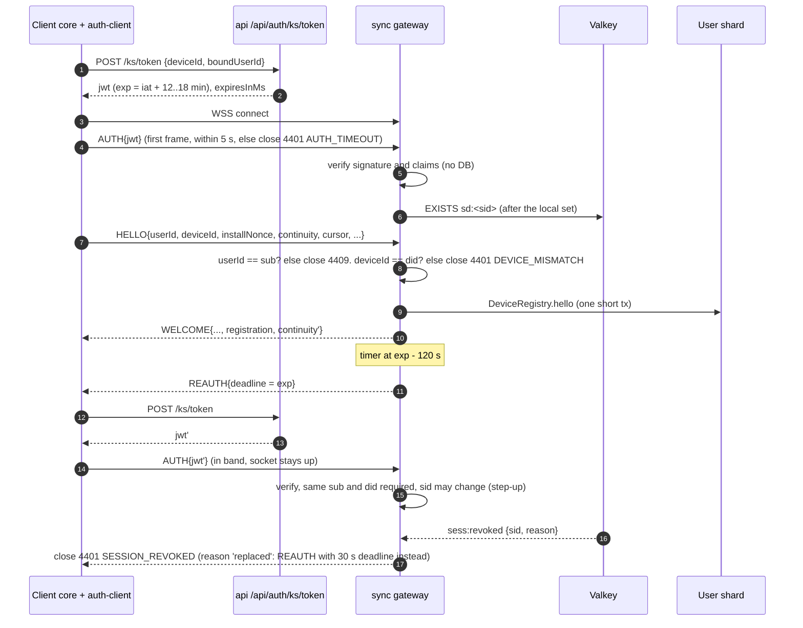
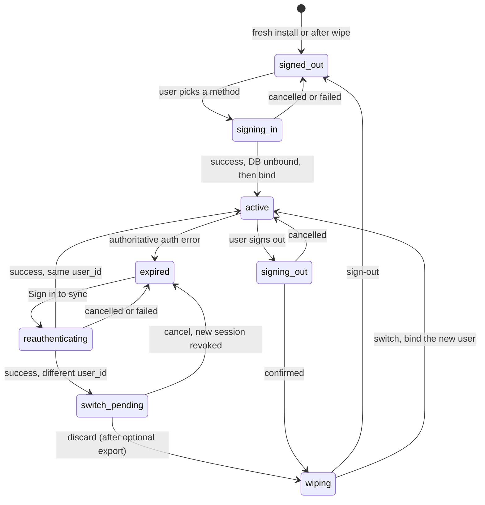
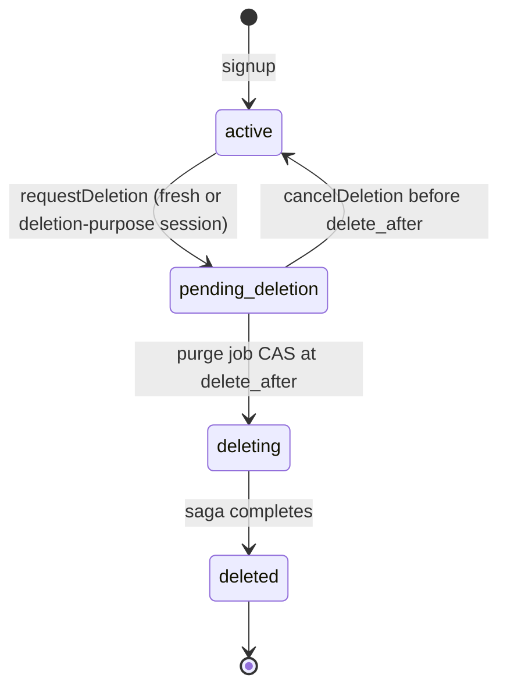
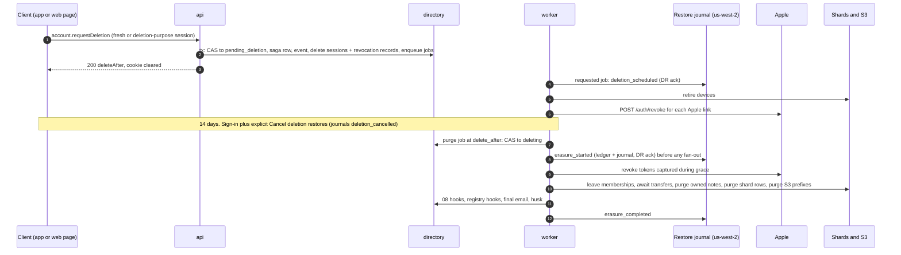

# 12 · Identity, sessions and devices

*Aligned with spine v1.3.*

*Detail design · elaborates spine v1.3 (first written against v1.1; v1.2 changes C-22–C-24, C-27, C-31, C-51, C-52, C-83–C-92 and v1.3 changes C-206, C-209, C-211, C-221, C-222, C-224, C-230, C-232, C-237, C-240, C-246, C-247 applied) · 2026-10-04 · Status: draft for review*

## 1. Purpose and scope

This document defines three things: how a person proves who they are, how each install of the app proves which device it is, and how both identities are protected against cloning, mix-ups and silent loss. It is the implementation contract for:

- Better Auth 1.7.7 configuration: shard-tagged ID generation, residency at signup, sign-in methods and plugins (D-41, D-30, §4.5).
- Sessions: 90-day sliding lifetime, rotation, the web cookie on the same-origin `/api` route, the native bearer token, and freshness for sensitive operations (D-41, D-44).
- The KSP socket credential: EdDSA JWT minting with jittered expiry, in-band `REAUTH`, the 24 h socket cap and the per-sid denylist (D-41, D-25).
- Push-only device tokens for native background code (D-41, D-38), including the credential that `notif-actions` uses for its native POSTs (C-211).
- Device identity: `device_id`, the DB-resident `install_nonce`, registration on `HELLO`, fresh-DB re-registration, the continuity check against live clones, retirement, `device.signOut` and `device.update` (D-42, INV-18).
- The credential side of account binding: `ACCOUNT_MISMATCH`, the `SESSION_EXPIRED` transitions and the account-switch flow (D-41, INV-18, INV-12, X-14).
- The `ACCOUNT_LOCKED` answer to sign-in, JWT mint and device-token use while 15's account lock is in force (C-237).
- Identity events (`SharingIdentityHooks`), `normalizeEmail` and the account lookup by normalized email that sharing consumes (P-15, P-16, C-92).
- Account deletion: the request, the 14-day grace period, the purge saga (including its wait for legal-hold capture), SIWA code exchange, refresh-token storage and revocation, the web deletion URL, synchronous journaling of requests and cancellations, and the restore-replay entry points (P-25, A-09, D-45, C-27, C-237).
- Export authentication and the download-link policy (P-29).
- The identity side of the non-production test-control plane and of the canary accounts (X-16, D-46, C-246, C-247).

### Out of scope

| Topic | Owner |
|---|---|
| Note ACL predicates, invites, contacts, pending inbox, revocation pipeline internals, `emailHmac()` and its pepper (C-92) | `08-sharing-and-authz.md` |
| KSP byte layouts, frame catalogue, close-code registry, capability list, SyncEngine. This doc owns the meaning of the auth fields and close reasons the spine adopted in §5.3 (§14.3) | `02-sync-protocol.md` |
| Gateway internals (Transport, admission, subscriptions, deploy drain). This doc defines the auth calls the gateway makes | `03-sync-server.md` |
| Local DB creation and binding, wipe, the unsynced collection, salvage, and the sign-out wipe sequence. This doc defines the credential side and the rules those mechanics must follow | `04-client-core.md` (§4.4, §14.5, §14.6 there) |
| Reminder coverage semantics, primary-ringer election, push sending, the reminder settings keys. This doc retires and re-registers device records and calls 09's listener and hooks (§9) | `09-reminders-and-push.md` |
| Native module code, Keychain and Keystore plumbing, `BgCredentialV1`, backup-exclusion manifests | `07-mobile-app.md` |
| Service-worker records (`SwHintV1`, `SwInboxEntryV1`) and the web sign-in screens | `06-web-app.md` |
| Export ZIP layout and builder, `UnsyncedExportV1` and its renderer | `15-security-privacy-compliance.md` (§9.3, §9.4 there) |
| Account locks (`account_enforcement`), legal holds (`legal_holds`), evidence capture, enforcement decisions. This doc owns only the `ACCOUNT_LOCKED` answer and the saga's wait for a capturing hold (C-237) | `15-security-privacy-compliance.md` (§9.6, §11.5 there) |
| Authoritative DDL. This doc states the identity tables and columns that 13 adopts | `13-data-platform.md` |
| Per-note purge pipeline, deletion ledger, restore journal and restore runbook | `03-sync-server.md`, `13-data-platform.md` |
| Attachment ownership transfer, `blob_refs` and prefix purge | `10-media.md` |
| Multi-Region KMS keys, Secrets Manager replicas, CloudFront and ALB, the canary service | `14-infra-and-operations.md` |
| The test-control plane contract (`TestControlV1`) and its guards. This doc backs its identity calls (§20.5) | `16-verification.md` |
| App Attest / Play Integrity at signup (M4). This doc defines only the hook point | `15-security-privacy-compliance.md` |
| Splitting directory and auth rows by region (T-16) | Future cell design |
| Several signed-in accounts on one device | Not supported in v1 |

## 2. Spine references

| ID | What this doc does with it |
|---|---|
| D-41 | Elaborated in full: library, plugins, sessions and rotation (C-90), cookie, bearer, fresh-install hygiene (C-91), push-only device tokens (C-85), `SESSION_EXPIRED`, JWT, `REAUTH`, 24 h cap, durable per-sid denylist (C-89), SIWA code exchange and revocation timing (C-88) |
| D-42 | Elaborated in full: storage of `device_id` and `install_nonce`, in-place registration with `registration_id` (C-83), the continuity check (C-84), retirement guarded by `session_id` (C-91), client identity reset that keeps cursor epochs (C-83) |
| INV-18 | Elaborated: the registration algorithm, account binding and `ACCOUNT_MISMATCH` (close 4403, C-23), live-clone detection within two connects (close 4409 `DEVICE_FORKED`, C-84) |
| D-06 | DB and token files excluded from backups and device transfer (C-84); the `app-group` file-protection helpers ship in M1 (C-209) |
| P-25 | Elaborated: deletion state machine, saga, grace period with explicit Cancel deletion (C-86), 30-day clock from the request (C-87), SIWA revocation, web deletion URL, legal-hold wait and enforcement-initiated deletion (C-237) |
| P-29 | Elaborated: export authentication, job lifecycle, link policy |
| D-30, §4.5 | User ID minting from the residency range; Better Auth ID generator |
| D-44 | Same-origin `app.<domain>/api` route, cookie scope, CSRF posture |
| D-25 | `sess:revoked` channel and the denylist keys in Valkey, a cache of `session_revocation` (C-89) |
| D-28, X-05 | Fixture-matrix rows for pending-deletion, deleted and locked accounts |
| D-36, P-09 | Ringer role and push token cleared on retirement, coverage invalidated by `registration_id`; `last_seen_at` and `last_foreground_at` touches |
| D-38 | Which native contexts hold which credential; `bg-flush` in M1 (C-209); the `notif-actions` native POST (C-211) |
| D-39, X-06 | Attachment transfer before the prefix purge in the deletion saga; staging, master, rendition and export prefixes and `blob_refs` rows purged (C-221, C-222, C-224) |
| D-45 | Journal-first ordering for account erasure; deletion requests and cancellations journaled synchronously before they are confirmed (C-27); directory restore revokes every session and device token (C-31); multi-Region KMS key for the SIWA token envelope (C-230) |
| D-46 | Canary accounts and their sign-in path (C-247) |
| D-50 | Disposable-domain and attestation signup controls; the account-lock answer (C-237) |
| INV-1 | Background inbox writers (iOS extensions, `notif-actions`, the web service worker) commit before any network call (C-204) |
| INV-12, INV-13, INV-14 | Sign-out and account-switch confirmation after the editor-session drain (C-51); typed tombstone `account_deleted`; identity reset never masks a restore resync (C-83) |
| X-01 | Log redaction; URL hygiene of the auth and account routes (C-206) |
| X-11 | Identity alarms page only in the legal-deadline category (C-232) |
| X-12, X-14 | Auth rate limits, offline UX of an expired session |
| X-16, X-03 | Login auditing; multi-Region keys (C-230); identity backing of the test-control plane (C-246) |
| A-09, R-10, R-12, R-14 | Store compliance, dependency isolation behind our own interfaces, session-expiry risk |
| Q-17, Q-18 | Verification gates in M0 (§21) |

## 3. Overview

### 3.1 Components

| Component | Location | Runs in | Responsibility |
|---|---|---|---|
| `identity` server module | `apps/server/src/identity` | `api`, `sync`, `worker` | Everything server-side in this doc |
| Better Auth instance | `identity/auth.ts` | `api` only | Sign-in, sign-up, sessions, passkeys, OAuth callbacks, JWKS storage |
| `ksIdentity` Better Auth plugin (ours) | `identity/plugin/*` | `api` | `/api/auth/ks/*` endpoints: token mint, device token, Apple code exchange, Apple notifications |
| `IdentityAdapter` | `identity/adapter.ts` | `api`, `worker` | Decorator over the Drizzle adapter: session-token hashing, rotation lookups, revocation records (§4.4) |
| `JwtSigner`, `JwtVerifier`, `JwksCache` | `identity/jwt/*` | signer in `api`; verifier in `api` and `sync` | §6 |
| `SessionDenylist` | `identity/denylist.ts` | `api`, `sync`, `worker` | §7 |
| `DeviceRegistry` | `identity/devices.ts` | `sync` (HELLO), `api`, `worker` | §9 |
| `IdentityEvents` dispatcher | `identity/events.ts` | `worker` | §11 |
| `AccountDeletionSaga` | `identity/deletion/*` | request in `api`, saga in `worker` | §12 |
| `ExportAuth` | `identity/export.ts` | `api`, `worker` (expiry) | §13 |
| `AccountLocks` | `identity/locks.ts` | `api`, `sync` (device-token verify), `worker` | Reads 15's `directory.account_enforcement`; answers `ACCOUNT_LOCKED` (§6.2, C-237) |
| `IdentityTestControl` | `identity/testctl.ts` | `api`, non-production only | Backs the identity calls of 16's `TestControlV1` (§20.5, C-246) |
| `auth-client` package | `packages/auth-client` | Next to the client core: web leader DB Worker; Hermes JS thread on native | `AuthPort` for the core and `AuthController` for the UI (§10.6). Its core-side object is the `SessionManager` of 04's layout, constructed inside `createCore` over 04's platform services and `LocalAccountStore` (04 §4.4) |
| Auth screens | `apps/web`, `apps/mobile` | UI thread | Sign-in, step-up sheet, account switch, deletion, export |

Only these modules import `better-auth`. That keeps the library replaceable behind `IdentityAdapter`, `JwtSigner` and `DeviceRegistry` (R-12). `packages/auth-client` imports nothing from the DOM, React Native or Node. Its platform services are injected (X-19).

### 3.2 Credentials at a glance

| Credential | Format | Minted by | Held where | Lifetime | Accepted at | Rejected at |
|---|---|---|---|---|---|---|
| Web session | Better Auth signed session token in cookie `__Host-ks.sid` | Better Auth sign-in | Browser cookie jar (HttpOnly) | 90 d sliding; rotated at most daily | `/api/auth/*`, `/api/rpc/*` | `/v1/sync/*`, WebSocket |
| Native session | Same token, sent as `Authorization: Bearer` | Better Auth sign-in (`set-auth-token` header, `bearer()` plugin) | `CredentialStore` slot `session` (§10.6) | Same | `/api/auth/*`, `/api/rpc/*` | `/v1/sync/*`, WebSocket |
| KSP JWT | EdDSA (Ed25519) compact JWT, claims in §6.1 | `POST /api/auth/ks/token` | Memory only | Uniform 12–18 min | WS `AUTH`, `/v1/sync/*`, `/api/rpc/*` procedures declared `jwt-or-session` | Sensitive account procedures |
| Device token | `kdt1_` + 43 base64url chars | `POST /api/auth/ks/device-token` | `CredentialStore` slot `device_token`, plus 07's native-readable copy `BgCredentialV1`; never backed up or transferred (§8.2) | Life of the bound session; superseded every 30 d | `POST /v1/sync/push` only, scope-filtered | Everything else |
| Deletion-purpose session | Session with `purpose = 'account_delete'` | Sign-in on `/account/delete` while signed out | Browser cookie | 15 min, not sliding | `account.get`, `account.requestDeletion` | Everything else, including `account.cancelDeletion` (P-25, C-86) |
| `install_nonce` | 32 hex chars (128 bits), CSPRNG | Client | Local DB `sync_meta` | One DB identity (§9.1) | `HELLO` | — |
| Continuity token | 32 CSPRNG bytes, base64url | Server, in `WELCOME` | Local DB `sync_meta` | Until the next `WELCOME` | `HELLO` | — |

### 3.3 Hosts, paths and the same-origin web API

D-44 places the web HTTP API on the page's own origin. Concrete routing:

| Surface | Base | Route prefix on the server | Notes |
|---|---|---|---|
| Web | `https://app.<domain>/api/auth/*` | `/api/auth/*` | Better Auth plus `ksIdentity` |
| Web | `https://app.<domain>/api/rpc/*` | `/api/rpc/*` | oRPC procedures |
| Web | `https://app.<domain>/api/v1/*` | `/v1/*` | A CloudFront Function strips `/api` (below) |
| Native | `https://api.<domain>/api/auth/*`, `/api/rpc/*`, `/v1/*` | Same | ALB host rule `api.` |
| Native and web | `wss://sync.<domain>/v1` | — | ALB host rule `sync.`; never through CloudFront (D-27, D-44) |

**CloudFront behavior `/api/*`** on the `app.` distribution:
- Origin: `api.<domain>` (the ALB), HTTPS only, origin TLS validated against the ALB certificate.
- Cache policy `CachingDisabled`. The origin request policy forwards all cookies, all query strings and every viewer header except `Host`, plus `CloudFront-Viewer-Address` and `CloudFront-Viewer-Country`.
- Origin custom header `X-KS-Edge-Secret: <secret>`. It is rotated quarterly from Secrets Manager, with a two-value overlap.
- Viewer-request CloudFront Function:

```js
function handler(event) {
  var r = event.request;
  // /api/v1/sync/push -> /v1/sync/push. /api/auth/* and /api/rpc/* keep their prefix so Better Auth
  // sees the exact external path and builds correct OAuth callback URLs.
  if (r.uri.indexOf('/api/v1/') === 0) { r.uri = r.uri.substring(4); }
  delete r.headers['x-ks-edge-secret'];          // a viewer can never supply the edge secret
  delete r.headers['x-ks-client-ip'];
  return r;
}
```

**Edge trust** (Fastify `onRequest`, the first hook):
1. Delete any inbound `x-ks-client-ip` header.
2. If `X-KS-Edge-Secret` matches a current secret, the request came through CloudFront. Then `surface = 'web'`, the client IP is the address part of `CloudFront-Viewer-Address`, and the country is `CloudFront-Viewer-Country`.
3. Otherwise `surface = 'native'`. The client IP is the right-most `X-Forwarded-For` entry, which the ALB appends, and the country comes from an in-process GeoIP lookup (§4.2).
4. Set `x-ks-client-ip` for Better Auth (`advanced.ipAddress.ipAddressHeaders`) and populate the request context (§4.6).
5. Strip `X-KS-Edge-Secret` before any logging.

An ALB WAF rule drops requests to `api.` that present `X-KS-Edge-Secret` but do not come from the CloudFront origin-facing IP ranges.

**Cookie-surface rule.** A session cookie is honored only when `surface = 'web'`. Native requests must use `Authorization`. Cookies are host-only on `app.<domain>`, so browsers never send them to `api.<domain>`. The rule is defense in depth. We do not use `@better-auth/expo`'s client-side cookie storage. `auth-client` keeps the bearer token itself (§10.6), and the server-side `expo()` plugin is kept for its origin handling.

**CSRF.** Cookie-authenticated state-changing requests require all of:
- `SameSite=Lax` on the cookie, so cross-site POSTs carry no cookie;
- `Origin` equal to `https://app.<domain>`, checked by Better Auth's `trustedOrigins` and by our own `csrfGuard` on `/api/rpc/*`;
- header `X-KS-Client: web/<version>`, which makes any cross-origin request non-simple. Neither host configures CORS, so the preflight fails.

The one cross-site POST we accept is Apple's `form_post` callback to `/api/auth/callback/apple`. It carries no session cookie and is authenticated by the OAuth `state` (§4.3; M0 gate G5).

**No popups.** Web sign-in uses full-page redirects for Apple and Google and WebAuthn on the page itself for passkeys. No ceremony opens a popup or reads `window.opener`, so 06 can serve `Cross-Origin-Opener-Policy: same-origin`.

**URL hygiene (X-01, C-206).** The client's auth and account routes (`/signin`, `/account/delete`, the step-up sheet, the account-switch dialog, native deep links into them) never carry the email address, an OTP code, the `X-KS-Intent` value, a session or device token, or an Apple or Google code in the path or query. Flow state lives in history state (web) or navigation params held in memory (native), and every value goes to the server in a request body or header. Two URLs carry protocol secrets by design and are covered differently:
- OAuth callbacks (`/api/auth/callback/:provider`) are server routes, not client routes. Google's `code` and `state` arrive in the query, are consumed by that same request, are single-use and need our client secret, so a copy in CloudFront or ALB logs grants nothing. Apple uses `form_post`, so its code travels in the body.
- The export download link (§13) is a CloudFront signed URL that expires within 15 min (10 owns the media distribution and its logging).

Telemetry and error reports strip the query and the fragment from every URL they record (X-01). Gate G9's fallback, if it is ever needed, hands the native app a one-time code in the URL **fragment** of its return deep link, never in the query.

**Safari cookie cap (Q-17).** The page and `/api/*` are served by the same CloudFront edge addresses. `Set-Cookie` therefore comes from the page's own IP range, and Safari's 7-day cap on cookies set by servers in a different IP range does not apply. M0 spike 3 verifies this, including on rotation responses (gate G8).

### 3.4 Interfaces at a glance

**Owned here** (consumers in parentheses):

| Interface | Section |
|---|---|
| KSP JWT header, claims, `KspPrincipal`, `JwtVerifier`, `JwtError` (03, 10, 11, 14) | §6.1, §6.3 |
| Meaning of the close reasons for 4401, 4403 and 4409, the `HELLO`/`WELCOME` identity fields (`continuity`, `registration`) and `rowOmitted`, adopted in spine §5.3 (C-22, C-23, C-84); 02 owns the registry (02, 03, 04) | §6.4, §14.3 |
| `SessionDenylist`, `RevocationReason`, Valkey key `sd:<sid>`, channel message `sess:revoked` (03) | §7 |
| `resolveSyncAuth` and `SyncPrincipal` for `/v1/sync/*` (03) | §6.5 |
| `DeviceTokenPrincipal`, `DeviceScope` (03, 07, 09) | §8.1 |
| `DeviceRegistry.registerOnHello`, `retireDevice`, `signOutDevice`, `updateDevice`, `touch` (03) | §9 |
| `DeviceRetirementListener` (implemented by 09) | §9.2 |
| `SharingIdentityHooks` contract and its delivery guarantees, `normalizeEmail()`, `IdentityDirectory` including the account lookup by normalized email (08, 10, 15; C-92) | §11 |
| `AccountDeletionSaga` including the restore-replay entry points (13, 15) | §12.9 |
| `ACCOUNT_LOCKED` answer at sign-in, mint and device-token use (15; C-237) | §6.2, §8.1, §10.3 |
| `AuthPort` (04), `AuthController` (06, 07), `CredentialStore` (implemented by 07), `PendingSignOut` record (04), `identityActionForWelcome` (04) | §9.2, §9.6, §10.6 |
| Identity HTTP endpoints and `AuthErrorCode` (04, 06, 07) | §14 |
| Identity tables and the `devices` additions (adopted by 13) | §15 |
| Identity backing of `TestControlV1`; canary account creation and sign-in (14, 16) | §20.5 |

**Consumed** (owner: minimal assumption):

| Owner | Assumption |
|---|---|
| 01 | `ids.mintShardTagged(shard, ms)`, `ids.shardOf(id)`, `ids.isShardTagged(id)`, `ids.plainV7()`; `hlc.nodeFromInstallNonce(nonce)` is deterministic |
| 02 | Owns the frame and close-code registry; accepts the additive fields in §14.3 |
| 03 | The gateway calls `JwtVerifier.verify` on every `AUTH`, then `DeviceRegistry.hello` on `HELLO` after the `userId = sub` check. It handles `sess:revoked`, closing the socket except for reason `replaced`, which gets `REAUTH` with a 30 s deadline. It passes `HELLO.continuity` through and puts `registration` and `continuity` into `WELCOME`. It dispatches `device.update` and `device.signOut` to §9. `/v1/sync/*` calls `resolveSyncAuth` |
| 04 | `session.bind`, `wipeAndBind`, `exportUnsynced` and `signOut` behave as in its §14.5. `FeedPort.helloIdentity` includes `sync_meta.continuity`. `onWelcome` calls `identityActionForWelcome` and runs `resetInstallIdentity` when told to (§9.2). `sync_meta` gains the §15.3 keys. `signOut` writes `pending_signout` in the §9.6 format, using `AuthPort.deviceToken()`. A bootstrap onto a DB that already holds rows merges like a `meta` resync. Every auth-looking failure is routed to `AuthPort.reportFailure`. The core enters `session_expired` only on an `expired` event from `AuthPort` |
| 07 | Implements `CredentialStore`. Stores `device_id` in Keychain `AfterFirstUnlockThisDeviceOnly` or Android no-backup storage. Excludes the DB and the SecureStore preferences from backup **and** device transfer |
| 08 | Implements `SharingIdentityHooks` idempotently. Owns `emailHmac()`. Provides `member.removeForAccount(userId)` |
| 09 | Implements `DeviceRetirementListener` in the caller's transaction. Push targeting excludes rows with `retired_at IS NOT NULL` or `push_token IS NULL` |
| 10 | `media.pendingTransfers(userId)` and `media.purgeUploaderPrefix(userId)` are idempotent |
| 13 | Adopts §15. Provides `ledger.recordAndJournal`, `journal.appendDirect`, `purgeUserShardRows`, the purge-hook registry and `ShardRouter.info(shard).epoch`. Its restore replay calls §12.9 |
| 15 | Export builder, `AttestationVerifier` (M4), vendor erasure hooks, security-log retention |

## 4. Better Auth configuration

### 4.1 Configuration

Values in angle brackets come from per-environment config. Options marked `// M0` must be confirmed against the 1.7.7 typings in M0; §21 lists each one with its fallback.

```ts
// apps/server/src/identity/auth.ts
import { betterAuth } from 'better-auth';
import { bearer, emailOTP, jwt } from 'better-auth/plugins';
import { passkey } from '@better-auth/passkey';
import { expo } from '@better-auth/expo';
import { drizzleAdapter } from 'better-auth/adapters/drizzle';
import { identityAdapter } from './adapter';            // §4.4
import { ksIdentity } from './plugin';                   // our endpoints, §14
import { generateAuthId } from './ids';                  // §4.2
import { hooks, databaseHooks } from './hooks';          // §4.5

export const auth = betterAuth({
  appName: 'Keep',
  baseURL: cfg.webOrigin,                                // https://app.<domain>
  basePath: '/api/auth',
  secret: secrets.betterAuthSecret,                      // Secrets Manager; rotation runbook §19 row 22
  database: identityAdapter(drizzleAdapter(db.directory, { provider: 'pg', schema: authSchema })),
  trustedOrigins: [cfg.webOrigin, 'https://appleid.apple.com', `${cfg.appScheme}://`],
  emailAndPassword: { enabled: false },                  // D-41: no passwords
  user: {
    additionalFields: userFields,                        // §15.1
    changeEmail: { enabled: false },                     // our OTP-based flow, §11.5
    deleteUser: { enabled: false },                      // our saga, §12
  },
  session: {
    expiresIn: 90 * 86_400,                              // D-41: 90-day sliding lifetime
    updateAge: 86_400,                                   // slide at most once a day per session
    cookieCache: { enabled: false },                     // every cookie read hits the DB: revocation is immediate on HTTP
    additionalFields: sessionFields,                     // §15.1
  },
  account: {
    accountLinking: { enabled: true, trustedProviders: ['apple', 'google'], allowDifferentEmails: false },
  },
  socialProviders: {
    apple: {
      clientId: cfg.apple.servicesId,                    // web
      clientSecret: appleClientSecret(cfg.apple.servicesId),   // ES256 JWT, §12.5
      appBundleIdentifier: cfg.apple.bundleId,           // audience for native ID tokens
      disableImplicitSignUp: true,                       // M0: sign-up only when requestSignUp is passed
    },
    google: {
      clientId: cfg.google.webClientId,                  // also the audience of native ID tokens
      clientSecret: secrets.googleClientSecret,
      disableImplicitSignUp: true,                       // M0
    },
  },
  advanced: {
    database: { generateId: generateAuthId },            // M0: per-model generator signature
    useSecureCookies: true,
    cookies: {
      session_token: {
        name: '__Host-ks.sid',                           // M0: emitted with Path=/ and no Domain
        attributes: { httpOnly: true, secure: true, sameSite: 'lax', path: '/' },
      },
    },
    ipAddress: { ipAddressHeaders: ['x-ks-client-ip'] },
  },
  rateLimit: { enabled: false },                         // our Valkey limiter, §17
  plugins: [
    expo(),                                              // native origin handling (expo-origin header)
    bearer(),                                            // Authorization: Bearer <session> on native
    passkey({
      rpID: cfg.rpId,                                    // <domain> (registrable apex)
      rpName: 'Keep',
      origin: [cfg.webOrigin, `https://${cfg.rpId}`, ...cfg.androidApkKeyHashOrigins],  // M0
    }),
    emailOTP({
      otpLength: 6,
      expiresIn: 300,
      allowedAttempts: 3,
      storeOTP: 'hashed',
      disableSignUp: false,
      sendVerificationOTP: sendOtpEmail,                 // §4.3
    }),
    jwt({
      jwks: { keyPairConfig: { alg: 'EdDSA', crv: 'Ed25519' } },
      jwt: { issuer: cfg.jwtIssuer, audience: 'ksp', expirationTime: '15m' },  // nominal; per-token exp set by JwtSigner, §6.2
      disableSettingJwtHeader: true,                     // no JWT on ordinary responses
    }),
    ksIdentity(),
  ],
  hooks,
  databaseHooks,
});
```

D-41 names four plugins. This config adds two more: `bearer()`, the native bearer transport that D-41 describes, and `ksIdentity`, our own endpoints. Both elaborate D-41 and bring in no new dependencies.

Better Auth tables live in the `directory` schema under their default names (`user`, `session`, `account`, `verification`, `passkey`, `jwks`; `user` is quoted). Columns use snake_case through the adapter's field mapping (13 §2.1). ID columns are `uuid` for `user` and `session`.

### 4.2 IDs, residency and home shard

**User IDs** are shard-tagged UUIDv7 (D-30, §4.5), minted by `domain/ids` (01). Every other Better Auth model gets a plain UUIDv7.

```ts
// apps/server/src/identity/ids.ts
export function generateAuthId({ model }: { model: string }): string {
  if (model !== 'user') return ids.plainV7();
  const rc = requestContext();                                   // §4.6
  const shard = pickHomeShard(rc.residency());                   // from the residency range only
  rc.mintedHomeShard = shard;
  return ids.mintShardTagged(shard, Date.now());
}

const RANGE = { us: [0, 511], eu: [512, 1023] } as const;        // §4.5

export function pickHomeShard(residency: 'us' | 'eu'): number {
  const [lo, hi] = RANGE[residency];
  const active = shardMapCache.get()                             // directory.shard_map, cached 30 s
    .filter(s => s.logicalShard >= lo && s.logicalShard <= hi && s.state === 'active');
  if (active.length === 0) throw new IdentityError('NO_ACTIVE_SHARD', { residency });  // alarm: signup is down
  const byCluster = groupBy(active, s => s.cluster);
  const weights = flags.get('shard.clusterWeights') ?? {};       // headroom weights; default 1.0 each
  const cluster = weightedPick(Object.keys(byCluster), c => weights[c] ?? 1.0, crypto.randomInt);
  const pool = byCluster[cluster];
  return pool[crypto.randomInt(pool.length)].logicalShard;
}
```

The `user` row carries `home_shard`. A CHECK constraint requires it to equal the shard bits of `id` (13 §2.1), so the column can never disagree with the ID.

**Residency** is decided once, at signup, and stays fixed for the life of the account (spine §4.5). Sources, in order:

| # | Source | Used when |
|---|---|---|
| 1 | `CloudFront-Viewer-Country` | Web surface (edge secret verified) |
| 2 | In-process GeoIP country lookup on the client IP | Native surface. A DB-IP or IPinfo country-lite database (permissive licence), bundled in the image and refreshed monthly by Renovate |
| 3 | `X-KS-Region` request header (device locale region, ISO 3166-1 alpha-2) | Sources 1 and 2 gave no answer, or the IP is in a known anonymizer range in the GeoIP database |
| 4 | `us` | Nothing above answered. Logged as `residency_fallback=1` |

`eu` is assigned when the country is in `flags['residency.euCountries']`. The default list is the EU-27, the EEA (IS, LI, NO), CH and GB. The list is a product call (Q-12.1). Residency is shown read-only in settings ("Data region: EU").

**Shard-side row.** Every user needs a `users_sync` row on the home shard. `databaseHooks.user.create.after` inserts it inline (insert-if-absent), with `home_tz` taken from `X-KS-TZ` (a validated IANA zone, else `UTC`). After T-02 that insert targets a different cluster, so it cannot be inside the Better Auth transaction. Two paths therefore repeat the same insert-if-absent as `ensureUserShardRow(userId)`: the first token mint of each session, and any `HELLO` whose `users_sync` read misses (03 §4.3 step 5). A crash between the two writes heals on first use.

### 4.3 Sign-in methods

Passwords are not offered (D-41). Passkeys require an existing account. New accounts are created through Apple, Google or email OTP, and the app then offers "Create a passkey for faster sign-in".

| Method | Web | iOS / Android | Creates accounts | Email verified when | Notes |
|---|---|---|---|---|---|
| Passkey | `@simplewebauthn/browser` through the Better Auth passkey client | `react-native-passkey` 3.6.2 calling the Better Auth passkey endpoints (glue in 07) | No | Never changes email state | `rpID = <domain>`. iOS needs Associated Domains `webcredentials:<domain>`. Android needs `https://<domain>/.well-known/assetlinks.json` with `delegate_permission/common.get_login_creds`. Both files ship with the apex marketing site (14). Android assertion origins are `android:apk-key-hash:<b64url sha256>` for the Play App Signing key and the upload key |
| Sign in with Apple | OAuth redirect, `response_mode=form_post`; Better Auth exchanges the code with the Services ID | `expo-apple-authentication` ID-token sign-in plus `X-KS-Apple-Code` (§12.5) | Yes, with `requestSignUp: true`, sent only from the app's sign-in screen | `email_verified` claim is true | The name arrives only on first authorization; the app sends it with `account.profile.update` right after sign-in. Private relay addresses (`@privaterelay.appleid.com`) are flagged `privateRelay` |
| Google | OAuth redirect, `prompt=select_account` | `@react-native-google-signin/google-signin` ID token, audience = the web client ID | Yes (same rule) | `email_verified` claim is true | Google access and refresh tokens are nulled after sign-in (§4.5), because we call no Google API |
| Email OTP | 6 digits, 5 min, 3 attempts, stored hashed | Same | Yes | On successful verification | Sent synchronously through SES (`SendEmail`, 3 s timeout). On failure it is enqueued on the pg-boss `email` queue with `singletonKey = otp:<rate-key>` |

**Account linking.** A social sign-in links to an existing user only when all three hold: the provider asserts `email_verified = true`, the existing user's email is verified, and the normalized emails are equal (`allowDifferentEmails: false`). Otherwise a social sign-in with a new provider subject creates a new account, or is refused on surfaces that cannot sign up.

**Signup controls** (in `user.create.before`, §4.5):
- `intent = 'account-delete'` is refused with `SIGNUP_UNAVAILABLE`, because the deletion page never creates accounts (§12.7).
- An existing user with the same `email_norm` in status `deleting` is refused with `SIGNUP_UNAVAILABLE` ("Try again later").
- OTP signups from domains on the disposable-domain blocklist (D-50) are refused with `SIGNUP_UNAVAILABLE`.
- The per-IP signup limit applies (§17).
- From M4, native signups carry an App Attest or Play Integrity assertion header, checked by 15's `AttestationVerifier`. In enforce mode, a missing or failed assertion is refused with `SIGNUP_UNAVAILABLE`.

Every refusal uses the same code and message, so the response never says why.

### 4.4 `IdentityAdapter`: token hashing, rotation lookups and revocation

By default, Better Auth stores session tokens in plaintext, so a leaked `session` table would be a set of live credentials. The adapter decorator wraps every Better Auth database call on the `session` model:

| Better Auth call | Decorator behavior |
|---|---|
| `create({model:'session', data})` | Stores `token = sha256hex(data.token)`. Returns the row with the caller's plaintext token, so Better Auth sets the cookie or `set-auth-token` as usual |
| `findOne({model:'session', where:[token = t]})` | Looks up `token = sha256hex(t)`. On a hit, sets `cur_first_used_at = now()` if it is null. On a miss, applies the previous-token rule of §5.1: either returns the row (accepted) or revokes it (`token_reuse`) and returns null |
| `update({model:'session', ...})` where `token` changes | Hashes the new value |
| `delete` / `deleteMany({model:'session'})` | Rewritten as one statement that also writes the revocation records (below) |

```sql
-- Every session deletion, from any path (sign-out, revoke-session, revoke-other-sessions, our own revocations):
WITH d AS (
  DELETE FROM directory.session WHERE <predicate>
  RETURNING id, user_id, token, prev_token_hash, expires_at, device_id
)
INSERT INTO directory.session_revocation
       (sid, user_id, revoked_at, reason, token_hash, prev_token_hash, session_expires_at, device_id)
SELECT id, user_id, now(), $reason, token, prev_token_hash, expires_at, device_id FROM d
ON CONFLICT (sid) DO NOTHING
RETURNING sid, user_id, device_id;
```

`$reason` comes from the request context (`rc.revocationReason`, default `sign_out`). After commit, the returned rows go to `SessionDenylist.published(...)` (§7.2). `device_token` rows go with them through `ON DELETE CASCADE`.

The revocation record keeps the token hashes until the session would have expired anyway (`session_expires_at`, at most 90 days). This lets a later mint attempt with a revoked token get a precise answer (`SESSION_REVOKED` with its reason, or `ACCOUNT_PENDING_DELETION`) instead of a generic `SESSION_EXPIRED` (§6.2). Natural expiry writes no record.

M0 must confirm two things: that Better Auth 1.7.7 reaches sessions only through the adapter, and that its signed cookie and the `bearer()` plugin still work when the stored value is a hash (gate G2). If not, the fallback is plaintext tokens with rotation disabled and `session` readable only by the `auth` DB role, with the residual risk recorded in 15 (Q-12.5).

### 4.5 Hooks

| Hook | Action |
|---|---|
| `databaseHooks.user.create.before` | Signup controls (§4.3). Sets `email_norm` (§11.1), `home_shard = rc.mintedHomeShard`, `residency`, `status = 'active'` |
| `databaseHooks.user.create.after` | `ensureUserShardRow`. If `emailVerified`, inserts identity event `email_verified` (§11.3). Security-logs `signup` |
| `databaseHooks.user.update.before` | Recomputes `email_norm` if `email` changes. Refuses `name` changes beyond 10 per user per day (§17) |
| `databaseHooks.user.update.after` | Inserts `email_verified` when `emailVerified` turns true; inserts `profile_changed` when `name` or `image` changes |
| `databaseHooks.session.create.before` | Refuses if `user.status ∈ {deleting, deleted}` (`ACCOUNT_DELETED`). `pending_deletion` is allowed: the user lands on the interstitial (§12.3). Sets `platform`, `auth_method`, `app_version` and `rotated_at = now()`. If `rc.intent = 'account-delete'`, sets `purpose = 'account_delete'` and `expiresAt = now() + 15 min` |
| `databaseHooks.session.create.after` | Session cap: beyond 50 sessions per user, deletes the least recently updated (reason `session_cap`). Handles `X-KS-Replaces-Session` (§5.5). Security-logs `sign_in` |
| `databaseHooks.account.create.after`, `account.update.after` | Apple: moves `refreshToken` into `apple_refresh_token_enc` (§12.5) and nulls `refresh_token`, `access_token` and `id_token`. Google: nulls the same three columns |
| `hooks.before` on `/email-otp/send-verification-otp` | With `intent = 'account-delete'`, sends only if an `active` or `pending_deletion` account has that email, and answers identically either way (§12.7) |
| `hooks.after` on `/sign-in/social` | With header `X-KS-Apple-Code` and `provider = apple`, exchanges the code inline (§12.5) and sets `X-KS-Apple-Exchange` on the response |
| `hooks.after` on `/sign-out` | Runs `signOutDevice` for `X-KS-Device` when that header is present (§9.5) |

Identity events are inserted in the same directory transaction as the change, after the transaction has locked the user row (§11.3). If 1.7.7's `databaseHooks` run outside the write transaction, the event insert runs in its own transaction immediately after, which is safe because delivery is at least once and the handlers re-read current state where it matters (§11.3).

If 1.7.7's `databaseHooks` do not receive the endpoint context, the hooks read the request context from AsyncLocalStorage, which the Fastify layer always sets (§4.6).

### 4.6 Request context

Fastify's `onRequest` hook opens an AsyncLocalStorage scope that every identity function reads:

```ts
export interface IdentityRequestContext {
  requestId: string;
  surface: 'web' | 'native';
  clientKind: 'web' | 'ios' | 'android' | 'unknown';   // from X-KS-Client: <kind>/<version>
  appVersion?: string;
  clientIp: string;                                     // never logged in full outside the security log
  country?: string;                                     // ISO 3166-1 alpha-2
  residency(): 'us' | 'eu';                             // computed lazily by §4.2, memoized
  regionHint?: string;                                  // X-KS-Region
  tz?: string;                                          // X-KS-TZ
  deviceId?: string;                                    // X-KS-Device (UUID, validated)
  boundUserId?: string;                                 // X-KS-Bound-User (UUID, validated)
  intent: 'app' | 'account-delete';                     // X-KS-Intent; default 'app'
  context: 'foreground' | 'background';                 // X-KS-Context; default 'foreground'
  mintedHomeShard?: number;
  revocationReason?: RevocationReason;
}
```

Admin tools and jobs that create users must open a context explicitly. A user created without one gets `us` and logs `residency_fallback=1`.

## 5. Sessions

### 5.1 Lifetime, sliding and rotation

| Property | Value | Spine |
|---|---|---|
| Lifetime | 90 days after the last slide | D-41 (the tombstone window) |
| Slide | On any authenticated use once `now − updated_at ≥ 24 h`: `expires_at = now + 90 d` | D-41 |
| Absolute cap | None (Q-12.3) | — |
| Token rotation | On a **foreground** `/api/auth/ks/token` call once `now − rotated_at ≥ 24 h` | D-41 "rotating" (SI-7) |
| Previous token | Accepted until the new token is first used, plus 60 s | — |
| Reuse | Previous token presented more than 60 s after the new one was first used: session revoked (`token_reuse`) | — |
| Expired cleanup | Hourly: `DELETE FROM directory.session WHERE expires_at < now() - interval '1 day'` (plain delete, no revocation record) | — |

Rotation contains a stolen session token. The thief and the owner cannot both keep using one session, so a theft surfaces as a revocation instead of persisting silently for 90 days. The previous-token rule tolerates a lost rotation response, which is common on mobile because the app is often suspended or killed mid-response.

```ts
// Inside IdentityAdapter.findOne for the session model, and in /ks/token.
type Lookup =
  | { kind: 'current'; session: SessionRow }
  | { kind: 'previous'; session: SessionRow }      // accepted; client never received or never used the current token
  | { kind: 'reuse'; sid: string }                 // revoke
  | { kind: 'revoked'; reason: RevocationReason; userId: string }   // §4.4 revocation record
  | { kind: 'none' };

async function lookupSession(presented: string, now: Date): Promise<Lookup> {
  const h = sha256hex(presented);
  const cur = await q.one(`SELECT * FROM directory.session WHERE token = $1`, [h]);
  if (cur) {
    if (!cur.cur_first_used_at) await q.exec(
      `UPDATE directory.session SET cur_first_used_at = now() WHERE id = $1 AND cur_first_used_at IS NULL`, [cur.id]);
    return { kind: 'current', session: cur };
  }
  const prev = await q.one(`SELECT * FROM directory.session WHERE prev_token_hash = $1`, [h]);
  if (prev) {
    if (prev.cur_first_used_at === null || now.getTime() - prev.cur_first_used_at.getTime() <= REUSE_GRACE_MS)
      return { kind: 'previous', session: prev };
    return { kind: 'reuse', sid: prev.id };
  }
  const rev = await q.one(`SELECT reason, user_id FROM directory.session_revocation
                           WHERE token_hash = $1 OR prev_token_hash = $1 LIMIT 1`, [h]);
  return rev ? { kind: 'revoked', reason: rev.reason, userId: rev.user_id } : { kind: 'none' };
}

// Rotation: only in /ks/token, only in the foreground, compare-and-set on the hash that was presented.
async function rotate(s: SessionRow, presentedHash: string, matched: 'current' | 'previous'): Promise<string | null> {
  const next = randomToken(32);                               // base64url
  const r = await q.exec(
    matched === 'current'
      ? `UPDATE directory.session SET prev_token_hash = token, token = $2, rotated_at = now(), cur_first_used_at = NULL
           WHERE id = $1 AND token = $3`
      // The client holds the previous token and never got the current one: discard the lost token and issue
      // a newer one. prev_token_hash stays the token the client actually holds.
      : `UPDATE directory.session SET token = $2, rotated_at = now(), cur_first_used_at = NULL
           WHERE id = $1 AND prev_token_hash = $3`,
    [s.id, sha256hex(next), presentedHash]);
  return r.rowCount === 1 ? next : null;                      // lost race: keep the presented token, no rotation
}
```

Background mints (`X-KS-Context: background`) never rotate. A background run that dies mid-response therefore never strands a token. If the client still holds only the previous token, the next foreground mint rotates again.

Client concurrency: `auth-client` makes token calls single-flight (§10.6), so one process never races itself. On web, every tab shares the cookie jar, and `Set-Cookie` replaces the cookie atomically. Requests already in flight with the old cookie fall inside the 60 s grace.

### 5.2 Web cookie

`__Host-ks.sid`: `HttpOnly; Secure; SameSite=Lax; Path=/`, no `Domain`, `Max-Age` = remaining session lifetime. It is re-issued on every slide and every rotation. The `__Host-` prefix makes the browser refuse the cookie unless it is host-only, secure and path `/`, which binds it to `app.<domain>`. CloudFront's static-asset behaviors do not forward cookies to S3.

The web `auth-client` runs in the leader tab's DB Worker (D-04) and obtains JWTs with `fetch('/api/auth/ks/token', { method: 'POST', credentials: 'same-origin' })`. Worker fetches use the page's cookie jar, and a `Set-Cookie` on the response updates it. Sign-in ceremonies that need the window (passkey, OAuth redirect) run on the main thread and then notify the worker (`AuthController.signInCompleted`, §10.6). Follower tabs get the auth state from the leader over 04's tab bus.

### 5.3 Native bearer token

- Sign-in responses carry `set-auth-token` (`bearer()` plugin). `auth-client` stores the token in `CredentialStore` slot `session`. On iOS that is Keychain item `ks.session.v1` with `kSecAttrAccessibleAfterFirstUnlockThisDeviceOnly`, so background contexts can read it after the first unlock and it never enters a backup.
- On Android, `expo-secure-store` encrypts with a Keystore key. The SharedPreferences file that holds the ciphertext must be excluded from both cloud backup **and** device-to-device transfer in `dataExtractionRules` (07). A restored or transferred ciphertext could not be decrypted anyway, because Keystore keys do not move between devices.
- The JS side sends `Authorization: Bearer <token>` to `/api/auth/*` and `/api/rpc/*` only. When `/ks/token` returns a rotated token, it is written to `CredentialStore` **before** the JWT from the same response is used. If the write fails, the old token keeps working under the previous-token rule.
- Native code (Swift, Kotlin) never reads the session slot. It uses the device token (§8).

**Fresh-install hygiene** (SI-8). iOS Keychain items survive app deletion. At launch, when 04 reports the DB as `unbound` (absent, or `sync_meta.user_id` is null), `auth-client`:
1. delivers any `pending_signout` record (§9.6);
2. if `CredentialStore` still holds a `session` token, moves it into a `pending_signout` record of kind `session` (§9.6), so its revocation is retried until it succeeds, then deletes the slot;
3. deletes the `device_token` and `session_pending` slots;
4. keeps `device_id`, which is meant to survive a reinstall (D-42).

A reinstall therefore always starts signed out, and a stale session never binds a fresh DB.

### 5.4 Session-to-device binding

A session is bound to exactly one device:
- `session.device_id` is set on the session's first `/ks/token` call, from the `X-KS-Device` header.
- The JWT's `did` claim is always `session.device_id`.
- If a later mint presents a different device ID, the session is **rebound**. The previously bound device record is retired with reason `superseded`, guarded by `devices.session_id = <this sid>` (§9.4), so a record that has since been re-registered under another session is left alone.

Rebinding covers web storage eviction. Safari can drop OPFS but keep the cookie. The new DB then mints a new `device_id`, and the dead record's Web Push subscription and coverage are cleared, so the same browser does not get duplicate pushes. Native sessions never rebind in normal operation, because `device_id` is stable and a reinstall starts a new session (§5.3). Two live installs sharing one session token are a clone, and §9.3 revokes that session before rebinding could oscillate.

### 5.5 Freshness and step-up

Sensitive operations require a **fresh session**, one whose `created_at` is within a maximum age:

| Operation | Max session age |
|---|---|
| `account.requestDeletion`, `account.cancelDeletion` | 10 min |
| `export.create` | 10 min |
| `export.downloadUrl` | 60 min |
| Add or remove a passkey; link or unlink a provider; change email | 10 min |
| `account.signOutEverywhere` | 10 min |

A stale session gets `403 STEP_UP_REQUIRED {maxAgeSec}`. Step-up is a full sign-in with any method the account has, passkey first. The client sends `X-KS-Replaces-Session: <current sid>` with that sign-in, and `session.create.after` then:
1. checks that the new session's `user_id` equals the replaced session's `user_id`. If not, it deletes the **new** session, and the client gets `ACCOUNT_MISMATCH`;
2. copies `device_id` from the replaced session;
3. calls `DeviceRegistry.rebindSession(userId, deviceId, oldSid, newSid)`, which sets `devices.session_id = newSid WHERE session_id = oldSid`. This is best effort, because the next `HELLO` sets it anyway;
4. deletes the replaced session with revocation reason `replaced`.

The device token cascades with the old session, so the client mints a new one immediately (§8.2). A `replaced` revocation **does not retire the device** (§7.2). Gateways answer it with `REAUTH{deadline: now + 30 s}` instead of closing the socket (§7.3), so a step-up does not drop the connection.

Step-up reuses the sign-in paths, so every step-up method runs on code that Better Auth already ships and no custom WebAuthn ceremony is needed. As a side effect, a SIWA step-up captures a fresh Apple refresh token (§12.5).

### 5.6 Session management for the user

Procedures under `/api/rpc` (§14):
- `account.sessions.list` returns `{sid, platform, appVersion, createdAt, lastActiveDay, current}`. It shows no IP addresses or user agents.
- `account.sessions.revoke{sid}` deletes the session (reason `user_revoked`). The other device enters `SESSION_EXPIRED(revoked)` at its next mint and keeps its data (D-41).
- `account.signOutEverywhere{includeThisDevice}` revokes every session of the user (reason `sign_out_everywhere`).

Every revocation except `replaced` retires the device record still bound to that session (§9.4). That clears its coverage, ringer role and push token. The device comes back as `reactivated` when it signs in again (§9.2).

## 6. KSP JWT (owned interface → 03)

### 6.1 Claims

```ts
// packages/api-contract/src/identity/jwt.ts   (owner: 12; consumers: 03, 10, 11, 14)
export const KSP_JWT_KV = 1 as const;                  // claims schema version; additive changes only
export type AuthMethod = 'passkey' | 'apple' | 'google' | 'otp';

export interface KspJwtHeader {
  alg: 'EdDSA';                                        // Ed25519 only; anything else is rejected
  typ: 'JWT';
  kid: string;                                         // key ID in directory.jwks
}

export interface KspJwtClaims {
  iss: string;                                         // exactly cfg.jwtIssuer, e.g. 'https://api.<domain>'
  aud: 'ksp';                                          // sync plane and api read paths
  sub: string;                                         // user ID: shard-tagged UUIDv7, lowercase hyphenated
  sid: string;                                         // Better Auth session.id (UUIDv7); the denylist key
  did: string;                                         // device ID bound to the session (§5.4); always present in kv 1
  shard: number;                                       // home shard; MUST equal ids.shardOf(sub) (checked)
  cell: 0 | 1;                                         // 0 for shards 0..511, 1 for 512..1023 (T-16)
  amr: AuthMethod[];                                   // how the session was established (one element in v1)
  iat: number;                                         // seconds since epoch
  nbf: number;                                         // = iat
  exp: number;                                         // iat + U[720, 1080] (§6.2)
  jti: string;                                         // UUIDv7, logging and tracing only
  kv: typeof KSP_JWT_KV;
}

export interface KspPrincipal {
  credential: 'jwt';
  userId: string;
  homeShard: number;                                   // = claims.shard, verified against sub
  cell: 0 | 1;
  sessionId: string;
  deviceId: string;
  authMethods: readonly AuthMethod[];
  issuedAtMs: number;
  expiresAtMs: number;
  jti: string;
}

export type JwtError =
  | 'MALFORMED' | 'BAD_ALG' | 'UNKNOWN_KID' | 'BAD_SIGNATURE' | 'BAD_ISS' | 'BAD_AUD'
  | 'EXPIRED' | 'NOT_YET_VALID' | 'LIFETIME_TOO_LONG' | 'UNSUPPORTED_KV' | 'CLAIM_MISMATCH' | 'REVOKED';

export interface JwtVerifier {
  verify(token: string, nowMs?: number):
    Promise<{ ok: true; principal: KspPrincipal } | { ok: false; error: JwtError }>;
}
```

The JWT carries no email, name, residency label or note-level data (X-20). The `shard` and `cell` claims are conveniences for routing. The verifier recomputes both from `sub` and rejects a token on any difference, so neither can be used to steer a request to another shard.

### 6.2 Minting: `POST /api/auth/ks/token`

**Request** (session-authenticated: cookie on web, bearer on native):

```ts
export interface MintTokenRequest {
  deviceId: string;            // must equal X-KS-Device
  boundUserId: string | null;  // sync_meta.user_id; null only while binding a fresh DB
  platform: 'web' | 'ios' | 'android';
  appVersion: string;
}
export interface MintTokenResponse {
  jwt: string;
  expiresInMs: number;         // the client schedules from receipt with a monotonic clock, never from exp
  userId: string;
  sessionId: string;
  sessionExpiresAt: number;    // epoch ms
  sessionToken?: string;       // native only, present when rotated (web gets Set-Cookie)
}
```

**Algorithm:**

```ts
async function mintToken(req, reply) {
  const rc = requestContext();
  const presented = rc.surface === 'web' ? readSignedCookie(req, '__Host-ks.sid') : readBearer(req);
  if (!presented) return authError(reply, 401, 'SESSION_EXPIRED');
  const lk = await lookupSession(presented, new Date());
  switch (lk.kind) {
    case 'none':    return authError(reply, 401, 'SESSION_EXPIRED');
    case 'reuse':   await directoryTx(tx => revokeSessions(tx, [lk.sid], 'token_reuse'));
                    return authError(reply, 401, 'SESSION_REVOKED', { reason: 'token_reuse' });
    case 'revoked': return revokedAnswer(reply, lk);                    // below
  }
  const s = lk.session;
  if (s.expires_at <= now()) return authError(reply, 401, 'SESSION_EXPIRED');
  if (s.purpose !== 'app') return authError(reply, 403, 'SESSION_PURPOSE');
  const user = await users.get(s.user_id);
  if (user.status === 'pending_deletion') return authError(reply, 403, 'ACCOUNT_PENDING_DELETION', { deleteAfter: +user.delete_after });
  if (user.status !== 'active') return authError(reply, 401, 'ACCOUNT_DELETED');
  if (await denylist.isRevoked(s.id)) return authError(reply, 401, 'SESSION_REVOKED', { reason: 'admin' });  // defensive
  const body = MintTokenRequest.parse(req.body);
  if (body.deviceId !== rc.deviceId) return authError(reply, 400, 'INVALID_REQUEST');
  if (body.boundUserId !== null && body.boundUserId !== user.id) return authError(reply, 409, 'ACCOUNT_MISMATCH');

  const firstMint = s.device_id === null;
  await bindSessionDevice(s, body);                                   // §5.4; may enqueue a guarded 'superseded' retire
  if (firstMint) await ensureUserShardRow(user.id);                   // §4.2, insert-if-absent
  let rotated: string | null = null;
  if (rc.context === 'foreground' && Date.now() - s.rotated_at.getTime() >= ROTATE_AFTER_MS) {
    rotated = await rotate(s, sha256hex(presented), lk.kind);         // §5.1
  }
  if (rotated || Date.now() - s.updated_at.getTime() >= UPDATE_AGE_MS) await slide(s);   // expires_at = now + 90 d
  if (rotated && rc.surface === 'web') setSessionCookie(reply, rotated);  // via Better Auth's cookie helper

  const ttl = 720 + crypto.randomInt(0, 361);                         // uniform 720..1080 s inclusive
  const iat = Math.floor(Date.now() / 1000);
  const jwt = await signer.sign({
    iss: cfg.jwtIssuer, aud: 'ksp', sub: user.id, sid: s.id, did: body.deviceId,
    shard: user.home_shard, cell: cellOf(user.home_shard), amr: [s.auth_method],
    iat, nbf: iat, exp: iat + ttl, jti: ids.plainV7(), kv: 1,
  });
  reply.header('x-ks-auth', '1');
  return { jwt, expiresInMs: ttl * 1000, userId: user.id, sessionId: s.id,
           sessionExpiresAt: s.expires_at.getTime(),
           ...(rotated && rc.surface === 'native' ? { sessionToken: rotated } : {}) };
}

/** A token that matches a revocation record (§4.4) gets the most specific answer available. */
async function revokedAnswer(reply, lk: { reason: RevocationReason; userId: string }) {
  if (lk.reason === 'account_deletion') {
    const u = await users.get(lk.userId);
    if (u?.status === 'pending_deletion') return authError(reply, 403, 'ACCOUNT_PENDING_DELETION', { deleteAfter: +u.delete_after });
    if (!u || u.status === 'deleting' || u.status === 'deleted') return authError(reply, 401, 'ACCOUNT_DELETED');
  }
  return authError(reply, 401, 'SESSION_REVOKED', { reason: lk.reason });
}
```

`cellOf(shard)` is `0` for 0–511 and `1` for 512–1023. Shards 1024 and above are rejected until a cell exists for them.

**Why a uniform 12–18 min.** After a deploy, `GOAWAY` spreads reconnects over 0–120 s (D-49), and every reconnect mints a token. With a fixed TTL, the whole fleet would re-mint in the same 2-minute band every 15 minutes. With a uniform TTL, each cycle widens the spread by 6 minutes, so after two cycles the re-mint rate is close to flat. At Y1 that comes to about 63k sockets / 15 min ≈ 70 mints/s. Each mint is one indexed session read, one user read and an Ed25519 signature.

**Signing.** `JwtSigner.sign(claims)` calls the jwt plugin's `signJWT` server API with `exp` in the payload and the plugin's current key, so `kid` and the JWKS remain the plugin's. If M0 shows that 1.7.7 overrides a payload `exp` with its configured `expirationTime`, the signer instead uses `jose` `SignJWT` with the plugin's active private key from `directory.jwks`, keeping the same `kid` and JWKS (gate G4).

**Lifetime guard.** The verifier rejects any token with `exp − iat > 1085` (`LIFETIME_TOO_LONG`), so a misconfigured signer cannot hand out long-lived tokens.

### 6.3 Verification (used by 03 and by `/v1/sync/*`)

```ts
const CLOCK_TOLERANCE_S = 30;        // nbf only
const EXP_TOLERANCE_S = 5;

async function verify(token: string, nowMs = Date.now()): Promise<VerifyResult> {
  if (token.length > 2048) return err('MALFORMED');
  const parts = token.split('.');
  if (parts.length !== 3) return err('MALFORMED');
  const header = parseB64Json(parts[0]);  if (!header) return err('MALFORMED');
  if (header.alg !== 'EdDSA' || header.typ !== 'JWT') return err('BAD_ALG');
  const key = await jwks.get(header.kid);               // refresh-on-miss, at most once per 10 s per process
  if (!key) return err('UNKNOWN_KID');
  if (!crypto.verify(null, Buffer.from(`${parts[0]}.${parts[1]}`), key, b64url(parts[2]))) return err('BAD_SIGNATURE');
  const c = parseB64Json(parts[1]) as KspJwtClaims;
  if (!c) return err('MALFORMED');
  if (c.iss !== cfg.jwtIssuer) return err('BAD_ISS');
  if (!(c.aud === 'ksp' || (Array.isArray(c.aud) && c.aud.includes('ksp')))) return err('BAD_AUD');
  if (c.kv !== 1) return err('UNSUPPORTED_KV');
  const now = Math.floor(nowMs / 1000);
  if (now >= c.exp + EXP_TOLERANCE_S) return err('EXPIRED');
  if (c.nbf > now + CLOCK_TOLERANCE_S) return err('NOT_YET_VALID');
  if (c.exp - c.iat > 1085) return err('LIFETIME_TOO_LONG');
  if (!ids.isShardTagged(c.sub) || !isUuid(c.sid) || !isUuid(c.did)
      || c.shard !== ids.shardOf(c.sub) || c.cell !== cellOf(c.shard)) return err('CLAIM_MISMATCH');
  if (await denylist.isRevoked(c.sid)) return err('REVOKED');
  return ok(toPrincipal(c));
}
```

`JwksCache` reads public keys directly from `directory.jwks` over the service's DB pool. There is no HTTP hop, so gateways keep working if the `api` service is down. Keys are refreshed every 10 min and on an unknown `kid`. `/api/auth/jwks` is still published for external verifiers.

### 6.4 Socket authentication lifecycle

The gateway (03) runs this sequence. Close codes are proposed to 02, which owns the registry. 03 already uses `AUTH_FAILED 4401` and `ACCOUNT_MISMATCH 4409`, and this doc adds `DEVICE_FORKED 4410`:

| Close code | Reason strings | Client reaction |
|---|---|---|
| 4401 `AUTH_FAILED` | `AUTH_TIMEOUT`, `AUTH_INVALID`, `AUTH_EXPIRED`, `SESSION_REVOKED`, `DEVICE_MISMATCH` | Mint a new JWT and reconnect with jitter. Only the **mint** result can move the client to `SESSION_EXPIRED` |
| 4409 `ACCOUNT_MISMATCH` | — | Enter `SESSION_EXPIRED(account_mismatch)`. No retry |
| 4410 `DEVICE_FORKED` | `FORKED`, `STALE_TWIN` | Run the identity reset with a new `device_id` (§9.3). Then reconnect at once if the session survived (`STALE_TWIN`), else `SESSION_EXPIRED(device_forked)` |



**Rules for the gateway:**
- `AUTH` must be the first frame, within 5 s.
- `HELLO` must follow `AUTH`, within 10 s (03). If `HELLO.userId ≠ sub`, close 4409. If `HELLO.deviceId ≠ did`, close 4401 `DEVICE_MISMATCH`.
- An in-band `AUTH` may arrive at any time after `WELCOME`. It must carry the same `sub` and `did`. A different `sid` is allowed (step-up replacement), and the connection's sid index is updated.
- `REAUTH{deadline}` is sent at `exp − 120 s` (D-41 "T−2 min"). If no valid `AUTH` arrives by `deadline`, the gateway closes 4401 `AUTH_EXPIRED`. Timers live in a per-second timing wheel, not one timer per socket.
- **Socket lifetime cap (D-41): 24 h.** At connection age `23 h + U(0, 60 min)` the gateway sends `GOAWAY{reconnectAfterMs: U(0, 30 s)}`. It closes the socket at 24 h if the client has not left.
- Every `sess:revoked` message closes the sockets of that sid (index `Map<sid, Set<Connection>>`) with 4401 `SESSION_REVOKED`. The exception is reason `replaced`, which triggers `REAUTH{deadline: now + 30 s}` instead.

**Client rules:**
- JWT expiry is tracked with a monotonic clock from the mint response (`expiresInMs`). The device wall clock is never trusted (A-11).
- The client re-mints on `REAUTH` or proactively at `expiresAt − 150 s`, whichever comes first.
- A mint that fails with a network error or a 5xx is retried up to 3 times with 2–10 s backoff before the deadline. If the deadline passes, the socket closes and the reconnect loop takes over. The client stays `active`; only an authoritative auth error (§10.3) changes its state.

### 6.5 HTTP sync authentication: `resolveSyncAuth`

Every `/v1/sync/*` call authenticates with one of two credentials. The session cookie or session bearer is never accepted there. That keeps D-41's "denylist on every HTTP sync call" rule down to one cheap check with no DB read, and gives web and native one code path (SI-5).

```ts
// apps/server/src/identity/sync-auth.ts   (owner: 12; caller: 03 for every /v1/sync/* route)
export type SyncPrincipal = KspPrincipal | DeviceTokenPrincipal;   // §8.1
export type SyncRoute = 'bootstrap' | 'docs' | 'pull' | 'push' | 'reconcile' | 'verify' | 'telemetry';

export async function resolveSyncAuth(req: FastifyRequest, route: SyncRoute): Promise<SyncPrincipal> {
  const a = req.headers.authorization ?? '';
  let p: SyncPrincipal;
  if (a.startsWith('Bearer ')) {
    const r = await jwtVerifier.verify(a.slice(7));
    if (!r.ok) throw httpAuth(401, 'JWT_INVALID', { jwtError: r.error });   // client re-mints once
    p = r.principal;
  } else if (a.startsWith('KS-Device ')) {
    if (route !== 'push') throw httpAuth(403, 'SCOPE_DENIED');
    p = await deviceTokens.verify(a.slice(10));                              // §8.1; throws DEVICE_TOKEN_INVALID
  } else {
    throw httpAuth(401, 'JWT_INVALID');
  }
  if (req.headers['x-ks-bound-user'] !== p.userId) throw httpAuth(409, 'ACCOUNT_MISMATCH');  // INV-18
  if (req.headers['x-ks-device'] !== p.deviceId) throw httpAuth(400, 'INVALID_REQUEST');
  await deviceRegistry.touch(p.userId, p.deviceId);                          // §9.7, coalesced
  return p;
}
```

`/v1/sync/push` additionally compares `body.userId` with the principal and returns `409 ACCOUNT_MISMATCH` on a mismatch, as D-41 and spine §5.3 require (03 §6.6). It also requires `body.deviceId = principal.deviceId`.

On oRPC, a `Bearer` value with exactly two dots and an `EdDSA` header is treated as a JWT, and anything else as a session token. Procedures declare `auth: 'jwt-or-session' | 'session' | 'session-fresh(N)' | 'delete-purpose-or-session-fresh(N)'`.

### 6.6 Signing keys

| Item | Policy |
|---|---|
| Algorithm | Ed25519 (EdDSA), D-41 |
| Storage | `directory.jwks` (jwt plugin table). The plugin encrypts private keys with `BETTER_AUTH_SECRET`, which lives in Secrets Manager under KMS. The cluster is also KMS-encrypted at rest |
| Rotation | A worker cron inserts a new key every 30 days, and the new key signs immediately. Verifiers pick it up through refresh-on-unknown-`kid` |
| Retirement | Old keys stay verifiable for 7 days, far beyond the 18-minute maximum token life |
| Emergency rotation | `kspctl auth rotate-jwks --emergency` creates a new key, deletes the old one and publishes an `auth:jwks` invalidation. Every socket then fails its next `REAUTH`, and clients re-mint with their sessions, which are unaffected |

## 7. Per-sid denylist

### 7.1 Purpose and data

Sessions are revoked in Postgres, but a JWT minted before the revocation stays cryptographically valid for up to 18 minutes. The denylist closes that gap per session (D-41). D-41 rejected per-user-only revocation.

| Store | Key / row | Lifetime | Role |
|---|---|---|---|
| Postgres `directory.session_revocation` | `(sid PK, user_id, revoked_at, reason, token_hash, prev_token_hash, session_expires_at, device_id)` | Until `session_expires_at` (≤ 90 d), then deleted by the daily sweep (13) | Durable source. Written in the same statement as the session delete (§4.4). Also answers mint attempts with a revoked token (§6.2) |
| Valkey | `sd:<sid>` = reason, `EX 1200` | 20 min ≥ 18 min max JWT life + 30 s tolerance + margin | Shared fast check (D-25) |
| Valkey pub/sub | channel `sess:revoked`, message `{sid, userId, reason, at}` | — | Pushes revocations to every process (D-25) |
| Process memory | `RevokedSet`: sid → expiry, LRU-bounded to 200k entries | 20 min per entry | Zero-RTT check; refilled from Postgres when Valkey is unavailable |

```ts
// apps/server/src/identity/denylist.ts   (owner: 12; consumers: 03 gateway, all /v1/sync/* routes)
export type RevocationReason =
  | 'sign_out' | 'device_sign_out' | 'user_revoked' | 'sign_out_everywhere' | 'replaced'
  | 'token_reuse' | 'device_forked' | 'session_cap' | 'account_deletion' | 'apple_consent_revoked'
  | 'restore'                                   // 13's directory restore revokes every session
  | 'admin';

export interface SessionRevokedMessage { sid: string; userId: string; reason: RevocationReason; at: number }

export interface SessionDenylist {
  /** Local set first, then Valkey EXISTS sd:<sid>. Falls back to the Postgres-polled local set (§7.3). */
  isRevoked(sid: string): Promise<boolean>;
  /** Called after the commit that wrote session_revocation rows. Idempotent. */
  published(revs: ReadonlyArray<{ sid: string; userId: string; reason: RevocationReason; deviceId: string | null }>): Promise<void>;
  /** Gateways subscribe to close sockets. */
  onRevoked(cb: (m: SessionRevokedMessage) => void): () => void;
}
```

### 7.2 Revoking

`revokeSessions(tx, sids | predicate, reason, opts?: { skipRetireJob?: boolean })` runs the revocation CTE (§4.4) inside the caller's directory transaction. Unless `skipRetireJob` is set, the same transaction handles every returned row whose `device_id` is set and whose reason is not `replaced`: it enqueues the pg-boss job `device.retire{userId, deviceId, reason, guardSid: sid}` with `singletonKey = retire:<sid>`. The job's `reason` is `forked` for a `device_forked` revocation and `session_revoked` for everything else. After commit, for each returned sid:
1. `SET sd:<sid> <reason> EX 1200`;
2. `PUBLISH sess:revoked {...}`;
3. add the sid to the local set;
4. attempt the `device.retire` job inline (it is idempotent; the queued copy is the retry).

If the process dies between commit and step 1, the Postgres row still exists, so the next reload (§7.3) restores the key. The reload interval bounds the window.

### 7.3 Checking and failure behavior

| Situation | Behavior |
|---|---|
| Normal | A local-set hit means revoked. Otherwise one Valkey `EXISTS` (one RTT, about 0.3 ms). Checked at WS `AUTH` (first and in band), at `/ks/token`, on every `/v1/sync/*` call and at every device-token use |
| Process start | Load `SELECT sid, user_id, reason FROM directory.session_revocation WHERE revoked_at > now() - interval '20 minutes'` into the local set |
| Valkey reconnect or failover (keys or messages may have been lost) | Reload as above, re-`SET` every key (idempotent), and close live sockets whose sid is in the reloaded set. Same pattern as the D-28 re-validation after a Valkey reconnect |
| Valkey unavailable | `isRevoked` answers from the local set, which a 30 s Postgres poll keeps current (`revoked_at > last_poll − 5 s`). Staleness ≤ 30 s, no DB read per request. Metric `auth.denylist.degraded = 1` |
| Postgres and Valkey both unavailable | Gateways keep existing sockets. A new `AUTH` checks the local set only. Token mints fail anyway (no session DB), so no new JWTs exist |

A `replaced` revocation does not close sockets. The gateway sends `REAUTH{deadline: now + 30 s}` (§5.5). The old sid is denylisted, so the in-band `AUTH` must carry the new JWT.

## 8. Device tokens

### 8.1 Format, scopes and verification

D-41 gives native modules a credential narrower than the session. A device token cannot read notes, mint JWTs, change the account, start an export or delete the account. It can only push queued writes and withdraw the device.

```ts
// packages/api-contract/src/identity/device-token.ts  (owner: 12; consumers: 03, 07, 09)
export type DeviceScope =
  | 'sync.push'        // POST /v1/sync/push: every op in the outbox catalogue plus doc updates
  | 'device.signout'   // POST /v1/sync/push with exactly one op: device.signOut
  | 'reminder.write'   // reserved: reminder.ack, reminder.fired, reminder.coverage only (future extension-held token)
  | 'capture';         // reserved: share targets (not issued in v1, SI-3)

export interface DeviceTokenPrincipal {
  credential: 'device';
  userId: string;
  homeShard: number;
  sessionId: string;
  deviceId: string;
  scopes: readonly DeviceScope[];
}

export const DEVICE_TOKEN_PREFIX = 'kdt1_';          // recognizable by secret scanners
// token = 'kdt1_' + base64url(32 CSPRNG bytes) → 48 chars. The server stores sha256(token) only.
```

**Scopes issued in v1:** `['sync.push', 'device.signout']`.

**Verification** (`deviceTokens.verify`):

```sql
SELECT t.user_id, t.home_shard, t.sid, t.device_id, t.scopes, u.status
FROM directory.device_token t
JOIN directory.session s ON s.id = t.sid AND s.expires_at > now() AND s.purpose = 'app'
JOIN directory."user"  u ON u.id = t.user_id
WHERE t.token_hash = $1
  AND (t.superseded_at IS NULL OR t.superseded_at > now() - interval '24 hours');
```

The token is then accepted only if `u.status = 'active'`, `denylist.isRevoked(sid)` is false and the scope check below passes. Any failure returns `401 DEVICE_TOKEN_INVALID` with `X-KS-Auth: 1`. `last_used_at` is updated at most once an hour. Every successful use also counts as a check-in (`touch`, §9.7), because a background run counts toward the coverage lease (D-36).

**Scope check on `/v1/sync/push`:**

| Scope held | Allowed body |
|---|---|
| `sync.push` | Any ops and doc updates |
| `device.signout` only | Exactly one op, `device.signOut` |
| `reminder.write` (reserved) | Only `reminder.ack`, `reminder.fired`, `reminder.coverage` |

A disallowed op fails the whole request with `403 SCOPE_DENIED`.

**No reads through results.** For device-token callers, `/v1/sync/push` returns `stale` results with `rowOmitted: true` instead of the current row (proposed to 02, §14.3). The client then refreshes that row with a foreground pull. This keeps the token push-only: a stolen device token cannot read note titles or previews through `stale` rows.

### 8.2 Lifecycle

| Event | Action |
|---|---|
| First foreground session use on native, and after any session replacement | `POST /api/auth/ks/device-token {deviceId}` (session auth, foreground, native surface). Returns `{deviceToken, scopes}` |
| 30 days since mint (checked on foreground launch) | Re-mint. The old token gets `superseded_at = now()` and stays valid for 24 h, so a background run that read it just before the re-mint still succeeds |
| Session deleted, for any reason | Tokens are cascade-deleted with the session row |
| Device retired (§9.4) and the retirement changed the row | Tokens for that `(user, device)` are deleted |
| Fresh-install hygiene (§5.3) | The client deletes its local copy |

A session has at most two live tokens (current plus one superseded). Minting is rate-limited (§17).

**Client storage** (07 implements `CredentialStore`, §10.6):
- iOS: Keychain item `ks.devtoken.v1` with `kSecAttrAccessibleAfterFirstUnlockThisDeviceOnly`, in the app's private access group. No extension needs network access in v1, so the token is not shared with extensions.
- Android: a Keystore-wrapped value in `noBackupFilesDir`, excluded from backup and device transfer.
- Web: none. Web background work authenticates with the cookie (§8.3).

### 8.3 Which context uses which credential

| Context (D-38, D-22) | Credential | Calls |
|---|---|---|
| Foreground core (socket, bootstrap, docs, pull, push, media, search) | JWT minted from the session, rotation allowed | WS, `/v1/sync/*`, `/api/rpc/*` |
| Foreground account management (sessions, deletion, export, passkeys, email, profile) | Session, fresh where §5.5 requires | `/api/auth/*`, `/api/rpc/account.*`, `/api/rpc/export.*` |
| `bg-flush` (outbox drain under iOS `beginBackgroundTask` or Android expedited WorkManager) | Device token, `sync.push` (`AuthPort.httpAuth('sync-push', {context: 'background'})`) | `POST /v1/sync/push` |
| `notif-actions` (Done or Snooze while the app is killed; inbox write plus best-effort POST from native code) | Device token, `sync.push`, read from Keychain or Keystore by native code | `POST /v1/sync/push` with `reminder.ack` |
| Background pull (silent push, `expo-background-task`) | JWT minted with `X-KS-Context: background` (no rotation) | `POST /v1/sync/pull` |
| Pending sign-out after the DB is wiped (§9.6) | Device token (`device.signout` is enough), or the leftover session for kind `session` | `POST /v1/sync/push` with `device.signOut`; `POST /api/auth/sign-out` |
| Web service worker acting on a notification with no tab open (09) | JWT minted from the cookie with `X-KS-Context: background`, using the non-secret hint `{deviceId, boundUserId}` that the leader writes to IndexedDB `ks-auth-hint` | `POST /v1/sync/push` |
| iOS share extension and widgets (D-38) | None: they write to the inbox and make no network calls | — |
| Android share targets and widgets (in process) | Whatever the in-process core holds | — |

Background pull is a read path, so it cannot use a push-only token. It mints a JWT from the session without rotating it, so a killed background run never strands a token (§5.1).

**Background auth failure.** If a background context gets `DEVICE_TOKEN_INVALID`, it tries one background mint. If the mint returns 200, it re-mints the device token and retries once. If the mint returns an authoritative 401 or 403 (§10.3), the context posts one local notification, "Sign in to sync", deduplicated per expiry episode (§10.5). It then ends the task successfully, without retrying (D-41, X-14). The pure-native `notif-actions` path posts nothing, because its inbox write already stands.

## 9. Device identity and registration (D-42, INV-18)

### 9.1 What the client holds

| Item | iOS | Android | Web | Survives uninstall | In OS backups |
|---|---|---|---|---|---|
| `device_id` (UUIDv7, minted at first launch) | Keychain `kSecAttrAccessibleAfterFirstUnlockThisDeviceOnly` (04 `SecureStore`) | `noBackupFilesDir` file | OPFS DB `sync_meta` | iOS: yes, by design. Android, web: no | No |
| `install_nonce`, `install_nonce_acked` | Local DB `sync_meta` | Local DB | OPFS DB | No | No (DB excluded, D-06) |
| Continuity token | Local DB `sync_meta` | Local DB | OPFS DB | No | No |
| Bound `user_id`, `home_shard`, display email | Local DB `sync_meta` | Local DB | OPFS DB | No | No |
| HLC node | Derived from `install_nonce` by `hlc.nodeFromInstallNonce` (01), stored as `sync_meta.hlc_node` (04) | Same | Same | — | — |

**Client rules:**
1. A new `install_nonce` (32 hex chars, CSPRNG) is minted in exactly two places: when 04 creates a DB (`session.bind`, including after a wipe or a salvage), and by the identity reset (§9.2, §9.3). Each mint sets `install_nonce_acked = 0` and recomputes `hlc_node` in the same SQLite transaction.
2. The DB file must be excluded from cloud backup **and** from device-to-device transfer: iOS `isExcludedFromBackup`; on Android, `dataExtractionRules` with both `<cloud-backup>` and `<device-transfer>` excludes (07; SI-2).
3. The raw nonce and continuity token are sent only in `HELLO`, over TLS, and are never logged. The server stores the `sha256` of each.

### 9.2 Registration on `HELLO`

`HELLO` gains two additive fields (proposed to 02, §14.3): `continuity?: string` and the capability `'cont1'` in `caps`. `WELCOME` gains `registration: 'existing' | 'new' | 'reregistered' | 'reactivated'` and `continuity: string`.

```ts
// apps/server/src/identity/devices.ts   (owner: 12; caller: 03 gateway on HELLO and op dispatch)
export type RegistrationOutcome = 'existing' | 'new' | 'reregistered' | 'reactivated';

export interface HelloIdentity {
  userId: string; deviceId: string; installNonce: string; continuity?: string;
  caps: readonly string[]; cursor: { shardEpoch: number; userEpoch: number; usn: number } | null;
  platform: 'web' | 'ios' | 'android'; appVersion: string; proto: number; docSchemaMax: number;
  tz: string; foreground: boolean;
}

export type HelloResult =
  | { ok: true; outcome: RegistrationOutcome;
      deviceRecordId: string;            // = deviceId in v1 (records are reset in place, SI-1); 03 stamps it on writes
      registrationId: string;            // UUIDv7, new per registration
      continuity: string }               // the next token, for WELCOME
  | { ok: false; close: 4410; reason: 'FORKED' | 'STALE_TWIN'; sessionRevoked: boolean };

export interface DeviceRegistry {
  hello(p: KspPrincipal, h: HelloIdentity): Promise<HelloResult>;
  updateDevice(p: SyncPrincipal, args: DeviceUpdateArgs): Promise<OpResult>;                 // §9.8
  signOutDevice(p: SyncPrincipal): Promise<void>;                                            // §9.5
  /** Idempotent. Returns true if the row changed. With a guard, acts only while devices.session_id = guard. */
  retireDevice(userId: string, deviceId: string, reason: RetireReason, guard?: { sessionId: string }): Promise<boolean>;
  rebindSession(userId: string, deviceId: string, oldSid: string, newSid: string): Promise<void>;   // §5.5
  touch(userId: string, deviceId: string, opts?: { foreground?: boolean }): Promise<void>;   // §9.7
}

export type RetireReason =
  | 'signed_out' | 'session_revoked' | 'superseded' | 'forked' | 'account_deletion' | 'gc';

/** Implemented by 09. Runs inside the caller's shard transaction: delete reminder_device_coverage rows of the
 *  device, clear users_sync.primary_device_id if it equals the device, drop a "Ring on this device" pin. */
export interface DeviceRetirementListener {
  onRetired(tx: ShardTx, userId: string, deviceId: string, reason: RetireReason | 'reregistered'): Promise<void>;
}
```

**Decision procedure** (pure, unit-tested on every branch):

```ts
type Decision = 'new' | 'reregistered' | 'reactivated' | 'existing' | 'forked' | 'stale_twin';

function decide(row: DeviceRow | null, h: HelloIdentity, now: number,
                epochs: { shard: number; user: number }): Decision {
  if (!row) return 'new';                                          // unknown device (D-42)
  const nh = sha256(h.installNonce);
  if (!eq(nh, row.install_nonce_hash)) {                           // nonce mismatch (D-42)
    if (row.prev_install_nonce_hash && eq(nh, row.prev_install_nonce_hash)
        && now - row.registered_at < STALE_TWIN_WINDOW_MS) return 'stale_twin';   // §9.3
    return 'reregistered';
  }
  if (h.cursor === null) return 'reregistered';                    // fresh DB (D-42)
  const rolledBack = h.cursor.shardEpoch < epochs.shard || h.cursor.userEpoch < epochs.user;
  if (!rolledBack && h.continuity !== undefined && h.caps.includes('cont1') && row.continuity_hash) {
    const ch = sha256(h.continuity);
    if (!eq(ch, row.continuity_hash) && !(row.prev_continuity_hash && eq(ch, row.prev_continuity_hash)))
      return 'forked';                                             // §9.3
  }
  return row.retired_at ? 'reactivated' : 'existing';
}
```

`epochs.shard` comes from 13's `ShardRouter.info(shard).epoch`, which is cached. `epochs.user` is `users_sync.user_epoch`, read in the same transaction. After a restore, the server's stored hashes may predate the client's, so the continuity comparison is skipped whenever the client's cursor predates a server epoch bump. A restore can therefore never cause a false fork verdict.

**Transaction** (user's home shard, READ COMMITTED, `statement_timeout = 2 s`). Lock order is the `devices` row first, then `users_sync`. That matches 03 §5.7.2, where feed-row writers decide on rows read under lock and then take `users_sync FOR UPDATE` to assign usns.

```sql
-- 1. Lock the device row (if any) and read the user epoch.
SELECT install_nonce_hash, prev_install_nonce_hash, registered_at, continuity_hash, prev_continuity_hash,
       retired_at, registration_id, session_id, last_seen_at
FROM devices WHERE shard_id = $1 AND user_id = $2 AND device_id = $3 FOR UPDATE;
SELECT user_epoch FROM users_sync WHERE shard_id = $1 AND user_id = $2;   -- missing row: ensureUserShardRow, retry once

-- decide(); for new / reregistered / reactivated:
SELECT usn FROM users_sync WHERE shard_id = $1 AND user_id = $2 FOR UPDATE;   -- U

-- 2a. new
INSERT INTO devices (shard_id, user_id, device_id, install_nonce_hash, registration_id, registered_at,
                     session_id, continuity_hash, platform, app_version, proto, doc_schema_max, caps, tz,
                     last_seen_at, last_foreground_at, usn)
VALUES ($1, $2, $3, $nonce_h, $reg, now(), $sid, $cont_h, $plat, $ver, $proto, $dsm, $caps, $tz,
        now(), CASE WHEN $fg THEN now() END, $U + 1);

-- 2b. reregistered (in place, SI-1)
UPDATE devices SET
  prev_install_nonce_hash = install_nonce_hash, prev_registered_at = registered_at,
  install_nonce_hash = $nonce_h, registration_id = $reg, registered_at = now(), session_id = $sid,
  continuity_hash = $cont_h, prev_continuity_hash = NULL,
  push_kind = NULL, push_token = NULL, notif_permission = NULL, exact_alarm = NULL,
  caps = $caps, doc_schema_max = $dsm, proto = $proto, app_version = $ver, platform = $plat, tz = $tz,
  retired_at = NULL, retired_reason = NULL, revoked_at = NULL, fork_detected_at = NULL,
  last_seen_at = now(), last_foreground_at = CASE WHEN $fg THEN now() ELSE last_foreground_at END, usn = $U + 1
WHERE shard_id = $1 AND user_id = $2 AND device_id = $3;
-- then DeviceRetirementListener.onRetired(tx, user, device, 'reregistered')   -- 09: coverage, ringer role, pin

-- 2c. reactivated: clear retirement, keep nonce and registration; push fields stay NULL (cleared at retirement)
UPDATE devices SET retired_at = NULL, retired_reason = NULL, revoked_at = NULL, session_id = $sid,
       continuity_hash = $cont_h, prev_continuity_hash = $cont_presented_h,
       app_version = $ver, proto = $proto, doc_schema_max = $dsm,
       last_seen_at = now(), last_foreground_at = CASE WHEN $fg THEN now() ELSE last_foreground_at END, usn = $U + 1
WHERE shard_id = $1 AND user_id = $2 AND device_id = $3;

-- 3. For 2a–2c: assign the usn last.
UPDATE users_sync SET usn = $U + 1 WHERE shard_id = $1 AND user_id = $2;

-- 2d. existing: no usn bump (nothing a user sees changed); last_seen_at only if older than 10 min
UPDATE devices SET continuity_hash = $cont_h, prev_continuity_hash = $cont_presented_h,
                   session_id = $sid, app_version = $ver, proto = $proto, doc_schema_max = $dsm,
                   last_seen_at = CASE WHEN last_seen_at < now() - interval '10 minutes' THEN now() ELSE last_seen_at END,
                   last_foreground_at = CASE WHEN $fg THEN now() ELSE last_foreground_at END
WHERE shard_id = $1 AND user_id = $2 AND device_id = $3;

-- forked: UPDATE devices SET fork_detected_at = now() ...; COMMIT; then revokeSessions([sid], 'device_forked')
-- stale_twin: no write; COMMIT.
```

The next continuity token is generated server-side for every accepting outcome and returned in `WELCOME`. `$cont_h` is set only when the client advertises `cont1`, and NULL otherwise. An old build therefore never leaves a hash it cannot present. Accepting a token moves the state to `(next, presented)`.

**Client reaction to `WELCOME`.** 04's `onWelcome` calls this owned function and then acts on the result:

```ts
// packages/auth-client/src/identity.ts   (owner: 12; caller: 04 FeedPort.onWelcome)
export type IdentityAction = 'none' | 'send_device_update' | 'identity_reset';

export function identityActionForWelcome(
  w: { registration?: RegistrationOutcome },
  sent: { hadCursor: boolean; nonceAcked: boolean },
): IdentityAction {
  if (!w.registration || w.registration === 'existing') return 'none';
  // The server started a new registration for a nonce it had already accepted, while this DB holds feed state:
  // the DB may be a copy of another install (or the server lost the record). Take a fresh identity (D-42).
  if ((w.registration === 'new' || w.registration === 'reregistered') && sent.hadCursor && sent.nonceAcked)
    return 'identity_reset';
  return 'send_device_update';                                   // new, reregistered, reactivated otherwise
}
```

| Action | Client effect (04 executes, one SQLite transaction where it touches the DB) |
|---|---|
| `none` | Store `continuity` and set `install_nonce_acked = 1` |
| `send_device_update` | As `none`, then enqueue `device.update{tz, caps, docSchemaMax, notifPermission, exactAlarm, pushToken}` and re-report reminder coverage (09) |
| `identity_reset` | `resetInstallIdentity({newDeviceId: false})`: new `install_nonce`, `install_nonce_acked = 0`, new `hlc_node`, `continuity = NULL`, cursor becomes `{shardEpoch, userEpoch, usn: 0}` (**epochs kept**, SI-11), `resync_pending = 'meta'`. Outbox, docs, rows and drafts are kept. Then close the socket and reconnect. The next `HELLO` re-registers with the new nonce (`reregistered`, nonce not yet acked, so no second reset) |

D-42 says the client "resets its cursor and HLC node". This table implements that while keeping the cursor's epochs. A device that re-registers during a restore therefore still receives `resync = restore` on the reconnect and runs the INV-14 procedure. It is never pushed into a fresh-DB `full` path, where previously acked notes absent from the snapshot would count as removed (SI-11). On the reconnect, the effective resync is the stronger of `WELCOME.resync` and `resync_pending` (`restore` > `full` > `meta` > `none`), and `resync_pending` is cleared once that resync completes.

Outbox items are never discarded on any outcome. Ops are idempotent by construction (D-17), so re-sending them after re-registration is safe (INV-3).

### 9.3 Continuity check and fork handling

D-06 keeps the DB out of OS backups. A live copy of the whole app state still clones `install_nonce`: a copied browser profile, an `adb backup` of a debuggable build, a rooted device, or Android device-to-device transfer when the manifest misses the `<device-transfer>` rule. Two installs would then share a device record, an HLC node and a session. The continuity token detects this (SI-2):

- The server keeps `continuity_hash` (current) and `prev_continuity_hash` (the value presented on the last accepted HELLO).
- An install that crashed before persisting its newest token presents the previous one and is accepted.
- Two clones hold the same token until the first of them connects. After that, the other presents a value that is neither current nor previous. Alternatively, each invalidates the other within at most two connects. Either way, one of them is detected.
- The comparison is skipped when the client's cursor predates a server epoch bump (§9.2), because then the server's state, not the client's, went backwards.

**Fork** (`forked`): the gateway closes the socket with 4410 `FORKED`. The registry marks `fork_detected_at` (security log) and revokes the session with reason `device_forked`, which retires the record through the guarded job (§7.2). The clones share one session token, so both lose it. Each must sign in separately and gets its own session. The clone that received 4410 runs `resetInstallIdentity({newDeviceId: true})` before signing in again, so the two end with distinct `device_id`, nonce and HLC node. The other clone signs in, presents its valid token and comes back as `reactivated`.

**Stale twin** (`stale_twin`): the presented nonce equals the row's previous nonce, and that registration was superseded less than 24 h ago. This is a copied install with the same `device_id` but its own DB, still running after the newer install registered. The presenter gets 4410 `STALE_TWIN` without session revocation, because the two installs hold different sessions. It runs `resetInstallIdentity({newDeviceId: true})` and reconnects at once. Its next mint rebinds its session to the new `device_id`, and the guarded `superseded` retirement leaves the newer install's record alone, because that record's `session_id` is the other session's. Without this check, the two installs would re-register alternately on every HELLO and clear each other's coverage.

`resetInstallIdentity({newDeviceId: true})` additionally writes a new `device_id` through 04's `SecureStore` (native) or `sync_meta` (web) **before** the DB transaction. A crash between the two writes leaves a new `device_id` with an acked old nonce, which the server treats as `new` with a cursor, so the next WELCOME triggers a plain identity reset and the state converges.

### 9.4 Retirement

`retireDevice(userId, deviceId, reason, guard?)` runs on the user's shard. It is idempotent and does nothing on an already retired row.

```sql
SELECT usn FROM users_sync WHERE shard_id = $1 AND user_id = $2 FOR UPDATE;      -- U (taken only if the row qualifies)
UPDATE devices SET retired_at = now(), retired_reason = $reason,
       revoked_at = CASE WHEN $reason IN ('signed_out','session_revoked') THEN now() ELSE revoked_at END,
       push_kind = NULL, push_token = NULL, session_id = NULL, usn = $U + 1
WHERE shard_id = $1 AND user_id = $2 AND device_id = $3 AND retired_at IS NULL
  AND ($guard_sid::uuid IS NULL OR session_id = $guard_sid)
RETURNING 1;
-- If a row changed: DeviceRetirementListener.onRetired(tx, user, device, reason); UPDATE users_sync SET usn = $U + 1.
-- After commit: DELETE FROM directory.device_token WHERE user_id = $2 AND device_id = $3   (directory, separate statement)
```

The implementation first reads the row `FOR UPDATE` to evaluate the guard, then takes `users_sync`, which keeps the lock order of §9.2.

| Trigger | Reason | Guard |
|---|---|---|
| `device.signOut` | `signed_out` | `principal.sessionId` |
| Revocation of the bound session, except `replaced` | `session_revoked` | The revoked sid |
| Session rebinding to another device (§5.4) | `superseded` | The rebinding session's sid |
| Fork detected (through the `device_forked` revocation) | `forked` | The revoked sid |
| Account deletion request (§12.2) | `account_deletion` | None |
| GC | `gc` | None |

The guard is what makes revocation safe after a reinstall. When an old install's leftover session is revoked (§5.3), the record has already been re-registered under the new install's session, so the guarded retirement is a no-op.

09's push targeting must exclude rows with `retired_at IS NOT NULL` or `push_token IS NULL`.

**GC.** Retired rows older than 90 days are deleted. A user has at most 100 device rows. Beyond that, the least recently seen retired rows are deleted first. If none is retired, the least recently seen active row is retired with reason `gc`.

### 9.5 `device.signOut`

The op belongs to the closed op catalogue (spine §5.3): self device, idempotent. 03 dispatches it to this function:

```ts
async function signOutDevice(p: SyncPrincipal) {
  // 1. Directory: delete the bound session (revocation CTE, reason 'device_sign_out'); device tokens cascade.
  //    The retire job that revokeSessions enqueues is skipped here because step 2 retires directly.
  await directoryTx(tx => revokeSessions(tx, [p.sessionId], 'device_sign_out', { skipRetireJob: true }));
  // 2. Shard: retire the device (clears coverage, ringer role, push token), guarded by the session.
  await deviceRegistry.retireDevice(p.userId, p.deviceId, 'signed_out', { sessionId: p.sessionId });
  // 3. After commit: denylist publish (§7.2). The ACK for this op is sent before the socket closes.
}
```

The result is `ok`. A repeated call after success fails authentication (the session is gone), and the client treats a `401` on `device.signOut` as done.

### 9.6 Sign-out: the credential side

04 §14.5 owns the client sequence: confirmation, flush, `device.signOut` with a 5 s timeout, the pending record, notification cancellation and the wipe. This doc owns the record format and its delivery. `auth-client` clears the credentials once 04 reports `signed_out`.

```ts
// packages/auth-client/src/pending-signout.ts   (owner: 12; written by 04 via SecureStore key 'pending_signout')
export type PendingSignOut =
  | { v: 1; kind: 'device_token'; userId: string; deviceId: string; token: string; createdAt: number }  // native
  | { v: 1; kind: 'session'; deviceId: string; token: string; createdAt: number }    // native leftover session (§5.3)
  | { v: 1; kind: 'cookie'; userId: string; deviceId: string; createdAt: number };   // web
export type PendingSignOutRecord = PendingSignOut[];   // JSON array, at most 4 entries, oldest dropped first
```

| Kind | Delivery | Done when |
|---|---|---|
| `device_token` | `POST /v1/sync/push` with `Authorization: KS-Device <token>`, `X-KS-Bound-User`, `X-KS-Device`, and a single `device.signOut` op | 200, or an authoritative 401 |
| `session` | `POST /api/auth/sign-out` with `Authorization: Bearer <token>` and `X-KS-Device` (`hooks.after` runs `signOutDevice`) | 200, or an authoritative 401 |
| `cookie` | `POST /api/auth/sign-out` with the cookie and `X-KS-Device` | 200, or an authoritative 401 |

Delivery runs at every launch, on every connectivity change and before any new sign-in starts. Each attempt has a 5 s timeout, and failures back off exponentially for at most 30 days, after which the record is dropped. The coverage lease (D-36) bounds the gap regardless. A `cookie` record is delivered only while no newer web session exists. The sign-in screen delivers it first, and sign-in needs the network anyway, so it is never delivered against a newer cookie. On iOS the Keychain record survives an uninstall, so a reinstall still delivers it.

Signed-in web sign-out with the network available skips the record. After the `device.signOut` ACK, `auth-client` calls `POST /api/auth/sign-out`, which clears the cookie.

### 9.7 Check-ins

`touch(userId, deviceId)` sets `devices.last_seen_at = now()` only if the stored value is more than 10 minutes old (03 §4.3), so one device writes this column at most 6 times an hour. It runs on HELLO (inside the registration transaction), on every `/v1/sync/*` call through `resolveSyncAuth`, and on device-token use. A process-local LRU of `(user, device) → last write` skips the DB round trip entirely within the window. The D-36 lease windows (24 h Android, 7 d iOS) are unaffected by the coalescing.

### 9.8 `device.update`

`device.update{tz?, caps?, docSchemaMax?, notifPermission?, exactAlarm?, pushToken?}` is a self-device op (spine §5.3). The device is always the principal's (`did` or the device token's `device_id`), never a payload field.

| Field | Validation | Stored as |
|---|---|---|
| `tz` | IANA zone accepted by `Intl.DateTimeFormat`; aliases canonicalized | `devices.tz` (input to 09's home-zone rule, P-08) |
| `caps` | ≤ 32 strings from the known capability registry (02); unknown entries dropped | `devices.caps` |
| `docSchemaMax` | Integer 1–255 | `devices.doc_schema_max` (input to the 95% gate, spine §5.10) |
| `notifPermission` | `granted` / `denied` / `provisional` / `default` | `devices.notif_permission` |
| `exactAlarm` | boolean; Android only | `devices.exact_alarm` (D-36) |
| `pushToken` | iOS: APNs device token, 64–200 hex chars. Android: FCM token, ≤ 4,096 chars of `[A-Za-z0-9_:-]`. Web: a Web Push subscription JSON ≤ 2 KB whose `endpoint` is HTTPS on an allowlisted push-service host (`fcm.googleapis.com`, `updates.push.services.mozilla.com`, `*.push.apple.com`, `*.notify.windows.com`); anything else is `INVALID` (no SSRF through push sends) | `devices.push_kind` (derived from platform), `devices.push_token` |

**Semantics.** The update runs in one shard transaction with the §9.4 lock order and bumps the user's usn, because device rows are synced to the user without tokens. On a retired row, the op is an idempotent `ok` no-op. The next HELLO reactivates the row, and the client re-sends the update on `reactivated`, so a retired device never gets its push token back through this op. When a non-null `pushToken` is stored, a follow-up statement in a separate transaction clears the same token from every other row on the same cluster (`UPDATE devices SET push_token = NULL, push_kind = NULL WHERE push_token = $t AND NOT (shard_id, user_id, device_id) = ($s, $u, $d)`). This covers an install that changed accounts without delivering its sign-out. A duplicate on another cluster is cleared by 09 when the provider reports the token as unregistered, or when the old row is retired.

## 10. Account binding and `SESSION_EXPIRED` (client)

### 10.1 Auth state machine

`auth-client` is the only client component that holds credentials. The core (04) asks it for JWTs and reports auth failures to it. The core never calls auth endpoints itself and never stores tokens (04 §16.8).



| `AuthState.kind` | 04 `SessionState.phase` | Sync engine | Local editing | UI |
|---|---|---|---|---|
| `signed_out` | `unbound` | Off | Not possible: note IDs need a home shard (D-30), so first use needs one online sign-in | Sign-in screen |
| `signing_in`, `reauthenticating` | Unchanged from the previous state | Off (unchanged) | Continues if a DB is bound | Sign-in sheet |
| `active` | `opening` … `ready` | On | Yes | Normal sync chip |
| `expired` | `session_expired` | Off. No socket; outbox and docs kept | Yes (D-41, X-14) | Chip "Sign in to sync"; banner per reason (§10.3) |
| `switch_pending` | `session_expired` | Off | Blocked behind a modal | Switch dialog (§10.4) |
| `signing_out` | `ready` | Flushing only | Blocked behind a modal | Confirmation |
| `wiping` | `opening` | Off | Blocked | Progress |

04 persists `sync_meta.session_state` (`active` / `SESSION_EXPIRED`). `auth-client` adds `expired_reason`, `expired_since` and `delete_after` (§15.3), so an app restarted in `expired` comes back in it with the same banner.

### 10.2 Binding the DB to one account

- On the first sign-in, `AuthController` calls 04's `session.bind(userId)`. In one SQLite transaction, 04 writes `user_id`, `home_shard`, a new `install_nonce` and `hlc_node`. `auth-client` then writes `residency` and `bound_email_display`. No note can be created before the bind commits.
- Every `/ks/token` call carries `boundUserId`. Every `/v1/sync/*` call carries `X-KS-Bound-User`. `HELLO` carries `userId`, and `/v1/sync/push` carries `userId` in the body. Each is compared with the credential's user, and any difference yields `ACCOUNT_MISMATCH` (INV-18).
- `auth-client` never hands a credential for user B to a core whose DB is bound to user A. The server checks are the backstop for bugs and races, for example a sign-in that completes while a background drain is running.

### 10.3 Authoritative auth errors and their transitions

An error is **authoritative** only if the response has header `X-KS-Auth: 1` and a JSON body with a known `code`, or if it is a WebSocket close with code 4401, 4409 or 4410. A `401` from a captive portal, proxy or CDN error page is a network error and never changes state. The same applies to a `503` during a shard fence (13).

| Signal | Source | Transition / action | Banner copy |
|---|---|---|---|
| `401 SESSION_EXPIRED` | `/ks/token`, session endpoints | `expired(expired)` | "Sign in to sync. Your notes are safe on this device." |
| `401 SESSION_REVOKED {reason}` | Same | `expired(revoked)`; `reason` kept for the banner | "You were signed out on this device. Sign in to sync." (`token_reuse`: "For your security, sign in again.") |
| `403 ACCOUNT_PENDING_DELETION {deleteAfter}` | Same | `expired(pending_deletion)`, keeps `deleteAfter` | "This account is scheduled for deletion on ‹date›." Sign-in leads to the interstitial (§12.3) |
| `401 ACCOUNT_DELETED` | Same | `expired(account_deleted)` | "This account was deleted. Export or remove the notes on this device." |
| `409 ACCOUNT_MISMATCH`, WS close 4409 | Any | `expired(account_mismatch)` | "Signed in as a different account." |
| WS close 4410 | Gateway | Identity reset with a new `device_id` (§9.3), then `expired(device_forked)` for `FORKED`; reconnect for `STALE_TWIN` | "Sign in again to keep syncing on this device." |
| `CredentialStore` read fails with a permanent error, or the slot is missing while the DB is bound | Local | `expired(credential_missing)` | As `expired` |
| `401 JWT_INVALID` on `/v1/sync/*` or `/api/rpc/*`; WS close 4401 | Any | Re-mint once. Only the mint result can change state | — |
| `403 STEP_UP_REQUIRED` | Sensitive procedures | Open the step-up sheet (§5.5) | "Confirm it's you" |
| Network error, 5xx, 429, 503 | Any | Stay in the current state, with backoff | Offline chip as usual |

In `expired(account_deleted)`, re-authentication as the same user is impossible, because a deleted account never comes back with the same ID. The banner offers "Export notes from this device" (04 `exportUnsynced`) and "Remove from this device" (wipe).

### 10.4 Account switch

When re-authentication returns a different `user_id`:

1. `auth-client` keeps the new session aside without handing it to the core. On native, it goes into `CredentialStore` slot `session_pending`. On web, the cookie jar already holds it, because the jar holds one session; mints for the bound user would now fail with `ACCOUNT_MISMATCH`, so `auth-client` stops minting.
2. `AuthController` calls 04's `session.bind(newUserId)`. A DB bound to another user returns `other_user_clean` or `other_user_has_unsynced{unsyncedNotes}` without changing anything.
3. `other_user_clean`: show "Signed in as ‹new email›. This device's copy of ‹bound email›'s notes will be removed. They are already synced." Continue, then `wipeAndBind`.
4. `other_user_has_unsynced`: show "This device has unsynced changes from ‹bound email›." with three choices:
   - **Export them** calls 04's `exportUnsynced()` (file format: 04 §14.4) and hands the file to the share sheet or a download. It then enables "Discard and continue".
   - **Sign in as ‹bound email› instead** revokes the new session (`POST /api/auth/sign-out` with it) and returns to `expired`.
   - **Discard and continue** asks for a second confirmation when nothing was exported, then calls `wipeAndBind(newUserId, {confirmedDiscard: true})`. After that, `auth-client` promotes the pending session to `session` (INV-12).
5. The app can be killed in this state. At launch, a `session_pending` slot (native) or a cookie whose user differs from the bound user (web, detected by `/ks/token` returning `ACCOUNT_MISMATCH` at launch) re-opens the dialog.

### 10.5 Background contexts and the `SESSION_EXPIRED` notice

Background contexts follow §8.3. They never open the sign-in UI. They post at most one local notification per expiry episode ("Sign in to sync"), deduplicated by `sync_meta.signin_notice_at` (04) compared with `expired_since`, and then end their task successfully. The OS does not penalize the app, and nothing stalls (D-41, X-14). A native context that cannot open the DB keeps a copy of the episode marker in no-backup storage. Local reminders keep firing from the armed schedule, and actions taken while expired queue in the outbox or the inbox.

### 10.6 Client interfaces (owned → 04, 06, 07)

```ts
// packages/auth-client/src/AuthPort.ts   (owner: 12; consumer: 04 core as a platform service)
// A superset of 04 §16.8's minimal AuthPort; the first four members are exactly 04's.
export type ExpiredReason =
  | 'expired' | 'revoked' | 'pending_deletion' | 'account_deleted'
  | 'account_mismatch' | 'credential_missing' | 'device_forked';

export interface AuthChange {
  kind: 'signed_in' | 'signed_out' | 'expired';
  userId?: UserId;
  reason?: ExpiredReason;            // set when kind = 'expired'
}

export interface AuthFailure {
  source: 'ws' | 'http-sync' | 'rpc' | 'background';
  wsClose?: number;                  // 4401 | 4409 | 4410 are authoritative
  wsReason?: string;
  httpStatus?: number;
  code?: string;                     // AuthErrorCode when authoritative
  authoritative: boolean;            // X-KS-Auth: 1 present, or an auth close code
}

export interface AuthPort {
  currentUserId(): UserId | null;
  /** Single-flight. Cached while ≥ 150 s of validity remain unless forceRefresh. Rejects outside 'active'. */
  socketJwt(opts?: { forceRefresh?: boolean; context?: 'foreground' | 'background' }): Promise<string>;
  /** 'sync' (default): Bearer JWT + X-KS-Bound-User + X-KS-Device, on every platform.
   *  'sync-push': as 'sync', except native background contexts get 'KS-Device <token>' when one is held.
   *  'rpc': web {} plus X-KS-Client (cookie is first-party); native Bearer session token. */
  httpAuth(target?: 'sync' | 'sync-push' | 'rpc', opts?: { context?: 'foreground' | 'background' }):
    Promise<{ headers: Record<string, string> }>;
  onAuthChange(cb: (e: AuthChange) => void): Unsubscribe;
  // Additions:
  state(): AuthState;
  /** The core reports every auth-looking failure here and takes no other action on it (04). */
  reportFailure(f: AuthFailure): void;
  /** Native only; null on web or when none is held. Used by 04 for the PendingSignOut record. */
  deviceToken(): Promise<string | null>;
}

export type AuthState =
  | { kind: 'signed_out' }
  | { kind: 'signing_in' }
  | { kind: 'active'; userId: UserId; sessionId: string; deviceId: string }
  | { kind: 'expired'; userId: UserId; reason: ExpiredReason; since: number; deleteAfter?: number }
  | { kind: 'reauthenticating'; userId: UserId }
  | { kind: 'switch_pending'; boundUserId: UserId; candidateUserId: UserId }
  | { kind: 'signing_out' }
  | { kind: 'wiping' };
```

```ts
// packages/auth-client/src/AuthController.ts   (owner: 12; consumers: 06 web screens, 07 mobile screens)
export type SignInMethod =
  | { kind: 'passkey' } | { kind: 'apple' } | { kind: 'google' }
  | { kind: 'otp-send'; email: string } | { kind: 'otp-verify'; email: string; code: string };

export type StepUpPurpose = 'delete_account' | 'export' | 'export_download' | 'manage_sign_in' | 'sign_out_everywhere';

export interface AuthController {
  state(): AuthState;
  subscribe(cb: (s: AuthState) => void): Unsubscribe;
  /** Runs the ceremony (UI thread) and adopts the result; on web the worker instance is notified via
   *  signInCompleted. Delivers pending sign-out records first (§9.6). */
  signIn(m: SignInMethod, opts?: { intent?: 'app' | 'account-delete' }):
    Promise<{ outcome: 'active' | 'switch_pending' | 'pending_deletion' | 'otp_sent' | 'cancelled' }>;
  signInCompleted(r: { userId: UserId; sessionToken?: string }): Promise<void>;   // web main thread → worker
  stepUp(purpose: StepUpPurpose): Promise<'ok' | 'cancelled'>;
  /** Calls 04 session.signOut, then clears credentials and (web) the cookie. */
  signOut(o: { confirmedUnsynced: boolean }): Promise<'done' | 'pending_remote' | 'needs_confirmation'>;
  resolveAccountSwitch(choice: 'export' | 'discard_and_continue' | 'cancel'): Promise<AuthState>;
}
```

```ts
// packages/auth-client/src/CredentialStore.ts   (owner: 12; implemented by 07 on native; absent on web)
export type CredentialSlot = 'session' | 'session_pending' | 'device_token';
export class CredentialUnavailable extends Error {}   // before first unlock: transient, never 'credential_missing'

export interface CredentialStore {
  get(slot: CredentialSlot): Promise<string | null>;
  set(slot: CredentialSlot, value: string): Promise<void>;
  delete(slot: CredentialSlot): Promise<void>;
}
// iOS: Keychain items ks.session.v1, ks.session.pending.v1, ks.devtoken.v1, kSecAttrAccessibleAfterFirstUnlockThisDeviceOnly.
// Android: expo-secure-store (Keystore-backed); its SharedPreferences excluded from cloud backup and device transfer.
```

The platform supplies `Net`, `Clock` (monotonic), `SecureStore` and `CredentialStore` through 04's platform-service mechanism. `auth-client` holds no React or DOM imports (X-19).

## 11. Identity events and the verified-email hook (owned interface → 08)

Sharing needs to know when an email becomes verified (to claim invites, P-15), when it stops being the account's address, when the account's deletion status changes (owner chips, refusals, P-25), and when the display name or avatar changes (chips). 08 §8.5 specifies its handlers. This section owns their contract: the signature, when each fires, and delivery.

### 11.1 Email normalization

```ts
// apps/server/src/identity/email.ts  and  packages/domain/src/email.ts   (owner: 12; consumers: 08, 15, clients)
export type EmailNorm = string & { readonly __brand: 'EmailNorm' };

/** trim → NFC → split at the last '@' → local part toLowerCase() → domain to ASCII (punycode) and lowercase.
 *  No dot or plus stripping: distinct mailboxes stay distinct. Returns null if invalid (RFC 5321 lengths:
 *  local ≤ 64, total ≤ 254; exactly one '@' after the split rule; domain has a dot). Deterministic and
 *  locale-independent (no toLocaleLowerCase). */
export function normalizeEmail(raw: string): EmailNorm | null;
export function isPrivateRelay(e: EmailNorm): boolean;   // domain === 'privaterelay.appleid.com'
```

`directory."user".email_norm` is always `normalizeEmail(email)`, under a unique index. 08's `emailHmac(norm)` (08 §8.1) consumes this value, and 12 computes no email HMACs of its own. Rate-limit keys use a separate rate-limit key, never 08's pepper (X-01). The `user.email_hmac` column in 13 §2.1 therefore has no reader or writer here. 13 may drop it.

### 11.2 Hook contract

```ts
// apps/server/src/identity/hooks.ts   (owner: 12 — contract and delivery; implementer: 08 sharing/hooks.ts)
export type AccountStatus = 'active' | 'pending_deletion' | 'deleting' | 'deleted';

/** Identical to 08 §8.5 SharingIdentityHooks, which implements it. Every method must be idempotent. */
export interface SharingIdentityHooks {
  /** Every transition of a user's email to verified: OTP sign-up or verification, Google/SIWA sign-in or link
   *  with email_verified = true, email change. */
  onEmailVerified(e: { userId: UserId; emailNorm: string; verifiedAt: number }): Promise<void>;
  /** Email changed away (the old address), or account purged (saga step 7). */
  onEmailRemoved(e: { userId: UserId; emailNorm: string }): Promise<void>;
  /** Every status transition: grace start and cancellation, purge start, purge completion (saga step 7). */
  onAccountStatusChanged(e: { userId: UserId; from: AccountStatus; to: AccountStatus }): Promise<void>;
  /** Display name or avatar changed. */
  onProfileChanged(e: { userId: UserId }): Promise<void>;
}

export function registerIdentityHooks(name: string, h: SharingIdentityHooks): void;   // 08 registers 'sharing'
```

### 11.3 Delivery

Events are written to the directory outbox `directory.identity_event` (§15.1) **in the transaction that made the change**, after that transaction has locked the user's row. Event IDs are therefore ordered per user in the same order as the changes. A dispatcher in `worker` delivers them:

```sql
-- Every 1 s, and immediately after an api process signals a commit (in-process nudge only; polling is the truth).
WITH heads AS (                                   -- the oldest undelivered event of each user
  SELECT DISTINCT ON (user_id) id FROM directory.identity_event ORDER BY user_id, id)
SELECT e.* FROM directory.identity_event e JOIN heads h ON h.id = e.id
WHERE e.next_attempt_at <= now()
ORDER BY e.id LIMIT 100
FOR UPDATE OF e SKIP LOCKED;
```

- **Order.** At most one event per user is in flight, and a user's next event is delivered only after the previous one succeeds. A second dispatcher sees the same head locked and skips that user. An email change A→B→C can never leave B in 08's index.
- **At least once.** Each registered handler is called and awaited. When all succeed, the row is deleted, taking its payload (which may hold `emailNorm`) with it. A failure sets `attempts++`, `next_attempt_at = now() + min(5 s · 2^attempts, 1 h)` and `last_error` (a code, never the payload). From 10 attempts on, `identity.event.stuck` alerts in business hours. The row is never skipped, because order matters.
- **Payload.** `email_verified` and `email_removed` carry `{emailNorm, verifiedAt?}`. `account_status_changed` carries `{from, to}`. `profile_changed` carries nothing. Payloads are never logged (X-01).
- **Saga calls.** The deletion saga calls `onEmailRemoved` and `onAccountStatusChanged(→ deleted)` **directly** and awaits them (§12.4 step 7), because it needs them complete before the husk step nulls the email. Any outbox rows still pending for the user are deleted at step 9.

### 11.4 When each event fires

| Event | Fired by | Not fired for |
|---|---|---|
| `email_verified` | `user.create.after` when `emailVerified`; OTP verification of an unverified address; Apple or Google sign-in that links to or creates a user with `email_verified = true`; `account.email.changeVerify` | Passkey sign-ins, which assert no email |
| `email_removed` | `account.email.changeVerify` (the old address); saga step 7 (direct call) | — |
| `account_status_changed` | `account.requestDeletion` (`active → pending_deletion`), `account.cancelDeletion` (`→ active`), purge start (`→ deleting`), saga step 7 (`→ deleted`, direct call); restore-replay transitions (§12.9) | — |
| `profile_changed` | `user.update.after` when `name` or `image` changes (renames limited to 10 per day, §17) | — |

The invite click-through path does not wait for the event. The invite landing page signs the user in and calls 08's claim procedure, which reads the verified state synchronously.

### 11.5 Email change

The flow exists mainly so that a user whose only address is an Apple private relay can make invites to their real address claimable (08-Q1).

1. `account.email.changeStart{newEmail}` (session fresh within 10 min) sends an OTP to the new address. It always answers `{sent: true}`, even when another account holds the address.
2. `account.email.changeVerify{newEmail, code}` runs one directory transaction. It locks the user row and checks that no other non-deleted user has the same `email_norm` (otherwise the generic `EMAIL_UNAVAILABLE`). It then updates `email`, `email_norm` and `email_verified = true`, and inserts `email_removed{old}` followed by `email_verified{new}`.
3. A notice goes to the previous address ("Your sign-in email was changed"), unless that address is a private relay with forwarding disabled (`email_deliverable = false`).

### 11.6 Synchronous reads

```ts
// apps/server/src/identity/directory.ts   (owner: 12; consumers: 08, 13, 15)
export interface IdentityDirectory {
  accountStatus(userId: string): Promise<AccountStatus | 'unknown'>;
  /** v1: zero or one entry (Better Auth has one email per user). */
  verifiedEmail(userId: string): Promise<{ emailNorm: EmailNorm; privateRelay: boolean; verifiedAt: number } | null>;
  profile(userId: string): Promise<{ name: string; image: string | null } | null>;
}
```

Each is one primary-key read on `directory."user"`. `accountStatus` and `profile` are cached in-process for 30 s, and the cache is invalidated when the dispatcher delivers `account_status_changed` or `profile_changed`. 08 may also read the columns it lists in its §5.3 directly. Their semantics are owned here:
- `email_verified`: the current `email` was verified by one of the §11.4 paths.
- `status`: §12.1.
- `name`, `image`: profile.
- `home_shard`: §4.2.
- `created_at`: signup time (account age for 08's sender caps).

## 12. Account deletion (P-25)

### 12.1 Account state machine



| State | Sign-in | Token mint and sync | Collaborators see | Restorable |
|---|---|---|---|---|
| `active` | Yes | Yes | Normal | — |
| `pending_deletion` | Yes, into the interstitial only (§12.3) | No: `403 ACCOUNT_PENDING_DELETION`, also for sessions revoked by the request (§6.2) | The owner chip shows "Deleting account · Make a copy" on the user's owned shared notes (08 §10.6) | Yes |
| `deleting` | Refused (`ACCOUNT_DELETED`) | No | Same until each note is purged | No |
| `deleted` | No account with this ID exists; a new signup gets a new ID | No | Notes gone (tombstone `account_deleted`) | No |

The transitions are compare-and-set on `status`, so a restore and the purge start cannot both win:

```sql
-- request (only from active)
UPDATE directory."user" SET status = 'pending_deletion', delete_after = now() + interval '14 days', updated_at = now()
WHERE id = $1 AND status = 'active' RETURNING delete_after;
-- cancel (only before the deadline)
UPDATE directory."user" SET status = 'active', delete_after = NULL, updated_at = now()
WHERE id = $1 AND status = 'pending_deletion' AND delete_after > now() RETURNING id;
-- purge start (only after the deadline; restore replay may skip the deadline, §12.9)
UPDATE directory."user" SET status = 'deleting', updated_at = now()
WHERE id = $1 AND status = 'pending_deletion' AND delete_after <= now() RETURNING id;
```

**Erasure clock.** Primaries are purged within 30 days of the **request** (§1.3, P-25): 14 days of grace, then the saga, with a 7-day target and a 16-day hard limit. Backups age out on their own schedules, and the ledger and journal are replayed on every restore (D-45). SI-6 records the ambiguity about when the clock starts.

### 12.2 Request

A request comes from the app (Settings → Account → Delete account) or from the web deletion page (§12.7). Both call `account.requestDeletion`, either with a session fresh within 10 minutes (§5.5) or with a deletion-purpose session.

**Client, before the call:**
- Explain what will happen: owned notes are deleted for everyone after 14 days, and collaborators can make copies until then. Images in others' notes move to those notes' owners. Signing in during the 14 days and choosing "Cancel deletion" keeps the account.
- Offer "Export your data first" (§13). After the request, export is unavailable unless the account is restored.
- If this device has unsynced changes, say that they will not be synced.

**Server, one directory transaction:**

```sql
BEGIN;
-- 1. CAS active → pending_deletion (above). Zero rows and status already pending → return the current
--    delete_after (idempotent). Any other status → 409 INVALID_REQUEST.
-- 2. Saga row.
INSERT INTO directory.account_deletion (user_id, home_shard, state, source, requested_at, delete_after)
VALUES ($1, $shard, 'scheduled', $source, now(), $delete_after)
ON CONFLICT (user_id) DO UPDATE SET state = 'scheduled', source = EXCLUDED.source,
  requested_at = EXCLUDED.requested_at, delete_after = EXCLUDED.delete_after, cancelled_at = NULL,
  steps_done = 0, req_steps_done = 0, attempts = 0, last_error_code = NULL
WHERE directory.account_deletion.state = 'cancelled';
-- 3. Identity event account_status_changed {from: 'active', to: 'pending_deletion'} (§11.3).
-- 4. Revoke every session of the user (revocation CTE, reason 'account_deletion'); device tokens cascade.
--    Called with skipRetireJob: step 2 of the requested job retires every device at once.
-- 5. Jobs, in this transaction (pg-boss with the transaction's executor):
--    'account.deletion.requested'  singletonKey 'acctdel-req:<user>'
--    'account.deletion.purge'      singletonKey 'acctdel-purge:<user>', startAfter = delete_after
COMMIT;
-- After commit: denylist publish for each sid (§7.2); clear the web cookie on the response.
```

The response is `{state: 'pending_deletion', deleteAfter}`. The requesting device shows the confirmation and then runs the sign-out wipe (04 §14.5) without sending `device.signOut`, because its session is already gone. Other devices get `403 ACCOUNT_PENDING_DELETION` at their next mint, through the revocation record (§6.2). They keep their data and show the banner.

**`account.deletion.requested` job** (worker). Each sub-step is idempotent and tracked in `req_steps_done`:
1. **Journal** `deletion_scheduled{deleteAfter}` with `journal.appendDirect` and wait for the DR ack (13 §8.3; SI-12). A directory restore can then never lose a pending erasure request.
2. **Retire** every active device row of the user (reason `account_deletion`). That clears coverage, ringer role and push tokens. With no push tokens, the reminder pipeline sends nothing to this account.
3. **Revoke** every SIWA refresh token now (§12.6). App Review expects revocation when the user deletes the account. A later restore only means Apple shows the consent screen again at the next SIWA sign-in (SI-10).
4. **Email** the verified address: "Your account will be deleted on ‹date›. Sign in and choose Cancel deletion to keep it." This also serves as CCPA's confirmation of receipt.

08 refreshes the owner chips and refuses new shares to the account when it receives the `account_status_changed` event (08 §10.6).

### 12.3 Grace period and restore

A sign-in during the grace period succeeds, but the mint refuses it (`ACCOUNT_PENDING_DELETION`), so the client shows an interstitial:

> **This account is scheduled for deletion on ‹date›.**
> [Cancel deletion and continue] [Keep deletion]

- **Cancel deletion** calls `account.cancelDeletion`, which needs a session fresh within 10 minutes; the sign-in just happened. The procedure runs one directory transaction: the CAS back to `active`, `account_deletion.state = 'cancelled'` with `cancelled_at`, identity event `account_status_changed{pending_deletion → active}`, cancellation of the purge job (the job also re-checks status), and the `account.deletion.cancelled` job. That job journals `deletion_cancelled` (DR ack) and emails "Deletion cancelled". Devices re-register on their next HELLO (`reactivated`) and re-send `device.update`.
- **Keep deletion** revokes the new session. If that sign-in was SIWA, it also revokes the Apple refresh token it captured.

Restore requires this explicit choice. A device that was only in `SESSION_EXPIRED` and signs in, or a verification on the web deletion page, never restores the account by accident (SI-4).

During the grace period, the user's memberships in others' notes stay intact, so a restore loses nothing. The user cannot write to those notes, because they have no session.

### 12.4 Purge saga

`account.deletion.purge` (pg-boss, `startAfter = delete_after`, retry limit 50, exponential backoff from 30 s to 6 h) runs `AccountDeletionSaga.run(userId)`:

```ts
async function run(userId: string, opts: { skipGrace?: boolean } = {}) {
  const u = await users.get(userId);
  if (u && u.status === 'active') return;                             // cancelled
  if (u && u.status === 'deleted') return;                            // done
  if (u && u.status === 'pending_deletion' && !(await casToDeleting(userId, opts.skipGrace))) return; // not due / lost race
  await markRunning(userId);                                          // state 'running', started_at; event → deleting
  for (const step of STEPS) {
    if (await stepDone(userId, step.bit)) continue;
    await step.run(userId);                                           // must be idempotent
    await setStepDone(userId, step.bit);                              // UPDATE ... SET steps_done = steps_done | (1 << bit)
  }
  await markDone(userId);
}
```

Every step can be re-run after a crash at any point. The last column gives the constraint that fixes each step's position. Step numbers are stable, because 13 §8.5 maps its account-scope hooks onto them.

| Bit | Step | Implementer | Idempotency | Ordering constraint |
|---|---|---|---|---|
| 0 | **Ledger and journal.** `ledger.recordAndJournal({kind: 'account', id: userId, shard, reason: 'user_request', event: 'erasure_started'})`. Returns only after the DR-region ack | 13 | Deterministic `jid` (UUIDv5 of `account:<user>:erasure_started`); ledger PK `(kind, id)` | Before any fan-out or hard delete (D-45, X-06) |
| 1 | **SIWA revoke** of every token present, including any captured during the grace period (§12.6) | 12 | Token column null after success | Before step 9 deletes the `account` rows |
| 2 | **Leave others' notes.** `member.removeForAccount(userId)`: every membership where the user is not the owner (active or `pending_accept`) is removed through the journaled revocation pipeline (spine §5.7). The D-39 transfer job is enqueued for the user's uploads | 08 | Membership absent = done | Before steps 3, 4 and 6 |
| 3 | **Await attachment transfers.** Wait until no transfer job for `uploader = userId` is pending, across notes the user left and the owned notes of others | 10 (`media.pendingTransfers(userId)`) | Read-only check; the step re-enters on retry | Before step 6 purges the uploader prefix (X-06) |
| 4 | **Purge owned notes.** Each owned note goes through the normal purge path: `purgeNote(noteId, 'account_deleted')` (lock row, `purged_at`, journal-first tombstones `account_deleted` to members, `note.purgeData` hooks). Paced at 50 notes/s per saga; progress in `owned_notes_purged` | 03 / 13 | `purged_at` set = done | After step 0 |
| 5 | **Purge per-user shard rows**: `purgeUserShardRows(userId)`. Nulls `note_updates` attribution first, then deletes the user's `user_notes`, `labels`, `note_labels`, `reminders`, `reminder_fires`, `reminder_device_coverage`, `user_settings`, `devices`, `user_contacts`, `user_blocks`, `restore_waits`, and finally `users_sync` | 13 | `DELETE ... WHERE user_id` in batches of 5k | After steps 2 and 4, which write tombstones into `user_notes` |
| 6 | **Purge S3 prefixes** `b/{shard}/{userId}/` (all versions) and `x/{shard}/{userId}/`, in the source bucket and in the CRR replica bucket (D-39, X-06) | 10 (`media.purgeUploaderPrefix`) | Empty listing = done | After step 3 |
| 7 | **References held by others.** Direct, awaited calls to 08: `onEmailRemoved({userId, emailNorm})` and `onAccountStatusChanged({from: 'deleting', to: 'deleted'})`. 08 deletes the `verified_email_index` row, inserts `email_suppression(deleted_account)`, deletes `share_ledger` rows and drops contact and block edges (08 §10.6) | 08 | 08's handlers are idempotent | Before step 9 nulls the email |
| 8 | **X-06 registry hooks** for account scope: Valkey keys, `share_ledger.delete`, `vendors.erase` (Sentry, analytics) | 13 registry; hooks from 03, 08, 15 | Each hook idempotent | — |
| 9 | **Directory husk.** Send the final email ("Your account has been deleted") while the address still exists. Then delete the user's `session`, `account`, `passkey`, `device_token`, `data_export` and `identity_event` rows, plus `verification` rows whose identifier is the email. Set `user` to a husk: `email = 'deleted+<id>@invalid'`, `email_norm = NULL`, `name = ''`, `image = NULL`, `email_verified = false`, `status = 'deleted'`, `deleted_at = now()` | 12 | Re-running on a husk is a no-op | Last data step |
| 10 | **Journal `erasure_completed`** with `journal.appendDirect`, then `account_deletion.state = 'done'` | 12 / 13 | Deterministic `jid` | — |

The husk keeps only `id`, `home_shard`, `residency`, `status` and timestamps. It exists so that IDs held elsewhere (ledger entries, `note_updates.author_id` until retention removes it) never point at a reused ID, and so that a re-signup with the same email gets a new ID. `account_deletion` rows are kept for 400 days, matching the journal (D-45, 13), as evidence of erasure. They hold no personal data beyond the user ID.

**Failures inside the saga:** a step that keeps failing raises `account.deletion.step_failed{bit}`, and the saga keeps retrying with backoff. If the saga is still unfinished 7 days after `delete_after`, a business-hours alarm fires. At 14 days it pages (§18), because the 30-day erasure limit is a compliance deadline.



### 12.5 SIWA code exchange and refresh-token storage

Apple's revocation endpoint needs a refresh or access token. A native ID-token sign-in returns neither, so the server must exchange the `authorizationCode` at `/auth/token` within its 5-minute validity (D-41, A-09). This ships with the first SIWA build, because tokens cannot be obtained after the fact (Q-18, R-10).

**Native (iOS):**
1. The app generates `rawNonce` (32 bytes) and calls `expo-apple-authentication.signInAsync({ requestedScopes: [FULL_NAME, EMAIL], nonce: sha256hex(rawNonce) })`.
2. It calls Better Auth `POST /api/auth/sign-in/social` with `{provider: 'apple', idToken: {token: identityToken, nonce: rawNonce}, requestSignUp: true}` and the header `X-KS-Apple-Code: <authorizationCode>`.
3. Our `hooks.after` on that endpoint runs `exchangeAppleCode(userId, code, 'native')` inline with a 5 s timeout and sets `X-KS-Apple-Exchange: stored | failed | invalid_code`.
4. On `failed` (a timeout or 5xx at Apple), the client retries once through `POST /api/auth/ks/apple/code {authorizationCode, clientKind: 'native'}`, while the code is still within 4 minutes of issue. On `invalid_code` it does not retry.

The header path keeps the exchange in the same round trip as the sign-in, so an app killed right after sign-in still gets its token stored. The separate endpoint is the Q-18 default and serves as the retry.

**Web:** Better Auth's Apple redirect flow (`response_mode=form_post`) exchanges the code with the Services ID and receives a refresh token. `databaseHooks.account.create.after` and `account.update.after` move that token into the KMS column with `apple_client_id = servicesId` and null the plaintext columns.

**Exchange:**

```ts
async function exchangeAppleCode(userId: string, code: string, kind: 'native' | 'web'): Promise<AppleExchangeResult> {
  const clientId = kind === 'native' ? cfg.apple.bundleId : cfg.apple.servicesId;   // must match the code's audience
  const res = await fetch('https://appleid.apple.com/auth/token', {
    method: 'POST',
    headers: { 'content-type': 'application/x-www-form-urlencoded' },
    body: new URLSearchParams({ client_id: clientId, client_secret: appleClientSecret(clientId),
                                code, grant_type: 'authorization_code' }),
    signal: AbortSignal.timeout(5_000),
  });
  if (res.status === 400) return (await res.json()).error === 'invalid_grant' ? 'invalid_code' : 'failed';
  if (!res.ok) return 'failed';
  const { refresh_token, id_token } = await res.json();
  const claims = await verifyAppleIdToken(id_token, { audience: clientId });   // Apple JWKS, cached 1 h
  const acct = await accounts.findApple(userId);
  if (!acct || acct.accountId !== claims.sub) { securityLog('apple_sub_mismatch', { userId }); return 'failed'; }
  if (!refresh_token) return 'failed';
  const enc = await kmsEncryptWithRetry({
    KeyId: 'alias/keep/siwa-tokens',
    Plaintext: Buffer.from(refresh_token, 'utf8'),
    EncryptionContext: { purpose: 'siwa_refresh', userId, accountRowId: acct.id },   // ciphertext can't be moved between rows
  });
  if (!enc) { await markAppleToken(acct.id, 'missing'); return 'failed'; }          // never stored in plaintext
  await q.exec(`UPDATE directory.account SET apple_refresh_token_enc = $2, apple_client_id = $3,
                  apple_token_obtained_at = now(), apple_token_status = 'present',
                  refresh_token = NULL, access_token = NULL, id_token = NULL WHERE id = $1`,
               [acct.id, enc.CiphertextBlob, clientId]);
  return 'stored';
}
```

- A newer token overwrites an older one. The older one is **not** revoked, because revoking any token can revoke the user's whole authorization for the app.
- If KMS fails after Apple succeeded, the call is retried 3 times. After that, the token is dropped (it is never stored in plaintext), `apple_token_status` becomes `missing`, and an alert fires.
- **Missing tokens** are recaptured at the next SIWA sign-in or SIWA step-up. When an Apple-only account (no other method) starts deletion, the step-up sheet offers SIWA first, so a fresh token exists at request time.

**Client secret.** An ES256 JWT signed with the Sign in with Apple `.p8` key from Secrets Manager. Header `{alg: 'ES256', kid: <key id>}`; claims `{iss: <team id>, iat, exp: iat + 30 d, aud: 'https://appleid.apple.com', sub: <client id>}`. It is cached per client ID and regenerated when less than one day remains. Apple allows a maximum lifetime of about 6 months.

### 12.6 SIWA revocation

```ts
async function revokeAppleTokens(userId: string): Promise<'revoked' | 'no_token' | 'retry'> {
  const rows = await accounts.listApple(userId);                         // all Apple links (normally ≤ 1)
  const withToken = rows.filter(r => r.apple_refresh_token_enc);
  if (withToken.length === 0) return 'no_token';
  for (const r of withToken) {
    const token = (await kms.decrypt({ CiphertextBlob: r.apple_refresh_token_enc,
      EncryptionContext: { purpose: 'siwa_refresh', userId, accountRowId: r.id } })).Plaintext.toString('utf8');
    const res = await fetch('https://appleid.apple.com/auth/revoke', {
      method: 'POST',
      headers: { 'content-type': 'application/x-www-form-urlencoded' },
      body: new URLSearchParams({ client_id: r.apple_client_id, client_secret: appleClientSecret(r.apple_client_id),
                                  token, token_type_hint: 'refresh_token' }),
      signal: AbortSignal.timeout(5_000),
    });
    // Apple answers 200 for a revoked or already-invalid token; 400 invalid_grant/invalid_token also means "gone".
    if (res.ok || res.status === 400) {
      await q.exec(`UPDATE directory.account SET apple_refresh_token_enc = NULL, apple_token_status = 'revoked' WHERE id = $1`, [r.id]);
    } else {
      return 'retry';                                                    // 5xx, 429, timeout: the job retries
    }
  }
  return 'revoked';
}
```

The outcome is stored in `account_deletion.siwa_revoke_result` (`revoked`, `no_token`, `failed_after_retries`) as compliance evidence. Revocation runs at request time (§12.2) and again in saga step 1. A revocation still failing after 72 hours of retries does not block the rest of the saga. The result is recorded as `failed_after_retries`, and the alert stays open until an operator re-runs it with `kspctl identity siwa-revoke <user>`.

### 12.7 Web deletion URL (`app.<domain>/account/delete`)

Play's account-deletion policy requires a URL that works for people who no longer have the app (A-09, P-25). The route is part of the SPA, renders without the DB Worker, and works signed in or signed out. It is declared in the Play Data safety form and linked from the privacy policy.

1. **Explain** what is deleted, the 14-day grace period, and the "Export your data" option (which requires the app or a normal web sign-in).
2. **Detect** whether the browser already holds an app session: call `account.get` with the cookie. If it does, take the signed-in path, using step-up (§5.5) when the session is not fresh. No purpose session is created, so the app session's cookie is never overwritten.
3. **Verify** (signed-out path) with any method the account has: email code, Apple, Google or passkey. Every call sends `X-KS-Intent: account-delete`, which changes the server's behavior:
   - OTP send emails a code only if an `active` or `pending_deletion` account has that email. The response is always `200 {sent: 'if_account_exists'}`. Both branches run the same lookup and enqueue work, and the email goes out through the queue, so response time does not reveal whether the account exists.
   - OTP verify, Apple and Google refuse to create a user (`SIGNUP_UNAVAILABLE`, shown as "We couldn't find an account for that sign-in").
   - The session created has `purpose = 'account_delete'` and expires after 15 minutes without sliding. It cannot mint JWTs and can call nothing except `account.get`, `account.requestDeletion` and `account.cancelDeletion`.
4. **Confirm**: the page shows the account's email and the scheduled date, with one button, "Delete my account". The call is `account.requestDeletion` with `source = 'web'`. If the account is already `pending_deletion`, the page shows the date and offers "Cancel deletion" instead.
5. **Done**: "Your account will be deleted on ‹date›." The request revoked the deletion-purpose session.

Users who cannot verify at all are directed to a support form. An example is an Apple-only account whose Apple ID was deleted and whose relay address no longer forwards. Support deletion uses `source = 'support'` after manual verification (15, Q-12.6).

### 12.8 Apple server-to-server notifications

`POST /api/auth/ks/apple/notifications` is registered in the Apple developer console. The body `{payload: <JWS>}` is verified against Apple's JWKS, with `aud` equal to the bundle ID or the Services ID. The `events` claim is handled as follows:

| `type` | Action |
|---|---|
| `consent-revoked`, `account-delete` | Find `account(provider='apple', accountId=sub)`. Delete that link and its token (`apple_token_status = 'revoked'`). Revoke the user's sessions whose `auth_method = 'apple'` (reason `apple_consent_revoked`); those devices enter `SESSION_EXPIRED` and keep their data. The account itself is **not** deleted (Q-12.4) |
| `email-disabled`, `email-enabled` | Set `user.email_deliverable` to false or true. While it is false, OTP to that address is refused with a hint to use another method, and notices are not sent |

Notifications are idempotent. Each is keyed by its `jti`, or by its event timestamp, in `apple_notification_seen`, which is kept 30 days to drop duplicates.

### 12.9 `AccountDeletionSaga` interface and restore replay (owned → 13)

```ts
// apps/server/src/identity/deletion/saga.ts   (owner: 12; consumers: api procedures, 13 restore replay, kspctl)
export interface AccountDeletionSaga {
  request(userId: string, source: 'app' | 'web' | 'support'): Promise<{ deleteAfter: number }>;   // §12.2
  cancel(userId: string): Promise<'cancelled' | 'not_pending' | 'too_late'>;                      // §12.3
  run(userId: string, opts?: { skipGrace?: boolean }): Promise<void>;                              // §12.4, pg-boss handler

  // Restore replay (13 §9), called in journal order before traffic opens. All idempotent.
  /** Journal 'erasure_started': the erasure began after the restore point. Forces 'deleting' from any
   *  non-deleted status, ignoring delete_after, then runs the saga now. If the user row is missing
   *  (signup after the restore point), inserts a husk row (status 'deleting', shard from ids.shardOf) and
   *  runs only the steps that need no email (steps 2–6, 8, 10). */
  resume(userId: string, opts: { skipGrace: true }): Promise<void>;
  /** Journal 'deletion_scheduled': if the restored status is 'active', re-applies the request with the
   *  journaled deleteAfter (source 'replay'), revokes sessions, re-enqueues the purge job (now if past).
   *  No-op for any other status or a missing user. */
  reschedule(userId: string, deleteAfter: number): Promise<void>;
  /** Journal 'deletion_cancelled': CAS pending_deletion → active and cancel the purge job. No-op otherwise. */
  cancelIfScheduled(userId: string): Promise<void>;
}
```

Replay processes account entries by journal time, so `scheduled → cancelled → scheduled` sequences come out right. A journaled request whose user is now `active` gets `reschedule`. A request whose `erasure_started` is also journaled gets `resume`, which wins regardless of `delete_after`. Replay never journals again (13 §9).

## 13. Export authentication (P-29)

This doc owns who may create and download an export and how long a link lives. The ZIP layout and the builder belong to 15, which selects notes with 08's visibility predicate (shared notes marked as shared).

| Step | Procedure | Auth | Rules |
|---|---|---|---|
| Create | `export.create{}` | Session fresh within 10 min (step-up) | Account `active`. At most one export `queued` or `building` per user, and at most 2 created per rolling 24 h (else `429`). Inserts `data_export(state='queued', requested_sid)` and enqueues pg-boss `export.build` (`singletonKey = export:<userId>`) in one transaction |
| Build | Worker (15) | — | Writes `x/{shard}/{userId}/{exportId}.zip` to the media bucket (SSE-KMS). The `x/` prefix is excluded from CRR (10, 14). Sets `ready`, `ready_at`, `expires_at = ready_at + 7 d` and `bytes`. Emails "Your export is ready. Open Keep to download it." The email never contains a link to the file |
| Status | `export.status{exportId}` / `export.list{}` | JWT or session | Own exports only |
| Download link | `export.downloadUrl{exportId}` | Session fresh within 60 min | Requires `state = 'ready'` and `link_mints < 20`. Returns a CloudFront signed URL on `media.<domain>/x/...`: a custom policy for that exact key, `DateLessThan = now + 15 min`, response `Content-Disposition: attachment`. No IP binding, because mobile networks change mid-download. Increments `link_mints` |
| Expire | Worker cron, hourly | — | Deletes the object and all its versions, nulls `object_key`, sets `state = 'expired'`. Later calls get `410 EXPORT_EXPIRED` |

- Links can be re-minted from the app (P-29) until the export expires or reaches 20 mints.
- An export is unavailable while the account is `pending_deletion`, because no session can mint. Account purge deletes all exports (saga steps 6 and 9).
- On web, the same procedures run from the main thread with the cookie, and the step-up sheet is the web sign-in sheet (§5.5).
- Security-log events: `export_created` and `export_link_minted` (with `exportId` and `sid`, never the URL).

## 14. HTTP and protocol contracts (owned → 04, 06, 07; proposals → 02)

Paths are shown as the server sees them. Web reaches them under `https://app.<domain>`, native under `https://api.<domain>` (§3.3).

### 14.1 Endpoints

| Method and path | Auth | Request → response | Notes |
|---|---|---|---|
| Better Auth `POST /api/auth/sign-in/social` | — | Better Auth shape; native adds `X-KS-Apple-Code` | `requestSignUp: true` only from the app's sign-in screens |
| Better Auth `GET /api/auth/callback/:provider`, `POST /api/auth/callback/apple` | OAuth state | Redirect | Web only |
| Better Auth `POST /api/auth/email-otp/send-verification-otp`, `POST /api/auth/sign-in/email-otp` | — | Better Auth shape | Honors `X-KS-Intent` |
| Better Auth `/api/auth/passkey/*` | Varies | Better Auth shape | Registration requires a session fresh within 10 min |
| Better Auth `POST /api/auth/sign-out` | Session | `{success}` | `hooks.after` runs `signOutDevice` for `X-KS-Device` |
| Better Auth `GET /api/auth/jwks` | — | JWKS | For external verifiers only |
| `POST /api/auth/ks/token` | Session (`purpose = 'app'`) | `MintTokenRequest` → `MintTokenResponse` (§6.2) | `X-KS-Context` decides whether rotation is allowed |
| `POST /api/auth/ks/device-token` | Session, foreground, native surface | `{deviceId}` → `{deviceToken, scopes}` | §8.2 |
| `POST /api/auth/ks/apple/code` | Session | `{authorizationCode, clientKind}` → `{result: 'stored' \| 'invalid_code' \| 'failed'}` | Retry path, §12.5 |
| `POST /api/auth/ks/apple/notifications` | Apple JWS | `{payload}` → `200` | §12.8 |
| `POST /v1/sync/push` with `device.signOut` / `device.update` | JWT or device token | 02's push shape | §9.5, §9.8 |
| `/api/rpc/account.get` | JWT, session, or deletion-purpose session | → `{userId, email, emailVerified, residency, status, deleteAfter?, methods: AuthMethod[], passkeys: number, purpose}` | |
| `/api/rpc/account.profile.update` | Session | `{name?, image?}` → `account.get` shape | Renames ≤ 10 per day (§17); fires `profile_changed` |
| `/api/rpc/account.email.changeStart`, `changeVerify` | Session fresh within 10 min | §11.5 | |
| `/api/rpc/account.sessions.list`, `.revoke`, `account.signOutEverywhere` | Session (the last one fresh within 10 min) | §5.6 | |
| `/api/rpc/account.requestDeletion` | Session fresh within 10 min, or deletion-purpose session | `{source: 'app' \| 'web'}` → `{state, deleteAfter}` | §12.2 |
| `/api/rpc/account.cancelDeletion` | Session fresh within 10 min, or deletion-purpose session | → `{state: 'active'}` | §12.3 |
| `/api/rpc/export.create`, `.status`, `.list`, `.downloadUrl` | §13 | §13 | |

The incoming-share setting is not an identity field. It is 08's `user_settings` key `sharing.acceptIncoming`, and `user.sharing_enabled` is only 08's mirror (08 SI-7).

Every response produced by the identity layer carries `X-KS-Auth: 1`. These are redacted from all logs (X-01): `authorization`, `cookie`, `set-cookie`, `set-auth-token`, `x-ks-apple-code`, `x-ks-edge-secret`, and request bodies of `/api/auth/*`.

### 14.2 Error codes

```ts
// packages/api-contract/src/identity/errors.ts   (owner: 12; UX mapping consumed by 02, 04, 06, 07)
export type AuthErrorCode =
  | 'SESSION_EXPIRED'            // 401  no session, unknown token, or expired
  | 'SESSION_REVOKED'            // 401  body.reason: RevocationReason (incl. token_reuse)
  | 'ACCOUNT_PENDING_DELETION'   // 403  body.deleteAfter
  | 'ACCOUNT_DELETED'            // 401  status deleting or deleted
  | 'ACCOUNT_MISMATCH'           // 409  credential user ≠ bound user (INV-18)
  | 'SESSION_PURPOSE'            // 403  deletion-purpose session used elsewhere
  | 'STEP_UP_REQUIRED'           // 403  body.maxAgeSec
  | 'JWT_INVALID'                // 401  body.jwtError; re-mint once
  | 'DEVICE_TOKEN_INVALID'       // 401
  | 'SCOPE_DENIED'               // 403
  | 'SIGNUP_UNAVAILABLE'         // 403  generic signup refusal
  | 'EMAIL_UNAVAILABLE'          // 409  generic email-change refusal
  | 'EXPORT_EXPIRED'             // 410
  | 'RATE_LIMITED'               // 429  body.retryAfterMs
  | 'INVALID_REQUEST';           // 400

export interface AuthErrorBody {
  code: AuthErrorCode;
  reason?: RevocationReason;     // SESSION_REVOKED
  retryAfterMs?: number;
  deleteAfter?: number;          // epoch ms
  maxAgeSec?: number;
  jwtError?: JwtError;
}
```

### 14.3 KSP additions proposed to 02

All of these are additive (D-15, X-08). 03 already uses `AUTH_FAILED 4401` and `ACCOUNT_MISMATCH 4409`.

| Item | Definition |
|---|---|
| `HELLO.continuity?: string` | The token from the last `WELCOME` (§9.3). Absent on a fresh DB |
| Capability `'cont1'` in `HELLO.caps` | The client stores and presents continuity tokens |
| `WELCOME.registration?: 'existing' \| 'new' \| 'reregistered' \| 'reactivated'` | §9.2 |
| `WELCOME.continuity?: string` | The next token (§9.2) |
| Close 4401 `AUTH_FAILED` reasons | `AUTH_TIMEOUT`, `AUTH_INVALID`, `AUTH_EXPIRED`, `SESSION_REVOKED`, `DEVICE_MISMATCH` |
| Close 4409 `ACCOUNT_MISMATCH` | `HELLO.userId ≠ sub` |
| Close 4410 `DEVICE_FORKED` | Reasons `FORKED` (session revoked) and `STALE_TWIN` (session kept) (§9.3) |
| `ACK.results[].rowOmitted?: true` | On `stale` results for device-token callers instead of `row` (§8.1) |
| `/v1/sync/*` request headers | `Authorization: Bearer <jwt>` or `KS-Device <token>` (push only), `X-KS-Bound-User`, `X-KS-Device` |
| `REAUTH{deadline}` | Unchanged; also sent with `deadline = now + 30 s` after a `replaced` revocation |

## 15. Data model (adopted by 13)

13 owns the authoritative DDL and has folded these requirements into its §2.1 (directory) and §3.10 (devices). The tables in §15.1 that 12 alone defines are adopted verbatim. Better Auth's own columns are listed only where we depend on them.

### 15.1 Directory schema

**Identity columns on Better Auth tables** (physical DDL in 13 §2.1):

| Table | Columns owned here | Semantics |
|---|---|---|
| `user` | `email_norm` (unique where not null), `home_shard` (CHECK = shard bits of `id`), `residency` (`us`/`eu`, CHECK against the shard range), `status` (`active`/`pending_deletion`/`deleting`/`deleted`), `delete_after` (required when pending), `deleted_at`, `email_deliverable` | §4.2, §11.1, §12.1, §12.8. `email_hmac`: unused by 12 (§11.1). `sharing_enabled`: 08's mirror |
| `session` | `token` = sha256 hex of the token (unique), `prev_token_hash` (unique where not null), `cur_first_used_at`, `rotated_at`, `device_id`, `platform`, `app_version`, `auth_method`, `purpose` (`app`/`account_delete`) | §4.4, §5.1, §5.4 |
| `account` | `apple_refresh_token_enc` (KMS ciphertext), `apple_client_id`, `apple_token_obtained_at`, `apple_token_status` (`present`/`missing`/`revoked`); `password` always NULL | §12.5 |
| `jwks` | Plugin-owned; private keys encrypted by the plugin | §6.6 |

**Tables defined here** (adopted verbatim):

```sql
CREATE TABLE directory.session_revocation (
  sid                uuid        PRIMARY KEY,
  user_id            uuid        NOT NULL,
  revoked_at         timestamptz NOT NULL DEFAULT now(),
  reason             text        NOT NULL,                 -- RevocationReason (§7.1)
  token_hash         text,                                 -- sha256 hex of the token current at revocation
  prev_token_hash    text,                                 -- and of the previous one (§5.1)
  session_expires_at timestamptz NOT NULL,                 -- the session's own expiry; row deleted after it
  device_id          uuid
);
CREATE INDEX session_revocation_at_idx     ON directory.session_revocation (revoked_at);
CREATE INDEX session_revocation_token_idx  ON directory.session_revocation (token_hash) WHERE token_hash IS NOT NULL;
CREATE INDEX session_revocation_prev_idx   ON directory.session_revocation (prev_token_hash) WHERE prev_token_hash IS NOT NULL;
CREATE INDEX session_revocation_exp_idx    ON directory.session_revocation (session_expires_at);
-- Sweep (daily): DELETE WHERE session_expires_at < now() - interval '1 day'  (always ≤ 91 d after revocation;
-- 13's 90-day sweep is equivalent).

CREATE TABLE directory.device_token (
  token_hash    bytea       PRIMARY KEY,                   -- sha256(token)
  user_id       uuid        NOT NULL,
  home_shard    smallint    NOT NULL,
  sid           uuid        NOT NULL REFERENCES directory.session (id) ON DELETE CASCADE,
  device_id     uuid        NOT NULL,
  scopes        text[]      NOT NULL,
  created_at    timestamptz NOT NULL DEFAULT now(),
  superseded_at timestamptz,
  last_used_at  timestamptz
);
CREATE INDEX device_token_sid_idx    ON directory.device_token (sid);
CREATE INDEX device_token_device_idx ON directory.device_token (user_id, device_id);

CREATE TABLE directory.account_deletion (
  user_id             uuid        PRIMARY KEY,
  home_shard          smallint    NOT NULL,
  state               text        NOT NULL CHECK (state IN ('scheduled', 'cancelled', 'running', 'done')),
  source              text        NOT NULL CHECK (source IN ('app', 'web', 'support', 'replay')),
  requested_at        timestamptz NOT NULL,
  delete_after        timestamptz NOT NULL,
  cancelled_at        timestamptz,
  started_at          timestamptz,
  finished_at         timestamptz,
  req_steps_done      integer     NOT NULL DEFAULT 0,      -- bitmask of the requested job (§12.2)
  steps_done          integer     NOT NULL DEFAULT 0,      -- bitmask of the saga (§12.4)
  siwa_revoke_result  text CHECK (siwa_revoke_result IN ('revoked', 'no_token', 'failed_after_retries')),
  owned_notes_total   integer,
  owned_notes_purged  integer     NOT NULL DEFAULT 0,
  attempts            integer     NOT NULL DEFAULT 0,
  last_error_code     text
);
CREATE INDEX account_deletion_due_idx ON directory.account_deletion (delete_after) WHERE state IN ('scheduled', 'running');
-- Kept 400 days after finished_at (13).

CREATE TABLE directory.data_export (
  id            uuid        PRIMARY KEY,
  user_id       uuid        NOT NULL,
  home_shard    smallint    NOT NULL,
  state         text        NOT NULL CHECK (state IN ('queued', 'building', 'ready', 'failed', 'expired')),
  requested_sid uuid        NOT NULL,
  created_at    timestamptz NOT NULL DEFAULT now(),
  ready_at      timestamptz,
  expires_at    timestamptz,
  object_key    text,
  bytes         bigint,
  link_mints    integer     NOT NULL DEFAULT 0,
  failure_code  text
);
CREATE INDEX data_export_user_idx   ON directory.data_export (user_id, created_at DESC);
CREATE INDEX data_export_expiry_idx ON directory.data_export (expires_at) WHERE state = 'ready';

CREATE TABLE directory.apple_notification_seen (
  event_key   text        PRIMARY KEY,
  received_at timestamptz NOT NULL DEFAULT now()          -- deleted after 30 days
);

CREATE TABLE directory.identity_event (                  -- outbox for §11 hooks
  id              bigserial   PRIMARY KEY,
  user_id         uuid        NOT NULL,
  kind            text        NOT NULL CHECK (kind IN ('email_verified', 'email_removed',
                                                       'account_status_changed', 'profile_changed')),
  payload         jsonb       NOT NULL,                    -- may hold email_norm; never logged; deleted on delivery
  created_at      timestamptz NOT NULL DEFAULT now(),
  attempts        integer     NOT NULL DEFAULT 0,
  next_attempt_at timestamptz NOT NULL DEFAULT now(),
  last_error      text                                     -- error code only
);
CREATE INDEX identity_event_user_idx ON directory.identity_event (user_id, id);
```

### 15.2 Shard schema: `devices` additions

These additions are already in 13 §3.10:

```sql
ALTER TABLE devices
  ADD COLUMN registration_id         uuid        NOT NULL,  -- new per registration; the "new record" of D-42 (SI-1)
  ADD COLUMN registered_at           timestamptz NOT NULL,
  ADD COLUMN session_id              uuid,                  -- session that last said HELLO; retirement guard (§9.4)
  ADD COLUMN continuity_hash         bytea,
  ADD COLUMN prev_continuity_hash    bytea,
  ADD COLUMN prev_install_nonce_hash bytea,
  ADD COLUMN prev_registered_at      timestamptz,
  ADD COLUMN retired_reason          text CHECK (retired_reason IN
             ('signed_out', 'session_revoked', 'superseded', 'forked', 'account_deletion', 'gc')),
  ADD COLUMN fork_detected_at        timestamptz;
-- Spine columns kept: install_nonce_hash, platform, app_version, proto, doc_schema_max, caps, push_kind, push_token,
-- tz, last_foreground_at, last_seen_at, notif_permission, exact_alarm, retired_at, revoked_at, usn.
-- revoked_at is set iff retirement was caused by a session revocation or sign-out.
```

The feed serializer for `devices` rows (03) must omit `push_token`, `install_nonce_hash`, `prev_install_nonce_hash`, `continuity_hash`, `prev_continuity_hash` and `session_id`.

### 15.3 Client `sync_meta` keys (owned here, stored by 04)

These are added to 04 §7.3. 04 already owns `user_id`, `home_shard`, `install_nonce`, `hlc_node`, `device_id` (web), `session_state` and `signin_notice_at`, with the semantics stated here.

| Key | Type | Written |
|---|---|---|
| `residency`, `bound_email_display` | text | At binding (§10.2) |
| `install_nonce_acked` | `0` / `1` | `0` with every new nonce (§9.1); `1` after the first `WELCOME` for it |
| `continuity` | text | On every `WELCOME`; cleared by the identity reset |
| `expired_reason`, `expired_since`, `delete_after` | text / int | On auth-state changes (§10.1) |
| `resync_pending` | `'meta'` or null | Identity reset (§9.2); cleared when the resync completes |

Non-secret IndexedDB record `ks-auth-hint` (web only): `{deviceId, boundUserId}`, written by the leader for the service worker (§8.3).

## 16. Configuration constants

| Constant | Value | Source |
|---|---|---|
| `SESSION_TTL` | 90 d, sliding | D-41 |
| `UPDATE_AGE` | 24 h | §5.1 |
| `ROTATE_AFTER` | 24 h, foreground mints only | §5.1 |
| `REUSE_GRACE` | 60 s | §5.1 |
| `SESSION_CAP_PER_USER` | 50 | §4.5 |
| `JWT_TTL` | Uniform integer seconds in [720, 1080] | D-41 |
| `JWT_MAX_LIFETIME_ACCEPTED` | 1,085 s | §6.2 |
| `REAUTH_LEAD` | 120 s before `exp`; 30 s deadline after `replaced` | D-41, §5.5 |
| `CLIENT_PROACTIVE_REMINT` | 150 s before expiry | §6.4 |
| `AUTH_FIRST_FRAME_DEADLINE` / `HELLO_DEADLINE` | 5 s / 10 s | spine §5.3, 03 |
| `JWT_CLOCK_TOLERANCE` | 30 s on `nbf`; 5 s on `exp` | §6.3 |
| `SOCKET_MAX_AGE` | `GOAWAY` at 23 h + U(0, 60 min); close at 24 h | D-41 |
| `DENYLIST_TTL` (`sd:<sid>`) | 1,200 s | §7.1 |
| `REVOCATION_ROW_RETENTION` | Until the session's own expiry (≤ 90 d) + 1 d | §7.1 |
| `DENYLIST_PG_POLL` (Valkey down) | 30 s | §7.3 |
| `JWKS_REFRESH` | 10 min; on unknown `kid` at most once per 10 s | §6.3 |
| `JWKS_ROTATION` | 30 d; old key verifiable 7 d | §6.6 |
| `DEVICE_TOKEN_REMINT` | 30 d; superseded token valid 24 h | §8.2 |
| `DEVICE_TOUCH_COALESCE` | 10 min | §9.7, 03 |
| `DEVICE_ROWS_PER_USER` | 100; retired rows GC'd after 90 d | §9.4 |
| `STALE_TWIN_WINDOW` | 24 h | §9.3 |
| `STEP_UP_MAX_AGE` | 10 min (60 min for export links) | §5.5 |
| `OTP` | 6 digits, 300 s, 3 attempts, hashed | §4.3 |
| `IDENTITY_EVENT_POLL` / backoff | 1 s / `min(5 s · 2^n, 1 h)`; alert at 10 attempts | §11.3 |
| `DELETION_GRACE` | 14 d | P-25 |
| `DELETION_SESSION_TTL` | 15 min, no slide | §12.7 |
| `DELETION_PURGE_TARGET` / limit | 7 d / 16 d after `delete_after` (30 d from request) | §12.1 |
| `DELETION_NOTE_PACE` | 50 notes/s per saga | §12.4 |
| `APPLE_CODE_RETRY_WINDOW` | 4 min after issue (Apple: 5 min) | §12.5 |
| `APPLE_CLIENT_SECRET_TTL` | 30 d | §12.5 |
| `SIWA_REVOKE_RETRY` | Backoff for 72 h, then `failed_after_retries` | §12.6 |
| `EXPORT_LINK_TTL` / `EXPORT_RETENTION` / `EXPORT_LINK_MINTS` | 15 min / 7 d / 20 | P-29 |
| `PENDING_SIGNOUT_MAX_AGE` / max entries | 30 d / 4 | §9.6 |

## 17. Rate limits (X-12)

Limits are token buckets in Valkey, enforced in a Fastify `preHandler`; Better Auth's own limiter is off. If Valkey is unavailable, an in-process limiter takes over with the same limits divided by the task count. Exceeding a limit returns `429 RATE_LIMITED {retryAfterMs}`. Per-email keys are `HMAC(rate-limit key, email_norm)`, never 08's pepper.

| Endpoint | Per IP | Per subject |
|---|---|---|
| OTP send (sign-in, step-up, email change) | 10 / h | 5 / h and 20 / day per email key |
| OTP send with `intent=account-delete` | 5 / h | 3 / h per email key |
| OTP verify | 30 / h | 3 attempts per OTP (Better Auth) |
| Social and passkey sign-in | 30 / min | — |
| Signups | 5 / h, 20 / day | — |
| `/ks/token` | 600 / min (NAT-friendly) | 30 / min per sid |
| `/ks/device-token` | — | 10 / h per sid |
| `/ks/apple/code` | — | 5 / 10 min per user |
| `account.profile.update` (name change) | — | 10 / day per user (08 §10.7) |
| `device.update` | — | 60 / h per device |
| `account.requestDeletion`, `cancelDeletion` | — | 5 / day per user |
| `export.create` | — | 2 per rolling 24 h per user |
| `export.downloadUrl` | — | 20 per export; 30 / h per user |
| `account.email.changeStart` | — | 5 / day per user |

## 18. Observability

Metrics are CloudWatch EMF. Labels never contain user, session or device IDs (X-01).

| Metric | Labels | Purpose |
|---|---|---|
| `auth.signin` | `method`, `result`, `surface` | Sign-in success and failure |
| `auth.signup` | `method`, `residency`, `residency_source` | Includes the `residency_source = fallback` rate |
| `auth.token_mint` (count, latency) | `result`, `context`, `rotated` | p99 target ≤ 100 ms |
| `auth.session_rotation` | `result` (`rotated`, `lost_race`, `prev_accepted`, `reuse_revoked`) | A spike in `reuse_revoked` means theft, clones or a client bug |
| `auth.revocation` | `reason` | — |
| `auth.revoked_token_presented` | `reason` | Revoked tokens still in use (expected after deletions and sign-out-everywhere) |
| `auth.denylist.check` | `path` (`ws_auth`, `ws_reauth`, `http_sync`, `mint`, `device_token`), `result` | — |
| `auth.denylist.degraded` | — | 1 while running on the Postgres poll |
| `auth.ws_close` | `code`, `reason` | 4401, 4409 and 4410 rates |
| `auth.reauth` | `result` (`ok`, `deadline_missed`) | In-band re-auth health |
| `device.register` | `outcome` (`existing`, `new`, `reregistered`, `reactivated`, `forked`, `stale_twin`), `rolled_back` | INV-18 in production |
| `device.identity_reset` (client SLI) | `cause` (`welcome`, `forked`, `stale_twin`) | Should be rare; a rise means clones or a registry bug |
| `device.retire` | `reason`, `guarded_noop` | `guarded_noop` counts retirements skipped by the session guard |
| `device.signout` | `path` (`online`, `pending_delivered`, `pending_dropped`) | — |
| `account.mismatch` | `surface` (`ws`, `http`, `mint`) | Should be near zero |
| `identity.event.lag_seconds` (gauge, max age of undelivered events) | `kind` | p99 ≤ 10 s |
| `identity.event.stuck` | `kind` | Events at ≥ 10 attempts |
| `account.deletion.requested` / `.cancelled` / `.completed` | `source` | — |
| `account.deletion.saga_lag_hours` (gauge, max) | — | Time since `delete_after` for running sagas |
| `account.deletion.step_failed` | `bit` | — |
| `siwa.exchange` | `kind`, `result` | Missing-token rate |
| `siwa.revoke` | `result` | — |
| `export.created` / `.ready` / `.link_minted` / `.expired`, `export.build_latency` | — | P-29 24 h p95 |
| Client SLI `session_expired_episodes` | `reason`, `platform` | Posted content-free to `/v1/telemetry` (02 schema) |

**Logs** (structured JSON) carry `requestId`, `userId`, `sid`, `deviceId`, `jti`, `outcome` and `code`. Emails never appear; correlation uses a telemetry HMAC truncated to 12 hex chars. Tokens, nonces, continuity values, Apple codes, identity-event payloads and IP addresses never appear in application logs.

**Security log** (separate CloudWatch log group, 1-year retention, X-16) records: sign-in, sign-up, step-up, session revocation (with reason), token reuse, device fork and stale twin, deletion request, cancel and completion, export creation and link minting, passkey add and remove, provider link and unlink, email change, and Apple notifications. It includes the full client IP and country. Access is restricted to the security role, and 15 defines its retention under erasure.

**Alarms:**

| Alarm | Condition | Routing |
|---|---|---|
| Token mint failing | 5xx rate > 2% for 5 min | Business hours. Does not page: clients keep editing, and existing JWTs live up to 18 min (X-11) |
| SIWA exchange failing | `failed` > 5% of exchanges for 30 min | Business hours |
| SIWA revoke stuck | Any `failed_after_retries` | Business hours |
| Deletion saga overdue | `saga_lag_hours` > 168 (7 d) | Business hours; > 336 (14 d) **pages** (erasure deadline) |
| Deletion request not journaled | A `requested` job's journal step failing for > 1 h | Business hours (13's journal-lag page covers the DR outage) |
| Identity events stuck | `identity.event.stuck` > 0 for 30 min | Business hours |
| Denylist degraded | `auth.denylist.degraded = 1` for 15 min | Business hours |
| Reuse spike | `reuse_revoked` > 10× its 7-day baseline in 1 h | Business hours (security review) |
| Fork spike | `device.register{outcome=forked}` > 50 / h | Business hours |
| JWKS rotation | Rotation job failed, or no key younger than 35 days | Business hours |

## 19. Failure modes

| # | Failure | Effect | Detection | Recovery |
|---|---|---|---|---|
| 1 | Valkey down or failed over | Denylist keys or pub/sub messages lost | Reconnect event; `auth.denylist.degraded` | Postgres reload on reconnect; 30 s poll while down (§7.3). Revocation staleness ≤ 30 s |
| 2 | Directory DB down or failing over | No mints, sign-ins or registrations | 5xx on `/ks/token` | Clients stay `active` and keep editing; an outage is not an auth error (§10.3). Existing sockets live until their JWT expires, and retries use full jitter. Admission control (≤ 500 handshakes/s per task, spine §5.12) absorbs the reconnect wave |
| 3 | Apple `/auth/token` down during sign-in | Sign-in succeeds, but no refresh token is stored | `X-KS-Apple-Exchange: failed`; `siwa.exchange` | The client retries within 4 min. Otherwise the token is recaptured at the next SIWA sign-in or step-up; deletion of Apple-only accounts prefers SIWA step-up |
| 4 | Apple `/auth/revoke` down during deletion | Token not yet revoked | `siwa.revoke{result=retry}` | Retries for 72 h while the saga continues; alarm; `kspctl identity siwa-revoke` |
| 5 | KMS unavailable | SIWA token cannot be stored or decrypted | Errors and alert | Store: drop the token (`missing`), never store plaintext. Revoke: the saga step retries |
| 6 | Rotation response lost (app killed) | Client holds the previous token | `auth.session_rotation{prev_accepted}` | The previous token is accepted while the current one is unused; the next foreground mint rotates again |
| 7 | Session token stolen and used | Two holders of one session | `reuse_revoked` | Session revoked on reuse. The owner re-authenticates and keeps data |
| 8 | Live clone of app state (web profile copy, adb backup, device transfer) | Shared nonce, HLC node and session | Continuity mismatch or stale-twin check (§9.3) | 4410; session revoked (fork); identity reset with a new `device_id`; outbox kept (idempotent ops) |
| 9 | DB copied to another device with a new `device_id` | Shared nonce and HLC node; Keystore-bound session unreadable on the target | `new` with a cursor and an acked nonce | Identity reset (§9.2); `credential_missing` until sign-in |
| 10 | iOS reinstall | Keychain keeps `device_id` and an old session token | Fresh DB at launch | Fresh-install hygiene turns the old token into a pending sign-out (§5.3). HELLO re-registers in place, clearing coverage, ringer and push token (D-42). The guarded retirement leaves the new registration intact |
| 11 | Web storage evicted, cookie kept | New DB with a valid session | Mint with a new `deviceId` | Session rebinding retires the old device record (§5.4); fresh bootstrap |
| 12 | Shard restored behind its devices | Stored nonce and continuity hashes are older than the clients' | Cursor epochs below the server's | Continuity check skipped. Nonce mismatch → `reregistered` → identity reset with epochs kept, so the client still runs the `restore` resync (INV-14) |
| 13 | Directory restored | Sessions revoked after the restore point would be valid again; pending deletion requests lost | 13 runbook | 13 revokes every session (reason `restore`; clients keep data). Replay of `deletion_scheduled`, `deletion_cancelled` and `erasure_started` restores deletion state (§12.9) |
| 14 | Captive portal or proxy returns 401 | Would look like an expired session | No `X-KS-Auth` header | Treated as a network error (§10.3) |
| 15 | Device clock skew | Client could schedule re-auth wrongly | — | The client uses monotonic time from `expiresInMs`; server tolerance is 30 s; the gateway's `REAUTH` is server-timed |
| 16 | Keychain or Keystore key lost (OS update, Keystore invalidation) | Session token unreadable | Permanent read failure | `expired(credential_missing)`; sign in; data kept |
| 17 | Keychain unavailable before first unlock (background launch after reboot) | Background contexts cannot read tokens | `CredentialUnavailable` | Skip silently with no notice; retry on the next run |
| 18 | Deletion saga crashes mid-step | Partial erasure | `steps_done` incomplete; lag gauge | pg-boss retry resumes at the first undone bit; every step is idempotent |
| 19 | Cancel races the purge start at `delete_after` | Both could act | — | Status CAS (§12.1): exactly one wins; the loser does nothing |
| 20 | DR journal unavailable at deletion request | `deletion_scheduled` not yet journaled | Requested-job retries; 13's journal-lag alarm | The request is effective in the DB. The job retries; other sub-steps wait behind it |
| 21 | Identity-event handler failing (08 bug, DB issue) | Invite claims and chips lag for that user only | `identity.event.stuck` | Head-of-line retry with backoff; fix and the backlog drains in order |
| 22 | Signup during `deleting` with the same email | Could race the husk step | `SIGNUP_UNAVAILABLE` count | Refused until the husk nulls the email |
| 23 | GeoIP misclassification at signup | Wrong residency, fixed for life | Support ticket | No in-place fix in v1 (it would mean re-keying); Q-12.2 |
| 24 | `users_sync` row missing after a crash at signup | First HELLO or mint would fail | Insert-if-absent path | `ensureUserShardRow` on first mint and on HELLO (§4.2) |
| 25 | Signing key compromised | Forged JWTs | Security report | Emergency JWKS rotation (§6.6); sessions unaffected |
| 26 | `BETTER_AUTH_SECRET` compromised | Forged cookies; JWKS private keys exposed | Security report | Runbook: new secret, emergency JWKS rotation, revoke all sessions (`kspctl identity revoke-all --reason admin`). Every client enters `SESSION_EXPIRED` and keeps its data |
| 27 | Adapter hashing bug | Every lookup misses; mass `SESSION_EXPIRED` | `auth.token_mint{result}` collapse | Flag `auth.hashedTokens` enables a read-both mode (hash and plaintext lookup) during rollout. No data loss, because expiry keeps data |
| 28 | Edge secret leaked | An attacker could spoof client IP and country for web-surface requests | Rotation audit | Rotate (two-value overlap). The ALB WAF rule drops requests to `api.` that present the header from outside CloudFront origin-facing ranges |
| 29 | Push token re-registered by another account's install on the same cluster | Old account's pushes would reach the new install | `device.update` dedupe | Token cleared on other rows (§9.8). On another cluster: provider unregistered responses (09) or retirement |

## 20. Testing

### 20.1 Deterministic simulator properties (D-48; consumed by 02 and 16)

| Property | Linked to | Scenario |
|---|---|---|
| ID-P1 Distinct installs | INV-18 | Clone a client mid-run (DB, `device_id`, session). Within 2 connects one clone gets 4410 and the session is revoked. Both re-authenticate and end with distinct `device_id`, nonce and HLC node, and every op from both outboxes is applied exactly once in effect |
| ID-P2 No inherited coverage | INV-18, D-36 | Reinstall (same `device_id`, fresh DB): the old registration's coverage rows, ringer role and push token are gone before the new install's first coverage report, and no occurrence rings on two devices |
| ID-P3 No cross-account drain | INV-18 | DB bound to A, credential for B: zero ops from A's outbox are applied under B, and the server returns `ACCOUNT_MISMATCH` on every forced attempt (WS, `/push`, mint) |
| ID-P4 Expiry keeps data | D-41, INV-1 | Session expires mid-edit while offline for 100 days. Every local action succeeds. After re-auth as the same user, every queued op is acked, and a cursor below the tombstone floor triggers a `meta` resync |
| ID-P5 Switch offers export | INV-12 | A different account signs in with unsynced work. Nothing is wiped before an explicit choice, and the export contains exactly the unacked items and drafts (04's extractor) |
| ID-P6 Revocation is prompt | D-41 | Revoke a session while its socket is live, with 0–100% pub/sub loss and a Valkey flush. No frame from that sid is accepted later than the 30 s poll bound after commit |
| ID-P7 Identity reset never masks a restore | D-42, INV-14 | Restore a shard behind a device whose registration post-dates the restore point. The device takes `reregistered` → identity reset → reconnect, still receives `resync = restore`, re-asserts its creates, and loses no owned note |
| ID-P8 No false fork after restore | INV-18 | Restore a shard to before N continuity rotations. Zero `forked` outcomes for honest clients, and every honest client keeps its session |
| ID-P9 Guarded retirement | D-42 | Reinstall, then deliver the old session's revocation after the new install registered: the new registration keeps its push token and coverage |

### 20.2 Server integration tests (real Postgres 18 + Valkey 9)

| Test | Asserts |
|---|---|
| Mint jitter | Over 10k mints, `exp − iat` is an integer within [720, 1080]; KS test against uniform, p > 0.01 |
| Claims | `shard = shardOf(sub)` and `cell` correct in every token. A token with a forged `shard` is rejected `CLAIM_MISMATCH` |
| Lifetime guard | A token with `exp − iat = 1200` is rejected `LIFETIME_TOO_LONG` |
| Rotation | A lost response leads to the previous token being accepted and re-rotated. The previous token presented 61 s after the current one was used revokes the session. Concurrent rotations: one wins, the other keeps its token |
| Revocation records | Every Better Auth session-delete path writes `session_revocation` rows with both token hashes. The cascade removes device tokens. A revoked token's mint gets `SESSION_REVOKED{reason}`. After a deletion request, it gets `ACCOUNT_PENDING_DELETION`; after the purge, `ACCOUNT_DELETED` |
| Denylist | After a revoke, `isRevoked` is true in another process within 1 s. After Valkey `FLUSHALL`, the reload restores it. With Valkey stopped, the poll path rejects within 30 s |
| Registration matrix | Every `decide()` branch is reached and produces the stated row and outcome, including `rolled_back`. Lock order verified under concurrent `HELLO` + `device.update` + relay tombstone + retire job (no deadlock in 10k iterations) |
| Status CAS race | 1,000 trials of `cancelDeletion` racing the purge start at `delete_after`: exactly one wins every time |
| Saga crash injection | Kill the worker at every step boundary and mid-step. The saga completes. Ledger and journal entries precede the first hard delete. The attachment transfer completes before the prefix purge, and the owner's surviving shared note still renders the departed user's image (D-39) |
| Replay entry points | `reschedule`, `cancelIfScheduled` and `resume` against restored directory states (active, pending, missing user): final state matches the journal |
| Identity events | Email change A→B→C with handler failures injected: 08's index ends at C; per-user order holds with 3 dispatchers |
| SIWA (Apple stubbed with WireMock) | The exchange stores ciphertext with the right encryption context, and no plaintext token appears in DB rows or logs (grep). Revoke uses the matching `client_id`. A 5xx retries; `invalid_grant` counts as done |
| Deletion page anti-enumeration | OTP send for an existing vs a non-existing email gives the same status and body, with a latency difference p95 < 20 ms over 1k calls. No `intent=account-delete` path creates a user. A signed-in browser's app cookie survives the deletion page |
| Fixture matrix rows (D-28) | `pending_deletion` and `deleted` accounts at every enforcement point: mint refused, device token refused, and feed, bootstrap and tails serve them nothing. Collaborators' notes keep working |
| Export | `export.create` without a fresh session gets `STEP_UP_REQUIRED`. The link expires at 15 min. The 21st mint is refused. An expired export gets 410 |
| Step-up replacement | A new session for a different user is deleted and `ACCOUNT_MISMATCH` returned. For the same user, the old session is revoked with reason `replaced`, the device is **not** retired, `devices.session_id` moves to the new sid, and the socket survives through `REAUTH` |
| `device.update` | Each field's validation; a non-allowlisted Web Push endpoint is `INVALID`; the push-token dedupe clears the other row; an update on a retired row is a no-op |
| Edge trust | Requests to `api.` with a forged `X-KS-Edge-Secret` or `x-ks-client-ip` do not change IP, country or surface |
| CSRF | A cross-origin POST to `/api/rpc/*` with the cookie is refused (no CORS, Origin check, required header) |

### 20.3 End-to-end (Playwright, Maestro)

- Web: sign-in with OTP and passkey. Two tabs with leader handoff during `REAUTH`. The session cookie survives rotation. After a server-side revocation, the `SESSION_EXPIRED` banner shows, editing continues, and re-auth resumes sync. A service-worker notification action with no tab open.
- iOS and Android: SIWA (sandbox Apple ID) with code exchange; Google; passkey. Background `bg-flush` with the device token after the app is backgrounded. `notif-actions` Done while killed. Offline sign-out followed by pending delivery. Reinstall without signing out, then sign in as a different account.
- Deletion: an in-app request, the collaborator sees the "Make a copy" banner, restore during grace, and a full purge in staging with `DELETION_GRACE` overridden to 10 min.
- Web deletion URL as a signed-out user, for each verification method, and as a signed-in user.

### 20.4 Manual and compliance checks (M2 release checklist)

- App Store 5.1.1(v): in-app deletion is reachable within two taps of Settings; SIWA revocation evidence (`siwa_revoke_result`).
- Play: the deletion URL is declared in Data safety and works signed out on a fresh browser.
- Q-17 Safari check (gate G8).
- Log lint (X-01): a CI rule rejects logging of `authorization`, `cookie`, `set-auth-token`, `x-ks-apple-code` and any identifier named `*token*`, `*nonce*`, `*continuity*` or `payload` from identity events.

## 21. Rollout and M0 verification gates

| Milestone | Delivers |
|---|---|
| M0 | Better Auth config with shard-tagged IDs and residency; passkey, SIWA with code exchange, Google and OTP; `IdentityAdapter`; JWT mint, verify and JWKS; denylist; `DeviceRegistry` with simulator properties ID-P1 to ID-P3 and ID-P7 to ID-P9; spike 3 (Q-17); Q-18 answered |
| M1 | `auth-client` with `expired` and account binding; rotation; sign-out with pending records; fresh-install hygiene; step-up; session list; `device.update` |
| M2 | Deletion request, saga, SIWA revocation, journaled scheduling and replay entry points, web deletion URL, Apple notifications; export authentication and link policy; security log; Play and App Store checklists |
| M3 | Device tokens for `bg-flush` and `notif-actions` (with D-38); coverage clearing through 09's `DeviceRetirementListener`; identity events consumed by 08 for invites and chips |
| M4 | Attestation hook in enforce mode (15); `account.email.change*`, which moves earlier if 08 needs it before sharing GA |

**M0 verification gates.** Each has a fallback, so none blocks the design:

| # | Check against Better Auth 1.7.7 / platforms | Fallback |
|---|---|---|
| G1 | `advanced.database.generateId` receives the model name | Wrap the adapter's `create` for `user` to replace the ID |
| G2 | The adapter decorator sees every session lookup and delete; the signed cookie and `bearer()` work with hashed storage | Plaintext tokens, rotation off, `auth`-role-only access (residual risk recorded in 15) |
| G3 | `disableImplicitSignUp` plus `requestSignUp` prevent account creation on social sign-in | `user.create.before` refuses when `intent = 'account-delete'` or when the request lacks the sign-up flag (via request context) |
| G4 | The jwt plugin's `signJWT` honors a payload `exp` | `jose` `SignJWT` with the plugin's active key (§6.2) |
| G5 | Apple `form_post` callback works with `SameSite=Lax` (state not cookie-dependent) | Store OAuth state server-side in `verification` and set Better Auth's state strategy accordingly |
| G6 | Cookie name `__Host-ks.sid` is emitted with `Path=/` and no `Domain` | `__Secure-` prefix with the same attributes |
| G7 | The passkey plugin accepts Android `apk-key-hash` origins and the apex origin for iOS | Custom origin verifier in the passkey plugin options |
| G8 | Q-17: Safari 26 (macOS and iOS, installed and not installed) keeps `__Host-ks.sid` with a 90-day expiry after set and after rotation through CloudFront `/api` | Shorten rotation so the cookie is re-set within 7 days of any use, and accept re-auth after 7 idle days on Safari (data kept) |
| G9 | Q-18: `expo-apple-authentication` returns `authorizationCode` in the same call as the ID token | Already the assumption. If absent, run SIWA through the web OAuth flow in an auth session on iOS |
| G10 | `databaseHooks` run inside the write transaction (identity-event insert atomic with the change) | Insert the event in its own transaction right after; delivery stays at least once and ordered per user (§4.5) |

## 22. Open questions

| ID | Question | Needed by | Default |
|---|---|---|---|
| Q-17 | Safari cookie lifetime through same-origin `/api` (spine) | M0 | Gate G8 |
| Q-18 | Native SIWA `authorizationCode` and our exchange (spine) | M0 | Inline exchange via `X-KS-Apple-Code`, plus a retry endpoint (§12.5) |
| Q-09 | EU residency timing and disclosure (spine) | T-16 | Directory and auth rows stay in us-east-1; `cell` claim reserved |
| Q-12.1 | Which countries count as `eu` residency: EEA only, or also CH and GB? | M0 (before the first signup) | EU-27 + EEA + CH + GB, flag-driven |
| Q-12.2 | Should signup let the user confirm or change the detected data region before the account exists? Should support be able to re-key a misplaced account? | M2 | IP-derived, no choice, no re-keying |
| Q-12.3 | An absolute session lifetime cap (for example 400 days) on top of the 90-day slide? | M2 security review | None |
| Q-12.4 | On Apple `account-delete` for an Apple-only account with a relay email, should account deletion start automatically? | M2 | No: unlink, revoke Apple sessions, support path |
| Q-12.5 | Is hashing session tokens through the adapter decorator viable in 1.7.7 (gate G2)? | M0 | Yes, with fallback |
| Q-12.6 | Support-assisted deletion and export for users who cannot verify any method | M2 (15) | Manual verification runbook in 15, `source = 'support'` |
| Q-12.7 | Should the deletion grace period end early on an explicit user request ("delete now")? | After beta | No: always 14 days |
| Q-12.8 | Should `account.sessions.revoke` keep the other device's reminder coverage until its lease lapses, instead of retiring it at once? | M3 (with 09) | Retire at once (pushes fail open to other devices) |

## 23. Spine issues

| ID | Ref | Problem | Proposal | Severity |
|---|---|---|---|---|
| SI-1 | D-42, §4.4 `devices` | D-42 says the server "registers a new device record and retires the old record with the same `device_id`", but `devices` has primary key `(shard_id, user_id, device_id)`, so two records with one `device_id` cannot coexist | Define re-registration as an in-place reset of the row with a new server-minted `registration_id`, clearing coverage, ringer role, push token and capabilities (§9.2; adopted by 13). Reword D-42 to "starts a new registration of that device record" | minor |
| SI-2 | INV-18, D-06, D-42 | INV-18 relies on the DB being excluded from OS backups. Live copies clone `install_nonce`, the HLC node and the session: a browser profile copy, `adb backup` of debuggable builds, rooted devices, and Android device-to-device transfer, which D-06 does not mention. So "cannot be cloned" does not hold | Add a per-HELLO rotating continuity token, close code 4410 `DEVICE_FORKED` with session revocation, and the stale-twin rule (§9.3). D-06 should say "excluded from OS backups **and device-to-device transfer**". Spine §5.3 `HELLO`/`WELCOME` gain `continuity` and `registration` (additive). Add simulator properties ID-P1 and ID-P8 | major |
| SI-3 | D-41, D-38 | D-41 lists `bg-flush`, `notif-actions` and share targets as device-token users. Share targets make no network calls (iOS inbox, Android in process), and background pull (D-22) is a read that a narrow push-only token cannot serve | Device token = push-only (`sync.push`, `device.signout`), with `capture` reserved and not issued. Background pull mints a JWT from the session without rotation (§8.3) | minor |
| SI-4 | P-25 | "During which signing in restores the account" would let any device re-authenticating from `SESSION_EXPIRED`, or a verification on the web deletion page, cancel a deletion the user wants | Restore requires an explicit "Cancel deletion" after sign-in. Deletion-page verification uses a deletion-purpose session that can never restore by itself (§12.3, §12.7) | minor |
| SI-5 | D-41, D-25 | The per-sid denylist lives in Valkey, which holds "no durable data" (D-25), so a Valkey failover can lose entries and re-validate a revoked JWT for up to 18 min. D-41 also does not say which credential "every HTTP sync call" uses | Durable `session_revocation` rows written with the session delete; reload on Valkey reconnect; 30 s Postgres poll while Valkey is down (§7). `/v1/sync/*` accepts only the JWT or a device token, never the session (§6.5) | minor |
| SI-6 | §1.3, P-25 | "Primaries purged within 30 days (target 7)" does not say whether the clock starts at the request or at the end of the 14-day grace | Start at the request: 14-day grace plus a saga with a 7-day target and 16-day limit (§12.1). Record this in §1.3 | minor |
| SI-7 | D-41 | "DB-backed rotating sessions" does not define rotation, and Better Auth does not rotate tokens by default. Naive rotation would strand mobile clients on lost responses | Daily foreground-only rotation; the previous token stays valid until the new one is first used plus 60 s; reuse revokes the session (§5.1); gate G2 | minor |
| SI-8 | D-41, D-42 | iOS Keychain items survive uninstall. D-42 relies on that for `device_id`, but the session token in `expo-secure-store` survives too, so a reinstall would come up signed in with the old session against a fresh DB | Fresh-install hygiene: at launch with an unbound DB, turn the leftover session into a pending sign-out, delete stored tokens and keep `device_id` (§5.3). Device retirement on revocation is guarded by `session_id` so the new registration survives (§9.4) | minor |
| SI-9 | §5.3 close codes, `ACK` | The spine names `ACCOUNT_MISMATCH` as a WebSocket close reason without a code, and the `stale` ACK row would let a push-only credential read rows | Close codes 4401 `AUTH_FAILED`, 4409 `ACCOUNT_MISMATCH` (as 03 already assumes) and 4410 `DEVICE_FORKED`, plus an additive `rowOmitted` flag on `stale` results for device-token callers (§14.3), all owned by 02 | minor |
| SI-10 | P-25, D-41 | SIWA revocation timing is not stated. With a 14-day grace, revoking only at purge may not meet App Review's expectation that deleting an account revokes tokens | Revoke at request and again at purge, for tokens captured during grace (§12.2, §12.4) | minor |
| SI-11 | D-42, INV-14 | "The client resets its cursor" read literally (drop the cursor) turns the next HELLO into a fresh-DB HELLO. 03 then answers `resync = full` instead of `restore`, so a device re-registered after a restore skips the INV-14 re-assert step. Its previously acked notes absent from the restored snapshot would then be treated as removed: data loss. The reset is also needed only when the nonce may be shared, not on every registration | The identity reset keeps the cursor's epochs and sets `usn = 0` plus a pending `meta` resync. It runs only when the server registers a nonce it had already accepted while the DB holds a cursor (§9.2). Add simulator property ID-P7. Reword D-42 to "the client takes a fresh nonce and HLC node and re-syncs metadata, keeping its epochs" | major |
| SI-12 | D-45, P-25, §4.4 restore journal | The journal carries purges, ACL and trash, plus account erasure from step 0 of the saga. A deletion **request** and its **cancellation** during the 14-day grace are not journaled. A directory restore can therefore silently drop a pending erasure request (a GDPR/CCPA failure) or revive a cancelled one | Journal `deletion_scheduled{deleteAfter}` and `deletion_cancelled` (DR-acked, from the requested and cancelled jobs, §12.2, §12.3), and replay them through `AccountDeletionSaga.reschedule` / `cancelIfScheduled` (§12.9). Same proposal as 13's `AccountBody` kinds. Add both kinds to D-45's journal list | major |
| SI-13 | §11 doc plan (12 → 08 interface) | The plan says 12 owns "the verified-email hook (→ 08)". Sharing also needs email removal, account-status and profile events, and 08 owns the email HMAC function and its pepper | 12 owns the identity-event contract (`SharingIdentityHooks`, delivery and ordering, `normalizeEmail`). 08 owns `emailHmac()` and `verified_email_index` (§11). Reword the plan row | minor |
| SI-14 | §5.4 step 1 and step 3 | Step 1 says the device "registers through HELLO identity, and the client fetches a JWT". The JWT must come first (`AUTH` precedes `HELLO`), and per 03 and 04 the registering HELLO is cursorless and precedes the HTTP bootstrap, so step 3's `HELLO{cursor: S}` is a second HELLO | Reword step 1: "fetch a JWT, then open the socket: `AUTH`, `HELLO` without a cursor registers the device (D-42), `WELCOME{resync: full}` starts the HTTP bootstrap; step 3 reconnects with `HELLO{cursor: S}`" | minor |
