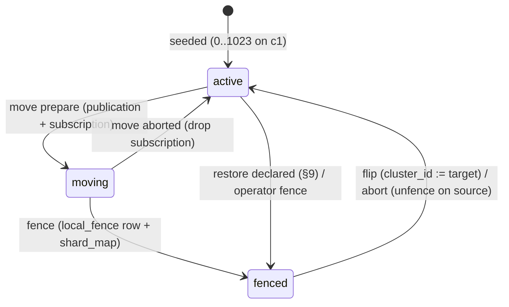

# 13 · Data platform

*Aligned with spine v1.3.*

*Detail design · elaborates spine v1.3 (written against v1.1; reconciled with the v1.2 changes C-01 to C-92 and the v1.3 changes C-201 to C-247) · 2026-10-04 · Status: draft for review*

## Purpose and scope

This document owns the server's persistent data layer: every Postgres table, index and helper function; how logical shards map to physical clusters and how a shard moves; how schema changes reach production; how data is backed up, restored and recovered after region loss; how deletions stay true across restores (the deletion ledger and the DR-region restore journal); the database roles, including the content-free read role and the break-glass role; and the capacity model, the writer scale-up ladder and the SQL behind the weekly triggers dashboard.

It is written so that `03-sync-server`, `08-sharing-and-authz`, `09-reminders-and-push`, `10-media`, `11-search`, `12-identity-and-devices` and `15-security-privacy-compliance` can implement against the DDL here without guessing, and so that an operator can run a shard move, a restore, a writer scale-up or an Aurora major upgrade from the runbooks. §13 lists every interface owned and consumed here, plus the small changes this doc needs from sibling drafts; "Cross-doc issues" lists the requests from sibling docs this doc did not adopt as asked.

**Out of scope** (owner in brackets):

- The exact group-commit SQL, NACK resolution, feed/bootstrap serving, compactor algorithm and fan-out relay loop [03]. This doc owns the tables they touch and the ordering contract they must honour (§3.12, §8.3).
- The `fanout_outbox.payload` JSON schema [03]. This doc owns the table, its columns, the journal object layout and line format, and the entry that a `journal` payload embeds (§8.2).
- `authz` predicates and the invite/claim flow [08]; Better Auth configuration and the account-deletion saga's user-facing steps [12]; media transfer, renditions, the S3 key layout and the CSAM serving gate [10]; search query SQL and ranking [11]; reminder claimer and ledger semantics [09]; Takeout import [03, attachments 10] (C-239).
- Client SQLite schema and migrations [04].
- CDK stacks, networking, the DR prerequisites and pilot light, alarm routing and the dashboard's rendering [14] (C-230). This doc supplies the metrics and queries (§11) and the runbooks that use 14's DR switch (§7.4).
- Threat model, retention policy wording, account enforcement, legal holds and the break-glass procedure [15]. This doc supplies the purge-hook registry (§8.5) that 15 audits, the DDL of 15's tables (§2.5) and the database roles 15's procedure enables (§1.2).
- The test-control plane [16, reviewed by 15] (C-246). It never fakes Postgres `now()` (X-03); it moves stored server-observed timestamps of test accounts through the `api` role in non-production environments only.

## Spine references

| ID | What this doc does with it |
|---|---|
| D-29 | One Aurora PostgreSQL 18.6 cluster; `directory` schema in it; PITR 35 days; parameter group (§1.4); database creation with a classifying ctype (§1.6) |
| D-30 | Shard bits in IDs; `shard_id smallint` leads every sharded key; `shard_map` (§1.3, §3, §5) |
| D-31 | drizzle-kit SQL; shard-aware runner; expand → backfill → contract; `lock_timeout` 2 s (§6) |
| D-33 | `note_updates` plain table at launch; retention through `compact_due`, floor first (C-08); `log_floor_seq` (§3.6, §4) |
| D-45 | Backups, daily cross-region cross-account copies, restore journal in us-west-2 (purges, trash, ACL, blocks, account-deletion and account-lock events), restore runbook (§7–§9); DR prerequisites and pilot light owned by 14 and used by §7.4 (C-230) |
| D-18, D-32, D-34 | `note_log_state` lock row, `compact_due`, `fanout_outbox` physical design (§3) |
| D-24 | `compact_due` carries 03's `REPROJECT` bit; `kspctl reproject` enqueues it (§3.4, §6.6, C-219) |
| D-39 | `blobs`, `blob_refs` (C-221) and media columns (§3.11); staging keys and CRR scope `b/` + `v/` (§7.1, C-222, C-224); the replica purge role (§7.3, C-35) |
| D-46 | One canary pair per physical cluster, added by the shard-move runbook (§5.4, C-247) |
| D-50, P-25 | DDL for 15's `account_enforcement` and `legal_holds` (§2.5, C-237); account-lock journal events (§8.2) |
| T-01, T-02 | Writer scale-up ladder (§11.4, C-28); shard move and directory split runbooks (§5) |
| T-03, T-04, T-05 | Trigger queries (§11); T-05 partition plan (§4) |
| T-11 | Aurora Global headless secondary and failover (§7.5) |
| T-15 | `fanout_outbox` kind `searchDoc` (§3.12, C-225) |
| X-06 | Deletion ledger, journal-first ordering, purge-hook registry with vendor and evidence-store rules (§8, C-240) |
| X-09 | Migration rules, canary order, per-role `statement_timeout` (§1.2, §6) |
| X-11 | Pages only in the four categories: durability, correctness, security, legal deadlines (§11.2, §12.3, failure modes, C-232) |
| X-16 | Content-free `keep_ro`, audited `keep_breakglass` (§1.2); the test-control plane writes through `api` in non-production only (C-246) |
| INV-5, INV-6, INV-13, INV-14 | Lock-row design, counter jump, ledger deny-list, `restore_parked` (§3, §9) |
| X-04 | Shard-tag CHECKs on every shard-tagged column using 01's helpers; no `uuidv7()` defaults (§1.1, §1.3, §6.5) |
| D-35, P-15 | Server search columns and indexes; card-only pending rows enforced by CHECK and kept out of the search index (§3.7) |
| X-01 | No note text, emails or IDs in logs, metric labels or journal bodies beyond IDs and HMACs (§8.2, §12) |
| §4.4 | The table list this doc turns into DDL |
| §5.11 | The restore runbook this doc expands (§9) |
| R-07, R-08 | Write amplification controls, the scale-up ladder before shard moves; the Aurora major-upgrade runbook (§10, §11.4) |

---

## 1. Physical layout and conventions

### 1.1 Schemas

| Schema | Lives on | Contents | Replicated by a shard move? |
|---|---|---|---|
| `directory` | Cluster `c1` until T-02, then its own small cluster | Identity tables (§2.1), sharing index and abuse tables (§2.2), trust, safety and privacy tables (§2.5), `flags`, `clusters`, `shard_map`, `shard_epoch_log`, `restore_events`, `deletion_ledger`, `restore_parked` | No (moved only by T-02) |
| `keep` | Every shard cluster | All sharded tables (§3). One schema for all logical shards; `shard_id` is a column, never a schema (D-30 rejects 512 schemas) | Yes, filtered by `shard_id` |
| `ops` | Every cluster | ID helper functions (01 §5.6), runner bookkeeping, deployed builds, backfill checkpoints, local fence, restricted-column registry, capacity counters (§1.3, §1.5) | No (per cluster) |
| `pgboss` | Every shard cluster; after T-02 also the directory cluster | pg-boss 12.36.0's own schema, created by pg-boss. 08 §8.3 enqueues jobs inside `directory` transactions, so the directory's cluster always has one (`c1` before T-02, `d1` after) | No. Jobs route by `shard_map` at run time (§5.6) |

**Design rules for every table in `keep`:**

1. `shard_id smallint NOT NULL CHECK (shard_id BETWEEN 0 AND 4095)` is the first column of the primary key (D-30).
2. **No foreign keys inside `keep` or across schemas.** Shard moves, lazy source deletes, partition swaps and 90-day husks all make FKs a liability; integrity is checked by the nightly consistency jobs (§5.9 of the spine, §12.3). `directory` keeps FKs among Better Auth tables only.
3. **Enumerations are `text` + `CHECK`**, never PG enum types, so adding a value is an expand-only migration (drop and re-add the CHECK as `NOT VALID`, then `VALIDATE`).
4. Shard-tagged IDs never get a column default; they are minted only by `domain/ids` (X-04). Plain UUIDv7 columns (devices, attachments) also have no default: the application supplies them. Every shard-tagged column is tied to its shard column by a CHECK using 01's `ops.keep_shard_of` (§1.3).
5. Every per-user replicated table has `usn bigint NOT NULL`, a typed tombstone (`deleted boolean` or `removed_reason`), and a **unique** index on `(shard_id, user_id, usn)` (§3.13 explains why unique; one usn per row, C-29). The one exception is `reminder_fires`: a fire becomes a feed row only when acked, so its `usn` is NULL until the ack sets it (D-36 "no usn bump on server advance"; §3.9).
6. Timestamps are `timestamptz` and are set from server `now()` or `statement_timestamp()` (X-03). Postgres `now()` is never faked, not even in tests: time-based tests move stored server-observed timestamps instead (16's test-control plane, C-246). Wire timestamps are integer ms; conversion happens in the application.
7. Binary CRDT data is `bytea`. Cluster-wide `default_toast_compression = lz4`.
8. HLCs use the domain `keep.hlc` (21 chars, `COLLATE "C"`); the format itself is owned by `01-domain-model`.

### 1.2 Roles, pools and timeouts

| Role | Used by | `statement_timeout` | `lock_timeout` | `idle_in_transaction_session_timeout` | Other |
|---|---|---|---|---|---|
| `keep_admin` | The RDS master user. Role management (`ALTER ROLE … LOGIN` for break-glass and restore), `CREATE EXTENSION`, `kspctl db init` (§1.6) | 0 | 2 s | 60 s | Password only in Secrets Manager under the break-glass path (14); never used by services |
| `keep_owner` | Owns all objects; never used by services | — | — | — | `NOLOGIN` |
| `keep_migrator` | Migration runner (§6) | Per migration header (default 15 min) | **2 s** (X-09) | 60 s | Member of `keep_owner` |
| `keep_sync` | `sync` (group commit, `DOC_*` reads) | 2 s | 1 s | 10 s | Values match 03 §12 ("Role timeouts"); 03 may lower per statement with `SET LOCAL`. A writer queued behind a move's exclusive fence gives up after 1 s with `RETRY_LATER` (§5.4) |
| `keep_api` | `api` (bootstrap pages, docs packs, push, oRPC, search); in non-production also the test-control plane (16 §9.1, C-246) | 5 s | 2 s | 10 s | Bootstrap pages are short autocommit statements (D-21); a `/docs` pack transaction may `SET LOCAL statement_timeout = '10s'`; search uses `SET LOCAL statement_timeout = '2s'` (11) |
| `keep_worker` | `worker` (compactor, relay, scanners, pg-boss handlers, purge) | 30 s | 2 s | 30 s | 03 §12 (worker 30 s). Named long jobs (partition drop, restore steps, backfills) `SET LOCAL` up to 15 min. Batch deletes are ≤ 5k rows per statement |
| `keep_ro` | `kspctl` read commands, capacity sampler | 30 s | 1 s | 30 s | `default_transaction_read_only = on`; member of `pg_monitor`; **no access to content or secret columns** (below) |
| `keep_breakglass` | 15's audited break-glass session only (15 §6.9) | 30 s | 1 s | 60 s | `NOLOGIN` except during an approved session; `default_transaction_read_only = on`; `log_statement = 'all'` (bind parameters are still never logged, §1.4); `SELECT` on everything, including restricted columns |
| `keep_repl` | Logical replication (shard moves, T-02) | 0 | — | — | `rds_replication` |
| `keep_restore` | Restore runbook only; disabled (`NOLOGIN`) outside a declared restore | 0 | 2 s | 300 s | Can bypass the fence (§5.4) |

Services set `application_name` to `{service}:{taskId}` so `pg_stat_activity` and the fence wait (§5.4) can attribute sessions. Every service role has `search_path = keep, ops, public`; DDL and CHECK constraints always schema-qualify. The `unfurl` service (M4, D-26) has **no database role and no database credentials** (C-220): it returns fetched metadata to `worker`, which writes `link_previews`.

**No standing operator access to content (X-16, 15 §6.9).** `keep_ro` has no table-level `SELECT`. After every migration the runner calls `ops.refresh_ro_grants()` (§1.5, `SECURITY DEFINER`, owned by `keep_owner`), which grants `keep_ro` column-level `SELECT` on every column of `keep`, `directory` and `ops` **except** those listed in `ops.restricted_columns`: note content and projections (`note_docs.snapshot`, `note_updates.upd`, `notes` and `user_notes` `title`, `preview`, `search_text`, `search_tsv`, `members_public`, `notes.source_url`), user-entered text (`labels.name`, `labels.name_norm`, `attachments.ocr_text`, `blobs.ocr_text`, `link_previews.url`, `title`, `site`), addresses and identity (`user.name`, `email`, `email_norm`, `image`; `note_members.hint`, `note_invite_slots.hint`, `note_invites.hint`, `note_invites.email_enc`, `identity_event.payload`, `session.ip_address`, `user_agent`), and secrets (`session.token`, `prev_token_hash`; `account.access_token`, `refresh_token`, `id_token`, `apple_refresh_token_enc`; `verification.identifier`, `value`; `jwks.private_key`; `devices.push_token`; `abuse_cases.notes_enc`). `kspctl` read commands (cursors, per-note seqs, log sizes, `shard_map`) need none of these. The capacity sampler's one content-adjacent value, the size of the search columns, comes from `ops.capacity_search_bytes()` (§1.5), which returns a number only.

**Break-glass.** `kspctl breakglass start <auditId>` (15 §6.9) verifies the approved `directory.breakglass_audit` row, then, as `keep_admin`, runs `ALTER ROLE keep_breakglass LOGIN VALID UNTIL '<now + 1 h>'` on the clusters in scope and schedules a pg-boss job at the expiry that sets `NOLOGIN` again; `end` sets `NOLOGIN` at once. Whether `VALID UNTIL` also bounds an IAM-authenticated login on Aurora is **UNVERIFIED** (OQ-13-9), so the expiry job and 15's daily open-session alarm are the guarantee, not `VALID UNTIL`.

**Connection budget (day 1, per cluster).** `sync` 2 tasks × 16, `api` 2 × 16, `worker` 2 × 24 (including pg-boss's pool of 8), `kspctl` ≤ 4, replication ≤ 8: about 130 connections, well under the db.r8g.large `max_connections`. An RDS Proxy is not used on day 1; `14-infra-and-operations` adds one if connections exceed 60% of `max_connections`. A writer scale-up (§11.4) only raises `max_connections`.

### 1.3 Helper functions and domains

These are created by the `0001_foundation` migration of **every** track (`CREATE OR REPLACE`), so a directory-only cluster after T-02 has them too. They are `IMMUTABLE` so they can appear in `CHECK` constraints and index expressions. The ID helpers' names, bodies and bit layout are **owned by `01-domain-model` §5.6**; this doc only deploys them, in schema `ops` because `ops` exists on every cluster. Test T13-01 runs 01's golden comparison against the deployed functions.

```sql
CREATE EXTENSION IF NOT EXISTS pg_trgm;
CREATE EXTENSION IF NOT EXISTS btree_gin;
CREATE EXTENSION IF NOT EXISTS unaccent;
CREATE EXTENSION IF NOT EXISTS pg_stat_statements;

CREATE SCHEMA IF NOT EXISTS keep      AUTHORIZATION keep_owner;   -- shard clusters only
CREATE SCHEMA IF NOT EXISTS ops       AUTHORIZATION keep_owner;   -- every cluster
CREATE SCHEMA IF NOT EXISTS directory AUTHORIZATION keep_owner;   -- the directory's cluster only

-- HLC (D-16, INV-15): fixed width, bytewise comparable. Format owned by 01 §6.1.
CREATE DOMAIN keep.hlc AS text COLLATE "C" CHECK (VALUE ~ '^[0-9a-z]{21}$');

-- 01 §5.6, verbatim bodies. Logical shard = the 12-bit rand_a field (spine §4.5):
-- byte 6 = version nibble 0111 + top 4 bits of rand_a; byte 7 = low 8 bits.
CREATE OR REPLACE FUNCTION ops.keep_shard_of(id uuid) RETURNS smallint
LANGUAGE sql IMMUTABLE STRICT PARALLEL SAFE AS
$$ SELECT (((get_byte(uuid_send(id), 6) & 15) << 8) | get_byte(uuid_send(id), 7))::smallint $$;

CREATE OR REPLACE FUNCTION ops.keep_is_v7(id uuid) RETURNS boolean
LANGUAGE sql IMMUTABLE STRICT PARALLEL SAFE AS
$$ SELECT uuid_extract_version(id) = 7 AND (get_byte(uuid_send(id), 8) & 192) = 128 $$;
-- Timestamps come from the built-in uuid_extract_timestamp(id) (PG 17+ understands v7).

-- The restore jump constant (INV-6, §9.4).
CREATE OR REPLACE FUNCTION ops.restore_jump() RETURNS bigint
LANGUAGE sql IMMUTABLE PARALLEL SAFE AS $$ SELECT 4294967296::bigint $$;

-- Shard clusters only. unaccent is STABLE; this wrapper pins the dictionary so it can feed a
-- generated column (D-35).
CREATE OR REPLACE FUNCTION keep.f_unaccent(t text) RETURNS text
LANGUAGE sql IMMUTABLE STRICT PARALLEL SAFE AS $$
  SELECT public.unaccent('public.unaccent'::regdictionary, t)
$$;
```

### 1.4 Cluster parameter group (day 1)

Settings that are expensive to change later are set at cluster creation, even though the features that need them are deferred.

| Parameter | Value | Why |
|---|---|---|
| `rds.logical_replication` | `1` | Static (needs a reboot). Required by T-01, T-02 and Blue/Green upgrades (§10). Set on day 1 so activation is not a maintenance window |
| `max_replication_slots`, `max_wal_senders` | 20, 20 | Parallel subscriptions during a shard move |
| `max_logical_replication_workers`, `max_parallel_apply_workers_per_subscription` | 16, 4 | Shard-move catch-up throughput |
| `shared_preload_libraries` | `pg_stat_statements` | Trigger queries (§11) |
| `pg_stat_statements.track`, `track_io_timing` | `top`, `on` | T-04 and T-06 shares |
| `default_toast_compression` | `lz4` | `bytea` docs and text projections |
| `log_min_duration_statement` | `500ms` | Slow-query log |
| `log_parameter_max_length`, `log_parameter_max_length_on_error` | `0`, `0` | **X-01:** bind parameters can hold note text; never log them |
| `log_statement` | `ddl` | Audit trail of schema changes |
| `autovacuum_naptime`, `autovacuum_max_workers`, `autovacuum_vacuum_cost_limit` | `15s`, `6`, `2000` | Queue tables churn (§3.14) |
| `idle_in_transaction_session_timeout` | `60s` (cluster default; roles override) | No transaction at client pace (D-21) |
| `rds.force_ssl` | `1` | X-16 |
| `timezone` | `UTC` | X-03 |

Aurora-specific availability of `max_parallel_apply_workers_per_subscription` on 18.6 is **UNVERIFIED**; if absent, the shard-move runbook uses more subscriptions instead (§5.4).

### 1.5 `ops` schema (per cluster)

```sql
CREATE TABLE ops.schema_migrations (
  track        text        NOT NULL CHECK (track IN ('directory','keep','ops')),
  version      int         NOT NULL,
  name         text        NOT NULL,
  checksum     bytea       NOT NULL,            -- sha256 of the file body
  phase        text        NOT NULL CHECK (phase IN ('expand','backfill','contract')),
  applied_at   timestamptz NOT NULL DEFAULT now(),
  applied_by   text        NOT NULL,            -- runner build + operator
  duration_ms  int         NOT NULL,
  PRIMARY KEY (track, version)
);

CREATE TABLE ops.backfill_progress (
  migration_id text        NOT NULL,
  shard_id     smallint    NOT NULL,
  last_key     jsonb,                           -- keyset position, e.g. {"note_id": "..."}
  rows_done    bigint      NOT NULL DEFAULT 0,
  state        text        NOT NULL CHECK (state IN ('pending','running','done','failed')),
  updated_at   timestamptz NOT NULL DEFAULT now(),
  PRIMARY KEY (migration_id, shard_id)
);

-- Local, authoritative write fence for shards that do not (or no longer) live here (§5.4).
CREATE TABLE ops.local_fence (
  shard_id   smallint    PRIMARY KEY CHECK (shard_id BETWEEN -1 AND 4095),   -- -1 = the directory schema (§5.7)
  reason     text        NOT NULL CHECK (reason IN ('move','moved_away','restore','rollback')),
  ref_id     uuid        NOT NULL,              -- move_id or restore_id
  fenced_at  timestamptz NOT NULL DEFAULT now()
);

-- Resumable progress for multi-step operations (moves, restores, purges of a moved shard).
CREATE TABLE ops.op_progress (
  op_id      uuid        NOT NULL,
  step       text        NOT NULL,
  shard_id   smallint    NOT NULL DEFAULT -1,
  last_key   jsonb,
  state      text        NOT NULL CHECK (state IN ('pending','running','done','failed')),
  updated_at timestamptz NOT NULL DEFAULT now(),
  PRIMARY KEY (op_id, step, shard_id)
);

-- Previous cumulative counters, so the capacity sampler can emit rates (§11.3).
CREATE TABLE ops.capacity_counters (
  metric     text        PRIMARY KEY,
  value      numeric     NOT NULL,
  sampled_at timestamptz NOT NULL
);

-- Builds that may still run, per environment and service (row contract owned by 14 §7.2; DDL here).
-- Written only by the deploy pipeline through `kspctl deploy record`; read by the migration runner's
-- contract gate (§6.3). Every cluster holds its own copy.
CREATE TABLE ops.deployed_builds (
  env           text        NOT NULL CHECK (env IN ('staging','prod','dr')),
  service       text        NOT NULL CHECK (service IN ('api','sync','worker','unfurl','canary')),   -- 'unfurl': C-220
  build         int         NOT NULL,
  image_digest  text        NOT NULL,
  git_sha       text        NOT NULL,
  state         text        NOT NULL CHECK (state IN ('deploying','live','retired','failed')),
  started_at    timestamptz NOT NULL DEFAULT now(),
  live_at       timestamptz,
  retired_at    timestamptz,
  PRIMARY KEY (env, service, build)
);
-- Runner gate: SELECT min(build) FROM ops.deployed_builds WHERE env = $1 AND state IN ('deploying','live');

-- Columns keep_ro must never read (§1.2, X-16). Seeded and extended by migrations in the same file that
-- adds the column; checked by T13-26.
CREATE TABLE ops.restricted_columns (
  table_schema  text NOT NULL,
  table_name    text NOT NULL,
  column_name   text NOT NULL,
  class         text NOT NULL CHECK (class IN ('content','identity','secret')),
  PRIMARY KEY (table_schema, table_name, column_name)
);
```

```sql
-- Re-grants keep_ro column-level SELECT on every non-restricted column. Called by the runner after each migration.
CREATE FUNCTION ops.refresh_ro_grants() RETURNS void
LANGUAGE plpgsql SECURITY DEFINER SET search_path = pg_catalog AS $$
DECLARE r record;
BEGIN
  FOR r IN SELECT c.table_schema, c.table_name,
                  string_agg(quote_ident(c.column_name), ', ' ORDER BY c.ordinal_position) AS cols
           FROM information_schema.columns c
           JOIN information_schema.tables t USING (table_schema, table_name)
           WHERE c.table_schema IN ('keep','directory','ops') AND t.table_type IN ('BASE TABLE','VIEW')
             AND NOT EXISTS (SELECT 1 FROM ops.restricted_columns x
                             WHERE (x.table_schema, x.table_name, x.column_name)
                                 = (c.table_schema, c.table_name, c.column_name))
           GROUP BY 1, 2 LOOP
    EXECUTE format('REVOKE SELECT ON %I.%I FROM keep_ro', r.table_schema, r.table_name);
    EXECUTE format('GRANT SELECT (%s) ON %I.%I TO keep_ro', r.cols, r.table_schema, r.table_name);
  END LOOP;
END $$;

-- The only content-adjacent number the capacity sampler needs (T-15 search_bytes_share, §11.2). Shard clusters only.
CREATE FUNCTION ops.capacity_search_bytes() RETURNS bigint
LANGUAGE sql STABLE SECURITY DEFINER SET search_path = pg_catalog AS $$
  SELECT (pg_relation_size('keep.user_notes_fts') + pg_relation_size('keep.user_notes_trgm')
          + coalesce((SELECT avg(pg_column_size(search_text)) + avg(pg_column_size(search_tsv))
                      FROM keep.user_notes TABLESAMPLE SYSTEM (0.1)), 0)
            * (SELECT reltuples FROM pg_class WHERE oid = 'keep.user_notes'::regclass))::bigint
$$;
REVOKE ALL ON FUNCTION ops.capacity_search_bytes() FROM PUBLIC;
GRANT EXECUTE ON FUNCTION ops.capacity_search_bytes() TO keep_ro;
```

### 1.6 Database creation and character classification

The shard and directory databases are created by `kspctl db init` as `keep_admin`, never by CDK's default database name, so their locale is explicit and identical on every cluster:

```sql
CREATE DATABASE keep TEMPLATE template0 ENCODING 'UTF8'
  LOCALE_PROVIDER builtin BUILTIN_LOCALE 'C.UTF-8';      -- PG 17+: codepoint order, Unicode character classes
```

- **pg_trgm needs a classifying ctype** (11 CD-13-1). Server substring search (D-35) builds trigrams only from characters the database's character classification calls alphanumeric. Under a ctype that does not classify CJK, Thai or Indic letters, `show_trgm('東京タワー')` returns `{}` and substring search silently finds nothing. `C.UTF-8` of the builtin provider classifies by Unicode properties; whether pg_trgm on Aurora PostgreSQL 18.6 uses that classification is **UNVERIFIED** (OQ-13-8). The fallback, decided in M1 before any production data exists (the ctype cannot change without recreating the database), is `LOCALE_PROVIDER libc LC_COLLATE 'C' LC_CTYPE 'en_US.UTF-8'`.
- **Check, not hope.** Migration CI, `kspctl db init` and the major-upgrade checklist (§10.2) run `SELECT show_trgm('東京タワー') <> '{}' AND show_trgm('ภาษาไทย') <> '{}' AND show_trgm('हिन्दी') <> '{}'`; false fails the step (T13-27).
- **Collation stays out of correctness.** Order-key columns are `COLLATE "C"` (01's base-62 keys compare bytewise), so nothing depends on the database collation, and the builtin provider has no OS collation library whose version could drift across a major upgrade.

---

## 2. Directory schema DDL

The directory is global and low-write (D-29). It stays in cluster `c1` until T-02 (§5.7). Nothing in `keep` references it by foreign key, and nothing in it references `keep`.

### 2.1 Identity tables

`12-identity-and-devices` owns the semantics, the Better Auth configuration (`fields` mapping to snake_case, ID generator from `domain/ids`) and the column requirements in its §15.1; this doc owns the physical DDL and folds those requirements in. Better Auth 1.7.7 core column names are **UNVERIFIED** until M0 runs `@better-auth/cli generate` and diffs it against this DDL (OQ-13-6).

```sql
CREATE TABLE directory."user" (
  id                 uuid        PRIMARY KEY,                     -- shard-tagged (D-30)
  name               text        NOT NULL DEFAULT '',
  email              text        NOT NULL,                        -- husk value 'deleted+<id>@invalid' after erasure (12)
  email_verified     boolean     NOT NULL DEFAULT false,
  image              text,
  email_norm         text,                                        -- 12's normalizeEmail; NULL on the husk. Sharing finds
                                                                  --  accounts by it (no email HMAC column, C-92)
  home_shard         smallint    NOT NULL,
  residency          text        NOT NULL CHECK (residency IN ('us','eu')),   -- fixed at signup
  status             text        NOT NULL DEFAULT 'active'
                     CHECK (status IN ('active','pending_deletion','deleting','deleted')),
  delete_after       timestamptz,                                 -- +14 d grace (P-25)
  deleted_at         timestamptz,
  sharing_enabled    boolean     NOT NULL DEFAULT true,           -- "Enable sharing"; authoritative (08 §5.2; 08 withdrew SI-7)
  email_deliverable  boolean     NOT NULL DEFAULT true,
  created_at         timestamptz NOT NULL DEFAULT now(),
  updated_at         timestamptz NOT NULL DEFAULT now(),
  CONSTRAINT user_home_shard_matches_id CHECK (home_shard = ops.keep_shard_of(id)),
  CONSTRAINT user_residency_matches_shard CHECK ((residency = 'us' AND home_shard BETWEEN 0 AND 511)
                                              OR (residency = 'eu' AND home_shard BETWEEN 512 AND 1023)),
  CONSTRAINT user_pending_has_deadline CHECK (status <> 'pending_deletion' OR delete_after IS NOT NULL)
);
CREATE UNIQUE INDEX user_email_norm_uq       ON directory."user" (email_norm) WHERE email_norm IS NOT NULL;
CREATE INDEX        user_pending_deletion_idx ON directory."user" (delete_after) WHERE status = 'pending_deletion';

CREATE TABLE directory.session (
  id                 uuid        PRIMARY KEY,                     -- the sid (D-41 denylist key)
  token              text        NOT NULL,                        -- sha256 hex of the session token (12)
  user_id            uuid        NOT NULL REFERENCES directory."user"(id) ON DELETE CASCADE,
  expires_at         timestamptz NOT NULL,                        -- sliding 90 d
  ip_address         text,
  user_agent         text,
  device_id          uuid,
  platform           text        CHECK (platform IN ('web','ios','android')),
  app_version        text,
  auth_method        text        NOT NULL CHECK (auth_method IN ('passkey','apple','google','otp')),
  purpose            text        NOT NULL DEFAULT 'app' CHECK (purpose IN ('app','account_delete')),
  rotated_at         timestamptz NOT NULL DEFAULT now(),
  prev_token_hash    text,
  cur_first_used_at  timestamptz,
  created_at         timestamptz NOT NULL DEFAULT now(),
  updated_at         timestamptz NOT NULL DEFAULT now()
);
CREATE UNIQUE INDEX session_token_uq      ON directory.session (token);
CREATE UNIQUE INDEX session_prev_token_uq ON directory.session (prev_token_hash) WHERE prev_token_hash IS NOT NULL;
CREATE INDEX        session_user_idx      ON directory.session (user_id, updated_at);
CREATE INDEX        session_expires_idx   ON directory.session (expires_at);

CREATE TABLE directory.account (
  id                        text        PRIMARY KEY,
  user_id                   uuid        NOT NULL REFERENCES directory."user"(id) ON DELETE CASCADE,
  account_id                text        NOT NULL,                 -- provider subject
  provider_id               text        NOT NULL,
  access_token              text,
  refresh_token             text,
  id_token                  text,
  access_token_expires_at   timestamptz,
  refresh_token_expires_at  timestamptz,
  scope                     text,
  password                  text CHECK (password IS NULL),        -- no passwords (D-41)
  apple_refresh_token_enc   bytea,                                -- KMS ciphertext under the multi-Region app-envelope
                                                                  --  key, so a us-west-2 restore can decrypt it (D-41, C-230)
  apple_client_id           text,
  apple_token_obtained_at   timestamptz,
  apple_token_status        text CHECK (apple_token_status IN ('present','missing','revoked')),
  created_at                timestamptz NOT NULL DEFAULT now(),
  updated_at                timestamptz NOT NULL DEFAULT now(),
  UNIQUE (provider_id, account_id)
);
CREATE INDEX account_user ON directory.account (user_id);

CREATE TABLE directory.verification (
  id text PRIMARY KEY, identifier text NOT NULL, value text NOT NULL, expires_at timestamptz NOT NULL,
  created_at timestamptz NOT NULL DEFAULT now(), updated_at timestamptz NOT NULL DEFAULT now()
);
CREATE INDEX verification_identifier ON directory.verification (identifier);

CREATE TABLE directory.passkey (
  id text PRIMARY KEY, name text, public_key text NOT NULL,
  user_id uuid NOT NULL REFERENCES directory."user"(id) ON DELETE CASCADE,
  credential_id text NOT NULL UNIQUE, counter bigint NOT NULL DEFAULT 0,
  device_type text, backed_up boolean, transports text, aaguid text,
  created_at timestamptz NOT NULL DEFAULT now()
);
CREATE INDEX passkey_user ON directory.passkey (user_id);

CREATE TABLE directory.jwks (
  id text PRIMARY KEY, public_key text NOT NULL,
  private_key text NOT NULL,                                       -- KMS-encrypted by 12 (multi-Region key, C-230)
  created_at timestamptz NOT NULL DEFAULT now()
);
```

`directory.session_revocation` (C-89), `directory.device_token`, `directory.account_deletion`, `directory.data_export`, `directory.apple_notification_seen` and `directory.identity_event` (the outbox of 12's `SharingIdentityHooks`, C-92) are adopted **verbatim** from 12 §15.1 (columns, keys, indexes); their migrations live in the `directory` track like every other table. Physical additions from this doc: `session_revocation` rows are deleted by 12's daily sweep once `session_expires_at < now() − 1 d` (always ≤ 91 d after revocation), `apple_notification_seen` rows after 30 days, `identity_event` rows on delivery, and `account_deletion` rows are kept 400 days after `finished_at` (12), matching the journal. **Every application-level KMS envelope in the directory** (`account.apple_refresh_token_enc`, `jwks.private_key`, `note_invites.email_enc`) uses 14's multi-Region key `alias/keep-<env>-app-envelope`, so a directory restored in us-west-2 can decrypt it (D-45 DR prerequisites, C-230).

The `ops` helper functions of §1.3 exist on every cluster, so the CHECKs above keep working on a directory-only cluster after T-02.

### 2.2 Sharing, suppression and flags

`08-sharing-and-authz` §5.3 specifies the sharing directory tables. The **authoritative** invite record is the owner-shard `note_invite_slots` (§3.5), and `directory.note_invites` is the global index for claims by token and by verified email (by `email_hmac` and `token_hash`), written **only by the relay** from `directoryInvite` outbox rows and applied only if `slot_epoch` is newer (C-72). It is never the source of truth for the 50-person cap or idempotency. Silent slots (P-16, C-74) are never indexed, so `state` here has no `silent` value.

```sql
CREATE TABLE directory.note_invites (
  id            uuid        PRIMARY KEY,                           -- = note_invite_slots.ref (pendingRef)
  note_id       uuid        NOT NULL,
  note_shard    smallint    NOT NULL,
  email_hmac    bytea       NOT NULL,
  hmac_v        smallint    NOT NULL,
  email_enc     bytea,                                             -- KMS envelope (multi-Region key, C-230); NULL once
                                                                   --  terminal or after journal replay
  invited_by    uuid,
  hint          text        NOT NULL,
  state         text        NOT NULL CHECK (state IN ('live','revoked','expired','claimed')),
  slot_epoch    bigint      NOT NULL,                              -- apply guard
  token_hash    bytea,
  token_used_at timestamptz,
  email_state   text        NOT NULL DEFAULT 'pending'
                CHECK (email_state IN ('pending','sending','sent','suppressed','skipped','failed')),
  email_sent_at timestamptz,
  claimed_by    uuid,
  accepted_at   timestamptz,
  revoked_at    timestamptz,
  expires_at    timestamptz NOT NULL,                              -- +30 d (P-15)
  created_at    timestamptz NOT NULL DEFAULT now(),
  UNIQUE (note_id, email_hmac),
  CHECK (note_shard = ops.keep_shard_of(note_id))
);
CREATE INDEX        note_invites_live_email ON directory.note_invites (email_hmac) WHERE state = 'live';
CREATE UNIQUE INDEX note_invites_token      ON directory.note_invites (token_hash) WHERE token_hash IS NOT NULL;
CREATE INDEX        note_invites_terminal   ON directory.note_invites (created_at) WHERE state <> 'live';
CREATE INDEX        note_invites_invited_by ON directory.note_invites (invited_by) WHERE invited_by IS NOT NULL;  -- 08 §10.6

CREATE TABLE directory.email_suppression (
  email_hmac  bytea       PRIMARY KEY,
  hmac_v      smallint    NOT NULL,
  reason      text        NOT NULL CHECK (reason IN ('never_email','deleted_account','hard_bounce','complaint')),
  at          timestamptz NOT NULL DEFAULT now()
);

CREATE TABLE directory.flags (
  key         text        PRIMARY KEY,
  value       jsonb       NOT NULL,
  audience    jsonb       NOT NULL DEFAULT '{"all":true}',          -- 14 owns the audience grammar
  updated_at  timestamptz NOT NULL DEFAULT now()
);
```

Adopted verbatim from 08 §5.3, with the physical notes added here:

| Table | Spec | Physical notes (13) |
|---|---|---|
| `directory.verified_email_index` | 08 §5.3 | Written only by 12's verified-email hook |
| `directory.share_ledger` | 08 §5.3 | Daily sweep of rows older than 30 d (batches of 5k) |
| `directory.share_restrictions` | 08 §5.3 | Written by 15 |
| `directory.abuse_reports`, `directory.abuse_signals` | 08 §5.3, §15 | Retention set by 15 (180 d). `abuse_signals` moves to monthly range partitions on `at` above 10M rows, with the same swap pattern as §4.2 |

### 2.3 Topology: `clusters`, `shard_map`, `restore_events`

```sql
CREATE TABLE directory.clusters (
  cluster_id        text        PRIMARY KEY,                        -- 'c1', 'c2', ...; 'c1r1' for a restore target
  ordinal           smallint    NOT NULL UNIQUE CHECK (ordinal BETWEEN 1 AND 2047),
  region            text        NOT NULL,                           -- 'us-east-1'
  role              text        NOT NULL CHECK (role IN ('shard','directory','shard+directory')),
  writer_secret_arn text        NOT NULL,                           -- Secrets Manager: DSN for the writer endpoint
  reader_secret_arn text,
  pg_major          smallint    NOT NULL,                           -- 18
  canary            boolean     NOT NULL DEFAULT false,             -- migration order (§6.3)
  state             text        NOT NULL CHECK (state IN ('provisioning','active','draining','retired','restoring')),
  outbox_id_base    bigint      NOT NULL,                           -- ordinal << 52 (§3.14)
  created_at        timestamptz NOT NULL DEFAULT now()
);

CREATE SEQUENCE directory.shard_map_version;

CREATE TABLE directory.shard_map (
  logical_shard  smallint    PRIMARY KEY CHECK (logical_shard BETWEEN 0 AND 4095),
  cluster_id     text        NOT NULL REFERENCES directory.clusters(cluster_id),
  state          text        NOT NULL DEFAULT 'active' CHECK (state IN ('active','fenced','moving')),
  epoch          bigint      NOT NULL DEFAULT 1,                    -- shard epoch (§5.11 of the spine)
  epoch_reason   text        CHECK (epoch_reason IN ('restore','full','meta','operator')),
  moving_to      text        REFERENCES directory.clusters(cluster_id),
  move_id        uuid,
  version        bigint      NOT NULL DEFAULT nextval('directory.shard_map_version'),  -- cache invalidation
  updated_at     timestamptz NOT NULL DEFAULT now(),
  CHECK (state <> 'active' OR moving_to IS NULL),
  CHECK (state <> 'moving' OR moving_to IS NOT NULL)          -- 'fenced' may or may not carry moving_to
);
-- Seeded by 0001_foundation: shards 0..1023 → 'c1', state 'active', epoch 1.
-- 1024..4095 are reserved (§4.5 of the spine) and have no rows; routing to them is an error.

CREATE TABLE directory.restore_events (
  restore_id     uuid        PRIMARY KEY,
  kind           text        NOT NULL CHECK (kind IN ('pitr','snapshot','region','global_failover','move_rollback','bg_rollback')),
  restore_point  timestamptz NOT NULL,                              -- R
  source_cluster text        NOT NULL,
  target_cluster text        NOT NULL,
  shards         smallint[]  NOT NULL,                              -- logical shards whose data came from the restore
  directory_restored boolean NOT NULL,
  declared_at    timestamptz NOT NULL DEFAULT now(),
  opened_at      timestamptz,                                       -- traffic admitted (step 6)
  window_ends_at timestamptz,                                       -- opened_at + 30 d (parking, re-create floor)
  completed_at   timestamptz
);
```

```sql
-- Every epoch bump, with its reason, so WELCOME can pick the strongest reason since a client's epoch (03 S-11).
CREATE TABLE directory.shard_epoch_log (
  logical_shard  smallint    NOT NULL,
  epoch          bigint      NOT NULL,
  reason         text        NOT NULL CHECK (reason IN ('restore','full','meta','operator')),
  at             timestamptz NOT NULL DEFAULT now(),
  PRIMARY KEY (logical_shard, epoch)
);
```

`shard_map.version` takes a fresh `nextval` on every update (a trigger `shard_map_bump` sets `version = nextval(...)`, `updated_at = now()`); consumers compare versions, never timestamps.

### 2.4 Deletion ledger and restore parking

```sql
CREATE TABLE directory.deletion_ledger (
  kind         text        NOT NULL CHECK (kind IN ('note','account')),
  id           uuid        NOT NULL,
  shard        smallint    NOT NULL,
  reason       text        NOT NULL CHECK (reason IN
               ('trash_expired','delete_forever','empty_trash','account_deleted','user_request','admin')),   -- LedgerReason (§8.2)
  deleted_at   timestamptz NOT NULL,                                -- server time of the purging transaction
  journal_jid  uuid        NOT NULL,                                -- the journal entry that carried it (§8.2)
  recorded_at  timestamptz NOT NULL DEFAULT now(),
  PRIMARY KEY (kind, id)
);
CREATE INDEX deletion_ledger_age ON directory.deletion_ledger (deleted_at);   -- 400-day expiry

CREATE TABLE directory.restore_parked (
  note_id      uuid        NOT NULL,
  seq          int         NOT NULL,                                -- replay order within the note
  restore_id   uuid        NOT NULL REFERENCES directory.restore_events(restore_id),
  note_shard   smallint    NOT NULL,
  entry        jsonb       NOT NULL,                                -- the JournalEntry (§8.2), IDs and HMACs only
  parked_at    timestamptz NOT NULL DEFAULT now(),
  expires_at   timestamptz NOT NULL,                                -- parked_at + 30 d
  applied_at   timestamptz,
  outcome      text CHECK (outcome IN ('applied','superseded','expired','denied')),
  PRIMARY KEY (note_id, seq)
);
CREATE INDEX restore_parked_expiry ON directory.restore_parked (expires_at) WHERE applied_at IS NULL;
```

`restore_parked` is created by the foundation migration so no DDL runs during an incident; it holds rows only after a restore (§4.4 of the spine).

---

## 3. Shard schema DDL (`keep`)

Every table below lives in every shard cluster and holds rows for the logical shards mapped there. Column semantics come from spine §4.4; additions are marked *ours* and listed in "Spine issues" where they change a contract.

### 3.1 `users_sync`

```sql
CREATE TABLE keep.users_sync (
  shard_id             smallint    NOT NULL CHECK (shard_id BETWEEN 0 AND 4095),
  user_id              uuid        NOT NULL,
  usn                  bigint      NOT NULL DEFAULT 0,      -- per-user feed counter (INV-6), row-locked
  user_epoch           int         NOT NULL DEFAULT 1,
  tombstone_floor_usn  bigint      NOT NULL DEFAULT 0,      -- tombstones below this were GC'd (90 d)
  home_tz              text        NOT NULL,                -- IANA zone (P-08)
  primary_device_id    uuid,
  alert_all_devices    boolean     NOT NULL DEFAULT false,
  storage_bytes        bigint      NOT NULL DEFAULT 0,      -- quota (P-14)
  ingress_bytes_day    bigint      NOT NULL DEFAULT 0,      -- §5.12 of the spine
  ingress_day          date,                                -- ours: UTC day ingress_bytes_day refers to
  PRIMARY KEY (shard_id, user_id),
  CHECK (shard_id = ops.keep_shard_of(user_id))
) WITH (fillfactor = 70);
```

PK only, fillfactor 70: the `usn` bump on every per-user write is a HOT update, like `note_log_state`.

### 3.2 `notes`

```sql
CREATE TABLE keep.notes (
  shard_id          smallint    NOT NULL CHECK (shard_id BETWEEN 0 AND 4095),
  id                uuid        NOT NULL,
  owner_id          uuid        NOT NULL,
  kind              text        NOT NULL CHECK (kind IN ('text','list')),
  class             text        NOT NULL DEFAULT 'standard' CHECK (class IN ('standard','locked')),
  projected_seq     bigint      NOT NULL DEFAULT 0,
  doc_schema        smallint    NOT NULL DEFAULT 1,       -- derived from content (§5.9 of the spine)
  crdt_format       smallint    NOT NULL DEFAULT 1,       -- 1 = Yjs 13 update v1 (D-13)
  doc_epoch         int         NOT NULL DEFAULT 0,       -- reserved (D-13)
  doc_bytes         int         NOT NULL DEFAULT 0,
  over_limit        int         NOT NULL DEFAULT 0,       -- P-12; bitmask of 01 §15.6 (0 = within limits)
  member_epoch      bigint      NOT NULL DEFAULT 0,       -- monotonic under the lock row (§8.2); +2^32 on restore
  member_count      smallint    NOT NULL DEFAULT 0,       -- non-owner members + live invite slots (08 §5.1, SI-11)
  trash_state       boolean     NOT NULL DEFAULT false,
  trash_hlc         keep.hlc,
  trashed_at        timestamptz,
  purge_after       timestamptz,
  purged_at         timestamptz,
  created_at        timestamptz NOT NULL,                 -- from the ID timestamp, or the import
  content_edited_at timestamptz,                          -- copied from note_log_state at compaction
  title             text,
  preview           jsonb,
  search_text       text,
  facets            int         NOT NULL DEFAULT 0,
  members_public    jsonb,
  source_url        text,
  flags             int         NOT NULL DEFAULT 0,
  PRIMARY KEY (shard_id, id),
  CHECK (ops.keep_is_v7(id) AND shard_id = ops.keep_shard_of(id)),   -- 01 §5.6
  CHECK (ops.keep_shard_of(owner_id) = shard_id),         -- a note takes its owner's shard forever (D-30)
  CHECK (member_count BETWEEN 0 AND 50),                  -- P-04, 08 SI-11
  CHECK (NOT trash_state OR (trashed_at IS NOT NULL AND purge_after IS NOT NULL AND trash_hlc IS NOT NULL)),
  CHECK (purged_at IS NULL OR (title IS NULL AND preview IS NULL AND search_text IS NULL AND source_url IS NULL
                               AND (members_public IS NULL OR members_public = '[]'::jsonb)))  -- husk holds no content
) WITH (fillfactor = 90);

CREATE INDEX notes_purge_due ON keep.notes (purge_after) WHERE trash_state AND purged_at IS NULL;   -- spine §4.4
CREATE INDEX notes_husk_gc   ON keep.notes (purged_at)   WHERE purged_at IS NOT NULL;               -- 90-day husk GC
CREATE INDEX notes_owner     ON keep.notes (shard_id, owner_id);                                    -- export, account purge
CREATE INDEX notes_shared    ON keep.notes (shard_id, id) WHERE member_count > 0 AND purged_at IS NULL; -- restore re-fan-out, reconciler
```

`created_at` is `uuid_extract_timestamp(id)` for client-minted and imported notes alike (01 §5.3, §5.6); the application writes it, there is no default. 03's FullProjection carries `overLimit` as a boolean; the stored value is 01's bitmask, and `over_limit <> 0` is the boolean.

`notes` is never written on the append path (D-18). It is written at compaction and by note-scoped ops.

**Purge husk.** A purge sets `purged_at`, clears every content column in the same statement (the last CHECK enforces it; 03 §5.7.4 step 1 must also null `source_url`), and keeps the row for 90 days so a late `note.create` or append resolves to `NOTE_PURGED` without a directory read. The `husk.gc` job (§8.5) deletes the husk together with its `note_log_state`, `note_members`, `note_invite_slots` and `compact_due` rows after 90 days; from then on the ledger is the deny-list (§8.1).

### 3.3 `note_log_state` (the lock row)

```sql
CREATE TABLE keep.note_log_state (
  shard_id            smallint    NOT NULL CHECK (shard_id BETWEEN 0 AND 4095),
  note_id             uuid        NOT NULL,
  content_seq         bigint      NOT NULL DEFAULT 0,     -- last assigned seq (gap-free except the restore jump)
  snapshot_seq        bigint      NOT NULL DEFAULT 0,     -- note_docs covers every update ≤ this
  log_floor_seq       bigint      NOT NULL DEFAULT 0,     -- rows ≤ this may be absent from the log
  last_append_at      timestamptz,
  content_edited_at   timestamptz,
  session_started_at  timestamptz,                        -- start of the current edit session (§5.5 of the spine)
  PRIMARY KEY (shard_id, note_id),
  CHECK (snapshot_seq <= content_seq AND log_floor_seq <= content_seq)
) WITH (fillfactor = 70,
        autovacuum_vacuum_scale_factor = 0.02,
        autovacuum_vacuum_threshold = 1000,
        autovacuum_analyze_scale_factor = 0.05);
```

Rules this table depends on (D-18, INV-5, INV-6):

| Rule | Why |
|---|---|
| **No secondary index, ever.** A migration adding one to this table fails CI (§6.5). | Every append bump must be a HOT update. HOT requires that no indexed column changes and that the page has free space; fillfactor 70 leaves it. |
| Inserted in the same transaction as the `notes` row by `note.create`, and by the import path. | The group commit's statement 1 locks it; a missing row means `NOTE_UNKNOWN` (03 resolves). |
| Locked `FOR UPDATE` first, in sorted `(shard_id, note_id)` order, by the group commit, every membership change, every purge and the compactor's seq update. | INV-5 lock discipline. |
| `log_floor_seq` may exceed `snapshot_seq` only after a restore jump (§9.4). | Seq-based reads below the floor fall back to state-vector diffs. |

**HOT verification** (M0 spike 4, then a capacity metric, §11): `n_tup_hot_upd::float / nullif(n_tup_upd, 0)` from `pg_stat_user_tables` for `note_log_state` must stay ≥ 0.95. Below 0.90 for a day opens a ticket: either fillfactor is too high for the page churn or someone added an index.

### 3.4 `compact_due`

```sql
CREATE TABLE keep.compact_due (
  shard_id     smallint    NOT NULL CHECK (shard_id BETWEEN 0 AND 4095),
  note_id      uuid        NOT NULL,
  due_at       timestamptz NOT NULL,
  reasons      int         NOT NULL CHECK (reasons > 0),
  attempts     smallint    NOT NULL DEFAULT 0,
  last_error   text,                                     -- an error code only (X-01)
  enqueued_at  timestamptz NOT NULL DEFAULT now(),
  PRIMARY KEY (shard_id, note_id)
) WITH (fillfactor = 80,
        autovacuum_vacuum_scale_factor = 0.0,
        autovacuum_vacuum_threshold = 2000);
CREATE INDEX compact_due_due ON keep.compact_due (due_at);
```

The `reasons` bitmask is **owned by 03** (§7.1 there: `COMPACT` 1, `RETENTION` 2, `ITEM_GC` 4, `CONV_CLEANUP` 8, `CONV_DEDUPE` 16, `MIGRATION` 32, `VERSION` 64, `QUARANTINE` 32768); this table stores it as `int`. This doc needs no bit of its own: the T-05 drop guard (§4.3) and the restore runbook (§9.4) enqueue `COMPACT` with `due_at = now()`, and post-restore member fan-out is emitted directly (§9.6). Scanners claim only rows of shards their cluster owns (`shard_id = ANY(router.ownedShards(cluster))`, §5.2), so rows of a shard that moved away are never processed on the old cluster.

### 3.5 Membership, invite slots and docs

Shapes from 08 §5.1 (additions to the spine's columns: `state_hlc`, `added_epoch`, `share_ref`, `hint`, the `note_invite_slots` table).

```sql
CREATE TABLE keep.note_members (
  shard_id     smallint    NOT NULL CHECK (shard_id BETWEEN 0 AND 4095),   -- the note's shard
  note_id      uuid        NOT NULL,
  user_id      uuid        NOT NULL,
  user_shard   smallint    NOT NULL,
  role         text        NOT NULL CHECK (role IN ('owner','writer')),
  state        text        NOT NULL CHECK (state IN ('active','pending_accept')),
  added_by     uuid,                                     -- NULL for the owner row and after the sharer's purge
  added_hlc    keep.hlc    NOT NULL,                     -- guards remove/leave
  state_hlc    keep.hlc    NOT NULL,                     -- guards share.respond
  added_at     timestamptz NOT NULL DEFAULT now(),
  added_epoch  bigint      NOT NULL,                     -- notes.member_epoch at insert
  share_ref    uuid,                                     -- pendingRef
  hint         text,                                     -- masked email for the pending chip
  PRIMARY KEY (shard_id, note_id, user_id),
  CHECK (user_shard = ops.keep_shard_of(user_id)),        -- 01 §5.6
  CHECK (role <> 'owner' OR state = 'active')
);
CREATE UNIQUE INDEX note_members_one_owner   ON keep.note_members (shard_id, note_id) WHERE role = 'owner';
CREATE UNIQUE INDEX note_members_ref         ON keep.note_members (shard_id, note_id, share_ref) WHERE share_ref IS NOT NULL;
CREATE INDEX        note_members_pending_age ON keep.note_members (added_at) WHERE state = 'pending_accept';
CREATE INDEX        note_members_by_user     ON keep.note_members (user_id);   -- account purge, departure transfer (D-39)

CREATE TABLE keep.note_invite_slots (                    -- authoritative email invites (08 SI-1)
  shard_id     smallint    NOT NULL CHECK (shard_id BETWEEN 0 AND 4095),
  note_id      uuid        NOT NULL,
  email_hmac   bytea       NOT NULL,
  hmac_v       smallint    NOT NULL,
  ref          uuid        NOT NULL,                     -- = directory.note_invites.id
  state        text        NOT NULL CHECK (state IN ('live','revoked','expired','claimed')),
  invited_by   uuid,
  invited_hlc  keep.hlc    NOT NULL,
  hint         text        NOT NULL,
  created_at   timestamptz NOT NULL DEFAULT now(),
  expires_at   timestamptz NOT NULL,
  slot_epoch   bigint      NOT NULL,
  claimed_by   uuid,
  PRIMARY KEY (shard_id, note_id, email_hmac)
);
CREATE UNIQUE INDEX note_invite_slots_ref    ON keep.note_invite_slots (shard_id, note_id, ref);
CREATE INDEX        note_invite_slots_expiry ON keep.note_invite_slots (expires_at) WHERE state = 'live';

CREATE TABLE keep.note_docs (
  shard_id         smallint    NOT NULL CHECK (shard_id BETWEEN 0 AND 4095),
  note_id          uuid        NOT NULL,
  snapshot         bytea       NOT NULL,                 -- Yjs update v1 encoding of the full state
  state_vector     bytea       NOT NULL,
  snapshot_seq     bigint      NOT NULL,                 -- mirrors note_log_state.snapshot_seq at write
  crdt_format      smallint    NOT NULL DEFAULT 1,
  byte_size        int         NOT NULL,
  compacted_at     timestamptz NOT NULL DEFAULT now(),
  gc_meta          jsonb       NOT NULL DEFAULT '{}',    -- compactor-private first-seen times: 01's GcSeen (01 SI-3
                                                         --  calls the column gc_seen; 03 S-05's name gc_meta is used)
  last_version_at  timestamptz,                          -- last S3 version snapshot (03 §7.6)
  PRIMARY KEY (shard_id, note_id)
);
```

**Lock-row safety triggers (03 §5.1 rule R2).** Every transaction that changes `note_members` or sets `notes.purged_at` must already hold the note's `note_log_state` lock (INV-5). As a safety net, a forgetful caller is made to take it:

```sql
CREATE FUNCTION keep.lock_note_row() RETURNS trigger LANGUAGE plpgsql AS $$
DECLARE r record := CASE TG_OP WHEN 'DELETE' THEN OLD ELSE NEW END;
BEGIN
  IF TG_TABLE_NAME = 'notes' THEN
    PERFORM 1 FROM keep.note_log_state WHERE (shard_id, note_id) = (r.shard_id, r.id) FOR UPDATE;
  ELSE
    PERFORM 1 FROM keep.note_log_state WHERE (shard_id, note_id) = (r.shard_id, r.note_id) FOR UPDATE;
  END IF;
  RETURN r;
END $$;

CREATE TRIGGER note_members_lock BEFORE INSERT OR UPDATE OR DELETE ON keep.note_members
  FOR EACH ROW EXECUTE FUNCTION keep.lock_note_row();
CREATE TRIGGER notes_purge_lock BEFORE UPDATE OF purged_at ON keep.notes
  FOR EACH ROW WHEN (OLD.purged_at IS DISTINCT FROM NEW.purged_at) EXECUTE FUNCTION keep.lock_note_row();
```

A correct caller already holds the row lock, so the trigger's `FOR UPDATE` is a no-op re-acquisition. The trigger does not fire during logical-replication apply (shard moves) or for the restore tooling's bulk counter jump (which does not touch `note_members` or `purged_at`).

The append-path membership check probes `note_members` by its primary key `(shard_id, note_id, user_id)`: one index lookup inside statement 2 (INV-5).

### 3.6 `note_updates` and the read view

```sql
CREATE TABLE keep.note_updates (
  shard_id    smallint    NOT NULL CHECK (shard_id BETWEEN 0 AND 4095),
  note_id     uuid        NOT NULL,
  seq         bigint      NOT NULL,
  upd         bytea       NOT NULL,
  author_id   uuid,                                       -- nulled by the attribution purge hook (§8.5)
  device_id   uuid,
  ccid        uuid,
  created_at  timestamptz NOT NULL,
  PRIMARY KEY (shard_id, note_id, seq)
) WITH (fillfactor = 100,
        autovacuum_vacuum_scale_factor = 0.01,
        autovacuum_vacuum_insert_scale_factor = 0.05,
        autovacuum_vacuum_cost_limit = 4000);

-- Every reader of the log selects from this view, never from the table (§4.2).
CREATE VIEW keep.note_updates_r AS
  SELECT shard_id, note_id, seq, upd, author_id, device_id, ccid, created_at FROM keep.note_updates;
```

- Plain table until T-05 (D-33). Only the primary key; appends are always at the right edge of each note's key range.
- **Writers** (group commit, import) insert into `keep.note_updates`. **Readers** (compactor load, `DOC_FETCH` raw tails, inline tails, hydration packs) select from `keep.note_updates_r`. On day 1 the view is a pass-through; during the T-05 swap it becomes a `UNION ALL` of the legacy table and the partitioned one, without a code change (§4.2).
- **Retention** (D-33, 03 §7.5): for rows with `seq ≤ snapshot_seq` and `created_at < now() − 7 d`, the compactor first raises and commits `log_floor_seq` under the lock row, then deletes `WHERE (shard_id, note_id) = ($1, $2) AND seq <= $newFloor` in batches of 5,000. Floor first, so a reader that sees the old floor also sees all its rows (03 S-06). Retention never deletes a row with `seq > snapshot_seq`.
- **`created_at`**: 03 §5.3 sets it to `now()`, the transaction start, which precedes the lock wait. It is therefore only approximately monotonic in `seq` per note. Nothing relies on monotonicity: retention compares it with a 7-day horizon, and the T-05 drop guard (§4.3) is seq-based.

### 3.7 `user_notes`

```sql
CREATE TABLE keep.user_notes (
  shard_id           smallint    NOT NULL CHECK (shard_id BETWEEN 0 AND 4095),   -- the member's shard
  user_id            uuid        NOT NULL,
  note_id            uuid        NOT NULL,
  note_shard         smallint    NOT NULL,
  role               text        NOT NULL CHECK (role IN ('owner','writer')),
  invite_state       text        NOT NULL DEFAULT 'accepted' CHECK (invite_state IN ('accepted','pending')),
  shared_by_unknown  boolean     NOT NULL DEFAULT false,
  shared_by          uuid,                                 -- sharer shown on a pending card (P-15, 08)
  shared_at          timestamptz,                          -- share time (08)
  -- projection copy (server-written)
  kind               text        CHECK (kind IN ('text','list')),
  title              text,
  preview            jsonb,                                -- full PreviewV1 (01), or {card: CardProjection} while pending (08 §4.9)
  facets             int         NOT NULL DEFAULT 0,
  over_limit         int         NOT NULL DEFAULT 0,      -- 01 §15.6 bitmask, copied with the projection
  members_public     jsonb,
  content_seq        bigint,
  prev_content_seq   bigint,
  projected_seq      bigint,
  doc_schema         smallint,
  created_at         timestamptz,
  content_edited_at  timestamptz,
  trashed_at         timestamptz,
  trash_hlc          keep.hlc,
  -- overlay (client-written, per-field HLC LWW, D-16)
  color              text        NOT NULL DEFAULT 'default',
  background         text        NOT NULL DEFAULT 'none',
  pinned             boolean     NOT NULL DEFAULT false,
  archived           boolean     NOT NULL DEFAULT false,
  sort_key           text        COLLATE "C" NOT NULL,
  field_hlc          jsonb       NOT NULL DEFAULT '{}',
  member_epoch       bigint      NOT NULL DEFAULT 0,
  usn                bigint      NOT NULL,
  removed_reason     text        CHECK (removed_reason IN
                     ('revoked','left','purged','account_deleted','declined','restore_lost')),
  removed_at         timestamptz,
  restore_wait_until timestamptz,                          -- ours: "Waiting for the owner's device" (§9.6)
  -- search (D-35); search_tsv is generated, so writers only maintain title/search_text.
  -- NULL for pending rows: a card title is never search-indexed before accept (P-15).
  search_text        text,
  search_tsv         tsvector GENERATED ALWAYS AS (
                       CASE WHEN invite_state = 'accepted' THEN
                         setweight(to_tsvector('simple', keep.f_unaccent(coalesce(title, ''))), 'A') ||
                         setweight(to_tsvector('simple', keep.f_unaccent(coalesce(search_text, ''))), 'B')
                       END
                     ) STORED,
  PRIMARY KEY (shard_id, user_id, note_id),
  CHECK (shard_id = ops.keep_shard_of(user_id)),
  CHECK (note_shard = ops.keep_shard_of(note_id)),
  CHECK ((removed_reason IS NULL) = (removed_at IS NULL)),
  -- P-15 card-only pending rows, enforced by the database as well as by the relay, the feed serializer
  -- and 08's redactUserNoteRow. projected_seq is allowed: it is the server-side guard for card
  -- projections (03 §8.4) and is never serialized for a pending row (08 PENDING_ROW_FIELDS).
  CHECK (invite_state = 'accepted'
         OR (search_text IS NULL AND content_seq IS NULL AND prev_content_seq IS NULL)),
  -- a tombstone carries no projection (§5.7 of the spine); 03's tombstone apply writes members_public = '[]'
  CHECK (removed_at IS NULL OR (title IS NULL AND preview IS NULL AND search_text IS NULL
                                AND (members_public IS NULL OR members_public = '[]'::jsonb)))
) WITH (fillfactor = 85);

CREATE UNIQUE INDEX user_notes_usn ON keep.user_notes (shard_id, user_id, usn);
-- Grid and bootstrap 'pinned'/'active' sections (spine §4.4, 03 §6.2): active, not trashed, not archived.
CREATE INDEX user_notes_grid ON keep.user_notes (shard_id, user_id, pinned DESC, sort_key, note_id)
  WHERE removed_at IS NULL AND trashed_at IS NULL AND NOT archived AND invite_state = 'accepted';
-- Bootstrap keyset sections (D-21, 03 §6.2): archived, trash, pending cards.
CREATE INDEX user_notes_archived ON keep.user_notes (shard_id, user_id, sort_key, note_id)
  WHERE removed_at IS NULL AND trashed_at IS NULL AND archived;
CREATE INDEX user_notes_trash ON keep.user_notes (shard_id, user_id, sort_key, note_id)
  WHERE removed_at IS NULL AND trashed_at IS NOT NULL;
CREATE INDEX user_notes_pending ON keep.user_notes (shard_id, user_id, sort_key, note_id)
  WHERE removed_at IS NULL AND invite_state = 'pending';
CREATE INDEX user_notes_pending_by ON keep.user_notes (shard_id, user_id, shared_by)
  WHERE invite_state = 'pending' AND removed_at IS NULL;                        -- 08: block-all, People filter
-- Reconciler, restore member reconciliation, relay lookups by note.
CREATE INDEX user_notes_by_note ON keep.user_notes (note_shard, note_id) WHERE removed_at IS NULL;
-- Tombstone GC after 90 days.
CREATE INDEX user_notes_tombstones ON keep.user_notes (removed_at) WHERE removed_at IS NOT NULL;
-- Server search (D-35); 11 owns the queries.
CREATE INDEX user_notes_fts  ON keep.user_notes USING gin (user_id, search_tsv)
  WHERE removed_at IS NULL AND invite_state = 'accepted';
CREATE INDEX user_notes_trgm ON keep.user_notes USING gin (user_id, search_text gin_trgm_ops)
  WHERE removed_at IS NULL AND invite_state = 'accepted';
```

Notes on `user_notes`:

- The spine lists a GIN trigram index "on `search_text`". It is built multicolumn with `user_id` first (btree_gin) so a substring query is restricted to one user's rows instead of matching across the whole shard.
- The trash section index covers collaborators' rows too: 03 §6.2 streams every trashed membership so a collaborator's new device holds the note and an owner's restore is instant; the client shows Trash only for owned notes (§5.7 of the spine).
- `restore_wait_until` is set only by restore reconciliation (§9.6). 03's `/sync/verify` reads it to answer `waiting_owner`; exposing it in the feed row is an additive option for 02. Clients do not depend on it: 04 already shows "Waiting for the owner's device to reconnect" after repeated `NOTE_UNKNOWN`.

### 3.8 Labels and settings

```sql
CREATE TABLE keep.labels (
  shard_id     smallint    NOT NULL CHECK (shard_id BETWEEN 0 AND 4095),
  user_id      uuid        NOT NULL,
  label_id     uuid        NOT NULL,                       -- UUIDv5 from the name (§4.5 of the spine)
  name         text        NOT NULL,
  name_norm    text        NOT NULL,                       -- NFC + casefold
  merged_into  uuid,
  field_hlc    jsonb       NOT NULL DEFAULT '{}',
  usn          bigint      NOT NULL,
  deleted      boolean     NOT NULL DEFAULT false,
  PRIMARY KEY (shard_id, user_id, label_id),
  CHECK (shard_id = ops.keep_shard_of(user_id))
);
CREATE UNIQUE INDEX labels_usn  ON keep.labels (shard_id, user_id, usn);
CREATE UNIQUE INDEX labels_name ON keep.labels (shard_id, user_id, name_norm) WHERE NOT deleted AND merged_into IS NULL;

CREATE TABLE keep.note_labels (
  shard_id   smallint    NOT NULL CHECK (shard_id BETWEEN 0 AND 4095),
  user_id    uuid        NOT NULL,
  note_id    uuid        NOT NULL,
  label_id   uuid        NOT NULL,
  present    boolean     NOT NULL,
  hlc        keep.hlc    NOT NULL,
  usn        bigint      NOT NULL,
  PRIMARY KEY (shard_id, user_id, note_id, label_id)
);
CREATE UNIQUE INDEX note_labels_usn   ON keep.note_labels (shard_id, user_id, usn);
CREATE INDEX        note_labels_label ON keep.note_labels (shard_id, user_id, label_id) WHERE present;  -- label delete / merge

CREATE TABLE keep.user_settings (
  shard_id  smallint    NOT NULL CHECK (shard_id BETWEEN 0 AND 4095),
  user_id   uuid        NOT NULL,
  key       text        NOT NULL,
  value     jsonb       NOT NULL,
  hlc       keep.hlc    NOT NULL,
  usn       bigint      NOT NULL,
  PRIMARY KEY (shard_id, user_id, key)
);
CREATE UNIQUE INDEX user_settings_usn ON keep.user_settings (shard_id, user_id, usn);
```

### 3.9 Reminders

`09-reminders-and-push` owns the semantics; the indexes below serve its claimer, reconciler and follow-up scans.

```sql
CREATE TABLE keep.reminders (
  shard_id      smallint    NOT NULL CHECK (shard_id BETWEEN 0 AND 4095),
  user_id       uuid        NOT NULL,
  note_id       uuid        NOT NULL,
  local_start   timestamp   NOT NULL,                      -- wall time (X-03)
  tz_mode       text        NOT NULL CHECK (tz_mode IN ('home','fixed')),
  tz            text,
  rrule         text,
  snooze_of     timestamp,                                 -- wall time of the snoozed series occurrence (01 SI-12)
  snooze_until  timestamptz,
  snooze_n      smallint    NOT NULL DEFAULT 0,
  done_through  text,                                      -- occurrence key
  next_fire_at  timestamptz,                               -- derived UTC
  trigger_kind  text        NOT NULL DEFAULT 'time' CHECK (trigger_kind IN ('time','location')),
  version       int         NOT NULL DEFAULT 1,
  field_hlc     jsonb       NOT NULL DEFAULT '{}',
  usn           bigint      NOT NULL,
  deleted       boolean     NOT NULL DEFAULT false,
  PRIMARY KEY (shard_id, user_id, note_id),
  CHECK (tz_mode <> 'fixed' OR tz IS NOT NULL)
);
CREATE UNIQUE INDEX reminders_usn ON keep.reminders (shard_id, user_id, usn);
CREATE INDEX reminders_due ON keep.reminders (next_fire_at) WHERE NOT deleted AND next_fire_at IS NOT NULL;   -- spine §4.4

CREATE TABLE keep.reminder_fires (
  shard_id         smallint    NOT NULL CHECK (shard_id BETWEEN 0 AND 4095),
  user_id          uuid        NOT NULL,
  note_id          uuid        NOT NULL,
  occ              text        NOT NULL,
  due_at           timestamptz NOT NULL,
  claimed_at       timestamptz NOT NULL DEFAULT now(),
  push_targets     jsonb,
  sent_at          timestamptz,
  fired_receipts   jsonb,
  failopen_at      timestamptz,
  acked_at         timestamptz,
  ack_kind         text,
  followup_due_at  timestamptz,
  usn              bigint      NOT NULL,
  PRIMARY KEY (shard_id, user_id, note_id, occ)
);
CREATE UNIQUE INDEX reminder_fires_usn      ON keep.reminder_fires (shard_id, user_id, usn);
CREATE INDEX        reminder_fires_unsent   ON keep.reminder_fires (due_at) WHERE sent_at IS NULL;
CREATE INDEX        reminder_fires_open     ON keep.reminder_fires (due_at) WHERE acked_at IS NULL AND failopen_at IS NULL;
CREATE INDEX        reminder_fires_followup ON keep.reminder_fires (followup_due_at) WHERE followup_due_at IS NOT NULL AND acked_at IS NULL;
CREATE INDEX        reminder_fires_age      ON keep.reminder_fires (due_at);   -- retention (09 sets the window)

CREATE TABLE keep.reminder_device_coverage (
  shard_id       smallint    NOT NULL CHECK (shard_id BETWEEN 0 AND 4095),
  user_id        uuid        NOT NULL,
  device_id      uuid        NOT NULL,
  note_id        uuid        NOT NULL,
  version        int         NOT NULL,
  covered_until  timestamptz NOT NULL,
  exact          boolean     NOT NULL,
  audible        boolean     NOT NULL,
  reported_at    timestamptz NOT NULL DEFAULT now(),
  PRIMARY KEY (shard_id, user_id, device_id, note_id)
);
CREATE INDEX coverage_by_note ON keep.reminder_device_coverage (shard_id, user_id, note_id);
```

### 3.10 Devices, contacts, blocks

`devices` includes 12 §15.2's additions; `user_contacts` and `user_blocks` follow 08 §5.2.

```sql
CREATE TABLE keep.devices (
  shard_id                 smallint    NOT NULL CHECK (shard_id BETWEEN 0 AND 4095),
  user_id                  uuid        NOT NULL,
  device_id                uuid        NOT NULL,
  registration_id          uuid        NOT NULL,           -- new per registration (D-42, 12)
  registered_at            timestamptz NOT NULL,
  install_nonce_hash       bytea       NOT NULL,
  prev_install_nonce_hash  bytea,
  continuity_hash          bytea,
  prev_continuity_hash     bytea,
  prev_registered_at       timestamptz,
  session_id               uuid,
  platform                 text        NOT NULL CHECK (platform IN ('ios','android','web')),
  app_version              text        NOT NULL,
  proto                    smallint    NOT NULL,
  doc_schema_max           smallint    NOT NULL,
  caps                     text[]      NOT NULL DEFAULT '{}',
  push_kind                text        CHECK (push_kind IN ('apns','fcm','webpush')),
  push_token               text,                           -- never synced
  tz                       text,
  last_foreground_at       timestamptz,
  last_seen_at             timestamptz NOT NULL DEFAULT now(),   -- coverage lease (D-36)
  notif_permission         text,
  exact_alarm              boolean,
  retired_at               timestamptz,
  retired_reason           text CHECK (retired_reason IN
                           ('signed_out','session_revoked','superseded','forked','account_deletion','gc')),
  fork_detected_at         timestamptz,
  revoked_at               timestamptz,
  usn                      bigint      NOT NULL,
  PRIMARY KEY (shard_id, user_id, device_id)
);
CREATE UNIQUE INDEX devices_usn   ON keep.devices (shard_id, user_id, usn);
CREATE INDEX        devices_token ON keep.devices (push_token) WHERE push_token IS NOT NULL AND retired_at IS NULL;
CREATE INDEX        devices_seen  ON keep.devices (last_seen_at);                 -- MAU sample (§11.2), lease scans

CREATE TABLE keep.user_contacts (
  shard_id        smallint    NOT NULL CHECK (shard_id BETWEEN 0 AND 4095),
  user_id         uuid        NOT NULL,                   -- the truster
  other_id        uuid        NOT NULL,                   -- the trusted
  since           timestamptz NOT NULL DEFAULT now(),
  last_shared_at  timestamptz NOT NULL DEFAULT now(),
  PRIMARY KEY (shard_id, user_id, other_id)
);
CREATE INDEX user_contacts_recent ON keep.user_contacts (shard_id, user_id, last_shared_at DESC);
CREATE INDEX user_contacts_other  ON keep.user_contacts (other_id);               -- account-purge cleanup

CREATE TABLE keep.user_blocks (
  shard_id  smallint    NOT NULL CHECK (shard_id BETWEEN 0 AND 4095),
  user_id   uuid        NOT NULL,
  other_id  uuid        NOT NULL,
  since     timestamptz NOT NULL DEFAULT now(),
  PRIMARY KEY (shard_id, user_id, other_id)
);
CREATE INDEX user_blocks_other ON keep.user_blocks (other_id);
```

`devices.last_seen_at` is written on every check-in. It is indexed (MAU sample and lease scans), so those updates are not HOT; the write rate is bounded by check-ins (a few per device per hour). If `devices` bloat shows on the dashboard, 09 moves the lease timestamp to a narrow `device_seen` table with the same HOT design as `note_log_state`. The feed serializer omits `push_token`, the nonce and continuity hashes and `session_id` (12).

### 3.11 Media tables

`10-media` owns semantics; this is the physical layout.

```sql
CREATE TABLE keep.attachments (
  shard_id         smallint    NOT NULL CHECK (shard_id BETWEEN 0 AND 4095),   -- the note's shard
  att_id           uuid        NOT NULL,
  note_id          uuid        NOT NULL,
  uploader_id      uuid        NOT NULL,                  -- re-pointed to the owner on transfer (D-39)
  uploader_shard   smallint    NOT NULL,
  kind             text        NOT NULL CHECK (kind IN ('image','drawing','audio')),
  sha256           bytea       NOT NULL,
  mime             text        NOT NULL,
  bytes            bigint      NOT NULL,
  w                int, h int, duration_ms int,
  status           text        NOT NULL CHECK (status IN ('pending','ready','rejected','lost')),
  renditions       jsonb,
  ocr_text         text,
  ocr_status       text,
  created_at       timestamptz NOT NULL DEFAULT now(),
  unreferenced_at  timestamptz,
  PRIMARY KEY (shard_id, att_id),
  CHECK (uploader_shard = ops.keep_shard_of(uploader_id))
);
CREATE INDEX attachments_note     ON keep.attachments (shard_id, note_id);
CREATE INDEX attachments_uploader ON keep.attachments (uploader_id) WHERE status <> 'rejected';   -- departure transfer
CREATE INDEX attachments_unref    ON keep.attachments (unreferenced_at) WHERE unreferenced_at IS NOT NULL;

CREATE TABLE keep.blobs (
  shard_id     smallint    NOT NULL CHECK (shard_id BETWEEN 0 AND 4095),   -- the uploader's shard
  uploader_id  uuid        NOT NULL,
  sha256       bytea       NOT NULL,
  bytes        bigint      NOT NULL,
  refcount     int         NOT NULL CHECK (refcount >= 0),
  zero_since   timestamptz,
  PRIMARY KEY (shard_id, uploader_id, sha256),
  CHECK ((refcount = 0) = (zero_since IS NOT NULL))
);
CREATE INDEX blobs_zero ON keep.blobs (zero_since) WHERE refcount = 0;

CREATE TABLE keep.link_previews (
  shard_id    smallint    NOT NULL CHECK (shard_id BETWEEN 0 AND 4095),
  note_id     uuid        NOT NULL,
  url_hash    bytea       NOT NULL,
  url         text        NOT NULL,
  title       text,
  site        text,
  image_att   uuid,
  status      text        NOT NULL,
  fetched_at  timestamptz,
  PRIMARY KEY (shard_id, note_id, url_hash)
);
```

`attachments.status = 'lost'` is ours: the post-restore media reconciliation (§9.7) marks rows whose bytes are gone.

### 3.12 Fan-out outbox

`03-sync-server` §8.1 specifies the shape it needs and owns the payload (`FanoutPayload`, §8.2 there) and the relay; this doc owns the DDL.

```sql
CREATE SEQUENCE keep.fanout_outbox_id_seq AS bigint;      -- START WITH clusters.outbox_id_base (§3.14)

CREATE TABLE keep.fanout_outbox (
  shard_id        smallint    NOT NULL CHECK (shard_id BETWEEN 0 AND 4095),   -- source shard
  id              bigint      NOT NULL DEFAULT nextval('keep.fanout_outbox_id_seq'),
  target_shard    smallint,                                -- NULL for journal and job rows; -1 = directory (08 SI-5)
  kind            text        NOT NULL CHECK (kind IN
                  ('member_row','tombstone','journal','blob_transfer','job','directoryInvite','userEdge')),
  guard           text,                                    -- primary guard as text (observability, reconciler)
  dep_id          bigint,                                  -- row (same shard_id, same source tx) that must be gone first
  payload         jsonb       NOT NULL,                    -- 03's FanoutPayload; for 'journal', entry = RestoreJournalEntry (§8.2)
  attempts        int         NOT NULL DEFAULT 0,
  next_attempt_at timestamptz NOT NULL DEFAULT now(),
  created_at      timestamptz NOT NULL DEFAULT now(),
  PRIMARY KEY (shard_id, id),
  CHECK (dep_id IS NULL OR kind <> 'journal'),
  CHECK (target_shard IS NULL OR target_shard BETWEEN -1 AND 4095)
) WITH (fillfactor = 90,
        autovacuum_vacuum_scale_factor = 0.0,
        autovacuum_vacuum_threshold = 5000,
        autovacuum_vacuum_cost_delay = 0);
CREATE INDEX fanout_outbox_ready   ON keep.fanout_outbox (next_attempt_at, id);
CREATE INDEX fanout_outbox_journal ON keep.fanout_outbox (shard_id, id) WHERE kind = 'journal';   -- journal age, flush claims
```

- The kinds `directoryInvite` and `userEdge` are 08's SI-5 proposals; 08 §20 assumes 03 supports them, and 03 §8.1 does not list them yet. The CHECK admits them so neither doc is blocked; 03 decides the final envelope names.
- **Journal gating** is expressed in the table: a row with `dep_id = J` is not eligible while row `(shard_id, J)` exists, and the relay deletes a journal row only after the DR-region append is acked and, for purge entries, the ledger rows are recorded (§8.3).
- **Claim requirements on 03's relay** (03 §8.3 owns the claim query; these two predicates are this doc's contract with it):

```sql
-- 03's claim, with the two data-platform requirements marked (R-a, R-b).
SELECT o.* FROM keep.fanout_outbox o
WHERE o.shard_id = ANY($owned::smallint[])         -- R-a: router.ownedShards(cluster) only (§5.2, §5.5)
  AND o.next_attempt_at <= now()
  AND (o.dep_id IS NULL OR NOT EXISTS (
        SELECT 1 FROM keep.fanout_outbox j WHERE j.shard_id = o.shard_id AND j.id = o.dep_id))
ORDER BY o.id
LIMIT 200
FOR UPDATE OF o SKIP LOCKED;
-- R-b: immediately before deleting the claimed rows (after the journal PUT and the target-cluster commits),
--      the claim transaction calls ops.enter_shard_write(<distinct shard_ids of the claimed rows>) (§5.3).
--      On a cluster the shard has left this fails with KS001; the rows stay and are harmlessly re-applied
--      by their new home (guards, jid dedupe; X-02).
```

Taking lock 1 after the outbox row locks is a deliberate exception to 03's lock order R1. It cannot deadlock: outbox rows are outside 03's lock table (no contention), and the only exclusive holder of lock 1, the move's fence session (§5.4), never waits on outbox rows. Taking it last, for the delete only, keeps the shared hold short, so a relay batch that is slow on S3 never stretches a move's 2–5 s fence. Every other scanner (compactor claim, reminder claimer, trash-expiry scanner, husk GC) follows R-a, and every transaction that then writes the claimed shard's data takes lock 1 through `ops.enter_shard_write` (03 §5.1). A lease update on a stale copy of `compact_due` is harmless: the run's final writes fail with `KS001`.

- **`fanout_member_seq_payload(...)`**: 03 §5.3 calls a SQL function that builds the `member_row{seq}` payload inside the group commit. Its body is specified by 03 §8.2; this doc's `keep` track installs it (`CREATE OR REPLACE FUNCTION keep.fanout_member_seq_payload …`) so the payload shape has one source.

### 3.13 Purge, restore and husk bookkeeping

```sql
-- One row per purge saga (§8.5). Idempotent progress across hooks.
CREATE TABLE keep.purge_runs (
  shard_id     smallint    NOT NULL CHECK (shard_id BETWEEN 0 AND 4095),
  kind         text        NOT NULL CHECK (kind IN ('note','account')),
  id           uuid        NOT NULL,
  state        text        NOT NULL CHECK (state IN ('waiting_journal','running','done','failed')),
  hooks_done   text[]      NOT NULL DEFAULT '{}',
  started_at   timestamptz NOT NULL DEFAULT now(),
  finished_at  timestamptz,
  last_error   text,                                      -- error code only (X-01)
  PRIMARY KEY (shard_id, kind, id)
);
CREATE INDEX purge_runs_open ON keep.purge_runs (started_at) WHERE state <> 'done';

-- Member rows on THIS shard whose note is absent after a restore (§9.6). Ours.
CREATE TABLE keep.restore_waits (
  shard_id    smallint    NOT NULL CHECK (shard_id BETWEEN 0 AND 4095),   -- the member's shard
  user_id     uuid        NOT NULL,
  note_id     uuid        NOT NULL,
  restore_id  uuid        NOT NULL,
  until       timestamptz NOT NULL,                       -- detected_at + 30 d
  PRIMARY KEY (shard_id, user_id, note_id)
);
CREATE INDEX restore_waits_until ON keep.restore_waits (until);
```

**USN allocation rule (INV-6, feed paging).** The feed pages with `usn > cursor ORDER BY usn LIMIT 500` over a `UNION ALL` of the per-user tables. If two rows shared a usn and a page ended between them, the next page would skip one. So every row written for a user gets its **own** usn: a transaction writing `n` rows for a user runs `UPDATE keep.users_sync SET usn = usn + $n WHERE (shard_id, user_id) = ($s, $u) RETURNING usn` and assigns `usn − n + 1 … usn` in write order. Gaps are allowed: a reserved usn whose row turned out to be a no-op is simply unused (03 §5.7.2). The unique `(shard_id, user_id, usn)` index on each table catches violations within a table; the simulator property "no two feed rows of one user share a usn" catches them across tables.

### 3.14 Sequences and per-cluster ID bases

The only sequence on a sharded table is `fanout_outbox_id_seq`. Its rows can move between clusters (§5.4), and the primary key is `(shard_id, id)`, so two clusters must never hand out the same `id`. Each cluster's sequence starts at `clusters.outbox_id_base = ordinal << 52` (4.5 × 10^15 ids per cluster, 2,047 clusters). The move runbook also runs `setval` on the target to above the highest moved `id` as a belt-and-braces check.

### 3.15 Vacuum and fillfactor summary

| Table | Write pattern | fillfactor | Autovacuum override | Expected HOT share |
|---|---|---|---|---|
| `note_log_state` | Update per group commit per note | 70 | scale 0.02, threshold 1000 | ≥ 95% |
| `users_sync` | Update per per-user write | 70 | default | ≥ 95% |
| `note_updates` | Insert-only; batch deletes | 100 | scale 0.01; insert scale 0.05; cost limit 4000 | n/a |
| `compact_due`, `fanout_outbox` | Queue: insert, update, delete within minutes | 80 / 90 | scale 0.0, threshold 2000 / 5000 | low (indexed columns change) |
| `user_notes` | Updates at session start, compaction, overlay ops | 85 | default | low (usn is indexed) |
| `notes` | Compaction and note-scoped ops | 90 | default | medium |
| Everything else | Low rate | 100 | default | — |

`pgboss.job` tables are tuned by pg-boss's own maintenance; the capacity sampler watches their dead-tuple ratio (§11.2).

---

## 4. Update-log partition plan (T-05)

### 4.1 When and what

D-33 keeps `note_updates` a plain table at launch. T-05 fires on **sustained appends > 1k rows/s (15-minute peak average) or a dead-tuple ratio > 20% for > 1 h** (queries in §11.2). With adaptive flush the model in §11.1 puts the append trigger at roughly 0.4M MAU.

Target layout: daily range partitions on `created_at`.

```sql
CREATE TABLE keep.note_updates_p (
  shard_id    smallint    NOT NULL CHECK (shard_id BETWEEN 0 AND 4095),
  note_id     uuid        NOT NULL,
  seq         bigint      NOT NULL,
  upd         bytea       NOT NULL,
  author_id   uuid,
  device_id   uuid,
  ccid        uuid,
  created_at  timestamptz NOT NULL,
  PRIMARY KEY (shard_id, note_id, seq, created_at)        -- must include the partition key
) PARTITION BY RANGE (created_at);

-- First partition is open below, so a row whose created_at predates the swap still has a home.
CREATE TABLE keep.note_updates_p_first PARTITION OF keep.note_updates_p
  FOR VALUES FROM (MINVALUE) TO ('2027-03-02 00:00:00+00');
-- Then one partition per UTC day, e.g.:
CREATE TABLE keep.note_updates_p20270302 PARTITION OF keep.note_updates_p
  FOR VALUES FROM ('2027-03-02 00:00:00+00') TO ('2027-03-03 00:00:00+00');
```

- **No DEFAULT partition.** A default partition makes every later `CREATE … PARTITION OF` scan it. Instead, the daily job `partition.ensure` (pg-boss cron, 00:30 UTC) keeps **7 days of future partitions**. The capacity sampler emits `keep.log.partitions_ahead`; fewer than 3 days ahead pages (an insert with no partition fails the whole group commit, which is an ack-failure incident).
- **Primary key.** Postgres requires the partition key in a partitioned table's unique constraints, so after T-05 the database enforces uniqueness of `(shard_id, note_id, seq, created_at)`, not of `(shard_id, note_id, seq)`. Seq uniqueness is guaranteed by assignment under the lock row (INV-6) and checked by the isolation suite and a nightly sample (`SELECT shard_id, note_id, seq FROM … GROUP BY 1,2,3 HAVING count(*) > 1` on yesterday's partition). Recorded in "Spine issues".

### 4.2 The swap (no backfill)

The log holds at most about 7 days of compacted rows, so the old table is never copied: it is renamed, read alongside the new one through the view, and dropped once it is fully compacted and old.

```sql
-- Step 1 (expand migration, any time before): create keep.note_updates_p and partitions as above.

-- Step 2 (swap, one short transaction run by kspctl log swap; retried on lock_timeout):
SET lock_timeout = '2s';
BEGIN;
LOCK TABLE keep.note_updates IN ACCESS EXCLUSIVE MODE;
ALTER TABLE keep.note_updates   RENAME TO note_updates_legacy;
ALTER TABLE keep.note_updates_p RENAME TO note_updates;
CREATE OR REPLACE VIEW keep.note_updates_r AS
  SELECT shard_id, note_id, seq, upd, author_id, device_id, ccid, created_at FROM keep.note_updates
  UNION ALL
  SELECT shard_id, note_id, seq, upd, author_id, device_id, ccid, created_at FROM keep.note_updates_legacy;
UPDATE directory.flags SET value = '"partitioned"' WHERE key = 'log.retention_mode';
COMMIT;
```

- Writers keep inserting into `keep.note_updates`; prepared statements are re-analyzed after the rename because the plan cache is invalidated by DDL on the relation. **This is verified in the staging rehearsal before production** (it is the one assumption the swap depends on).
- After the swap the compactor stops deleting rows (`log.retention_mode = partitioned`): retention becomes partition drops (§4.3). It still deletes from `note_updates_legacy` until that table is dropped.
- **Legacy drop**: once the newest legacy row is > 7 days old, run the §4.3 guard against `note_updates_legacy`; when it passes, raise floors, redefine the view without the legacy branch, and `DROP TABLE keep.note_updates_legacy`.
- The `flags` update is in the same transaction only while the directory is co-located (pre-T-02). After T-02 it is a separate step done immediately after the swap commits; a compactor that deletes from the partitioned table in the gap is harmless (it deletes only rows `seq ≤ snapshot_seq`).

### 4.3 Guarded partition drop

A partition `P` for UTC day `d` is a drop candidate when it is older than 8 days (`d ≤ current_date − 8`, as 03 §10.2), so its newest row is past the 7-day retention. It is dropped only if the guard proves that every note with rows in `P` has a snapshot covering them (T-05, D-33).

```sql
-- G1: notes whose snapshot does not yet cover their newest row in P. Must return 0 rows.
WITH p AS (
  SELECT shard_id, note_id, max(seq) AS max_seq
  FROM keep.note_updates_p20270302
  GROUP BY 1, 2
)
SELECT p.shard_id, p.note_id, p.max_seq, s.snapshot_seq
FROM p JOIN keep.note_log_state s USING (shard_id, note_id)
WHERE s.snapshot_seq < p.max_seq
  AND s.shard_id = ANY($owned)                 -- shards that moved away are ignored (their rows are stale copies)
LIMIT 1000;
```

Notes with rows in `P` but no `note_log_state` row are purged husks past GC; they never block.

**Drop algorithm** (`log.drop` job, daily 04:00 UTC as in 03 §10.2, `keep_worker` with `SET LOCAL statement_timeout = '15min'` for this job; 03 owns the job, this doc owns the procedure):

1. Run G1. If it returns rows: upsert `compact_due` with bit `COMPACT` (1) and `due_at = now()` for each, wait 1 h, re-run. If any row remains after 24 h, **page** ("log-drop guard tripping", X-11) and stop; never drop.
2. Raise floors in sorted batches of 1,000 notes, each batch a transaction that calls `ops.enter_shard_write` first, so lock order matches the group commit (INV-5, 03 §10.2). Floors are raised and committed before the partition is detached (03 S-06):
   ```sql
   UPDATE keep.note_log_state s
   SET log_floor_seq = greatest(s.log_floor_seq, p.max_seq)
   FROM (SELECT shard_id, note_id, max(seq) AS max_seq FROM keep.note_updates_p20270302
         WHERE (shard_id, note_id) > ($lastShard, $lastNote) GROUP BY 1, 2
         ORDER BY 1, 2 LIMIT 5000) p
   WHERE (s.shard_id, s.note_id) = (p.shard_id, p.note_id)
     AND s.snapshot_seq >= p.max_seq;           -- re-check under the row lock
   ```
3. `ALTER TABLE keep.note_updates DETACH PARTITION keep.note_updates_p20270302 CONCURRENTLY;` then `DROP TABLE keep.note_updates_p20270302;`.

**Why non-monotonic `created_at` is safe.** If a row with seq `s+1` landed in day `d−1` and seq `s` in day `d`, dropping `d−1` first removes `s+1` while `s` remains, and the floor becomes `s+1`. Every seq-based read asks for `seq > max(clientSeq, log_floor_seq)`, so row `s` is never read; it is dropped with day `d`. Correctness needs only "snapshot covers every dropped row" (G1) and "floor ≥ every dropped seq" (step 2).

---

## 5. Logical shards, routing and moves (T-01, T-02)

### 5.1 Shard states



| State | Writes | Reads | Scanners, compactor, relay |
|---|---|---|---|
| `active` | On `cluster_id` | On `cluster_id` | On `cluster_id` only |
| `moving` | On `cluster_id` (source) | On source | On source only |
| `fenced` | Refused: `RETRY_LATER{lane}` from gateways; after the hard fence, `lock_timeout` then `KS001` from the database (§5.3) | Allowed on `cluster_id` (stale for ≤ 30 s after a flip is harmless) | Paused for the shard |

### 5.2 ShardRouter (owned interface)

Every service reaches shard data only through this interface (in `apps/server/src/data/shard-router.ts`). 03, 08, 09, 10 and 11 consume it.

```ts
export type ShardState = 'active' | 'fenced' | 'moving';

export interface ShardInfo {
  readonly shard: number;            // 0..4095
  readonly clusterId: string;
  readonly state: ShardState;
  readonly epoch: bigint;            // shard epoch (§5.11 of the spine)
  readonly version: bigint;          // shard_map.version of this row
  /** 2^32 while the shard is inside a post-restore window (§9.5), else 0n. */
  readonly restoreFloor: bigint;
}

export interface ClusterHandle {
  readonly clusterId: string;
  readonly writer: import('pg').Pool;
  readonly reader?: import('pg').Pool;   // used only after T-04
}

export class ShardFencedError extends Error { constructor(readonly shard: number) { super('KS001'); } }
export class UnknownShardError extends Error { constructor(readonly shard: number) { super('unmapped shard'); } }

export interface ShardRouter {
  info(shard: number): ShardInfo;                         // throws UnknownShardError for 1024..4095 until mapped
  writer(shard: number): ClusterHandle;                   // throws ShardFencedError when state = 'fenced'
  reader(shard: number): ClusterHandle;
  /** Shards whose rows this cluster may process: state ∈ {active, moving} with cluster_id = clusterId. */
  ownedShards(clusterId: string): readonly number[];
  clusters(): readonly ClusterHandle[];
  directory(): import('pg').Pool;                          // separate pool from day 1 (§5.7)
  version(): bigint;
  onChange(cb: (version: bigint) => void): () => void;
}
```

**Cache and invalidation.**

- On start, load all `shard_map`, `clusters` and open `restore_events` rows (≤ 4,096 + small). Refresh every 30 s.
- Every write to `shard_map` is followed by `SPUBLISH {sys}:shardmap <version>`. Subscribers reload immediately and write `SET shardmap:ack:<instance> <version> EX 120`. Operators wait for acks from every live instance (instances register `inst:<id>` with a 30 s TTL heartbeat) or 35 s, whichever comes first.
- **Correctness never depends on the cache.** A stale router can at worst send a write to a cluster that no longer owns the shard; that cluster's `ops.local_fence` row makes the write fail with `KS001`, which 03 maps to `RETRY_LATER{lane}` (§5.3). Valkey loss therefore delays a move's flip by ≤ 30 s and never splits writes.

### 5.3 The shard write fence and data-layer error codes

03 §5.1 makes every write transaction on a shard take **lock 1**, a shared transaction-level advisory lock on `(1263751238 /* 'KSPF' */, shard_id)`, before any row lock. This doc owns the function that takes it, so the permanent "this shard no longer lives here" check rides on the same call at one probe per transaction. 03 §5.3 currently takes the lock with an inline `SELECT pg_advisory_xact_lock_shared(…) FROM unnest(…)`; it must call `ops.enter_shard_write($fenceShards)` instead (same lock, same order, plus the fence check):

```sql
-- Installed by 0001_foundation on every shard cluster. 03's withShardWrite() calls it first in every write tx.
CREATE FUNCTION ops.enter_shard_write(shards smallint[]) RETURNS void
LANGUAGE plpgsql AS $$
DECLARE s smallint;
BEGIN
  FOR s IN SELECT DISTINCT x FROM unnest(shards) AS x ORDER BY x LOOP     -- ascending (03 rule R1)
    PERFORM pg_advisory_xact_lock_shared(1263751238, s);
  END LOOP;
  -- Checked AFTER the locks: a move inserts the fence row while holding the exclusive lock (§5.4),
  -- so any writer that gets the shared lock afterwards sees the row.
  IF EXISTS (SELECT 1 FROM ops.local_fence f WHERE f.shard_id = ANY(shards)) THEN
    RAISE EXCEPTION USING ERRCODE = 'KS001', MESSAGE = 'shard fenced on this cluster';
  END IF;
END $$;
```

| SQLSTATE | Name | Raised by | Service mapping |
|---|---|---|---|
| `KS001` | `SHARD_FENCED` | `ops.enter_shard_write()` | `sync`: `RETRY_LATER{lane, ms: 1000–3000 jittered}`; HTTP: 503 + `Retry-After: 2` |
| `KS002` | `DIRECTORY_FENCED` | Directory fence trigger (§5.7) | HTTP 503 + `Retry-After: 2`. **Never 401**, so clients do not enter `SESSION_EXPIRED` |
| `55P03` | `lock_not_available` | `lock_timeout` (including waiting on an exclusive move fence) | Group commit: per-note retry once, then `RETRY_LATER` (03); migrations: runner retry (§6.4) |
| `57014` | `query_canceled` | `statement_timeout` | 5xx to the caller; client backoff (§5.6 of the spine) |

**Gateway state checks (requirement on 03).** Only `fenced` refuses writes. A shard in `moving` stays fully writable on its source cluster for the hours of copy and catch-up; refusing writes in `moving` would pause those lanes for the whole move instead of the 2–5 s T-01 allows.

### 5.4 Shard-move runbook (T-01)

**Goal:** move a set of logical shards `M` from cluster `src` to cluster `dst` with zero acked-write loss and a 2–5 s write pause per wave. Clients see only `RETRY_LATER{lane}` for the moving lanes (T-01).

**Preconditions:** T-01 fired and recorded; `dst` provisioned by CDK (14) at the same Postgres major version and parameter group; migrations at the same version on both (`kspctl db status`); no other move or restore on `src`; a staging rehearsal of the same runbook passed within 30 days (the first one is the M4 exit rehearsal).

```mermaid
sequenceDiagram
  participant Op as kspctl
  participant D as directory
  participant S as src cluster
  participant T as dst cluster
  participant Sv as services
  Op->>D: register dst (clusters); shard_map state=moving, moving_to=dst
  Op->>S: CREATE PUBLICATION mv_x ... WHERE shard_id IN (M)
  Op->>T: CREATE SUBSCRIPTION mv_x (copy_data, binary, streaming=parallel)
  T-->>S: initial copy, then streaming catch-up
  Op->>T: build secondary indexes CONCURRENTLY, ANALYZE
  Note over Op: wait: slot lag < 64 MB for 10 min
  Op->>D: shard_map state=fenced (soft fence) + SPUBLISH
  Sv-->>Op: acks (≤ 2 s)
  Op->>S: pg_advisory_lock(KSPF, s) exclusive for each s in M (drains in-flight writers)
  Op->>S: INSERT ops.local_fence (permanent fence), COMMIT
  Op->>S: L := pg_current_wal_lsn(); wait slot confirmed_flush_lsn ≥ L
  Op->>S: aggregates per shard
  Op->>T: aggregates per shard (must match) + setval(outbox seq)
  Op->>D: shard_map cluster_id=dst, state=active + SPUBLISH
  Op->>S: release advisory locks (writers now see local_fence → KS001)
  Sv->>T: writes resume on dst
  Op->>T: DROP SUBSCRIPTION (drops slot on src); DROP PUBLICATION on src
  Note over S: soak 7 d, then lazy delete of M rows
```

**Phase 0 · Plan.** `kspctl shard plan --target-share 0.5` reads the per-shard size estimates (§11.2) and proposes `M` so each cluster ends near equal size, in waves of ≤ 64 shards. Shards 512–1023 (EU range) move together and only to a cluster that will host EU data, so T-16 stays a whole-range move.

**Phase 1 · Prepare** (`kspctl shard move prepare --shards … --to dst`).

1. Create the publication on `src` with a row filter per table. The filter column `shard_id` is in every primary key, so it is covered by the default replica identity, as Postgres requires for publishing updates and deletes:
   ```sql
   CREATE PUBLICATION mv_0f3a FOR TABLE
     keep.users_sync WHERE (shard_id IN (17, 18, 19)),
     keep.notes      WHERE (shard_id IN (17, 18, 19)),
     -- ... every table in keep (not ops, not pgboss, not directory) ...
     keep.fanout_outbox WHERE (shard_id IN (17, 18, 19));
   ```
   `user_notes.search_tsv` is a generated column; with PG 18's default `publish_generated_columns = none` it is not published and `dst` computes it on apply. After T-05, `keep.note_updates` is partitioned: the publication sets `publish_via_partition_root = true`, and `dst` must already have the same partitions (the runner creates them; `partition.ensure` runs on `dst` before the subscription starts).
2. On `dst`, apply all migrations with `--pk-only` (tables and primary keys, no secondary indexes) so the initial copy is fast, then:
   ```sql
   CREATE SUBSCRIPTION mv_0f3a CONNECTION :'src_dsn' PUBLICATION mv_0f3a
     WITH (copy_data = true, binary = true, streaming = parallel, disable_on_error = true);
   ```
   Large waves use up to 4 publication/subscription pairs over disjoint shard subsets. Apply on `dst` runs with `session_replication_role = replica`, so the lock-row safety triggers (§3.5) do not fire there.
3. `UPDATE directory.shard_map SET state = 'moving', moving_to = 'dst', move_id = $id WHERE logical_shard = ANY($M)`. Writes continue on `src`.

**Phase 2 · Catch up and verify.**

1. Wait until every table is `r` (ready) in `pg_subscription_rel` on `dst`.
2. Create every secondary index `CONCURRENTLY` on `dst` (runner `--indexes-only`), then `ANALYZE`.
3. Wait until slot lag on `src` stays < 64 MB for 10 min:
   ```sql
   SELECT slot_name, pg_wal_lsn_diff(pg_current_wal_lsn(), confirmed_flush_lsn) AS lag_bytes
   FROM pg_replication_slots WHERE slot_name LIKE 'mv_%';
   ```
4. Pre-check approximate aggregates to catch gross copy errors before fencing.

**Phase 3 · Fence and flip** (`kspctl shard move cutover`; target 2–5 s; hard abort at 30 s).

1. **Soft fence.** `UPDATE directory.shard_map SET state = 'fenced' …`; `SPUBLISH`; wait for instance acks (≤ 2 s). Gateways now answer `RETRY_LATER` for these lanes without touching the database; scanners skip the shards.
2. **Hard fence (03 rule R5).** In one dedicated `kspctl` session on `src` (`keep_restore` role, `lock_timeout = 30s`): `SELECT pg_advisory_lock(1263751238, s)` for each `s` in `M`, ascending. Each call waits until every in-flight writer of `s` (holding the shared lock 1) has committed or aborted; new writers queue behind it and give up at their own `lock_timeout` (≤ 2 s) with `RETRY_LATER`.
3. **Permanent fence.** In the same session: `INSERT INTO ops.local_fence SELECT unnest($M), 'move', $id;` and commit. Every writer that later obtains lock 1 on `src` sees this row and fails with `KS001`.
4. **Replicate the tail.** `L := pg_current_wal_lsn()`; poll until the slot's `confirmed_flush_lsn >= L`.
5. **Exact verification** (data is static for `M`):
   ```sql
   SELECT shard_id, count(*), sum(content_seq), sum(snapshot_seq) FROM keep.note_log_state WHERE shard_id = ANY($M) GROUP BY 1;
   SELECT shard_id, count(*), sum(usn) FROM keep.users_sync WHERE shard_id = ANY($M) GROUP BY 1;
   SELECT shard_id, count(*) FROM keep.fanout_outbox WHERE shard_id = ANY($M) GROUP BY 1;
   ```
   Results must be identical on both sides. Any mismatch aborts (below).
6. On `dst`: `SELECT setval('keep.fanout_outbox_id_seq', greatest(<current>, (SELECT max(id) FROM keep.fanout_outbox) + 1))`.
7. **Flip.** `UPDATE directory.shard_map SET cluster_id = 'dst', state = 'active', moving_to = NULL WHERE logical_shard = ANY($M)`; `SPUBLISH`. The shard **epoch does not change**: clients notice nothing beyond the retries.
8. **Release** the advisory locks (close the session). On `src`, `UPDATE ops.local_fence SET reason = 'moved_away' WHERE ref_id = $id`. The fence row stays forever, so a stale router can never write there.

**Phase 4 · Clean up.**

1. `DROP SUBSCRIPTION mv_0f3a` on `dst` (drops the slot on `src`); `DROP PUBLICATION mv_0f3a` on `src`. A leftover slot retains WAL without bound: the capacity sampler alarms on any slot with lag > 10 GB. **Order matters:** nothing on `src` is deleted for `M` while the subscription exists, or the deletes would replicate to `dst`.
1b. **Queue rows.** Right after step 1, delete `M`'s rows from `keep.fanout_outbox` and `keep.compact_due` on `src` (both were verified on `dst` in Phase 3 step 5). Belt and braces: scanners on `src` already skip `M` (R-a, §3.12) and fail on the fence (R-b), but no `src` process can see these rows again.
2. Soak 7 days (rollback window). Then `kspctl shard purge-source --shards …` deletes `M`'s rows on `src` per table in batches of 5,000, pausing while writer CPU > 60%, checkpointed in `ops.op_progress`. The purge session does not call `ops.enter_shard_write` (it is the one writer allowed past the fence) and deletes `note_members` rows only after the `note_log_state` rows they would lock. Then `VACUUM (ANALYZE)` the touched tables.

**Abort and rollback.**

| When | Action | Client impact |
|---|---|---|
| Phase 1–2 | `DROP SUBSCRIPTION`, `DROP PUBLICATION`, truncate `dst` tables for `M`, `shard_map` back to `active` | None |
| Phase 3 before step 7 | Delete the `ops.local_fence` rows for `M` on `src`, release the advisory locks, `shard_map` back to `active` on `src`, then the Phase 1–2 abort | ≤ 30 s of `RETRY_LATER` |
| After flip, `dst` healthy but unwanted | Reverse move: delete `M`'s stale rows on `src`, delete their fence rows, then run this runbook from `dst` to `src` | Another 2–5 s pause |
| After flip, `dst` lost or corrupt | **Dirty rollback = restore** (§5.11 of the spine): point `M` back to `src` (data as of the fence), then run §9 steps 2–8 with `R` = fence time, kind `move_rollback` | Writes acked on `dst` after the flip are lost from the server and recovered from devices as in any restore |

### 5.5 Pause points for workers during a move

Every scanner (compactor, relay, reminder claimer, trash-expiry scanner, purge, partition jobs, husk GC) claims work with `shard_id = ANY(router.ownedShards(myCluster))` (R-a) and calls `ops.enter_shard_write` for the claimed shards before it writes (R-b). Fenced shards are excluded from `ownedShards`, so no worker writes during the fence; a worker with a stale router fails with `KS001` on `src`; after the flip only `dst` processes `M`.

### 5.6 pg-boss and moved shards

pg-boss runs one instance per cluster inside `worker`. Jobs enqueued on `src` before the flip stay in `src`'s `pgboss` schema; their handlers resolve the shard through the router at run time and act on `dst`. Every job handler is idempotent (X-02), so a job that ran partly on `src` before the fence and resumes against `dst` is safe.

### 5.7 Directory split runbook (T-02)

T-02 fires at the first T-01 move. It moves the `directory` schema to its own small cluster `d1` (db.r8g.large is ample).

**Day-1 precondition, enforced in CI:** services reach the directory only through `router.directory()`, a pool separate from every shard pool even while both point at `c1`; no SQL statement or transaction touches both `directory` and `keep`. The CI job that runs the cross-cluster relay against an ephemeral second Postgres (D-29) also places `directory` in a third container, so a hidden cross-schema join fails in CI (T13-18). Two sketches in 03 currently break this rule and must change before M1 (§13.3): the NACK resolution query joins `directory.deletion_ledger` and `directory.shard_map` (03 §5.5), and `purgeNote` inserts the ledger row inside the shard transaction (03 §5.7.4 step 2).

1. Provision `d1`; apply the `directory` and `ops` migration tracks; create pg-boss's schema on `d1` and start a pg-boss instance for it in `worker`, because 08 §8.3 enqueues jobs inside directory transactions. Jobs already queued on `c1` by directory transactions finish there.
2. `CREATE PUBLICATION dir_split FOR TABLES IN SCHEMA directory;` on `c1`; subscribe from `d1` with `copy_data = true`.
3. Catch up; install a row trigger on every directory table on `c1` (directory writes come from Better Auth and cannot call a helper, and the write rate is low, so a per-row check is acceptable):
   ```sql
   CREATE FUNCTION ops.directory_fence_guard() RETURNS trigger LANGUAGE plpgsql AS $$
   BEGIN
     IF EXISTS (SELECT 1 FROM ops.local_fence WHERE shard_id = -1) THEN
       RAISE EXCEPTION USING ERRCODE = 'KS002', MESSAGE = 'directory fenced on this cluster';
     END IF;
     RETURN CASE TG_OP WHEN 'DELETE' THEN OLD ELSE NEW END;
   END $$;
   -- CREATE TRIGGER directory_fence BEFORE INSERT OR UPDATE OR DELETE ON directory.<table>
   --   FOR EACH ROW EXECUTE FUNCTION ops.directory_fence_guard();
   ```
   (`ops.local_fence.shard_id` admits `-1` for the directory: its CHECK is `shard_id BETWEEN -1 AND 4095`.)
4. Fence: insert the fence row (`shard_id = -1`); take `SELECT pg_current_snapshot()` and wait until `pg_snapshot_xmin(pg_current_snapshot()) >= pg_snapshot_xmax(<that snapshot>)` so in-flight directory transactions have ended; wait for the slot; compare `count(*)` per table.
5. `setval('directory.shard_map_version', …)` on `d1` above the source's value.
6. Flip: update the `keep/directory/dsn` secret; `SPUBLISH {sys}:dirdsn`; services swap the directory pool (they validate the new pool with `SELECT 1 FROM directory.clusters LIMIT 1`).
7. Keep the fenced copy on `c1` for 7 days, then drop the schema.

During the fence (2–5 s) sign-in, session refresh and invite writes return 503 with `Retry-After`; clients retry and never treat it as a 401 (12).

### 5.8 EU cell (T-16) pointer

T-16 reuses §5.4 to move shards 512–1023 to an eu-central-1 cluster over an inter-region link, plus a region split of the directory (T-02 by region). The cross-region specifics (network path, EU directory contents, residency disclosure, Q-09) belong to the T-16 design doc.

---

## 6. Migrations (D-31, X-09)

### 6.1 Tracks and files

Server migrations live in `apps/server/migrations/{directory,keep,ops}/NNNN_name.sql`. drizzle-kit 0.31.11 generates the first draft of each file from the Drizzle schema (`drizzle-kit generate`); engineers then edit it by hand. **`drizzle-kit migrate` and `push` are never run against staging or production**; the runner below applies files. Client SQLite migrations are owned by 04.

Every file starts with a metadata header the runner parses:

```sql
-- migrate:meta
-- id: keep/0042_user_notes_restore_wait
-- phase: expand              -- expand | backfill | contract
-- transactional: true        -- false for CREATE/DROP INDEX CONCURRENTLY, DETACH ... CONCURRENTLY
-- lock_timeout: 2s           -- X-09 default; may only be lowered
-- statement_timeout: 15min
-- requires_build: none       -- contract only: the oldest server build still allowed to be deployed
-- backfill: none             -- or a backfill job id (§6.6)
-- migrate:up
ALTER TABLE keep.user_notes ADD COLUMN restore_wait_until timestamptz;
```

Migrations are **forward-only**: there are no down migrations. A bad migration is fixed by a new forward migration, or, for data damage, by the restore runbook.

### 6.2 Expand → backfill → contract rules

Each migration must be compatible with the server build currently deployed **and** the one being deployed (X-09). The CI linter (§6.5) enforces the mechanical rules.

| Change | Allowed form |
|---|---|
| Add column | Nullable, or `DEFAULT <constant>` (no rewrite in PG 11+). Never a volatile default |
| Add `NOT NULL` | `ADD CONSTRAINT … CHECK (col IS NOT NULL) NOT VALID`, then `VALIDATE CONSTRAINT` in a later migration; `SET NOT NULL` after validation (uses the valid CHECK, no scan) |
| Add index | `CREATE INDEX CONCURRENTLY` (non-transactional file). On failure, the runner drops the `INVALID` index and retries |
| Add CHECK / enum value | `NOT VALID` then `VALIDATE` |
| Rename column or table | Never in one step: add new, dual-write, backfill, switch reads, contract. Exception: the T-05 swap (§4.2) |
| Change column type | New column + backfill + switch; never `ALTER COLUMN TYPE` on a large table |
| Drop column / table | `contract` phase only, ≥ 1 release after the code stopped reading and writing it, and `requires_build` ≥ that release |
| Index on `note_log_state` or `users_sync` | Forbidden (HOT, §3.3) |
| Any DDL on `note_updates`, `note_log_state`, `fanout_outbox`, `compact_due` | Must take only locks that clear in < 2 s under the append load test (§6.5) |

### 6.3 Order of application

```
staging (every cluster)  →  canary cluster in prod (clusters.canary = true)  →  soak 30 min  →  remaining prod clusters, one at a time
```

- Before T-01 production has one cluster, which is the canary (X-09); the order is staging → prod.
- The `directory` track applies wherever the directory lives; the `keep` and `ops` tracks apply to every shard cluster.
- **Deploy coupling.** `expand` and `backfill` migrations run before the deploy of the build that needs them; `contract` migrations run only after `requires_build` is the oldest build running anywhere (the runner reads `ops.deployed_builds`, written by the deploy pipeline in 14). The pipeline refuses to deploy a build whose expected schema version is ahead of a cluster's applied version.
- **Soak gate**: after the canary, the runner waits 30 min and checks CloudWatch alarms for the canary cluster (ack failure rate, group-commit p99, error rate). Any alarm stops the rollout.

### 6.4 Runner algorithm

```ts
// kspctl db migrate --env prod [--track keep] [--dry-run]
async function migrateCluster(c: ClusterHandle, track: Track, files: MigrationFile[]) {
  await using conn = await c.writer.connect();                 // role keep_migrator
  await conn.query(`SELECT pg_advisory_lock(hashtextextended('ks:migrate:' || $1, 0))`, [track]);
  const applied = await loadApplied(conn, track);              // ops.schema_migrations
  for (const a of applied) if (checksum(files[a.version]) !== a.checksum) throw new Drift(a);
  for (const m of files.filter(f => !applied.has(f.version))) {
    if (m.phase === 'contract') await assertOldestDeployedBuild(m.requiresBuild);
    const t0 = Date.now();
    await withLockRetry(async () => {                          // 10 attempts, backoff 1 s → 30 s on SQLSTATE 55P03
      await conn.query(`SET lock_timeout = '${m.lockTimeout}'; SET statement_timeout = '${m.statementTimeout}'`);
      if (m.transactional) {
        await conn.query('BEGIN');
        await conn.query(m.body);
        await recordApplied(conn, m, Date.now() - t0);
        await conn.query('COMMIT');
      } else {
        for (const stmt of m.statements) await runConcurrentlySafe(conn, stmt); // drops INVALID index on failure, retries
        await recordApplied(conn, m, Date.now() - t0);
      }
    });
    emitMetric('keep.migrate.duration_ms', Date.now() - t0, { track, phase: m.phase });
  }
}
```

- A lock retry that exhausts its attempts stops the rollout and leaves already-applied migrations in place (each is individually compatible).
- `--dry-run` prints the plan and the locks each statement will take (from a static table of DDL → lock mode).
- The runner logs statement *kinds* and object names, never data (X-01).

### 6.5 CI gates for a migration PR

1. **Lint**: squawk (version pinned in M0, **UNVERIFIED**) with rules for non-concurrent index creation, volatile defaults, `SET NOT NULL` without a valid CHECK, type changes, renames; plus our own rules: no index on `note_log_state`/`users_sync`, no `uuidv7()` default on shard-tagged columns (X-04), no FK in `keep`.
2. **Drift**: apply every migration from empty and diff the catalog against the Drizzle schema snapshot.
3. **N−1 compatibility**: run the previous release's server integration suite against the new schema.
4. **Lock test**: apply the migration while a 500 rows/s synthetic append load runs; fail if any appender waits on a lock for > 2 s.
5. **Restore test**: a migration that adds a table holding user or note data must register a purge hook or an explicit exemption (§8.5, X-06); the hook-coverage test fails otherwise.

### 6.6 Backfills and corpus migrations

- **Relational backfills** (`kspctl migrate backfill <id>`): per owned shard, keyset-paged over the primary key, 5,000 rows per transaction, paced to keep writer CPU < 60% and replica lag < 1 s; progress in `ops.backfill_progress`, resumable.
- **Doc migrations** (compactor, INV-10): `kspctl migrate enqueue <migrationId>` bulk-enqueues the affected notes under the resync admission budget (§5.9 of the spine):

```sql
INSERT INTO keep.compact_due (shard_id, note_id, due_at, reasons)
SELECT n.shard_id, n.id, now() + random() * interval '6 hours', 32          -- MIGRATION
FROM keep.notes n
WHERE n.shard_id = $1 AND n.id > $2 AND n.purged_at IS NULL
  AND <affected predicate, e.g. n.doc_schema < 2>
ORDER BY n.id
LIMIT 5000
ON CONFLICT (shard_id, note_id) DO UPDATE
  SET reasons = keep.compact_due.reasons | 32,
      due_at  = least(keep.compact_due.due_at, EXCLUDED.due_at)
RETURNING note_id;                                                          -- last id = next $2
```

---

## 7. Backups, PITR and disaster recovery (D-45, T-11)

### 7.1 What exists, where, for how long

| Copy | Mechanism | Location | Retention | Protects against |
|---|---|---|---|---|
| Aurora storage | 6 copies across 3 AZs, 4-of-6 write quorum | us-east-1 | Live | AZ loss: RPO 0, RTO ≤ 5 min (§1.3 of the spine) |
| PITR | Aurora automated backups | us-east-1 | **35 days** | Bad migration, operator error, logical corruption |
| Daily snapshot copy | AWS Backup daily rule, copy action | **us-west-2, separate backup account**, vault with Vault Lock (compliance mode) | **35 days** | Region loss (RPO ≤ 24 h before T-11), account compromise |
| Monthly snapshot copy | AWS Backup monthly rule (1st, 06:00 UTC) | Same vault | **90 days** | Late-discovered corruption |
| Restore journal | Direct PUTs from `worker` (§8.2) | us-west-2 backup account, S3 Object Lock (compliance) | **400 days** | Erasure, ACL and trash truth across every restore |
| S3 masters | Versioning (30-day non-current expiry) + CRR with delete-marker replication (D-39) | us-east-1 + us-west-2 replica bucket | Live + 30 d | Object deletion, region loss |
| Aurora Global secondary (T-11) | Storage-level replication, headless | us-west-2 | Live | Region loss: RPO ≤ 5 min, RTO ≤ 4 h |

**Erasure guarantees by construction** (§1.3 of the spine, P-25): the vault's Vault Lock sets a **maximum retention of 100 days**, so no copy can be kept longer than the 90-day monthly rule by mistake; PITR is capped at 35 days by Aurora. Every restore replays the journal before taking traffic (§9), so an erased note or account in an old copy never comes back.

### 7.2 AWS Backup configuration

| Setting | Value |
|---|---|
| Backup plan | `keep-aurora` in the prod account; resource = every cluster tagged `keep:backup=true` (`c1`, later `c2…`, `d1`) |
| Daily rule | 05:00 UTC (after the 04:00 partition drop); snapshot; copy action to `arn:…:us-west-2:<backup-acct>:backup-vault/keep-dr`; destination lifecycle delete after 35 d |
| Monthly rule | Day 1, 06:00 UTC; same copy; destination lifecycle 90 d |
| Vault | `keep-dr`, KMS CMK owned by the backup account in us-west-2; **Vault Lock compliance mode**, min 7 d, max 100 d, cooling-off 3 d |
| Encryption | Prod clusters use a prod CMK; the copy re-encrypts with the backup account's key. The prod key policy grants the AWS Backup service role use for copy only |
| Alarms | `BackupJob`/`CopyJob` state `FAILED` or `EXPIRED`, or no successful copy in 26 h → page (X-11) |

Whether AWS Backup does a **single cross-region and cross-account copy action for Aurora** is **UNVERIFIED** (OQ-13-1). The fallback, chosen in M1 if needed: copy cross-region within the prod account, then a second copy job to the backup account in us-west-2, deleting the intermediate copy after success.

### 7.3 Restore-journal bucket

| Setting | Value |
|---|---|
| Bucket | `keep-restore-journal-<backup-acct>` in us-west-2, backup account |
| Versioning, Object Lock | On; default retention **compliance mode, 400 days** |
| Lifecycle | Expire current versions after 401 days; delete expired delete markers |
| Encryption | SSE-KMS with a backup-account CMK; the prod `worker` role may `kms:GenerateDataKey` but not `kms:Decrypt` |
| Bucket policy | Prod `worker` role: `s3:PutObject` on `j/*` only, with `s3:x-amz-checksum-sha256`-checked PUTs (`aws:SecureTransport`). Explicit deny of `s3:DeleteObject*`, `s3:PutBucket*`, `s3:PutObjectRetention`, `s3:BypassGovernanceRetention` to every principal except the backup account's break-glass role (which still cannot shorten compliance retention) |
| Readers | `keep-restore` role in the backup account (assumed only during a declared restore or drill) |
| Not replicated | The journal is written **directly** to us-west-2, never through CRR (D-45) |

The S3 replica bucket for media (`keep-media-replica`) also lives in the backup account. Purges must delete version-specific objects there (D-39, X-06), so a narrow role in the backup account, assumable only by the prod purge worker, allows `s3:DeleteObjectVersion` on `b/*` and `v/*`; CloudTrail data events on that role alarm on any delete volume > 10× the 7-day baseline. This weakens the backup account's isolation for media replicas only; see "Spine issues".

### 7.4 Region loss before T-11 (RPO ≤ 24 h, RTO ≤ 8 h)

1. **Declare** (`kspctl incident declare region-loss`). Record `restore_id`, kind `region`.
2. **Stand up the DR stack** in us-west-2 from CDK (`KeepDr`: VPC, ECS services, Valkey, ALB; owned by 14). In parallel:
3. **Restore** the newest snapshot copy from `keep-dr` into a new cluster `c1r1` in us-west-2 (cross-account: the backup account shares or copies the recovery point to the DR application account). `R` = the snapshot's creation time.
4. Run the restore runbook §9 from step 2 with **`directory_restored = true`** and the journal read from the DR bucket.
5. **Media**: point the media origin (CloudFront origin group or DNS for `media.`) at the replica bucket. Renditions are not replicated; 10 regenerates them lazily on miss.
6. Flip DNS for `api.`, `sync.` and the `app.` `/api` behavior to the DR ALB.
7. Open traffic with paced admission (§9 step 6).
8. **Fail back** later only by a planned move: when us-east-1 returns, it is treated as a new empty region; data moves back with the shard-move runbook (§5.4) per cluster, never by reviving the old cluster (its state diverged at the failure).

Step timings are measured in the quarterly drill; the M2 exit requires a full single-cluster PITR restore in ≤ 2 h, and the region drill must fit 8 h including the DR stack.

### 7.5 Aurora Global Database (T-11)

T-11 fires at v1 GA (M4), 50k MAU or the first paid SLA, whichever is first.

- **Shape:** each production cluster joins a global database with a **headless** secondary cluster in us-west-2 (storage replication, no DB instances) to keep cost low; failover adds an instance first (measured in the game day; budgeted ≤ 30 min of the 4 h RTO).
- **Monitoring:** `AuroraGlobalDBReplicationLag` and `AuroraGlobalDBRPOLag`. Lag > 60 s for 5 min → business-hours ticket; lag > 5 min (RPO breach) → page.
- **`rds.global_db_rpo` is not set**: it would block commits when the secondary lags, trading availability for an RPO the journal and device re-push already cover.
- **Planned switchover** (game days, region evacuation): managed switchover with no data loss; **no** epoch bump and no counter jump.
- **Unplanned failover**: failover with possible data loss. Because writes after the secondary's last replicated commit may be lost and seqs could otherwise be reissued, this **is a restore** for every shard on the cluster: run §9 with kind `global_failover`, `R` = the secondary's last replicated commit time minus 1 s, the journal from the DR bucket, counter jump and epoch bump. With lag typically under a second, almost nothing needs device recovery, but INV-6 requires the jump regardless.
- The daily copies and the journal continue after T-11; Global replaces neither.

### 7.6 Restore drills

Quarterly from M2 (D-45), on staging-sized synthetic data (never production data in staging). Each drill records step timings in `directory.restore_events` and a drill report.

| Drill | From | Must show |
|---|---|---|
| D1 PITR | M2 | Single-cluster PITR ≤ 2 h; journal replayed from the DR bucket; counters jumped; zero ledgered resurrections; canary member devices converge within 24 h; divergence SLI 0 |
| D2 Region lost | M2 | Only us-west-2 resources used (journal, vault, replica bucket); RTO ≤ 8 h |
| D3 Sharing restore | M3 | No journaled membership lost; no revoked access re-granted; parked entries applied when the owner re-asserts; `restore_lost` after the window (accelerated clock) |
| D4 Global failover | M4 / T-11 | Unplanned failover runbook incl. counter jump; RTO ≤ 4 h |
| D5 Move rollback | M4 | Dirty rollback of a staging shard move behaves as a restore |

Drill acceptance queries (run on the restored cluster before opening traffic):

```sql
-- No ledgered note is alive (INV-13). Run per shard cluster, joining the ledger copy loaded by the replay.
SELECT count(*) FROM keep.notes n
JOIN restore_tmp.ledger l ON l.kind = 'note' AND l.id = n.id
WHERE n.purged_at IS NULL;                                        -- must be 0

-- Every restored note's counters are jumped (INV-6).
SELECT count(*) FROM keep.note_log_state
WHERE shard_id = ANY($restored) AND content_seq < ops.restore_jump();   -- must be 0
```

---

## 8. Deletion ledger, restore journal and purge hooks (X-06, D-45)

### 8.1 The deny-list layers

| Layer | Where | Lifetime | Checked by |
|---|---|---|---|
| Purge husk (`notes.purged_at`) | Owner shard | 90 days | Append statement 2 (`purged_at IS NULL`), `note.create` insert-if-absent, compactor, relay, media commit, import (INV-13) |
| `directory.deletion_ledger` | Directory | 400 days | `note.create` and import when no row (husk or live) exists; account sign-up and restore paths; restore replay |
| Restore journal | us-west-2 Object Lock | 400 days | Restore replay only (§9) |

**Who writes the ledger.** Note rows are written only by the relay, after the journal PUT that carries the purge is acked and before that journal outbox row is deleted (§8.3 rule 1). Account rows are written by `recordAndJournal` (12's saga step 0) after its direct journal append. **Never inside a shard transaction:** the directory may be another cluster (T-02), and nothing is lost by waiting, because the purge husk (`notes.purged_at`) is the deny-list until the ledger row exists and for 90 days after.

`note.create` on an ID with no `notes` row does one primary-key read of `directory.deletion_ledger` through `DeletionLedger.isLedgered`, **outside** the shard transaction. The read is safe without a transaction: ledger rows are append-only, and the window between a purge commit and its ledger row is covered by the husk.

```ts
// apps/server/src/data/ledger.ts — owned here; consumed by 03 (create, import, relay), 10 (media commit), 12 (account saga)
export type LedgerKind = 'note' | 'account';

export interface LedgerRecord {
  kind: LedgerKind; id: string; shard: number; reason: LedgerReason;   // LedgerReason: §8.2
  deletedAt: Date;          // server time of the purging transaction
  journalJid: string;       // the RestoreJournalEntry.jid that carried it
}

export interface DeletionLedger {
  /** Idempotent (ON CONFLICT DO NOTHING). Called by the relay only after the journal PUT is acked. */
  record(rows: readonly LedgerRecord[]): Promise<void>;
  /** For callers outside the outbox (12's saga step 0): appends the journal entry directly (JournalSink,
   *  waits for the DR ack), then records the ledger row. Idempotent: the jid is deterministic. */
  recordAndJournal(rec: Omit<LedgerRecord, 'journalJid' | 'deletedAt'> & { event: 'erasure_started' }): Promise<void>;
  isLedgered(kind: LedgerKind, id: string): Promise<boolean>;
  /** Bulk form for restore replay and the drill queries. */
  filterLedgered(kind: LedgerKind, ids: readonly string[]): Promise<Set<string>>;
}
```

### 8.2 Restore-journal format (envelope owned here)

The journal is append-only NDJSON in the bucket of §7.3. **It holds identifiers, enums, HLCs, epochs, timestamps and email HMACs only** — never note text, titles, emails, names or `email_enc` (X-01, X-20) — because Object Lock makes it undeletable for 400 days.

This doc owns the **object layout, the line format, the entry envelope** and the purge, trash and account bodies. `08-sharing-and-authz` §14 owns the ACL body (`AclJournalEntry`, `t: 'acl'`). 03's `JournalPayload.entry` (§8.2 there) is exactly a `RestoreJournalEntry`. The layout below adopts the key and line shape 03 §8.3 step 1 already writes, so 03 needs no change beyond the fields marked *required*.

**Object layout.** One object per relay flush (all `journal` rows of one claimed batch, in outbox `id` order), or one per direct append (§8.3 rule 4):

```
j/v1/{yyyy}/{mm}/{dd}/{cluster}/{hhmmssSSS}-{shard}-{firstId}-{uuid}.ndjson
```

- Date and time are the UTC time of the PUT, which is never earlier than any contained `entry.at`, so replay lists day prefixes from `day(R − 24 h)` forward (§9.3).
- `{cluster}` is the writer's cluster ID (`c1`, …; the directory's cluster for direct appends); `{shard}` is the first line's source shard; `{firstId}` is the first line's outbox ID (`0` for a direct append); `{uuid}` is a random UUIDv4 so retries never overwrite.
- No header line. Integrity is S3's: every PUT sends `x-amz-checksum-sha256` of the whole body (`ChecksumAlgorithm: 'SHA256'`), and replay reads with `ChecksumMode: 'ENABLED'`, so a corrupted object fails the GET instead of yielding partial lines.
- Each object is ≤ 1 MiB (`JOURNAL_FLUSH.maxBytes`), so it is always a single PUT.

Every line is one `JournalLine`:

```ts
// packages/server-contracts/src/journal.ts — owned here; zod schemas strict on write and on replay.
type Uuid = string; type Hlc = string;

export interface JournalLine {
  src: {
    cluster: string;            // writer's cluster
    shard: number;              // = entry.shard
    outboxId: string | null;    // fanout_outbox.id (decimal), null for a direct append
    srcTx: Uuid;                // 03 Base.srcTx; for a direct append, = entry.jid
  };
  at: number;                   // = entry.at (lets replay filter without parsing bodies)
  entry: RestoreJournalEntry;
}

export interface RestoreJournalEntry {
  v: 1;
  jid: Uuid;            // REQUIRED. Idempotency key for replay. UUIDv7 minted in the source tx by 03's
                        // buildJournal(); for direct account appends, UUIDv5('account:' + userId + ':' + event)
                        // so a retried append dedupes (12 §12.4 "keyed by (kind, id, event)")
  at: number;           // now() of the source transaction, ms UTC (its START time, see §9.3)
  shard: number;        // source logical shard (the note's shard, or the account's home shard)
  type: 'purge' | 'trash' | 'acl' | 'account';
  noteId?: Uuid;        // set for purge, trash, acl
  hlc?: Hlc;            // trash_hlc for trash; the op HLC for acl
  body: PurgeBody | TrashBody | AclJournalEntry /* 08 §14 */ | AccountBody;
}

export type LedgerReason =
  | 'trash_expired' | 'delete_forever' | 'empty_trash' | 'account_deleted' | 'user_request' | 'admin';
// Mapping from 03's purgeNote callers: note.deleteForever → 'delete_forever'; trash.empty → 'empty_trash';
// trash-expiry scanner → 'trash_expired'; 12 saga step 4 → 'account_deleted'; 12 saga step 0 (kind 'account')
// → 'user_request'; kspctl / abuse removal (15) → 'admin'. The member tombstone reason stays 03's
// ('purged' | 'account_deleted'); LedgerReason is only for the ledger and the journal.

export interface PurgeBody {           // from M2; also recorded in directory.deletion_ledger
  t: 'purge'; noteId: Uuid; ownerId: Uuid; reason: LedgerReason; trashHlc?: Hlc;
}
export interface TrashBody {           // from M2; server clock values carried so replay keeps the original purge time
  t: 'trash'; noteId: Uuid; ownerId: Uuid; trashed: boolean; trashHlc: Hlc;
  trashedAt: number | null; purgeAfter: number | null;
}
export interface AccountBody {         // from M2
  t: 'account'; userId: Uuid; homeShard: number;
  event: 'erasure_started'             // 12 saga step 0 ("account_erasure_started"); also a ledger row (kind 'account')
       | 'erasure_completed'           // 12 saga step 10 ("account_erasure_completed")
       | 'deletion_scheduled'          // proposed (Spine issues): request entered the 14-day grace
       | 'deletion_cancelled';         // proposed: user cancelled during grace
  deleteAfter?: number;
}
```

**Content rule (X-01, X-20).** A zod refinement rejects any string field not in the allowlist {UUIDs, HLCs, enum literals, base64 email HMACs, cluster IDs}; T13-08 fuzzes it. Object Lock makes a mistake here undeletable for 400 days, so the check runs in `JournalSink.append` before the PUT, and a violating entry is a poison row (it blocks only its own dependents and pages).

**Requirements on writers.**

- 03 and 08: every transaction that changes a note's ACL increases `notes.member_epoch` under the lock row and stamps the new value into `AclJournalEntry.memberEpoch` (08 §14 already does). Other bumps (chip-only changes such as 12 §12.2's `pendingDeletion`) may also increase it without a journal entry. Replay's skip rule needs only monotonicity under the lock (§9.3).
- 03: `note.setTrashed`, `note.deleteForever`, `trash.empty` items and the expiry purge each write one `journal` outbox row in the same transaction (03 §8.2 emission table).
- 12: the account saga uses `ledger.recordAndJournal` (step 0) and `journal.appendDirect` (step 10) (§8.3).

### 8.3 Journal-first fan-out (D-32, D-45, X-06)

```mermaid
sequenceDiagram
  participant W as Writer tx (owner shard)
  participant OB as fanout_outbox
  participant R as Relay (worker)
  participant J as Journal bucket (us-west-2)
  participant L as directory.deletion_ledger
  participant M as Member shards
  W->>OB: journal row J (kind=journal)
  W->>OB: member rows / tombstones / purge job with dep_id = J
  W->>W: COMMIT (change visible on the owner shard; INV-5 holds immediately)
  R->>OB: claim journal rows (batch ≤ 500 or ≤ 1 s)
  R->>J: PutObject (SHA-256 checksum, Object Lock default retention)
  J-->>R: 200 (durable in us-west-2)
  R->>L: record ledger rows for purge entries (ON CONFLICT DO NOTHING)
  R->>OB: DELETE journal rows
  R->>OB: claim rows whose dep_id row no longer exists
  R->>M: apply member rows / tombstones (guards); enqueue the purge job
```

Rules:

1. A row with `dep_id` is never applied while its journal row exists (§3.12 predicate). Journal rows are deleted only after the PUT is acked **and**, for purge entries, after `DeletionLedger.record` has written their ledger rows. *Requirement on 03 §8.3:* the relay's step 1 calls `ledger.record` for the batch's `purge` entries between the PUT and the delete; 03 §5.7.4 step 2 (ledger insert inside the purge transaction) is removed (§8.1).
2. **Purge tombstones include the owner's own.** For a purge, the owner's `user_notes` tombstone is also a relay row gated by the journal (03 S-02, 03 §5.7.4), not written in the purging transaction. Otherwise an owner device could purge its copy before the journal knows about the purge, and a region loss in that window would resurrect a note its owner deleted. Reversible changes (trash, overlay) still update the owner's row in the transaction (D-32).
3. **Hard deletes wait for the journal.** The `note.purgeData` job is itself an outbox row with `dep_id = J`, so it is enqueued only after the DR append; its first hook re-checks the ledger (§8.5).
4. **Direct appends.** 12's account saga is not an outbox writer. `ledger.recordAndJournal` and `journal.appendDirect` call `JournalSink.append` synchronously (one-line object, `src.outboxId = null`) and return only after the DR ack; the saga proceeds only after they return (D-45).
5. **Crash windows.** A crash after the PUT and before the delete re-appends the same entries in a later object; replay dedupes by `jid`. A crash after the ledger insert and before the delete re-records with `ON CONFLICT DO NOTHING`. No window applies member fan-out or hard deletes before the PUT.
6. **SLO:** journal lag (oldest journal row's `created_at`, 03's `ksp.journal.lag_ms`) p99 ≤ 60 s; > 5 min pages (X-11). If us-west-2 S3 is unavailable, journaled fan-out queues: revocations and purges are already effective on the owner shard (INV-5, `purged_at`), but members' devices receive tombstones late, and new shares become visible late (journal-first, 08 §7.5).

```ts
// apps/server/src/data/journal.ts — owned here; called by 03's relay and by DeletionLedger.
export class JournalUnavailable extends Error {}            // timeout, 5xx, KMS denial: retry with backoff
export class JournalContentViolation extends Error {}       // X-01 allowlist failed: poison row, page

export interface JournalSink {
  /**
   * Validates every line (strict zod + content allowlist), writes ONE object with all lines in the given
   * order to the DR bucket with ChecksumAlgorithm 'SHA256' and the bucket's default Object Lock retention,
   * and resolves only after S3 returns 200. Throws JournalUnavailable on timeout (putTimeoutMs) or 5xx,
   * JournalContentViolation before any PUT. Idempotent per entry (replay dedupes by jid), not per object.
   */
  append(lines: readonly JournalLine[]): Promise<{ key: string; versionId: string }>;
  /** Single-entry append for non-outbox writers (12's account events); same guarantees. */
  appendDirect(entry: RestoreJournalEntry): Promise<void>;
}
export const JOURNAL_FLUSH = { maxEntries: 500, maxBytes: 1 << 20, maxDelayMs: 1000, putTimeoutMs: 10_000 } as const;
```

Volume (§11.1): at Y1 about 0.7M journaled changes per day (mostly trash transitions), about 25/s at peak, about 1 object per second per cluster: trivial for S3 and well inside the 60 s budget. 08 targets share visibility at p50 ≤ 2 s, which the 1 s flush interval supports.

### 8.4 Ledger and journal retention

- `directory.deletion_ledger` rows are deleted after 400 days by a weekly job (`deleted_at < now() − 400 d`), matching the journal's Object Lock period; both outlive the longest backup (90 days) by a wide margin.
- After 400 days the email HMAC in an ACL `invite_create` entry (08) ages out with its object. The suppression list (`email_suppression`) keeps `deleted_account` HMACs per 15's retention table.

### 8.5 Purge-hook registry (X-06)

Every derived store has a registered, idempotent hook. The registry is owned here; each hook is implemented by the doc named in `owner`; 15 audits the list. Two orchestrators run the hooks: 03's `note.purgeData` job for a note (enqueued as a `job` outbox row that depends on the purge's journal row, so it exists only after the DR append), and 12's account-deletion saga (12 §12.4) for an account. Within the purge transaction itself, 03's `purgeNote` already clears the projection, revokes live invite slots (08 §5.4), deletes the `compact_due` row and queues the journal-gated tombstones.

```ts
// apps/server/src/data/purge/registry.ts
export type PurgeScope = 'note' | 'account';

export interface PurgeContext {
  readonly kind: PurgeScope;
  readonly id: string;                                     // noteId or userId
  readonly shard: number;
  readonly router: ShardRouter;
  readonly ledger: DeletionLedger;
  readonly s3: { source: S3Client; replica: S3Client };    // both buckets (D-39)
  readonly log: StructuredLogger;                          // IDs only (X-01)
}

export interface PurgeHook {
  readonly name: string;           // stable; recorded in keep.purge_runs.hooks_done
  readonly scope: PurgeScope;
  readonly phase: number;          // ascending; hooks with equal phase may run concurrently
  readonly owner: '03' | '08' | '09' | '10' | '11' | '12' | '13' | '15';
  /** Tables and stores this hook clears, e.g. 'keep.note_docs', 's3:b/', 'valkey:acl:'. Used by the coverage test. */
  readonly tables: readonly string[];
  /** Must be idempotent and safe to re-run after partial completion. Throw to retry. */
  run(ctx: PurgeContext): Promise<void>;
}

export function registerPurgeHook(h: PurgeHook): void;
export function hooksFor(scope: PurgeScope): readonly PurgeHook[];   // sorted by phase, then name
```

**Note scope** (run by 03's `note.purgeData`; progress in `keep.purge_runs`; the purge transaction has already set `purged_at`, cleared the projection and queued journal-gated tombstones):

| Phase | Hook | Owner | Clears |
|---|---|---|---|
| 0 | `ledger.check` | 13 | Defensive: `isLedgered('note', id)` must be true (the `dep_id` gate already guarantees the journal ack) |
| 10 | `doc.delete` | 13 | `note_docs`; `note_updates` for the note in batches of 5,000, raising `log_floor_seq` first (03 S-06); legacy and partitioned tables during T-05 |
| 10 | `attachments.release` | 10 | `attachments` rows; refcounts on the uploaders' `blobs`; blob GC later deletes masters and renditions in both buckets |
| 10 | `link_previews.delete` | 10 | `link_previews` and preview images |
| 10 | `versions.delete` | 03 | `v/{shard}/{noteId}/` in both buckets |
| 10 | `invites.verifyClosed` | 08 | Defensive: 08 §5.4 already turns live `note_invite_slots` into `revoked` **inside the purge transaction**; this hook asserts it and re-emits the directory apply that nulls `email_enc` if missing |
| 10 | `compact_due.delete` | 13 | Defensive: 03 §5.7.4 step 3 already deletes the queue row in the purge transaction |
| 20 | `valkey.keys` | 03 | `acl:{noteId}` cache keys; `{acl:<noteId>}` publish |
| — | `husk.gc` (daily job, not a saga hook) | 13 | `notes`, `note_log_state`, `note_members`, `note_invite_slots`, `compact_due` rows of husks with `purged_at < now() − 90 d` |

**`husk.gc`** (pg-boss cron per cluster, 02:30 UTC, owned shards only, R-a/R-b of §3.12). In batches of 500 husks, each batch one transaction that calls `ops.enter_shard_write` and locks the batch's `note_log_state` rows in sorted order first (INV-5 lock discipline; the R2 trigger on `note_members` then finds the lock already held):

```sql
-- 1. Pick a batch (autocommit read).
SELECT shard_id, id FROM keep.notes
WHERE shard_id = ANY($owned) AND purged_at < now() - interval '90 days'      -- index notes_husk_gc
ORDER BY shard_id, id LIMIT 500;                                             -- → $s smallint[], $n uuid[]
-- 2. One transaction per batch.
SELECT ops.enter_shard_write($distinctShards);
SELECT 1 FROM keep.note_log_state
WHERE (shard_id, note_id) IN (SELECT * FROM unnest($s::smallint[], $n::uuid[]))
ORDER BY shard_id, note_id FOR UPDATE;                                       -- lock 2, sorted
DELETE FROM keep.notes             WHERE (shard_id, id)      IN (SELECT * FROM unnest($s::smallint[], $n::uuid[]))
                                     AND purged_at < now() - interval '90 days';                  -- lock 3
DELETE FROM keep.note_members      WHERE (shard_id, note_id) IN (SELECT * FROM unnest($s::smallint[], $n::uuid[]));  -- lock 4
DELETE FROM keep.note_invite_slots WHERE (shard_id, note_id) IN (SELECT * FROM unnest($s::smallint[], $n::uuid[]));
DELETE FROM keep.compact_due       WHERE (shard_id, note_id) IN (SELECT * FROM unnest($s::smallint[], $n::uuid[]));  -- lock 5
DELETE FROM keep.note_log_state    WHERE (shard_id, note_id) IN (SELECT * FROM unnest($s::smallint[], $n::uuid[]));  -- already held
COMMIT;
```

Between steps 1 and 2 the job checks the batch against `directory.deletion_ledger` with `filterLedgered` (a directory read, outside the shard transaction). A husk without a ledger row is dropped from the batch and raises `keep.purge.husk_unledgered` (page): deleting it would remove the last deny-list entry for that ID (INV-13).

**Account scope** (orchestrated by 12's saga; this table maps 13's parts onto 12's steps):

| 12 step | Hook or function | Owner | Clears |
|---|---|---|---|
| 0 | `ledger.recordAndJournal({kind: 'account', reason: 'user_request'})` | 13 | Journal `erasure_started` (DR ack), then the ledger row |
| 4 | `purgeNote(noteId, 'account_deleted')` per owned note | 03, hooks above | Owned notes |
| 5 | `purgeUserShardRows(userId)` | 13 | First `attribution.null` (below), then the user's rows in `user_notes`, `labels`, `note_labels`, `reminders`, `reminder_fires`, `reminder_device_coverage`, `user_settings`, `devices`, `user_contacts`, `user_blocks`, `restore_waits`, and `users_sync` last; batches of 5,000 |
| 5 | `attribution.null` | 13 | For every note in the user's `user_notes` (tombstones included), on the note's shard: `UPDATE keep.note_updates SET author_id = NULL, device_id = NULL WHERE (shard_id, note_id) = (…) AND author_id = $u` (primary-key range per note). Rows are usually already gone: the 14-day grace exceeds the 7-day retention |
| 8 | Every other registered account hook: `valkey.keys` (03), `share_ledger.delete` (08), `vendors.erase` (15) | various | Derived stores outside the steps above |
| 10 | `journal.appendDirect({event: 'erasure_completed'})` | 13 | — |

**Coverage test** (CI, T13-16): every table in `keep` and `directory` with a `user_id`, `owner_id`, `uploader_id`, `author_id`, `invited_by`, `sender_id` or `note_id` column must appear in some hook's `tables`, in 12's saga steps, or in an explicit exemption list with a reason (for example `deletion_ledger`: the deny-list itself). A new table without one fails CI.

---

## 9. Restore runbook (§5.11 of the spine, D-45, INV-6, INV-13, INV-14)

This expands the spine's eight steps into commands and SQL. It is drilled quarterly (§7.6). Every step is resumable from `ops.op_progress` keyed by `restore_id`.

### 9.1 Choosing the restore

| Incident | Source | Shards restored | Directory restored | Kind |
|---|---|---|---|---|
| Bad migration or logical corruption in `keep` for some shards | PITR of the cluster into a new cluster, `R` just before the damage | Only the affected shards | No | `pitr` |
| Whole-cluster corruption | PITR | Every shard on the cluster | Yes, if co-located (pre-T-02) | `pitr` |
| Directory corruption only | PITR | None | Yes (DSN flip to the restored copy) | `pitr` |
| Region loss before T-11 | Newest daily copy in us-west-2 | All | Yes | `region` |
| Unplanned Global failover (T-11) | The promoted secondary | All on the cluster | Yes, if co-located | `global_failover` |
| Shard move lost after flip | `src` as of the fence | The moved shards | No | `move_rollback` |
| Blue/Green rollback after switchover | Old blue cluster | All on the cluster | Yes, if co-located | `bg_rollback` |

A partial restore makes the restored cluster the new home of the restored shards (flip in step 5). This adds a cluster before T-01; it is consolidated later with a normal shard move. The alternative — logical replication of the restored shards back into the original cluster after deleting the damaged rows — has a longer RTO and is used only if the extra cluster's cost matters.

### 9.2 Step 0 and step 1: declare, fence, restore into a new cluster

```bash
kspctl incident declare restore --kind pitr --point '2027-05-04T10:41:00Z' --shards 17,18,19   # prints restore_id
```

1. Insert `directory.restore_events` (`restore_id`, kind, `R`, shards, `directory_restored`).
2. **Fence the restored shards on the damaged cluster** if it is reachable: `shard_map.state = 'fenced'` and `ops.local_fence(reason = 'restore')`. Clients get `RETRY_LATER` on those lanes and keep their outboxes; local editing continues (X-10). For a whole cluster, also set the global `sync.readonly` flag.
3. Restore into a **new** cluster (never in place):
   ```bash
   aws rds restore-db-cluster-to-point-in-time \
     --source-db-cluster-identifier keep-c1 --db-cluster-identifier keep-c1r1 \
     --restore-to-time 2027-05-04T10:41:00Z \
     --db-cluster-parameter-group-name keep-pg18 --vpc-security-group-ids … --db-subnet-group-name …
   aws rds create-db-instance --db-cluster-identifier keep-c1r1 --db-instance-identifier keep-c1r1-w \
     --db-instance-class db.r8g.large --engine aurora-postgresql
   ```
   For `region`: `start-restore-job` from the `keep-dr` recovery point into the DR account (§7.4).
4. Register `c1r1` in `directory.clusters` (`state = 'restoring'`, a new `ordinal`, `outbox_id_base`) and run `SELECT setval('keep.fanout_outbox_id_seq', <base>)` on it.
5. On `c1r1`, insert `ops.local_fence(reason = 'restore')` for **every shard that is not being restored**, so a stale router can never write through the restored copy of an unrestored shard.
6. Keep `worker` detached from `c1r1` until step 6: no scanners or pg-boss handlers run there while it is inconsistent.

### 9.3 Step 2: replay the restore journal from the DR copy

```bash
kspctl restore replay --restore-id … --cluster c1r1 --journal s3://keep-restore-journal-…/j/v1/ --role keep-restore
```

**Loading.** List `j/v1/{yyyy}/{mm}/{dd}/` for every UTC day from `day(R − 24 h)` to today (all cluster sub-prefixes); GET each object with `ChecksumMode: 'ENABLED'` and parse every line with the strict `JournalLine` schema. An object that fails the checksum or the parse is fetched again; if it still fails, the operator decides before traffic opens (never silently skipped, F-16). Load entries into `restore_tmp.journal(jid uuid PRIMARY KEY, at bigint, shard smallint, type text, note_id uuid, user_id uuid, member_epoch bigint, hlc text, body jsonb)` on the restored cluster; duplicates by `jid` collapse. Load the complete ledger (the restored or current `directory.deletion_ledger` plus the journal's purge and erasure entries) into `restore_tmp.ledger` on every shard cluster for the drill queries.

**Window.** `at` is the source transaction's `now()`, i.e. its **start** time. A transaction that started before `R` can commit after `R`, so its effect is missing from the restore although `at < R`. Replay therefore takes **trash and ACL entries with `at > R − 1 h`** and **purge and account entries with `at > R − 24 h`**. Every rule below is guarded and idempotent, so entries the restore already contains change nothing.

**Order and rules.** Replay runs the normal owner-side commands with a `replay` flag: they write **no new journal rows** (the entries are already in the journal) and emit their usual member fan-out rows (tombstones, membership and trash groups, the `note.purgeData` job) **without `dep_id`**. The relay applies those rows after step 6 attaches `worker`. Step 7 then sweeps whatever replay could not reach (notes absent from the restore, restored member shards).

```ts
async function replay(r: RestoreEvent, all: RestoreJournalEntry[]) {
  // Note-scoped entries matter only for notes whose shard came from the restore; unrestored shards hold
  // current state (their guards would make replay a no-op anyway). Account entries matter when the
  // directory or the account's home shard was restored.
  const j = all.filter(e => e.type === 'account'
    ? r.directoryRestored || r.shards.includes(e.shard)
    : r.shards.includes(e.shard));
  // (0) A restored directory lost ledger rows for purges on every shard: refill from all entries.
  if (r.directoryRestored)
    await ledger.record(all.filter(e => e.type === 'purge' ||
      (e.type === 'account' && e.body.event === 'erasure_started')).map(toLedgerRecord));
  // (a) Purges and account erasures first (§5.11 of the spine).
  for (const e of j.filter(e => e.type === 'purge').sort(byAt)) {
    await ledger.record([toLedgerRecord(e)]);                         // refill the deny-list
    await purgeNoteIfPresent(e.body.noteId, e.body.reason, { replay: true });   // 03 purgeNote: no journal row; tombstones
                                                                                //  for every member + purgeData job, no dep_id
  }
  for (const e of j.filter(e => e.type === 'account').sort(byAt)) {
    switch (e.body.event) {
      case 'erasure_started':    await ledger.record([toLedgerRecord(e)]);
                                 await accountSaga.resume(e.body.userId, { skipGrace: true }); break;   // 12, idempotent steps
      case 'deletion_scheduled': await accountSaga.reschedule(e.body.userId, e.body.deleteAfter!); break; // proposed kind
      case 'deletion_cancelled': await accountSaga.cancelIfScheduled(e.body.userId); break;            // proposed kind
      case 'erasure_completed':  break;                               // informational
    }
  }
  // (b) ACL entries, per note, in memberEpoch order, through 08's acl.replay (08 §14).
  for (const [noteId, list] of groupBy(j.filter(e => e.type === 'acl'), e => e.noteId!)) {
    list.sort((a, b) => Number(BigInt(a.body.memberEpoch) - BigInt(b.body.memberEpoch)) || a.at - b.at);
    if (await ledger.isLedgered('note', noteId)) continue;            // purged: nothing to restore
    const epoch = await currentMemberEpoch(noteId);                   // null if the note is absent
    if (epoch === null) { await park(r, noteId, list); continue; }    // directory.restore_parked, 30 d
    for (const e of list) {
      if (BigInt(e.body.memberEpoch) <= epoch) continue;              // already in the restored state (optimization;
      await acl.replay(e.body);                                       //  08's HLC guards make it safe either way)
    }
    await acl.recount(noteId);                                        // member_count, members_public under the lock
  }
  // (c) Trash transitions, HLC-guarded.
  for (const e of j.filter(e => e.type === 'trash').sort(byAt)) {
    const note = await loadNoteForUpdate(e.noteId!);                  // ops.enter_shard_write, lock row first (INV-5)
    if (!note) { await park(r, e.noteId!, [e]); continue; }
    if (note.purged_at || (note.trash_hlc && e.body.trashHlc <= note.trash_hlc)) continue;
    await setTrash(note, e.body.trashed, e.body.trashHlc, e.body.trashedAt, e.body.purgeAfter);   // original server clock
  }
}
```

| Entry | Applied when | Effect on the restored cluster |
|---|---|---|
| `purge` | Note exists and not purged | `purged_at`, cleared projection, `purged` tombstones for every member including the owner, `note.purgeData` job (its `ledger.check` passes immediately) |
| `account` `erasure_started` | User exists and not `deleted` | 12's saga resumes without grace; its steps are idempotent |
| ACL (all ops) | Per 08 §14: removals always (HLC-guarded); additions when the note exists, is not purged and both accounts are active | Member rows and invite slots; slots re-created without `email_enc` (the invite stays claimable by verified email; no email is re-sent) |
| `trash` | Note exists, not purged, `trashHlc` newer | Trash register with the original `trashed_at`/`purge_after`; an already-past `purge_after` is purged by the expiry scanner after opening (journal-first as usual) |
| Any entry for an absent note | — | Parked: `directory.restore_parked(note_id, seq = position, entry, expires_at = now() + 30 d)` |

Directory index rows for replayed invite slots (`directory.note_invites`) are re-written by the relay after opening, guarded by `slot_epoch` (08 §8.3).

### 9.4 Step 3: jump per-note counters

Per restored shard, keyset batches of 5,000 in `note_id` order (so lock order matches INV-5), each batch in one transaction that first calls `ops.enter_shard_write`, progress in `ops.op_progress`:

```sql
-- J = ops.restore_jump() = 2^32. Right-hand sides read the OLD values.
UPDATE keep.note_log_state
SET content_seq   = content_seq + ops.restore_jump(),
    log_floor_seq = content_seq + ops.restore_jump(),
    snapshot_seq  = CASE WHEN snapshot_seq = content_seq             -- fully compacted: the snapshot covers every
                         THEN content_seq + ops.restore_jump()      -- seq up to the jumped value (none exist between)
                         ELSE snapshot_seq END
WHERE shard_id = $1 AND note_id > $2 AND note_id <= $3
RETURNING note_id, snapshot_seq = content_seq AS compacted;

UPDATE keep.notes n
SET member_epoch  = n.member_epoch + ops.restore_jump(),
    projected_seq = CASE WHEN s.snapshot_seq = s.content_seq THEN s.content_seq ELSE n.projected_seq END
FROM keep.note_log_state s
WHERE (s.shard_id, s.note_id) = (n.shard_id, n.id) AND n.shard_id = $1 AND n.id > $2 AND n.id <= $3;

UPDATE keep.note_docs d SET snapshot_seq = s.snapshot_seq
FROM keep.note_log_state s
WHERE (s.shard_id, s.note_id) = (d.shard_id, d.note_id) AND d.shard_id = $1 AND d.note_id > $2 AND d.note_id <= $3;

-- Notes with an uncompacted tail: compact soon. 03's compactor sets snapshot_seq and projected_seq to the
-- content_seq it read under the lock (X = C, 03 §7.2), i.e. to the jumped value.
INSERT INTO keep.compact_due (shard_id, note_id, due_at, reasons)
SELECT shard_id, note_id, now() + random() * interval '30 minutes', 1 FROM keep.note_log_state
WHERE shard_id = $1 AND note_id > $2 AND note_id <= $3 AND snapshot_seq < content_seq
ON CONFLICT (shard_id, note_id) DO UPDATE SET reasons = keep.compact_due.reasons | 1;
```

- After the jump `log_floor_seq = content_seq`: every seq a client holds is below the floor, so `DOC_FETCH`, `NOTE_TOUCHED` and inline tails fall back to state-vector diffs, and the next append gets `content_seq + 1`, above anything ever issued (INV-6).
- A fully compacted note's snapshot and projection are now labelled with the jumped seq, which is truthful (no update exists between the old and the new value) and makes the step-7 projection pass every member's `projected_seq` guard. A note with a tail keeps its `snapshot_seq` (rows in `(snapshot_seq, old content_seq]` are still in the log) until the compactor runs.
- `users_sync.usn` is not jumped: the shard epoch bump (step 4) makes every device of a restored user discard its cursor and re-stream (`resync = restore`).
- Running a batch twice jumps it twice, which is harmless; the progress table prevents it in practice.

### 9.5 Step 4 and step 5: bump epochs, flip, open the post-restore window

```sql
UPDATE directory.shard_map
SET epoch = epoch + 1, epoch_reason = 'restore', cluster_id = 'c1r1', state = 'fenced'
WHERE logical_shard = ANY($restored);
INSERT INTO directory.shard_epoch_log (logical_shard, epoch, reason, at)
SELECT logical_shard, epoch, 'restore', now() FROM directory.shard_map WHERE logical_shard = ANY($restored);
UPDATE directory.restore_events SET window_ends_at = now() + interval '30 days' WHERE restore_id = $id;
UPDATE directory.clusters SET state = 'active' WHERE cluster_id = 'c1r1';
```

For a directory restore, flip the directory DSN instead (as §5.7 step 6), then:

- **Revoke every session**: insert every `session.id` into `session_revocation` (reason `restore`) and delete `directory.session` and `directory.device_token` rows. Sessions revoked after `R` would otherwise be valid again. Users sign in again; `SESSION_EXPIRED` keeps their data and outbox (D-41), so this costs a sign-in, never data.
- **Re-sync flags from code** (`kspctl flags sync`): the restored `flags` table may re-enable a feature that was killed after `R`.

**Post-restore window (30 days).** While `now() < window_ends_at`, the router reports `restoreFloor = 2^32` for the restored shards. A note that its owner re-asserts after the jump would otherwise start again at seq 1 and reissue seqs that member devices on unrestored shards already hold (INV-6, see "Spine issues").

**The re-assert hook.** 03's `note.create` calls `restoreParked.applyFor(noteId, tx)` inside its transaction, only when the insert created the row (03 §5.7.3). This doc owns it:

```ts
// apps/server/src/data/restore/parked.ts — owned here; called by 03's note.create and import.
export interface RestoreParked {
  /**
   * No-op unless router.info(shardOf(noteId)).restoreFloor > 0n.
   * Inside the caller's transaction, which has just inserted the note and holds its lock row:
   *  1. UPDATE note_log_state SET content_seq = 2^32, log_floor_seq = 2^32, snapshot_seq = 2^32
   *     and notes SET member_epoch = 2^32, projected_seq = 2^32   (counters start above any issued value);
   *  2. reads directory.restore_parked for noteId (directory pool; a plain read, no cross-cluster transaction);
   *  3. applies the parked entries in seq order with the §9.3 rules (08's acl.replay, HLC-guarded trash),
   *     emitting normal member fan-out rows without dep_id (the entries are already journaled);
   *  4. registers an after-commit hook that marks the parked rows outcome = 'applied'.
   * Safe to repeat: step 3 is guarded by member_epoch and HLCs.
   */
  applyFor(noteId: string, tx: ShardTx): Promise<void>;
}
```

Snapshot and projection seqs start at `2^32` with an empty doc; the owner's first append gets `2^32 + 1`.

### 9.6 Step 6 and step 7: open traffic, reconcile members

**Open** (`kspctl restore open`):

1. Attach `worker` to `c1r1` (scanners, relay, pg-boss).
2. Delete `acl:*` cache keys in Valkey (SCAN + UNLINK); keep rate-limit and sid-denylist keys.
3. `shard_map.state = 'active'`; clear `sync.readonly`.
4. Devices reconnect and get `WELCOME{resync: 'restore', notBefore}`. Admission is paced so resync stays under 30% of writer capacity: `devicesPerMinute = 0.3 × commitCapacityRowsPerSec × 60 / (1.2 × meanNotesPerUser)`. At Y1 (≈ 6k rows/s capacity, ≈ 50 notes) that is about 1,800 devices/min per cluster, so 63k sockets are admitted in ≈ 35 min.

**Reconcile members on every shard** (step 7 of the spine), started right after opening:

| Sub-step | Where | What |
|---|---|---|
| 7a Re-fan-out | Restored shards | For every note with `member_count > 0 AND purged_at IS NULL` (index `notes_shared`), paced by the admission budget, most recently edited first: emit `member_row{cause: 'restore_refanout'}` with every group (membership, projection, seq, trash) through 03's builders (03 §8.2); the owner's own row is written in the same transaction. Guards on unrestored member shards accept them because `member_epoch`, `content_seq` and (for compacted notes) `projected_seq` were jumped in step 3; a note still awaiting compaction gets its projection accepted when the compactor's normal fan-out follows. Each member device sees `content_seq` ahead of its `server_seq`, fetches, receives the server's state vector and re-pushes what the server lost. Unshared notes need no member fan-out: their owner's devices run the `restore` resync |
| 7b Members of restored notes | Every unrestored shard cluster | Scan `user_notes` (index `user_notes_by_note`) where `note_shard = ANY($restored)`; batch-check the owner side. **Note missing, not ledgered** → insert `restore_waits(until = now() + 30 d)`, set `user_notes.restore_wait_until` (usn bump): ops get retryable `NOTE_UNKNOWN`, and the card shows "Waiting for the owner's device to reconnect". **Note missing and ledgered, or present as a purged husk** → `purged` tombstone (terminal), unless replay's tombstone already arrived. **Note exists, membership gone** (replayed removal) → `revoked` tombstone |
| 7c Restored members of unrestored notes | Every unrestored shard cluster | Run the nightly reconciler now for `note_members` rows whose `user_shard` is restored: the owner shard is the truth; re-fan-out member rows (restored rows hold older guards, so they are accepted), insert rows for memberships created after `R`, and write `revoked` for restored rows whose membership no longer exists |
| 7d Expiry | Member shards, daily `restore.expire_waits` | For `restore_waits` past `until`: if the note now exists and the user is a member, delete the wait and clear `restore_wait_until`; otherwise write the `restore_lost` tombstone (own-shard transaction, usn bump, delete that user's `note_labels` and `reminders` for the note) and delete the wait. Expired `restore_parked` rows get outcome `expired` |
| 7e Media | Both buckets | `kspctl restore media-reconcile` (below) |
| 7f Pre-jump log rows | Restored shards, 8 days after opening | `kspctl restore trim-log`: per note with `snapshot_seq ≥ log_floor_seq` (compacted since the jump), delete `note_updates` rows with `seq < log_floor_seq` in batches of 5,000. These rows are below the jumped floor, so 03's floor-based retention (03 §7.5 scans from `log_floor_seq + 1`) never reaches them, and no seq-based read can use them. Notes not yet compacted are force-compacted first. After T-05 nothing is needed: partition drops remove them |

When the owner re-asserts a missing note, the member rows produced by its parked `member.add` entries reach the members' shards through the relay; **applying a `member_row` clears `restore_wait_until` and deletes the matching `restore_waits` row** (requirement on 03's relay).

**Media reconciliation (7e).** The restore rolls `attachments` and `blobs` back to `R`, but S3 did not roll back.

1. From the latest S3 Inventory of both buckets, find `blobs` rows whose current object is missing. If a non-current version younger than 30 days exists and neither the uploader nor any referencing note is ledgered, copy that version back as current; otherwise mark the referencing `attachments` rows `status = 'lost'` (the card shows a broken-image placeholder).
2. Objects under `b/{shard}/{uploader}/` with no `blobs` row were uploaded after `R`. Clients whose docs reference such attachments re-commit them (`media.commit` is idempotent on `attachmentId`; requirement on 10). Objects not re-committed within 30 days are deleted by blob GC.

### 9.7 Step 8: watch

| Metric | Expected after a restore | Action if not |
|---|---|---|
| `ksp.divergence` (03; client audit SLI) | Back to 0 within 24 h | Targeted `/reconcile` for affected notes; escalate |
| `keep.restore.parked{outcome}` | `applied` grows as owners reconnect; `expired` only after 30 d | Investigate owners who never reconnect (expected for abandoned devices) |
| `keep.restore.waits` | Falls as owners re-assert | — |
| `keep.restore.lost_tombstones` | Only after 30 d | — |
| `keep.client.recovered_drafts` | Small spike | Expected (INV-12) |
| `NOTE_UNKNOWN` rate | Elevated for waiting notes only | — |
| Journal age | Normal (< 60 s) | Page as usual |

Record step timings and these counts in `directory.restore_events` and the incident report.

### 9.8 What a restore recovers (and does not)

| Data | Recovered by |
|---|---|
| Acked edits ≤ `R` | The restore |
| Acked edits after `R` still on any device | Device re-push (`restore` resync, anti-entropy, step 7a) |
| Purges and erasures after `R` | Journal replay (INV-13); nothing ledgered returns |
| ACL changes, invites, trash after `R` | Journal replay; only the last ≤ 60 s before a failure can be lost (INV-14) |
| Notes created after `R` | The owner's devices re-assert them; members wait ≤ 30 days, then `restore_lost` + "Make a copy" |
| Accounts created after `R` (directory restored) | **Not recovered.** Their devices keep their data under `SESSION_EXPIRED`; signing up again creates a new account, and the device offers export before re-binding (INV-18). See "Spine issues" |
| Account-deletion requests after `R` | Only with the proposed `deletion_scheduled`/`deletion_cancelled` account events (§8.2); otherwise lost |
| Sessions | Revoked when the directory is restored |

---

## 10. Aurora version upgrades (R-08)

### 10.1 Policy

| Kind | Cadence | Method |
|---|---|---|
| Minor (18.x) | Monthly review; apply within 60 days of release, sooner for security fixes | Auto minor upgrade **off**. Staging first, soak 7 days, then production in the Sunday 05:00–07:00 UTC window (`modify-db-cluster --engine-version … --apply-immediately` inside the window). Aurora's zero-downtime patching keeps most connections; services retry the rest |
| Major (18 → 19) | Within 12 months of the new major reaching Aurora; never before it has been on Aurora 3 months | Blue/Green (§10.2). After T-01, optionally shard moves to a new-version cluster (§10.3) |

### 10.2 Major upgrade with RDS Blue/Green

Aurora PostgreSQL Blue/Green deployments use logical replication from blue to the upgraded green. `rds.logical_replication = 1` has been on since day 1 (§1.4), every table has a primary key, and no large objects are used, which are the main prerequisites. Sequence handling and support alongside Aurora Global Database are **UNVERIFIED** (OQ-13-2); the steps below assume neither.

**T − 60 days: rehearse in staging.**

1. Seed staging with the synthetic 5k/50k-note corpus at production row counts scaled down by 10 (never production data).
2. Run the Blue/Green upgrade end to end; time each step.
3. Check every extension (`pg_trgm`, `btree_gin`, `unaccent`, `pg_stat_statements`) is available at the target version; check pg-boss's supported Postgres range.
4. **Plan-regression test:** `EXPLAIN (FORMAT JSON)` of the hot queries (group commit statements 1 and 2, feed page, bootstrap keyset pages, hydration pack, compactor load, relay claim, reminder claimer, search) on both versions; any plan change on these needs sign-off.
5. Run the full integration, isolation and load suites against green.

**T − 1 day.** Freeze migrations (`kspctl db freeze`); confirm no shard move, no logical-replication slot other than Blue/Green's, and no restore in progress. Detach the Global secondary if Blue/Green does not support it (re-added after, §7.5).

**Upgrade day.**

1. `aws rds create-blue-green-deployment --source <c1 arn> --target-engine-version 19.x --target-db-cluster-parameter-group-name keep-pg19`.
2. Wait for green to be `AVAILABLE` and replica lag < 1 s.
3. On green: `ANALYZE` every table (statistics may not carry over), then the read-only smoke suite against the green endpoint.
4. **Switchover window** (lowest traffic): pause `worker` scanners (scale `worker` to 0); set `sync.readonly` 60 s before (clients keep their outboxes; no user-visible errors beyond "Saving…"); `aws rds switchover-blue-green-deployment --switchover-timeout 300`. Blue/Green keeps the endpoint names, so DSNs do not change.
5. After switchover: `SELECT setval('keep.fanout_outbox_id_seq', (SELECT max(id) FROM keep.fanout_outbox) + 1000000)` and the same for `directory.shard_map_version`; clear `sync.readonly`; restore `worker`; watch commit p99, error rate and HOT ratio for 2 h.
6. Keep the old blue cluster 7 days (it no longer receives writes), then delete it. Unfreeze migrations.

**Rollback.** Before switchover: delete the Blue/Green deployment; nothing changed. After switchover there is no reverse replication: going back to the old blue cluster loses writes made after switchover, so it is a **restore** (kind `bg_rollback`, `R` = switchover time, §9), never a silent repoint.

### 10.3 Major upgrade by shard moves (after T-01)

With more than one cluster, a major upgrade can instead provision a new cluster at the new version and move shards to it with §5.4, wave by wave. Logical replication from an older to a newer major is supported by Postgres. This gives a 2–5 s pause per wave instead of a cluster-wide switchover, and an ordinary abort path. The directory cluster still uses §10.2.

---

## 11. Capacity model and triggers dashboard

### 11.1 Storage and write model

Inputs are A-03 and the research capacity model (`research/priorart.md` §2). Row sizes include tuple header, TOAST (lz4) and index entries, rounded.

| Table | Rows (Y1 / Y3) | Bytes per row incl. indexes | Size Y1 | Size Y3 |
|---|---|---|---|---|
| `notes` | 75M / 1.21B | ≈ 1.3 KB (title, preview ≤ 1.2 KB, `search_text`, chips) | ≈ 100 GB | ≈ 1.6 TB |
| `note_docs` | 75M / 1.21B | ≈ 1.8 KB (snapshot ≈ 1.6 KB mean + state vector) | ≈ 135 GB | ≈ 2.2 TB |
| `user_notes` (≈ 1.05 rows per note) | 79M / 1.27B | ≈ 2.5 KB (projection copy, `search_tsv`, GIN tsvector + trigram, 7 B-trees) | ≈ 200 GB | ≈ 3.2 TB |
| `note_updates` (7-day window) | ≈ 0.48B / 4.8B | ≈ 250 B (≈ 80 B update, tuple overhead, PK entry) | ≈ 120 GB | ≈ 1.2 TB |
| `note_log_state`, `note_members`, `compact_due` | ≈ 75M each | ≈ 120 B | ≈ 25 GB | ≈ 0.4 TB |
| Labels, reminders, fires, devices, settings, contacts | — | — | ≈ 15 GB | ≈ 0.25 TB |
| Attachments, blobs, link previews | 7.8M / 126M | ≈ 0.6 KB | ≈ 10 GB | ≈ 0.15 TB |
| `directory` (users, sessions, invites, ledger) | 1.6M / 16M accounts | — | ≈ 5 GB | ≈ 50 GB |
| **Total** | | | **≈ 0.6 TB** | **≈ 9 TB** |

This reproduces the spine's A-03 figures (≈ 0.6 TB at Y1, ≈ 9 TB at Y3).

**Write rates** (peak, after adaptive flush, D-19): appends ≈ 2.4k rows/s per 1M MAU (≈ 0.8k/s daily average); compaction ≈ 75 notes/s at Y1; feed rows (overlay ops, session-start fan-out, compaction fan-out) ≈ 300 rows/s at Y1. Journal ≈ 0.7M entries/day at Y1.

**When triggers are expected to fire** (linear in MAU; replace with measured coefficients from the M2 beta):

| Trigger | Condition | Expected |
|---|---|---|
| T-05 | Appends > 1k rows/s at the 15-min peak | ≈ 0.4M MAU |
| T-01 by size | Cluster data > 1.5 TB | ≈ 190M stored notes, during Y2 (≈ 2M MAU) |
| T-01 by CPU | Writer CPU p95 > 60% for 7 days | Depends on instance class: on db.r8g.large it can fire before 0.3M MAU (see "Spine issues") |
| T-11 | M4, 50k MAU or first paid SLA | M4 |
| T-04 | Bootstrap + hydration > 20% of writer CPU at peak | Driven by new-device rate; watch from M2 |
| T-03 | I/O > 25% of Aurora spend for 2 months | Likely early: the append pattern is I/O-heavy on Standard storage (Q-06) |

### 11.2 Dashboard queries

A pg-boss cron job `capacity.sample` runs every 5 minutes **per cluster** as `keep_ro`, computes the values below, stores cumulative counters in `ops.capacity_counters` to derive rates, and emits CloudWatch EMF metrics in namespace `Keep/Capacity` with the single dimension `cluster` (X-01: no user or note IDs in labels). `14-infra-and-operations` renders the "triggers" dashboard from these metrics plus native CloudWatch metrics; triggers are reviewed weekly (§3.1 of the spine). Expensive samples (per-shard size, search share, MAU) run daily at 02:00 UTC.

| Metric | Trigger | Source / SQL | Status rule |
|---|---|---|---|
| `writer_cpu_p95_7d` | T-01 | CloudWatch `CPUUtilization` (writer), p95 over 7 d | FIRED > 60% |
| `cluster_bytes` | T-01 | CloudWatch `VolumeBytesUsed` | FIRED > 1.5 TB |
| `group_commit_p99` | T-01 | 03's EMF metric `ksp.gc.commit_ms` p99 at the daily peak hour | FIRED > 50 ms for 1 h |
| `io_cost_share` | T-03 | CUR/Athena: Aurora I/O line items ÷ total Aurora cost, monthly | FIRED > 25% two months running |
| `bootstrap_cpu_share` | T-04 | `pg_stat_statements` delta (below) | FIRED > 20% at peak |
| `append_rows_per_s` | T-05, T-10 | `pg_stat_user_tables` insert delta (below) | FIRED > 1,000 (15-min peak average) |
| `log_dead_ratio` | T-05 | `pg_stat_user_tables` (below) | FIRED > 0.20 for > 1 h |
| `docread_io_share` | T-06 | `pg_stat_statements` `shared_blks_read` delta for `ksp:docsub` + `ksp:docfetch` | FIRED > 30% |
| `search_bytes_share` | T-15 | Daily sample (below) | FIRED > 25% |
| `group_commit_avg_rows`, `commits_per_s` | T-17 | 03's EMF metrics `ksp.gc.batch_rows` (mean), `ksp.gc.commits` | FIRED avg < 10 while commits/s > 2k |
| `mau_30d` | T-11 | Daily sample (below), summed across clusters | FIRED ≥ 50k |
| `note_log_state_hot_ratio` | health | below; emitted under 03's name `pg.note_log_state.hot_ratio` | WARN < 0.90 |
| `partitions_ahead` | health (T-05 active) | below | PAGE < 3 |
| `max_slot_lag_bytes` | health | `pg_replication_slots` | WARN > 1 GB, PAGE > 10 GB |
| `journal_age_s` | X-11 | Paged from 03's `ksp.journal.lag_ms`; the SQL below is the dashboard cross-check | dashboard only |
| `outbox_age_s` | X-11 (relay lag) | Paged from 03's `ksp.relay.lag_ms`; SQL cross-check below | dashboard only |
| `compact_overdue` | X-11 (compaction lag) | Paged from 03's `ksp.compact.lag_ms`; SQL cross-check below (count overdue > 1 h) | dashboard only |

**Statement tags** (requirement on 03 and 11; the names are 03 §10's): hot statements start with a comment naming their path — `/* ksp:append */`, `/* ksp:feed */`, `/* ksp:boot */`, `/* ksp:docs */`, `/* ksp:docsub */`, `/* ksp:docfetch */`, `/* ksp:compact */`, `/* ksp:relay */`, `/* ksp:search */`. `pg_stat_statements` keeps the first-seen text, so the tag survives normalization. A CI check fails any hand-written hot-path SQL file without a tag.

```sql
-- append_rows_per_s (T-05): cumulative inserts on the log, including partitions.
SELECT sum(n_tup_ins) AS log_inserts
FROM pg_stat_user_tables
WHERE schemaname = 'keep' AND (relname = 'note_updates' OR relname LIKE 'note_updates_p%' OR relname = 'note_updates_legacy');
-- rate = (log_inserts − previous) / seconds since previous sample; the 15-min peak average is computed in CloudWatch.

-- log_dead_ratio (T-05)
SELECT sum(n_dead_tup)::float / nullif(sum(n_live_tup + n_dead_tup), 0) AS dead_ratio
FROM pg_stat_user_tables
WHERE schemaname = 'keep' AND relname LIKE 'note_updates%';

-- note_log_state_hot_ratio
SELECT n_tup_hot_upd::float / nullif(n_tup_upd, 0) AS hot_ratio
FROM pg_stat_user_tables WHERE schemaname = 'keep' AND relname = 'note_log_state';

-- bootstrap_cpu_share (T-04): share of execution time; deltas between samples, evaluated at the peak hour.
SELECT sum(total_exec_time) FILTER (WHERE query LIKE '/* ksp:boot */%' OR query LIKE '/* ksp:docs */%')
       / nullif(sum(total_exec_time), 0) AS share_cumulative
FROM pg_stat_statements WHERE dbid = (SELECT oid FROM pg_database WHERE datname = current_database());
-- Execution time is a proxy for CPU; the dashboard shows it next to writer CPU so a reviewer can sanity-check.

-- docread_io_share (T-06)
SELECT sum(shared_blks_read) FILTER (WHERE query LIKE '/* ksp:docsub */%' OR query LIKE '/* ksp:docfetch */%')::float
       / nullif(sum(shared_blks_read), 0) AS share_cumulative
FROM pg_stat_statements WHERE dbid = (SELECT oid FROM pg_database WHERE datname = current_database());

-- per-shard size estimate (daily; feeds kspctl shard plan)
SELECT shard_id, count(*) * 100 AS est_notes
FROM keep.notes TABLESAMPLE SYSTEM (1)
WHERE purged_at IS NULL
GROUP BY shard_id;
-- est_bytes(shard) = est_notes × measured bytes per note (cluster_bytes ÷ total est_notes).

-- search_bytes_share (T-15, daily)
SELECT (pg_relation_size('keep.user_notes_fts') + pg_relation_size('keep.user_notes_trgm')
        + (SELECT avg(pg_column_size(search_text)) + avg(pg_column_size(search_tsv))
           FROM keep.user_notes TABLESAMPLE SYSTEM (0.1)) * (SELECT reltuples FROM pg_class WHERE oid = 'keep.user_notes'::regclass)
       )::float
       / (SELECT sum(pg_total_relation_size(c.oid)) FROM pg_class c JOIN pg_namespace n ON n.oid = c.relnamespace
          WHERE n.nspname = 'keep' AND c.relkind = 'r') AS search_share;

-- mau_30d (T-11, daily, per cluster; summed across clusters by the job)
SELECT count(DISTINCT user_id) FROM keep.devices
WHERE last_seen_at > now() - interval '30 days' AND retired_at IS NULL AND shard_id = ANY($owned);

-- partitions_ahead (after T-05)
SELECT coalesce(max(to_date(substring(c.relname from 'p(\d{8})$'), 'YYYYMMDD')) - current_date, 0) AS days_ahead
FROM pg_inherits i JOIN pg_class c ON c.oid = i.inhrelid
WHERE i.inhparent = 'keep.note_updates'::regclass;

-- journal_age_s and outbox_age_s
SELECT extract(epoch FROM now() - min(created_at)) FILTER (WHERE kind = 'journal') AS journal_age_s,
       extract(epoch FROM now() - min(created_at)) FILTER (WHERE kind <> 'journal' AND next_attempt_at <= now()) AS outbox_age_s
FROM keep.fanout_outbox WHERE shard_id = ANY($owned);

-- compact_overdue: lag distribution of due rows
SELECT percentile_cont(0.99) WITHIN GROUP (ORDER BY extract(epoch FROM now() - due_at)) AS p99_lag_s,
       count(*) FILTER (WHERE due_at < now() - interval '1 hour') AS overdue_1h
FROM keep.compact_due WHERE due_at <= now() AND shard_id = ANY($owned);
```

### 11.3 Sampler rules

- Runs as `keep_ro` with `statement_timeout = 30s` (daily samples: 5 min); a failed sample emits `keep.capacity.sample_failed` and is retried next cycle.
- Uses `pg_stat_*` cumulative counters; a counter reset (failover, `pg_stat_reset`) is detected when the new value is below the stored one and that interval is skipped.
- Trigger status (`OK`, `WATCH` at ≥ 70% of a threshold, `FIRED`) is computed in the dashboard; a FIRED status opens a business-hours ticket, never a page (X-11). Only the rows marked PAGE above page.

---

## 12. Observability

### 12.1 Metrics (EMF, namespace `Keep/Data`, dimensions limited to `cluster`, `track`, `phase`, `kind`, `hook`, `outcome`)

| Metric | Type | Emitted by |
|---|---|---|
| `keep.journal.append_ms`, `keep.journal.entries`, `keep.journal.put_failures` | histogram, counter, counter | JournalSink |
| `keep.ledger.records` | counter | DeletionLedger |
| `keep.purge.saga_duration_s{kind}`, `keep.purge.hook_failures{hook}`, `keep.purge.open{kind}` | histogram, counter, gauge | Saga runner |
| `keep.migrate.duration_ms{track,phase}`, `keep.migrate.lock_retries` | histogram, counter | Runner |
| `keep.move.fence_ms`, `keep.move.lag_bytes`, `keep.move.verify_mismatch` | histogram, gauge, counter | `kspctl shard move` |
| `keep.restore.step_duration_s{step}`, `keep.restore.parked{outcome}`, `keep.restore.waits`, `keep.restore.lost_tombstones` | histogram, gauge, gauge, counter | Restore tooling, expiry job |
| `keep.log.partitions_ahead`, `keep.log.drop_guard_blocking` | gauge | Partition jobs |
| `keep.purge.husk_unledgered`, `keep.restore.trimmed_rows` | counter | `husk.gc`, `kspctl restore trim-log` |
| `Keep/Capacity/*` | gauges | Sampler (§11.2) |

### 12.2 Structured log fields

Every data-platform log line carries `svc`, `cluster`, `op` (`migrate`, `move`, `restore`, `purge`, `journal`, `sample`), `op_id`, `step`, `shard` (a number, allowed in logs but never in metric labels), `duration_ms`, `rows`, `outcome`, `err_code`. Note IDs and user IDs may appear in logs as UUIDs (they are identifiers, not content); titles, emails, URLs and update bytes never do (X-01). Postgres server logs never contain bind parameters (§1.4).

### 12.3 Nightly consistency jobs owned here

In addition to the spine §5.9 checks (owned by 03):

| Check | Query shape | On finding |
|---|---|---|
| `shard_of` integrity | `SELECT count(*) FROM keep.notes WHERE shard_id <> ops.keep_shard_of(id)` (enforced by CHECK; sanity after restores) | Page (should be impossible) |
| Orphan husks | `note_log_state` rows without `notes` | Ticket; delete after review |
| Duplicate seq (T-05 active) | `GROUP BY shard_id, note_id, seq HAVING count(*) > 1` on yesterday's partition | Page (INV-6) |
| Rows of foreign shards | `SELECT shard_id, count(*) … WHERE shard_id <> ALL($owned)` per table, sampled | Ticket: lazy delete missing or a fence gap |
| Ledgered-but-alive | Notes whose ID is in the ledger with `purged_at IS NULL` | Page (INV-13) |
| Purge sagas open > 7 days | `keep.purge_runs` | Ticket (30-day SLA) |
| Journal objects | Daily: object count and entries vs `keep.journal.entries` | Ticket on mismatch |

---

## 13. Interfaces and cross-document requirements

### 13.1 Owned here

| Interface | Section | Consumers |
|---|---|---|
| DDL of `directory`, `keep` and `ops` (tables, indexes, CHECKs, fillfactor, autovacuum) | §1–§3 | 03, 08, 09, 10, 11, 12 |
| Roles, timeouts, `search_path`, connection budget | §1.2 | 03, 14 |
| Deployment of 01's ID helpers (`ops.keep_shard_of`, `ops.keep_is_v7`) and `ops.restore_jump()` | §1.3 | all server code, 16 |
| Lock-row safety triggers on `note_members` and `notes.purged_at` | §3.5 | 03, 08 |
| `keep.note_updates_r` read view (every log reader) | §3.6 | 03 |
| USN allocation rule (one usn per row, gaps allowed) | §3.13 | 03, 08, 09, 12 |
| `ShardRouter`, `ShardInfo`, `ClusterHandle`, `ShardFencedError`, `UnknownShardError` | §5.2 | 03, 08, 09, 10, 11, 12 |
| `ops.enter_shard_write(shards)`; SQLSTATEs `KS001`, `KS002` | §5.3 | 03, 08, 09, 10, 12 |
| Scanner claim rules R-a and R-b | §3.12, §5.5 | 03, 09, 10 |
| Migration file header, runner and CI gates | §6 | every server doc, 14 |
| Shard-move, directory-split, region-loss, restore and major-upgrade runbooks | §5.4, §5.7, §7.4, §9, §10 | 14, 16 |
| `DeletionLedger` | §8.1 | 03, 10, 12 |
| Journal object layout, `JournalLine`, `RestoreJournalEntry`, `PurgeBody`, `TrashBody`, `AccountBody`, `LedgerReason`, `JournalSink`, `JOURNAL_FLUSH` | §8.2, §8.3 | 03 (relay), 08 (ACL body inside), 12 (account events) |
| `PurgeHook` registry API, the hook tables, `husk.gc` | §8.5 | 03, 08, 09, 10, 11, 12, 15 |
| `RestoreParked.applyFor` and the post-restore `restoreFloor` | §9.5 | 03 (`note.create`, import) |
| `restore_waits` / `restore_wait_until` semantics | §3.13, §9.6 | 03 (relay, `/verify`), 02 (optional row field) |
| Capacity sampler metrics, dashboard queries, statement-tag registry | §11 | 14, 03, 11 |

### 13.2 Consumed

| Owner | What this doc relies on (minimal assumption) |
|---|---|
| 01 | ID helper bodies and bit layout (§5.6); HLC strings are 21 chars `[0-9a-z]` and compare bytewise (§6.1); `GcSeen` is opaque JSON stored by the compactor; `facets` and `overLimit` are int4 bitmasks (§15.6) |
| 03 | `FanoutPayload` (§8.2): this doc relies only on `kind`, the `dep_id` gate, `JournalPayload.entry` being a `RestoreJournalEntry`, the builders (`buildMemberUpsert`, `emit`) and `cause: 'restore_refanout'`. `purgeNote(tx, id, reason, {replay})`; `note.purgeData` runs `hooksFor('note')`; the compactor writes `snapshot_seq = projected_seq = X` where X is the `content_seq` it covered (03 §7.2); compaction advances members' `content_seq` (03 S-10) |
| 08 | `AclJournalEntry`, `acl.replay`, `acl.recount` (§14); sharing table shapes (§5); `member_count` = non-owner members plus live slots (SI-11) |
| 12 | Saga step numbering and idempotency (§12.4); `accountSaga.resume`, plus `reschedule` and `cancelIfScheduled` if the proposed account events are adopted; identity table shapes (§15) |
| 09, 10, 11 | Reminder, media and search semantics on the tables of §3.9, §3.11 and §3.7. 10: `media.commit` is idempotent on `attachmentId` (needed by restore step 7e) and implements `attachments.release` |

### 13.3 Requirements on sibling documents

Found while detailing the schema against the sibling drafts. Each is small; none changes a spine item.

| # | Doc | Today | Required change | Why |
|---|---|---|---|---|
| 1 | 03 §5.3, §5.1 | Fence lock taken with an inline `pg_advisory_xact_lock_shared` | Call `ops.enter_shard_write($fenceShards)` | Same lock plus the permanent `local_fence` check, so a stale router can never write to a cluster a shard has left (§5.3) |
| 2 | 03 §5.5 | NACK resolution joins `directory.deletion_ledger` and `directory.shard_map` on the shard cluster | Use `DeletionLedger.filterLedgered` and `router.info(shard).state` | No statement may touch both schemas (§5.7 precondition, T13-18) |
| 3 | 03 §5.7.4 | Step 1 leaves `source_url`; step 2 inserts the ledger row in the purge transaction | Null `source_url` in step 1; drop step 2 (the relay records the ledger row after the PUT, §8.3 rule 1) | Husk CHECK (§3.2); T-02 |
| 4 | 03 §8.3 | Claim without shard filter; no ledger step | Claim rules R-a and R-b (§3.12); `ledger.record` for `purge` entries between the PUT and the delete; lines follow `JournalLine` with a `jid` per entry | Moves and restores (§5.5); deny-list completeness |
| 5 | 03 §8.4 | Applying a `member_row` ignores restore waits | Applying a `member_row` with a `membership` group clears `user_notes.restore_wait_until` and deletes the matching `keep.restore_waits` row | §9.6 |
| 6 | 01 §3, 03 §7.3 | Column called `gc_seen` (01) and `gc_meta` (03) | `note_docs.gc_meta` (03's name) holds 01's `GcSeen` | One column |
| 7 | 01 §5.6 | Helpers "in every shard schema and in directory" | Helpers live once per cluster in `ops`; CHECKs call them qualified | `ops` exists on every cluster, including a directory-only one |
| 8 | 03 §8.2 | `FullProjection.overLimit: boolean` | Keep the boolean on the wire if preferred; the column stores 01's bitmask and `over_limit <> 0` is the boolean | 01 §15.6 |
| 9 | 12 §12.2, §12.3 | Deletion request and cancellation are not journaled | Append `deletion_scheduled` / `deletion_cancelled` with `journal.appendDirect` after the directory commit (proposed; see Spine issues) | A directory restore otherwise undoes an erasure request |
| 10 | 02 | Feed row has no restore-wait field | Optional additive `restoreWaitUntil` on the note row | 04's `NOTE_UNKNOWN` heuristic works without it |
| 11 | 09 | — | Persist `reminders.snooze_of` (01 SI-12) | Column added in §3.9 |
| 12 | 03 §6.1, §6.3, §6.4, §6.7, §7.2 | Log readers (inline tails, `DOC_SUB`/`DOC_FETCH`, `/docs`, `/reconcile`, compactor load) select from `note_updates` | Select from `keep.note_updates_r`; only the group commit and import insert into `keep.note_updates` | During the T-05 swap, uncompacted tail rows live in `note_updates_legacy`; a reader of the bare table would miss them, and a compactor would write a snapshot without them (§4.2) |

---

## Failure modes

| # | Failure | Detection | Effect | Recovery |
|---|---|---|---|---|
| F-01 | Aurora writer instance fails | Aurora event; failover alarm (X-11 page) | ≤ 5 min of write errors; no acked loss (quorum) | Automatic failover to the reader; services reconnect; clients retry (`RETRY_LATER`, 5xx backoff) |
| F-02 | AZ loss | Same | Same | Same; RPO 0 |
| F-03 | Bad migration damages data | Error-rate alarm, consistency jobs, user reports | Wrong or missing rows on some shards | Fix forward if possible; else §9 restore of the affected shards (`pitr`) |
| F-04 | Migration blocks on a lock | Runner `lock_timeout` 2 s | None (the statement aborts) | Runner retries ×10 with backoff, then stops the rollout |
| F-05 | `CREATE INDEX CONCURRENTLY` fails midway | Runner | `INVALID` index left | Runner drops it and retries |
| F-06 | Daily snapshot copy fails | AWS Backup job state; no copy in 26 h | Region RPO grows past 24 h | Page; re-run the copy job; investigate KMS or vault policy |
| F-07 | Journal bucket unreachable (us-west-2 S3 outage, KMS denial) | `keep.journal.put_failures`; journal age > 5 min page | Journaled fan-out and hard deletes queue; owner-side state already correct (INV-5, `purged_at`) | Relay retries with backoff; nothing is lost; if prolonged, brownout is not needed because local editing is unaffected |
| F-08 | Relay crashes between PUT and journal-row delete | Duplicate entries in the journal | None | Replay dedupes by `jid` |
| F-09 | Partition drop guard finds uncompacted notes | `log_drop_guard_blocking > 0` | Drop postponed; log grows | Force-compact; page after 24 h (X-11); never drop |
| F-10 | No future partition (T-05) | `partitions_ahead < 3` page | At 0: appends fail, ack failures | `partition.ensure` manually; root-cause the cron |
| F-11 | Logical-replication slot abandoned | Slot lag alarm (> 10 GB page) | WAL retention grows; storage cost; risk of disk pressure | Drop the slot (`pg_drop_replication_slot`) after confirming no move uses it |
| F-12 | Shard-move verification mismatch | `keep.move.verify_mismatch` | Cutover aborts | Unfence on `src` (§5.4 abort); investigate; re-run from Phase 1 |
| F-13 | Stale router writes to a moved shard | `KS001` count | Write fails | Client `RETRY_LATER`; router refreshes ≤ 30 s |
| F-14 | Valkey down during a move | No acks for `{sys}:shardmap` | Soft fence slower | Operator waits 35 s instead of acks; the hard fence keeps correctness |
| F-15 | `dst` lost after flip | Health checks | Writes after flip lost from the server | Dirty rollback = restore (§5.4, §9) |
| F-16 | Restored cluster missing journal objects (corrupt object) | Header checksum/count mismatch during load | Some post-`R` ACL or purge entries unknown | Re-fetch the version; the operator must resolve before opening traffic; never open with an unreadable object silently skipped |
| F-17 | Owner never reconnects after a restore | `keep.restore.waits` stays flat | Members see "Waiting for the owner's device" | After 30 d, `restore_lost` + "Make a copy" (INV-13, INV-14) |
| F-18 | Re-asserted note created without the restore floor (create-path bug) | Isolation test; divergence SLI | Member devices skip new seqs (INV-6 violation) | Anti-entropy `DOC_SUB{sv}` heals open/dirty notes; fix and re-jump the affected notes |
| F-19 | Blue/Green switchover times out | CLI result | Blue stays primary | Nothing to undo; retry another window |
| F-20 | Rollback needed after Blue/Green switchover | Error rates | — | Restore (`bg_rollback`, §9); never repoint silently |
| F-21 | HOT ratio on `note_log_state` collapses | `hot_ratio < 0.90` | Write amplification, bloat, commit p99 up | Check for a new index or long-running transactions holding back pruning; lower fillfactor (`ALTER TABLE … SET (fillfactor = 60)` + `VACUUM FULL` off-peak or `pg_repack`, **UNVERIFIED** on Aurora) |
| F-22 | Purge saga stuck on a hook | `purge.open` age > 7 d ticket; > 24 h hook failure alarm | Erasure SLA at risk | Fix the hook; sagas resume from `hooks_done` |
| F-23 | Directory fenced too long during T-02 | 503 rate on auth | Sign-ins retry | Abort: delete the fence row; T-02 retried later |
| F-24 | Region loss with a journal entry not yet appended (≤ 60 s window) | — | That ACL or trash change is lost; a purge's member tombstones were never applied (journal-first), so devices still hold the note | Accepted RPO (INV-14, §1.3 of the spine); the owner can delete again |
| F-25 | Journal entry fails the content allowlist (a writer bug put text or an email in a body) | `JournalContentViolation`; poison row page | That entry and its dependents wait; nothing undeletable is written | Fix the writer; re-emit the entry from the source row with `kspctl relay rebuild-journal <outboxId>` |
| F-26 | Husk without a ledger row reaches 90 days | `keep.purge.husk_unledgered` page | Husk kept (GC skips it) | Re-run `ledger.record` from the journal entry (`kspctl ledger replay --note`), then GC proceeds |
| F-27 | Pre-jump log rows never trimmed after a restore (trim step skipped) | 03's nightly overage sample (rows `seq ≤ snapshot_seq` older than 8 days) | Storage only; no read uses them | Run `kspctl restore trim-log` (§9.6 step 7f) |
| F-28 | A shard-tagged insert violates a `keep_shard_of` CHECK | 23514 error, Sentry | The op fails (client sees `INVALID` or retries) | Bug in ID minting or routing; never relax the CHECK (D-30, X-04) |

---

## Testing

| Test | Kind | Covers | Pass condition |
|---|---|---|---|
| T13-01 ID helper golden | Unit (SQL + TS), shared with 01 §5.6 | X-04, D-30 | `ops.keep_shard_of`, `ops.keep_is_v7` and `uuid_extract_timestamp` agree with 01's `ids.shardOf`, `ids.parse` and `ids.timestampOf` on 10,000 random shard-tagged IDs and on the edge shards 0, 511, 512, 1023, 4095 |
| T13-02 DDL constraints | Integration | P-15, INV-13 | Pending `user_notes` row with `search_text`, `content_seq` or `prev_content_seq` is rejected, with `projected_seq` accepted; tombstone with a title rejected, with `members_public = '[]'` accepted; purged husk with title or `source_url` rejected; `notes` with a foreign-shard owner, a non-v7 ID or `member_count = 51` rejected. Every 03 and 08 writer (purgeNote, tombstone apply, card apply) runs against these constraints in its own integration suite |
| T13-03 USN uniqueness | Simulator property + integration | INV-6, INV-16 | No two feed rows of one user share a usn; paging at every boundary returns every row |
| T13-04 HOT ratio | M0 spike 4, then nightly perf job | D-18, R-07 | `note_log_state` HOT ratio ≥ 0.95 under the 1M-op append test |
| T13-05 Fence exactness | Real-Postgres concurrency test (with 03's T-ISO-13) | T-01, INV-2 | With 200 concurrent appenders, after cutover: no row for `M` commits on `src` after the exclusive fence lock is granted; after release every `src` writer gets `KS001`; every acked op is present on `dst`; per-shard aggregates equal |
| T13-06 Shard move end-to-end | CI (ephemeral second cluster), staging M4 under load | T-01, M4 exit | Zero acked-write loss; client lanes see only `RETRY_LATER`; fence ≤ 5 s at p99 |
| T13-07 Journal-first ordering | Isolation test with fault injection | D-32, D-45, X-06 | Kill the relay at each point (before PUT, after PUT, after ledger, after delete): no member or owner purge tombstone is applied before its journal PUT; no hard delete before the ledger row |
| T13-08 Journal format | Unit + fuzz | §8.2, X-01 | Every `JournalLine` and body round-trips through the strict zod schemas; a line with any string outside the content allowlist throws `JournalContentViolation` before any PUT; object keys parse back to `(day, cluster, shard, firstId)`; a body-truncated object fails the checksummed GET |
| T13-09 Restore drill (mini) | CI nightly: Postgres + MinIO with Object Lock | INV-6, INV-13, INV-14 | Take a base backup at `R`; run simulated clients through purges, ACL changes, trash, creates; restore; replay; jump; open: no ledgered note alive; every journaled removal holds; parked entries apply on re-assert; members converge; no client receives a reissued seq |
| T13-10 Restore floor | Simulator property + integration of `restoreParked.applyFor` | INV-6 | A note re-created in the post-restore window never assigns a seq ≤ any seq a member device holds; parked ACL entries are live in the same transaction as the re-create |
| T13-11 Snapshot after jump | Integration | §9.4 | After a jump, the next compaction writes `projected_seq ≥ 2^32` and member guards on an unrestored shard accept it |
| T13-12 ACL replay order | Integration with 08's `acl.replay` | §9.3, INV-14 | Remove(epoch 5) then add(6) ends present; add(6) then remove(7) ends absent; replaying the same set twice, or entries already in the restored state, is a no-op |
| T13-13 Partition guard | Property test (fast-check) | T-05, INV-6 | Random append/compact/drop schedules: a drop happens only when G1 is empty; every seq-based read after a drop returns either the full tail or falls back to an SV diff; no read misses a non-snapshotted row |
| T13-14 T-05 swap | Staging rehearsal | §4.2 | Prepared group-commit statements insert into the partitioned table after the rename with zero errors under load |
| T13-15 Migration gates | CI | X-09, D-31 | Lint, drift, N−1, lock test (§6.5) green on every migration PR |
| T13-16 Purge-hook coverage | CI | X-06 | Every user/note-keyed table is covered by a hook or an exemption; every hook run twice yields the same state |
| T13-17 Ledger deny-list | Integration | INV-13 | After husk GC, `note.create` and import of the purged ID return `NOTE_PURGED` |
| T13-18 Directory separation | CI (third container) | T-02, D-29 | Full integration suite passes with `directory` and `keep` in different Postgres instances |
| T13-19 Backup and vault policy | Quarterly drill + config test | D-45 | Vault Lock max retention ≤ 100 d; journal bucket compliance retention 400 d; prod role cannot delete journal objects (negative test) |
| T13-20 Drills D1–D5 | Quarterly | §7.6 | Acceptance queries return 0; timings within RTO |
| T13-21 Capacity sampler | Unit | X-01, §11 | Emitted metrics carry only the `cluster` dimension; counter resets are skipped |
| T13-22 Post-restore log trim | Integration (mini restore of T13-09) | D-33, INV-6 | After the jump and one compaction, `trim-log` removes every row with `seq < log_floor_seq`; no `DOC_FETCH`, inline tail or hydration pack changes its result |
| T13-23 Husk GC | Integration | INV-13, X-06 | A husk older than 90 days with a ledger row is removed with all five tables' rows; one without a ledger row is kept and counted; `note.create` of a GC'd husk ID returns `NOTE_PURGED` (with T13-17) |
| T13-24 Moved-shard scanners | Real-Postgres (CI second cluster) | T-01, R-a/R-b | After a flip, relay, compactor, reminder and husk scanners on `src` with a stale router claim nothing for `M` or fail with `KS001`; no outbox row of `M` is applied twice with a visible effect |
| T13-25 Ledger outside the shard tx | CI (T13-18 topology) | §8.1, T-02 | A purge with `directory` on a separate instance commits; the ledger row appears only after the journal PUT; `note.create` in the gap is refused by the husk |

---

## Open questions

| ID | Question | Needed by | Default until answered |
|---|---|---|---|
| Q-06 | Aurora r8g/t4g pricing and the Standard vs I/O-Optimized break-even for the append pattern | M2 | Standard; T-03 query in §11.2 |
| Q-09 | EU residency timing and cross-region disclosure | T-16 | EU shards on `c1`; §5.8 |
| OQ-13-1 | Does AWS Backup copy an Aurora snapshot cross-region **and** cross-account in one copy action, with Vault Lock in the destination? | M1 | Two-hop copy (§7.2) |
| OQ-13-2 | Aurora PostgreSQL Blue/Green: are sequences synchronized at switchover, and is it supported with Aurora Global Database? | Before the first major upgrade | Manual `setval`; detach the Global secondary first (§10.2) |
| OQ-13-3 | Measured Aurora restore time per TB (PITR and snapshot) | M2 drill | Budget 1 h per TB; partial restores of shards when RTO is tight |
| OQ-13-4 | Logical-replication initial-copy and apply throughput with row filters on Aurora 18.6 at shard-move scale, and availability of `max_parallel_apply_workers_per_subscription` | M4 rehearsal | Waves of ≤ 64 shards, ≤ 4 subscriptions in parallel |
| OQ-13-5 | squawk version and rule set to pin | M0 | Our custom rules only |
| OQ-13-6 | Exact Better Auth 1.7.7 core column names (and whether `fields` mapping covers all plugin tables) | M0 | §2.1 DDL, adjusted to the generator output |
| OQ-13-7 | `pg_repack` availability on Aurora PostgreSQL 18.6 for bloat fixes without long locks | M2 | `VACUUM FULL` off-peak on small tables only |

---

## Spine issues

| Ref | Problem | Proposal | Severity |
|---|---|---|---|
| §5.9 step 3, §5.11 step 3, INV-6 | The spine says the compactor sets `snapshot_seq = max(seq)`. After a restore jump, `content_seq` is `2^32` above the newest log row, so `snapshot_seq` and `projected_seq` would stay below `log_floor_seq` and below the `projected_seq` guards that members on unrestored shards may hold; the step-7 projection would be rejected and members would keep a stale projection | Define `snapshot_seq` and `projected_seq` as the `content_seq` read under the lock row at compaction (03 §7.2 already does: `X = C`), and have the jump relabel fully compacted notes (§9.4) | major |
| §5.11 steps 2–3, INV-6, INV-14 | The counter jump applies to notes present in the restored shards. A note the owner **re-asserts** after the jump is created with counters at 0, so it reissues seqs that member devices on unrestored shards already hold; they skip the new updates until anti-entropy | During a 30-day post-restore window, `note.create` on a restored shard initializes `content_seq = log_floor_seq = member_epoch = 2^32` (`restoreFloor`, §9.5) | major |
| D-32, D-45, X-06 | D-32 writes the owner's own `user_notes` row inside the transaction, but for a **purge** that row is a tombstone. Applied before the journal append, an owner device can purge its copy; a region loss in that window then restores the note on the server from the snapshot while the owner believes it erased it (also raised by 03 as S-02) | For purges, route the owner's own tombstone through `fanout_outbox` gated by the journal like every other member tombstone (§8.3 rule 2). Reversible changes keep the in-transaction owner row | major |
| D-45, P-25, §1.3 | The journal holds purges, ACL and trash, but not **account-deletion requests** or **account creations**. A directory restore loses deletion requests made after `R` (an erasure request silently undone) and every account created after `R` (those users' devices are stranded and must export and re-sign-up) | Journal `deletion_scheduled` and `deletion_cancelled` account events (with `deleteAfter`) from 12's request and cancel paths now (§8.2). Consider `account.create{userId, homeShard, residency, emailHmac}` plus a re-claim path that re-creates the account with the device's bound `user_id` when the verified email's HMAC matches; owned by 12 | major |
| T-01 | The CPU condition (writer CPU p95 > 60% for 7 days) will fire on db.r8g.large well before the size condition, forcing the most complex runbook on a 1–3 person team when a larger instance would do | Amend T-01: on the CPU condition, first scale the writer up within the r8g family (up to a documented ceiling, e.g. 8xlarge); evaluate the CPU condition against that ceiling | major |
| D-32, §4.4 `fanout_outbox` | The spine requires journal entries to be appended before "the same transaction's member rows" are applied, but the table has no column expressing that dependency (also 03 S-08) | Add `dep_id`, `attempts`, `next_attempt_at` and the kinds `job` (03) and `directoryInvite`/`userEdge` (08 SI-5) as in §3.12 | minor |
| INV-6, §5.5 | "usn per user is assigned with `UPDATE users_sync … RETURNING`" does not say that each row needs its own usn. If one transaction stamped several rows with one usn, `ORDER BY usn LIMIT 500` paging could split the group and skip rows | State that a transaction writing `n` rows for a user allocates `n` consecutive usns, and that `(shard_id, user_id, usn)` is unique per table (§3.13) | minor |
| §5.11 step 2 | "Every entry after the restore point": entries carry the source transaction's start time, so a transaction that started before `R` and committed after it would be skipped | Replay ACL, invite and trash entries from `R − 1 h` and purges from `R − 24 h`; all rules are guarded and idempotent (§9.3) | minor |
| D-41, §5.11 | A directory restore resurrects sessions revoked after `R` | Delete all sessions when the directory is restored; `SESSION_EXPIRED` makes this cost a sign-in, not data (§9.5) | minor |
| §4.4 `user_notes`, §5.11 step 7 | The spine says member rows of a missing note "stay active for 30 days" and then get `restore_lost`, but no table records when each wait started, so nothing can expire it exactly, and `/sync/verify` cannot tell a waiting member from a removed one | Add `keep.restore_waits` and `user_notes.restore_wait_until` (§3.7, §3.13), set by step 7b and cleared when the owner re-asserts; exposing the field in the feed row is optional for 02 | minor |
| D-33, T-05 | Postgres requires the partition key in a partitioned table's primary key, so after T-05 the database no longer enforces `(shard_id, note_id, seq)` uniqueness | Accept; uniqueness rests on assignment under the lock row (INV-6), the isolation suite and a nightly duplicate check (§4.1, §12.3) | minor |
| D-32, P-15, §4.2 ("no seq fields" on pending rows) | Read literally, a pending row may hold no seq field at all, but the relay needs a stored `projected_seq` to order card projections that arrive out of order (03 §8.4); without it a stale card can overwrite a newer one | Reword to "no content seq fields (`content_seq`, `prev_content_seq`) and no `search_text`; `projected_seq` is stored as the card guard and never serialized" (§3.7 CHECK, 08 `PENDING_ROW_FIELDS`) | minor |
| D-39, D-45 | Purging the media replica bucket in the backup account needs a prod-assumable delete role, which weakens that account's isolation from a compromised prod role | Keep it narrow (`DeleteObjectVersion` on `b/*`, `v/*` only) with CloudTrail volume alarms (§7.3); record the residual risk in 15 | minor |
