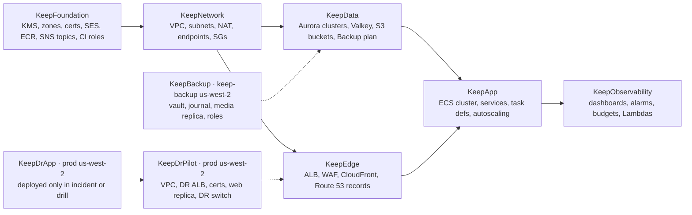
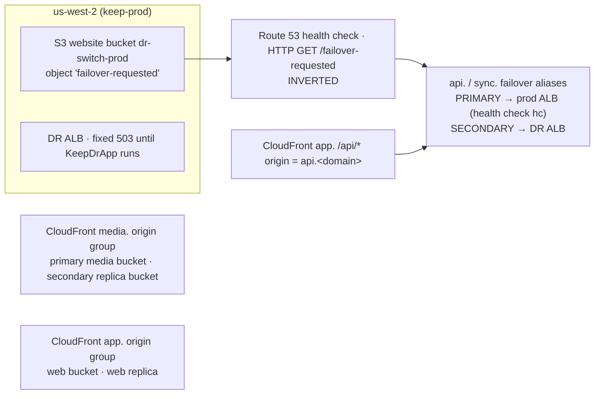
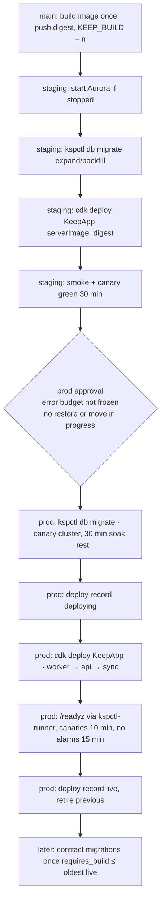
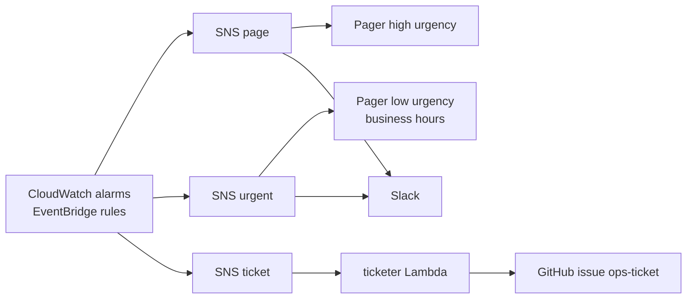

# 14 · Infrastructure and operations

*Detail document 14 of 16 · elaborates spine v1.2 · 2026-10-04 · Status: draft for review*

## 1. Purpose and scope

This document owns how Keep runs. It covers the AWS accounts, CDK stacks and networks; how code reaches each environment (server image, web build, mobile binaries and OTA updates); how the system is observed (metrics, logs, traces, client SLIs, canaries); which conditions page someone and which wait; how operators act (`kspctl`, flags and the brownout ladder, failure-isolation runbooks); what it costs; and how the scale triggers are watched. It is written for a team of 1–3 engineers with no dedicated SRE (A-01) and a budget of about $1.5k/month until traction (A-02).

In scope:

- AWS accounts, regions and environments: `dev` (local), `ci` (ephemeral containers), `staging` (one cluster, scale-to-zero), `prod`, and the us-west-2 DR footprint (D-29, D-45, D-49).
- The CDK v2 application: stack catalogue, environment config, ECS services, data resources at the infrastructure level, secrets, keys and IAM (D-26, D-43).
- Networking and edge: VPC, security groups, the ALB, CloudFront distributions, DNS, certificates, SES and WAF (D-27, D-43, D-44).
- Server deploys, including socket drains and the build-number contract the migration runner relies on (D-49, X-09).
- CI/CD pipelines and their gates; the web release with a monotonic `BUILD_NUMBER` (C-57); the EAS release process (D-05, D-49).
- Observability: the metric registry, client telemetry ingest of 02's schema, logs, traces, dashboards (D-46, X-01).
- SLOs, error budgets, alert classes, routing and the paging policy (X-11).
- Synthetic canaries (D-46), consumed by 16.
- Flags, the audience grammar and the brownout ladder (D-47, X-10).
- The failure-isolation table and runbooks, and game days (R-08).
- `kspctl`: execution model, command tree, safety and audit.
- The cost model and cost guards (§2.5, A-02); the triggers dashboard (§3.1).
- The local development environment (D-26, D-49).

### Out of scope

| Topic | Owner |
|---|---|
| DDL, roles and timeouts, migration runner, shard-move, directory-split, restore, region-loss and major-upgrade runbooks, capacity sampler SQL | 13 |
| Gateway, group commit, compactor and relay internals, and the server metrics they emit | 03 |
| KSP wire format and the client telemetry schema `TelemetryBatchV1` | 02 |
| Client SLI measurement | 04 |
| Better Auth configuration, JWT and JWKS rotation, sessions, denylist, identity metrics | 12 |
| EAS build profiles, channels in `eas.json`, `app.config`, native modules, backup exclusion | 07 |
| PWA update UX, web performance budgets, CSP contents | 06 |
| Push sender and reminder metrics | 09 |
| Media pipeline, signed URLs, S3 key policy, unfurl fetcher | 10 |
| Server search | 11 |
| Threat model, data classification, retention wording, subprocessor list, abuse operations | 15 |
| Simulator, E2E matrix and the assertions of drills and game days | 16 |

## 2. Spine references

| Spine item | Where this doc elaborates it |
|---|---|
| D-26 one image, three services, single-process dev mode | §5.3, §7, §18 |
| D-27 `ws` behind `Transport`, `sync.<domain>` host rule, 30 s idle pings | §6.3, §7.4 |
| D-43 Fargate ARM64, one ALB (idle 4,000 s, deregistration 120 s), one NAT, S3 gateway endpoint, CDK in TypeScript, SES subdomain | §5, §6 |
| D-44 CloudFront PAYG for `app.` and `media.`; web API same-origin at `app.<domain>/api`; WebSockets never through CloudFront; WAF on the ALB | §6.4, §6.6 |
| D-46 Sentry + CloudWatch, client SLIs, OTel API, canaries, `kspctl` | §10, §12, §15 |
| D-47 `directory.flags`, 30 s cache, kill switches | §13 |
| D-49 GitHub Actions, environments, build once and promote, GOAWAY drains, web roll-forward rollback (C-57), EAS channels and staged rollouts, OTA rollback test | §4, §7, §8, §9 |
| X-10 brownout ladder | §13.3 |
| X-11 burn-rate alerts, durability-only pages, error-budget freeze | §11 |
| Also used | A-01, A-02, A-05, §1.3, §2.5, §3.1 (T-01 to T-18), D-25, D-29, D-34, D-39, D-41, D-45, X-01, X-06, X-08, X-09, X-16, R-04, R-08, R-13, INV-2, INV-3, INV-7, INV-14, C-09, C-22, C-23, C-28, C-31, C-57, C-89 |

## 3. Interfaces

### 3.1 Owned here

| Interface | Section | Consumers |
|---|---|---|
| `EnvConfig`, `ClusterConfig`, `ServiceConfig` (CDK environment config) | §4.3 | infra code, 13 (cluster provisioning) |
| `RuntimeEnv` (container environment contract) | §5.5 | every server entrypoint (03, 08–13) |
| SSM parameter and secret names | §5.6 | all server code, pipelines |
| `ops.deployed_builds` row contract (DDL in 13) | §7.2 | 13 (contract-phase gate) |
| `DrainWatcher` (deregistration-driven drain trigger) | §7.4 | 03 (gateway drain) |
| Metric namespace, naming and dimension registry; cardinality budget | §10.2 | 03, 08–13 |
| Telemetry ingest: `TelemetryBatchV1` → `Keep/Client` EMF mapping | §10.3 | 02, 04 (producers), 16 |
| `AlarmSpec`, alert classes, routing, the X-11 alarm map | §11 | 03, 09, 12, 13 (alarm sources) |
| SLO catalogue and burn-rate rules | §11.1–§11.2 | 16, all |
| `CanaryScenario`, `Keep/Canary` metrics | §12 | 16 |
| `FlagDef`, `Audience` grammar for `directory.flags.audience`, brownout keys | §13 | 02, 03, 04, 08, 10, 11, 13 |
| `kspctl` command tree, global flags, exit codes, `KspctlAudit`, `OpsTicket` | §15 | 03, 12, 13 (commands they name), 16 |
| `TriggerDef` registry and `Keep/Cost` metrics | §17 | 13 |
| `docker-compose` topology for dev and CI | §18 | everyone |
| OTA eligibility check | §9.3 | 07 |

### 3.2 Consumed

| Owner | What this doc uses (exact names) |
|---|---|
| 02 §19 | `TelemetryBatchV1`, `BUCKETS_MS`, `HistName`, `CounterName`, `GaugeName`; SLI definitions §19.2; posting rules §19.4; close codes §6.5; `GOAWAY` semantics §6.7; `sync.mode` client behavior §13.8 |
| 03 §12–§13 | Metrics in namespace `Keep/Sync` (`keep.sync.ack_ms`, `keep.sync.ack_fail_ratio`, `keep.sync.group_commit_ms`, `keep.sync.group_commit_rows`, `keep.sync.commits`, `keep.sync.divergence`, `keep.gw.sockets`, `keep.gw.handshakes`, `keep.relay.lag_s`, `keep.journal.age_s`, `keep.compact.lag_s`, …); `Transport.stopAccepting()`; drain config `drain.reconnectMaxMs` 120,000 and close-by 110 s; pool sizes §4 |
| 13 §1.2, §1.4, §5–§11 | Roles and connection budget; parameter group; `ShardRouter`; `ops.enter_shard_write`; migration runner (`kspctl db migrate`), soak gate and `requires_build`; AWS Backup plan and vault; journal bucket policy; region-loss and restore runbooks; capacity sampler metrics in `Keep/Capacity` with dimension `cluster` (`writer_cpu_p95_7d`, `cluster_bytes`, `append_rows_per_s`, `log_dead_ratio`, `bootstrap_cpu_share`, `docread_io_share`, `search_bytes_share`, `mau_30d`, `note_log_state_hot_ratio`, `partitions_ahead`, `max_slot_lag_bytes`); `Keep/Data` metrics §12.1 |
| 12 §3.3, §6.6, §16–§18 | CloudFront `/api/*` behavior, viewer-request function, `X-KS-Edge-Secret`; JWKS storage; `BETTER_AUTH_SECRET`; identity metrics and alarms |
| 04 §8.1, §17 | Client SQLite two-number rule; client SLI list |
| 07 | EAS profiles `development`, `preview`, `production` and channels (assumed, §9.1) |
| 08 §16 | Flags `ff.sharing`, `ff.sharing.inviteEmail`, `ff.sharing.nonContact`, `ff.sharing.copy`; pg-boss retention for `sharing.indexInvite` |

## 4. Accounts, regions and environments

### 4.1 Accounts and regions

| Account | Regions | Holds | Who can write |
|---|---|---|---|
| `keep-mgmt` | global | AWS Organizations, IAM Identity Center (SSO), consolidated billing, CUR 2.0 export and Athena (§17.2), org CloudTrail | Org admins only |
| `keep-prod` | us-east-1 (primary); us-west-2 (DR pilot light, §6.7) | Everything that serves users; ECR `keep-server` (replicated to us-west-2) | CI deploy role from `main` with approval; operators via SSO |
| `keep-staging` | us-east-1 | Staging stack; `staging.<domain>` sub-zone | CI deploy role from `main`; operators |
| `keep-backup` | us-west-2 | Vault `keep-dr` (Vault Lock), restore-journal bucket (Object Lock, 400 d), media replica bucket, org CloudTrail bucket; the narrow `keep-replica-purge` and `keep-restore` roles (13 §7.2–§7.3, D-45, C-35) | Break-glass only |

There is no AWS `dev` account: `dev` is the local docker-compose stack (D-49, §18). EU cell resources (T-16) get their own stack in `keep-prod` eu-central-1 when T-16 fires.

### 4.2 Environments

| Env | Where | Data | Purpose | Cost posture |
|---|---|---|---|---|
| `dev` | Laptop: docker-compose (Postgres 18, Valkey 9, MinIO, Mailpit) plus the single-process server (D-26) | Synthetic seeds | Daily development | Free |
| `ci` | GitHub Actions runners: compose with **two shard clusters and a separate directory container** | Fixtures | Cross-cluster relay paths (D-29), directory separation (13 T13-18), isolation tests (D-28) | Runner minutes |
| `staging` | `keep-staging`, us-east-1, **2 AZs**, one Aurora cluster `c1` (db.t4g.medium writer, no reader), Fargate and Valkey at minimum size; Fargate scaled to zero and Aurora stopped outside working hours (§16.2); a second cluster only for the M4 shard-move rehearsal | Synthetic corpus only, never production data (13 §7.6) | Pre-prod deploys, drills, game days | ≈ $150–200/month (§2.5) |
| `prod` | `keep-prod`, us-east-1, **3 AZs**, one Aurora cluster `c1` (writer + reader in another AZ) | Users | Service | §16 |
| `dr` | `keep-prod` us-west-2: pilot light always; the full stack only during a region-loss incident or drill D2 | Restored from the `keep-backup` vault | Region loss before T-11 (13 §7.4) | ≈ $30/month idle |

### 4.3 Environment config (owned)

```ts
// infra/lib/config.ts — owned here. One literal per env; CI fails if a field is missing.
export type EnvName = 'staging' | 'prod';
export type ServiceName = 'api' | 'sync' | 'worker' | 'workerEgress' | 'canary';

export interface ClusterConfig {
  id: string;                                   // 'c1', 'c2'; matches directory.clusters.cluster_id (13 §2.3)
  role: 'shard+directory' | 'shard' | 'directory';
  writerClass: string;                          // 'db.r8g.large'
  readers: 0 | 1 | 2;                           // prod: 1 (failover target, D-29)
  canary: boolean;                              // directory.clusters.canary (13 §6.3)
  temporary?: boolean;                          // staging rehearsal cluster, destroyed after use
}

export interface ServiceConfig {
  cpu: 256 | 512 | 1024 | 2048 | 4096;         // Fargate units
  memoryMiB: number;
  min: number; max: number;                     // autoscaling bounds (§5.3)
  stopTimeoutS: number;                         // ≤ 120 on Fargate
  deregistrationDelayS?: number;                // services behind the ALB
}

export interface EnvConfig {
  name: EnvName;
  account: string;
  region: 'us-east-1';
  backupAccount: string;
  domain: string;                               // prod 'example.com' (placeholder), staging 'staging.example.com'
  azs: 2 | 3;
  vpcCidr: string;
  natGateways: 1 | 2;                           // 1 on day 1 (D-43); 2 only during the NAT runbook (RB-NAT)
  clusters: ClusterConfig[];
  valkey: { nodeType: string; replicas: 0 | 1 };
  services: Record<ServiceName, ServiceConfig & { enabled: boolean }>;
  scaleToZero?: { downCron: string; upCron: string; timezone: string };
  crr: boolean;                                 // S3 CRR of masters (from M2 in prod, D-39)
  drPilotLight: boolean;                        // §6.7 (prod, from M2)
  metricsLevel: 'core' | 'full';                // §10.2 cardinality
  logRetentionDays: number;
  pages: boolean;                               // false in staging: no alarm ever pages (§11.3)
  monthlyBudgetUsd: number;
}

export const prod: EnvConfig = {
  name: 'prod', account: '111111111111', region: 'us-east-1', backupAccount: '333333333333',
  domain: 'example.com', azs: 3, vpcCidr: '10.20.0.0/16', natGateways: 1,
  clusters: [{ id: 'c1', role: 'shard+directory', writerClass: 'db.r8g.large', readers: 1, canary: true }],
  valkey: { nodeType: 'cache.t4g.small', replicas: 1 },
  services: {
    api:          { enabled: true,  cpu: 512,  memoryMiB: 1024, min: 2, max: 8,  stopTimeoutS: 30,  deregistrationDelayS: 30 },
    sync:         { enabled: true,  cpu: 1024, memoryMiB: 2048, min: 2, max: 12, stopTimeoutS: 120, deregistrationDelayS: 120 },
    worker:       { enabled: true,  cpu: 1024, memoryMiB: 2048, min: 2, max: 6,  stopTimeoutS: 90 },
    workerEgress: { enabled: false, cpu: 512,  memoryMiB: 1024, min: 1, max: 3,  stopTimeoutS: 60 },   // M4 (§6.1)
    canary:       { enabled: true,  cpu: 256,  memoryMiB: 512,  min: 1, max: 1,  stopTimeoutS: 30 },   // M2
  },
  crr: true, drPilotLight: true, metricsLevel: 'full', logRetentionDays: 30, pages: true, monthlyBudgetUsd: 1300,
};

export const staging: EnvConfig = {
  ...prod, name: 'staging', account: '222222222222', domain: 'staging.example.com', azs: 2, vpcCidr: '10.30.0.0/16',
  clusters: [{ id: 'c1', role: 'shard+directory', writerClass: 'db.t4g.medium', readers: 0, canary: true }],
  valkey: { nodeType: 'cache.t4g.micro', replicas: 0 },
  services: {
    api:          { ...prod.services.api,    min: 1, max: 2 },
    sync:         { ...prod.services.sync,   min: 1, max: 2 },
    worker:       { ...prod.services.worker, min: 1, max: 2 },
    workerEgress: { ...prod.services.workerEgress },
    canary:       { ...prod.services.canary },
  },
  scaleToZero: { downCron: 'cron(0 20 ? * MON-FRI *)', upCron: 'cron(0 7 ? * MON-FRI *)', timezone: 'Europe/London' },
  crr: false, drPilotLight: false, metricsLevel: 'core', logRetentionDays: 7, pages: false, monthlyBudgetUsd: 250,
};
```

M1 (private alpha) runs `prod` with `writerClass: 'db.t4g.medium'` and `readers: 1`, `crr: false` and `drPilotLight: false`; M2 switches to the values above (§2.5, D-39, D-45).

## 5. CDK application

### 5.1 Layout

`infra/` is a workspace package (`aws-cdk-lib` 2.x, exact version pinned in M0, **UNVERIFIED**), with `cdk-nag` checks.

```
infra/
  bin/keep.ts                  instantiates stacks per EnvConfig
  lib/config.ts                §4.3
  lib/stacks/{foundation,network,data,edge,app,observability,backup,dr-pilot,dr-app}.ts
  lib/constructs/{keep-service,aurora-cluster,alarm,dashboard}.ts
  lib/registry/{metrics,alarms,slos,triggers,flags,runbooks}.ts    owned registries (§10–§17)
  test/*.test.ts               CDK assertions (§Testing)
```



### 5.2 Stack catalogue

| Stack | Account / region | Contents | Changes how often |
|---|---|---|---|
| `KeepFoundation-<env>` | env / us-east-1 | KMS keys (§5.6); Route 53 public zone (prod) or delegated sub-zone (staging); ACM certificates; SES identity; ECR repo `keep-server` (prod only, replication to us-west-2, immutable tags, scan on push, keep last 200); SNS topics per alert class; GitHub OIDC provider and CI roles | Rarely |
| `KeepNetwork-<env>` | env / us-east-1 | VPC, subnets, one NAT gateway, S3 gateway endpoint, NACLs, security groups, VPC flow logs (REJECT only) | Rarely |
| `KeepData-<env>` | env / us-east-1 | Aurora clusters from `clusters[]` with 13's parameter group (13 §1.4); Valkey replication group; S3 buckets `media`, `web`, `apex`, `ops`, `alb-logs`; CRR rules; AWS Backup plan `keep-aurora` (13 §7.2) | Per cluster change |
| `KeepEdge-<env>` | env / us-east-1 (CloudFront global) | ALB, listeners, target groups, WAF web ACL, CloudFront distributions `app.`, `media.`, apex; CloudFront Functions; Route 53 records (failover records in prod, §6.7) | Monthly |
| `KeepApp-<env>` | env / us-east-1 | ECS cluster; task definitions for `api`, `sync`, `worker`, `workerEgress`, `canary`, `kspctl-runner`; services, autoscaling, log groups, task roles. Context: `serverImage` (digest), `serverBuild` | Every server deploy |
| `KeepObservability-<env>` | env / us-east-1 | CloudWatch dashboards and alarms from the registries; EventBridge rules (RDS, Backup, ECS events); Lambdas `ticketer`, `ipset-sync`, `trigger-review`; AWS Budgets and Cost Anomaly Detection | Weekly |
| `KeepBackup-<env>` | `keep-backup` / us-west-2 | Vault `keep-dr[-staging]`, journal bucket, media replica bucket, cross-account roles (13 §7.2–§7.3) | Rarely; break-glass deploy |
| `KeepDrPilot-prod` | `keep-prod` / us-west-2 | VPC without NAT; DR ALB with a fixed 503 listener; ACM certs; web replica bucket; DR switch bucket and Route 53 health check (§6.7); SES identity; KMS replica keys; secret replicas | Rarely |
| `KeepDrApp-prod` | `keep-prod` / us-west-2 | NAT, Valkey, ECS services pointed at the restored cluster | Only during RB-REGION or drill D2 |
| `KeepCost` | `keep-mgmt` | CUR 2.0 data export, Athena workgroup, `cost-sampler` Lambda (§17.2) | Rarely |

Every resource carries tags `keep:env`, `keep:component` and, for Aurora, `keep:backup=true` (13 §7.2 selects on it). Stateful resources have `RemovalPolicy.RETAIN` and deletion protection.

### 5.3 Compute

| Service | Entrypoint (D-26) | Task size (prod) | Count | Autoscaling | Target group / port |
|---|---|---|---|---|---|
| `api` | `keep-server api` | 0.5 vCPU / 1 GB | 2–8 | Target tracking CPU 60%; scale-in cooldown 300 s | `tg-api`, 8080 |
| `sync` | `keep-server sync` | 1 vCPU / 2 GB | 2–12 (until T-07) | Step scaling on `keep.gw.sockets` per task > 15k or CPU > 55% (+1 task); scale-in only when both are below 40% of those for 30 min, at most 1 task per 15 min, because every scale-in drains sockets | `tg-sync`, 8090 |
| `worker` | `keep-server worker` | 1 vCPU / 2 GB | 2–6 | CPU 60%; +1 when `keep.compact.lag_s` p99 > 120 s or `keep.relay.lag_s` > 30 s for 5 min | none |
| `workerEgress` (M4) | `keep-server worker --queues=unfurl,ocr.server` | 0.5 vCPU / 1 GB | 1–3 | Queue depth | none; runs in the egress subnets (§6.1) |
| `canary` (M2) | `keep-server canary` | 0.25 vCPU / 0.5 GB | 1 | none | none |
| `kspctl-runner` | `keep-server kspctl …` | 1 vCPU / 2 GB | one-off `RunTask` | — | none (§15.1) |

Common task settings:

- **Image:** one `keep-server` image (D-26), linux/arm64, built from a `turbo prune` of `apps/server` on `node:24-bookworm-slim` pinned by digest; Node 26 LTS replaces it after 2026-10-28 plus one patch release (A-12). Non-root user, `readonlyRootFilesystem: true`, `/tmp` on an ephemeral volume, `--max-old-space-size` = 75% of task memory. CI fails an image above 200 MB compressed (NAT and pull time, §16).
- **Deployment:** rolling, `minimumHealthyPercent: 100`, `maximumPercent: 200`, deployment circuit breaker with rollback, health-check grace 60 s. Tasks spread across AZs.
- **Health:** the ALB and the container check `GET /healthz`, which reports only process liveness (event-loop lag over the last 10 s < 2 s). It never checks Postgres or Valkey, so a database failover never makes ECS replace every task and trigger a reconnect storm. `GET /readyz` (Postgres, Valkey and secrets reachable) is used only by the deploy smoke test (§7.3).
- **Logging:** `awslogs` driver in `mode: non-blocking` with `max-buffer-size: 25m`, so a CloudWatch Logs outage or a lost NAT never blocks the event loop (RB-NAT).
- **Stop timeouts:** `api` 30 s (Fastify close), `worker` 90 s (stop claiming, finish jobs ≤ 60 s, release leases), `sync` 120 s, the Fargate maximum (drain in §7.4).
- **ECS Exec** is disabled on every service; operators act through typed `kspctl` commands (§15), and break-glass content access is a command of its own (X-16).

### 5.4 Data resources (infrastructure settings only)

| Resource | Settings (schema, roles and parameters are 13's) |
|---|---|
| Aurora PostgreSQL 18.6 `keep-c1` | Standard storage (T-03 later); writer + reader in another AZ (D-29); backup retention 35 d; backup window 02:00–03:00 UTC; maintenance window Sun 05:00–07:00 UTC with auto minor upgrade off (13 §10.1); deletion protection; storage encrypted with `alias/keep-<env>-data`; Database Insights standard mode; Enhanced Monitoring 60 s; parameter group `keep-pg18` from 13 §1.4; RDS-managed master secret used only by break-glass; slow-query log exported to CloudWatch (14 d) |
| Service credentials | One Secrets Manager secret per 13 role per cluster (`keep/<env>/db/<cluster>/<role>`), rotated every 90 days with the alternating-users strategy so pools never see a dead password; `directory.clusters.writer_secret_arn` points at them (13 §2.3) |
| Connection headroom | Alarm when `DatabaseConnections` > 60% of `max_connections` for 1 h: first reduce pool sizes or scale the instance; RDS Proxy is evaluated then (13 §1.2). Proxy pinning with the session-level advisory locks `kspctl` takes for fences is **UNVERIFIED** |
| ElastiCache Valkey 9.1 | Cluster mode disabled until T-08; Multi-AZ with automatic failover (prod); TLS in transit and AUTH through an RBAC user; at-rest encryption; `maxmemory-policy volatile-lru` (every key has a TTL; D-25 stores nothing durable) |
| S3 `keep-<env>-media` | Versioned, SSE-KMS with Bucket Keys, 30-day non-current expiry, Intelligent-Tiering on masters (D-39); CRR of `b/` and `v/` to the replica bucket in `keep-backup` with DeleteMarkerReplication (D-39); `x/` (exports) and renditions are not replicated; replication metrics on |
| S3 `keep-<env>-web` | Hashed assets, versioned; CRR to `keep-prod-web-usw2` (prod) for the edge failover (§6.7) |
| S3 `keep-<env>-ops` | Ticket details (§15.4), drill reports, load-test results; SSE-KMS, 90-day lifecycle |
| S3 `keep-<env>-alb-logs` | ALB access logs, 30 d (they contain client IPs; 15 owns the retention wording) |

### 5.5 Runtime environment contract (owned)

Every entrypoint parses its environment at start with this schema and exits non-zero on failure. Cluster DSNs are not in the environment: they are read from `directory.clusters.writer_secret_arn` through 13's `ShardRouter`.

```ts
// packages/server-runtime/src/env.ts — owned here
import { z } from 'zod';
export const RuntimeEnv = z.object({
  KEEP_ENV: z.enum(['dev', 'ci', 'staging', 'prod', 'dr']),
  KEEP_SERVICE: z.enum(['api', 'sync', 'worker', 'canary', 'kspctl', 'dev']),
  KEEP_BUILD: z.coerce.number().int().positive(),          // server build counter (§7.1)
  KEEP_GIT_SHA: z.string().regex(/^[0-9a-f]{40}$/),
  KEEP_REGION: z.string(),
  KEEP_DOMAIN: z.string(),
  KEEP_SECRETS_PREFIX: z.string(),                          // 'keep/prod/'
  KEEP_DIRECTORY_SECRET_ARN: z.string(),                    // directory pool DSN (13 §5.2)
  KEEP_VALKEY_URL: z.string().startsWith('rediss://'),      // 'redis://' allowed only when KEEP_ENV ∈ dev, ci
  KEEP_MEDIA_BUCKET: z.string(),
  KEEP_OPS_BUCKET: z.string(),
  KEEP_JOURNAL_BUCKET: z.string(),                          // keep-restore-journal-<backup-acct> (13 §7.3)
  KEEP_JOURNAL_REGION: z.literal('us-west-2').or(z.literal('local')),
  KEEP_REPLICA_PURGE_ROLE_ARN: z.string().optional(),      // worker only (D-39, C-35)
  KEEP_APP_ENVELOPE_KEY: z.string(),                        // 'alias/keep-prod-app-envelope' (multi-Region, §5.6)
  KEEP_TARGET_GROUP_ARN: z.string().optional(),             // sync only: DrainWatcher (§7.4)
  KEEP_JOB_QUEUES: z.string().optional(),                   // workerEgress queue filter
  KEEP_METRICS_LEVEL: z.enum(['core', 'full']),
  KEEP_TRACE_SAMPLE: z.coerce.number().min(0).max(1),
  KEEP_SINGLE_PROCESS: z.coerce.boolean().default(false),   // D-26 dev mode
  SENTRY_DSN: z.string().url().optional(),
});
export type RuntimeEnv = z.infer<typeof RuntimeEnv>;
```

### 5.6 Secrets and keys

All secrets live in Secrets Manager under `keep/<env>/…`, encrypted with `alias/keep-<env>-secrets`. In prod every secret is **replicated to us-west-2** so the DR stack can start while us-east-1 is down.

| Secret | Used by | Rotation |
|---|---|---|
| `db/<cluster>/<role>` | services, `kspctl` (13 §1.2 roles) | 90 d, alternating users |
| `auth/better-auth-secret` | `api` (12 §6.6) | 12's runbook (12 §19 row 26) |
| `edge/secret` (two values: current, next) | CloudFront origin header, `api` (12 §3.3) | Quarterly, two-value overlap |
| `push/apns` (`.p8`, key ID, team ID), `push/fcm` (service account), `push/vapid` | `worker` (09) | Yearly or on compromise |
| `auth/siwa` (`.p8`), `auth/google` (client secret) | `api` (12) | Yearly |
| `media/cloudfront-signing` (private key; public key in the key group) | `api` (10) | Yearly, two keys in the key group |
| `ops/github-app` | `ticketer`, `trigger-review` Lambdas | Yearly |
| `canary/<actor>` (software passkey, §12) | `canary` | On re-enrolment |
| `telemetry/hmac`, `ratelimit/hmac` | `api` (12 §17–§18) | Yearly |

| KMS key | Type | Encrypts |
|---|---|---|
| `alias/keep-<env>-data` | single-Region | Aurora storage, ElastiCache, S3 media and ops, CloudWatch log groups |
| `alias/keep-<env>-secrets` | **multi-Region** (replica in us-west-2) | Secrets Manager |
| `alias/keep-<env>-app-envelope` | **multi-Region** (replica in us-west-2) | Application-level envelope encryption inside rows: 12's `apple_refresh_token_enc`, 08's `email_enc`. A single-Region key would leave these ciphertexts undecryptable in a cluster restored in us-west-2 during a us-east-1 outage |
| Backup-account keys | single-Region, us-west-2 | Vault and journal (13 §7.2–§7.3) |

### 5.7 IAM (least privilege, X-16)

| Role | Grants (summary) |
|---|---|
| `api` task | Read its secrets; S3 `PutObject` on `b/*` (presign) and `GetObject` on `x/*` in the media bucket; KMS encrypt and decrypt on `app-envelope`; nothing in the backup account |
| `sync` task | Read its secrets; `elasticloadbalancing:DescribeTargetHealth` (§7.4) |
| `worker` task | Read its secrets; S3 on the media bucket; `s3:PutObject` on the journal bucket `j/*` with checksum (13 §7.3) and `kms:GenerateDataKey` on the journal key (no decrypt); `sts:AssumeRole` into `keep-replica-purge` (C-35); SES `SendEmail` from `mail.<domain>`; KMS on `app-envelope` |
| `canary` task | Read `canary/*` secrets only |
| `kspctl-ro`, `kspctl-ops`, `kspctl-breakglass` task roles | Read the DB secret of `keep_ro`, `keep_worker`/`keep_migrator`, or `keep_restore` respectively; `breakglass` also reads the journal (via `keep-restore` in the backup account) and is assumable only from the `KeepBreakGlass` SSO permission set, whose use pages (§11.5) |
| GitHub OIDC `gha-diff` | Read-only for `cdk diff` on PRs |
| GitHub OIDC `gha-ecr-push` | Push to ECR `keep-server` from `main` only |
| GitHub OIDC `gha-deploy-<env>` | `cdk deploy` and `ecs:RunTask` of `kspctl-runner`; prod trust is restricted to `repo:<org>/<repo>:environment:production` |

## 6. Network and edge

### 6.1 VPC layout

| Env | CIDR | AZs | Public /24 | App /20 (private, NAT route) | Data /24 (isolated, no route out) | Egress /24 (M4) |
|---|---|---|---|---|---|---|
| prod us-east-1 | 10.20.0.0/16 | a, b, c | 10.20.0–2.0 | 10.20.16.0, .32.0, .48.0 | 10.20.64–66.0 | 10.20.80–82.0 |
| prod DR us-west-2 | 10.21.0.0/16 | a, b, c | same pattern | same | same | — |
| EU cell (T-16, reserved) | 10.22.0.0/16 | — | — | — | — | — |
| staging | 10.30.0.0/16 | a, b | same pattern, 2 AZs | | | |

CIDRs never overlap, so cross-region peering for a T-16 shard move (logical replication between clusters, 13 §5.8) needs no renumbering.

- **One NAT gateway** in AZ a; every app subnet routes `0.0.0.0/0` through it (D-43). ECR, CloudWatch Logs and Secrets Manager go through it until T-18. The **S3 gateway endpoint** serves S3 from every subnet.
- **Egress subnets** (M4, D-50): `workerEgress` runs here for link unfurl and server OCR fetches. Their NACL allows TCP 5432 to the data subnets (pg-boss and result writes) and TCP 6379 to Valkey, then **denies** 10.0.0.0/8, 172.16.0.0/12, 192.168.0.0/16, 100.64.0.0/10 and 169.254.0.0/16, then allows TCP 80/443 to `0.0.0.0/0`. Fargate's task-metadata endpoint is not filtered by NACLs, so 10's fetcher must still refuse link-local targets in code (D-50).

### 6.2 Security groups

| SG | Inbound | Outbound |
|---|---|---|
| `sg-alb` | 443 from `0.0.0.0/0` | 8080 to `sg-api`, 8090 to `sg-sync` |
| `sg-api`, `sg-sync` | from `sg-alb` on their port | 5432 to `sg-db`, 6379 to `sg-valkey`, 443 to `0.0.0.0/0` |
| `sg-worker`, `sg-canary`, `sg-kspctl` | none | same as above (canary: 443 only) |
| `sg-db` | 5432 from `sg-api`, `sg-sync`, `sg-worker`, `sg-kspctl`, `sg-rotation` | none |
| `sg-valkey` | 6379 from `sg-api`, `sg-sync`, `sg-worker` | none |

### 6.3 Application Load Balancer

One ALB per environment (D-43), dual host rules, WAF attached (D-44).

| Setting | Value |
|---|---|
| Listener | 443 HTTPS only (80 redirects); certificate `*.<domain>`; policy `ELBSecurityPolicy-TLS13-1-2-Res-2021-06` (TLS 1.3 preferred, strong TLS 1.2 kept for CloudFront origin fetches, X-16) |
| Rules | Host `api.<domain>` → `tg-api`; host `sync.<domain>` → `tg-sync`; default → fixed 404 |
| Attributes | `idle_timeout.timeout_seconds = 4000` (D-43); `routing.http.drop_invalid_header_fields.enabled = true`; `routing.http.desync_mitigation_mode = defensive`; HTTP/2 on (bootstrap streams, D-21); access logs to `alb-logs` |
| `tg-api` | HTTP 8080, `/healthz` every 10 s, timeout 5 s, healthy 2, unhealthy 3; deregistration delay 30 s |
| `tg-sync` | HTTP 8090 (WebSocket upgrade on `/v1`), `/healthz` same thresholds; **deregistration delay 120 s** (D-43); stickiness off (gateways are stateless, D-18) |

The client always uses `sync.<domain>`, so T-07 (uWebSockets.js on EC2 c8g behind an NLB) is a DNS change (D-27, 03 §11.4). T-07 adds a `KeepSyncNlb` stack with an NLB, TLS on the NLB, and an ECS EC2 capacity provider; `sync.` moves by weighted records 10% → 50% → 100% over a week.

### 6.4 CloudFront distributions

| Distribution | Origins | Behaviors |
|---|---|---|
| `app.<domain>` | Origin group: `keep-<env>-web` (OAC) primary, `keep-prod-web-usw2` secondary (failover on 500/502/503/504); custom origin `api.<domain>` for `/api/*` | Default: S3, cache policy `CachingOptimized` for `/assets/*` (hashed, `Cache-Control: public, max-age=31536000, immutable`), `no-cache` for `index.html`, `sw.js`, `version.json`, `manifest.webmanifest`. `/api/*`: `CachingDisabled`, origin request policy forwarding all cookies, query strings and viewer headers except `Host`, plus `CloudFront-Viewer-Address` and `CloudFront-Viewer-Country`; origin custom header `X-KS-Edge-Secret`; 12's viewer-request function (12 §3.3). Response headers policy: HSTS (2 years, includeSubDomains), `X-Content-Type-Options`, `Referrer-Policy: strict-origin-when-cross-origin`, and the CSP and Trusted Types header whose **value** 06 owns. No COOP/COEP (D-04) |
| `media.<domain>` | Origin group: `keep-<env>-media` (OAC) primary, the replica bucket in `keep-backup` secondary (OAC; its bucket and key policies admit this distribution) | Trusted key group for signed URLs and cookies (10); cache key on path only |
| `<domain>` (apex) | `keep-<env>-apex` (OAC) | Marketing site, `/.well-known/apple-app-site-association` and `/.well-known/assetlinks.json` served as `application/json` without redirects (12 §4.3 passkeys, 07 universal links) |

The API and WebSockets are never cached, and `sync.` never goes through CloudFront (D-44, Q-07). T-12 switches the price plan only.

### 6.5 DNS, certificates and email

- **Route 53:** public zone `<domain>` in `keep-prod`; `staging.<domain>` delegated to `keep-staging`. `app.`, `media.` and apex are aliases to CloudFront. In prod, `api.` and `sync.` are **failover** aliases (§6.7); in staging they are simple aliases.
- **ACM:** `*.<domain>` plus apex in us-east-1 (CloudFront and the ALB) and in us-west-2 (DR ALB). DNS validation, auto-renewed; alarm at `DaysToExpiry` < 21 (urgent).
- **SES** (D-43, R-09): identity `mail.<domain>` with Easy DKIM (2048-bit), custom MAIL FROM `bounce.mail.<domain>`, SPF on the MAIL FROM domain, DMARC `p=quarantine` at launch and `p=reject` after 30 days of clean reports. A configuration set publishes bounce and complaint events to SNS, consumed by the worker to write `directory.email_suppression` (`hard_bounce`, `complaint`, C-80). Production access (leaving the SES sandbox) is an M2 prerequisite. The same identity is verified in us-west-2 by `KeepDrPilot` at no cost.

### 6.6 WAF (on the ALB)

| Rule (priority order) | Action |
|---|---|
| `EdgeSecretOutsideCloudFront`: header `x-ks-edge-secret` present **and** source IP not in IP set `cloudfront-origin-facing` (kept current daily by the `ipset-sync` Lambda from AWS `ip-ranges.json`) (12 §3.3) | Block |
| AWS managed: IP reputation, known bad inputs, core rule set | Block, except `SizeRestrictions_BODY`, scoped down to exclude `/v1/sync/*`, `/api/v1/sync/*`, `/v1/telemetry` (bodies up to 4 MiB on `/push`, §5.3) |
| `RateViaCloudFront`: source IP in the CloudFront set; aggregate on `X-Forwarded-For` position LAST (the viewer IP CloudFront appended) | Rate-based: 3,000 requests / 5 min per viewer IP; 600 / 5 min on `/api/auth/*` |
| `RateDirect`: everything else, aggregate on source IP | 3,000 / 5 min on `api.`; 6,000 / 5 min on `sync.` (handshakes only; carrier NAT shares IPs) |

WAF limits are a coarse backstop; 12's per-endpoint limits (12 §17) and 03's admission control (≤ 500 handshakes/s per task, §5.12) are authoritative.

### 6.7 DR edge: data-plane failover

Route 53, CloudFront and IAM control planes run in us-east-1, so a region-loss runbook must not depend on editing DNS records or distributions during the outage. Every DR switch is therefore pre-provisioned and flipped through a **data-plane** action in us-west-2.



- The primary records use an **inverted** health check on `http://dr-switch-prod.s3-website-us-west-2.amazonaws.com/failover-requested`. The object is absent (404) or unreachable in normal operation, so the inverted check is healthy and Route 53 answers with the prod ALB. A us-west-2 S3 problem therefore can never fail traffic over by itself.
- **Failing over** (RB-REGION step 6, only after the restore is open): `aws s3 cp marker s3://dr-switch-prod/failover-requested --region us-west-2`. Three failed checks at 30 s flip `api.` and `sync.` in about 2 minutes. CloudFront's `/api/*` origin is `api.<domain>`, so the web API follows without a distribution change. **Failing back** later is a planned shard move (13 §7.4 step 8), then deleting the object.
- Media and the web shell fail over per request through CloudFront origin groups (GET only), using the CRR replicas.
- **Pilot light** (`KeepDrPilot-prod`, ≈ $30/month): VPC without NAT, DR ALB, us-west-2 certificates, web replica bucket, the switch bucket and health check, ECR replication target, secret replicas, KMS replica keys, SES identity. `KeepDrApp-prod` adds NAT, Valkey and the ECS services during the incident (about 30 min of the 8 h RTO, §1.3).

## 7. Server deploys and drains

### 7.1 Build numbers and the image

| Artifact | Identifier | Source |
|---|---|---|
| Server image | `keep-server@sha256:…`, tags `b<build>` and `git-<sha>` | Built once on `main`, promoted by digest to staging and prod (D-49) |
| Server build | `KEEP_BUILD`, a monotonically increasing integer | SSM parameter `/keep/build/server`, incremented with an optimistic version check by the `main` workflow; used by 13's `requires_build` migration header |
| Web build | `BUILD_NUMBER`, monotonically increasing | SSM parameter `/keep/build/web`; a rollback is a new, higher number (C-57, §8.4) |
| Mobile build | iOS `buildNumber`, Android `versionCode` | EAS remote auto-increment (07) |

### 7.2 `ops.deployed_builds` (row contract; DDL belongs to 13)

13's runner applies a `contract` migration only when `requires_build` is the oldest build that may still run (13 §6.3). The pipeline maintains that fact on every shard cluster:

```sql
-- Proposed for 13 §1.5 (ops schema, every cluster). Written only by the deploy pipeline through
-- `kspctl deploy record`; read by the migration runner.
CREATE TABLE ops.deployed_builds (
  env           text        NOT NULL CHECK (env IN ('staging','prod','dr')),
  service       text        NOT NULL CHECK (service IN ('api','sync','worker','workerEgress','canary')),
  build         int         NOT NULL,
  image_digest  text        NOT NULL,
  git_sha       text        NOT NULL,
  state         text        NOT NULL CHECK (state IN ('deploying','live','retired','failed')),
  started_at    timestamptz NOT NULL DEFAULT now(),
  live_at       timestamptz,
  retired_at    timestamptz,
  PRIMARY KEY (env, service, build)
);
-- Runner gate: SELECT min(build) FROM ops.deployed_builds WHERE env = $1 AND state IN ('deploying','live');
```

A build becomes `retired` only after ECS reports no running task of its task definition for that service. A rollback re-marks the older build `live`.

### 7.3 Pipeline order for a server release



- Migrations precede the deploy that needs them; each is compatible with the previous build (X-09). The runner and soak gate are 13's (13 §6.3–§6.4).
- Within `KeepApp`, CloudFormation updates services in dependency order **worker → api → sync**. New job types reach workers before the API enqueues them; `sync` goes last because it is the only service whose replacement moves sockets.
- `sync` is rolled only when its dependency graph changed (`turbo` affected analysis on `apps/server/src/sync/**` and its packages), and at most 4 times per day; the 24 h socket lifetime cap (D-41) moves every socket daily anyway.
- Deploy window: Monday–Thursday 09:00–16:00 in the on-call engineer's zone; `--emergency` overrides for fixes.

### 7.4 Socket drain on deploy and scale-in

ECS stops a task behind a target group in two phases: during `DEACTIVATING` it deregisters the target and waits for the deregistration delay; only then (`STOPPING`) does it send SIGTERM. A drain that starts at SIGTERM therefore begins after the 120 s draining window, when the ALB may already have closed the sockets (OQ-14-1), and clients would see abrupt 1006 closes and reconnect all at once (F-14 in 03). The drain must start when deregistration starts.

```ts
// apps/server/src/platform/drain.ts — owned here; 03's gateway calls drain() on onDrain.
export type DrainReason = 'deregistering' | 'sigterm' | 'lifetime' | 'operator';
export interface DrainWatcher {
  /** sync only: poll elbv2:DescribeTargetHealth for this task's IP:8090 in KEEP_TARGET_GROUP_ARN
   *  every 5 s ± 1 s. State 'draining' (or 'unused' after being 'healthy') fires onDrain once. */
  start(): void;
  /** Fires once, for the first of: deregistration seen, SIGTERM, operator `kspctl deploy drain`.
   *  closeByMs: epoch ms by which every socket must be closed = detection + 110 s. */
  onDrain(cb: (reason: DrainReason, closeByMs: number) => void): () => void;
}
```

- On `onDrain`, 03's gateway runs its existing drain (03 §5.9): `stopAccepting()`, `GOAWAY{reconnectAfterMs: U(0, 120 s)}` to every socket, finish in-flight commits and acks, close each socket at its `reconnectAfterMs` but no later than `closeByMs`. Detection within 5 s plus 110 s ends every socket inside the 120 s deregistration delay (D-43), and clients spread their reconnects over about 110 s (§5.12).
- A DescribeTargetHealth error never triggers a drain; SIGTERM remains the fallback.
- Load: at Y1 a sync deploy moves about 63k sockets (A-03) over ~110 s, about 575 handshakes/s across all tasks, inside the 500/s per task admission (§5.12).
- Verified by test T14-05 before M1 exit.

### 7.5 Rollback

| What | How | Time |
|---|---|---|
| Failed deploy (tasks unhealthy) | ECS circuit breaker rolls back; CloudFormation completes the rollback; `deploy record failed` | ≈ 5–10 min |
| Bad behavior after a healthy deploy | Re-run the release workflow with the previous digest (`--rollback-to b<n>`); migrations are never rolled back (forward-only, 13 §6.1), and the previous build is compatible with the current schema by X-09 | ≈ 15 min |
| Bad migration that damaged data | 13's restore runbook (`pitr`), never a down migration | hours |

## 8. CI/CD pipelines

### 8.1 Workflows (GitHub Actions, Turborepo remote cache, D-49)

| Workflow | Trigger | Does |
|---|---|---|
| `pr.yml` | every PR | §8.2 gates; `cdk diff` comment for infra changes |
| `main.yml` | push to `main` | Build and push the server image once (arm64), SBOM and provenance; staging release (§7.3); web build to staging; EAS Update to the `preview` channel when mobile JS changed |
| `release-prod.yml` | manual, environment `production` (required reviewer when the team has ≥ 2 people) | §7.3 prod steps |
| `web-release.yml` | manual or after `release-prod` | §8.4 |
| `mobile-release.yml` | manual | §9 |
| `nightly.yml` | 02:00 UTC | Simulator 10k schedules (100k from M3, D-48); long isolation suite; perf gates on seeded 5k and 50k DBs (Flashlight, Reassure on the lab Android device via EAS Workflows); mini restore drill (13 T13-09); `pnpm audit`; publishes `Keep/Perf` metrics (§17) |
| `infra.yml` | push to `main` touching `infra/` | `cdk deploy` staging; prod with approval |
| `ops-scheduled.yml` | daily | Error-budget gate refresh (§11.6) |

### 8.2 PR gates

| Gate | Applies to | Spine |
|---|---|---|
| ESLint, TypeScript strict, dependency-cruiser layer rules | all | X-19 |
| X-01 lint: telemetry and log attribute allowlist; metric dimensions must be registry enums (§10.2) | all | X-01 |
| Unit tests (Vitest), fast-check suites | all | D-48 |
| Deterministic simulator, 1k seeded schedules per PR | PRs touching `packages/{sync-*,note-model,domain,storage}` or `apps/server/src/sync` | D-48 |
| Real-Postgres isolation tests and the cross-cluster suite (§8.3) | server and sync PRs | D-28, D-29 |
| Migration gates (lint, drift, N−1, lock test, purge-hook coverage) | migration PRs | 13 §6.5, X-09 |
| Authz fixture matrix | server PRs | D-28 |
| Playwright smoke (web) | web and core PRs | D-48 |
| Editor corpus and schema-gate tests | editor and note-model PRs | INV-9 |
| Bundle budgets: Hermes HBC ≤ 2.5 MB, web budgets from 06 | client PRs | X-19 |
| Pseudo-locale and `ar` RTL harness; axe | client PRs | X-17, X-18 |
| `cdk synth` + assertions + cdk-nag; alarm and metric registry tests (§Testing) | infra and registry PRs | X-11 |
| Error-budget freeze check (§11.6) | PRs labelled `feature` touching server or sync | X-11 |

### 8.3 CI topology: ephemeral clusters

CI starts the compose `ci` profile (§18): `pg-c1`, `pg-c2` (shard clusters), `pg-dir` (directory only), `valkey`, `minio` with an Object-Lock journal bucket. The integration suite maps shards 0–255 to `c1`, 256–1023 to `c2` and the directory to `pg-dir`, so every relay path runs cross-cluster and any statement that touches both `directory` and `keep` fails (13 T13-18, D-29). Aurora-specific behavior (quorum, failover) is not reproduced here; it is covered by staging game days (§14.4).

### 8.4 Web release

1. Allocate `BUILD_NUMBER = n` from `/keep/build/web`; the step fails if `n` is not greater than the number currently live in that environment.
2. `vite build` with `BUILD_NUMBER` and the git SHA embedded; upload source maps to Sentry, then delete them from the output.
3. Upload `assets/*` (hashed, immutable) first. Hashed assets of the last 20 builds or 90 days are kept, whichever is longer, so a tab still running an older build can lazy-load its chunks.
4. Upload `sw.js`, `index.html`, `manifest.webmanifest` and `version.json` (`{build, sha, minLeaderBuild}`) last, with `no-cache`; invalidate exactly those paths.
5. The service worker prompts for the update (D-03, X-08); 04 and 06 own the leader handoff.

**Rollback** is a roll-forward: check out the old commit, build it with a new, higher `BUILD_NUMBER`, release (C-57). Re-serving a lower build is refused by step 1.

### 8.5 Infrastructure changes

Infra PRs get `cdk diff` per stack as a PR comment. Changes to `KeepData`, `KeepBackup` or anything with `RETAIN` require a second approval when the team has two or more people, and a written plan in the PR otherwise. `KeepBackup` deploys only through the break-glass role.

## 9. Mobile release process (EAS)

### 9.1 Channels and profiles (consumes 07)

| EAS build profile (07) | Distribution | Backend | EAS Update channel | Branch published by CI |
|---|---|---|---|---|
| `development` | Dev client, internal | `dev` or staging | `development` | — |
| `preview` | Internal (TestFlight internal, Play internal track) | staging | `preview` | `staging` (on every `main` merge with mobile JS changes) |
| `production` | App Store, Play | prod | `production` | `production` (§9.3) |

`runtimeVersion.policy = fingerprint` (D-05): an update reaches only binaries with the same native fingerprint.

### 9.2 Store releases

| Step | Gate |
|---|---|
| 1. Release branch cut, version bump | Fingerprint diff reviewed; if `min_compatible_version` changes (a destructive client migration, §5.10), a `minAppVersion` plan is attached (§9.5) |
| 2. EAS Build `production` for both platforms | Maestro suite on EAS Workflows green, including the OTA rollback test (§9.4) and the 7-day offline scenario (M1 exit) |
| 3. Internal tracks (TestFlight, Play internal) for ≥ 48 h | Dogfood crash-free sessions ≥ 99.5% (Sentry release health) |
| 4. Submit (EAS Submit) | Compliance checklist (15): privacy labels, Play Data safety with the web deletion URL (P-25), SIWA |
| 5. Staged rollout | iOS phased release (7 days, Apple's 1%→100% schedule). Play: 1% → 5% → 20% → 50% → 100%, at least 24 h per step |
| 6. Halt criteria at any step | Crash-free sessions < 99.5%; Play user-perceived ANR rate above Play's bad-behavior threshold; client counters `dead_letters`, `quarantined_updates` or `db_salvage` per 1k devices above 2× the previous release; `cold_start_ms` p50 regressed > 15% |

Store builds ship every 2 weeks by default; JS-only fixes go over the air.

### 9.3 OTA updates

An update to `production` must pass `scripts/ota-check.ts` (owned here; 04 asks 07 and 14 to enforce it):

1. The target runtime fingerprint belongs to a released store build (EAS enforces).
2. Client SQLite migrations added since that store build's commit are **additive only** under 04 §8.1: new tables, nullable or defaulted columns, indexes; no `DROP`, `RENAME`, `ALTER … TYPE`, and `min_compatible_version` unchanged (§5.10, X-08). Violations fail the job.
3. No change to native code or config plugins (covered by the fingerprint).

Rollout: `preview` first (staging backend) for ≥ 24 h, then `production` at 10% → 50% → 100% over 48 h, using EAS Update rollouts (command names **UNVERIFIED**, OQ-14-4), with the halt criteria of §9.2. `expo-updates` must never block launch on the network (07: `fallbackToCacheTimeout: 0`), which follows from X-14.

### 9.4 Rollback

An OTA rollback republishes the previous update group to the channel (or rolls back to the embedded bundle). Because OTA migrations are additive only, the rolled-back JS keeps reading and writing the database (§5.10, SA-15). The **OTA rollback test** (D-49, M2 exit) runs in Maestro on every store build: install the build, apply update N with an additive migration, write data, roll back to N−1, and assert the app opens read-write with all data present, then roll forward and assert the same. A bad store build is halted in the stores and superseded by a new build; it cannot be rolled back.

### 9.5 App floor

`WELCOME.minAppVersion` is raised only for security or data-loss bugs, or when a destructive contract step is reached (§5.10, X-08). It is stored as the server-only flag `app.minAppVersion` = `{ios, android, web}` and changed with `kspctl flags set` with a required `--reason`. Before raising it, `kspctl clients versions` shows the devices active in the last 30 days per version (from 13's `devices` rows and the `ksp.proto_version` metric), so the impact is known. A monthly report lists builds older than 6 months that still connect, against the support window (X-08).

## 10. Observability

### 10.1 Tooling (D-46)

| Signal | Tool | Notes |
|---|---|---|
| Server metrics | CloudWatch EMF from structured stdout | Namespaces in §10.2; 1-minute resolution |
| Server logs | CloudWatch Logs | §10.4 |
| Errors and traces | Sentry (`@sentry/node`, `@sentry/browser`, `@sentry/react-native`) with `sendDefaultPii: false` and the shared `beforeSend`/`beforeSendTransaction` scrubber (X-01); code uses the OTel API (D-46) | Release `keep-server@<build>`, `keep-web@<BUILD_NUMBER>`, `keep-mobile@<version>+<update id>`; source maps uploaded by pipelines, including EAS Update bundles |
| Client SLIs | 02's `TelemetryBatchV1` posted to `/v1/telemetry`, ingested into `Keep/Client` (§10.3) | Content-free (X-01) |
| Mobile performance | EAS Observe | Cold start and screen timings in addition to our SLIs |
| Synthetic | Canaries (§12) | `Keep/Canary` |
| Capacity | 13's sampler (`Keep/Capacity`), cost sampler (`Keep/Cost`), perf gates (`Keep/Perf`) | §17 |

### 10.2 Metric registry (owned)

**Naming.** `keep.<area>.<name>` in lowercase with `_` inside segments; unit suffixes `_ms`, `_s`, `_bytes`, `_ratio`; counters are plain nouns. Every emitted name and dimension is declared in `infra/lib/registry/metrics.ts`; a CI scan of `metrics.emit(` calls fails on an undeclared name or dimension. **No dimension may carry a user, note, device, session or label ID** (X-01); dimensions are enums with declared value sets.

| Namespace | Emitter | Allowed dimensions |
|---|---|---|
| `Keep/Sync` | 03 (gateway, append, feed, compactor, relay), plus 02's protocol counters under `keep.ksp.*` | `service`, `cluster`, `frame`, `code`, `kind`, `reason`, `result`, `priority`, `action`, `outcome` |
| `Keep/Data` | 13 (journal, ledger, purge, migrate, move, restore) | `cluster`, `track`, `phase`, `kind`, `hook`, `outcome` |
| `Keep/Capacity` | 13's sampler | `cluster` |
| `Keep/Identity` | 12 | 12 §18 labels |
| `Keep/Sharing`, `Keep/Reminders`, `Keep/Media`, `Keep/Search` | 08, 09, 10, 11 | as declared by each doc, enums only |
| `Keep/Client` | telemetry ingest (§10.3) | `Platform`, `Track`, `NoteCount` |
| `Keep/Canary` | canary (§12) | `Path`, `Step` |
| `Keep/Cost` | cost sampler (§17.2) | `Item` |
| `Keep/Perf` | nightly perf gates | `Device`, `Notes` |
| `Keep/Ops` | deploy pipeline, `kspctl`, the shared pg-boss wrapper | `service`, `queue`, `command` |

Environments are separate accounts, so no metric carries an `env` dimension.

**Cardinality budget.** Prod (`metricsLevel: 'full'`) targets ≤ 400 custom metrics in an average hour (CloudWatch bills per metric per hour of existence, so rarely emitted `code` values cost little). Staging (`core`) emits only metrics referenced by an alarm, an SLO or a dashboard; everything else goes to logs only. Per-label detail that is never alarmed on (for example per-frame byte histograms) is written as structured log fields and read with Logs Insights.

**Shared pg-boss wrapper metrics** (owned here, emitted by `apps/server/src/jobs`): `keep.jobs.start_latency_ms{queue}` (enqueue or `startAfter` → start; T-09 input), `keep.jobs.failed{queue}`, `keep.jobs.dead{queue}`. Queue retention defaults: completed jobs deleted after 7 days, failed kept 14 days; overrides declared by the owning doc (08: `sharing.indexInvite` completed jobs deleted after 1 day).

### 10.3 Client telemetry ingest (owned; schema from 02 §19)

`POST /v1/telemetry` runs in `api` (02 §18.1).

1. **Auth and limits.** JWT required; body ≤ 64 KiB (else 413). At most 12 batches per (`sub`, `did`) per 24 h, counted in Valkey; excess answers 204 and is dropped. Identity is used only for this counter and is never attached to any metric (02 §19.1, X-01).
2. **Parse** the envelope strictly with 02's zod schema. Unknown metric names are ignored and counted (`keep.telemetry.unknown_name`). Histogram arrays must have length 22 (`BUCKETS_MS` plus +inf); counts ≥ 0 and ≤ 10^6; `window.to − window.from` ≤ 7 days. A batch failing these checks is answered 204 and counted `keep.telemetry.rejected{reason}`; telemetry never retries in a loop (02 §19.4).
3. **Dedupe:** `SET tel:<batchId> NX EX 604800`; a duplicate is answered 204.
4. **Derive dimensions:** `Platform` = `dims.platform`; `Track` = `current` | `previous` | `older`, by comparing `dims.build` with SSM `/keep/<env>/release/<platform>` (`{current, previous}` builds, updated by the release workflows); `NoteCount` = `dims.noteCountBucket`. `appVersion`, `osMajor` and `networkKind` are never dimensions.
5. **Aggregate** in process per (metric, dimension set) for 60 s and flush one EMF record per key: histograms as EMF `Values` = the bucket upper bounds (+inf as 1,800,000 ms) and `Counts` = summed counts, so CloudWatch percentiles are exact to one bucket and biased high; counters as sums; gauges as `max`. The metric timestamp is the flush time (client batches can be up to 6 h old, so client SLIs feed dashboards and daily SLO evaluation, never 5-minute alarms).

| Metric (from 02 §19.1) | Dimension sets |
|---|---|
| `doc_ack_latency_ms`, `op_ack_latency_ms`, `convergence_lag_ms`, `catchup_ms`, `unsynced_age_ms` | `[]`, `[Platform]`, `[Platform, Track]` |
| `cold_start_ms`, `skeleton_query_ms`, `bootstrap_first_paint_ms`, `bootstrap_offline_ready_ms` | `[Platform, NoteCount]` |
| `open_to_editable_ms`, `reconnect_ms`, `handshake_ms`, `bootstrap_meta_ms`, `feed_page_apply_ms`, `hydration_pack_ms` | `[Platform]` |
| Counters `divergence`, `recovered_drafts`, `dead_letters`, `held_unknown_v`, `quarantined_updates`, `db_salvage`, `client_migration_failed`, `leader_takeover`, `db_held_elsewhere`, `gate_blocked_*` | `[]`, `[Platform]` (`[Platform, Track]` for `dead_letters`, `quarantined_updates`, `db_salvage`, release gates §9.2) |
| Counters `ws_close_*`, `nack_*`, `reject_*`, `resync_*`, `verify_*`, others | logs only at `core`; `[]` at `full` |
| Gauges `js_heap_mb`, `doc_resident_bytes`, `outbox_depth`, `unsynced_entities` | `[Platform]` |

Example flushed record (no identity, X-01):

```json
{"_aws":{"Timestamp":1791100000000,"CloudWatchMetrics":[{"Namespace":"Keep/Client",
  "Dimensions":[["Platform","Track"]],"Metrics":[{"Name":"doc_ack_latency_ms","Unit":"Milliseconds"}]}]},
 "Platform":"android","Track":"current",
 "doc_ack_latency_ms":{"Values":[5,10,25,50,100,150,200,300,400,600,800,1000,1500,2000,3000,5000,10000,30000,60000,300000,900000,1800000],
                       "Counts":[0,3,40,210,800,520,190,90,31,12,6,3,1,0,0,0,0,0,0,0,0,0]}}
```

### 10.4 Logs

| Log group | Retention prod / staging | Content |
|---|---|---|
| `/keep/<env>/{api,sync,worker,canary}` | 30 d / 7 d | Structured JSON per 03 §13.2, 12 §18, 13 §12.2; IDs allowed, content never (X-01); EMF records |
| `/keep/<env>/security` | 1 year | 12's security log; access restricted to the security role |
| `/keep/<env>/kspctl` and `/keep/<env>/kspctl-audit` | 30 d and 1 year | Runner output; `KspctlAudit` records (§15.3) |
| `/aws/rds/cluster/keep-c*/postgresql` | 14 d | Slow queries without bind parameters (13 §1.4) |
| VPC flow logs (REJECT only) | 14 d | Network forensics |
| WAF logs | 14 d, sampled 10% for allowed requests, 100% for blocked | — |

**Log budget:** ≤ 3 GB/day in prod at the M2 launch; no per-frame `info` logs on the sync hot path (03 samples them). Ingestion above 5 GB/day for 3 days opens a ticket; CloudWatch Logs plus metrics above $500/month is T-13.

### 10.5 Traces and errors

- Sampling: errors 100%; HTTP transactions 1% in prod (10% in staging); `ksp.append`, `ksp.op`, `ksp.relay.apply`, `ksp.compact.run` spans 0.1%. The client's `traceparent` (flag bit 1, D-15) is honored only when the client sampled the trace, which clients do for 0.1% of frames.
- `connId` from `WELCOME` is a Sentry tag on client events so support can find server logs (02 §21).
- T-13 later moves export to an OTel Collector with tail sampling; code changes none.

### 10.6 Dashboards (CloudWatch, generated from the registries)

| Dashboard | Panels |
|---|---|
| `Keep-<env>-Overview` | SLO status and remaining error budget (§11); page and urgent alarms; deploy markers |
| `Keep-<env>-Sync` | Ack latency, ack failures, group commit p50/p99 and rows, sockets per task, handshakes, `SLOW_DOWN`, live drops, relay lag, journal age, compaction lag |
| `Keep-<env>-Data` | Aurora CPU, commit latency, connections, `MaximumUsedTransactionIDs`, HOT ratio, slot lag, backup and copy status, CRR failures |
| `Keep-<env>-Clients` | Client SLIs by platform and track; release-gate counters |
| `Keep-<env>-Canary` | §12 metrics |
| `Keep-prod-Triggers` | §17 |
| `Keep-prod-Cost` | `Keep/Cost`, budget burn |

## 11. SLOs, alerting and paging

### 11.1 SLO catalogue (owned; targets from §1.3)

| ID | SLO | SLI = good / total | Source | Objective, 30 days | Evaluation |
|---|---|---|---|---|---|
| SLO-1 | Sync accept availability | Admitted `DOC_UPD` and `PUSH` items not ending in a server-caused failure (`RETRY_LATER` not caused by a fence the operator set, 5xx, unknown outcome) / admitted | 03 counters `keep.sync.acks{outcome}` (cross-doc ask) | 99.95% | Burn-rate (§11.2) |
| SLO-2 | Durable ack latency | Acks ≤ 600 ms / acks; plus ≥ 50% ≤ 150 ms | `keep.sync.ack_ms`, statistics `PR(:600)` and `PR(:150)` (OQ-14-3) | 99% ≤ 600 ms; p50 ≤ 150 ms | Burn-rate on the 99% |
| SLO-3 | Collaborator and cross-device visibility | Canary convergence ≤ 1.5 s / samples (live path); client `convergence_lag_ms` (from `commitAt`, C-22) as the fleet view | `Keep/Canary`, `Keep/Client` | 99% ≤ 1.5 s; p50 ≤ 300 ms | Burn-rate on canaries; daily on client data |
| SLO-4 | HTTP sync API availability | Non-5xx responses on `/v1/sync/*` / responses | ALB `tg-api` metrics plus 03 route metrics | 99.95% | Burn-rate |
| SLO-5 | Reconnect catch-up | `catchup_ms` ≤ 5 s / samples | `Keep/Client` | 99%; p50 ≤ 1 s | Daily, 3-day window |
| SLO-6 | Cold start | `cold_start_ms` (Android, 1–5k notes) p50 ≤ 800 ms, p90 ≤ 1,500 ms; iOS p50 ≤ 600 ms | `Keep/Client`, EAS Observe | as stated | Daily, 7-day window |
| SLO-7 | Web vitals | LCP p75 ≤ 1.0 s, INP p75 ≤ 200 ms, CLS ≤ 0.1 | 06's RUM | as stated | Daily |
| SLO-8 | Unsynced age | fleet `unsynced_age_ms` p99 ≤ 5 min | `Keep/Client` | — | Per 6 h period |
| SLO-9 | Reminder timeliness | Alerts within 60 s of due / due occurrences | 09 | 99.9% | Burn-rate (09's metric) |
| SLO-10 | Divergence | Audit mismatches at equal seq | `keep.sync.divergence` (03, server-side `/reconcile` audit), `keep.canary.divergence` | 0 | Any → page |

Durability (RPO 0 on AZ loss; region RPO) has no ratio SLI; it is protected by the page-class alarms on backups, the journal and failover (§11.4).

### 11.2 Burn-rate rules

Error budget `E = 1 − objective`; burn rate `b = (bad / total over the window) / E`. Each burn-rate SLO (SLO-1, -2, -3, -4, -9) gets two alerts (X-11):

| Alert | Long window | Short window (confirmation) | Threshold | Class |
|---|---|---|---|---|
| Fast | 1 h | 5 min | `b > 14.4` on both (2% of the monthly budget per hour) | `urgent` |
| Slow | 6 h | 30 min | `b > 6` on both (5% per 6 h) | `urgent` |

They are `urgent`, not `page`: X-11 reserves out-of-hours pages for durability and correctness, and the durability side of SLO-1 already pages through the ack-failure alarm. Example for SLO-2 (CloudWatch metric math):

```
good1h = METRICS("keep.sync.ack_ms", stat "PR(:600)", period 3600)   -- % of acks ≤ 600 ms
burn1h = (100 - good1h) / 1          -- E = 1%
good5m = same with period 300; burn5m = (100 - good5m) / 1
ALARM when burn1h > 14.4 AND burn5m > 14.4
```

Client-measured SLOs (SLO-5 to SLO-8) cannot use 1 h windows because devices post at most every 6 h (02 §19.4); they are evaluated daily and open tickets (spine issue SI-14-2).

### 11.3 Alert classes and routing

| Class | Meaning | Route (prod) | Staging |
|---|---|---|---|
| `page` | Durability or correctness at risk (X-11) | SNS `keep-prod-page` → pager (high urgency, 24/7) + Slack `#keep-alerts` | Slack only |
| `urgent` | User-visible degradation; acted on in business hours | SNS `keep-prod-urgent` → pager (low urgency: notifies only inside the on-call engineer's business hours, otherwise queued to the next morning) + Slack | Slack only |
| `ticket` | Needs work, not now | SNS `keep-prod-ticket` → `ticketer` Lambda → GitHub issue labelled `ops-ticket` (deduplicated by alarm ID), details in `keep-prod-ops` (§15.4) | GitHub issue |
| `info` | Context | Slack | Slack |

Business hours are 09:00–18:00 Monday–Friday in the on-call engineer's zone. OK transitions are sent to the same topics so incidents auto-resolve. The pager vendor is OQ-14-2.



### 11.4 Alarm registry and the X-11 map (owned)

```ts
// infra/lib/registry/alarms.ts — owned here
export type AlertClass = 'page' | 'urgent' | 'ticket' | 'info';
export interface MetricRef { ns: string; name: string; dims?: Record<string, string>; stat: string; periodS: number }
export interface AlarmSpec {
  id: string;                                  // 'sync.ack_fail'
  class: AlertClass;
  source: { metric: MetricRef } | { math: string; metrics: Record<string, MetricRef> }
        | { event: { source: string; detailType: string; detail?: unknown } };
  comparison?: '>' | '>=' | '<' | '<=';
  threshold?: number;
  evaluationPeriods?: number; datapointsToAlarm?: number;
  missingData?: 'notBreaching' | 'breaching' | 'ignore';
  envs: ('staging' | 'prod')[];
  runbook: `RB-${string}`;                     // file ops/runbooks/<id>.md must exist (test T14-02)
  spine: string[];                             // ['X-11', 'INV-2']
  emitterDoc: '03' | '09' | '12' | '13' | '14';
}
```

**X-11 pages** (at least one `page` alarm per condition, exactly the ones listed; test T14-02):

| X-11 condition | Alarm ID | Source (emitter) | Rule | Runbook |
|---|---|---|---|---|
| Ack failure rate > 0.5% for 5 min | `sync.ack_fail` | `keep.sync.ack_fail_ratio` (03) | > 0.005, 5 of 5 one-minute periods | RB-SYNC-ACK |
| Group-commit p99 > 1 s for 10 min | `sync.gc_p99` | `keep.sync.group_commit_ms` p99 (03) | > 1,000, 10 of 10 | RB-DB-SLOW |
| Compaction lag p99 > 15 min | `compact.lag` | `keep.compact.lag_s` p99 (03) | > 900, 3 of 3 five-minute periods | RB-COMPACT |
| Fan-out relay lag > 5 min | `relay.lag` | `keep.relay.lag_s` max (03) | > 300, 3 of 3 one-minute | RB-RELAY |
| Divergence SLI > 0 | `sync.divergence`, `canary.divergence` | `keep.sync.divergence` sum (03), `keep.canary.divergence` (§12) | > 0 in one period | RB-DIVERGE |
| Backup, PITR or snapshot-copy failure | `backup.job_failed`, `backup.copy_stale`, `rds.backup_failed` | AWS Backup `FAILED`/`EXPIRED` events; no successful copy in 26 h (13 §7.2); RDS backup-failure events | any | RB-BACKUP |
| Restore-journal append failure or lag > 5 min | `journal.age`, `journal.put_failing` | `keep.journal.age_s` (03) > 300; `keep.journal.put_failures` (13) > 0 in each of 5 consecutive minutes | — | RB-JOURNAL |
| Log-drop guard tripping (after T-05) | `log.drop_guard` | `keep.log.drop_guard_blocking` (13) > 0 | one period | RB-LOGDROP |
| Aurora failover | `rds.failover` | RDS event category `failover` | any | RB-FAILOVER |

**Correctness pages added by detail docs** (spine issue SI-14-3): `data.ledgered_alive` (13 §12.3, INV-13), `data.dup_seq` (13, INV-6), `data.shard_of_integrity` (13), `sync.log_seq_violation` (03 F-5, INV-6), `journal.content_violation` (13 F-25), `purge.husk_unledgered` (13 F-26), `log.partitions_ahead` < 3 (13 §11.2), `pg.slot_lag` > 10 GB (13 §11.2), `pg.xid_age` (`MaximumUsedTransactionIDs` > 1.0 billion; wraparound would stop all writes), `identity.deletion_overdue_14d` (12 §18, erasure deadline P-25), `ops.breakglass_used` (§5.7).

### 11.5 Other alarms (selection)

| Alarm | Rule | Class |
|---|---|---|
| Burn-rate alerts (§11.2) | — | urgent |
| Fleet `unsynced_age_ms` p99 > 5 min | per 6 h period, 2 consecutive | urgent |
| Canary success < 90% over 15 min | `keep.canary.success` | urgent |
| ECS running < desired for 10 min; task OOM stop codes | ECS metrics, EventBridge | urgent |
| ALB `HTTPCode_ELB_5XX` > 1% for 10 min; `UnHealthyHostCount` > 0 for 10 min | ALB | urgent |
| CloudFront `5xxErrorRate` > 1% for 10 min | CloudFront | urgent |
| Valkey failover event; `EngineCPUUtilization` > 80% for 15 min; memory > 80% | ElastiCache | urgent (liveness only, INV-7) |
| NAT `ErrorPortAllocation` > 0, `PacketsDropCount` rising | NAT | urgent |
| Aurora `DatabaseConnections` > 60% of max for 1 h | RDS | ticket |
| `MaximumUsedTransactionIDs` > 500 million | RDS | ticket |
| S3 CRR `OperationsFailedReplication` > 0 for 1 h | S3 | urgent |
| SES bounce > 4% or complaint > 0.3% (08 turns `ff.sharing.inviteEmail` off at the same thresholds) | SES | urgent |
| ACM `DaysToExpiry` < 21 | ACM | urgent |
| 12's alarms (mint failures, SIWA, saga > 7 d, denylist degraded, fork spike) | 12 §18 | as 12 routes them |
| Trigger FIRED (§17) | weekly review | ticket |
| Nightly consistency findings, relay poison rows, compactor quarantines | 03, 13 | ticket |
| Budget forecast > 110% of `monthlyBudgetUsd`; Cost Anomaly Detection > $50 | Budgets | urgent / ticket |

### 11.6 Error-budget policy (X-11)

- `ops-scheduled.yml` computes the 30-day remaining budget of SLO-1, -2, -3, -4 and -9 every day and writes the result to the repo variable `ERROR_BUDGET_FROZEN` and SSM `/keep/prod/slo/frozen`.
- While any budget is exhausted, the `error-budget-gate` check fails PRs labelled `feature` that touch `apps/server`, `packages/sync-*` or `packages/storage`; PRs labelled `reliability` pass. Client-only features are not frozen by a server budget.
- The freeze lifts when the budget is positive again over the trailing 30 days or after a written exception in the PR.

### 11.7 On-call

- One primary per week. With one engineer, that engineer carries only `page`-class alerts out of hours.
- Acknowledge a page within 15 min; the first action follows the runbook's "stabilize" step, which never destroys data.
- Every page produces an incident note (template in `ops/incidents/`) within 2 business days: timeline, impact, the INV or SLO involved, follow-ups.

## 12. Canaries (owned → 16)

The canary (D-46) runs the real `sync-client` core on Node with the `node:sqlite` driver (04 §6.3) against prod and staging, from M2.

| Scenario | Cadence | Actors | Checks and metrics |
|---|---|---|---|
| `shared-text` | 60 s | A1 (owner), B1 (writer) | A1 appends a nonce line to a shared text note (trimming old lines to stay small, P-12); measures `ack_ms` and B1's `converge_live_ms` (commit → apply via `DOC_LIVE`) |
| `shared-list` | 60 s | B1, A1 | B1 toggles a checklist item; A1 measures convergence |
| `meta-overlay` | 60 s | A1, A2 (A's second device) | A1 sets its color on a note; A2 measures `meta_converge_ms` through `POKE` → `PULL` (the server-side metadata convergence measure, C-22) |
| `audit-hash` | 5 min | A1, A2, B1 | Pause edits 10 s, `DOC_SUB{wantHash}` on all three; any `docHash` mismatch at equal seq → `keep.canary.divergence` (page) |
| `http-push` | 15 min | A1 | One op over `/v1/sync/push`; checks `ACK` shape |
| `bootstrap-daily` | daily | A3 (fresh DB) | Full bootstrap of A's account; `bootstrap_ms` |
| `purge-weekly` | weekly | A1, B1 | A1 creates a fresh shared note, then `note.setTrashed` + `note.deleteForever`; measures B1's time to the typed `purged` tombstone, exercising the journal-first path (D-32, D-45) |

```ts
// apps/server/src/canary/types.ts — owned here; 16 adds scenarios and fault-injection variants.
export type CanaryActor = 'A1' | 'A2' | 'A3' | 'B1';
export type CanaryMetric = 'ack_ms' | 'converge_live_ms' | 'converge_feed_ms' | 'meta_converge_ms'
  | 'bootstrap_ms' | 'purge_tombstone_ms' | 'divergence' | 'success';
export interface CanaryScenario {
  id: 'shared-text' | 'shared-list' | 'meta-overlay' | 'audit-hash' | 'http-push' | 'bootstrap-daily' | 'purge-weekly';
  cadenceS: number;
  actors: readonly CanaryActor[];
  run(ctx: CanaryContext): Promise<CanaryResult>;
}
export interface CanaryContext {
  client(actor: CanaryActor): import('@keep/sync-client').CoreApi;  // real core, node:sqlite driver
  serverClockOffsetMs(actor: CanaryActor): number;                   // 02 §19.3
  emit(m: CanaryMetric, v: number, dims: { Path?: 'live' | 'feed' | 'http'; Step?: string }): void;
}
export interface CanaryResult { ok: boolean; failedStep?: string }
```

- Accounts `canary-a@`, `canary-b@` live on shards in the US range, belong to the flag cohort `canary` (§13.1) and are excluded from MAU and product analytics. They sign in with a **software passkey** whose private key is in `keep/<env>/canary/<actor>`, so the real passkey path is exercised daily (OQ-14-9). These are test credentials of our own application, stored only in Secrets Manager.
- Convergence uses the server's `commitAt` and the canary's clock offset (02 §19.3).
- Failing steps are retried once; `keep.canary.success{Step}` drives the urgent alarm (§11.5).

## 13. Flags, kill switches and the brownout ladder (D-47, X-10)

### 13.1 Flag registry and audience grammar (owned)

`directory.flags` (13 §2.2) holds `key`, `value`, `audience`, `updated_at`. Every key is declared in `infra/lib/registry/flags.ts`, and `kspctl flags set` refuses undeclared keys.

```ts
// packages/server-contracts/src/flags.ts — owned here
export type Platform = 'web' | 'ios' | 'android';
export interface FlagDef<T> {
  key: string;                    // /^[a-z][a-zA-Z0-9]*(\.[a-zA-Z0-9]+)+$/ e.g. 'sync.mode', 'ff.sharing'
  type: 'bool' | 'enum' | 'int' | 'json';
  enumValues?: readonly string[];
  default: T;                     // value when no row exists or the audience does not match
  owner: '02' | '03' | '04' | '05' | '06' | '08' | '09' | '10' | '11' | '12' | '13' | '14';
  clientVisible: boolean;         // delivered in WELCOME.flags, FLAGS and /v1/config
  rung?: 1 | 2 | 3 | 4 | 5 | 6 | 7 | 8;   // brownout ladder position (§13.3)
  neverLower?: boolean;           // docSchemaWritable: a lower value is refused (§5.10)
}

/** directory.flags.audience. Missing fields match everyone; all present fields must match. */
export type Audience =
  | { all: true }
  | { none: true }
  | {
      platforms?: Platform[];
      minBuild?: Partial<Record<Platform, number>>;
      maxBuild?: Partial<Record<Platform, number>>;
      residency?: ('us' | 'eu')[];
      cohorts?: string[];         // names of rows 'cohort.<name>' whose value is a user-ID array (≤ 1,000)
      percent?: number;           // 0–100, two decimals
    };

/** Stable bucketing: the same user stays in or out as percent grows. */
export function inPercent(key: string, userId: string, percent: number): boolean {
  return fnv1a32(`${key}:${userId}`) % 10_000 < Math.round(percent * 100);
}
```

Evaluation happens on the server for each connection (at `WELCOME`, D-47) and each `/v1/config` call, with the user's ID, platform, build and residency. A row whose audience matches yields its `value`; otherwise the registry default applies.

**Propagation.** `kspctl flags set` writes the row and publishes `SPUBLISH {sys}:flags <updated_at>`; processes reload at once, and gateways send `FLAGS` (cap `flags1`) to connections whose evaluated values changed. The 30 s cache refresh (D-47) remains the fallback when Valkey is down. Clients in `paused` mode poll `/v1/config` every 5 min (02 §13.8).

### 13.2 Declared keys (selection)

| Key | Type, default | Owner | Rung |
|---|---|---|---|
| `presence.enabled` | bool, false (v1.1) | 03 | 1 |
| `media.unfurl.enabled` | bool, false until M4 | 10 | 2 |
| `media.ocr.server.enabled` | bool, false until M4 | 10 | 3 |
| `search.server.enabled` | bool, true | 11 | 4 |
| `sync.noteTouched.enabled` | bool, true | 03 | 5 |
| `sync.docLive.enabled` | bool, true | 03 | 6 |
| `sync.mode` | enum `normal`/`readonly`/`paused`, `normal` | 03 server, 02 client | 7 (`readonly`), 8 (`paused`) |
| `docSchemaWritable` | int, 1, `neverLower` | 05 / §5.10 | — |
| `app.minAppVersion` | json, server-only | 14 (§9.5) | — |
| `cohort.canary`, `cohort.staff`, `cohort.beta` | json user-ID arrays, server-only | 14 | — |
| `ff.sharing`, `ff.sharing.inviteEmail`, `ff.sharing.nonContact`, `ff.sharing.copy` | bool | 08 §16 | — |
| `editor.todoLine`, `editor.noteLinks`, `editor.strike`, `editor.hashtags`, `editor.mergeReviewUi` | bool | 05 | — |
| `versionSnapshots`, `gwDocCache`, `readerBootstrap`, `logPartitioned`, `remoteAppender` | bool | 03 | — |
| `auth.hashedTokens` | bool | 12 | — |

`docSchemaWritable` is raised only through `kspctl schema gate --level N`, which reads `devices.doc_schema_max` for devices seen in the last 30 days on every cluster and refuses unless ≥ 95% report ≥ N (§5.10, INV-9).

### 13.3 Brownout ladder

| Rung | Set | Effect (implemented by the owner) | User sees |
|---|---|---|---|
| 1 | `presence.enabled=false` | No `AWARE` frames | No "editing now" avatars |
| 2 | `media.unfurl.enabled=false` | No new link fetches; stored previews render | New links without cards |
| 3 | `media.ocr.server.enabled=false` | Server OCR jobs held | Image text not yet searchable on web |
| 4 | `search.server.enabled=false` | Server search returns `503 SEARCH_UNAVAILABLE`; clients use local FTS | Web cold-start search delayed |
| 5 | `sync.noteTouched.enabled=false` | No `NOTE_TOUCHED`; feed rows and anti-entropy still trigger fetches (INV-7) | Background notes refresh later |
| 6 | `sync.docLive.enabled=false` | No `DOC_LIVE`; open notes catch up through the 60 s `DOC_SUB` (D-22) | Co-editing lag ≤ 60 s |
| 7 | `sync.mode=readonly` | Clients stop sending `PUSH`/`DOC_UPD` and keep their outboxes (02 §13.8); the gateway answers any that arrive with `RETRY_LATER{lane, ms: 30000}` / `DOC_NACK{RETRY_LATER, retryMs: 30000}`; pulls continue | Chip "Sync paused"; editing continues |
| 8 | `sync.mode=paused` | Gateways send `GOAWAY{reason: 'paused', reconnectAfterMs: U(60, 300 s)}`, refuse handshakes with 503 and `Retry-After`; `/v1/sync/*` answers 503; auth works | Chip "Sync paused"; editing continues |

`kspctl brownout set <rung>` sets every flag up to that rung in one transaction; `kspctl brownout clear` steps back down one rung every 5 min, watching ack failures and group-commit p99. Local editing is never gated (X-10, INV-1).

## 14. Failure isolation and runbooks

### 14.1 Failure-isolation table

| Failure | Blast radius | Still works | Degrades | Detection | Runbook |
|---|---|---|---|---|---|
| Aurora writer failover (≈ 30 s) | All shards on the cluster | Local editing; acked data (RPO 0) | Writes `RETRY_LATER`, then retried (INV-3) | `rds.failover` page | RB-FAILOVER |
| Aurora cluster down | All server sync and sign-in (directory co-located) | Local create, edit, search, reminders | Everything server-side | `sync.ack_fail` page | RB-DB-DOWN |
| One logical shard fenced (move or restore) | That lane | Every other lane (D-20) | Lane `RETRY_LATER` | 13 move metrics | 13 §5.4, §9 |
| Valkey down or failing over | Live delivery, budgets become per process | Durable sync via pull and anti-entropy (INV-7); denylist via Postgres poll (C-89) | Co-editing latency ≤ 60 s | ElastiCache events (urgent) | RB-VALKEY |
| `sync` task crash | ~1/N sockets | Others | Reconnects | ECS events | automatic |
| `api` down | HTTP: bootstrap, `/docs`, background push, sign-in, media | Sockets with a valid JWT for up to 18 min (12 §6.2), then `AUTH_EXPIRED` and retries; local editing | New devices, sign-in, uploads | ALB 5xx | RB-API |
| `worker` down | Compaction, relay, journal, jobs | Appends and acks (INV-2), own rows | Members' projections, tombstones, purges, email, pushes | `relay.lag` page at 5 min | RB-WORKER |
| NAT or AZ a lost | Egress for every AZ: APNs, FCM, SES, Secrets, ECR pulls, CloudWatch Logs | Sync (Aurora, Valkey in VPC; S3 by gateway endpoint); running tasks | New tasks cannot start; pushes, email and logs stop | NAT metrics, task start failures | RB-NAT |
| CloudFront degraded | Web shell (an installed PWA still runs offline), web `/api`, media | Native apps (direct ALB), all WebSockets | Web sign-in and media | Canary `http-push`, CloudFront 5xx | RB-CDN |
| S3 us-east-1 degraded | Uploads, media reads (fail over to the replica for GET), versions, exports | Sync | Media | S3 errors | RB-S3 |
| DR journal bucket unreachable | Journaled fan-out, purges' tombstones, hard deletes (D-32) | All writes; owner-side effects (INV-5) | Members see revocations and purges late | `journal.age` page | RB-JOURNAL |
| KMS throttled or down | Secret reads at task start, app-envelope crypto | Running tasks | SIWA token storage (12 §19 row 5), invite emails | errors | RB-KMS |
| SES outage or reputation | Email OTP and invites | Passkey, SIWA, Google sign-in | OTP-only users cannot sign in | SES metrics | RB-EMAIL |
| APNs, FCM or Web Push outage | Server pushes | Local reminders on mobile (D-36) | Web and fallback alerts | 09 metrics | 09 |
| Bad server deploy | Depends | Circuit breaker | — | Deploy verification | RB-DEPLOY |
| Bad web build | Web clients that reloaded | Old tabs keep running | — | Sentry, canary | RB-WEB |
| Bad OTA or store build | Devices on the update or build | Others | — | Release health | RB-MOBILE |
| Region loss | Everything server-side | Local, on every device | All sync | Many | RB-REGION (13 §7.4 plus §6.7) |
| Reconnect storm | Handshakes | Admission control (§5.12) | Catch-up latency | `keep.gw.handshakes` | RB-STORM |

### 14.2 Runbook catalogue

Runbooks live in `ops/runbooks/RB-*.md`, one per alarm family; each alarm's description carries the link. Every runbook has the same five parts: **Stabilize** (≤ 5 min, never destroys data), **Diagnose**, **Mitigate**, **Recover**, **Verify**.

| ID | Covers | Owner of the procedure |
|---|---|---|
| RB-SYNC-ACK, RB-DB-SLOW, RB-DB-DOWN, RB-FAILOVER | §14.3 | 14, with 03 |
| RB-COMPACT, RB-RELAY, RB-JOURNAL, RB-DIVERGE | §14.3 | 14, with 03 and 13 |
| RB-BACKUP, RB-LOGDROP, restores, shard moves, region loss | | 13 (13 §5.4, §7, §9); 14 adds §6.7 |
| RB-NAT, RB-VALKEY, RB-API, RB-WORKER, RB-CDN, RB-S3, RB-KMS, RB-EMAIL, RB-STORM | §14.3 | 14 |
| RB-DEPLOY, RB-WEB, RB-MOBILE | §7.5, §8.4, §9.4 | 14 |
| RB-BROWNOUT | §13.3 | 14 |
| Identity incidents (key or secret compromise, mass revocation) | | 12 §19 |

### 14.3 Key runbooks

**RB-SYNC-ACK (ack failures > 0.5%).**
1. Stabilize: open `Keep-prod-Sync`. If an Aurora failover event exists, follow RB-FAILOVER. Do not restart tasks yet.
2. Diagnose by code: `keep.sync.nack{code}` and the ack outcome split. `RETRY_LATER` concentrated on one cluster means database pressure (RB-DB-SLOW) or a fence (`kspctl shard status`). `23505` errors mean an INV-6 violation (03 F-5): `kspctl note inspect` on the quarantined note, then `kspctl note repair-seq`.
3. Mitigate: if group-commit p99 > 1 s, the gateway already widens its window and sends `SLOW_DOWN` (§5.12). If the database stays saturated for 15 min, apply brownout rungs 1–6, then rung 7 (`readonly`). Clients keep outboxes, so nothing is lost (INV-4).
4. Recover: clear the brownout one rung at a time (§13.3).
5. Verify: ack failures < 0.1% for 30 min; canaries green; `unsynced_age_ms` returns to baseline at the next client post.

**RB-RELAY and RB-JOURNAL (relay lag or journal lag > 5 min).**
1. Stabilize: check `keep.journal.put_failures` and `keep.relay.poison`. Owner-side state is already correct (INV-5); nothing is lost while rows wait.
2. Journal failing: check us-west-2 S3 health, the KMS key in `keep-backup`, and the bucket policy (a recent `KeepBackup` change?). Never bypass the journal: member tombstones and hard deletes must wait (X-06, D-45).
3. Poison rows: `kspctl relay inspect --poison`; for a journal content violation (13 F-25), fix the writer and `kspctl relay rebuild-journal <outboxId>`.
4. Relay slow, not failing: scale `worker` (+2 tasks); check `keep.relay.applied{result}` for `deferred`.
5. Verify: lag < 60 s; `/v1/sync/verify` counters normal.

**RB-DIVERGE (divergence > 0).**
1. Stabilize: correctness incident, SEV1. Do not compact or migrate the affected notes by hand.
2. Identify notes: the `/reconcile` audit logs carry note IDs (03 §13.2); the canary names its own notes.
3. `kspctl note hash <noteId>` compares the server `docHash` of the snapshot plus tail with the hash the audit reported. If the server's own state looks wrong (snapshot and log disagree), suspect the compactor: `kspctl note hold <noteId>` pushes its `compact_due` row out by 7 days, which also pauses retention for it (§5.9), and a bug is filed. If only the client differs, the targeted exchange with the delete-set repair (§5.5) should heal it; confirm with the next audit.
4. If a release correlates, roll back (RB-DEPLOY) and consider the epoch kill-switch (`kspctl epoch bump --reason full`, §5.11) for affected shards.
5. Verify: divergence 0 for 24 h; simulator reproduction added (D-48).

**RB-NAT (NAT or AZ a lost).**
1. Stabilize: sync keeps working; confirm `awslogs` is non-blocking (§5.3) and tasks are not restarting.
2. Mitigate: `cdk deploy KeepNetwork-prod -c natGateways=2 -c natAz=b` adds a NAT in AZ b and re-routes the app subnets (≈ 10 min); new tasks can then pull images and secrets.
3. Recover: when AZ a returns, deploy back to `natGateways=1` in a quiet window.
4. Verify: pushes and emails drain (`keep.jobs.start_latency_ms` back to baseline); logs flow.

**RB-VALKEY.** Expect live-delivery loss only (INV-7). Confirm gateways entered degraded mode (03 §5.9) and the denylist poll is active (`auth.denylist.degraded`, C-89). ElastiCache fails over in about a minute; if the group is lost, recreate it from `KeepData` (≈ 15 min). After reconnect, gateways re-subscribe and revalidate (D-28). No data action is ever needed (D-25).

**RB-STORM.** Confirm 503s with `Retry-After` are being sent (handshake admission, §5.12); scale `sync` out by 2 tasks with scale-in disabled for 1 h; if catch-up load saturates the writer, apply rungs 5–6 for 30 min (fewer live frames, same eventual state).

### 14.4 Game days (R-08)

Quarterly from M4 (GA), in staging unless noted, each with assertions owned by 16:

| Game day | Method | Checks |
|---|---|---|
| Writer failover under load | `failover-db-cluster` (add a reader first in staging) | INV-2: no acked op missing; pages fire; recovery ≤ 5 min (§1.3) |
| Valkey loss | Delete the replication group in staging | INV-7: canaries converge; denylist holds (C-89) |
| NAT loss | AWS FIS network disruption on the NAT route | RB-NAT timing; sync unaffected |
| Deploy storm | 3 sync deploys in 30 min under 5k synthetic sockets | No 1006 closes from draining tasks (T14-05) |
| Brownout drill | Rungs 1–8 and back | T14-06 |
| Restore drills D1–D5 | 13 §7.6 | 13's acceptance queries; D2 includes the §6.7 edge failover |

## 15. `kspctl`

### 15.1 Execution model

`kspctl` is a thin local CLI (`apps/kspctl`, installed with the repo). Operators authenticate with AWS IAM Identity Center (MFA). Every command runs **inside the VPC** as a one-off ECS task `kspctl-runner` (same `keep-server` image and build as the live services) started with `ecs:RunTask` and a command override; the CLI streams its log group and can detach and re-attach (`kspctl attach <runId>`). Long operations (shard cutover, restore replay) therefore never depend on the operator's laptop staying online, and resumable steps checkpoint in 13's `ops.op_progress`.

| Command class | Task role | DB role (13 §1.2) | Extra requirements |
|---|---|---|---|
| `read` | `kspctl-ro` | `keep_ro` | — |
| `operate` | `kspctl-ops` | `keep_worker`; `keep_migrator` for `db migrate` | `--reason`; mutating commands run as a dry run unless `--execute` |
| `destructive` | `kspctl-ops` | `keep_migrator` / `keep_worker` | `--reason`, `--ticket`, and a confirmation token printed by the dry run (`--confirm <token>`, valid 15 min, bound to the arguments) |
| `breakglass` | `kspctl-breakglass` | `keep_restore` (LOGIN only during a declared restore) | SSO permission set `KeepBreakGlass`; pages `ops.breakglass_used`; security-log entry |

### 15.2 Command tree

Global flags: `--env staging|prod|dr`, `--cluster <id>`, `--execute`, `--reason "<text>"`, `--ticket <id>`, `--confirm <token>`, `--json`, `--detach`.

| Command | Class | Milestone | Notes |
|---|---|---|---|
| `kspctl status` | read | M1 | Clusters, shard states, open restores or moves, live builds, brownout rung, frozen budget |
| `kspctl user cursor <userId>` · `user devices <userId>` · `user resync <userId> --reason meta\|full` | read · read · operate | M1 | Cursor and epochs (D-46); a per-user epoch bump |
| `kspctl note inspect <noteId>` · `note log <noteId> [--from --to]` · `note hash <noteId>` | read | M1 | Seqs, floors, `compact_due`, log rows as metadata (seq, author, bytes, ccid), `docHash`; never content |
| `kspctl note force-compact <noteId>` · `note hold|release <noteId>` · `note repair-seq <noteId>` | operate · operate · destructive | M1 | D-46 force-compact; 03 F-5 repair under the lock row |
| `kspctl epoch bump --shards <list> --reason meta\|full\|restore` | destructive | M1 | Kill-switch (§5.11); appends `shard_epoch_log` (C-13) |
| `kspctl shard status` · `shard fence|unfence --shards` | read · destructive | M1 | Operator fence (D-46) |
| `kspctl shard plan` · `shard move prepare|cutover|abort` · `shard purge-source` | read · breakglass | M4 | 13 §5.4 |
| `kspctl db status|migrate|freeze|unfreeze` | read · operate | M1 | 13 §6 |
| `kspctl migrate backfill <id>` · `migrate enqueue <migrationId>` · `reproject` | operate | M1 | 13 §6.6, 03 §8.7, 01 |
| `kspctl log swap` · `log partitions` | destructive · read | T-05 | 13 §4 |
| `kspctl relay inspect [--poison]` · `relay retry <outboxId>` · `relay rebuild-journal <outboxId>` | read · operate · destructive | M1 | 03 §9, 13 F-25 |
| `kspctl ledger replay --note <id>` | destructive | M2 | 13 F-26 |
| `kspctl incident declare restore|region-loss` · `restore replay|jump|open|media-reconcile|trim-log|status` | breakglass | M2 | 13 §7.4, §9 |
| `kspctl flags get|set|list|sync` · `brownout set <rung>|clear` · `schema gate --level N` | read · operate | M1 | §13 |
| `kspctl auth rotate-jwks [--emergency]` · `identity revoke-all --reason` · `identity siwa-revoke <userId>` | operate · breakglass · operate | M1–M2 | 12 §6.6, §19 |
| `kspctl clients versions` | read | M2 | §9.5 |
| `kspctl canary status|enroll` | read · operate | M2 | §12 |
| `kspctl deploy record|drain <taskArn>` | operate | M1 | §7.2, §7.4 (pipeline use) |
| `kspctl ticket list|show|repair <id>` | read · per repair action | M1 | §15.4 |
| `kspctl access content <noteId> --reason` | breakglass | M2 | Break-glass content access (X-16): shows only the note's current text projection, writes a security-log entry, and pages |

Exit codes: 0 ok · 1 error · 2 usage · 3 precondition failed (e.g. a move in progress) · 4 aborted by a guard (CPU gate, lock timeout) · 5 partial, resumable · 10 confirmation required.

### 15.3 Audit

```ts
// apps/kspctl/src/audit.ts — owned here. Written to /keep/<env>/kspctl-audit (1 year) by the runner
// before and after every command; breakglass commands also go to 12's security log.
export interface KspctlAudit {
  v: 1;
  runId: string;                    // UUIDv7
  phase: 'start' | 'end';
  at: number;                       // ms UTC
  env: 'staging' | 'prod' | 'dr';
  operator: string;                 // IAM Identity Center user name
  class: 'read' | 'operate' | 'destructive' | 'breakglass';
  command: string;                  // 'shard move cutover'
  args: Record<string, string | number | boolean>;   // IDs and enums only; never content (X-01)
  reason?: string; ticket?: string;
  mode: 'dry-run' | 'execute';
  build: number;                    // KEEP_BUILD of the runner
  outcome?: 'ok' | 'error' | 'aborted' | 'partial';
  exitCode?: number; durationMs?: number;
}
```

### 15.4 Tickets

Nightly consistency checks (§5.9, 03 §9.6, 13 §12.3), relay poison rows, compactor quarantines and FIRED triggers open **ops tickets**. The spine's "auto-repair ticket in kspctl" (§5.9) is implemented as:

```ts
// apps/server/src/ops/tickets.ts — owned here
export interface OpsTicket {
  v: 1;
  id: string;                        // UUIDv7
  kind: 'drift.membership' | 'drift.trash' | 'drift.projected_seq' | 'docs.missing' | 'docs.orphan'
      | 'compact_due.overdue' | 'log.overage' | 'relay.poison' | 'compact.quarantined'
      | 'log_seq_mismatch' | 'trigger.fired' | 'alarm';
  source: '03.reconciler' | '03.consistency' | '13.consistency' | '14.trigger' | '14.alarm';
  env: 'staging' | 'prod';
  count: number;
  firstSeenAt: number;
  detailsKey: string;                // s3://keep-<env>-ops/tickets/<id>.json: IDs only, SSE-KMS, 90 days
  repair?: { action: string; args: Record<string, string | number>; class: 'operate' | 'destructive' };
}
```

`OpsTicketSink.open(t)` writes the details object and asks the `ticketer` Lambda to open or update a GitHub issue keyed by `(kind, source)`. The issue holds only kind, count, dates and the `kspctl ticket repair <id>` command, never note or user IDs, so no identifiers reach a third party (15 lists GitHub as a processor of operational metadata only). `kspctl ticket repair` re-reads the details and runs the typed repair action with the usual class checks.

## 16. Cost model

### 16.1 Day-1 costs (list prices, **UNVERIFIED** to ±30%, §2.5)

| Line | M1 beta | M2 MVP | Notes |
|---|---|---|---|
| Fargate ARM64 (api 2×0.5, sync 2×1, worker 2×1 vCPU) + canary 0.25 | ~$130 | ~$140 | Canary from M2 |
| Aurora instances | t4g.medium ×2, ~$110 | r8g.large ×2, ~$420 | t4g.large writer if the M2 load test passes (§2.5 lever) |
| Aurora storage, I/O, backups, daily cross-region copy | ~$40 | ~$80 | T-03 watches I/O share |
| Valkey t4g.small ×2 | ~$50 | ~$50 | |
| ALB, WAF, 1 NAT, S3 gateway endpoint | ~$90 | ~$110 | NAT processing kept low by a ≤ 200 MB image |
| S3, CloudFront, CRR, journal bucket | ~$20 | ~$90 | |
| Sentry Team, CloudWatch (≈ 300–400 custom metrics, ≈ 3 GB/day logs, ~60 alarms, 6 dashboards), SES, KMS, Secrets Manager | ~$120 | ~$210 | §10.2 cardinality budget is the lever |
| DR pilot light (§6.7) | — | ~$30 | Added by this doc; ALB is most of it |
| Pager vendor | ~$0–60 | ~$0–60 | OQ-14-2 |
| Staging | ~$150 | ~$200 | Scale-to-zero below |
| EAS plan | ~$100 | ~$200 | **UNVERIFIED** |
| **Total** | **≈ $0.8k** | **≈ $1.5–1.6k** | Within the §2.5 band; the levers below close the gap to A-02 |

### 16.2 Guards and levers

- **AWS Budgets:** prod $1,300 and staging $250 per month; alerts at 80% actual (ticket) and 110% forecast (urgent). Cost Anomaly Detection per service, $50 threshold (ticket). Cost allocation tags `keep:env`, `keep:component`.
- **Staging scale-to-zero** (EventBridge Scheduler from `scaleToZero`): at 20:00 set every service's desired count to 0 and stop the Aurora cluster; at 07:00 on weekdays start Aurora and restore desired counts. `main.yml` starts staging on demand (Aurora start time is OQ-14-6) and a timer stops it again after 2 h idle. Aurora auto-starts after 7 stopped days; the scheduler stops it again. NAT, ALB and Valkey (t4g.micro) keep running.
- **Levers in order** (§2.5): 1-year Compute Savings Plan and reserved Aurora instances (≈ 25–30% off) after 60 days of stable usage; staging schedule enforced; t4g.large writer; `metricsLevel: 'core'` for non-alarmed metrics in prod; log sampling on hot paths. The M2 exit review records which levers were pulled (§2.5).

### 16.3 At planning scale

The spine's figures hold: about $9–10k/month at 1M MAU and $45–50k at 10M MAU on demand, roughly 25% less with commitments, with T-01, T-07 and T-11 active (§2.5). The cost sampler (§17.2) reports actual cost per MAU monthly (`Keep/Cost cost_per_mau`), so the model is re-based on measured coefficients after the M2 beta.

## 17. Triggers dashboard (§3.1)

### 17.1 Trigger registry (owned)

```ts
// infra/lib/registry/triggers.ts — owned here; generates the dashboard and the weekly report.
export type TriggerStatus = 'OK' | 'WATCH' | 'FIRED' | 'SCALE_UP';   // WATCH at ≥ 70% of a threshold
export interface TriggerCondition {
  label: string;
  source: MetricRef | { manual: string } | { milestone: 'M4' };
  comparison?: '>' | '>=' | '<';
  threshold?: number;
  sustained?: string;                            // '7d', '1h', '2 months'
  and?: TriggerCondition;
}
export interface TriggerDef { id: `T-${number}`; capability: string; anyOf: TriggerCondition[]; activationDoc: string }
```

| Trigger | Conditions and sources |
|---|---|
| T-01 | `writer_cpu_p95_7d` > 60% (13) **and** writer at the ceiling → FIRED; below the ceiling → SCALE_UP (vertical step in the r8g ladder, 13 owns the ladder, C-28); `cluster_bytes` > 1.5 TB; `keep.sync.group_commit_ms` p99 > 50 ms for 1 h at the daily peak (03) |
| T-02 | At the first T-01 move (event) |
| T-03 | `Keep/Cost io_cost_share` > 25% for 2 months (§17.2) |
| T-04 | `bootstrap_cpu_share` > 20% at peak (13) |
| T-05 | `append_rows_per_s` > 1,000 (15-min peak average) or `log_dead_ratio` > 0.20 for > 1 h (13) |
| T-06 | `docread_io_share` > 30% (13) |
| T-07 | Sockets per task needed > 20k (`keep.gw.sockets` max per task at `max` tasks), or Σ sockets > 50k at peak (03), or ALB LCU cost > $300/month (`Keep/Cost alb_lcu`, see SI-14-4) |
| T-08 | Valkey `EngineCPUUtilization` > 50% at peak, or pub/sub commands > 20k/s (ElastiCache `PubSubBasedCmds`, coverage of `SPUBLISH` **UNVERIFIED**) |
| T-09 | Server pushes > 200/s for 5 min (09) or `keep.jobs.start_latency_ms` p99 > 5 s (§10.2) |
| T-10 | `Keep/Cost aurora_share` > 50% **and** `append_rows_per_s` > 8,000 per cluster |
| T-11 | M4, or `mau_30d` ≥ 50k (13), or first paid SLA (manual) |
| T-12 | `Keep/Cost cloudfront` above the matching flat-rate tier price for 2 months (Q-07) |
| T-13 | `Keep/Cost cloudwatch` > $500/month, or the manual tail-sampling need |
| T-14 | `Keep/Perf skeleton_query_ms` p50 > 50 ms or `cold_start_ms` p50 > 800 ms at 5k notes on the lab Android device |
| T-15 | Server search p95 > 300 ms (11) or `search_bytes_share` > 25% (13) |
| T-16 | First contractual EU requirement (manual), or EU share of MAU > 30% (needs 13's `mau_30d_eu`) |
| T-17 | `keep.sync.group_commit_rows` mean < 10 while `keep.sync.commits` > 2,000/s per writer (03) |
| T-18 | `Keep/Cost nat_processing` > $50/month for 2 months |

### 17.2 Cost sampler

A Lambda in `keep-mgmt` runs daily at 06:00 UTC against the CUR 2.0 export in Athena, assumes `keep-cost-metrics-writer` in each env account and publishes `Keep/Cost` metrics with dimension `Item`: `total`, `aurora_total`, `aurora_io`, `io_cost_share`, `aurora_share`, `cloudfront`, `cloudwatch`, `nat_processing`, `alb_lcu`, `cost_per_mau` (month-to-date and last full month). Usage-type strings are **UNVERIFIED** (OQ-14-8):

```sql
SELECT billing_period,
  sum(line_item_unblended_cost) FILTER (WHERE line_item_product_code = 'AmazonRDS')                         AS aurora_total,
  sum(line_item_unblended_cost) FILTER (WHERE line_item_product_code = 'AmazonRDS'
                                          AND line_item_usage_type LIKE '%Aurora:StorageIOUsage%')         AS aurora_io,
  sum(line_item_unblended_cost) FILTER (WHERE line_item_usage_type LIKE '%NatGateway-Bytes%')              AS nat_processing,
  sum(line_item_unblended_cost) FILTER (WHERE line_item_product_code = 'AWSELB'
                                          AND line_item_usage_type LIKE '%LCUUsage%')                      AS alb_lcu,
  sum(line_item_unblended_cost)                                                                            AS total
FROM cur2 WHERE line_item_usage_account_id = :account AND billing_period >= :from
GROUP BY billing_period;
```

### 17.3 Weekly review

Every Monday at 09:00 UTC the `trigger-review` Lambda evaluates each `TriggerDef` from CloudWatch, opens the issue "Trigger review YYYY-Www" with a status table and a checklist, and opens a separate ticket per FIRED or SCALE_UP trigger (business hours, never a page, 13 §11.3). The dashboard `Keep-prod-Triggers` shows one row per trigger: current value, threshold line, status and a 12-week trend.

## 18. Local development environment

```yaml
# docker-compose.yml — owned here. Image tags pinned by digest in M0.
name: keep
x-pg: &pg
  image: postgres:18.6
  command: [postgres, -c, shared_preload_libraries=pg_stat_statements, -c, wal_level=logical,
            -c, max_replication_slots=10, -c, log_parameter_max_length=0,
            -c, log_parameter_max_length_on_error=0, -c, timezone=UTC]
  environment: { POSTGRES_PASSWORD: keep-local-only, POSTGRES_DB: keep }
  healthcheck: { test: [CMD, pg_isready, -U, postgres], interval: 2s, retries: 30 }
services:
  pg-c1:  { <<: *pg, ports: ["5432:5432"] }
  pg-c2:  { <<: *pg, ports: ["5433:5432"], profiles: [multi, ci] }       # second shard cluster (D-29)
  pg-dir: { <<: *pg, ports: ["5434:5432"], profiles: [splitdir, ci] }    # directory alone (13 T13-18)
  valkey: { image: "valkey/valkey:9.1", ports: ["6379:6379"] }
  minio:
    image: minio/minio                     # availability of maintained images: OQ-14-10
    command: [server, /data, --console-address, ":9001"]
    environment: { MINIO_ROOT_USER: keep, MINIO_ROOT_PASSWORD: keep-local-only }
    ports: ["9000:9000", "9001:9001"]
  minio-init:
    image: minio/mc
    depends_on: [minio]
    entrypoint: >
      sh -c "mc alias set l http://minio:9000 keep keep-local-only &&
             mc mb --ignore-existing --with-lock l/keep-restore-journal-dev &&
             mc retention set --default GOVERNANCE 1d l/keep-restore-journal-dev &&
             mc mb --ignore-existing --with-versioning l/keep-media-dev &&
             mc mb --ignore-existing --with-versioning l/keep-media-replica-dev &&
             mc mb --ignore-existing l/keep-ops-dev"
  mailpit: { image: axllent/mailpit, ports: ["1025:1025", "8025:8025"] }
```

| Command | Does |
|---|---|
| `pnpm dev:up [--profile multi\|splitdir]` | Start compose and wait for health |
| `pnpm db:migrate` | 13's runner against local clusters (`KEEP_ENV=dev`) |
| `pnpm db:seed --profile demo\|5k\|50k` | Synthetic corpus (the same generator as the perf gates) and two test users with shared notes |
| `pnpm dev` | Turbo: the server in single-process mode (`KEEP_SINGLE_PROCESS=1`, D-26) on 8080 (HTTP) and 8090 (WebSocket), and Vite on 5173 |
| `pnpm dev:mobile` | Expo dev client against the LAN IP |
| `pnpm dev:smoke` | Boots everything and runs a two-client sync script (T14-11) |
| `pnpm dev:reset` | Drops volumes |

- **Same-origin web API locally.** Vite proxies `/api/v1/*` → `http://localhost:8080/v1/*` (mirroring 12's CloudFront function) and `/api/auth/*`, `/api/rpc/*` unchanged, and adds `X-KS-Edge-Secret: dev-edge-secret` so the server classifies requests as the web surface (12 §3.3). The WebSocket goes directly to `ws://localhost:8090/v1`, like `sync.<domain>` in production.
- **Sign-in locally** uses email OTP, read from Mailpit (`http://localhost:8025`); passkeys work on `localhost`. SIWA and Google need staging.
- **Ports:** 5432–5434 Postgres, 6379 Valkey, 9000/9001 MinIO, 1025/8025 Mailpit, 8080/8090 server, 5173 Vite, 8081 Metro.
- **Fault practice:** `docker compose stop valkey` exercises degraded mode (INV-7); `pnpm dev --profile multi` maps half the shards to `pg-c2`.
- `.env.development` is committed and contains only local test values; `scripts/doctor` checks Node ≥ 24.3, pnpm 12.9.1 and Docker.

## 19. Delivery by milestone

| Milestone | This doc delivers |
|---|---|
| M0 | Monorepo CI (`pr.yml` gates); compose for dev and CI; CDK app with `staging` deployable and `prod` synthesized; GitHub OIDC roles; image build; Sentry projects |
| M1 | Prod stack (t4g.medium cluster); release pipelines with `ops.deployed_builds`; `DrainWatcher` and T14-05; `kspctl` v0 (read, flags, note, epoch, shard fence, db, relay, deploy, ticket); Sentry and CloudWatch alarms for X-11; EAS `preview` channel |
| M2 | r8g.large prod; CRR; DR pilot light and DR switch; client telemetry ingest and `Keep/Client`; canaries; SLO dashboards and burn-rate alerts; error-budget gate; triggers dashboard and cost sampler; failure-isolation runbooks; first restore drill (D1, D2); store releases with the OTA rollback test |
| M3 | Brownout drill; journal-related runbooks for sharing; reminder SLO alarms (09's metrics) |
| M4 | `workerEgress` and egress subnets; second staging cluster for the shard-move rehearsal (13 T13-06); T-11 Global (13 §7.5); quarterly game days |

## 20. Configuration constants

| Constant | Value | Source |
|---|---|---|
| ALB idle timeout / sync deregistration delay / api deregistration delay | 4,000 s / 120 s / 30 s | D-43 / D-43 / here |
| Stop timeouts api / worker / sync | 30 / 90 / 120 s | here, Fargate max 120 s |
| `DrainWatcher` poll / close-by after detection | 5 s ± 1 s / 110 s | §7.4, 03 §12 |
| Health check interval / timeout / healthy / unhealthy | 10 s / 5 s / 2 / 3 | here |
| Sync scale-out / scale-in | > 15k sockets or CPU > 55% / < 40% for 30 min, ≤ 1 task per 15 min | here |
| Max sync rolls per day | 4 | §7.3 |
| Telemetry body / batches per device per day / dedupe TTL / aggregation flush | 64 KiB / 12 / 7 d / 60 s | 02 §19.4, here |
| Burn-rate fast / slow | 14.4× over 1 h and 5 min / 6× over 6 h and 30 min | X-11, here |
| Flag cache / pub/sub reload | 30 s / immediate | D-47, here |
| Brownout clear pacing | 5 min per rung | here |
| `kspctl` confirmation token TTL | 15 min | here |
| Web assets kept | last 20 builds or 90 days | §8.4 |
| Image size limit | 200 MB compressed | §5.3 |
| Log retention prod / staging | 30 d / 7 d; security and audit 1 year | §10.4 |
| Budgets | prod $1,300, staging $250 per month | §16.2 |
| DR switch health check | 30 s interval, 3 failures, inverted | §6.7 |

## Failure modes

| # | Failure | Detection | Effect | Recovery |
|---|---|---|---|---|
| F-01 | Drain starts after the ALB closed sockets (DrainWatcher broken) | 1006 close spike after deploys; T14-05 | Reconnect wave; no data loss (INV-3) | SIGTERM fallback; fix; pause sync rolls |
| F-02 | Deploy pipeline marks a build retired while a task still runs it | Runner gate double-checks ECS before a contract step | A contract migration could break an old task | Gate refuses; `deploy record` repaired from ECS state |
| F-03 | Contract migration run while an older build is live | Runner gate (13 §6.3) | Old tasks fail queries | Prevented by §7.2; if it happens, roll forward |
| F-04 | Single NAT or AZ a lost | NAT metrics, task start failures | No new tasks, no pushes, email, logs | RB-NAT (second NAT in ≈ 10 min); sync unaffected |
| F-05 | CloudWatch Logs unreachable | Missing logs | `awslogs` non-blocking drops lines after 25 MB | Accept; Sentry still receives errors when egress works |
| F-06 | Telemetry flood or forged batches | `keep.telemetry.rejected`, per-device counter | Skewed client SLIs | Rate limit and dedupe; client SLIs never page |
| F-07 | Metric cardinality blow-up | Cost Anomaly Detection; `Keep/Cost cloudwatch` | Bill | Registry CI scan; drop dimension sets to logs |
| F-08 | Pager vendor outage | Vendor status; missed test page | Pages not delivered | Slack fan-out on every page topic; weekly test page |
| F-09 | DR switch object created by mistake | Route 53 flips to the DR ALB (503) | Server outage while the DR stack is empty | Delete the object; failback in ≈ 2 min; bucket writes need the break-glass role and page |
| F-10 | us-west-2 S3 outage | Health check unreachable | None: the inverted check keeps the primary | — |
| F-11 | Region loss with ECR, secrets or KMS not replicated | DR drill D2 | DR stack cannot start or decrypt | Prerequisites in §5.6 and §6.7 are tested in every D2 drill |
| F-12 | Staging stopped when CI needs it | Pipeline step | Deploy waits 5–10 min | `main.yml` starts it; idle timer stops it |
| F-13 | Flag set to a bad value (e.g. `sync.mode=paused` by mistake) | `kspctl` audit; chip reports | Sync paused for users | `kspctl flags set` back; pub/sub propagates in seconds; local editing unaffected (X-10) |
| F-14 | Bad OTA | Release health, halt criteria | Crashes on the channel | Republish the previous group (§9.4); additive migrations keep DBs writable |
| F-15 | Web rollback attempted by re-serving an older build | Pipeline step 1 refuses | — | Roll forward (C-57) |
| F-16 | Canary account session or passkey lost | `canary.success` drops on auth steps | Synthetic coverage gap | `kspctl canary enroll` |
| F-17 | `kspctl` runner dies mid-operation | Run state in `ops.op_progress` | Operation paused | `kspctl attach` / re-run resumes from the checkpoint (13 §9) |
| F-18 | Break-glass misuse | `ops.breakglass_used` page, security log | Possible content access | Review per 15; revoke the permission set |
| F-19 | Secrets rotation breaks a pool | Auth errors from Postgres | Writes fail on that role | Alternating-user rotation keeps the previous password valid; rollback the secret version |
| F-20 | Certificate renewal fails | `DaysToExpiry` < 21 | TLS failure at expiry | Re-validate DNS; urgent alarm gives 3 weeks |
| F-21 | WAF false positives on large sync bodies | 403s on `/push` | Background flush fails | Scope-down already excludes sync paths; WAF logs show the rule |
| F-22 | Error-budget gate stuck frozen | Daily job failure | Feature PRs blocked | Manual override with a written exception |

## Testing

| Test | Kind | Covers | Pass condition |
|---|---|---|---|
| T14-01 CDK assertions | Unit (CDK), every infra PR | D-43, D-44, X-16 | Fine-grained assertions on ALB attributes, target group delays, stop timeouts, `awslogs` mode, deletion protection, KMS key types (MRK for secrets and app-envelope), no public data subnets; cdk-nag clean or suppressed with a reason |
| T14-02 Alarm registry | Unit | X-11 | Every X-11 condition maps to at least one prod `page` alarm, exactly as listed in §11.4; every alarm has an existing runbook file; staging has no page route; no `page` alarm outside X-11 and the declared correctness list |
| T14-03 Metric registry scan | CI | X-01 | Every emitted metric name and dimension is declared; no dimension name matches `/id$/i` |
| T14-04 Telemetry ingest | Unit + fuzz | X-01, D-46 | Strict parse; unknown names counted; duplicate `batchId` ignored; emitted EMF contains no identity (golden); aggregated percentiles within one bucket of the exact value on random inputs |
| T14-05 Drain under deploy | Staging, M1 exit | D-43, D-49, INV-2, INV-3 | Deploy `sync` with 5k synthetic sockets and canaries: zero 1006 closes from draining tasks; reconnects spread over ≥ 90 s; every acked op present |
| T14-06 Brownout drill | Staging, M2 | X-10, INV-1, INV-4 | Each rung applies and clears; local editing works throughout; under `readonly` outboxes hold and drain after clear with zero lost ops |
| T14-07 Flag audience | Unit | D-47 | Bucketing stable as `percent` grows; cohorts, platform and build bounds; `neverLower` refused |
| T14-08 Web roll-forward | CI + Playwright | C-57, X-08 | Pipeline refuses a lower `BUILD_NUMBER`; a newer open tab and a reloaded tab never bounce between "Reload to update" states |
| T14-09 OTA rollback | Maestro on EAS | D-49, §5.10 | §9.4 sequence passes on iOS and Android |
| T14-10 OTA eligibility | Unit | X-08 | Destructive SQL or a `min_compatible_version` change fails `ota-check` |
| T14-11 Local smoke | CI | D-26 | `pnpm dev:smoke` converges two clients in single-process mode |
| T14-12 Cross-cluster CI topology | CI | D-29 | 13's T13-18 and the relay suite pass with three Postgres containers |
| T14-13 DR edge failover | Drill D2 | D-45, §1.3 | Using only us-west-2 data-plane actions, `api.` and `sync.` move to the DR ALB; restored cluster decrypts an `app-envelope` ciphertext; RTO ≤ 8 h |
| T14-14 Game days | Quarterly | INV-2, INV-7, R-08 | §14.4 checks |
| T14-15 `kspctl` safety | Unit + staging | X-16 | Mutating commands are dry runs without `--execute`; destructive ones need a valid token bound to the arguments; every run writes start and end audit records; breakglass pages |
| T14-16 Canary detects divergence | Staging fault injection | SLO-10, INV-4 | A dropped delete-only update on the server is detected by `audit-hash` within 10 min and pages (staging: Slack) |
| T14-17 Scale-to-zero | Staging | §2.5 | By 20:30 desired counts are 0 and Aurora is stopped; by 07:30 the canary is green |
| T14-18 Error-budget gate | Unit | X-11 | Frozen state fails `feature` PRs and passes `reliability` PRs |
| T14-19 Journal bucket negative tests | Quarterly, `kspctl-runner` with the prod worker role | D-45, X-06 | Delete, retention change and policy change are denied (13 T13-19) |
| T14-20 Image hygiene | CI | X-16 | Non-root, read-only root filesystem, ≤ 200 MB compressed, no high-severity CVEs without an exception |

## Open questions

| ID | Question | Needed by | Default until answered |
|---|---|---|---|
| Q-06 | Aurora pricing and Standard vs I/O-Optimized break-even; the T-01 scale-up ceiling | M2 | Standard; ceiling db.r8g.8xlarge (13 owns the ladder) |
| Q-07 | CloudFront flat-rate request accounting | Before T-12 | PAYG; API and WebSockets off CloudFront |
| Q-16 | Expo SDK 58 GA timing | M0 | Pipelines on SDK 57; upgrade within 4 weeks of GA |
| OQ-14-1 | ALB behavior for WebSocket connections on a draining target (closed at the end of the deregistration delay?), and whether ALB health checks stop for draining targets | M1 (T14-05) | Assume closed; drain from deregistration (§7.4) |
| OQ-14-2 | Pager vendor and plan (PagerDuty or equivalent) for 1–3 people, with SMS and phone escalation | M1 | PagerDuty via SNS; Slack fan-out |
| OQ-14-3 | CloudWatch percentile-rank statistic `PR(:x)` on EMF metrics published with `Values`/`Counts` | M1 | Fall back to an EMF counter of slow acks emitted by 03 |
| OQ-14-4 | EAS Update rollout percentage and republish/rollback CLI semantics | M1 | Channel-level manual promotion: `preview` 24 h, then 100% |
| OQ-14-5 | GitHub-hosted arm64 runners for private repos (availability, price) | M0 | QEMU cross-build |
| OQ-14-6 | Aurora PostgreSQL 18.6 stop and start durations | M0 | 10 min budget |
| OQ-14-7 | Route 53 inverted health check against an S3 website endpoint, and CloudFront origin re-resolution of `api.` after a flip | M2 (drill D2) | As designed; fallback: manual record edit if the control plane is up |
| OQ-14-8 | CUR 2.0 usage-type strings for Aurora I/O, NAT bytes, ALB LCU | M2 | Patterns in §17.2, corrected after the first month |
| OQ-14-9 | A software passkey for canaries against Better Auth's passkey verification (attestation `none`) | M2 | Stored canary session token, refreshed by use |
| OQ-14-10 | Availability of maintained MinIO container images with Object Lock for dev and CI | M0 | Pin the last known-good image digest; evaluate LocalStack S3 otherwise |

## Spine issues

| Ref | Problem | Proposal | Severity |
|---|---|---|---|
| SI-14-1 · D-45, §1.3 region loss, A-05 | The region-loss RTO ≤ 8 h depends on prerequisites the spine does not state. Route 53, CloudFront and IAM control planes run in us-east-1, so "flip DNS" during a us-east-1 outage may be impossible. Images in us-east-1 ECR, secrets and single-Region KMS keys are unavailable; application-level ciphertexts in rows (`apple_refresh_token_enc`, `email_enc`) cannot be decrypted in a cluster restored in us-west-2 | Add to D-45, from M2: ECR replication to us-west-2; Secrets Manager replicas; multi-Region KMS keys for secrets and every application-level envelope; a pre-provisioned data-plane failover (Route 53 failover records with an inverted health-check switch in us-west-2, CloudFront origins by those names, origin groups for S3); a DR pilot light (≈ $30/month) in §2.5 | major |
| SI-14-2 · X-11 | "The SLOs in §1.3 have 1 h and 6 h burn-rate alerts", but several §1.3 SLOs are measured only on clients, which post at most once per 6 h (02 §19.4), so 1 h windows cannot be evaluated | Apply 1 h/6 h burn-rate alerts to server- and canary-measured SLOs; evaluate client-measured SLOs daily over multi-day windows, as tickets | minor |
| SI-14-3 · X-11 | The out-of-hours page list omits conditions that detail docs page on for the same reason: detected INV violations (ledgered-but-alive INV-13, duplicate seq INV-6, `note_updates` key violation), transaction-ID wraparound risk, imminent loss of append capacity (no future partition), and the erasure deadline (P-25) | Reword X-11 as categories: "durability, correctness (any detected INV violation or imminent write outage) and legal deadlines", keeping the list as the minimum set | minor |
| SI-14-4 · T-07 | "ALB LCU cost for `sync` > $300/month" is not measurable: LCUs are billed per load balancer, and `api.` and `sync.` share one ALB (D-43) | Restate as "ALB LCU cost > $300/month with active connections the dominant LCU dimension", or give `sync` its own ALB when it matters | minor |
| SI-14-5 · D-43 | With one NAT gateway, losing AZ a removes egress for every AZ: new tasks cannot pull images or read secrets, and pushes, email and CloudWatch Logs stop, while sync itself keeps working. The residual is unstated | State the residual in D-43 and reference the runbook that adds a NAT in another AZ (≈ 10 min); require non-blocking log drivers | minor |
| SI-14-6 · D-43, D-49, §5.12 | A 120 s deregistration delay with GOAWAY reconnects jittered over 0–120 s works only if the drain starts when deregistration starts. ECS sends SIGTERM only after the deregistration delay, so a SIGTERM-triggered drain may start after the ALB has dropped the sockets | D-49: "the sync drain starts when the task's target begins deregistering, and every socket is closed within the deregistration delay" | minor |

## Cross-doc issues

| Doc | Problem | Proposal |
|---|---|---|
| 03 §5.9, §5.2 | The gateway drain starts at SIGTERM; on ECS behind an ALB, SIGTERM arrives only after the 120 s deregistration delay (§7.4) | Expose `drain(reason, closeByMs)` and subscribe to 14's `DrainWatcher.onDrain`; keep SIGTERM as a fallback; cap closes at `closeByMs` |
| 03 §13.1 | Only a ratio gauge `keep.sync.ack_fail_ratio` exists; burn-rate math for SLO-1 needs counts | Emit counter `keep.sync.acks{outcome: ok \| client_reject \| server_fail}` per admitted item |
| 02 §21 vs 03 §13.1 | 02 fixes server metric names `ksp.frames.in`, `ksp.close`, `ksp.ops`, `ksp.nack`, `ksp.resync`, … while 03 emits `keep.sync.nack`, `keep.gw.resync` and others; dashboards need one set | Registry rule (§10.2): 03's names where they overlap; 02's protocol-only counters become `keep.ksp.*` (`keep.ksp.frames_in`, `keep.ksp.close`, `keep.ksp.ops`, `keep.ksp.caps`, `keep.ksp.proto_version`), emitted by 03 |
| 13 §11.2 | References 03 metrics by names 03 does not emit: `ksp.gc.commit_ms`, `ksp.gc.batch_rows`, `ksp.gc.commits`, `ksp.journal.lag_ms`, `ksp.relay.lag_ms`, `ksp.compact.lag_ms`, `pg.note_log_state.hot_ratio` | Use `keep.sync.group_commit_ms`, `keep.sync.group_commit_rows`, `keep.sync.commits`, `keep.journal.age_s`, `keep.relay.lag_s`, `keep.compact.lag_s`; the HOT ratio is 13's own `Keep/Capacity note_log_state_hot_ratio` |
| 03 §13.3 vs 13 §11.2 | Statement tags differ (`/* ks:append */`, `ks:bootstrap`, `ks:hydrate`, `ks:docread` vs `/* ksp:append */`, `ksp:boot`, `ksp:docs`, `ksp:docsub`, `ksp:docfetch`, `ksp:search`); 13's sampler queries would match nothing | 03 owns the names; adopt 13's finer set (T-06 needs `docsub` and `docfetch` separately) and update 03 §13.3 |
| 13 §9.2, §9.6, §10.2 | Uses flag `sync.readonly`; 02 §8.3 and §13.8 use `flags['sync.mode']` ∈ `readonly`, `paused` | Registry key is `sync.mode` (§13.2); 13 writes `sync.mode = 'readonly'` |
| 13 §1.5, §6.3, §13.2 | The runner reads `ops.deployed_builds`, "written by the deploy pipeline in 14", but 13 defines no DDL | Add the DDL of §7.2 to 13 §1.5 |
| 13 Failure modes F-09 | The log-drop guard "pages after 24 h", while T-05 says "force-compact and page" and X-11 pages on the guard tripping | Page when the guard blocks a drop after the automatic force-compact (alarm `log.drop_guard`) |
| 13 §11.2 | `io_cost_share` is listed as a Postgres sampler metric from CUR/Athena; no T-16 EU MAU metric; T-01 status ignores the C-28 ceiling | `io_cost_share` comes from 14's cost sampler (`Keep/Cost`); add `mau_30d_eu` (users on shards 512–1023) to the daily sample; publish the writer class and ceiling ladder so the dashboard can show SCALE_UP |
| 13 §7.4 | Region-loss steps "stand up the DR stack" and "flip DNS" assume working control planes and do not cover image, secret and key availability | Use the DR switch (§6.7) for traffic and the pilot light (§5.2) for prerequisites; drill D2 checks them |
| 12 §12.5, 08 (`email_enc`) | Application-level KMS envelopes must be decryptable in a us-west-2 restore | Encrypt with `alias/keep-<env>-app-envelope`, a multi-Region key (§5.6) |
| 12 §3.3 | The WAF rule against spoofed `X-KS-Edge-Secret` needs CloudFront origin-facing ranges in WAF, which has no managed prefix list | Implemented with an IP set refreshed daily by `ipset-sync` (§6.6); no change to 12's semantics |
| 12 §18, §19 row 8 | Still cites close code 4410 for `DEVICE_FORKED` | 4409 per C-23; alarms here use 4409 |
| 02 §19.1 vs 04 §17 and 12 §18 | Client metric names used by 04 and 12 are not in 02's schema (`gate_blocked_malformed` from C-60, `open_to_lease_ms`, `leader_handoff_ms`, `persist_tick_ms`, `projector_ms`, `web_db_evicted`, `hydration_bytes`, `docstore_write_on_unhydrated_total`, `session_expired_episodes`, `identity_reset`); 04 says `divergence_count` where 02 says `divergence`. Ingest drops unknown names | 02 adds the names it accepts; 04 and 12 use 02's names exactly |
| 02 §19.2 | "`unsynced_age_ms` … fleet p99 pages (14)"; X-11 forbids out-of-hours pages for it, and client data arrives up to 6 h late | Business-hours `urgent` alert (§11.5); change the wording |
| 02 §6.7 | `GOAWAY.reason` values are not enumerated beyond `lifetime`; brownout rung 8 sends `GOAWAY{reason: 'paused'}` to clients without `flags1`, and deploy drains send `'deploy'` | Enumerate `deploy`, `lifetime`, `paused`, `operator` (additive) |
| 04 §17 | `convergence_lag_ms` is still defined from `POKE`/`NOTE_TOUCHED` receipt for lack of a server timestamp | Use `commitAt` (C-22) as in 02 §19.2 |
| 03 §12 vs 13 §1.2 | `keep_sync` timeouts differ (03: statement 2 s, lock 1 s; 13: statement 5 s, lock 2 s), and 13 says they match | 13 owns roles; pick one value and cite it from 03 |
| 04 §11.10 vs 05 | 04 reads editor flags as `hashtags`, `strike`, `todoLine`, `noteLinks`, `mergeReviewUi`; 05 declares `editor.hashtags`, `editor.strike`, `editor.todoLine`, `editor.noteLinks`, `editor.mergeReviewUi` | Registry keys are 05's; 04 maps them by full key |
