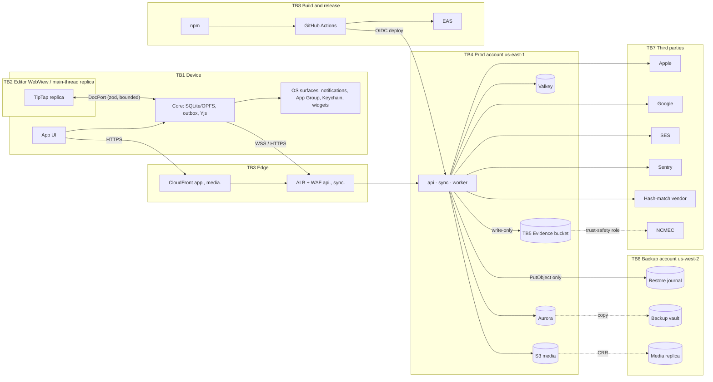
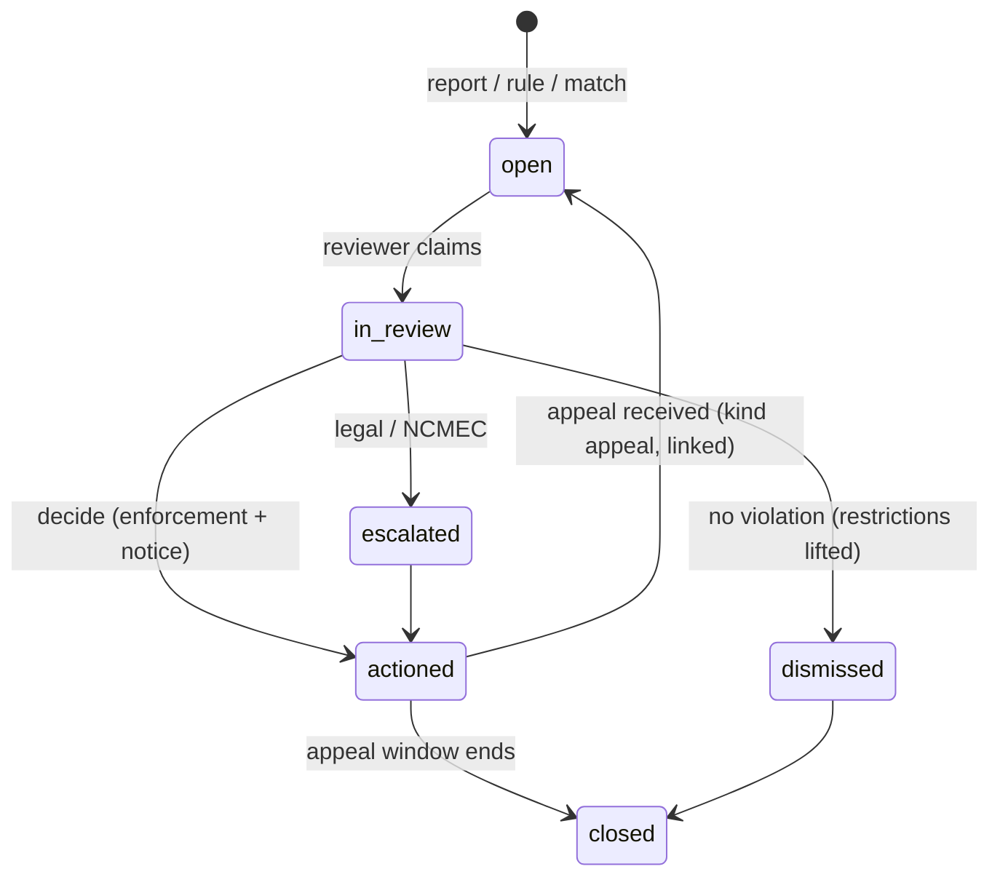
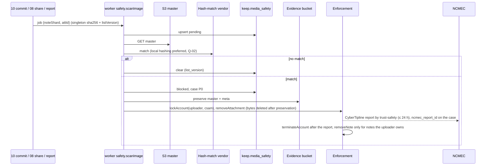

# 15 · Security, privacy and compliance

*Detail design · elaborates spine v1.2 · 2026-10-04 · Status: draft for review*

## 1. Purpose and scope

This document is the security and privacy contract of the Keep clone. An engineer should be able to build, review and audit the following from it:

- the **threat model** for the client device, the web app, the editor WebView bridge, the sync server, data stores and cloud accounts, and the supply chain, with the control that answers each threat and the residual risks we accept (§4, §5);
- the **security baseline** of X-16 made concrete: TLS policy, key and secret inventory, IAM boundaries, web headers, mobile hardening, WebView intent rules, SSRF egress, untrusted archive parsing, operator and break-glass access, supply-chain controls (§6);
- **privacy-safe telemetry** (X-01) and the content-hygiene checks of X-20 (§7);
- **data classification and the retention table**, plus the erasure-coverage audit of 13's purge-hook registry (X-06) (§8);
- **GDPR and CCPA flows**: lawful bases, the rights matrix, the P-29 export format and builder, the compliance view of P-25 erasure, legal holds, people without an account, the privacy-request log and breach response (§9);
- the **subprocessor list** (§10);
- **abuse operations and content safety** (D-50): signals, rules, cases, evidence, enforcement, CSAM hash matching with NCMEC reporting, URL reputation, signup hardening, email reputation (§11);
- **App Store, Google Play and web compliance checklists**, including SIWA revocation, the Play web deletion URL and the Data safety form (§12);
- the **pen-test and security verification plan** (§13).

### Out of scope

| Topic | Owner |
|---|---|
| Sessions, JWTs, device registration, the account-deletion saga mechanics, SIWA code exchange and revocation code, export authentication and link policy | `12-identity-and-devices.md` |
| `authz` predicates, invites, caps, contacts, blocks, `sharing.report`, the abuse-signal emitter and `share_restrictions` enforcement | `08-sharing-and-authz.md` |
| Physical DDL, purge-hook registry API, deletion ledger, restore journal, backups and restore runbook | `13-data-platform.md` |
| Upload pipeline, renditions, `media.urls`, ownership transfer, link-preview unfurl service | `10-media.md` (this doc sets the safety hooks and the SSRF policy it must meet) |
| Exact CSP header text, service worker, PWA prompt | `06-web-app.md` (this doc sets the minimum, §6.4) |
| Native modules, Keychain plumbing, backup-exclusion manifests, attestation native module | `07-mobile-app.md` (this doc sets requirements, §6.5) |
| Push payload schema and NSE | `09-reminders-and-push.md` (verified here, §7.4) |
| CDK stacks, WAF rules as code, alarm routing, log-group creation | `14-infra-and-operations.md` (this doc sets the policy, §6.3, §15) |
| Simulator and E2E harness | `16-verification.md` (consumes §17) |
| Legal text of the privacy policy and terms | Counsel; this doc lists what they must say (§9.9) |

## 2. Spine references

**Elaborated:** D-50, X-01, X-06, X-16, X-20, P-25 (compliance view; 12 owns the mechanics), P-29 (export format and builder; 12 owns authentication and links).

**Relied on:** A-09, A-10, A-11; §1.3 (Erasure, Region loss); INV-4, INV-5, INV-8, INV-9, INV-12, INV-13, INV-14, INV-18; D-06, D-25, D-28, D-32, D-36 to D-42, D-44, D-45, D-46, D-47, D-49; P-12 to P-16, P-24, P-26, P-28, P-30; X-03, X-05, X-08, X-11, X-12, X-14; T-07, T-11, T-16; R-06, R-09, R-10, R-14; Q-02, Q-03, Q-09; C-27, C-31, C-35, C-67, C-74, C-76, C-80, C-82, C-84 to C-92.

Section numbers below are this document's. Sibling sections are written "12 §12.4".

## 3. Interfaces

### 3.1 Owned here

| Interface | Section | Consumers |
|---|---|---|
| `@keep/export`: `ExportManifestV1`, `ExportNoteV1`, `UnsyncedExportV1`, renderers; worker job `export.build` | §9.3, §9.4 | 12 (job, account switch), 04 (`collectUnsynced`), P-30 importer (round trip) |
| `ContentSafety`, `HashMatchProvider`, `UrlReputation`; table `keep.media_safety`; SQL fragment `MEDIA_SAFETY_SERVABLE` | §11.6, §11.7 | 10 (`media.commit`, `media.urls`, unfurl), 08 (share trigger), 13 (DDL) |
| `recordSafetySignal()` and `SafetySignalKind` (same table as 08's signals) | §11.1 | 03, 10, 12 |
| Tables `directory.abuse_cases`, `account_enforcement`, `legal_holds`, `privacy_requests`, `breakglass_audit` | §6.9, §9.6, §9.8, §11.3, §11.5 | 13 adopts; 12 reads `account_enforcement` |
| `EnforcementActions` | §11.5 | `kspctl abuse`, the rules job |
| `abuse.preserve` job and the evidence bucket layout | §11.4 | 08 enqueues |
| `AttestationVerifier`, `DisposableDomains` | §11.8 | 12 (signup hook points) |
| Purge hooks `vendors.erase` (account) and `media_safety.delete` (note) | §8.4 | 13 registry |
| `RETENTION_RULES`, `DataClass` | §8.3 | 13 and 14 (CI coverage) |
| `@keep/hygiene`: `LOG_ATTRS`, `scrubSentryEvent` | §7 | every service and client |
| Requirements: web headers (→ 06), mobile hardening (→ 07), WebView intent rules (→ 05, 07), SSRF egress (→ 10), archive parsing (→ P-30 importer), IAM and account guardrails (→ 14) | §6 | named docs |
| Subprocessor list, compliance checklists, pen-test plan | §10, §12, §13 | release process, 14 |

### 3.2 Consumed

| Owner | What this doc uses |
|---|---|
| 08 | `AbuseSignal` and `directory.abuse_signals`, `abuse_reports`, `share_restrictions` (§5.3, §15); `sharing.report` (§9.6); `emailHmac()` and its pepper (C-92); `USER_NOTE_VISIBLE_U`; `MemberChip`, `maskEmail` (§4.8); system ops for removals |
| 12 | `AccountDeletionSaga` (§12.9), `directory.data_export`, `account_deletion` (§15.1), `IdentityDirectory` (§11.6), `revokeSessions` (§7.2), the security log (§18), the attestation and disposable-domain hook points (§4.3), export authentication (§13) |
| 13 | `PurgeHook` registry and coverage test (§8.5), `DeletionLedger`, journal content rule (§8.2), backup retention (§7) |
| 03 | `purgeNoteById(noteId, 'admin')` (§6.8), the ingress-outlier signal (§5.6), `keep.note_updates_r` |
| 10 | `media.commit`, `media.urls`, `attachments.status`, renditions, unfurl pipeline |
| 01, 05 | Projector and `viewFromBytes`; `sanitizeHref` (05 §4.4); DocPort validation bounds (05 §6.10); editor bundle CSP (05 §7.7) |
| 04 | `LocalAccountStore.collectUnsynced()` (04 §14.5) |
| 02 | `TelemetryBatchV1` (02 §19) |

## 4. Assets, attackers and trust boundaries

| Asset | Why it matters |
|---|---|
| A1 Note content (text, images, OCR, URLs, labels, reminders) | The product. Server reads it (A-10), so the server is in the trust base |
| A2 Credentials (sessions, JWTs, device tokens, SIWA tokens, OTPs, invite tokens, export links) | Account takeover |
| A3 Sharing graph and email addresses | Spam, enumeration, harassment |
| A4 Integrity of acked edits | INV-2, INV-4, INV-12: nothing a user typed is lost |
| A5 Truth of erasure and revocation | X-06, INV-13, D-45 |
| A6 Keys, secrets, backup account | Blast radius of any compromise |
| A7 Release pipeline (CI, EAS, npm) | Code that reaches every device |

| Attacker | Capability |
|---|---|
| T1 Internet stranger | Unauthenticated HTTP/WS, can sign up |
| T2 Spammer or phisher | Many accounts, scripted sharing |
| T3 Malicious collaborator | Active writer: arbitrary Yjs updates into a shared doc |
| T4 Revoked collaborator | Old device state, stale credentials |
| T5 Device thief | Physical access, maybe unlocked |
| T6 Hostile app or web page on the same device | Sandbox-limited; reads shared OS surfaces |
| T7 Network attacker | Wi-Fi, captive portals, TLS interception attempts |
| T8 Compromised dependency or build input | Code execution in CI, server or client |
| T9 Malicious or compromised operator | Engineer credentials |
| T10 Compromised prod AWS role | API calls as `api`, `sync` or `worker` |



## 5. Threat model

### 5.1 Method

STRIDE per trust boundary. Each threat has an ID (`TM-<area><n>`) that §13's pen-test cases and §17's tests cite. **Residual** is the rating after controls: **Low** (accepted, no tracking), **Med** (accepted, tracked in §5.9), **High** (not accepted; blocks the milestone named).

### 5.2 Client device (TB1)

| ID | Threat | Controls | Residual |
|---|---|---|---|
| TM-C1 | Thief reads notes from an unlocked or unlockable device | OS data protection (`CompleteUntilFirstUserAuthentication`, D-06); remote session revocation (12 §5.6) moves the device to `SESSION_EXPIRED`, which keeps data by design (D-41) | Med (RR-7) |
| TM-C2 | OS backup, device transfer or a copied profile clones sync identity | DB and token files excluded from backup and device transfer (D-06, C-84); rotating continuity token, `4409 DEVICE_FORKED` (D-42, INV-18) | Low |
| TM-C3 | Another app reads note data | App sandbox; App Group holds only the reminder-titles file (P-28 gate) and, from M4, widget snapshot and inbox (content only with the widget setting) (X-20, D-38) | Low |
| TM-C4 | Lock screen or push provider sees content | APNs and FCM payloads carry IDs only; Web Push is RFC 8291-encrypted and drops the title under P-28 (X-20, D-37) | Low |
| TM-C5 | Shared web computer keeps notes after use | Sign-out wipes OPFS, cached blobs and armed notifications (spine §5.6); session cookie `HttpOnly`, host-only | Med (RR-7) |
| TM-C6 | A second account drains the first account's outbox | DB bound to one `user_id`; `ACCOUNT_MISMATCH` (INV-18, 12 §10.4) | Low |
| TM-C7 | Reinstall inherits a Keychain session | Fresh-install hygiene (C-91) | Low |
| TM-C8 | Device token stolen from Keychain or Keystore | Push-only scopes, no reads, cascades with its session (C-85) | Low |
| TM-C9 | Malicious OTA update reaches every device | EAS Update code signing with a key kept outside EAS; publishing only from CI (§6.10) | Low |
| TM-C10 | Malware on a rooted or jailbroken device | Out of scope for v1; attestation only at signup (§11.8) | Med (RR-7) |

### 5.3 Web app (TB1, TB3)

| ID | Threat | Controls | Residual |
|---|---|---|---|
| TM-W1 | Stored XSS through note content | React text escaping; ProseMirror schema parsing; `sanitizeHref` at parse, render and click (05 §4.4); INV-9 gate keeps unknown structures away from the binding; CSP without `unsafe-inline` or `unsafe-eval` and Trusted Types (§6.4) | Low |
| TM-W2 | XSS or tracking through link previews | Preview title and site rendered as text; preview images re-encoded and served from `media.` (D-40); unfurl SSRF policy (§6.7) | Low |
| TM-W3 | CSRF on `/api` | `SameSite=Lax`, `Origin` check, required `X-KS-Client` header, no CORS (12 §3.3) | Low |
| TM-W4 | Clickjacking | `frame-ancestors 'none'` | Low |
| TM-W5 | Session theft via XSS | Session cookie `HttpOnly`; JWT held only in the DB Worker's memory, 12–18 min (D-41) | Low |
| TM-W6 | Third-party script compromise | No third-party scripts or fonts; Sentry SDK bundled; `connect-src` allowlist (§6.4) | Low |
| TM-W7 | Reverse tabnabbing and referrer leaks from note links | `rel="noopener noreferrer nofollow ugc"`; `window.open(…, 'noopener,noreferrer')` (05 §4.4) | Low |
| TM-W8 | Stale or poisoned service worker | Same-origin SW served `no-cache`; hashed immutable assets; prompt updates; monotonic `BUILD_NUMBER` (D-49, C-57) | Low |

### 5.4 Editor WebView bridge (TB2, D-50)

| ID | Threat | Controls | Residual |
|---|---|---|---|
| TM-B1 | A collaborator's doc content executes script in the WebView | Schema rendering; `href` re-sanitized at render; INV-9 (a)(b)(c) gate before the binding (C-60); WebView CSP `default-src 'none'; script-src 'self'`; Trusted Types on Android WebView (05 §7.7) | Low (iOS without TT: RR-13) |
| TM-B2 | Script in a compromised WebView abuses intents (`deleteForever`, `createLabel`, `openUrl`, `openNote`) | Native validates every intent against the current load and confirms destructive ones natively (§6.6) | Low |
| TM-B3 | Exfiltration from the WebView | `connect-src 'none'`, `img-src https://media.<domain> data:`, navigation denied, no new windows; no credentials or tokens cross the bridge (signed media URLs only) | Low |
| TM-B4 | Malformed or oversized bridge frames | zod on both sides with size bounds; 3 bad frames in 10 s remount the replica (05 §6.10) | Low |
| TM-B5 | WebView reads local files | No file access, no local URL scheme; offline images arrive as bounded data URIs of ≤ 1,024 px renditions (C-67) | Low |

### 5.5 Sync protocol and server (TB3, TB4)

| ID | Threat | Controls | Residual |
|---|---|---|---|
| TM-S1 | IDOR: read or subscribe to another user's note | `authz` read checks on `DOC_SUB`, `DOC_FETCH`, `/sync/docs`, `media.urls`; fixture matrix at every enforcement point (D-28) | Low |
| TM-S2 | Revoked writer keeps writing | In-transaction check after the lock (INV-5) | Low |
| TM-S3 | Pending recipient obtains content | Card-only rows, enforced by relay, serializers and database CHECKs (P-15, C-34) | Low |
| TM-S4 | JWT forgery, replay or lifetime abuse | EdDSA via JWKS, 12–18 min, lifetime guard, per-sid denylist (12 §6) | Low |
| TM-S5 | Session token theft | Rotation with reuse detection (C-90); durable revocation (C-89) | Low |
| TM-S6 | Account enumeration (OTP, deletion page, share dialog) | Constant responses (12 §12.7); silent slots (C-74); `share.invite` padding (08 §11.3) | Low |
| TM-S7 | OTP brute force | 3 attempts per code, per-email and per-IP limits (12 §17) | Low |
| TM-S8 | Volumetric or protocol DoS | Handshake admission, per-connection buckets, ingress pacing, send-buffer caps (spine §5.12); WAF rate rules (§6.3) | Med |
| TM-S9 | CRDT bomb: undecodable or enormous updates | 256 KB frames, 4 MB `/push`; `4400 BAD_UPDATE` (C-21); 2 MB doc limit enforced by editors and `over_limit` flagging (P-12); ingress pacing; per-task memory limits and an alarm on very large decoded docs in the compactor (03) | Low |
| TM-S10 | Image decompression bombs and polyglots | Input ≤ 10 MB and ≤ 25 MP, magic bytes, re-encode by sharp, no SVG (P-13, D-40) | Low |
| TM-S11 | SSRF through link unfurl | Egress policy (§6.7) | Low |
| TM-S12 | Presigned upload abuse (overwrite, wrong type, size) | Per-uploader keys, `content-length-range`, pinned type, checksum (D-39) | Low |
| TM-S13 | Media still reachable after revocation | 15-minute signed URLs (D-39) | Med (RR-2) |
| TM-S14 | Export link leak | Step-up, 15-minute URL, 20 mints, never emailed (12 §13) | Low |
| TM-S15 | Invite token theft | Claim requires a matching verified email (P-15) | Low |
| TM-S16 | Purged note or account resurrected by a restore | Journal and ledger replay (D-45, INV-13, C-27) | Low |
| TM-S17 | SQL injection | Parameterized SQL only; semgrep rule (§13.1) | Low |
| TM-S18 | Content leaks into logs, traces or Sentry | §7 allowlist, scrubber and lints | Low |
| TM-S19 | Malicious Takeout archive (zip slip, bombs) | §6.8 | Low |
| TM-S20 | Push token re-registered across accounts | Dedupe on `device.update` (12 §9.8) | Low |
| TM-S21 | Valkey injection or eavesdropping | Private subnet, TLS in transit, AUTH; Valkey is never a source of truth (D-25) | Low |

### 5.6 Sharing and abuse (TB4)

| ID | Threat | Controls | Residual |
|---|---|---|---|
| TM-A1 | Spam or phishing by share-by-email | Card-only pending inbox, verified sharer, sender and recipient caps, never-email, minimal emails, suppression (P-15, P-16, C-80); rules (§11.2) | Med |
| TM-A2 | CSAM distribution through shared notes | Hash matching with a serving gate, evidence, NCMEC report, account lock (§11.6) | Med until Q-02 closes (sharing GA blocked) |
| TM-A3 | Harassment by repeated shares | Block, 30-day decline cooldown, recipient cap (P-16) | Low |
| TM-A4 | Account farming | Disposable-domain blocklist, attestation from M4, new-account caps (§11.8) | Med (RR-5) |
| TM-A5 | Malicious collaborator destroys content | Version snapshots (P-26); owner removes the writer | Med (RR-11) |
| TM-A6 | Phishing URLs in shared notes | Web Risk checks, unsafe-link warning (§11.7) | Low |

### 5.7 Data stores, backups and cloud accounts (TB4, TB6)

| ID | Threat | Controls | Residual |
|---|---|---|---|
| TM-D1 | Prod credential compromise | Least-privilege task roles, SCPs, GuardDuty, no long-lived keys (§6.3) | Med |
| TM-D2 | Compromised prod role deletes replica versions | Narrow cross-account role, CloudTrail volume alarm (C-35, 13 §7.3) | Med (RR-3) |
| TM-D3 | Backup exfiltration or deletion | Separate account, backup-account CMK, Vault Lock compliance, Object Lock journal (D-45, 13 §7) | Low |
| TM-D4 | Operator reads note content | No standing content access; break-glass audited (§6.9) | Low |
| TM-D5 | Personal data written into the immutable journal | Content allowlist before PUT (13 §8.2) | Low |
| TM-D6 | Directory restore revives revoked sessions | Restore deletes every session and device token (C-31) | Low |
| TM-D7 | KMS key deletion as ransom | SCP denies `kms:ScheduleKeyDeletion` outside break-glass; 30-day waiting window; alarm | Low |

### 5.8 Supply chain and release (TB8)

| ID | Threat | Controls | Residual |
|---|---|---|---|
| TM-X1 | Malicious npm release (worm, typosquat) | Lockfile, `minimumReleaseAge` 3 days, lifecycle scripts blocked except an allowlist, registry signature check, new-dependency review (§6.10) | Med |
| TM-X2 | Compromised GitHub Action | Actions pinned by commit SHA; least-privilege `GITHUB_TOKEN`; OIDC to AWS with environment approval | Low |
| TM-X3 | Poisoned base image | Digest-pinned base, ECR scanning, signed images verified at deploy | Low |
| TM-X4 | EAS account takeover | 2FA, publishing only from CI, update code signing (§6.10) | Low |
| TM-X5 | Auth library behavior change (Better Auth owned by Vercel) | Pinned versions behind `IdentityAdapter` (R-12, 12 §4.4) | Low |
| TM-X6 | Secret committed to the repo | gitleaks pre-commit and CI; secrets only in Secrets Manager | Low |

### 5.9 Accepted residual risks

Each row is reviewed quarterly at the security review (§13.5) by the engineer who owns that area.

| ID | Risk | Why accepted | Bound | Revisit when |
|---|---|---|---|---|
| RR-1 | A revoked or offline device keeps its local copy | Inherent to local-first (spine §5.7 step 5) | Until the device reconnects | Never |
| RR-2 | A signed media URL works ≤ 15 min after revocation | Cost of CDN delivery | 15 min (D-39) | — |
| RR-3 | A compromised prod purge role can delete media replica versions (C-35) | Erasure must reach the replica (X-06) | `DeleteObjectVersion` on `b/*`, `v/*` only; CloudTrail alarm at 10× baseline | T-11 |
| RR-4 | Plaintext session tokens if 12's gate G2 fails (Q-12.5) | Fallback keeps auth working | `session` readable only by the `auth` DB role; rotation off | M0 result |
| RR-5 | Web signups carry no attestation | No privacy-friendly web attestation without a new vendor | Per-IP limits, disposable blocklist, new-account caps | Abuse data (Q-15.11) |
| RR-6 | The restore journal keeps IDs and email HMACs for 400 days under compliance lock | Erasure must survive restores (D-45) | No content, no addresses (13 §8.2) | — |
| RR-7 | Local data is protected only by the OS; OPFS is unencrypted | Background work needs the DB after first unlock | Sign-out wipe; remote revocation | Locked notes (A-10) |
| RR-8 | The server reads content | No E2EE in v1 (A-10) | Break-glass only (§6.9) | Locked notes |
| RR-9 | Server-side Sentry events cannot be deleted per user | Vendor capability (Q-15.1) | ≤ 90 days retention; pseudonymous IDs only | Q-15.1 |
| RR-10 | Security log keeps IP addresses 1 year after erasure | Security and fraud (Art. 6(1)(f), 17(3)(e)) | Security role only | — |
| RR-11 | A collaborator can copy, screenshot or destroy shared content | Inherent to sharing | Version snapshots 30 days (P-26) | — |
| RR-12 | Evidence store is single-region | Cost; NCMEC already holds reported content | Region loss only | — |
| RR-13 | iOS WKWebView may not enforce Trusted Types (Q-15.9) | Platform | CSP `script-src 'self'` still applies | Q-15.9 |
| RR-14 | ALB to task traffic is plaintext HTTP inside private subnets | Simplicity on Fargate | Security groups allow only ALB → task | T-07 |

## 6. Security baseline (X-16)

### 6.1 Transport

| Hop | Policy |
|---|---|
| Viewer → CloudFront (`app.`, `media.`) | Minimum `TLSv1.2_2021`; TLS 1.3 negotiated when the client offers it (see SI-15-1, Q-15.2) |
| Client → ALB (`api.`, `sync.`) | `ELBSecurityPolicy-TLS13-1-2-Res-2021-06` (TLS 1.3, plus TLS 1.2 with ECDHE and AEAD only) until SI-15-1 resolves; then a TLS 1.3-only policy. Policy names verified in M0 |
| HSTS | `max-age=63072000; includeSubDomains; preload` on every host; apex submitted to the preload list at M2 |
| Mobile | iOS ATS with no exceptions. Android `network_security_config`: `cleartextTrafficPermitted="false"`, system CAs only in release builds |
| Service → Aurora | `rds.force_ssl=1` (13 §1.4); clients use `sslmode=verify-full` with the RDS CA bundle |
| Service → Valkey | In-transit encryption and AUTH |
| Service → S3, KMS, SES, Secrets Manager | SDK over TLS; every bucket policy denies `aws:SecureTransport = false` |
| ALB → task | HTTP inside private subnets (RR-14) |
| Email | SES opportunistic TLS; MTA-STS and TLS-RPT on `mail.<domain>`. Emails never carry note content (08 §8.3) |
| Certificate pinning | **Not used.** Rotation risk outweighs the benefit with ATS and HSTS in place |

### 6.2 Keys and secrets

Production and staging are separate AWS accounts (14), so every key below exists per environment.

| Key or secret | Purpose | Store | Usable by | Rotation | If compromised |
|---|---|---|---|---|---|
| `alias/keep-<env>-aurora` | Aurora storage | KMS | RDS | Annual (automatic) | Re-encrypt via snapshot copy |
| `alias/keep-<env>-media` | S3 SSE-KMS with Bucket Keys | KMS | `api` (encrypt), `worker`, CloudFront OAC | Annual | — |
| `alias/keep-<env>-invite-email` | `email_enc` (08 §8.1) | KMS | `api`/`sync` GenerateDataKey; `worker` Decrypt with context | Annual | Addresses of live invites exposed |
| `alias/keep/siwa-tokens` | SIWA refresh tokens (12 §12.5) | KMS | `api` encrypt; `worker` decrypt with context | Annual | Revoke and recapture at next sign-in |
| `alias/keep-<env>-evidence` | Evidence bucket (§11.4) | KMS | `worker` GenerateDataKey only; `trust-safety` Decrypt | Annual | Evidence exposure; incident |
| `alias/keep-<env>-logs` | CloudWatch log groups | KMS | CloudWatch | Annual | — |
| Backup-account CMKs | Vault, journal (13 §7) | KMS (backup account) | Backup service; `keep-restore` | Annual | — |
| `BETTER_AUTH_SECRET` | Cookie signing; JWKS key encryption | Secrets Manager | `api` | On compromise only (12 FM-26 runbook) | Revoke all sessions |
| JWKS signing keys | KSP JWTs | DB, plugin-encrypted | `api` | 30 days (12 §6.6) | Emergency rotation |
| CloudFront signing key group | Media and export signed URLs | Secrets Manager | `api` | 90 days, two keys overlap | Rotate; URLs live ≤ 15 min |
| APNs `.p8`, FCM service account, VAPID private key | Push (D-37) | Secrets Manager | `worker` | Yearly or on staff change | Revoke at Apple or Google; re-subscribe Web Push |
| SIWA `.p8`, Google OAuth client secret | Sign-in | Secrets Manager | `api`, `worker` | Yearly | Rotate in developer consoles |
| Email pepper (08, C-92) | `emailHmac` | Secrets Manager | `api`, `sync`, `worker` | Only via 08's `hmac_v` procedure | HMACs become dictionary-attackable (08 FM-16) |
| `K_unsub` (08 §8.7), rate-limit HMAC key (12 §17), telemetry HMAC key (§7) | Signatures and pseudonyms | Secrets Manager | as named | Yearly, two-value overlap | Re-issue |
| Edge secret (12 §3.3) | CloudFront → ALB trust | Secrets Manager | CloudFront, `api` | Quarterly | WAF rule limits blast radius |
| DB role passwords | Services → Aurora | Secrets Manager | per role (13 §1.2) | 30 days, managed rotation | Rotate |
| Hash-match vendor, Web Risk, Play Integrity, CyberTipline credentials | §11 | Secrets Manager | `worker` | Per vendor, ≥ yearly | Revoke at vendor |
| EAS Update code-signing private key | §6.10 | GitHub Actions environment secret (prod), offline backup | Release workflow | 2 years | Ship a new certificate in a store build |

Rules: no secret in environment files, images or the repo; services read Secrets Manager at start and every 10 min; every secret has an owner and a rotation runbook in `kspctl secrets`.

### 6.3 IAM boundaries and account guardrails (requirements on 14)

| Principal | Allowed | Explicitly not allowed |
|---|---|---|
| `api` task role | Presign POST on `b/*` and `i/*`; KMS GenerateDataKey (media, invite-email, siwa encrypt); SES `SendEmail` (OTP); its secrets | KMS Decrypt on invite-email, evidence; any S3 delete |
| `sync` task role | KMS GenerateDataKey (invite-email); its secrets | S3; SES |
| `worker` task role | S3 Get/Put/Delete on media prefixes; PutObject on the journal bucket (cross-account); assume the replica-purge role; KMS Decrypt with encryption context (invite-email, siwa); PutObject on the evidence bucket; SES; push and vendor secrets | Evidence read; journal delete |
| `unfurl` task role (M4) | None beyond logs | Every AWS API |
| `deploy` (GitHub OIDC, `environment: prod`) | ECR push, ECS update, CDK deploy via a scoped CloudFormation execution role | IAM user creation; KMS key deletion |
| `trust-safety` (human, MFA, 1 h) | Evidence bucket read and decrypt; `abuse_cases` write | Primary data |
| `breakglass` (human, MFA, 1 h, ticket tag) | `rds-db:connect` as `keep_breakglass` (§6.9) | Write access |

**Organization SCPs** on prod and backup accounts: deny `cloudtrail:StopLogging`/`DeleteTrail`; deny regions other than us-east-1 and us-west-2 (global services excepted); deny `kms:ScheduleKeyDeletion` and `kms:DisableKey` except the break-glass role; deny changes to Object Lock and Vault Lock configuration; deny `organizations:LeaveOrganization`; deny root user actions. **Detective controls:** an organization CloudTrail with log-file validation into a separate log bucket (1 year), S3 data events on the journal, evidence and replica buckets, GuardDuty in both regions, IAM Access Analyzer. Root users have hardware security keys and no access keys.

**WAF** on the ALB (14): AWS managed common and known-bad-inputs rule groups in count mode for 2 weeks, then block; a coarse flood rule of 10,000 requests per 5 min per source IP for `api.` requests that do not carry the edge secret (native traffic; it sits above 12's per-endpoint limits, which stay authoritative, including the NAT-friendly `/ks/token` limit); the edge-secret rule (12 §3.3). Web traffic reaches the ALB from CloudFront addresses, so its per-IP limits are 12's application limiter.

### 6.4 Web headers (minimum; 06 owns the header text)

```text
Content-Security-Policy:
  default-src 'none';
  script-src 'self' 'wasm-unsafe-eval';            # sqlite-wasm needs WebAssembly compilation (D-04)
  worker-src 'self';
  style-src 'self';                                # 06 may add 'unsafe-inline' for styles only, with a written reason
  img-src 'self' data: blob: https://media.<domain>;
  media-src https://media.<domain> blob:;
  font-src 'self';                                 # no third-party fonts
  connect-src 'self' wss://sync.<domain> https://<upload-bucket-endpoint> https://<sentry-ingest-host>;
  manifest-src 'self';
  frame-src 'none'; frame-ancestors 'none'; object-src 'none'; base-uri 'none'; form-action 'self';
  require-trusted-types-for 'script'; trusted-types keep-editor-paste;   # plus any policy 06 lists by name
  upgrade-insecure-requests;
  report-to csp
Strict-Transport-Security: max-age=63072000; includeSubDomains; preload
X-Content-Type-Options: nosniff
Referrer-Policy: strict-origin-when-cross-origin
Permissions-Policy: camera=(), microphone=(), geolocation=(), payment=(), usb=()
Cross-Origin-Opener-Policy: same-origin
Cross-Origin-Resource-Policy: same-origin          # app assets
```

- `media.` responses carry `X-Content-Type-Options: nosniff`, the exact raster `Content-Type`, and `Cross-Origin-Resource-Policy: cross-origin`: the editor WebView's document is not same-site with `media.`, so a stricter value would block its images. Signed URLs are the access control.
- `report-to` targets Sentry's security endpoint; violations are counted by directive (§15).
- No `default` Trusted Types policy exists; 05's `keep-editor-paste` is the only HTML sink.
- Strictly necessary storage only (session cookie, OPFS, Cache Storage), so no consent banner (§12.4).

### 6.5 Mobile hardening (requirements on 07)

| Item | Requirement |
|---|---|
| Storage | DB, session and device-token files excluded from iCloud backup and Android cloud backup and device transfer (D-06, C-84); Keychain items `AfterFirstUnlockThisDeviceOnly`; Android Keystore-wrapped keys |
| Transport | §6.1 |
| Deep links | Universal links and App Links only (`apple-app-site-association`, `assetlinks.json`); no custom-scheme OAuth callbacks; invite tokens stay in the URL fragment (08 §8.3) |
| Logging | `console.*` stripped from release bundles; no logging of request bodies (§7) |
| Debugging | `webviewDebuggingEnabled` and Hermes inspector only in dev builds (05 §7.7); `android:debuggable=false` in release |
| Exported components | Only the launcher activity, App Links, notification-action receivers (permission-guarded) and widget providers |
| Clipboard | No automatic clipboard reads; paste only on user action (05 §4.5) |
| Screenshots | Allowed (notes app); no `FLAG_SECURE` |
| Photo access | Android Photo Picker and iOS `PHPicker`; never `READ_MEDIA_IMAGES` or full-library access (§12.3) |
| Updates | EAS Update code signing enforced (`codeSigningCertificate` in app config); unsigned updates rejected |

### 6.6 WebView intent rules (requirements on 05 and 07; web host in 06 applies the same rules)

Native treats every `EditorIntent` (05 §6.3) from the WebView as untrusted input:

| Intent | Native rule |
|---|---|
| Any intent | Must carry the current `loadId`; dropped otherwise. ≤ 20 intents/s per session; excess dropped with telemetry |
| `openUrl` | Re-validate with `isAllowedScheme` (http, https, mailto); ≤ 1 per 2 s; open in the system browser or an in-app browser that shares no cookies with the app |
| `openImage`, `refreshMedia` | `attachmentId` must exist in the current note's doc |
| `applyLabel`, `removeLabel` | `labelId` must be one of the user's labels; scoped to the current note |
| `createLabel` | Name passes 01's label validation (P-05); ≤ 5 per minute; cap 50 enforced by the core |
| `openNote`, `resolveNoteLinks` | IDs must be notes the device holds with an active membership; others resolve to "Note unavailable" |
| `action: deleteForever`, `makeCopy`, `splitNote` | Always a **native** confirmation dialog before any op is queued |
| `pasteImage` | Native reads the clipboard itself; nothing from the WebView |
| `switchHost`, `converted`, `limitHit`, `announce`, `close` | UI only; no data effects |

No intent may carry credentials, file paths or arbitrary URLs other than `openUrl.href`. New intents need a row in this table before they ship (review checklist).

### 6.7 SSRF egress policy (requirements on 10)

The unfurl fetcher (M4, D-50) runs as its own task in an egress-only subnet with no AWS permissions and no route to the VPC CIDR.

- Schemes http and https; ports 80 and 443 only.
- Resolve once per hop, connect to the resolved address, re-check after each redirect; ≤ 3 redirects; 3 s total; 1 MB body; `text/html` only for pages and raster `image/*` for preview images (then re-encoded by sharp).
- Deny every address in: 0.0.0.0/8, 10.0.0.0/8, 100.64.0.0/10, 127.0.0.0/8, 169.254.0.0/16, 172.16.0.0/12, 192.0.0.0/24, 192.0.2.0/24, 192.88.99.0/24, 192.168.0.0/16, 198.18.0.0/15, 198.51.100.0/24, 203.0.113.0/24, 224.0.0.0/4, 240.0.0.0/4; ::/128, ::1/128, 64:ff9b::/96 and ::ffff:0:0/96 (unwrapped and re-checked), 100::/64, 2001:db8::/32, fc00::/7, fe80::/10, ff00::/8; the VPC CIDR; `fd00:ec2::254`.
- Literal IPs in decimal, octal or hex forms are normalized before checking. IDNs are resolved via punycode.
- No cookies, no `Authorization`, fixed User-Agent, no conditional caching headers.
- Never fetch "token-looking" URLs: a query key matching `/^(token|key|sig|signature|auth|code|session|access_token|password)$/i`, or any path or query segment of ≥ 32 characters from `[A-Za-z0-9_-]` that mixes upper case, lower case and digits (lower-case slugs pass).
- Every URL passes `UrlReputation.check` (§11.7) before the first fetch; an unsafe URL is never fetched.
- Per user 60 fetches/h; per registrable domain 10/min across users.

### 6.8 Untrusted archives (Takeout import, P-30)

The importer (owner unassigned, SI-15-5) must:

- accept uploads by presigned POST to `i/{shard}/{userId}/{importId}.zip`, ≤ 2 GB;
- parse as a stream without extracting to disk; reject absolute paths, `..` segments, backslashes, symlinks and device entries; NFC-normalize paths;
- stop at 50,000 entries, 10 GB total uncompressed, or a per-entry compression ratio above 100:1;
- read only `Takeout/Keep/*.json` and the attachments they reference; ignore the HTML files;
- parse each JSON file only if ≤ 2 MB; validate with a strict zod schema; drop unknown fields;
- send attachments through the normal media pipeline (P-13 limits, re-encode);
- delete the archive when the import finishes, and at 7 days at the latest (lifecycle rule).

### 6.9 Operator access and break-glass

There is no standing access to content. Engineers have no SSH or ECS Exec in prod; database sessions go through SSM port forwarding with IAM authentication and are logged. The `keep_ro` role (13 §1.2) loses `SELECT` on every content column (cross-doc issue 9); content is readable only by a new role `keep_breakglass` (`NOLOGIN` except during an approved session, `default_transaction_read_only = on`, `log_statement = 'all'`; X-01's `log_parameter_max_length = 0` still applies).

```sql
CREATE TABLE directory.breakglass_audit (
  id            uuid        PRIMARY KEY,                       -- UUIDv7
  operator      text        NOT NULL,                          -- IAM principal
  approver      text,                                          -- second engineer; NULL only for P0 self-approval
  ticket        text        NOT NULL,                          -- support or case reference
  reason        text        NOT NULL CHECK (reason IN ('support_consent','abuse_case','legal','incident')),
  scope_kind    text        NOT NULL CHECK (scope_kind IN ('note','user','evidence','cluster')),
  scope_id      text        NOT NULL,
  requested_at  timestamptz NOT NULL DEFAULT now(),
  approved_at   timestamptz,
  started_at    timestamptz,
  ended_at      timestamptz,
  reviewed_at   timestamptz,                                   -- mandatory within 24 h for self-approval
  reviewed_by   text,
  actions       jsonb       NOT NULL DEFAULT '[]'              -- [{at, op: enum, objectId}]; never content
);
```

Procedure (`kspctl breakglass`):
1. `request --ticket T --reason R --scope note:<id>` writes the row and emails every engineer.
2. `approve <id>` by a second engineer. Self-approval is allowed only for P0 abuse cases and declared incidents, and needs a review within 24 h.
3. `start <id>` assumes the `breakglass` IAM role (MFA, 1 h) and enables `keep_breakglass` for that session. Evidence-scope sessions use the `trust-safety` role instead.
4. Reads render text projections in the operator's terminal only, never to logs or tickets. Each read appends an `actions` entry.
5. `end <id>`, or the 1 h expiry, disables the role. A daily job alarms on rows without `ended_at` or overdue reviews.

`support_consent` requires the user's written consent in the ticket, scoped to named notes.

### 6.10 Supply chain

| Control | Setting |
|---|---|
| Lockfile | `pnpm install --frozen-lockfile` in CI; lockfile changes reviewed |
| Release age | Renovate `minimumReleaseAge: "3 days"` for npm; security updates may bypass with review |
| Install scripts | pnpm blocks lifecycle scripts by default; only the `onlyBuiltDependencies` allowlist (for example `sharp`, `esbuild`) may build |
| Registry integrity | `npm audit signatures` in CI; `pnpm audit --prod` fails on high and critical |
| New dependencies | dependency-cruiser (X-19) plus a checklist: maintainers, downloads, install scripts, licence, native code |
| SBOM | CycloneDX per image and per app build, attached to the release |
| Images | Base pinned by digest (`node:<lts>-bookworm-slim`); ECR enhanced scanning; images signed in CI (cosign with a KMS key) and verified by the deploy step |
| GitHub | Actions pinned by SHA; `permissions: read-all` default; OIDC to AWS; `prod` environment requires approval; branch protection, CODEOWNERS on `packages/authz`, `apps/server/src/identity`, `apps/server/src/safety`, CDK |
| EAS | 2FA for every member; robot token used only by the release workflow; update code signing key held in the GitHub `prod` environment, not in EAS |
| Secrets | gitleaks pre-commit and in CI |
| Vendored code | uWebSockets.js at T-07 is vendored with a pinned checksum (spine T-07) |

## 7. Privacy-safe telemetry and content hygiene (X-01, X-20)

**Logger allowlist.** Every structured logger (server and clients) drops unknown attributes at runtime and counts them; a lint rule fails CI on unknown keys at call sites.

```ts
// packages/hygiene/src/log-attrs.ts   (owner: 15; consumers: every service, 04, 06, 07)
export const LOG_ATTRS = new Set([
  'requestId', 'traceId', 'spanId', 'op', 'ccid', 'batchId', 'jobName', 'jobId', 'hook', 'phase', 'attempt',
  'code', 'why', 'outcome', 'reason', 'state', 'kind', 'status', 'httpStatus', 'method', 'route',   // route = template
  'userId', 'noteId', 'deviceId', 'sid', 'exportId', 'caseId', 'attId', 'shard', 'cluster',
  'seq', 'usn', 'epoch', 'memberEpoch', 'count', 'bytes', 'durationMs', 'lockWaitMs',
  'platform', 'appVersion', 'build', 'surface', 'emailHmac12',                 // 12 hex chars only
] as const);
/** Security log only (12 §18): adds these. */
export const SECURITY_LOG_ATTRS = new Set([...LOG_ATTRS, 'ip', 'country', 'userAgentFamily'] as const);
export const FORBIDDEN_KEY = /(token|nonce|secret|password|cookie|authorization|continuity|otp|email$|^name$|title|text|body|content|preview|url$|query|filename|payload|html|markdown|search)/i;
```

**Sentry scrubber** (client and server):

```ts
// packages/hygiene/src/sentry.ts
export function scrubSentryEvent(e: SentryEvent, side: 'client' | 'server'): SentryEvent | null {
  delete e.request?.data; delete e.request?.cookies; delete e.request?.query_string;
  if (e.request?.url) e.request.url = toRouteTemplate(e.request.url);        // /n/:noteId, never query or fragment
  e.request && (e.request.headers = pick(e.request.headers, ['user-agent']));
  if (side === 'client') delete e.user;                                       // client events carry no user, device or note IDs
  else e.user = e.user?.id ? { id: e.user.id } : undefined;                   // server: userId only (X-01)
  e.breadcrumbs = e.breadcrumbs?.filter(b => b.category === 'navigation' || b.category === 'ksp')
                                 .map(b => ({ ...b, message: undefined, data: pickAllowed(b.data) }));
  for (const ex of e.exception?.values ?? []) ex.value = scrubMessage(ex.value);   // keeps codes, drops quoted text
  e.extra = pickAllowed(e.extra); e.tags = pickAllowed(e.tags); e.contexts = pickContexts(e.contexts);
  for (const f of framesOf(e)) delete f.vars;
  return e;
}
// SDK options everywhere: sendDefaultPii: false, includeLocalVariables: false, attachScreenshot: false,
// attachViewHierarchy: false, replaysSessionSampleRate: 0, replaysOnErrorSampleRate: 0.
```

Correlation from a user report to a client crash uses the **support ID** shown in the app (the Sentry event ID, displayed with dead-letter rows and error screens), which the server logs next to `userId` for 30 days.

**CI lints** (fail the build): logger-key lint; semgrep rules for `innerHTML`, `dangerouslySetInnerHTML` (allowlisted only in 05's TT policy), string-built SQL, `console.log` in server code, `JSON.stringify(req|body|doc)` passed to a logger; 12's identity log lint (12 §20.4); the journal content fuzz (13 T13-08).

**X-20 checks** (§17): push payload schemas contain only IDs and enums (09's types, Web Push title excepted under P-28); the doc schema registry has no ID- or email-shaped keys (INV-8); the App Group reminder-titles writer follows P-28 only; widget snapshots contain content only with "Show note content in widgets".

## 8. Data classification and retention

### 8.1 Classes

| Class | Examples | App logs | Sentry | Metric labels | Restore journal | Push payloads | Storage rules |
|---|---|---|---|---|---|---|---|
| D0 Public | App bundles, JWKS public keys, marketing site | Yes | Yes | Yes | — | — | Integrity (signing) |
| D1 Operational | Counts, latencies, enums, flags, client SLIs | Yes | Yes | Enums only | — | — | — |
| D2 Pseudonymous | User, note, device IDs; sid; HLC; seq; email HMAC | Yes (HMAC truncated) | Server only | Never | Yes | IDs only | KMS at rest |
| D3 Personal | Email, name, avatar, IP, country, push token, contacts, blocks | Security log only: IP, country | Never | Never | Never | Never | KMS; envelope for `email_enc`; least privilege |
| D4 Content | Titles, text, items, images, OCR, URLs in notes, label names, reminder times, exports, drafts | Never | Never | Never | Never | Never (Web Push title unless P-28) | KMS; no standing operator access |
| D5 Secret | Tokens, keys, OTPs, invite tokens, signed URLs | Never | Never | Never | Never | Never | Secrets Manager, KMS, Keychain; hashed at rest when only verified |
| D6 Restricted | CSAM and abuse evidence, legal requests | Never | Never | Never | Never | Never | Evidence bucket, own key, `trust-safety` only |

### 8.2 Retention table

"Erasure" is what happens to that store when 12's saga erases an account.

| Store | Class | Retention | Mechanism | On account erasure | Owner |
|---|---|---|---|---|---|
| Local DB (notes, docs, outbox) | D4 | Until sign-out, account switch, typed tombstone or uninstall | 04 wipe; INV-13 purge | Devices purge on `account_deleted`/`purged`; offline devices on reconnect (RR-1) | 04 |
| `recovered_draft`, `merge_review` | D4 | Until Keep/Discard; 30 days | 04 | Wiped with the DB | 04 |
| `blob_cache` | D4 | LRU 500 MB mobile, 200 MB web | 04 | Wiped | 04 |
| `invite_address` | D3 | Until the `pendingRef` resolves, ≤ 30 days | 04 sweep | Wiped | 04 |
| App Group reminder-titles file, widget snapshot | D4 | Armed window; current | 07, 09 | Wiped (`onWipe`) | 07 |
| Keychain `device_id` | D2 | Survives iOS uninstall | — | Kept (D-42) | 12 |
| Keychain session, device token, `pending_signout` | D5 | Session life; ≤ 30 days | 12 | Deleted | 12 |
| `directory.user` | D3 | Account life; husk (ID, shard, residency, status, timestamps) forever | Saga step 9 | Husk only | 12 |
| `session`, `device_token`, `account`, `passkey`, `verification` | D5/D3 | ≤ 90 days sliding; OTP 5 min | Better Auth, sweeps | Step 9 | 12 |
| `session_revocation` | D2 | Session expiry + 1 day | 12 sweep | Retention | 12 |
| `note_invites` | D3 | Live ≤ 30 days; `email_enc` nulled at terminal; terminal rows 90 days | 08 sweep | `invited_by` nulled | 08 |
| `email_suppression` | D2 | `never_email`, `complaint`: until the verified owner re-enables email; `hard_bounce`: 180 days; `deleted_account`: 400 days | 15 sweep | `deleted_account` row added | 15 |
| `share_ledger` | D2 | 30 days | 08 sweep | Deleted | 08 |
| `share_restrictions` | D2 | Until `until` or lifted | 15 | Kept with case history | 15 |
| `abuse_signals` | D2 | 180 days | 15 sweep | Retention (security) | 15 |
| `abuse_reports` | D2, D4 (`comment_enc`) | 1 year after case close; `comment_enc` nulled 180 days after close | 15 sweep | Retention (security) | 15 |
| `abuse_cases`, `account_enforcement` | D2, D6 (`notes_enc`) | 2 years after close or lift | 15 sweep | Exempt (security, legal claims) | 15 |
| `legal_holds` | D2 | Release + 30 days | 15 | Exempt (legal obligation) | 15 |
| `privacy_requests` | D2 | 25 months | 15 sweep | Exempt (CCPA regs §7101: 24 months) | 15 |
| `breakglass_audit` | D2 | 2 years | 15 sweep | Exempt (security) | 15 |
| `deletion_ledger` | D2 | 400 days | 13 | Exempt (erasure integrity) | 13 |
| `account_deletion` | D2 | 400 days after finish | 12, 13 | Exempt (evidence) | 12 |
| `data_export` rows | D2 | 90 days after `expires_at` | 15 sweep | Step 9 | 12 |
| `identity_event`, `apple_notification_seen` | D3/D2 | Until delivered; 30 days | 12 | — | 12 |
| `notes`, `note_docs`, `note_members`, `note_invite_slots` | D4/D3 | Note life; husk 90 days after purge | 03 purge, 13 `husk.gc` | Owned notes purged (step 4) | 03, 13 |
| `note_updates` | D4 | 7 days after compaction (D-33) | 03, 13 | `attribution.null` | 13 |
| `user_notes`, labels, `note_labels`, reminders, settings | D4 | Account life; tombstones 90 days | — | Step 5 | 13 |
| `reminder_fires` | D2 | Per 09 (assumed 30 days after ack) | 09 | Step 5 | 09 |
| `devices` | D3 | Retired rows 90 days | 12 | Step 5 | 12 |
| `user_contacts`, `user_blocks` | D3 | Account life | — | Step 5 and 08 edges | 08 |
| `attachments`, `blobs`, `link_previews`, `media_safety` | D4 | Attachment life; bytes deleted ≤ 7 days after refcount 0 (assumed of 10) | 10, 15 | Note purge | 10, 15 |
| S3 `b/` masters, renditions (source and replica) | D4 | Attachment life; non-current versions 30 days | Lifecycle, purge | Step 6, both buckets | 10 |
| S3 `v/` version snapshots | D4 | 30 days (P-26) | Lifecycle | `versions.delete` | 03 |
| S3 `x/` exports | D4 | 7 days | 12 cron | Step 6 | 12 |
| S3 `i/` import archives | D4 | ≤ 7 days | Lifecycle | Step 6 (prefix) | P-30 owner |
| Evidence bucket | D6 | Non-CSAM: case close + 180 days; CSAM: 1 year after the NCMEC report, or the hold | Object Lock (governance) + lifecycle | Exempt (legal obligation) | 15 |
| Aurora PITR; vault daily, monthly | All | 35 days; 35, 90 days | AWS Backup, Vault Lock ≤ 100 days | Ledger replay on restore | 13 |
| Restore journal | D2 | 400 days | Object Lock compliance | Exempt (RR-6) | 13 |
| Valkey | D2/D5 | Rate keys ≤ 48 h, denylist 1,200 s, presence 30 s | TTL | `valkey.keys` | 03 |
| pg-boss jobs | D2–D4 payloads | Completed 1 day, failed 7 days | pg-boss | Retention | 14 |
| App logs (CloudWatch) | D2 | 30 days | Log-group retention | Retention | 14 |
| Security log | D3 | 1 year | Log-group retention | Retained (RR-10) | 12 |
| ALB, WAF, CloudFront logs | D3 | 30 days; WAF redacts `authorization` and `cookie` | Lifecycle | Retention | 14 |
| CloudTrail | D2 | 1 year | Log bucket lifecycle | Retention | 14 |
| CloudWatch metrics, client telemetry | D1 | 15 months (AWS) | AWS | n/a | 14 |
| Sentry (server) | D2 | Plan minimum, target 30 days (Q-15.1) | Vendor | `vendors.erase` or retention (RR-9) | 15 |
| Sentry (client), EAS Observe | D1 | Vendor | Vendor | No identifiers | 15 |
| SES account-level suppression list | D3 | Until removed | SES | `vendors.erase` deletes | 15 |
| Hash-match vendor, Web Risk | D4/D2 | Nothing retained (contract requirement) | — | — | 15 |

### 8.3 Retention registry

```ts
// apps/server/src/compliance/retention.ts   (owner: 15; consumers: 13 and 14 CI coverage tests)
export type DataClass = 'D0' | 'D1' | 'D2' | 'D3' | 'D4' | 'D5' | 'D6';
export type ExemptBasis = 'legal_obligation' | 'legal_claims' | 'security' | 'erasure_integrity' | 'not_personal';
export interface RetentionRule {
  store: string;            // 'keep.user_notes' | 'directory.abuse_cases' | 's3:media:v/' | 'cw:/keep/prod/app' | 'vendor:sentry'
  dataClass: DataClass;
  keep:
    | { kind: 'life_of'; of: 'account' | 'note' | 'attachment' | 'session' | 'membership' }
    | { kind: 'duration'; days: number; from: 'created' | 'closed' | 'terminal' | 'expiry' | 'ack' }
    | { kind: 'until_event'; event: string; plusDays?: number };
  erasure: 'purge_hook' | 'saga_step' | 'retention_only' | 'exempt';
  exemptBasis?: ExemptBasis;   // required when erasure is 'retention_only' or 'exempt' and dataClass ≥ D3
  mechanism: string;           // hook name, sweep job, lifecycle rule ID, log-group setting
  owner: '03' | '04' | '08' | '09' | '10' | '12' | '13' | '14' | '15';
}
export const RETENTION_RULES: readonly RetentionRule[];   // one entry per row of §8.2
```

CI test T15-19 fails when: a table in 13's DDL, an S3 prefix or log group in 14's CDK, or a vendor in §10 has no rule; a `duration` rule has no sweep or lifecycle rule; a D3+ rule with `retention_only`/`exempt` has no `exemptBasis`.

15's own sweep (`compliance.sweep`, daily 03:30 UTC, batches of 5,000, `ops.enter_shard_write` where shard tables are touched): `email_suppression`, `abuse_signals`, `abuse_reports`, `abuse_cases`, `account_enforcement`, `legal_holds`, `privacy_requests`, `breakglass_audit`, `data_export`.

### 8.4 Erasure coverage audit (X-06)

The audit of 13's registry (13 §8.5) against the stores above:

| Store | Hook or step | Status |
|---|---|---|
| Projections, search columns | 03 `purgeNote`; 13 husk | Covered |
| Docs, log | `doc.delete`; `attribution.null` | Covered |
| Masters, renditions, both buckets | `attachments.release` + blob GC (10); saga step 6 | Covered; requires blob GC ≤ 7 days (assumption on 10) |
| Version snapshots | `versions.delete` | Covered |
| Link previews | `link_previews.delete` | Covered |
| `media_safety` | **New:** `media_safety.delete` (note scope, phase 5) | Added here |
| Invite slots, `email_enc` | 08 in-transaction close; `invites.verifyClosed` | Covered |
| Valkey | `valkey.keys` + TTL | Covered |
| Exports, import archives | Saga step 6 (`x/`); `i/` prefix lifecycle | Covered (adds `i/` to step 6, assumption on 10) |
| Sentry, SES suppression | **New:** `vendors.erase` (account scope, step 8) | Added here (RR-9) |
| `verified_email_index` | Removed by C-92 | 12 §12.4 step 7 and 13 §2.2 still name it (cross-doc 5, 11) |
| Logs, security log, CloudTrail | Retention | Exempt by retention rule |
| Evidence, `abuse_*`, `privacy_requests`, `breakglass_audit`, `legal_holds`, `account_enforcement` | — | Exempt; 13's coverage test needs these in its exemption list (cross-doc 10) |

```ts
// apps/server/src/safety/purge-hooks.ts   (owner: 15; registered in 13's registry)
registerPurgeHook({
  name: 'media_safety.delete', scope: 'note', phase: 5, owner: '15', tables: ['keep.media_safety'],
  // 03's withShardWrite: ops.enter_shard_write first (13 §5.3); no lock row needed, media_safety is not ACL state.
  run: (ctx) => withShardWrite(ctx.router, [ctx.shard], (tx) => tx.query(
    `DELETE FROM keep.media_safety WHERE shard_id = $1 AND note_id = $2`, [ctx.shard, ctx.id])),
});
registerPurgeHook({
  name: 'vendors.erase', scope: 'account', phase: 40, owner: '15',
  tables: ['vendor:sentry_server', 'vendor:ses_suppression'],
  async run(ctx) {
    const v = await identityDirectory.verifiedEmail(ctx.id);           // still present: saga step 8 precedes step 9
    if (v) await ses.deleteSuppressedDestination(v.emailNorm).catch(ignoreNotFound);
    const r = await sentryEraser.eraseUser(ctx.id);                   // 'erased' | 'retention_bound' (Q-15.1)
    await privacyRequests.annotate({ userId: ctx.id, step: 'vendors', result: r });
  },
});
```

## 9. Privacy rights (GDPR, CCPA)

### 9.1 Roles, lawful bases and records of processing

We are the **controller** for account holders and invitees; AWS and the vendors in §10 are processors. NCMEC and law enforcement are recipients by law.

| Activity | Subjects | Data | Purpose | Lawful basis (GDPR Art. 6) | Retention |
|---|---|---|---|---|---|
| R1 Account and sign-in | Users | D3, D5 | Provide the service | Contract (b) | §8.2 identity rows |
| R2 Note storage, sync, search | Users | D4 | Provide the service | Contract (b) | §8.2 |
| R3 Sharing, chips, invite emails | Users; invitees without accounts | D3 (address, HMAC, hint), D4 cards | Collaboration at the sharer's request | Contract (b) for users; legitimate interests (f) for invitees, with never-email | §8.2 |
| R4 Reminders and push | Users | D2, D4 times | Provide the service | Contract (b) | §8.2 |
| R5 Media processing, OCR, previews | Users | D4 | Provide the service | Contract (b) | §8.2 |
| R6 Security and abuse prevention | Users, invitees | D2, D3 | Protect users and service | Legitimate interests (f) | §8.2 |
| R7 CSAM detection and reporting | Users sharing images | D4 hashes, D6 | Child safety; the US reporting duty (18 U.S.C. § 2258A) | GDPR does not accept a US duty as Art. 6(1)(c); for EEA and UK residents, legitimate interests (f) or Regulation (EU) 2021/1232 where it applies, decided under Q-02 | §8.2 evidence |
| R8 Backups and restore journal | All | All | Durability, erasure integrity | Legitimate interests (f) | §8.2 |
| R9 Rights requests and support | Requesters | D2, D3 | Legal compliance | Legal obligation (c) | 25 months |
| R10 Diagnostics | Users | D1, D2 | Reliability | Legitimate interests (f) | §8.2 |

Notes may hold special-category data (Art. 9). We neither infer nor use it; access controls are those of D4, and it is named in the privacy notice. A **DPIA** is completed before M3 for R3 and R7 (systematic scanning of shared images).

### 9.2 Rights matrix

| Right | GDPR | CCPA/CPRA | Mechanism | Verification | Deadline (ours / legal) |
|---|---|---|---|---|---|
| Access, portability | Art. 15, 20 | Know | Self-serve export (§9.3); supplement on request (§9.8) | Session fresh within 10 min (12 §13) | Export p95 ≤ 24 h (P-29); supplement ≤ 30 days / 1 month; 45 days |
| Erasure, account | Art. 17 | Delete | In-app or web deletion URL (P-25, 12 §12) | Fresh or deletion-purpose session | Confirmation email at once (CCPA receipt ≤ 10 business days); primaries ≤ 30 days of request (C-87) |
| Erasure, single note | Art. 17 | Delete | Delete forever, Empty trash, 7-day trash (P-03) | Session | Primaries within minutes after the journal append; backups ≤ 35/90 days |
| Rectification | Art. 16 | Correct | In-app editing; name in profile; email change (M4; support before) | Session | Immediate |
| Restriction | Art. 18 | — | Support: `account_enforcement` with reason `user_restriction` (§11.5) | Email OTP via support | ≤ 1 month |
| Objection, marketing | Art. 21 | Opt-out of sale/share | No marketing, no profiling, no sale or sharing; never-email for invitees | — | Immediate |
| Consent withdrawal | Art. 7(3) | — | Only OS permissions (notifications) rely on consent | — | Immediate |
| Non-discrimination | — | §1798.125 | No differential treatment | — | — |
| Invitee without account | Art. 15, 17, 21 | — | §9.7 | Control of the address | ≤ 1 month |

CPRA's "sensitive personal information" limit right does not apply: notes are used only to provide the service. Global Privacy Control signals are honored by definition (we neither sell nor share), and the privacy notice says so.

### 9.3 Export format (P-29; owned here)

One ZIP per export. The format is **Takeout-compatible** (features research, Takeout export [P]) so other tools and our own P-30 importer read it, with our extensions under one namespaced key.

```
keep-export-<yyyymmdd>-<exportId8>.zip
  README.txt                         what each file is; "Shared notes are marked as shared"
  manifest.json                      ExportManifestV1 (checksums of every other file)
  Keep/<name>.json                   ExportNoteV1, one per note (Takeout shape)
  Keep/<name>.html                   standalone HTML rendering
  Keep/<attId>.<jpg|webp>            attachment masters (≤ 3,072 px, P-13)
  markdown/<name>.md                 Markdown rendering
  account/account.json               profile, residency, sign-in methods, devices, sessions (no tokens)
  account/settings.json  labels.json  reminders.json  contacts.json  blocks.json
```

`<name>` = NFC title with `/\:*?"<>|`, C0 and C1 controls replaced by `_`, trimmed to 80 UTF-16 units, plus `-<first 8 hex of noteId>`; an empty title gives `Untitled`. Names never contain `..` or a leading `/`.

```ts
// packages/export/src/types.ts   (owner: 15; consumers: worker export.build, 12, 04, P-30 importer)
/** Takeout color names (gkeepapi's ColorValue; UNVERIFIED, Q-15.10). 01's 12 tokens map 1:1; DEFAULT = no color. */
export type TakeoutColor = 'DEFAULT' | 'RED' | 'ORANGE' | 'YELLOW' | 'GREEN' | 'TEAL' | 'BLUE' | 'CERULEAN'
                         | 'PURPLE' | 'PINK' | 'BROWN' | 'GRAY';

/** What a renderer needs for one note: the decoded view plus the viewer's own rows. Built by the server builder
 *  or by 04's collectUnsynced(); never contains another member's per-user state. */
export interface NoteExportInput {
  view: NoteView;                                // 01: viewFromBytes(doc bytes), render-normalized (INV-11)
  projection: { title: string; content: string; overLimit: number };   // 01 Projector output (D-23)
  overlay: { color: string; background?: string; pinned: boolean; archived: boolean; sortKey: string;
             fieldHlc: Record<string, string> };                     // effectiveOverlay applied by the renderer (P-06)
  labels: string[];                              // the viewer's label names
  reminder?: { localStart: string; tzMode: 'home' | 'fixed'; tz?: string; rrule?: string; doneThrough?: string };
  membership: { shared: boolean; owner: 'self' | 'other'; role: 'owner' | 'writer'; chips: MemberChip[] };   // 08 §4.8
  trash: { trashed: boolean; trashedAt?: number; purgeAfter?: number };
  createdAt: number; editedAt: number;           // ms UTC
  attachments: { id: string; mime: string; w?: number; h?: number; alt?: string; ocrText?: string;
                 bytes: (() => AsyncIterable<Uint8Array>) | null;    // null when not available
                 missing?: 'not_cached' | 'blocked' | 'lost' }[];
  linkPreviews: { url: string; title?: string; site?: string }[];
}
export interface ExportEntry { path: string; body: Uint8Array | AsyncIterable<Uint8Array> }
export interface ZipSink { write(chunk: Uint8Array): Promise<void>; close(): Promise<void> }   // S3 multipart or a local file

export interface ExportManifestV1 {
  format: 'keep-clone-export'; v: 1;
  kind: 'account' | 'unsynced';
  exportId: string; userId: string; createdAt: number;               // ms UTC
  generator: { app: 'server' | 'web' | 'ios' | 'android'; version: string };
  counts: { notes: number; shared: number; trashed: number; attachments: number;
            attachmentsMissing: number; labels: number; reminders: number; drafts: number };
  files: { path: string; sha256: string; bytes: number }[];          // every file except manifest.json
  notes: { id: string; path: string; shared: boolean; owner: 'self' | 'other'; trashed: boolean; archived: boolean }[];
}

/** Takeout field names are UNVERIFIED against a 2026 Takeout sample (Q-15.10); the P-30 importer shares this table. */
export interface ExportNoteV1 {
  title: string;
  textContent?: string;                          // text notes: Projector plain body (01)
  textContentHtml?: string;                      // body HTML from the schema; links pass sanitizeHref (05 §4.4)
  listContent?: { text: string; isChecked: boolean }[];                // display order; children flattened
  color: TakeoutColor;                           // 01's color token mapped to Takeout names ('DEFAULT', 'RED', …)
  isPinned: boolean; isArchived: boolean; isTrashed: boolean;          // the viewer's effective overlay (P-06)
  labels?: { name: string }[];                   // the viewer's labels only (P-05)
  attachments?: { filePath: string; mimetype: string }[];
  annotations?: { source: 'WEBLINK'; url: string; title?: string; description?: string }[];
  createdTimestampUsec: number; userEditedTimestampUsec: number;     // Takeout uses microseconds
  keepClone: {
    v: 1; id: string; kind: 'text' | 'list'; shared: boolean; owner: 'self' | 'other'; role: 'owner' | 'writer';
    members?: { name?: string; hint: string; role: 'owner' | 'writer'; state: 'active' | 'pending' }[];  // chips only (08 §4.8)
    items?: { id: string; text: string; checked: boolean; parent: string | null }[];
    background?: string; sortKey: string; overLimit?: number;
    reminder?: { localStart: string; tzMode: 'home' | 'fixed'; tz?: string; rrule?: string; doneThrough?: string };
    attachments?: { id: string; file: string | null; alt?: string; w?: number; h?: number; ocrText?: string;
                    missing?: 'not_cached' | 'blocked' | 'lost' }[];
    trashedAt?: number; purgeAfter?: number;
  };
}

/** Client-built export of unsynced work (12 §10.4, 04 §14.5). Same ZIP layout; kind 'unsynced'. */
export interface UnsyncedExportV1 {
  manifest: ExportManifestV1;                    // kind: 'unsynced'
  notes: (ExportNoteV1 & { keepClone: { unsyncedSince: number } })[];
  drafts: { noteId: string | null; title: string; text: string; createdAt: number }[];
  pendingChanges: { noteId: string | null; change: string; at: number }[];   // 04's enum-like strings
}

export function renderNoteJson(n: NoteExportInput): ExportNoteV1;
export function renderNoteMarkdown(n: NoteExportInput): string;     // YAML front matter + body; '- [ ]' / '- [x]' items, 2-space child indent
export function renderNoteHtml(n: NoteExportInput): string;         // escaped; <meta http-equiv="Content-Security-Policy" content="script-src 'none'; object-src 'none'; base-uri 'none'">
export function writeExportZip(entries: AsyncIterable<ExportEntry>, sink: ZipSink): Promise<ExportManifestV1>;
```

Content rules:
- **Included:** every note with `USER_NOTE_VISIBLE_U` (08), plus the user's own trashed notes (`isTrashed`); archived notes; attachments of those notes, including images other members uploaded (the user can already view them).
- **Excluded:** pending cards (P-15), collaborators' trashed rows hidden from the user (C-17), other members' per-user state, raw member addresses (chips only, spine §5.7), version history (on demand under P-26), images whose `media_safety.state = 'blocked'` (`missing: 'blocked'`).
- Contacts and blocks are exported as names plus masked hints (08-Q4 default).
- Markdown escapes `\`*_[]()#+-!|<>~` where they would change structure; links render only when `sanitizeHref` accepts them, else as plain text.
- HTML escapes `& < > " '` and contains no script; links get `rel="noopener noreferrer"`.
- `packages/export` is pure TypeScript (X-19). It writes ZIPs with `fflate` on clients; the server writes with a ZIP64-capable streaming writer, because an account with 5 GB of images can exceed 4 GB (library pinned in M2, Q-15.12).

### 9.4 Export builder (`export.build`, worker)

12 creates the `data_export` row and enqueues the job (12 §13). The builder:

1. CAS `state` `queued → building`; else return (idempotent).
2. Page the user's `user_notes` on their shard by `(note_id)` in batches of 500, applying the content rules above.
3. For each note, on the owner's shard (through `ShardRouter`), read `note_docs.snapshot` plus `keep.note_updates_r` rows above `snapshot_seq` in one statement, `Y.mergeUpdates` them, decode with 01's `viewFromBytes`, and run the renderers. The view carries the viewer's overlay, labels and reminder.
4. Stream attachment masters from S3 into the ZIP (no buffering of whole objects).
5. Write to `x/{shard}/{userId}/{exportId}.zip` with an S3 multipart upload (SSE-KMS, SHA-256 checksums). A lifecycle rule aborts incomplete multipart uploads after 1 day.
6. Set `ready`, `ready_at`, `expires_at = ready_at + 7 days`, `bytes`; 12 sends the "ready" email (no link).

| Limit | Value |
|---|---|
| Concurrency | 2 builds per worker task; 1 per user (12's singleton key) |
| Read pacing | ≤ 200 notes/s per build; pauses while writer CPU > 70% (same gauge as background hydration, spine §5.12) |
| Job timeout | 6 h; 3 attempts with backoff; each attempt restarts and overwrites the key |
| Failure codes (`data_export.failure_code`) | `timeout`, `s3_error`, `source_unavailable`, `internal` |
| Target | p95 ≤ 24 h from request (P-29), measured on `export.build_latency` |

A note that cannot be read (fenced shard, purged mid-build) is skipped and listed in the manifest's `notes` with `missing`. The user can rebuild (2 per 24 h, 12 §17).

### 9.5 Erasure (P-25): compliance view

12 owns the saga; this table states what each step proves and what evidence exists.

| Time (from request) | Event | Evidence |
|---|---|---|
| T+0 | Request; sessions revoked; status `pending_deletion` | `account_deletion` row; security log |
| T+0 to minutes | `deletion_scheduled` journaled in us-west-2 (C-27); SIWA tokens revoked (C-88); confirmation email (CCPA receipt) | `req_steps_done`; `siwa_revoke_result` |
| T+14 days | Grace ends; only an explicit Cancel deletion restores (C-86) | `deletion_cancelled` if cancelled |
| T+14 days | `erasure_started` journaled before any fan-out; memberships left; uploads transferred to owners (D-39); owned notes purged journal-first; shard rows, S3 prefixes (both buckets), 08 references, registry hooks including `vendors.erase`; husk | `steps_done`; `owned_notes_purged` |
| ≤ T+21 days target, ≤ T+30 days limit (C-87) | `erasure_completed` journaled | Saga `done`; `privacy_requests` row closed |
| ≤ T+30+35 days | PITR copies age out; ≤ T+30+90 days monthly copies | Vault Lock max 100 days (13 §7.1) |
| Any restore | Journal replay re-applies scheduling, cancellation and erasure (13 §9) | Drill acceptance queries |

Retained after erasure, and named in the privacy notice: the husk ID, `account_deletion` and `privacy_requests` rows, journal and ledger entries (IDs and HMACs), the `deleted_account` suppression HMAC, security-log entries, abuse cases and evidence under their own retention.

### 9.6 Legal holds and erasure

A legal hold (law-enforcement preservation request, NCMEC report, litigation) must not pause erasure of primaries, because P-25 and §1.3 set a hard limit. Instead a hold **copies** the data in scope into the evidence store, and the saga proceeds.

```sql
CREATE TABLE directory.legal_holds (
  id            uuid        PRIMARY KEY,
  user_id       uuid,
  note_id       uuid,
  note_shard    smallint,
  kind          text        NOT NULL CHECK (kind IN ('preservation_request','ncmec','litigation','internal')),
  matter_ref    text        NOT NULL,                          -- opaque reference; no personal data
  state         text        NOT NULL DEFAULT 'capturing' CHECK (state IN ('capturing','held','released')),
  created_at    timestamptz NOT NULL DEFAULT now(),
  expires_at    timestamptz NOT NULL,                          -- 2703(f): 90 days, renewable once (counsel)
  released_at   timestamptz,
  snapshot_keys text[]      NOT NULL DEFAULT '{}',
  CHECK (user_id IS NOT NULL OR note_id IS NOT NULL)
);
CREATE INDEX legal_holds_user ON directory.legal_holds (user_id) WHERE state <> 'released';
```

`kspctl hold place` inserts the row and enqueues `evidence.captureHold{holdId}`, which builds an account-kind export (§9.4 renderers, without the 6 h pacing) plus `account.json` and security-log extracts, writes them to `e/hold/{holdId}/`, and sets `held`. **Requirement on 12:** saga step 0 waits while any hold for the user is `capturing` (`legalHolds.capturing(userId)`), retrying with the saga's backoff. Released holds keep their objects 30 days, then lifecycle deletes them.

### 9.7 People without an account

Invitees exist only as `email_hmac`, a masked hint, and `email_enc` while a live invite needs it (08 §8.1).

| Request | Procedure (`kspctl privacy invitee`) |
|---|---|
| Stop emails | The never-email link (08 §8.7), one click |
| Access | Verify control of the address (reply to a support email we send to it); answer with the list of live invites: sharer display name, date, state. No note content (they have none) |
| Erasure | Verify; insert `never_email`; revoke every live slot for that HMAC through 08's system revoke (assumption on 08); journal entries age out at 400 days (RR-6) |

### 9.8 Privacy-request log and support-assisted requests

```sql
CREATE TABLE directory.privacy_requests (
  id              uuid        PRIMARY KEY,
  user_id         uuid,                                  -- NULL for people without an account
  subject_hmac    bytea,                                 -- 08's emailHmac for non-account subjects; never the address
  hmac_v          smallint,
  kind            text        NOT NULL CHECK (kind IN ('access','portability','erasure','rectification',
                                'restriction','objection','know','delete','correct','appeal')),
  regime          text        NOT NULL CHECK (regime IN ('gdpr','uk_gdpr','ccpa','us_state','other')),
  channel         text        NOT NULL CHECK (channel IN ('self_serve','web_deletion','support','agent','legal')),
  verified_by     text        NOT NULL CHECK (verified_by IN ('fresh_session','deletion_session','email_control','manual','unverified')),
  received_at     timestamptz NOT NULL DEFAULT now(),
  acknowledged_at timestamptz,
  due_at          timestamptz NOT NULL,                  -- received_at + 30 days (GDPR) or + 45 days (CCPA)
  completed_at    timestamptz,
  outcome         text        CHECK (outcome IN ('fulfilled','partial','denied_unverified','denied_exempt','withdrawn')),
  ref_id          uuid,                                  -- data_export.id, account_deletion.user_id, legal_holds.id
  UNIQUE (kind, ref_id)
);
CREATE INDEX privacy_requests_open ON directory.privacy_requests (due_at) WHERE completed_at IS NULL;
```

- **Self-serve requests** are copied nightly from `data_export` and `account_deletion` (`ON CONFLICT (kind, ref_id) DO NOTHING`), so 12 needs no change. `regime` comes from residency (`eu` → `gdpr`) and, for US users, from the request's country.
- **Support-assisted requests** (Q-12.6). Every account with an email can sign in by email OTP, so support first guides the user to the normal path. When that fails (an Apple-only account whose relay no longer forwards): verify control of the account address by a support-sent code; otherwise answer `denied_unverified` with the reason (GDPR Art. 11(2), 12(6)). Support deletion calls `AccountDeletionSaga.request(userId, 'support')`.
- **Authorized agents** (CCPA): accepted with signed permission, and the user confirms by email.
- Alarm: any open request within 5 days of `due_at` (business hours).

### 9.9 Notices, children and transfers

The privacy notice and terms (counsel) must state: the data in §8.1 and why (§9.1); retention (§8.2 summary); that the server reads note content (A-10); that **shared images are hash-matched for CSAM** and URLs in shared notes are checked against Web Risk by hash prefix (§11.6, §11.7); that sharing shows the sharer's name and verified address to recipients, including invite emails (08 §8.3), and members' names, avatars and masked addresses to each other; the 14-day grace (P-25); subprocessors (§10); storage in the US, including EU-resident data until T-16 (Q-09); rights and how to use them; "we do not sell or share personal information"; the EU and UK representatives (§12.4).

**Children.** The service is not directed at children. Terms set a minimum age of 13, or the higher age of digital consent that an EEA country sets (Q-15.5). No age is collected; an account known to belong to an under-age user is deleted through the support path.

**Transfers.** EU and UK residents' data is processed in us-east-1 until T-16 (A-05). Vendor transfers rely on each vendor's DPA with SCCs or the EU-US Data Privacy Framework (§10). The residency disclosure for cross-region card projections stays under Q-09.

### 9.10 Breach response

| Step | Deadline | Action |
|---|---|---|
| Detect | — | GuardDuty, CloudTrail metric filters, §15 alarms, reports to `security@` |
| Triage | T+1 h | On-call engineer opens an incident (`kspctl incident declare security`); places a legal hold on logs |
| Contain | ASAP | Rotate affected secrets (§6.2); `kspctl identity revoke-all` (12); WAF blocks; brownout to sync read-only (X-10) if writes are at risk |
| Assess | T+24 h | Decide with counsel whether personal data was affected and the risk level |
| Notify authority | T+72 h | GDPR Art. 33 (lead authority via the EU representative) and UK ICO when required |
| Notify users | Without undue delay | Art. 34 when high risk; US state laws per counsel; email from `notices` |
| Review | T+10 days | Post-incident review; threat-model update |

## 10. Subprocessors

Published at `app.<domain>/legal/subprocessors` with a change log. A new subprocessor of D3 or D4 data needs a DPIA note, a signed DPA, and 30 days' notice on the page before it receives data.

| Vendor | Service | Data | Location | Basis for transfer | From |
|---|---|---|---|---|---|
| Amazon Web Services | Hosting, Aurora, S3, CloudFront, SES, KMS, Backup, CloudWatch | All classes | us-east-1, us-west-2 | AWS DPA with SCCs | M0 |
| Functional Software (Sentry) | Error and trace reporting | D1 client; D2 server (no content, §7) | US (EU region if available on our plan, UNVERIFIED) | DPA, DPF/SCCs | M1 |
| 650 Industries (Expo) | EAS Build, Submit, Update, Observe | App binaries; D1 performance data | US | DPA (UNVERIFIED availability) | M0 |
| Apple | APNs, Sign in with Apple, App Attest (M4) | D2 device tokens and IDs; identity assertions | US | Apple developer terms | M0 (SIWA), M3 (APNs) |
| Google | FCM, Google Sign-In, Web Risk (M3), Play Integrity (M4) | D2 tokens and IDs; identity assertions; URL hash prefixes; integrity tokens | US | Google data processing terms | M0, M3, M4 |
| Web Push services (Mozilla, Google, Microsoft, Apple) | Browser push delivery | Encrypted payloads, endpoint URLs | Various | RFC 8291 encryption; payload IDs and titles only | M3 |
| Hash-match vendor (Q-02: Microsoft PhotoDNA Cloud Service or Thorn Safer) | CSAM hash matching | Image hashes, or images if the vendor requires them | US | DPA; no retention | M3 |
| Support mailbox provider (Q-15.13) | Support email | D3, user-supplied text | TBD | DPA | M2 |

Not subprocessors: NCMEC (statutory recipient), GitHub (source and CI, no user data), the bundled GeoIP country database (12 §4.2, no external calls).

## 11. Abuse operations and content safety (D-50)

### 11.1 Signals

08 writes sharing signals to `directory.abuse_signals` (08 §15). Other producers write to the same table through 15's helper, with kinds in a 15-owned namespace:

```ts
// apps/server/src/safety/signals.ts   (owner: 15; consumers: 03, 10, 12, 15)
export type SafetySignalKind =
  | 'safety.ingress_outlier'      // 03 §5.6: > 3× a daily ingress budget. detail {budget: 'bytes'|'creates'|'ops', factor}
  | 'safety.csam_match'           // §11.6. detail {provider, lists}
  | 'safety.url_unsafe'           // §11.7. detail {threats, noteShared: 0|1, pendingNonContacts}
  | 'safety.upload_rejected'      // 10: magic bytes, size or pixel limit. detail {why}
  | 'safety.signup_refused'       // 12 §4.3. detail {why: 'disposable'|'attestation'|'rate'}
  | 'safety.attestation_failed';  // §11.8. detail {platform, reason, mode}
export function recordSafetySignal(s: { kind: SafetySignalKind; userId?: UserId; noteId?: NoteId;
  detail?: Record<string, string | number> }): Promise<void>;   // enums and counts only (X-01); never throws to the caller
```

### 11.2 Rules

The `abuse.rules` job runs every 5 minutes over signals of the last 30 days. Each firing writes `share_restrictions` (08 enforces) and opens or updates a case. Automatic restrictions expire unless a reviewer extends them.

| Rule | Condition | Automatic action | Case priority |
|---|---|---|---|
| R1 Unwanted shares | Among a sender's last 100 invites to non-contacts (n ≥ 20): declines + blocks + reports ≥ 30% | `limited`, sender cap 20/day, 7 days | P2 |
| R2 Reports | ≥ 3 distinct reporters against one sender in 24 h | `suspended`, 7 days | P1 if any report is `phishing`, else P2 |
| R3 Probing | ≥ 20 recipient-side silent outcomes (C-74) in 24 h | `limited`, cap 20/day, 7 days | P2 |
| R4 Dead invites | ≥ 50 email invites unclaimed after 7 days and claim rate < 5% | `limited`, cap 20/day, 14 days | P3 |
| R5 Email feedback | Invites from one sender cause ≥ 3 complaints or ≥ 10 hard bounces in 7 days | `suspended`, 14 days | P2 |
| R6 Unsafe URL to strangers | `safety.url_unsafe` in a note with ≥ 1 pending non-contact recipient | `suspended` until review | P1 |
| R7 CSAM | `safety.csam_match` | Account lock (§11.5) | P0 |
| R8 Ingress | `safety.ingress_outlier` on 3 days in 7 | None | P3 |

`share_restrictions.reason` values: `rule_r1` … `rule_r6`, `csam_review`, `manual`.

### 11.3 Cases and queue

```sql
CREATE TABLE directory.abuse_cases (
  id              uuid        PRIMARY KEY,
  kind            text        NOT NULL CHECK (kind IN ('report','rule','csam_match','url_unsafe','legal','appeal')),
  priority        smallint    NOT NULL CHECK (priority BETWEEN 0 AND 3),
  state           text        NOT NULL DEFAULT 'open'
                  CHECK (state IN ('open','in_review','actioned','dismissed','escalated','closed')),
  subject_user    uuid,
  note_id         uuid,
  note_shard      smallint,
  report_ids      uuid[]      NOT NULL DEFAULT '{}',
  signal_ids      bigint[]    NOT NULL DEFAULT '{}',
  evidence_keys   text[]      NOT NULL DEFAULT '{}',
  decision        text        CHECK (decision IN ('none','restrict_sharing','suspend_sharing','remove_attachment',
                                'remove_member','remove_note','lock_account','terminate_account')),
  decision_basis  text,                                   -- terms clause code or legal basis code; never free text
  automated       boolean     NOT NULL DEFAULT false,     -- for the statement of reasons (§11.10)
  decided_by      text,
  decided_at      timestamptz,
  ncmec_report_id text,
  sla_due_at      timestamptz NOT NULL,
  created_at      timestamptz NOT NULL DEFAULT now(),
  closed_at       timestamptz,
  notes_enc       bytea                                   -- reviewer notes, KMS (evidence key)
);
CREATE INDEX abuse_cases_open ON directory.abuse_cases (priority, sla_due_at) WHERE state IN ('open','in_review','escalated');
CREATE INDEX abuse_cases_subject ON directory.abuse_cases (subject_user, created_at);
```

| Priority | Examples | Containment | Human triage |
|---|---|---|---|
| P0 | CSAM match or report | Automatic (§11.6) | ≤ 24 h; report to NCMEC as soon as reasonably possible |
| P1 | Phishing, malware, unsafe URL to strangers | Automatic restriction | ≤ 24 h |
| P2 | Spam, harassment, email feedback | Automatic restriction | ≤ 24 h |
| P3 | Outliers, dead invites | None | ≤ 24 h |

Every priority is triaged within D-50's 24 h SLA; priority orders the queue. Automatic containment means no case needs an out-of-hours page (X-11). `kspctl abuse list|show|decide` is the review tool; content is viewed only from the preserved evidence, through a break-glass session with reason `abuse_case` (§6.9).



### 11.4 Evidence preservation

Bucket `keep-evidence-<env>` in the prod account: versioned, Object Lock **governance** mode (a `legal` role may extend, never shorten), SSE-KMS with the evidence key, no CRR (RR-12), CloudTrail data events on. `worker` holds `PutObject` only; `trust-safety` reads.

Layout: `e/case/{caseId}/{seq}-{kind}.{ext}` and `e/hold/{holdId}/…`. Kinds: `doc.yjs` (encoded state), `doc.txt` (text projection), `att-{attId}.jpg` (master), `meta.json` (IDs, timestamps, member chips, upload times, the uploader's last sign-in IPs from the security log for CSAM reports).

**`abuse.preserve{reportId}`** (enqueued by 08 §9.6):
1. Load the report; open or attach to a case.
2. On the owner's shard, read the snapshot plus `note_updates_r` rows up to the report's `content_seq`. If the snapshot already covers more, preserve the current snapshot and record the captured seq.
3. `CopyObject` each attachment master into the bucket (re-encrypted with the evidence key).
4. Write `meta.json`; set the report `preserved`; append the keys to the case.
5. If the note was purged first, record `purge_race` on the case (accepted gap; purges wait only seconds for the journal).

Retention per §8.2; a legal hold extends it.

### 11.5 Enforcement actions

```sql
CREATE TABLE directory.account_enforcement (
  user_id   uuid        PRIMARY KEY,
  level     text        NOT NULL CHECK (level IN ('locked')),     -- sharing limits live in 08's share_restrictions
  reason    text        NOT NULL CHECK (reason IN ('csam','severe_abuse','legal','user_restriction','compromised')),
  case_id   uuid,
  since     timestamptz NOT NULL DEFAULT now(),
  until     timestamptz,
  set_by    text        NOT NULL
);
```

```ts
// apps/server/src/safety/enforcement.ts   (owner: 15; callers: kspctl abuse, abuse.rules, §11.6)
export interface EnforcementActions {
  restrictSharing(userId: UserId, a: { level: 'limited' | 'suspended'; senderCap?: number; until?: Date;
                  reason: string; caseId: string }): Promise<void>;        // writes 08's share_restrictions
  liftSharingRestriction(userId: UserId, caseId: string): Promise<void>;
  /** Writes account_enforcement, then 12's revokeSessions(…, 'admin'). 12 refuses mint and sign-in with ACCOUNT_LOCKED. */
  lockAccount(userId: UserId, reason: 'csam' | 'severe_abuse' | 'legal' | 'user_restriction' | 'compromised',
              caseId: string): Promise<void>;
  unlockAccount(userId: UserId, caseId: string): Promise<void>;
  /** Preserves first, then media_safety 'blocked'; 10 sets attachments.status = 'rejected' and deletes the blob in
   *  both buckets, which also blocks every attachment of that uploader sharing the same sha256 (D-39 refcounts).
   *  The doc entry is untouched (INV-4); clients render "Image removed". */
  removeAttachment(noteShard: number, attId: string, caseId: string): Promise<void>;
  /** 08 system removal of one membership, reason 'revoked'. */
  removeMember(noteId: NoteId, userId: UserId, caseId: string): Promise<void>;
  /** Preserves first, then 03 purgeNoteById(noteId, 'admin'): journal-first, typed tombstones, INV-12 drafts. */
  removeNote(noteId: NoteId, caseId: string): Promise<void>;
  /** lockAccount now; then 12's saga request(userId, 'enforcement'). The 14-day grace still runs, so collaborators
   *  can copy their shared notes (P-25); the locked user cannot cancel. */
  terminateAccount(userId: UserId, caseId: string): Promise<void>;
}
```

Every action is idempotent (X-02), records `decided_by`, and sends the notice of §11.10. `removeNote` is used only when the subject owns the note; otherwise `removeAttachment` and `removeMember` spare the innocent owner's content.

### 11.6 CSAM hash matching

Scope (D-50): **images in shared notes** (`notes.member_count > 1`, counting pending members and open slots). Private notes are never scanned. Sharing GA stays blocked until Q-02 closes (08 §15).

```ts
// apps/server/src/safety/content-safety.ts   (owner: 15)
export interface HashMatchProvider {
  readonly name: 'photodna' | 'safer' | 'stub';
  listVersion(): Promise<string>;
  /** Input is the stored master (JPEG ≤ 3,072 px). `ref` is opaque (no user IDs). Throws ProviderUnavailable. */
  match(i: { bytes: Uint8Array; mime: 'image/jpeg' | 'image/webp'; ref: string }):
    Promise<{ matched: false } | { matched: true; lists: string[]; matchId: string }>;
}
export interface ContentSafety {
  /** 10: after media.commit of an image. Enqueues a scan only when the note is shared. Idempotent. */
  onImageCommitted(a: { noteShard: number; noteId: NoteId; attId: string; sha256: Uint8Array; noteShared: boolean }): Promise<void>;
  /** 08: emitted as a job outbox row (dep_id = journal row) by the transaction that raises member_count from 1. */
  onNoteShared(a: { noteShard: number; noteId: NoteId }): Promise<void>;
  /** 08 §9.6: a report with category 'csam' scans the note at once and opens a P0 case. */
  onCsamReport(a: { reportId: string; noteShard: number; noteId: NoteId }): Promise<void>;
}
```

```sql
CREATE TABLE keep.media_safety (                 -- owner 15; DDL adopted by 13
  shard_id      smallint    NOT NULL,           -- the note's shard (as attachments)
  att_id        uuid        NOT NULL,
  note_id       uuid        NOT NULL,
  sha256        bytea       NOT NULL,
  state         text        NOT NULL CHECK (state IN ('pending','clear','blocked','override_clear')),
  provider      text        NOT NULL,
  list_version  text,
  scanned_at    timestamptz,
  attempts      int         NOT NULL DEFAULT 0,
  case_id       uuid,
  PRIMARY KEY (shard_id, att_id)
);
CREATE INDEX media_safety_pending ON keep.media_safety (shard_id, scanned_at) WHERE state = 'pending';
CREATE INDEX media_safety_note    ON keep.media_safety (shard_id, note_id);
```

**Serving gate (requirement on 10's `media.urls`).** For each requested attachment, 10 embeds this fragment and mints a URL only for `ok`:

```sql
-- MEDIA_SAFETY_SERVABLE · $1 viewer user id; alias a = attachments, n = notes, ms = media_safety (LEFT JOIN)
CASE
  WHEN ms.state = 'blocked'                                  THEN 'blocked'
  WHEN a.uploader_id = $1                                    THEN 'ok'
  WHEN n.member_count <= 1                                   THEN 'ok'
  WHEN ms.state IN ('clear','override_clear')                THEN 'ok'
  ELSE 'checking'                                            -- pending or no row: 10 calls onImageCommitted (self-healing)
END
```

Clients render `checking` as "Checking image…" and retry `media.urls` after 15 s; `blocked` renders "Image removed".



- Scans re-run when an already-scanned image is in a note that is shared again and its `list_version` is older than the provider's (no retroactive sweep in v1, Q-02).
- Provider down: rows stay `pending` (fail closed for non-uploaders), jobs retry with backoff for 24 h, and an alarm fires at 1 h of backlog age. A flag `safety.csam.failOpen` (default off, operator-only) can serve `pending` images during a long outage.
- **Reporting:** we register as an ESP with NCMEC before M3. Reports go through the CyberTipline API with the image, upload time, uploader identifiers and the IPs we hold. Whether a human views matched images before reporting is a Q-02 legal decision; the default is to report verified-list matches without viewing ("file viewed: no"), to limit staff exposure. Evidence is kept 1 year after the report (18 U.S.C. § 2258A(h) as amended in 2024; counsel confirms).
- False positive: `kspctl abuse decide --override-clear` sets `override_clear`, unlocks and lifts restrictions, and records the decision.

### 11.7 URL reputation

```ts
export type UrlThreat = 'MALWARE' | 'SOCIAL_ENGINEERING' | 'UNWANTED_SOFTWARE';
export interface UrlReputation {
  /** ≤ 100 URLs. Canonicalization and expressions per the Web Risk spec. Never throws: 'unknown' on outage. */
  check(urls: readonly string[]): Promise<Map<string, { safe: true } | { safe: false; threats: UrlThreat[] } | { safe: 'unknown' }>>;
}
```

- Implementation: the **Web Risk Update API**. Each worker keeps a local hash-prefix list for the three threat types, refreshed per `recommendedNextDiff` (≥ every 30 min). Only on a prefix hit does it call `hashes.search` with the 4-byte prefix. Full URLs never leave our infrastructure (privacy, §9.9). Pricing and quota are Q-15.4.
- Callers: 10's unfurl before any fetch (all notes; the local list makes it free); `onNoteShared` checks every link in the note, decoded read-only with note-model.
- Unsafe result: 10 sets `link_previews.status = 'unsafe'` (with threats); the projection carries the unsafe URL hashes (assumption on 01 and 10, D-23 `DerivedInputs`), so every client shows an interstitial "This link may be unsafe" on click and a warning on the link card, whatever the viewer's preview setting; `safety.url_unsafe` feeds R6. The doc is never modified (INV-4).

### 11.8 Signup hardening

**Disposable domains.** 12 refuses OTP signups from listed domains (12 §4.3). The list is the community `disposable-email-domains` list, vendored and refreshed weekly by Renovate, with a local allowlist for false positives.

```ts
export interface DisposableDomains { isDisposable(emailNorm: EmailNorm): boolean }   // registrable domain match; in-memory set
```

**Attestation** (M4; hook point in 12 §4.3). Native signups send `X-KS-Attest`.

```ts
// apps/server/src/safety/attestation.ts   (owner: 15; consumer: 12)
export interface AttestationVerifier {
  challenge(): Promise<{ challengeId: string; nonce: string; expiresAt: number }>;   // 32 random bytes, 5 min, single use
  verify(i:
    | { platform: 'ios'; challengeId: string; keyId: string; attestation: string }   // DCAppAttestService attestation object
    | { platform: 'android'; challengeId: string; integrityToken: string }           // Play Integrity standard request
  ): Promise<{ ok: true } | { ok: false; reason: 'missing' | 'invalid' | 'replay' | 'app_unrecognized'
                                               | 'device_untrusted' | 'unavailable' }>;
  readonly mode: 'off' | 'monitor' | 'enforce';                                      // flag attest.mode
}
```

| Platform | Checks |
|---|---|
| iOS App Attest | Certificate chain to Apple's App Attest root; nonce = SHA-256(authData ‖ SHA-256(challenge)) in the credential certificate extension; `rpIdHash` = SHA-256(teamId.bundleId); counter 0; production AAGUID; key ID matches the public key hash |
| Android Play Integrity | Server decodes the token through Google; `requestHash` = SHA-256(challenge); package name and signing certificate digest; `appRecognitionVerdict = PLAY_RECOGNIZED`; `deviceRecognitionVerdict` contains `MEETS_DEVICE_INTEGRITY`; timestamp within 5 min |

Rollout: `monitor` for 30 days (signals only), then `enforce` if false refusals stay below 0.5%. `unavailable` always fails open with a signal. 07 provides the native module (Q-15.8). Web signups have no attestation (RR-5).

### 11.9 Email reputation

Configuration sets `otp`, `invites` and `notices` on the dedicated subdomain `mail.<domain>` with SPF, 2048-bit Easy DKIM, a custom MAIL FROM, and DMARC moving from `p=quarantine` to `p=reject` after 30 clean days. The sending domain and addresses are registered with Apple's Private Email Relay service, or mail to relay addresses bounces. SES bounce and complaint notifications feed suppression and signals (08 §8.7, C-80); SES account-level suppression is on. Alarms fire at a 0.08% complaint rate or a 3% bounce rate over 24 h, below 08's automatic shutoff (0.3%, 4%) and SES's review thresholds.

### 11.10 Notices, appeals and legal requests

- **Statement of reasons.** Every enforcement action except pure rate limits emails the account's verified address from `notices`: the action, the terms clause or legal ground (`decision_basis`), whether detection was automated (`automated`), and how to appeal. CSAM notices state only "a violation of our terms" (counsel, Q-02). EU DSA hosting-service obligations (Art. 16 notices, Art. 17 statements of reasons) apply per Q-15.6.
- **Appeals.** Reply-to or the in-app support form, within 6 months; decided by a different reviewer when one exists; ≤ 14 days; outcome recorded as an `appeal` case.
- **Notices from others.** In-app Report (08 §9.6); `abuse@<domain>` and `legal@<domain>`. A DMCA designated agent is registered with the US Copyright Office before M2.
- **Law enforcement.** Requests to `legal@`; counsel verifies legal process. Content only under a warrant; subscriber data under subpoena; emergency disclosure under 18 U.S.C. § 2702; preservation requests become legal holds (§9.6). Users are notified unless legally prohibited. Requests are logged as `legal` cases. EU e-Evidence obligations are under Q-15.6.

## 12. Store and platform compliance

### 12.1 App Store

| Guideline | Requirement | Implementation | Evidence | Milestone |
|---|---|---|---|---|
| 4.8 Login services | Equivalent private login next to Google | SIWA on every surface (D-41) | Screens | M0 |
| 5.1.1(v) Account deletion | In-app deletion, delay disclosed | Settings → Account → Delete account, ≤ 2 taps from Settings; 14-day grace shown (P-25, 12 §12.2) | Review notes; screens | M2 |
| 5.1.1(v) SIWA revocation | Revoke tokens via Apple's REST API | Code exchange from the first SIWA build; revoke at request and at purge (C-88) | `siwa_revoke_result` | M0 / M2 |
| 5.1.1(i) Privacy policy | Link in App Store Connect and in the app | Settings → About; sign-in screen | — | M2 |
| 5.1.1(ii), (iv) Permissions | Purpose strings; ask in context | `NSCameraUsageDescription`, `NSPhotoLibraryAddUsageDescription` (save image), notifications on first reminder; no full photo-library access (`PHPicker`) | Info.plist review | M1 |
| 5.1.2 Data use | No tracking, no ATT prompt | No tracking SDKs; telemetry content-free | Privacy labels | M2 |
| 1.2 User-generated content | Filtering, reporting, blocking, contact info | Pending inbox for non-contacts, CSAM and Web Risk (§11), Report and Block one tap (P-15), contact in app and on the store page | Review notes | M3 |
| 2.5.4 Background modes | Only what is used | `remote-notification`, `processing` (BGProcessingTask); no `audio`, `location`, `voip` | Info.plist review | M3 |
| 4.5.4 Push | No marketing push | Reminders and sync wakes only | — | M3 |
| 3.1.1 Payments | IAP for digital goods | Not applicable until a paid tier (Q-08) | — | — |
| Encryption export | Declaration | `ITSAppUsesNonExemptEncryption = false` (HTTPS and OS crypto only); counsel confirms | Info.plist | M1 |
| App Review access | Reviewer can sign in | Reviewers sign up with SIWA; no fixed-OTP or test backdoor accounts in production | Review notes | M2 |
| Age rating | Questionnaire | UGC sharing disclosed (Q-15.5) | Connect | M2 |
| Server notifications | SIWA consent revoked, account deleted | Endpoint registered (12 §12.8) | Console | M2 |

### 12.2 App privacy details and privacy manifest

| Apple category | Types | Linked to user | Purpose | Tracking |
|---|---|---|---|---|
| Contact Info | Email address, Name | Yes | App Functionality | No |
| User Content | Photos, Other User Content (notes, labels, reminders); Audio later | Yes | App Functionality | No |
| Identifiers | User ID, Device ID | Yes | App Functionality | No |
| Diagnostics | Crash Data, Performance Data | **No** (client events carry no identifiers, §7) | App Functionality | No |
| Location | Coarse location: IP-derived country at signup for the data region (Q-15.7) | Yes | App Functionality | No |

**Privacy manifest** (`PrivacyInfo.xcprivacy` through Expo's `ios.privacyManifests`): `NSPrivacyTracking = false`, no tracking domains, the collected types above, and required-reason API entries for whatever the Expo SDK and our modules use (UserDefaults, file timestamps, system boot time, disk space; exact reason codes verified against the SDK 57/58 build report in M1). Extensions (share extension, widgets) carry their own manifests.

### 12.3 Google Play

**Data safety form** (draft answers; reviewed at each release that changes collection):

| Play data type | Collected | Shared | Required | Purposes |
|---|---|---|---|---|
| Personal info: Email address, Name, User IDs | Yes | No | Email, IDs required; name optional | Account management, App functionality, Fraud prevention and security |
| Photos and videos: Photos | Yes | No | Optional | App functionality |
| Files and docs (Takeout archive upload) | Yes | No | Optional | App functionality |
| App activity: Other user-generated content | Yes | No | Required | App functionality |
| Contacts (in-app collaborator contacts, not the device address book) | Yes (conservative, UNVERIFIED classification) | No | Optional | App functionality |
| Location: Approximate (IP-derived country) | Q-15.7 | No | Required | App functionality |
| App info and performance: Crash logs, Diagnostics | Yes | No | Required | Analytics, App functionality |
| Device or other IDs | Yes | No | Required | App functionality, Fraud prevention and security |

Security practices: data encrypted in transit; users can request deletion; deletion URL `https://app.<domain>/account/delete` (12 §12.7). Transfers to processors (§10) and to NCMEC under law, and user-initiated sharing with collaborators, are not "sharing" under Play's definitions.

| Policy | Requirement | Implementation | Milestone |
|---|---|---|---|
| Account deletion | In-app path and a web resource usable without the app | 12 §12.2, §12.7; URL declared in the Data deletion section; retained data disclosed (§9.5) | M2 |
| User-generated content | Reporting, blocking, moderation, terms acceptance | §11; terms accepted at signup | M3 |
| Photo and video permissions | No broad media access unless core | Android Photo Picker; no `READ_MEDIA_IMAGES`/`READ_MEDIA_VIDEO` | M1 |
| Exact alarms | `USE_EXACT_ALARM` only for eligible apps | `SCHEDULE_EXACT_ALARM` with fallback; `USE_EXACT_ALARM` not declared (Q-03) | M3 |
| Full-screen intents | Restricted on Android 14+ | `USE_FULL_SCREEN_INTENT` not declared | M3 |
| Foreground services | Type declaration | None declared unless WorkManager expedited work on older APIs needs `dataSync` (07 verifies) | M3 |
| Notifications | Runtime permission on Android 13+ | `POST_NOTIFICATIONS` requested on first reminder | M3 |
| Target API level | Play's yearly requirement | Follows the Expo SDK; checked each release | Each release |
| Backup | — | `dataExtractionRules` cloud-backup and device-transfer excludes (D-06) | M1 |
| App access for review | Reviewer can sign in | Google sign-in creates an account; instructions in Play Console | M2 |
| Families | Not designed for children | Target audience 13+ | M2 |

### 12.4 Web and legal pages

- No consent banner: only strictly necessary storage, no analytics or advertising cookies (ePrivacy Art. 5(3) exemption); the privacy notice lists the storage.
- Pages at `app.<domain>/legal/`: privacy notice, terms, subprocessors, cookies and storage, accessibility statement (WCAG 2.2 AA and the EAA, A-09), law-enforcement guidelines, `security.txt` at `/.well-known/security.txt` with `security@` and an expiry.
- Representatives: an EU representative (GDPR Art. 27) and a UK representative, named in the notice before M2 (SI-15-4).

### 12.5 Release gates

| Gate | Must be true |
|---|---|
| M1 private alpha | §6 baseline deployed; CI lints and scanners (§13.1) green; break-glass tooling; Sentry scrubber tests; threat model reviewed |
| M2 public launch | External protocol review closed (spine M2); §12.1–§12.4 items marked M2; export builder at p95 ≤ 24 h in staging; erasure audit test T15-09 green on staging with both buckets; privacy notice, subprocessor page, EU and UK representatives, DMCA agent; breach runbook tabletop done |
| M3 sharing GA | Q-02 closed, NCMEC ESP registration, DPIA signed; CSAM pipeline and serving gate live; Web Risk live; rules and case tooling live; App Store 1.2 and Play UGC items |
| M4 v1 GA | Full pen test, highs and criticals fixed and retested (spine M4 exit); attestation in `enforce` or a recorded decision to stay in `monitor`; DSA review (Q-15.6) |

## 13. Pen-test and security verification plan

### 13.1 Continuous (every PR or nightly)

| Check | Tool | Gate |
|---|---|---|
| Static rules (§7 lints, SQL concatenation, unsafe sinks) | semgrep, ESLint | PR blocks |
| Dependency vulnerabilities and signatures | `pnpm audit --prod`, `npm audit signatures` | High/critical block |
| Secrets | gitleaks | PR blocks |
| IaC | cdk-nag (AWS Solutions pack) | Errors block; suppressions need a reason |
| Containers | ECR enhanced scanning | Critical blocks deploy |
| DAST baseline | OWASP ZAP baseline against staging | Nightly; new high alerts open tickets |
| Headers | Playwright asserts CSP, HSTS, COOP, CORP and zero CSP violations during E2E | PR blocks |
| Authz fixture matrix | 08 §19.1 | PR blocks |

### 13.2 M2: external protocol review and focused test

Scope: KSP authorization (INV-5 implementation, read-path caches, card-only enforcement), tombstones and restore replay (INV-13, INV-14), identity (sessions, rotation, device tokens, continuity), share-dialog privacy. Reviewer: an external firm or individual with distributed-systems and application-security experience, 5–8 days, white-box with design docs and code. Findings rated with CVSS 4.0.

### 13.3 M4: full penetration test

Third party (CREST or OSCP-qualified testers, mobile and cloud experience), 10–15 days, grey box, against **staging with production configuration and synthetic data** (never production data). Test accounts are provided; volumetric DoS, social engineering and third-party services (Apple, Google) are out of scope.

| Area | Cases (threat IDs) |
|---|---|
| Authorization | Cross-account `DOC_SUB`, `DOC_FETCH`, `/sync/docs`, `media.urls`, export download, `sharing.*` (TM-S1); pending-card leakage in feed, bootstrap, tails, search (TM-S3); revoked writer appends (TM-S2) |
| Identity | JWT `alg` confusion, `kid` injection, lifetime and `nbf` (TM-S4); rotation reuse; device-token scope escape (TM-C8); OTP brute force and enumeration (TM-S6, TM-S7); OAuth `state`, redirect URI, account linking; deletion-page enumeration |
| Web | Stored XSS corpus in titles, body, items, labels, link previews (TM-W1, TM-W2); CSP and Trusted Types bypass; CSRF (TM-W3); clickjacking; service-worker cache behavior |
| Mobile and WebView | Hostile doc content in the EditorSheet; bridge frame fuzzing; intent abuse (TM-B1 to TM-B5); deep links and App Links; backup and transfer exclusion (TM-C2); local storage review (MASVS L1 plus selected L2 storage and network controls) |
| Protocol | Malformed frames and Yjs updates, oversize, reordering, replay (TM-S9); rate limits and pacing (TM-S8) |
| Media | Upload policy bypass (TM-S12); image bombs and polyglots (TM-S10); signed URL scope and TTL (TM-S13) |
| SSRF | Rebinding, redirects to metadata, IPv6-mapped and encoded IPs, token-looking URLs (TM-S11) |
| Import | Zip slip, bombs, malformed JSON (TM-S19) |
| Cloud | IAM role permissions, bucket policies, Object Lock, SCPs, WAF, security groups (TM-D1 to TM-D7) |

### 13.4 Rules and remediation

| Severity (CVSS 4.0) | Fix by | Retest |
|---|---|---|
| Critical | 7 days (blocks release) | Required |
| High | 30 days (blocks the milestone exit) | Required |
| Medium | 90 days | Next test |
| Low | Backlog, reviewed quarterly | — |

Testers get a named contact, a testing window, and an emergency stop. Reports go to `security@` only and are stored in the evidence bucket under a `legal` case.

### 13.5 Ongoing

Annual full pen test and after any change to authentication, authorization or the WebView bridge; quarterly security review of §5.9 and §10; a private bug bounty after M4 GA once triage capacity exists (Q-15.14).

## 14. Configuration

| Key | Value | Notes |
|---|---|---|
| `safety.csam.enabled` | off until Q-02; on before `ff.sharing` | Sharing GA gate |
| `safety.csam.failOpen` | false | Operator-only (§11.6) |
| `safety.scan.retry` | backoff 30 s → 1 h, 24 h max | Provider outage |
| `safety.checkingRetryMs` | 15,000 | Client retry for `checking` |
| `safety.webrisk.diffMin` | max(30 min, `recommendedNextDiff`) | §11.7 |
| `attest.mode` | `off` → `monitor` (M4) → `enforce` | §11.8 |
| `attest.challengeTtl` | 5 min | Single use |
| Rules R1–R8 thresholds | §11.2 | Flag-tunable |
| Case SLA | 24 h first triage at every priority | D-50 |
| Evidence retention | 180 days after close; CSAM 1 year after report | §8.2 |
| Export | 2 builds per task; ≤ 200 notes/s; 6 h timeout; 3 attempts | §9.4 |
| Break-glass session | 1 h; review within 24 h for self-approval | §6.9 |
| Intent limits | 20/s per session; `openUrl` 1 per 2 s; `createLabel` 5/min | §6.6 |
| Unfurl | 3 redirects, 3 s, 1 MB; 60/h per user; 10/min per domain | §6.7 |
| Import archive | ≤ 2 GB, 50k entries, 10 GB uncompressed, ratio 100:1, JSON ≤ 2 MB | §6.8 |
| Privacy request alarm | 5 days before `due_at` | §9.8 |

## 15. Observability

Metrics are EMF with enum labels only (X-01).

| Metric | Labels | Alarm (business hours unless noted) |
|---|---|---|
| `safety.scan` | `provider`, `result` (clear, match, error) | Error rate > 5% for 30 min |
| `safety.scan.pending_age_max` | — | > 1 h |
| `safety.match` | `provider` | Any (notifies trust-safety) |
| `safety.webrisk.list_age` | — | > 24 h |
| `safety.url_unsafe` | `shared` | Spike > 10× 7-day baseline |
| `abuse.cases_open` | `priority` | SLA breach on any case |
| `abuse.rule_fired` | `rule` | R1–R6 > 10× baseline |
| `privacy.requests_open` | `kind` | Within 5 days of `due_at` |
| `export.failed` | `code` | Any 3 in 24 h |
| `breakglass.session` | `reason` | Every start (notify all engineers); overdue review |
| `attest.verify` | `platform`, `result`, `mode` | `unavailable` > 20% for 1 h |
| `csp.violation` | `directive` | Any in production after 7 clean days |
| `log.attr_dropped` | `service` | > 0 after deploy (a code path is logging a forbidden key) |
| CloudTrail metric filters: evidence-key decrypt outside `trust-safety`; replica `DeleteObjectVersion` volume (13); `ScheduleKeyDeletion`; CloudTrail or GuardDuty config change; root login | — | **Pages** (SI-15-2 proposes adding these to X-11) |
| GuardDuty high-severity finding | — | **Pages** (SI-15-2) |

## 16. Failure modes

| # | Failure | Effect | Detection | Recovery |
|---|---|---|---|---|
| F1 | Hash-match vendor down | Images in newly shared notes show "Checking" to collaborators | `pending_age_max` | Retries 24 h; `failOpen` flag for a long outage; uploaders unaffected |
| F2 | Vendor false positive | Innocent image blocked, account locked | Appeal, reviewer | `override_clear`, unlock, lift; notice |
| F3 | Web Risk list stale or API down | URLs return `unknown`; unfurl proceeds (SSRF rules still apply) | `list_age` | Resume diffs; re-check notes shared in the gap (job) |
| F4 | Evidence bucket write fails | Preservation delayed | Job retries; alarm | Retry; enforcement that deletes bytes waits for preservation |
| F5 | Note purged before preservation | Evidence missing | `purge_race` on the case | Accepted; report notes it |
| F6 | NCMEC API down | Report delayed | Case SLA | Retry; manual web submission |
| F7 | Export build times out | Export `failed` | `export.failed` | 3 attempts; user can retry; on-call checks pacing |
| F8 | Export too large for one object | — | — | ZIP64 writer; multipart (5 TB S3 limit) |
| F9 | Log scrubber bug leaks content | Content in logs or Sentry | `log.attr_dropped`, lint, sampling audit | Purge the log stream or Sentry project; incident (§9.10) |
| F10 | Rules over-restrict honest senders | Shares refused with `sender_restricted` | Appeals; `rule_fired` | Restrictions expire; reviewer lifts; tune thresholds |
| F11 | Attestation provider down | Signups unverifiable | `attest.verify{unavailable}` | Fail open with a signal |
| F12 | Disposable list false positive | Signup refused | Support ticket | Local allowlist entry |
| F13 | Legal-hold capture fails | Saga waits at step 0 | Hold stuck in `capturing` | Retry; alarm before the 16-day limit; counsel decides |
| F14 | Retention sweep fails | Data kept past its period | Sweep job alarm; T15-19 | Re-run (idempotent) |
| F15 | `vendors.erase` fails | Saga step 8 retries | 12's `step_failed{bit 8}` | Retries; Sentry falls back to `retention_bound` |
| F16 | Break-glass role left enabled | Standing content access | Daily check | Auto-disable at 1 h; alarm |
| F17 | Compromised dependency in a build | Malicious code | Audit, signatures, SBOM diff | Revert, rotate secrets touched by CI, incident |
| F18 | Privacy request missed | Legal deadline at risk | `privacy.requests_open` alarm | Escalate; partial response within deadline |

## 17. Testing

| Test | Kind | Asserts | Links |
|---|---|---|---|
| T15-01 Logger allowlist | Lint + unit | Unknown keys fail CI; runtime drops and counts them | X-01 |
| T15-02 Sentry scrubber | Golden | Events built from seeded note text, titles, URLs and tokens leave no seeded string; client events have no user, device or note IDs | X-01 |
| T15-03 Push payloads | Schema | APNs and FCM payloads contain only IDs and enums; Web Push title absent with P-28 on | X-20, P-28 |
| T15-04 Doc schema hygiene | Static | No registry key is ID- or email-shaped; write-side rejection of unknown roots | INV-8, X-20 |
| T15-05 Export round trip | Integration | Export → P-30 importer into a fresh account yields equal content, overlay, labels, reminders | P-29, P-30 |
| T15-06 Export completeness | Integration | Every visible note, archived and own trashed notes present; no pending cards, hidden collaborator trash, others' per-user state, raw member addresses | P-29, P-15, C-17, §5.7 |
| T15-07 Export escaping | Corpus | HTML and Markdown injection corpus renders inert; file names never escape the root | TM-W1 |
| T15-08 Unsynced export | Unit | `UnsyncedExportV1` from 04's collector has only `local`-origin text and drafts | INV-12 |
| T15-09 Erasure audit | Staging E2E | After the saga, a scan of every table, both media buckets, Valkey and vendor stubs finds the user ID, email or HMAC only in exempt stores of §8.2 | X-06, P-25 |
| T15-10 Erasure across restore | Drill (13 D1) | Account erased after R stays erased after restore and replay; `privacy_requests` intact | D-45, INV-13, C-27 |
| T15-11 CSAM pipeline | Integration with vendor test hashes | Match → `blocked`, case P0, evidence objects, account lock, bytes deleted after preservation, doc unchanged | D-50, INV-4 |
| T15-12 Serving gate | Fixture matrix rows | Non-uploader gets `checking` for pending and `blocked` for blocked; uploader `ok`; private note `ok` | D-28, D-50 |
| T15-13 Web Risk | Integration | Google's test URLs flagged; unsafe URL never fetched by unfurl; doc unchanged | D-50, INV-4 |
| T15-14 WebView intents | E2E (Maestro) | Hostile replica's intents with foreign IDs ignored; `deleteForever` needs native confirmation; rate limits hold | TM-B2 |
| T15-15 Headers and CSP | Playwright | Headers present; zero violations through the E2E suite | X-16 |
| T15-16 Attestation | Unit with recorded samples | Valid attestations pass; replayed challenge, wrong app ID, wrong nonce fail | §11.8 |
| T15-17 Rules engine | Unit | Synthetic signal streams fire R1–R8 exactly at thresholds; restrictions expire | §11.2 |
| T15-18 Enumeration | Consumed from 08, 12 | Share dialog, OTP and deletion page responses indistinguishable | P-16, C-74 |
| T15-19 Retention registry | CI | Every table, prefix, log group and vendor has a rule; each duration rule has a sweep; aged fixtures are deleted | §8.3 |
| T15-20 SSRF corpus | 10's suite with 15's corpus | Every deny-range and encoding case refused | TM-S11 |
| T15-21 Archive corpus | Importer suite | Zip slip, bombs, symlinks, oversize JSON refused | TM-S19 |
| T15-22 Break-glass | Integration | `keep_breakglass` cannot log in outside a session; every content read has an audit action; `keep_ro` cannot read content columns | X-16 |

## 18. Rollout

| Milestone | Delivers |
|---|---|
| M0 | Accounts and SCPs, CloudTrail, GuardDuty, KMS keys, Secrets Manager; CI scanners; `@keep/hygiene`; SIWA code exchange (with 12) |
| M1 | Web headers and Trusted Types (06); WebView CSP and intent rules (05, 07); mobile hardening; break-glass tooling and roles; EAS update signing |
| M2 | Export format and builder; privacy-request log; retention registry and sweeps; `vendors.erase`; erasure audit; legal pages, subprocessors, representatives, DMCA agent; App Store and Play checklists; external protocol review; breach tabletop |
| M3 | Signals, rules, cases, evidence bucket, enforcement, `abuse.preserve`; CSAM pipeline, serving gate, NCMEC registration; Web Risk; DPIA; UGC compliance |
| M4 | Attestation (`monitor` then `enforce`); full pen test; DSA review; unfurl egress policy live with link previews |

## 19. Open questions

| ID | Question | Needed by | Default |
|---|---|---|---|
| Q-02 (spine) | Hash-match vendor (PhotoDNA Cloud vs Thorn Safer) and NCMEC process. Criteria here: local hashing (only hashes leave us), stored-hash re-matching on list updates, no vendor retention, DPA, cost; whether matched images are viewed before reporting; legal basis for scanning EU residents' shared images | M3 | Sharing GA blocked; §11.6 design is vendor-neutral |
| Q-03 (spine) | `USE_EXACT_ALARM` eligibility | M3 | Not declared (§12.3) |
| Q-09 (spine) | EU residency timing and disclosure | T-16 | Disclose US storage (§9.9) |
| Q-12.3 | Absolute session lifetime cap | M2 security review | None; revisit with pen-test findings |
| Q-12.5 | Hashed session tokens (gate G2) | M0 | RR-4 if the fallback is used |
| Q-12.6 | Support-assisted deletion and export | M2 | Answered in §9.8 |
| Q-15.1 | Does Sentry offer per-user event deletion and a 30-day retention on our plan? | M2 | `retention_bound`; RR-9 |
| Q-15.2 | Can CloudFront and the ALB enforce TLS 1.3-only, and what is Expo SDK 57's Android `minSdk`? | M0 | §6.1 policies; SI-15-1 |
| Q-15.4 | Web Risk Update API quota, pricing and terms | M3 | Update API with local prefixes |
| Q-15.5 | Minimum age per country (13 vs a higher EEA age of digital consent) and the App Store age rating with UGC sharing | M2 | 13+, higher where an EEA country sets it |
| Q-15.6 | DSA classification (hosting service, not an online platform) and EU e-Evidence representative duties | M3 | Treat as hosting service: notice-and-action, statements of reasons |
| Q-15.7 | Is the IP-derived signup country "approximate location" on Play and Apple? | M2 | Declare it (conservative) |
| Q-15.8 | Native module for App Attest and Play Integrity in Expo SDK 57/58 | M4 | Own small Expo module (07) |
| Q-15.9 | Does iOS WKWebView enforce Trusted Types? | M1 | Assume no (RR-13) |
| Q-15.10 | Takeout JSON field names in a current export (shared with the P-30 importer) | M2 | §9.3 field list |
| Q-15.11 | A web signup challenge if abuse data shows web-farmed accounts | After M3 | None (RR-5) |
| Q-15.12 | Server ZIP64 streaming library | M2 | Pick in M2 spike |
| Q-15.13 | Support mailbox provider | M2 | Must sign a DPA |
| Q-15.14 | Bug bounty timing and platform | After M4 | Private program |

## 20. Spine issues

The body follows the spine as written; these are proposals.

| ID | Ref | Problem | Proposal | Severity |
|---|---|---|---|---|
| SI-15-1 | X-16, A-06 | X-16 requires "TLS 1.3", but A-06 supports Android at Expo SDK 57's minimum. Android below API 29 has no platform TLS 1.3, so a literal TLS 1.3-only ALB or CloudFront policy would cut those devices off (UNVERIFIED: depends on the SDK's `minSdk`, Q-15.2) | Reword X-16: "TLS 1.3 preferred; TLS 1.2 with ECDHE and AEAD suites only as the minimum until the client floor supports 1.3 everywhere" | major |
| SI-15-2 | X-11 | Out-of-hours pages are reserved for durability and correctness. A credential compromise, a CloudTrail or GuardDuty tamper attempt, a scheduled KMS key deletion or evidence-key misuse waits for business hours, although each can lead to data loss or exposure | Add a "security" group to X-11's page list: GuardDuty high-severity findings; CloudTrail or GuardDuty disabled; `kms:ScheduleKeyDeletion`; decrypts with the evidence key outside `trust-safety`; root sign-in | minor |
| SI-15-3 | §4.4 directory, P-25, D-50 | No account-level enforcement (lock, termination for abuse) and no legal hold exist. A CSAM finding can only restrict sharing, and a preservation request could collide with the 30-day erasure limit | Add `directory.account_enforcement` and `directory.legal_holds` to §4.4; add to P-25: "a legal hold copies the data in scope to the evidence store before erasure proceeds; it never extends the erasure of primaries"; add to D-50: enforcement actions lock accounts and terminate them through the deletion saga | minor |
| SI-15-4 | A-09 | The compliance list omits obligations that shape the design: EU DSA hosting-service duties (notice-and-action, statements of reasons), App Store 1.2 and Play UGC policies (report, block, filter), the GDPR Art. 27 EU representative and UK representative, and DMCA agent registration | Add them to A-09 and to the M2/M3 release checklists | minor |
| SI-15-5 | §11 doc plan, P-30, §5.12 | Takeout import (P-30, M2) has no owning detail doc, so its archive parsing, upload path and media handling are unowned | Assign P-30 to `03-sync-server.md` (job and append path) with `10-media.md` for attachments; it must meet §6.8 | minor |
| SI-15-6 | X-06 | "Sentry and analytics through vendor APIs" assumes per-user deletion APIs that may not exist (Q-15.1) | Reword: "Sentry and analytics hold no content and only pseudonymous IDs; they are erased through a vendor API where one exists, otherwise bounded by a retention of ≤ 90 days that the privacy notice states" | minor |
| SI-15-7 | D-50, §5.7 enforcement table | CSAM hash matching "on images in shared notes" has no serving rule, so collaborators can download an image before its scan finishes; and removing a matched image must not edit the doc (INV-4, INV-10) | Add to §5.7's "Media bytes" row: "for non-uploaders in shared notes, only images whose safety scan is clear"; add to D-50: "a match blocks and deletes the bytes; the doc entry stays and renders as removed" | minor |

## 21. Cross-doc issues

| # | Doc | Problem | Fix |
|---|---|---|---|
| 1 | 08 §7.2, §11.1–§11.2, §15 | Recipient-side refusals still return `SHARE_REFUSED` and emit `share_refused`; spine v1.2 (C-74) makes them silent slots. Rule R3 needs to count them | Emit `share_invite{outcome: 'invite_silent', why}` for silent slots; stop emitting `share_refused` for recipient-side reasons |
| 2 | 08 §5.4 | Calls `emailHmac()` and the pepper 12's; C-92 assigns both to 08. 15 uses `emailHmac` for suppression and `privacy_requests` | 08 owns and documents `emailHmac`, its pepper and rotation |
| 3 | 08 §15 | `AbuseSignalKind` covers only sharing; 03, 10 and 12 have signals for 15 with no kind | Document `directory.abuse_signals.kind` as 08's kinds plus 15's `safety.*` kinds (§11.1); no DDL change |
| 4 | 12 §10.4 | Points to 04 §14.4 for the unsynced export file format; 04 §14.5 says 15's serializer renders it | Reference `UnsyncedExportV1` (15 §9.3) |
| 5 | 12 §12.4 step 7 | Deletes the `verified_email_index` row, which C-92 removed | Drop the reference; 08's handler inserts the suppression only |
| 6 | 12 §6.2, §12.1, §14.2 | No enforcement lock: mint and sign-in do not consult `account_enforcement`; no `ACCOUNT_LOCKED` code; `account_deletion.source` lacks `'enforcement'` | Check `directory.account_enforcement` at sign-in, mint and device-token use; add `ACCOUNT_LOCKED` (403, clients show "Account locked · Contact support" and keep data like `SESSION_EXPIRED`); add `source = 'enforcement'` (§11.5) |
| 7 | 12 §12.4 | The saga does not wait for legal-hold capture | Step 0 precondition: no hold for the user in state `capturing` (§9.6) |
| 8 | 12 §18 | Security-log retention under erasure "defined by 15" | Retained 1 year, not erased (RR-10); entries must never contain email addresses (only IDs, IP, country) |
| 9 | 13 §1.2 | `keep_ro` (used by `kspctl` read commands) can read content columns, which is standing operator access to content against X-16 | Revoke content columns (`note_docs.snapshot`, `note_updates.upd`, projection, search and preview columns, `attachments.ocr_text`, `link_previews.url/title`, `note_invites.email_enc`, user email and name) from `keep_ro`; add `keep_breakglass` (§6.9) |
| 10 | 13 §8.5, §2.2 | The coverage test lacks 15's tables and hooks | Adopt the DDL of `abuse_cases`, `account_enforcement`, `legal_holds`, `privacy_requests`, `breakglass_audit`, `keep.media_safety`; register `media_safety.delete` and `vendors.erase`; add 15's exempt stores with their basis |
| 11 | 13 §2.2 | Still lists `directory.verified_email_index` (dropped by C-92) | Remove the row and its sweep |
| 12 | 05 §6.3, §7.7 | `EditorIntent` includes `deleteForever`, `makeCopy`, `createLabel`, `openNote` and `applyLabel` from the WebView with no stated native validation | Add §6.6's rules to 05's bundle contract so 07 implements them |
| 13 | 03 §5.6 | Emits "an abuse signal for 15" with no kind | Call `recordSafetySignal({kind: 'safety.ingress_outlier', …})` |
