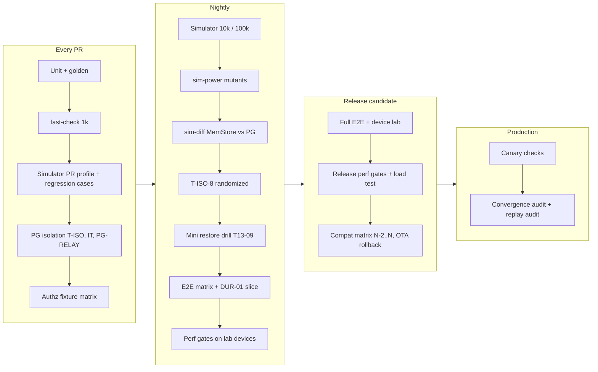
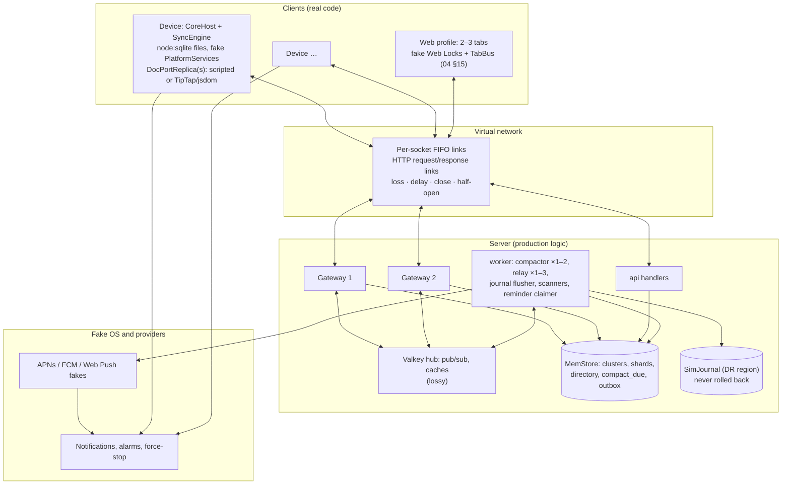
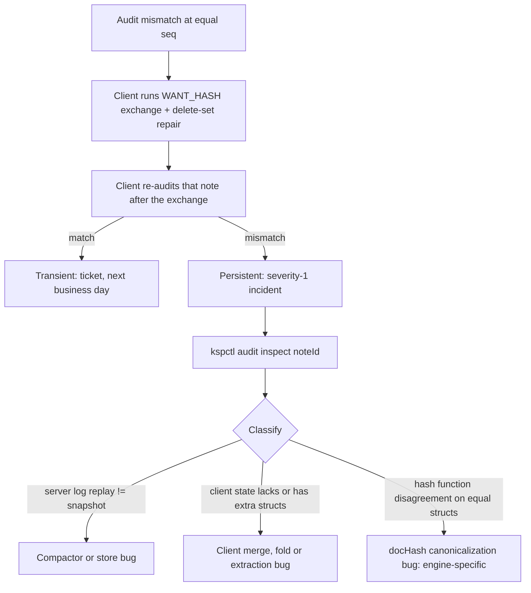

# 16 · Verification

*Version 1.0 · 2026-10-04 · Written against spine v1.2. Where an earlier detail doc (01–05, 08, 12, 13, all written against v1.1) disagrees with the spine, this document follows the spine and records the mismatch in §20.*

## 1. Purpose and scope

The sync engine, the authorization model and the restore path are custom code. A 1–3 person team (A-01) can trust them only if every invariant and every Keep rule is an executable check that runs on every change (D-48, R-01). This document specifies those checks and how they gate work:

- the **deterministic simulator**: world model, scheduler, fault injection, workload grammar, oracles, shrinking and replay, and the scenario families named in §11 of the spine (restore-behind with seq-based fetch, clone and reinstall, concurrent conversions and level raises), plus revocation drafts, relay reordering, bootstrap churn, clock skew, reminders and version skew;
- the **property registry**: every INV and every P item mapped to at least one executable property, with a CI gate that fails when one is missing (§6);
- the **real-Postgres isolation suite**: revoke- and purge-during-append, relay reordering, and the other lock and snapshot races the simulator cannot model (§7);
- the **fast-check suites** (§8);
- the **E2E matrix** on Playwright and Maestro, including the Keep-semantics tests (overlay isolation, owner trash for all, leave, exact 7-day purge, revocation drafts, multi-device alerting, checklist semantics) and the durability runs behind the M1 exit criterion, plus the **test-control plane** that makes multi-day rules testable (§9);
- **performance gates** for clients and the server (§10);
- **chaos experiments, game days** and the restore-drill client fleet (§11);
- **production verification**: canary checks, the convergence audit and its triage, and a snapshot replay audit (§12);
- **CI gating and the milestone plan** (§13, §14).

### Out of scope

- The definitions of the properties other documents own: 02 §23.1 (`SP-INV-*`, `SP-K-*`, `SP-X-*`), 01 §17.4 (`PT-*`), 03 §15, 04 §20, 05 §16, 08 §19, 12 §20. This document consumes them, runs them, fills the gaps (`SP-16-*`) and owns the harness they run in.
- The restore runbook (13 §9) and the restore drills' acceptance queries (13 §7.6). This document schedules the drills, supplies the drill client fleet and checks the client-visible outcomes.
- CI runners, EAS Workflows configuration, staging scheduling, canary deployment and alarm routing (14). This document states what they must run and what must page.
- The security review of the test-control plane (15).
- Package-level unit tests, which each owning document specifies.
- Hands-on verification of Keep behavior (Q-01). The E2E suite encodes the spine's defaults; when Q-01 changes a default, the matching test changes with it.

## 2. Spine references

| Spine item | What this document does with it |
|---|---|
| D-48 | Elaborates it in full: simulator, isolation tests, fast-check, Playwright, Maestro, Flashlight and Reassure gates, fixture matrix, convergence audit |
| INV-1 … INV-18 | One or more executable properties each (§6.2); oracles in §5.10 |
| P-02, P-03, P-09, P-19 | Simulator properties plus dedicated E2E scenarios (KS-02, KS-04, KS-07, KS-06) |
| All other P items | Mapped in §6.3 to a property in the layer that can observe them |
| D-28 | Fixture matrix and isolation tests run as CI gates (§7, §13) |
| D-46, X-11 | Canary checks and the divergence SLI (§12); what pages and what waits |
| X-10 | Brownout ladder walked in chaos experiment CH-07 |
| X-01 | Test telemetry, canary payloads and audit logs carry IDs and enums only |
| X-03 | The test-control plane shifts server-observed timestamps; it never fakes Postgres `now()` (§9.1) |
| X-13 | Golden corpus on four engines runs as a gate (§8) |
| §1.3 | Performance gate targets (§10) |
| §5.5, §5.11 | Convergence audit, restore drills (§11, §12) |
| §8 M0–M4 | Exit criteria verified by the suites in §14 |
| R-01, R-03, R-04, R-05, R-06, R-11 | Mitigations implemented here |
| C-01 … C-92 | v1.2 changes with an observable effect each get a property (§6.4) |

## 3. Interfaces

### 3.1 Owned by this document

| Interface | Section | Consumers |
|---|---|---|
| `@keep/sim` harness: `SimConfig`, `runSchedule`, `Scheduler` strategies, `FaultSpec`, `Intent`, `HistEvent`, `SimProperty`, `registerProperty` | §5 | 02, 03, 04, 05, 08, 09, 12, 13 register properties and fakes |
| `MemStore`: in-memory implementation of 03's `ShardTx` repository boundary and 13's tables, plus the `sim-diff` differential suite | §5.4 | 03, 13 (keep their logic above the boundary) |
| Trace format `.simtrace.ndjson` and regression cases `seeds/regressions/*.case.json` | §5.11 | Every engineer (replay) |
| Mutant catalogue and `sim-power` job | §5.12 | 02, 03, 04 (each listed mutant names their code) |
| Traceability matrix `verification/matrix.yaml` and the coverage gate | §6 | All docs; release review |
| `SP-16-*` properties | §6.4 | 02 (may adopt into its list) |
| Relay reordering suite `PG-RELAY-*` | §7.3 | 03, 08 |
| Test-control plane `TestControlV1` (`/__test/v1/*`, non-production only) | §9.1 | 06, 07, 12 E2E suites; drills; 15 reviews |
| E2E scenario format `E2EScenario`, the conductor and the device matrix | §9.2–§9.4 | 06, 07, 08, 09, 10, 11, 12 contribute scenarios |
| `perf-gates.yaml`, `devices.yaml`, the seeded dataset generator `seed-gen` | §10 | 06, 07 (web and mobile budgets feed it), 14 |
| `ksp-load` load generator and profiles | §10.3 | 03 (profile values), 14 |
| Chaos experiment spec and the game-day calendar | §11 | 13, 14 |
| Drill client fleet `drillfleet` | §11.3 | 13 (drills) |
| Canary check catalogue `CanaryCheck` (14 deploys and alarms them) | §12.1 | 14 |
| Divergence triage runbook and the snapshot replay audit spec | §12.2, §12.3 | 03 (implements the audit job), 14 (alarms) |

### 3.2 Consumed

| Owner | Interface | Minimal assumption |
|---|---|---|
| 01 | `Rng`, `Hasher`, `Clock` (§3.3); `ids.newYjsClientId(rng)`; `normalize`, `project`, `planMaintenance`, `applyMaintenance`, `GcSeen`; `scanDoc`, `REGISTRY_V1`; golden corpus (§17.2); PT-1…PT-19 | Pure, deterministic given injected `Clock` and `Rng`; registry injectable for the test-only level-2 registry (§5.9 F3) |
| 02 | Property list §23.1; codecs; `SyncEngine`, `SyncEngineDeps`; `docHash`; `SeqState`/`cover`; retry classes; `TelemetryBatchV1` | The engine takes all time from `Clock` and all I/O from `Net`; no hidden timers |
| 03 | `Appender`, `OpExecutor`, `withShardWrite`/`ShardTx`, `applyMemberPayload`, `registerOutboxApplier`, `purgeNote`, compactor run, scanners; `pauseAfter('stmt1' \| 'stmt2')`; T-ISO-1…17; load-test profile (§15.4) | Business logic sits above the `ShardTx` boundary; every worker loop has a single-step entry point (§5.4) |
| 04 | `createCore({platform, modules, build, config})`, `PlatformServices` fakes, `CoreConfig` overrides, `drivers/node.ts` (`node:sqlite` `DatabaseSync`), ports, `extractOwnUnacked`, `CoreApi`, `DiagnosticsApi.mark`; T-* list (§20) | Every timer goes through `PlatformClock`; the node driver is synchronous underneath |
| 05 | `DocPortCore`, `DocPortReplica`, `DocPortTransport` (`in-process`), `CoreDocAccess`; the replica-in-the-loop mode (§16); T-01…T-24 | A headless replica host runs in Node, with a scripted binding and a TipTap binding on jsdom |
| 08 | Fixture matrix (`FixtureId`, `PointId`, `EXPECT`, `EnforcementAdapter`), IT-01…14, SP-01…13, `SYSTEM_PRINCIPAL` factory | As 08 §19 |
| 09 | Reminder planner, coverage, claimer, reconciler, `PushSender`, `Notifications` semantics | Runnable in the simulator with fake `Notifications` and `PushSender` (§5.5) |
| 12 | `DeviceRegistry`, continuity token, `AuthPort`, ID-P1…P9, Better Auth test helpers | Close code 4409 for `DEVICE_FORKED` (C-23) |
| 13 | DDL; `ops.enter_shard_write`; `ShardRouter`; restore runbook steps as callable functions (`kspctl restore *`); `RestoreParked.applyFor`; T13-05…T13-25; drills D1–D5 | Runbook steps 2, 3 and 7 are TypeScript over `ShardTx` or have a MemStore mirror checked by `sim-diff` |
| 14 | CI runners, EAS Workflows, staging stack and schedule, canary task, alarm routing, FIS templates, result bucket | §13 lists what it must run |

## 4. Verification architecture

Each layer catches what the layers below cannot observe:

| Layer | Observes | Cannot observe | Runs |
|---|---|---|---|
| Unit and golden (01, 02, 05, 08) | Pure functions, codecs, cross-engine determinism (X-13) | Interaction, concurrency | Every PR |
| fast-check (§8) | Algebraic laws over random inputs | Multi-actor histories | Every PR (1k runs), nightly (100k) |
| **Simulator** (§5) | Multi-device, multi-user histories under faults, time warps, restores, clones; real client code, server logic on MemStore | Postgres locks and snapshots, real OS, real UI, real network stacks | Every sync PR, nightly 10k (100k from M3) |
| `sim-diff` (§5.4) | Divergence between MemStore and real Postgres semantics | Concurrency | Nightly |
| **Real-Postgres isolation** (§7) | Lock order, snapshot visibility, deadlocks, fence exactness, relay ordering | Clients | Every PR touching server write paths; nightly randomized; weekly on Aurora |
| Authz fixture matrix (08 §19.1) | Every enforcement point × every relation | Races | Every PR touching authz or a point |
| **E2E** (§9) | Real browsers, WebViews, native lists, IME, OS lifecycle, push, alarms | Rare interleavings | Nightly; release |
| Performance gates (§10) | Latency, frame rate, memory, throughput | Correctness | PR (Reassure), nightly, release |
| Chaos and game days (§11) | Real AWS failure behavior, runbooks, people | Rare logic bugs | Monthly from M2; quarterly game days from M4 |
| Production (§12) | Real fleet divergence, canary latency and correctness | Pre-release bugs | Continuous |



## 5. Deterministic simulator (D-48)

### 5.1 What it models and what it does not

The simulator runs **real client code** (04's `CoreHost` with 02's `SyncEngine`, 05's DocPort, 01's note-model, on real SQLite through `node:sqlite`) against a **server made of production logic over an in-memory store** (§5.4), connected by a virtual network, all driven by one seeded scheduler in virtual time. One seed reproduces one execution bit for bit.

| Modeled | Not modeled (covered elsewhere) |
|---|---|
| Message loss, delay, duplication (by retransmission), reordering across connections, socket closes, half-open sockets, HTTP retries after a lost response | TCP byte-level behavior, TLS |
| Server crashes before commit, between commit and ack; gateway restarts; Aurora failover with unknown commit outcome | Postgres lock waits, MVCC snapshots, deadlocks (→ §7) |
| Relay, compactor and scanner timing, reordering, duplication and crashes; two compactors racing | Real worker concurrency inside one transaction (→ §7) |
| Valkey pub/sub loss, ACL and denylist cache flushes, Valkey outage | Valkey internals |
| Restores of any subset of shards and the directory, region loss with a journal trailing by ≤ 60 s, epoch bumps | AWS restore tooling (→ drills, §11) |
| Client crashes at any scheduling point, replica (WebView) death, web leader freeze and takeover, backgrounding, clock skew and jumps, zone changes, storage full, DB corruption, clone, reinstall, account switch, old builds | OS schedulers, real IME, rendering (→ §9) |
| Reminder arming, firing, receipts, pushes, force-stop (fake OS) | Real APNs, FCM and alarm behavior (→ §9 KS-07) |

Transactions on MemStore are atomic and serial. Interleavings between transactions are explored; anomalies inside Postgres's concurrency control are not, which is why INV-5, INV-6 and the relay guards also run in §7 (D-28, D-48).

### 5.2 Package and determinism rules

`packages/sim` (`@keep/sim`) is dev-only. dependency-cruiser forbids any `apps/*` or shipped package from importing it (X-19).

| # | Rule | Enforcement |
|---|---|---|
| R1 | One schedule runs in one worker process at a time. Worker processes are recycled every 200 schedules | Runner |
| R2 | All time comes from the scheduler: `SimClock` implements 04's `PlatformClock`, 01's `Clock` and the server clock | During a schedule, `Date`, `Date.now`, `performance.now`, global `setTimeout`/`setInterval`/`setImmediate` are replaced by stubs that throw `SimNondeterminism`; the scheduler keeps private references captured at startup |
| R3 | All randomness comes from `SimRng` (xoshiro256** seeded through splitmix64), one stream per actor | `Math.random` and `crypto.getRandomValues` are patched to the calling actor's stream, so lib0 and Yjs defaults are deterministic too; `ids.newYjsClientId` is called with the device's stream and recorded (for the INV-9 oracle) |
| R4 | No real I/O: `Net` is the virtual network; SQLite files live in a per-schedule tmpfs directory; no other filesystem or network access | Patched `fs` and `net` throw outside the tmpfs root |
| R5 | One event per step. After each event the scheduler awaits a captured `setImmediate`, so every microtask the event started settles before the next event | Scheduler loop |
| R6 | Iteration over actors, notes and devices uses sorted arrays | Code review; caught by R7 otherwise |
| R7 | Every run emits a trace hash (SHA-256 over the canonical event stream). The PR profile re-runs 5% of its schedules in a different worker and position; any hash mismatch fails CI with `nondeterminism detected` and the first differing event | `sim-determinism` check |

### 5.3 World model



Default world sizes (each schedule draws within these; profiles override): 1–4 users on 2–4 logical shards (one EU-range), 1–3 devices per user (web, iOS, Android mix), 1–2 MemStore clusters, 1–3 gateways, 1–2 compactors, 1–3 relay appliers, 1–12 notes per user, 50–400 intents, virtual horizon 10 min to 40 days.

### 5.4 Server backend: MemStore and `sim-diff`

03 states that the simulator runs its `Appender`, `OpExecutor`, apply rules and compactor control flow behind a `Tx` abstraction (03 §15.2). The boundary is `ShardTx` and the repository functions 03 and 13 call through it:

- **Above the boundary, production code runs unchanged:** op handlers and 08's `defineNoteCommand` executor, `accessDecision`/`evaluate`, `applyMemberPayload` (which "decides in TypeScript", 03 §9.5), `OutboxWriter` and dependency rules, `purgeNote` orchestration, the compactor's run (01's planner, `project`, the compare-and-append retry loop), relay loops, journal flusher, scanners, bootstrap and feed serializers (`redactUserNoteRow`), `/reconcile`, `/verify`, 12's `DeviceRegistry.decide`, 09's claimer and reconciler, 13's journal replay function.
- **Below it, MemStore** implements each repository call as a TypeScript function named after its statement tag (`ks:append.stmt1`, `ks:append.stmt2`, `ks:feed.page`, `ks:relay.lease`, `ks:compact.claim`, …), over Maps keyed exactly like 13's primary keys. It reproduces the SQL semantics that matter: the locked-set rule and ordinal mapping of the group commit (C-04), `if_seq` compare-and-append (C-02), the system-principal filter (C-03), one usn per row (C-29), `compact_due` upsert and final-transaction delete rules (C-04), `dep_id` gating (C-10), the advisory lock for compactor ownership (INV-10), `log_floor_seq` raised before deletion (C-08), the restore jump including relabeling of fully compacted notes (C-25), the post-restore counter floor (C-26), `shard_epoch_log` (C-13), `restore_waits` (C-32).
- **Server time** is the virtual clock (X-03): MemStore's `now()` is the single "database clock"; each gateway process has its own small offset (±2 s) for its HLC node.

**`sim-diff` (nightly).** MemStore can drift from the SQL. `sim-diff` records the repository-call sequence of 200 schedules (MemStore results included), replays it serially against real Postgres 18 through the production `ShardTx` implementation, and compares the results call by call and the final table dumps. Timestamps are compared as present/absent; time-predicate calls (scanner claims) are excluded because Postgres `now()` cannot follow the virtual clock. Any difference fails the nightly with the first differing call. 13's mini restore drill (T13-09) runs the same journal through both backends.

**Single-step entry points.** To schedule worker activity, the simulator needs each loop as one step. Required from 03 and 13 (§20 records it as an assumption): `compactor.runNote(shard, noteId)` with its three transactions as separate awaits (read, maintenance append, final), `relay.applyOnce(leaseSize)` and `relay.applyRow(outboxId)`, `journalFlusher.flushOnce()`, `trashExpiry.scanOnce()`, `reminderClaimer.claimOnce()`, `reconciler.runOnce()`, `restore.step(n)`.

### 5.5 Clients under test

Each device is a real `CoreHost` built by `createCore` (04 §16) with:

| Platform service | Simulator fake |
|---|---|
| `net` | Virtual sockets and HTTP on the simulated links |
| `clock` | Device wall clock = true time + skew function (constant, drifting or jumping); `monotonic` = true time; virtual timers |
| `crypto` | `SimRng` stream; SHA-256 from `node:crypto` (deterministic) |
| `sql` | `drivers/node.ts` on `DatabaseSync` files in tmpfs; a wrapper tracks open transactions so a crash can roll them back, and can return `SQLITE_FULL` (via `max_page_count`) or corrupt a page for salvage tests |
| `notifications` | Records armed, fired, posted (audible or passive), cleared; models the iOS 64-notification cap, Android exact-alarm denial and force-stop wiping alarms (09 semantics) |
| `secure` | Per-device store that survives "reinstall" when the platform is iOS (Keychain, D-42) and not on Android |
| `background`, `lifecycle` | Scripted foreground/background transitions; background tasks run with OS-like budgets |
| `tabs` | Web only: a fake Web Locks manager with `steal`, and a `TabBus` with frozen-tab behavior (04 §15) |
| `files`, `shared` | In-memory |

`CoreConfig` timing overrides keep schedules short where the rule is not under test (for example the 10-minute verify timer runs at 10 min only in the F4 family). Content edits always go through DocPort: the device opens an in-process session (`editor.connect('inprocess')`, `open`) and a **replica binding** applies the intent:

- `scripted` (default): 01's `NoteDocWriter` and 05's `ChecklistController` on the replica doc. Fast.
- `tiptap`: TipTap with `@tiptap/y-tiptap` on jsdom, used by families F3 and the undo properties, where the binding's own behavior is under test (INV-9, §4.3 rule 8). About 10× slower; 5% of nightly schedules.

### 5.6 Scheduler and strategies

The scheduler keeps a queue of enabled events `{at: VTime, actor, kind}`. At each step the strategy picks one event among those due; when none is due it **warps** virtual time to the next timer, so a 40-day horizon costs only the events that happen in it.

| Strategy | How it picks | Finds |
|---|---|---|
| `random` | Uniform among due events; network deliveries get jitter from `[0, jitterMax]` | Shallow races, broad coverage |
| `pct` | Probabilistic concurrency testing: random actor priorities with `d` priority change points per schedule (default d = 3) | Ordering bugs of small depth with guaranteed probability per run |
| `replay` | Follows a recorded choice stream | Reproduction |

**Swarm selection.** Each schedule enables a random subset of fault kinds and intent kinds (each kept with probability 0.5, then the family's required ones forced on). Diverse subsets find more bugs than one schedule with every fault at once, because some faults mask others.

**Phases.** Every schedule has three phases:

1. **Setup**: accounts, devices, initial notes; no faults.
2. **Chaos**: the workload and the fault script run together.
3. **Heal**: all faults off, every device online and foregrounded, every web profile with a live leader, time advanced until quiescence (§5.10), capped at `healVirtualMs` (default 2 h of virtual time plus any pending rule timer such as a 30-day wait, reached by warping).

### 5.7 Workload generator

Intents are the user-visible operations of 04's `CoreApi` plus content edits through DocPort, and operator actions on the server.

```ts
// packages/sim/src/intents.ts
export type DeviceRef = { user: number; device: number };
// Selectors are resolved against the acting device's local state at execution time, so a script stays
// meaningful after shrinking. An index past the end wraps; an empty set turns the intent into a no-op.
export type NoteSel = { i: number; scope?: 'owned' | 'shared' | 'any' | 'trashed' | 'open' };
export type ItemSel = { i: number; live?: boolean };
export type UserSel = { user: number };
export type TokenRun = { tokens: number; breaks?: 'none' | 'hardBreak' | 'newBlock'; duplicateLineOf?: number };
export type ReminderSpecSel = { kind: 'once' | 'daily' | 'weekly' | 'monthlyLastDay' | 'yearlyFeb29'; zone: 'home' | 'fixed' };
export type Intent =
  // content (DocPort replica session)
  | { k: 'open'; note: NoteSel } | { k: 'close'; note: NoteSel }
  | { k: 'type'; note: NoteSel; where: 'title' | 'body' | { item: ItemSel }; at: 'start' | 'end' | 'mid'; text: TokenRun }
  | { k: 'delete'; note: NoteSel; where: 'title' | 'body' | { item: ItemSel }; span: 'token' | 'line' | 'all' }
  | { k: 'item'; note: NoteSel; op: 'add' | 'enter' | 'delete' | 'check' | 'uncheck' | 'indent' | 'dedent' | 'move'; item?: ItemSel }
  | { k: 'convert'; note: NoteSel; to: 'list' | 'text' } | { k: 'convertRemaining'; note: NoteSel }
  | { k: 'undo' | 'redo'; note: NoteSel }
  | { k: 'insertNode'; note: NoteSel; node: 'simCallout' | 'todoLine' | 'invalidShape'; raiseLevel: boolean }
  | { k: 'attach' | 'detach'; note: NoteSel }
  // notes and per-user state
  | { k: 'newNote'; kind: 'text' | 'list'; materialize: boolean; preChoices?: Array<'color' | 'pin' | 'label' | 'reminder'> }
  | { k: 'overlay'; notes: NoteSel[]; op: 'color' | 'pin' | 'unpin' | 'archive' | 'unarchive' | 'move' }
  | { k: 'label'; op: 'create' | 'rename' | 'delete' | 'assign' | 'unassign'; name?: string; notes?: NoteSel[] }
  | { k: 'reminder'; note: NoteSel; op: 'set' | 'clear' | 'done' | 'snooze' | 'dismiss'; spec?: ReminderSpecSel }
  | { k: 'settings'; key: 'checkedToBottom' | 'newItemsAtBottom' | 'alertAllDevices'; value: boolean }
  | { k: 'trash' | 'restore' | 'deleteForever'; notes: NoteSel[] } | { k: 'emptyTrash' }
  | { k: 'copy'; note: NoteSel }
  // sharing
  | { k: 'invite'; note: NoteSel; to: UserSel | 'unknownEmail' | 'blockedBy' | 'sharingOff' }
  | { k: 'remove'; note: NoteSel; target: UserSel | 'pendingSlot' } | { k: 'leave'; note: NoteSel }
  | { k: 'respond'; note: NoteSel; action: 'accept' | 'decline' | 'block' }
  // account and device
  | { k: 'signOut' } | { k: 'signIn'; as: 'same' | 'other' } | { k: 'requestDeletion' } | { k: 'cancelDeletion' }
  | { k: 'importTakeout'; entries: number; repeat: boolean }
  | { k: 'dismissDraft' | 'keepDraft' } | { k: 'keepReviewCopy' };
export type OperatorIntent =
  | { k: 'restore'; at: VTime /* R */; shards: number[] | 'cluster'; directory: boolean; regionLoss: boolean }
  | { k: 'epochBump'; scope: 'user' | 'shard'; reason: 'meta' | 'full' } | { k: 'raiseTombstoneFloor'; user: number }
  | { k: 'registerMigration'; id: string } | { k: 'flag'; key: string; value: unknown }
  | { k: 'serverUpgrade'; addCaps: string[] } | { k: 'setDocSchemaWritable'; level: number };
```

**Tagged text.** Every `TokenRun` is a sequence of unique tokens drawn from the world's `SimRng`: `{deviceTag}{counter}` in base-32, 5–8 characters, separated by spaces or `hardBreak`s. A token appears at most once in a world's typed input. This turns content oracles into set checks: which tokens must exist where, which must not appear (another member's text in a draft, a duplicated line after conversions), which survived a restore. Lines used for conversion tests are sometimes duplicated on purpose (identical text from two blocks) to exercise C-40.

**Weights.** The default mix is about 45% content, 20% per-user state, 10% notes lifecycle and trash, 10% sharing (from M3), 5% reminders (from M3), 10% connectivity and lifecycle transitions; families (§5.9) override it.

### 5.8 Fault catalogue

The fault model **F** of 02 §23.1 is the default. The full catalogue, with the default per-schedule probability that swarm selection enables each kind:

| Area | Fault | Default p | Notes |
|---|---|---|---|
| Network | Frame delay and jitter (0–2 s) | 1.0 | Per-socket order kept |
| | Socket close at a random point; half-open socket (server keeps it 30–90 s) | 0.6 | Duplicates arise from re-sends after a lost ack |
| | Device offline window (seconds to 40 days) | 0.7 | |
| | HTTP response lost after the server committed | 0.4 | `/push`, `/pull`, `/docs`, bootstrap pages |
| | `RETRY_LATER{lane}`, `SLOW_DOWN`, 429/503 with `Retry-After`, GOAWAY storm | 0.4 | |
| | Live-frame loss 0–100% (`DOC_LIVE`, `POKE`, `NOTE_TOUCHED`, `DOC_PEERS`) | 0.6 | INV-7 |
| Server | Gateway crash with group commits in flight; outcome committed or not chosen by the scheduler | 0.5 | INV-2 |
| | Aurora failover: every open transaction ends with an unknown outcome | 0.2 | |
| | Relay apply in adversarial order, duplicate apply, crash between journal PUT and row delete | 0.6 | D-32, C-10 |
| | Journal outage (DR bucket unreachable) for minutes to hours | 0.2 | X-11 |
| | Compactor crash before, between and after its transactions; two compactors on one note | 0.5 | INV-10 |
| | Valkey outage; cache flush (ACL, denylist); pub/sub reorder across gateways | 0.4 | D-41, D-28 |
| | Restore-behind (PITR) of a shard subset, a whole cluster, or the directory | 0.15 | F1 |
| | Region loss: restore from the daily copy; journal entries younger than the lag (≤ 60 s) lost | 0.05 | INV-14 window |
| | Epoch bump (`meta`, `full`); tombstone floor raised past a device's cursor | 0.2 | |
| | Brownout rungs (X-10): live off, `NOTE_TOUCHED` off, sync read-only, sync pause | 0.2 | |
| | Server upgrade mid-run (new caps and op versions) | 0.1 | C-19 |
| Client | Crash at any scheduling point (rolls back the open SQLite transaction; drops replicas) | 0.6 | |
| | Replica (WebView) death mid-batch; DocPort frame duplication and reordering on reconnect | 0.4 | 05 G1–G7 |
| | Web leader killed, frozen (keeps the OPFS handles), or on a different build | 0.3 | D-04, C-54 |
| | Clock skew ±1 year, slow clocks, wall jumps, zone changes | 0.5 | INV-15, X-03 |
| | Storage full; DB page corruption (salvage) | 0.1 | 04 F-10, F-11 |
| | Old build: lower `docSchemaMax`, missing caps and op versions | 0.3 | X-08 |
| | Corrupt local `doc_update` row (undecodable bytes) | 0.1 | C-21 |
| Identity | Live clone of DB plus secure store; stale twin; reinstall; device transfer; account switch; session expiry and revocation; offline sign-out | 0.3 | F2 |
| Adversary | A modified client that writes unknown root keys, known names in invalid shapes, over-limit merges, role-violating ops, wrong `userId` | 0.2 | INV-4, INV-8, INV-9, C-75 |
| Reminders | Force-stop, exact alarms denied, push dropped or delayed, primary unseen > 12 h, no fire receipt | 0.3 (M3+) | P-09 |

### 5.9 Scenario families

A family is a template that weaves a fixed skeleton into a random schedule, so the hard cases occur often instead of by chance.

| Family | Skeleton | Primary properties |
|---|---|---|
| **F1 restore-behind with seq-based fetch** | Devices sync notes (owned, shared across shards) to seqs `s`; MemStore snapshots at R (seq `r < s`); work continues (edits, creates, ACL changes, trash, purges, blocks, deletion requests); restore of a shard subset (sometimes the directory, sometimes region loss); 13's runbook runs on MemStore (journal replay with the R − 1 h / R − 24 h overlap of C-30, jump, epochs, window, re-fan-out, `restore_waits`); devices reconnect. Member devices on unrestored shards hold seqs above the restored log and must reach the restored state through `DOC_FETCH` with `serverSeq < log_floor_seq`, jumped `NOTE_TOUCHED`, and tails never inlined across the jump. Owners re-assert with the floor HLC; re-asserted notes start at 2^32 (C-26) | INV-6, INV-14, INV-13, SP-X-02, SP-16-15, SP-16-19, ID-P7, ID-P8 |
| **F2 clone and reinstall** | Variants: live clone (DB, secure store, continuity token copied; both copies keep running); stale twin (a copy taken earlier, the original re-registered since); reinstall (fresh DB, iOS keeps `device_id` and a leftover session token); device transfer (DB copied, new `device_id`); account switch (DB bound to A, B signs in); each combined with a restore before or after | INV-18, ID-P1…P9, P-09 (no duplicate ringer) |
| **F3 concurrent conversions and level raises** | 2–4 devices convert one note offline (same and opposite directions, repeat conversions, edits to hidden sources and to targets, identical lines from one block); compactor runs at warped times around 24 h, 7 d and 30 d; devices with `docSchemaMax` 1 and 2 (a test-only level-2 node `simCallout` and mark `simMark` in `REGISTRY_SIM_V2`) edit together, with and without raising `meta.lv`, raising concurrently; the adversary writes known names in invalid shapes. Uses the `tiptap` replica binding | INV-9, INV-10, INV-11, P-19, SP-16-10, SP-16-11 |
| **F4 revocation drafts** | A device holds unacked local rows, repair rows, `copy_seed` rows and typing still inside an open replica; then revoke, purge, leave, decline, account purge or `restore_lost` expiry | INV-12, INV-13, P-20, SP-16-08 |
| **F5 relay reordering** | High fan-out (5–20 members across shards), bursts of trash/restore, projection updates, membership churn with re-invites, session starts and compactions; relay applies in adversarial order with duplicates and crashes; journal outages | D-32 guards, INV-13, SP-16-13, SP-16-14 |
| **F6 bootstrap churn** | A new device bootstraps while other devices pin, archive, move, trash and remove; the stream is cut at every page boundary, resumed, and answered 409 once | INV-16, SP-X-03 |
| **F7 skew and server time** | Clocks ±1 year, slow clocks, jumps; trash, purge, GC and cleanup timed by server-observed times | INV-15, P-03, SP-16-10 |
| **F8 sharing lifecycle** | Contacts, non-contacts, email invites, silent refusals, caps at 50, accept/decline/block, removal, re-invite | P-04, P-15, P-16, INV-5, SP-16-12, SP-16-13 |
| **F9 reminders** | 2–4 devices per user, coverage leases, primary election, fail-open, force-stop, exact alarms denied, acks on each device | P-07, P-09, SP-16-18 |
| **F10 long offline** | Devices offline 1–40 days: tombstone floor passes (`meta` resync), session expires, merge review windows, verify timers | INV-14 (second clause), P-18, ID-P4 |
| **F11 version skew** | Old builds with fewer caps and op versions; server upgrade mid-run; OTA rollback (`schema_version` vs `min_compatible_version`) | SP-16-05, X-08 |
| **F12 web tabs** | 2–3 tabs per profile; leader killed, frozen, hidden; build mismatch | INV-1, SP-16-01 |

### 5.10 History, oracles and quiescence

Every actor appends to one **history** that oracles read. Oracles are independent of the code under test: they never call the extraction, merge or projection functions they judge, except where the property *is* "equals the shared pure function" (INV-11 uses 01's `normalize` on each replica and compares outputs).

```ts
// packages/sim/src/history.ts
export type HistEvent =
  | { k: 'intent'; t: VTime; dev: DeviceRef; intent: Intent; outcome: 'ok' | 'refused_visibly' | 'threw'; tokens?: string[] }
  | { k: 'local_commit'; t: VTime; dev: DeviceRef; store: 'outbox' | 'doc_update'; id: string; noteId?: string;
      origin?: 'local' | 'remote' | 'repair' | 'copy_seed'; tokens?: string[]; deletesTokens?: string[] }
  | { k: 'server_commit'; t: VTime; noteId: string; seq: bigint; author: string; deviceId: string | null; updHash: string; tokens: string[] }
  | { k: 'op_commit'; t: VTime; op: string; ccid: string; status: 'ok' | 'stale' | 'rejected'; code?: string }
  | { k: 'ack'; t: VTime; dev: DeviceRef; ref: string; seq?: bigint; hlc?: string }
  | { k: 'membership'; t: VTime; noteId: string; userId: string; change: 'add' | 'accept' | 'remove' | 'leave' | 'decline' | 'block'; epoch: bigint }
  | { k: 'purge'; t: VTime; noteId: string; journalAckedAt?: VTime }
  | { k: 'journal_ack'; t: VTime; entryId: string; type: string }
  | { k: 'restore'; t: VTime; R: VTime; shards: number[]; directory: boolean; regionLoss: boolean; journalLostAfter?: VTime }
  | { k: 'tombstone'; t: VTime; dev: DeviceRef; noteId: string; reason: string }
  | { k: 'draft'; t: VTime; dev: DeviceRef; noteId: string; tokens: string[] }
  | { k: 'alert'; t: VTime; dev: DeviceRef; occ: string; audible: boolean; via: 'local' | 'push' | 'webpush' | 'toast' }
  | { k: 'frame'; t: VTime; dir: 'c2s' | 's2c'; type: string; bytes: number }
  | { k: 'fault'; t: VTime; kind: string; detail: Record<string, string | number> };
```

**Shadow ledgers** derived from the history:

| Ledger | Content | Used by |
|---|---|---|
| `SeqRegistry` | Every `(noteId, seq) → updHash` the server ever committed, across restores | INV-6 "never reused" (a second commit of a seq with another hash fails) |
| `TokenLedger` | Per token: typed by which device, in which note and container, in which local row, ack time, deleted by whom and when | INV-4, INV-12, INV-14, P-19 dedupe |
| `AclTimeline` | Membership state per (note, user) in commit order | INV-5 (each row's author was active at its commit) |
| `LwwLedger` | Every accepted per-user field write with its stored HLC | INV-15, P-06, SP-X-02 |
| `TrashTimeline` | Server-observed trash and restore times per note | P-03 exact purge time |

**Quiescence** (end of the heal phase) holds when: no frame is in flight; every outbox and `doc_update` row is acked, dead-lettered, held with a reason the history explains (awaiting a tombstone that will arrive, `UNSUPPORTED` with no covering cap, `waiting_owner`), or quarantined; `fanout_outbox` is empty; no `compact_due` row is due; every device's feed cursor equals its user's usn. The liveness property `16/SP-LIVE` fails if quiescence is not reached within `healVirtualMs`.

**Generic convergence oracle** (runs on every schedule at quiescence, whatever families were woven in):

1. For every non-purged note: the server's `docHash` (snapshot plus tail) equals the confirmed `docHash` of every hydrated doc on every device of every active member.
2. Rendered output (`normalize` with each device's settings) is identical for devices with equal settings (INV-11), and projections are identical everywhere (C-45).
3. Each device's per-user rows equal the server's rows for its user, compared as canonical JSON without usn.
4. For purged notes and ended memberships, no device holds the note except in `recovered_draft`.
5. Every token from an update acked to an active member, and not deleted by any member, is present on the server (INV-4) unless the history records a permitted loss (region-loss window).

"Byte-identical state" in INV-3 is checked as equality of `docHash`, rendered projections and canonical relational rows (§19 SI-16-4): duplicate deliveries legitimately produce extra log rows (03 F-2).

### 5.11 Shrinking, traces and replay

A failing schedule is reduced before anyone looks at it:

1. **Script extraction.** The schedule is re-expressed as a code-independent script: setup, the intent list with devices and virtual times, the fault list, and the scheduler seed for residual choices.
2. **Delta debugging** (ddmin) over intents and faults, then over devices, notes, token lengths and time gaps; each candidate is re-run and kept if the same property still fails with the same verdict class.
3. **Output**: a regression case and a trace.

```jsonc
// seeds/regressions/2027-03-14-inv12-repair-leak.case.json
{
  "v": 1,
  "property": "02/SP-INV-12",
  "verdict": "draft contains token 'b07kq' from a repair row",
  "found": { "seed": "9f3c0a51e2b47d10", "profile": "nightly", "gitSha": "4c1e2aa", "mutant": null },
  "world": { "users": 2, "devicesPerUser": [1, 1], "shards": [3, 517], "replicaMode": "scripted" },
  "script": [
    { "t": 0, "dev": [0, 0], "intent": { "k": "newNote", "kind": "text", "materialize": true } },
    { "t": 1200, "dev": [0, 0], "intent": { "k": "invite", "note": 0, "to": 1 } },
    { "t": 9000, "fault": { "kind": "offline", "dev": [1, 0], "forMs": 900000 } }
  ],
  "schedulerSeed": "11aa2b3c4d5e6f70",
  "fixedIn": null
}
```

The trace is NDJSON: a header line `{v: 1, seed, gitSha, config, strategy, mutant}`, then one `HistEvent` per line plus `{k: 'choice', i, n, pick}` lines. `pnpm sim:replay <case|trace> [--until <event#>] [--dump-db <dev>]` re-runs it and can stop at any event, dump any device's SQLite file or MemStore table, and print the decoded frames. Regression cases run in every PR forever; a case whose bug is fixed records `fixedIn` and stays.

### 5.12 Mutants: testing the simulator

A simulator that passes may simply be blind. `sim-power` runs nightly: each mutant below replaces one production function in the simulator process (through Node module customization hooks; production code contains no test switches) and runs its family for a budget of schedules. A mutant that survives its budget fails the job, which means the oracles or the generator lost detection power.

| Mutant | Replaces | Must be caught by | Budget |
|---|---|---|---|
| M-01 | 04 `extractOwnUnacked` includes `repair` and `copy_seed` rows | 02/SP-INV-12 | 2,000 F4 |
| M-02 | Purge path skips the DocPort drain | 02/SP-INV-12 | 2,000 F4 |
| M-03 | Restore re-assert uses a fresh HLC instead of the floor HLC | 02/SP-X-02 | 2,000 F1 |
| M-04 | Bootstrap trash section carries only owner rows | 02/SP-X-03 | 2,000 F6 |
| M-05 | Compactor appends without `ifContentSeq` | 02/SP-INV-10 | 2,000 F3 |
| M-06 | Item GC timed from `del.t` | SP-16-10 | 2,000 F3+F7 |
| M-07 | One usn per transaction instead of per row | 02/SP-INV-6 | 1,000 F6 |
| M-08 | Relay ignores the `projected_seq` guard | Generic convergence, 08/SP-04 | 2,000 F5 |
| M-09 | Owner's purge tombstone written in the purging transaction | SP-16-14 | 2,000 F1+F5 |
| M-10 | Client purges a note whose feed row is absent | 02/SP-INV-13 | 2,000 F6+F10 |
| M-11 | Re-created note during the window starts at seq 1 | 02/SP-INV-6 | 2,000 F1 |
| M-12 | No HLC merge from FEED pages | 02/SP-INV-15 | 2,000 F7 |
| M-13 | Server projection accepted while unacked local rows exist | SP-16-07 | 2,000 default |
| M-14 | `docHash` over the state vector only | 02/SP-X-01 | 2,000 F1 |
| M-15 | Identity reset drops cursor epochs | 12/ID-P7 | 1,000 F2 |
| M-16 | Gate checks names but not shapes | 02/SP-INV-9 | 500 F3 (tiptap) |
| M-17 | Undo without the collaborator `deleteFilter` | SP-16-11 | 500 F3 (tiptap) |
| M-18 | `blocked_on` content precondition removed for leave and copy | SP-16-08 | 2,000 F4 |
| M-19 | Relay applies a row while its `dep_id` row exists | SP-16-14 | 2,000 F5 |
| M-20 | `/verify` never called after `FORBIDDEN` | 16/SP-LIVE | 1,000 F4 |

New invariant work adds a mutant for its main failure mode in the same PR.

### 5.13 Budgets and run profiles

| Profile | Schedules | Families | Wall budget | Hardware |
|---|---|---|---|---|
| `pr` | 400 random + every regression case + 5% determinism re-runs | All, weighted to the changed packages (path rules) | ≤ 12 min | 8 vCPU CI runner |
| `nightly` | 10,000 (M0–M2); 100,000 from M3 (D-48) | All; 5% with the `tiptap` binding | ≤ 60 min (10k); ≤ 3 h (100k) | 64 vCPU spot instance (14) |
| `long` | 1,000 with 20–40-day horizons (weekly) | F1, F3, F7, F10 | ≤ 2 h | same |
| `sim-power` | §5.12 budgets | Per mutant | ≤ 90 min | same |
| `sim-diff` | 200 recorded schedules | All except time-driven scanners | ≤ 30 min | 8 vCPU + Postgres 18 container |

The sizing assumes about 6 CPU-seconds per schedule (3 users, 200 intents, scripted binding); M0 measures it (OQ-16-1). A failing nightly seed opens an issue with the shrunk case attached and the owning document's area label; the case is committed with its fix.

## 6. Property registry: INV and P mapped 1:1

### 6.1 ID scheme and matrix file

A property ID is `<owning doc>/<local id>`: `02/SP-INV-5`, `01/PT-9`, `08/SP-04`, `12/ID-P7`, `03/T-ISO-1`, `16/SP-16-03`. `verification/matrix.yaml` lists, for every spine INV and P item and every v1.2 C item with an observable effect, the properties that cover it and the layer they run in.

```yaml
# verification/matrix.yaml (schema v1; owned here, edited by every doc owner)
version: 1
items:
  INV-5:
    properties:
      - { id: 02/SP-INV-5, layer: sim, status: active }
      - { id: 08/SP-01,    layer: sim, status: active }
      - { id: 03/T-ISO-1,  layer: pg,  status: active }
      - { id: 03/T-ISO-4,  layer: pg,  status: active }
  INV-17:
    properties:
      - { id: 02/SP-INV-17, layer: sim, status: pending, until: T-06 }
  P-27:
    exemption: { reason: "presence ships in v1.1", until: v1.1 }
```

`status` is `active`, `stub` (allowed until M0 exit only, D-48), or `pending` with an `until` naming the trigger or milestone that brings the code. Every `SimProperty` registers itself with the same ID:

```ts
// packages/sim/src/property.ts
export type PropertyId = `${'01' | '02' | '03' | '04' | '05' | '08' | '09' | '12' | '13' | '16'}/${string}`;
export type TraceRef = `INV-${number}` | `P-${number}` | `C-${number}` | `D-${number}` | `X-${number}`;
export interface SimProperty {
  id: PropertyId;
  covers: readonly TraceRef[];
  phase: 'always' | 'quiescent';          // 'always': checked after every event (cheap invariants); 'quiescent': at the end
  requires?: readonly ScenarioFamily[];   // the runner weaves at least one of these into schedules that check it
  check(ctx: CheckContext): Verdict;      // pure over the history, ledgers and snapshots; never mutates the world
}
export interface CheckContext {
  history: readonly HistEvent[];
  ledgers: { seqs: SeqRegistry; tokens: TokenLedger; acl: AclTimeline; lww: LwwLedger; trash: TrashTimeline };
  server: MemStoreSnapshot;
  devices: ReadonlyMap<string, DeviceSnapshot>;   // SQLite dump, open replicas, armed notifications
  now: VTime;
}
export type Verdict = { ok: true } | { ok: false; message: string; evidence: Array<{ k: 'event'; i: number } | { k: 'row'; table: string; key: string }> };
export function registerProperty(p: SimProperty): void;
```

### 6.2 Invariants

"Other layers" lists checks outside the simulator that cover the same item.

| INV | Simulator properties | Isolation (§7) | Other layers |
|---|---|---|---|
| INV-1 | 02/SP-INV-1; 04/T-INV1; SP-16-01 (DB held by another tab); SP-16-20 (unmaterialized note, the one exception) | — | 04/T-INV1-lint; E2E DUR-01, DUR-04 |
| INV-2 | 02/SP-INV-2; 04/T-OB-1 | 13/T13-05 (acked present after a fence flip) | DUR-01; chaos CH-01, CH-03 |
| INV-3 | 02/SP-INV-3, SP-X-06, SP-X-08 | PG-RELAY-1 (duplicates) | FC-OUT-1 |
| INV-4 | 02/SP-INV-4, SP-K-12; SP-16-02 (BAD_UPDATE quarantine); SP-16-03 (frame cap, `TOO_LARGE`) | — | 05/T-01 |
| INV-5 | 02/SP-INV-5; 08/SP-01 | 03/T-ISO-1…7, T-ISO-16; 08/IT-01, IT-02, IT-09, IT-12 | 03 load proof (1M appends) |
| INV-6 | 02/SP-INV-6 (feed page limits drawn from {1, 2, 3, 500}, C-29; re-created notes after the jump, C-26); 02/SP-X-07; 13/T13-10 | 03/T-ISO-8, T-ISO-11, T-ISO-14 | 13/T13-09, T13-13, T13-22; nightly duplicate-seq check after T-05 (C-33) |
| INV-7 | 02/SP-INV-7 | — | CH-02; canary CN-01 |
| INV-8 | 02/SP-INV-8; 01/PT-14; SP-16-09 (peer unknown keys applied, inert, counted) | — | 01 golden "Schema" cases |
| INV-9 | 02/SP-INV-9 with the `tiptap` binding, including shapes (C-60); 01/PT-15 | — | 05/T-01, T-02, T-24; 04/T-INV9 |
| INV-10 | 02/SP-INV-10 (with a client append scheduled between the compactor's read and its append, C-02); 01/PT-9, PT-11, PT-12; SP-16-10 | 03/T-ISO-16 | 03 compactor corpus (§15.4) |
| INV-11 | 02/SP-INV-11; 01/PT-6 | — | 01 engine matrix; 05/T-03 |
| INV-12 | 02/SP-INV-12; 04/T-INV12; 08/SP-13 | — | 05/T-20; E2E KS-05 |
| INV-13 | 02/SP-INV-13; 08/SP-03, SP-07; SP-16-04 (`ABSENT` never purges); SP-16-13 (re-invite); SP-16-14 (journal-first purge) | PG-RELAY-4; 13/T13-07, T13-17, T13-23 | 08 fixture rows F10, F11, F20 |
| INV-14 | 02/SP-INV-14, SP-X-02; 12/ID-P7; SP-16-15; SP-16-19 | — | 13/T13-09, T13-12; drills D1–D3 with `drillfleet` |
| INV-15 | 02/SP-INV-15 (plus the slow-clock clause of C-38) | — | 01/PT-2, PT-3 |
| INV-16 | 02/SP-INV-16, SP-X-03; 04/T-INV16 | — | — |
| INV-17 | 02/SP-INV-17 (`pending`, until T-06) | — | 03 §10.2 unit tests when T-06 code lands |
| INV-18 | 02/SP-INV-18; 04/T-INV18; 12/ID-P1, P2, P3, P7, P8, P9 | 12 §20.2 registration matrix (no deadlock) | E2E DUR-07 |

### 6.3 Keep rules

| P | Simulator properties | Other layers |
|---|---|---|
| P-01 Leave | 02/SP-K-01; 08/SP-05, SP-11; SP-16-08 | 08/IT-10; E2E KS-03 |
| P-02 Owner trash for all | 02/SP-K-02 | E2E KS-02 |
| P-03 Trash, exact 7 days, CAS | 02/SP-K-03a–d | E2E KS-04 |
| P-04 50 people | 02/SP-K-04; 08/SP-06 | 08/IT-04 |
| P-05 Labels | 02/SP-K-05 | 01/PT-19; E2E KS-11 |
| P-06 Per-user overlay | 02/SP-K-06a, SP-K-06b; 01/PT-18; 04/T-OV-1 | E2E KS-01 |
| P-07 Reminders per user | 02/SP-K-07 | E2E KS-01, KS-07 |
| P-08 Reminder zone | — | 01 recurrence goldens (`wallToInstant` vectors, 01 §17.6); 09 unit tests; E2E KS-07 row R6 |
| P-09 Multi-device alerting | 02/SP-K-09; SP-16-18 | Device lab KS-07 |
| P-10 Recurrence | — | 01/PT-16 and recurrence goldens on four engines |
| P-11 No location reminders | — | Static check: no code path arms a reminder whose `trigger_kind` is not `time` (lint rule in `sync-client` and `worker`) |
| P-12 Limits | 02/SP-K-12 | 01 §8 unit tests; 05/T-12 |
| P-13 Images | — | 10's pipeline tests; E2E KS-19 |
| P-14 Quota | — | 08 fixture F14 (attachment transfer); 10's tests; E2E KS-19 |
| P-15 Card-only pending | 02/SP-K-15; 08/SP-02, SP-08, SP-09 | 08 fixture F03; 13/T13-02; E2E KS-10 |
| P-16 Share-dialog privacy | SP-16-12 | 08/IT-04, IT-05, IT-06; E2E KS-10 |
| P-17 "Edited" | 02/SP-K-17 | E2E KS-12 |
| P-18 Merge review | 02/SP-K-18 (with the C-58 window); 04/T-MR-1, T-MR-2 | E2E KS-13 (M3) |
| P-19 Checklist semantics | 02/SP-K-19a–c; 01/PT-7, PT-8, PT-9, PT-10 | 05/T-23; E2E KS-06 |
| P-20 Recovered drafts | 02/SP-K-20 | E2E KS-05 |
| P-21 Search | — | 11's suites; E2E KS-14 |
| P-22 Web offline | — | E2E KS-15 |
| P-23 Empty-note discard | 02/SP-K-23; SP-16-20 | 05/T-11; 04/T-DP-2; E2E KS-08 |
| P-24 Make a copy | 02/SP-K-24; 08/SP-10; 04/T-COPY-1 | E2E KS-09 |
| P-25 Account deletion | 02/SP-K-25; SP-16-15 | 12 §20.2 saga tests; E2E KS-16 |
| P-26 Version history | — | 03 version-snapshot test; E2E KS-17 (M4) |
| P-27 Presence | Exempt until v1.1 | — |
| P-28 Notification content | — | 09's tests; E2E KS-20 |
| P-29 Export | — | E2E KS-17 |
| P-30 Takeout import | SP-16-16 | E2E KS-17 |
| P-31 `#hashtag` labels | — | 05/T-19; E2E KS-18 (M4) |

### 6.4 Additional properties owned here (`SP-16-*`)

These cover v1.2 behavior that 02's list (written against v1.1) does not yet state. 02 may adopt them; until it does, this registry is authoritative for them.

| ID | Property | Covers | Family |
|---|---|---|---|
| SP-16-01 | While no tab can open the DB (frozen leader holds the OPFS handles), every mutation fails visibly and none is reported saved; editor edits stay unacked in replicas; after the frozen tab dies, every replica edit reaches the DB exactly once | INV-1, D-04, C-54 | F12 |
| SP-16-02 | An undecodable local `doc_update` closes the socket with `4400 BAD_UPDATE <ccid>`; that row is quarantined in the dead-letter list, never re-sent automatically, never deleted without consent, and its content stays in the local doc; every other note keeps syncing | INV-4, C-21 | any + corrupt-row fault |
| SP-16-03 | No server frame exceeds 256 KB; a doc above 240 KB reaches the device through `DOC_SYNC{TOO_LARGE}` plus `/v1/sync/docs`, and a large merged live update through `NOTE_TOUCHED`; `server_seq` never advances on an empty `TOO_LARGE` reply | INV-4, INV-7, C-06 | worlds with 300 KB–2 MB notes |
| SP-16-04 | A read that resolves to `NOTE_UNKNOWN` is answered `DOC_SYNC{ABSENT}`, never `REVOKED`; the device keeps its doc, pushes nothing back for it, retries, and converges once the note or membership exists | INV-13, C-15 | F1, F8 |
| SP-16-05 | Every rejected op ends in exactly its retry class's action (C-19): `INVALID` is never re-sent automatically; `UNSUPPORTED` rows stay unchanged and commit after a `WELCOME` whose caps cover them; no `hold` or `retry` row is ever dead-lettered | C-19, X-08 | F11 |
| SP-16-06 | Devices whose clocks are > 24 h fast or before 2010 create notes; the server answers `ID_CONFLICT{ts_future \| ts_past}`; the client re-mints and rewrites queued dependents; each note ends on the server exactly once, with its content and labels | C-37, X-04 | F7 |
| SP-16-07 | A card's projection basis `proj_seq` never decreases; while a note has unacked local-edit rows, no server projection replaces the local one | D-23, C-53 | default |
| SP-16-08 | `note.leave`, `share.respond{decline \| block}` and `note.copy` commit only after every earlier local or repair content row of that device for the note is acked or held; a copy contains every token typed before the copy intent | C-55, P-01, P-24 | F4 |
| SP-16-09 | A peer's unknown root keys and item keys are applied by every receiver, never dropped, never deleted by any client, counted, and removed only by a registered migration | INV-8, C-36 | adversary |
| SP-16-10 | With client clocks anywhere in ±1 year: no item is hard-deleted before its same `(itemId, del.h)` was observed valid for 30 days of server time; no hidden source is deleted before 7 days observed unchanged; no duplicate body block before 24 h; duplicate items are soft-deleted in the first run that sees them; a changed hash or cleared `del` resets the timer; losing `gc_meta` only delays | C-01, C-64, X-03, §4.3 rules 3–4 | F3 + F7 |
| SP-16-11 | Undo and redo touch only the session's own changes; undoing a container insert keeps the container and every token another client typed into it; no undo removes a `meta.lv` key; on an over-limit note a refused undo writes nothing | §4.3 rule 8, C-62 | F3 (tiptap) |
| SP-16-12 | For a recipient-side refusal (sharing off, blocked, recipient cap, declined in the last 30 days), everything the sharer's devices observe (ACK status, `row`, chips, usns written for the sharer) has the same shape as for a live invite to an address without an account; the recipient gets no card and no email; the silent slot counts toward 50 and expires at 30 days | P-16, C-74 | F8 |
| SP-16-13 | A member removed and re-invited ends with exactly one live membership, a higher `member_epoch`, and a freshly hydrated doc on each of their devices; no state from the ended instance survives | INV-13, C-81 | F5, F8 |
| SP-16-14 | No device (the owner's included) applies a purge tombstone, and no hard delete happens, before the purge's journal entry is acked; after a region loss that lost the entry, devices still hold the note | C-05, X-06, D-45 | F1, F5 |
| SP-16-15 | Deletion requests and cancellations survive a directory restore (`deletion_scheduled` with the original `deleteAfter`, `deletion_cancelled`); signing in alone never cancels; a directory restore revokes every session while every device keeps its DB and outbox | P-25, C-27, C-31, C-86 | F1 |
| SP-16-16 | Re-importing the same Takeout is a no-op; an entry purged after an earlier import is imported again with generation + 1 (at most 3) | P-30, C-43 | import |
| SP-16-17 | A connection never holds more than 16 subscriptions; dirty notes beyond that converge through `DOC_FETCH{sv, wantHash}` | C-20 | F10 |
| SP-16-18 | Per occurrence: at least one alert within 60 s of due on some reachable device; at most one audible alert unless a fail-open condition held (primary unseen > 12 h, no Android receipt within 3 min, "Alert on all devices"); an action on any device clears the others once online; no device re-arms an acked occurrence; the +24 h follow-up fires only on the primary | P-09, D-36 | F9 |
| SP-16-19 | A restore never undoes a block journaled before the failure | C-76, INV-14 | F1 + F8 |
| SP-16-20 | Per-user choices made before a note's first content are committed in its materialization transaction, and dropped (nothing written) if it never materializes; discard on close applies only to a note materialized in this session that is owned, unshared, has received no remote content and is empty again | P-23, C-59, INV-1 | default |
| SP-LIVE | Quiescence is reached within `healVirtualMs`; every held row has an explaining history | liveness of §5.6 | all |

### 6.5 Coverage gate

`pnpm verify:matrix` runs on every PR:

1. Every INV and P item in the spine, and every C item tagged `observable` in the matrix, has at least one `active` property or an exemption with `until`.
2. Every ID in the matrix resolves to a registered `SimProperty`, a Vitest test with the ID in its title, or an E2E scenario ID.
3. Every `stub` fails the gate after the M0 exit tag; every `pending` fails once its `until` milestone or trigger is reached.
4. Every mutant in §5.12 names a property that exists.

The release review attaches the matrix with the last nightly result per property.

## 7. Real-Postgres isolation suite

### 7.1 Harness

03 §15.1 defines the harness: Vitest with two to four dedicated sessions on a disposable Postgres 18 container, `waitBlocked(session)` polling `pg_stat_activity` for a lock wait on that backend, and the production group commit with `pauseAfter('stmt1' | 'stmt2')`. This document owns the suite layout (`apps/server/test/isolation/*`), the relay-reordering tests (§7.3), and the schedule:

| Run | What | Where |
|---|---|---|
| PR (server write paths, `authz`, `data`) | All deterministic interleavings: 03 T-ISO-1…7, 9…17; 08 IT-01…14; 13 T13-05, T13-07, T13-25; PG-RELAY-1…4 | CI Postgres 18 container |
| Nightly | 03 T-ISO-8 randomized (10k rounds); PG-RELAY-1 with 5,000 sampled permutations per scenario; 13 T13-13 | CI |
| Weekly | The PR set against a staging Aurora 18.6 cluster (03 OQ-03-5: Aurora must keep "visible before lock release") | Staging, synthetic data only |
| M0 exit, then before every release | 03 load proof: 1M appends from 64 writers, 1% revocations and purges; zero gaps, zero deadlocks, no row by a non-member, HOT ratio ≥ 0.95 (13 T13-04) | Staging-sized instance |

T-ISO-3 (the single-statement negative control) must keep **failing**; the suite asserts that it detects the SA-02 anomaly, so a harness that stopped seeing snapshots would fail CI.

### 7.2 Catalogue by risk

| Risk | Tests |
|---|---|
| Revocation during append (INV-5) | 03 T-ISO-1, T-ISO-2, T-ISO-3 (control), T-ISO-6; 08 IT-01 |
| Purge during append (INV-5, INV-13) | 03 T-ISO-4, T-ISO-5; 08 IT-02 |
| Locked-set rule (C-04) | 03 T-ISO-7 |
| Lock order and deadlocks | 03 T-ISO-8, T-ISO-15 (`setOverlay` `FOR UPDATE`, C-14); 12 registration matrix |
| Compactor scheduling and CAS (C-02, C-04) | 03 T-ISO-9, T-ISO-10, T-ISO-16 |
| Retention floor (C-08) | 03 T-ISO-11 |
| Relay vs per-user ops (D-32) | 03 T-ISO-12; 08 IT-11 |
| Shard fence (C-09) | 03 T-ISO-13; 13 T13-05 |
| usn visibility (C-29) | 03 T-ISO-14 |
| Journal-first (C-05, C-10) | 03 T-ISO-17; 13 T13-07 |
| Sharing races | 08 IT-03…IT-10, IT-12…IT-14 |
| Relay reordering | PG-RELAY-1…4 (§7.3) |

### 7.3 Relay reordering suite (owned here)

The simulator explores relay orders on MemStore; this suite proves the guards hold in real SQL, where `applyMemberPayload` writes through `UPDATE … FROM unnest(…)` and the guards are SQL predicates.

**Method.** A scenario runs real commands on a real source shard and captures the `fanout_outbox` rows they emit. The suite then applies those rows to a fresh copy of the target shards through `relay.applyRow(outboxId)` in many orders, each with one randomly chosen row applied twice, and compares the final target rows with the result of in-order application.

| ID | Scenario (rows emitted) | Orders | Assertions |
|---|---|---|---|
| PG-RELAY-1 | Trash, restore, re-trash; three compactions (`projected_seq` p1 < p2 < p3); two session starts; a membership chip change (7–9 rows per member, 3 members on 2 target shards) | All permutations when ≤ 7 rows (5,040); otherwise 500 sampled on PR, 5,000 nightly | Final `user_notes` field groups equal the in-order result; `(shard_id, user_id, usn)` unique; a write rejected by its guard consumes no usn; every applied row consumed exactly one usn per written row |
| PG-RELAY-2 | Same rows applied by three concurrent relay sessions with `SKIP LOCKED` leases, concurrently with `note.setOverlay` and `noteLabel.set` on the same `(user, note)` | 200 random interleavings | No deadlock; the same final state; per-user rows never outlive a tombstone (08 SP-11) |
| PG-RELAY-3 | Purge and revocation with journal rows and `dep_id` dependants; the journal flusher's lease expires mid-flight | Flusher and appliers interleaved at each pause point | No dependant applied while its `dep_id` row exists; every journal entry appended at least once; the owner's purge tombstone obeys the same rule (C-05) |
| PG-RELAY-4 | `purged` tombstone, then late projection, membership and trash rows for the same note; separately: `revoked`, then a re-invite at a higher `member_epoch` | All orders | `purged` is never overwritten (INV-13); the revoked row is revived only by the higher epoch and ends as one live membership (C-81) |

### 7.4 Requirements on the code under test

- `relay.applyRow(outboxId)` and `relay.leaseOnce(n)` are exported for tests (03).
- Statement tags (`/* ks:… */`) are stable; 13's trigger queries and this suite's `waitBlocked` diagnostics read them.
- Every command entry point accepts a `pauseAt` test hook in non-production builds only, compiled out by a build constant, never a runtime flag (03 already does this for the group commit).

## 8. fast-check suites

fast-check is pinned in M0 (D-48); runs use `numRuns: 1000` on PRs and `100000` nightly, `seed` and `path` printed on failure and replayable with `pnpm fc:replay <suite> <seed> <path>`.

| Suite | Owner of the laws | Generators | Laws |
|---|---|---|---|
| FC-DOM | 01 | IDs, HLC sequences, order-key arrays with ties, label names, text with surrogates and ZWJ | 01 PT-1…PT-5, PT-13, PT-16, PT-17, PT-19 |
| FC-DOC | 01 | 2–4 docs, random primitive and text-binding ops, random delivery with duplicates | 01 PT-6…PT-12, PT-14, PT-15, PT-18 |
| FC-CODEC | 02 | Every frame type with valid payloads; random bytes | 02 T-CODEC-1, T-CODEC-3, T-CODEC-4 |
| FC-SEQ | 02 | Random ack, live, tail, fetch and jump interleavings | 02 SP-X-07 law for `cover`/`coverPrefix`; 04 T-DS-1 |
| FC-HASH | 02 | Random docs, random encodings of the same state (merged snapshot plus tail, hydration pack, `encodeStateAsUpdate`), single-deletion variants | Equal state → equal `docHash`; one deletion apart → different `docHash` (02 §23.3 runs the corpus on engines) |
| FC-OUT-1 | 04 | Random op sequences with reductions on and off | 04 T-OB-2: identical final server state |
| FC-LQ | 04 | Random write sequences | 04 T-LQ-1, T-LQ-2 |
| FC-EDIT | 05 | Command sequences on N replicas; TextBinding input with compositions | 05 T-03, T-05 |
| FC-AUTHZ | 08 | Op × relation × note state | 08 §19.4 golden table |
| FC-PART | 13 | Append, compact and drop schedules | 13 T13-13 |

The golden corpus (01 §17.2) runs on Node, Chromium, WebKit and Hermes (01 §17.3) on every PR touching `domain` or `note-model`; a mismatch is a release blocker (X-13).

## 9. End-to-end matrix

### 9.1 Environments and the test-control plane

| Environment | Backend | Used by |
|---|---|---|
| `e2e-local` | docker-compose (Postgres 18, Valkey 9, MinIO, Mailpit, Toxiproxy) plus the server image in single-process mode (D-26) | Playwright on CI runners; developers |
| `staging` | The staging stack (D-49), scaled up for the nightly window by 14 | Maestro on EAS Workflows, the device lab, drills, chaos |

Real clocks cannot wait seven days, and Postgres `now()` is authoritative (X-03) and is never faked. The **test-control plane** instead moves *server-observed timestamps* backward, which is equivalent for every time predicate of the form `stored_time + interval ≤ now()`, and triggers worker loops on demand.

```ts
// apps/server/src/testctl/contract.ts — mounted only when enabled (guards below)
export interface TestControlV1 {
  createUser(req: { residency?: 'us' | 'eu'; verified?: boolean; sharingEnabled?: boolean }): Promise<{ userId: string; email: string }>;
  mintSession(req: { userId: string; platform: 'web' | 'ios' | 'android' }): Promise<{ sessionToken: string }>;
  expireSession(req: { userId: string; sid?: string }): Promise<void>;
  /** Subtracts deltaMs from the named server-observed times of one note, under ops.enter_shard_write and its lock row. */
  shiftNote(req: { noteId: string; deltaMs: number;
                   what: Array<'trash' /* trashed_at, purge_after */ | 'gc_meta' /* first-seen times */ | 'restore_wait' /* until */> }): Promise<void>;
  shiftUser(req: { userId: string; deltaMs: number; what: Array<'deletion_grace' | 'session_age' | 'tombstone_floor'> }): Promise<void>;
  runOnce(req: { job: 'trash_expiry' | 'compactor' | 'relay' | 'journal' | 'reminder_claimer' | 'reminder_reconciler'
                     | 'restore_expire_waits' | 'nightly_reconciler' | 'deletion_saga' }): Promise<{ processed: number }>;
  quiesce(req: { timeoutMs: number; userIds?: string[] }): Promise<{ quiet: boolean; pending: Record<string, number> }>;
  noteState(req: { noteId: string }): Promise<{ contentSeq: string; snapshotSeq: string; logFloorSeq: string; docHash: string;
                   text: string /* test accounts only */; members: Array<{ userId: string; state: string; epoch: string }>;
                   trash: { state: boolean; trashedAt: number | null; purgeAfter: number | null; purgedAt: number | null } }>;
  userRows(req: { userId: string }): Promise<{ rows: unknown[]; usn: string }>;
  fault(req: { kind: 'drop_live' | 'delay_acks' | 'close_sockets' | 'retry_later_lane' | 'slow_down'; userId: string; ms?: number; forMs: number }): Promise<void>;
  bumpEpoch(req: { userId: string; reason: 'meta' | 'full' }): Promise<void>;
  flags(req: { set: Record<string, unknown>; userId?: string }): Promise<void>;
}
```

| Guard | Rule |
|---|---|
| Build | Compiled into the single image (D-49 promotes one image), mounted only when `KEEP_TESTCTL=1` |
| Environment | The process refuses to start if `KEEP_TESTCTL=1` and `KEEP_ENV=prod` |
| Network | Served under `/__test/v1/*` on `api`; the prod ALB WAF has a rule that blocks `/__test/`; the staging rule allows only the CI egress addresses |
| Authentication | `Authorization: Bearer <testctl secret>` from Secrets Manager, a secret that exists only in non-prod accounts |
| Data | Every call refuses users whose email is outside the reserved domain `e2e.keep.test` (RFC 2606 `.test`), so even in staging it never touches a non-test account; `text` in `noteState` exists for the same reason |
| Detection | A prod canary probe (CN-09) asserts `/__test/v1/ping` is refused |
| Audit | Every call is logged with caller, call and IDs (X-01) |

15 reviews this plane before it is enabled in staging (§19 SI-16-5).

### 9.2 Platform and device matrix

`devices.yaml` (owned here) names device classes; scenarios refer to classes, so a device swap is one edit.

| Class | Concrete target (pinned in M0) | CI or lab | Used for |
|---|---|---|---|
| `web-chromium`, `web-firefox`, `web-webkit` | Playwright 1.63 browsers, latest two versions (A-06) | CI | Every web scenario |
| `web-safari-real` | Safari 26 on macOS and iOS (real browser, OPFS sahpool, cookie policy, Q-17) | Device lab or a cloud device farm (OQ-16-4), weekly | KS-15, DUR-04, 12's cookie gate G8 |
| `ios-sim`, `android-emu` | Latest iOS simulator; Android emulator at the Expo SDK minimum and latest API | EAS Workflows (Maestro 2.11) | Functional mobile scenarios |
| `android-mid` | A mid-range Android phone (Pixel 7a class) | Lab | §1.3 cold-start target, KS-07 |
| `android-low` | A low-end Android phone (≤ 4 GB RAM, about $150; model in OQ-16-5) | Lab | Regression gates, fling, memory |
| `android-oem` | A Samsung phone with One UI battery management | Lab | KS-07 force-stop and OEM rows |
| `iphone-min`, `iphone-cur` | iPhone on iOS 16.4 (A-06 floor) and on the current iOS | Lab | KS-07, IME rows of 05 T-15, perf |
| `ipad` | An iPad on the current iPadOS | Lab | KS-07 tablet row (M3 exit) |

The lab is a self-hosted runner (a Mac mini with USB-attached devices) run by 14. Network faults for every platform go through Toxiproxy on the path to the backend, so "offline" and "flaky" mean the same thing on web, iOS and Android; Playwright's `context.setOffline` is used as well on web (D-48).

### 9.3 Conductor and scenario format

Maestro drives one device per flow and Playwright one browser context per actor. Multi-actor scenarios run under a **conductor** (`tools/e2e/conductor`) that sequences steps across actors and checks server truth through the test-control plane.

```ts
// tools/e2e/src/scenario.ts
export type ActorPlatform = 'web-chromium' | 'web-firefox' | 'web-webkit' | 'web-safari-real' | 'ios-sim' | 'android-emu'
  | 'android-mid' | 'android-low' | 'android-oem' | 'iphone-min' | 'iphone-cur' | 'ipad';
export interface E2EScenario {
  id: `KS-${number}` | `DUR-${number}` | `E2E-${string}`;   // KS = Keep semantics, DUR = durability, E2E-* = contributed by 06–12
  covers: readonly TraceRef[];
  milestone: 'M1' | 'M2' | 'M3' | 'M4';
  actors: Record<string, { user: string; platform: ActorPlatform | ActorPlatform[]; clockSkewMs?: number }>;
  steps: readonly E2EStep[];
}
export type E2EStep =
  | { actor: string; do: string; args?: Record<string, unknown> }   // page-object action (web) or Maestro subflow (mobile)
  | { net: 'offline' | 'online' | 'flaky'; actors: string[] }
  | { kill: string; how: 'sigkill' | 'os_stop' } | { relaunch: string }
  | { control: keyof TestControlV1; args: unknown }
  | { expect: string; args?: Record<string, unknown>; withinMs?: number }   // assertion from tools/e2e/src/expect/*
  | { waitServer: 'quiesce'; timeoutMs: number };
```

Selectors are `data-testid` on web and `testID` on native, from a shared list in `packages/ui-tokens/testids.ts` that 06 and 07 maintain; accessibility labels double as selectors where they are stable (X-17).

### 9.4 Keep-semantics suite

Every scenario runs on at least one web and one mobile actor; "×" columns show which.

| ID | Scenario | Covers | Web | iOS | Android | From |
|---|---|---|---|---|---|---|
| KS-01 | Overlay isolation | P-06, P-05, P-07, SP-K-06a | × | × | × | M3 |
| KS-02 | Owner trash for all | P-02, SP-K-02, SP-K-03d | × | | × | M3 |
| KS-03 | Leave | P-01, C-55 | × | × | | M3 |
| KS-04 | Exact 7-day purge | P-03, SP-K-03b, SP-K-03c | × | | × | M1 |
| KS-05 | Revocation drafts | INV-12, P-20, C-51 | × | × | × | M3 (purge variant M2) |
| KS-06 | Checklist semantics | P-19, §4.3 rules 1–4 and 7 | × | × | × | M1 |
| KS-07 | Multi-device alerting | P-09, P-07, P-08, D-36 | × | × | × | M3 |
| KS-08 | Empty-note discard | P-23 | × | × | × | M1 |
| KS-09 | Make a copy | P-24 | × | | × | M3 |
| KS-10 | Pending card and share privacy | P-15, P-16 | × | × | | M3 |
| KS-11 | Labels | P-05 | × | | × | M1 |
| KS-12 | "Edited" footer | P-17 | × | × | | M1 |
| KS-13 | Merge review | P-18 | × | | × | M3 |
| KS-14 | Search | P-21 | × | × | × | M1 |
| KS-15 | Web offline | P-22 | × | | | M1 |
| KS-16 | Account deletion (12 §20.3) | P-25 | × | × | × | M2 |
| KS-17 | Export, import, version download | P-29, P-30, P-26 | × | | | M2 (P-26 M4) |
| KS-18 | `#hashtag` labels | P-31 | × | | × | M4 |
| KS-19 | Images and quota (10) | P-13, P-14 | × | × | × | M2 |
| KS-20 | Notification content (09) | P-28 | | × | × | M3 |

The five scenarios the spine names, in detail:

**KS-01 Overlay isolation.** A (web) and A2 (iOS) are one user; B (Android) is a contact. A creates a note and shares it with B; B is auto-accepted. A sets color red, pins it, assigns label `Work`, sets a reminder; B sets blue, archives it, assigns `Home`, sets a different reminder. Expect: A and A2 show red, pinned, `Work`, A's reminder; B shows blue, archived, `Home`, B's reminder; content edits by either appear on both within 1.5 s. B searching for `Work` finds nothing; `userRows(B)` contains no A label name and no A reminder (X-20). A pins while A2, offline, archives with a later HLC; after reconnect the effective overlay is archived and unpinned on both, never both (C-48).

**KS-02 Owner trash for all.** A (owner, web) and B (writer, Android) hold the note. A trashes it: B's grid drops it within 10 s, B's Trash does not list it, A's Trash does. B, offline beforehand, types tokens into it; after B reconnects, those tokens are on the server (`noteState`, INV-4) though the note stays hidden for B. A restores: the note returns for B with B's tokens. B choosing Delete gets the Leave confirmation, not trash (P-01).

**KS-03 Leave.** B types tokens, and within 200 ms chooses Delete → "Remove from your notes? Others keep it." Expect: B's tokens are on the server before the leave commits (C-55); the note, its labels and B's reminder disappear from B's devices with tombstone `left`; A and a third member C keep identical content; no recovered draft appears on B.

**KS-04 Exact 7-day purge.** A1 (web, browser clock skewed +3 days through Playwright's clock API) trashes note N. `noteState(N)` shows `purgeAfter − trashedAt = 7 days` exactly, independent of the skew. `shiftNote(N, 7 d − 60 s, ['trash'])`, `runOnce('trash_expiry')`: N is still in A's Trash. `shiftNote(N, 120 s, ['trash'])`, `runOnce('trash_expiry')`, `runOnce('journal')`, `runOnce('relay')`: N leaves Trash on A1 and A2 (Android), tombstone `purged`, data purged on both devices (INV-13). CAS variant: A1 goes offline viewing N trashed at `trash_hlc` h1; A2 restores and re-trashes (h2); A1 runs Empty Trash offline and reconnects: N stays in Trash with `trash_hlc` h2 (`stale`, SP-K-03c).

**KS-05 Revocation drafts.** B (each platform in turn) goes offline and types tokens T_B into shared note N, deletes some of its own tokens, and keeps typing in the open editor. A removes B. B reconnects: within 10 s, B's devices show "Recovered: your unsynced text from '‹title›'" containing exactly T_B minus the tokens B deleted, including text still in the editor at the moment of revocation (drain, C-51), and none of A's tokens. Keep creates a private note with that text; Discard removes the draft. Variants: owner purge (M2), decline of a pending share (no content, no draft), copy of a `restore_lost` note (no draft from `copy_seed` rows).

**KS-06 Checklist semantics** covers the depth rule, the first-item rule, cascade check, Enter below a parent with children (C-63), "move checked to bottom" per user on a shared note, edit-wins delete across two offline devices, and concurrent Show-checkboxes on two offline devices yielding one visible copy of each line (body duplicates visible in the editor until the compactor's 24 h removal, which `shiftNote(['gc_meta'])` plus `runOnce('compactor')` exercises).

**KS-07 Multi-device alerting** runs in the lab across `android-mid`, `android-oem`, `iphone-cur`, `ipad` and `web-chromium`:

| Row | Setup | Expect |
|---|---|---|
| R1 | All armed; the Android phone is primary | One audible alert on the primary, passive elsewhere, all within 60 s |
| R2 | Done on the iPad | Every other device's notification cleared within 60 s of being online |
| R3 | Android primary force-stopped | No receipt within 3 min → every other armed device and web alert audibly (fail-open); the stopped phone lists "Missed while the app was stopped" on launch |
| R4 | Exact alarms denied on Android | Push-primary: the alert arrives by push at due; no re-ring after Done |
| R5 | Reinstall on iOS | The old registration's coverage is gone; no duplicate audible alert |
| R6 | Home zone changes on the primary for > 2 h | The undo toast appears and occurrences follow the new zone (P-08) |
| R7 | Nothing actioned | One follow-up at +24 h on the primary only (via `shiftUser`/`runOnce('reminder_reconciler')` on staging) |

### 9.5 Durability and lifecycle suite

| ID | Scenario | Pass condition | From |
|---|---|---|---|
| DUR-01 | **1,000 scripted offline/kill/reconnect runs** (M1 exit): 400 Chromium, 100 WebKit, 250 Android, 250 iOS. Each 60–120 s run types tokens into text and list notes, converts, toggles the network (Toxiproxy, `setOffline`), hard-kills the app or browser (`sigkill`) at random moments, relaunches, and finally quiesces | Every token whose typing finished ≥ 400 ms before a hard kill, and every token typed without a kill, is on the server and on an observer device; zero duplicated lines; zero dead letters. The 400 ms margin is the C-56 crash window (≈ 350 ms) plus 50 ms (§19 SI-16-1) | M1 |
| DUR-02 | Seven days offline with an expired session (M1 exit): `expireSession`, `shiftUser(['tombstone_floor'])`, trash expiry of another note during the offline period | Local editing continues with "Sign in to sync"; re-auth as the same user syncs everything; a `meta` resync runs; a different account signing in is offered export first (12) | M1 |
| DUR-03 | OTA rollback (D-49, X-08): build N, OTA N+1 with an additive migration, write, roll back to N | DB opens read-write; data intact; sync works | M2 |
| DUR-04 | Web leader killed, frozen (CDP `Page.setWebLifecycleState frozen`), hidden; upgrade handoff while typing (04 T-WEB-1) | No lost token; the "held by another tab" state never reports a save | M1 |
| DUR-05 | WebView renderer killed while typing (05 T-14) | Loss ≤ the batch window; recovery ≤ 12 s | M1 |
| DUR-06 | Version skew: clients N−2…N against server N and N+1 (02 T-COMPAT-1) | Simulator smoke suite plus KS-04 and KS-06 pass | M2 |
| DUR-07 | Reinstall, device transfer, account switch on real devices | New registration; no inherited coverage; no cross-account drain (INV-18) | M1 |

### 9.6 Flake policy

- A scenario that fails, then passes on an automatic retry, is recorded as `flaky`, never as `pass`. Two flaky results in 7 days quarantine it: it keeps running, does not gate, and gets an issue with a 7-day fix deadline. Quarantine never applies to KS-04, KS-05 or DUR-01, which gate their milestones.
- Time waits use `withinMs` against server truth (`quiesce`, `noteState`), never fixed sleeps.
- Each run creates fresh test users, so runs never share state.

## 10. Performance gates

### 10.1 Client gates

`tools/perf/perf-gates.yaml` (owned here) lists every gate; 06 and 07 add their budgets to it.

```yaml
version: 1
defaults: { runs: 10, stat: p50, regress_pct: 10, significance: 0.05 }
gates:
  - { id: PG-01, metric: cold_start_first_cards_ms, source: flashlight, device: android-mid, dataset: seed-5k, target: 800, stat: p50, blocking: release }
  - { id: PG-02, metric: cold_start_first_cards_ms, source: flashlight, device: android-mid, dataset: seed-5k, target: 1500, stat: p90, blocking: release }
```

| ID | Metric | Target | Device / browser | Dataset | Tool | Blocks |
|---|---|---|---|---|---|---|
| PG-01, PG-02 | Cold start to first cards | p50 ≤ 0.8 s, p90 ≤ 1.5 s (§1.3) | `android-mid` | seed-5k | Flashlight (`diagnostics.mark('first_cards')`) | Release |
| PG-03 | Cold start to first cards | p50 ≤ 0.6 s | `iphone-cur` | seed-5k | XCTest launch metric with `os_signpost` from `diagnostics.mark` (OQ-16-6) | Release |
| PG-04 | Tap card to editable, text note (warm WebView) | p50 ≤ 250 ms | `android-mid`, `iphone-cur` | seed-5k | Maestro timing + marks (05 T-16) | Release |
| PG-05 | Tap card to editable, list note | p50 ≤ 150 ms | same | seed-5k | same | Release |
| PG-06 | Grid fling | ≥ 58 fps, no frame > 50 ms | `android-low` | seed-5k, seed-50k | Flashlight | Nightly regression, release |
| PG-07 | Skeleton query | p50 ≤ 50 ms (T-14 condition) | `android-mid` | seed-5k | Instrumented query timing | Nightly; trips T-14 review |
| PG-08 | RN heap | ≤ 250 MB with a note open; ≤ 120 MB with none | `android-low` | seed-50k | Flashlight memory | Release |
| PG-09 | Web memory | ≤ 300 MB | `web-chromium` | seed-50k | Chromium CDP `Performance.getMetrics` (JS heap of the page and the DB Worker) through Playwright; `measureUserAgentSpecificMemory` is unavailable because the app is not cross-origin isolated (D-04) | Release |
| PG-10 | Web warm start | LCP p75 ≤ 1.0 s, INP p75 ≤ 200 ms, CLS ≤ 0.1 | `web-chromium` (throttled 4× CPU) | seed-5k | Playwright traces + web-vitals (06 owns the budget) | Release |
| PG-11 | Local search | p95 ≤ 50 ms | `android-low`, `web-chromium` | seed-5k | Instrumented `search.query` | Nightly |
| PG-12 | New device bootstrap | First cards p75 ≤ 1.5 s; offline-capable ≤ 15 s at 10 Mbps | `android-mid` | 5k-note account on staging | Toxiproxy bandwidth 10 Mbps; marks | Release |
| PG-13 | Open a note at 50k | p50 ≤ 3 s (A-04) | `android-mid` | seed-50k | Maestro + marks | Release |
| PG-14 | Keystroke to paint at 20k chars | p95 ≤ 16 ms | `android-low`, `web-chromium` | fixture note | 05 T-16 | Nightly |
| PG-15 | Checklist command at 1,000 items; normalize | p95 ≤ 16 ms; ≤ 8 ms | `android-low` | fixture note | Reassure + 05 T-16 | PR (Reassure), nightly |
| PG-16 | Hermes bundle | ≤ 2.5 MB HBC (X-19) | — | — | Bundle map check (05 T-18) | PR |
| PG-17 | Reconnect catch-up (≤ 24 h offline, ≤ 500 changed notes) | p50 ≤ 1 s, p99 ≤ 5 s | `android-mid` | staging | 02 `catchup_ms` | Release |

Absolute targets are gated on the device classes the spine states them for (mid-range Android, iPhone). The low-end device gates **regressions** only, plus the fling and memory floors (§19 SI-16-3).

### 10.2 Seeded datasets

`seed-gen` (owned here) builds deterministic local DBs and matching server accounts from a seed: `pnpm seed:gen --notes 5000 --seed 42 --out seed-5k`. The distribution: 70% text and 30% list notes; lengths log-normal (median 180 UTF-16 units, 1% near the limits); 8% pinned, 15% archived, 2% trashed; 12 labels; 6% with images (references to fixture blobs); 3% shared; 5% with reminders; scripts mixed (Latin, CJK, Arabic) at 85/10/5. The generator writes through the real core (04's `CoreApi` against `drivers/node.ts`), so the DB has exactly the shape production creates; mobile perf runs install it before launch, and staging gets the same account through the test-control plane plus `/v1/sync/push`.

### 10.3 Server load tests

`ksp-load` (owned here) is a Node load generator built on the real `sync-protocol` codec and a slimmed client (no SQLite; in-memory docs), running thousands of virtual devices per process on ECS tasks in staging.

| Profile | When | Shape | Pass |
|---|---|---|---|
| `m2-launch-2x` | M2 exit | 03 §15.4: 25k sockets per task, 3k appends/s, 10% shared notes at the 250 ms cadence, 2× expected launch peak | Ack p50 ≤ 150 ms, p99 ≤ 600 ms; visibility p50 ≤ 300 ms, p99 ≤ 1.5 s; zero ack failures; HOT ratio ≥ 0.95; writer CPU < 60%; relay lag p99 ≤ 10 s |
| `reconnect-storm` | M2 exit | All sockets reconnect after a GOAWAY spread over 0–120 s | Admission ≤ 500 handshakes/s per task; `resync=none` for current cursors; catch-up p99 ≤ 5 s |
| `restore-admission` | M2 drill | Every device resyncs `restore` | Resync traffic ≤ 30% of writer capacity (§5.11 pacing) |
| `m4-6mo-2x` | M4 exit | 2× the projected 6-month peak, with shard-move rehearsal under load | As `m2-launch-2x`; zero acked-write loss across the move (13 T13-06) |

### 10.4 Gate mechanics

- Lab runs take the median of 10 runs; a gate fails when the statistic misses its absolute target, or when it regresses more than `regress_pct` against the main-branch baseline with significance below 0.05 (Reassure's comparison for render metrics; a Mann–Whitney U test for the rest).
- Baselines refresh on every merge to `main` that passes; a deliberate regression needs a reviewed baseline override in the PR.
- A miss on PG-07 opens the T-14 review instead of blocking.

## 11. Chaos experiments and game days

### 11.1 Staging chaos experiments

Run monthly in staging from M2 while `ksp-load` and `drillfleet` hold steady traffic. Each has a hypothesis, an injection, steady-state metrics and an abort condition.

```yaml
# tools/chaos/experiments/CH-01.yaml
id: CH-01
hypothesis: "An Aurora writer failover loses no acked update and recovers acks within 5 minutes"
inject: { tool: aws-fis, action: "aws:rds:failover-db-cluster", target: keep-staging-c1 }
steady_state: [ ack_fail_ratio < 0.005, doc_ack_latency_p99_ms < 600 ]
expect: [ "no acked token missing (drillfleet audit)", "ack failures end within 300 s", "page fired (X-11 failover)" ]
abort_if: [ "ack_fail_ratio > 0.5 for 10 min" ]
owner: data
```

| ID | Injection | Expected outcome |
|---|---|---|
| CH-01 | Aurora writer failover | No acked loss; `RETRY_LATER` and re-sends; recovery ≤ 5 min (§1.3); page fires |
| CH-02 | Valkey primary failover; then Valkey stopped for 10 min | Live frames stop, convergence through pulls (INV-7); denylist reloaded; a session revoked during the outage is rejected within 30 s (D-41) |
| CH-03 | Stop `sync` tasks mid group commit (FIS `aws:ecs:stop-task`) | No acked loss (INV-2); reconnects within admission limits |
| CH-04 | Stop `worker` tasks during compaction and relay | Leases expire and work resumes; no duplicate visible effect |
| CH-05 | Deny `s3:PutObject` on the DR journal bucket for 30 min | Journal age page at 5 min; purge tombstones and hard deletes wait (C-05); everything drains after the deny is lifted, in order |
| CH-06 | Rolling deploy with GOAWAY | Reconnects jittered over 0–120 s; current cursors get `resync=none` |
| CH-07 | Walk the brownout ladder (X-10) rung by rung, then back | Local editing never gated; sync read-only keeps outboxes; clients converge after |
| CH-08 | Network latency between `sync` and Aurora (FIS task network latency, +150 ms) | `SLOW_DOWN` engages at commit p99 > 200 ms; no ack failures |
| CH-09 | APNs and FCM stubs returning 5xx (staging push endpoints) | Reminders fail open to other devices and web (P-09) |
| CH-10 | T-01 shard move under load (M4 rehearsal) | Fence ≤ 5 s p99; only `RETRY_LATER`; zero acked loss (13 T13-06) |

### 11.2 Game days and restore drills

| Exercise | From | Cadence | Content |
|---|---|---|---|
| Restore drills D1–D5 (13 §7.6) | D1, D2 at M2; D3 at M3; D4, D5 at M4 | Quarterly | 13's runbook on synthetic data with `drillfleet` (§11.3) checking client-visible outcomes |
| Game day | M4 (R-08) | Quarterly | One scenario chosen from: region loss (D2), Global failover (D4), journal outage plus a purge storm, a divergence page (a staging-only server build whose compactor drops one delete-set range from a sampled snapshot, so the audit and the replay audit must detect it and the triage runbook of §12.2 must locate it), a mass `SESSION_EXPIRED` after a directory restore |
| Chaos experiments | M2 | Monthly | §11.1 |

Each exercise ends with a written report: timings, which alarms fired, runbook gaps, and issues filed. A drill fails if any acceptance item fails; the release train stops until it passes again (M2 and M4 exit criteria).

### 11.3 Drill client fleet

`drillfleet` (owned here) runs 200 headless real clients (04's core on `drivers/node.ts`, real `Net`, real time) as an ECS task in staging, scripted around a restore point R:

| Phase | Actions |
|---|---|
| Before R | Create users on the shards to be restored and on others; notes, shares across shards, labels, reminders |
| After R, before the failure | Create notes (some shared), type tokens, ACL changes (add, remove, block), trash and purge, a deletion request and a cancellation, edits on member devices of notes owned on the restored shard |
| Some clients go offline | Hold unacked edits through the restore |
| After the flip | Reconnect with paced admission |

Checks after reconnect and quiescence, reported per item:

1. No ledgered note is alive (13 acceptance query); no purged note on any client.
2. Every note created after R by a client that reconnected is re-asserted with counters ≥ 2^32 (C-26).
3. Every token acked after R, or held on any client, is on the server (INV-14).
4. Every journaled removal and block holds (C-76); no revoked access is re-granted.
5. The deletion request is intact with its original `deleteAfter`; the cancelled one is not revived (C-27); every session was revoked if the directory was restored (C-31) and no client lost data.
6. Members of a note whose owner stays offline see `waiting_owner`, then `restore_lost` after `shiftNote(['restore_wait'])` and `runOnce('restore_expire_waits')`.
7. Overlay outcomes equal a no-restore control run (floor HLC, C-18).
8. Divergence is 0 after reconcile.

## 12. Production verification

### 12.1 Canaries

D-46 specifies synthetic canary bots: two accounts share a note and a list and edit every minute. This document specifies their checks; 14 deploys them as an ECS scheduled service and routes their alarms.

```ts
// tools/canary/src/check.ts
export interface CanaryCheck {
  id: `CN-${string}`;
  every: '1m' | '5m' | '10m' | '1h' | '1d';
  covers: readonly TraceRef[];
  run(ctx: CanaryCtx): Promise<CanaryResult>;
}
export interface CanaryCtx { a: HeadlessClient; b: HeadlessClient; cluster: string; deadlineMs: number }   // real core on node:sqlite
export interface CanaryResult { ok: boolean; latencyMs?: number; code?: string /* enum or reject code only, X-01 */ }
```

| ID | Every | Check | Alarm |
|---|---|---|---|
| CN-01 | 1 m | A types a token into the shared text note; B receives it live | Visibility p99 > 1.5 s for 15 min → ticket; no delivery in 5 min → page (acks or relay broken) |
| CN-02 | 1 m | A checks an item in the shared list; B sees it; B unchecks; A sees it | As CN-01 |
| CN-03 | 10 m | A and B send `/v1/sync/reconcile{mode: audit}` for both notes at their `server_seq` | Any `mismatch` → page (X-11 divergence) |
| CN-04 | 1 h | B goes offline, edits, reconnects; A sees the edits | Failure → page if repeated 3× |
| CN-05 | 1 h | A revokes B while B, offline, holds a token; B reconnects and gets a draft with exactly its token; A re-invites B; B accepts and hydrates | Failure → ticket; draft with a foreign token → page |
| CN-06 | 1 d | A trashes and restores a note; B's visibility follows | Failure → ticket |
| CN-07 | 1 d | A fresh device of A bootstraps (cursor-first keyset) and compares rows with A's main device | Difference → page |
| CN-08 | 1 h | A metadata op round trip (`note.setOverlay`) | Failure 3× → page (ack failure) |
| CN-09 | 1 h | `GET /__test/v1/ping` on prod is refused (WAF 403 or 404) | A 2xx → page (security) |

Canary accounts are test-tagged, exempt from user-facing metrics, and rate-limited like any user. There is one canary pair per physical cluster, on shards of that cluster, and one per cell once T-16 adds a cell (§19 SI-16-6); before T-01 that is one pair. Their metrics go to the `Keep/Canary` namespace with dimensions `check` and `cluster` only.

### 12.2 Convergence audit and divergence triage

The audit itself is 02 §12 and 04 §11.12: daily on Wi-Fi, each device samples 20 hydrated notes with no unacked rows and no gap and sends `docHash` at `server_seq`; a `mismatch` at equal seq increments the divergence SLI, which pages (X-11). This document owns what happens next.



The page fires on the first mismatch (X-11). Triage uses content-free evidence only (X-01): `kspctl audit inspect` prints, for the server side, the canonical state vector and delete-set ranges per clientID at that seq from snapshot plus log, and for the client side the same structure, which the client includes in its follow-up audit request as clientID and clock ranges, never content. Each confirmed divergence produces a simulator regression case before it is closed: the classification names the family to reproduce it in.

### 12.3 Snapshot replay audit

The compactor writes snapshots that later reads trust. A nightly job (implemented by 03 next to its consistency checks, specified here) rebuilds a sample of snapshots independently and compares `docHash`:

- **Young notes** (`log_floor_seq = 0`: retention has deleted nothing, so every row `1…X` is still in the log, D-33): `docHash(mergeUpdates(rows 1…X))` must equal the hash of `note_docs.snapshot` at `snapshot_seq = X`. The compactor's own maintenance updates are log rows too, so the rebuild includes them.
- **Older notes, from M4**: the base is the newest hourly version snapshot in S3 at or below X (P-26, §5.9 step 5), and the rebuild merges the log rows above it when they are all retained.

The sample is 1,000 notes per cluster per night, drawn from notes compacted in the last 24 h and weighted toward runs with maintenance actions (GC, dedupe, cleanup, migrations), where compactor bugs would live. A mismatch is a page (divergence at the source) and sets the note's `QUARANTINE` bit (03 §8.1) until triaged.

## 13. CI gating and release policy

| Event | Must pass | Blocks |
|---|---|---|
| PR touching `domain`, `note-model` | Unit, golden on four engines, FC-DOM and FC-DOC (1k), simulator `pr` | Merge |
| PR touching `sync-protocol`, `sync-client`, `storage`, `editor/port` | Above + FC-CODEC, FC-SEQ, FC-HASH, FC-OUT-1, simulator `pr` with path weighting, determinism re-runs | Merge |
| PR touching `apps/server/src/sync`, `authz`, `data` | Above + isolation PR set (§7.1), authz fixture matrix, `sim-diff` smoke (20 schedules) | Merge |
| PR touching migrations | 13 T13-15 gates | Merge |
| Any PR | `verify:matrix`, Reassure (PG-15), bundle check (PG-16), lint rules (INV-1 network ban, P-11) | Merge |
| Nightly | Simulator `nightly`, `sim-power`, `sim-diff`, T-ISO-8 randomized, PG-RELAY nightly sample, 13 T13-09 mini drill, E2E matrix on CI platforms plus a 100-run DUR-01 slice, lab perf (PG-06, PG-07, PG-11, PG-14) | A red nightly blocks the next release candidate until fixed or explicitly waived by the owner of the failing property, with an issue |
| Weekly | Simulator `long`, isolation on Aurora, `web-safari-real` and device-lab E2E | Release candidate |
| Release candidate | Full E2E including the lab, release perf gates, DUR-03 and DUR-06, the last nightly green for every `active` property | Store submission and web deploy |
| Milestone exit | §14 | Milestone |

**Failures belong to properties, not to suites.** Every red result names a property ID; the matrix names its owning document; the owner triages within one business day.

## 14. Milestone plan

| Milestone | Verification deliverables | Exit evidence (spine §8) |
|---|---|---|
| **M0** | `@keep/sim` skeleton with MemStore, scheduler (`random`, `pct`), fault catalogue for single-user faults, regression format and replay; every INV property `stub` or `active`; isolation harness with T-ISO-1…7 and the 1M-append load proof; golden engine matrix; fast-check pinned; `verify:matrix`; editor spike gates (05 T-02, T-15) | Simulator converges over 10k seeded schedules; 1M-op append test with zero gaps and deadlocks; revoke-during-append green; undo-never-removes-collaborator-content check (SP-16-11 in `tiptap` mode) |
| **M1** | All single-user properties `active`; families F2 (clone, reinstall), F3, F6, F7, F10, F11, F12; `sim-power` with M-01…M-08, M-10, M-12, M-13, M-15…M-18; `sim-diff`; PG-RELAY-1…3; test-control plane in `e2e-local`; KS-04, KS-06, KS-08, KS-11, KS-12, KS-14, KS-15; DUR-01, DUR-02, DUR-04, DUR-05, DUR-07; perf gates on seed-5k | 1,000 DUR-01 runs with zero lost tokens outside the crash window; nightly 10k green; cold start p50 ≤ 0.8 s at 5k (PG-01); DUR-02 on every shipped platform; two weeks of dogfood with divergence 0 (CN-03 and the audit) |
| **M2** | F1 restore-behind complete (journal, jump, window, `restore_waits`, region loss), SP-16-14, SP-16-15; M-03, M-09, M-11, M-14; mini drill nightly; `drillfleet`; canaries CN-01…CN-09; snapshot replay audit; chaos CH-01…CH-07 monthly; load tests `m2-launch-2x`, `reconnect-storm`, `restore-admission`; KS-05 (purge variant), KS-16, KS-17, KS-19; DUR-03, DUR-06 | Restore drill D1 and D2 pass with `drillfleet` checks 1–8; load test at 2× launch peak; OTA rollback test |
| **M3** | Sharing families F5, F8 and reminders F9 `active`; nightly at 100k (D-48); PG-RELAY-4; 08 IT set; KS-01, KS-02, KS-03, KS-05 (all variants), KS-07, KS-09, KS-10, KS-13, KS-20; D3 drill | Two-user Playwright and Maestro suites green; fixture matrix green at every point; KS-07 at 99.9% within 60 s across the matrix with no duplicate audible alert outside fail-open; revocation drafts on all platforms; D3 passes |
| **M4** | KS-18; PG-13 at 50k; `m4-6mo-2x`; CH-08…CH-10; quarterly game days; D4 and D5; canaries per cluster | 30 days of SLOs in beta; DR failover game day; shard move with zero acked loss; load at 2× the 6-month peak |

## 15. Observability of the verification system

| Signal | Where | Use |
|---|---|---|
| Schedules run, failures per property, shrink time, events per schedule, CPU-seconds per schedule | Nightly summary JSON in the CI results bucket (14), rendered as a GitHub Actions summary | Budget and detection trends |
| Mutant kill rate and schedules-to-kill per mutant | `sim-power` summary | Detection power; a rising schedules-to-kill is a warning before a mutant survives |
| Family and fault coverage (how often each fault kind and family ran, and how often each `HistEvent` kind occurred) | Nightly summary | Generator health; a fault that never fires is a dead knob |
| `sim-diff` differences | Nightly summary | MemStore drift |
| E2E pass, flaky and quarantined counts per scenario and platform | CI results bucket | Flake policy |
| Perf metrics per gate over time | CI results bucket; weekly chart | Regression review |
| `Keep/Canary` metrics | CloudWatch (14) | Paging per §12.1 |
| Divergence SLI, snapshot replay audit results | CloudWatch (14), from 02 and 03 | X-11 pages |

All of it carries IDs, enums, counts and timings only (X-01). Simulator traces contain synthetic tokens, never user data.

## 16. Failure modes

| # | Failure | Detection | Effect | Recovery |
|---|---|---|---|---|
| V-01 | Nondeterminism leaks into the simulator (an unpatched API, module-level state) | R7 trace-hash mismatch on re-run | Unreproducible failures | CI fails with the first differing event; fix the leak; worker recycling limits module-state leaks meanwhile |
| V-02 | MemStore drifts from the SQL | `sim-diff` | Simulator proves the wrong system | Fix MemStore or the SQL; add the failing call sequence as a `sim-diff` fixture |
| V-03 | An oracle is wrong (false failure) | Shrunk case reviewed by the property owner | Noise, lost trust | Fix the oracle; the case stays as a regression of the oracle |
| V-04 | An oracle is blind (false pass) | `sim-power` mutant survives | Undetected bugs | Strengthen the oracle or the generator before the next release |
| V-05 | Generator never reaches a state (a fault kind or event kind never occurs) | Coverage counters in the nightly summary | Untested paths | Add a family skeleton or raise its weight |
| V-06 | Nightly budget exceeded | Wall-time alarm | Incomplete runs | Shard further; profile the slowest schedules; reduce default world sizes |
| V-07 | Flaky E2E masks a real bug | Flaky counter; quarantine list | Missed regression | Gating scenarios cannot be quarantined; 7-day fix deadline |
| V-08 | Device lab offline | Runner heartbeat | Release perf and KS-07 cannot run | Release waits; a cloud device farm is the fallback for functional rows (OQ-16-4) |
| V-09 | Perf noise causes false gate failures | Variance in the 10 runs | Blocked releases | Significance test; device thermal cool-down between runs; reruns on a second device of the class |
| V-10 | Test-control plane reachable in prod | CN-09 | Security incident | Startup refusal and WAF rule make this a double fault; page and remove |
| V-11 | Test-control time shift diverges from real time semantics (a rule reads a timestamp `shiftNote` does not move) | Scenario passes on staging but the rule misbehaves in prod | Missed bug | Each `what` value names the exact columns; the owner of each time rule reviews the mapping; the simulator covers the same rule in virtual time |
| V-12 | Canary accounts hit rate limits or quota | Canary failures with `RATE_LIMITED` | False pages | Canary accounts get a documented allowance; the code is distinguished in alarms |
| V-13 | Staging data contaminated by real data | 13 policy; test-control refuses non-test domains | Privacy exposure | Never copy production data to staging (13 §7.6) |
| V-14 | Simulator cost grows past budget | Monthly cost report (14) | Budget pressure (A-02) | Spot instances; run 100k only on changed-code nights, 10k otherwise, after M3 review |

## 17. Testing (of the verification system)

| Test | Asserts |
|---|---|
| META-01 Determinism | The same seed run twice in different worker processes and positions yields the same trace hash, for 5% of PR schedules and 1% of nightly ones |
| META-02 Mutants | Every §5.12 mutant is killed within its budget (`sim-power`) |
| META-03 Negative control | T-ISO-3 detects the single-statement anomaly |
| META-04 Replay | Every regression case replays to the same verdict on the commit that added it, and to `ok` after its fix |
| META-05 Shrinker | Shrinking a seeded failure of known minimal size (a planted mutant with a 3-intent trigger) yields ≤ 5 intents |
| META-06 Oracle unit tests | Each ledger and generic oracle has unit tests on handcrafted histories, including the INV-12 rules for repair, `copy_seed` and own deletions |
| META-07 `sim-diff` self-test | A deliberately broken MemStore function (in the test only) is reported at the first differing call |
| META-08 Matrix gate | A spine item removed from the matrix, or a property ID that resolves to nothing, fails `verify:matrix` |
| META-09 Test-control guards | The server refuses to start with `KEEP_TESTCTL=1` and `KEEP_ENV=prod`; calls on non-test users are refused; the prod WAF rule exists (CDK assertion test, 14) |
| META-10 Conductor | A scenario with a deliberately failing assertion fails with the step, actor and server state attached |

## 18. Open questions

| ID | Question | Needed by | Default until answered |
|---|---|---|---|
| Q-05 (spine) | y-tiptap 3.0.9 behavior on unknown and invalid structures | M0 spike 6 | The `tiptap` binding pins the observed behavior (05 T-02) and the F3 family runs against it |
| Q-10 (spine) | Hermes cost of merge, diff and `docHash` | M0 spike 7 | Measured by PG-12 and a Hermes benchmark; the simulator runs on V8 only |
| Q-01 (spine) | Keep behavior for the UNVERIFIED rules | M2 | KS scenarios encode the spine defaults and change with Q-01 |
| Q-13, Q-19 (spine) | iOS NSE budget; Android force-stop detection | M3 | KS-07 rows R3 and R5 measure them on real devices |
| Q-17 (spine) | Safari cookie lifetime through same-origin `/api` | M0 spike 3 | `web-safari-real` runs 12's gate G8 weekly |
| OQ-16-1 | Real CPU cost per schedule and the instance size for 100k nightly | M0 | 6 CPU-s per schedule; a 64 vCPU spot instance for ≤ 3 h (about $75/month, UNVERIFIED) |
| OQ-16-2 | Does Playwright's clock API reach Web Workers (the DB Worker reads the clock)? | M1 | If not, skew the DB Worker through a test build flag that offsets `PlatformClock.now` |
| OQ-16-3 | Can the iOS simulator receive remote pushes reliably enough for KS-07 automation? | M3 | Physical devices only for push rows |
| OQ-16-4 | Device farm vendor for real Safari and for lab overflow | M1 | Lab devices plus manual Safari runs weekly |
| OQ-16-5 | Exact low-end and mid-range Android models | M0 | A ≤ 4 GB RAM device about $150 (low); Pixel 7a class (mid) |
| OQ-16-6 | iOS cold-start measurement for an Expo app: XCTest launch metric in a prebuild test target, or EAS Observe field data | M1 | XCTest target; EAS Observe as a cross-check |
| OQ-16-7 | Speed of the `tiptap` binding on jsdom (schedules per CPU-hour) | M0 | 5% of nightly schedules; raise if cheap |

## 19. Spine issues

The body follows the spine. These are defects found while specifying verification.

| ID | Ref | Problem | Proposal | Severity |
|---|---|---|---|---|
| SI-16-1 | §8 M1 exit "Zero lost edits across 1,000 scripted offline/kill/reconnect runs"; §5.6 flush points (C-56) | A hard kill loses, by design, up to about 350 ms of keystrokes held only in the editor replica (C-56). "Zero lost edits" in runs that hard-kill the app is unsatisfiable as written, or invites weakening the kills | Restate the criterion: "zero lost edits among those committed locally or acked by the core before the kill; at most the C-56 window (≈ 350 ms of typing) lost on a hard kill; zero lost in runs without a kill" (§9.5 DUR-01 uses 400 ms as the bound) | major |
| SI-16-2 | D-48 "Every INV and Keep-semantics rule is a property" in the simulator | Several P items are not observable in a sync simulator: P-10 recurrence math, P-11 (excluded feature), P-13 image processing, P-21 ranking, P-22 install and offline web shell, P-27 (v1.1), P-28 notification text. Forcing simulator properties for them produces empty checks | "Every INV and P item maps to at least one executable property in the layer that can observe it (simulator, isolation, unit or golden, E2E), recorded in 16's traceability matrix; every rule whose effect is sync-observable has a simulator property" | minor |
| SI-16-3 | §1.3 cold start "mid-range Android"; D-48 "performance gates … on a low-end Android lab device"; T-14 "cold start p50 > 0.8 s at 5k notes on the lab Android device" | The 0.8 s target is promised for a mid-range device, but the gates and the T-14 trigger are measured on a low-end one, which would trip T-14 (the op-sqlite switch) on a device class the target never covered | Gate absolute targets on the device class §1.3 names (mid-range Android, iPhone); use the low-end device for regression gates and the fling and memory floors; state that T-14's conditions are measured on the mid-range lab device | minor |
| SI-16-4 | INV-3 simulator property "byte-identical state and projections" | Duplicated or re-sent updates are stored twice under two seqs (03 F-2), and Yjs struct splits after GC can differ between replicas holding the same content, so raw state bytes legitimately differ | Define equality as equal `docHash` (state vector and delete set), equal rendered projections, and equal relational rows as canonical JSON | minor |
| SI-16-5 | X-03, X-16, D-49 | E2E of time-based rules (P-03 7 days, rule 3 30 days, P-25 14 days, INV-13 30-day `restore_lost`) needs a way to move server-observed time, but X-03 makes Postgres `now()` authoritative and the spine says nothing about a non-production control plane, which is new attack surface | Add to X-16 (or D-49): "Non-production environments may enable a test-control plane (shift of server-observed timestamps, worker triggers, state dumps of test accounts) behind an environment guard, a non-prod secret and a WAF rule; production refuses to start with it enabled" (§9.1) | minor |
| SI-16-6 | D-46 canary bots ("two accounts share a note and a list") | One pair exercises only its own shards. After T-01 a failed or misrouted cluster would go undetected by canaries, and after T-16 a whole cell would | One canary pair per physical cluster, placed on that cluster's shards, and one per cell (§12.1) | minor |

## 20. Cross-doc issues

| Doc | Problem | Proposal |
|---|---|---|
| 02-sync-protocol.md | §23.1 says PG isolation tests are in "03 §14.1"; they are in 03 §15.1 | Fix the reference |
| 02-sync-protocol.md | §23.1 property texts predate v1.2: SP-INV-6 lacks the page-boundary clause (C-29) and notes re-created after the jump (C-26); SP-INV-9 lacks shapes (C-60); SP-INV-10 lacks compare-and-append (C-02); SP-INV-12 lacks the drain and `copy_seed` (C-51); SP-INV-13 lacks re-invite (C-81); SP-INV-15 lacks the slow-clock clause (C-38); SP-INV-18 lacks continuity, false-fork and guarded retirement (C-83, C-84, C-91); SP-K-04 does not count the owner and silent slots (C-79); SP-K-18 lacks the review window (C-58) | Update the texts to the spine wording; adopt SP-16-01…20 or reference 16 §6.4 as the authoritative extension |
| 03-sync-server.md | §5.8 and §7.4 answer non-terminal read denials with a ccid-less `DOC_NACK` (03 S-15); spine C-15 chose `DOC_SYNC{ABSENT}` | Answer `DOC_SYNC{flags: ABSENT, seq: 0}` and create no subscription; SP-16-04 checks it |
| 03-sync-server.md | The simulator needs single-step worker entry points and TS-side time from an injected server clock; 03 describes loops and SQL `now()` only | Export `compactor.runNote`, `relay.applyRow`, `relay.leaseOnce`, `journalFlusher.flushOnce`, the scanners' `scanOnce`, and take every TS-side time from an injected `ServerClock` (§5.4, §7.4) |
| 04-client-core.md | §14.1 includes text the user deleted when the deleting row was already folded ("bias to keep"), and T-INV12 tests "minus its own unfolded deletions". INV-12 requires the draft to be exactly the inserted text minus what this device's own rows deleted, folded or not | Never fold a local row whose delete set covers structs of an unacked local row (keep it until the inserting row is acked), or persist the delete sets of folded local rows (`doc.own_ds`); the SP-INV-12 oracle follows the spine |
| 08-sharing-and-authz.md | §19.1 fixture F17 expects `SHARE_REFUSED` when the recipient blocked the sharer; §19.5 E2E 4 expects the text "Couldn't share with this address". C-74 makes recipient-side refusals silent: `ok` and an "Invited" chip | F17 → `ok` with a silent slot (sharer view identical to a live invite); E2E 4 → the "Invited" chip; SP-16-12 checks indistinguishability |
| 08-sharing-and-authz.md | IT-11 describes `setOverlay` under `user_notes FOR SHARE`; C-14 requires `FOR UPDATE` | Reword IT-11 and the `USER_NOTE_FOR_SHARE` use for `setOverlay` (as C-14 states) |
| 08-sharing-and-authz.md | SP-06 counts "live slots" in `member_count`; C-79 counts open slots, live or silent | Count silent slots too |
| 12-identity-and-devices.md | §19 row 8 and §20.1 ID-P1 use close code 4410 for `DEVICE_FORKED`; C-23 and C-84 assign 4409 | Use 4409 with reasons `FORKED` and `STALE_TWIN` |
| 01-domain-model.md | §17.2 golden corpus lists "dedupe at 23 h and 25 h" for conversions generally; C-64 removes the wait for duplicate items (only body blocks wait 24 h); §21 SI-3 names the column `gc_seen`, the spine names it `gc_meta` (C-01) | Split the corpus case into "item dedupe at first run" and "body-block dedupe at 23 h and 25 h"; use `gc_meta` |
| 13-data-platform.md | §7.6 drill D1 does not list two M2 exit items: "a re-asserted note starts above the jump" and "no lost or revived deletion request" (C-26, C-27); §9.8 still describes deletion requests as recovered "only with the proposed" events, which C-27 adopted | Add both items to D1's "Must show" and to the drill acceptance checks (16's `drillfleet` items 2 and 5); update §9.8 |
| 13-data-platform.md | Runbook steps 3 (jump) and 7 (re-fan-out, `restore_waits`) are SQL and `kspctl` operations; the simulator needs them over `ShardTx` or with a MemStore mirror | Expose `restore.step(n)` functions; 16 mirrors the SQL-only parts in MemStore and checks them through `sim-diff` and T13-09 |
| 05-editor.md | §16 asks 16 for a replica-in-the-loop mode; running it needs a headless replica host in Node with a scripted binding and a TipTap binding on jsdom, and an injectable registry for a test-only level-2 node | Provide `createHeadlessReplicaHost({binding: 'scripted' \| 'tiptap', registry})` in `@keep/editor/testing` |
