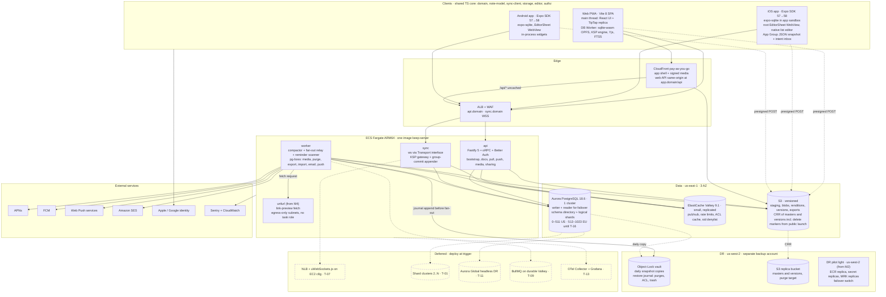

# Keep Clone: Core Architecture Spine

*Version 1.3 · 2026-10-04 · Status: approved baseline for detail design. v1.1 applied the adversarial sync and delivery reviews (§12). v1.2 applied the spine issues raised by the first eight detail docs (§13). v1.3 applies the 51 spine issues raised by the eight consumer docs (web, mobile, reminders, media, search, infra, security, verification); every disposition is listed in §14 with its C-id (C-201 to C-247).*

This document is the single source of truth for the architecture. It supersedes the four competing proposals (fidelity, simplicity, scale, platform) and folds in the four-judge panel (correctness, buildability, scale-security, client-UX). Every later document elaborates an item here and must not contradict it. To change a D-, INV-, P- or X- item, edit this document first and record the date and reason in the item.

**ID scheme.** A = assumption · D = decision · INV = sync invariant · P = product decision · X = cross-cutting rule · T = scale trigger · R = risk · Q = open question · M = milestone.

**Version policy.** Library versions are the ones the research briefs verified on npm or GitHub on 2026-10-04. Items marked **UNVERIFIED** must be confirmed in the milestone that first depends on them.

**Base selection.** No single proposal wins outright. Each layer takes its base from the proposal the panel scored best for that layer, then grafts from the others:

| Layer | Base | Grafts | Rejected from the base |
|---|---|---|---|
| Sync contract, domain model | **fidelity**: invariants I1–I8; per-note seq'd Yjs log with the ACL check inside the append transaction; edit-wins items; merge review; HLC clamp; deterministic simulator | scale: fresh server clientIDs, anti-entropy, `blocked_on` gating. simplicity: "clients never run sequence-inserting migrations". platform: `pending_mask`, inline tails | client-side lazy migrations; client rebalancing of shared keys; pipelined batches that race; full-content fork on revoke; global content-addressed blobs |
| Client architecture | **platform**: package layering, DocPort, root-owned pre-warmed editor host, LiveQuery skeleton grid, adaptive flush, cursor-first bootstrap (v1.1: keyset pages instead of one REPEATABLE READ transaction), PowerSync-shaped tables | fidelity: offline UX states, render-both rule. scale: raw-byte snapshots, client SLIs | op-sqlite + MMKV at launch; delete-wins items; schema-per-shard; ~8-person staffing (§8 instead cuts scope and re-baselines dates for 1–3 people) |
| Day-1 deployment | **simplicity**: one image with three Fargate services, pg-boss only, Sentry + CloudWatch, CDK in TypeScript, hard cut list | — | PowerSync + Hocuspocus; Expo Push |
| Operability, security | **scale**: failure-isolation table, brownout flags, partition-drop guard, canaries, `kspctl`, per-uploader blobs, HMAC'd invites, card-only pending shares | — | mseq exactly-once; ACL cache for writes; 2 clusters plus DR plus cells at launch; time-window log |

---

## 1. Context, constraints and explicit assumptions

### 1.1 Product and fixed constraints

- **Product.** A production-grade Google Keep clone: text and checklist notes with light rich text, images, labels, colors, pin, archive, 7-day trash, search, multi-device sync, sharing with real-time co-editing, and time reminders. Drawings, audio, widgets, Wear OS and a browser extension come later.
- **Platforms.** A responsive web app that installs as a PWA, plus native-feel iOS and Android apps built with React Native and Expo. All three share one TypeScript domain and sync core.
- **Stack.** TypeScript end to end: React web, a Node TypeScript backend, PostgreSQL, Valkey and S3-compatible object storage.
- **Offline model.** Local-first. Every edit works offline. The UI is instant: no interaction waits on the network. Concurrent edits to shared notes merge through a CRDT with no conflicts.

### 1.2 Explicit assumptions

| ID | Assumption | Consequence |
|---|---|---|
| A-01 | **The team is 1–3 engineers.** They work full-stack in TypeScript. One of them can write small Swift and Kotlin Expo modules. There is no dedicated SRE or DBA. | The day-1 footprint is small (§2.5). Every scale feature is designed in now and deployed at a measured trigger (§3.1). Pages fire out of hours only for durability, correctness, security and legal-deadline signals (X-11, v1.3). |
| A-02 | **Infrastructure costs at most $1.5k/month until traction.** | Managed services. Aurora Standard storage. Pay-as-you-go CDN. One Valkey, one cluster, one NAT. |
| A-03 | **Planning load (capacity model)** | Y1 at 1M MAU: 350k DAU, about 63k peak sockets, about 6.1k upstream messages/s before adaptive flush (about 2–3k after), 75M notes, about 0.6 TB Postgres, about 4.3 TB media. Y3 at 10M MAU: about 630k sockets, about 61k messages/s raw (about 20k after flush), 1.21B notes, about 9 TB Postgres, about 69 TB media. Worst reminder minute: 12.5k fires at Y1, 125k at Y3. |
| A-04 | **Per-user scale** | Designed for 5k notes per user. Degrades gracefully to 50k: notes still open in 3 s or less at p50, and server search covers accounts above 50k. |
| A-05 | **Cloud** | AWS us-east-1 across 3 AZs. Single region until T-16 (EU cell). EU-resident users are placed on EU-range logical shards from signup (§4.5), physically in us-east-1 until T-16 moves them. Backup copies and the restore journal live in a separate us-west-2 account (D-45). |
| A-06 | **Client support** | The two latest versions of Chrome, Edge, Firefox and Safari (OPFS needs Safari 16.4+). iOS 16.4+, the Expo SDK 56+ floor. Android at Expo SDK 57's minimum. |
| A-07 | **Launch scope** | Public MVP launch at M2 covers a single user on multiple devices. v1 GA at M4 adds sharing, live co-editing, reminders, link previews, OCR, filters, widgets and share targets. |
| A-08 | **Fidelity** | Keep behavior is the default. Deliberate departures and calls on unverified behavior are listed in §6. |
| A-09 | **Compliance** | GDPR and CCPA. App Store guidelines 4.8 (Sign in with Apple) and 5.1.1(v) (in-app deletion), including SIWA token revocation. Play's account-deletion policy (in-app deletion **plus** a web deletion URL declared in the Data safety form) and its exact-alarm policy. WCAG 2.2 AA and the EU Accessibility Act. (v1.3) The EU Digital Services Act duties of a hosting service (notice-and-action, statements of reasons); App Store guideline 1.2 and Play's user-generated-content policy (report, block, filter); a GDPR Art. 27 EU representative and a UK GDPR representative; DMCA designated-agent registration. The M2 release checklist covers the representatives, the DMCA agent and DSA notice-and-action; the M3 checklist covers App Store 1.2 and Play UGC, which apply once sharing ships. |
| A-10 | **No end-to-end encryption in v1.** The server reads content to merge, project, search and preview. | A "locked note" class is reserved for later (§4.1). |
| A-11 | **Clients are hostile and unreliable.** They can be offline for weeks, have skewed clocks, be restored from OS backups or cloned, run old builds, or be killed mid-write. | Invariants INV-1 through INV-18. |
| A-12 | **Calendar facts on 2026-10-04** | Node 26 becomes Active LTS on 2026-10-28. Expo SDK 58 (RN 0.88) is in beta, with GA imminent. Aurora PostgreSQL 18.6 has been available since 2026-09-29. Yjs 14 (`@y/y`) is only a release candidate. |

### 1.3 Non-functional targets

| Area | Target |
|---|---|
| Local create/edit/search/delete | 100% available, with no server dependency |
| Durable ack of an update (same region) | p50 ≤ 150 ms, p99 ≤ 600 ms. 99.95% monthly availability for the sync accept path |
| Cross-device or collaborator visibility, both online | p50 ≤ 300 ms, p99 ≤ 1.5 s |
| Reconnect catch-up (≤ 24 h offline, ≤ 500 changed notes) | p50 ≤ 1 s, p99 ≤ 5 s |
| Mobile cold start to first cards (5k notes, mid-range Android) | p50 ≤ 0.8 s, p90 ≤ 1.5 s. iPhone p50 ≤ 0.6 s |
| Tap card to editable | Text note p50 ≤ 250 ms (warm WebView). List note p50 ≤ 150 ms. Web (hydrated note, editor chunk warm) p50 ≤ 150 ms, p95 ≤ 400 ms (v1.3) |
| Web warm start | LCP p75 ≤ 1.0 s, INP p75 ≤ 200 ms, CLS ≤ 0.1. First live grid (navigation start to the first LiveQuery skeleton rendered) p50 ≤ 600 ms, p90 ≤ 1.2 s (v1.3) |
| Web cold start (first visit, or no service worker) | LCP p75 ≤ 2.5 s (v1.3). `06-web-app.md` owns the full web budget table |
| New device with 5k notes | First cards p75 ≤ 1.5 s. Fully offline-capable ≤ 15 s at 10 Mbps |
| Local search over 5k notes | p95 ≤ 50 ms |
| Memory | RN heap ≤ 250 MB (≤ 120 MB target with no Y.Doc open). Web ≤ 300 MB |
| Reminders | 99.9% alert within 60 s of the due time |
| Durability | Acked edits: RPO 0 on AZ loss (Aurora 4-of-6 quorum). AZ RTO ≤ 5 min |
| Region loss | Before T-11: RPO ≤ 24 h for server state; RTO ≤ 8 h, which rests on the DR prerequisites of D-45 (replicated images, secrets and multi-Region keys, a data-plane failover and a us-west-2 pilot light, v1.3). Recovered beyond the snapshot (§5.11): every owned note still on any of its owner's devices, every member's contributions still on that member's device, and every journaled purge, ACL change, block, trash transition and account-deletion request or cancellation. A shared note held **only** by members' devices survives as members' copies ("Make a copy"), not as the shared note. **Not recovered** after a directory restore: accounts created after the restore point (their devices keep their data under `SESSION_EXPIRED` and offer export before the user signs up again, INV-18) and sessions (all are revoked; users sign in again). After T-11: RPO ≤ 5 min and RTO ≤ 4 h |
| Erasure | Primaries purged within 30 days **of the deletion request**: the 14-day grace period (P-25), then the erasure saga with a 7-day target and a 16-day limit (v1.2). Backups age out within 35 days (PITR) and 90 days (monthly copies). S3 replicas are purged with their sources. Vendor stores (Sentry, analytics) hold no content and only pseudonymous IDs, and are erased through a vendor API or age out within 90 days (X-06, v1.3). A legal hold copies data to the evidence store and never extends this limit (P-25, v1.3). The restore journal, held in the DR region, is replayed on every restore, including after region loss; it carries account-deletion requests and cancellations as well as purges, so a restore never silently undoes or revives an erasure request (D-45) |

---

## 2. Architecture at a glance

### 2.1 Ten-line summary

1. **Clients.** A Vite 8 PWA and Expo SDK 57→58 apps run one TypeScript core. Every action commits to local SQLite first (sqlite-wasm on OPFS in a Worker on web, expo-sqlite on mobile). The grid, search and reminders read local tables only.
2. **Shared content** is one **Yjs 13.6 doc per note**: title, rich body, checklist items, attachment refs. **Per-user state** (color, background, pin, archive, grid order, labels, reminder) is relational rows merged by per-field HLC last-writer-wins. Per-user state never enters a doc.
3. **One sync plane, KSP v1.** Each device holds one WebSocket. It carries a per-user **USN feed** of rows, plus per-note **seq'd Yjs logs** with durable acks. HTTP mirrors the same messages for bootstrap and background sync. PowerSync and Hocuspocus are not used.
4. **Writes are authorized in the transaction.** A group commit first locks each note's narrow lock row, then, in a fresh statement, keeps only appends to notes it locked whose author is an active member (or the compactor's system principal) of a non-purged note. Membership changes and purges take the same lock first, so a committed revocation is always seen. Seq is assigned after that filter, so seqs are gap-free. The ack is sent only after the Aurora commit.
5. **The server never rejects an authorized update.** Limits are enforced in client editors; an over-limit merge is accepted and flagged, never moved. A single-owner **compactor** writes snapshots, projections, migrations, key rebalances and cleanups as server-origin updates, each run with a fresh clientID.
6. **Topology.** One Docker image runs three Fargate services (`api`, `sync`, `worker`) behind one ALB, plus from M4 a fourth, tiny one, `unfurl`, that fetches link previews from egress-only subnets (D-26, D-50; v1.3). Data lives in one Aurora PostgreSQL 18.6 cluster (a `directory` schema plus logical shards 0–511 for US residents and 512–1023 for EU residents), one small Valkey 9.1 (pub/sub only), and S3 with CloudFront.
7. **Scale is designed in.** Client-minted UUIDv7 IDs carry a **12-bit logical shard**, and `shard_id` leads every key. Other members' projection rows always go through a transactional outbox relay. Physical splits, partitions, uWS/NLB, BullMQ, Aurora Global and OTel deploy only at named triggers (§3.1).
8. **Reminders fire locally on every mobile device.** A server ledger and direct APNs, FCM and Web Push cover web and unarmed devices. One device rings, the others stay passive, an action on any device clears the rest. Device coverage is a lease, and the scheme fails open if the ringing device goes stale or misses a fire.
9. **Media is uploaded per uploader** to an S3 staging key with a checksum, re-encoded by sharp into the served master, and served through short-lived signed URLs. Search is SQLite FTS5 on every client, with Postgres FTS only while a device's bootstrap metadata stream is incomplete (any platform) and for very large accounts (v1.3).
10. **Correctness is a deliverable.** INV-1 through INV-18 are executable properties in a deterministic simulator that gates every sync change. Production runs convergence audits, canaries and an epoch kill-switch, and nothing a user typed is discarded without consent.

### 2.2 Container diagram

Solid boxes are deployed on day 1. Dashed boxes are designed in but deployed only at a trigger in §3.1.



### 2.3 Fatal-flaw disposition

Every fatal flaw the panel raised, deduplicated across judges:

| # | Flaw (proposal) | Disposition in this spine |
|---|---|---|
| F1 | Local content GC fires when a row disappears, and rejected ops return 200 and are dropped, so offline content is erased (simplicity) | PowerSync is not adopted (D-14). Clients purge only on a **typed terminal tombstone** (INV-13). Unacked own typing becomes a recovered draft (INV-12). Rejections are typed, and creates are never silently dropped (§5.6). |
| F2 | A client-supplied trash timestamp drives the irreversible purge (simplicity) | Trash is an **HLC-guarded register** with server-assigned `trashed_at` and `purge_after = now() + 7 d` (§5.3 `note.setTrashed`, P-03). |
| F3 | mseq high-water dedupe combined with a cloneable device_id silently drops mutations (scale) | No counters. Every op is **idempotent by construction** (D-17, X-02), and device identity cannot be cloned (INV-18, D-42). |
| F4 | Content appends have no in-transaction ACL, so revoked writers keep writing and purged notes come back as zombies (scale) | **INV-5:** `EXISTS(active member) AND purged_at IS NULL` in the append transaction, evaluated in a statement that starts after the note's lock row is held, only for notes whose lock row that transaction holds, so a revocation or purge that committed first is always seen (§5.8). The compactor, fan-out relay and media paths all check purged state (INV-13). |
| F5 | The server rejects authorized updates on trashed, frozen or old-schema notes, which orphans causal chains (scale, platform) | **INV-4:** accept. Over-limit merges are flagged and editors stop further growth; the server never moves content. Trash is read-only in the UI only. The schema gate runs in the client core, not the gateway (INV-9). |
| F6 | A lossy pub/sub feeds a CRDT state cache that has no gap detection (platform; also scale and fidelity LRUs) | **INV-17:** caches are keyed by `(noteId, seq)` and extended only by contiguous frames. No cache is deployed on day 1 (T-06). |
| F7 | Client lazy migrations duplicate sequence content (fidelity) | **INV-10:** the server compactor is the only migrator. Clients write only idempotent LWW map keys. |
| F8 | Pipelined batches race the group commit, so fork-on-FORBIDDEN purges the client's own new note (fidelity) | Per-connection serial commit admission, `blocked_on` gating, and a retryable `NOTE_UNKNOWN` that is distinct from `FORBIDDEN` (§5.6, §5.8). |
| F9 | Epoch resync silently purges notes the server lost in a restore (fidelity) | **INV-14:** after a restore, clients re-assert creates. A **restore journal** held outside the database, in the DR region (S3 Object Lock), is the purge deny-list and also replays ACL, trash and account-deletion changes. Per-note counters jump, and notes re-asserted during the post-restore window start above the jump, so seqs never repeat (§5.11). |
| F10 | Hocuspocus's Redis extension is HA, not scale-out (simplicity) | Hocuspocus is rejected. The gateway is a stateless append-then-fan-out design (D-14, D-18). |
| F11 | PowerSync's replication ceiling and vendor-owned client database force a re-platform (simplicity) | Rejected. Synced tables stay PowerSync-shaped (`user_id`, `usn`) as an escape hatch (D-14). |
| F12 | Invites can be claimed by anyone holding the token (platform) | Claim requires a **verified email matching** the invite. The token only pre-fills, is single-use and expires in 30 days (P-15). |
| F13 | Unsynced edits are discarded on revoke or purge (simplicity, scale, platform). A full-content fork leaks the owner's note (fidelity) | **INV-12:** only this device's own unacked insertions become a local draft, kept or discarded by the user's choice. Others' content is never copied. |
| F14 | Content sockets are never re-authorized (simplicity) | JWT expiry forces re-auth in band. Live subscriptions are re-validated every 60 s and after any Valkey reconnect. Writes are checked in the transaction regardless (D-28, D-41). |
| F15 | Global content-addressed blobs with a HEAD-only commit allow possession bypass (fidelity) | **Per-uploader** keys `b/{shard}/{uploader}/{sha256}`, a presigned POST with a checksum to a per-uploader staging key (v1.3), and quota charged to the uploader (D-39). |
| F16 | No region-loss mechanism (fidelity, simplicity) | Daily cross-region, cross-account snapshot copies from beta. S3 CRR from public launch. Aurora Global headless at T-11 (GA or 50k MAU). Before T-11, client re-push and journal replay (§5.11) cover owned notes still on an owner's device and members' contributions still on their devices; the residual exposure is accepted and documented (§1.3). |
| F17 | The App Group SQLite database causes 0xdead10cc terminations (scale, fidelity) | The database stays in the app sandbox. Extensions read a JSON snapshot and write to an inbox directory (D-38). |
| F18 | Per-card CRDT work runs on the grid hot path (fidelity) | Only the open note, plus a small LRU, holds a Y.Doc. Cards render projections. Re-derivation is throttled and paused during gestures (D-09, D-23). |

### 2.4 Divergence crosswalk

Each topic where the judges disagreed, and how it was resolved:

| Topic | Resolution | IDs |
|---|---|---|
| Sync topology | One custom plane, KSP | D-14 |
| Handling of over-limit, trashed or old-schema updates | Accept (I4). Over-limit is flagged and editors stop growth; the server never moves content | INV-4, D-24, P-12 |
| Content write authorization | In-transaction membership + not-purged check, in a statement that starts after the note's lock row is held | INV-5, D-28, §5.8 |
| Log ordering primitive | Per-note gap-free `content_seq` under sorted row locks | INV-6, D-18 |
| Structural normalization | Render-time only. Server writes only for migration, rebalance, GC, conversion cleanup or dedupe, and empty projection-refresh appends (v1.3); never to move content | INV-11, D-24 |
| Delete vs concurrent edit of an item | Edit-wins soft delete with `textHash`; GC timed by server-observed first-seen times, never by client clocks | §4.3, P-19 |
| Text↔list conversion | Soft, deferred conversion; provenance-keyed dedupe of concurrent conversions; merge review | §4.3, P-18, P-19 |
| Who migrates or rebalances shared docs | The server compactor only | INV-10 |
| y-tiptap deleting unknown nodes | Core gate before the binding on a grow-only level set **and** a structural check of node, mark and attribute names and of their shapes (`malformed`); schema ahead of UI; a 95% gate | INV-9, D-10 |
| Retry dedupe | Idempotent by construction. No mseq, no dedupe table | D-17 |
| Bootstrap consistency cut | Cursor first, then keyset pages in short statements on the writer; catch-up from the earliest cursor | INV-16, D-21 |
| HLC hygiene | Clamp at +60 s, stored HLC returned in the ack; clients merge every server-issued HLC, feed pages included | INV-15, D-16 |
| Trash/restore under reordering | HLC register, server purge clock | §5.3 (`note.setTrashed`), P-03 |
| Unsynced edits on revoke or purge | Own-delta recovered draft | INV-12 |
| Doc rebase | Not in v1. `doc_epoch` reserved | D-13 |
| Ordering keys | Jittered keys plus a tie-safe helper | §4.6 |
| Reminder occurrence identity | `r:{noteId}:{wall-time ISO}` in the resolved zone | §4.5, D-36 |
| Content persistence, batching key | Append log, group commit per physical cluster | D-18 |
| Shard representation, field width, physical layout | 12-bit field, `shard_id` column, 1 cluster in production and staging; CI runs cross-cluster paths on an ephemeral second cluster until the M4 rehearsal | D-29, D-30 |
| Directory placement | A schema in the same cluster until the first shard move | D-29 |
| Job queue, hot-path jobs | pg-boss plus SKIP LOCKED scanners. BullMQ at T-09 | D-34 |
| Push provider | Direct APNs, FCM and Web Push, with ID-only payloads | D-37, X-20 |
| Socket library, compute, LB, ingress | `ws` on Fargate behind the ALB. uWS/EC2/NLB at T-07. API and WS stay off CloudFront | D-27, D-43, D-44 |
| Web local DB, multi-tab, where sync runs | sqlite-wasm sahpool in a DB Worker that hosts sync, with a versioned leader, heartbeat, lock-steal takeover with fencing, and a visible "held by another tab" state | D-04 |
| RN SQLite driver | expo-sqlite. op-sqlite at T-14 | D-06 |
| Observability | Sentry + CloudWatch. OTel/Grafana at T-13 | D-46 |
| DR | Snapshots plus CRR at launch, with the DR prerequisites and a us-west-2 pilot light from M2 (v1.3); Global at T-11 | D-45 |
| Reminder multi-device dedupe | Coverage leases, Android fire receipts, ledger, single ringer with fail-open | D-36, P-09 |
| Doc flush cadence | Adaptive: 2 s solo, 250 ms when peers are present | D-19 |
| Blob keying and quota | Per-uploader keys, proof of possession, quota on the uploader; uploads land on a staging key and only the pipeline writes masters; one `blob_refs` row per referencing attachment (v1.3) | D-39, P-14 |
| Shares from non-contacts | Card-only pending inbox | P-15 |
| Session revocation granularity | Per-sid denylist, durable in Postgres, cached in Valkey and process memory | D-41 |
| Cloned or reinstalled installs | DB excluded from backups and device transfer; registration reset in place; rotating continuity token; identity reset that keeps cursor epochs | D-06, D-42, INV-18 |
| Invite record home | Owner-shard invite slots decided under the note's lock row; directory index written through the outbox | §4.4, D-32 |
| Undo next to collaborators | One UndoManager per editing session on a fresh replica; undo never removes another client's content | D-12, §4.3 rule 8 |
| Image retention | ≤ 3,072 px masters. Originals on a paid tier only | D-40, P-13 |
| Mobile editor host, title placement | Root-owned pre-warmed WebView with the title inside | D-11 |
| Checklist editor parity | Shared ChecklistController and TextBinding | D-12 |
| Y.Doc residency, card projections | Open note plus LRU. Server projection with a monotonic guard | D-09, D-23 |
| Reactive queries, grid data | Own LiveQuery, skeleton plus payload LRU | D-09 |
| Masonry placement, drag | FlashList default arrangement (parity checked in M0), long-press overlay | D-08 |
| Default web hydration | Full on every platform. Lazy only above 20k notes or low quota | D-21, P-22 |
| Widget and extension data path | JSON snapshot plus inbox on iOS, in-process on Android | D-38 |
| Exact-alarm denial | Push-primary; an inexact local alarm only as an offline fallback after due, cancelled by the push or any action | D-36 |
| Background flush | `bg-flush` native module, from M1 (v1.3) | D-38 |
| Client FTS | unicode61 with prefix indexes on an external-content table, plus a lazy trigram table for scripts unicode61 cannot segment | D-35 |
| Derived data (OCR, link previews) reaching projections | Compactor `reproject` run; an empty system append gives the new projection a higher `projected_seq` (v1.3) | D-24, §5.9 |
| Writes from contexts that cannot open the DB | Durable inbox entries, drained idempotently by intent ID (v1.3) | INV-1, D-38 |
| Irreversible trash ops | Compare-and-set on the `trash_hlc` the user saw | §5.3, D-17, P-03 |
| Restore of shared state | Restore journal (purges, ACL, trash, account-deletion events) in the DR region; per-note counter jump plus a 30-day post-restore counter floor for re-asserted notes; typed `restore_lost` | §5.11, D-45, INV-14 |
| Hot note counters, compaction scheduling | Narrow `note_log_state` lock row; `compact_due` queue also schedules retention, GC and migrations | D-18, §5.9 |
| Uploader leaves a shared note | Attachments transfer to the owner's scope and quota | D-39, P-14 |
| EU residency | EU-range shards from signup, moved by shard move at T-16 | §4.5, T-16 |
| Session expiry | 90-day sliding mobile sessions; `SESSION_EXPIRED` keeps data; DB bound to one account; web API same-origin | D-41, INV-18 |

### 2.5 Day-1 footprint and cost

Costs below are list-price estimates, **UNVERIFIED to ±30%**.

| Component | Beta (M1) | Public MVP (M2) |
|---|---|---|
| ECS Fargate ARM64 (`api` 2×0.5 vCPU, `sync` 2×1 vCPU, `worker` 2×1 vCPU) | ~$130 | ~$130 |
| Aurora PostgreSQL 18.6, Standard storage, writer + reader in 2 AZs | db.t4g.medium ×2, ~$110 | db.r8g.large ×2, ~$420 |
| Aurora storage, I/O, backups, daily cross-region copy | ~$40 | ~$80 |
| ElastiCache Valkey 9.1, cache.t4g.small primary + replica | ~$50 | ~$50 |
| ALB (~$16 + LCU), WAF (~$15+), 1 NAT gateway (~$33 + processing), S3 gateway endpoint (free). ECR, Logs and Secrets go through the NAT; interface endpoints (4 × 3 AZ ≈ $88) only at T-18 | ~$90 | ~$110 |
| S3 + CloudFront pay-as-you-go (< 1 TB egress, web `/api` requests), S3 CRR, DR-region journal bucket | ~$20 | ~$90 |
| Sentry Team, CloudWatch, SES, KMS (multi-Region keys from M2), Secrets Manager, CloudTrail, GuardDuty | ~$130 | ~$220 |
| DR pilot light in us-west-2 (D-45, v1.3: VPC without NAT, DR ALB, ECR, secret and key replicas, failover switch) | — | ~$30 |
| **Staging** (2 AZs, NAT only, no interface endpoints; one db.t4g.medium writer; Fargate and Valkey at minimum size, scaled to zero outside working hours; a second cluster only for the M4 shard-move rehearsal) | ~$150 | ~$200 |
| EAS plan (builds, updates, submit; price **UNVERIFIED**) | ~$100 | ~$200 |
| **Total** | **≈ $0.8k/month** | **≈ $1.5k/month** |

- **Not in the table:** the Apple developer fee ($99/year) and Play ($25 once); from M4, the `unfurl` service (2 × 0.25 vCPU, ≈ $20/month, D-26, v1.3).
- **A-02 headroom is thin at M2.** The levers, in order: 1-year Savings Plans and reserved Aurora instances (≈ 25–30% off compute); staging scale-to-zero enforced by schedule; a db.t4g.large writer instead of r8g.large if the M2 load test at 2× expected peak passes on it. The M2 exit review records which levers were pulled.
- **At planning scale:** about $9–10k/month at 1M MAU and about $45–50k/month at 10M MAU on demand, roughly 25% less with commitments. These figures correct the panel's CDN-request math and include T-01, T-07 and T-11 being active by then.

---

## 3. Decision register

**Stage** is either *Day-1* (built and deployed from the first production release that needs it) or *Deferred: T-xx* (designed in now, deployed when that trigger fires; triggers are in §3.1).

| ID | Area | Decision | Rejected alternatives | Rationale | Stage |
|---|---|---|---|---|---|
| D-01 | Repo, tooling | **Monorepo:** pnpm 12.9.1 workspaces + Turborepo 2.11.7 with remote cache.<br>**Packages:** internal packages ship TS source with `react-native` and `browser` export conditions, so there is no per-package build.<br>**Guardrails:** dependency-cruiser layer rules in CI (X-19). Renovate. Node pinned via `packageManager`/`engines` (≥ 24.3; Expo SDK 58 needs ≥ 22.13 / 24.3). TS strict, zod 4. | Nx 23.2 (generators and plugin coupling) | Expo documents and supports this setup. The config is small. Layer rules replace review discipline a 1–3 person team lacks. | Day-1 |
| D-02 | Package boundaries | **Shared packages:**<br>- `domain`: types, zod schemas, limits, IDs, HLC, ordering, recurrence, time<br>- `note-model`: Y.Doc schema, ChecklistController, Projector, normalization, conversion<br>- `sync-protocol`: frames and codecs<br>- `sync-client`: SyncEngine, Outbox, DocStore, FeedApplier, UploadQueue, ReminderPlanner, LiveQuery<br>- `storage`: SqlDriver and SQL migrations<br>- `editor`: TipTap schema, EditorSurface, DocPort<br>- `authz`: pure predicates plus SQL fragments<br>- `api-contract`, `ui-tokens`, `i18n`<br>**Apps:** `web`, `mobile`, `server`. | Sharing screens through RN Web or Expo web; a Kotlin Multiplatform or Rust core; a `view-models` package on day 1 | One language. The same Projector, recurrence, normalization and authz code runs on client and server (X-13). Screens stay idiomatic per platform. | Day-1 (`view-models` added when the same hook is duplicated in 3 or more places) |
| D-03 | Web app | Vite 8.3.2 SPA + TanStack Router 1.170 + vite-plugin-pwa 2.0.0 (Workbox app-shell precache, **prompt** update mode). Marketing site is a separate static build. Served from S3/CloudFront at `app.<domain>`. | Next.js 16.3; TanStack Start; Expo web / RN Web | All logic runs on the client. SSR behind a login adds cost and hydration bugs. | Day-1 |
| D-04 | Web local DB, threading, multi-tab | **Storage:** `@sqlite.org/sqlite-wasm` 3.53.4 on the `opfs-sahpool` VFS in a **dedicated DB Worker**. That worker also hosts the KSP engine, Yjs merging and FTS5. The main thread renders and holds the editor replica, which talks to the worker through DocPort.<br>**Leader election:** one tab per origin is leader, elected with Web Locks. The leader advertises its **app build version**. Leadership moves to the visible tab on `visibilitychange`; on a cooperative handoff the leader releases the sahpool handles and the next leader reacquires them. Followers RPC over BroadcastChannel.<br>**Takeover from a hung leader (v1.2):** a visible follower that misses 3 heartbeats (2 s each) requests the leader lock with Web Locks `{steal: true}`. Stealing **fences** the old leader: its lock request rejects, and if it ever runs again it stops writing and answering RPCs and re-discovers. OPFS sync access handles are exclusive, so a frozen (not dead) tab can still hold them: the new leader retries opening every 500 ms for 30 s, then enters **"Keep is open in another tab that isn't responding"**, retrying on visibility and every 10 s. In that state every mutation fails visibly and is never reported as saved (INV-1), and editor edits stay unacked in their replicas (`beforeunload` warns). Verified in M0 spike 3.<br>**Startup and exit:** first paint comes from a cached first-page JSON snapshot (top 50 cards) while the worker boots. `navigator.storage.persist()` is called after sign-in. `beforeunload` warns only when unacked work is older than 2 s or the client is offline. | PowerSync wa-sqlite + SharedWorker (SharedWorkers are disabled on Android and Safari); Dexie/IndexedDB; y-indexeddb; `opfs` VFS with COOP/COEP | Real SQL, transactions and FTS5. Single writer, after Notion's multi-writer OPFS corruption. INP stays protected because Yjs and SQL run off the main thread. | Day-1 |
| D-05 | Mobile framework, release | Expo SDK 57 (`expo@57.0.26`, RN 0.86, React 19.2, Hermes V1, New Architecture), moving to **SDK 58 within 4 weeks of GA** (scene lifecycle, R8 tested early). Expo Router 57, dev clients (`expo-dev-client@57.0.19`). EAS Build/Submit/Update (`eas-cli@24.10.0`) with `runtimeVersion.policy = fingerprint`. | Bare RN 0.87 | CNG, config plugins, OTA updates for JS fixes, and SDK modules versioned in lockstep. | Day-1 |
| D-06 | Mobile local DB | `expo-sqlite@57.0.3` (WAL, FTS5 on by default, synchronous API for the cold-start skeleton query) behind `SqlDriver`. The DB file lives in the **app sandbox**, never in an App Group, and is **excluded from OS backups and from device-to-device transfer** (iOS `isExcludedFromBackup`; Android `dataExtractionRules` with both `<cloud-backup>` and `<device-transfer>` excludes, v1.2). The same applies to the files that hold the session and device tokens. Data protection class: CompleteUntilFirstUserAuthentication. | op-sqlite 18.2 + MMKV at launch; App Group database; PowerSync op-sqlite | First-party and versioned with the SDK. Two fewer native dependencies. Avoids 0xdead10cc. Restored backups cannot clone sync state (INV-18). | Day-1. **Deferred: T-14** (op-sqlite) |
| D-07 | UI, styling | `packages/ui-tokens` generates a Tailwind v4 `@theme` (web) and a react-native-unistyles 3.4.0 theme (native). The 12 note colors and backgrounds are semantic tokens with light and dark values. Reanimated 4, Gesture Handler and expo-haptics at SDK-pinned versions (`npx expo install`). | NativeWind 4.2.7 / 5.0-rc; Tamagui 2.7; react-strict-dom 0.0.x | Keep's UI is small, so shared tokens are enough. Unistyles re-themes over JSI with no re-render across 5k cards. | Day-1 |
| D-08 | Grid, drag | **Web:** `@tanstack/react-virtual` 3.14 `lanes` with `measureElement`, plus `@dnd-kit/react` 0.5.0.<br>**RN:** `@shopify/flash-list` 2.3.3 `masonry` with the **default** `optimizeItemArrangement` (shortest-column placement, matching web lanes; parity is verified in M0) and a custom long-press RNGH/Reanimated drag overlay that drags in place with no mode switch. Drop index is computed in data order, and reflow is throttled during drag.<br>**Both:** cards are memoized by `(id, row_v)`, and `getItemType` separates text, list and image cards. | react-native-sortables reorder mode (virtualization UNVERIFIED; Keep has no reorder mode); CSS `grid-lanes`; `optimizeItemArrangement=false` (ragged columns) | Virtualized masonry stays flat in cost from 5k to 50k notes. | Day-1 |
| D-09 | Client reactive data, Y.Doc residency | **LiveQuery** (own code) does table and row invalidation, diffs by `(id, row_v)`, and exposes `useSyncExternalStore`. The same code runs in the web Worker and on the Hermes JS thread.<br>**Grid data:** a **skeleton** `{id, row_v}` array plus a **payload LRU** of about 600 cards filled around the viewport. Sync batch application pauses while a scroll or drag gesture is active and resumes within 100 ms after it ends.<br>**Y.Doc residency:** only the **open note** (its core doc plus the editor's replica, D-12) and an LRU of 8 recently opened notes hold a Y.Doc. All other docs stay as raw bytes and are never decoded during bootstrap. | TanStack DB 0.11 (pre-1.0); PowerSync watch queries; live Y.Docs for visible cards | Hermes has one JS thread, so per-card decoding would miss the ≥ 58 fps fling and ≤ 250 MB targets. | Day-1 |
| D-10 | Rich-text editor, schema | **Libraries:** TipTap 3.31.4 + `@tiptap/extension-collaboration` + `@tiptap/y-tiptap` 3.0.9, bound to a `Y.XmlFragment`, with Yjs UndoManager (StarterKit history off).<br>**Schema v1** (§4.3) is minimal and permissive (`block+`, marks everywhere). The reserved nodes `todoLine`, `noteLink` and the `strike` mark ship in v1 before any UI ("schema ahead of UI").<br>**Gate:** before forwarding any update to an editor replica, the client core checks the doc's effective schema level (the grow-only `meta.lv` set) **and** the node, mark and attribute names that the update and the loaded doc actually contain, and the shapes they sit in (INV-9; v1.2 adds the shape check). | Lexical 0.52 (no RN renderer); `@y/prosemirror` 2 beta | Most mature Yjs binding, with one bundle for web and mobile. y-tiptap deletes Yjs elements it cannot map (panel-verified in 3.0.9 dist), so gating must happen before the binding sees an update. | Day-1 |
| D-11 | Mobile text-note editor host | **One host:** a root-layout-owned, pre-warmed Expo DOM component (`'use dom'`) **EditorSheet**. It mounts after the first frame, or immediately when the app is launched by a capture intent, and lives for the app's lifetime.<br>**One document:** for text notes, a single WebView document holds the **title, body, image carousel, link cards, chips and "Edited" footer**, giving one scroll container and one UndoManager. It renders both parts of a mixed note (rule 5), including a list note opened with "Edit as text" (D-12).<br>**Per-note load:** each note load creates a **fresh Y.Doc** in the WebView.<br>**Bridge:** DocPort carries base64 Yjs updates in **acked batches**. A 5 s heartbeat detects a killed WebView process and remounts from the core, which is the source of truth.<br>**Interactions:** a card-expand transition. **Cold capture (v1.2):** while the WebView is not ready, native title and body inputs bind to an **in-process DocPort session** on the new note, so every keystroke reaches the core doc and is in SQLite within one D-19 tick (INV-1); the note materializes on first content (P-23) and the WebView takes over when warm. There is no buffer outside the core. Images open in a native viewer. Keyboard handling uses react-native-keyboard-controller. | DOM component mounted per note route with a native title above it (two scroll containers, split undo); 10tap-editor 1.0.1 (cadence, no Yjs); react-native-enriched-html 1.1 (HTML I/O, no CRDT API) | Hides WebView start-up. Avoids native/WebView scroll and keyboard coupling. One undo per note. | Day-1. Fallback if M0 says no-go: `react-native-enriched` + an adapter for the tiny schema |
| D-12 | Checklist editor | List notes are **fully native**. A shared, headless **ChecklistController** in `note-model` handles split, merge, indent with the first-item rule, cascade check, paste-to-items, reorder and Enter/Backspace semantics. It drives RN `TextInput` and web `<textarea>`.<br>**Mixed list notes** (a visible body, rule 5): the native list host renders the body as read-only native rows with **Edit as text** (opens the EditorSheet, which renders both parts) and, from M4, **Convert remaining** (v1.2).<br>**TextBinding** diffs input into `Y.Text`, maps the cursor with `Y.RelativePosition`, and **holds remote updates during IME composition**. RN exposes no composition state, so a small **`ime-state`** Expo module (D-38: iOS `markedTextRange` of the first responder, Android composing span of the focused `EditText`) reports it; a typing-window heuristic is the fallback (v1.2, M0 spike 1).<br>**RN:** a virtualized list with **one active TextInput**; other rows render as `Text`, so up to 1,000 items work and focus survives recycling.<br>**Replicas and undo (v1.2):** every editor on every platform binds a **fresh replica doc** over DocPort (worker ↔ main thread on web; WebView or in-process on native), never the core doc, so the INV-9 gate, the IME hold and the fresh-doc rule are uniform. Each editing session has **one Yjs UndoManager** on its replica over `title`, `items`, `attachments` and `hiddenLinks`, plus `body` when the host shows it and `meta` for conversions, so removing an image or a link preview can be undone. §4.3 rule 8 limits what undo may remove. | TipTap TaskList in the WebView; separate list logic per platform | Lists are Keep's hottest surface. If web and RN implemented split, merge or indent differently, collaborators would produce divergent docs. | Day-1 |
| D-13 | CRDT | Yjs 13.6.33, pinned `~13.6`. **One `Y.Doc` per note**, `gc: true`. All Y access goes through `note-model`.<br>Each persisted doc records `crdt_format` (1 = Yjs 13 update v1).<br>Server-side Y.Doc instances use a **fresh random clientID per instance**. Clients never persist or reuse a clientID.<br>Doc rebase or re-encoding is **not offered in v1**; `doc_epoch` is reserved in the protocol and schema. | Loro 1.16 (RN binding lags); Automerge 3.5 (no RN path); Yjs 14 RC `@y/y`; doc rebase with forked writers | Pure JS on Hermes, about 29 KB gzipped, with the widest binding ecosystem. Keep's size limits plus GC keep docs well under 2 MB. | Day-1 |
| D-14 | Sync topology | A **custom single plane, KSP v1**. Each device has one WebSocket that multiplexes:<br>- a per-user **USN feed** of HLC-LWW rows;<br>- per-note **seq'd Yjs logs** with durable acks;<br>- control frames.<br>HTTP mirrors the same messages for bootstrap and background contexts. Synced tables keep a **PowerSync-shaped** `(user_id, usn)` layout as an escape hatch. | PowerSync Cloud + Hocuspocus (two planes, drift, 2–4k ops/s replication ceiling, vendor-owned client DB, unpriced); Hocuspocus alone (Redis extension gives HA, not scale-out); y-redis | One ACL point inside the write transaction. One outbox and one tombstone model, which can be simulated. No vendor ceiling below the 10M MAU target. | Day-1 |
| D-15 | Wire encoding | lib0 varint binary envelopes `[type][reqId][flags][traceparent?][payload]`. Yjs payloads are raw bytes. Row images are compact JSON, validated by zod **strictly on the server** and with `passthrough` on clients.<br>The protocol version travels in HELLO. Fields are additive only. | Protobuf via `@bufbuild/protobuf` (version UNVERIFIED, codegen in the core); JSON-only frames | The same codec family as y-protocols. Reserving `traceparent` now is free. | Day-1 |
| D-16 | Per-user state merge | Per-field **HLC LWW**:<br>- Every mutable per-user field carries an HLC (`field_hlc` jsonb on the server, a column on the client).<br>- The server applies a field only if the incoming HLC is greater than the stored one, **clamps physical time > now + 60 s**, returns the stored HLC in the ACK, and stamps server-originated writes with the server HLC.<br>- The client merges every server-issued HLC it receives (v1.2): `serverHlc` on WELCOME and ACK, every ACK result `hlc`, every HLC in an adopted `stale` row, and the highest HLC of each applied FEED page or bootstrap batch (`field_hlc` values, `trash_hlc`, pair and key HLCs). All of them were clamped on write, so merging never moves a clock past server `now + 60 s`.<br>- `pending_mask` means an incoming feed field is applied over a pending local edit only if its HLC ≥ the local HLC. | Arrival-order LWW (PowerSync default); +5 min clamp; no clamp | A stale offline write never beats a newer one, and a fast clock can't win forever. No optimistic-UI flicker. | Day-1 |
| D-17 | Retries, idempotency | **Every op is idempotent by construction** (§5.3 catalogue). Keys are:<br>- client-minted IDs, with creates as insert-if-absent plus an owner check;<br>- `(note, principal)` for membership;<br>- HLC guards for fields, trash and leave;<br>- compare-and-set on the `trash_hlc` the user saw, for the irreversible Empty Trash and Delete forever (HLC guards are kept only for reversible LWW fields);<br>- occurrence keys for reminders.<br>`ccid` (UUIDv7) exists per op for correlation and tracing only. | Per-device mseq high-water mark (silent loss after clone or reorder); 14-day `mutation_dedupe` table (platform's PK bug, extra hot table); 10-minute Valkey seen-set | No ordering assumptions to break, so it is safe for cloned or restored devices and for duplicated or reordered delivery. | Day-1 |
| D-18 | Content durability path | **Append:** a stateless append to `note_updates` with a per-note **gap-free `content_seq`** (INV-6).<br>**Group commit:** one group commit per **physical cluster**, every ≤ 10 ms or ≤ 128 rows (25 ms under `SLOW_DOWN`), as one READ COMMITTED transaction (§5.8) that first takes the shard write fence (`ops.enter_shard_write`, v1.2), then runs two statements:<br>1. statement one locks the target `note_log_state` rows in sorted `(shard_id, note_id)` order and returns the **locked set**;<br>2. statement two, whose snapshot is taken after the locks are held, considers only notes in the locked set and filters by active membership (or the system principal) and not purged;<br>3. assigns seq;<br>4. inserts;<br>5. bumps, and upserts `compact_due` on the first user append after a compaction **and** on every session start; results map back by input ordinal, never by `ccid`.<br>**Lock row:** the hot counters (`content_seq`, `last_append_at`, `content_edited_at`, `snapshot_seq`, `log_floor_seq`) live in a narrow `note_log_state` row with fillfactor 70 and no secondary index, so every bump is a HOT update and the wide `notes` row is written only at compaction. Membership changes and purges lock this row first.<br>**Ordering:** at most one in-flight commit per connection, so per-device order is preserved.<br>**Ack:** `DOC_ACK{seq}` only after the Aurora commit. | Hocuspocus in-memory doc with debounced store; wall-clock window log without seq (scale); per-logical-shard batching (≈ 1 row per transaction at Y3); a single CTE whose membership `EXISTS` reads the pre-lock snapshot (misses a revocation that commits while the statement waits); counters on the wide `notes` row (non-HOT update per append) | Stateless gateways mean deploys with no drains or doc affinity. Seq gaps make debugging tractable. RPO 0 for acked edits. | Day-1. **Deferred: T-17** (append writer / affinity), **T-10** (Valkey Streams hot log) |
| D-19 | Doc flush cadence | Persist to local SQLite every **250 ms** regardless of network.<br>Send to the server every **2 s when solo**, or every **250 ms** when the server reports live peers (`peers > 0` in `DOC_SYNC`, updated by `DOC_PEERS` when the count crosses 0 ↔ ≥ 1, v1.2).<br>Always flush on blur, note close, `visibilitychange` and app background. | Fixed 150 ms (fidelity); 4 Hz (scale, simplicity) | Local durability doesn't depend on send cadence. Cuts server write rows 3–4×, which delays T-05 and T-01, and saves radio wake-ups. | Day-1 |
| D-20 | Client outbox | **Two durable stores in the same SQLite transaction as the change:**<br>- metadata ops go to `outbox`;<br>- doc updates go to `doc_update` with `state` 0 (unsent), 1 (in flight, with ccid) or 2 (acked).<br>**Ordering:**<br>- **Lanes** are keyed by target logical shard; a `RETRY_LATER{lane}` pauses only that lane.<br>- FIFO per note.<br>- `blocked_on`: content and media for a note created on this device (by `note.create` or `note.copy`) wait for that op's ack; per-user ops for a note wait for any unacked note-scoped op on that note (e.g. a reminder set right after accepting a share); and `note.leave`, `share.respond{decline\|block}` and `note.copy` (on its source) wait until this device's earlier unacked content rows for that note are acked or held awaiting a tombstone (v1.2).<br>**Reductions:**<br>- merge unsent doc updates per note up to 64 KB with `Y.mergeUpdates`;<br>- collapse field writes to the highest HLC;<br>- a create followed by a purge before sending cancels both.<br>**Media** uses a separate UploadQueue, so bytes never block text. | Two planes with an ack gate (simplicity); unbounded pipelining of 64 batches (fidelity) | Crash-safe and instant. Removes the create-vs-content race without needing server serialization. | Day-1 |
| D-21 | Bootstrap | **Metadata:** `GET /v1/sync/bootstrap` streams NDJSON from the writer. The cursor `{epochs, usn: S}` is read **first** and is the first line. Rows follow in display priority (settings, labels, pinned, active, archived, trash, pending cards, reminders) as **keyset pages**. The trash section carries **every** non-removed accepted membership with `trashed_at` set, the collaborators' rows as well as the owner's (clients show only owned notes in Trash), so a `meta`/`full` sweep never mistakes an owner-trashed note for a removed one (v1.2). Pages are keyed on `(section, sort_key, id)`, each read in its own short statement, so no transaction stays open at client pace. Any row a page misses changed after S and arrives through catch-up from S (INV-16). A resumed stream continues from its keyset position, and catch-up always starts from the **first** stream's cursor. The client inserts rows in 500-row transactions, with FTS filled in the same transactions.<br>**Docs:** `POST /v1/sync/docs` hydrates docs in packs of 200 (snapshot plus tail, merged without instantiating a doc). Order: visible/opened, then pinned, then recently edited, then the rest. Docs are stored as **raw bytes**.<br>**Scope:** **full hydration on every platform**; lazy only above 20k notes or when free quota is under 200 MB. | Manifest plus replica pages without an LSN fence (fidelity, scale); PowerSync checkpoints; one REPEATABLE READ transaction held for the whole stream (v1.0: holds back vacuum while the hot tables churn, and a resumed stream needs a second snapshot) | A provably consistent, resumable cut with no replica-lag gap and no long-lived transaction on the writer. Full offline editing on web too, which beats Keep. | Day-1. **Deferred: T-04** (reader with usn fence) |
| D-22 | Incremental, live, background | **Feed:** `POKE{usn}` triggers `PULL`, which pages 500 rows.<br>**Open note:** `DOC_SUB{sv}` → `DOC_SYNC` diff, then `DOC_LIVE{fromSeq, toSeq}`.<br>**Other notes the device holds:** `NOTE_TOUCHED{noteId, seq}` (≤ 1/s per note) triggers a background `DOC_FETCH`. Feed rows **inline tails ≤ 4 KB**; the client applies them only if `local.server_seq == prev_content_seq`.<br>**Anti-entropy:** on every reconnect, `DOC_SUB{sv, wantHash}` for open notes and `DOC_FETCH{sv, wantHash}` for dirty notes that are not open (the same exchange and push-back without a live subscription, so the 16-subscription cap never limits catch-up; v1.2); `DOC_SUB{sv}` every 60 s for the open note.<br>**Large payloads:** a `DOC_SYNC` whose update would exceed 240 KB is sent with flag `TOO_LARGE` and no update, and the client hydrates that note through `POST /v1/sync/docs`; a live update above 240 KB is sent as `NOTE_TOUCHED` (v1.2).<br>**Background:** silent pushes ≤ 1 per 15 min per device, only for shared-note changes by others, and **only to native devices** (v1.3): browsers require every Web Push to show a notification (`userVisibleOnly`), so a browser never receives a silent push. One `POST /v1/sync/pull` with a 512 KB budget. The mobile socket closes 30 s after the app is backgrounded. | Live subscriptions for every visible card (fidelity); polling | One radio wake-up brings the projection and the content together. Server-side loss heals from any replica. | Day-1 |
| D-23 | Projections | **Shared code:** one **Projector** in `note-model`, run identically on client and server. It produces the title (≤ 120 UTF-16 units), preview JSON (≤ 1.2 KB), `search_text`, facets, `over_limit` and checklist summary.<br>**Derived inputs (v1.2):** OCR text and link-preview data are server-derived, so the Projector takes them as an explicit `DerivedInputs` argument: the server passes its `attachments.ocr_text` and `link_previews` rows; a client re-deriving locally carries forward the values in its stored projection. `search_text` = content + U+001E + extra, where *extra* is the OCR and link-preview text, so a local re-derivation replaces only the content part and never drops OCR or link terms. A derived input that changes after the content (OCR or an unfurl completing) reaches `notes`, member rows and clients through the compactor's `reproject` run (D-24), which gives the new projection a higher `projected_seq`, so this acceptance rule and the D-32 guards are unchanged (v1.3).<br>**Facets** describe shared content only. Per-user filters (Keep's "Reminders" type, labels) come from the viewer's own rows, never from a facet.<br>**Server projection rule:** accepted only if the note has no unacked local-edit updates **and** `projected_seq ≥ proj_seq`, where `proj_seq` is the seq basis of the projection the card shows now: `projected_seq` for a server projection; for a local derivation, the highest server seq included in the local doc at derivation time (`doc.max_seen_seq`, which counts remote updates held above a gap, not only the contiguous `server_seq`) (v1.2).<br>**Local re-derivation:** on every local edit to the open note, and on a throttled `NOTE_TOUCHED` for cards in the viewport (≤ 1 per note per 5 s, ≤ 20 notes/s, never during gestures).<br>A hydrated doc's projection is never overwritten by an older server header. | Always re-derive locally after every remote change (fidelity: too costly on Hermes); server-only projections (stale over local edits) | No regressions, no flicker, and bounded CPU. | Day-1 |
| D-24 | Server-side doc changes | **The compactor is the only server writer of docs.** It runs under `pg_try_advisory_xact_lock(note)` with a **fresh clientID per run**, is scheduled only by the `compact_due` queue (§5.9), and writes server-origin updates through the normal append path as the reserved **system principal** (INV-5). Each maintenance update is **compare-and-append** (v1.2): it commits only if the note's `content_seq` still equals the value the plan was computed from; otherwise the compactor re-reads and re-plans, so a hard delete is never computed against a doc that misses a concurrent edit. Every maintenance age is measured from **server-observed first-seen times** kept in `note_docs.gc_meta`, never from client-stamped `del.t` or `conv.at`. Its jobs:<br>- CRDT migrations;<br>- item-key rebalancing;<br>- item-tombstone GC;<br>- deferred cleanup of conversion sources;<br>- dedupe of same-provenance conversion copies (§4.3 rule 4): duplicate **items** get their edit-wins `del` at the next run, duplicate **body blocks** are hard-deleted only after 24 h observed unchanged (v1.2);<br>- **projection refresh** (v1.3): a run claimed with the `compact_due` reason `reproject` (set in the same transaction by every derived write, i.e. OCR text, a link-preview row or image, and by `kspctl reproject` for a projection-version change) on a **fully compacted** note (`content_seq = snapshot_seq`) re-projects with the current `DerivedInputs`; if the result differs from the stored projection, it first appends an **empty update** (`[0, 0]`) as the system principal with compare-and-append, so `X = C + 1` and the new projection passes every `projected_seq` guard (D-23, D-32); if nothing differs it appends nothing. Members' devices fetch the 2-byte update like any other. System-only appends never move "Edited" or start a session (P-17). A note with an uncompacted tail needs nothing extra: its normal run projects with the new inputs.<br>It **never moves content** between notes: over-limit docs are accepted and flagged (P-12).<br>Clients never migrate or rebalance shared docs (INV-10). Render-time normalization is never written back (INV-11). | Client lazy migrations (duplicate content); client LWW rebalancing (scrambles order); durable server normalization or folding (overrides intent, loses offline edits); delete-only or frozen notes; server-side limit repair that moves overflow to a continuation note (v1.0: concurrent edits into the moved items vanish, and a crash mid-move duplicates the continuation) | Single-writer changes are idempotent and converge. Refusal would orphan causal chains. | Day-1 |
| D-25 | Pub/sub, ephemeral state | ElastiCache **Valkey 9.1** (cache.t4g.small primary + replica) carries:<br>- `SPUBLISH` channels with hash tags: `{u:<userId>}` (POKE, NOTE_TOUCHED, REVOKED), `{n:<noteId>}` (DOC_LIVE), `{acl:<noteId>}`, `sess:revoked`;<br>- rate-limit buckets;<br>- ACL read cache;<br>- a cache of the per-sid denylist (the durable record is `directory.session_revocation`, D-41).<br>**No durable data.** | Postgres LISTEN/NOTIFY (breaks behind poolers); NATS | Losing Valkey costs liveness, never data, because I5 forces durable catch-up. | Day-1. **Deferred: T-08** (cluster mode) |
| D-26 | Server runtime, deployables, API | One image, `keep-server`, on Node 24 LTS (Node 26 LTS after 2026-10-28). Entrypoints `api`, `sync` and `worker` run as three ECS services. **From M4 (v1.3)** a fourth entrypoint, `unfurl`, runs as a tiny service (2 × 0.25 vCPU) in egress-only subnets with **no task role**, reachable only from `worker`, because D-50 requires link fetches from a subnet that cannot reach Aurora, Valkey or S3, which `worker` needs. A **single-process dev mode** runs all of them in one process.<br>**HTTP:** Fastify 5.12.5 with oRPC 1.15.4 contracts in `api-contract`, plus generated OpenAPI. | Service per domain; Hono 4.13; NestJS 12; tRPC 11.19; Bun 1.4 | One build, one version, one copy of `authz`/`db` code. Separate processes only because their lifecycles (or, for `unfurl`, their network placement) differ. | Day-1 (`unfurl` from M4) |
| D-27 | WebSocket server, ingress | **`ws` 8.x** (pin exact in M0) behind a `Transport` interface. `sync.<domain>` is a separate ALB host rule on the shared ALB; the client always uses this hostname, so swapping the LB is DNS-only.<br>**Heartbeats:** pings every 30 s on idle sockets only. | uWebSockets.js 20.71 on day 1 (GitHub-only distribution, AMI/ASG ops); CloudFront in front of WS (frame accounting UNVERIFIED) | No supply-chain exception and no EC2 fleet on day 1. The swap is mechanical. | Day-1. **Deferred: T-07** (uWS + EC2 c8g + NLB) |
| D-28 | Authorization | **`packages/authz`** has declarative per-op policies and SQL predicates, shared by `api`, `sync` and `worker`.<br>**Writes:** membership and not-purged checks run **inside the write transaction**, in a statement that starts after the note's `note_log_state` row is locked; every membership change and purge locks that row first (INV-5). Per-user ops on a note authorize against the actor's `user_notes` row: `FOR UPDATE` for ops that write that row (`note.setOverlay`), `FOR SHARE` for ops that write other rows (`noteLabel.set`, `reminder.*`) (v1.2: two `FOR SHARE` holders that both upgrade to write the same row deadlock).<br>**Reads** (`DOC_SUB`, `DOC_FETCH`, `/sync/docs`, `media.urls`) use a node LRU plus Valkey cache (≤ 60 s TTL) invalidated through `{acl:<noteId>}`. Live subscriptions are re-validated every 60 s and after any Valkey reconnect.<br>**Verification:** one **fixture matrix** runs against every enforcement point in CI, including the feed, bootstrap and inline-tail paths: owner, writer, pending-accept, removed writer, stranger, trashed, purged, deleted account, departed uploader. Lock-and-snapshot races (revoke-during-append, purge-during-append) run as **real-Postgres isolation tests**, because the in-memory simulator cannot model snapshots. | Gateway cache for writes (scale); connect-time-only checks (simplicity) | Revocation is exact for writes and costs one index probe in an existing transaction. ACL retrofit is the most expensive kind of retrofit. | Day-1 |
| D-29 | Primary database | **Aurora PostgreSQL 18.6**, one cluster: a writer plus a reader in another AZ, used for failover.<br>**Reads** hit the writer until T-04.<br>**Storage:** Aurora **Standard** at launch. PITR 35 days.<br>**Directory** tables (auth, invites, `shard_map`, flags, deletion ledger) live in a `directory` schema in the same cluster. **Staging runs one cluster** until the M4 shard-move rehearsal; until then CI runs the cross-cluster relay paths against an ephemeral second Postgres container. | Single RDS instance; Citus; Neon; 2 production clusters at launch; a separate directory cluster | Aurora acks commits on a 4-of-6, 3-AZ quorum (RPO 0 on AZ loss) with fast failover and PITR. One stateful database to run. | Day-1. **Deferred: T-01** (2nd cluster), **T-02** (directory split), **T-03** (I/O-Optimized), **T-11** (Global) |
| D-30 | Logical sharding, IDs | User and note IDs are UUIDv7 with a **12-bit logical shard in `rand_a`** (§4.5). Cell 0 (us-east-1) uses shards 0–511. **EU-resident users get shards in the cell-1 range 512–1023 from signup**, mapped to the us-east-1 cluster until T-16, so residency later is a shard move, never a re-keying. A note takes its owner's shard forever. `shard_id smallint` **leads every sharded key**, and `shard_map` maps logical shards to clusters.<br>Members' projection rows live on the **member's** shard. Shard-tagged IDs are minted **only by `domain/ids`**, never by PG18 `uuidv7()` defaults. | 512 Postgres schemas (≈ 25–30k relations, 512× DDL); an unsharded plain UUIDv7 (9 TB blast radius); 9-bit field | Shard bits in client-minted IDs can't be added later. Physical splits are runtime operations. | Day-1 |
| D-31 | ORM, migrations | Drizzle ORM 0.45.3 + drizzle-kit 0.31.11 SQL migrations, with a plan to move to 1.0. Hot paths (group commit, feed, bootstrap) are hand-written SQL.<br>**Process:** expand → backfill → contract. A shard-aware runner applies to staging, then a canary cluster, then the rest. `lock_timeout` is 2 s.<br>**Client:** plain numbered `.sql` migrations shared by both SqlDrivers. | Prisma 7.10 / 8-RC; Kysely + dbmate | SQL-first and reviewable, with no runtime codegen. | Day-1 |
| D-32 | Member fan-out | **In the transaction:** rows on the note's own shard, i.e. the owner's `user_notes` row, for every reversible change (projection, overlay, trash, membership chips, session-start seqs). **Exception (v1.2):** a **purge** tombstone on the owner's own row is *not* written in the purging transaction; it is a journal-gated relay row like every other member's tombstone, so no owner device can purge its copy before the cross-region journal holds the purge.<br>**Through the relay:** every *other* member's `user_notes` change (projection, trash, membership, tombstone), including the acting user's own row when the actor is not the owner, is written to `fanout_outbox` in the same transaction and applied by a **relay** in `worker` using SKIP LOCKED, even on the same cluster. This makes the cross-shard path production code from day 1. The directory invite index (`directory.note_invites`) is written the same way, from `directoryInvite` rows guarded by `slot_epoch`; the authoritative invite record is the owner-shard `note_invite_slots` row, decided under the note's lock row (v1.2).<br>**Guards:** applies may arrive out of order, so every payload carries its field group's guard and is applied only if newer than the stored value: projection by `projected_seq`, membership and chips by `member_epoch`, trash by `trash_hlc`, seqs (session start and compaction) by `content_seq`. Purge tombstones are terminal.<br>**Pending shares:** a `pending_accept` row receives only the card projection (title ≤ 60 units, 140-unit preview, sharer); no `search_text` and no content seq fields (`content_seq`, `prev_content_seq`), so no inline tails (P-15). It does store `projected_seq` as the server-side guard for out-of-order card projections; that field is never serialized to the client.<br>**Ordering with per-user ops:** a tombstone apply updates the target's `user_notes` row first (`FOR UPDATE`), then deletes their `note_labels` and `reminders` for the note, so per-user ops that authorize against that row (`FOR SHARE` or `FOR UPDATE`) serialize with it.<br>**Journal first:** journaled kinds (purge, ACL, trash) are appended to the restore journal (D-45) before any of their member fan-out is applied. The dependency is explicit: dependent outbox rows carry `dep_id` = the journal row and are not applied while it exists.<br>**Reconciler:** a nightly job compares `note_members` with `user_notes` on membership, trash state and `projected_seq`, and repairs drift with typed rows. | Inline same-transaction fan-out when co-located (dead code for the cross-cluster path); pg-boss jobs per fan-out; serial fan-out per (target, note) (throughput) | One code path. Relay lag is bounded (SLO p99 ≤ 10 s, page at > 5 min). | Day-1 |
| D-33 | Update-log retention | `note_updates` is a **plain table** at launch. The compactor deletes rows with `seq ≤ snapshot_seq` once they are older than 7 days, in batches of 5k. `log_floor_seq` is tracked per note and is **raised and committed before** the rows below it are deleted (v1.2), so a reader that sees the old floor always sees every row above it. After T-05 the partition key (`created_at`) must be in the primary key, so the database no longer enforces `(shard_id, note_id, seq)` uniqueness; it rests on seq assignment under the lock row (INV-6), the real-Postgres isolation suite and a nightly duplicate check. | Daily partitions plus pg_partman from day 1 | Low write volume at launch. Moving to partitions later is a table swap with no backfill, because the log holds at most 7 days of compacted rows: retention is scheduled through `compact_due`, so notes that are never edited again are trimmed too. | Day-1. **Deferred: T-05** (daily range partitions plus a guarded drop) |
| D-34 | Jobs, scanners | **pg-boss 12.36.0** handles low-rate durable jobs (media, purge, export, import, email, account deletion, reminder delivery). They are enqueued **in the business transaction** with singleton keys.<br>**Hot loops** are purpose-built SKIP LOCKED **scanners** over partial indexes or small queue tables: compactor (`compact_due`), fan-out relay, reminder claimer. **No job rows are written on the append path.** | BullMQ + pg-boss on day 1 (non-atomic across stores); Temporal 1.24; Inngest; pg-boss job per append | Transactional outbox semantics in one datastore. The hot path is unaffected by queue churn. | Day-1. **Deferred: T-09** (BullMQ 6.3.11 on durable Valkey) |
| D-35 | Search | **Client:** FTS5 with `tokenize="unicode61 remove_diacritics 2"` and `prefix='2 3'` on an **external-content** `note_search` table, maintained in the same transaction as projection and label changes. **Exception (v1.3):** a label rename, delete or merge that touches more than 2,000 notes refreshes their index rows in priority-4 slices of 500 rows per transaction, so the write queue is never held for seconds; the refresh is recorded durably in the label change's transaction (a crash resumes it), and search on the new name lags by ≤ 2 s. Projection and purge updates always stay in the same transaction. A `trigram` FTS5 table is built lazily when content in a **script unicode61 cannot segment** is present (v1.3: CJK, Hangul, Thai, Lao, Khmer, Myanmar, Tibetan and the Indic scripts; `11-search.md`'s `SUBSTR_SCRIPT_RANGES` is the list). Ranking is bm25 with title ×3.<br>**Server:** Postgres `tsvector` (`simple` + `unaccent`, title weight A) + `pg_trgm` + `btree_gin` on `user_notes` (per-member, so ACL holds by construction). Used, when online, while the device's bootstrap metadata stream is incomplete **on any platform** (v1.3; previously web only), and for accounts above 50k notes. | Trigram-only (no ranking on 1–2 char queries); contentless table without `contentless_delete`; Meilisearch 1.54 or OpenSearch now | Offline, instant, ACL-free search. About 180 qps peak server search at Y3 needs no cluster. | Day-1. **Deferred: T-15** (Meilisearch with tenant tokens) |
| D-36 | Reminders | **Local first:** `expo-notifications@57.0.21` arms a **rolling window** (next 30 days, capped at **50 iOS / 200 Android**). Native repeating calendar triggers are used when the device zone equals the reminder's resolved zone. Each device reports **coverage** `reminder.coverage{noteId, version, coveredUntil, exact, audible}`.<br>**Coverage is a lease.** It counts only while the device has checked in recently (`devices.last_seen_at`: socket, pull, background task or push wake): within **24 h on Android**, where force-stop, OEM battery managers and reinstalls cancel alarms, and within **7 days on iOS**, where scheduled notifications survive force-quit. Devices re-report coverage on every launch, background run and re-arm. A HELLO from a fresh install starts a new registration of the device record and clears the previous registration's coverage (D-42); sign-out withdraws it (`device.signOut`).<br>**Server:** a SKIP LOCKED claimer pre-claims 5 min ahead into the **`reminder_fires` ledger** (PK = occurrence). For each claimed occurrence **that has push targets**, a pg-boss delivery job is enqueued in the same transaction (`startAfter` = due time, `singletonKey = occ`); an occurrence with none is recorded as sent at claim, so the 08:00 wave creates no jobs for fires that phones ring locally (v1.3). A **reconciler** re-enqueues rows with `sent_at IS NULL` 30 s after due. **Push targets (v1.3):** due-time pushes go to devices without live exact coverage for the occurrence (push-primary devices included) and to a primary whose coverage was armed passively before it took the ringer role; fail-open and follow-up pushes may target covered devices (P-09).<br>**Fire receipts (Android):** an Android device that armed an occurrence **audibly** posts `reminder.fired{occ}` when its alarm fires. expo-notifications exposes no native hook when a scheduled notification is shown while JS is dead, so (v1.3) `exact-alarm` arms a **companion receipt alarm** with each audible one-shot, and `notif-actions` posts the receipt from native code with the device token (D-38). Only the audible device's receipt counts. If an audible Android primary sends no receipt within 3 min of due, the reconciler fails open to the user's other devices and web (P-09). On next launch, a device that finds its alarms wiped (`ApplicationExitInfo` force-stop, or a missing **sentinel alarm** that `exact-alarm` keeps armed far in the future, v1.3) re-arms and lists occurrences it missed, from the ledger, as "Missed while the app was stopped".<br>**Exact alarms denied** (the default for new installs on Android 14+): the device reports `exact=false` and the server treats it as **push-primary**, sending a data push at T. The handler posts the notification, and it and every action path (`notif-actions`, in-app Done or Snooze) call `cancelScheduledNotificationAsync(occ)`. The local inexact alarm is armed only as an **offline fallback at due + 10 min**, cancelled when the push or an ack arrives.<br>**Feed:** the server does **not bump the user's USN** when it advances an occurrence; clients derive the next one from the RRULE.<br>**Ringing:** single ringer with fail-open (P-09). | Expo-derived alert device without coverage (misses expired windows); push-only when exact alarms are denied (loses offline firing); an inexact alarm at due alongside the push (re-rings after Done); coverage valid for its whole horizon (silent misses after force-stop or reinstall); a data push plus delivery receipt for every occurrence (doubles push volume, force-stopped Android apps receive no FCM, and iOS cannot suppress a duplicate visible alert); bumping USN on every fire (08:00 POKE storm) | Reminders fire offline. The ledger gives exactly-once firing. Leases and receipts keep server pushes rare without letting a stale device silence them. | Day-1 (ships in M3) |
| D-37 | Push delivery | **Direct providers** from day 1, behind a `PushSender` interface: APNs via `@parse/node-apn` 8.1.0 (HTTP/2, `.p8` key), FCM HTTP v1 via `firebase-admin` 14.5.0, and Web Push via `web-push` 3.6.7 (VAPID).<br>**Tokens:** native device tokens only.<br>**Payloads:** APNs and FCM carry **IDs only**; titles are rendered locally by the Android data-message handler (from SQLite) and the iOS Notification Service Extension, which reads a small App Group **reminder-titles file** (noteId → title for notes with occurrences in the armed window). That file ships in M3 and is gated by P-28, never by the widget setting (X-20). `occ` is used as the collapse ID and tag. | Expo Push Service (600/s cap; collapse-ID support UNVERIFIED; extra subprocessor that sees titles) | Cross-device clear needs APNs background pushes and collapse IDs. Content-free payloads. A few hundred lines of code. | Day-1 (ships in M3) |
| D-38 | Native modules, OS surfaces | Small Expo modules: **`bg-flush`** (iOS `beginBackgroundTask`, Android expedited WorkManager with a headless JS restart if the process dies) keeps the JS core alive to drain the outbox on background; v1.3: it also schedules the background **processing task** that continues hydration (iOS `BGProcessingTask`, Android WorkManager with network and charging constraints, §5.4 step 7) and reports Low Power Mode, charging and Data Saver state (X-15); **`notif-actions`** (Done, Snooze, Open handled natively when the app is killed, written to the inbox plus a best-effort POST; v1.3: also posts Android fire receipts, D-36); **`exact-alarm`** (`canScheduleExactAlarms`, settings intent, permission broadcast; v1.3: the companion receipt alarm armed with each audible one-shot and the sentinel alarm for wipe detection, D-36); **`app-group`** (v1.3: file-protection helpers, i.e. iOS backup exclusion and data-protection class for the DB and token files that D-06 needs from day 1, plus native build info, in M1; the reminder-titles file in M3; JSON snapshot, inbox directory and `WidgetCenter` reload in M4); **`ime-state`** (v1.2: whether the focused native text input is composing, from iOS `markedTextRange` and the Android composing span, for TextBinding's remote-update hold, D-12; built in M0 spike 1).<br>**Network from native code:** only `bg-flush` (through the JS core it keeps alive) and `notif-actions` call the server, with the push-only device token (D-41). iOS widgets and the share extension make no network calls (they write to the inbox); Android widgets and share targets run in the app process and go through the core. **Native POST (v1.3):** `notif-actions` sends a KSP frame stream of `HTTP_HDR` plus one `PUSH` that carries only `reminder.ack` and `reminder.fired` ops. Each op's HLC is `{ms: now, counter: 0, node: the device's HLC node}`, read with the device token from a native-readable credential record; both ops are keyed by occurrence (`(occ, action)`, `(occ, device)`), so this HLC never decides a write, and the server's +60 s clamp still applies.<br>**iOS widgets and share extension:** via `expo-apple-targets`. They read the snapshot and append one atomic-rename file per intent to the inbox (INV-1). **Interactive widgets (v1.3):** so that a tapped checkbox shows before the app runs, the widget extension keeps one extension-private file, `widget-pending.json` (single writer: the extension; the app never writes it), of optimistic patches; it renders `snapshot ⊕ patches` and drops each patch whose intent ID appears in the app-written snapshot's `consumedIntents` list or that is older than 24 h.<br>**Android:** widgets and share targets run **in process** (`react-native-android-widget` headless JS calls the core).<br>`expo-background-task@57.0.21` is used only for best-effort re-plan and pull. | Extensions reading or writing the main SQLite DB through the App Group (0xdead10cc); relying on expo-background-task for flush | Expo can't drain on background or handle killed-app actions. Extensions never run the TS core on iOS. | `ime-state` in M0/M1 (with native lists). **`bg-flush` and the `app-group` file-protection helpers in M1** (v1.3: §5.6's background flush is a day-1 rule). `exact-alarm`, `notif-actions` and the `app-group` reminder-titles writer in M3. Snapshot, inbox and widgets in M4 |
| D-39 | Object storage, media delivery | **Storage:** S3, private, SSE-KMS with Bucket Keys, versioned (30-day non-current expiry).<br>**Keys:** `b/{shard}/{uploaderId}/{sha256}` **per uploader** (the master). Upload by **presigned POST** with `content-length-range`, a pinned `Content-Type` and `x-amz-checksum-sha256` to a per-uploader **staging key** `u/{shard}/{uploaderId}/{sha256}` (v1.3; not replicated, expires after 2 days). Commit = HEAD of the staging key plus a checksum check; **only the media pipeline writes `b/`** (the re-encoded master, D-40) and the renditions, so raw client bytes never sit at a served or replicated key. Other prefixes, all shard-led: `r/` renditions, `p/` link-preview images, `v/` version snapshots, `x/` exports (`10-media.md` owns the layout). The server answers `present` only within the uploader's own scope. Cross-user copies use `CopyObject`.<br>**References (v1.3):** each attachment that points at a blob holds one **`blob_refs`** row on the blob scope's shard, inserted or deleted with the `blobs.refcount` change in one transaction there, so a retried commit, copy or transfer never double-counts across clusters and the count can be audited; `refcount` stays as the maintained counter that GC reads.<br>**Uploader departure:** when an uploader leaves or is removed from a note, or their account is purged, a worker job copies each still-referenced blob into the note owner's scope with `CopyObject`, re-points `attachments.uploader_id` and `uploader_shard`, moves the quota charge to the owner, and only then releases the uploader's refcount. It is a registered X-06 purge hook that runs **before** the uploader's prefix is purged, so media in a surviving note never breaks and nothing of the departed uploader outlives erasure. Transferred bytes count toward the owner's quota; going over quota only blocks new uploads, and the owner sees "Images from former collaborators use N MB".<br>**Serving:** CloudFront signed URLs for shared-note media (**15-minute TTL**, minted after an ACL check, batched with `media.urls`), and signed cookies scoped to the user's own prefix (1 h). Clients cache by `attachmentId + rendition`, never by URL.<br>**Lifecycle:** Intelligent-Tiering on masters. **S3 CRR for masters (`b/`) and version snapshots (`v/`)** from public launch with **DeleteMarkerReplication enabled** (v1.3: both have purge paths in both buckets; renditions, staging objects, link-preview images and exports are not replicated, and renditions and previews are regenerated after a region loss). The replica bucket has the same 30-day non-current expiry plus expired-delete-marker cleanup, and purges delete version-specific objects in **both** buckets explicitly, because version deletes never replicate. The replica lives in the backup account, so prod purges it through one narrow cross-account role limited to `s3:DeleteObjectVersion` on `b/*` and `v/*`, with CloudTrail volume alarms; the residual risk (a compromised prod role can delete replica versions) is recorded in `15-security-privacy-compliance.md` (v1.2). | Global content-addressed blobs (possession bypass); per-owner dedupe (existence oracle for collaborators); R2 (no presigned POST, no custom-domain presign) | No cross-user oracle. The post-revocation access window is bounded. Turning CRR on later would need S3 Batch Replication for existing objects, so it is switched on at public launch while the bucket is small. | Day-1 (CRR from M2) |
| D-40 | Image and media processing | **On device:** HEIC → JPEG and downscale to **≤ 3,072 px** at q85 with `expo-image-manipulator@57.0.20` (EXIF/GPS stripped). Thumbhash generated. SHA-256 computed. `expo-image@57.0.5` with `cacheKey`.<br>**On the server:** `sharp` 0.35.5 checks magic bytes and the 25 MP limit, re-encodes, and writes **WebP renditions at 256 and 1,024 px** (no AVIF).<br>**Later:** OCR on device via `expo-text-extractor` 2.0.0 (Vision / ML Kit), with `tesseract.js` 7.0.0 on the server for web uploads (M4). Audio transcription via `expo-speech-recognition` 57.1.0. | Keeping full-resolution originals on the free tier (~6.5× storage); AVIF thumbnails (encode CPU, slow decode on low-end Android) | About 69 TB vs about 447 TB of objects at Y3. Fast card decode. | Day-1 (OCR M4, audio later) |
| D-41 | Auth, sessions | **Library:** Better Auth 1.7.7 with `@better-auth/expo`, `@better-auth/passkey` (+ `react-native-passkey` 3.6.2), `jwt` and `emailOTP` plugins. IDs come from our generator (shard-tagged).<br>**Sign-in:** passkeys, Sign in with Apple, Google, email OTP. **No passwords.**<br>**Sessions:** DB-backed sessions with a **sliding lifetime of 90 days** (the tombstone window) on every platform. Web uses an HttpOnly SameSite=Lax first-party cookie set by `app.<domain>/api` (same origin, D-44); mobile uses a bearer token in `expo-secure-store`.<br>**Rotation (v1.2):** the session token rotates at most once per 24 h, and only on a foreground JWT mint. The previous token stays valid until the new one is first used, plus 60 s, so a lost rotation response strands no client; a previous token presented after that revokes the session (`token_reuse`). Background mints never rotate.<br>**Fresh-install hygiene (v1.2):** iOS Keychain items survive uninstall. At launch with an unbound DB, a leftover session token becomes a pending sign-out (its revocation is retried until it succeeds) and is deleted together with any device token; `device_id` is kept (D-42). A reinstall therefore always starts signed out, and a stale session never binds a fresh DB.<br>**Device token (v1.2):** native background code (`bg-flush`, `notif-actions`) uses a **push-only** device token derived from the session (scopes `sync.push` and `device.signout`), kept in the Keychain or Keystore. It cannot read (a `stale` result on `/v1/sync/push` omits its row, `rowOmitted`), mint JWTs or change the account. Background pull (D-22) is a read, so it mints a JWT from the session without rotating it.<br>**Expiry never costs data:** a 401 on refresh moves the client to `SESSION_EXPIRED`. The DB and outbox are kept, local editing continues and the sync chip says "Sign in to sync"; background contexts post one "Sign in to sync" notice instead of stalling. The local DB is bound to one `user_id` (`sync_meta`). HELLO and `/sync/push` carry it, and the server rejects a mismatch with `ACCOUNT_MISMATCH` (INV-18). Re-auth resumes sync only as the same `sub`. If a different account signs in, the outbox is held, unsynced content can be exported, and only then is the DB wiped (INV-12).<br>**Socket auth:** EdDSA **JWT, nominal 15 min with jittered expiry (12–18 min)**, sent in the first frame. In-band `REAUTH` at T−2 min. **Socket lifetime is capped at 24 h.** `/v1/sync/*` accepts only a JWT or, on `/push`, a device token; never the session itself (v1.2).<br>**Revocation:** a **per-sid denylist** is checked at handshake, at re-auth, at every JWT mint, on every HTTP sync call and at every device-token use. Revocations are **durable** rows in `directory.session_revocation`, written in the transaction that deletes the session. Valkey (`sd:<sid>` keys, `sess:revoked` pub/sub) and each process's memory only cache them: the cache is reloaded from Postgres at process start and on every Valkey reconnect, and polled every 30 s while Valkey is unavailable, so a Valkey failover never re-validates a revoked JWT (v1.2).<br>**SIWA tokens:** every SIWA sign-in (native and web) sends the `authorizationCode`. The server exchanges it at Apple's `/auth/token` within its 5-minute validity and stores the refresh token KMS-encrypted on the `account` row, so account deletion can call `/auth/revoke` and then delete it: at the deletion request, and again at purge for any token captured by a sign-in during the grace period (v1.2, P-25). This ships with the first SIWA build, because tokens can't be obtained retroactively (Q-18). | Clerk (per-MAU pricing, no ownership of the user table); WorkOS; per-user-only revocation; library-default 7-day sessions (weeks offline would end in a forced login with an outbox pending); identity-token-only SIWA (nothing to revoke at deletion) | We own the users table. JWKS verification needs no DB hit. Refresh storms are avoided. App Store 4.8 and 5.1.1(v) are satisfied. | Day-1 |
| D-42 | Device identity | `device_id` is generated at first launch and kept in Keychain `kSecAttrAccessibleAfterFirstUnlockThisDeviceOnly` (iOS) or no-backup storage (Android; web: OPFS `sync_meta`). `install_nonce` lives **in the local DB** (`sync_meta`), which is excluded from backups and device-to-device transfer (D-06) and deleted on uninstall, so a reinstall or a restored backup always presents a new nonce.<br>HELLO carries both, plus `userId`. The server keeps `hash(install_nonce)`.<br>**Registration (v1.2):** on an unknown device, a nonce mismatch or a HELLO from a fresh DB (no cursor), the server **starts a new registration of that device record**: the row (key `(shard_id, user_id, device_id)`) is reset in place with a new server-minted `registration_id`, clearing coverage, ringer role, push token and capabilities. `WELCOME.registration` reports `new`, `reregistered`, `reactivated` or `existing`. The row also records the bound `session_id`, and retirement on a session revocation is guarded by it, so revoking an old install's session never retires a newer registration of the same `device_id`.<br>**Identity reset (v1.2):** only when the server starts a new registration for a nonce it had **already accepted** while the HELLO carried a cursor (the DB may be a live copy, or the server lost the record), the client takes a fresh `install_nonce` and HLC node, sets its cursor to `{same epochs, usn: 0}` with a pending `meta` resync, keeps outbox, docs and drafts, and reconnects. The cursor's **epochs are kept**, so a device re-registered after a restore still receives `resync = restore` and re-asserts its notes (INV-14) instead of taking the fresh-DB path.<br>**Continuity (v1.2):** every accepted HELLO rotates a server-issued **continuity token** (returned in `WELCOME.continuity`, stored in `sync_meta`, cap `cont1`). The server keeps the hashes of the current and the previous token, so an install that crashed before storing its newest token is still accepted. A token that is neither marks a **fork**, a live copy of app state (a copied browser profile, a rooted or debuggable-build backup): the socket closes `4409 DEVICE_FORKED` (reason `FORKED`), the shared session is revoked, and each copy signs in again, the closed one with a new `device_id`, so the copies end with distinct device IDs, nonces and HLC nodes. A superseded twin that still presents the row's previous nonce within 24 h gets `4409` reason `STALE_TWIN`, without a revocation, and resets its identity. The check is skipped when the client's cursor predates a server epoch bump, so a restore never causes a false fork. `12-identity-and-devices.md` owns the procedure.<br>A restored, cloned or reinstalled app can never impersonate its source or inherit its reminder coverage. | `device_id` in the synced SQLite DB (cloned by iCloud or Google backup); `install_nonce` in the Keychain (v1.0: survives app deletion on iOS, so a reinstall inherited stale coverage) | Protects push-token mapping, primary-ringer election, coverage acks and HLC node uniqueness (INV-18). | Day-1 |
| D-43 | Hosting, network | AWS us-east-1, 3 AZs. **ECS Fargate ARM64** for all three services behind **one ALB** with host rules for `api.` and `sync.`, idle timeout 4,000 s and a 120 s deregistration delay.<br>Private subnets. **One NAT gateway** and an S3 gateway endpoint. ECR, Logs and Secrets go through the NAT until T-18 adds interface endpoints. Reader reads are zone-affine once they start.<br>**Single-NAT residual (v1.3, accepted):** losing the NAT's AZ removes egress for every AZ. Running `api` and `sync` tasks keep serving (Aurora, Valkey and S3 through the gateway endpoint stay reachable), but new tasks cannot pull images or read secrets, and every call to an external service stops (APNs, FCM, Web Push, SES, identity providers, Sentry, CloudWatch Logs) until 14's runbook adds a NAT gateway in another AZ (≈ 10 min). Task log drivers are **non-blocking**, so a lost log path never stalls a process.<br>**IaC:** AWS CDK v2 in TypeScript. **Email:** SES from a dedicated subdomain with SPF, DKIM and DMARC. | EC2 c8g + NLB on day 1; EKS; Fly.io (1001 GOAWAY churn); Hetzner + R2 (+1–2 SRE FTE); Cloud Run (60-minute WS cap); Lambda for sockets | Managed everything, with the lowest operations load for 1–3 people. The Fargate premium is small at Y1. | Day-1. **Deferred: T-07**, **T-18** (interface endpoints) |
| D-44 | Edge, CDN | CloudFront **pay-as-you-go** for the app shell (`app.`) and media (`media.`, Origin Access Control).<br>**Web HTTP API** is served **same-origin at `app.<domain>/api/*`** through an uncached CloudFront behavior to the ALB, so session cookies are first-party and set from the page's own IP range (Safari caps cookies set by servers in a different IP range at 7 days; Q-17), and no CORS is needed.<br>**Native apps** call `api.<domain>` on the ALB directly. **WebSockets never go through CloudFront** (`sync.<domain>` on the ALB). WAF sits on the ALB. | Flat-rate Premium at launch ($1k/month; request allowances count API calls per distribution); WebSockets behind CloudFront; the web API on `api.<domain>` directly (v1.0: Safari's 7-day cookie cap, CORS with credentials) | Pay only for real egress and requests. Web `/api` traffic is small because sync runs over the socket. | Day-1. **Deferred: T-12** (flat-rate plan) |
| D-45 | Backups, DR, restore journal | **Postgres backups:** Aurora PITR 35 days. A **daily** cross-region, cross-account snapshot copy (AWS Backup, Object Lock vault in the us-west-2 backup account), with monthly copies kept 90 days.<br>**S3:** versioning, plus CRR for masters and version snapshots from public launch with delete-marker replication (D-39); renditions and link-preview images can be regenerated.<br>**DR prerequisites (v1.3, from M2):** the region-loss RTO (§1.3) holds only if nothing in us-east-1 is needed to recover: ECR replication of `keep-server` to us-west-2; Secrets Manager replicas there; **multi-Region KMS keys** for secrets and for every application-level envelope (e.g. `account.apple_refresh_token_enc`, `note_invites.email_enc`), so a cluster restored in us-west-2 can decrypt them; a pre-provisioned **data-plane failover** that needs no us-east-1 control plane (Route 53 failover records switched by an inverted health check hosted in us-west-2, CloudFront origins addressed by those record names, S3 origin groups); and a us-west-2 **pilot light** (≈ $30/month, §2.5: VPC without NAT, DR ALB, certificates, the failover switch) that the region-loss runbook scales up. The region-loss drill checks each one. `14-infra-and-operations.md` owns them.<br>**Restore journal:** an append-only NDJSON log in an **S3 Object-Lock bucket in the us-west-2 backup account**, written directly (not through CRR) and retained 400 days. It holds every deletion-ledger entry (purges and account erasures, also kept in `directory.deletion_ledger` as the in-database deny-list), plus ACL changes (member add, remove, role), invite create, accept and revoke, trash transitions with their HLCs, **blocks** (`block_add`, `block_remove`, journaled from the blocker's shard through its outbox, v1.2; contacts are not journaled, because losing one only turns a later share into a pending one), and (v1.2) **account-deletion events**: `deletion_scheduled{deleteAfter}` when a deletion request enters the grace period, `deletion_cancelled` when the user cancels it, and `erasure_started` / `erasure_completed` from the saga. Account events are appended directly (one synchronous, DR-acked PUT) by 12's request, cancel and saga paths before they report success; they are not outbox rows. (v1.3) **Account locks** (`account_locked`, `account_unlocked`, D-50) are account events too, appended the same way by 15's enforcement path, so a directory restore never lifts a lock. The relay appends journaled kinds within 60 s. **Purge fan-out (including the owner's own purge tombstone), hard deletes and member tombstones are applied only after the cross-region append is acked.** Account creations are **not** journaled (accepted residual, §1.3).<br>**Restores** go to a new cluster, replay the journal from the DR copy, jump per-note counters, bump shard epochs and reconcile memberships, with paced admission (§5.11). A **directory** restore also revokes every session and device token and replays account-deletion events, so no erasure request is undone or cancelled one revived. Restore drills run quarterly from M2 and include a "region lost, replay from the DR copy" case. | Monthly-only or weekly-only copies; a ledger only inside the database being restored; a ledger log in the primary region's bucket (lost with the region, or behind by the CRR lag) | Erasure and revocations stay true across restores, including region loss. Region RPO before T-11 is bounded, and device re-push recovers what devices still hold. | Day-1 (journal: purges, trash and account-deletion events from M2; ACL, invites, blocks and account locks from M3; DR prerequisites and pilot light from M2). **Deferred: T-11** (Aurora Global headless) |
| D-46 | Observability, SLIs | **Errors and traces:** Sentry (`@sentry/node` and `@sentry/browser` 11.4.0, `@sentry/react-native` 8.29.0) with `beforeSend` scrubbing and an attribute allowlist (X-01).<br>**Metrics, logs, alarms:** CloudWatch, using EMF metrics and structured JSON logs. Mobile performance via EAS Observe.<br>**Client SLIs:** unsynced-age p99, convergence lag (from `commitAt` on `DOC_ACK` and `DOC_LIVE`, v1.2), divergence (`docHash` mismatch over state vector **and** delete set, v1.2), cold start. Posted content-free to `/v1/telemetry`.<br>**Code:** OTel API 1.9.1 used in code. `traceparent` is reserved in frames.<br>**Ops tooling:** synthetic canary bots: a pair of accounts that share a note and a list and edit every minute, **one pair per physical cluster, homed on that cluster's shards, and one per cell** (v1.3: one pair on day 1; T-01 and T-16 add pairs, so a failed or misrouted cluster or cell is caught by its own canary). A **`kspctl`** admin CLI for cursors, per-note log and seq inspection, force-compact, epoch bump, ledger replay and shard fence. | OTel Collector + Grafana Cloud on day 1; Datadog | No collector to run. Protocol fields are free to reserve and costly to add later. | Day-1. **Deferred: T-13** |
| D-47 | Flags, kill switches | A `directory.flags` table cached for 30 s and delivered in `WELCOME.flags` and `/v1/config`. Every user-visible feature ships dark.<br>**Brownout ladder** (X-10). Global **sync read-only** and **sync pause** switches: local editing continues and outboxes hold. | LaunchDarkly or AWS AppConfig at launch | Zero new vendors. An incident can stop the bleeding without blocking users. | Day-1 |
| D-48 | Testing, verification | **Deterministic sync simulator** (M0): an in-memory server plus N clients under a seeded scheduler. It injects drops, reorders, duplicates, crashes between commit and ack, clock skew, partitions, Valkey loss, restore-behind and device clone. **Every INV is a simulator property, and every INV and P item maps to at least one executable property in the layer that can observe it** (simulator, real-Postgres isolation, unit or golden, E2E), recorded in `16-verification.md`'s traceability matrix; every rule whose effect is sync-observable has a simulator property (v1.3; rules such as recurrence math, image processing or ranking are checked where they are observable, not by empty simulator properties). It runs on every PR touching sync; 10k schedules run nightly until M3 and 100k from M3. Properties that depend on Postgres lock and snapshot semantics (revoke- and purge-during-append, relay ordering) also run as **real-Postgres isolation tests**.<br>**Other suites:**<br>- fast-check (pin in M0) on Vitest 5.0.3;<br>- Playwright 1.63.0 (multi-context, `setOffline`);<br>- Maestro 2.11.0 on EAS Workflows;<br>- Flashlight + Reassure performance gates on seeded 5k and 50k DBs: absolute targets are gated on the device classes §1.3 names (a **mid-range Android** lab device and an iPhone); a **low-end Android** lab device runs the regression gates and the fling and memory floors (v1.3);<br>- the authz fixture matrix;<br>- a daily convergence audit in production (20 random notes per device, Wi-Fi only). | E2E-only verification; Detox 20.51 | This is how a 1–3 person team can trust a custom engine. | Day-1 |
| D-49 | CI/CD, environments, mobile release | GitHub Actions with Turbo remote cache. **Environments:** `dev` (local docker-compose: Postgres 18, Valkey 9, MinIO, Mailpit), `staging` (one Aurora cluster and the full stack at minimum size, scaled down out of hours; a second cluster only for the M4 shard-move rehearsal; CI exercises cross-cluster paths on an ephemeral second Postgres) and `prod`.<br>**Server releases:** build the image once and promote it. Migrations go to the canary cluster first. Rolling deploys send `GOAWAY` with reconnects jittered over 0–120 s. **Sync drain timing (v1.3):** ECS sends SIGTERM only after the target's deregistration delay, so the sync drain starts when the task's target **begins deregistering** (14's `DrainWatcher`; SIGTERM is only the fallback), and every socket is closed within the 120 s deregistration delay (D-43).<br>**Web releases:** immutable hashed assets, and the service worker prompts for update (X-08). (v1.3) Superseded hashed assets stay on the CDN for **≥ 90 days and across the last 10 builds**, so stale tabs and pages controlled by an older service worker can still lazy-load their own chunks; a release uploads assets first, then `index.html`, then `sw.js`. Every web build carries a monotonically increasing `BUILD_NUMBER`; a **web rollback ships as a new, higher `BUILD_NUMBER`** (a roll-forward of the old code), never by re-serving a lower one, so open newer tabs and reloaded older tabs never bounce between "Reload to update" states (v1.2).<br>**Mobile releases:** EAS Build/Submit with staged store rollouts. EAS Update channels per environment with fingerprint runtimes. OTA carries JS only and is restricted to additive client DB migrations under the two-number rule (§5.10), so rolling back an update never leaves devices read-only. The release checklist includes an OTA rollback test. | Separate image per service; OTA delivery of destructive migrations | Small deploy surface. Cross-cluster code exercised before production needs it. | Day-1 |
| D-50 | Client hardening, abuse, content safety | **Web:** strict CSP with Trusted Types, enforced where the browser supports them; the sink lint rules and the sanitizer are the baseline everywhere (v1.3, X-16).<br>**Editor content:** pasted HTML is sanitized through the ProseMirror schema. Link marks are limited to http, https and mailto.<br>**Editor WebView:** loads only the bundled editor. Images only from the CDN or data URIs; it gets no file access and no local URL scheme. Offline or before upload, the native side sends each **visible** carousel image as a data URI of the largest cached rendition ≤ 1,024 px (for a pending upload, a 1,024 px display copy made on device at attach time), lazily and bounded in size and in flight; full-size images open in the native viewer (D-11) (v1.2). Every bridge message is zod-validated.<br>**Abuse controls:**<br>- Web Risk on URLs in shared notes;<br>- **CSAM hash matching** on images in shared notes (vendor per Q-02) before sharing GA, with an NCMEC reporting runbook. **Serving gate (v1.3):** in a shared note, a non-uploader gets a media URL only for an image whose safety scan is clear; until then it renders "Checking image…" (§5.7). **A match** (v1.3) preserves evidence in the trust-and-safety evidence store, then blocks the image and deletes its bytes in both buckets; the doc entry is never edited (INV-4, INV-10) and renders "Image removed";<br>- **account enforcement** (v1.3, from M3; `15-security-privacy-compliance.md` owns it): trust and safety can **lock** an account (`directory.account_enforcement`): sign-in, JWT mint and device-token use are refused with `ACCOUNT_LOCKED` (12 owns the answer), its sessions are revoked, and its devices keep their local data as in `SESSION_EXPIRED`; a lock and its lift are journaled (D-45). It can **terminate** an account through the deletion saga (P-25), which a locked account cannot cancel. Every action preserves evidence first;<br>- recipient-side invite caps and a "never email me" HMAC suppression list;<br>- App Attest and Play Integrity at signup (M4);<br>- disposable-domain blocklist;<br>- an abuse queue with a 24 h SLA.<br>**Link unfurl:** in the `unfurl` service (D-26, v1.3): egress-only subnet, no task role, reachable only from `worker`, DNS pinned, private, link-local and metadata ranges denied, ≤ 3 redirects, 3 s timeout, 1 MB cap, HTML only, per-user and per-domain limits, and no fetches of token-looking URLs. | No CSAM scanning; ClamAV on every upload at launch | A rich-text XSS in the mobile WebView would reach the native bridge. Share-by-email is a spam channel. | Day-1 (CSAM and enforcement in M3; unfurl in M4) |

### 3.1 Deferred-capability trigger table

Every deferred item below already has its code path, schema or protocol fields in place on day 1. Activation is an operational change, not a redesign. Triggers are evaluated weekly from the CloudWatch "triggers" dashboard, which is built in M2.

| ID | Capability | Trigger: the first condition to fire activates it | Already in place on day 1 | Activation summary |
|---|---|---|---|---|
| T-01 | Second and later Aurora physical clusters (shard moves) | Writer CPU p95 > 60% over 7 days **with the writer already at the scale-up ceiling**; **or** cluster data > 1.5 TB; **or** commit p99 > 50 ms for 1 h at peak. (v1.2) Below the ceiling, the CPU condition triggers a **vertical scale-up** within the r8g family instead (writer and reader, one failover each); the ceiling defaults to db.r8g.8xlarge and `13-data-platform.md` owns the ladder, revisited with Q-06 pricing | Shard bits in IDs, `shard_id`-led keys, `shard_map`, the fan-out outbox relay, lanes per shard, `RETRY_LATER{lane}`; a **database-enforced shard write fence**: every shard write transaction first calls `ops.enter_shard_write(shards)` (a shared advisory lock per shard plus a local-fence check) (v1.2); CI runs cross-cluster paths on an ephemeral second cluster, and staging adds one for the M4 rehearsal | A logical-replication publication `WHERE shard_id = ANY($moving)` catches up. The move takes the fence's **exclusive** lock (waiting for in-flight writers, blocking new ones, which answer `RETRY_LATER`) for 2–5 s, completes the final catch-up, flips `shard_map` and sets the local fence so late writers on the source fail; then it lazily deletes source rows. No write can commit on the source after the final catch-up. Clients notice nothing. |
| T-02 | Directory schema on its own small cluster | At the first T-01 move | `directory` schema with no cross-schema foreign keys | Logical replication of the schema, then a DSN flip. |
| T-03 | Aurora I/O-Optimized | I/O charges > 25% of Aurora spend for 2 consecutive months | — | Storage-type change in the console. |
| T-04 | Bootstrap and hydration served from the reader | Bootstrap plus hydration > 20% of writer CPU at peak | Bootstrap is cursor-first keyset paging with a `fence(usn)` hook | The reader serves a page only when its `users_sync.usn ≥ S` for that user; otherwise it waits up to 2 s and then falls back to the writer. |
| T-05 | `note_updates` daily range partitions plus a guarded drop | Sustained appends > 1k rows/s (15-minute peak average); **or** dead-tuple ratio > 20% for > 1 h | Seq-based `log_floor_seq`; the compactor owns retention, scheduled through `compact_due` | Partitioned table swap. A partition is dropped only after a guard query proves every note in it has `snapshot_seq ≥ max(seq)`, and only after each such note's `log_floor_seq` has been raised to at least that `max(seq)` and committed (v1.2); otherwise force-compact and page. The partitioned primary key must include the partition key, so `(shard_id, note_id, seq)` uniqueness is no longer database-enforced (D-33). |
| T-06 | Gateway LRU of merged doc state | DOC_SUB / DOC_FETCH reads > 30% of DB read IOPS | INV-17 rules; `DOC_LIVE` carries `fromSeq` and `toSeq` | LRU keyed by `(noteId, seq)`, extended only by contiguous frames, evicted on any gap. |
| T-07 | uWebSockets.js 20.71 (vendored and checksummed) on an ECS EC2 c8g capacity provider plus an NLB for `sync.` | > 20k sockets needed per task; **or** > 50k peak concurrent sockets; **or** ALB LCU cost > $300/month with active connections the dominant LCU dimension (v1.3: LCUs are billed per load balancer, and `api.` and `sync.` share one ALB, so a sync-only LCU cost cannot be measured) | `Transport` interface; separate `sync.` hostname; GOAWAY drains | New target and capacity provider, DNS switch, and a soak test at 2× peak. |
| T-08 | Valkey cluster mode (sharded pub/sub across shards) | Primary CPU > 50% at peak; **or** > 20k pub/sub messages/s | Hash-tagged channel names, `SPUBLISH` | Create a cluster-mode replication group and switch the DSN. |
| T-09 | BullMQ 6.3.11 on a dedicated `noeviction` Valkey with ElastiCache synchronous durability | Server pushes > 200/s sustained for 5 min at peak; **or** pg-boss job latency p99 > 5 s | `PushSender` interface; ledger plus reconciler | The delivery queue moves. The ledger stays in Postgres and the reconciler is unchanged. |
| T-10 | Valkey Streams hot log (Option B) | Aurora > 50% of the total bill **and** > 8k append rows/s per cluster after adaptive flush | Append function behind an interface | Opt in per shard. Changes the INV-2 durability statement: acks are durable to a replicated stream. Requires a written RPO review first. **Constraint (v1.2):** the INV-5 membership and not-purged filter and seq assignment stay in Postgres under the note's lock row; only the update bytes move to the stream, so the ACL check never moves to the drain. |
| T-11 | Aurora Global Database (headless secondary, us-west-2) | v1 GA (M4); **or** 50k MAU; **or** the first paid SLA | Daily snapshot copies, S3 CRR, epoch resync | Add the secondary and hold quarterly failover game days. |
| T-12 | CloudFront flat-rate plan | Pay-as-you-go CloudFront charges exceed the matching tier's price for 2 months (request allowances re-verified, Q-07) | — | Plan switch. |
| T-13 | OTel Collector (tail sampling) plus Grafana Cloud | CloudWatch Logs and metrics > $500/month; **or** cross-service tail sampling needed across ≥ 3 services | OTel API in code, `traceparent` in frames | Deploy the collector sidecar and switch exporters. |
| T-14 | op-sqlite 18.2.5 on RN | Skeleton query p50 > 50 ms **or** cold start p50 > 0.8 s at 5k notes on the **mid-range** lab Android device (the §1.3 device class, v1.3) after tuning | `SqlDriver` interface | Swap the driver and migrate the file in place. |
| T-15 | Meilisearch 1.54 with tenant tokens for server search | Server search p95 > 300 ms; **or** search columns > 25% of shard storage | Search behind the `search.notes` contract | Feed it from the fan-out outbox (v1.3): at activation, every transaction that changes a search-visible field of `user_notes`, `labels` or `note_labels` (owner-row writes and per-user ops included) also inserts a `fanout_outbox` row of kind `searchDoc`, a dirty marker `{userId, noteIds \| labelId}` with `target_shard` NULL; the relay drains markers serialized per user partition, reads the **current** rows and upserts or deletes the index documents, so applies are idempotent and order-insensitive. A paced backfill and a shadow-read period precede the switch (`11-search.md`). |
| T-16 | EU cell (shards 512–1023, eu-central-1) | The first contractual EU residency requirement; **or** EU > 30% of MAU | Residency recorded at signup; EU users already live on EU-range shards 512–1023 (mapped to the us-east-1 cluster); S3 keys carry the shard; JWT carries `cell` | Second stack. Move the EU-range shards to an eu-central-1 cluster with the T-01 shard move (no re-keying of user or note IDs), copy their shard-led media prefixes (`b/`, `r/`, `p/` and `v/`, D-39), and split EU directory and auth rows into an EU directory (T-02 by region). Cross-cell shares go through the fan-out relay. |
| T-17 | Append writer per cluster, or note-affine gateway routing | Average group-commit batch < 10 rows while commits/s per writer > 2k | Group-commit module boundary | Route DOC_UPD for a note to its owner's append writer. |
| T-18 | VPC interface endpoints for ECR, Logs and Secrets | NAT processing charges > $50/month for 2 months | S3 gateway endpoint; private subnets | Add the endpoints in the AZs that run tasks. |

---

## 4. Domain model core

### 4.1 Entities and aggregates

| Entity | Scope | Home (server) | Synced to | Notes |
|---|---|---|---|---|
| **Note** (aggregate root) | Shared | Owner's shard: `notes` + `note_log_state` | Every member, as a `user_notes` projection | Owner fixed for life. `kind` is `text` or `list`. `notes` carries the trash register, schema level and projection; the narrow `note_log_state` row carries the hot seqs and is the note's lock row. Class `standard`; `locked` (E2EE) is reserved. |
| **NoteDoc** | Shared | Owner's shard: `note_docs` (snapshot) + `note_updates` (log) | Active members' devices | One Yjs doc per note (§4.3). |
| **NoteMember** | Shared ACL | Owner's shard: `note_members` | As `members_public` chips in the projection | Roles OWNER/WRITER; state `active` or `pending_accept`. |
| **NoteInvite** | Shared | Owner's shard: `note_invite_slots` (authoritative, decided under the note's lock row); `directory.note_invites` is the global index for claims (v1.2) | Pending chip only (opaque `pendingRef`) | For emails without an account, and silent slots for recipient-side refusals (P-16). HMAC'd email; the KMS-encrypted copy lives in the directory index row. |
| **Attachment** | Shared | Owner's shard: `attachments` | Doc entry plus projection summary | Bytes in S3 under the uploader's scope; transferred to the owner's scope when the uploader leaves, is removed, or is erased (D-39). |
| **Blob** | Per uploader | Uploader's shard: `blobs`, `blob_refs` | — | Refcounted per `(uploader, sha256)` through one `blob_refs` row per referencing attachment (v1.3). |
| **LinkPreview** | Shared, derived | Owner's shard: `link_previews` | Projection | Written by the server only. Hiding a preview is shared state in the doc. |
| **UserNote** | Per (user, note) | Member's shard: `user_notes` | That user only | Server-written projection copy plus the client-written overlay. This is the feed unit. |
| **Label**, **NoteLabel** | Per user | User's shard | That user | Cap 50 labels. Assignments keyed by (user, note, label). |
| **Reminder** | Per (user, note) | User's shard: `reminders` | That user | One per user and note. |
| **ReminderFire** | Per occurrence | User's shard: `reminder_fires` | Feed (acked state) | Exactly-once ledger. |
| **ReminderCoverage** | Per (user, device, note) | User's shard: `reminder_device_coverage` | — | Device-reported arming horizon. |
| **UserSettings** | Per user | User's shard | That user | Key-value with an HLC per key. |
| **Device** | Per user | User's shard: `devices` | That user (without tokens) | Install identity (current registration, bound session, continuity hashes), capabilities, push token, time zone, primary-ringer inputs. One row per `device_id`, reset in place on re-registration (D-42). |
| **Account** | Global | `directory` (Better Auth `user` etc.) + shard `users_sync` | Partly, via settings | Home shard, home time zone, epochs, quota, deletion state. |
| **Contact**, **Block** | Per user | User's shard | — | Decide whether an incoming share is pending or accepted. |
| **DeletionLedgerEntry** | Global | `directory.deletion_ledger` + the restore journal | — | Replayed after restores. Deny-list for re-creates. |
| **RestoreJournalEntry** | Global | S3 Object-Lock NDJSON in the us-west-2 backup account | — | Ledger entries plus ACL, invite and trash transitions, blocks, account-deletion events and account locks (v1.3). Replayed after every restore (§5.11, D-45). |
| **AccountEnforcement**, **LegalHold** | Global | `directory.account_enforcement`, `directory.legal_holds` (v1.3, owned by 15) | — | Account locks for abuse or compromise (D-50); legal holds that copy data in scope to the evidence store before erasure proceeds (P-25). |
| **FanoutOutbox** | Infrastructure | Source shard | — | Transactional outbox for member-shard writes, directory writes, journal appends and journal-gated jobs. |
| **CompactDue** | Infrastructure | Owner's shard: `compact_due` | — | The compactor's only work queue: compaction, retention, GC, conversion cleanup, migrations (§5.9). |

### 4.2 Shared vs per-user state matrix: every note field

| Field | Scope | Server source of truth | Client location | Merge rule | Notes |
|---|---|---|---|---|---|
| `id` | Shared | `notes.id` | `note.id` | Immutable | Shard-tagged UUIDv7 (§4.5) |
| `owner_id` | Shared | `notes.owner_id` | `note.owner_id` | Immutable | No ownership transfer |
| `kind` (text/list) | Shared | Doc `meta.kind` → `notes.kind` | doc + `note.kind` | Y.Map LWW + render-both rule | Soft conversion (§4.3) |
| Title | Shared | Doc `title` (Y.Text) | doc; projection `note.title` | Yjs | Plain text, < 1,000 UTF-16 units (P-12) |
| Body + formatting | Shared | Doc `body` (Y.XmlFragment) | doc; projection | Yjs | Plain projection < 20,000 UTF-16 units |
| Items: text, checked, parent, order, deletion | Shared | Doc `items` | doc; projection preview | Yjs Y.Text / per-key LWW + render normalization + edit-wins delete | Depth ≤ 1, < 1,000 items |
| Attachment set, order, dims, thumbhash, alt | Shared | Doc `attachments` + `attachments` row | doc + `attachment_local` | Y.Map | ≤ 50 per note |
| Attachment status, renditions, OCR text, uploader, sha256 | Shared, derived | `attachments` row | Projection / FTS | Written by the server only | Never in the doc (X-20) |
| Hidden link previews | Shared | Doc `hiddenLinks` | doc | Add-wins map | |
| Link-preview data | Shared, derived | `link_previews` | Projection | Written by the server only | Displayed only if the viewer's setting is on |
| Members / ACL, pending invites | Shared | `note_members`, `note_invite_slots` (owner's shard) | `note.members_json` (chips) | Server-authoritative | Cap 50 people **including the owner**, pending members and open invite slots, live or silent (P-04). Pending chips carry an opaque `pendingRef` and a masked hint, never a user ID |
| Trash register (`trash_state`, `trash_hlc`) | Shared | `notes` | `note.trashed_at`, `note.trash_hlc` | HLC register, owner only. The irreversible ops compare-and-set on the observed `trash_hlc` | Server sets `trashed_at` and `purge_after`. Journaled |
| `trashed_at`, `purge_after` | Shared | `notes` (server clock) | `note.trashed_at` | Derived | 7 days from server observation |
| `purged_at` (tombstone) | Shared | `notes` husk (90 days) + ledger | Typed feed tombstone | Terminal | INV-13 |
| `created_at` | Shared | `notes` (from the ID timestamp, or import) | `note.created_at` | Immutable | |
| `content_edited_at` ("Edited") | Shared, derived | `note_log_state`, server time of the last append; copied to `notes` at compaction | `note.edited_at` | Max | Per-user actions never bump it (P-17) |
| `content_seq`, `snapshot_seq`, `log_floor_seq` | Shared, system | `note_log_state` | `note.content_seq`, `doc.server_seq` | Server-assigned | Jumped by 2^32 on restore (§5.11) |
| `projected_seq`, `doc_schema`, `crdt_format`, `over_limit` | Shared, system | `notes` | `note.*`, `doc.*` | Server-assigned | `doc_schema` is derived from the content, never from `meta.lv`. `snapshot_seq` and `projected_seq` are the `content_seq` read under the lock row at compaction (§5.9) |
| Version history | Shared | S3 full-state snapshots (30 days) | On demand | Read-only | Needs full states because `gc: true` (§5.9) |
| `source_url` (extension capture) | Shared | `notes.source_url` | projection | Set once | Later |
| Color | **Per-user** | `user_notes.color` | `note.color` | Field HLC LWW | 12 semantic tokens |
| Background | **Per-user** | `user_notes.background` | `note.background` | Field HLC LWW | Later UI; the field exists now |
| Pinned | **Per-user** (P-06) | `user_notes.pinned` | `note.pinned` | Field HLC LWW; pin and archive intents write **both** `pinned` and `archived` with one HLC | Pinning an archived note unarchives it. Rendered through `effectiveOverlay` (P-06) |
| Archived | **Per-user** | `user_notes.archived` | `note.archived` | Field HLC LWW; written together with `pinned` (above) | Archiving clears pin |
| Grid order (one key space; pinned is a filter) | **Per-user** | `user_notes.sort_key` | `note.sort_key` | Field HLC LWW | §4.6 |
| Labels on the note | **Per-user** | `note_labels` | `note_label` | Pair HLC LWW (`present`) | |
| Reminder | **Per-user** | `reminders` | `reminder` | Field HLC LWW | One per (user, note) |
| Invite state (pending / accepted), `shared_by_unknown` | **Per-user** | `user_notes.invite_state` | `note.pending_accept` | Server-set; the user accepts | Card-only while pending: no `search_text`, no content seq fields (`content_seq`, `prev_content_seq`), no tails, no doc. The server keeps `projected_seq` on the row as the card guard and never serializes it |
| Leave (non-owner delete) | **Per-user** | Removes the `note_members` row | Tombstone row | Server op, HLC-guarded | P-01 |
| Move-checked-to-bottom, new-item placement, link previews on/off, reminder preset times, hide notification content, reminder ringer and browser-alert opt-ins (`reminders.*`, owned by 09, v1.3) | **Per-user** setting | `user_settings` | `settings` | HLC LWW per key | Applied at render or insert time |
| Completed section collapsed, grid/list view, sort mode, widget config, merge-review dismissals | **Per-device** | — | `ui_state` | Local only | |
| Presence ("editing now") | Ephemeral | Valkey (TTL 30 s) | memory | — | v1.1 |

### 4.3 Yjs document schema (NoteDoc v1)

```ts
// Y.Doc guid = noteId; gc: true; clientID = random per Y.Doc instance (never persisted;
// server compactor/import: fresh random per run). Only note-model touches Y types.
type NoteDocV1 = {
  meta: Y.Map<{
    lv: Y.Map<string /*level*/, true>; // GROW-ONLY set of schema levels used by this doc. Keys are only ever
                                    // added, never deleted or overwritten, so concurrent raises merge to the
                                    // union. Effective level = max key (1 if empty). Gates editors (INV-9).
                                    // (A plain LWW number could be lowered by a concurrent write.)
    kind: 'text' | 'list';          // active structure, LWW
    conv?: Y.Map<{                  // soft-conversion marker (absent when no conversion is pending); LWW, so
                                    // concurrent conversions keep one marker; dedupe relies on `src`, not on it
      id: string;                   // nanoid(8)
      from: 'text' | 'list';        // structure that was converted FROM (kept, hidden while unchanged)
      at: string;                   // HLC of the converting transaction (informational; cleanup timing uses
                                    // server-observed times in note_docs.gc_meta, rule 4)
      srcHash: string;              // hash of the source plain projection at conversion time
    }>;
    mig?: Y.Map<string /*migrationId*/, string /*server HLC*/>;   // server-only migrations applied
  }>;
  title: Y.Text;                    // plain, < 1,000 UTF-16 code units (all limits are UTF-16 units, P-12)
  body: Y.XmlFragment;              // ProseMirror schema v1 (below); plain projection < 20,000 units
  items: Y.Map</*itemId nanoid(12)*/ string, Y.Map<{
    text: Y.Text;                   // plain, < 1,000 units
    checked: boolean;               // LWW
    parent: string | null;          // a top-level itemId or null; depth ≤ 1 is render-normalized
    order: string;                  // shared jittered fractional key; ties → itemId
    del?: { h: string; t: number }; // soft delete: h = hash(text at delete), t = client ms (informational
                                    // only, e.g. "deleted 3 days ago"; GC never reads it, rule 3)
    src?: string;                   // provenance of a converted item: '{source block Yjs ID}:t2l' for the first
                                    // item from a block, '{source block Yjs ID}:t2l:{n}' for the n-th further one (rule 4)
  }>>;                              // < 1,000 live items
  attachments: Y.Map</*attachmentId uuidv7*/ string, Y.Map<{
    kind: 'image' | 'drawing' | 'audio';
    order: string;                  // carousel order
    mime: string; bytes: number;
    w?: number; h?: number; durMs?: number;
    thumbhash?: string;             // base64, instant placeholder before bytes
    alt?: string;
  }>>;                              // ≤ 50; uploader/sha256/renditions live in the relational row
  hiddenLinks: Y.Map</*sha1(normalized url)*/ string, true>;
};
```

The doc contains **no user IDs or emails** (X-20). Attribution lives in `note_updates.author_id`, which is relational and deletable.

**ProseMirror schema v1.** It is identical on web and in the mobile WebView, and **permissive**: every block accepts `inline*` with all marks.

| Kind | Name | Attrs | Status |
|---|---|---|---|
| node | `doc` | content `block+` | v1 |
| node (block) | `paragraph`, `heading` | `level: 1 \| 2` | v1 |
| node (block) | `todoLine` | `checked: boolean` | **Reserved in v1.** Renders as a paragraph with a static checkbox until its UI ships. |
| attr (every block) | `src` | Provenance of a block created by list→text conversion: `'{itemId}:l2t'` | v1 (rule 4) |
| node (inline) | `text`, `hardBreak` | — | v1 |
| node (inline atom) | `noteLink` | `noteId` | **Reserved in v1.** Renders as a chip only after an ACL check. |
| mark | `bold`, `italic`, `underline` | — | v1 |
| mark | `link` | `href` (http, https or mailto only) | v1 |
| mark | `strike` | — | **Reserved in v1** |

**Reserved constructs** (`todoLine`, `noteLink`, `strike`) always render, but a client **creates** one only while its UI flag is on, **including through paste**: with the flag off, paste drops `strike`, turns `todoLine` into a paragraph and replaces `noteLink` with plain text (v1.2; `05-editor.md` owns the mapping).

**Rules.** All are pure functions in `note-model`, run identically everywhere. INV-11: render-time only, never written back by clients.

1. **Indent and depth.** An item is a child only if `parent` points to a live top-level item.
   - If the parent is itself a child, the item renders under the grandparent.
   - Orphans render top-level.
   - The indent command refuses the first visible item and items that have children.
   - Concurrent violations render flattened.
2. **Order.**
   - Top-level items sort by `(order, id)`, and children render directly after their parent, sorted the same way.
   - "Move checked items to bottom" (the viewer's setting) moves checked top-level trees into a "N checked items" section. The section's collapsed state is per device.
   - **Checking never rewrites `order`**, and checking a parent checks its current children in the same transaction.
   - A child added under an already-checked parent stays unchecked and renders in the checked section.
3. **Edit-wins delete.** Delete sets `del = {h: hash(text), t}`.
   - An item is hidden **iff** `del` is present **and** `hash(text) == del.h`. A concurrent edit changes the hash, so the item comes back for everyone. No client clears `del`.
   - Undoing a delete removes `del`.
   - **GC uses server-observed time only** (v1.2). The compactor records, in `note_docs.gc_meta` (the `GcSeen` record owned by `01-domain-model.md`), when it first observed each valid `(itemId, del.h)`. It hard-deletes an item once the **same** `(itemId, del.h)` has been observed valid for ≥ 30 days; a changed hash or a cleared `del` resets the record. It clears stale `del` entries (hash no longer matches) on every run. `del.t` is never read for GC, so a device with a slow clock cannot make a delete eligible early. Losing `gc_meta` (restore, repair) only delays GC.
4. **Soft conversion** ("Show/Hide checkboxes", Ctrl/⌘+Shift+8). One Yjs transaction:
   - **text → list:** each top-level block becomes one or more items (plain text, formatting dropped, `todoLine.checked` carried over, sequential `order`). A block yields several items when it contains `hardBreak` lines or exceeds the item length limit; the first item's `src` is the source block's Yjs ID plus `:t2l`, and the n-th further item's is `{block Yjs ID}:t2l:{n}` (n ≥ 1, v1.2), so every item has distinct provenance. Then set `kind='list'` and `conv = {from:'text', srcHash: H(bodyPlain), at}`. **The body is not deleted.**
   - **list → text:** items in display order become paragraphs (children flattened, check state dropped), each with attr `src = '{itemId}:l2t'`. Then set `kind='text'` and `conv = {from:'list', srcHash: H(itemsPlain)}`. **Items are not deleted.**
   - **Concurrent conversions dedupe by provenance.** Two devices converting the same note offline each create a full set of targets with fresh IDs. Entries that share a `src` **and** have identical text collapse to one (lowest ID) in render normalization of **items** (list rendering) and in **projections** (cards, search, both kinds) at once. **Body blocks inside the TipTap editor render verbatim** (the binding shows the fragment as stored), so the editor shows body duplicates, optionally decorated, until the compactor removes them (v1.2). Entries whose texts differ all render, so no one's edit is hidden. The compactor then removes the extra copies as the single writer: duplicate items (the non-survivors of a group that is identical at plan time) get an edit-wins `del` **at its next run**, with no waiting period (v1.2: a later edit revives them, so this is lossless, and editing the visible survivor no longer re-reveals its hidden twin for a day); duplicate body blocks are hard-deleted only when identical and observed unchanged for ≥ 24 h (server-observed, `gc_meta`).
   - **Render:** the source structure is hidden while its hash equals `srcHash`. If an offline peer edited it, its hash differs and it renders next to the active structure. From M4 a **"Convert remaining"** action converts the source blocks whose text does not exactly match an existing target entry (carrying `src`), then deletes the source.
   - **Cleanup:** the compactor deletes the hidden source once it has **observed it unchanged for ≥ 7 days** (server-observed time in `gc_meta`; `conv.at` is never used for timing, v1.2), then clears `conv`.
   - **Repeat conversions:** before starting a new conversion, the client deletes a previous hidden source only if it is still unchanged.
   - This is the only way inside the CRDT to avoid losing an offline peer's insertions into a deleted parent. Merge review covers the residual case.
5. **Kind mismatch, not from a conversion.** A list note with a non-empty unconverted body, or a text note with live items, renders both parts (and offers "Convert remaining" from M4). Content is never hidden.
6. **Limits** (P-12) are enforced by editors and the ChecklistController. **The server never rejects (INV-4) and never moves content.** Concurrent merges can still push a note over a limit; then:
   - the Projector sets the `over_limit` facet, and the content renders in full;
   - editors refuse insertions that would grow the over-limit field (deletes and edits that shrink or keep size are allowed; undo and redo follow rule 8) and show "This note is over the limit";
   - from M4, a user-initiated **"Split note"** moves the tail into a new note as an ordinary local edit (items moved by soft `del`, so concurrent edits revive them in the source).
7. **New items** go at the top or bottom of the sibling range according to the **inserting** user's setting. **Enter** inserts the new item immediately below the current item in display order: as its **first child** when the current item is top-level and has live children, otherwise as the next sibling within the current item's sibling range (v1.2; previously the next top-level sibling, which rendered after the children, away from the caret; Q-01 verifies against Keep). Dedent sets `parent=null` with `order` between the old parent and its next top-level sibling.
8. **Undo** (D-10, D-12; v1.2). Undo and redo act only on the current editing session's own changes (one UndoManager per session, on its replica); remote edits are never in the history.
   - **Undo never removes content another client inserted.** Undoing an insertion of a container (an item, a paragraph) that now holds another client's content keeps the container and that content, and removes only this session's own content.
   - Undo never removes a `meta.lv` key (INV-9's set is grow-only).
   - On an over-limit note (rule 6), an undo or redo runs only if every field ends at or below `max(limit, its size when the session started)`, or does not grow. The check runs **before** the undo, so a refused undo writes nothing.
   - All of these are simulator properties (D-48), run with a collaborator typing into containers the session inserted.

### 4.4 Relational entities

The full DDL belongs to `13-data-platform.md`. Every sharded table leads its primary key with `shard_id smallint`. Every per-user replicated row carries `usn bigint` plus a typed tombstone, and has a **unique** index on `(shard_id, user_id, usn)`. **Every row gets its own usn** (v1.2): a transaction that writes n feed rows for a user allocates n consecutive usns from `users_sync` (lock, decide, allocate, write; gaps are allowed when a guarded write is skipped), so a usn page boundary can never split rows that share a usn.

**Directory schema** (global and low-write; on the same cluster until T-02):

| Table | Key | Key columns |
|---|---|---|
| Better Auth `user`, `session`, `account`, `verification`, `passkey`, `jwks` | `user.id` (shard-tagged) | `email_norm` (12's `normalizeEmail`, unique; sharing finds an active verified account by it, so the user table carries no email HMAC, v1.2), `email_verified`, `home_shard`, `residency` (us / eu, fixed at signup), `status` (active / pending_deletion / deleted), `delete_after`, `sharing_enabled`; `account.apple_refresh_token_enc` (KMS) for SIWA revocation; sessions slide to 90 days |
| `note_invites` | `id` (= the slot's `ref`) | **Global index** of owner-shard invite slots (v1.2), for claims by token and by verified email: `note_id`, `note_shard`, `email_hmac` (08's `emailHmac`, HMAC-SHA256 with a pepper) + `hmac_v`, `email_enc` (KMS envelope), `invited_by`, `token_hash`, `token_used_at`, `email_state`, `slot_epoch`, `expires_at` (+30 d), `claimed_by`, `accepted_at`, `revoked_at`; unique `(note_id, email_hmac)`. Written only by the relay from `directoryInvite` outbox rows, applied only if `slot_epoch` is newer; never the source of truth for the 50-person cap or idempotency |
| `email_suppression` | `email_hmac` | `reason` (never_email, deleted_account, hard_bounce, complaint; v1.2: SES hard bounces and complaints suppress too, R-09), `at` |
| `session_revocation` | `sid` | `user_id`, `revoked_at`, `reason`, token hashes, `session_expires_at`, `device_id`. Durable per-sid denylist (D-41), written in the transaction that deletes the session; Valkey and process memory only cache it (v1.2) |
| `device_token` | `token_hash` | `user_id`, `sid`, `device_id`, `scopes` (`sync.push`, `device.signout` in v1), `superseded_at`. Push-only credential for native background code; cascades with its session (D-41) |
| `shard_map` | `logical_shard` | `cluster`, `state` (active / fenced / moving), `epoch` |
| `shard_epoch_log` | `(logical_shard, epoch)` | `reason` (restore / full / meta), `at`. Append-only, one row per epoch bump, so WELCOME can choose the **strongest** reason among all bumps a client missed (restore > full > meta) (v1.2) |
| `restore_events` | `restore_id` | Restored shards, restore point `R`, step timings, `window_ends_at` (flip + 30 days, runbook step 5): the post-restore window during which `note.create` on a restored shard starts counters above the jump (§5.11) |
| `deletion_ledger` | `(kind, id)` | `shard`, `reason`, `deleted_at`. Mirrored to the restore journal (S3 Object Lock, us-west-2 backup account); retained 400 days |
| `restore_parked` | `(note_id, seq)` | Journaled ACL and trash entries for notes absent after a restore; applied when the owner re-asserts the note; expire after 30 days. Exists only after a restore |
| `flags` | `key` | `value jsonb`, `audience`, `updated_at` |
| `account_enforcement` | `user_id` | v1.3 (15 owns, from M3): `level` (locked), `reason` (csam, severe_abuse, legal, user_restriction, compromised), `case_id`, `since`, `until`, `set_by`. A row refuses sign-in, JWT mint and device-token use with `ACCOUNT_LOCKED`; lock and lift are journaled as account events (D-45, D-50) |
| `legal_holds` | `id` | v1.3 (15 owns, from M3): `user_id` and/or `note_id` + `note_shard`, `kind` (preservation_request, ncmec, litigation, internal), `matter_ref` (opaque), `state` (capturing / held / released), `expires_at`, `snapshot_keys`. A hold copies its scope into the evidence store; the erasure saga waits only while a hold for the user is `capturing` (P-25) |

**Shard schema** (all in logical shard `shard_id`):

| Table | Primary key | Key columns |
|---|---|---|
| `users_sync` | `(shard_id, user_id)` | `usn` (row-locked counter), `user_epoch`, `tombstone_floor_usn`, `home_tz`, `primary_device_id`, `alert_all_devices`, `storage_bytes`, `ingress_bytes_day` |
| `notes` | `(shard_id, id)` | `owner_id`, `kind`, `projected_seq`, `doc_schema` (derived from content), `crdt_format`, `doc_bytes`, `member_epoch`, `member_count` (the owner + active writers + pending members + open invite slots, ≤ 50, P-04), `trash_state`, `trash_hlc`, `trashed_at`, `purge_after`, `purged_at`, `created_at`, `content_edited_at` (copied at compaction), `title`, `preview jsonb`, `search_text` (content + U+001E + OCR/link extra, D-23), `facets int` (shared-content bitmask), `over_limit int` (bitmask, `01-domain-model.md`), `members_public jsonb`, `source_url`, `flags`. Written at compaction and by note-scoped ops, **never on the append path**. Partial index: `(purge_after) WHERE trash_state AND purged_at IS NULL` |
| `note_log_state` | `(shard_id, note_id)` | `content_seq`, `snapshot_seq`, `log_floor_seq`, `last_append_at`, `content_edited_at`, `session_started_at`. **Fillfactor 70, primary key only**, so every append bump is a HOT update. **The note's lock row:** the group commit, every membership change, every purge and the compactor's seq update lock it first, in sorted `(shard_id, note_id)` order |
| `compact_due` | `(shard_id, note_id)` | `due_at`, `reasons` (bitmask: compact, retention, item GC, conversion cleanup, conversion dedupe, migration, and v1.3 `reproject` (derived inputs changed or a projection-version re-projection, D-24; 10 called it `DERIVED`); `03-sync-server.md` owns the bit values), `attempts`, `last_error`. Index `(due_at)`. Upserted by the group commit on the first user append after a compaction **and** on every session start; re-scheduled or deleted by each compactor run **only in its final transaction, under the note's lock row**, and deleted only when `content_seq` equals the snapshot just written and no maintenance is pending (v1.2); bulk-enqueued for migrations (§5.9) |
| `note_members` | `(shard_id, note_id, user_id)` | `user_shard`, `role` (owner / writer), `state` (active / pending_accept), `added_by`, `added_hlc`, `added_at`; v1.2: `state_hlc` (HLC of the last state transition; guards `share.respond`), `added_epoch` (`member_epoch` at insert; identifies the membership instance), `share_ref` (the opaque `pendingRef` of a pending member, unique per note), `hint` (masked address the sharer typed) |
| `note_invite_slots` | `(shard_id, note_id, email_hmac)` | v1.2, **the authoritative invite record**, written under the note's lock row with `member_count`: `hmac_v`, `ref` (the `pendingRef`, stable across re-invites, = `directory.note_invites.id`), `state` (live / silent / claimed / revoked / expired), `invited_by`, `invited_hlc`, `hint`, `created_at`, `expires_at` (+30 d), `slot_epoch` (`member_epoch` at the last transition), `claimed_by`. Live slots are mirrored to the directory index through the outbox; **silent** slots (recipient-side refusals, P-16) are never indexed, emailed or claimable, expire like live ones, and journal replay never turns one into a live slot |
| `note_docs` | `(shard_id, note_id)` | `snapshot bytea`, `state_vector bytea`, `snapshot_seq`, `crdt_format`, `byte_size`, `compacted_at`, `gc_meta jsonb` (compactor-private server-observed first-seen times for item GC, duplicate removal and conversion cleanup: `01-domain-model.md`'s `GcSeen`, written in the compaction transaction, v1.2), `last_version_at` |
| `note_updates` | `(shard_id, note_id, seq)` | `upd bytea`, `author_id` (a member, or the reserved system principal for compactor updates), `device_id` (NULL only for the system principal and imports), `ccid`, `created_at`. Plain table until T-05 |
| `user_notes` | `(shard_id, user_id, note_id)` | `note_shard`, `role`, `invite_state`, `shared_by_unknown`, `shared_by` and `shared_at` (v1.2: the sharer and time on a pending card; block-all and the People filter use them); projection copy (`kind`, `title`, `preview`, `facets`, `over_limit`, `members_public`, `content_seq`, `prev_content_seq`, `projected_seq`, `doc_schema`, `created_at`, `content_edited_at`, `trashed_at`, `trash_hlc`; **card fields only while pending**, plus `projected_seq` as the never-serialized card guard); overlay (`color`, `background`, `pinned`, `archived`, `sort_key COLLATE "C"`, `field_hlc jsonb`); `member_epoch`; `usn`; `removed_reason` (revoked / left / purged / account_deleted / declined / restore_lost) and `removed_at`; `restore_wait_until` (set while the member waits for the owner to re-assert a note missing after a restore; cleared on re-assert; serialized as `restoreWaitUntil`, v1.2); search (`search_tsv`, `search_text`). Indexes: `(shard_id, user_id, usn)`, grid `(shard_id, user_id, pinned DESC, sort_key) WHERE removed_at IS NULL AND trashed_at IS NULL AND NOT archived`, GIN `(user_id, search_tsv)` via btree_gin, GIN trigram on `search_text` |
| `labels` | `(shard_id, user_id, label_id)` | `name`, `name_norm`, `merged_into`, `field_hlc`, `usn`, `deleted`; unique `(shard_id, user_id, name_norm) WHERE NOT deleted AND merged_into IS NULL` |
| `note_labels` | `(shard_id, user_id, note_id, label_id)` | `present`, `hlc`, `usn` |
| `reminders` | `(shard_id, user_id, note_id)` | `local_start timestamp`, `tz_mode` (home / fixed), `tz` (when fixed), `rrule`, `snooze_of` (local wall time of the series occurrence being snoozed, v1.2), `snooze_until`, `snooze_n`, `done_through` (occurrence key), `next_fire_at` (derived UTC), `trigger_kind` ('time'; 'location' reserved), `version int`, `field_hlc`, `usn`, `deleted`. Partial index `(next_fire_at) WHERE NOT deleted AND next_fire_at IS NOT NULL` |
| `reminder_fires` | `(shard_id, user_id, note_id, occ)` | `due_at`, `claimed_at`, `push_targets jsonb`, `sent_at`, `fired_receipts jsonb` (Android device IDs), `failopen_at`, `acked_at`, `ack_kind`, `followup_due_at`, `usn` |
| `reminder_device_coverage` | `(shard_id, user_id, device_id, note_id)` | `version`, `covered_until`, `exact`, `audible`, `reported_at`. Live only while the device's lease holds (`devices.last_seen_at` within 24 h Android, 7 d iOS) |
| `user_settings` | `(shard_id, user_id, key)` | `value jsonb`, `hlc`, `usn` |
| `devices` | `(shard_id, user_id, device_id)` | `install_nonce_hash`, v1.2: `prev_install_nonce_hash`, `registration_id` (new per registration; the row is reset in place, D-42), `registered_at`, `session_id` (guards retirement), `continuity_hash`, `prev_continuity_hash`, `fork_detected_at`, `retired_reason`; `platform`, `app_version`, `proto`, `doc_schema_max`, `caps text[]`, `push_kind`, `push_token` (never synced), `tz`, `last_foreground_at`, `last_seen_at`, `notif_permission`, `exact_alarm`, `retired_at`, `revoked_at`, `usn` |
| `user_contacts`, `user_blocks` | `(shard_id, user_id, other_id)` | `since` |
| `attachments` | `(shard_id, att_id)` (the note's shard) | `note_id`, `uploader_id`, `uploader_shard` (re-pointed to the owner on transfer, D-39), `kind`, `sha256`, `mime`, `bytes`, `w`, `h`, `duration_ms`, `status` (pending / ready / rejected), `renditions jsonb`, `ocr_text`, `ocr_status`, `created_at`, `unreferenced_at` |
| `blobs` | `(shard_id, uploader_id, sha256)` (the uploader's shard) | `bytes`, `refcount` (maintained from `blob_refs`, v1.3), `zero_since` |
| `blob_refs` | `(shard_id, uploader_id, sha256, att_id)` (the blob scope's shard) | v1.3: one row per attachment that points at the blob in this scope: `note_shard`, `note_id`, `state` (reserved / live), `created_at`; unique `(shard_id, att_id)`. Inserted or deleted with the `refcount` change in one transaction on this shard, so reference counting is idempotent per attachment across clusters and auditable (D-39; 10 owns the semantics) |
| `link_previews` | `(shard_id, note_id, url_hash)` | `url`, `title`, `site`, `image_att`, `status`, `fetched_at` |
| `restore_waits` | `(shard_id, user_id, note_id)` | `until` (start + 30 days), `restore_id`. Exists only after a restore: one row per member whose note is missing after replay and not ledgered; set together with `user_notes.restore_wait_until` by reconciliation step 7, deleted when the owner re-asserts the note, and turned into a `restore_lost` tombstone at `until` (v1.2) |
| `fanout_outbox` | `(shard_id, id bigserial)` | `target_shard` (member shard; `-1` = directory; NULL for `journal`, `job` and `searchDoc`), `kind` (`member_row`, `tombstone`, `journal`, `blob_transfer`, `job` (a pg-boss job enqueued only after its dependency, e.g. the journal-gated purge-data job), `directoryInvite` (directory invite index writes, `08-sharing-and-authz.md`), `userEdge` (contact and block edges on another user's shard), `searchDoc` (v1.3, written only after T-15 activates: a dirty marker for the external search index)), `guard` (the field group's `projected_seq`, `member_epoch`, `trash_hlc` or `content_seq`), `dep_id` (the outbox row, normally the `journal` row, that must be gone before this row is applied), `payload jsonb` (schema owned by `03-sync-server.md`), `attempts`, `next_attempt_at` (backoff), `created_at`. Drained and deleted by the relay; a row with `dep_id` is never applied while that row exists, so journal entries are appended before the same transaction's member rows, tombstones and jobs are applied (v1.2) |

**Client local SQLite.** The schema is identical on web and native and lives in `packages/storage`. Each database file is **bound to one `user_id`**, recorded in `sync_meta` (INV-18).

| Table | Purpose |
|---|---|
| `note` | One merged row per visible note: projection + overlay + `field_hlc`, `trash_hlc`, `pending_mask`, `row_v`, `content_seq`, `prev_content_seq`, `projected_seq`, `proj_src` and `proj_seq` (source and seq basis of the projection shown, D-23), `pending_accept`, `acked_create`, `restore_lost`, `deleted`. Grid index on the **effective** pin and archive values (P-06 `effectiveOverlay`, stored as derived columns): `(eff_archived, eff_pinned DESC, sort_key, id) WHERE deleted=0 AND trashed_at IS NULL` |
| `note_search` + `note_fts` (+ lazy `note_fts_tri`) | External-content FTS5 (D-35). Indexes title, body, items, the viewer's label names, OCR text |
| `doc` | `note_id`, `snapshot BLOB` (raw bytes), `sv`, `server_seq` (highest contiguous applied), `max_seen_seq` (highest server seq present in local state, including rows held above a gap; D-23), `acked_sv`, `schema_v`, gate state and reason (INV-9), `hydrated`, `bytes`, merge-review window (`review_from`, `review_until`, §5.11), `opened_at` |
| `doc_update` | `id`, `note_id`, `data BLOB`, `origin` (**local**: this device's edits · **remote** · **repair**: anti-entropy push-backs, which can carry other members' content · **copy_seed**: the initial content of a copy (Make a copy, `restore_lost` copy, "Keep my version as a copy"), which can hold other members' content; v1.2), `state` (0 unsent, 1 in flight, 2 acked), `hold` (awaiting a tombstone), `ccid`, `server_seq`, `seq_from` (first seq a remote row covers), `lane`, `qseq` (enqueue order shared with `outbox`, for per-note FIFO), `created_at` |
| `outbox` | `id`, `lane`, `op`, `entity_id`, `note_id`, `payload`, `v`, `ccid`, `hlc`, `blocked_on`, `state` (queued, in flight, dead letter, held for an unknown version, awaiting tombstone: the retry classes of §5.3), `qseq`, `attempts`, `next_attempt_at`, `last_code` |
| `label`, `note_label`, `reminder`, `settings` | Per-user mirrors with an HLC per field |
| `reminder_fire`, `device` | Mirrors of what the device receives (§5.7): the acked state of `reminder_fires`, and the user's devices without tokens (v1.2) |
| `invite_address` | Never synced: `pendingRef` → the address typed on this device, so the device that sent an invite shows the full address on its chip; every other device and member sees only the masked hint (v1.2) |
| `reminder_schedule` | `occ`, `note_id`, `os_id`, `fire_at`, `audible`, `version`; the local notifications currently armed |
| `attachment_local`, `blob_cache` | Pending uploads and the LRU byte cache (500 MB mobile, 200 MB web) |
| `recovered_draft` | Locally recovered unsynced text (INV-12), pending Keep or Discard; v1.3: plus the uncommitted images this device attached (files moved out of the purged note, listed by 10's `recovered_draft_media`) |
| `merge_review` | Pre-merge full encoded state plus a text projection for the review banner (P-18) |
| `intent` | Drained from the inbox (iOS extensions, native notification actions, the web service worker; INV-1) or from Android in-process widgets; one row per intent ID with its result. v1.3: an inbox entry carries a **plain UUIDv7 intent ID** minted by its writer (extensions cannot mint shard-tagged IDs, X-04). When an intent creates a note, the app mints the note's shard-tagged ID at ingest and records it in the `intent` row **before** creating the note, so a replayed or interrupted drain reuses that ID and never creates a duplicate |
| `sync_meta`, `ui_state` | `user_id`, `install_nonce` and whether the server has accepted it, `continuity` token (D-42), `resync_pending`, session state (`active` / `SESSION_EXPIRED`), cursor `{shardEpoch, userEpoch, usn}`, bootstrap keyset position, `schema_version` and `min_compatible_version` (§5.10), HLC state, `qseq`, device references; per-device UI state |

### 4.5 ID format

All IDs are RFC 9562 UUIDv7 unless stated otherwise. **Shard-tagged** IDs (users, notes) repurpose the 12-bit `rand_a` field:

```
 bit 0                47 48  51 52          63 64 65 66                             127
    ┌──────────────────┬──────┬──────────────┬─────┬────────────────────────────────┐
    │ unix_ts_ms (48)  │ ver  │ logical shard│ var │ rand_b (62, CSPRNG)            │
    │                  │ 0111 │ (12 bits)    │ 10  │                                │
    └──────────────────┴──────┴──────────────┴─────┴────────────────────────────────┘
 shard space 0–4095: cell 0 (us-east-1) = 0–511 (US-resident users)
                     cell 1 (EU) = 512–1023 (EU-resident users from day 1; mapped to the
                                   us-east-1 cluster until T-16 moves them to eu-central-1)
                     1024–4095 reserved for future cells / re-sharding headroom
```

| Entity | Format | Rules |
|---|---|---|
| User | Shard-tagged UUIDv7 | Shard chosen at signup **from the user's residency range** (US: 0–511; EU: 512–1023), at random among `active` shards in that range weighted by cluster headroom. Residency comes from IP geolocation at signup, is shown in settings, and is fixed for the account's life (changing it would mean re-keying). Generated by `domain/ids` and wired into Better Auth's ID generator. |
| Note | Shard-tagged UUIDv7, with the **owner's** home shard | Minted on the client (offline-safe) from the device clock **corrected by the last WELCOME `serverTime` offset**. On create the server checks that the shard equals the actor's home shard (else `INVALID`) and that the timestamp lies in `[2010-01-01, now + 24 h]`; outside it the server answers `ID_CONFLICT{reason: ts_future \| ts_past}` (v1.2), so a clock error reaches the normal re-mint path instead of stranding the note. Insert-if-absent with an owner check; a collision with a foreign owner returns `ID_CONFLICT` and the client re-mints. |
| Imported note (Takeout) | UUIDv7 shape: `ts` = original `createdTimestamp`, `rand_a` = shard, `rand_b` = first 62 bits of SHA-256(userId ‖ takeoutPath ‖ generation), where generation 0 adds nothing (the v1.1 formula) | Deterministic, so re-imports are idempotent. If an entry's ID answers `NOTE_PURGED` (the user purged an earlier import of it), the importer retries that entry with generation + 1, up to 3 (v1.2), so a purged import can be imported again |
| Attachment, device, upload, batch, ccid, invite | Plain UUIDv7 (random `rand_a`) | |
| Label | `UUIDv5(userId, 'label:' + nfc(casefold(name)))` | Falls back to UUIDv7 if that ID is held locally by a renamed or deleted label. The server merges residual same-name duplicates: the ID that sorts first by plain string comparison of the lowercase canonical form wins (v1.2; "older" is meaningless between a UUIDv5 and a UUIDv7), the loser gets `merged_into`, and its `note_labels` are re-pointed. |
| Checklist item | `nanoid(12)` | Doc-local |
| Reminder | No ID of its own: `(user_id, note_id)` | |
| Reminder occurrence key `occ` | `r:{noteId}:{localWallISO}` + `#s{n}` per snooze | `localWallISO` is the wall time in the reminder's **resolved** zone (home or fixed), so it never depends on the computing device's zone. For a snoozed fire, `localWallISO` is the snoozed series occurrence, stored as `reminders.snooze_of` (v1.2), so every device can rebuild the key after the series has moved on. Used as the OS notification ID, the APNs `apns-collapse-id`, the FCM tag and the Web Push tag. |
| Yjs clientID | Random 53-bit per Y.Doc instance | Never persisted. The server uses a fresh one per compactor or import run. |

### 4.6 Ordering scheme and HLC

**Keys.** `jittered-fractional-indexing` 1.0.1, built on `fractional-indexing` 4.0.0.
- Base-62 strings with a random jitter suffix, compared bytewise (`COLLATE "C"` on the server, BINARY in SQLite). Ties break by ID.
- A tie-safe helper `keyBetweenSafe(a, b)` handles equal neighbors, which happen after concurrent offline inserts. It generates relative to the nearest *distinct* key beyond the tie group and **never calls `generateKeyBetween(k, k)`**, which throws.

| What | Scope | Where | Rules |
|---|---|---|---|
| Notes in the grid | Per user | `user_notes.sort_key` (HLC LWW) | One key space; Pinned and Others are filters. A new note gets `keyBefore(min)` (top-left, as in Keep). Pin and unpin move the note to the top of the target section. Drag and `Shift+J/K` write a key between the *displayed* neighbors. Only the moved note is written. Sorting by date created or modified is a query-time sort; the custom order is kept. |
| Checklist items | Shared | Doc `items[id].order` | §4.3 rules 2 and 7 |
| Attachments | Shared | Doc `attachments[id].order` | Carousel order |
| Labels | Per user | Derived | ICU collation by name |
| Rebalance | — | — | Grid: when any key exceeds 48 chars, a server job rewrites that user's keys in one transaction with the server HLC. A concurrent older move loses, which is cosmetic. Items: when any key exceeds 64 chars, the compactor rewrites them as a server-origin update. **Clients never rebalance.** |

**HLC** (D-16, INV-15).
- Format: fixed width, lexicographically comparable, 21 chars: `ms.toString(36).padStart(9,'0')` + `counter.toString(36).padStart(4,'0')` + `node` (8 chars).
- `node` is a random install ID derived from `install_nonce`, so a new install never reuses an old node. The server uses `s` + a 7-char instance ID.
- The client ticks on every local write and merges every server-issued HLC it receives: `serverHlc` from WELCOME and every ACK, each ACK result `hlc`, the HLCs of adopted `stale` rows, and the highest HLC of each applied FEED page or bootstrap batch (D-16, v1.2).
- The server clamps incoming physical time to `now + 60 s` and returns the stored HLC.

---

## 5. Sync model core: KSP v1

### 5.1 Planes and channels

There is **one logical sync plane**. Every channel below carries KSP semantics, or carries none.

| Channel | Carries | Durability role |
|---|---|---|
| **WSS** `sync.<domain>/v1`, one per device (one per browser profile on web, held by the leader tab) | Feed (`PULL`, `FEED`, `POKE`), metadata ops (`PUSH`, `ACK`), doc sync (`DOC_*`), control, presence (v1.1) | The truth path for acks. Live frames are an optimization (INV-7). |
| **HTTPS** `/v1/sync/*` on `api.<domain>` (native) or same-origin `app.<domain>/api` (web, D-44) | `bootstrap` (NDJSON stream), `docs` (hydration packs), `pull`, `push` (background / bg-flush, ≤ 4 MB), `reconcile` (bulk `docHash` comparison: state vector **and** delete set), `verify` (one note's membership truth), `telemetry` | Same op semantics and idempotency as the socket |
| **HTTPS** oRPC, same hosts as above | Auth/JWT, media presign/commit/urls, contact suggestions, search (server), export/import, account deletion | Non-sync request/response |
| **Direct to S3** | Presigned POST uploads; CloudFront signed GETs | Bytes never travel over the socket |
| **Push** (APNs, FCM, Web Push) | Wake-ups (silent), reminder alerts and clears. Silent wake-ups and clears go to native devices only; a browser receives only alert pushes, because every Web Push must show a notification (v1.3) | Never carries state. ID-only payloads (X-20) |
| **Valkey pub/sub** (server-internal) | `{u:…}`, `{n:…}`, `{acl:…}`, `sess:revoked` | Never the truth. Loss only adds latency (INV-7) |
| **DocPort** (client-internal) | Yjs updates between the core doc and editor replicas: worker ↔ main thread (web); Hermes ↔ WebView (EditorSheet); **in-process** on Hermes for the native list editor, cold capture and short native edits such as removing an image from the viewer (v1.2). Every editor binds a replica, never the core doc (D-12) | Acked batches. The core is the source of truth |

### 5.2 Correctness invariants

These are the protocol contract. Each one is an executable property in the deterministic simulator (D-48), and a change that weakens one requires editing this table first.

| ID | Invariant | Enforced by | Simulator property |
|---|---|---|---|
| **INV-1** | **Local first.** Every user action commits to local SQLite, together with its outbox row or `doc_update`, in one transaction before the UI reports success. No interaction path awaits the network. The one deliberate exception (v1.2) is a new note that has not materialized (P-23): its draft and the per-user choices made on it stay in memory until its first content, are committed in the materialization transaction, and backing out commits nothing. **OS contexts that cannot open the local DB** (v1.3: iOS widget and share extensions, native notification-action handlers while the app is not running, and the web service worker) instead commit each action to a durable, atomically written **inbox** entry before reporting success; the core moves every entry into SQLite at its next drain, idempotently by the entry's intent ID (§4.4 `intent`, D-38). If the local DB cannot be opened (D-04, "held by another tab"), mutations fail visibly; they are never reported as saved. | `sync-client` API (every mutation is a local transaction); the inbox drain; lint rule banning network calls in view code | With the network down forever, every scripted action succeeds and is visible locally; every inbox entry takes effect exactly once, including when a drain is interrupted and replayed |
| **INV-2** | **An ack means durable.** `ACK` and `DOC_ACK` are sent only after the Aurora commit that contains the op. Clients delete outbox rows, or mark `doc_update.state=2`, only on ack. | Group commit (§5.8) | If the server crashes before commit or between commit and ack, no acked op is missing after recovery and every unacked op is re-sent |
| **INV-3** | **Ops are idempotent and order-safe.** Duplication, retransmission and cross-lane reordering cannot change the final state. | D-17 op catalogue (§5.3) | Injecting duplicates and reorders yields equal `docHash` (state vector and delete set), equal rendered projections and equal relational rows compared as canonical JSON (v1.3: raw state bytes may legitimately differ, because a re-sent update is stored under two seqs and Yjs struct splits after GC can differ between replicas) |
| **INV-4** | **The server never rejects a well-formed update from an active member**, whatever the trash state, size limit, doc schema or sender's app version. Limits are enforced in editors; an over-limit doc produced by a merge is accepted and flagged, and editors stop its growth. **The server never moves content to satisfy a limit.** Backpressure may *delay* an update but never drops it. The only refusals are `FORBIDDEN` (not an active member), `NOTE_PURGED`, `NOTE_UNKNOWN` (not yet created or membership not yet propagated; retryable), `ACCOUNT_MISMATCH`, and malformed frames, which close the connection. A `DOC_UPD` whose payload is not a decodable Yjs update closes with `4400 BAD_UPDATE <ccid>`; the client quarantines that one row in the visible dead-letter list (with Export) and never re-sends it automatically or discards it silently (v1.2). | Gateway admits by membership only; D-24; P-12 | The server's state vector eventually covers every update from every active member. No orphaned pending structs. No server-origin update deletes user content outside GC, dedupe and conversion cleanup. |
| **INV-5** | **Write authorization runs in the transaction, after the lock.** Every content append and note-scoped command checks `note_members.state='active'` with the right role **and** `notes.purged_at IS NULL` in the same transaction as the write, in a statement whose snapshot is taken **after** the note's `note_log_state` row lock is held, and only for notes whose lock row **that transaction holds** (a note absent from statement one's locked set is excluded, even if its row appears meanwhile). Every membership change and purge takes that lock first. Caches are never used for writes. The one non-member author is the reserved **system principal** (`SYSTEM_PRINCIPAL`, `device_id IS NULL`), constructible only in `worker` for compactor updates; it passes the membership check but is still subject to `purged_at IS NULL` (v1.2). | The two-statement group commit in §5.8; `authz` SQL fragments | After a revocation commits, no update from the revoked user gets a seq. Checked by the simulator **and** by a real-Postgres isolation test (revoke and purge during a blocked group commit), since the in-memory server cannot model snapshots. |
| **INV-6** | **Sequences are gap-free, commit-ordered and never reused.** `content_seq` per note is assigned after the ACL filter, under the lock row, with locks taken in sorted order. The one exception is a **restore jump**: a restored shard's per-note counters jump by 2^32 and `log_floor_seq` moves to the jumped value, so no seq-based read spans the jump and no seq a client holds is ever reissued (§5.11). A note **created** on a restored shard during the 30-day post-restore window (an owner's re-assert) starts its counters at 2^32 for the same reason (v1.2). `usn` per user is assigned with `UPDATE users_sync … RETURNING` under its row lock, **one usn per row written** (n rows → n consecutive usns; gaps allowed), unique per `(shard_id, user_id)` (v1.2). | §5.8; feed writers; restore runbook | Every client's applied seqs are contiguous within a jump. The feed never skips a committed row, including when a page boundary falls inside one transaction's rows. After a restore-behind, every seq-based path (`DOC_FETCH`, `NOTE_TOUCHED`, inline tails) reaches the restored state, also for notes re-created after the jump. |
| **INV-7** | **The live channel is an optimization.** `DOC_LIVE`, `POKE` and `NOTE_TOUCHED` may be lost. Correctness comes from the feed, the log and state-vector anti-entropy, and any detected gap triggers catch-up. | §5.5 | With 100% pub/sub loss, every replica converges after the next pull or reconnect |
| **INV-8** | **Per-user state never enters a shared doc**, and docs contain no personal identifiers (no user IDs, emails or names). | Doc schema (§4.3); `note-model` key allowlist | Static schema check; **write-side** rejection in `note-model` of unknown root keys and item keys. Unknown roots and keys **received from peers** are applied (never dropped: dropping part of a CRDT update would orphan later structs, and INV-4 forbids refusing it), stay inert, are counted, and are removed only by a registered migration (v1.2) |
| **INV-9** | **The schema gate runs before the binding.** The client core applies remote updates to its own core doc first. It forwards an update to an editor replica only if (a) the doc's effective level, the highest key of the grow-only `meta.lv` set, is ≤ `docSchemaMax`, **and** (b) every node name, mark and attribute key that the update inserts and, on load, that the doc contains, is in its schema registry, **and** (c) (v1.2) every such struct sits in a **shape** the binding can map: blocks only directly under `body`, only text and inline nodes inside a block, nothing inside an inline atom, no embeds or nested types inside text, and plain strings only in `title` and item text (`05-editor.md` owns the shape rules). (b) and (c) are checked on the structs the update integrated into the core doc, resolved against it (v1.2: raw update bytes cannot tell an element attribute from a map key), plus a full scan on load. If (a) or (b) fails, the client tears down the binding and shows the note read-only from its projection with an "Update to edit" banner; if only (c) fails, the gate reason is `malformed`: read-only from the projection, with no update prompt (an update would not help) and a telemetry event. No client writes into a doc it cannot fully map. Clients only ever **add** keys to `meta.lv`. | `sync-client` DocStore; DocPort | An old client next to a new-schema peer produces zero deletions of unknown nodes, **even if the peer never raised `meta.lv`**. A peer writing known names in invalid shapes causes zero deletions or rewrites by any binding. Concurrent level raises never lower the effective level. |
| **INV-10** | **Server-origin doc changes have a single writer.** Migrations, key rebalancing, tombstone GC, conversion cleanup, conversion-copy dedupe and empty projection-refresh appends (v1.3, D-24) run only in the compactor, under a per-note advisory lock, with a fresh clientID per run. Each maintenance update is compare-and-append: it commits only if `content_seq` still equals the value the plan was read at (v1.2). Clients never run sequence-inserting migrations and never rebalance shared keys. The one client-side sequence insert, soft conversion, carries provenance (`src`) so concurrent conversions dedupe (§4.3 rule 4). | D-24 | No duplicated content after a migration. Concurrent identical conversions yield exactly one visible copy of each line. Concurrent compactor runs on one note are impossible. A client edit committed between the compactor's read and its maintenance append is never lost to a hard delete computed without it. |
| **INV-11** | **Normalization is deterministic and happens at render time.** Replicas holding the same set of updates render identical notes **given the same render settings** (the viewer's "move checked to bottom" changes rendering by design, v1.2). Clients never write normalization back. | `note-model` pure functions plus golden tests | Rendered projections converge (projections never depend on viewer settings) |
| **INV-12** | **Nothing user-authored and unacked is discarded without consent.** Before purging a note on a terminal tombstone, the client first **drains** every open editor session on the note (DocPort `FLUSH`, wait ≤ 1 s, then close), so typing still inside a replica is included (v1.2). It then extracts *this device's own* unacked text into a local `recovered_draft` shown as "Recovered: your unsynced text from '‹title›'" with Keep or Discard: the text inserted by `doc_update` rows with origin **`local`** and `state < 2`, minus text this device's own rows deleted, grouped by container (title, each body block, each item) and ordered by document position, falling back to `(client, clock)` (v1.2). Rows with origin `repair` (anti-entropy push-backs) or `copy_seed` (the initial content of a copy: Make a copy, a `restore_lost` copy, "Keep my version as a copy") can carry other members' content and are **never** extracted. Others' content is never copied. **Images** (v1.3): every image this device attached to the note whose upload was never committed (its bytes exist only on this device) goes with the recovered draft, and Keep re-uploads it into the user's own scope; committed images belong to the note on the server and follow it. Sign-out and an account switch drain open sessions the same way before they count or export unsynced work. Sign-out with unsynced changes asks for confirmation; so does a **different account** signing in on a device that holds unsynced changes, which first offers to export them. | `sync-client` purge path; DocPort drain | For every purge or revoke, the draft contains exactly the text this device inserted in unacked `local` rows and did not delete itself, including text still in an open replica when the tombstone arrived, and no text from `repair` or `copy_seed` rows; and it carries every image this device attached whose upload was never committed (v1.3) |
| **INV-13** | **Tombstones are typed and terminal for what they end.** Clients purge note data only on a typed tombstone (`removed_reason` ∈ revoked, left, purged, account_deleted, declined, restore_lost), never because a row is absent, except under the INV-14 rule. `revoked`, `left`, `declined` and a member's own `account_deleted` end one **membership instance**: a later re-invite creates a new instance with a higher `member_epoch`, the relay revives the row, and the client treats it as a new note and hydrates it from scratch. `purged`, `account_deleted` from the owner's account purge, and `restore_lost` end the **note** for that member, and the relay never overwrites them (v1.2). `restore_lost` keeps the note read-only with "Make a copy" for 30 days before purging. A purged note is never resurrected: append, compactor, fan-out relay, media commit and import all check `purged_at`; fan-out never clears a `purged` tombstone; the deletion ledger is a deny-list. | §5.7, §5.9, D-32, D-45 | After a purge, no path re-creates the note, its doc or any member projection. A member removed and re-invited ends with exactly one live membership and a freshly hydrated note |
| **INV-14** | **Absence is not deletion after a restore.** During a `restore` resync, each client re-asserts `note.create` for every owned note it had acked before, and re-pushes owned trash registers and per-user rows with their HLCs. The re-assert carries a **floor HLC** derived from the note's `createdAt` (`ms = createdAt`, counter 0, node `00000000`), never a fresh tick, so the stored HLCs re-pushed by all of the owner's devices decide every overlay field by LWW (v1.2). The server re-creates a note unless its ID is in the deletion ledger (`NOTE_PURGED`), starts its counters above the restore jump, and applies any journaled ACL entries parked for it. Member devices never re-create a note they do not own: while they wait their row carries `restore_wait_until`, and if the owner never re-asserts it within 30 days, members get a typed `restore_lost` tombstone and a "Make a copy" offer. After a *non-restore* resync (cursor below the tombstone floor), a previously acked note missing from the fresh snapshot is treated as removed and INV-12 applies. | §5.11 | Restoring a shard behind its clients loses no note that still exists on any of its owner's devices, loses no member contribution still on that member's device, re-grants no access removed by a journaled change (the journal trails commits by ≤ 60 s; X-11 pages on lag), and resurrects no ledgered note |
| **INV-15** | **HLC hygiene.** The server clamps incoming physical time to `now + 60 s`, stores and returns the effective HLC in the ack, and stamps server-originated writes with the server HLC. Clients merge every server-issued HLC they receive: WELCOME, every ACK and result, adopted `stale` rows, and the highest HLC of each applied FEED page (v1.2). | D-16 | A device whose clock is a year fast cannot win writes that happen more than 60 s later. A device with a slow clock that has applied another device's write (through any feed page) wins with its own later write |
| **INV-16** | **The bootstrap cut is consistent.** The cursor S is read **before** the first page. Rows follow as keyset pages on `(section, sort_key, id)`, each read in its own short statement on the writer (after T-04: on the reader, fenced on `usn ≥ S`). A resumed stream continues from its keyset position, and catch-up always starts from the **first** stream's cursor. Any row a page misses changed after S, so catch-up delivers it. | D-21 | A bootstrap that runs concurrently with writes, re-sorts (pin, archive, move) and resumes delivers every row's latest state |
| **INV-17** | **CRDT caches are seq-validated.** Any cache of merged doc state is keyed by `(noteId, seq)`, extended only by frames where `fromSeq = seq + 1`, and evicted on a gap. | D-25, T-06 | A dropped pub/sub frame never yields a diff that is missing an update |
| **INV-18** | **Device and account identity cannot be cloned or crossed.** `install_nonce` lives in the local DB, which is excluded from OS backups and device-to-device transfer and removed on uninstall. The server starts a new registration of the device record (reset in place, new `registration_id`) for an unknown device, a nonce mismatch or a HELLO from a fresh DB, clearing coverage, ringer role and push token. A **live copy** of app state is caught by the rotating continuity token: within two connects one copy is closed with `4409 DEVICE_FORKED`, the shared session is revoked, and the copies re-register with distinct identities. When the server re-registers a nonce it had already accepted, the client takes a fresh nonce and HLC node and re-syncs metadata, **keeping its cursor epochs** (D-42, v1.2). Each local DB is bound to one `user_id`; HELLO and `/sync/push` carry it, and the server rejects a mismatch (`ACCOUNT_MISMATCH`). | D-06, D-41, D-42 | Cloned-device and reinstall scenarios: distinct devices, no lost ops, no duplicate ringer, no inherited coverage. A live clone is detected within two connects and both copies end with distinct `device_id`, nonce and HLC node, every op from both outboxes applied once in effect. A restore never yields a false fork, and an identity reset never masks a restore (the device still re-asserts its notes). A revoked old session never retires a newer registration. Another account's token never drains this DB's outbox. |

### 5.3 Protocol outline

**Envelope.** `[u8 type][varuint reqId][varuint flags][traceparent? (if flags & 1)][payload]`.
- Yjs payloads are raw bytes.
- Row images and op args are UTF-8 JSON, strictly zod-validated by the server.
- Maximum frame size is 256 KB. `/v1/sync/push` accepts up to 4 MB.
- Protocol version: `proto: 1`. Fields and frames are additive only; every addition is gated by a **capability token** exchanged in `HELLO.caps` / `WELCOME.caps` (`02-sync-protocol.md` §6.6 owns the token list: `ksp1` baseline, `tail1`, `big1`, `hash1`, `commit1`, `peers1`, `flags1`, `cont1`, `authors1` (v1.1), `push.frames1`, and `op:*` tokens for new op versions).
- `WELCOME.limits` is authoritative for frame size, in-flight frames and bytes, subscriptions (16), fetch items and in-flight fetches, PUSH size, feed page size, the largest `DOC_UPD` sent on the socket (240 KB; larger rows go through `/v1/sync/push`) and the D-19 cadences.

**Frames.** v1.2 folds in the additive fields and frames adopted by `02-sync-protocol.md`, which owns byte layouts and type codes.

| Dir | Frame | Fields | Purpose |
|---|---|---|---|
| C→S | `AUTH` | `jwt` | Must be the first frame, within 5 s; otherwise close 4401. Re-sent in band after `REAUTH`. |
| C→S | `HELLO` | `proto, userId, deviceId, installNonce, appVersion, build, platform, caps[], docSchemaMax, cursor{shardEpoch, userEpoch, usn}?, bootstrapping, hlc, tz, foreground, continuity?` | Identity, capabilities and resume point. `userId` must match the token (else close 4403 `ACCOUNT_MISMATCH`). `cursor` is the committed cursor, else the first bootstrap line's cursor once stored, else null. A null cursor (a fresh DB), an unknown device or a nonce mismatch starts a new registration (D-42); a reconnect during an interrupted bootstrap carries the stored S and its already-registered nonce, so it does not re-register. `continuity` is the last token from `WELCOME` (cap `cont1`; D-42, owned by `12-identity-and-devices.md`). |
| S→C | `WELCOME` | `connId, serverHlc, serverTime, epochs, resync: none\|meta\|full\|restore, resyncReason?, notBefore?, minAppVersion, flags, primaryDeviceId, limits, caps[], registration, continuity?` | `resync` is the **strongest** reason among all epoch bumps since the client's cursor (`directory.shard_epoch_log`; restore > full > meta). `registration` ∈ existing / new / reregistered / reactivated (`new` or `reregistered` when the client sent a cursor and its nonce had already been accepted triggers the identity reset of D-42) and `continuity` (the next token) are owned by 12. Or `UPGRADE_REQUIRED{minAppVersion, reason}`, then close 4426. |
| S→C | `FLAGS` | `flags` | Flag changes on a live connection (cap `flags1`) |
| C→S | `PUSH` | `batchId, lane, ops[{ccid, op, v, args, hlc}]` (≤ 100 ops; at most one `PUSH` in flight per lane per connection) | Metadata ops (catalogue below). `v` is the op's payload version (§5.6) |
| S→C | `ACK` | `batchId, serverHlc, results[{ccid, status: ok\|stale\|rejected, code?, retryMs?, detail?, row?, rowOmitted?, hlc}], usn` | `stale`: another write won LWW, so adopt `row`; for device-token callers on `/v1/sync/push` the row is omitted (`rowOmitted`) and the next `PULL` delivers it. `rejected`: handled by the code's **retry class** (below); only class `retry` is re-sent automatically. `detail` is an optional machine-readable reason (e.g. `ID_CONFLICT{ts_future}`) |
| C→S | `PULL` | `usn, limit ≤ 500, shardEpoch, userEpoch` | Feed page. Stale epochs → `RESYNC_REQUIRED` with the strongest missed reason |
| S→C | `FEED` | `toUsn, hasMore, rows[{t, usn, …, deleted?, reason?}], tails[{noteId, fromSeq, toSeq, update}]` | Per-user rows with typed tombstones. Inline tails travel in a separate list (each ≤ 4 KB, ≤ 64 KB per page) |
| S→C | `POKE` / `NOTE_TOUCHED` | `usn` / `noteId, seq` | Hints only (INV-7). `NOTE_TOUCHED` also replaces a `DOC_LIVE` whose merged update would exceed 240 KB |
| C→S | `DOC_SUB` / `DOC_UNSUB` | `noteId, serverSeq, sv, wantHash` / `noteId` | Open-note subscription; also anti-entropy for open notes |
| S→C | `DOC_SYNC` | `noteId, seq, update, sv, peers, flags, hash?, authors?` | `update` = diff of server state against the client's state vector (or, flag `RAW_TAIL`, the raw log tail); `sv` = server state vector, so the client pushes what the server lacks. Flags: `TOO_LARGE` (update would exceed 240 KB and is omitted; the client hydrates through `/v1/sync/docs` with `Priority: interactive`, then re-subscribes or re-fetches with its new `sv`), `RAW_TAIL`, `ABSENT` (the read got `NOTE_UNKNOWN`: note not yet created, membership still propagating, or post-restore wait; keep the local doc, retry with backoff, no push-back, no subscription), `DEFERRED` (fetch budget exhausted; re-queue), `HASH` (`hash` = server `docHash` at `seq`, §5.5), `AUTHORS` (v1.1, cap `authors1`: members who authored the range, for the merge-review banner) |
| S→C | `DOC_PEERS` | `noteId, peers` | Sent to subscribers when the other-subscriber count crosses 0 ↔ ≥ 1 (cap `peers1`), so the 250 ms cadence (D-19) starts without waiting for the 60 s re-subscription. `DOC_SYNC.peers` stays authoritative at subscribe time |
| C→S | `DOC_UPD` | `noteId, ccid, update` | A local update (merged, ≤ 64 KB typical, ≤ 240 KB on the socket) |
| S→C | `DOC_ACK` / `DOC_NACK` | `noteId, ccid, seq, commitAt` / `noteId, ccid, code: FORBIDDEN\|NOTE_PURGED\|NOTE_UNKNOWN\|RETRY_LATER, retryMs` | Durable ack (INV-2); NACK codes are typed. `commitAt` = server commit time (ms UTC, 0 if unknown; cap `commit1`) for the convergence-lag SLI |
| S→C | `DOC_LIVE` | `noteId, fromSeq, toSeq, update, commitAt, flags, authors?` | Live remote change for a subscribed note; the connection's own rows are removed from `update` but the range still covers them |
| C→S | `DOC_FETCH` | `budgetBytes, items[{noteId, serverSeq, sv?, wantHash}]` (≤ 100; ≤ 2 in flight) | Background catch-up and anti-entropy for dirty notes that are not open. Answered with `DOC_SYNC` per note (all but the last marked "more"): the raw tail when `serverSeq ≥ log_floor_seq`, otherwise a state-vector diff; `TOO_LARGE`, `ABSENT` and `DEFERRED` as above. As with every `DOC_SYNC`, the client then pushes whatever the returned `sv` lacks (`Y.diffUpdate` on the stored bytes, no decode), plus a delete-set repair when the hashes differ (§5.5) |
| S→C | `REVOKED` | `noteId, reason` | Terminal read denial (`FORBIDDEN`, `NOTE_PURGED`): drop the subscription and expect a feed tombstone. Never sent for `NOTE_UNKNOWN`, which is `DOC_SYNC{ABSENT}` |
| S→C | `REMINDER_CLEAR` | `noteId, occ, action` | Dismiss on connected clients |
| S→C | control | `REAUTH{deadline}`, `SLOW_DOWN{ms}`, `RETRY_LATER{lane, ms}`, `RESYNC_REQUIRED{epochs, reason, notBefore}`, `GOAWAY{reconnectAfterMs, reason}`, `UPGRADE_REQUIRED{minAppVersion, reason}` | Backpressure, migrations, drains |
| C↔S | `AWARE` | `noteId, state` | v1.1 presence; ephemeral, 30 s TTL |
| HTTP only | `HTTP_HDR` / `HTTP_TRAILER` | `userId, deviceId` / `truncated, serverHlc, serverTime` | First and last frame of the `/v1/sync/push` and `/v1/sync/pull` frame streams (`application/x-ksp-frames`), so Yjs bytes travel raw over HTTP |

**Close codes** (v1.2; `02-sync-protocol.md` §6.5 owns the full table). 1000 and 4000 are client-initiated (normal; handshake or liveness timeout).

| Code | Name | When | Client reaction |
|---|---|---|---|
| 4400 | `MALFORMED` | Decode or schema failure, unknown frame, frame in the wrong phase, `HELLO` timeout. Reason `BAD_UPDATE <ccid>` when a `DOC_UPD` payload is not a decodable Yjs update | Quarantine the named `doc_update` row (INV-4); reconnect with backoff ≥ 5 s |
| 4401 | `AUTH` | Reasons `AUTH_TIMEOUT`, `AUTH_INVALID`, `AUTH_EXPIRED`, `SESSION_REVOKED`, `DEVICE_MISMATCH` | Re-mint once; a failed mint enters `SESSION_EXPIRED` |
| 4403 | `ACCOUNT_MISMATCH` | `HELLO.userId ≠` the token's user | `SESSION_EXPIRED` (account mismatch); send nothing; no reconnect (INV-18) |
| 4408 | `SLOW_CONSUMER` | Send buffer > 8 MB | Reconnect after ≥ 5 s |
| 4409 | `DEVICE_FORKED` | Continuity check (D-42, INV-18). Reason `FORKED`: the presented continuity token is neither current nor previous; the session is revoked. Reason `STALE_TWIN`: a superseded install still presents the record's previous nonce; no revocation | `FORKED`: reset install identity with a new `device_id`, then sign in again (data kept, `SESSION_EXPIRED` flow). `STALE_TWIN`: reset install identity with a new `device_id` and reconnect at once |
| 4413 | `TOO_LARGE` | Frame above 256 KB (a client bug) | Route the item through HTTP; telemetry |
| 4426 | `UPGRADE_REQUIRED` | After `UPGRADE_REQUIRED` | No reconnect until the build changes; local editing continues |
| 4500 | `INTERNAL` | Unexpected server exception | Reconnect with backoff |
| 4503 | `GOING_AWAY` | Drain completed after `GOAWAY`, or shutdown | Reconnect after the remaining `reconnectAfterMs` |

HTTP sync endpoints answer the same conditions with `409 ACCOUNT_MISMATCH`, `409 RESYNC`, `413`, `426`, `429` and `503` (with `Retry-After`).

**Metadata op catalogue.** This is a closed set, and every op is idempotent by construction (D-17).

| Op | Authorization (in transaction) | Idempotency key / guard | Effect |
|---|---|---|---|
| `note.create{id, kind, overlay}` | Actor; `shardOf(id) = actor.home_shard` (else `INVALID`); `2010-01-01 ≤ ts(id) ≤ now + 24 h` (else `ID_CONFLICT{ts_past\|ts_future}`, so the client re-mints) | Insert-if-absent on `id`. Same owner → `ok` with the current row (re-assert). Foreign owner → `ID_CONFLICT`. Ledgered → `NOTE_PURGED`. | `notes`, `note_log_state`, `note_members(owner)`, the owner's `user_notes` (overlay stamped with the op's HLC; a restore re-assert sends the floor HLC, INV-14), usn++. On a restored shard inside the post-restore window, counters start at 2^32 and parked journal entries are applied (§5.11) |
| `note.setOverlay{id, fields}` | Active member | HLC per field; **one HLC for all fields of the op**. Pin, unpin, archive and unarchive always write both `pinned` and `archived` (P-06) | `user_notes` overlay |
| `note.setTrashed{id, trashed}` | Owner | Applies iff `hlc > trash_hlc` and not purged | `trash_state`, `trash_hlc`; `trashed_at = now()`, `purge_after = now() + 7 d` when trashed; null when restored; journaled; fan-out to members guarded by `trash_hlc` |
| `note.deleteForever{id, trashHlc}` | Owner | **Compare-and-set:** applies iff `trash_state` and the stored `trash_hlc` = `trashHlc`, the value the user saw. Otherwise `stale` with the current row. No-op if already purged. | Purge now |
| `trash.empty{items[{id, trashHlc}]}` (≤ 500 per op; larger trashes are chunked) | Owner of each note | **Compare-and-set per item**, as above | Purges exactly the trashed versions the user saw. A note trashed, restored or re-trashed elsewhere since stays in Trash and comes back as `stale`. |
| `note.leave{id}` | Writer | Applies iff `hlc > member.added_hlc` | Remove membership; tombstone `left`; per-user GC; attachment transfer (D-39); journaled |
| `note.copy{srcId, newId, kind, overlay, atts}` (v1.2) | Runs on the **copier's home shard**, the only shard it writes (`newId` checked as in `note.create`). The source check (active member of the source, source not purged) runs first, in its own short transaction on the source owner's shard | Insert-if-absent on `newId` (`note.create` semantics) | New private note owned by the copier: the `note.create` rows with `overlay`, attachment rows for `atts`, and a media job that copies those blobs into the copier's scope (`CopyObject`, P-14). **No server-side doc copy:** the content is the client's seed, built from its local doc and sent as the new note's first `DOC_UPD` (origin `copy_seed`) after the ack; labels follow as `noteLabel.set` (P-24). A copy of a `restore_lost` note, whose source is gone, is `note.create` plus the seed |
| `share.invite{noteId, email}` | Active member; verified sharer email; sender caps, and the 50-person cap checked under the note's lock row (P-04, P-16) | Unique `(note, email_hmac)` over `note_members` and `note_invite_slots` | A member row (`pending_accept` if the recipient lacks the sharer as a contact; card-only fan-out); or, for an address with no verified active account, an invite slot on the owner's shard with its directory index written through the outbox (D-32); or, for a recipient-side refusal, a **silent** slot (P-16). At most one email per invite; journaled |
| `share.remove{noteId, target: {userId} \| {pendingRef}}` (v1.2) | Active member; target is not the owner (else `INVALID`) | Applies iff `hlc > target.added_hlc` (member) or `> invited_hlc` (slot) | `{userId}` names an active member; `{pendingRef}` names a pending member or an invite slot, because chips never expose a pending recipient's user ID (P-16). Revocation pipeline (§5.7) or slot close; journaled |
| `share.respond{noteId, action: accept\|decline\|block}` | Recipient | State transition on `(note, user)` | Accept: card becomes a full note plus doc. Decline: tombstone `declined`. Block: also writes `user_blocks`. Journaled. |
| `label.upsert{id, name}` / `label.delete{id}` | Self | HLC per field; name collision → server merge | Delete cascades `note_labels.present=false` |
| `noteLabel.set{noteId, labelId, present}` | Self, and an active member of the note | HLC per pair | — |
| `reminder.upsert{noteId, fields}` / `reminder.delete{noteId}` | Self, and an active member | HLC per field; `version++` | Recompute `next_fire_at` |
| `reminder.ack{noteId, occ, action, until?}` | Self | `(occ, action)` | `done_through`, or snooze: sets `snooze_of` (the series occurrence's wall time, from `occ`), `snooze_until` and `snooze_n`; `reminder_fires.acked_at`; clear fan-out |
| `reminder.coverage{noteId, version, coveredUntil, exact, audible}` | Self device | Upsert on `(device, note)` | Server push targeting, live only while the device's lease holds (D-36) |
| `reminder.fired{noteId, occ}` | Self device (Android) | `(occ, device)` | Fire receipt; without one, the reconciler fails open (P-09) |
| `settings.set{key, value}` | Self | HLC per key | — |
| `device.update{tz, caps, docSchemaMax, notifPermission, exactAlarm, pushToken?}` | Self device | Upsert | Primary-ringer inputs |
| `device.signOut{}` | Self device | Idempotent | Clears the device's coverage, ringer role and push token, and revokes its session |
| Content: `DOC_UPD{noteId, ccid, update}` | Active member, not purged (INV-5) | Yjs updates are idempotent | Append (§5.8) |

**Per-user ops on a note** (`setOverlay`, `noteLabel.set`, `reminder.*`) run on the actor's shard and authorize against the actor's `user_notes` row, so they serialize with the relay's tombstone (D-32). The lock mode depends on what the op writes (v1.2): `note.setOverlay` writes that row and locks it **`FOR UPDATE`**; `noteLabel.set` and `reminder.*` write other rows and lock it `FOR SHARE`. (Two `FOR SHARE` holders that both upgrade to write the same row deadlock.) An absent or still-pending row means the membership has not propagated yet: retryable `NOTE_UNKNOWN`, never `rejected`. A typed tombstone means `FORBIDDEN` (`NOTE_PURGED` for `purged` and `account_deleted`).

**Rejection codes and retry classes** (v1.2). Every code belongs to exactly one class, and the client acts by class (§5.6):

| Class | Codes | Client action |
|---|---|---|
| `dead_letter` | `INVALID` (schema or argument violation, **or a role violation by an active member**, e.g. an owner-only op from a writer or a removal targeting the owner: always a client bug, v1.2) | Visible "Couldn't sync" list with a support ID; never retried automatically; Retry, Export or (confirmed) Discard |
| `remint` | `ID_CONFLICT` (foreign owner, or `detail` `ts_future` / `ts_past`) | Mint a new ID with the corrected clock, rewrite queued rows, resend |
| `compensate` | `LIMIT_LABELS`, `SHARE_REFUSED` (v1.2: **sender-side and note-side reasons only**, named by `detail`: `sender_unverified`, `sender_restricted`, `sender_cap`, `note_full`, `unavailable`. Recipient-side refusals are never answered with it, P-16) | Undo the local optimistic effect; show the UX case |
| `await_tombstone` | `FORBIDDEN` (the actor really has no access: not an active member; never used for a role violation), `NOTE_PURGED` | Hold the row; wait for the typed feed tombstone, then the INV-12 purge path; `/v1/sync/verify` after 10 min online |
| `retry` | `NOTE_UNKNOWN`, `RATE_LIMITED`, `RETRY_LATER{lane}` | Full-jitter backoff 1–60 s, honoring `retryMs`; `RETRY_LATER` on a lane pauses that lane |
| `hold` | `UNSUPPORTED` (new in v1.2: the server does not know this op or op version) | Keep the row unchanged; retry after the next `WELCOME` whose caps cover it; after 7 days show "Update required". Version skew never dead-letters an op |

`ACCOUNT_MISMATCH` is not an op result: it closes the socket (4403) or answers HTTP 409, and the client enters `SESSION_EXPIRED` handling (the token's user differs from the DB's bound `userId`).
- **No op is ever silently dropped.** A rejected `note.create` that is neither `ID_CONFLICT` nor `NOTE_PURGED` keeps the note local-only with an error badge and holds its dependents.

### 5.4 Bootstrap of a new device

1. **Sign in and register.** Sign in with a passkey, SIWA, Google or email OTP, then fetch a JWT. The socket opens: `AUTH`, then a cursorless `HELLO`, which registers the device (D-42) and is answered `WELCOME{resync: full}`, which starts the bootstrap below (v1.2). One socket may serve the whole bootstrap (for interactive `DOC_SUB` of notes the user opens); the client does not `PULL` until the stream has finished.
2. **Metadata stream.** `GET /v1/sync/bootstrap` (HTTP/2, brotli) reads the user's cursor on the writer **first**; no transaction is held open while streaming.
   - The first line is `{cursor: {shardEpoch, userEpoch, usn: S}, counts}`.
   - Rows follow in display priority: settings → labels → pinned notes → active notes by `sort_key` → archived → trashed (**every** non-removed accepted membership with `trashed_at` set, collaborators' rows included; the client shows only owned notes in Trash and keeps the others hidden, §5.7) → pending shares (cards only, trashed or not) → reminders (reminder rows, recent acked `reminder_fires`, devices). Omitting collaborators' trashed rows would make a `meta` sweep purge notes that still exist (v1.2).
   - Each page is a **keyset** read on `(section, sort_key, id)` in its own short statement. A row that moves (pinned, archived, re-ordered) or is deleted mid-stream may be missed or seen twice; it has `usn > S`, so catch-up delivers its latest state (INV-16).
   - Each note line already has the shape of the client's merged `note` row, including `search_text`.
   - The client inserts in 500-row transactions with FTS rows in the same transaction. **The grid paints after the first commit.**
3. **Live catch-up.** When the stream ends, the client commits S as its cursor and `PULL`s a `FEED` catch-up of every change with `usn > S` (INV-16). Any later (re)connect sends `HELLO{cursor: S}`; a reconnect during an interrupted stream sends the first stream's S too, so it never re-registers the device.
4. **Doc hydration.** `POST /v1/sync/docs {ids ≤ 200}`, with 2 requests in flight, returns records `[noteId, seq, doc_epoch, update]`.
   - Each pack is computed without instantiating docs (`Y.mergeUpdates(snapshot, tail ≤ seq)`) inside one short REPEATABLE READ transaction per pack, never held across packs.
   - Records are stored as **raw bytes**, with `doc.server_seq = seq`. They are never decoded during bootstrap.
   - Priority: open or visible → pinned → recently edited → the rest.
   - Hydration covers every platform. It is lazy only above 20k notes or under 200 MB of free quota.
5. **Opening a note before its doc arrives.**
   - Online: an interactive-priority `DOC_SUB` (about 100–300 ms). If the reply is `DOC_SYNC{TOO_LARGE}` (a doc above 240 KB), the client hydrates the note through `POST /v1/sync/docs` with `Priority: interactive` and re-subscribes.
   - Offline: the note opens **read-only** from its projection with "Available when online". It is never editable on an empty doc.
6. **Media and reminders.**
   - Thumbnails load lazily, with the first 200 prefetched. On mobile, originals load on open or with the "Download images for offline" setting (Wi-Fi only by default).
   - Mobile then arms its reminder window and reports coverage.
7. **Resumability.** The first stream's cursor S, the keyset position and the hydration position are kept in `sync_meta`. A resumed stream continues from the keyset position; catch-up still starts from S, never from a later stream's cursor. `HELLO.cursor` carries the committed cursor, else this stored S, else null (§5.3). Hydration continues in the foreground, and in the background through BGProcessingTask or WorkManager with a network constraint (plus charging if more than 5 MB remain), scheduled by the `bg-flush` module (D-38, v1.3).

**Timeline for 5,000 notes** (10 Mbps, mid-range Android):

| Time | Milestone |
|---|---|
| +0.3 s | Stream starts |
| +0.6 s | First 500 rows committed; **grid paints** |
| +1.5–2 s | All metadata (about 3 MB raw, 0.8 MB brotli); search works |
| +2–10 s | Docs (about 8 MB raw, 3–4 MB compressed) |
| ≤ 15 s | **Fully offline-capable** |

### 5.5 Incremental sync

**Records.**
- After any commit that bumps a user's usn, the writer publishes `POKE{usn}` on `{u:<userId>}`. The client `PULL`s pages of `UNION ALL` over the feed tables with `usn > cursor ORDER BY usn LIMIT 500`.
- The client applies each page **and its cursor in one SQLite transaction**.
- The `pending_mask` rule (D-16) prevents flicker.
- Tombstones are kept 90 days. A cursor older than `tombstone_floor_usn` gets `resync=meta`.
- Applying a page also merges its highest HLC into the client clock (D-16).

**Content: the open note.**
1. `DOC_SUB{sv, serverSeq, wantHash}` returns `DOC_SYNC{seq, diff, server sv, peers, hash?}` (or `TOO_LARGE` / `ABSENT`, §5.3).
2. The client pushes anything the server lacks.
3. `DOC_LIVE{fromSeq, toSeq}` frames follow.
4. If `fromSeq ≠ server_seq + 1`, the client buffers for 500 ms (its own ack may be in flight) and then sends `DOC_FETCH`.
5. `peers > 0` switches the flush cadence to 250 ms (D-19); `DOC_PEERS` updates `peers` when the count crosses 0 ↔ ≥ 1.

**Content: notes held but not open.**
- `NOTE_TOUCHED{noteId, seq}` (≤ 1/s per note) and feed rows whose `max(content_seq, projected_seq) > doc.server_seq` queue a background `DOC_FETCH`: immediately for the 200 most recent notes, on idle or Wi-Fi for the rest.
- Results are stored as `doc_update(origin=remote)` rows and merged lazily, on open or during idle compaction.
- Re-derivation follows D-23.

**When members' feed rows change.** Fan-out touches each member's `user_notes` at exactly three points:
1. the first append after ≥ 30 s of quiet (an edit session starts), which sets `content_seq` (the session's first seq) and `prev_content_seq` (the note's `projected_seq`);
2. compaction at snapshot seq X, which sets the projection, `projected_seq = X` and, for accepted members, `content_seq = X` and `prev_content_seq` = the previous `projected_seq` (v1.2: otherwise a device that received a session's first update live and then went offline would see `content_seq = doc.server_seq` and never fetch the rest of the session);
3. membership or trash changes.

Seq fields are guarded by `content_seq` (applied only if newer). This bounds write amplification while guaranteeing that a device which reconnects later learns that the note changed. When it serves such a row, the gateway may inline the log tail `(prev_content_seq, content_seq]` if it is ≤ 4 KB. The client applies the tail only if `doc.server_seq == prev_content_seq`, and otherwise fetches. `pending_accept` rows carry no content seq fields and no `search_text` (they keep `projected_seq` only as a never-serialized server guard), and both the feed serializer and the tail inliner check `invite_state`, so a pending share never receives content (P-15).

**Background.**
- Silent pushes (≤ 1 per 15 min per device, only for shared-note changes made by others, native devices only, v1.3) and `expo-background-task` runs issue one `POST /v1/sync/pull{cursor, docs[{id, serverSeq, sv}], budgetBytes: 524288}`. The response is applied in one transaction within the OS budget (about 25 s).
- The mobile socket exists only in the foreground and closes 30 s after the app is backgrounded.
- On the web, only the leader tab holds the socket.

**Anti-entropy and audit.**
- On every (re)connect: `DOC_SUB{sv, wantHash}` for each open note, and `DOC_FETCH{sv, wantHash}` for each dirty note (unacked rows) that is not open, which runs the same exchange and push-back without a live subscription (v1.2). Every 60 s, `DOC_SUB{sv}` for the open note.
- **`docHash`** (v1.2). A Yjs state vector records insertions only, so two replicas with equal state vectors can still differ by a deletion (for example a delete-only edit lost in a restore). Comparisons therefore use `docHash` = the first 16 bytes of SHA-256 over a domain tag, the **canonical state vector** (non-zero clocks, sorted by client) and the **canonical delete set** (per client, ranges sorted and merged), computed from any full-state encoding without instantiating a `Y.Doc`. `02-sync-protocol.md` owns the exact encoding; it replaces every "state-vector hash" in this spine. When a `DOC_SYNC` carries `hash` and the client's confirmed state hashes differently, the client also pushes a **delete-set repair** (an update with no structs and its full delete set).
- Daily, on Wi-Fi, a client samples 20 hydrated notes with no unacked rows and sends `{noteId, seq, h: docHash}` to `/v1/sync/reconcile{mode: audit}`. A mismatch triggers a targeted exchange and increments the divergence SLI. `/reconcile` modes are `audit`, `full` and `restore`; results are `match`, `mismatch`, `behind`, `forbidden`, `absent` or `deferred` (the server's per-call CPU budget ran out; resubmit).

### 5.6 Offline outbox

**Storage.** Metadata ops go to `outbox`; content goes to `doc_update` (D-20). Both are written in the same local transaction as the change (INV-1).

**Lanes and ordering.**
- Lane = the target logical shard: the user's own shard for per-user ops and for `note.copy` (which writes only the copier's shard), or the note owner's shard for other note-scoped ops and content.
- Order is strict FIFO within a lane per note (`outbox` and `doc_update` share one enqueue sequence, `qseq`). An unavailable shard (`RETRY_LATER{lane}`) pauses only its lane.
- `blocked_on`:
  - content, media and note-scoped ops for a note created on this device are not sent until its `note.create` (or `note.copy`) is acked;
  - per-user ops for a note also wait for any unacked note-scoped op on the same note (accept, then set a reminder);
  - (v1.2) `note.leave`, `share.respond{decline|block}` and `note.copy` (on its **source** note) wait until every earlier unacked content row of this device for that note (origin `local` or `repair`) is acked or held awaiting a tombstone, so the user's last edits reach the note before they leave it or copy it, instead of turning into a recovered draft or being lost on decline.
  This removes the create-vs-content, accept-vs-overlay and content-vs-leave races without relying on server serialization; relay lag after the ack is covered by the retryable `NOTE_UNKNOWN` (§5.3).

**In flight.**
- At most 32 frames or 1 MB unacked per connection, and at most 8 doc frames per note.
- The server admits at most one in-flight group-commit participation **per connection**, so one device's frames commit in arrival order (§5.8).
- On reconnect, unacked items are re-sent in their original order (INV-3).

**Reductions while queued.**
- Unsent doc updates for a note are merged up to 64 KB with `Y.mergeUpdates`.
- Field writes collapse to the highest HLC.
- A create followed by `deleteForever` before sending cancels both.

**Results.**

| Result | Client action |
|---|---|
| `ok` | Clear the item |
| `stale` | Adopt the server row (not an error); with `rowOmitted`, clear the item and let the next `PULL` deliver the row |
| `rejected` | Act by the code's **retry class** (§5.3): `dead_letter` (`INVALID`) → the visible dead-letter list; `remint` (`ID_CONFLICT`) → re-mint and resend; `compensate` (`LIMIT_LABELS`, `SHARE_REFUSED`) → undo and show the UX case; `await_tombstone` and `retry` as below; `hold` (`UNSUPPORTED`) → keep unchanged until a `WELCOME` whose caps cover it, "Update required" after 7 days |
| `retry` class (`RATE_LIMITED`, `RETRY_LATER`, `NOTE_UNKNOWN`), 5xx, `DOC_NACK{NOTE_UNKNOWN \| RETRY_LATER}` | Full-jitter backoff from 1 s to 60 s, honoring `retryMs` |
| `await_tombstone` class (`FORBIDDEN`, `NOTE_PURGED`) | Wait for the typed feed tombstone, then run the INV-12 purge path. If no tombstone arrives within 10 min while online, call `POST /v1/sync/verify{noteId}`: the server checks the owner shard and writes the correct typed row (`revoked`, `restore_lost`, or a repaired active row), so the outbox never waits forever |
| Close `4400 BAD_UPDATE <ccid>` | Quarantine that `doc_update` row in the dead-letter list with Export; never re-send it automatically; its content stays in the local doc (INV-4, INV-12) |
| `ACCOUNT_MISMATCH` (close 4403, HTTP 409), 401 on refresh | Enter `SESSION_EXPIRED` (below). Keep everything; send nothing |

**Flush points.** Every 250 ms locally, plus blur, note close, `visibilitychange`/`pagehide`, and RN `AppState → background` (through `bg-flush`, which ships in M1, v1.3, D-38).
- The worst case on a hard crash is the keystrokes held only in the editor replica: at most the DocPort batch window (50 ms web, 100 ms WebView, next microtask in process) plus the 250 ms persist tick, about 350 ms (v1.2). Mobile DocPort batches are acked by the core, so a killed WebView loses at most the batch in flight.

**Visibility.**
- A sync chip shows **Saved**, **Saving…** or **Offline · N changes will sync**, exposed as an ARIA or accessibility status.
- "Changes not yet synced" appears once the oldest unacked item is more than 60 s old while online.
- **Sign-out** with unsynced changes asks "N changes not yet synced", then sends `device.signOut` (withdrawing reminder coverage, ringer role and push token) and wipes SQLite or OPFS, cached blobs and armed notifications. Offline, a minimal `pending_signout{deviceId, token}` record kept outside the wiped DB sends it on next connectivity; the coverage lease (D-36) bounds the gap regardless.
- **Session expiry** (D-41) is not sign-out. In `SESSION_EXPIRED` the DB, outbox and docs are kept and local editing continues; the chip shows "Sign in to sync". Re-auth resumes only as the same `user_id`. A different account signing in is offered an export of the unsynced content first, then the DB is wiped (INV-12, INV-18).

**Payload versioning.** Outbox payloads carry `v`, sent on the wire in each `PUSH` op. Newer builds migrate older payloads, and send a new op version only when `WELCOME.caps` lists it. An older build that meets an unknown `v` leaves the item untouched and shows "Update required" (X-08). A server that does not know an op or version answers `UNSUPPORTED` (class `hold`), which the client treats the same way, so version skew in either direction never dead-letters an op (v1.2).

### 5.7 Partial replication, ACL enforcement and revocation

**What a device receives.**
1. Its own per-user rows: `user_notes` for every membership (owned, shared, and pending as **card only**), labels, `note_labels`, reminders, the acked state of `reminder_fires`, settings, and its devices (without tokens).
2. Doc content and media only for notes with an **active** membership.
3. Never, in synced state (feed, bootstrap, docs, tails): others' per-user state, push tokens, raw member emails (only chips with a masked hint), originals (fetched on demand), or version history (on demand). The online, rate-limited contact suggestions (`sharing.suggest`) are not synced state and may return the full addresses of the caller's own contacts, edges created when a share between the two was accepted (v1.2).

**Trash visibility.** The owner's trash sets `trashed_at` on every member's row. The owner sees the note in Trash; collaborators see it disappear, and it is not in their Trash. The doc stays local, so a restore is instant. A collaborator's trashed row is still a live membership: bootstrap streams it in the trash section and a `meta` sweep never treats it as removed (§5.4).

**Enforcement points.** All of them run through `packages/authz` and are covered by the fixture matrix (D-28):

| Point | Check | Freshness |
|---|---|---|
| Content append | `EXISTS(active member) AND purged_at IS NULL` in the transaction, in a statement started after the lock row is held (INV-5) | Exact |
| Note-scoped ops (trash, deleteForever, leave, share.*, copy) | Role check plus HLC guards in the transaction on the owner's shard. `note.copy` checks the source in its own transaction on the source owner's shard, then writes only the copier's shard (v1.2). A role violation by an active member is `INVALID`, never `FORBIDDEN` | Exact |
| Per-user ops | `user_id` taken from the token, never from the payload; note-bound ops also lock the actor's `user_notes` row (`FOR UPDATE` when the op writes it, else `FOR SHARE`) | Exact; propagation lag returns retryable `NOTE_UNKNOWN` |
| `DOC_SUB`, `DOC_FETCH`, `/sync/docs`, `media.urls` | `authz` cache (node LRU + Valkey, ≤ 60 s, invalidated by `{acl:<noteId>}`). Terminal denials answer `REVOKED`; `NOTE_UNKNOWN` answers `DOC_SYNC{ABSENT}` (an error record on `/sync/docs`), never `REVOKED` | ≤ 60 s. Live subscriptions are re-validated every 60 s and after any Valkey reconnect |
| Feed, bootstrap, search, inline tails | Rows keyed by user. Pending rows hold only the card projection (no `search_text`, no content seq fields; `projected_seq` is kept as a server guard and never serialized); the feed serializer and tail inliner also check `invite_state` | Exact |
| Media bytes | Signed URLs minted after an ACL check, 15-minute TTL. v1.3 (from M3, while CSAM matching is on): in a shared note, a non-uploader gets a URL only for an image whose safety scan is clear; a pending image renders "Checking image…", a blocked one "Image removed" (D-50) | ≤ 15 min after revocation |
| Compactor, fan-out relay, import, media commit | `purged_at` check (INV-13) | Exact |

**Revocation and leave pipeline.**
1. **Owner-shard transaction:** lock the note's `note_log_state` row, delete the `note_members` row, `member_epoch++`, update `members_public`, and insert `fanout_outbox` rows (a journal entry plus the member rows). The relay appends the journal entry, then gives the target member's `user_notes` the tombstone `revoked` or `left` with its projection cleared, and only then deletes their `note_labels` and `reminders` for that note. Usn is bumped on the target's shard by the relay.
2. **After commit:** publish `{acl:<noteId>}` and `{u:<userId>}` `REVOKED{noteId, reason}`.
3. **Gateways** drop that user's subscription to the note immediately. Any later append fails in the transaction (INV-5).
4. **The client**, on `REVOKED` and then the typed feed tombstone, runs INV-12 if it has unacked updates and then purges: row, doc, updates, FTS, cached blobs not referenced elsewhere, armed notifications.
5. **Offline devices** keep their copy until they reconnect, which is inherent to local-first. Their late writes get `FORBIDDEN` and go through the same path.
6. **Attachments the departing member uploaded** to the note are transferred to the owner's scope and quota by a worker job (D-39). The same job runs when a member leaves or an account is purged.

**Unknown-sender shares** stay `pending_accept`. They are card only: the relay writes only the card projection, with no `search_text` and no content seq fields (the row keeps `projected_seq` only as the server-side card guard, never serialized), so there is no doc, no inline tail, no media download and no FTS indexing until the user accepts (P-15). Accepting makes the relay write the full projection.

### 5.8 Durability, ack semantics and the server write path

```mermaid
sequenceDiagram
  participant E as Editor replica
  participant C as Client core (SQLite)
  participant G as sync gateway
  participant P as Aurora (owner shard)
  participant V as Valkey
  participant O as Peers / own devices
  E->>C: Yjs update via DocPort (acked batch)
  C->>C: tx: doc_update(state 0) + projection + FTS (≤ 250 ms batches)
  C->>G: DOC_UPD(noteId, ccid, merged update)  [2 s solo / 250 ms with peers]
  G->>G: size, token bucket, ingress budget; per-connection serial admission
  G->>P: group commit (≤ 10 ms / ≤ 128 rows per cluster): shard fence · stmt 1 lock note_log_state sorted → locked set · stmt 2 (fresh snapshot, locked set only) filter member ∧ ¬purged, assign seq, INSERT, bump, compact_due
  P-->>G: COMMIT (4/6 quorum, 3 AZ)
  G-->>C: DOC_ACK(ccid, seq)
  C->>C: doc_update.state = 2, server_seq advanced
  G->>V: SPUBLISH {n:id} DOC_LIVE(fromSeq,toSeq) · {u:member} NOTE_TOUCHED (≤1/s)
  V-->>O: live frames (best effort, INV-7)
  Note over P: worker compactor drains compact_due WHERE due_at ≤ now() (30 s idle; retention, GC, migrations)
```

**Group-commit transaction.** This is a sketch; `03-sync-server.md` fixes the exact SQL and proves it under real-Postgres isolation tests. It runs at READ COMMITTED as **two statements**. A single statement would not do: its membership `EXISTS` would read the snapshot taken before it blocked on the lock, so a revocation that committed while it waited would still look active (EvalPlanQual re-checks only the locked row).

```sql
-- v1.2 sketch. Step 0: the shard write fence (T-01), always the first lock of every shard write transaction.
SELECT ops.enter_shard_write($fence::smallint[]);

-- Statement 1: take the per-note lock rows in sorted order and RETURN the locked set. Revocations, leaves,
-- purges and the compactor's final write lock the same row first, so they serialize with this transaction.
SELECT s.shard_id, s.note_id FROM note_log_state s
WHERE (s.shard_id, s.note_id) IN (SELECT DISTINCT * FROM unnest($1::smallint[], $2::uuid[]))
ORDER BY s.shard_id, s.note_id FOR UPDATE;

-- Statement 2: a NEW statement, so its snapshot is taken after the locks are held. It considers ONLY the
-- locked set returned by statement 1 ($8, $9): a note whose lock row appeared between the statements is
-- excluded (its items resolve to NOTE_UNKNOWN and are retried). Any revocation or purge that committed
-- before this point is visible; none can commit until this transaction ends.
WITH input AS (                                   -- one element per admitted DOC_UPD, arrival order
  SELECT * FROM unnest($1::smallint[], $2::uuid[], $3::uuid[], $4::uuid[], $5::uuid[], $6::bytea[], $7::bigint[])
         WITH ORDINALITY AS u(shard_id, note_id, author_id, device_id, ccid, upd, if_seq, ord)),
live AS (                                         -- locked by statement 1 AND not purged
  SELECT s.shard_id, s.note_id, s.content_seq AS base, s.snapshot_seq AS snap, s.last_append_at
  FROM unnest($8::smallint[], $9::uuid[]) AS k(shard_id, note_id)
  JOIN note_log_state s ON (s.shard_id, s.note_id) = (k.shard_id, k.note_id)
  JOIN notes n ON (n.shard_id, n.id) = (k.shard_id, k.note_id)
  WHERE n.purged_at IS NULL),
allowed AS (                                      -- ACL filter BEFORE seq assignment ⇒ no gaps (INV-5, INV-6)
  SELECT i.*, l.base, l.snap, l.last_append_at,
         row_number() OVER (PARTITION BY i.shard_id, i.note_id ORDER BY i.ord) AS k
  FROM input i JOIN live l ON (l.shard_id, l.note_id) = (i.shard_id, i.note_id)
  WHERE (EXISTS (SELECT 1 FROM note_members m WHERE (m.shard_id, m.note_id, m.user_id)
                 = (i.shard_id, i.note_id, i.author_id) AND m.state = 'active')
         OR (i.author_id = $sys AND i.device_id IS NULL))              -- system principal: compactor only (INV-5)
    AND (i.if_seq IS NULL OR i.if_seq = l.base)),                    -- compactor compare-and-append (INV-10)
ins AS (
  INSERT INTO note_updates (shard_id, note_id, seq, upd, author_id, device_id, ccid, created_at)
  SELECT shard_id, note_id, base + k, upd, author_id, device_id, ccid, now() FROM allowed),
c AS (SELECT shard_id, note_id, min(base) AS base, min(snap) AS snap, min(last_append_at) AS last_at,
             count(*) AS cnt, count(*) FILTER (WHERE author_id <> $sys) AS user_rows
      FROM allowed GROUP BY 1, 2),
bump AS (                                         -- narrow row, no secondary index ⇒ HOT update
  UPDATE note_log_state s SET content_seq = c.base + c.cnt,   -- system-only rows never move "Edited" (P-17)
    last_append_at    = CASE WHEN c.user_rows > 0 THEN now() ELSE s.last_append_at END,
    content_edited_at = CASE WHEN c.user_rows > 0 THEN now() ELSE s.content_edited_at END
  FROM c WHERE (s.shard_id, s.note_id) = (c.shard_id, c.note_id)),
due AS (                                          -- first user append after a compaction, or a session start
  INSERT INTO compact_due (shard_id, note_id, due_at, reasons)
  SELECT shard_id, note_id, now() + interval '30 s', 1 FROM c
  WHERE c.user_rows > 0 AND (c.base = c.snap OR c.last_at < now() - interval '30 s')
  ORDER BY shard_id, note_id
  ON CONFLICT (shard_id, note_id) DO UPDATE
    SET due_at = least(compact_due.due_at, EXCLUDED.due_at), reasons = compact_due.reasons | 1)
SELECT ord, base + k AS seq FROM allowed;          -- results map back by input ordinal, never by ccid
-- Ordinals missing from the result are resolved in a follow-up read: FORBIDDEN | NOTE_PURGED | NOTE_UNKNOWN
-- (or "seq moved" for a compactor item, which re-reads and re-plans).
-- On a session start (last_append_at < now() − 30 s), the same transaction then writes the owner's user_notes
-- seq fields (with their own usn) and inserts fanout_outbox rows for the other active members.
```

**What each ack guarantees.**

| Ack | Guarantee |
|---|---|
| `DOC_ACK{seq}` | The update is committed on Aurora's quorum with gap-free seq `seq`. RPO 0 on AZ loss. Any later `DOC_SUB` or `DOC_FETCH` includes it. |
| `ACK{ok, hlc}` | The op is committed, or was already effective (idempotent). `hlc` is the stored, possibly clamped, value. |
| `ACK{stale, row}` | The op was committed as a no-op because a newer write won. Adopt `row`. |
| Absence of an ack | No guarantee. The client keeps the op and re-sends it, which is safe under INV-3. |

**Server rules.**
- **Shard write fence** (v1.2): every write transaction on a shard first calls `ops.enter_shard_write(shards)` (a shared advisory lock per shard, ascending, plus a local-fence check), before any row lock. A shard move takes the exclusive form, so the fence is enforced by the database, not by gateway routing (T-01).
- **Lock discipline:** every membership change, purge and compactor seq update on a note locks its `note_log_state` row first; multi-note transactions lock in sorted `(shard_id, note_id)` order. `notes` is never written on the append path. The compactor reschedules or deletes `compact_due` only in its final transaction, under that lock row, so an append can never slip between its check and its delete. `03-sync-server.md` owns the full lock-level order.
- Each connection is admitted to at most one group commit at a time.
- Group commits are batched per **physical cluster**.
- `SLOW_DOWN` widens the window to 25 ms when commit p99 exceeds 200 ms.
- Acks are delayed, never faked.
- `api` and `worker` (import, compactor) write content **only through the same append function**. Imports are authored by the importing owner; compactor updates by the system principal. Nothing ever overwrites `note_docs` blindly.

### 5.9 Compaction and snapshots

**Scheduler.** The `compact_due` queue is the compactor's **only** source of work, so nothing depends on a note being edited again.
- The group commit upserts a row due in 30 s on the first user append after a compaction **and** on every session start (§5.8).
- A SKIP LOCKED scanner in `worker` claims rows with `due_at ≤ now()` (the claim pushes `due_at` out as a lease, so a crashed run is retried). A claimed note is compacted when any of these holds, and otherwise its `due_at` moves forward:
  - **30 s idle**;
  - **2 min of continuous editing**;
  - **50 updates or a 64 KB tail**.
- **After every run**, in its final transaction under the note's lock row, the compactor re-schedules the row for the earliest pending time, or deletes it only when `content_seq` equals the snapshot it just wrote and nothing is pending (v1.2). Pending times: appends since the snapshot → 30 s; oldest retained log row + 7 d (retention); and, from the server-observed first-seen times in `note_docs.gc_meta`, a valid `(itemId, del.h)` first seen + 30 d (GC), a hidden conversion source first seen unchanged + 7 d (cleanup), a duplicate **body block** first seen unchanged + 24 h (dedupe). Duplicate items need no waiting time: they are soft-deleted in the run that finds them. Client-stamped `del.t` and `conv.at` are never used. A `reproject` reason (v1.3) is due at once (derived writers schedule it about 2 s out); a run that may have read derived inputs before a concurrent derived write keeps every bit set.
- **Migrations reach every note.** Registering a migration enqueues the affected corpus through a paced backfill job (`kspctl migrate enqueue`, batches of 5k, under the resync admission budget), so notes nobody edits are migrated too. A projection-version change enqueues `reproject` the same way (`kspctl reproject`, v1.3), which reaches members' rows through the normal fan-out.

Ownership is single: `pg_try_advisory_xact_lock(hashtextextended(note_id::text, 0))`.

**Steps per run.** Each run uses a **fresh random clientID**.
1. In one statement, read `C` = `note_log_state.content_seq` (with `log_floor_seq`), `note_docs.snapshot` and `gc_meta`, and `note_updates WHERE seq > snapshot_seq AND seq ≤ C ORDER BY seq`; load them into a Y.Doc (`gc: true`). The rows must be contiguous up to C, except across a restore jump, where C equals `log_floor_seq`.
2. Plan server-origin changes with `01-domain-model.md`'s pure maintenance planner, from the doc, `gc_meta` and server `now()`, and apply the due ones as **one update appended through the normal path** by the system principal, with **compare-and-append** on C (v1.2): if a client appended after the read, the append is refused, and the compactor discards the doc and returns to step 1 (at most 3 times, then reschedules in 30 s). The changes:
   - pending migrations (`meta.mig`);
   - item-key rebalance (> 64 chars);
   - item-tombstone GC (the same `(itemId, del.h)` observed for ≥ 30 days);
   - conversion-source cleanup (source observed unchanged for ≥ 7 days);
   - dedupe of same-provenance conversion copies (§4.3 rule 4): duplicate items get their edit-wins `del` in the first run that sees them identical; duplicate body blocks are hard-deleted once observed unchanged for ≥ 24 h;
   - **projection refresh** (v1.3, reason `reproject`): if no other change is due, the note is fully compacted (`C = snapshot_seq`) and the Projector's output with the current `DerivedInputs` differs from the stored projection, append an **empty update** (`[0, 0]`), compare-and-append on C as above; if the output is unchanged, append nothing and clear the reason.
   A successful append makes C := C + 1. There is **no limit repair**: over-limit docs are only flagged (step 4, P-12).
3. Encode the state and write `note_docs` (snapshot, state vector, updated `gc_meta`) and `note_log_state.snapshot_seq` with **`snapshot_seq = X`, where X is the `content_seq` C read under the run's lock row** (v1.2; not `max(seq)` of the log, which after a restore jump sits 2^32 below `content_seq`). The doc holds exactly the updates with seq ≤ X. **Seq-based, never wall-clock.**
4. Run the shared Projector (with the server's `DerivedInputs`, D-23) and update `notes` (projection, `projected_seq = X`, `content_edited_at`, `doc_bytes`, `over_limit`, and `doc_schema` = the highest level of any node, mark or attribute present, **derived from the content, never from `meta.lv`**), plus the owner's `user_notes` in the same transaction. Insert `fanout_outbox` rows for the other members carrying the projection and, for accepted members, the seq group `content_seq = X`, `prev_content_seq` = the previous `projected_seq` (§5.5).
5. **Version snapshots.** At most once per hour of active editing, write the **full encoded state** to S3 at `v/{shard}/{noteId}/{ts}.yjs`, kept 30 days. Full states are required because `gc: true` docs can't render `Y.Snapshot`s. History and merge review diff the text projections of full states.

**Log retention.** For rows with `seq ≤ snapshot_seq` older than 7 days (D-33): first raise `log_floor_seq` to the highest eligible seq **and commit** (under the lock row), then delete the rows in batches (v1.2). Every reader that serves a raw tail reads `log_floor_seq` and the rows in one snapshot, so it sees either the old floor with every row or the new floor, never the old floor with rows missing. Retention is driven by the `compact_due` schedule, so a note that is never edited again is still trimmed. After T-05, drop partitions behind the guard query instead, raising the floors first.

**Client-side compaction.**
- Acked `doc_update` rows merge into `doc.snapshot` after 50 rows or 64 KB, on close, or on idle.
- Unacked rows are never merged away.
- Docs not in the open note or the LRU stay as bytes.

**Consistency checks.** A nightly job finds:
- notes with `content_seq > 0` and no `note_docs` older than 1 h;
- docs without a note;
- `note_members` ↔ `user_notes` drift in membership, trash state or `projected_seq`;
- `compact_due` rows overdue by more than 1 h;
- a sample of `note_updates` rows with `seq ≤ snapshot_seq` older than 8 days (retention is not keeping up);
- after T-05, duplicate `(shard_id, note_id, seq)` rows (D-33).

Each finding raises an alert and an auto-repair ticket in `kspctl`.

### 5.10 Schema versioning

| Axis | Carrier | Rule |
|---|---|---|
| Wire protocol | `HELLO.proto`, frame types, capability tokens (`HELLO.caps`, `WELCOME.caps`) | Additive only; each additive field, frame or op version is gated by a capability token (§5.3). The server supports every protocol version shipped by a build ≤ 6 months old. Older builds get `UPGRADE_REQUIRED`. An op or op version the server does not know is answered `UNSUPPORTED` (class `hold`), never `INVALID`. |
| Doc schema | `meta.lv` (grow-only level set in the doc); `notes.doc_schema` → `user_notes.doc_schema` (derived from content by the Projector); client `docSchemaMax`, schema registry and `caps` | INV-9 gate on the effective level **and** on node, mark and attribute names. **Schema ahead of UI:** node types ship in the schema one release before their UI; v1 already reserves `todoLine`, `noteLink`, `strike` and the block `src` attr, which clients create only behind their UI flags, paste included (§4.3, v1.2). A client adds key N to `meta.lv` in the same transaction that first inserts a level-N node, or in the transaction immediately before it (v1.2: the y-tiptap binding writes in its own transaction; raising first only makes old clients gate earlier, never later), and **only when the server flag `docSchemaWritable ≥ N`**. That flag flips once ≥ 95% of devices active in the last 30 days report `docSchemaMax ≥ N`. Because `meta.lv` is grow-only and the structural check does not trust it, a concurrent or forgotten raise can never let an old client bind a doc it cannot map. |
| Doc migrations | `meta.mig` | Server compactor only (INV-10). Deterministic, idempotent, forward-only, keyed by migration ID. |
| CRDT encoding | `crdt_format` per persisted doc | Yjs 13 = 1. Yjs 14 (`@y/y`) is adopted only after TipTap and y-tiptap move to it **and** a corpus test proves wire compatibility. No doc ever mixes formats. |
| Relational rows (wire) | JSON row images | Additive. Clients parse with `passthrough`; the server parses strictly. |
| Client SQLite | Two numbers in `sync_meta`: `schema_version` and `min_compatible_version` | **Additive** migrations (new nullable or defaulted columns, new tables, new indexes) raise only `schema_version`; older code keeps reading **and writing**, ignoring what it doesn't know. They may ship over EAS Update. **Destructive** steps raise `min_compatible_version` and need a store build plus a `minAppVersion` bump. A build opens the DB read-only ("Update required", X-08) only when `min_compatible_version` exceeds its own version, so rolling back a bad OTA never strands devices. The release checklist includes a rollback test. Web applies the same rule to its leader worker. |
| Outbox payloads | `v` | Newer builds migrate. Older builds leave unknown versions untouched. |
| App floor | `WELCOME.minAppVersion` | Raised only for security or data-loss bugs, or when a destructive contract step is reached. |

### 5.11 Epochs, resync and restore reconciliation

**Epochs.**
- A per-logical-shard epoch lives in `shard_map.epoch`; a per-user epoch lives in `users_sync.user_epoch`. The client cursor stores both.
- Every shard epoch bump also appends `(logical_shard, epoch, reason)` to `directory.shard_epoch_log` (v1.2). WELCOME and `RESYNC_REQUIRED` choose the **strongest** reason among all bumps above the client's cursor epochs (`restore` > `full` > `meta`), so a client that missed several bumps never under-resyncs. Only a restore of the user's **home** shard yields `restore`; other shards' restores reach members through jumped seqs and re-fan-out. A cursor `usn` above the server's is treated as `restore` and alarms (an un-bumped restore).
- Triggers:
  - a PITR or snapshot restore, or a rolled-back shard move (shard epoch, reason `restore`);
  - a projection-format change (user or shard epoch, reason `full`);
  - a cursor below `tombstone_floor` (reason `meta`);
  - a local DB integrity failure (client-initiated `full`);
  - an operator kill-switch via `kspctl`.

**Client procedure.** The outbox and docs are always kept.

| `resync` | Steps |
|---|---|
| `meta` | Re-stream the bootstrap metadata and diff it against local rows by usn and HLC. Local HLC-newer per-user fields stay pending and are re-sent. Notes that were previously acked but are absent from the snapshot count as removed (INV-14 second clause, then INV-12). |
| `full` | `meta`, plus `/reconcile{mode: full}` for every hydrated doc and a `wantHash` exchange (with push-back, including the delete-set repair) for each `docHash` mismatch. |
| `restore` | 1. Flush and keep the outbox.<br>2. **Re-assert `note.create`** (idempotent) for every owned note with `acked_create`, carrying the **floor HLC** `{ms: createdAt, counter: 0, node: 00000000}` instead of a fresh tick (v1.2), so that step 4 decides every overlay field by the stored HLCs of all the owner's devices. The server checks the deletion-ledger deny-list and answers `NOTE_PURGED`, or re-creates the note (counters above the jump, overlay and owner `added_hlc` stamped with the floor HLC) and applies any journaled ACL entries parked for it.<br>3. Re-stream metadata (no sweep).<br>4. Re-push per-user rows **and the trash register of every owned note** with their stored HLCs; LWW decides.<br>5. `POST /v1/sync/reconcile{mode: restore}` with `{noteId, h: docHash}` for every local doc (≤ 2,000 per call); the server returns only non-matches.<br>6. For each mismatch, a `wantHash` exchange (`DOC_SUB` if open, else `DOC_FETCH{sv}`), pushing whatever the server lacks, including the delete-set repair when the hashes still differ.<br>Seq state needs no reset: the counter jump (runbook step 3) puts every new seq above anything the client holds, and every seq the client holds below `log_floor_seq`, so seq-based fetches fall back to state-vector diffs. |

**Pacing.**
- `RESYNC_REQUIRED` and `WELCOME` carry a server-assigned, jittered `notBefore`. Admission slots are sized so resync traffic stays under 30% of writer capacity.
- `/reconcile` compares `docHash`es (state vector and delete set) without instantiating docs; items beyond its per-call CPU budget come back `deferred`.

**Restore runbook** (in `13-data-platform.md`; drilled quarterly from M2, including a region-lost case that reads only the DR copy):
1. Restore into a **new** cluster.
2. Replay the **restore journal** from its DR-region copy, in order. Entries carry their source transaction's **start** time, so replay begins with an overlap (v1.2): ACL, invite, block and trash entries from `R − 1 h`, purge and account entries from `R − 24 h`, where R is the restore point. Every rule below is guarded and idempotent, so replaying entries the restore already contains is harmless.
   - **purges** first (re-purge, and refill `directory.deletion_ledger`, the deny-list);
   - **account-deletion events** (directory restores): `deletion_scheduled` re-schedules the erasure with its original `deleteAfter` unless a later `deletion_cancelled` exists; `deletion_cancelled` cancels a scheduled deletion; `erasure_started` resumes the saga (v1.2); `account_locked` and `account_unlocked` re-apply the latest lock state (v1.3);
   - **ACL changes and invites**: removals always re-applied; additions re-applied when the note exists and both accounts are active; entries for notes that don't exist yet are parked in `directory.restore_parked` (30 days) and applied when the owner re-asserts the note;
   - **trash transitions**, HLC-guarded, so a newer state already present wins;
   - **blocks** (v1.2): `block_add` and `block_remove` re-applied on the blocker's shard in journal order, so a restore never silently undoes a block made after R.
   - A **directory** restore also deletes every session and device token (sessions revoked after R would otherwise be valid again); users sign in again and `SESSION_EXPIRED` keeps their data (D-41) (v1.2).
3. **Jump per-note counters** in the restored shards: `content_seq += 2^32`, `log_floor_seq := content_seq`, `member_epoch += 2^32`. A **fully compacted** note (`snapshot_seq = content_seq` before the jump) also gets `snapshot_seq` and `projected_seq` (and `note_docs.snapshot_seq`) set to the jumped value, which is truthful because no update exists between the old and new value; a note with an uncompacted tail is enqueued in `compact_due`, and its next compaction labels the snapshot and projection with the jumped `content_seq` (§5.9 step 3) (v1.2). Seqs are never reissued (INV-6), and the relay's monotonic guards on unrestored member shards accept post-restore changes, projections included.
4. Bump the epochs of the affected logical shards and append them to `shard_epoch_log` with reason `restore`.
5. Flip `shard_map` or the DSN. Open the **post-restore window** (30 days, `directory.restore_events.window_ends_at`): while it lasts, `note.create` on a restored shard initializes `content_seq`, `log_floor_seq`, `snapshot_seq`, `projected_seq` and `member_epoch` to 2^32, so a note its owner re-asserts never reissues seqs or epochs that member devices on unrestored shards already hold (v1.2).
6. Open traffic with paced admission.
7. **Reconcile members on every shard.** Re-fan-out every note in the restored shards to its members (the jumped `content_seq` makes each member device on an unrestored shard fetch, receive the server's state vector and re-push the contributions the server lost). Member rows whose **note** no longer exists after replay (and is not ledgered) get a `restore_waits` row and `user_notes.restore_wait_until = now + 30 days` (v1.2); meanwhile their ops get retryable `NOTE_UNKNOWN`, `/v1/sync/verify` answers `waiting_owner`, and the note shows "Waiting for the owner's device to reconnect". The owner's re-assert clears both. At `until` they get the typed tombstone `restore_lost`. Member rows whose note is ledgered get `purged`; rows whose note exists but whose **membership** does not (a removal the journal replayed) get `revoked`.
8. Watch divergence, `restore_lost` and recovered-draft metrics.

The result: nothing ledgered comes back; no journaled revocation or block is undone (only ACL changes in the last ≤ 60 s before the failure can be lost, like any RPO); no account-deletion request is undone and no cancelled one is revived; no account lock is lifted (v1.3); owned notes still on an owner's device and contributions still on any member's device are recovered. A shared note that survives only on members' devices is offered to each member as "Make a copy" (`restore_lost`, INV-13): members never re-create a note they don't own.

**Merge review** (P-18; capture from M2, review UI from M3). The trigger (v1.2): the device holds local edits for a note that stayed **unacked for more than 10 min**, and foreign updates (inserts or deletes it does not have) arrive for that note **either while those edits are still unacked or within the review window after their ack**. On reconnect the device's own `DOC_ACK`s can land before the foreign content, so the window opens when such an edit is acked and closes at the first state exchange for the note that shows nothing foreign, or 30 min after the ack. Then the client:
1. stores a pre-merge **full encoded state** plus its text projection in `merge_review`;
2. merges;
3. shows "Merged edits from another device or collaborator · Review". Docs carry no attribution, so naming the person needs the `AUTHORS` flag on `DOC_SYNC`/`DOC_LIVE` (v1.1, cap `authors1`); until then the banner stays generic (v1.2).

Review diffs the text projections. "Keep my version as a copy" creates a new note (new ID, new doc guid) whose initial update is the stored pre-merge state. This is safe because Yjs clientIDs are scoped per doc. Reviews are kept 30 days.

### 5.12 Backpressure and budgets

| Point | Limit | Behavior when exceeded |
|---|---|---|
| Connection | 50 messages burst, 10/s sustained; frame ≤ 256 KB | `SLOW_DOWN{ms}`. Over 256 KB: close 4413 (client bug), and the client uses `/sync/push` |
| User ingress | Free tier: 20 MB/day of CRDT bytes, 2,000 creates/day, 200 metadata ops/min across all sockets | Paced: acks are delayed to 64 KB/min until the next UTC day. **Never rejected** (INV-4). Alert on outliers. |
| Send buffer | 1 MB per socket; 8 MB including replies | Drop live frames, mark the connection lagging, send `POKE` and `NOTE_TOUCHED` on recovery; the client catches up (INV-7). Above 8 MB: close 4408 |
| Server replies above the frame cap | A `DOC_SYNC` update or merged `DOC_LIVE` above 240 KB | `DOC_SYNC{TOO_LARGE}` (client hydrates through `/v1/sync/docs`) or `NOTE_TOUCHED` (client fetches); never a frame above 256 KB (v1.2) |
| `DOC_FETCH` | `budgetBytes` per request (default 2 MB), ≤ 2 in flight | Remaining items answer `DOC_SYNC{DEFERRED}`; the client re-queues them |
| Shard move fence | Exclusive fence held 2–5 s (T-01) | Writers waiting past `lock_timeout` and late writers on the old cluster answer `RETRY_LATER{lane}` |
| Database | Commit p99 > 200 ms | Widen the group-commit window, send `SLOW_DOWN`, stop reading sockets for that cluster (TCP backpressure). Shard down: `RETRY_LATER{lane}` fails fast |
| Admission | ≤ 500 new handshakes/s per task | `503 Retry-After` with jitter |
| HTTP bootstrap, docs | Per-user rate limit; `Priority: interactive \| background` header | Background hydration goes to a lower-weight pool, which pauses when writer CPU exceeds 70% |
| Deploys | `GOAWAY{reconnectAfterMs: rand(0..120 s)}`, sent when the target begins deregistering; every socket closed within the 120 s deregistration delay (D-49, v1.3) | Clients reconnect with full jitter; a current cursor gets `resync=none` |
| Imports | Takeout import lane, ≤ 50 notes/s per user | Runs as a worker job through the append function (`03-sync-server.md` owns the import, `10-media.md` its attachments; v1.3) |

---

## 6. Product decisions on Keep behavior

These are calls on Keep behavior that the research could not verify (**UNVERIFIED**), plus deliberate departures (**CHANGE**). Behavior verified from a primary source is labelled **[P]**. Each item can be flagged where that is cheap. Q-01 schedules hands-on verification against Keep before M2. These defaults stand unless that verification contradicts them.

| ID | Decision | Basis |
|---|---|---|
| P-01 | **Non-owner "Delete" on a shared note = Leave.** A confirmation dialog reads "Remove from your notes? Others keep it." It removes the user's membership, overlay, labels and reminder for that note. | UNVERIFIED; the research recommends it |
| P-02 | **Owner "Delete" trashes the note for everyone.** It is hidden from all members immediately. Only the owner sees it in Trash and can restore it, which brings it back for everyone. | [P] "deleted for everyone" |
| P-03 | **Trash window: 7 days, counted from the server-observed trash time**, which is an HLC register. A stale offline Trash never beats a newer Restore. Empty Trash and per-note "Delete forever" both exist and purge **exactly the trashed versions the user saw** (compare-and-set on `trash_hlc`); a note trashed, restored or re-trashed on another device since then stays in Trash. Trashed notes are read-only in the UI, although late CRDT updates are still accepted (INV-4). Trash suspends the note's reminders and Restore resumes them. Revisit 30 days if beta support data shows lost-after-purge tickets (Q-14). | [P] 7 days. Read-only and per-note forever are UNVERIFIED |
| P-04 | **Collaborators:** at most 50 people per note, **counting the owner**, active writers, pending members and open invite slots, live or silent (v1.2; `notes.member_count`, 01's `MEMBERS_MAX`). Roles are OWNER and WRITER only. Writers can add and remove writers but never the owner. There is no ownership transfer, no viewer role and no link sharing. | [P] roles; cap UNVERIFIED |
| P-05 | **Labels:** at most 50 per user. Names are 1–50 UTF-16 code units after NFC and whitespace collapsing, unique after NFC + casefold, flat and personal. Deleting a label removes only its assignments. Duplicate names created offline are merged (Keep's `lastMerged`). | [P] cap 50 and personal; name length UNVERIFIED |
| P-06 | **Pin, archive, color, background and grid order are all per-user on shared notes.** Pinning an archived note unarchives it, and archiving clears the pin. Pinned and Others share one order key space. **Coupling under LWW (v1.2):** pin, unpin, archive and unarchive each write **both** `pinned` and `archived` in one `note.setOverlay` with one HLC, so whichever intent has the higher HLC wins both fields and replicas never converge to pinned-and-archived. Rows that hold both true anyway (legacy, import, partial writes) render through `effectiveOverlay` (`01-domain-model.md`): the field with the higher HLC wins and the other reads false. Grid queries and indexes use the effective values. | [P] archive and color per-user; pin and order inferred (UNVERIFIED) |
| P-07 | **Reminders:** one per (user, note), per-user on shared notes. The notification shows the live note title. Archiving has no effect. Trash suspends; purge or leave deletes. | [P] |
| P-08 | **Reminder time zone:** the default mode is `home`, the account's home zone. The home zone follows the primary device after it has been in a new zone for 2 h, with an undo toast "Reminders now follow London time". `fixed` is a per-reminder option, e.g. "9:00 New York time". Occurrences are evaluated in wall time, with Temporal `disambiguation: 'compatible'` (spring-forward gap moves the time forward; fall-back overlap picks the earlier instant). | CHANGE vs floating. Gives one instant per occurrence across devices (Q-15) |
| P-09 | **Multi-device alerting.**<br>- **Exactly one audible device among the devices that have received the current ringer role** (v1.3). The primary is the most recently foregrounded mobile device (debounced 2 min), or one the user pins with "Ring on this device". Other mobile devices post passive notifications (iOS `passive`; Android low-importance channel "Reminders on other devices"). Two deliberate exceptions may also ring until they reconnect: a device offline since the role moved (nothing can reach it, and silencing it after a timeout would silence a lone offline device), and a device holding a reminder edit or snooze it has not yet synced (no other device knows about it yet).<br>- **Web** shows an in-app toast if a tab is focused. It sends Web Push only when no mobile device holds a live coverage lease, or the user enables "Also notify in this browser", which is carried by the per-user setting `reminders.browserAlerts` (the opted-in browsers' device IDs, ≤ 20; `09-reminders-and-push.md` owns its semantics; v1.3).<br>- **Done, Snooze or Dismiss on any device clears all the others that are connected or can run in the background** (v1.3). A force-quit iOS app (no background pushes) or a closed browser (no clear pushes: every Web Push must show a notification, D-22) clears when it next runs or when the user taps the notification.<br>- **Coverage is a lease** (D-36): a device whose lease has lapsed (Android 24 h, iOS 7 d without a check-in) no longer suppresses server pushes or Web Push.<br>- **Fail-open:** if the primary hasn't been seen for > 12 h, **or an Android primary sends no fire receipt within 3 min of due**, every other armed mobile device and web alert audibly. Also available as the setting "Alert on all devices".<br>- **Missed while stopped:** a device whose alarms were wiped (force-stop, OEM battery manager) lists the missed occurrences on next launch.<br>- **One follow-up at +24 h**, on the primary only, if nothing was actioned. It is skipped when the same reminder's next occurrence is due within ±1 h of it, which then serves as the re-notification (v1.3; a daily reminder would otherwise alert twice at once). | [P] +24 h re-notify; dedupe is a CHANGE (better than Keep); the follow-up skip is UNVERIFIED (Q-01) |
| P-10 | **Recurrence:** an RRULE subset with FREQ DAILY, WEEKLY (BYDAY), MONTHLY (BYMONTHDAY, or BYDAY + BYSETPOS) or YEARLY, plus INTERVAL and UNTIL or COUNT. The span is clamped to ≤ 1,000 days. Monthly rules on the 29th–31st clamp to the month's last day. Yearly rules from 29 February fire on 28 February in non-leap years (v1.2). Every clamp is computed from the rule's start date, never from the previous (clamped) occurrence, so later occurrences do not drift. Snooze (1 h, Tomorrow morning) moves only the current occurrence. Presets are Later today, Tomorrow morning, Tomorrow evening and Next week; preset times are user settings, defaulting to 08:00, 13:00 and 18:00. | [P] 1,000-day clamp, presets; month-end clamp is a CHANGE |
| P-11 | **Location reminders are excluded.** Keep removed them in 2025. `trigger_kind` is reserved; if they come back, they would be client-only geofencing. | [P] removed |
| P-12 | **Note limits:** title < 1,000 units; body < 20,000 units; < 1,000 items; item < 1,000 units; ≤ 50 attachments; doc ≤ 2 MB. **Every text length in this spine is in UTF-16 code units** (`string.length`, `Y.Text.length`, ProseMirror positions), so every engine agrees at the boundary and checks are O(1); an emoji usually counts 2 (v1.2). Editors enforce them. If concurrent merges push a note over a limit, the server **accepts it and never moves content**: the note is flagged `over_limit`, renders in full, and editors refuse further growth with "This note is over the limit". A user-initiated **"Split note"** ships in M4. | [P] text limits; attachment cap UNVERIFIED; over-limit handling is a CHANGE |
| P-13 | **Images:** input ≤ 10 MB and ≤ 25 MP. HEIC is converted on device. The stored master is ≤ 3,072 px JPEG q85 with EXIF stripped. Renditions are 256 and 1,024 px WebP. **Full-resolution originals are not kept on the free tier** (paid-tier option, Q-08). | [S] limits; retention is a CHANGE |
| P-14 | **Storage quota:** 5 GB per account, charged to the **uploader**, so collaborators cannot fill an owner's quota. "Make a copy" within the same uploader scope costs no bytes. When an uploader leaves, is removed, or deletes their account, their images in surviving notes **transfer to the owner** (scope and quota, D-39); over quota then blocks only new uploads, and the owner is told which bytes came from former collaborators. | Decision |
| P-15 | **Shares from non-contacts** land in "Shared with you · pending" as **cards only**: title ≤ 60 units, the sharer's name, and a 140-unit preview. There is no doc, media download or search indexing until the user accepts, and this is enforced server-side: the relay writes only the card projection (no `search_text`, no content seq fields; `projected_seq` is kept only as the never-serialized card guard), and the feed and tail paths check `invite_state`. Block and Report take one tap.<br>**Email invites** to addresses without an account are claimable **only by an account whose verified email matches**. The link only pre-fills the address. Tokens are single-use and expire after 30 days. The invite the verified recipient clicked is auto-accepted. | CHANGE (abuse and security) |
| P-16 | **Share-dialog privacy:**<br>- Only existing contacts show a name and avatar while typing; every other address shows an "Invited" chip until accepted, so the dialog never reveals whether an account exists. Pending chips carry an opaque `pendingRef` and a masked hint, never a user ID (v1.2).<br>- **Recipient-side refusals are silent** (v1.2): when the recipient has sharing off, has blocked the sharer, is over the recipient cap, or declined this note in the last 30 days, the sharer sees the same "Invited" chip as for any pending invite. It is a **silent slot**: no email, no card, never claimable, never resolves; it counts toward the 50-person cap and expires after 30 days like an unclaimed invite. A generic "Couldn't share" would only be possible for existing accounts, so it would reveal that an account exists, or that a known contact blocked the sharer.<br>- `SHARE_REFUSED` is reserved for **sender-side and note-side** reasons, with a `detail` the sharer may see: unverified sharer email, sender restricted or over the sender cap, note at 50 people, sharing unavailable.<br>- The sharer must have a verified email.<br>- Sender caps: accounts younger than 7 days may invite ≤ 20 new recipients/day, older accounts ≤ 200/day; silently refused attempts count too, which bounds probing.<br>- Recipient cap: ≤ 10 invites/day from distinct non-contact senders.<br>- Every invite email carries a "never email me" link. | [P] sharing-off setting; the rest is a CHANGE |
| P-17 | **"Edited" footer** = the server time of the last content change (shared). Per-user actions (color, pin, labels, archive, reminder) never bump it. | UNVERIFIED observation |
| P-18 | **Conflicts never prompt.** CRDTs merge, and long offline merges get "Merged edits from … · Review" with "Keep my version as a copy" (§5.11). This replaces Keep's "Conflicting edits: Keep selected / Keep both". Pre-merge states are captured from M2; the review UI ships in M3. | CHANGE (no data-loss prompt) |
| P-19 | **Checklist semantics:**<br>- depth ≤ 1, and the first item can't be indented;<br>- checking a parent checks its children;<br>- "Move checked to bottom" is a per-user setting; the collapsed state is per device;<br>- a concurrent delete vs edit is resolved **edit-wins**;<br>- Show/Hide checkboxes is a soft conversion that drops formatting and flattens children; concurrent conversions on two devices dedupe by provenance, so lines never double.<br>**Checklist items are plain text.** | [P] depth, first item, cascade; edit-wins and soft conversion are CHANGE |
| P-20 | **Unsynced-edit recovery.** If access is lost, or a note is purged, while this device holds unsynced typing, the user gets a local draft "Recovered: your unsynced text from '‹title›'" with Keep or Discard. It contains only the user's own text, plus the images this device attached that never finished uploading (v1.3); Keep re-uploads them into the user's own scope. | CHANGE (INV-12) |
| P-21 | **Search** covers archived notes, shown with an "Archived" chip. Trashed notes are searchable only inside the Trash view. Results are ranked by relevance (bm25, title ×3). **Ties** are results whose relevance is equal after quantization (v1.3: 0.1 bm25 units on clients, 0.01 `ts_rank` units on the server; `11-search.md` owns the steps), broken by most recently edited, then by note ID. | UNVERIFIED |
| P-22 | **The web app works fully offline by default** and hydrates fully. The install prompt appears after the third session. | CHANGE: Keep web has no offline mode |
| P-23 | **Empty notes are discarded on close.** A note materializes (`note.create`) only on its first content (title, body or item text, or an attachment), so tapping the FAB and backing out creates nothing.<br>- **Before first content** (v1.2), the draft and any per-user choices made on it (color, background, pin, archive, labels, reminder) are held in memory; the materialization transaction commits them (overlay in `note.create`, labels and the reminder as ops queued behind it), and a note that never materializes drops them (INV-1's one exception). Sharing needs content first.<br>- **Discard on close** (v1.2) applies only to a note **materialized in the current editing session** that is owned, has no other members and has received no remote content, and is empty again. If its `note.create` is still unsent, both cancel locally (D-20); if it was sent, the client sends `note.setTrashed{true}` and then `note.deleteForever` with the `trash_hlc` it just wrote. A pre-existing note the user empties is **kept**.<br>The FAB creates a text note (Keep's 2025 default); long-press offers List and Image. | [S] FAB default; discard UNVERIFIED |
| P-24 | **Make a copy** creates a private note owned by the copier, with the content (seeded by the copier's device from its local doc, v1.2), the attachments (server-side `CopyObject` into the copier's scope) and the copier's color and labels. Collaborators, the reminder, pin and archive state and version history are not copied. The copy is refused if the copier has lost access to the source by the time `note.copy` reaches the server (§5.3). | UNVERIFIED |
| P-25 | **Account deletion:**<br>- in-app, with re-authentication;<br>- a **14-day grace period**. Signing in during it shows "This account is scheduled for deletion on ‹date›" with an explicit **Cancel deletion**; only that choice restores the account (v1.2). Signing in alone, for example on a device coming back from `SESSION_EXPIRED`, never cancels a deletion, and a verification on the web deletion page creates a deletion-purpose session that can request a deletion but never cancel one;<br>- owned notes are deleted for everyone at purge, and collaborators see a "Make a copy" banner during the grace period;<br>- memberships in other notes are removed, and images the user uploaded to surviving shared notes transfer to those notes' owners (D-39);<br>- SIWA refresh tokens, captured at sign-in, are revoked **at the deletion request**, and again at purge for any token captured by a sign-in during the grace period (D-41, v1.2);<br>- a **web deletion URL** (`app.<domain>/account/delete`) works for signed-out users through email-OTP or social verification, feeds the same saga, and is declared in Play's Data safety form;<br>- primaries are purged within 30 days **of the request**: the 14-day grace period, then the saga with a 7-day target and a 16-day limit (v1.2, §1.3);<br>- backups age out within 35 or 90 days, with ledger replay;<br>- deletion requests and cancellations are journaled in the DR region before they are confirmed, so a restore neither undoes nor revives them (D-45, v1.2);<br>- a **legal hold** (preservation request, NCMEC report, litigation; `directory.legal_holds`, from M3) **copies** the data in scope to the access-restricted evidence store before erasure proceeds: the saga waits only while that copy is running, and a hold **never extends** the erasure of primaries (v1.3);<br>- an account terminated for abuse (D-50) goes through this same saga, including the grace period in which collaborators can copy shared notes; the locked user cannot cancel it (v1.3). | [P] App Store 5.1.1(v), Play account-deletion policy; grace period is a decision |
| P-26 | **Version history:** the server keeps hourly full-state snapshots for 30 days from M4. Users can download text-only versions, as in Keep. A restore UI comes later. | [P] text download |
| P-27 | **Presence:** no live cursors. "Editing now" avatars appear on open shared notes in v1.1, and users can turn them off. | Keep shows none (UNVERIFIED) |
| P-28 | **Notification content** shows the note title by default. The setting "Hide note content in notifications" switches to a generic text. | Decision |
| P-29 | **Export** is self-serve: a ZIP of Takeout-compatible JSON, Markdown, HTML and media, ready within 24 h at p95. It requires in-app re-authentication. The download link is valid for 15 min and can be re-minted from the app. It includes accessible shared notes (marked as shared), labels, reminders and settings. | [P] Takeout shape; link policy is a CHANGE |
| P-30 | **Takeout import** ships at MVP (M2) and is idempotent through deterministic IDs. It maps color, pinned, archived, trashed, labels, text or list content, and attachments. A note the user purged after an earlier import can be imported again: on `NOTE_PURGED` the importer retries that entry with the next ID generation (§4.5, v1.2). **Owners (v1.3):** `03-sync-server.md` owns the import job, archive parsing and append path, and `10-media.md` its attachments; both meet `15-security-privacy-compliance.md`'s archive-handling rules. | Migration path |
| P-31 | **`#hashtag` labels** (M4, v1.2). Typing `#` plus text in a note offers the user's labels and "Create label". **Picking** a suggestion applies (or creates) the label for this user only (P-05) and **removes the typed `#query` from the content**, in one undoable step; **Escape**, or typing on, keeps the text as typed. Labels are personal, so a user's label names never enter shared content through this path. | UNVERIFIED (Q-01); trigger-text removal is a CHANGE for shared notes |

---

## 7. Cross-cutting rules

Every subsystem must follow these rules. Reviews check them.

| ID | Rule |
|---|---|
| X-01 | **Privacy-safe telemetry.** Logs, traces and metrics carry only IDs, enums, counts and timings. They never carry note text, titles, file names, URLs from notes or emails (use HMACs if correlation is needed). Sentry `beforeSend` scrubs, and a CI lint enforces an attribute allowlist. Metric labels never contain user or note IDs. Client SLI payloads are schema-validated. **URLs (v1.3):** routes of the client apps (web paths and native deep links) never carry user-entered text or secrets (search queries, share-target text, invite tokens) in the path or query; such values travel in the fragment, in history state or in request bodies, so they never reach CDN access logs, and telemetry and error reports strip the query and fragment from every URL they record. |
| X-02 | **Idempotency everywhere.** Every client op, server job, relay step and webhook is idempotent by construction, keyed by client IDs, (note, principal), HLC guards, occurrence keys, or seq and epoch guards. Retries are always safe. Never build exactly-once delivery from counters or per-device high-water marks. |
| X-03 | **Time.** Server `now()` is authoritative for retention, purge, "Edited", trash windows, rate limits, reminder instants and every doc-maintenance age (item GC, conversion cleanup and dedupe are timed by server-observed first-seen times, never by client-stamped `del.t` or `conv.at`). HLCs (INV-15) only order LWW writes. Reminders are stored as wall time plus an IANA zone. All date math goes through `domain/time` on `temporal-polyfill` (version pinned in M0). Identity never depends on the device's zone. Timestamps on the wire are integer milliseconds UTC. Postgres `now()` is never faked, not even in tests: the non-production test-control plane (X-16) moves stored server-observed timestamps of test accounts backward instead (v1.3). |
| X-04 | **IDs.** Shard-tagged IDs are minted only through `domain/ids`. Shard-tagged columns never use a PG `uuidv7()` default. The server validates shard bits (`INVALID`) and timestamp bounds `[2010-01-01, now + 24 h]` (`ID_CONFLICT{ts_past \| ts_future}`, so the client re-mints) on create. Clients mint note IDs from their WELCOME-offset-corrected clock. Creates are insert-if-absent with an owner check; there is never an upsert onto a foreign ID. |
| X-05 | **Authorization.** All checks go through `packages/authz`. Writes are checked in the transaction (INV-5). Read caches have a TTL of 60 s or less, are invalidated over pub/sub, and live subscriptions are re-validated. Every enforcement point runs the shared fixture matrix in CI. |
| X-06 | **Deletion is real.** Tombstones are typed and terminal (INV-13). Every derived store has a registered purge hook: projections, search columns, caches, S3 staging objects, masters, renditions, link-preview images, versions and exports, with masters and versions purged **in both the source and the CRR replica bucket** (version deletes don't replicate; v1.3: CRR covers `b/` and `v/` only, D-39), `blob_refs` rows, and Valkey keys. **Vendors (v1.3):** Sentry and analytics hold no content and only pseudonymous IDs; they are erased through a vendor API where one exists, otherwise bounded by a retention of at most 90 days that the privacy notice states. Attachment ownership transfer (D-39) is a hook that runs before an uploader's prefix is purged. The ledger is dual-written to Postgres and the restore journal in the DR region (D-45); purge fan-out (including the owner's own purge tombstone) and hard deletes wait for the journal append, and every restore replays the journal before taking traffic. Account-deletion requests and cancellations are journaled before they are confirmed. |
| X-07 | **Caches** of CRDT state are seq-validated (INV-17). No cache is ever a source of truth, and every cache can be dropped without data loss. |
| X-08 | **Compatibility.**<br>- Wire changes are additive, gated by capability tokens, and the protocol version travels in HELLO. An op or op version unknown to the receiver is held (`UNSUPPORTED`, class `hold`), never dead-lettered.<br>- The server supports app builds ≤ 6 months old and enforces a `minAppVersion` floor.<br>- Doc schema gating (INV-9), plus a 95% capability gate before new node types can be written.<br>- EAS Update ships additive-only client DB migrations, which raise `schema_version` but not `min_compatible_version`, so an OTA rollback never makes a DB read-only (§5.10); destructive ones need a store build.<br>- Outbox payloads carry `v`.<br>- **Shared-container formats** (v1.3: the widget snapshot, the reminder-titles file, inbox entries, `widget-pending.json`) are versioned. Native readers are compiled into the binary while JS changes over the air, so the binary reports the reader versions it contains and JS writers never emit a version above them; raising a format version needs a store build. A reader keeps an entry of an unknown version untouched (never drops it) until a build that reads it.<br>- On web, the leader advertises its build version. A newer build never runs against an older leader worker or vice versa: old tabs get the PWA prompt "Reload to update", and only the newest leader runs migrations. A web rollback therefore ships as a new, higher build number (a roll-forward of the old code, D-49, v1.2). |
| X-09 | **Database migrations** follow expand → backfill → contract. Each migration is compatible with the previous server build. The shard-aware runner applies it to staging, then the canary cluster, then the rest (one cluster until T-01). `lock_timeout` is 2 s, and every service role has a `statement_timeout`. |
| X-10 | **Flags and brownout.** Every user-visible feature ships dark behind a flag. The brownout ladder, in order: presence → link unfurl → server OCR → server search → `NOTE_TOUCHED` → `DOC_LIVE` (fall back to pull) → **sync read-only** (appends paused; clients keep their outboxes) → **sync pause**. Local editing is never gated. |
| X-11 | **SLOs, error budgets and paging.** The §1.3 SLOs measured by the server or the canaries have 1 h and 6 h burn-rate alerts. SLOs measured only on clients (cold start, catch-up, unsynced age, web vitals), which post at most every 6 h, are evaluated daily over multi-day windows and open tickets (v1.3). **Out-of-hours pages are reserved for four categories** (v1.3): **durability**, **correctness** (any detected INV violation, or an imminent write outage), **security** and **legal deadlines**. The minimum set:<br>- durability: ack failure rate > 0.5% for 5 min; group-commit p99 > 1 s for 10 min; compaction lag p99 > 15 min; fan-out relay lag > 5 min; backup, PITR or snapshot-copy failure; restore-journal (DR-region) append failure or lag > 5 min; the log-drop guard tripping; an Aurora failover;<br>- correctness: divergence SLI > 0; any detected INV violation (e.g. a ledgered note still alive, INV-13; a duplicate seq or `note_updates` key violation, INV-6); imminent loss of append capacity (transaction-ID age near wraparound; after T-05, too few future partitions);<br>- security: GuardDuty high-severity findings; CloudTrail or GuardDuty disabled or reconfigured; `kms:ScheduleKeyDeletion`; decrypts with the trust-and-safety evidence key outside its role; a root-user sign-in;<br>- legal deadlines: an account erasure at risk of missing the P-25 limit.<br>Detail docs may add pages only inside these categories. Everything else waits for the next business day. An exhausted error budget freezes features until it recovers. |
| X-12 | **Rate limits and budgets** are set per connection, per user (CRDT ingress, creates, ops, uploads 200/h, upload bytes 50 MB/day for accounts under 7 days), per IP for auth, plus share caps (P-16). Imports run in a low-priority lane. Budgets pace traffic; they never drop authorized CRDT updates. |
| X-13 | **Determinism and shared code.** The Projector, normalization, recurrence, ordering, HLC and authz predicates live in shared packages and behave identically on client and server. Golden-file tests pin their outputs across versions. |
| X-14 | **Offline UX contract.** Every action works offline or is visibly queued. Online-only actions (contact suggestions, link previews, export, server search, invite delivery) share one "Available when online" / queued / retry treatment. The sync chip and unsynced age are always visible, and nothing blocks on the network. An expired session never blocks local work either: the app shows "Sign in to sync", keeps the DB and outbox, and background contexts post one "Sign in to sync" notice instead of stalling (D-41). |
| X-15 | **Background and battery.** No polling. One socket per device. Mobile sockets close 30 s after the app is backgrounded. Background work runs through `bg-flush` and OS schedulers with byte budgets. Silent pushes are coalesced to ≤ 1 per 15 min per device and go to native devices only (D-22). Low Power Mode and Data Saver (reported by `bg-flush`, v1.3) defer hydration and thumbnail prefetch. |
| X-16 | **Security baseline.** **TLS 1.3 preferred; TLS 1.2 with ECDHE key exchange and AEAD ciphers only is the floor** while supported clients need it (v1.3: A-06 includes Android versions below API 29, which have no platform TLS 1.3); nothing older is accepted. KMS encryption at rest with per-environment keys; multi-Region keys for secrets and application-level envelopes (D-45, v1.3). Secrets in Secrets Manager. Least-privilege IAM per service. An organization CloudTrail and GuardDuty in both regions (v1.3). Web CSP with Trusted Types, **enforced where the browser supports them**; the sink lint rules and the sanitizer are the baseline everywhere (v1.3). Every WebView bridge message is zod-validated. Link marks allow only http, https and mailto. Every uploaded or fetched image is re-encoded. SSRF-safe unfurl egress. Pinned dependencies with Renovate and `pnpm audit`. Logins and break-glass content access are audited. **Test-control plane (v1.3):** non-production environments may enable a test-control plane (moving stored server-observed timestamps of test accounts, triggering worker loops, dumping test accounts' state; X-03) behind an environment guard, a non-production-only secret and a WAF rule; it refuses non-test accounts, and a production process refuses to start with it enabled. |
| X-17 | **Accessibility** to WCAG 2.2 AA on web, with platform equivalents on native:<br>- every drag has a non-drag alternative ("Move up/down" menu items; RN `accessibilityActions`);<br>- single-character keyboard shortcuts can be turned off per device; modifier shortcuts stay (WCAG 2.1.4, v1.3);<br>- roving focus across masonry lanes, with `aria-setsize`/`aria-posinset` on virtualized cards;<br>- the 12 note colors meet ≥ 4.5:1 contrast in light and dark;<br>- card-height estimates honor Dynamic Type and `fontScale` up to 200%;<br>- Reduce Motion disables the card-expand animation;<br>- sync state is exposed as a status;<br>- collaborator edits are announced politely, throttled;<br>- accessibility focus is handed into the WebView editor;<br>- Axe runs in CI. |
| X-18 | **i18n.** ICU MessageFormat (Lingui 5). `dir="auto"` per paragraph and per item. CSS logical properties and RN `I18nManager`. Grapheme-aware cursor movement (`Intl.Segmenter`). NFC normalization of stored text and search input. ICU collation for labels. **Locales:** English only at the public MVP (M2); es, pt-BR, fr, de, ja and ar at v1 GA (M4). From day 1: Lingui extraction, logical properties everywhere, and a pseudo-locale plus `ar` RTL harness in CI, so adding locales is translation work, not refactoring. |
| X-19 | **Layering.** `domain`, `note-model`, `sync-protocol`, `sync-client`, `storage` and `authz` import nothing from the DOM, React Native or Node built-ins. Platform services are injected. TipTap and ProseMirror never enter the Hermes bundle (≤ 2.5 MB HBC budget). dependency-cruiser enforces all of this. |
| X-20 | **Content-data hygiene.** CRDT docs contain no user IDs, emails or names. APNs and FCM payloads carry only IDs; titles are rendered on device. Web Push payloads, which are RFC 8291-encrypted, may carry the title unless P-28 hides it; browsers receive only alert pushes (D-22). The iOS NSE reads titles from the App Group reminder-titles file, which follows P-28 only. Widget snapshots carry content only when "Show note content in widgets" is on. |

---

## 8. Delivery roadmap

**Re-baselined in v1.1.** Durations assume **2–3 engineers**: about **9 months to the public MVP** and about **14 months to v1 GA**, after the cut list below. Without the cuts, plan on 12+ months to the MVP. A **solo builder** should multiply by **at least 2.5** and take the solo path. Each milestone is gated by its exit criteria, not its dates.

**Cut list.** These items move out of the pre-MVP scope. Each keeps, before the MVP, the part that is hard to retrofit, so detail docs must not schedule the deferred part into M1 or M2.

| Item | Moves to | Kept before the MVP |
|---|---|---|
| Merge-review UI | M3 | Pre-merge state capture (`merge_review` rows) from M2 |
| Second staging cluster | M4 (shard-move rehearsal) | Cross-cluster relay paths tested in CI against an ephemeral second Postgres; production code is the same relay |
| Locales beyond English | M4 | Lingui extraction, logical CSS properties, pseudo-locale and `ar` RTL harness in CI (X-18) |
| "Convert remaining" and "Split note" actions | M4 | Render-both rule 5; `over_limit` flag and editor growth gate |
| Simulator at 100k nightly schedules | M3 | 10k nightly plus every sync PR |
| VPC interface endpoints | T-18 | — |

**Not cut**, with reasons: the restore journal in the DR region stays in M2, because account deletion ships in M2 and erasure must survive restores and region loss; full web hydration stays the default, because it is the same code path as mobile and costs no extra build time.

**Solo path.** M1 ships the web PWA and iOS; Android joins in M2. Expo shares the code, but the IME matrix, EditorSheet tuning, exact alarms and widgets are per-platform work. Widgets and share targets move after GA.

| Milestone | Weeks | Scope | Exit criteria | Decisions activated |
|---|---|---|---|---|
| **M0 Foundations and spikes** | 0–6 | **Platform:** monorepo and CI; local dev (docker-compose: PG18, Valkey 9, MinIO, Mailpit); CDK skeleton for dev and staging (one cluster); Better Auth (passkey, SIWA with code exchange, Google, OTP) with shard-tagged IDs and residency.<br>**Core:** `domain` (IDs, HLC, ordering with the tie helper, time) and `note-model` (schema v1 with `meta.lv` and `src`, schema registry, normalization, Projector); `storage` with both SqlDrivers and the two-number versioning; LiveQuery prototype; DocPort; **deterministic simulator skeleton** with the in-memory server.<br>**Spikes:**<br>1. EditorSheet DOM component, pre-warmed, on a low-end Android plus an IME matrix (Gboard, Samsung, SwiftKey, iOS Japanese and Chinese, dictation, 20k-char notes), including the `ime-state` module for the native list editor and the offline image path (D-50);<br>2. FlashList masonry and drag at 5k cards, with arrangement parity against TanStack lanes;<br>3. Safari OPFS sahpool leader takeover (including a frozen leader that still holds the handles: lock steal, fencing, "held by another tab" state), PWA update handoff, and session-cookie lifetime and rotation on the same-origin `/api` route (Q-17);<br>4. the two-statement group commit under concurrency on real Postgres, behind the shard write fence and restricted to statement one's locked set: no deadlocks, no gaps, no seq after a committed revocation or purge, no lost write across a fence flip, compactor compare-and-append, concurrent `setOverlay` on one row without deadlock, and HOT-update ratio on `note_log_state`;<br>5. App Group snapshot and inbox proof in Swift;<br>6. y-tiptap 3.0.9 unknown and invalid structure behavior, gate placement, the structural name check and the shape check (INV-9 `malformed`), and whether y-tiptap writes synchronously inside `dispatch` (§5.10);<br>7. Hermes cost of `Y.mergeUpdates`, `Y.diffUpdate` and decode on bootstrap packs, and a corpus proof that `docHash` is equal across full-state encodings (merged snapshot plus tail, hydration pack, `Y.encodeStateAsUpdate`). | Editor go/no-go signed (fallback chosen if no-go). Undo never removes a collaborator's content (§4.3 rule 8). Simulator converges over 10k seeded schedules with every INV property implemented as a stub or for real. Leader takeover passes on Safari 26. 1M-op append concurrency test: zero gaps, zero deadlocks. Revoke-during-append isolation test green. | D-01, D-02, D-04 to D-13, D-15, D-30, D-31, D-41, D-42, D-48 |
| **M1 Private alpha: single-user, multi-device** | 7–24 | **Notes:** text and list notes (schema v1: B/I/U/H1/H2/link); checklists with indent, cascade and checked-at-bottom; soft conversion with provenance dedupe; color and background; pin; archive; **trash register plus purge (compare-and-set)**; labels with dedupe and merge; grid order; multi-select bulk ops; undo/redo; local FTS; settings; dark mode; core web shortcuts.<br>**Sync:** KSP end to end: outbox with lanes, `blocked_on` and retry classes, feed, append group commit behind the shard write fence, `compact_due` scheduler with retention (floor first), compactor (compare-and-append, server-observed GC times in `gc_meta`), fan-out relay with per-field guards and `dep_id` ordering (own rows; CI exercises cross-cluster), cursor-first keyset bootstrap, hydration (including `TOO_LARGE`), epochs/resync (`meta`/`full`, `shard_epoch_log`), anti-entropy with `docHash`, `SESSION_EXPIRED` and account binding, device registration with the continuity check and identity reset (D-42), durable session revocation (D-41).<br>**Clients:** web PWA with leader worker, iOS and Android with EditorSheet and native lists (solo path: Android in M2); native modules `bg-flush` (background flush, hydration processing task, power and Data Saver signals) and the `app-group` file-protection helpers (v1.3).<br>**Ops:** `kspctl` v0, Sentry and CloudWatch, deregistration-driven sync drain (D-49). | Across 1,000 scripted offline/kill/reconnect runs (Playwright `setOffline` + Maestro): **zero lost edits among those committed locally (or acked by the core over DocPort) before the kill**; on a hard kill at most the §5.6 crash window (≈ 350 ms of typing) is lost; zero lost edits in runs without a kill (v1.3). Nightly simulator: 10k schedules green. Cold start p50 ≤ 0.8 s at 5k notes on the mid-range Android lab device (v1.3). A 7-day offline scenario, including an expired session, passes on every shipped platform. Two weeks of dogfood with a divergence SLI of 0. | D-03, D-14 to D-35 (single-user subset), D-38 (`bg-flush`, `app-group` helpers), D-43, D-44, D-46, D-47, D-49 |
| **M2 Public MVP launch** | 25–36 | **Features:** images (UploadQueue, per-uploader presign to staging keys and commit, `blob_refs`, sharp masters and renditions, signed URLs, quota); merge-review capture; recovered drafts (with uncommitted images); Takeout import; export; account deletion (grace period, saga, SIWA revocation from stored refresh tokens, **web deletion URL**, restore journal in the DR region including journaled deletion requests and cancellations); `restore` resync plus `/reconcile` (floor-HLC re-asserts, post-restore counter floor, `restore_waits`); a11y pass; English UI with the i18n and RTL harness.<br>**Ops:** client SLIs, canaries, triggers dashboard, failure-isolation runbooks, the first restore drill.<br>**Infra:** production on db.r8g.large ×2 (or t4g.large if the load test allows, §2.5); S3 CRR on (masters and versions) with delete-marker replication; daily cross-region copies; DR prerequisites and the us-west-2 pilot light (D-45, v1.3).<br>**Release:** store submissions; Play Data safety with the deletion URL; GDPR Art. 27 EU and UK representatives, DMCA agent registration and DSA notice-and-action (A-09, v1.3). | App Store and Play approval. Restore drill passes (single-cluster PITR ≤ 2 h, journal replayed from the DR copy with its overlap window, counters jumped, a re-asserted note starts above the jump, no ledgered resurrection, no lost or revived deletion request, member devices converge), and the region-lost drill uses only the DR prerequisites (v1.3). Crash-free sessions ≥ 99.5%. Load test at 2× expected launch peak. OTA rollback test passes. External protocol review completed. | D-39, D-40, D-45 (CRR, journal, DR prerequisites), INV-12, INV-14, P-20, P-25, P-29, P-30 |
| **M3 Collaboration and reminders** | 37–48 | **Sharing:** invites (owner-shard invite slots with a directory index, verified-email claim, HMAC and KMS storage, silent recipient-side refusals), contacts, card-only pending inbox (server-enforced), revocation pipeline, leave, owner trash for everyone, **ACL, invite and block journaling, member reconciliation after restore, attachment ownership transfer**, live co-editing (`DOC_SUB`/`DOC_LIVE`, adaptive cadence, `NOTE_TOUCHED`), merge-review UI, People filter.<br>**Abuse:** sender and recipient caps, Web Risk, **CSAM hash matching** with the serving gate, email suppression, evidence store, account enforcement and legal holds (v1.3).<br>**Reminders:** recurrence library, planner, coverage leases, Android fire receipts (companion receipt alarms, sentinel), primary ringer with fail-open, ledger plus reconciler, direct APNs, FCM and Web Push, clear-on-action, +24 h follow-up with the next-occurrence skip, push-primary flow for denied exact alarms.<br>**Native modules:** `notif-actions`, `exact-alarm`, and the `app-group` reminder-titles writer (`bg-flush` ships in M1, v1.3).<br>**Release:** App Store 1.2 and Play UGC compliance (A-09, v1.3).<br>**Verification:** simulator at 100k nightly schedules. | Two-user Playwright and Maestro suites green. Authz fixture matrix green at every enforcement point, including feed, bootstrap and tail paths. Reminders fire ≤ 60 s at 99.9% across the phone/tablet/web matrix, with no duplicate audible alerts among devices that have received the current ringer role (force-stop, reinstall and exact-alarm-denied cases included; P-09's two exceptions excepted, v1.3). Revocation-with-unsynced-edits recovers drafts on all platforms. Restore drill with sharing: no lost journaled membership, no re-granted access. | D-28 (sharing), D-36, D-37, D-38 (part), D-50, P-01 to P-16, P-18 |
| **M4 v1 GA** | 49–60 | Link previews (SSRF-safe unfurl in the `unfurl` service, D-26); OCR (on device plus `tesseract.js` fallback), with derived data reaching projections through `reproject` runs (D-24); filters (Types, Labels, Colors, People); `#hashtag` labels (P-31); widgets and share targets (`app-group` snapshot and inbox, iOS and Android); "Convert remaining" and "Split note"; locales es, pt-BR, fr, de, ja, ar; full keyboard shortcuts; hourly version snapshots plus text download; Android sort modes; App Attest and Play Integrity; **Aurora Global headless (T-11)**; quarterly game day; second staging cluster and shard-move rehearsal under load. | SLOs met for 30 days in beta. DR failover game day passes, including journal replay from the DR copy. Shard move completes with zero acked-write loss. Load test at 2× the projected 6-month peak. Pen test findings closed. | D-26 (`unfurl`), D-38 (rest), D-45 (T-11), P-26, P-31 |
| **M5+ Triggered scale and later features** | 61+ | Scale steps from §3.1 as triggers fire. Then, driven by data: presence avatars (v1.1); drawings (separate doc per drawing); audio plus on-device transcription; Wear OS (HTTP transport); MV3 Chrome extension and public API/MCP; AI list generation (opt-in gateway); locked (E2EE) notes; paid tier (originals, longer history); EU cell (T-16). | Each item has its own design doc that references this spine. | T-01 to T-18 as fired |

---

## 9. Risk register

| ID | Risk | Likelihood | Impact | Mitigation | Owner area |
|---|---|---|---|---|---|
| R-01 | A bug in the custom sync engine causes silent divergence or data loss | Medium | Critical | INV contract plus a deterministic simulator on every sync PR and nightly (10k schedules, 100k from M3); real-Postgres isolation tests for lock and snapshot races; property tests; daily convergence audit and divergence SLI; canary bots; epoch kill-switch; INV-12 recovered drafts; an external protocol review before M2 | Sync |
| R-02 | The mobile WebView editor doesn't feel native (IME, caret, keyboard, start-up) | Medium | High | M0 go/no-go IME matrix; root-owned pre-warmed host; title in the WebView; native list editor with the `ime-state` composition signal; cold capture through an in-process DocPort session; capture-intent pre-warm; fallback to `react-native-enriched` plus a schema adapter | Mobile, editor |
| R-03 | A lossy editor binding or schema drift deletes content (y-tiptap removing unmappable elements) | Medium | High | INV-9 core gate before the binding, on a grow-only `meta.lv` **and** a structural name and shape check that does not trust it; schema ahead of UI, with reserved constructs created only behind their UI flags; 95% capability gate; permissive schema; cross-version corpus tests in CI; version snapshots for recovery; telemetry on mass deletions of node types newer than the author's declared schema | Editor |
| R-04 | Web durability: Safari eviction, a single sahpool connection, multi-tab, PWA update skew | Medium | High | `persist()`, install prompt, versioned leader with heartbeat takeover (lock steal plus fencing; a visible "held by another tab" state when a frozen tab keeps the OPFS handles), web rollbacks as roll-forward builds, superseded hashed assets kept ≥ 90 days and 10 builds (v1.3), visible unsynced state, flush on `visibilitychange`, server copy of acked data, Safari spike in M0, read-only fallback on DB version skew | Web |
| R-05 | Reminder failures: iOS 64-notification cap, Android exact-alarm denial, force-stop and OEM battery managers, reinstalls, push throttling, duplicate or missed alerts | Medium | High | Rolling windows plus native repeating triggers; coverage leases; Android fire receipts from companion receipt alarms, and a sentinel alarm for wipe detection (v1.3); DB-resident install nonce; ledger plus reconciler; push-primary with a cancelled offline fallback when exact alarms are denied; missed-while-stopped list; fail-open ringer; per-path fire-latency telemetry; a 3-device test matrix | Reminders |
| R-06 | Revocation, purge or restore races resurrect or leak data | Medium | High | INV-5 (lock, then a fresh-snapshot check over the locked set), INV-13, INV-14; typed tombstones; restore journal in the DR region (purges, ACL, blocks, trash, account-deletion events), with the owner's purge tombstone journal-gated too; counter jump on restore plus the post-restore counter floor; per-field relay guards; card-only pending rows; purged checks in every writer; fixture matrix; nightly reconciler; 15-minute media URL TTL | Sync, data |
| R-07 | Postgres write amplification and cost outrun plan | Medium | Medium | Adaptive flush, per-cluster group commit, HOT-updated narrow `note_log_state` row (the wide `notes` row is written only at compaction), no transaction held at client pace (keyset bootstrap), T-05 partitions, vertical writer scale-up to a documented ceiling before T-01 shard moves, T-17 affinity, T-10 Valkey Streams; load test at 2× before each step | Data |
| R-08 | Operational overload for a 1–3 person team (incidents, upgrades, Aurora major versions, SDK churn) | High | High | Minimal footprint; managed services; T-01's CPU condition fires only at the scale-up ceiling, so the shard-move runbook is not forced early; out-of-hours paging limited to the X-11 categories (durability, correctness, security, legal deadlines; v1.3); runbooks for every failure row; `kspctl`; brownout ladder; quarterly game days from GA; Aurora major-upgrade runbook (blue/green with logical replication) in `13-data-platform` | Platform, ops |
| R-09 | Abuse via sharing (spam, phishing, CSAM) damages SES reputation or brings legal exposure | Medium | High | Verified sharer email; sender and recipient caps; card-only pending inbox; Web Risk; CSAM hash matching before sharing GA (Q-02), with a serving gate for unscanned images and account enforcement (v1.3); minimal emails from a dedicated subdomain; suppression list; 24 h abuse queue | Trust and safety |
| R-10 | Store or policy rejection (SIWA revocation, deletion flow, exact-alarm policy, background modes, privacy labels) | Medium | Medium | SIWA refresh tokens captured from the first SIWA build; Play web deletion URL; compliance checklists in M2 and M3 (including App Store 1.2 and Play UGC, v1.3); no dependency on `USE_EXACT_ALARM`; early TestFlight and Play internal tracks; documented data-collection labels | Mobile |
| R-11 | Client performance regresses at 5k–50k notes (cold start, scroll, memory) | Medium | Medium | Skeleton/payload grid; only the open note holds a Y.Doc; gesture-paused sync; raw-byte hydration; CI performance gates on seeded 5k and 50k DBs; T-14 op-sqlite switch | Client |
| R-12 | Dependency risk: Yjs 13→14 with a single maintainer; Expo SDK 58 changes (scene lifecycle, R8, `File.write` async); Better Auth now owned by Vercel | Low–Medium | Medium | Pin `~13.6` with `crdt_format` and a wrapper; doc corpus; quarterly SDK upgrades gated by the Maestro suite; auth hidden behind our own session and JWT interfaces with data in our database | Core, client |
| R-13 | Scope outruns the team: the roadmap slips and the MVP never ships | High | High | v1.1 re-baseline (≈ 9 months to MVP for 2–3 engineers, ×2.5 solo); the §8 cut list; the solo path; exit criteria gate milestones, and any slip of > 4 weeks triggers a scope review against the cut list before dates move | Platform |
| R-14 | Session expiry or account switching strands or misroutes unsynced work | Low | High | 90-day sliding sessions; `SESSION_EXPIRED` keeps data; DB bound to one `user_id`, checked in HELLO and push (`ACCOUNT_MISMATCH`); export before wiping for another account (after draining open editors, INV-12); same-origin web API against Safari's cookie cap; rotation that tolerates a lost response; fresh-install hygiene against leftover Keychain sessions | Identity, client |

---

## 10. Open questions

| ID | Question | Needed by | Default until answered |
|---|---|---|---|
| Q-01 | Hands-on verification of the UNVERIFIED Keep semantics: pin and order scope, non-owner delete, archived notes in search, trash read-only, maximum images, Make a copy behavior, Enter on a checklist item that has children (§4.3 rule 7), `#hashtag` trigger text (P-31), empty-note discard (P-23), the +24 h follow-up next to a daily occurrence (P-09, v1.3) | M2 | §6 decisions stand |
| Q-02 | CSAM hash-matching vendor and access (PhotoDNA Cloud Service vs Thorn Safer), plus the NCMEC reporting process | M3 (before sharing GA) | Sharing GA blocked until resolved |
| Q-03 | Is `USE_EXACT_ALARM` eligible for a notes app with reminders under Play policy? | M3 | Not used. `SCHEDULE_EXACT_ALARM` plus fallback |
| Q-04 | Does expo-notifications 57/58 expose `canScheduleExactAlarms()`? (The panel says no.) | M3 | The `exact-alarm` native module is built regardless |
| Q-05 | Re-verify the y-tiptap 3.0.9 behavior on unknown and invalid structures with corpus tests | M0 | Assume it deletes them; INV-9 gate |
| Q-06 | Aurora r8g and t4g pricing, and the Standard vs I/O-Optimized break-even for our append pattern; also sets the T-01 vertical scale-up ceiling | M2 | Standard; T-03; ceiling db.r8g.8xlarge |
| Q-07 | CloudFront flat-rate request accounting (per distribution; WebSocket frames) | Before T-12 | API and WebSockets stay off CloudFront |
| Q-08 | Monetization: what a paid tier contains (originals, longer history, bigger quota) and its price | M4 | Free tier per P-13 and P-14 |
| Q-09 | EU residency timing, and disclosure when cross-region shares copy card projections | T-16 | EU users on EU-range shards, physically in us-east-1; directory and auth rows in us-east-1 |
| Q-10 | Hermes cost of `Y.mergeUpdates` and decode for bootstrap packs and inline tails on low-end Android | M0/M1 | Store raw bytes; merge lazily |
| Q-11 | FlashList masonry placement parity with TanStack lanes (`optimizeItemArrangement` default) | M0 | Default `true` |
| Q-12 | `temporal-polyfill` bundle size and performance on Hermes (version UNVERIFIED) | M0 | Use it; tree-shake |
| Q-13 | iOS: can a Notification Service Extension read the App Group reminder-titles file within its budget, and do local and remote notifications with the same identifier collapse? | M3 | Generic "Reminder" text fallback; client-side cancel by ID |
| Q-14 | Trash retention: 7 days or 30? | After beta | 7 days |
| Q-15 | Default reminder zone mode: `home` or `floating`? | Beta survey | `home` |
| Q-16 | Expo SDK 58 GA date and its impact on the M0/M1 baseline | M0 | Start on SDK 57; upgrade within 4 weeks of GA |
| Q-17 | Verify Safari's 7-day cap on cookies set by servers in a different IP range, and that the same-origin CloudFront `/api` route avoids it (including session rotation responses) | M0 (spike 3) | Same-origin `/api` for web |
| Q-18 | Does `@better-auth/expo`'s native SIWA path expose the `authorizationCode` for a server-side `/auth/token` exchange, or do we add our own endpoint? | M0 (before the first SIWA build) | Own exchange endpoint called right after sign-in |
| Q-19 | Android: reliability of force-stop detection (`ApplicationExitInfo`) and alarm-registry checks across OEM skins; FCM delivery to OEM-killed (not force-stopped) apps | M3 | Fire receipts plus fail-open; missed-while-stopped list |

---

## 11. Detail-doc plan

The next documents to write. Each one elaborates the listed spine items, may not contradict them, and must agree with its siblings on the listed interfaces. Shared interface artifacts are TypeScript types or SQL in the repo; each one is owned by exactly one document.

| # | File | Scope | Elaborates | Interfaces to agree on (owner → consumers) |
|---|---|---|---|---|
| 1 | `detail/01-domain-model.md` | Entities; ID minting and validation; HLC; ordering algorithms and `keyBetweenSafe`; limits; NoteDoc v1 and ProseMirror schema; normalization; edit-wins delete; soft conversion; Projector spec (preview JSON, facets, `search_text`); recurrence evaluator and occurrence keys; golden tests | §4, INV-8, INV-10, INV-11, D-13, D-16, D-23, D-30, P-05, P-06, P-10, P-12, P-19, X-03, X-04, X-13 | **Owns** the `Projector` output type and `DerivedInputs` (→ 03, 04, 11), the `NoteDoc` accessors (→ 04, 05), the maintenance planner and `GcSeen` (→ 03, 13), `effectiveOverlay` (→ 02, 04), `recurrence.next()` (→ 09), `ids.*` (→ 03, 04, 12, 13) |
| 2 | `detail/02-sync-protocol.md` | KSP v1 byte layouts; frame catalogue; op catalogue with guards; result and error codes; client SyncEngine state machine; outbox semantics; bootstrap stream and feed row shapes; inline tails; anti-entropy; resync kinds; restore reconciliation; backpressure; **simulator property list (one per INV and per sync-observable Keep rule; 16's traceability matrix maps the rest, v1.3)** | §5, D-14 to D-23, INV-1 to INV-18 | **Owns** the `sync-protocol` types, type codes, close codes, capability tokens, retry classes and `docHash` (→ 03, 04); error-code-to-UX mapping (→ 06, 07); telemetry SLI schema (→ 14) |
| 3 | `detail/03-sync-server.md` | Gateway (Transport, auth, subscriptions, per-connection admission, ingress budgets); two-statement group-commit SQL with real-Postgres isolation proofs (revoke- and purge-during-append); lock discipline on `note_log_state`; NACK reason resolution; feed and keyset bootstrap serving (card-only pending rows); `/docs`, `/pull`, `/push`, `/reconcile`, `/verify`; `compact_due` scheduler and compactor (migrations and corpus backfill, rebalance, GC, conversion cleanup and provenance dedupe, `reproject` runs with the empty refresh append, retention, version snapshots); fan-out relay (per-field guards, journal-first ordering); caches (T-06); **Takeout import** (job, archive parsing, append path; v1.3); triggers T-04, T-05, T-06, T-07, T-10, T-17 | §5.5–5.9, §5.12, D-18, D-19, D-24, D-25, D-27, D-32, D-33, D-34, P-30 | Consumes DDL (13), authz predicates (08), Projector and maintenance planner (01). **Owns** the `fanout_outbox` payload schema (→ 13, 08), the lock-level order, `compact_due` reason bits and `SYSTEM_PRINCIPAL` handling (→ 08, 13) |
| 4 | `detail/04-client-core.md` | `sync-client` architecture; SqlDriver contract; local schema and migrations; LiveQuery; DocStore (residency, raw bytes, lazy merge); projection-source rules; hydration scheduler; recovered drafts and merge review storage; web leader election and versioning; platform-service interfaces (Net, Clock, Crypto, Notifications, FileStore, Background); client SLIs | §4.4 (client), §5.4–5.6, D-04, D-06, D-09, D-20, D-21, D-22, D-23, INV-1, INV-9, INV-12, INV-18, X-08, X-14 | **Owns** the LiveQuery API and the `CoreApi` facade (→ 06, 07), the platform-service interfaces (→ 07), DocPort messages jointly with 05 |
| 5 | `detail/05-editor.md` | TipTap schema v1 and extensions (hashtag labels, keymap, link sanitizing, paste); EditorSurface; DocPort protocol (acked batches, heartbeat, fresh doc per load); mobile EditorSheet host and cold capture (in-process DocPort session); ChecklistController and TextBinding (IME, RelativePosition, `ime-state` signal); undo model (§4.3 rule 8); schema-gate UX including the INV-9 shape rules; conversion and "Convert remaining" UX; editor accessibility | D-10, D-11, D-12, INV-9, INV-11, P-18, P-19, P-23, P-31, X-17 | **Owns** the DocPort spec including the drain (↔ 04), the INV-9 shape rules (→ 01, 04), the ChecklistController API (← 01 rules), the editor bundle contract and the `ime-state` interface (→ 07) |
| 6 | `detail/06-web-app.md` | Vite SPA routes; PWA service worker (prompt updates, precache); first-paint cache; masonry grid (lanes, measurement, dnd-kit, keyboard roving focus); shortcut map; multi-select; settings; CSP and Trusted Types; i18n and RTL | D-03, D-07, D-08, INV-1 (service-worker inbox), X-01 (URLs), X-16, X-17, X-18, P-22 | Consumes 04 (LiveQuery and CoreApi) and 05. **Owns** the web performance budgets |
| 7 | `detail/07-mobile-app.md` | Expo app structure and Expo Router; FlashList grid and drag overlay; EditorSheet integration; native modules (`bg-flush`, `notif-actions`, `exact-alarm`, `app-group`); iOS widgets and share extension (`expo-apple-targets`, JSON snapshot and inbox formats); Android widgets (`react-native-android-widget`); device-identity storage; backup exclusion; EAS build profiles, channels and fingerprint | D-05, D-06, D-08, D-11, D-38, D-42, D-49, INV-1 (inbox), X-08 (shared-container formats), X-15 | **Owns** the snapshot and inbox file formats (→ 04, 09); consumes 04 platform services and 05 bundle |
| 8 | `detail/08-sharing-and-authz.md` | `packages/authz` policies and SQL fragments; fixture matrix; roles; invites (HMAC, KMS, tokens, claim hook); contacts and the pending inbox; revocation and leave pipeline; share-dialog privacy; sender and recipient caps; Make a copy | D-28, INV-5, INV-13, P-01, P-02, P-04, P-15, P-16, P-24, X-05 | **Owns** `authz` (→ 03, 10, 11, 12); `emailHmac()` and its pepper, for every address-keyed row (invite slots and index, suppression, share ledger, abuse signals); the member-chip and `pendingRef` shapes (→ 02, 04); the `note_invite_slots` semantics (→ 13). **Implements** 12's identity-event contract; supplies abuse signals to 15 |
| 9 | `detail/09-reminders-and-push.md` | Reminder model and zone modes; planner (windows, repeating triggers, audibility); coverage acks; primary-ringer election and fail-open; claimer, ledger and reconciler; PushSender for APNs, FCM and Web Push; payload policy and NSE; clear-on-action; follow-up; 08:00-wave handling (5-minute pre-claim, jittered clears, no USN bump on server advance); exact-alarm flows | D-36, D-37, P-07 to P-11, P-28, X-20 | Consumes 01 (recurrence, occurrence keys) and 07 (native modules). **Owns** the push payload schema (→ 07, 06) |
| 10 | `detail/10-media.md` | Upload flow (UploadQueue, presign to staging keys, POST, commit); per-uploader scope, `blob_refs` and refcounts; ownership transfer on uploader departure; CRR replica purge; sharp pipeline and renditions; signed URLs and cookies; quotas; GC; cross-scope copies; uncommitted images in recovered drafts; OCR and derived refresh (`reproject`); link-preview `unfurl` service (SSRF); CSAM hook and serving gate; Takeout import attachments (v1.3) | D-39, D-40, D-50, P-13, P-14, P-30, X-16 | Consumes 01 (attachment doc entry) and 08 (authz). **Owns** the `media.*` oRPC contracts (→ 04, 06, 07) |
| 11 | `detail/11-search.md` | Client FTS schema, triggers and maintenance; query parsing and ranking; facets; lazy trigram; server `tsvector`/`pg_trgm` queries and indexes; cold-start path; T-15 | D-35, P-21 | Consumes 01 (`search_text`) and 13 (indexes) |
| 12 | `detail/12-identity-and-devices.md` | Better Auth configuration (ID generator, residency, plugins); 90-day sliding sessions; `SESSION_EXPIRED` and account binding (`ACCOUNT_MISMATCH`); same-origin web API; session rotation and fresh-install hygiene; push-only device tokens for native background code; JWT minting with jittered expiry; `REAUTH`; durable per-sid denylist; device registration (in-place re-registration, continuity check, identity reset), DB-resident install nonce, `device.signOut`; account-deletion saga including SIWA code exchange, refresh-token storage and revocation, and the web deletion URL; export authentication | D-41, D-42, INV-18, P-25, P-29 | **Owns** the JWT claims and the device-registration outcome (→ 03, 04); the **identity-event contract** (`SharingIdentityHooks`: email verified, email removed, account status, profile; per-user ordered, at-least-once delivery), `normalizeEmail` and the account lookup by normalized email (→ 08) (v1.2); the session-revocation record (→ 03, 13) |
| 13 | `detail/13-data-platform.md` | Full DDL and indexes; partition plan (T-05); `shard_map` and shard-move runbook (T-01, T-02); migration runner; backups, PITR and DR (T-11); deletion ledger and the restore journal (DR region, journal-first fan-out); restore runbook (journal replay, counter jump, member reconciliation, `restore_parked`); `note_log_state` and `compact_due`; Aurora major-upgrade runbook; capacity model and triggers dashboard queries | D-29, D-30, D-31, D-33, D-45, T-01 to T-05, T-11, X-06, X-09 | **Owns** the schema (→ 03, 08, 09, 10, 11), the shard write fence (`ops.enter_shard_write`) and the restore-journal envelope (→ 03, 08, 12). Consumes 03's `fanout_outbox` payload |
| 14 | `detail/14-infra-and-operations.md` | CDK stacks; environments (dev, staging with one cluster and scale-to-zero, prod; CI-ephemeral second cluster); networking (single-NAT runbook, `unfurl` egress subnets); DR prerequisites and pilot light; CI/CD pipelines (deregistration-driven drain, web asset retention); EAS release process; observability and SLIs; alert routing and paging policy; failure-isolation runbooks; `kspctl`; cost model; trigger dashboard; local dev environment | D-26, D-27, D-43, D-44, D-45 (DR prerequisites), D-46, D-47, D-49, X-10, X-11 | Consumes the SLI schema (02) and dashboard queries (13) |
| 15 | `detail/15-security-privacy-compliance.md` | Threat model (client, WebView bridge, server, supply chain); data classification and retention table; GDPR and CCPA flows; legal holds; subprocessors and vendor erasure; abuse operations, CSAM and account enforcement; App Store and Play compliance checklists (SIWA revocation, Play web deletion URL and Data safety, UGC policies); DSA, representatives and DMCA agent; security of the test-control plane; pen-test plan | A-09, D-50, X-01, X-06, X-11 (security pages), X-16, X-20, P-25, P-29 | Consumes abuse signals from 08 and purge hooks from 13 |
| 16 | `detail/16-verification.md` | Simulator design (scheduler, fault injection, restore-behind with seq-based fetch, clone and reinstall scenarios, concurrent conversions and level raises); real-Postgres isolation tests (revoke- and purge-during-append, relay reordering); a traceability matrix mapping every INV and P item to properties in the layer that can observe it (v1.3); fast-check suites; the test-control plane (X-16); the E2E matrix (Playwright, Maestro) including the Keep-semantics tests (overlay isolation, owner trash for all, leave, exact 7-day purge, revocation drafts); performance gates; chaos and game days; canaries; convergence audit | D-48, all INV, all P (traceability), P-02, P-03, P-09, P-19, X-16 (test-control plane) | Consumes 02 (properties), 04/05 (test hooks), 14 (canaries) |

---

## 12. Review log

Two adversarial reviewers, **sync-adversary** (SA) and **delivery-adversary** (DA), reviewed v1.0 on 2026-10-04. v1.1 applies the dispositions below. **Totals: 28 issues; 26 accepted, 2 partial, 0 rejected.** Two DA issues duplicate SA issues and share their fix.

| # | Critic, severity | Issue | Disposition | What changed (or why not) |
|---|---|---|---|---|
| SA-01 | SA, critical | `meta.v` is a LWW map key, so concurrent writes can lower it and let an old client bind and delete newer nodes | **ACCEPT** | `meta.v` replaced by the grow-only set `meta.lv` (effective level = max key). INV-9 adds a structural check of node, mark and attribute names that does not trust `meta.lv`. `notes.doc_schema` is derived from content. New simulator property: concurrent raises never lower the level. §4.3, INV-9, D-10, §5.9, §5.10, R-03 |
| SA-02 | SA, major | The group-commit `EXISTS(note_members)` reads the pre-lock snapshot (EvalPlanQual re-checks only the locked row), so a revocation that commits while the statement waits is missed | **ACCEPT** | Group commit is two statements at READ COMMITTED: lock rows first, then a fresh-snapshot filter, insert and bump. Every membership change and purge locks the same row first. Real-Postgres isolation tests for revoke- and purge-during-append (M0 spike 4, D-48). §5.8, INV-5, D-18, D-28 |
| SA-03 | SA, major | A restore rolls `content_seq` back, so seqs are reissued and seq-keyed fetches, touches and tails silently skip post-restore updates | **ACCEPT** (offset option) | Runbook step: jump `content_seq` and `member_epoch` by 2^32 and set `log_floor_seq` to the jumped value, so seqs are never reused and stale seqs force state-vector diffs. INV-6 allows only this jump; a restore-behind property covers seq-based fetch. §5.11, INV-6 |
| SA-04 | SA, major | Restore can't recover memberships, invites or trash created after the restore point; members can't re-create; collaborators wait forever | **ACCEPT** | Restore journal now carries ACL, invite and trash transitions, replayed in the runbook (with parking for notes the owner re-asserts later). Owners re-push trash registers. Typed `restore_lost` with "Make a copy". Members never re-create notes they don't own (decided). `/v1/sync/verify` ends any indefinite wait. INV-14 and §1.3 narrowed to what is actually recoverable. §5.11, §5.6, INV-13, INV-14 |
| SA-05 | SA, major | The S3 ledger copy may be in the lost region, and purge fan-out can precede the ledger append | **ACCEPT** | The restore journal is written directly to an Object-Lock bucket in the us-west-2 backup account. Purge fan-out, hard deletes and member tombstones wait for the cross-region ack. Drills include "region lost, replay from the DR copy". D-45, D-32, X-06, X-11, §2.2 |
| SA-06 | SA, major | The compactor's only work source is `content_seq > snapshot_seq`, so retention, GC, cleanup and migrations never revisit idle notes | **ACCEPT** | A `compact_due` queue is the compactor's only work source; each run re-schedules the next maintenance time; migrations are bulk-enqueued by a backfill job; nightly checks for overdue rows and over-age log rows. §5.9, §4.4, D-24, D-33 |
| SA-07 | SA, major | Concurrent soft conversions create two target sets with random IDs, so every line doubles | **ACCEPT** | Converted entries carry provenance `src` (items and a new block attr). Render collapses same-provenance identical entries; the compactor removes copies (items losslessly via edit-wins `del`; body blocks only after 24 h unchanged). New property: concurrent identical conversions yield one copy. §4.3 rule 4, INV-10, P-19 |
| SA-08 | SA, major | Server-side limit repair moves content, so racing edits vanish and a crash duplicates the continuation note | **ACCEPT** | Server never moves content. Over-limit docs are accepted and flagged `over_limit`; editors refuse further growth; a user-initiated "Split note" ships in M4. §4.3 rule 6, INV-4, D-24, P-12, §5.9 |
| SA-09 | SA, major | Coverage reports stay valid for 30 days with no liveness, so force-stop, iOS reinstall and offline sign-out silently suppress pushes | **PARTIAL** | Accepted: coverage is a lease (24 h Android, 7 d iOS) re-reported on every launch and background run; Android fire receipts with fail-open after 3 min; missed-while-stopped list; `install_nonce` moved into the local DB and a fresh-DB HELLO registers a new device and clears coverage; `device.signOut` (with an offline pending record). **Rejected:** a data push plus delivery receipt for every occurrence. Force-stopped Android apps receive no FCM, iOS cannot suppress a duplicate visible alert, and it would double push volume. D-36, D-42, P-09, §5.6, INV-18 |
| SA-10 | SA, major | Empty Trash and Delete forever are HLC-bounded predicates, so an offline device purges notes the user never saw | **ACCEPT** | Both now send the observed `trash_hlc` per item and apply only on an exact match (`stale` otherwise). HLC guards remain for reversible fields only. §5.3, D-17, P-03, §4.2 |
| SA-11 | SA, major | Attachments uploaded to others' notes break or outlive erasure when the uploader departs | **ACCEPT** | Ownership transfer job (copy to the owner's scope, re-point, move quota, then release) on revoke, leave and account purge, registered as an X-06 hook that runs before the prefix purge. D-39, P-14, P-25, §5.7, X-06 |
| SA-12 | SA, minor | A resumed bootstrap takes a new snapshot; which cursor catch-up starts from, and keyset paging, were unspecified | **ACCEPT** | Bootstrap is cursor-first keyset pages; catch-up always starts from the first stream's cursor. INV-16, D-21, §5.4 |
| SA-13 | SA, minor | Note-scoped and per-user ops for one note use different lanes with no ordering; per-user authorization races the relay | **ACCEPT** | `blocked_on` extended to per-user ops behind unacked note-scoped ops; per-user ops authorize `FOR SHARE` on `user_notes` and get retryable `NOTE_UNKNOWN` during propagation; the relay updates `user_notes` before deleting reminders; D-32 now says only the owner's row is written in the transaction. §5.3, §5.6, D-20, D-32 |
| SA-14 | SA, minor | Card-only pending shares weren't enforced: `search_text`, seq fields and tails reached pending recipients | **ACCEPT** | The relay writes only the card projection for pending rows (no `search_text`, no seq fields); the feed serializer and tail inliner check `invite_state`; fixtures cover feed, bootstrap and tails. §5.5, §5.7, D-28, D-32, P-15 |
| SA-15 | SA, minor | An EAS Update rollback leaves every device that ran the bad bundle read-only | **ACCEPT** | Client DB keeps `schema_version` and `min_compatible_version`; additive migrations raise only the first; read-only only when the second exceeds the build. Rollback test in the release checklist. §5.10, X-08, D-49 |
| DA-01 | DA, critical | Scope is the union of three proposals; 42 weeks for 2–3 engineers (×1.7 solo) is not credible | **PARTIAL** | Accepted: re-baseline (≈ 9 months to MVP, ≈ 14 to GA for 2–3; ×2.5 solo), a written cut list (merge-review UI → M3, second staging cluster → M4, non-English locales → M4, "Convert remaining" → M4, 10k nightly simulator until M3), a solo path, and R-13. **Rejected cuts:** deferring the S3 journal (account deletion ships in M2 and erasure must survive restores) and lazy web hydration (same code path as mobile, so there's no build saving). §8, R-13, base-selection table |
| DA-02 | DA, major | Session lifetime and an expired-session state were undefined; another account could drain the outbox; Safari caps cross-IP cookies at 7 days | **ACCEPT** | 90-day sliding sessions; `SESSION_EXPIRED` keeps DB and outbox; DB bound to `user_id` and checked in HELLO and push (`ACCOUNT_MISMATCH`); export before wiping for another account; web API same-origin at `app.<domain>/api` via CloudFront; native-module device tokens; background "Sign in to sync" notice. D-41, D-44, INV-18, INV-12, §5.6, X-14, Q-17 |
| DA-03 | DA, major | Same as SA-02 | **ACCEPT** | Same fix as SA-02 |
| DA-04 | DA, major | Out-of-order relay applies leave trash state wrong (Delete then Undo), and the reconciler only checks membership | **ACCEPT** | Per-field-group guards on every payload (`projected_seq`, `member_epoch`, `trash_hlc`, `content_seq`); the reconciler compares trash state and `projected_seq` too. D-32, §5.9, §4.4 |
| DA-05 | DA, major | Every append is a non-HOT update of the wide `notes` row, and long REPEATABLE READ bootstraps hold back vacuum | **ACCEPT** | Hot counters move to the narrow `note_log_state` lock row (fillfactor 70, PK only, so HOT); `notes` is written only at compaction; the compactor partial index is replaced by `compact_due`; the bootstrap holds no long transaction. D-18, D-21, §4.4, §5.8, R-07 |
| DA-06 | DA, major | Random shard placement makes EU residency a re-keying migration, not a shard move | **ACCEPT** (variant) | Residency is recorded at signup, and EU users get shards in the already-reserved cell-1 range 512–1023 (rather than a cell-0 sub-block), mapped to us-east-1 until T-16 moves them. Directory split by region is planned. §4.5, D-30, T-16, A-05, Q-09 |
| DA-07 | DA, major | SIWA revocation needs a refresh token that the native ID-token flow never obtains | **ACCEPT** | `authorizationCode` exchanged within 5 min on every SIWA sign-in; refresh token stored KMS-encrypted; revoked in the deletion saga; from the first SIWA build (M0). D-41, §4.4, P-25, Q-18, R-10 |
| DA-08 | DA, major | Same as SA-11 | **ACCEPT** | Same fix as SA-11 |
| DA-09 | DA, major | CRR doesn't replicate delete markers by default or version deletes ever, so erased media survives in the replica | **ACCEPT** | DeleteMarkerReplication on; replica lifecycle; purges delete versions in both buckets; replica bucket is an X-06 purge target and part of the DR runbook. D-39, X-06, §1.3, §2.2 |
| DA-10 | DA, minor | Play requires a web deletion URL declared in Data safety | **ACCEPT** | Added to A-09, P-25 and the M2 release checklist (`app.<domain>/account/delete` for signed-out users). |
| DA-11 | DA, minor | With exact alarms denied (default on Android 14+), a late inexact alarm re-rings after the push was acted on | **ACCEPT** | Exact-denied devices are push-primary; the push handler and every action cancel the scheduled notification; the inexact alarm is only an offline fallback at due + 10 min. D-36, §2.4 |
| DA-12 | DA, minor | iOS push titles depended on the M4 App Group snapshot and the widget-content setting | **ACCEPT** | A minimal App Group reminder-titles file ships in M3, gated by P-28 only. D-37, D-38, X-20, Q-13, M3 |
| DA-13 | DA, minor | The cost table omitted staging and EAS, and undercounted interface endpoints | **ACCEPT** | Staging (one cluster, 2 AZs, NAT only, scale-to-zero) and EAS added; interface endpoints deferred to T-18; MVP total restated as ≈ $1.5k/month with named levers against A-02. §2.5, D-43, D-49, T-18 |

---

## 13. Detail-design review log (v1.2)

The eight detail docs written against v1.1 recorded "Spine issues". v1.2 resolves them in two passes. **Pass 1 (sync and data cluster)** covers the issues raised by `01-domain-model.md`, `02-sync-protocol.md`, `03-sync-server.md` and `13-data-platform.md`, plus issues from other docs that duplicate one of them (marked "dup"). Each accepted change has a C-id; doc owners update their docs to match the C summary. 13's issues carry no IDs in that doc, so they are numbered 13-1 to 13-13 in the order of its table. **Pass 1 totals: 52 cluster issues: 50 accepted, 2 partial, 0 rejected outright (3 of the accepted ones duplicate another cluster issue and share its C-id); plus 8 duplicates from 04 and 12. Changes C-01 to C-49.** **Pass 2 (client, editor, identity and sharing cluster)** covers `04-client-core.md`, `05-editor.md`, `08-sharing-and-authz.md` and `12-identity-and-devices.md`; its rows start at 61 below.

| # | Source | Issue | Disposition | C-id, or reason |
|---|---|---|---|---|
| 1 | 01 SI-1 | INV-8 "runtime rejection of unknown root keys" is impossible for received updates | ACCEPT | C-36 |
| 2 | 01 SI-2 | No code or lower bound for the `note.create` timestamp check | ACCEPT | C-37 |
| 3 | 01 SI-3 | Item GC and conversion cleanup timed by client-stamped `del.t` / `conv.at` | ACCEPT | C-01 |
| 4 | 01 SI-4 | Clients merge server HLCs only from WELCOME and ACK | ACCEPT | C-38 |
| 5 | 01 SI-5 | "Lexicographically older" label ID is ambiguous between UUIDv5 and UUIDv7 | ACCEPT | C-39 |
| 6 | 01 SI-6 | One `src` for every item made from one block collapses identical lines | ACCEPT | C-40 |
| 7 | 01 SI-7 | Limits stated in "chars" without a unit | ACCEPT | C-41 |
| 8 | 01 SI-8 | Projector inputs include server-derived OCR and link data clients cannot compute | ACCEPT | C-42 |
| 9 | 01 SI-9 | A purged imported note can never be imported again | ACCEPT | C-43 |
| 10 | 01 SI-10 | Keep's "Reminders" type filter cannot be a shared facet | ACCEPT | C-44 |
| 11 | 01 SI-11 | INV-11 ignores the viewer's render settings | ACCEPT | C-45 |
| 12 | 01 SI-12 | `reminders` does not record which occurrence is snoozed | ACCEPT | C-46 |
| 13 | 01 SI-13 | Yearly rule from 29 February undefined | ACCEPT | C-47 |
| 14 | 01 SI-14 | Independent per-field LWW can converge to pinned and archived | ACCEPT | C-48 |
| 15 | 01 SI-15 | Render-time collapse cannot apply to body blocks inside TipTap | ACCEPT | C-49 |
| 16 | 02 SI-02-1 | State-vector hash misses delete-only divergence | ACCEPT | C-16 |
| 17 | 02 SI-02-2 | Bootstrap trash section omits collaborators' rows, so a `meta` sweep purges live notes | ACCEPT | C-17 |
| 18 | 02 SI-02-3 | Re-asserted `note.create` with a fresh HLC beats other devices' stored overlay | ACCEPT | C-18 |
| 19 | 02 SI-02-4 | "Rejected: never retry" conflicts with retryable codes; no code for version skew | ACCEPT | C-19 |
| 20 | 02 SI-02-5 | `DOC_SUB` for every dirty note can exceed the subscription cap | ACCEPT | C-20 |
| 21 | 02 SI-02-6 | A corrupt local `DOC_UPD` loops forever on reconnect | ACCEPT | C-21 |
| 22 | 02 SI-02-7 | Spine frame table lacks the additive fields and frames 02 adopted | ACCEPT | C-22 |
| 23 | 02 SI-02-8 | No close code for `ACCOUNT_MISMATCH`; 03 and 12 disagree | ACCEPT | C-23 |
| 24 | 02 SI-02-9 | Two socket opens in bootstrap; interrupted bootstrap re-registers the device | ACCEPT | C-24 |
| 25 | 03 S-01 | Group-commit sketch: unlocked notes in statement 2, ccid result mapping, unscheduled notes | ACCEPT | C-04 |
| 26 | 03 S-02 | Owner's purge tombstone precedes the journal append | ACCEPT | C-05 (same fix as 13-3) |
| 27 | 03 S-03 | `DOC_SYNC` can exceed the 256 KB frame cap | ACCEPT | C-06 |
| 28 | 03 S-04 | `peers` only refreshed every 60 s | ACCEPT | C-07 |
| 29 | 03 S-05 | Client clocks time hard deletes | ACCEPT | C-01 (dup of 01 SI-3) |
| 30 | 03 S-06 | Retention order of delete and floor raise unspecified | ACCEPT | C-08 |
| 31 | 03 S-07 | Gateway-level fence can lose an acked write at the T-01 flip | ACCEPT | C-09 |
| 32 | 03 S-08 | `fanout_outbox` lacks dependency, retry state and kinds | ACCEPT | C-10 (same fix as 13-6) |
| 33 | 03 S-09 | T-10 does not keep the ACL filter in Postgres | ACCEPT | C-11 |
| 34 | 03 S-10 | Compaction does not advance members' `content_seq` | ACCEPT | C-12 |
| 35 | 03 S-11 | `shard_map` keeps one epoch with no reason | ACCEPT | C-13 |
| 36 | 03 S-12 | Compactor appends have no member author | ACCEPT | C-03 |
| 37 | 03 S-13 | `setOverlay` under `FOR SHARE` deadlocks | ACCEPT | C-14 |
| 38 | 03 S-14 | Compactor plans hard deletes from a doc that may miss a concurrent edit | ACCEPT | C-02 |
| 39 | 03 S-15 | No typed non-terminal reply for reads of a `NOTE_UNKNOWN` note | PARTIAL | C-15. The gap is real; the fix uses 02's `DOC_SYNC{ABSENT}` flag instead of a ccid-less `DOC_NACK`, so `DOC_NACK` keeps one meaning (an append result) and `DOC_FETCH` needs no second reply type |
| 40 | 13-1 | `snapshot_seq = max(seq)` breaks after a restore jump | ACCEPT | C-25 |
| 41 | 13-2 | A note re-asserted after the jump reissues seqs members hold | ACCEPT | C-26 |
| 42 | 13-3 | Owner's purge tombstone precedes the journal append | ACCEPT | C-05 (dup of 03 S-02) |
| 43 | 13-4 | Account-deletion requests and account creations are not journaled | PARTIAL | C-27 for deletion requests and cancellations. **Rejected:** journaling account creations plus a re-claim path keyed on the email HMAC. It adds an identity-merge flow for a rare case (a directory restore), while devices already keep their data under `SESSION_EXPIRED` and offer export before re-binding; recorded as an accepted residual in §1.3 |
| 44 | 13-5 | T-01's CPU condition forces shard moves before a bigger instance would do | ACCEPT | C-28 |
| 45 | 13-6 | `fanout_outbox` lacks dependency, retry state and kinds | ACCEPT | C-10 (dup of 03 S-08) |
| 46 | 13-7 | usn rule does not require one usn per row | ACCEPT | C-29 |
| 47 | 13-8 | Journal replay "after R" skips transactions that started before R | ACCEPT | C-30 |
| 48 | 13-9 | A directory restore resurrects revoked sessions | ACCEPT | C-31 |
| 49 | 13-10 | Nothing records when a member's post-restore wait started | ACCEPT | C-32 |
| 50 | 13-11 | Partitioned `note_updates` cannot enforce seq uniqueness | ACCEPT | C-33 |
| 51 | 13-12 | "No seq fields" on pending rows forbids the card guard | ACCEPT | C-34 |
| 52 | 13-13 | Replica purge role weakens the backup account's isolation | ACCEPT | C-35 |
| 53 | 04 S-01 (dup, part) | Client grid index on raw pin/archive cannot honor P-06 | PARTIAL here | C-48 covers the grid index on effective values. The rest of S-01 (client table list, outbox columns) is completed in pass 2 by C-52 (row 61) |
| 54 | 04 S-03 (dup) | Device that fetched at session start never learns about the rest of the session | ACCEPT | C-12 |
| 55 | 04 S-06 (dup) | Merge-review banner cannot name an author | ACCEPT | C-22 (reserved `AUTHORS` flag, v1.1) and generic banner text in §5.11 |
| 56 | 04 S-07 (dup) | Interactive `DOC_SUB` of an unhydrated note exceeds the frame cap | ACCEPT | C-06 |
| 57 | 04 S-11 (dup) | No server commit time for the convergence-lag SLI | PARTIAL | C-22 adds `commitAt` to `DOC_ACK` and `DOC_LIVE`. **Rejected:** a timestamp on `FEED` pages; metadata convergence is measured server-side by the canaries (D-46) |
| 58 | 12 SI-9 (dup) | No close code for `ACCOUNT_MISMATCH`; `rowOmitted` for push-only callers | ACCEPT (02's numbering) | C-23 (4403, not 4409 as 12 proposed: 02 owns the close codes) and C-22 (`rowOmitted`) |
| 59 | 12 SI-12 (dup) | Deletion requests and cancellations are not journaled | ACCEPT | C-27 |
| 60 | 12 SI-14 (dup) | Bootstrap step 1 and step 3 describe two HELLOs | ACCEPT | C-24 |

### Pass 2: client, editor, identity and sharing (v1.2)

Issue IDs are the ones each doc uses (04 `S-nn`, 05 `S-n`, 08 and 12 `SI-n`; 08's SI-5, SI-7 and SI-9 were withdrawn by 08 itself). Issues already decided in pass 1 as duplicates keep that decision and point to its row. **Pass 2 totals: 55 cluster issues. 7 were already decided in pass 1 (rows 54–60). Of the 48 decided here: 46 accepted, 2 partial, 0 rejected outright; several share one C-id. Changes C-51 to C-92 (C-50 is unused).** Where two detail docs disagreed, the spine now decides: 08 and 12 each named the other as owner of `emailHmac`; §11 assigns it, with its pepper, to 08, and the account lookup by normalized email to 12 (C-92).

| # | Source | Issue | Disposition | C-id, or reason |
|---|---|---|---|---|
| 61 | 04 S-01 | Client table list omits received mirrors and the outbox columns the semantics need | ACCEPT (rest of S-01) | C-52; the grid-index part was C-48 (row 53) |
| 62 | 04 S-02 | D-23 `applied_seq` undefined; an older server projection can overwrite a newer local one | ACCEPT | C-53 |
| 63 | 04 S-03 | Device that fetched at session start never learns about the rest of the session | Decided in pass 1 | C-12 (row 54) |
| 64 | 04 S-04 | INV-12 extraction would copy push-backs (others' content) and resurrect own deletions | ACCEPT | C-51 |
| 65 | 04 S-05 | A frozen leader keeps the OPFS handles; takeover and its UI state undefined | ACCEPT | C-54 |
| 66 | 04 S-06 | Merge-review banner cannot name an author | Decided in pass 1 | C-22 (row 55) |
| 67 | 04 S-07 | Interactive `DOC_SUB` of an unhydrated note exceeds the frame cap | Decided in pass 1 | C-06 (row 56) |
| 68 | 04 S-08 | Leave, decline/block and copy can commit before this device's unacked content | ACCEPT | C-55 |
| 69 | 04 S-09 | Crash-loss bound ignores the DocPort batch window | ACCEPT | C-56 |
| 70 | 04 S-10 | Web rollback to a lower build makes tabs bounce between "Reload to update" states | ACCEPT | C-57 |
| 71 | 04 S-11 | No server commit time for the convergence-lag SLI | Decided in pass 1 | C-22, partial (row 57) |
| 72 | 04 S-12 | Own acks can land before foreign content, so no merge review is captured | ACCEPT | C-58 |
| 73 | 04 S-13 | INV-1 vs P-23: choices on an empty new note are uncommitted by design | ACCEPT | C-59 (same change as 05 S-8) |
| 74 | 05 S-1 | INV-9 (b) "checked from the decoded update" is not possible on raw bytes | ACCEPT | C-60 |
| 75 | 05 S-2 | Known names in invalid shapes make the binding delete or rewrite content | ACCEPT | C-60 |
| 76 | 05 S-3 | One core UndoManager cannot work on web; native lists need a replica too | ACCEPT | C-61 |
| 77 | 05 S-4 | Typing still inside a replica is lost by the INV-12 purge path | ACCEPT | C-51 |
| 78 | 05 S-5 | Enter on an item with children inserts the new item after the children | ACCEPT | C-63. Default changed to "first child"; Q-01 still verifies against Keep |
| 79 | 05 S-6 | Editing the visible survivor re-reveals its hidden duplicate for 24 h | ACCEPT | C-64 |
| 80 | 05 S-7 | Typed `#name` would leak personal label names into shared content | ACCEPT | C-65 (new P-31) |
| 81 | 05 S-8 | P-23 discard scope, sent creates and pre-content choices unclear | ACCEPT | C-59 |
| 82 | 05 S-9 | Paste could create reserved constructs before their UI ships | ACCEPT | C-66 |
| 83 | 05 S-10 | Editor WebView cannot show full-size images offline | PARTIAL | C-67 adds lazy data URIs of the cached ≤ 1,024 px rendition for visible images, with full size in the native viewer. **Rejected:** read-only `blob_cache` file access or a custom local scheme for the WebView. It widens the attack surface of a WebView that renders shared rich text (D-50) and needs native work per platform, while the 1,024 px rendition already fills a phone-width carousel |
| 84 | 05 S-11 | No mobile host defined for mixed list notes | ACCEPT | C-68 |
| 85 | 05 S-12 | "A native input buffers keystrokes" reads as a buffer outside the core | ACCEPT | C-69 |
| 86 | 05 S-13 | Raising `meta.lv` in the same transaction depends on unverified y-tiptap behavior | ACCEPT | C-70 |
| 87 | 05 S-14 | RN exposes no IME composition state | ACCEPT | C-71 |
| 88 | 05 S-15 | Undo of an insertion deletes a collaborator's text inside the container | ACCEPT | C-62 |
| 89 | 05 S-16 | Undo and redo vs the over-limit growth gate unspecified | ACCEPT | C-62 |
| 90 | 08 SI-1 | Invite cap and idempotency need the owner shard's lock; directory-only invites break at T-02 | ACCEPT | C-72 |
| 91 | 08 SI-2 | `share.remove{userId}` cannot name an invite and would expose pending accounts | ACCEPT | C-73 |
| 92 | 08 SI-3 | Generic "Couldn't share" is an account-existence and block oracle | ACCEPT | C-74 (silent slots; P-16 rewritten) |
| 93 | 08 SI-4 | Code for role violations by active members unspecified; `SHARE_REFUSED` has no detail | ACCEPT | C-75 (`INVALID`) and C-74 (`detail`, sender- and note-side only) |
| 94 | 08 SI-6 | Blocks are not journaled, so a restore can silently undo one | ACCEPT | C-76 |
| 95 | 08 SI-8 | Missing `note_members` and `user_notes` columns | ACCEPT | C-77 |
| 96 | 08 SI-10 | `note.copy` has no overlay, kind or attachments, and its lane is not the shard it writes | ACCEPT | C-78 |
| 97 | 08 SI-11 | Whether the 50-person cap counts the owner | ACCEPT | C-79 |
| 98 | 08 SI-12 | `email_suppression` lacks hard bounces and complaints | ACCEPT | C-80 |
| 99 | 08 SI-13 | "Terminal" tombstones read as forbidding re-invitation | ACCEPT | C-81 |
| 100 | 08 SI-14 | A Make a copy seed would be extracted into a recovered draft | ACCEPT | C-51 |
| 101 | 08 SI-16 | "Never raw member emails" read as forbidding contact suggestions | ACCEPT | C-82 |
| 102 | 12 SI-1 | Two device records with one `device_id` cannot coexist under the primary key | ACCEPT | C-83 |
| 103 | 12 SI-2 | Live copies of app state clone nonce, HLC node and session | ACCEPT | C-84 |
| 104 | 12 SI-3 | Device token scope and the background-pull credential unclear | ACCEPT | C-85 |
| 105 | 12 SI-4 | "Signing in restores the account" can cancel a wanted deletion | ACCEPT | C-86 |
| 106 | 12 SI-5 | Denylist only in Valkey; HTTP sync credential unspecified | ACCEPT | C-89 |
| 107 | 12 SI-6 | Erasure clock start unspecified | ACCEPT | C-87 |
| 108 | 12 SI-7 | Session rotation undefined | ACCEPT | C-90 |
| 109 | 12 SI-8 | Keychain session survives uninstall and would bind a fresh DB | ACCEPT | C-91 |
| 110 | 12 SI-9 | Close codes; `rowOmitted` for push-only callers | Decided in pass 1 | C-23 and C-22 (row 58); C-84 adds the `DEVICE_FORKED` reasons |
| 111 | 12 SI-10 | SIWA revocation timing unstated | ACCEPT | C-88 |
| 112 | 12 SI-11 | "Client resets its cursor" would skip INV-14 after a restore | ACCEPT | C-83 |
| 113 | 12 SI-12 | Deletion requests and cancellations not journaled | Decided in pass 1 | C-27 (row 59) |
| 114 | 12 SI-13 | Plan row names only a verified-email hook; HMAC ownership unclear | PARTIAL | C-92: 12 owns the identity-event contract, `normalizeEmail` and the account lookup; 08 owns `emailHmac()` and its pepper. **Rejected:** an 08-owned `verified_email_index` (and a `user.email_hmac` column). Accounts are found by `directory.user.email_norm` through 12's `IdentityDirectory`, so a second index of the same fact is not needed; 08 had already withdrawn the table |
| 115 | 12 SI-14 | Bootstrap step 1 and step 3 describe two HELLOs | Decided in pass 1 | C-24 (row 60) |

---

## 14. Consumer-doc review log (v1.3)

The eight consumer docs written against v1.2 (`06-web-app.md`, `07-mobile-app.md`, `09-reminders-and-push.md`, `10-media.md`, `11-search.md`, `14-infra-and-operations.md`, `15-security-privacy-compliance.md`, `16-verification.md`) recorded 51 spine issues. Issue IDs are the ones each doc uses. Each accepted change has a C-id (C-201 to C-247); doc owners update their docs to match the C summary. Where two docs proposed different fixes for one gap, the spine now decides: 10's empty system append over 11's `(projected_seq, proj_rev)` pair guard (C-219), and 09's `reminders.browserAlerts` setting over 06's `devices` column (C-205). **Totals: 51 issues: 48 accepted, 3 partial, 0 rejected outright; several share one C-id.**

| # | Source | Issue | Disposition | C-id, or reason |
|---|---|---|---|---|
| 116 | 06 S-06-1 | Single-character shortcuts cannot be turned off (WCAG 2.1.4) | ACCEPT | C-201 |
| 117 | 06 S-06-2 | No retention for superseded hashed web assets; deploy order unstated | ACCEPT | C-202 |
| 118 | 06 S-06-3 | Silent pushes and clears cannot go to browsers (`userVisibleOnly`) | PARTIAL | C-203: silent pushes are native only. **Rejected:** clear pushes to browsers that were push targets. A clear push would itself have to show a notification, so 09 sends browsers no clear pushes at all; a browser clears on an open tab's `REMINDER_CLEAR` or on click |
| 119 | 06 S-06-4 | INV-1 forbids the inbox paths of OS contexts that cannot open the DB | ACCEPT | C-204 |
| 120 | 06 S-06-5 | "Also notify in this browser" has no carrier | PARTIAL | C-205: the carrier is now stated in P-09. **Rejected:** an `alertHere` field on `device.update` and `devices`. 09, which owns the semantics, already carries the opt-in as the per-user setting `reminders.browserAlerts` through the existing `settings.set`, so no op or schema change is needed |
| 121 | 06 S-06-6 | X-01 does not cover URLs carrying user text or secrets | ACCEPT | C-206 |
| 122 | 06 S-06-7 | No web cold-start or web tap-to-editable target | ACCEPT | C-207 |
| 123 | 06 S-06-8 | Trusted Types enforcement in Firefox and Safari is unverified | ACCEPT | C-208 |
| 124 | 07 S-07-1 | INV-1 vs extension and native-handler inbox commits | ACCEPT | C-204 (same change as 06 S-06-4) |
| 125 | 07 S-07-2 | §5.6's day-1 background flush depends on a module shipped in M3; no home for processing tasks, power signals and backup exclusion | ACCEPT | C-209 |
| 126 | 07 S-07-3 | Interactive iOS widgets would revert a tap until the app runs | ACCEPT | C-210 |
| 127 | 07 S-07-4 | No HLC or frame format defined for native POSTs | ACCEPT | C-211 |
| 128 | 07 S-07-5 | OTA JS writers can outrun native readers of shared-container files | ACCEPT | C-212 |
| 129 | 07 S-07-6 | Who mints note IDs for intents, and how replay stays idempotent | ACCEPT | C-213 |
| 130 | 09 SI-09-1 | "Exactly one audible device" ignores role lag and unsynced local edits | ACCEPT | C-214 |
| 131 | 09 SI-09-2 | Clear on action cannot reach force-quit iOS apps or closed browsers | ACCEPT | C-203 |
| 132 | 09 SI-09-3 | "Pushes go only to uncovered devices" contradicts push-primary, fail-open and follow-up | ACCEPT | C-215 |
| 133 | 09 SI-09-4 | A daily reminder's +24 h follow-up coincides with the next occurrence | ACCEPT | C-216 (verified under Q-01) |
| 134 | 09 SI-09-5 | No native hook or module sends the Android fire receipt | ACCEPT | C-217 |
| 135 | 09 SI-09-6 | A delivery job per fire doubles pg-boss volume for nothing | ACCEPT | C-218 |
| 136 | 10 SI-10-1 | Derived data never reaches a fully compacted note's projection | ACCEPT | C-219 (the reason is named `reproject`, covering 10's `DERIVED`) |
| 137 | 10 SI-10-2 | Link unfurl needs an egress-only subnet that `worker` cannot use | ACCEPT | C-220 |
| 138 | 10 SI-10-3 | A bare cross-cluster refcount double-counts on retries | ACCEPT | C-221 |
| 139 | 10 SI-10-4 | Raw client bytes would sit at the served, replicated master key | ACCEPT | C-222 |
| 140 | 10 SI-10-5 | INV-12 discards images attached but never uploaded | ACCEPT | C-223 |
| 141 | 10 SI-10-6 | CRR scope ("masters") disagrees with the `b/*` and `v/*` purge role | ACCEPT | C-224 |
| 142 | 11 SI-11-1 | Derived inputs and re-projections never pass the `projected_seq` guard | PARTIAL | C-219: the gap and the trigger (OCR-ready, unfurl-ready and `kspctl reproject` set a `reproject` reason) are adopted. **Rejected:** the `(projected_seq, proj_rev)` pair guard with a `projRev` wire field. 10's empty system append gives the new projection a higher `projected_seq`, so D-23, D-32, the wire and the client acceptance rule stay unchanged at the cost of one 2-byte log row per derived change |
| 143 | 11 SI-11-2 | No outbox kind or rows can feed an external index (T-15) | ACCEPT | C-225 |
| 144 | 11 SI-11-3 | Float scores make the recency tie-break meaningless | ACCEPT | C-226 |
| 145 | 11 SI-11-4 | A label rename on 50k notes holds the client write queue for ≈ 5 s | ACCEPT | C-227 |
| 146 | 11 SI-11-5 | unicode61 also fails on Lao, Khmer, Myanmar, Tibetan and Indic scripts | ACCEPT | C-228 |
| 147 | 11 SI-11-6 | A new mobile device of a large account has only partial search while bootstrapping | ACCEPT | C-229 |
| 148 | 14 SI-14-1 | Region-loss RTO depends on unstated us-east-1 control planes, images, secrets and keys | ACCEPT | C-230 |
| 149 | 14 SI-14-2 | 1 h and 6 h burn rates cannot be evaluated for client-measured SLOs | ACCEPT | C-231 |
| 150 | 14 SI-14-3 | The page list omits detected INV violations, write-outage risks and the erasure deadline | ACCEPT | C-232 |
| 151 | 14 SI-14-4 | A sync-only LCU cost is not measurable on a shared ALB | ACCEPT | C-233 |
| 152 | 14 SI-14-5 | The single-NAT residual is unstated | ACCEPT | C-234 |
| 153 | 14 SI-14-6 | A SIGTERM-triggered drain starts after the ALB dropped the sockets | ACCEPT | C-235 |
| 154 | 15 SI-15-1 | A TLS 1.3-only policy cuts off supported Android versions | ACCEPT | C-236 |
| 155 | 15 SI-15-2 | Security incidents wait for business hours | ACCEPT | C-232 (security category) |
| 156 | 15 SI-15-3 | No account enforcement and no legal hold | ACCEPT | C-237 (adds journaling of locks so a directory restore cannot lift one) |
| 157 | 15 SI-15-4 | A-09 omits DSA, UGC policies, Art. 27 representatives and the DMCA agent | ACCEPT | C-238 |
| 158 | 15 SI-15-5 | Takeout import has no owning detail doc | ACCEPT | C-239 |
| 159 | 15 SI-15-6 | X-06 assumes vendor deletion APIs exist | ACCEPT | C-240 |
| 160 | 15 SI-15-7 | No serving rule for unscanned images; match handling could edit the doc | ACCEPT | C-241 |
| 161 | 16 SI-16-1 | "Zero lost edits" contradicts the designed hard-kill window | ACCEPT | C-242 |
| 162 | 16 SI-16-2 | Several P items are not observable in a sync simulator | ACCEPT | C-243 |
| 163 | 16 SI-16-3 | Performance gates and T-14 measured on a device class the target never covered | ACCEPT | C-244 |
| 164 | 16 SI-16-4 | "Byte-identical state" is not a valid equality for replicas | ACCEPT | C-245 |
| 165 | 16 SI-16-5 | No sanctioned way to test multi-day server-timed rules | ACCEPT | C-246 |
| 166 | 16 SI-16-6 | One canary pair cannot detect a failed cluster or cell | ACCEPT | C-247 |

---

*End of spine v1.3.*
